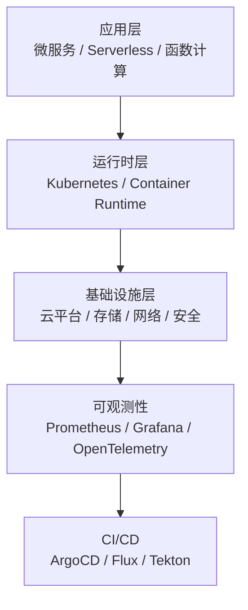
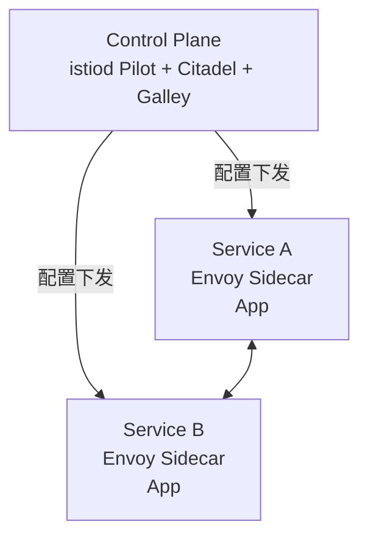
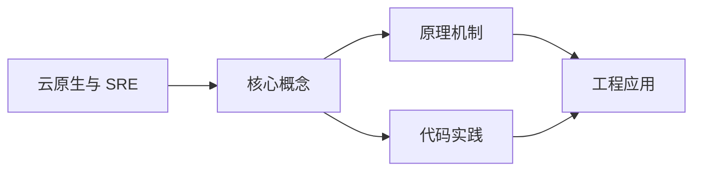
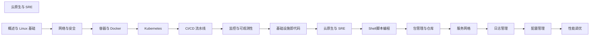

## 1. 学习目标（Bloom 分类）

本节按照布鲁姆教育目标分类学组织学习路径。本文主题为《云原生与 SRE》，属于 DevOps 模块，读者可以根据自身阶段选择阅读深度。

记忆层面：能够准确复述本文的核心概念、术语与基本语法或操作步骤，并能够在提问或检索时快速定位对应知识点。能够说出 DevOps 的核心概念、组件与标准流程。

理解层面：能够用自己的语言解释核心原理与工作机制，说明概念之间的因果关系，而不是机械记忆结论。能够解释 DevOps 的工作原理与关键机制。

应用层面：能够在真实项目或练习场景中运用本文知识解决具体问题，写出正确且可维护的实现。能够执行 DevOps 相关的标准操作与配置。

分析层面：能够拆解复杂问题，比较本文主题与相邻概念的异同，识别边界条件与例外情况。能够分析 DevOps 方案在可靠性、成本与性能上的权衡。

评价层面：能够根据约束条件（性能、可读性、安全、成本）评价不同方案的优劣，做出有依据的技术决策。能够评价 DevOps 中的技术选型。

创造层面：能够把本文知识与其他模块知识组合，设计出新的解决方案或可复用的工程模式。能够设计基于 DevOps 的完整解决方案。

通过本节学习，读者应当能够把《云原生与 SRE》纳入自己的知识网络，并与 DevOps 模块的其他主题（CI/CD、容器、编排、监控、GitOps）建立关联。

## 2. 历史动机与发展脉络

《云原生与 SRE》是 DevOps 领域的重要主题。要真正理解它，需要先了解它解决的问题与演进过程。

DevOps 源于 2009 年（“DevOpsDays”），核心是打破开发与运维壁垒，用自动化与协作缩短交付周期；CALMS 文化（文化、自动化、精益、度量、共享）是其框架。
技术栈演进：持续集成（CI）与持续交付（CD）、基础设施即代码（IaC）、容器（Docker）与编排（Kubernetes）、可观测性（监控/日志/追踪）。
2020 年代趋势：GitOps（声明式 + 自动同步）、平台工程（内部开发者平台）、FinOps（成本治理）、AI 辅助运维。

回到本文主题：云原生与 SRE 的提出与成熟，正是上述技术背景下的必然产物。早期实现往往以简单可用为目标，随着工程规模扩大，社区逐渐沉淀出标准做法与最佳实践；理解这一脉络，可以帮助读者判断“为什么文档中的推荐写法是现在这个样子”，也能在遇到历史遗留代码时准确识别其设计年代与取舍。


## 3. 形式化定义与核心概念精讲

本节把《云原生与 SRE》涉及的核心概念以“定义 + 讲解”的形式展开。读者应把定义当作工具，把讲解当作理解路径；两者结合才能形成可迁移的知识。

CI/CD 管线：代码提交 -> 构建 -> 测试 -> 制品 -> 部署；流水线即代码（GitHub Actions/Jenkins/GitLab CI）。
容器与镜像：OCI 规范、Dockerfile 分层、镜像仓库与签名；容器隔离（cgroup/namespace）。
编排：Kubernetes 的 Pod/Deployment/Service 抽象；声明式期望状态与控制器调和。

### 3.1 原文章节逐一精讲

原文档把主题拆分为 17 个小节，下面按顺序给出每一节的导读讲解，随后保留原文细节供精读。

#### 原文精读（完整保留）


#### 1. 云原生架构

##### 1.1 CNCF 云原生定义

云原生技术使组织能够在公有云、私有云和混合云等现代动态环境中构建和运行可扩展的应用。核心要素：

| 要素               | 描述                     |
| :----------------- | :----------------------- |
| **微服务**         | 应用拆分为独立部署的服务 |
| **容器**           | 应用打包和运行的标准     |
| **服务网格**       | 服务间通信的基础设施层   |
| **不可变基础设施** | 替换而非修改             |
| **声明式 API**     | 描述期望状态             |

##### 1.2 CNCF 技术栈



#### 2. 12-Factor App

##### 2.1 十二因素

| #   | 因素               | 描述                       | 示例                           |
| :-- | :----------------- | :------------------------- | :----------------------------- |
| 1   | **代码库**         | 单一代码库，多次部署       | Git 仓库                       |
| 2   | **依赖**           | 显式声明并隔离依赖         | package.json, requirements.txt |
| 3   | **配置**           | 在环境中存储配置           | 环境变量、ConfigMap            |
| 4   | **后端服务**       | 把后端服务当作附加资源     | 数据库、缓存、消息队列         |
| 5   | **构建/发布/运行** | 严格分离构建和运行         | CI/CD 流水线                   |
| 6   | **进程**           | 无状态进程                 | 会话存 Redis                   |
| 7   | **端口绑定**       | 通过端口绑定提供服务       | Web 服务器自包含               |
| 8   | **并发**           | 通过进程模型扩展           | 水平扩展 Pod                   |
| 9   | **易处理**         | 快速启动和优雅终止         | 健康检查、信号处理             |
| 10  | **开发/生产一致**  | 尽可能保持环境一致         | 相同 Docker 镜像               |
| 11  | **日志**           | 将日志视为事件流           | stdout → 日志收集器            |
| 12  | **管理进程**       | 一次性管理进程与应用同环境 | K8s Job/CronJob                |

##### 2.2 配置管理示例

```python
#  硬编码配置
DATABASE_URL = "postgresql://admin:password@db:5432/prod"

#  环境变量配置
import os
from pydantic_settings import BaseSettings

class Settings(BaseSettings):
    database_url: str
    redis_url: str
    secret_key: str
    debug: bool = False
    max_workers: int = 4

    class Config:
        env_file = ".env"

settings = Settings()
```

#### 3. 微服务治理

##### 3.1 微服务通信模式

| 模式          | 描述             | 优点       | 缺点           |
| :------------ | :--------------- | :--------- | :------------- |
| **同步 REST** | HTTP 请求/响应   | 简单直观   | 耦合、级联故障 |
| **同步 gRPC** | Protocol Buffers | 高性能     | 需要定义 proto |
| **异步消息**  | 消息队列         | 解耦、削峰 | 复杂性增加     |
| **事件驱动**  | 事件总线         | 最终一致性 | 调试困难       |

##### 3.2 服务发现与负载均衡

```yaml
# Kubernetes Service（内置服务发现）
apiVersion: v1
kind: Service
metadata:
  name: user-service
spec:
  selector:
    app: user-service
  ports:
    - port: 80
      targetPort: 8080

# 应用内通过 DNS 访问
# http://user-service.default.svc.cluster.local
```

##### 3.3 熔断与限流

```python
# 熔断器模式
from circuitbreaker import circuit

@circuit(failure_threshold=5, recovery_timeout=30)
def call_external_service():
    response = requests.get("http://external-service/api")
    return response.json()

# 限流
from fastapi import FastAPI, Request
from slowapi import Limiter
from slowapi.util import get_remote_address

app = FastAPI()
limiter = Limiter(key_func=get_remote_address)

@app.get("/api/data")
@limiter.limit("100/minute")
async def get_data(request: Request):
    return {"data": "value"}
```

#### 4. 服务网格（Istio）

##### 4.1 Istio 架构



##### 4.2 流量管理

```yaml
# 虚拟服务 - 金丝雀路由
apiVersion: networking.istio.io/v1beta1
kind: VirtualService
metadata:
  name: web-service
spec:
  hosts:
    - web-service
  http:
    - match:
        - headers:
            x-canary:
              exact: 'true'
      route:
        - destination:
            host: web-service
            subset: canary
    - route:
        - destination:
            host: web-service
            subset: stable
          weight: 90
        - destination:
            host: web-service
            subset: canary
          weight: 10

---
# 目标规则
apiVersion: networking.istio.io/v1beta1
kind: DestinationRule
metadata:
  name: web-service
spec:
  host: web-service
  trafficPolicy:
    connectionPool:
      tcp:
        maxConnections: 100
      http:
        h2UpgradePolicy: DEFAULT
        http1MaxPendingRequests: 100
        http2MaxRequests: 100
  subsets:
    - name: stable
      labels:
        version: v1
    - name: canary
      labels:
        version: v2
```

##### 4.3 可观测性

```yaml
# Telemetry 配置
apiVersion: telemetry.istio.io/v1alpha1
kind: Telemetry
metadata:
  name: default
spec:
  accessLogging:
    - providers:
        - name: otel
  tracing:
    - providers:
        - name: otel
      randomSamplingPercentage: 10
  metrics:
    - providers:
        - name: prometheus
```

#### 5. 混沌工程

##### 5.1 混沌工程原则

| 原则         | 描述                       |
| :----------- | :------------------------- |
| **定义稳态** | 建立系统的正常行为基线     |
| **假设稳态** | 假设控制组和实验组行为一致 |
| **引入故障** | 模拟真实世界的故障         |
| **观察差异** | 对比稳态假设和实际结果     |

##### 5.2 Chaos Mesh

```yaml
# Pod 故障注入
apiVersion: chaos-mesh.org/v1delta1
kind: PodChaos
metadata:
  name: pod-kill
  namespace: chaos-testing
spec:
  action: pod-kill
  mode: one
  selector:
    namespaces:
      - production
    labelSelectors:
      app: web
  scheduler:
    cron: '@every 30m'

---
# 网络延迟
apiVersion: chaos-mesh.org/v1delta1
kind: NetworkChaos
metadata:
  name: network-delay
spec:
  action: delay
  mode: all
  selector:
    namespaces:
      - production
    labelSelectors:
      app: api
  delay:
    latency: '100ms'
    correlation: '25'
    jitter: '50ms'
  duration: '5m'

---
# CPU 压力
apiVersion: chaos-mesh.org/v1delta1
kind: StressChaos
metadata:
  name: cpu-stress
spec:
  mode: one
  selector:
    labelSelectors:
      app: web
  stressors:
    cpu:
      workers: 2
      load: 80
  duration: '3m'
```

##### 5.3 混沌实验流程

```
1. 定义稳态指标 → 2. 设计故障场景 → 3. 在测试环境执行
    → 4. 观察系统行为 → 5. 记录发现 → 6. 修复问题
    → 7. 逐步在生产环境执行
```

#### 6. 容量规划

##### 6.1 容量指标

| 指标           | 描述           | 计算方法     |
| :------------- | :------------- | :----------- |
| **QPS**        | 每秒请求数     | 监控统计     |
| **资源利用率** | CPU/内存使用率 | Prometheus   |
| **增长趋势**   | 流量增长预测   | 历史数据拟合 |
| **峰值倍数**   | 峰值/均值      | 监控统计     |

##### 6.2 容量计算

```
所需 Pod 数 = (目标 QPS × 安全系数) / 单 Pod QPS
所需 Node 数 = (所需 Pod 数 + 缓冲) / 单 Node Pod 数

示例:
- 目标 QPS: 10,000
- 安全系数: 1.5
- 单 Pod QPS: 500
- 缓冲: 20%

所需 Pod = (10000 × 1.5) / 500 = 30
所需 Node = (30 × 1.2) / 10 = 4
```

#### 7. 故障复盘

##### 7.1 复盘模板

```markdown
# 故障复盘报告

#### 基本信息

- **故障时间**: 2026-06-14 14:30 - 15:15 (45分钟)
- **影响范围**: 用户服务 API 不可用
- **影响程度**: 30% 用户受影响
- **SLO 违规**: 是 (可用性低于 99.9%)

#### 时间线

- 14:30 - 告警触发：API 错误率上升
- 14:32 - 值班确认：数据库连接池耗尽
- 14:35 - 尝试扩容数据库
- 14:45 - 扩容完成，服务恢复
- 15:00 - 确认所有服务正常
- 15:15 - 告警解除

#### 根因分析（5-Why）

1. 为什么 API 不可用？→ 数据库连接池耗尽
2. 为什么连接池耗尽？→ 慢查询阻塞连接
3. 为什么有慢查询？→ 缺少索引的全表扫描
4. 为什么缺少索引？→ 新功能上线未添加索引
5. 为什么未添加索引？→ 缺少数据库迁移审查流程

#### 改进措施

| 行动项             | 负责人    | 截止日期 | 优先级 |
| :----------------- | :-------- | :------- | :----- |
| 添加缺失索引       | DBA       | 06-15    | P0     |
| 数据库迁移审查流程 | Tech Lead | 06-20    | P1     |
| 连接池监控告警     | SRE       | 06-18    | P1     |
| 慢查询自动检测     | SRE       | 06-25    | P2     |
```

##### 7.2 复盘原则

| 原则         | 描述                       |
| :----------- | :------------------------- |
| **无指责**   | 关注系统和流程，不追究个人 |
| **数据驱动** | 用数据和事实说话           |
| **可执行**   | 改进措施必须具体、可执行   |
| **跟踪**     | 行动项必须有人跟进         |

#### 8. On-Call 实践

##### 8.1 On-Call 轮值

```yaml
# PagerDuty / OpsGenie 配置
schedules:
  - name: primary-oncall
    rotation: weekly
    members: [sre1, sre2, sre3, sre4]
    handoff_time: '09:00'
    timezone: 'Asia/Shanghai'

  - name: secondary-oncall
    rotation: weekly
    members: [dev1, dev2, dev3, dev4]

escalation_policies:
  - name: critical-alert
    rules:
      - target: primary-oncall
        delay: 5m
      - target: secondary-oncall
        delay: 15m
      - target: engineering-manager
        delay: 30m
```

##### 8.2 On-Call 最佳实践

| 实践         | 描述                     |
| :----------- | :----------------------- |
| **轮值公平** | 轮值分配均衡，避免疲劳   |
| **升级机制** | 明确升级路径和超时       |
| **告警降噪** | 减少无效告警，提高信噪比 |
| **Runbook**  | 每个告警有对应的处理手册 |
| **复盘改进** | 每次值班后复盘改进       |
| **补偿机制** | 值班补偿或调休           |

##### 8.3 Runbook 模板

```markdown
# 告警: HighErrorRate

#### 告警条件

API 5xx 错误率 > 5%，持续 5 分钟

#### 快速诊断

1. 检查最近部署: `kubectl rollout history deployment/web`
2. 查看错误日志: `kubectl logs -l app=web --since=10m | grep 500`
3. 检查依赖服务: `kubectl get pods -A | grep -v Running`

#### 常见原因与处理

| 原因         | 处理方法                                                |
| :----------- | :------------------------------------------------------ |
| 新版本 Bug   | 回滚: `kubectl rollout undo deployment/web`             |
| 数据库超载   | 扩容: `kubectl scale statefulset/postgres --replicas=3` |
| 下游服务故障 | 熔断: 修改 VirtualService 路由                          |

#### 升级

- 联系后端负责人: @backend-oncall
- 联系 DBA: @dba-oncall
```

#### 9. 小结

云原生与 SRE 是现代运维的高级实践：

1. **12-Factor App** 是云原生应用的设计原则，配置外置和无状态是核心
2. **服务网格**（Istio）将流量管理、安全和可观测性下沉到基础设施层
3. **混沌工程**主动发现系统弱点，是提高可靠性的有效手段
4. **故障复盘**遵循无指责原则，关注系统和流程改进
5. **On-Call** 需要完善的轮值、升级和 Runbook 机制
6. **容量规划**基于数据预测，避免资源不足或浪费


### 3.2 概念关系图

下面用 Mermaid 图表达本文核心概念之间的关系，帮助读者建立整体图景：



图中展示的是本文知识的结构化关系：核心概念是入口，原理机制解释“为什么”，代码实践演示“怎么做”，工程应用回答“何时用”。读者学习时可以把每个小节的内容挂接到对应节点上。

## 4. 理论推导与原理解析

本节深入《云原生与 SRE》背后的原理。理论部分不求面面俱到，而是聚焦“能解释现象、能指导实践”的关键推导。

CI/CD 管线：代码提交 -> 构建 -> 测试 -> 制品 -> 部署；流水线即代码（GitHub Actions/Jenkins/GitLab CI）。
容器与镜像：OCI 规范、Dockerfile 分层、镜像仓库与签名；容器隔离（cgroup/namespace）。
编排：Kubernetes 的 Pod/Deployment/Service 抽象；声明式期望状态与控制器调和。
可观测性三支柱：指标（Prometheus）、日志（Loki/ELK）、追踪（OpenTelemetry）。

需要强调的是，理论推导与工程实践之间存在翻译层：理论给出的是理想化模型与边界条件，工程代码则必须处理真实环境中的例外。读者在学习时应先掌握理论的“标准情形”，再通过陷阱章节了解“非标准情形”。

## 5. 代码示例与逐行讲解

本节把原文中的代码示例系统整理，并为每个示例补充用途说明与讲解。读者不应只浏览代码，而应逐段对照讲解理解设计意图。

### 5.1 示例：1.2 CNCF 技术栈

该示例来自原文《1.2 CNCF 技术栈》小节，用于演示云原生与 SRE相关操作。阅读时请先看代码结构，再看其后的讲解。


讲解：这段代码演示了本节核心知识点。代码中的关键操作可以归纳为三步：准备（定义或初始化）、执行（核心逻辑）、收尾（释放资源或返回结果）。实际项目中，这三步往往被封装为函数或类，以提升复用性与可测试性。

关键点分析：

该示例共 5 行有效代码，结构以数据或配置为主。阅读时应关注：数据字段的含义、配置项的作用，以及它们与运行行为的对应关系。

进阶思考路径：先尝试修改参数观察行为变化，再把示例中的模式迁移到自己的项目中；每次修改都记录预期与实测差异，这是把示例转化为能力的最快方式。

### 5.2 示例：2.2 配置管理示例

该示例来自原文《2.2 配置管理示例》小节，用于演示云原生与 SRE相关操作。阅读时请先看代码结构，再看其后的讲解。

```python
#  硬编码配置
DATABASE_URL = "postgresql://admin:password@db:5432/prod"

#  环境变量配置
import os
from pydantic_settings import BaseSettings

class Settings(BaseSettings):
    database_url: str
    redis_url: str
    secret_key: str
    debug: bool = False
    max_workers: int = 4

    class Config:
        env_file = ".env"

settings = Settings()
```

讲解：这段代码演示了本节核心知识点。代码中的关键操作可以归纳为三步：准备（定义或初始化）、执行（核心逻辑）、收尾（释放资源或返回结果）。实际项目中，这三步往往被封装为函数或类，以提升复用性与可测试性。

关键点分析：

该示例共 14 行有效代码，包含 3 类关键结构（class、import、from）。其中：

- 入口与初始化部分负责建立上下文，对应实际项目中的启动或装配逻辑；
- 核心逻辑部分体现本文主题的主要操作，是阅读时最需要对照讲解理解的部分；
- 输出或返回部分把结果交给调用方，注意其类型与边界条件。

进阶思考路径：先尝试修改参数观察行为变化，再把示例中的模式迁移到自己的项目中；每次修改都记录预期与实测差异，这是把示例转化为能力的最快方式。

### 5.3 示例：3.2 服务发现与负载均衡

该示例来自原文《3.2 服务发现与负载均衡》小节，用于演示云原生与 SRE相关操作。阅读时请先看代码结构，再看其后的讲解。

```yaml
# Kubernetes Service（内置服务发现）
apiVersion: v1
kind: Service
metadata:
  name: user-service
spec:
  selector:
    app: user-service
  ports:
    - port: 80
      targetPort: 8080

# 应用内通过 DNS 访问
# http://user-service.default.svc.cluster.local
```

讲解：这段代码演示了本节核心知识点。代码中的关键操作可以归纳为三步：准备（定义或初始化）、执行（核心逻辑）、收尾（释放资源或返回结果）。实际项目中，这三步往往被封装为函数或类，以提升复用性与可测试性。

关键点分析：

该示例共 13 行有效代码，包含 1 类关键结构（apiVersion）。其中：

- 入口与初始化部分负责建立上下文，对应实际项目中的启动或装配逻辑；
- 核心逻辑部分体现本文主题的主要操作，是阅读时最需要对照讲解理解的部分；
- 输出或返回部分把结果交给调用方，注意其类型与边界条件。

进阶思考路径：先尝试修改参数观察行为变化，再把示例中的模式迁移到自己的项目中；每次修改都记录预期与实测差异，这是把示例转化为能力的最快方式。

### 5.4 示例：3.3 熔断与限流

该示例来自原文《3.3 熔断与限流》小节，用于演示云原生与 SRE相关操作。阅读时请先看代码结构，再看其后的讲解。

```python
# 熔断器模式
from circuitbreaker import circuit

@circuit(failure_threshold=5, recovery_timeout=30)
def call_external_service():
    response = requests.get("http://external-service/api")
    return response.json()

# 限流
from fastapi import FastAPI, Request
from slowapi import Limiter
from slowapi.util import get_remote_address

app = FastAPI()
limiter = Limiter(key_func=get_remote_address)

@app.get("/api/data")
@limiter.limit("100/minute")
async def get_data(request: Request):
    return {"data": "value"}
```

讲解：这段代码演示了本节核心知识点。代码中的关键操作可以归纳为三步：准备（定义或初始化）、执行（核心逻辑）、收尾（释放资源或返回结果）。实际项目中，这三步往往被封装为函数或类，以提升复用性与可测试性。

关键点分析：

该示例共 16 行有效代码，包含 4 类关键结构（def、import、from、return）。其中：

- 入口与初始化部分负责建立上下文，对应实际项目中的启动或装配逻辑；
- 核心逻辑部分体现本文主题的主要操作，是阅读时最需要对照讲解理解的部分；
- 输出或返回部分把结果交给调用方，注意其类型与边界条件。

进阶思考路径：先尝试修改参数观察行为变化，再把示例中的模式迁移到自己的项目中；每次修改都记录预期与实测差异，这是把示例转化为能力的最快方式。

### 5.5 示例：4.1 Istio 架构

该示例来自原文《4.1 Istio 架构》小节，用于演示云原生与 SRE相关操作。阅读时请先看代码结构，再看其后的讲解。


讲解：这段代码演示了本节核心知识点。代码中的关键操作可以归纳为三步：准备（定义或初始化）、执行（核心逻辑）、收尾（释放资源或返回结果）。实际项目中，这三步往往被封装为函数或类，以提升复用性与可测试性。

关键点分析：

该示例共 7 行有效代码，结构以数据或配置为主。阅读时应关注：数据字段的含义、配置项的作用，以及它们与运行行为的对应关系。

进阶思考路径：先尝试修改参数观察行为变化，再把示例中的模式迁移到自己的项目中；每次修改都记录预期与实测差异，这是把示例转化为能力的最快方式。

### 5.6 示例：4.2 流量管理

该示例来自原文《4.2 流量管理》小节，用于演示云原生与 SRE相关操作。阅读时请先看代码结构，再看其后的讲解。

```yaml
# 虚拟服务 - 金丝雀路由
apiVersion: networking.istio.io/v1beta1
kind: VirtualService
metadata:
  name: web-service
spec:
  hosts:
    - web-service
  http:
    - match:
        - headers:
            x-canary:
              exact: 'true'
      route:
        - destination:
            host: web-service
            subset: canary
    - route:
        - destination:
            host: web-service
            subset: stable
          weight: 90
        - destination:
            host: web-service
            subset: canary
          weight: 10

---
# 目标规则
apiVersion: networking.istio.io/v1beta1
kind: DestinationRule
metadata:
  name: web-service
spec:
  host: web-service
  trafficPolicy:
    connectionPool:
      tcp:
        maxConnections: 100
      http:
        h2UpgradePolicy: DEFAULT
        http1MaxPendingRequests: 100
        http2MaxRequests: 100
  subsets:
    - name: stable
      labels:
        version: v1
    - name: canary
      labels:
        version: v2
```

讲解：这段代码演示了本节核心知识点。代码中的关键操作可以归纳为三步：准备（定义或初始化）、执行（核心逻辑）、收尾（释放资源或返回结果）。实际项目中，这三步往往被封装为函数或类，以提升复用性与可测试性。

关键点分析：

该示例共 49 行有效代码，包含 1 类关键结构（apiVersion）。其中：

- 入口与初始化部分负责建立上下文，对应实际项目中的启动或装配逻辑；
- 核心逻辑部分体现本文主题的主要操作，是阅读时最需要对照讲解理解的部分；
- 输出或返回部分把结果交给调用方，注意其类型与边界条件。

进阶思考路径：先尝试修改参数观察行为变化，再把示例中的模式迁移到自己的项目中；每次修改都记录预期与实测差异，这是把示例转化为能力的最快方式。

### 5.7 示例：4.3 可观测性

该示例来自原文《4.3 可观测性》小节，用于演示云原生与 SRE相关操作。阅读时请先看代码结构，再看其后的讲解。

```yaml
# Telemetry 配置
apiVersion: telemetry.istio.io/v1alpha1
kind: Telemetry
metadata:
  name: default
spec:
  accessLogging:
    - providers:
        - name: otel
  tracing:
    - providers:
        - name: otel
      randomSamplingPercentage: 10
  metrics:
    - providers:
        - name: prometheus
```

讲解：这段代码演示了本节核心知识点。代码中的关键操作可以归纳为三步：准备（定义或初始化）、执行（核心逻辑）、收尾（释放资源或返回结果）。实际项目中，这三步往往被封装为函数或类，以提升复用性与可测试性。

关键点分析：

该示例共 16 行有效代码，包含 1 类关键结构（apiVersion）。其中：

- 入口与初始化部分负责建立上下文，对应实际项目中的启动或装配逻辑；
- 核心逻辑部分体现本文主题的主要操作，是阅读时最需要对照讲解理解的部分；
- 输出或返回部分把结果交给调用方，注意其类型与边界条件。

进阶思考路径：先尝试修改参数观察行为变化，再把示例中的模式迁移到自己的项目中；每次修改都记录预期与实测差异，这是把示例转化为能力的最快方式。

### 5.8 示例：5.2 Chaos Mesh

该示例来自原文《5.2 Chaos Mesh》小节，用于演示云原生与 SRE相关操作。阅读时请先看代码结构，再看其后的讲解。

```yaml
# Pod 故障注入
apiVersion: chaos-mesh.org/v1delta1
kind: PodChaos
metadata:
  name: pod-kill
  namespace: chaos-testing
spec:
  action: pod-kill
  mode: one
  selector:
    namespaces:
      - production
    labelSelectors:
      app: web
  scheduler:
    cron: '@every 30m'

---
# 网络延迟
apiVersion: chaos-mesh.org/v1delta1
kind: NetworkChaos
metadata:
  name: network-delay
spec:
  action: delay
  mode: all
  selector:
    namespaces:
      - production
    labelSelectors:
      app: api
  delay:
    latency: '100ms'
    correlation: '25'
    jitter: '50ms'
  duration: '5m'

---
# CPU 压力
apiVersion: chaos-mesh.org/v1delta1
kind: StressChaos
metadata:
  name: cpu-stress
spec:
  mode: one
  selector:
    labelSelectors:
      app: web
  stressors:
    cpu:
      workers: 2
      load: 80
  duration: '3m'
```

讲解：这段代码演示了本节核心知识点。代码中的关键操作可以归纳为三步：准备（定义或初始化）、执行（核心逻辑）、收尾（释放资源或返回结果）。实际项目中，这三步往往被封装为函数或类，以提升复用性与可测试性。

关键点分析：

该示例共 51 行有效代码，包含 1 类关键结构（apiVersion）。其中：

- 入口与初始化部分负责建立上下文，对应实际项目中的启动或装配逻辑；
- 核心逻辑部分体现本文主题的主要操作，是阅读时最需要对照讲解理解的部分；
- 输出或返回部分把结果交给调用方，注意其类型与边界条件。

进阶思考路径：先尝试修改参数观察行为变化，再把示例中的模式迁移到自己的项目中；每次修改都记录预期与实测差异，这是把示例转化为能力的最快方式。

### 5.9 示例：5.3 混沌实验流程

该示例来自原文《5.3 混沌实验流程》小节，用于演示云原生与 SRE相关操作。阅读时请先看代码结构，再看其后的讲解。

```text
1. 定义稳态指标 → 2. 设计故障场景 → 3. 在测试环境执行
    → 4. 观察系统行为 → 5. 记录发现 → 6. 修复问题
    → 7. 逐步在生产环境执行
```

讲解：这段代码演示了本节核心知识点。代码中的关键操作可以归纳为三步：准备（定义或初始化）、执行（核心逻辑）、收尾（释放资源或返回结果）。实际项目中，这三步往往被封装为函数或类，以提升复用性与可测试性。

关键点分析：

该示例共 3 行有效代码，结构以数据或配置为主。阅读时应关注：数据字段的含义、配置项的作用，以及它们与运行行为的对应关系。

进阶思考路径：先尝试修改参数观察行为变化，再把示例中的模式迁移到自己的项目中；每次修改都记录预期与实测差异，这是把示例转化为能力的最快方式。

### 5.10 示例：6.2 容量计算

该示例来自原文《6.2 容量计算》小节，用于演示云原生与 SRE相关操作。阅读时请先看代码结构，再看其后的讲解。

```text
所需 Pod 数 = (目标 QPS × 安全系数) / 单 Pod QPS
所需 Node 数 = (所需 Pod 数 + 缓冲) / 单 Node Pod 数

示例:
- 目标 QPS: 10,000
- 安全系数: 1.5
- 单 Pod QPS: 500
- 缓冲: 20%

所需 Pod = (10000 × 1.5) / 500 = 30
所需 Node = (30 × 1.2) / 10 = 4
```

讲解：这段代码演示了本节核心知识点。代码中的关键操作可以归纳为三步：准备（定义或初始化）、执行（核心逻辑）、收尾（释放资源或返回结果）。实际项目中，这三步往往被封装为函数或类，以提升复用性与可测试性。

关键点分析：

该示例共 9 行有效代码，结构以数据或配置为主。阅读时应关注：数据字段的含义、配置项的作用，以及它们与运行行为的对应关系。

进阶思考路径：先尝试修改参数观察行为变化，再把示例中的模式迁移到自己的项目中；每次修改都记录预期与实测差异，这是把示例转化为能力的最快方式。

### 5.11 示例：7.1 复盘模板

该示例来自原文《7.1 复盘模板》小节，用于演示云原生与 SRE相关操作。阅读时请先看代码结构，再看其后的讲解。

```markdown
# 故障复盘报告

## 基本信息

- **故障时间**: 2026-06-14 14:30 - 15:15 (45分钟)
- **影响范围**: 用户服务 API 不可用
- **影响程度**: 30% 用户受影响
- **SLO 违规**: 是 (可用性低于 99.9%)

## 时间线

- 14:30 - 告警触发：API 错误率上升
- 14:32 - 值班确认：数据库连接池耗尽
- 14:35 - 尝试扩容数据库
- 14:45 - 扩容完成，服务恢复
- 15:00 - 确认所有服务正常
- 15:15 - 告警解除

## 根因分析（5-Why）

1. 为什么 API 不可用？→ 数据库连接池耗尽
2. 为什么连接池耗尽？→ 慢查询阻塞连接
3. 为什么有慢查询？→ 缺少索引的全表扫描
4. 为什么缺少索引？→ 新功能上线未添加索引
5. 为什么未添加索引？→ 缺少数据库迁移审查流程

## 改进措施

| 行动项             | 负责人    | 截止日期 | 优先级 |
| :----------------- | :-------- | :------- | :----- |
| 添加缺失索引       | DBA       | 06-15    | P0     |
| 数据库迁移审查流程 | Tech Lead | 06-20    | P1     |
| 连接池监控告警     | SRE       | 06-18    | P1     |
| 慢查询自动检测     | SRE       | 06-25    | P2     |
```

讲解：这段代码演示了本节核心知识点。代码中的关键操作可以归纳为三步：准备（定义或初始化）、执行（核心逻辑）、收尾（释放资源或返回结果）。实际项目中，这三步往往被封装为函数或类，以提升复用性与可测试性。

关键点分析：

该示例共 26 行有效代码，结构以数据或配置为主。阅读时应关注：数据字段的含义、配置项的作用，以及它们与运行行为的对应关系。

进阶思考路径：先尝试修改参数观察行为变化，再把示例中的模式迁移到自己的项目中；每次修改都记录预期与实测差异，这是把示例转化为能力的最快方式。

### 5.12 示例：8.1 On-Call 轮值

该示例来自原文《8.1 On-Call 轮值》小节，用于演示云原生与 SRE相关操作。阅读时请先看代码结构，再看其后的讲解。

```yaml
# PagerDuty / OpsGenie 配置
schedules:
  - name: primary-oncall
    rotation: weekly
    members: [sre1, sre2, sre3, sre4]
    handoff_time: '09:00'
    timezone: 'Asia/Shanghai'

  - name: secondary-oncall
    rotation: weekly
    members: [dev1, dev2, dev3, dev4]

escalation_policies:
  - name: critical-alert
    rules:
      - target: primary-oncall
        delay: 5m
      - target: secondary-oncall
        delay: 15m
      - target: engineering-manager
        delay: 30m
```

讲解：这段代码演示了本节核心知识点。代码中的关键操作可以归纳为三步：准备（定义或初始化）、执行（核心逻辑）、收尾（释放资源或返回结果）。实际项目中，这三步往往被封装为函数或类，以提升复用性与可测试性。

关键点分析：

该示例共 19 行有效代码，结构以数据或配置为主。阅读时应关注：数据字段的含义、配置项的作用，以及它们与运行行为的对应关系。

进阶思考路径：先尝试修改参数观察行为变化，再把示例中的模式迁移到自己的项目中；每次修改都记录预期与实测差异，这是把示例转化为能力的最快方式。

### 5.13 示例：8.3 Runbook 模板

该示例来自原文《8.3 Runbook 模板》小节，用于演示云原生与 SRE相关操作。阅读时请先看代码结构，再看其后的讲解。

```markdown
# 告警: HighErrorRate

## 告警条件

API 5xx 错误率 > 5%，持续 5 分钟

## 快速诊断

1. 检查最近部署: `kubectl rollout history deployment/web`
2. 查看错误日志: `kubectl logs -l app=web --since=10m | grep 500`
3. 检查依赖服务: `kubectl get pods -A | grep -v Running`

## 常见原因与处理

| 原因         | 处理方法                                                |
| :----------- | :------------------------------------------------------ |
| 新版本 Bug   | 回滚: `kubectl rollout undo deployment/web`             |
| 数据库超载   | 扩容: `kubectl scale statefulset/postgres --replicas=3` |
| 下游服务故障 | 熔断: 修改 VirtualService 路由                          |

## 升级

- 联系后端负责人: @backend-oncall
- 联系 DBA: @dba-oncall
```

讲解：这段代码演示了本节核心知识点。代码中的关键操作可以归纳为三步：准备（定义或初始化）、执行（核心逻辑）、收尾（释放资源或返回结果）。实际项目中，这三步往往被封装为函数或类，以提升复用性与可测试性。

关键点分析：

该示例共 16 行有效代码，结构以数据或配置为主。阅读时应关注：数据字段的含义、配置项的作用，以及它们与运行行为的对应关系。

进阶思考路径：先尝试修改参数观察行为变化，再把示例中的模式迁移到自己的项目中；每次修改都记录预期与实测差异，这是把示例转化为能力的最快方式。


综合以上示例，可以总结出本主题的代码实践要点：第一，先定义清晰的输入输出契约；第二，核心逻辑保持单一职责；第三，错误处理与边界条件不可省略；第四，命名与注释表达意图而非复述代码。

## 6. 对比分析

对比是理解《云原生与 SRE》定位的最快路径。下面从多个维度与相邻方案进行对比。

CI 与 CD：CI 保证可集成，CD 保证可交付；两者可独立实施。
Kubernetes 与 Docker Compose：K8s 生产级编排；Compose 单机开发。
传统运维与 SRE：SRE 用软件工程方法运维，错误预算与 SLO。

对比的目的不是分出绝对优劣，而是建立选择依据：不同约束条件下，最优解不同。读者应把每个对比维度转化为决策检查清单。

## 7. 常见陷阱与最佳实践

本节整理该主题的高频错误与推荐做法。每个陷阱先描述现象，再解释原因，最后给出最佳实践。

### 7.1 环境漂移

手工配置导致环境不一致。全部走 IaC 与镜像。

深入讲解：该问题之所以被归类为“常见陷阱”，是因为它在初学者的代码中反复出现，而且往往不在第一时间暴露——错误通常隐藏在特定数据或特定时序下。

从成因上看，环境漂移 一般源于对 DevOps 某个机制的理解偏差：要么误用了默认行为，要么忽略了边界条件，要么把其他语言的思维惯性带了过来。

从影响上看，环境漂移 轻则产生错误结果，重则导致资源泄漏、数据损坏或安全事故；这也是为什么工程评审中会把它列为检查项。

从修复策略上看，处理环境漂移的正确顺序是：先复现（构造最小用例），再定位（确认机制层面的根因），最后修复并补充回归测试。跳过复现直接改代码，往往治标不治本。

### 7.2 秘密硬编码

密钥进仓库。使用 Secret 管理与注入。

深入讲解：该问题之所以被归类为“常见陷阱”，是因为它在初学者的代码中反复出现，而且往往不在第一时间暴露——错误通常隐藏在特定数据或特定时序下。

从成因上看，秘密硬编码 一般源于对 DevOps 某个机制的理解偏差：要么误用了默认行为，要么忽略了边界条件，要么把其他语言的思维惯性带了过来。

从影响上看，秘密硬编码 轻则产生错误结果，重则导致资源泄漏、数据损坏或安全事故；这也是为什么工程评审中会把它列为检查项。

从修复策略上看，处理秘密硬编码的正确顺序是：先复现（构造最小用例），再定位（确认机制层面的根因），最后修复并补充回归测试。跳过复现直接改代码，往往治标不治本。

### 7.3 构建不可复现

依赖未锁定。锁定依赖版本与基础镜像 digest。

深入讲解：该问题之所以被归类为“常见陷阱”，是因为它在初学者的代码中反复出现，而且往往不在第一时间暴露——错误通常隐藏在特定数据或特定时序下。

从成因上看，构建不可复现 一般源于对 DevOps 某个机制的理解偏差：要么误用了默认行为，要么忽略了边界条件，要么把其他语言的思维惯性带了过来。

从影响上看，构建不可复现 轻则产生错误结果，重则导致资源泄漏、数据损坏或安全事故；这也是为什么工程评审中会把它列为检查项。

从修复策略上看，处理构建不可复现的正确顺序是：先复现（构造最小用例），再定位（确认机制层面的根因），最后修复并补充回归测试。跳过复现直接改代码，往往治标不治本。

### 7.4 测试后置

问题到生产才发现。左移：单元/集成/E2E 分层。

深入讲解：该问题之所以被归类为“常见陷阱”，是因为它在初学者的代码中反复出现，而且往往不在第一时间暴露——错误通常隐藏在特定数据或特定时序下。

从成因上看，测试后置 一般源于对 DevOps 某个机制的理解偏差：要么误用了默认行为，要么忽略了边界条件，要么把其他语言的思维惯性带了过来。

从影响上看，测试后置 轻则产生错误结果，重则导致资源泄漏、数据损坏或安全事故；这也是为什么工程评审中会把它列为检查项。

从修复策略上看，处理测试后置的正确顺序是：先复现（构造最小用例），再定位（确认机制层面的根因），最后修复并补充回归测试。跳过复现直接改代码，往往治标不治本。

### 7.5 回滚缺失

发布失败无法回退。保留历史镜像与一键回滚。

深入讲解：该问题之所以被归类为“常见陷阱”，是因为它在初学者的代码中反复出现，而且往往不在第一时间暴露——错误通常隐藏在特定数据或特定时序下。

从成因上看，回滚缺失 一般源于对 DevOps 某个机制的理解偏差：要么误用了默认行为，要么忽略了边界条件，要么把其他语言的思维惯性带了过来。

从影响上看，回滚缺失 轻则产生错误结果，重则导致资源泄漏、数据损坏或安全事故；这也是为什么工程评审中会把它列为检查项。

从修复策略上看，处理回滚缺失的正确顺序是：先复现（构造最小用例），再定位（确认机制层面的根因），最后修复并补充回归测试。跳过复现直接改代码，往往治标不治本。

### 7.6 监控盲区

无指标与告警。核心链路全量可观测。

深入讲解：该问题之所以被归类为“常见陷阱”，是因为它在初学者的代码中反复出现，而且往往不在第一时间暴露——错误通常隐藏在特定数据或特定时序下。

从成因上看，监控盲区 一般源于对 DevOps 某个机制的理解偏差：要么误用了默认行为，要么忽略了边界条件，要么把其他语言的思维惯性带了过来。

从影响上看，监控盲区 轻则产生错误结果，重则导致资源泄漏、数据损坏或安全事故；这也是为什么工程评审中会把它列为检查项。

从修复策略上看，处理监控盲区的正确顺序是：先复现（构造最小用例），再定位（确认机制层面的根因），最后修复并补充回归测试。跳过复现直接改代码，往往治标不治本。

### 7.7 权限过大

CI 权限超需求。最小权限与短期凭证。

深入讲解：该问题之所以被归类为“常见陷阱”，是因为它在初学者的代码中反复出现，而且往往不在第一时间暴露——错误通常隐藏在特定数据或特定时序下。

从成因上看，权限过大 一般源于对 DevOps 某个机制的理解偏差：要么误用了默认行为，要么忽略了边界条件，要么把其他语言的思维惯性带了过来。

从影响上看，权限过大 轻则产生错误结果，重则导致资源泄漏、数据损坏或安全事故；这也是为什么工程评审中会把它列为检查项。

从修复策略上看，处理权限过大的正确顺序是：先复现（构造最小用例），再定位（确认机制层面的根因），最后修复并补充回归测试。跳过复现直接改代码，往往治标不治本。

### 7.8 部署频率低

大爆炸发布风险高。小步快跑与灰度。

深入讲解：该问题之所以被归类为“常见陷阱”，是因为它在初学者的代码中反复出现，而且往往不在第一时间暴露——错误通常隐藏在特定数据或特定时序下。

从成因上看，部署频率低 一般源于对 DevOps 某个机制的理解偏差：要么误用了默认行为，要么忽略了边界条件，要么把其他语言的思维惯性带了过来。

从影响上看，部署频率低 轻则产生错误结果，重则导致资源泄漏、数据损坏或安全事故；这也是为什么工程评审中会把它列为检查项。

从修复策略上看，处理部署频率低的正确顺序是：先复现（构造最小用例），再定位（确认机制层面的根因），最后修复并补充回归测试。跳过复现直接改代码，往往治标不治本。

### 7.0 最佳实践总览

1. 一切皆代码：流水线、基础设施、配置版本化。
2. 发布可重复：相同代码 + 相同制品 -> 相同环境。
3. 失败可预期：小批量、金丝雀、自动回滚。
4. 度量驱动：DORA 指标（部署频率、变更前置时间、恢复时间、变更失败率）。

把这些最佳实践固化为团队规范与代码评审检查项，是避免同类问题反复出现的关键。

## 8. 工程实践

本节把《云原生与 SRE》放入真实工程场景，给出可复用的模式与组织方法。

GitHub Actions：workflow/job/step 模型，矩阵测试，环境与密钥管理。
GitOps：Argo CD 同步 Git 仓库与集群状态，PR 即发布审批。
平台工程：模板化应用脚手架（Backstage）、自助环境、成本可视化。

### 8.1 工程实践的原则拆解

以上工程实践可以归纳为四条原则。第一，配置与代码分离：DevOps 项目中环境差异应通过配置注入，而不是散落在代码分支中；这保证同一份代码可以在开发、测试、生产环境一致运行。

第二，接口稳定优先：对外接口（函数签名、协议、数据格式）一旦被消费方依赖，变更成本极高；设计时应预留扩展点并保持向后兼容。

第三，可观测性内置：日志、指标与追踪应该在功能开发时同步设计，而不是故障发生后补救；没有观测手段的模块等于黑盒。

第四，变更可回滚：任何发布都应有对应的回滚方案；数据库迁移、配置变更与代码发布一样需要版本管理与逆向路径。

### 8.2 实践落地的检查清单

- [ ] GitHub Actions：对照本节描述，检查当前项目是否已经落实；未落实的项列入技术债并排期处理。
- [ ] GitOps：对照本节描述，检查当前项目是否已经落实；未落实的项列入技术债并排期处理。
- [ ] 平台工程：对照本节描述，检查当前项目是否已经落实；未落实的项列入技术债并排期处理。

工程实践的共性原则：配置与代码分离、接口稳定优先、可观测性内置、变更可回滚。这些原则适用于本主题的所有实现。

## 9. 案例研究

本节通过一个完整案例把《云原生与 SRE》的知识串起来。案例按“需求分析、方案设计、实现、验证”四步展开。

需求：为微服务搭建从提交到生产的自动化管线。
方案：GitHub Actions 构建镜像 + 测试 + 扫描，Argo CD 部署到 K8s，Prometheus 监控。
要点：镜像 tag 用 commit SHA；金丝雀发布；回滚演练。
验证：发布频率与失败率度量、故障注入演练。

### 9.1 案例的扩展讨论

把案例中的方案放大到真实规模，需要额外考虑三个问题：

第一，规模：当数据量或并发量上升一个数量级时，原方案中的数据结构、缓存策略与任务调度是否仍然成立？通常需要引入分层与异步。

第二，团队：多人协作时，模块边界、接口契约与代码所有权必须明确；案例中的实现应拆分为可独立测试的单元，并配合文档说明设计意图。

第三，演进：上线后的需求变化不可避免；方案设计时应预留扩展点（配置化、插件化、事件化），并定期用真实指标验证假设。


案例研究的学习方法：先独立阅读需求，尝试在脑中形成方案，再对照实现与讲解，最后思考“如果约束变化（数据量、并发、团队规模），方案应如何调整”。

## 10. 知识要点总结与深入讲解

本节以讲解形式汇总全文要点，替代传统的习题与自测，读者不需要答题，只需跟随解释建立完整的认知框架。

关于《云原生与 SRE》的核心结论：

DevOps 的本质是自动化与协作，工具只是载体。
可重复、可回滚、可观测是三条主线。
从 DORA 指标开始度量改进，避免为工具而工具。

原文档各小节的要点回顾：

- 1. 云原生架构：该小节围绕云原生与 SRE展开具体细节，阅读时应关注其与核心结论的对应关系；每个小节都是核心结论在某一个侧面的展开。
- 2. 12-Factor App：该小节围绕云原生与 SRE展开具体细节，阅读时应关注其与核心结论的对应关系；每个小节都是核心结论在某一个侧面的展开。
- 3. 微服务治理：该小节围绕云原生与 SRE展开具体细节，阅读时应关注其与核心结论的对应关系；每个小节都是核心结论在某一个侧面的展开。
- 4. 服务网格（Istio）：该小节围绕云原生与 SRE展开具体细节，阅读时应关注其与核心结论的对应关系；每个小节都是核心结论在某一个侧面的展开。
- 5. 混沌工程：该小节围绕云原生与 SRE展开具体细节，阅读时应关注其与核心结论的对应关系；每个小节都是核心结论在某一个侧面的展开。
- 6. 容量规划：该小节围绕云原生与 SRE展开具体细节，阅读时应关注其与核心结论的对应关系；每个小节都是核心结论在某一个侧面的展开。
- 7. 故障复盘：该小节围绕云原生与 SRE展开具体细节，阅读时应关注其与核心结论的对应关系；每个小节都是核心结论在某一个侧面的展开。
- 基本信息：该小节围绕云原生与 SRE展开具体细节，阅读时应关注其与核心结论的对应关系；每个小节都是核心结论在某一个侧面的展开。
- 时间线：该小节围绕云原生与 SRE展开具体细节，阅读时应关注其与核心结论的对应关系；每个小节都是核心结论在某一个侧面的展开。
- 根因分析（5-Why）：该小节围绕云原生与 SRE展开具体细节，阅读时应关注其与核心结论的对应关系；每个小节都是核心结论在某一个侧面的展开。
- 改进措施：该小节围绕云原生与 SRE展开具体细节，阅读时应关注其与核心结论的对应关系；每个小节都是核心结论在某一个侧面的展开。
- 8. On-Call 实践：该小节围绕云原生与 SRE展开具体细节，阅读时应关注其与核心结论的对应关系；每个小节都是核心结论在某一个侧面的展开。
- 告警条件：该小节围绕云原生与 SRE展开具体细节，阅读时应关注其与核心结论的对应关系；每个小节都是核心结论在某一个侧面的展开。
- 快速诊断：该小节围绕云原生与 SRE展开具体细节，阅读时应关注其与核心结论的对应关系；每个小节都是核心结论在某一个侧面的展开。
- 常见原因与处理：该小节围绕云原生与 SRE展开具体细节，阅读时应关注其与核心结论的对应关系；每个小节都是核心结论在某一个侧面的展开。
- 升级：该小节围绕云原生与 SRE展开具体细节，阅读时应关注其与核心结论的对应关系；每个小节都是核心结论在某一个侧面的展开。
- 9. 小结：该小节围绕云原生与 SRE展开具体细节，阅读时应关注其与核心结论的对应关系；每个小节都是核心结论在某一个侧面的展开。

把以上要点与第 3-9 节的内容对照复习，即可完成对本文主题的闭环学习。

## 11. 参考文献


GitHub Actions 文档：https://docs.github.com/zh/actions
GitLab CI 文档：https://docs.gitlab.com/ci/
Argo CD：https://argo-cd.readthedocs.io/
DORA 研究：https://dora.dev/
DevOps 手册（Gene Kim 等）：https://itrevolution.com/devops-handbook/

## 12. 延伸阅读


Docker 与 Kubernetes 深入，见 031-devops 模块文档。
CI/CD 管线设计，见 031-devops 模块 CICD 文档。
云原生架构，见 034-cloud-computing 模块。
尚硅谷 Bilibili 空间（https://space.bilibili.com/302417610 ）提供 DevOps 课程。

## 14. 模块知识图谱与学习路径

本文属于 DevOps 模块。为了把《云原生与 SRE》放入完整的知识网络，下面列出本模块的全部主题并给出相互关联的导读。学习时建议按模块内顺序推进，并在每个文档中留意交叉引用。



上图为模块主题的推荐学习顺序示意图（仅展示前若干主题）。各主题之间存在三类关联：

第一，前置依赖关系：早期主题是后期主题的基础，例如环境与语法先行、进阶主题随后；

第二，横向并列关系：同一层级主题从不同角度覆盖模块能力，学习顺序可以按兴趣调整；

第三，工程组合关系：多个主题在真实项目中组合使用，例如配置、性能与安全主题往往出现在同一系统的不同层面。

### 14.1 模块主题速查表

| 文档 | 主题 | 与本文的关联 |
| --- | --- | --- |
| 概述与 Linux 基础 | 001-OverviewLinuxBasics | 本文的前置基础 |
| 网络与安全 | 002-NetworkSecurity | 本文的安全延伸 |
| 容器与 Docker | 003-ContainerDocker | 本文的并列主题 |
| Kubernetes | 004-Kubernetes | 本文的并列主题 |
| CI/CD 流水线 | 005-CICDPipeline | 本文的并列主题 |
| 监控与可观测性 | 006-MonitorAndObservability | 本文的并列主题 |
| 基础设施即代码 | 007-IaC | 本文的前置基础 |
| 云原生与 SRE | 008-CloudNativeSRE | 本文自身 |
| Shell脚本编程 | 009-ShellScriptProgramming | 本文的并列主题 |
| 包管理与仓库 | 010-PackageManagementRepository | 本文的并列主题 |
| 服务网格 | 011-ServiceMesh | 本文的并列主题 |
| 日志管理 | 012-LogManagement | 本文的并列主题 |
| 配置管理 | 013-ConfigManagement | 本文的并列主题 |
| 性能调优 | 014-PerformanceTuning | 本文的性能延伸 |
| 高可用架构 | 015-HighAvailabilityArchitecture | 本文的原理深化 |
| 自动化测试 | 016-AutomationTest | 本文的并列主题 |
| 故障排查 | 017-Troubleshooting | 本文的并列主题 |
| 容器安全 | 018-ContainerSecurity | 本文的安全延伸 |
| GitOps与持续交付 | 019-GitOpsCD | 本文的并列主题 |
| 监控与告警 | 020-MonitorAndAlert | 本文的并列主题 |
| 网络与安全进阶 | 021-NetworkSecurityAdvanced | 本文的安全延伸 |
| 数据库运维 | 022-DatabaseOps | 本文的并列主题 |
| Dockerfile多阶段构建 | 023-DockerfileMultiBuild | 本文的并列主题 |
| Kubernetes核心资源详解 | 024-KubernetesCoreDetailed | 本文的并列主题 |
| Helm-Chart应用打包 | 025-HelmChartApplicationPackage | 本文的并列主题 |
| Terraform资源编排 | 026-Terraform | 本文的并列主题 |
| Ansible-Playbook配置管理 | 027-AnsiblePlaybookConfigManagement | 本文的并列主题 |
| Prometheus指标采集与告警 | 028-Prometheus | 本文的并列主题 |
| Grafana仪表盘配置 | 029-GrafanaTableConfig | 本文的并列主题 |
| ELK-Stack日志分析 | 030-ELKStackLogAnalysis | 本文的并列主题 |
| OpenTelemetry | 031-OpenTelemetry | 本文的并列主题 |
| GitOps与ArgoCD | 032-GitOpsArgoCD | 本文的并列主题 |
| DevOps kubectl 基础命令 | 033-KubectlBasics | 本文的前置基础 |
| DevOps Helm 包管理命令 | 034-HelmCommands | 本文的并列主题 |
| DevOps Jenkins Pipeline | 035-JenkinsPipeline | 本文的并列主题 |
| DevOps GitLab CI/CD | 036-GitLabCI | 本文的并列主题 |

速查表的作用是让读者快速判断：哪些文档应在阅读本文前掌握（前置基础），哪些文档应在阅读本文后继续（延伸主题）。本模块的交叉引用体系即以此表为基础。

## 15. 术语表

下表整理《云原生与 SRE》及 DevOps 模块中出现的高频术语，给出简明释义。术语按字母序或逻辑序排列，供查阅。

| 术语 | 释义 |
| --- | --- |
| CI/CD 管线 | 代码提交 -> 构建 -> 测试 -> 制品 -> 部署；流水线即代码（GitHub Actions/Jenkins/GitLab CI）。 |
| 容器与镜像 | OCI 规范、Dockerfile 分层、镜像仓库与签名；容器隔离（cgroup/namespace）。 |
| 编排 | Kubernetes 的 Pod/Deployment/Service 抽象；声明式期望状态与控制器调和。 |
| 可观测性三支柱 | 指标（Prometheus）、日志（Loki/ELK）、追踪（OpenTelemetry）。 |
| 环境漂移（易错点） | 参见常见陷阱章节的详细讲解 |
| 秘密硬编码（易错点） | 参见常见陷阱章节的详细讲解 |
| 构建不可复现（易错点） | 参见常见陷阱章节的详细讲解 |
| 测试后置（易错点） | 参见常见陷阱章节的详细讲解 |
| 回滚缺失（易错点） | 参见常见陷阱章节的详细讲解 |
| 监控盲区（易错点） | 参见常见陷阱章节的详细讲解 |

术语表与正文配合使用：先通读正文，遇到模糊术语回查本表；长期使用后术语会自然进入工作记忆。

## 13. 深度专题扩展

以下专题从不同角度深入本文主题，供有进阶需求的读者研读。每个专题独立成节，内容相互补充。

### 13.1 GitOps 与声明式交付

Git 是唯一事实来源：集群状态由仓库声明驱动，差异由控制器调和（Argo CD/Flux）。
PR 流程即变更审批，合并即发布意图；回滚 = revert 提交。
与 CI 衔接：CI 产出镜像，CD 更新清单引用新 digest。
安全：仓库签名、密钥加密（SOPS）、审计日志。

### 13.2 可观测性与 SLO

指标：RED（请求率、错误、时长）与 USE（利用率、饱和、错误）。
日志：结构化（JSON）、集中采集、关联 trace_id。
追踪：OpenTelemetry 传播上下文，瀑布分析延迟。
SLO/错误预算：目标可用性 99.9% 对应每月约 43 分钟不可用预算，驱动发布决策。

## 16. 核心概念串讲（复习视角）

本节以“把知识讲给他人听”的方式，把《云原生与 SRE》的核心概念重新串讲一遍。与前文按章节展开不同，这里的叙述更接近课堂总结：先说整体，再逐个展开，最后收束。

《云原生与 SRE》属于 DevOps 模块。要理解它，先要理解它在模块中的位置：它解决的是该领域的一个具体问题，并依赖模块内若干前置概念；反过来，它又为后续进阶主题提供基础。

第一个概念是CI/CD 管线。代码提交 -> 构建 -> 测试 -> 制品 -> 部署；流水线即代码（GitHub Actions/Jenkins/GitLab CI）。

在实际使用中，CI/CD 管线需要与相邻概念区分：它们的区别不在于名称，而在于适用条件与行为边界；这正是前文对比分析章节的意义。

第一个概念是容器与镜像。OCI 规范、Dockerfile 分层、镜像仓库与签名；容器隔离（cgroup/namespace）。

在实际使用中，容器与镜像需要与相邻概念区分：它们的区别不在于名称，而在于适用条件与行为边界；这正是前文对比分析章节的意义。

第一个概念是编排。Kubernetes 的 Pod/Deployment/Service 抽象；声明式期望状态与控制器调和。

在实际使用中，编排需要与相邻概念区分：它们的区别不在于名称，而在于适用条件与行为边界；这正是前文对比分析章节的意义。

接下来是CI/CD 管线。代码提交 -> 构建 -> 测试 -> 制品 -> 部署；流水线即代码（GitHub Actions/Jenkins/GitLab CI）。

理解该原理的关键不是记住结论，而是记住“它从什么假设出发、推出了什么、假设不成立时会怎样”。带着这个框架复习，原理之间就会连成网络。

接下来是容器与镜像。OCI 规范、Dockerfile 分层、镜像仓库与签名；容器隔离（cgroup/namespace）。

理解该原理的关键不是记住结论，而是记住“它从什么假设出发、推出了什么、假设不成立时会怎样”。带着这个框架复习，原理之间就会连成网络。

接下来是编排。Kubernetes 的 Pod/Deployment/Service 抽象；声明式期望状态与控制器调和。

理解该原理的关键不是记住结论，而是记住“它从什么假设出发、推出了什么、假设不成立时会怎样”。带着这个框架复习，原理之间就会连成网络。

接下来是可观测性三支柱。指标（Prometheus）、日志（Loki/ELK）、追踪（OpenTelemetry）。

理解该原理的关键不是记住结论，而是记住“它从什么假设出发、推出了什么、假设不成立时会怎样”。带着这个框架复习，原理之间就会连成网络。

串讲收束：把概念与原理放回本文主题，可以得出一个总纲——定义描述是什么，原理解释为什么，实践回答怎么做。三者构成完整的学习闭环；后续遇到相关问题，都可以按这个总纲检索知识。
