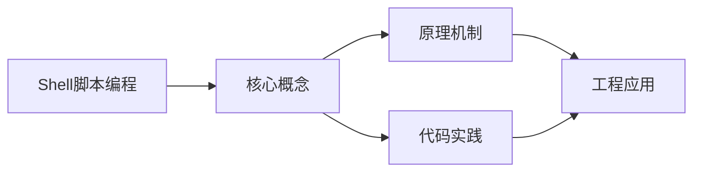
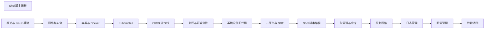

## 1. 学习目标（Bloom 分类）

本节按照布鲁姆教育目标分类学组织学习路径。本文主题为《Shell脚本编程》，属于 DevOps 模块，读者可以根据自身阶段选择阅读深度。

记忆层面：能够准确复述本文的核心概念、术语与基本语法或操作步骤，并能够在提问或检索时快速定位对应知识点。能够说出 DevOps 的核心概念、组件与标准流程。

理解层面：能够用自己的语言解释核心原理与工作机制，说明概念之间的因果关系，而不是机械记忆结论。能够解释 DevOps 的工作原理与关键机制。

应用层面：能够在真实项目或练习场景中运用本文知识解决具体问题，写出正确且可维护的实现。能够执行 DevOps 相关的标准操作与配置。

分析层面：能够拆解复杂问题，比较本文主题与相邻概念的异同，识别边界条件与例外情况。能够分析 DevOps 方案在可靠性、成本与性能上的权衡。

评价层面：能够根据约束条件（性能、可读性、安全、成本）评价不同方案的优劣，做出有依据的技术决策。能够评价 DevOps 中的技术选型。

创造层面：能够把本文知识与其他模块知识组合，设计出新的解决方案或可复用的工程模式。能够设计基于 DevOps 的完整解决方案。

通过本节学习，读者应当能够把《Shell脚本编程》纳入自己的知识网络，并与 DevOps 模块的其他主题（CI/CD、容器、编排、监控、GitOps）建立关联。

## 2. 历史动机与发展脉络

《Shell脚本编程》是 DevOps 领域的重要主题。要真正理解它，需要先了解它解决的问题与演进过程。

DevOps 源于 2009 年（“DevOpsDays”），核心是打破开发与运维壁垒，用自动化与协作缩短交付周期；CALMS 文化（文化、自动化、精益、度量、共享）是其框架。
技术栈演进：持续集成（CI）与持续交付（CD）、基础设施即代码（IaC）、容器（Docker）与编排（Kubernetes）、可观测性（监控/日志/追踪）。
2020 年代趋势：GitOps（声明式 + 自动同步）、平台工程（内部开发者平台）、FinOps（成本治理）、AI 辅助运维。

回到本文主题：Shell脚本编程 的提出与成熟，正是上述技术背景下的必然产物。早期实现往往以简单可用为目标，随着工程规模扩大，社区逐渐沉淀出标准做法与最佳实践；理解这一脉络，可以帮助读者判断“为什么文档中的推荐写法是现在这个样子”，也能在遇到历史遗留代码时准确识别其设计年代与取舍。


## 3. 形式化定义与核心概念精讲

本节把《Shell脚本编程》涉及的核心概念以“定义 + 讲解”的形式展开。读者应把定义当作工具，把讲解当作理解路径；两者结合才能形成可迁移的知识。

CI/CD 管线：代码提交 -> 构建 -> 测试 -> 制品 -> 部署；流水线即代码（GitHub Actions/Jenkins/GitLab CI）。
容器与镜像：OCI 规范、Dockerfile 分层、镜像仓库与签名；容器隔离（cgroup/namespace）。
编排：Kubernetes 的 Pod/Deployment/Service 抽象；声明式期望状态与控制器调和。

### 3.1 原文章节逐一精讲

原文档把主题拆分为 6 个小节，下面按顺序给出每一节的导读讲解，随后保留原文细节供精读。

#### 原文精读（完整保留）


#### 1. Bash 基础语法

##### 1.1 变量

```bash
# 变量赋值（等号两边不能有空格）
name="hello"
echo $name
echo ${name}

# 只读变量
readonly PI=3.14

# 环境变量
export MY_VAR="value"

# 特殊变量
$0    # 脚本名
$1~$9 # 位置参数
$#    # 参数个数
$@    # 所有参数（作为独立字符串）
$*    # 所有参数（作为单个字符串）
$?    # 上一个命令的退出码
$$    # 当前进程PID
```

##### 1.2 字符串操作

```bash
str="Hello World"

# 字符串长度
echo ${#str}          # 11

# 子字符串
echo ${str:0:5}       # Hello
echo ${str:6}         # World

# 替换
echo ${str/World/Bash}    # Hello Bash（首次替换）
echo ${str//l/L}          # HeLLo WorLd（全局替换）

# 删除
echo ${str#Hello }        # World（从前删最短匹配）
echo ${str##*o}           # rld（从前删最长匹配）
echo ${str%World}         # Hello（从后删最短匹配）
echo ${str%%*o}           # Hell（从后删最长匹配）

# 默认值
echo ${undefined:-default}  # default
echo ${undefined:=default}  # default（同时赋值）
```

##### 1.3 数组

```bash
# 定义数组
arr=(1 2 3 4 5)
arr[0]=10

# 访问
echo ${arr[0]}        # 10
echo ${arr[@]}        # 所有元素
echo ${#arr[@]}       # 元素个数
echo ${#arr[0]}       # 第一个元素的长度

# 遍历
for i in "${arr[@]}"; do
    echo $i
done

# 关联数组
declare -A map
map[name]="Alice"
map[age]=30
echo ${map[name]}
```

#### 2. 流程控制

##### 2.1 条件判断

```bash
# if-elif-else
if [ -f "/etc/passwd" ]; then
    echo "文件存在"
elif [ -d "/etc" ]; then
    echo "目录存在"
else
    echo "不存在"
fi

# 双括号（支持 &&, ||, <, >）
if [[ $a -gt $b && $a -lt 100 ]]; then
    echo "条件满足"
fi

# case
case $1 in
    start)   echo "启动服务" ;;
    stop)    echo "停止服务" ;;
    restart) echo "重启服务" ;;
    *)       echo "用法: $0 {start|stop|restart}" ;;
esac
```

##### 2.2 文件测试操作符

| 操作符 | 含义           |
| ------ | -------------- |
| `-f`   | 是否为普通文件 |
| `-d`   | 是否为目录     |
| `-e`   | 是否存在       |
| `-r`   | 是否可读       |
| `-w`   | 是否可写       |
| `-x`   | 是否可执行     |
| `-s`   | 是否非空       |

##### 2.3 循环

```bash
# for 循环
for i in {1..10}; do
    echo $i
done

for i in $(seq 1 2 20); do  # 步长2
    echo $i
done

# C 风格 for
for ((i=0; i<10; i++)); do
    echo $i
done

# while 循环
while read line; do
    echo "$line"
done < input.txt

# until 循环
until [ $count -gt 10 ]; do
    count=$((count + 1))
done
```

#### 3. 函数

```bash
# 定义函数
greet() {
    local name=$1
    echo "Hello, $name"
    return 0
}

# 调用
greet "World"

# 返回值
get_status() {
    if systemctl is-active nginx > /dev/null; then
        echo "running"
    else
        echo "stopped"
    fi
}

status=$(get_status)
echo "Nginx status: $status"
```

#### 4. 文本处理三剑客

##### 4.1 grep

```bash
# 基本搜索
grep "pattern" file.txt

# 常用选项
grep -i "pattern" file     # 忽略大小写
grep -r "pattern" dir/     # 递归搜索
grep -n "pattern" file     # 显示行号
grep -c "pattern" file     # 统计匹配行数
grep -v "pattern" file     # 反向匹配
grep -E "pat1|pat2" file   # 扩展正则

# 实用正则
grep -E "^[0-9]+" file           # 以数字开头
grep -E "\b[A-Za-z0-9._%+-]+@[A-Za-z0-9.-]+\.[A-Z|a-z]{2,}\b" file  # 邮箱
```

##### 4.2 sed

```bash
# 替换
sed 's/old/new/' file           # 替换每行第一个
sed 's/old/new/g' file          # 全局替换
sed -i 's/old/new/g' file       # 原地修改

# 删除
sed '/^$/d' file                # 删除空行
sed '1,5d' file                 # 删除1-5行

# 插入和追加
sed '3i\inserted line' file     # 第3行前插入
sed '3a\appended line' file     # 第3行后追加

# 多命令
sed -e 's/a/A/g' -e 's/b/B/g' file
```

##### 4.3 awk

```bash
# 基本用法
awk '{print $1, $3}' file       # 打印第1、3列
awk -F: '{print $1}' /etc/passwd  # 指定分隔符

# 条件
awk '$3 > 100 {print $1, $3}' file

# BEGIN/END
awk 'BEGIN{sum=0} {sum+=$1} END{print "Total:", sum}' file

# 内置变量
# NR: 行号  NF: 字段数  FS: 字段分隔符
awk '{print NR, NF, $0}' file

# 格式化输出
awk '{printf "%-10s %5d\n", $1, $2}' file
```

#### 5. 实用脚本示例

##### 5.1 系统监控脚本

```bash
#!/bin/bash
# 系统资源监控

THRESHOLD=80

check_cpu() {
    local cpu_usage=$(top -bn1 | grep "Cpu(s)" | awk '{print $2}' | cut -d. -f1)
    if [ "$cpu_usage" -gt "$THRESHOLD" ]; then
        echo "WARNING: CPU usage ${cpu_usage}%"
    fi
}

check_memory() {
    local mem_usage=$(free | grep Mem | awk '{printf("%.0f", $3/$2*100)}')
    if [ "$mem_usage" -gt "$THRESHOLD" ]; then
        echo "WARNING: Memory usage ${mem_usage}%"
    fi
}

check_disk() {
    local disk_usage=$(df -h / | tail -1 | awk '{print $5}' | tr -d '%')
    if [ "$disk_usage" -gt "$THRESHOLD" ]; then
        echo "WARNING: Disk usage ${disk_usage}%"
    fi
}

check_cpu
check_memory
check_disk
```

##### 5.2 日志分析脚本

```bash
#!/bin/bash
# Nginx 日志分析

LOG_FILE="/var/log/nginx/access.log"

echo "=== 访问量 Top 10 IP ==="
awk '{print $1}' "$LOG_FILE" | sort | uniq -c | sort -rn | head -10

echo "=== 状态码统计 ==="
awk '{print $9}' "$LOG_FILE" | sort | uniq -c | sort -rn

echo "=== 访问量 Top 10 URL ==="
awk '{print $7}' "$LOG_FILE" | sort | uniq -c | sort -rn | head -10

echo "=== 每小时访问量 ==="
awk '{print $4}' "$LOG_FILE" | cut -d: -f2 | sort | uniq -c | sort -n
```

##### 5.3 自动备份脚本

```bash
#!/bin/bash
# 数据库自动备份

BACKUP_DIR="/backup/mysql"
DATE=$(date +%Y%m%d_%H%M%S)
RETENTION_DAYS=7

# 创建备份目录
mkdir -p "$BACKUP_DIR"

# 备份所有数据库
mysqldump -u root -p"$MYSQL_PASS" --all-databases | gzip > "${BACKUP_DIR}/all_${DATE}.sql.gz"

# 清理过期备份
find "$BACKUP_DIR" -name "*.sql.gz" -mtime +$RETENTION_DAYS -delete

echo "Backup completed: all_${DATE}.sql.gz"
```

#### 6. 调试与最佳实践

##### 6.1 调试技巧

```bash
# 调试模式
bash -x script.sh       # 打印每条命令
bash -n script.sh       # 语法检查

# 在脚本中启用
set -x    # 开启调试
set +x    # 关闭调试

# 严格模式
set -euo pipefail
# -e: 命令失败时退出
# -u: 使用未定义变量时报错
# -o pipefail: 管道中任一命令失败则整个管道失败
```

##### 6.2 最佳实践

- 使用 `shellcheck` 检查脚本
- 变量引用加双引号：`"$var"`
- 使用 `local` 声明局部变量
- 使用 `[[ ]]` 替代 `[ ]`
- 使用 `$()` 替代反引号
- 总是处理错误返回值
- 使用 `mktemp` 创建临时文件


### 3.2 概念关系图

下面用 Mermaid 图表达本文核心概念之间的关系，帮助读者建立整体图景：



图中展示的是本文知识的结构化关系：核心概念是入口，原理机制解释“为什么”，代码实践演示“怎么做”，工程应用回答“何时用”。读者学习时可以把每个小节的内容挂接到对应节点上。

## 4. 理论推导与原理解析

本节深入《Shell脚本编程》背后的原理。理论部分不求面面俱到，而是聚焦“能解释现象、能指导实践”的关键推导。

CI/CD 管线：代码提交 -> 构建 -> 测试 -> 制品 -> 部署；流水线即代码（GitHub Actions/Jenkins/GitLab CI）。
容器与镜像：OCI 规范、Dockerfile 分层、镜像仓库与签名；容器隔离（cgroup/namespace）。
编排：Kubernetes 的 Pod/Deployment/Service 抽象；声明式期望状态与控制器调和。
可观测性三支柱：指标（Prometheus）、日志（Loki/ELK）、追踪（OpenTelemetry）。

需要强调的是，理论推导与工程实践之间存在翻译层：理论给出的是理想化模型与边界条件，工程代码则必须处理真实环境中的例外。读者在学习时应先掌握理论的“标准情形”，再通过陷阱章节了解“非标准情形”。

## 5. 代码示例与逐行讲解

本节把原文中的代码示例系统整理，并为每个示例补充用途说明与讲解。读者不应只浏览代码，而应逐段对照讲解理解设计意图。

### 5.1 示例：1.1 变量

该示例来自原文《1.1 变量》小节，用于演示Shell脚本编程相关操作。阅读时请先看代码结构，再看其后的讲解。

```bash
# 变量赋值（等号两边不能有空格）
name="hello"
echo $name
echo ${name}

# 只读变量
readonly PI=3.14

# 环境变量
export MY_VAR="value"

# 特殊变量
$0    # 脚本名
$1~$9 # 位置参数
$#    # 参数个数
$@    # 所有参数（作为独立字符串）
$*    # 所有参数（作为单个字符串）
$?    # 上一个命令的退出码
$$    # 当前进程PID
```

讲解：这段代码演示了本节核心知识点。代码中的关键操作可以归纳为三步：准备（定义或初始化）、执行（核心逻辑）、收尾（释放资源或返回结果）。实际项目中，这三步往往被封装为函数或类，以提升复用性与可测试性。

关键点分析：

该示例共 16 行有效代码，结构以数据或配置为主。阅读时应关注：数据字段的含义、配置项的作用，以及它们与运行行为的对应关系。

进阶思考路径：先尝试修改参数观察行为变化，再把示例中的模式迁移到自己的项目中；每次修改都记录预期与实测差异，这是把示例转化为能力的最快方式。

### 5.2 示例：1.2 字符串操作

该示例来自原文《1.2 字符串操作》小节，用于演示Shell脚本编程相关操作。阅读时请先看代码结构，再看其后的讲解。

```bash
str="Hello World"

# 字符串长度
echo ${#str}          # 11

# 子字符串
echo ${str:0:5}       # Hello
echo ${str:6}         # World

# 替换
echo ${str/World/Bash}    # Hello Bash（首次替换）
echo ${str//l/L}          # HeLLo WorLd（全局替换）

# 删除
echo ${str#Hello }        # World（从前删最短匹配）
echo ${str##*o}           # rld（从前删最长匹配）
echo ${str%World}         # Hello（从后删最短匹配）
echo ${str%%*o}           # Hell（从后删最长匹配）

# 默认值
echo ${undefined:-default}  # default
echo ${undefined:=default}  # default（同时赋值）
```

讲解：这段代码演示了本节核心知识点。代码中的关键操作可以归纳为三步：准备（定义或初始化）、执行（核心逻辑）、收尾（释放资源或返回结果）。实际项目中，这三步往往被封装为函数或类，以提升复用性与可测试性。

关键点分析：

该示例共 17 行有效代码，结构以数据或配置为主。阅读时应关注：数据字段的含义、配置项的作用，以及它们与运行行为的对应关系。

进阶思考路径：先尝试修改参数观察行为变化，再把示例中的模式迁移到自己的项目中；每次修改都记录预期与实测差异，这是把示例转化为能力的最快方式。

### 5.3 示例：1.3 数组

该示例来自原文《1.3 数组》小节，用于演示Shell脚本编程相关操作。阅读时请先看代码结构，再看其后的讲解。

```bash
# 定义数组
arr=(1 2 3 4 5)
arr[0]=10

# 访问
echo ${arr[0]}        # 10
echo ${arr[@]}        # 所有元素
echo ${#arr[@]}       # 元素个数
echo ${#arr[0]}       # 第一个元素的长度

# 遍历
for i in "${arr[@]}"; do
    echo $i
done

# 关联数组
declare -A map
map[name]="Alice"
map[age]=30
echo ${map[name]}
```

讲解：这段代码演示了本节核心知识点。代码中的关键操作可以归纳为三步：准备（定义或初始化）、执行（核心逻辑）、收尾（释放资源或返回结果）。实际项目中，这三步往往被封装为函数或类，以提升复用性与可测试性。

关键点分析：

该示例共 17 行有效代码，包含 1 类关键结构（for）。其中：

- 入口与初始化部分负责建立上下文，对应实际项目中的启动或装配逻辑；
- 核心逻辑部分体现本文主题的主要操作，是阅读时最需要对照讲解理解的部分；
- 输出或返回部分把结果交给调用方，注意其类型与边界条件。

进阶思考路径：先尝试修改参数观察行为变化，再把示例中的模式迁移到自己的项目中；每次修改都记录预期与实测差异，这是把示例转化为能力的最快方式。

### 5.4 示例：2.1 条件判断

该示例来自原文《2.1 条件判断》小节，用于演示Shell脚本编程相关操作。阅读时请先看代码结构，再看其后的讲解。

```bash
# if-elif-else
if [ -f "/etc/passwd" ]; then
    echo "文件存在"
elif [ -d "/etc" ]; then
    echo "目录存在"
else
    echo "不存在"
fi

# 双括号（支持 &&, ||, <, >）
if [[ $a -gt $b && $a -lt 100 ]]; then
    echo "条件满足"
fi

# case
case $1 in
    start)   echo "启动服务" ;;
    stop)    echo "停止服务" ;;
    restart) echo "重启服务" ;;
    *)       echo "用法: $0 {start|stop|restart}" ;;
esac
```

讲解：这段代码演示了本节核心知识点。代码中的关键操作可以归纳为三步：准备（定义或初始化）、执行（核心逻辑）、收尾（释放资源或返回结果）。实际项目中，这三步往往被封装为函数或类，以提升复用性与可测试性。

关键点分析：

该示例共 19 行有效代码，包含 1 类关键结构（if）。其中：

- 入口与初始化部分负责建立上下文，对应实际项目中的启动或装配逻辑；
- 核心逻辑部分体现本文主题的主要操作，是阅读时最需要对照讲解理解的部分；
- 输出或返回部分把结果交给调用方，注意其类型与边界条件。

进阶思考路径：先尝试修改参数观察行为变化，再把示例中的模式迁移到自己的项目中；每次修改都记录预期与实测差异，这是把示例转化为能力的最快方式。

### 5.5 示例：2.3 循环

该示例来自原文《2.3 循环》小节，用于演示Shell脚本编程相关操作。阅读时请先看代码结构，再看其后的讲解。

```bash
# for 循环
for i in {1..10}; do
    echo $i
done

for i in $(seq 1 2 20); do  # 步长2
    echo $i
done

# C 风格 for
for ((i=0; i<10; i++)); do
    echo $i
done

# while 循环
while read line; do
    echo "$line"
done < input.txt

# until 循环
until [ $count -gt 10 ]; do
    count=$((count + 1))
done
```

讲解：这段代码演示了本节核心知识点。代码中的关键操作可以归纳为三步：准备（定义或初始化）、执行（核心逻辑）、收尾（释放资源或返回结果）。实际项目中，这三步往往被封装为函数或类，以提升复用性与可测试性。

关键点分析：

该示例共 19 行有效代码，包含 2 类关键结构（for、while）。其中：

- 入口与初始化部分负责建立上下文，对应实际项目中的启动或装配逻辑；
- 核心逻辑部分体现本文主题的主要操作，是阅读时最需要对照讲解理解的部分；
- 输出或返回部分把结果交给调用方，注意其类型与边界条件。

进阶思考路径：先尝试修改参数观察行为变化，再把示例中的模式迁移到自己的项目中；每次修改都记录预期与实测差异，这是把示例转化为能力的最快方式。

### 5.6 示例：3. 函数

该示例来自原文《3. 函数》小节，用于演示Shell脚本编程相关操作。阅读时请先看代码结构，再看其后的讲解。

```bash
# 定义函数
greet() {
    local name=$1
    echo "Hello, $name"
    return 0
}

# 调用
greet "World"

# 返回值
get_status() {
    if systemctl is-active nginx > /dev/null; then
        echo "running"
    else
        echo "stopped"
    fi
}

status=$(get_status)
echo "Nginx status: $status"
```

讲解：这段代码演示了本节核心知识点。代码中的关键操作可以归纳为三步：准备（定义或初始化）、执行（核心逻辑）、收尾（释放资源或返回结果）。实际项目中，这三步往往被封装为函数或类，以提升复用性与可测试性。

关键点分析：

该示例共 18 行有效代码，包含 2 类关键结构（if、return）。其中：

- 入口与初始化部分负责建立上下文，对应实际项目中的启动或装配逻辑；
- 核心逻辑部分体现本文主题的主要操作，是阅读时最需要对照讲解理解的部分；
- 输出或返回部分把结果交给调用方，注意其类型与边界条件。

进阶思考路径：先尝试修改参数观察行为变化，再把示例中的模式迁移到自己的项目中；每次修改都记录预期与实测差异，这是把示例转化为能力的最快方式。

### 5.7 示例：4.1 grep

该示例来自原文《4.1 grep》小节，用于演示Shell脚本编程相关操作。阅读时请先看代码结构，再看其后的讲解。

```bash
# 基本搜索
grep "pattern" file.txt

# 常用选项
grep -i "pattern" file     # 忽略大小写
grep -r "pattern" dir/     # 递归搜索
grep -n "pattern" file     # 显示行号
grep -c "pattern" file     # 统计匹配行数
grep -v "pattern" file     # 反向匹配
grep -E "pat1|pat2" file   # 扩展正则

# 实用正则
grep -E "^[0-9]+" file           # 以数字开头
grep -E "\b[A-Za-z0-9._%+-]+@[A-Za-z0-9.-]+\.[A-Z|a-z]{2,}\b" file  # 邮箱
```

讲解：这段代码演示了本节核心知识点。代码中的关键操作可以归纳为三步：准备（定义或初始化）、执行（核心逻辑）、收尾（释放资源或返回结果）。实际项目中，这三步往往被封装为函数或类，以提升复用性与可测试性。

关键点分析：

该示例共 12 行有效代码，结构以数据或配置为主。阅读时应关注：数据字段的含义、配置项的作用，以及它们与运行行为的对应关系。

进阶思考路径：先尝试修改参数观察行为变化，再把示例中的模式迁移到自己的项目中；每次修改都记录预期与实测差异，这是把示例转化为能力的最快方式。

### 5.8 示例：4.2 sed

该示例来自原文《4.2 sed》小节，用于演示Shell脚本编程相关操作。阅读时请先看代码结构，再看其后的讲解。

```bash
# 替换
sed 's/old/new/' file           # 替换每行第一个
sed 's/old/new/g' file          # 全局替换
sed -i 's/old/new/g' file       # 原地修改

# 删除
sed '/^$/d' file                # 删除空行
sed '1,5d' file                 # 删除1-5行

# 插入和追加
sed '3i\inserted line' file     # 第3行前插入
sed '3a\appended line' file     # 第3行后追加

# 多命令
sed -e 's/a/A/g' -e 's/b/B/g' file
```

讲解：这段代码演示了本节核心知识点。代码中的关键操作可以归纳为三步：准备（定义或初始化）、执行（核心逻辑）、收尾（释放资源或返回结果）。实际项目中，这三步往往被封装为函数或类，以提升复用性与可测试性。

关键点分析：

该示例共 12 行有效代码，结构以数据或配置为主。阅读时应关注：数据字段的含义、配置项的作用，以及它们与运行行为的对应关系。

进阶思考路径：先尝试修改参数观察行为变化，再把示例中的模式迁移到自己的项目中；每次修改都记录预期与实测差异，这是把示例转化为能力的最快方式。

### 5.9 示例：4.3 awk

该示例来自原文《4.3 awk》小节，用于演示Shell脚本编程相关操作。阅读时请先看代码结构，再看其后的讲解。

```bash
# 基本用法
awk '{print $1, $3}' file       # 打印第1、3列
awk -F: '{print $1}' /etc/passwd  # 指定分隔符

# 条件
awk '$3 > 100 {print $1, $3}' file

# BEGIN/END
awk 'BEGIN{sum=0} {sum+=$1} END{print "Total:", sum}' file

# 内置变量
# NR: 行号  NF: 字段数  FS: 字段分隔符
awk '{print NR, NF, $0}' file

# 格式化输出
awk '{printf "%-10s %5d\n", $1, $2}' file
```

讲解：这段代码演示了本节核心知识点。代码中的关键操作可以归纳为三步：准备（定义或初始化）、执行（核心逻辑）、收尾（释放资源或返回结果）。实际项目中，这三步往往被封装为函数或类，以提升复用性与可测试性。

关键点分析：

该示例共 12 行有效代码，结构以数据或配置为主。阅读时应关注：数据字段的含义、配置项的作用，以及它们与运行行为的对应关系。

进阶思考路径：先尝试修改参数观察行为变化，再把示例中的模式迁移到自己的项目中；每次修改都记录预期与实测差异，这是把示例转化为能力的最快方式。

### 5.10 示例：5.1 系统监控脚本

该示例来自原文《5.1 系统监控脚本》小节，用于演示Shell脚本编程相关操作。阅读时请先看代码结构，再看其后的讲解。

```bash
#!/bin/bash
# 系统资源监控

THRESHOLD=80

check_cpu() {
    local cpu_usage=$(top -bn1 | grep "Cpu(s)" | awk '{print $2}' | cut -d. -f1)
    if [ "$cpu_usage" -gt "$THRESHOLD" ]; then
        echo "WARNING: CPU usage ${cpu_usage}%"
    fi
}

check_memory() {
    local mem_usage=$(free | grep Mem | awk '{printf("%.0f", $3/$2*100)}')
    if [ "$mem_usage" -gt "$THRESHOLD" ]; then
        echo "WARNING: Memory usage ${mem_usage}%"
    fi
}

check_disk() {
    local disk_usage=$(df -h / | tail -1 | awk '{print $5}' | tr -d '%')
    if [ "$disk_usage" -gt "$THRESHOLD" ]; then
        echo "WARNING: Disk usage ${disk_usage}%"
    fi
}

check_cpu
check_memory
check_disk
```

讲解：这段代码演示了本节核心知识点。代码中的关键操作可以归纳为三步：准备（定义或初始化）、执行（核心逻辑）、收尾（释放资源或返回结果）。实际项目中，这三步往往被封装为函数或类，以提升复用性与可测试性。

关键点分析：

该示例共 24 行有效代码，包含 1 类关键结构（if）。其中：

- 入口与初始化部分负责建立上下文，对应实际项目中的启动或装配逻辑；
- 核心逻辑部分体现本文主题的主要操作，是阅读时最需要对照讲解理解的部分；
- 输出或返回部分把结果交给调用方，注意其类型与边界条件。

进阶思考路径：先尝试修改参数观察行为变化，再把示例中的模式迁移到自己的项目中；每次修改都记录预期与实测差异，这是把示例转化为能力的最快方式。

### 5.11 示例：5.2 日志分析脚本

该示例来自原文《5.2 日志分析脚本》小节，用于演示Shell脚本编程相关操作。阅读时请先看代码结构，再看其后的讲解。

```bash
#!/bin/bash
# Nginx 日志分析

LOG_FILE="/var/log/nginx/access.log"

echo "=== 访问量 Top 10 IP ==="
awk '{print $1}' "$LOG_FILE" | sort | uniq -c | sort -rn | head -10

echo "=== 状态码统计 ==="
awk '{print $9}' "$LOG_FILE" | sort | uniq -c | sort -rn

echo "=== 访问量 Top 10 URL ==="
awk '{print $7}' "$LOG_FILE" | sort | uniq -c | sort -rn | head -10

echo "=== 每小时访问量 ==="
awk '{print $4}' "$LOG_FILE" | cut -d: -f2 | sort | uniq -c | sort -n
```

讲解：这段代码演示了本节核心知识点。代码中的关键操作可以归纳为三步：准备（定义或初始化）、执行（核心逻辑）、收尾（释放资源或返回结果）。实际项目中，这三步往往被封装为函数或类，以提升复用性与可测试性。

关键点分析：

该示例共 11 行有效代码，结构以数据或配置为主。阅读时应关注：数据字段的含义、配置项的作用，以及它们与运行行为的对应关系。

进阶思考路径：先尝试修改参数观察行为变化，再把示例中的模式迁移到自己的项目中；每次修改都记录预期与实测差异，这是把示例转化为能力的最快方式。

### 5.12 示例：5.3 自动备份脚本

该示例来自原文《5.3 自动备份脚本》小节，用于演示Shell脚本编程相关操作。阅读时请先看代码结构，再看其后的讲解。

```bash
#!/bin/bash
# 数据库自动备份

BACKUP_DIR="/backup/mysql"
DATE=$(date +%Y%m%d_%H%M%S)
RETENTION_DAYS=7

# 创建备份目录
mkdir -p "$BACKUP_DIR"

# 备份所有数据库
mysqldump -u root -p"$MYSQL_PASS" --all-databases | gzip > "${BACKUP_DIR}/all_${DATE}.sql.gz"

# 清理过期备份
find "$BACKUP_DIR" -name "*.sql.gz" -mtime +$RETENTION_DAYS -delete

echo "Backup completed: all_${DATE}.sql.gz"
```

讲解：这段代码演示了本节核心知识点。代码中的关键操作可以归纳为三步：准备（定义或初始化）、执行（核心逻辑）、收尾（释放资源或返回结果）。实际项目中，这三步往往被封装为函数或类，以提升复用性与可测试性。

关键点分析：

该示例共 12 行有效代码，结构以数据或配置为主。阅读时应关注：数据字段的含义、配置项的作用，以及它们与运行行为的对应关系。

进阶思考路径：先尝试修改参数观察行为变化，再把示例中的模式迁移到自己的项目中；每次修改都记录预期与实测差异，这是把示例转化为能力的最快方式。

### 5.13 示例：6.1 调试技巧

该示例来自原文《6.1 调试技巧》小节，用于演示Shell脚本编程相关操作。阅读时请先看代码结构，再看其后的讲解。

```bash
# 调试模式
bash -x script.sh       # 打印每条命令
bash -n script.sh       # 语法检查

# 在脚本中启用
set -x    # 开启调试
set +x    # 关闭调试

# 严格模式
set -euo pipefail
# -e: 命令失败时退出
# -u: 使用未定义变量时报错
# -o pipefail: 管道中任一命令失败则整个管道失败
```

讲解：这段代码演示了本节核心知识点。代码中的关键操作可以归纳为三步：准备（定义或初始化）、执行（核心逻辑）、收尾（释放资源或返回结果）。实际项目中，这三步往往被封装为函数或类，以提升复用性与可测试性。

关键点分析：

该示例共 11 行有效代码，结构以数据或配置为主。阅读时应关注：数据字段的含义、配置项的作用，以及它们与运行行为的对应关系。

进阶思考路径：先尝试修改参数观察行为变化，再把示例中的模式迁移到自己的项目中；每次修改都记录预期与实测差异，这是把示例转化为能力的最快方式。


综合以上示例，可以总结出本主题的代码实践要点：第一，先定义清晰的输入输出契约；第二，核心逻辑保持单一职责；第三，错误处理与边界条件不可省略；第四，命名与注释表达意图而非复述代码。

## 6. 对比分析

对比是理解《Shell脚本编程》定位的最快路径。下面从多个维度与相邻方案进行对比。

CI 与 CD：CI 保证可集成，CD 保证可交付；两者可独立实施。
Kubernetes 与 Docker Compose：K8s 生产级编排；Compose 单机开发。
传统运维与 SRE：SRE 用软件工程方法运维，错误预算与 SLO。

对比的目的不是分出绝对优劣，而是建立选择依据：不同约束条件下，最优解不同。读者应把每个对比维度转化为决策检查清单。

## 7. 常见陷阱与最佳实践

本节整理该主题的高频错误与推荐做法。每个陷阱先描述现象，再解释原因，最后给出最佳实践。

### 7.1 环境漂移

手工配置导致环境不一致。全部走 IaC 与镜像。

深入讲解：该问题之所以被归类为“常见陷阱”，是因为它在初学者的代码中反复出现，而且往往不在第一时间暴露——错误通常隐藏在特定数据或特定时序下。

从成因上看，环境漂移 一般源于对 DevOps 某个机制的理解偏差：要么误用了默认行为，要么忽略了边界条件，要么把其他语言的思维惯性带了过来。

从影响上看，环境漂移 轻则产生错误结果，重则导致资源泄漏、数据损坏或安全事故；这也是为什么工程评审中会把它列为检查项。

从修复策略上看，处理环境漂移的正确顺序是：先复现（构造最小用例），再定位（确认机制层面的根因），最后修复并补充回归测试。跳过复现直接改代码，往往治标不治本。

### 7.2 秘密硬编码

密钥进仓库。使用 Secret 管理与注入。

深入讲解：该问题之所以被归类为“常见陷阱”，是因为它在初学者的代码中反复出现，而且往往不在第一时间暴露——错误通常隐藏在特定数据或特定时序下。

从成因上看，秘密硬编码 一般源于对 DevOps 某个机制的理解偏差：要么误用了默认行为，要么忽略了边界条件，要么把其他语言的思维惯性带了过来。

从影响上看，秘密硬编码 轻则产生错误结果，重则导致资源泄漏、数据损坏或安全事故；这也是为什么工程评审中会把它列为检查项。

从修复策略上看，处理秘密硬编码的正确顺序是：先复现（构造最小用例），再定位（确认机制层面的根因），最后修复并补充回归测试。跳过复现直接改代码，往往治标不治本。

### 7.3 构建不可复现

依赖未锁定。锁定依赖版本与基础镜像 digest。

深入讲解：该问题之所以被归类为“常见陷阱”，是因为它在初学者的代码中反复出现，而且往往不在第一时间暴露——错误通常隐藏在特定数据或特定时序下。

从成因上看，构建不可复现 一般源于对 DevOps 某个机制的理解偏差：要么误用了默认行为，要么忽略了边界条件，要么把其他语言的思维惯性带了过来。

从影响上看，构建不可复现 轻则产生错误结果，重则导致资源泄漏、数据损坏或安全事故；这也是为什么工程评审中会把它列为检查项。

从修复策略上看，处理构建不可复现的正确顺序是：先复现（构造最小用例），再定位（确认机制层面的根因），最后修复并补充回归测试。跳过复现直接改代码，往往治标不治本。

### 7.4 测试后置

问题到生产才发现。左移：单元/集成/E2E 分层。

深入讲解：该问题之所以被归类为“常见陷阱”，是因为它在初学者的代码中反复出现，而且往往不在第一时间暴露——错误通常隐藏在特定数据或特定时序下。

从成因上看，测试后置 一般源于对 DevOps 某个机制的理解偏差：要么误用了默认行为，要么忽略了边界条件，要么把其他语言的思维惯性带了过来。

从影响上看，测试后置 轻则产生错误结果，重则导致资源泄漏、数据损坏或安全事故；这也是为什么工程评审中会把它列为检查项。

从修复策略上看，处理测试后置的正确顺序是：先复现（构造最小用例），再定位（确认机制层面的根因），最后修复并补充回归测试。跳过复现直接改代码，往往治标不治本。

### 7.5 回滚缺失

发布失败无法回退。保留历史镜像与一键回滚。

深入讲解：该问题之所以被归类为“常见陷阱”，是因为它在初学者的代码中反复出现，而且往往不在第一时间暴露——错误通常隐藏在特定数据或特定时序下。

从成因上看，回滚缺失 一般源于对 DevOps 某个机制的理解偏差：要么误用了默认行为，要么忽略了边界条件，要么把其他语言的思维惯性带了过来。

从影响上看，回滚缺失 轻则产生错误结果，重则导致资源泄漏、数据损坏或安全事故；这也是为什么工程评审中会把它列为检查项。

从修复策略上看，处理回滚缺失的正确顺序是：先复现（构造最小用例），再定位（确认机制层面的根因），最后修复并补充回归测试。跳过复现直接改代码，往往治标不治本。

### 7.6 监控盲区

无指标与告警。核心链路全量可观测。

深入讲解：该问题之所以被归类为“常见陷阱”，是因为它在初学者的代码中反复出现，而且往往不在第一时间暴露——错误通常隐藏在特定数据或特定时序下。

从成因上看，监控盲区 一般源于对 DevOps 某个机制的理解偏差：要么误用了默认行为，要么忽略了边界条件，要么把其他语言的思维惯性带了过来。

从影响上看，监控盲区 轻则产生错误结果，重则导致资源泄漏、数据损坏或安全事故；这也是为什么工程评审中会把它列为检查项。

从修复策略上看，处理监控盲区的正确顺序是：先复现（构造最小用例），再定位（确认机制层面的根因），最后修复并补充回归测试。跳过复现直接改代码，往往治标不治本。

### 7.7 权限过大

CI 权限超需求。最小权限与短期凭证。

深入讲解：该问题之所以被归类为“常见陷阱”，是因为它在初学者的代码中反复出现，而且往往不在第一时间暴露——错误通常隐藏在特定数据或特定时序下。

从成因上看，权限过大 一般源于对 DevOps 某个机制的理解偏差：要么误用了默认行为，要么忽略了边界条件，要么把其他语言的思维惯性带了过来。

从影响上看，权限过大 轻则产生错误结果，重则导致资源泄漏、数据损坏或安全事故；这也是为什么工程评审中会把它列为检查项。

从修复策略上看，处理权限过大的正确顺序是：先复现（构造最小用例），再定位（确认机制层面的根因），最后修复并补充回归测试。跳过复现直接改代码，往往治标不治本。

### 7.8 部署频率低

大爆炸发布风险高。小步快跑与灰度。

深入讲解：该问题之所以被归类为“常见陷阱”，是因为它在初学者的代码中反复出现，而且往往不在第一时间暴露——错误通常隐藏在特定数据或特定时序下。

从成因上看，部署频率低 一般源于对 DevOps 某个机制的理解偏差：要么误用了默认行为，要么忽略了边界条件，要么把其他语言的思维惯性带了过来。

从影响上看，部署频率低 轻则产生错误结果，重则导致资源泄漏、数据损坏或安全事故；这也是为什么工程评审中会把它列为检查项。

从修复策略上看，处理部署频率低的正确顺序是：先复现（构造最小用例），再定位（确认机制层面的根因），最后修复并补充回归测试。跳过复现直接改代码，往往治标不治本。

### 7.0 最佳实践总览

1. 一切皆代码：流水线、基础设施、配置版本化。
2. 发布可重复：相同代码 + 相同制品 -> 相同环境。
3. 失败可预期：小批量、金丝雀、自动回滚。
4. 度量驱动：DORA 指标（部署频率、变更前置时间、恢复时间、变更失败率）。

把这些最佳实践固化为团队规范与代码评审检查项，是避免同类问题反复出现的关键。

## 8. 工程实践

本节把《Shell脚本编程》放入真实工程场景，给出可复用的模式与组织方法。

GitHub Actions：workflow/job/step 模型，矩阵测试，环境与密钥管理。
GitOps：Argo CD 同步 Git 仓库与集群状态，PR 即发布审批。
平台工程：模板化应用脚手架（Backstage）、自助环境、成本可视化。

### 8.1 工程实践的原则拆解

以上工程实践可以归纳为四条原则。第一，配置与代码分离：DevOps 项目中环境差异应通过配置注入，而不是散落在代码分支中；这保证同一份代码可以在开发、测试、生产环境一致运行。

第二，接口稳定优先：对外接口（函数签名、协议、数据格式）一旦被消费方依赖，变更成本极高；设计时应预留扩展点并保持向后兼容。

第三，可观测性内置：日志、指标与追踪应该在功能开发时同步设计，而不是故障发生后补救；没有观测手段的模块等于黑盒。

第四，变更可回滚：任何发布都应有对应的回滚方案；数据库迁移、配置变更与代码发布一样需要版本管理与逆向路径。

### 8.2 实践落地的检查清单

- [ ] GitHub Actions：对照本节描述，检查当前项目是否已经落实；未落实的项列入技术债并排期处理。
- [ ] GitOps：对照本节描述，检查当前项目是否已经落实；未落实的项列入技术债并排期处理。
- [ ] 平台工程：对照本节描述，检查当前项目是否已经落实；未落实的项列入技术债并排期处理。

工程实践的共性原则：配置与代码分离、接口稳定优先、可观测性内置、变更可回滚。这些原则适用于本主题的所有实现。

## 9. 案例研究

本节通过一个完整案例把《Shell脚本编程》的知识串起来。案例按“需求分析、方案设计、实现、验证”四步展开。

需求：为微服务搭建从提交到生产的自动化管线。
方案：GitHub Actions 构建镜像 + 测试 + 扫描，Argo CD 部署到 K8s，Prometheus 监控。
要点：镜像 tag 用 commit SHA；金丝雀发布；回滚演练。
验证：发布频率与失败率度量、故障注入演练。

### 9.1 案例的扩展讨论

把案例中的方案放大到真实规模，需要额外考虑三个问题：

第一，规模：当数据量或并发量上升一个数量级时，原方案中的数据结构、缓存策略与任务调度是否仍然成立？通常需要引入分层与异步。

第二，团队：多人协作时，模块边界、接口契约与代码所有权必须明确；案例中的实现应拆分为可独立测试的单元，并配合文档说明设计意图。

第三，演进：上线后的需求变化不可避免；方案设计时应预留扩展点（配置化、插件化、事件化），并定期用真实指标验证假设。


案例研究的学习方法：先独立阅读需求，尝试在脑中形成方案，再对照实现与讲解，最后思考“如果约束变化（数据量、并发、团队规模），方案应如何调整”。

## 10. 知识要点总结与深入讲解

本节以讲解形式汇总全文要点，替代传统的习题与自测，读者不需要答题，只需跟随解释建立完整的认知框架。

关于《Shell脚本编程》的核心结论：

DevOps 的本质是自动化与协作，工具只是载体。
可重复、可回滚、可观测是三条主线。
从 DORA 指标开始度量改进，避免为工具而工具。

原文档各小节的要点回顾：

- 1. Bash 基础语法：该小节围绕Shell脚本编程展开具体细节，阅读时应关注其与核心结论的对应关系；每个小节都是核心结论在某一个侧面的展开。
- 2. 流程控制：该小节围绕Shell脚本编程展开具体细节，阅读时应关注其与核心结论的对应关系；每个小节都是核心结论在某一个侧面的展开。
- 3. 函数：该小节围绕Shell脚本编程展开具体细节，阅读时应关注其与核心结论的对应关系；每个小节都是核心结论在某一个侧面的展开。
- 4. 文本处理三剑客：该小节围绕Shell脚本编程展开具体细节，阅读时应关注其与核心结论的对应关系；每个小节都是核心结论在某一个侧面的展开。
- 5. 实用脚本示例：该小节围绕Shell脚本编程展开具体细节，阅读时应关注其与核心结论的对应关系；每个小节都是核心结论在某一个侧面的展开。
- 6. 调试与最佳实践：该小节围绕Shell脚本编程展开具体细节，阅读时应关注其与核心结论的对应关系；每个小节都是核心结论在某一个侧面的展开。

把以上要点与第 3-9 节的内容对照复习，即可完成对本文主题的闭环学习。

## 11. 参考文献


GitHub Actions 文档：https://docs.github.com/zh/actions
GitLab CI 文档：https://docs.gitlab.com/ci/
Argo CD：https://argo-cd.readthedocs.io/
DORA 研究：https://dora.dev/
DevOps 手册（Gene Kim 等）：https://itrevolution.com/devops-handbook/

## 12. 延伸阅读


Docker 与 Kubernetes 深入，见 031-devops 模块文档。
CI/CD 管线设计，见 031-devops 模块 CICD 文档。
云原生架构，见 034-cloud-computing 模块。
尚硅谷 Bilibili 空间（https://space.bilibili.com/302417610 ）提供 DevOps 课程。

## 14. 模块知识图谱与学习路径

本文属于 DevOps 模块。为了把《Shell脚本编程》放入完整的知识网络，下面列出本模块的全部主题并给出相互关联的导读。学习时建议按模块内顺序推进，并在每个文档中留意交叉引用。



上图为模块主题的推荐学习顺序示意图（仅展示前若干主题）。各主题之间存在三类关联：

第一，前置依赖关系：早期主题是后期主题的基础，例如环境与语法先行、进阶主题随后；

第二，横向并列关系：同一层级主题从不同角度覆盖模块能力，学习顺序可以按兴趣调整；

第三，工程组合关系：多个主题在真实项目中组合使用，例如配置、性能与安全主题往往出现在同一系统的不同层面。

### 14.1 模块主题速查表

| 文档 | 主题 | 与本文的关联 |
| --- | --- | --- |
| 概述与 Linux 基础 | 001-OverviewLinuxBasics | 本文的前置基础 |
| 网络与安全 | 002-NetworkSecurity | 本文的安全延伸 |
| 容器与 Docker | 003-ContainerDocker | 本文的并列主题 |
| Kubernetes | 004-Kubernetes | 本文的并列主题 |
| CI/CD 流水线 | 005-CICDPipeline | 本文的并列主题 |
| 监控与可观测性 | 006-MonitorAndObservability | 本文的并列主题 |
| 基础设施即代码 | 007-IaC | 本文的前置基础 |
| 云原生与 SRE | 008-CloudNativeSRE | 本文的并列主题 |
| Shell脚本编程 | 009-ShellScriptProgramming | 本文自身 |
| 包管理与仓库 | 010-PackageManagementRepository | 本文的并列主题 |
| 服务网格 | 011-ServiceMesh | 本文的并列主题 |
| 日志管理 | 012-LogManagement | 本文的并列主题 |
| 配置管理 | 013-ConfigManagement | 本文的并列主题 |
| 性能调优 | 014-PerformanceTuning | 本文的性能延伸 |
| 高可用架构 | 015-HighAvailabilityArchitecture | 本文的原理深化 |
| 自动化测试 | 016-AutomationTest | 本文的并列主题 |
| 故障排查 | 017-Troubleshooting | 本文的并列主题 |
| 容器安全 | 018-ContainerSecurity | 本文的安全延伸 |
| GitOps与持续交付 | 019-GitOpsCD | 本文的并列主题 |
| 监控与告警 | 020-MonitorAndAlert | 本文的并列主题 |
| 网络与安全进阶 | 021-NetworkSecurityAdvanced | 本文的安全延伸 |
| 数据库运维 | 022-DatabaseOps | 本文的并列主题 |
| Dockerfile多阶段构建 | 023-DockerfileMultiBuild | 本文的并列主题 |
| Kubernetes核心资源详解 | 024-KubernetesCoreDetailed | 本文的并列主题 |
| Helm-Chart应用打包 | 025-HelmChartApplicationPackage | 本文的并列主题 |
| Terraform资源编排 | 026-Terraform | 本文的并列主题 |
| Ansible-Playbook配置管理 | 027-AnsiblePlaybookConfigManagement | 本文的并列主题 |
| Prometheus指标采集与告警 | 028-Prometheus | 本文的并列主题 |
| Grafana仪表盘配置 | 029-GrafanaTableConfig | 本文的并列主题 |
| ELK-Stack日志分析 | 030-ELKStackLogAnalysis | 本文的并列主题 |
| OpenTelemetry | 031-OpenTelemetry | 本文的并列主题 |
| GitOps与ArgoCD | 032-GitOpsArgoCD | 本文的并列主题 |
| DevOps kubectl 基础命令 | 033-KubectlBasics | 本文的前置基础 |
| DevOps Helm 包管理命令 | 034-HelmCommands | 本文的并列主题 |
| DevOps Jenkins Pipeline | 035-JenkinsPipeline | 本文的并列主题 |
| DevOps GitLab CI/CD | 036-GitLabCI | 本文的并列主题 |

速查表的作用是让读者快速判断：哪些文档应在阅读本文前掌握（前置基础），哪些文档应在阅读本文后继续（延伸主题）。本模块的交叉引用体系即以此表为基础。

## 15. 术语表

下表整理《Shell脚本编程》及 DevOps 模块中出现的高频术语，给出简明释义。术语按字母序或逻辑序排列，供查阅。

| 术语 | 释义 |
| --- | --- |
| CI/CD 管线 | 代码提交 -> 构建 -> 测试 -> 制品 -> 部署；流水线即代码（GitHub Actions/Jenkins/GitLab CI）。 |
| 容器与镜像 | OCI 规范、Dockerfile 分层、镜像仓库与签名；容器隔离（cgroup/namespace）。 |
| 编排 | Kubernetes 的 Pod/Deployment/Service 抽象；声明式期望状态与控制器调和。 |
| 可观测性三支柱 | 指标（Prometheus）、日志（Loki/ELK）、追踪（OpenTelemetry）。 |
| 环境漂移（易错点） | 参见常见陷阱章节的详细讲解 |
| 秘密硬编码（易错点） | 参见常见陷阱章节的详细讲解 |
| 构建不可复现（易错点） | 参见常见陷阱章节的详细讲解 |
| 测试后置（易错点） | 参见常见陷阱章节的详细讲解 |
| 回滚缺失（易错点） | 参见常见陷阱章节的详细讲解 |
| 监控盲区（易错点） | 参见常见陷阱章节的详细讲解 |

术语表与正文配合使用：先通读正文，遇到模糊术语回查本表；长期使用后术语会自然进入工作记忆。

## 13. 深度专题扩展

以下专题从不同角度深入本文主题，供有进阶需求的读者研读。每个专题独立成节，内容相互补充。

### 13.1 GitOps 与声明式交付

Git 是唯一事实来源：集群状态由仓库声明驱动，差异由控制器调和（Argo CD/Flux）。
PR 流程即变更审批，合并即发布意图；回滚 = revert 提交。
与 CI 衔接：CI 产出镜像，CD 更新清单引用新 digest。
安全：仓库签名、密钥加密（SOPS）、审计日志。

### 13.2 可观测性与 SLO

指标：RED（请求率、错误、时长）与 USE（利用率、饱和、错误）。
日志：结构化（JSON）、集中采集、关联 trace_id。
追踪：OpenTelemetry 传播上下文，瀑布分析延迟。
SLO/错误预算：目标可用性 99.9% 对应每月约 43 分钟不可用预算，驱动发布决策。

## 16. 核心概念串讲（复习视角）

本节以“把知识讲给他人听”的方式，把《Shell脚本编程》的核心概念重新串讲一遍。与前文按章节展开不同，这里的叙述更接近课堂总结：先说整体，再逐个展开，最后收束。

《Shell脚本编程》属于 DevOps 模块。要理解它，先要理解它在模块中的位置：它解决的是该领域的一个具体问题，并依赖模块内若干前置概念；反过来，它又为后续进阶主题提供基础。

第一个概念是CI/CD 管线。代码提交 -> 构建 -> 测试 -> 制品 -> 部署；流水线即代码（GitHub Actions/Jenkins/GitLab CI）。

在实际使用中，CI/CD 管线需要与相邻概念区分：它们的区别不在于名称，而在于适用条件与行为边界；这正是前文对比分析章节的意义。

第一个概念是容器与镜像。OCI 规范、Dockerfile 分层、镜像仓库与签名；容器隔离（cgroup/namespace）。

在实际使用中，容器与镜像需要与相邻概念区分：它们的区别不在于名称，而在于适用条件与行为边界；这正是前文对比分析章节的意义。

第一个概念是编排。Kubernetes 的 Pod/Deployment/Service 抽象；声明式期望状态与控制器调和。

在实际使用中，编排需要与相邻概念区分：它们的区别不在于名称，而在于适用条件与行为边界；这正是前文对比分析章节的意义。

接下来是CI/CD 管线。代码提交 -> 构建 -> 测试 -> 制品 -> 部署；流水线即代码（GitHub Actions/Jenkins/GitLab CI）。

理解该原理的关键不是记住结论，而是记住“它从什么假设出发、推出了什么、假设不成立时会怎样”。带着这个框架复习，原理之间就会连成网络。

接下来是容器与镜像。OCI 规范、Dockerfile 分层、镜像仓库与签名；容器隔离（cgroup/namespace）。

理解该原理的关键不是记住结论，而是记住“它从什么假设出发、推出了什么、假设不成立时会怎样”。带着这个框架复习，原理之间就会连成网络。

接下来是编排。Kubernetes 的 Pod/Deployment/Service 抽象；声明式期望状态与控制器调和。

理解该原理的关键不是记住结论，而是记住“它从什么假设出发、推出了什么、假设不成立时会怎样”。带着这个框架复习，原理之间就会连成网络。

接下来是可观测性三支柱。指标（Prometheus）、日志（Loki/ELK）、追踪（OpenTelemetry）。

理解该原理的关键不是记住结论，而是记住“它从什么假设出发、推出了什么、假设不成立时会怎样”。带着这个框架复习，原理之间就会连成网络。

串讲收束：把概念与原理放回本文主题，可以得出一个总纲——定义描述是什么，原理解释为什么，实践回答怎么做。三者构成完整的学习闭环；后续遇到相关问题，都可以按这个总纲检索知识。
