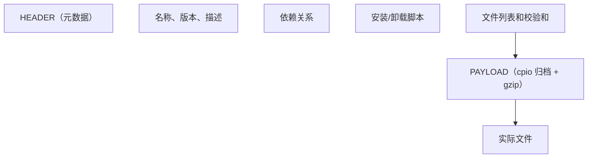
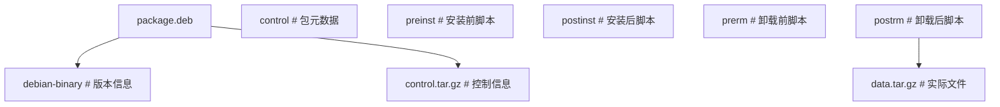
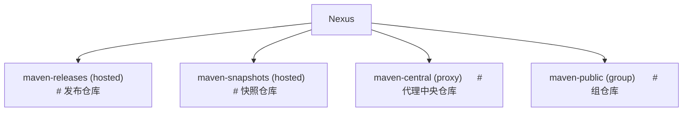

## 1. RPM 包管理

### 1.1 RPM 基础

RPM（Red Hat Package Manager）是 Red Hat 系列的包管理格式。

```bash
# 安装
rpm -ivh package.rpm      # 安装并显示进度
rpm -Uvh package.rpm      # 升级安装
rpm -Fvh package.rpm      # 仅升级（已安装才升级）

# 查询
rpm -qa                   # 列出所有已安装包
rpm -qi package           # 查看包信息
rpm -ql package           # 列出包文件
rpm -qf /path/file        # 查询文件所属包
rpm -qR package           # 查看依赖

# 卸载
rpm -e package            # 卸载包
rpm -e --nodeps package   # 忽略依赖卸载

# 验证
rpm -V package            # 验证包完整性
rpm --import RPM-GPG-KEY  # 导入GPG密钥
```

### 1.2 RPM 包结构

```
package-name-version-release.architecture.rpm
例: nginx-1.24.0-1.el9.x86_64.rpm

名称: nginx
版本: 1.24.0
发行号: 1.el9
架构: x86_64
```

RPM 包内部结构：



### 1.3 SPEC 文件

构建 RPM 包的核心配置文件：

```spec
Name:           myapp
Version:        1.0.0
Release:        1%{?dist}
Summary:        My Application

License:        MIT
URL:            https://example.com
Source0:        %{name}-%{version}.tar.gz

BuildRequires:  gcc, make
Requires:       openssl >= 1.1

%description
My application description.

%prep
%setup -q

%build
%configure
make %{?_smp_mflags}

%install
make install DESTDIR=%{buildroot}

%files
%doc README.md
%license LICENSE
%{_bindir}/myapp
%{_mandir}/man1/myapp.1*

%changelog
* Sat Jun 14 2026 fanquanpp <fanquanpp@example.com> - 1.0.0-1
- Initial package
```

## 2. DEB 包管理

### 2.1 dpkg 基础

```bash
# 安装
dpkg -i package.deb       # 安装
dpkg -r package           # 卸载（保留配置）
dpkg -P package           # 完全卸载

# 查询
dpkg -l                   # 列出所有已安装包
dpkg -l package           # 查看包状态
dpkg -L package           # 列出包文件
dpkg -S /path/file        # 查询文件所属包
dpkg -s package           # 查看包详细信息
```

### 2.2 DEB 包结构



**control 文件**：

```
Package: myapp
Version: 1.0.0
Architecture: amd64
Maintainer: fanquanpp <fanquanpp@example.com>
Description: My Application
 My application description.
Depends: libc6 (>= 2.31), libssl3
```

## 3. YUM/DNF 仓库

### 3.1 YUM/DNF 基础

```bash
# 安装
dnf install package
dnf install package-1.0.0   # 指定版本

# 更新
dnf update                  # 更新所有
dnf update package          # 更新指定包

# 查询
dnf search keyword          # 搜索包
dnf info package            # 查看包信息
dnf list installed          # 列出已安装包
dnf list available          # 列出可用包

# 依赖
dnf deplist package         # 查看依赖
dnf repoquery --requires package  # 查询依赖

# 清理
dnf clean all               # 清理缓存
dnf autoremove              # 删除不需要的依赖
```

### 3.2 配置仓库

```ini
# /etc/yum.repos.d/myrepo.repo
[myrepo]
name=My Custom Repository
baseurl=https://repo.example.com/centos/$releasever/$basearch/
enabled=1
gpgcheck=1
gpgkey=https://repo.example.com/RPM-GPG-KEY
priority=1
```

### 3.3 创建本地仓库

```bash
# 安装工具
dnf install createrepo

# 创建仓库
mkdir -p /repo/rpms
cp *.rpm /repo/rpms/
createrepo /repo/rpms/

# 更新仓库
createrepo --update /repo/rpms/
```

## 4. APT 仓库

### 4.1 APT 基础

```bash
# 安装
apt install package
apt install package=1.0.0    # 指定版本

# 更新
apt update                   # 更新索引
apt upgrade                  # 升级所有
apt full-upgrade             # 完整升级（可删除包）

# 查询
apt search keyword
apt show package
apt list --installed
apt depends package

# 清理
apt autoremove
apt clean
```

### 4.2 配置源

```bash
# /etc/apt/sources.list
deb https://mirrors.aliyun.com/ubuntu/ jammy main restricted
deb https://mirrors.aliyun.com/ubuntu/ jammy-updates main restricted
deb https://mirrors.aliyun.com/ubuntu/ jammy-security main restricted
```

格式：`deb URL distribution component`

### 4.3 创建 APT 仓库

```bash
# 安装工具
apt install dpkg-dev

# 创建仓库
mkdir -p /repo/debs
cp *.deb /repo/debs/
cd /repo
dpkg-scanpackages debs / | gzip > debs/Packages.gz
```

## 5. 制品仓库管理

### 5.1 Artifactory

JFrog Artifactory 是企业级制品仓库：

| 仓库类型 | 说明                   |
| -------- | ---------------------- |
| Local    | 本地仓库，存储内部制品 |
| Remote   | 远程仓库，代理外部仓库 |
| Virtual  | 虚拟仓库，聚合多个仓库 |

**支持的包格式**：Maven、npm、Docker、PyPI、RPM、DEB、Go、Helm 等。

### 5.2 Nexus

Sonatype Nexus 是另一个流行的制品仓库：



### 5.3 制品版本管理

**语义化版本（SemVer）**：

$$\text{MAJOR.MINOR.PATCH}$$

- MAJOR：不兼容的 API 变更
- MINOR：向后兼容的功能新增
- PATCH：向后兼容的问题修复

**版本范围**：

```
>=1.0.0 <2.0.0    # 兼容1.x
^1.2.3            # >=1.2.3 <2.0.0
~1.2.3            # >=1.2.3 <1.3.0
1.*               # 1.x任意版本
```

## 6. 安全与签名

### 6.1 GPG 签名

```bash
# 生成密钥对
gpg --full-generate-key

# 签名 RPM
rpm --addsign package.rpm

# 验证签名
rpm --checksig package.rpm

# 签名 DEB
dpkg-sig -s builder -k KEYID package.deb
```

### 6.2 仓库安全

- 启用 GPG 检查（gpgcheck=1）
- 使用 HTTPS 传输
- 定期轮换签名密钥
- 实施访问控制策略

## 参考文献

GitHub Actions 文档：https://docs.github.com/zh/actions
GitLab CI 文档：https://docs.gitlab.com/ci/
Argo CD：https://argo-cd.readthedocs.io/
DORA 研究：https://dora.dev/
DevOps 手册（Gene Kim 等）：https://itrevolution.com/devops-handbook/

## 延伸阅读

Docker 与 Kubernetes 深入，见 031-devops 模块文档。
CI/CD 管线设计，见 031-devops 模块 CICD 文档。
云原生架构，见 034-cloud-computing 模块。
尚硅谷 Bilibili 空间（https://space.bilibili.com/302417610 ）提供 DevOps 课程。

## 深度专题扩展

以下专题从不同角度深入本文主题，供有进阶需求的读者研读。每个专题独立成节，内容相互补充。

### 13.1 GitOps 与声明式交付

Git 是唯一事实来源：集群状态由仓库声明驱动，差异由控制器调和（Argo CD/Flux）。
PR 流程即变更审批，合并即发布意图；回滚 = revert 提交。
与 CI 衔接：CI 产出镜像，CD 更新清单引用新 digest。
安全：仓库签名、密钥加密（SOPS）、审计日志。

### 13.2 可观测性与 SLO

指标：RED（请求率、错误、时长）与 USE（利用率、饱和、错误）。
日志：结构化（JSON）、集中采集、关联 trace_id。
追踪：OpenTelemetry 传播上下文，瀑布分析延迟。
SLO/错误预算：目标可用性 99.9% 对应每月约 43 分钟不可用预算，驱动发布决策。

## 模块文档速查表

| 文档 | 主题 | 与本文的关联 |
| --- | --- | --- |
| 概述与 Linux 基础 | 001-OverviewLinuxBasics | 本文的前置基础 |
| 网络与安全 | 002-NetworkSecurity | 本文的安全延伸 |
| 容器与 Docker | 003-ContainerDocker | 本文的并列主题 |
| Kubernetes | 004-Kubernetes | 本文的并列主题 |
| CI/CD 流水线 | 005-CICDPipeline | 本文的并列主题 |
| 监控与可观测性 | 006-MonitorAndObservability | 本文的并列主题 |
| 基础设施即代码 | 007-IaC | 本文的前置基础 |
| 云原生与 SRE | 008-CloudNativeSRE | 本文的并列主题 |
| Shell脚本编程 | 009-ShellScriptProgramming | 本文的并列主题 |
| 包管理与仓库 | 010-PackageManagementRepository | 本文自身 |
| 服务网格 | 011-ServiceMesh | 本文的并列主题 |
| 日志管理 | 012-LogManagement | 本文的并列主题 |
| 配置管理 | 013-ConfigManagement | 本文的并列主题 |
| 性能调优 | 014-PerformanceTuning | 本文的性能延伸 |
| 高可用架构 | 015-HighAvailabilityArchitecture | 本文的原理深化 |
| 自动化测试 | 016-AutomationTest | 本文的并列主题 |
| 故障排查 | 017-Troubleshooting | 本文的并列主题 |
| 容器安全 | 018-ContainerSecurity | 本文的安全延伸 |
| GitOps与持续交付 | 019-GitOpsCD | 本文的并列主题 |
| 监控与告警 | 020-MonitorAndAlert | 本文的并列主题 |
| 网络与安全进阶 | 021-NetworkSecurityAdvanced | 本文的安全延伸 |
| 数据库运维 | 022-DatabaseOps | 本文的并列主题 |
| Dockerfile多阶段构建 | 023-DockerfileMultiBuild | 本文的并列主题 |
| Kubernetes核心资源详解 | 024-KubernetesCoreDetailed | 本文的并列主题 |
| Helm-Chart应用打包 | 025-HelmChartApplicationPackage | 本文的并列主题 |
| Terraform资源编排 | 026-Terraform | 本文的并列主题 |
| Ansible-Playbook配置管理 | 027-AnsiblePlaybookConfigManagement | 本文的并列主题 |
| Prometheus指标采集与告警 | 028-Prometheus | 本文的并列主题 |
| Grafana仪表盘配置 | 029-GrafanaTableConfig | 本文的并列主题 |
| ELK-Stack日志分析 | 030-ELKStackLogAnalysis | 本文的并列主题 |
| OpenTelemetry | 031-OpenTelemetry | 本文的并列主题 |
| GitOps与ArgoCD | 032-GitOpsArgoCD | 本文的并列主题 |
| DevOps kubectl 基础命令 | 033-KubectlBasics | 本文的前置基础 |
| DevOps Helm 包管理命令 | 034-HelmCommands | 本文的并列主题 |
| DevOps Jenkins Pipeline | 035-JenkinsPipeline | 本文的并列主题 |
| DevOps GitLab CI/CD | 036-GitLabCI | 本文的并列主题 |
