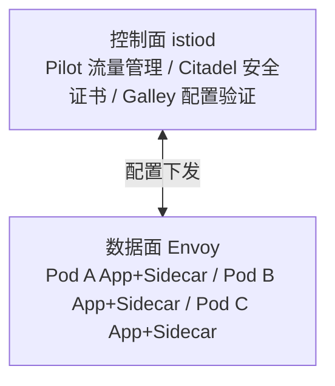

## 1. 服务网格概述

### 1.1 什么是服务网格

服务网格（Service Mesh）是处理服务间通信的基础设施层，通过 Sidecar 代理模式实现流量管理、安全和可观测性。

**传统微服务通信**：

```
服务A ──直接调用──→ 服务B
```

**服务网格通信**：

```
服务A → Sidecar(Envoy) → Sidecar(Envoy) → 服务B
```

### 1.2 服务网格 vs 传统方式

| 特性     | 传统（SDK集成） | 服务网格       |
| -------- | --------------- | -------------- |
| 代码侵入 | 高              | 无             |
| 语言绑定 | 特定语言        | 语言无关       |
| 升级方式 | 重新编译        | 独立升级       |
| 功能覆盖 | 有限            | 全面           |
| 性能开销 | 低              | 略高（额外跳） |

## 2. Istio 架构

### 2.1 核心组件



### 2.2 Envoy Sidecar

每个 Pod 自动注入 Envoy 代理，拦截所有入站和出站流量：

- **入站流量**：iptables 重定向到 Envoy → 转发到应用容器
- **出站流量**：应用容器 → iptables 重定向到 Envoy → 转发到目标

### 2.3 istiod 统一控制面

Istio 1.5+ 将 Pilot、Citadel、Galley 合并为 istiod：

- **Pilot**：服务发现、流量管理、配置分发
- **Citadel**：证书管理、mTLS
- **Galley**：配置验证和分发

## 3. 流量管理

### 3.1 VirtualService

定义请求路由规则：

```yaml
apiVersion: networking.istio.io/v1beta1
kind: VirtualService
metadata:
  name: my-service
spec:
  hosts:
    - my-service
  http:
    - match:
        - headers:
            x-version:
              exact: v2
      route:
        - destination:
            host: my-service
            subset: v2
    - route:
        - destination:
            host: my-service
            subset: v1
          weight: 90
        - destination:
            host: my-service
            subset: v2
          weight: 10
```

### 3.2 DestinationRule

定义目标服务的策略（负载均衡、连接池等）：

```yaml
apiVersion: networking.istio.io/v1beta1
kind: DestinationRule
metadata:
  name: my-service
spec:
  host: my-service
  trafficPolicy:
    connectionPool:
      tcp:
        maxConnections: 100
      http:
        h2UpgradePolicy: DEFAULT
        http1MaxPendingRequests: 100
    outlierDetection:
      consecutive5xxErrors: 3
      interval: 30s
      baseEjectionTime: 30s
  subsets:
    - name: v1
      labels:
        version: v1
    - name: v2
      labels:
        version: v2
      trafficPolicy:
        loadBalancer:
          simple: ROUND_ROBIN
```

### 3.3 金丝雀发布

```yaml
# 90% v1, 10% v2
apiVersion: networking.istio.io/v1beta1
kind: VirtualService
metadata:
  name: canary
spec:
  hosts:
    - my-app
  http:
    - route:
        - destination:
            host: my-app
            subset: v1
          weight: 90
        - destination:
            host: my-app
            subset: v2
          weight: 10
```

### 3.4 故障注入

```yaml
# 注入延迟
spec:
  http:
    - fault:
        delay:
          percentage:
            value: 100
          fixedDelay: 5s
      route:
        - destination:
            host: my-service

# 注入中断
spec:
  http:
    - fault:
        abort:
          percentage:
            value: 50
          httpStatus: 500
      route:
        - destination:
            host: my-service
```

### 3.5 重试与超时

```yaml
spec:
  http:
    - route:
        - destination:
            host: my-service
      retries:
        attempts: 3
        perTryTimeout: 2s
        retryOn: 5xx,reset,connect-failure
      timeout: 10s
```

## 4. 安全

### 4.1 mTLS（双向 TLS）

Istio 自动为服务间通信启用 mTLS：

```yaml
apiVersion: security.istio.io/v1beta1
kind: PeerAuthentication
metadata:
  name: default
  namespace: istio-system
spec:
  mtls:
    mode: STRICT # 严格模式：只允许mTLS
```

| 模式       | 说明                 |
| ---------- | -------------------- |
| UNSET      | 继承父级策略         |
| DISABLE    | 禁用 mTLS            |
| PERMISSIVE | 同时接受 mTLS 和明文 |
| STRICT     | 仅接受 mTLS          |

### 4.2 授权策略

```yaml
apiVersion: security.istio.io/v1beta1
kind: AuthorizationPolicy
metadata:
  name: httpbin-policy
  namespace: default
spec:
  selector:
    matchLabels:
      app: httpbin
  action: ALLOW
  rules:
    - from:
        - source:
            principals: ['cluster.local/ns/default/sa/sleep']
      to:
        - operation:
            methods: ['GET']
            paths: ['/info*']
      when:
        - key: request.headers[x-token]
          values: ['valid-token']
```

### 4.3 网关

```yaml
apiVersion: networking.istio.io/v1beta1
kind: Gateway
metadata:
  name: my-gateway
spec:
  selector:
    istio: ingressgateway
  servers:
    - port:
        number: 443
        name: https
        protocol: HTTPS
      tls:
        mode: SIMPLE
        credentialName: my-cert
      hosts:
        - '*.example.com'
```

## 5. 可观测性

### 5.1 指标

Istio 自动生成服务网格指标：

| 指标                                | 说明     |
| ----------------------------------- | -------- |
| istio_requests_total                | 请求总数 |
| istio_request_duration_milliseconds | 请求延迟 |
| istio_request_bytes                 | 请求大小 |
| istio_response_bytes                | 响应大小 |

Prometheus 查询示例：

```promql
# 服务成功率
sum(rate(istio_requests_total{response_code!~"5.*"}[5m]))
/
sum(rate(istio_requests_total[5m]))

# P99 延迟
histogram_quantile(0.99,
  sum(rate(istio_request_duration_milliseconds_bucket[5m]))
  by (le, destination_service))
```

### 5.2 分布式追踪

Istio 自动为请求添加追踪头并上报：

- 支持的追踪后端：Jaeger、Zipkin、Lightstep
- 自动传播 B3 追踪头
- 采样率可配置

### 5.3 访问日志

```yaml
apiVersion: telemetry.istio.io/v1alpha1
kind: Telemetry
metadata:
  name: default
spec:
  accessLogging:
    - providers:
        - name: otel
      outputFormat:
        labels:
          request_method: '%REQ(:METHOD)%'
          request_path: '%REQ(:PATH)%'
          response_code: '%RESPONSE_CODE%'
```

## 6. 其他服务网格

### 6.1 Linkerd

- 轻量级，Rust 实现的微代理
- 配置简单，开箱即用
- 资源开销小

### 6.2 Consul Connect

- HashiCorp 出品
- 与 Consul 服务发现深度集成
- 支持多平台（K8s + VM）

### 6.3 对比

| 特性     | Istio  | Linkerd        | Consul Connect |
| -------- | ------ | -------------- | -------------- |
| 代理     | Envoy  | linkerd2-proxy | Envoy          |
| 复杂度   | 高     | 低             | 中             |
| 功能     | 最全面 | 核心功能       | 核心功能       |
| 性能开销 | 较高   | 低             | 中             |
| 社区     | 最大   | 活跃           | 活跃           |

## 参考文献

GitHub Actions 文档：https://docs.github.com/zh/actions
GitLab CI 文档：https://docs.gitlab.com/ci/
Argo CD：https://argo-cd.readthedocs.io/
DORA 研究：https://dora.dev/
DevOps 手册（Gene Kim 等）：https://itrevolution.com/devops-handbook/

## 延伸阅读

Docker 与 Kubernetes 深入，见 031-devops 模块文档。
CI/CD 管线设计，见 031-devops 模块 CICD 文档。
云原生架构，见 034-cloud-computing 模块。
尚硅谷 Bilibili 空间（https://space.bilibili.com/302417610 ）提供 DevOps 课程。

## 深度专题扩展

以下专题从不同角度深入本文主题，供有进阶需求的读者研读。每个专题独立成节，内容相互补充。

### 13.1 GitOps 与声明式交付

Git 是唯一事实来源：集群状态由仓库声明驱动，差异由控制器调和（Argo CD/Flux）。
PR 流程即变更审批，合并即发布意图；回滚 = revert 提交。
与 CI 衔接：CI 产出镜像，CD 更新清单引用新 digest。
安全：仓库签名、密钥加密（SOPS）、审计日志。

### 13.2 可观测性与 SLO

指标：RED（请求率、错误、时长）与 USE（利用率、饱和、错误）。
日志：结构化（JSON）、集中采集、关联 trace_id。
追踪：OpenTelemetry 传播上下文，瀑布分析延迟。
SLO/错误预算：目标可用性 99.9% 对应每月约 43 分钟不可用预算，驱动发布决策。

## 模块文档速查表

| 文档 | 主题 | 与本文的关联 |
| --- | --- | --- |
| 概述与 Linux 基础 | 001-OverviewLinuxBasics | 本文的前置基础 |
| 网络与安全 | 002-NetworkSecurity | 本文的安全延伸 |
| 容器与 Docker | 003-ContainerDocker | 本文的并列主题 |
| Kubernetes | 004-Kubernetes | 本文的并列主题 |
| CI/CD 流水线 | 005-CICDPipeline | 本文的并列主题 |
| 监控与可观测性 | 006-MonitorAndObservability | 本文的并列主题 |
| 基础设施即代码 | 007-IaC | 本文的前置基础 |
| 云原生与 SRE | 008-CloudNativeSRE | 本文的并列主题 |
| Shell脚本编程 | 009-ShellScriptProgramming | 本文的并列主题 |
| 包管理与仓库 | 010-PackageManagementRepository | 本文的并列主题 |
| 服务网格 | 011-ServiceMesh | 本文自身 |
| 日志管理 | 012-LogManagement | 本文的并列主题 |
| 配置管理 | 013-ConfigManagement | 本文的并列主题 |
| 性能调优 | 014-PerformanceTuning | 本文的性能延伸 |
| 高可用架构 | 015-HighAvailabilityArchitecture | 本文的原理深化 |
| 自动化测试 | 016-AutomationTest | 本文的并列主题 |
| 故障排查 | 017-Troubleshooting | 本文的并列主题 |
| 容器安全 | 018-ContainerSecurity | 本文的安全延伸 |
| GitOps与持续交付 | 019-GitOpsCD | 本文的并列主题 |
| 监控与告警 | 020-MonitorAndAlert | 本文的并列主题 |
| 网络与安全进阶 | 021-NetworkSecurityAdvanced | 本文的安全延伸 |
| 数据库运维 | 022-DatabaseOps | 本文的并列主题 |
| Dockerfile多阶段构建 | 023-DockerfileMultiBuild | 本文的并列主题 |
| Kubernetes核心资源详解 | 024-KubernetesCoreDetailed | 本文的并列主题 |
| Helm-Chart应用打包 | 025-HelmChartApplicationPackage | 本文的并列主题 |
| Terraform资源编排 | 026-Terraform | 本文的并列主题 |
| Ansible-Playbook配置管理 | 027-AnsiblePlaybookConfigManagement | 本文的并列主题 |
| Prometheus指标采集与告警 | 028-Prometheus | 本文的并列主题 |
| Grafana仪表盘配置 | 029-GrafanaTableConfig | 本文的并列主题 |
| ELK-Stack日志分析 | 030-ELKStackLogAnalysis | 本文的并列主题 |
| OpenTelemetry | 031-OpenTelemetry | 本文的并列主题 |
| GitOps与ArgoCD | 032-GitOpsArgoCD | 本文的并列主题 |
| DevOps kubectl 基础命令 | 033-KubectlBasics | 本文的前置基础 |
| DevOps Helm 包管理命令 | 034-HelmCommands | 本文的并列主题 |
| DevOps Jenkins Pipeline | 035-JenkinsPipeline | 本文的并列主题 |
| DevOps GitLab CI/CD | 036-GitLabCI | 本文的并列主题 |
