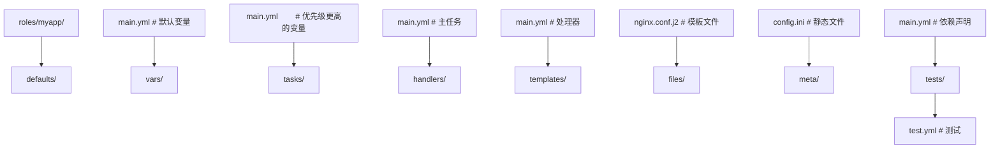
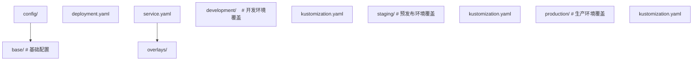

## 1. 配置管理概述

### 1.1 配置管理原则

- **基础设施即代码**：所有配置以代码形式管理
- **版本控制**：配置变更可追踪
- **幂等性**：多次执行结果相同
- **不可变基础设施**：替换而非修改

### 1.2 配置管理工具对比

| 工具      | 语言   | Agent | 模式  |
| --------- | ------ | ----- | ----- |
| Ansible   | YAML   | 无    | 推送  |
| Puppet    | Ruby   | 有    | 拉取  |
| Chef      | Ruby   | 有    | 拉取  |
| SaltStack | Python | 有    | 推/拉 |

## 2. Ansible

### 2.1 核心概念

| 概念      | 说明     |
| --------- | -------- |
| Inventory | 主机清单 |
| Module    | 功能模块 |
| Playbook  | 任务剧本 |
| Role      | 角色封装 |
| Task      | 具体任务 |

### 2.2 Inventory

```ini
# ini 格式
[webservers]
web1 ansible_host=192.168.1.10
web2 ansible_host=192.168.1.11

[dbservers]
db1 ansible_host=192.168.1.20

[production:children]
webservers
dbservers

[production:vars]
ansible_user=deploy
ansible_ssh_private_key_file=~/.ssh/deploy_key
```

```yaml
# YAML 格式
all:
  children:
    webservers:
      hosts:
        web1:
          ansible_host: 192.168.1.10
        web2:
          ansible_host: 192.168.1.11
    dbservers:
      hosts:
        db1:
          ansible_host: 192.168.1.20
```

### 2.3 Playbook

```yaml
---
- name: Deploy Web Application
  hosts: webservers
  become: yes
  vars:
    app_name: myapp
    app_port: 8080

  tasks:
    - name: Install dependencies
      apt:
        name:
          - nginx
          - python3
          - python3-pip
        state: present
        update_cache: yes

    - name: Copy application code
      synchronize:
        src: /opt/myapp/
        dest: /opt/myapp/
        delete: yes

    - name: Install Python dependencies
      pip:
        requirements: /opt/myapp/requirements.txt
        virtualenv: /opt/myapp/venv

    - name: Configure nginx
      template:
        src: nginx.conf.j2
        dest: /etc/nginx/sites-available/myapp
      notify: Reload nginx

    - name: Enable site
      file:
        src: /etc/nginx/sites-available/myapp
        dest: /etc/nginx/sites-enabled/myapp
        state: link
      notify: Reload nginx

    - name: Start application
      systemd:
        name: myapp
        state: started
        enabled: yes

  handlers:
    - name: Reload nginx
      systemd:
        name: nginx
        state: reloaded
```

### 2.4 常用模块

| 模块             | 用途                |
| ---------------- | ------------------- |
| apt/yum          | 包管理              |
| copy/template    | 文件分发            |
| service/systemd  | 服务管理            |
| user/group       | 用户管理            |
| file             | 文件/目录管理       |
| command/shell    | 执行命令            |
| git              | 代码拉取            |
| docker_container | Docker 管理         |
| k8s              | Kubernetes 资源管理 |

### 2.5 Role 结构



## 3. 配置中心

### 3.1 集中式配置

**Spring Cloud Config**：

```yaml
# config-server 配置
spring:
  cloud:
    config:
      server:
        git:
          uri: https://github.com/org/config-repo
          searchPaths: '{application}/{profile}'
```

**Nacos**：

```bash
# 发布配置
curl -X POST "http://nacos:8848/nacos/v1/cs/configs" \
  -d "dataId=myapp.properties&group=DEFAULT_GROUP&content=server.port=8080"

# 获取配置
curl "http://nacos:8848/nacos/v1/cs/configs?dataId=myapp.properties&group=DEFAULT_GROUP"
```

### 3.2 配置优先级

```
命令行参数 > 环境变量 > 配置中心 > 本地配置文件 > 默认值
```

### 3.3 配置热更新

- **推送模式**：配置中心主动通知应用
- **拉取模式**：应用定期轮询
- **长轮询**：应用发起长连接等待变更

## 4. 环境管理

### 4.1 环境隔离策略

| 策略         | 说明          | 适用场景     |
| ------------ | ------------- | ------------ |
| 命名空间隔离 | K8s namespace | 同集群多环境 |
| 集群隔离     | 独立 K8s 集群 | 生产环境     |
| 账号隔离     | 云账号隔离    | 合规要求     |

### 4.2 环境配置管理



**Kustomize**：

```yaml
# overlays/production/kustomization.yaml
apiVersion: kustomize.config.k8s.io/v1beta1
kind: Kustomization
bases:
  - ../../base
patchesStrategicMerge:
  - deployment-patch.yaml
replicas:
  - name: myapp
    count: 5
```

## 5. 密钥管理

### 5.1 密钥管理原则

- 密钥不硬编码
- 密钥不入版本控制
- 密钥加密存储
- 密钥定期轮换
- 最小权限原则

### 5.2 HashiCorp Vault

```bash
# 启动 Vault
vault server -dev

# 写入密钥
vault kv put secret/myapp db_password="s3cret" api_key="key123"

# 读取密钥
vault kv get secret/myapp

# 动态数据库凭证
vault secrets enable database
vault write database/config/mydb \
  plugin_name=mysql-database-plugin \
  connection_url="{{username}}:{{password}}@tcp(db:3306)/" \
  allowed_roles="readonly"

vault write database/roles/readonly \
  db_name=mydb \
  creation_statements="CREATE USER '{{name}}'@'%' IDENTIFIED BY '{{password}}'; GRANT SELECT ON *.* TO '{{name}}'@'%';" \
  default_ttl="1h" max_ttl="24h"
```

### 5.3 Kubernetes Secrets

```yaml
apiVersion: v1
kind: Secret
metadata:
  name: myapp-secret
type: Opaque
data:
  db-password: c2VjcmV0 # base64 编码
stringData:
  api-key: 'plain-text' # 明文（创建时编码）
```

**加密存储**：

```yaml
# encryption-config.yaml
apiVersion: apiserver.config.k8s.io/v1
kind: EncryptionConfiguration
resources:
  - resources:
      - secrets
    providers:
      - aescbc:
          keys:
            - name: key1
              secret: <base64-encoded-key>
      - identity: {}
```

### 5.4 External Secrets Operator

从外部密钥管理器同步到 K8s Secrets：

```yaml
apiVersion: external-secrets.io/v1beta1
kind: ExternalSecret
metadata:
  name: myapp-secret
spec:
  refreshInterval: 1h
  secretStoreRef:
    name: vault-backend
    kind: ClusterSecretStore
  target:
    name: myapp-secret
  data:
    - secretKey: db-password
      remoteRef:
        key: secret/myapp
        property: db_password
```

## 6. GitOps

### 6.1 GitOps 原则

1. 声明式：系统描述是声明式的
2. 版本控制：期望状态存储在 Git
3. 自动拉取：自动应用期望状态
4. 持续协调：持续确保实际状态与期望一致

### 6.2 ArgoCD

```yaml
apiVersion: argoproj.io/v1alpha1
kind: Application
metadata:
  name: myapp
  namespace: argocd
spec:
  project: default
  source:
    repoURL: https://github.com/org/manifests.git
    targetRevision: HEAD
    path: overlays/production
  destination:
    server: https://kubernetes.default.svc
    namespace: myapp
  syncPolicy:
    automated:
      prune: true
      selfHeal: true
    syncOptions:
      - CreateNamespace=true
```

### 6.3 Flux

```yaml
apiVersion: source.toolkit.fluxcd.io/v1beta2
kind: GitRepository
metadata:
  name: myapp
spec:
  url: https://github.com/org/manifests.git
  ref:
    branch: main
  interval: 1m
---
apiVersion: kustomize.toolkit.fluxcd.io/v1beta2
kind: Kustomization
metadata:
  name: myapp
spec:
  sourceRef:
    kind: GitRepository
    name: myapp
  interval: 5m
  prune: true
  healthChecks:
    - apiVersion: apps/v1
      kind: Deployment
      name: myapp
      namespace: default
```

## 参考文献


GitHub Actions 文档：https://docs.github.com/zh/actions
GitLab CI 文档：https://docs.gitlab.com/ci/
Argo CD：https://argo-cd.readthedocs.io/
DORA 研究：https://dora.dev/
DevOps 手册（Gene Kim 等）：https://itrevolution.com/devops-handbook/

## 延伸阅读


Docker 与 Kubernetes 深入，见 031-devops 模块文档。
CI/CD 管线设计，见 031-devops 模块 CICD 文档。
云原生架构，见 034-cloud-computing 模块。
尚硅谷 Bilibili 空间（https://space.bilibili.com/302417610 ）提供 DevOps 课程。

## 深度专题扩展


以下专题从不同角度深入本文主题，供有进阶需求的读者研读。每个专题独立成节，内容相互补充。

### 13.1 GitOps 与声明式交付

Git 是唯一事实来源：集群状态由仓库声明驱动，差异由控制器调和（Argo CD/Flux）。
PR 流程即变更审批，合并即发布意图；回滚 = revert 提交。
与 CI 衔接：CI 产出镜像，CD 更新清单引用新 digest。
安全：仓库签名、密钥加密（SOPS）、审计日志。

### 13.2 可观测性与 SLO

指标：RED（请求率、错误、时长）与 USE（利用率、饱和、错误）。
日志：结构化（JSON）、集中采集、关联 trace_id。
追踪：OpenTelemetry 传播上下文，瀑布分析延迟。
SLO/错误预算：目标可用性 99.9% 对应每月约 43 分钟不可用预算，驱动发布决策。

## 模块文档速查表

| 文档 | 主题 | 与本文的关联 |
| --- | --- | --- |
| 概述与 Linux 基础 | 001-OverviewLinuxBasics | 本文的前置基础 |
| 网络与安全 | 002-NetworkSecurity | 本文的安全延伸 |
| 容器与 Docker | 003-ContainerDocker | 本文的并列主题 |
| Kubernetes | 004-Kubernetes | 本文的并列主题 |
| CI/CD 流水线 | 005-CICDPipeline | 本文的并列主题 |
| 监控与可观测性 | 006-MonitorAndObservability | 本文的并列主题 |
| 基础设施即代码 | 007-IaC | 本文的前置基础 |
| 云原生与 SRE | 008-CloudNativeSRE | 本文的并列主题 |
| Shell脚本编程 | 009-ShellScriptProgramming | 本文的并列主题 |
| 包管理与仓库 | 010-PackageManagementRepository | 本文的并列主题 |
| 服务网格 | 011-ServiceMesh | 本文的并列主题 |
| 日志管理 | 012-LogManagement | 本文的并列主题 |
| 配置管理 | 013-ConfigManagement | 本文自身 |
| 性能调优 | 014-PerformanceTuning | 本文的性能延伸 |
| 高可用架构 | 015-HighAvailabilityArchitecture | 本文的原理深化 |
| 自动化测试 | 016-AutomationTest | 本文的并列主题 |
| 故障排查 | 017-Troubleshooting | 本文的并列主题 |
| 容器安全 | 018-ContainerSecurity | 本文的安全延伸 |
| GitOps与持续交付 | 019-GitOpsCD | 本文的并列主题 |
| 监控与告警 | 020-MonitorAndAlert | 本文的并列主题 |
| 网络与安全进阶 | 021-NetworkSecurityAdvanced | 本文的安全延伸 |
| 数据库运维 | 022-DatabaseOps | 本文的并列主题 |
| Dockerfile多阶段构建 | 023-DockerfileMultiBuild | 本文的并列主题 |
| Kubernetes核心资源详解 | 024-KubernetesCoreDetailed | 本文的并列主题 |
| Helm-Chart应用打包 | 025-HelmChartApplicationPackage | 本文的并列主题 |
| Terraform资源编排 | 026-Terraform | 本文的并列主题 |
| Ansible-Playbook配置管理 | 027-AnsiblePlaybookConfigManagement | 本文的并列主题 |
| Prometheus指标采集与告警 | 028-Prometheus | 本文的并列主题 |
| Grafana仪表盘配置 | 029-GrafanaTableConfig | 本文的并列主题 |
| ELK-Stack日志分析 | 030-ELKStackLogAnalysis | 本文的并列主题 |
| OpenTelemetry | 031-OpenTelemetry | 本文的并列主题 |
| GitOps与ArgoCD | 032-GitOpsArgoCD | 本文的并列主题 |
| DevOps kubectl 基础命令 | 033-KubectlBasics | 本文的前置基础 |
| DevOps Helm 包管理命令 | 034-HelmCommands | 本文的并列主题 |
| DevOps Jenkins Pipeline | 035-JenkinsPipeline | 本文的并列主题 |
| DevOps GitLab CI/CD | 036-GitLabCI | 本文的并列主题 |
