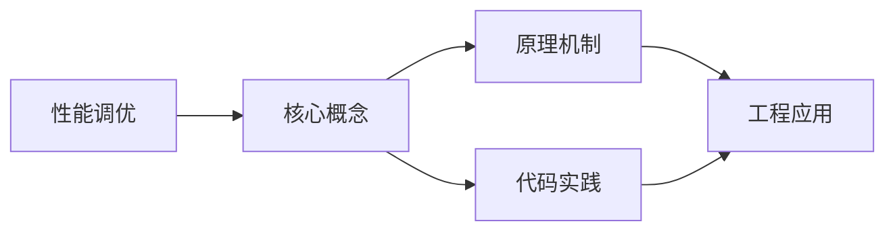
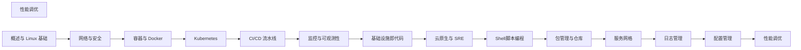

## 1. 学习目标（Bloom 分类）

本节按照布鲁姆教育目标分类学组织学习路径。本文主题为《性能调优》，属于 DevOps 模块，读者可以根据自身阶段选择阅读深度。

记忆层面：能够准确复述本文的核心概念、术语与基本语法或操作步骤，并能够在提问或检索时快速定位对应知识点。能够说出 DevOps 的核心概念、组件与标准流程。

理解层面：能够用自己的语言解释核心原理与工作机制，说明概念之间的因果关系，而不是机械记忆结论。能够解释 DevOps 的工作原理与关键机制。

应用层面：能够在真实项目或练习场景中运用本文知识解决具体问题，写出正确且可维护的实现。能够执行 DevOps 相关的标准操作与配置。

分析层面：能够拆解复杂问题，比较本文主题与相邻概念的异同，识别边界条件与例外情况。能够分析 DevOps 方案在可靠性、成本与性能上的权衡。

评价层面：能够根据约束条件（性能、可读性、安全、成本）评价不同方案的优劣，做出有依据的技术决策。能够评价 DevOps 中的技术选型。

创造层面：能够把本文知识与其他模块知识组合，设计出新的解决方案或可复用的工程模式。能够设计基于 DevOps 的完整解决方案。

通过本节学习，读者应当能够把《性能调优》纳入自己的知识网络，并与 DevOps 模块的其他主题（CI/CD、容器、编排、监控、GitOps）建立关联。

## 2. 历史动机与发展脉络

《性能调优》是 DevOps 领域的重要主题。要真正理解它，需要先了解它解决的问题与演进过程。

DevOps 源于 2009 年（“DevOpsDays”），核心是打破开发与运维壁垒，用自动化与协作缩短交付周期；CALMS 文化（文化、自动化、精益、度量、共享）是其框架。
技术栈演进：持续集成（CI）与持续交付（CD）、基础设施即代码（IaC）、容器（Docker）与编排（Kubernetes）、可观测性（监控/日志/追踪）。
2020 年代趋势：GitOps（声明式 + 自动同步）、平台工程（内部开发者平台）、FinOps（成本治理）、AI 辅助运维。

回到本文主题：性能调优 的提出与成熟，正是上述技术背景下的必然产物。早期实现往往以简单可用为目标，随着工程规模扩大，社区逐渐沉淀出标准做法与最佳实践；理解这一脉络，可以帮助读者判断“为什么文档中的推荐写法是现在这个样子”，也能在遇到历史遗留代码时准确识别其设计年代与取舍。


## 3. 形式化定义与核心概念精讲

本节把《性能调优》涉及的核心概念以“定义 + 讲解”的形式展开。读者应把定义当作工具，把讲解当作理解路径；两者结合才能形成可迁移的知识。

CI/CD 管线：代码提交 -> 构建 -> 测试 -> 制品 -> 部署；流水线即代码（GitHub Actions/Jenkins/GitLab CI）。
容器与镜像：OCI 规范、Dockerfile 分层、镜像仓库与签名；容器隔离（cgroup/namespace）。
编排：Kubernetes 的 Pod/Deployment/Service 抽象；声明式期望状态与控制器调和。

### 3.1 原文章节逐一精讲

原文档把主题拆分为 7 个小节，下面按顺序给出每一节的导读讲解，随后保留原文细节供精读。

#### 原文精读（完整保留）


#### 1. 性能调优方法论

##### 1.1 USE 方法

对每个资源检查：

- **Utilization（利用率）**：资源忙碌的时间比例
- **Saturation（饱和度）**：资源排队等待的程度
- **Errors（错误）**：错误事件计数

##### 1.2 性能分析流程

```
1. 定义性能目标
2. 建立基准（Baseline）
3. 识别瓶颈
4. 提出假设
5. 验证假设
6. 实施优化
7. 验证效果
8. 重复3-7
```

##### 1.3 阿姆达尔定律

$$S = \frac{1}{(1-f) + f/s}$$

其中 $f$ 为可优化部分的比例，$s$ 为优化倍数。

#### 2. CPU 性能分析

##### 2.1 CPU 指标

| 指标       | 含义              | 工具             |
| ---------- | ----------------- | ---------------- |
| CPU 利用率 | 用户+系统时间占比 | top, vmstat      |
| 运行队列   | 等待运行的进程数  | vmstat           |
| 上下文切换 | 进程切换次数      | vmstat           |
| 中断次数   | 硬件/软件中断     | /proc/interrupts |

##### 2.2 分析工具

```bash
# CPU 使用概况
top -H -p <pid>        # 按线程查看
htop                    # 交互式

# CPU 火焰图
perf record -g -p <pid>
perf script | stackcollapse-perf.pl | flamegraph.pl > cpu.svg

# 系统调用追踪
strace -c -p <pid>     # 统计系统调用
strace -e trace=network -p <pid>  # 追踪网络调用

# 上下文切换分析
perf stat -e context-switches -p <pid>
```

##### 2.3 CPU 优化策略

| 策略       | 方法               |
| ---------- | ------------------ |
| 减少计算   | 算法优化、缓存结果 |
| 并行化     | 多线程、异步       |
| CPU 亲和性 | taskset 绑核       |
| 调度优先级 | nice/renice        |
| 中断均衡   | IRQ 亲和性         |

#### 3. 内存性能分析

##### 3.1 内存指标

```bash
# 内存使用
free -h
cat /proc/meminfo

# 详细信息
vmstat 1              # 每秒统计

# 进程内存
pmap -x <pid>         # 进程内存映射
smem -t -k            # 按进程排序
```

**关键指标**：

| 指标          | 含义                     |
| ------------- | ------------------------ |
| used          | 已使用内存               |
| free          | 空闲内存                 |
| buffers/cache | 内核缓冲和缓存           |
| available     | 可用内存（含可回收缓存） |
| swap used     | 交换空间使用量           |

##### 3.2 页缓存与脏页

```bash
# 查看脏页
cat /proc/meminfo | grep -i dirty

# 手动刷盘
sync

# 调整脏页阈值
sysctl vm.dirty_ratio=20              # 脏页占总内存20%时刷盘
sysctl vm.dirty_background_ratio=10   # 后台刷盘阈值
```

##### 3.3 OOM 管理

```bash
# OOM 分数
cat /proc/<pid>/oom_score
cat /proc/<pid>/oom_score_adj

# 禁止 OOM Kill
echo -1000 > /proc/<pid>/oom_score_adj

# 查看 OOM 日志
dmesg | grep -i oom
journalctl -k | grep -i oom
```

##### 3.4 内存优化

| 策略     | 方法            |
| -------- | --------------- |
| 减少分配 | 对象池、复用    |
| 减少拷贝 | 零拷贝、mmap    |
| 调整 GC  | 堆大小、GC 策略 |
| 大页     | HugePages       |
| 交换优化 | 调整 swappiness |

#### 4. 磁盘 I/O 性能

##### 4.1 I/O 指标

| 指标     | 含义             |
| -------- | ---------------- |
| IOPS     | 每秒 I/O 操作数  |
| 吞吐量   | 每秒传输数据量   |
| 延迟     | I/O 操作响应时间 |
| 队列深度 | 等待中的 I/O 数  |

##### 4.2 分析工具

```bash
# I/O 统计
iostat -xz 1          # 每秒统计
iotop                  # 按进程 I/O 排序

# I/O 延迟分析
biolatency             # eBPF 块 I/O 延迟直方图
biosnoop               # 每次 I/O 追踪

# 文件系统追踪
ext4slower            # eBPF 追踪慢 ext4 操作
```

##### 4.3 I/O 调度器

| 调度器      | 特点            | 适用场景 |
| ----------- | --------------- | -------- |
| noop        | 简单 FIFO       | SSD      |
| deadline    | 保证延迟        | 数据库   |
| cfq         | 公平分配        | 通用     |
| mq-deadline | 多队列 deadline | NVMe SSD |
| bfq         | 公平+低延迟     | 桌面     |

```bash
# 查看当前调度器
cat /sys/block/sda/queue/scheduler

# 修改调度器
echo deadline > /sys/block/sda/queue/scheduler
```

#### 5. 网络性能

##### 5.1 网络指标

| 指标   | 含义         |
| ------ | ------------ |
| 带宽   | 最大传输速率 |
| 吞吐量 | 实际传输速率 |
| 延迟   | 网络往返时间 |
| 丢包率 | 丢失包的比例 |
| 重传率 | 重传包的比例 |

##### 5.2 分析工具

```bash
# 连接统计
ss -s                  # 连接概览
ss -tnp                # TCP 连接详情

# 网络统计
sar -n DEV 1           # 网卡流量
sar -n TCP,ETCP 1      # TCP 统计

# 延迟测试
ping -c 10 target
mtr target             # 路由追踪+延迟

# 带宽测试
iperf3 -s              # 服务端
iperf3 -c server       # 客户端

# TCP 追踪
tcplife                # eBPF TCP 连接生命周期
tcpretrans             # eBPF TCP 重传
```

##### 5.3 内核参数优化

```bash
# TCP 缓冲区
sysctl net.core.rmem_max=16777216
sysctl net.core.wmem_max=16777216
sysctl net.ipv4.tcp_rmem='4096 87380 16777216'
sysctl net.ipv4.tcp_wmem='4096 65536 16777216'

# 连接队列
sysctl net.core.somaxconn=65535
sysctl net.ipv4.tcp_max_syn_backlog=65535

# TIME_WAIT 优化
sysctl net.ipv4.tcp_tw_reuse=1
sysctl net.ipv4.tcp_fin_timeout=15

# 保活
sysctl net.ipv4.tcp_keepalive_time=600
sysctl net.ipv4.tcp_keepalive_intvl=30
sysctl net.ipv4.tcp_keepalive_probes=3
```

#### 6. 应用性能

##### 6.1 性能剖析（Profiling）

| 语言    | CPU Profiler        | 内存 Profiler |
| ------- | ------------------- | ------------- |
| Java    | async-profiler, JFR | jmap, MAT     |
| Go      | pprof               | pprof         |
| Python  | cProfile, py-spy    | memray        |
| Node.js | --prof, clinic      | --inspect     |
| Rust    | perf, flamegraph    | valgrind      |

##### 6.2 连接池优化

$$\text{最优连接数} \approx \text{CPU核心数} \times (1 + \frac{\text{等待时间}}{\text{计算时间}})$$

##### 6.3 缓存策略

| 缓存层      | 命中率目标 | 典型延迟 |
| ----------- | ---------- | -------- |
| L1/L2 Cache | >95%       | ~1ns     |
| 应用缓存    | >80%       | ~1ms     |
| Redis       | >70%       | ~1ms     |
| CDN         | >90%       | ~10ms    |

#### 7. 压力测试

##### 7.1 压测工具

| 工具     | 特点        | 协议   |
| -------- | ----------- | ------ |
| wrk/wrk2 | 高性能      | HTTP   |
| JMeter   | 功能全面    | 多协议 |
| Locust   | Python 编写 | HTTP   |
| k6       | JavaScript  | HTTP   |
| Gatling  | Scala       | HTTP   |

##### 7.2 wrk 使用

```bash
# 基本压测
wrk -t4 -c100 -d30s http://target/

# 延迟分布
wrk -t4 -c100 -d30s --latency http://target/

# 自定义脚本
wrk -t4 -c100 -d30s -s post.lua http://target/
```

##### 7.3 性能基准

| 指标     | 优秀   | 良好   | 需优化 |
| -------- | ------ | ------ | ------ |
| P50 延迟 | <10ms  | <50ms  | >100ms |
| P99 延迟 | <50ms  | <200ms | >500ms |
| 错误率   | <0.01% | <0.1%  | >1%    |
| QPS      | >10000 | >1000  | <100   |


### 3.2 概念关系图

下面用 Mermaid 图表达本文核心概念之间的关系，帮助读者建立整体图景：



图中展示的是本文知识的结构化关系：核心概念是入口，原理机制解释“为什么”，代码实践演示“怎么做”，工程应用回答“何时用”。读者学习时可以把每个小节的内容挂接到对应节点上。

## 4. 理论推导与原理解析

本节深入《性能调优》背后的原理。理论部分不求面面俱到，而是聚焦“能解释现象、能指导实践”的关键推导。

CI/CD 管线：代码提交 -> 构建 -> 测试 -> 制品 -> 部署；流水线即代码（GitHub Actions/Jenkins/GitLab CI）。
容器与镜像：OCI 规范、Dockerfile 分层、镜像仓库与签名；容器隔离（cgroup/namespace）。
编排：Kubernetes 的 Pod/Deployment/Service 抽象；声明式期望状态与控制器调和。
可观测性三支柱：指标（Prometheus）、日志（Loki/ELK）、追踪（OpenTelemetry）。

需要强调的是，理论推导与工程实践之间存在翻译层：理论给出的是理想化模型与边界条件，工程代码则必须处理真实环境中的例外。读者在学习时应先掌握理论的“标准情形”，再通过陷阱章节了解“非标准情形”。

## 5. 代码示例与逐行讲解

本节把原文中的代码示例系统整理，并为每个示例补充用途说明与讲解。读者不应只浏览代码，而应逐段对照讲解理解设计意图。

### 5.1 示例：1.2 性能分析流程

该示例来自原文《1.2 性能分析流程》小节，用于演示性能调优相关操作。阅读时请先看代码结构，再看其后的讲解。

```text
1. 定义性能目标
2. 建立基准（Baseline）
3. 识别瓶颈
4. 提出假设
5. 验证假设
6. 实施优化
7. 验证效果
8. 重复3-7
```

讲解：这段代码演示了本节核心知识点。代码中的关键操作可以归纳为三步：准备（定义或初始化）、执行（核心逻辑）、收尾（释放资源或返回结果）。实际项目中，这三步往往被封装为函数或类，以提升复用性与可测试性。

关键点分析：

该示例共 8 行有效代码，结构以数据或配置为主。阅读时应关注：数据字段的含义、配置项的作用，以及它们与运行行为的对应关系。

进阶思考路径：先尝试修改参数观察行为变化，再把示例中的模式迁移到自己的项目中；每次修改都记录预期与实测差异，这是把示例转化为能力的最快方式。

### 5.2 示例：2.2 分析工具

该示例来自原文《2.2 分析工具》小节，用于演示性能调优相关操作。阅读时请先看代码结构，再看其后的讲解。

```bash
# CPU 使用概况
top -H -p <pid>        # 按线程查看
htop                    # 交互式

# CPU 火焰图
perf record -g -p <pid>
perf script | stackcollapse-perf.pl | flamegraph.pl > cpu.svg

# 系统调用追踪
strace -c -p <pid>     # 统计系统调用
strace -e trace=network -p <pid>  # 追踪网络调用

# 上下文切换分析
perf stat -e context-switches -p <pid>
```

讲解：这段代码演示了本节核心知识点。代码中的关键操作可以归纳为三步：准备（定义或初始化）、执行（核心逻辑）、收尾（释放资源或返回结果）。实际项目中，这三步往往被封装为函数或类，以提升复用性与可测试性。

关键点分析：

该示例共 11 行有效代码，结构以数据或配置为主。阅读时应关注：数据字段的含义、配置项的作用，以及它们与运行行为的对应关系。

进阶思考路径：先尝试修改参数观察行为变化，再把示例中的模式迁移到自己的项目中；每次修改都记录预期与实测差异，这是把示例转化为能力的最快方式。

### 5.3 示例：3.1 内存指标

该示例来自原文《3.1 内存指标》小节，用于演示性能调优相关操作。阅读时请先看代码结构，再看其后的讲解。

```bash
# 内存使用
free -h
cat /proc/meminfo

# 详细信息
vmstat 1              # 每秒统计

# 进程内存
pmap -x <pid>         # 进程内存映射
smem -t -k            # 按进程排序
```

讲解：这段代码演示了本节核心知识点。代码中的关键操作可以归纳为三步：准备（定义或初始化）、执行（核心逻辑）、收尾（释放资源或返回结果）。实际项目中，这三步往往被封装为函数或类，以提升复用性与可测试性。

关键点分析：

该示例共 8 行有效代码，结构以数据或配置为主。阅读时应关注：数据字段的含义、配置项的作用，以及它们与运行行为的对应关系。

进阶思考路径：先尝试修改参数观察行为变化，再把示例中的模式迁移到自己的项目中；每次修改都记录预期与实测差异，这是把示例转化为能力的最快方式。

### 5.4 示例：3.2 页缓存与脏页

该示例来自原文《3.2 页缓存与脏页》小节，用于演示性能调优相关操作。阅读时请先看代码结构，再看其后的讲解。

```bash
# 查看脏页
cat /proc/meminfo | grep -i dirty

# 手动刷盘
sync

# 调整脏页阈值
sysctl vm.dirty_ratio=20              # 脏页占总内存20%时刷盘
sysctl vm.dirty_background_ratio=10   # 后台刷盘阈值
```

讲解：这段代码演示了本节核心知识点。代码中的关键操作可以归纳为三步：准备（定义或初始化）、执行（核心逻辑）、收尾（释放资源或返回结果）。实际项目中，这三步往往被封装为函数或类，以提升复用性与可测试性。

关键点分析：

该示例共 7 行有效代码，结构以数据或配置为主。阅读时应关注：数据字段的含义、配置项的作用，以及它们与运行行为的对应关系。

进阶思考路径：先尝试修改参数观察行为变化，再把示例中的模式迁移到自己的项目中；每次修改都记录预期与实测差异，这是把示例转化为能力的最快方式。

### 5.5 示例：3.3 OOM 管理

该示例来自原文《3.3 OOM 管理》小节，用于演示性能调优相关操作。阅读时请先看代码结构，再看其后的讲解。

```bash
# OOM 分数
cat /proc/<pid>/oom_score
cat /proc/<pid>/oom_score_adj

# 禁止 OOM Kill
echo -1000 > /proc/<pid>/oom_score_adj

# 查看 OOM 日志
dmesg | grep -i oom
journalctl -k | grep -i oom
```

讲解：这段代码演示了本节核心知识点。代码中的关键操作可以归纳为三步：准备（定义或初始化）、执行（核心逻辑）、收尾（释放资源或返回结果）。实际项目中，这三步往往被封装为函数或类，以提升复用性与可测试性。

关键点分析：

该示例共 8 行有效代码，结构以数据或配置为主。阅读时应关注：数据字段的含义、配置项的作用，以及它们与运行行为的对应关系。

进阶思考路径：先尝试修改参数观察行为变化，再把示例中的模式迁移到自己的项目中；每次修改都记录预期与实测差异，这是把示例转化为能力的最快方式。

### 5.6 示例：4.2 分析工具

该示例来自原文《4.2 分析工具》小节，用于演示性能调优相关操作。阅读时请先看代码结构，再看其后的讲解。

```bash
# I/O 统计
iostat -xz 1          # 每秒统计
iotop                  # 按进程 I/O 排序

# I/O 延迟分析
biolatency             # eBPF 块 I/O 延迟直方图
biosnoop               # 每次 I/O 追踪

# 文件系统追踪
ext4slower            # eBPF 追踪慢 ext4 操作
```

讲解：这段代码演示了本节核心知识点。代码中的关键操作可以归纳为三步：准备（定义或初始化）、执行（核心逻辑）、收尾（释放资源或返回结果）。实际项目中，这三步往往被封装为函数或类，以提升复用性与可测试性。

关键点分析：

该示例共 8 行有效代码，结构以数据或配置为主。阅读时应关注：数据字段的含义、配置项的作用，以及它们与运行行为的对应关系。

进阶思考路径：先尝试修改参数观察行为变化，再把示例中的模式迁移到自己的项目中；每次修改都记录预期与实测差异，这是把示例转化为能力的最快方式。

### 5.7 示例：4.3 I/O 调度器

该示例来自原文《4.3 I/O 调度器》小节，用于演示性能调优相关操作。阅读时请先看代码结构，再看其后的讲解。

```bash
# 查看当前调度器
cat /sys/block/sda/queue/scheduler

# 修改调度器
echo deadline > /sys/block/sda/queue/scheduler
```

讲解：这段代码演示了本节核心知识点。代码中的关键操作可以归纳为三步：准备（定义或初始化）、执行（核心逻辑）、收尾（释放资源或返回结果）。实际项目中，这三步往往被封装为函数或类，以提升复用性与可测试性。

关键点分析：

该示例共 4 行有效代码，结构以数据或配置为主。阅读时应关注：数据字段的含义、配置项的作用，以及它们与运行行为的对应关系。

进阶思考路径：先尝试修改参数观察行为变化，再把示例中的模式迁移到自己的项目中；每次修改都记录预期与实测差异，这是把示例转化为能力的最快方式。

### 5.8 示例：5.2 分析工具

该示例来自原文《5.2 分析工具》小节，用于演示性能调优相关操作。阅读时请先看代码结构，再看其后的讲解。

```bash
# 连接统计
ss -s                  # 连接概览
ss -tnp                # TCP 连接详情

# 网络统计
sar -n DEV 1           # 网卡流量
sar -n TCP,ETCP 1      # TCP 统计

# 延迟测试
ping -c 10 target
mtr target             # 路由追踪+延迟

# 带宽测试
iperf3 -s              # 服务端
iperf3 -c server       # 客户端

# TCP 追踪
tcplife                # eBPF TCP 连接生命周期
tcpretrans             # eBPF TCP 重传
```

讲解：这段代码演示了本节核心知识点。代码中的关键操作可以归纳为三步：准备（定义或初始化）、执行（核心逻辑）、收尾（释放资源或返回结果）。实际项目中，这三步往往被封装为函数或类，以提升复用性与可测试性。

关键点分析：

该示例共 15 行有效代码，结构以数据或配置为主。阅读时应关注：数据字段的含义、配置项的作用，以及它们与运行行为的对应关系。

进阶思考路径：先尝试修改参数观察行为变化，再把示例中的模式迁移到自己的项目中；每次修改都记录预期与实测差异，这是把示例转化为能力的最快方式。

### 5.9 示例：5.3 内核参数优化

该示例来自原文《5.3 内核参数优化》小节，用于演示性能调优相关操作。阅读时请先看代码结构，再看其后的讲解。

```bash
# TCP 缓冲区
sysctl net.core.rmem_max=16777216
sysctl net.core.wmem_max=16777216
sysctl net.ipv4.tcp_rmem='4096 87380 16777216'
sysctl net.ipv4.tcp_wmem='4096 65536 16777216'

# 连接队列
sysctl net.core.somaxconn=65535
sysctl net.ipv4.tcp_max_syn_backlog=65535

# TIME_WAIT 优化
sysctl net.ipv4.tcp_tw_reuse=1
sysctl net.ipv4.tcp_fin_timeout=15

# 保活
sysctl net.ipv4.tcp_keepalive_time=600
sysctl net.ipv4.tcp_keepalive_intvl=30
sysctl net.ipv4.tcp_keepalive_probes=3
```

讲解：这段代码演示了本节核心知识点。代码中的关键操作可以归纳为三步：准备（定义或初始化）、执行（核心逻辑）、收尾（释放资源或返回结果）。实际项目中，这三步往往被封装为函数或类，以提升复用性与可测试性。

关键点分析：

该示例共 15 行有效代码，结构以数据或配置为主。阅读时应关注：数据字段的含义、配置项的作用，以及它们与运行行为的对应关系。

进阶思考路径：先尝试修改参数观察行为变化，再把示例中的模式迁移到自己的项目中；每次修改都记录预期与实测差异，这是把示例转化为能力的最快方式。

### 5.10 示例：7.2 wrk 使用

该示例来自原文《7.2 wrk 使用》小节，用于演示性能调优相关操作。阅读时请先看代码结构，再看其后的讲解。

```bash
# 基本压测
wrk -t4 -c100 -d30s http://target/

# 延迟分布
wrk -t4 -c100 -d30s --latency http://target/

# 自定义脚本
wrk -t4 -c100 -d30s -s post.lua http://target/
```

讲解：这段代码演示了本节核心知识点。代码中的关键操作可以归纳为三步：准备（定义或初始化）、执行（核心逻辑）、收尾（释放资源或返回结果）。实际项目中，这三步往往被封装为函数或类，以提升复用性与可测试性。

关键点分析：

该示例共 6 行有效代码，结构以数据或配置为主。阅读时应关注：数据字段的含义、配置项的作用，以及它们与运行行为的对应关系。

进阶思考路径：先尝试修改参数观察行为变化，再把示例中的模式迁移到自己的项目中；每次修改都记录预期与实测差异，这是把示例转化为能力的最快方式。


综合以上示例，可以总结出本主题的代码实践要点：第一，先定义清晰的输入输出契约；第二，核心逻辑保持单一职责；第三，错误处理与边界条件不可省略；第四，命名与注释表达意图而非复述代码。

## 6. 对比分析

对比是理解《性能调优》定位的最快路径。下面从多个维度与相邻方案进行对比。

CI 与 CD：CI 保证可集成，CD 保证可交付；两者可独立实施。
Kubernetes 与 Docker Compose：K8s 生产级编排；Compose 单机开发。
传统运维与 SRE：SRE 用软件工程方法运维，错误预算与 SLO。

对比的目的不是分出绝对优劣，而是建立选择依据：不同约束条件下，最优解不同。读者应把每个对比维度转化为决策检查清单。

## 7. 常见陷阱与最佳实践

本节整理该主题的高频错误与推荐做法。每个陷阱先描述现象，再解释原因，最后给出最佳实践。

### 7.1 环境漂移

手工配置导致环境不一致。全部走 IaC 与镜像。

深入讲解：该问题之所以被归类为“常见陷阱”，是因为它在初学者的代码中反复出现，而且往往不在第一时间暴露——错误通常隐藏在特定数据或特定时序下。

从成因上看，环境漂移 一般源于对 DevOps 某个机制的理解偏差：要么误用了默认行为，要么忽略了边界条件，要么把其他语言的思维惯性带了过来。

从影响上看，环境漂移 轻则产生错误结果，重则导致资源泄漏、数据损坏或安全事故；这也是为什么工程评审中会把它列为检查项。

从修复策略上看，处理环境漂移的正确顺序是：先复现（构造最小用例），再定位（确认机制层面的根因），最后修复并补充回归测试。跳过复现直接改代码，往往治标不治本。

### 7.2 秘密硬编码

密钥进仓库。使用 Secret 管理与注入。

深入讲解：该问题之所以被归类为“常见陷阱”，是因为它在初学者的代码中反复出现，而且往往不在第一时间暴露——错误通常隐藏在特定数据或特定时序下。

从成因上看，秘密硬编码 一般源于对 DevOps 某个机制的理解偏差：要么误用了默认行为，要么忽略了边界条件，要么把其他语言的思维惯性带了过来。

从影响上看，秘密硬编码 轻则产生错误结果，重则导致资源泄漏、数据损坏或安全事故；这也是为什么工程评审中会把它列为检查项。

从修复策略上看，处理秘密硬编码的正确顺序是：先复现（构造最小用例），再定位（确认机制层面的根因），最后修复并补充回归测试。跳过复现直接改代码，往往治标不治本。

### 7.3 构建不可复现

依赖未锁定。锁定依赖版本与基础镜像 digest。

深入讲解：该问题之所以被归类为“常见陷阱”，是因为它在初学者的代码中反复出现，而且往往不在第一时间暴露——错误通常隐藏在特定数据或特定时序下。

从成因上看，构建不可复现 一般源于对 DevOps 某个机制的理解偏差：要么误用了默认行为，要么忽略了边界条件，要么把其他语言的思维惯性带了过来。

从影响上看，构建不可复现 轻则产生错误结果，重则导致资源泄漏、数据损坏或安全事故；这也是为什么工程评审中会把它列为检查项。

从修复策略上看，处理构建不可复现的正确顺序是：先复现（构造最小用例），再定位（确认机制层面的根因），最后修复并补充回归测试。跳过复现直接改代码，往往治标不治本。

### 7.4 测试后置

问题到生产才发现。左移：单元/集成/E2E 分层。

深入讲解：该问题之所以被归类为“常见陷阱”，是因为它在初学者的代码中反复出现，而且往往不在第一时间暴露——错误通常隐藏在特定数据或特定时序下。

从成因上看，测试后置 一般源于对 DevOps 某个机制的理解偏差：要么误用了默认行为，要么忽略了边界条件，要么把其他语言的思维惯性带了过来。

从影响上看，测试后置 轻则产生错误结果，重则导致资源泄漏、数据损坏或安全事故；这也是为什么工程评审中会把它列为检查项。

从修复策略上看，处理测试后置的正确顺序是：先复现（构造最小用例），再定位（确认机制层面的根因），最后修复并补充回归测试。跳过复现直接改代码，往往治标不治本。

### 7.5 回滚缺失

发布失败无法回退。保留历史镜像与一键回滚。

深入讲解：该问题之所以被归类为“常见陷阱”，是因为它在初学者的代码中反复出现，而且往往不在第一时间暴露——错误通常隐藏在特定数据或特定时序下。

从成因上看，回滚缺失 一般源于对 DevOps 某个机制的理解偏差：要么误用了默认行为，要么忽略了边界条件，要么把其他语言的思维惯性带了过来。

从影响上看，回滚缺失 轻则产生错误结果，重则导致资源泄漏、数据损坏或安全事故；这也是为什么工程评审中会把它列为检查项。

从修复策略上看，处理回滚缺失的正确顺序是：先复现（构造最小用例），再定位（确认机制层面的根因），最后修复并补充回归测试。跳过复现直接改代码，往往治标不治本。

### 7.6 监控盲区

无指标与告警。核心链路全量可观测。

深入讲解：该问题之所以被归类为“常见陷阱”，是因为它在初学者的代码中反复出现，而且往往不在第一时间暴露——错误通常隐藏在特定数据或特定时序下。

从成因上看，监控盲区 一般源于对 DevOps 某个机制的理解偏差：要么误用了默认行为，要么忽略了边界条件，要么把其他语言的思维惯性带了过来。

从影响上看，监控盲区 轻则产生错误结果，重则导致资源泄漏、数据损坏或安全事故；这也是为什么工程评审中会把它列为检查项。

从修复策略上看，处理监控盲区的正确顺序是：先复现（构造最小用例），再定位（确认机制层面的根因），最后修复并补充回归测试。跳过复现直接改代码，往往治标不治本。

### 7.7 权限过大

CI 权限超需求。最小权限与短期凭证。

深入讲解：该问题之所以被归类为“常见陷阱”，是因为它在初学者的代码中反复出现，而且往往不在第一时间暴露——错误通常隐藏在特定数据或特定时序下。

从成因上看，权限过大 一般源于对 DevOps 某个机制的理解偏差：要么误用了默认行为，要么忽略了边界条件，要么把其他语言的思维惯性带了过来。

从影响上看，权限过大 轻则产生错误结果，重则导致资源泄漏、数据损坏或安全事故；这也是为什么工程评审中会把它列为检查项。

从修复策略上看，处理权限过大的正确顺序是：先复现（构造最小用例），再定位（确认机制层面的根因），最后修复并补充回归测试。跳过复现直接改代码，往往治标不治本。

### 7.8 部署频率低

大爆炸发布风险高。小步快跑与灰度。

深入讲解：该问题之所以被归类为“常见陷阱”，是因为它在初学者的代码中反复出现，而且往往不在第一时间暴露——错误通常隐藏在特定数据或特定时序下。

从成因上看，部署频率低 一般源于对 DevOps 某个机制的理解偏差：要么误用了默认行为，要么忽略了边界条件，要么把其他语言的思维惯性带了过来。

从影响上看，部署频率低 轻则产生错误结果，重则导致资源泄漏、数据损坏或安全事故；这也是为什么工程评审中会把它列为检查项。

从修复策略上看，处理部署频率低的正确顺序是：先复现（构造最小用例），再定位（确认机制层面的根因），最后修复并补充回归测试。跳过复现直接改代码，往往治标不治本。

### 7.0 最佳实践总览

1. 一切皆代码：流水线、基础设施、配置版本化。
2. 发布可重复：相同代码 + 相同制品 -> 相同环境。
3. 失败可预期：小批量、金丝雀、自动回滚。
4. 度量驱动：DORA 指标（部署频率、变更前置时间、恢复时间、变更失败率）。

把这些最佳实践固化为团队规范与代码评审检查项，是避免同类问题反复出现的关键。

## 8. 工程实践

本节把《性能调优》放入真实工程场景，给出可复用的模式与组织方法。

GitHub Actions：workflow/job/step 模型，矩阵测试，环境与密钥管理。
GitOps：Argo CD 同步 Git 仓库与集群状态，PR 即发布审批。
平台工程：模板化应用脚手架（Backstage）、自助环境、成本可视化。

### 8.1 工程实践的原则拆解

以上工程实践可以归纳为四条原则。第一，配置与代码分离：DevOps 项目中环境差异应通过配置注入，而不是散落在代码分支中；这保证同一份代码可以在开发、测试、生产环境一致运行。

第二，接口稳定优先：对外接口（函数签名、协议、数据格式）一旦被消费方依赖，变更成本极高；设计时应预留扩展点并保持向后兼容。

第三，可观测性内置：日志、指标与追踪应该在功能开发时同步设计，而不是故障发生后补救；没有观测手段的模块等于黑盒。

第四，变更可回滚：任何发布都应有对应的回滚方案；数据库迁移、配置变更与代码发布一样需要版本管理与逆向路径。

### 8.2 实践落地的检查清单

- [ ] GitHub Actions：对照本节描述，检查当前项目是否已经落实；未落实的项列入技术债并排期处理。
- [ ] GitOps：对照本节描述，检查当前项目是否已经落实；未落实的项列入技术债并排期处理。
- [ ] 平台工程：对照本节描述，检查当前项目是否已经落实；未落实的项列入技术债并排期处理。

工程实践的共性原则：配置与代码分离、接口稳定优先、可观测性内置、变更可回滚。这些原则适用于本主题的所有实现。

## 9. 案例研究

本节通过一个完整案例把《性能调优》的知识串起来。案例按“需求分析、方案设计、实现、验证”四步展开。

需求：为微服务搭建从提交到生产的自动化管线。
方案：GitHub Actions 构建镜像 + 测试 + 扫描，Argo CD 部署到 K8s，Prometheus 监控。
要点：镜像 tag 用 commit SHA；金丝雀发布；回滚演练。
验证：发布频率与失败率度量、故障注入演练。

### 9.1 案例的扩展讨论

把案例中的方案放大到真实规模，需要额外考虑三个问题：

第一，规模：当数据量或并发量上升一个数量级时，原方案中的数据结构、缓存策略与任务调度是否仍然成立？通常需要引入分层与异步。

第二，团队：多人协作时，模块边界、接口契约与代码所有权必须明确；案例中的实现应拆分为可独立测试的单元，并配合文档说明设计意图。

第三，演进：上线后的需求变化不可避免；方案设计时应预留扩展点（配置化、插件化、事件化），并定期用真实指标验证假设。


案例研究的学习方法：先独立阅读需求，尝试在脑中形成方案，再对照实现与讲解，最后思考“如果约束变化（数据量、并发、团队规模），方案应如何调整”。

## 10. 知识要点总结与深入讲解

本节以讲解形式汇总全文要点，替代传统的习题与自测，读者不需要答题，只需跟随解释建立完整的认知框架。

关于《性能调优》的核心结论：

DevOps 的本质是自动化与协作，工具只是载体。
可重复、可回滚、可观测是三条主线。
从 DORA 指标开始度量改进，避免为工具而工具。

原文档各小节的要点回顾：

- 1. 性能调优方法论：该小节围绕性能调优展开具体细节，阅读时应关注其与核心结论的对应关系；每个小节都是核心结论在某一个侧面的展开。
- 2. CPU 性能分析：该小节围绕性能调优展开具体细节，阅读时应关注其与核心结论的对应关系；每个小节都是核心结论在某一个侧面的展开。
- 3. 内存性能分析：该小节围绕性能调优展开具体细节，阅读时应关注其与核心结论的对应关系；每个小节都是核心结论在某一个侧面的展开。
- 4. 磁盘 I/O 性能：该小节围绕性能调优展开具体细节，阅读时应关注其与核心结论的对应关系；每个小节都是核心结论在某一个侧面的展开。
- 5. 网络性能：该小节围绕性能调优展开具体细节，阅读时应关注其与核心结论的对应关系；每个小节都是核心结论在某一个侧面的展开。
- 6. 应用性能：该小节围绕性能调优展开具体细节，阅读时应关注其与核心结论的对应关系；每个小节都是核心结论在某一个侧面的展开。
- 7. 压力测试：该小节围绕性能调优展开具体细节，阅读时应关注其与核心结论的对应关系；每个小节都是核心结论在某一个侧面的展开。

把以上要点与第 3-9 节的内容对照复习，即可完成对本文主题的闭环学习。

## 11. 参考文献


GitHub Actions 文档：https://docs.github.com/zh/actions
GitLab CI 文档：https://docs.gitlab.com/ci/
Argo CD：https://argo-cd.readthedocs.io/
DORA 研究：https://dora.dev/
DevOps 手册（Gene Kim 等）：https://itrevolution.com/devops-handbook/

## 12. 延伸阅读


Docker 与 Kubernetes 深入，见 031-devops 模块文档。
CI/CD 管线设计，见 031-devops 模块 CICD 文档。
云原生架构，见 034-cloud-computing 模块。
尚硅谷 Bilibili 空间（https://space.bilibili.com/302417610 ）提供 DevOps 课程。

## 14. 模块知识图谱与学习路径

本文属于 DevOps 模块。为了把《性能调优》放入完整的知识网络，下面列出本模块的全部主题并给出相互关联的导读。学习时建议按模块内顺序推进，并在每个文档中留意交叉引用。



上图为模块主题的推荐学习顺序示意图（仅展示前若干主题）。各主题之间存在三类关联：

第一，前置依赖关系：早期主题是后期主题的基础，例如环境与语法先行、进阶主题随后；

第二，横向并列关系：同一层级主题从不同角度覆盖模块能力，学习顺序可以按兴趣调整；

第三，工程组合关系：多个主题在真实项目中组合使用，例如配置、性能与安全主题往往出现在同一系统的不同层面。

### 14.1 模块主题速查表

| 文档 | 主题 | 与本文的关联 |
| --- | --- | --- |
| 概述与 Linux 基础 | 001-OverviewLinuxBasics | 本文的前置基础 |
| 网络与安全 | 002-NetworkSecurity | 本文的安全延伸 |
| 容器与 Docker | 003-ContainerDocker | 本文的并列主题 |
| Kubernetes | 004-Kubernetes | 本文的并列主题 |
| CI/CD 流水线 | 005-CICDPipeline | 本文的并列主题 |
| 监控与可观测性 | 006-MonitorAndObservability | 本文的并列主题 |
| 基础设施即代码 | 007-IaC | 本文的前置基础 |
| 云原生与 SRE | 008-CloudNativeSRE | 本文的并列主题 |
| Shell脚本编程 | 009-ShellScriptProgramming | 本文的并列主题 |
| 包管理与仓库 | 010-PackageManagementRepository | 本文的并列主题 |
| 服务网格 | 011-ServiceMesh | 本文的并列主题 |
| 日志管理 | 012-LogManagement | 本文的并列主题 |
| 配置管理 | 013-ConfigManagement | 本文的并列主题 |
| 性能调优 | 014-PerformanceTuning | 本文自身 |
| 高可用架构 | 015-HighAvailabilityArchitecture | 本文的原理深化 |
| 自动化测试 | 016-AutomationTest | 本文的并列主题 |
| 故障排查 | 017-Troubleshooting | 本文的并列主题 |
| 容器安全 | 018-ContainerSecurity | 本文的安全延伸 |
| GitOps与持续交付 | 019-GitOpsCD | 本文的并列主题 |
| 监控与告警 | 020-MonitorAndAlert | 本文的并列主题 |
| 网络与安全进阶 | 021-NetworkSecurityAdvanced | 本文的安全延伸 |
| 数据库运维 | 022-DatabaseOps | 本文的并列主题 |
| Dockerfile多阶段构建 | 023-DockerfileMultiBuild | 本文的并列主题 |
| Kubernetes核心资源详解 | 024-KubernetesCoreDetailed | 本文的并列主题 |
| Helm-Chart应用打包 | 025-HelmChartApplicationPackage | 本文的并列主题 |
| Terraform资源编排 | 026-Terraform | 本文的并列主题 |
| Ansible-Playbook配置管理 | 027-AnsiblePlaybookConfigManagement | 本文的并列主题 |
| Prometheus指标采集与告警 | 028-Prometheus | 本文的并列主题 |
| Grafana仪表盘配置 | 029-GrafanaTableConfig | 本文的并列主题 |
| ELK-Stack日志分析 | 030-ELKStackLogAnalysis | 本文的并列主题 |
| OpenTelemetry | 031-OpenTelemetry | 本文的并列主题 |
| GitOps与ArgoCD | 032-GitOpsArgoCD | 本文的并列主题 |
| DevOps kubectl 基础命令 | 033-KubectlBasics | 本文的前置基础 |
| DevOps Helm 包管理命令 | 034-HelmCommands | 本文的并列主题 |
| DevOps Jenkins Pipeline | 035-JenkinsPipeline | 本文的并列主题 |
| DevOps GitLab CI/CD | 036-GitLabCI | 本文的并列主题 |

速查表的作用是让读者快速判断：哪些文档应在阅读本文前掌握（前置基础），哪些文档应在阅读本文后继续（延伸主题）。本模块的交叉引用体系即以此表为基础。

## 15. 术语表

下表整理《性能调优》及 DevOps 模块中出现的高频术语，给出简明释义。术语按字母序或逻辑序排列，供查阅。

| 术语 | 释义 |
| --- | --- |
| CI/CD 管线 | 代码提交 -> 构建 -> 测试 -> 制品 -> 部署；流水线即代码（GitHub Actions/Jenkins/GitLab CI）。 |
| 容器与镜像 | OCI 规范、Dockerfile 分层、镜像仓库与签名；容器隔离（cgroup/namespace）。 |
| 编排 | Kubernetes 的 Pod/Deployment/Service 抽象；声明式期望状态与控制器调和。 |
| 可观测性三支柱 | 指标（Prometheus）、日志（Loki/ELK）、追踪（OpenTelemetry）。 |
| 环境漂移（易错点） | 参见常见陷阱章节的详细讲解 |
| 秘密硬编码（易错点） | 参见常见陷阱章节的详细讲解 |
| 构建不可复现（易错点） | 参见常见陷阱章节的详细讲解 |
| 测试后置（易错点） | 参见常见陷阱章节的详细讲解 |
| 回滚缺失（易错点） | 参见常见陷阱章节的详细讲解 |
| 监控盲区（易错点） | 参见常见陷阱章节的详细讲解 |

术语表与正文配合使用：先通读正文，遇到模糊术语回查本表；长期使用后术语会自然进入工作记忆。

## 13. 深度专题扩展

以下专题从不同角度深入本文主题，供有进阶需求的读者研读。每个专题独立成节，内容相互补充。

### 13.1 GitOps 与声明式交付

Git 是唯一事实来源：集群状态由仓库声明驱动，差异由控制器调和（Argo CD/Flux）。
PR 流程即变更审批，合并即发布意图；回滚 = revert 提交。
与 CI 衔接：CI 产出镜像，CD 更新清单引用新 digest。
安全：仓库签名、密钥加密（SOPS）、审计日志。

### 13.2 可观测性与 SLO

指标：RED（请求率、错误、时长）与 USE（利用率、饱和、错误）。
日志：结构化（JSON）、集中采集、关联 trace_id。
追踪：OpenTelemetry 传播上下文，瀑布分析延迟。
SLO/错误预算：目标可用性 99.9% 对应每月约 43 分钟不可用预算，驱动发布决策。

## 16. 核心概念串讲（复习视角）

本节以“把知识讲给他人听”的方式，把《性能调优》的核心概念重新串讲一遍。与前文按章节展开不同，这里的叙述更接近课堂总结：先说整体，再逐个展开，最后收束。

《性能调优》属于 DevOps 模块。要理解它，先要理解它在模块中的位置：它解决的是该领域的一个具体问题，并依赖模块内若干前置概念；反过来，它又为后续进阶主题提供基础。

第一个概念是CI/CD 管线。代码提交 -> 构建 -> 测试 -> 制品 -> 部署；流水线即代码（GitHub Actions/Jenkins/GitLab CI）。

在实际使用中，CI/CD 管线需要与相邻概念区分：它们的区别不在于名称，而在于适用条件与行为边界；这正是前文对比分析章节的意义。

第一个概念是容器与镜像。OCI 规范、Dockerfile 分层、镜像仓库与签名；容器隔离（cgroup/namespace）。

在实际使用中，容器与镜像需要与相邻概念区分：它们的区别不在于名称，而在于适用条件与行为边界；这正是前文对比分析章节的意义。

第一个概念是编排。Kubernetes 的 Pod/Deployment/Service 抽象；声明式期望状态与控制器调和。

在实际使用中，编排需要与相邻概念区分：它们的区别不在于名称，而在于适用条件与行为边界；这正是前文对比分析章节的意义。

接下来是CI/CD 管线。代码提交 -> 构建 -> 测试 -> 制品 -> 部署；流水线即代码（GitHub Actions/Jenkins/GitLab CI）。

理解该原理的关键不是记住结论，而是记住“它从什么假设出发、推出了什么、假设不成立时会怎样”。带着这个框架复习，原理之间就会连成网络。

接下来是容器与镜像。OCI 规范、Dockerfile 分层、镜像仓库与签名；容器隔离（cgroup/namespace）。

理解该原理的关键不是记住结论，而是记住“它从什么假设出发、推出了什么、假设不成立时会怎样”。带着这个框架复习，原理之间就会连成网络。

接下来是编排。Kubernetes 的 Pod/Deployment/Service 抽象；声明式期望状态与控制器调和。

理解该原理的关键不是记住结论，而是记住“它从什么假设出发、推出了什么、假设不成立时会怎样”。带着这个框架复习，原理之间就会连成网络。

接下来是可观测性三支柱。指标（Prometheus）、日志（Loki/ELK）、追踪（OpenTelemetry）。

理解该原理的关键不是记住结论，而是记住“它从什么假设出发、推出了什么、假设不成立时会怎样”。带着这个框架复习，原理之间就会连成网络。

串讲收束：把概念与原理放回本文主题，可以得出一个总纲——定义描述是什么，原理解释为什么，实践回答怎么做。三者构成完整的学习闭环；后续遇到相关问题，都可以按这个总纲检索知识。
