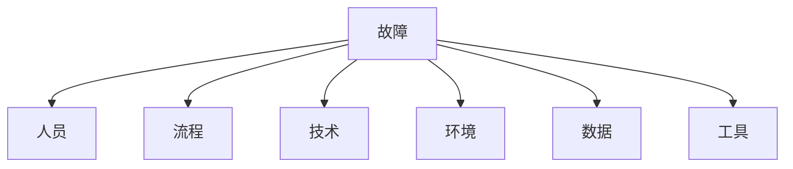

## 1. 故障排查方法论

### 1.1 科学方法

1. **观察**：收集现象和数据
2. **假设**：提出可能的原因
3. **预测**：假设成立时的预期结果
4. **实验**：验证假设
5. **分析**：对比预测与实际结果

### 1.2 二分法

通过逐步缩小范围定位问题：

```
整个系统 → 哪个服务？→ 哪个模块？→ 哪个函数？→ 哪行代码？
```

### 1.3 RED 方法

对每个服务检查：

- **Rate（速率）**：请求量是否异常
- **Errors（错误）**：错误率是否升高
- **Duration（延迟）**：响应时间是否变长

### 1.4 排查流程

```
1. 确认问题：复现、范围、影响
2. 收集信息：日志、指标、追踪
3. 定位范围：网络/系统/应用/数据
4. 分析原因：根因分析
5. 实施修复：临时/永久
6. 验证恢复：确认服务正常
7. 复盘总结：改进措施
```

## 2. 系统诊断工具

### 2.1 进程诊断

```bash
# 进程状态
ps aux | grep myapp
ps -eo pid,ppid,cmd,%mem,%cpu --sort=-%mem

# 进程树
pstree -p <pid>

# 打开的文件
lsof -p <pid>
lsof -i :8080          # 监听8080端口的进程

# 系统调用
strace -p <pid> -e trace=network
strace -p <pid> -c     # 统计

# 进程内存
cat /proc/<pid>/status | grep -E "Vm|Threads"
cat /proc/<pid>/smaps  # 详细内存映射
```

### 2.2 网络诊断

```bash
# 连接状态
ss -s                   # 连接概览
ss -tnp                 # TCP 连接
ss -tn state time-wait  # TIME_WAIT 连接

# 连通性
ping target
traceroute target
mtr target              # 持续追踪

# DNS
dig example.com
nslookup example.com
host example.com

# 抓包
tcpdump -i eth0 -nn port 80
tcpdump -i eth0 -w capture.pcap
tcpdump -i eth0 'tcp[tcpflags] & (tcp-rst|tcp-syn) != 0'

# HTTP 请求
curl -v https://example.com
curl -w "@curl-format.txt" -o /dev/null -s https://example.com
```

### 2.3 磁盘诊断

```bash
# 磁盘使用
df -h
du -sh /var/log/*
du -d1 -h / | sort -rh | head -20

# inode 使用
df -i

# I/O 统计
iostat -xz 1

# 大文件查找
find / -type f -size +100M -exec ls -lh {} \;

# 文件系统检查
fsck -n /dev/sda1       # 只检查不修复
```

## 3. 典型故障模式

### 3.1 CPU 飙高

**排查步骤**：

```bash
1. top -H -p <pid>     # 找到高 CPU 线程
2. printf "%x\n" <tid> # 线程ID转十六进制
3. jstack <pid> | grep <hex_tid>  # Java 线程栈
4. 或 perf record -g -p <pid>     # 生成火焰图
```

**常见原因**：

| 原因     | 特征       | 解决方案        |
| -------- | ---------- | --------------- |
| 死循环   | 单线程100% | 代码修复        |
| GC 频繁  | GC线程高   | 调整堆/优化对象 |
| 正则回溯 | CPU突增    | 优化正则        |
| 加密运算 | 持续高     | 硬件加速        |

### 3.2 内存泄漏

**排查步骤**：

```bash
1. 监控内存增长趋势
2. 生成堆转储：jmap -dump:format=b,file=heap.hprof <pid>
3. 分析堆转储：MAT 或 VisualVM
4. 找到占用最大的对象和引用链
```

**常见原因**：

| 原因             | 特征          | 解决方案           |
| ---------------- | ------------- | ------------------ |
| 集合未清理       | 内存持续增长  | 及时清理           |
| 缓存无上限       | 缓存越来越大  | LRU/大小限制       |
| ThreadLocal 泄漏 | 线程池场景    | 及时 remove        |
| 资源未关闭       | 文件/连接泄漏 | try-with-resources |

### 3.3 网络超时

**排查步骤**：

```bash
1. 确认超时是单向还是双向
2. 检查网络连通性：ping, traceroute
3. 检查连接状态：ss -tnp
4. 检查防火墙/安全组
5. 抓包分析：tcpdump
6. 检查对端服务状态
```

**常见原因**：

| 原因       | 特征         | 解决方案       |
| ---------- | ------------ | -------------- |
| 连接池耗尽 | 获取连接超时 | 增大连接池     |
| DNS 解析慢 | 首次请求慢   | DNS 缓存       |
| TCP 队列满 | SYN 被丢弃   | 增大 somaxconn |
| 对端慢     | 响应时间长   | 优化对端       |

### 3.4 磁盘满

**排查步骤**：

```bash
1. df -h 找到满的分区
2. du -d1 -h / | sort -rh | head -20
3. 找到大文件/日志
4. 检查已删除但未释放的文件：lsof | grep deleted
```

### 3.5 数据库慢查询

**排查步骤**：

```sql
-- MySQL 慢查询
SHOW PROCESSLIST;
SELECT * FROM information_schema.PROCESSLIST WHERE TIME > 5;

-- 查看执行计划
EXPLAIN ANALYZE SELECT ...;

-- 查看锁等待
SHOW ENGINE INNODB STATUS;
```

## 4. 应急响应

### 4.1 应急响应流程

```
发现故障 → 影响评估 → 通报升级 → 止血恢复 → 根因分析 → 改进预防
```

### 4.2 止血策略

| 策略 | 方法             | 影响           |
| ---- | ---------------- | -------------- |
| 回滚 | 部署上一版本     | 功能回退       |
| 降级 | 关闭非核心功能   | 部分功能不可用 |
| 限流 | 降低请求量       | 部分用户受影响 |
| 扩容 | 增加实例         | 成本增加       |
| 熔断 | 停止故障调用     | 功能降级       |
| 切流 | DNS/负载均衡切换 | 需要多机房     |

### 4.3 通报模板

```
【故障通报】
时间：2026-06-14 10:30
影响：用户登录服务不可用
范围：约30%用户受影响
原因：数据库连接池耗尽
状态：已恢复（10:45）
措施：增大连接池，添加监控告警
```

## 5. 根因分析（RCA）

### 5.1 5 Whys 方法

```
为什么登录失败？→ 数据库连接超时
为什么超时？→ 连接池耗尽
为什么耗尽？→ 慢查询占用连接
为什么慢查询？→ 缺少索引
为什么缺少索引？→ 新功能上线未加索引
```

### 5.2 鱼骨图



### 5.3 改进措施

| 类型     | 示例                   |
| -------- | ---------------------- |
| 技术改进 | 添加索引、增大连接池   |
| 流程改进 | 上线检查清单、代码审查 |
| 监控改进 | 添加告警、仪表盘       |
| 文档改进 | 更新运维手册           |

## 参考文献

GitHub Actions 文档：https://docs.github.com/zh/actions
GitLab CI 文档：https://docs.gitlab.com/ci/
Argo CD：https://argo-cd.readthedocs.io/
DORA 研究：https://dora.dev/
DevOps 手册（Gene Kim 等）：https://itrevolution.com/devops-handbook/

## 延伸阅读

Docker 与 Kubernetes 深入，见 031-devops 模块文档。
CI/CD 管线设计，见 031-devops 模块 CICD 文档。
云原生架构，见 034-cloud-computing 模块。
尚硅谷 Bilibili 空间（https://space.bilibili.com/302417610 ）提供 DevOps 课程。

## 深度专题扩展

以下专题从不同角度深入本文主题，供有进阶需求的读者研读。每个专题独立成节，内容相互补充。

### 13.1 GitOps 与声明式交付

Git 是唯一事实来源：集群状态由仓库声明驱动，差异由控制器调和（Argo CD/Flux）。
PR 流程即变更审批，合并即发布意图；回滚 = revert 提交。
与 CI 衔接：CI 产出镜像，CD 更新清单引用新 digest。
安全：仓库签名、密钥加密（SOPS）、审计日志。

### 13.2 可观测性与 SLO

指标：RED（请求率、错误、时长）与 USE（利用率、饱和、错误）。
日志：结构化（JSON）、集中采集、关联 trace_id。
追踪：OpenTelemetry 传播上下文，瀑布分析延迟。
SLO/错误预算：目标可用性 99.9% 对应每月约 43 分钟不可用预算，驱动发布决策。

## 模块文档速查表

| 文档 | 主题 | 与本文的关联 |
| --- | --- | --- |
| 概述与 Linux 基础 | 001-OverviewLinuxBasics | 本文的前置基础 |
| 网络与安全 | 002-NetworkSecurity | 本文的安全延伸 |
| 容器与 Docker | 003-ContainerDocker | 本文的并列主题 |
| Kubernetes | 004-Kubernetes | 本文的并列主题 |
| CI/CD 流水线 | 005-CICDPipeline | 本文的并列主题 |
| 监控与可观测性 | 006-MonitorAndObservability | 本文的并列主题 |
| 基础设施即代码 | 007-IaC | 本文的前置基础 |
| 云原生与 SRE | 008-CloudNativeSRE | 本文的并列主题 |
| Shell脚本编程 | 009-ShellScriptProgramming | 本文的并列主题 |
| 包管理与仓库 | 010-PackageManagementRepository | 本文的并列主题 |
| 服务网格 | 011-ServiceMesh | 本文的并列主题 |
| 日志管理 | 012-LogManagement | 本文的并列主题 |
| 配置管理 | 013-ConfigManagement | 本文的并列主题 |
| 性能调优 | 014-PerformanceTuning | 本文的性能延伸 |
| 高可用架构 | 015-HighAvailabilityArchitecture | 本文的原理深化 |
| 自动化测试 | 016-AutomationTest | 本文的并列主题 |
| 故障排查 | 017-Troubleshooting | 本文自身 |
| 容器安全 | 018-ContainerSecurity | 本文的安全延伸 |
| GitOps与持续交付 | 019-GitOpsCD | 本文的并列主题 |
| 监控与告警 | 020-MonitorAndAlert | 本文的并列主题 |
| 网络与安全进阶 | 021-NetworkSecurityAdvanced | 本文的安全延伸 |
| 数据库运维 | 022-DatabaseOps | 本文的并列主题 |
| Dockerfile多阶段构建 | 023-DockerfileMultiBuild | 本文的并列主题 |
| Kubernetes核心资源详解 | 024-KubernetesCoreDetailed | 本文的并列主题 |
| Helm-Chart应用打包 | 025-HelmChartApplicationPackage | 本文的并列主题 |
| Terraform资源编排 | 026-Terraform | 本文的并列主题 |
| Ansible-Playbook配置管理 | 027-AnsiblePlaybookConfigManagement | 本文的并列主题 |
| Prometheus指标采集与告警 | 028-Prometheus | 本文的并列主题 |
| Grafana仪表盘配置 | 029-GrafanaTableConfig | 本文的并列主题 |
| ELK-Stack日志分析 | 030-ELKStackLogAnalysis | 本文的并列主题 |
| OpenTelemetry | 031-OpenTelemetry | 本文的并列主题 |
| GitOps与ArgoCD | 032-GitOpsArgoCD | 本文的并列主题 |
| DevOps kubectl 基础命令 | 033-KubectlBasics | 本文的前置基础 |
| DevOps Helm 包管理命令 | 034-HelmCommands | 本文的并列主题 |
| DevOps Jenkins Pipeline | 035-JenkinsPipeline | 本文的并列主题 |
| DevOps GitLab CI/CD | 036-GitLabCI | 本文的并列主题 |
