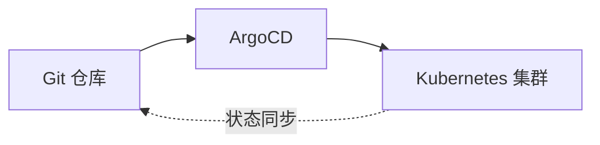
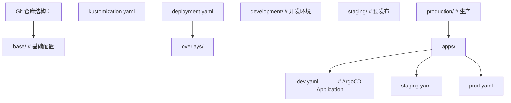
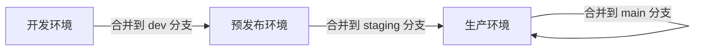

## 1. GitOps 原则

### 1.1 核心原则

1. **声明式**：系统描述是声明式的
2. **版本控制**：期望状态存储在 Git
3. **自动拉取**：自动应用期望状态
4. **持续协调**：持续确保一致性

### 1.2 Push vs Pull 模式

| 模式 | 触发方式       | 安全性       | 适用场景   |
| ---- | -------------- | ------------ | ---------- |
| Push | CI 推送部署    | 需要凭证     | 传统 CI/CD |
| Pull | Agent 拉取变更 | 凭证在集群内 | GitOps     |

## 2. ArgoCD

### 2.1 核心概念



### 2.2 Application 配置

```yaml
apiVersion: argoproj.io/v1alpha1
kind: Application
metadata:
  name: myapp
  namespace: argocd
spec:
  project: default
  source:
    repoURL: https://github.com/org/k8s-manifests.git
    targetRevision: main
    path: overlays/production
    helm:
      valueFiles:
        - values-prod.yaml
  destination:
    server: https://kubernetes.default.svc
    namespace: myapp
  syncPolicy:
    automated:
      prune: true
      selfHeal: true
      allowEmpty: false
    syncOptions:
      - CreateNamespace=true
      - PrunePropagationPolicy=foreground
    retry:
      limit: 5
      backoff:
        duration: 5s
        factor: 2
        maxDuration: 3m
```

### 2.3 App of Apps 模式

```yaml
apiVersion: argoproj.io/v1alpha1
kind: Application
metadata:
  name: apps
  namespace: argocd
spec:
  source:
    repoURL: https://github.com/org/argocd-apps.git
    path: apps
  destination:
    server: https://kubernetes.default.svc
    namespace: argocd
```

### 2.4 ApplicationSet

多集群/多环境自动生成 Application：

```yaml
apiVersion: argoproj.io/v1alpha1
kind: ApplicationSet
metadata:
  name: myapp
spec:
  generators:
    - git:
        repoURL: https://github.com/org/k8s-manifests.git
        files:
          - path: 'clusters/**/config.json'
  template:
    metadata:
      name: '{{cluster_name}}-myapp'
    spec:
      source:
        repoURL: https://github.com/org/k8s-manifests.git
        targetRevision: '{{branch}}'
        path: overlays/{{overlay}}
      destination:
        server: '{{server}}'
        namespace: myapp
```

## 3. Flux

### 3.1 核心组件

| 组件                    | 功能                 |
| ----------------------- | -------------------- |
| source-controller       | 管理 Git/Helm/OCI 源 |
| kustomize-controller    | Kustomize 构建       |
| helm-controller         | Helm 发布            |
| notification-controller | 通知                 |
| image-automation        | 自动镜像更新         |

### 3.2 基本配置

```yaml
# Git 仓库源
apiVersion: source.toolkit.fluxcd.io/v1
kind: GitRepository
metadata:
  name: myapp
  namespace: flux-system
spec:
  interval: 1m
  url: https://github.com/org/k8s-manifests.git
  ref:
    branch: main
---
# Kustomize 部署
apiVersion: kustomize.toolkit.fluxcd.io/v1
kind: Kustomization
metadata:
  name: myapp
  namespace: flux-system
spec:
  interval: 5m
  sourceRef:
    kind: GitRepository
    name: myapp
  path: ./overlays/production
  prune: true
  healthChecks:
    - apiVersion: apps/v1
      kind: Deployment
      name: myapp
      namespace: default
```

### 3.3 自动镜像更新

```yaml
apiVersion: image.toolkit.fluxcd.io/v1beta2
kind: ImageRepository
metadata:
  name: myapp
spec:
  image: registry/myapp
  interval: 1m
---
apiVersion: image.toolkit.fluxcd.io/v1beta2
kind: ImagePolicy
metadata:
  name: myapp
spec:
  imageRepositoryRef:
    name: myapp
  policy:
    semver:
      range: '^1.x'
---
apiVersion: image.toolkit.fluxcd.io/v1beta2
kind: ImageUpdateAutomation
metadata:
  name: myapp
spec:
  sourceRef:
    kind: GitRepository
    name: myapp
  git:
    checkout:
      ref:
        branch: main
    commit:
      author:
        name: fluxbot
        email: fluxbot@example.com
      messageTemplate: 'Update image to {{ .Image }}'
    push:
      branch: main
  interval: 1m
```

## 4. 渐进式交付

### 4.1 Argo Rollouts

```yaml
apiVersion: argoproj.io/v1alpha1
kind: Rollout
metadata:
  name: myapp
spec:
  replicas: 10
  strategy:
    canary:
      steps:
        - setWeight: 10
        - pause: { duration: 5m }
        - setWeight: 30
        - pause: { duration: 5m }
        - setWeight: 50
        - pause: { duration: 5m }
        - setWeight: 80
        - pause: { duration: 5m }
      canaryService: myapp-canary
      stableService: myapp-stable
      trafficRouting:
        istio:
          virtualServices:
            - name: myapp-vsvc
              routes:
                - primary
      analysis:
        templates:
          - templateName: success-rate
        args:
          - name: service-name
            value: myapp-canary
---
apiVersion: argoproj.io/v1alpha1
kind: AnalysisTemplate
metadata:
  name: success-rate
spec:
  args:
    - name: service-name
  metrics:
    - name: success-rate
      provider:
        prometheus:
          address: http://prometheus:9090
          query: |
            sum(rate(http_requests_total{service="{{args.service-name}}",status!~"5.."}[5m]))
            /
            sum(rate(http_requests_total{service="{{args.service-name}}"}[5m]))
      successCondition: result[0] >= 0.99
      interval: 30s
      count: 10
```

### 4.2 Flagger

```yaml
apiVersion: flagger.app/v1beta1
kind: Canary
metadata:
  name: myapp
spec:
  targetRef:
    apiVersion: apps/v1
    kind: Deployment
    name: myapp
  service:
    port: 8080
  analysis:
    interval: 1m
    threshold: 5
    maxWeight: 50
    stepWeight: 10
    metrics:
      - name: request-success-rate
        thresholdRange:
          min: 99
        interval: 1m
      - name: request-duration
        thresholdRange:
          max: 500
        interval: 1m
    webhooks:
      - name: load-test
        url: http://flagger-loadtester/
        timeout: 5s
        metadata:
          cmd: 'hey -z 1m -q 10 -c 2 http://myapp:8080/'
```

### 4.3 发布策略对比

| 策略     | 流量切换 | 回滚速度 | 资源开销  | 风险 |
| -------- | -------- | -------- | --------- | ---- |
| 滚动更新 | 逐步     | 中       | 低        | 中   |
| 蓝绿部署 | 一次性   | 快       | 高（2倍） | 低   |
| 金丝雀   | 渐进     | 快       | 中        | 低   |
| 影子测试 | 复制流量 | 即时     | 高        | 最低 |

## 5. 多环境管理

### 5.1 环境隔离



### 5.2 促销流程（Promotion）



### 5.3 配置差异管理

| 方法               | 说明       | 适用场景   |
| ------------------ | ---------- | ---------- |
| Kustomize overlays | 覆盖差异   | 简单差异   |
| Helm values        | 值文件差异 | Helm 项目  |
| 环境变量           | 运行时注入 | 通用       |
| 配置中心           | 动态配置   | 需要热更新 |

## 参考文献

GitHub Actions 文档：https://docs.github.com/zh/actions
GitLab CI 文档：https://docs.gitlab.com/ci/
Argo CD：https://argo-cd.readthedocs.io/
DORA 研究：https://dora.dev/
DevOps 手册（Gene Kim 等）：https://itrevolution.com/devops-handbook/

## 延伸阅读

Docker 与 Kubernetes 深入，见 031-devops 模块文档。
CI/CD 管线设计，见 031-devops 模块 CICD 文档。
云原生架构，见 034-cloud-computing 模块。
尚硅谷 Bilibili 空间（https://space.bilibili.com/302417610 ）提供 DevOps 课程。

## 深度专题扩展

以下专题从不同角度深入本文主题，供有进阶需求的读者研读。每个专题独立成节，内容相互补充。

### 13.1 GitOps 与声明式交付

Git 是唯一事实来源：集群状态由仓库声明驱动，差异由控制器调和（Argo CD/Flux）。
PR 流程即变更审批，合并即发布意图；回滚 = revert 提交。
与 CI 衔接：CI 产出镜像，CD 更新清单引用新 digest。
安全：仓库签名、密钥加密（SOPS）、审计日志。

### 13.2 可观测性与 SLO

指标：RED（请求率、错误、时长）与 USE（利用率、饱和、错误）。
日志：结构化（JSON）、集中采集、关联 trace_id。
追踪：OpenTelemetry 传播上下文，瀑布分析延迟。
SLO/错误预算：目标可用性 99.9% 对应每月约 43 分钟不可用预算，驱动发布决策。

## 模块文档速查表

| 文档 | 主题 | 与本文的关联 |
| --- | --- | --- |
| 概述与 Linux 基础 | 001-OverviewLinuxBasics | 本文的前置基础 |
| 网络与安全 | 002-NetworkSecurity | 本文的安全延伸 |
| 容器与 Docker | 003-ContainerDocker | 本文的并列主题 |
| Kubernetes | 004-Kubernetes | 本文的并列主题 |
| CI/CD 流水线 | 005-CICDPipeline | 本文的并列主题 |
| 监控与可观测性 | 006-MonitorAndObservability | 本文的并列主题 |
| 基础设施即代码 | 007-IaC | 本文的前置基础 |
| 云原生与 SRE | 008-CloudNativeSRE | 本文的并列主题 |
| Shell脚本编程 | 009-ShellScriptProgramming | 本文的并列主题 |
| 包管理与仓库 | 010-PackageManagementRepository | 本文的并列主题 |
| 服务网格 | 011-ServiceMesh | 本文的并列主题 |
| 日志管理 | 012-LogManagement | 本文的并列主题 |
| 配置管理 | 013-ConfigManagement | 本文的并列主题 |
| 性能调优 | 014-PerformanceTuning | 本文的性能延伸 |
| 高可用架构 | 015-HighAvailabilityArchitecture | 本文的原理深化 |
| 自动化测试 | 016-AutomationTest | 本文的并列主题 |
| 故障排查 | 017-Troubleshooting | 本文的并列主题 |
| 容器安全 | 018-ContainerSecurity | 本文的安全延伸 |
| GitOps与持续交付 | 019-GitOpsCD | 本文自身 |
| 监控与告警 | 020-MonitorAndAlert | 本文的并列主题 |
| 网络与安全进阶 | 021-NetworkSecurityAdvanced | 本文的安全延伸 |
| 数据库运维 | 022-DatabaseOps | 本文的并列主题 |
| Dockerfile多阶段构建 | 023-DockerfileMultiBuild | 本文的并列主题 |
| Kubernetes核心资源详解 | 024-KubernetesCoreDetailed | 本文的并列主题 |
| Helm-Chart应用打包 | 025-HelmChartApplicationPackage | 本文的并列主题 |
| Terraform资源编排 | 026-Terraform | 本文的并列主题 |
| Ansible-Playbook配置管理 | 027-AnsiblePlaybookConfigManagement | 本文的并列主题 |
| Prometheus指标采集与告警 | 028-Prometheus | 本文的并列主题 |
| Grafana仪表盘配置 | 029-GrafanaTableConfig | 本文的并列主题 |
| ELK-Stack日志分析 | 030-ELKStackLogAnalysis | 本文的并列主题 |
| OpenTelemetry | 031-OpenTelemetry | 本文的并列主题 |
| GitOps与ArgoCD | 032-GitOpsArgoCD | 本文的并列主题 |
| DevOps kubectl 基础命令 | 033-KubectlBasics | 本文的前置基础 |
| DevOps Helm 包管理命令 | 034-HelmCommands | 本文的并列主题 |
| DevOps Jenkins Pipeline | 035-JenkinsPipeline | 本文的并列主题 |
| DevOps GitLab CI/CD | 036-GitLabCI | 本文的并列主题 |
