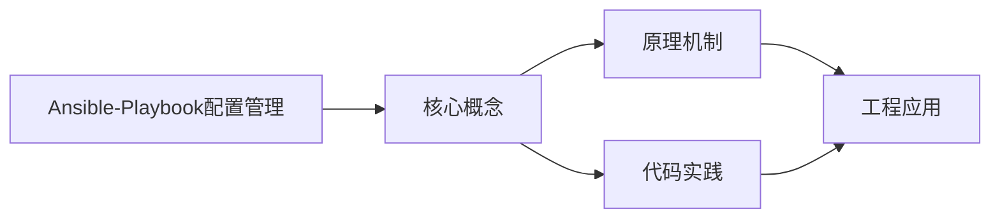
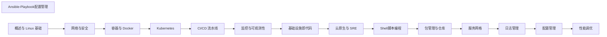

## 1. 学习目标（Bloom 分类）

本节按照布鲁姆教育目标分类学组织学习路径。本文主题为《Ansible-Playbook配置管理》，属于 DevOps 模块，读者可以根据自身阶段选择阅读深度。

记忆层面：能够准确复述本文的核心概念、术语与基本语法或操作步骤，并能够在提问或检索时快速定位对应知识点。能够说出 DevOps 的核心概念、组件与标准流程。

理解层面：能够用自己的语言解释核心原理与工作机制，说明概念之间的因果关系，而不是机械记忆结论。能够解释 DevOps 的工作原理与关键机制。

应用层面：能够在真实项目或练习场景中运用本文知识解决具体问题，写出正确且可维护的实现。能够执行 DevOps 相关的标准操作与配置。

分析层面：能够拆解复杂问题，比较本文主题与相邻概念的异同，识别边界条件与例外情况。能够分析 DevOps 方案在可靠性、成本与性能上的权衡。

评价层面：能够根据约束条件（性能、可读性、安全、成本）评价不同方案的优劣，做出有依据的技术决策。能够评价 DevOps 中的技术选型。

创造层面：能够把本文知识与其他模块知识组合，设计出新的解决方案或可复用的工程模式。能够设计基于 DevOps 的完整解决方案。

通过本节学习，读者应当能够把《Ansible-Playbook配置管理》纳入自己的知识网络，并与 DevOps 模块的其他主题（CI/CD、容器、编排、监控、GitOps）建立关联。

## 2. 历史动机与发展脉络

《Ansible-Playbook配置管理》是 DevOps 领域的重要主题。要真正理解它，需要先了解它解决的问题与演进过程。

DevOps 源于 2009 年（“DevOpsDays”），核心是打破开发与运维壁垒，用自动化与协作缩短交付周期；CALMS 文化（文化、自动化、精益、度量、共享）是其框架。
技术栈演进：持续集成（CI）与持续交付（CD）、基础设施即代码（IaC）、容器（Docker）与编排（Kubernetes）、可观测性（监控/日志/追踪）。
2020 年代趋势：GitOps（声明式 + 自动同步）、平台工程（内部开发者平台）、FinOps（成本治理）、AI 辅助运维。

回到本文主题：Ansible-Playbook配置管理 的提出与成熟，正是上述技术背景下的必然产物。早期实现往往以简单可用为目标，随着工程规模扩大，社区逐渐沉淀出标准做法与最佳实践；理解这一脉络，可以帮助读者判断“为什么文档中的推荐写法是现在这个样子”，也能在遇到历史遗留代码时准确识别其设计年代与取舍。


## 3. 形式化定义与核心概念精讲

本节把《Ansible-Playbook配置管理》涉及的核心概念以“定义 + 讲解”的形式展开。读者应把定义当作工具，把讲解当作理解路径；两者结合才能形成可迁移的知识。

CI/CD 管线：代码提交 -> 构建 -> 测试 -> 制品 -> 部署；流水线即代码（GitHub Actions/Jenkins/GitLab CI）。
容器与镜像：OCI 规范、Dockerfile 分层、镜像仓库与签名；容器隔离（cgroup/namespace）。
编排：Kubernetes 的 Pod/Deployment/Service 抽象；声明式期望状态与控制器调和。

### 3.1 原文章节逐一精讲

原文档把主题拆分为 14 个小节，下面按顺序给出每一节的导读讲解，随后保留原文细节供精读。

#### 原文精读（完整保留）

# Ansible 配置管理命令速查手册

> **符号约定**:`< >` 必填参数 | `[ ]` 可选参数

---

#### 1. Ansible 架构

##### 1.1 Agentless 模型

Agentless 模型是Ansible-Playbook配置管理的重要组成部分。本节详细介绍Agentless 模型的核心概念、工作原理和实际应用。

**关键要点**：

- Agentless 模型的定义与核心原理
- Agentless 模型的实现方式与技术细节
- Agentless 模型在实际场景中的应用与最佳实践
- Agentless 模型的常见问题与解决方案

Agentless 模型在工程实践中需要根据具体场景选择合适的策略，平衡性能、可靠性和复杂度。

##### 1.2 Inventory 清单

Inventory 清单是Ansible-Playbook配置管理的重要组成部分。本节详细介绍Inventory 清单的核心概念、工作原理和实际应用。

**关键要点**：

- Inventory 清单的定义与核心原理
- Inventory 清单的实现方式与技术细节
- Inventory 清单在实际场景中的应用与最佳实践
- Inventory 清单的常见问题与解决方案

Inventory 清单在工程实践中需要根据具体场景选择合适的策略，平衡性能、可靠性和复杂度。

#### 2. Playbook 编写

##### 2.1 YAML 语法

YAML 语法是Ansible-Playbook配置管理的重要组成部分。本节详细介绍YAML 语法的核心概念、工作原理和实际应用。

**关键要点**：

- YAML 语法的定义与核心原理
- YAML 语法的实现方式与技术细节
- YAML 语法在实际场景中的应用与最佳实践
- YAML 语法的常见问题与解决方案

YAML 语法在工程实践中需要根据具体场景选择合适的策略，平衡性能、可靠性和复杂度。

##### 2.2 常用 Module

常用 Module是Ansible-Playbook配置管理的重要组成部分。本节详细介绍常用 Module的核心概念、工作原理和实际应用。

**关键要点**：

- 常用 Module的定义与核心原理
- 常用 Module的实现方式与技术细节
- 常用 Module在实际场景中的应用与最佳实践
- 常用 Module的常见问题与解决方案

常用 Module在工程实践中需要根据具体场景选择合适的策略，平衡性能、可靠性和复杂度。

##### 2.3 条件与循环

条件与循环是Ansible-Playbook配置管理的重要组成部分。本节详细介绍条件与循环的核心概念、工作原理和实际应用。

**关键要点**：

- 条件与循环的定义与核心原理
- 条件与循环的实现方式与技术细节
- 条件与循环在实际场景中的应用与最佳实践
- 条件与循环的常见问题与解决方案

条件与循环在工程实践中需要根据具体场景选择合适的策略，平衡性能、可靠性和复杂度。

#### 3. Role 组织

##### 3.1 Role 目录结构

Role 目录结构是Ansible-Playbook配置管理的重要组成部分。本节详细介绍Role 目录结构的核心概念、工作原理和实际应用。

**关键要点**：

- Role 目录结构的定义与核心原理
- Role 目录结构的实现方式与技术细节
- Role 目录结构在实际场景中的应用与最佳实践
- Role 目录结构的常见问题与解决方案

Role 目录结构在工程实践中需要根据具体场景选择合适的策略，平衡性能、可靠性和复杂度。

##### 3.2 Galaxy 仓库

Galaxy 仓库是Ansible-Playbook配置管理的重要组成部分。本节详细介绍Galaxy 仓库的核心概念、工作原理和实际应用。

**关键要点**：

- Galaxy 仓库的定义与核心原理
- Galaxy 仓库的实现方式与技术细节
- Galaxy 仓库在实际场景中的应用与最佳实践
- Galaxy 仓库的常见问题与解决方案

Galaxy 仓库在工程实践中需要根据具体场景选择合适的策略，平衡性能、可靠性和复杂度。

#### 4. 最佳实践

##### 4.1 幂等性

幂等性是Ansible-Playbook配置管理的重要组成部分。本节详细介绍幂等性的核心概念、工作原理和实际应用。

**关键要点**：

- 幂等性的定义与核心原理
- 幂等性的实现方式与技术细节
- 幂等性在实际场景中的应用与最佳实践
- 幂等性的常见问题与解决方案

幂等性在工程实践中需要根据具体场景选择合适的策略，平衡性能、可靠性和复杂度。

##### 4.2 变量管理

变量管理是Ansible-Playbook配置管理的重要组成部分。本节详细介绍变量管理的核心概念、工作原理和实际应用。

**关键要点**：

- 变量管理的定义与核心原理
- 变量管理的实现方式与技术细节
- 变量管理在实际场景中的应用与最佳实践
- 变量管理的常见问题与解决方案

变量管理在工程实践中需要根据具体场景选择合适的策略，平衡性能、可靠性和复杂度。

##### 4.3 Vault 加密

Vault 加密是Ansible-Playbook配置管理的重要组成部分。本节详细介绍Vault 加密的核心概念、工作原理和实际应用。

**关键要点**：

- Vault 加密的定义与核心原理
- Vault 加密的实现方式与技术细节
- Vault 加密在实际场景中的应用与最佳实践
- Vault 加密的常见问题与解决方案

Vault 加密在工程实践中需要根据具体场景选择合适的策略，平衡性能、可靠性和复杂度。
#### ansible 命令

**基本用法:临时执行命令**
`ansible <主机模式> -m <模块> -a "<参数>"`

```bash
# 在所有主机上执行 ping
ansible all -m ping

# 在 web 组上执行 shell 命令
ansible web -m shell -a "uptime"

# 指定用户与私钥
ansible web -m ping -u deploy --private-key=~/.ssh/id_rsa

# 切换 sudo 执行
ansible db -m shell -a "systemctl restart nginx" -b --ask-become-pass
```

---

**基本用法:主机模式**
`ansible <模式> [选项]`

```bash
# 所有主机
ansible all -m ping

# 指定主机组
ansible web -m ping

# 多组交集
ansible 'web:&production' -m ping

# 排除某些主机
ansible 'web:!disabled' -m ping

# 直接指定主机
ansible web1.example.com -m ping

# 使用通配符
ansible '*.example.com' -m ping
```

---

**基本用法:常用选项**
`ansible <主机> [选项]`

```bash
# 列出匹配主机(不执行)
ansible all --list-hosts

# 指定清单文件
ansible all -i inventory.ini -m ping

# 指定并发数
ansible all -m ping -f 10

# 输出详细
ansible web -m ping -v
ansible web -m ping -vvv

# 限制单台主机执行
ansible web -m ping --limit web1.example.com
```

---

#### ansible-playbook 命令

**基本用法:执行 Playbook**
`ansible-playbook <playbook.yml>`

```bash
# 执行 Playbook
ansible-playbook site.yml

# 指定清单文件
ansible-playbook -i production.ini site.yml

# 指定用户与权限
ansible-playbook site.yml -u deploy -b -K

# 显示差异
ansible-playbook site.yml --diff

# 检查模式(不实际执行)
ansible-playbook site.yml --check
```

---

**基本用法:标签与限制**
`ansible-playbook <playbook> [--tags|--skip-tags]`

```bash
# 仅执行带指定标签的任务
ansible-playbook site.yml --tags "install,configure"

# 跳过指定标签
ansible-playbook site.yml --skip-tags "test"

# 列出所有标签
ansible-playbook site.yml --list-tags

# 限制主机执行
ansible-playbook site.yml --limit web1.example.com

# 限制单台主机并指定起始任务
ansible-playbook site.yml --limit web1 --start-at-task "install nginx"
```

---

**基本用法:变量与额外参数**
`ansible-playbook <playbook> -e "<变量=值>"`

```bash
# 命令行传入变量
ansible-playbook site.yml -e "env=production version=v1.2"

# 从文件传入变量
ansible-playbook site.yml -e @vars.yml

# JSON 格式变量
ansible-playbook site.yml -e '{"env":"prod","replicas":3}'

# 显示主机变量
ansible-playbook site.yml --list-hosts
```

---

#### 核心模块

**基本用法:file 文件管理**
`ansible <主机> -m file -a "path=<路径> state=<状态>"`

```bash
# 创建目录
ansible web -m file -a "path=/opt/app state=directory mode=0755"

# 创建符号链接
ansible web -m file -a "src=/etc/nginx/nginx.conf dest=/etc/nginx/nginx.conf.bak state=link"

# 删除文件
ansible web -m file -a "path=/tmp/oldfile state=absent"

# 修改权限
ansible web -m file -a "path=/opt/app owner=deploy group=deploy mode=0644"
```

---

**基本用法:copy 与 template**
`ansible <主机> -m copy -a "src=<源> dest=<目标>"`

```bash
# 复制文件
ansible web -m copy -a "src=app.conf dest=/etc/nginx/conf.d/app.conf owner=root mode=0644"

# 备份原文件
ansible web -m copy -a "src=nginx.conf dest=/etc/nginx/nginx.conf backup=yes"

# 直接写入内容
ansible web -m copy -a "content='Hello World\n' dest=/tmp/test.txt"

# template 模块渲染 Jinja2
ansible web -m template -a "src=nginx.j2 dest=/etc/nginx/nginx.conf"
```

---

**基本用法:包管理**
`ansible <主机> -m yum -a "name=<包名> state=<状态>"`

```bash
# 安装包(yum)
ansible web -m yum -a "name=nginx state=present"

# 安装最新版
ansible web -m yum -a "name=nginx state=latest"

# 卸载包
ansible web -m yum -a "name=nginx state=absent"

# apt 包管理
ansible web -m apt -a "name=nginx state=present update_cache=yes"
```

---

**基本用法:service 服务管理**
`ansible <主机> -m service -a "name=<服务> state=<状态>"`

```bash
# 启动服务
ansible web -m service -a "name=nginx state=started"

# 重启服务
ansible web -m service -a "name=nginx state=restarted"

# 设置开机启动
ansible web -m service -a "name=nginx enabled=yes state=started"

# systemd 模块
ansible web -m systemd -a "name=nginx state=restarted daemon_reload=yes"
```

---

**基本用法:user 与 group**
`ansible <主机> -m user -a "name=<用户> ..."`

```bash
# 创建用户
ansible web -m user -a "name=deploy shell=/bin/bash groups=docker append=yes"

# 创建用户并设置 SSH 公钥
ansible web -m user -a "name=deploy ssh_key_file=~/.ssh/id_rsa.pub"

# 删除用户
ansible web -m user -a "name=olduser state=absent remove=yes"

# 创建组
ansible web -m group -a "name=developers state=present"
```

---

#### Playbook 编写

**基本用法:Playbook 结构**
`--- hosts: <主机>`

```yaml
# playbook.yml Playbook 基本结构
---
- name: 部署 Nginx Web 服务
  hosts: web
  become: yes
  vars:
    nginx_port: 80
    server_name: example.com

  tasks:
  - name: 安装 Nginx
    yum:
      name: nginx
      state: present

  - name: 配置 Nginx
    template:
      src: nginx.conf.j2
      dest: /etc/nginx/nginx.conf
    notify: restart nginx

  - name: 启动 Nginx
    service:
      name: nginx
      state: started
      enabled: yes

  handlers:
  - name: restart nginx
    service:
      name: nginx
      state: restarted
```

---

**基本用法:条件与循环**
`when: <条件> / loop: <列表>`

```yaml
# 条件与循环示例
---
- name: 多服务管理
  hosts: web
  tasks:
  - name: 安装多个包
    yum:
      name: "{{ item }}"
      state: present
    loop:
    - nginx
    - git
    - curl

  - name: 根据系统分发执行
    service:
      name: nginx
      state: restarted
    when: ansible_os_family == "RedHat"

  - name: 仅在开发环境执行
    debug:
      msg: "这是开发环境"
    when: env == "dev"

  - name: 创建多个用户
    user:
      name: "{{ item.name }}"
      groups: "{{ item.groups }}"
    loop:
    - { name: alice, groups: dev }
    - { name: bob, groups: ops }
```

---

**基本用法:变量与模板**
`vars:`

```yaml
# 变量使用示例
---
- name: 应用部署
  hosts: web
  vars:
    app_name: myapp
    app_version: "1.2.0"
    app_ports:
    - 8080
    - 8443

  vars_files:
  - vars/secret.yml

  tasks:
  - name: 显示应用信息
    debug:
      msg: "部署 {{ app_name }} 版本 {{ app_version }}"

  - name: 渲染配置文件
    template:
      src: app.conf.j2
      dest: "/etc/{{ app_name }}/app.conf"
```

```
# app.conf.j2 模板文件
server {
    
    listen {{ port }};
    
    server_name {{ app_name }}.example.com;
    version {{ app_version }};
}
```

---

#### Roles 角色

**基本用法:创建 Role 目录**
`ansible-galaxy init <角色名>`

```bash
# 创建 Role 标准目录结构
ansible-galaxy init nginx

# 目录结构
# nginx/
# ├── defaults/main.yml      默认变量
# ├── files/                 静态文件
# ├── handlers/main.yml      处理器
# ├── meta/main.yml          元数据
# ├── tasks/main.yml         任务
# ├── templates/             Jinja2 模板
# └── vars/main.yml          变量(高优先级)
```

---

**基本用法:使用 Role**
`roles: - <角色>`

```yaml
# site.yml 使用 Role 示例
---
- name: 部署 Web 服务器
  hosts: web
  become: yes
  roles:
  - role: nginx
    vars:
      nginx_port: 80
  - role: firewall

# 也可以简写
- hosts: web
  roles:
  - nginx
  - monitoring
```

---

**基本用法:Role 依赖**
`meta/main.yml`

```yaml
# nginx/meta/main.yml 角色依赖
dependencies:
- role: common
  vars:
    common_packages:
    - curl
    - vim
- role: firewall
  when: enable_firewall | bool
```

---

#### ansible-galaxy

**基本用法:安装 Role**
`ansible-galaxy install <作者>.<角色>`

```bash
# 从 Galaxy 安装 Role
ansible-galaxy install geerlingguy.nginx

# 指定版本
ansible-galaxy install geerlingguy.nginx,v3.1.0

# 从 git 安装
ansible-galaxy install git+https://github.com/geerlingguy/ansible-role-nginx.git

# 安装到指定路径
ansible-galaxy install geerlingguy.nginx -p ./roles
```

---

**基本用法:管理 Role**
`ansible-galaxy list|search|remove`

```bash
# 列出已安装 Role
ansible-galaxy list

# 搜索 Role
ansible-galaxy search nginx

# 查看 Role 信息
ansible-galaxy info geerlingguy.nginx

# 删除 Role
ansible-galaxy remove geerlingguy.nginx

# 通过 requirements.yml 批量安装
ansible-galaxy install -r requirements.yml
```

```yaml
# requirements.yml 依赖列表
- src: geerlingguy.nginx
  version: 3.1.0
- src: git+https://github.com/org/role.git
  name: custom-role
```

---

#### Inventory 清单

**基本用法:INI 格式清单**
`/etc/ansible/hosts`

```ini
# inventory.ini 清单文件示例
[web]
web1.example.com ansible_host=192.168.1.10
web2.example.com ansible_host=192.168.1.11

[db]
db1.example.com ansible_host=192.168.1.20

[production:children]
web
db

[production:vars]
ansible_user=deploy
ansible_ssh_private_key_file=~/.ssh/prod_rsa
env=production
```

---

**基本用法:YAML 格式清单**
`inventory.yml`

```yaml
# inventory.yml YAML 格式清单
all:
  children:
    web:
      hosts:
        web1.example.com:
          ansible_host: 192.168.1.10
        web2.example.com:
          ansible_host: 192.168.1.11
      vars:
        nginx_port: 80
    db:
      hosts:
        db1.example.com:
          ansible_host: 192.168.1.20
  vars:
    ansible_user: deploy
    env: production
```

---

**基本用法:动态清单**
`ansible -i <脚本> all --list-hosts`

```bash
# 使用动态清单脚本
ansible -i ./ec2_inventory.py all --list-hosts

# 同时使用多个清单
ansible -i inventory.ini -i ec2.py all -m ping

# 启用清单缓存
export ANSIBLE_INVENTORY_CACHE=True
export ANSIBLE_INVENTORY_CACHE_CONNECTION=redis
```

---

#### ansible-vault 加密

**基本用法:加密文件**
`ansible-vault encrypt <文件>`

```bash
# 加密文件
ansible-vault encrypt vars/secret.yml

# 加密时指定密码文件
ansible-vault encrypt vars/secret.yml --vault-password-file ~/.vault_pass

# 加密字符串(用于嵌入)
ansible-vault encrypt_string 'mypassword' --name 'db_password'

# 加密字符串并追加到文件
ansible-vault encrypt_string 'secret' --name 'api_key' >> vars/secrets.yml
```

---

**基本用法:解密与查看**
`ansible-vault view|decrypt <文件>`

```bash
# 查看加密文件内容
ansible-vault view vars/secret.yml

# 解密文件
ansible-vault decrypt vars/secret.yml

# 编辑加密文件
ansible-vault edit vars/secret.yml

# 重新加密(修改密码)
ansible-vault rekey vars/secret.yml
```

---

**基本用法:执行加密 Playbook**
`ansible-playbook --ask-vault-pass <playbook>`

```bash
# 交互式输入密码
ansible-playbook site.yml --ask-vault-pass

# 使用密码文件
ansible-playbook site.yml --vault-password-file ~/.vault_pass

# 使用多个密码文件
ansible-playbook site.yml --vault-password-file ~/.vault_pass --vault-password-file ~/.vault_pass_dev
```

---

#### 调试与排查

**基本用法:语法检查**
`ansible-playbook --syntax-check <playbook>`

```bash
# 语法检查
ansible-playbook --syntax-check site.yml

# 检查模式(模拟执行)
ansible-playbook --check site.yml

# 检查模式 + 显示差异
ansible-playbook --check --diff site.yml

# 列出任务
ansible-playbook --list-tasks site.yml
```

---

**基本用法:debug 模块**
`debug: var=<变量>`

```yaml
# Playbook 中使用 debug
- name: 调试示例
  hosts: web
  tasks:
  - name: 显示主机名
    debug:
      msg: "主机名: {{ inventory_hostname }} IP: {{ ansible_host }}"

  - name: 显示变量
    debug:
      var: ansible_distribution

  - name: 注册变量并显示
    shell: uptime
    register: result

  - name: 显示命令输出
    debug:
      var: result.stdout_lines

  - name: 失败时显示
    debug:
      msg: "命令失败: {{ result.stderr }}"
    when: result.failed
```

---

**基本用法:verbose 输出**
`ansible-playbook -v[vvv] <playbook>`

```bash
# 不同详细级别
ansible-playbook site.yml -v       # 基础输出
ansible-playbook site.yml -vv      # 含变量
ansible-playbook site.yml -vvv     # 含 SSH 详情
ansible-playbook site.yml -vvvv    # 含插件详情

# 仅查看执行步骤(详细模式 + 检查模式)
ansible-playbook site.yml --check --diff -v
```

---

#### ansible-config 配置

**基本用法:查看配置**
`ansible-config view|list|dump`

```bash
# 查看当前生效配置
ansible-config view

# 列出所有配置选项
ansible-config list

# 查看生效的配置项
ansible-config dump | grep -i host_key

# 查看指定配置项
ansible-config dump | grep DEFAULT_INVENTORY
```

---

**基本用法:常用配置**
`ansible.cfg`

```ini
# ansible.cfg 配置文件
[defaults]
inventory = ./inventory.ini
host_key_checking = False
remote_user = deploy
private_key_file = ~/.ssh/id_rsa
roles_path = ./roles
log_path = /var/log/ansible.log
forks = 10
gathering = smart
fact_caching = redis
fact_caching_connection = localhost:6379

[privilege_escalation]
become = True
become_method = sudo
become_user = root
```

```bash
# 设置环境变量覆盖配置
export ANSIBLE_HOST_KEY_CHECKING=False
export ANSIBLE_FORKS=20

# 生成默认配置文件
ansible-config init --disabled > ansible.cfg
```


### 3.2 概念关系图

下面用 Mermaid 图表达本文核心概念之间的关系，帮助读者建立整体图景：



图中展示的是本文知识的结构化关系：核心概念是入口，原理机制解释“为什么”，代码实践演示“怎么做”，工程应用回答“何时用”。读者学习时可以把每个小节的内容挂接到对应节点上。

## 4. 理论推导与原理解析

本节深入《Ansible-Playbook配置管理》背后的原理。理论部分不求面面俱到，而是聚焦“能解释现象、能指导实践”的关键推导。

CI/CD 管线：代码提交 -> 构建 -> 测试 -> 制品 -> 部署；流水线即代码（GitHub Actions/Jenkins/GitLab CI）。
容器与镜像：OCI 规范、Dockerfile 分层、镜像仓库与签名；容器隔离（cgroup/namespace）。
编排：Kubernetes 的 Pod/Deployment/Service 抽象；声明式期望状态与控制器调和。
可观测性三支柱：指标（Prometheus）、日志（Loki/ELK）、追踪（OpenTelemetry）。

需要强调的是，理论推导与工程实践之间存在翻译层：理论给出的是理想化模型与边界条件，工程代码则必须处理真实环境中的例外。读者在学习时应先掌握理论的“标准情形”，再通过陷阱章节了解“非标准情形”。

## 5. 代码示例与逐行讲解

本节把原文中的代码示例系统整理，并为每个示例补充用途说明与讲解。读者不应只浏览代码，而应逐段对照讲解理解设计意图。

### 5.1 示例：ansible 命令

该示例来自原文《ansible 命令》小节，用于演示Ansible-Playbook配置管理相关操作。阅读时请先看代码结构，再看其后的讲解。

```bash
# 在所有主机上执行 ping
ansible all -m ping

# 在 web 组上执行 shell 命令
ansible web -m shell -a "uptime"

# 指定用户与私钥
ansible web -m ping -u deploy --private-key=~/.ssh/id_rsa

# 切换 sudo 执行
ansible db -m shell -a "systemctl restart nginx" -b --ask-become-pass
```

讲解：这段代码演示了本节核心知识点。代码中的关键操作可以归纳为三步：准备（定义或初始化）、执行（核心逻辑）、收尾（释放资源或返回结果）。实际项目中，这三步往往被封装为函数或类，以提升复用性与可测试性。

关键点分析：

该示例共 8 行有效代码，结构以数据或配置为主。阅读时应关注：数据字段的含义、配置项的作用，以及它们与运行行为的对应关系。

进阶思考路径：先尝试修改参数观察行为变化，再把示例中的模式迁移到自己的项目中；每次修改都记录预期与实测差异，这是把示例转化为能力的最快方式。

### 5.2 示例：ansible 命令

该示例来自原文《ansible 命令》小节，用于演示Ansible-Playbook配置管理相关操作。阅读时请先看代码结构，再看其后的讲解。

```bash
# 所有主机
ansible all -m ping

# 指定主机组
ansible web -m ping

# 多组交集
ansible 'web:&production' -m ping

# 排除某些主机
ansible 'web:!disabled' -m ping

# 直接指定主机
ansible web1.example.com -m ping

# 使用通配符
ansible '*.example.com' -m ping
```

讲解：这段代码演示了本节核心知识点。代码中的关键操作可以归纳为三步：准备（定义或初始化）、执行（核心逻辑）、收尾（释放资源或返回结果）。实际项目中，这三步往往被封装为函数或类，以提升复用性与可测试性。

关键点分析：

该示例共 12 行有效代码，结构以数据或配置为主。阅读时应关注：数据字段的含义、配置项的作用，以及它们与运行行为的对应关系。

进阶思考路径：先尝试修改参数观察行为变化，再把示例中的模式迁移到自己的项目中；每次修改都记录预期与实测差异，这是把示例转化为能力的最快方式。

### 5.3 示例：ansible 命令

该示例来自原文《ansible 命令》小节，用于演示Ansible-Playbook配置管理相关操作。阅读时请先看代码结构，再看其后的讲解。

```bash
# 列出匹配主机(不执行)
ansible all --list-hosts

# 指定清单文件
ansible all -i inventory.ini -m ping

# 指定并发数
ansible all -m ping -f 10

# 输出详细
ansible web -m ping -v
ansible web -m ping -vvv

# 限制单台主机执行
ansible web -m ping --limit web1.example.com
```

讲解：这段代码演示了本节核心知识点。代码中的关键操作可以归纳为三步：准备（定义或初始化）、执行（核心逻辑）、收尾（释放资源或返回结果）。实际项目中，这三步往往被封装为函数或类，以提升复用性与可测试性。

关键点分析：

该示例共 11 行有效代码，结构以数据或配置为主。阅读时应关注：数据字段的含义、配置项的作用，以及它们与运行行为的对应关系。

进阶思考路径：先尝试修改参数观察行为变化，再把示例中的模式迁移到自己的项目中；每次修改都记录预期与实测差异，这是把示例转化为能力的最快方式。

### 5.4 示例：ansible-playbook 命令

该示例来自原文《ansible-playbook 命令》小节，用于演示Ansible-Playbook配置管理相关操作。阅读时请先看代码结构，再看其后的讲解。

```bash
# 执行 Playbook
ansible-playbook site.yml

# 指定清单文件
ansible-playbook -i production.ini site.yml

# 指定用户与权限
ansible-playbook site.yml -u deploy -b -K

# 显示差异
ansible-playbook site.yml --diff

# 检查模式(不实际执行)
ansible-playbook site.yml --check
```

讲解：这段代码演示了本节核心知识点。代码中的关键操作可以归纳为三步：准备（定义或初始化）、执行（核心逻辑）、收尾（释放资源或返回结果）。实际项目中，这三步往往被封装为函数或类，以提升复用性与可测试性。

关键点分析：

该示例共 10 行有效代码，结构以数据或配置为主。阅读时应关注：数据字段的含义、配置项的作用，以及它们与运行行为的对应关系。

进阶思考路径：先尝试修改参数观察行为变化，再把示例中的模式迁移到自己的项目中；每次修改都记录预期与实测差异，这是把示例转化为能力的最快方式。

### 5.5 示例：ansible-playbook 命令

该示例来自原文《ansible-playbook 命令》小节，用于演示Ansible-Playbook配置管理相关操作。阅读时请先看代码结构，再看其后的讲解。

```bash
# 仅执行带指定标签的任务
ansible-playbook site.yml --tags "install,configure"

# 跳过指定标签
ansible-playbook site.yml --skip-tags "test"

# 列出所有标签
ansible-playbook site.yml --list-tags

# 限制主机执行
ansible-playbook site.yml --limit web1.example.com

# 限制单台主机并指定起始任务
ansible-playbook site.yml --limit web1 --start-at-task "install nginx"
```

讲解：这段代码演示了本节核心知识点。代码中的关键操作可以归纳为三步：准备（定义或初始化）、执行（核心逻辑）、收尾（释放资源或返回结果）。实际项目中，这三步往往被封装为函数或类，以提升复用性与可测试性。

关键点分析：

该示例共 10 行有效代码，结构以数据或配置为主。阅读时应关注：数据字段的含义、配置项的作用，以及它们与运行行为的对应关系。

进阶思考路径：先尝试修改参数观察行为变化，再把示例中的模式迁移到自己的项目中；每次修改都记录预期与实测差异，这是把示例转化为能力的最快方式。

### 5.6 示例：ansible-playbook 命令

该示例来自原文《ansible-playbook 命令》小节，用于演示Ansible-Playbook配置管理相关操作。阅读时请先看代码结构，再看其后的讲解。

```bash
# 命令行传入变量
ansible-playbook site.yml -e "env=production version=v1.2"

# 从文件传入变量
ansible-playbook site.yml -e @vars.yml

# JSON 格式变量
ansible-playbook site.yml -e '{"env":"prod","replicas":3}'

# 显示主机变量
ansible-playbook site.yml --list-hosts
```

讲解：这段代码演示了本节核心知识点。代码中的关键操作可以归纳为三步：准备（定义或初始化）、执行（核心逻辑）、收尾（释放资源或返回结果）。实际项目中，这三步往往被封装为函数或类，以提升复用性与可测试性。

关键点分析：

该示例共 8 行有效代码，结构以数据或配置为主。阅读时应关注：数据字段的含义、配置项的作用，以及它们与运行行为的对应关系。

进阶思考路径：先尝试修改参数观察行为变化，再把示例中的模式迁移到自己的项目中；每次修改都记录预期与实测差异，这是把示例转化为能力的最快方式。

### 5.7 示例：核心模块

该示例来自原文《核心模块》小节，用于演示Ansible-Playbook配置管理相关操作。阅读时请先看代码结构，再看其后的讲解。

```bash
# 创建目录
ansible web -m file -a "path=/opt/app state=directory mode=0755"

# 创建符号链接
ansible web -m file -a "src=/etc/nginx/nginx.conf dest=/etc/nginx/nginx.conf.bak state=link"

# 删除文件
ansible web -m file -a "path=/tmp/oldfile state=absent"

# 修改权限
ansible web -m file -a "path=/opt/app owner=deploy group=deploy mode=0644"
```

讲解：这段代码演示了本节核心知识点。代码中的关键操作可以归纳为三步：准备（定义或初始化）、执行（核心逻辑）、收尾（释放资源或返回结果）。实际项目中，这三步往往被封装为函数或类，以提升复用性与可测试性。

关键点分析：

该示例共 8 行有效代码，结构以数据或配置为主。阅读时应关注：数据字段的含义、配置项的作用，以及它们与运行行为的对应关系。

进阶思考路径：先尝试修改参数观察行为变化，再把示例中的模式迁移到自己的项目中；每次修改都记录预期与实测差异，这是把示例转化为能力的最快方式。

### 5.8 示例：核心模块

该示例来自原文《核心模块》小节，用于演示Ansible-Playbook配置管理相关操作。阅读时请先看代码结构，再看其后的讲解。

```bash
# 复制文件
ansible web -m copy -a "src=app.conf dest=/etc/nginx/conf.d/app.conf owner=root mode=0644"

# 备份原文件
ansible web -m copy -a "src=nginx.conf dest=/etc/nginx/nginx.conf backup=yes"

# 直接写入内容
ansible web -m copy -a "content='Hello World\n' dest=/tmp/test.txt"

# template 模块渲染 Jinja2
ansible web -m template -a "src=nginx.j2 dest=/etc/nginx/nginx.conf"
```

讲解：这段代码演示了本节核心知识点。代码中的关键操作可以归纳为三步：准备（定义或初始化）、执行（核心逻辑）、收尾（释放资源或返回结果）。实际项目中，这三步往往被封装为函数或类，以提升复用性与可测试性。

关键点分析：

该示例共 8 行有效代码，结构以数据或配置为主。阅读时应关注：数据字段的含义、配置项的作用，以及它们与运行行为的对应关系。

进阶思考路径：先尝试修改参数观察行为变化，再把示例中的模式迁移到自己的项目中；每次修改都记录预期与实测差异，这是把示例转化为能力的最快方式。

### 5.9 示例：核心模块

该示例来自原文《核心模块》小节，用于演示Ansible-Playbook配置管理相关操作。阅读时请先看代码结构，再看其后的讲解。

```bash
# 安装包(yum)
ansible web -m yum -a "name=nginx state=present"

# 安装最新版
ansible web -m yum -a "name=nginx state=latest"

# 卸载包
ansible web -m yum -a "name=nginx state=absent"

# apt 包管理
ansible web -m apt -a "name=nginx state=present update_cache=yes"
```

讲解：这段代码演示了本节核心知识点。代码中的关键操作可以归纳为三步：准备（定义或初始化）、执行（核心逻辑）、收尾（释放资源或返回结果）。实际项目中，这三步往往被封装为函数或类，以提升复用性与可测试性。

关键点分析：

该示例共 8 行有效代码，结构以数据或配置为主。阅读时应关注：数据字段的含义、配置项的作用，以及它们与运行行为的对应关系。

进阶思考路径：先尝试修改参数观察行为变化，再把示例中的模式迁移到自己的项目中；每次修改都记录预期与实测差异，这是把示例转化为能力的最快方式。

### 5.10 示例：核心模块

该示例来自原文《核心模块》小节，用于演示Ansible-Playbook配置管理相关操作。阅读时请先看代码结构，再看其后的讲解。

```bash
# 启动服务
ansible web -m service -a "name=nginx state=started"

# 重启服务
ansible web -m service -a "name=nginx state=restarted"

# 设置开机启动
ansible web -m service -a "name=nginx enabled=yes state=started"

# systemd 模块
ansible web -m systemd -a "name=nginx state=restarted daemon_reload=yes"
```

讲解：这段代码演示了本节核心知识点。代码中的关键操作可以归纳为三步：准备（定义或初始化）、执行（核心逻辑）、收尾（释放资源或返回结果）。实际项目中，这三步往往被封装为函数或类，以提升复用性与可测试性。

关键点分析：

该示例共 8 行有效代码，结构以数据或配置为主。阅读时应关注：数据字段的含义、配置项的作用，以及它们与运行行为的对应关系。

进阶思考路径：先尝试修改参数观察行为变化，再把示例中的模式迁移到自己的项目中；每次修改都记录预期与实测差异，这是把示例转化为能力的最快方式。

### 5.11 示例：核心模块

该示例来自原文《核心模块》小节，用于演示Ansible-Playbook配置管理相关操作。阅读时请先看代码结构，再看其后的讲解。

```bash
# 创建用户
ansible web -m user -a "name=deploy shell=/bin/bash groups=docker append=yes"

# 创建用户并设置 SSH 公钥
ansible web -m user -a "name=deploy ssh_key_file=~/.ssh/id_rsa.pub"

# 删除用户
ansible web -m user -a "name=olduser state=absent remove=yes"

# 创建组
ansible web -m group -a "name=developers state=present"
```

讲解：这段代码演示了本节核心知识点。代码中的关键操作可以归纳为三步：准备（定义或初始化）、执行（核心逻辑）、收尾（释放资源或返回结果）。实际项目中，这三步往往被封装为函数或类，以提升复用性与可测试性。

关键点分析：

该示例共 8 行有效代码，结构以数据或配置为主。阅读时应关注：数据字段的含义、配置项的作用，以及它们与运行行为的对应关系。

进阶思考路径：先尝试修改参数观察行为变化，再把示例中的模式迁移到自己的项目中；每次修改都记录预期与实测差异，这是把示例转化为能力的最快方式。

### 5.12 示例：Playbook 编写

该示例来自原文《Playbook 编写》小节，用于演示Ansible-Playbook配置管理相关操作。阅读时请先看代码结构，再看其后的讲解。

```yaml
# playbook.yml Playbook 基本结构
---
- name: 部署 Nginx Web 服务
  hosts: web
  become: yes
  vars:
    nginx_port: 80
    server_name: example.com

  tasks:
  - name: 安装 Nginx
    yum:
      name: nginx
      state: present

  - name: 配置 Nginx
    template:
      src: nginx.conf.j2
      dest: /etc/nginx/nginx.conf
    notify: restart nginx

  - name: 启动 Nginx
    service:
      name: nginx
      state: started
      enabled: yes

  handlers:
  - name: restart nginx
    service:
      name: nginx
      state: restarted
```

讲解：这段代码演示了本节核心知识点。代码中的关键操作可以归纳为三步：准备（定义或初始化）、执行（核心逻辑）、收尾（释放资源或返回结果）。实际项目中，这三步往往被封装为函数或类，以提升复用性与可测试性。

关键点分析：

该示例共 28 行有效代码，结构以数据或配置为主。阅读时应关注：数据字段的含义、配置项的作用，以及它们与运行行为的对应关系。

进阶思考路径：先尝试修改参数观察行为变化，再把示例中的模式迁移到自己的项目中；每次修改都记录预期与实测差异，这是把示例转化为能力的最快方式。

### 5.13 示例：Playbook 编写

该示例来自原文《Playbook 编写》小节，用于演示Ansible-Playbook配置管理相关操作。阅读时请先看代码结构，再看其后的讲解。

```yaml
# 条件与循环示例
---
- name: 多服务管理
  hosts: web
  tasks:
  - name: 安装多个包
    yum:
      name: "{{ item }}"
      state: present
    loop:
    - nginx
    - git
    - curl

  - name: 根据系统分发执行
    service:
      name: nginx
      state: restarted
    when: ansible_os_family == "RedHat"

  - name: 仅在开发环境执行
    debug:
      msg: "这是开发环境"
    when: env == "dev"

  - name: 创建多个用户
    user:
      name: "{{ item.name }}"
      groups: "{{ item.groups }}"
    loop:
    - { name: alice, groups: dev }
    - { name: bob, groups: ops }
```

讲解：这段代码演示了本节核心知识点。代码中的关键操作可以归纳为三步：准备（定义或初始化）、执行（核心逻辑）、收尾（释放资源或返回结果）。实际项目中，这三步往往被封装为函数或类，以提升复用性与可测试性。

关键点分析：

该示例共 29 行有效代码，结构以数据或配置为主。阅读时应关注：数据字段的含义、配置项的作用，以及它们与运行行为的对应关系。

进阶思考路径：先尝试修改参数观察行为变化，再把示例中的模式迁移到自己的项目中；每次修改都记录预期与实测差异，这是把示例转化为能力的最快方式。

### 5.14 示例：Playbook 编写

该示例来自原文《Playbook 编写》小节，用于演示Ansible-Playbook配置管理相关操作。阅读时请先看代码结构，再看其后的讲解。

```yaml
# 变量使用示例
---
- name: 应用部署
  hosts: web
  vars:
    app_name: myapp
    app_version: "1.2.0"
    app_ports:
    - 8080
    - 8443

  vars_files:
  - vars/secret.yml

  tasks:
  - name: 显示应用信息
    debug:
      msg: "部署 {{ app_name }} 版本 {{ app_version }}"

  - name: 渲染配置文件
    template:
      src: app.conf.j2
      dest: "/etc/{{ app_name }}/app.conf"
```

讲解：这段代码演示了本节核心知识点。代码中的关键操作可以归纳为三步：准备（定义或初始化）、执行（核心逻辑）、收尾（释放资源或返回结果）。实际项目中，这三步往往被封装为函数或类，以提升复用性与可测试性。

关键点分析：

该示例共 20 行有效代码，结构以数据或配置为主。阅读时应关注：数据字段的含义、配置项的作用，以及它们与运行行为的对应关系。

进阶思考路径：先尝试修改参数观察行为变化，再把示例中的模式迁移到自己的项目中；每次修改都记录预期与实测差异，这是把示例转化为能力的最快方式。

### 5.15 示例：Playbook 编写

该示例来自原文《Playbook 编写》小节，用于演示Ansible-Playbook配置管理相关操作。阅读时请先看代码结构，再看其后的讲解。

```text
# app.conf.j2 模板文件
server {
    
    listen {{ port }};
    
    server_name {{ app_name }}.example.com;
    version {{ app_version }};
}
```

讲解：这段代码演示了本节核心知识点。代码中的关键操作可以归纳为三步：准备（定义或初始化）、执行（核心逻辑）、收尾（释放资源或返回结果）。实际项目中，这三步往往被封装为函数或类，以提升复用性与可测试性。

关键点分析：

该示例共 8 行有效代码，包含 1 类关键结构（for）。其中：

- 入口与初始化部分负责建立上下文，对应实际项目中的启动或装配逻辑；
- 核心逻辑部分体现本文主题的主要操作，是阅读时最需要对照讲解理解的部分；
- 输出或返回部分把结果交给调用方，注意其类型与边界条件。

进阶思考路径：先尝试修改参数观察行为变化，再把示例中的模式迁移到自己的项目中；每次修改都记录预期与实测差异，这是把示例转化为能力的最快方式。

### 5.16 示例：Roles 角色

该示例来自原文《Roles 角色》小节，用于演示Ansible-Playbook配置管理相关操作。阅读时请先看代码结构，再看其后的讲解。

```bash
# 创建 Role 标准目录结构
ansible-galaxy init nginx

# 目录结构
# nginx/
# ├── defaults/main.yml      默认变量
# ├── files/                 静态文件
# ├── handlers/main.yml      处理器
# ├── meta/main.yml          元数据
# ├── tasks/main.yml         任务
# ├── templates/             Jinja2 模板
# └── vars/main.yml          变量(高优先级)
```

讲解：这段代码演示了本节核心知识点。代码中的关键操作可以归纳为三步：准备（定义或初始化）、执行（核心逻辑）、收尾（释放资源或返回结果）。实际项目中，这三步往往被封装为函数或类，以提升复用性与可测试性。

关键点分析：

该示例共 11 行有效代码，结构以数据或配置为主。阅读时应关注：数据字段的含义、配置项的作用，以及它们与运行行为的对应关系。

进阶思考路径：先尝试修改参数观察行为变化，再把示例中的模式迁移到自己的项目中；每次修改都记录预期与实测差异，这是把示例转化为能力的最快方式。

### 5.17 示例：Roles 角色

该示例来自原文《Roles 角色》小节，用于演示Ansible-Playbook配置管理相关操作。阅读时请先看代码结构，再看其后的讲解。

```yaml
# site.yml 使用 Role 示例
---
- name: 部署 Web 服务器
  hosts: web
  become: yes
  roles:
  - role: nginx
    vars:
      nginx_port: 80
  - role: firewall

# 也可以简写
- hosts: web
  roles:
  - nginx
  - monitoring
```

讲解：这段代码演示了本节核心知识点。代码中的关键操作可以归纳为三步：准备（定义或初始化）、执行（核心逻辑）、收尾（释放资源或返回结果）。实际项目中，这三步往往被封装为函数或类，以提升复用性与可测试性。

关键点分析：

该示例共 15 行有效代码，结构以数据或配置为主。阅读时应关注：数据字段的含义、配置项的作用，以及它们与运行行为的对应关系。

进阶思考路径：先尝试修改参数观察行为变化，再把示例中的模式迁移到自己的项目中；每次修改都记录预期与实测差异，这是把示例转化为能力的最快方式。

### 5.18 示例：Roles 角色

该示例来自原文《Roles 角色》小节，用于演示Ansible-Playbook配置管理相关操作。阅读时请先看代码结构，再看其后的讲解。

```yaml
# nginx/meta/main.yml 角色依赖
dependencies:
- role: common
  vars:
    common_packages:
    - curl
    - vim
- role: firewall
  when: enable_firewall | bool
```

讲解：这段代码演示了本节核心知识点。代码中的关键操作可以归纳为三步：准备（定义或初始化）、执行（核心逻辑）、收尾（释放资源或返回结果）。实际项目中，这三步往往被封装为函数或类，以提升复用性与可测试性。

关键点分析：

该示例共 9 行有效代码，结构以数据或配置为主。阅读时应关注：数据字段的含义、配置项的作用，以及它们与运行行为的对应关系。

进阶思考路径：先尝试修改参数观察行为变化，再把示例中的模式迁移到自己的项目中；每次修改都记录预期与实测差异，这是把示例转化为能力的最快方式。

### 5.19 示例：ansible-galaxy

该示例来自原文《ansible-galaxy》小节，用于演示Ansible-Playbook配置管理相关操作。阅读时请先看代码结构，再看其后的讲解。

```bash
# 从 Galaxy 安装 Role
ansible-galaxy install geerlingguy.nginx

# 指定版本
ansible-galaxy install geerlingguy.nginx,v3.1.0

# 从 git 安装
ansible-galaxy install git+https://github.com/geerlingguy/ansible-role-nginx.git

# 安装到指定路径
ansible-galaxy install geerlingguy.nginx -p ./roles
```

讲解：这段代码演示了本节核心知识点。代码中的关键操作可以归纳为三步：准备（定义或初始化）、执行（核心逻辑）、收尾（释放资源或返回结果）。实际项目中，这三步往往被封装为函数或类，以提升复用性与可测试性。

关键点分析：

该示例共 8 行有效代码，结构以数据或配置为主。阅读时应关注：数据字段的含义、配置项的作用，以及它们与运行行为的对应关系。

进阶思考路径：先尝试修改参数观察行为变化，再把示例中的模式迁移到自己的项目中；每次修改都记录预期与实测差异，这是把示例转化为能力的最快方式。

### 5.20 示例：ansible-galaxy

该示例来自原文《ansible-galaxy》小节，用于演示Ansible-Playbook配置管理相关操作。阅读时请先看代码结构，再看其后的讲解。

```bash
# 列出已安装 Role
ansible-galaxy list

# 搜索 Role
ansible-galaxy search nginx

# 查看 Role 信息
ansible-galaxy info geerlingguy.nginx

# 删除 Role
ansible-galaxy remove geerlingguy.nginx

# 通过 requirements.yml 批量安装
ansible-galaxy install -r requirements.yml
```

讲解：这段代码演示了本节核心知识点。代码中的关键操作可以归纳为三步：准备（定义或初始化）、执行（核心逻辑）、收尾（释放资源或返回结果）。实际项目中，这三步往往被封装为函数或类，以提升复用性与可测试性。

关键点分析：

该示例共 10 行有效代码，结构以数据或配置为主。阅读时应关注：数据字段的含义、配置项的作用，以及它们与运行行为的对应关系。

进阶思考路径：先尝试修改参数观察行为变化，再把示例中的模式迁移到自己的项目中；每次修改都记录预期与实测差异，这是把示例转化为能力的最快方式。

### 5.21 示例：ansible-galaxy

该示例来自原文《ansible-galaxy》小节，用于演示Ansible-Playbook配置管理相关操作。阅读时请先看代码结构，再看其后的讲解。

```yaml
# requirements.yml 依赖列表
- src: geerlingguy.nginx
  version: 3.1.0
- src: git+https://github.com/org/role.git
  name: custom-role
```

讲解：这段代码演示了本节核心知识点。代码中的关键操作可以归纳为三步：准备（定义或初始化）、执行（核心逻辑）、收尾（释放资源或返回结果）。实际项目中，这三步往往被封装为函数或类，以提升复用性与可测试性。

关键点分析：

该示例共 5 行有效代码，结构以数据或配置为主。阅读时应关注：数据字段的含义、配置项的作用，以及它们与运行行为的对应关系。

进阶思考路径：先尝试修改参数观察行为变化，再把示例中的模式迁移到自己的项目中；每次修改都记录预期与实测差异，这是把示例转化为能力的最快方式。

### 5.22 示例：Inventory 清单

该示例来自原文《Inventory 清单》小节，用于演示Ansible-Playbook配置管理相关操作。阅读时请先看代码结构，再看其后的讲解。

```ini
# inventory.ini 清单文件示例
[web]
web1.example.com ansible_host=192.168.1.10
web2.example.com ansible_host=192.168.1.11

[db]
db1.example.com ansible_host=192.168.1.20

[production:children]
web
db

[production:vars]
ansible_user=deploy
ansible_ssh_private_key_file=~/.ssh/prod_rsa
env=production
```

讲解：这段代码演示了本节核心知识点。代码中的关键操作可以归纳为三步：准备（定义或初始化）、执行（核心逻辑）、收尾（释放资源或返回结果）。实际项目中，这三步往往被封装为函数或类，以提升复用性与可测试性。

关键点分析：

该示例共 13 行有效代码，结构以数据或配置为主。阅读时应关注：数据字段的含义、配置项的作用，以及它们与运行行为的对应关系。

进阶思考路径：先尝试修改参数观察行为变化，再把示例中的模式迁移到自己的项目中；每次修改都记录预期与实测差异，这是把示例转化为能力的最快方式。

### 5.23 示例：Inventory 清单

该示例来自原文《Inventory 清单》小节，用于演示Ansible-Playbook配置管理相关操作。阅读时请先看代码结构，再看其后的讲解。

```yaml
# inventory.yml YAML 格式清单
all:
  children:
    web:
      hosts:
        web1.example.com:
          ansible_host: 192.168.1.10
        web2.example.com:
          ansible_host: 192.168.1.11
      vars:
        nginx_port: 80
    db:
      hosts:
        db1.example.com:
          ansible_host: 192.168.1.20
  vars:
    ansible_user: deploy
    env: production
```

讲解：这段代码演示了本节核心知识点。代码中的关键操作可以归纳为三步：准备（定义或初始化）、执行（核心逻辑）、收尾（释放资源或返回结果）。实际项目中，这三步往往被封装为函数或类，以提升复用性与可测试性。

关键点分析：

该示例共 18 行有效代码，结构以数据或配置为主。阅读时应关注：数据字段的含义、配置项的作用，以及它们与运行行为的对应关系。

进阶思考路径：先尝试修改参数观察行为变化，再把示例中的模式迁移到自己的项目中；每次修改都记录预期与实测差异，这是把示例转化为能力的最快方式。

### 5.24 示例：Inventory 清单

该示例来自原文《Inventory 清单》小节，用于演示Ansible-Playbook配置管理相关操作。阅读时请先看代码结构，再看其后的讲解。

```bash
# 使用动态清单脚本
ansible -i ./ec2_inventory.py all --list-hosts

# 同时使用多个清单
ansible -i inventory.ini -i ec2.py all -m ping

# 启用清单缓存
export ANSIBLE_INVENTORY_CACHE=True
export ANSIBLE_INVENTORY_CACHE_CONNECTION=redis
```

讲解：这段代码演示了本节核心知识点。代码中的关键操作可以归纳为三步：准备（定义或初始化）、执行（核心逻辑）、收尾（释放资源或返回结果）。实际项目中，这三步往往被封装为函数或类，以提升复用性与可测试性。

关键点分析：

该示例共 7 行有效代码，结构以数据或配置为主。阅读时应关注：数据字段的含义、配置项的作用，以及它们与运行行为的对应关系。

进阶思考路径：先尝试修改参数观察行为变化，再把示例中的模式迁移到自己的项目中；每次修改都记录预期与实测差异，这是把示例转化为能力的最快方式。

### 5.25 示例：ansible-vault 加密

该示例来自原文《ansible-vault 加密》小节，用于演示Ansible-Playbook配置管理相关操作。阅读时请先看代码结构，再看其后的讲解。

```bash
# 加密文件
ansible-vault encrypt vars/secret.yml

# 加密时指定密码文件
ansible-vault encrypt vars/secret.yml --vault-password-file ~/.vault_pass

# 加密字符串(用于嵌入)
ansible-vault encrypt_string 'mypassword' --name 'db_password'

# 加密字符串并追加到文件
ansible-vault encrypt_string 'secret' --name 'api_key' >> vars/secrets.yml
```

讲解：这段代码演示了本节核心知识点。代码中的关键操作可以归纳为三步：准备（定义或初始化）、执行（核心逻辑）、收尾（释放资源或返回结果）。实际项目中，这三步往往被封装为函数或类，以提升复用性与可测试性。

关键点分析：

该示例共 8 行有效代码，结构以数据或配置为主。阅读时应关注：数据字段的含义、配置项的作用，以及它们与运行行为的对应关系。

进阶思考路径：先尝试修改参数观察行为变化，再把示例中的模式迁移到自己的项目中；每次修改都记录预期与实测差异，这是把示例转化为能力的最快方式。

### 5.26 示例：ansible-vault 加密

该示例来自原文《ansible-vault 加密》小节，用于演示Ansible-Playbook配置管理相关操作。阅读时请先看代码结构，再看其后的讲解。

```bash
# 查看加密文件内容
ansible-vault view vars/secret.yml

# 解密文件
ansible-vault decrypt vars/secret.yml

# 编辑加密文件
ansible-vault edit vars/secret.yml

# 重新加密(修改密码)
ansible-vault rekey vars/secret.yml
```

讲解：这段代码演示了本节核心知识点。代码中的关键操作可以归纳为三步：准备（定义或初始化）、执行（核心逻辑）、收尾（释放资源或返回结果）。实际项目中，这三步往往被封装为函数或类，以提升复用性与可测试性。

关键点分析：

该示例共 8 行有效代码，结构以数据或配置为主。阅读时应关注：数据字段的含义、配置项的作用，以及它们与运行行为的对应关系。

进阶思考路径：先尝试修改参数观察行为变化，再把示例中的模式迁移到自己的项目中；每次修改都记录预期与实测差异，这是把示例转化为能力的最快方式。

### 5.27 示例：ansible-vault 加密

该示例来自原文《ansible-vault 加密》小节，用于演示Ansible-Playbook配置管理相关操作。阅读时请先看代码结构，再看其后的讲解。

```bash
# 交互式输入密码
ansible-playbook site.yml --ask-vault-pass

# 使用密码文件
ansible-playbook site.yml --vault-password-file ~/.vault_pass

# 使用多个密码文件
ansible-playbook site.yml --vault-password-file ~/.vault_pass --vault-password-file ~/.vault_pass_dev
```

讲解：这段代码演示了本节核心知识点。代码中的关键操作可以归纳为三步：准备（定义或初始化）、执行（核心逻辑）、收尾（释放资源或返回结果）。实际项目中，这三步往往被封装为函数或类，以提升复用性与可测试性。

关键点分析：

该示例共 6 行有效代码，结构以数据或配置为主。阅读时应关注：数据字段的含义、配置项的作用，以及它们与运行行为的对应关系。

进阶思考路径：先尝试修改参数观察行为变化，再把示例中的模式迁移到自己的项目中；每次修改都记录预期与实测差异，这是把示例转化为能力的最快方式。

### 5.28 示例：调试与排查

该示例来自原文《调试与排查》小节，用于演示Ansible-Playbook配置管理相关操作。阅读时请先看代码结构，再看其后的讲解。

```bash
# 语法检查
ansible-playbook --syntax-check site.yml

# 检查模式(模拟执行)
ansible-playbook --check site.yml

# 检查模式 + 显示差异
ansible-playbook --check --diff site.yml

# 列出任务
ansible-playbook --list-tasks site.yml
```

讲解：这段代码演示了本节核心知识点。代码中的关键操作可以归纳为三步：准备（定义或初始化）、执行（核心逻辑）、收尾（释放资源或返回结果）。实际项目中，这三步往往被封装为函数或类，以提升复用性与可测试性。

关键点分析：

该示例共 8 行有效代码，结构以数据或配置为主。阅读时应关注：数据字段的含义、配置项的作用，以及它们与运行行为的对应关系。

进阶思考路径：先尝试修改参数观察行为变化，再把示例中的模式迁移到自己的项目中；每次修改都记录预期与实测差异，这是把示例转化为能力的最快方式。

### 5.29 示例：调试与排查

该示例来自原文《调试与排查》小节，用于演示Ansible-Playbook配置管理相关操作。阅读时请先看代码结构，再看其后的讲解。

```yaml
# Playbook 中使用 debug
- name: 调试示例
  hosts: web
  tasks:
  - name: 显示主机名
    debug:
      msg: "主机名: {{ inventory_hostname }} IP: {{ ansible_host }}"

  - name: 显示变量
    debug:
      var: ansible_distribution

  - name: 注册变量并显示
    shell: uptime
    register: result

  - name: 显示命令输出
    debug:
      var: result.stdout_lines

  - name: 失败时显示
    debug:
      msg: "命令失败: {{ result.stderr }}"
    when: result.failed
```

讲解：这段代码演示了本节核心知识点。代码中的关键操作可以归纳为三步：准备（定义或初始化）、执行（核心逻辑）、收尾（释放资源或返回结果）。实际项目中，这三步往往被封装为函数或类，以提升复用性与可测试性。

关键点分析：

该示例共 20 行有效代码，结构以数据或配置为主。阅读时应关注：数据字段的含义、配置项的作用，以及它们与运行行为的对应关系。

进阶思考路径：先尝试修改参数观察行为变化，再把示例中的模式迁移到自己的项目中；每次修改都记录预期与实测差异，这是把示例转化为能力的最快方式。

### 5.30 示例：调试与排查

该示例来自原文《调试与排查》小节，用于演示Ansible-Playbook配置管理相关操作。阅读时请先看代码结构，再看其后的讲解。

```bash
# 不同详细级别
ansible-playbook site.yml -v       # 基础输出
ansible-playbook site.yml -vv      # 含变量
ansible-playbook site.yml -vvv     # 含 SSH 详情
ansible-playbook site.yml -vvvv    # 含插件详情

# 仅查看执行步骤(详细模式 + 检查模式)
ansible-playbook site.yml --check --diff -v
```

讲解：这段代码演示了本节核心知识点。代码中的关键操作可以归纳为三步：准备（定义或初始化）、执行（核心逻辑）、收尾（释放资源或返回结果）。实际项目中，这三步往往被封装为函数或类，以提升复用性与可测试性。

关键点分析：

该示例共 7 行有效代码，结构以数据或配置为主。阅读时应关注：数据字段的含义、配置项的作用，以及它们与运行行为的对应关系。

进阶思考路径：先尝试修改参数观察行为变化，再把示例中的模式迁移到自己的项目中；每次修改都记录预期与实测差异，这是把示例转化为能力的最快方式。

### 5.31 示例：ansible-config 配置

该示例来自原文《ansible-config 配置》小节，用于演示Ansible-Playbook配置管理相关操作。阅读时请先看代码结构，再看其后的讲解。

```bash
# 查看当前生效配置
ansible-config view

# 列出所有配置选项
ansible-config list

# 查看生效的配置项
ansible-config dump | grep -i host_key

# 查看指定配置项
ansible-config dump | grep DEFAULT_INVENTORY
```

讲解：这段代码演示了本节核心知识点。代码中的关键操作可以归纳为三步：准备（定义或初始化）、执行（核心逻辑）、收尾（释放资源或返回结果）。实际项目中，这三步往往被封装为函数或类，以提升复用性与可测试性。

关键点分析：

该示例共 8 行有效代码，结构以数据或配置为主。阅读时应关注：数据字段的含义、配置项的作用，以及它们与运行行为的对应关系。

进阶思考路径：先尝试修改参数观察行为变化，再把示例中的模式迁移到自己的项目中；每次修改都记录预期与实测差异，这是把示例转化为能力的最快方式。

### 5.32 示例：ansible-config 配置

该示例来自原文《ansible-config 配置》小节，用于演示Ansible-Playbook配置管理相关操作。阅读时请先看代码结构，再看其后的讲解。

```ini
# ansible.cfg 配置文件
[defaults]
inventory = ./inventory.ini
host_key_checking = False
remote_user = deploy
private_key_file = ~/.ssh/id_rsa
roles_path = ./roles
log_path = /var/log/ansible.log
forks = 10
gathering = smart
fact_caching = redis
fact_caching_connection = localhost:6379

[privilege_escalation]
become = True
become_method = sudo
become_user = root
```

讲解：这段代码演示了本节核心知识点。代码中的关键操作可以归纳为三步：准备（定义或初始化）、执行（核心逻辑）、收尾（释放资源或返回结果）。实际项目中，这三步往往被封装为函数或类，以提升复用性与可测试性。

关键点分析：

该示例共 16 行有效代码，结构以数据或配置为主。阅读时应关注：数据字段的含义、配置项的作用，以及它们与运行行为的对应关系。

进阶思考路径：先尝试修改参数观察行为变化，再把示例中的模式迁移到自己的项目中；每次修改都记录预期与实测差异，这是把示例转化为能力的最快方式。

### 5.33 示例：ansible-config 配置

该示例来自原文《ansible-config 配置》小节，用于演示Ansible-Playbook配置管理相关操作。阅读时请先看代码结构，再看其后的讲解。

```bash
# 设置环境变量覆盖配置
export ANSIBLE_HOST_KEY_CHECKING=False
export ANSIBLE_FORKS=20

# 生成默认配置文件
ansible-config init --disabled > ansible.cfg
```

讲解：这段代码演示了本节核心知识点。代码中的关键操作可以归纳为三步：准备（定义或初始化）、执行（核心逻辑）、收尾（释放资源或返回结果）。实际项目中，这三步往往被封装为函数或类，以提升复用性与可测试性。

关键点分析：

该示例共 5 行有效代码，结构以数据或配置为主。阅读时应关注：数据字段的含义、配置项的作用，以及它们与运行行为的对应关系。

进阶思考路径：先尝试修改参数观察行为变化，再把示例中的模式迁移到自己的项目中；每次修改都记录预期与实测差异，这是把示例转化为能力的最快方式。


综合以上示例，可以总结出本主题的代码实践要点：第一，先定义清晰的输入输出契约；第二，核心逻辑保持单一职责；第三，错误处理与边界条件不可省略；第四，命名与注释表达意图而非复述代码。

## 6. 对比分析

对比是理解《Ansible-Playbook配置管理》定位的最快路径。下面从多个维度与相邻方案进行对比。

CI 与 CD：CI 保证可集成，CD 保证可交付；两者可独立实施。
Kubernetes 与 Docker Compose：K8s 生产级编排；Compose 单机开发。
传统运维与 SRE：SRE 用软件工程方法运维，错误预算与 SLO。

对比的目的不是分出绝对优劣，而是建立选择依据：不同约束条件下，最优解不同。读者应把每个对比维度转化为决策检查清单。

## 7. 常见陷阱与最佳实践

本节整理该主题的高频错误与推荐做法。每个陷阱先描述现象，再解释原因，最后给出最佳实践。

### 7.1 环境漂移

手工配置导致环境不一致。全部走 IaC 与镜像。

深入讲解：该问题之所以被归类为“常见陷阱”，是因为它在初学者的代码中反复出现，而且往往不在第一时间暴露——错误通常隐藏在特定数据或特定时序下。

从成因上看，环境漂移 一般源于对 DevOps 某个机制的理解偏差：要么误用了默认行为，要么忽略了边界条件，要么把其他语言的思维惯性带了过来。

从影响上看，环境漂移 轻则产生错误结果，重则导致资源泄漏、数据损坏或安全事故；这也是为什么工程评审中会把它列为检查项。

从修复策略上看，处理环境漂移的正确顺序是：先复现（构造最小用例），再定位（确认机制层面的根因），最后修复并补充回归测试。跳过复现直接改代码，往往治标不治本。

### 7.2 秘密硬编码

密钥进仓库。使用 Secret 管理与注入。

深入讲解：该问题之所以被归类为“常见陷阱”，是因为它在初学者的代码中反复出现，而且往往不在第一时间暴露——错误通常隐藏在特定数据或特定时序下。

从成因上看，秘密硬编码 一般源于对 DevOps 某个机制的理解偏差：要么误用了默认行为，要么忽略了边界条件，要么把其他语言的思维惯性带了过来。

从影响上看，秘密硬编码 轻则产生错误结果，重则导致资源泄漏、数据损坏或安全事故；这也是为什么工程评审中会把它列为检查项。

从修复策略上看，处理秘密硬编码的正确顺序是：先复现（构造最小用例），再定位（确认机制层面的根因），最后修复并补充回归测试。跳过复现直接改代码，往往治标不治本。

### 7.3 构建不可复现

依赖未锁定。锁定依赖版本与基础镜像 digest。

深入讲解：该问题之所以被归类为“常见陷阱”，是因为它在初学者的代码中反复出现，而且往往不在第一时间暴露——错误通常隐藏在特定数据或特定时序下。

从成因上看，构建不可复现 一般源于对 DevOps 某个机制的理解偏差：要么误用了默认行为，要么忽略了边界条件，要么把其他语言的思维惯性带了过来。

从影响上看，构建不可复现 轻则产生错误结果，重则导致资源泄漏、数据损坏或安全事故；这也是为什么工程评审中会把它列为检查项。

从修复策略上看，处理构建不可复现的正确顺序是：先复现（构造最小用例），再定位（确认机制层面的根因），最后修复并补充回归测试。跳过复现直接改代码，往往治标不治本。

### 7.4 测试后置

问题到生产才发现。左移：单元/集成/E2E 分层。

深入讲解：该问题之所以被归类为“常见陷阱”，是因为它在初学者的代码中反复出现，而且往往不在第一时间暴露——错误通常隐藏在特定数据或特定时序下。

从成因上看，测试后置 一般源于对 DevOps 某个机制的理解偏差：要么误用了默认行为，要么忽略了边界条件，要么把其他语言的思维惯性带了过来。

从影响上看，测试后置 轻则产生错误结果，重则导致资源泄漏、数据损坏或安全事故；这也是为什么工程评审中会把它列为检查项。

从修复策略上看，处理测试后置的正确顺序是：先复现（构造最小用例），再定位（确认机制层面的根因），最后修复并补充回归测试。跳过复现直接改代码，往往治标不治本。

### 7.5 回滚缺失

发布失败无法回退。保留历史镜像与一键回滚。

深入讲解：该问题之所以被归类为“常见陷阱”，是因为它在初学者的代码中反复出现，而且往往不在第一时间暴露——错误通常隐藏在特定数据或特定时序下。

从成因上看，回滚缺失 一般源于对 DevOps 某个机制的理解偏差：要么误用了默认行为，要么忽略了边界条件，要么把其他语言的思维惯性带了过来。

从影响上看，回滚缺失 轻则产生错误结果，重则导致资源泄漏、数据损坏或安全事故；这也是为什么工程评审中会把它列为检查项。

从修复策略上看，处理回滚缺失的正确顺序是：先复现（构造最小用例），再定位（确认机制层面的根因），最后修复并补充回归测试。跳过复现直接改代码，往往治标不治本。

### 7.6 监控盲区

无指标与告警。核心链路全量可观测。

深入讲解：该问题之所以被归类为“常见陷阱”，是因为它在初学者的代码中反复出现，而且往往不在第一时间暴露——错误通常隐藏在特定数据或特定时序下。

从成因上看，监控盲区 一般源于对 DevOps 某个机制的理解偏差：要么误用了默认行为，要么忽略了边界条件，要么把其他语言的思维惯性带了过来。

从影响上看，监控盲区 轻则产生错误结果，重则导致资源泄漏、数据损坏或安全事故；这也是为什么工程评审中会把它列为检查项。

从修复策略上看，处理监控盲区的正确顺序是：先复现（构造最小用例），再定位（确认机制层面的根因），最后修复并补充回归测试。跳过复现直接改代码，往往治标不治本。

### 7.7 权限过大

CI 权限超需求。最小权限与短期凭证。

深入讲解：该问题之所以被归类为“常见陷阱”，是因为它在初学者的代码中反复出现，而且往往不在第一时间暴露——错误通常隐藏在特定数据或特定时序下。

从成因上看，权限过大 一般源于对 DevOps 某个机制的理解偏差：要么误用了默认行为，要么忽略了边界条件，要么把其他语言的思维惯性带了过来。

从影响上看，权限过大 轻则产生错误结果，重则导致资源泄漏、数据损坏或安全事故；这也是为什么工程评审中会把它列为检查项。

从修复策略上看，处理权限过大的正确顺序是：先复现（构造最小用例），再定位（确认机制层面的根因），最后修复并补充回归测试。跳过复现直接改代码，往往治标不治本。

### 7.8 部署频率低

大爆炸发布风险高。小步快跑与灰度。

深入讲解：该问题之所以被归类为“常见陷阱”，是因为它在初学者的代码中反复出现，而且往往不在第一时间暴露——错误通常隐藏在特定数据或特定时序下。

从成因上看，部署频率低 一般源于对 DevOps 某个机制的理解偏差：要么误用了默认行为，要么忽略了边界条件，要么把其他语言的思维惯性带了过来。

从影响上看，部署频率低 轻则产生错误结果，重则导致资源泄漏、数据损坏或安全事故；这也是为什么工程评审中会把它列为检查项。

从修复策略上看，处理部署频率低的正确顺序是：先复现（构造最小用例），再定位（确认机制层面的根因），最后修复并补充回归测试。跳过复现直接改代码，往往治标不治本。

### 7.0 最佳实践总览

1. 一切皆代码：流水线、基础设施、配置版本化。
2. 发布可重复：相同代码 + 相同制品 -> 相同环境。
3. 失败可预期：小批量、金丝雀、自动回滚。
4. 度量驱动：DORA 指标（部署频率、变更前置时间、恢复时间、变更失败率）。

把这些最佳实践固化为团队规范与代码评审检查项，是避免同类问题反复出现的关键。

## 8. 工程实践

本节把《Ansible-Playbook配置管理》放入真实工程场景，给出可复用的模式与组织方法。

GitHub Actions：workflow/job/step 模型，矩阵测试，环境与密钥管理。
GitOps：Argo CD 同步 Git 仓库与集群状态，PR 即发布审批。
平台工程：模板化应用脚手架（Backstage）、自助环境、成本可视化。

### 8.1 工程实践的原则拆解

以上工程实践可以归纳为四条原则。第一，配置与代码分离：DevOps 项目中环境差异应通过配置注入，而不是散落在代码分支中；这保证同一份代码可以在开发、测试、生产环境一致运行。

第二，接口稳定优先：对外接口（函数签名、协议、数据格式）一旦被消费方依赖，变更成本极高；设计时应预留扩展点并保持向后兼容。

第三，可观测性内置：日志、指标与追踪应该在功能开发时同步设计，而不是故障发生后补救；没有观测手段的模块等于黑盒。

第四，变更可回滚：任何发布都应有对应的回滚方案；数据库迁移、配置变更与代码发布一样需要版本管理与逆向路径。

### 8.2 实践落地的检查清单

- [ ] GitHub Actions：对照本节描述，检查当前项目是否已经落实；未落实的项列入技术债并排期处理。
- [ ] GitOps：对照本节描述，检查当前项目是否已经落实；未落实的项列入技术债并排期处理。
- [ ] 平台工程：对照本节描述，检查当前项目是否已经落实；未落实的项列入技术债并排期处理。

工程实践的共性原则：配置与代码分离、接口稳定优先、可观测性内置、变更可回滚。这些原则适用于本主题的所有实现。

## 9. 案例研究

本节通过一个完整案例把《Ansible-Playbook配置管理》的知识串起来。案例按“需求分析、方案设计、实现、验证”四步展开。

需求：为微服务搭建从提交到生产的自动化管线。
方案：GitHub Actions 构建镜像 + 测试 + 扫描，Argo CD 部署到 K8s，Prometheus 监控。
要点：镜像 tag 用 commit SHA；金丝雀发布；回滚演练。
验证：发布频率与失败率度量、故障注入演练。

### 9.1 案例的扩展讨论

把案例中的方案放大到真实规模，需要额外考虑三个问题：

第一，规模：当数据量或并发量上升一个数量级时，原方案中的数据结构、缓存策略与任务调度是否仍然成立？通常需要引入分层与异步。

第二，团队：多人协作时，模块边界、接口契约与代码所有权必须明确；案例中的实现应拆分为可独立测试的单元，并配合文档说明设计意图。

第三，演进：上线后的需求变化不可避免；方案设计时应预留扩展点（配置化、插件化、事件化），并定期用真实指标验证假设。


案例研究的学习方法：先独立阅读需求，尝试在脑中形成方案，再对照实现与讲解，最后思考“如果约束变化（数据量、并发、团队规模），方案应如何调整”。

## 10. 知识要点总结与深入讲解

本节以讲解形式汇总全文要点，替代传统的习题与自测，读者不需要答题，只需跟随解释建立完整的认知框架。

关于《Ansible-Playbook配置管理》的核心结论：

DevOps 的本质是自动化与协作，工具只是载体。
可重复、可回滚、可观测是三条主线。
从 DORA 指标开始度量改进，避免为工具而工具。

原文档各小节的要点回顾：

- 1. Ansible 架构：该小节围绕Ansible-Playbook配置管理展开具体细节，阅读时应关注其与核心结论的对应关系；每个小节都是核心结论在某一个侧面的展开。
- 2. Playbook 编写：该小节围绕Ansible-Playbook配置管理展开具体细节，阅读时应关注其与核心结论的对应关系；每个小节都是核心结论在某一个侧面的展开。
- 3. Role 组织：该小节围绕Ansible-Playbook配置管理展开具体细节，阅读时应关注其与核心结论的对应关系；每个小节都是核心结论在某一个侧面的展开。
- 4. 最佳实践：该小节围绕Ansible-Playbook配置管理展开具体细节，阅读时应关注其与核心结论的对应关系；每个小节都是核心结论在某一个侧面的展开。
- ansible 命令：该小节围绕Ansible-Playbook配置管理展开具体细节，阅读时应关注其与核心结论的对应关系；每个小节都是核心结论在某一个侧面的展开。
- ansible-playbook 命令：该小节围绕Ansible-Playbook配置管理展开具体细节，阅读时应关注其与核心结论的对应关系；每个小节都是核心结论在某一个侧面的展开。
- 核心模块：该小节围绕Ansible-Playbook配置管理展开具体细节，阅读时应关注其与核心结论的对应关系；每个小节都是核心结论在某一个侧面的展开。
- Playbook 编写：该小节围绕Ansible-Playbook配置管理展开具体细节，阅读时应关注其与核心结论的对应关系；每个小节都是核心结论在某一个侧面的展开。
- Roles 角色：该小节围绕Ansible-Playbook配置管理展开具体细节，阅读时应关注其与核心结论的对应关系；每个小节都是核心结论在某一个侧面的展开。
- ansible-galaxy：该小节围绕Ansible-Playbook配置管理展开具体细节，阅读时应关注其与核心结论的对应关系；每个小节都是核心结论在某一个侧面的展开。
- Inventory 清单：该小节围绕Ansible-Playbook配置管理展开具体细节，阅读时应关注其与核心结论的对应关系；每个小节都是核心结论在某一个侧面的展开。
- ansible-vault 加密：该小节围绕Ansible-Playbook配置管理展开具体细节，阅读时应关注其与核心结论的对应关系；每个小节都是核心结论在某一个侧面的展开。
- 调试与排查：该小节围绕Ansible-Playbook配置管理展开具体细节，阅读时应关注其与核心结论的对应关系；每个小节都是核心结论在某一个侧面的展开。
- ansible-config 配置：该小节围绕Ansible-Playbook配置管理展开具体细节，阅读时应关注其与核心结论的对应关系；每个小节都是核心结论在某一个侧面的展开。

把以上要点与第 3-9 节的内容对照复习，即可完成对本文主题的闭环学习。

## 11. 参考文献


GitHub Actions 文档：https://docs.github.com/zh/actions
GitLab CI 文档：https://docs.gitlab.com/ci/
Argo CD：https://argo-cd.readthedocs.io/
DORA 研究：https://dora.dev/
DevOps 手册（Gene Kim 等）：https://itrevolution.com/devops-handbook/

## 12. 延伸阅读


Docker 与 Kubernetes 深入，见 031-devops 模块文档。
CI/CD 管线设计，见 031-devops 模块 CICD 文档。
云原生架构，见 034-cloud-computing 模块。
尚硅谷 Bilibili 空间（https://space.bilibili.com/302417610 ）提供 DevOps 课程。

## 14. 模块知识图谱与学习路径

本文属于 DevOps 模块。为了把《Ansible-Playbook配置管理》放入完整的知识网络，下面列出本模块的全部主题并给出相互关联的导读。学习时建议按模块内顺序推进，并在每个文档中留意交叉引用。



上图为模块主题的推荐学习顺序示意图（仅展示前若干主题）。各主题之间存在三类关联：

第一，前置依赖关系：早期主题是后期主题的基础，例如环境与语法先行、进阶主题随后；

第二，横向并列关系：同一层级主题从不同角度覆盖模块能力，学习顺序可以按兴趣调整；

第三，工程组合关系：多个主题在真实项目中组合使用，例如配置、性能与安全主题往往出现在同一系统的不同层面。

### 14.1 模块主题速查表

| 文档 | 主题 | 与本文的关联 |
| --- | --- | --- |
| 概述与 Linux 基础 | 001-OverviewLinuxBasics | 本文的前置基础 |
| 网络与安全 | 002-NetworkSecurity | 本文的安全延伸 |
| 容器与 Docker | 003-ContainerDocker | 本文的并列主题 |
| Kubernetes | 004-Kubernetes | 本文的并列主题 |
| CI/CD 流水线 | 005-CICDPipeline | 本文的并列主题 |
| 监控与可观测性 | 006-MonitorAndObservability | 本文的并列主题 |
| 基础设施即代码 | 007-IaC | 本文的前置基础 |
| 云原生与 SRE | 008-CloudNativeSRE | 本文的并列主题 |
| Shell脚本编程 | 009-ShellScriptProgramming | 本文的并列主题 |
| 包管理与仓库 | 010-PackageManagementRepository | 本文的并列主题 |
| 服务网格 | 011-ServiceMesh | 本文的并列主题 |
| 日志管理 | 012-LogManagement | 本文的并列主题 |
| 配置管理 | 013-ConfigManagement | 本文的并列主题 |
| 性能调优 | 014-PerformanceTuning | 本文的性能延伸 |
| 高可用架构 | 015-HighAvailabilityArchitecture | 本文的原理深化 |
| 自动化测试 | 016-AutomationTest | 本文的并列主题 |
| 故障排查 | 017-Troubleshooting | 本文的并列主题 |
| 容器安全 | 018-ContainerSecurity | 本文的安全延伸 |
| GitOps与持续交付 | 019-GitOpsCD | 本文的并列主题 |
| 监控与告警 | 020-MonitorAndAlert | 本文的并列主题 |
| 网络与安全进阶 | 021-NetworkSecurityAdvanced | 本文的安全延伸 |
| 数据库运维 | 022-DatabaseOps | 本文的并列主题 |
| Dockerfile多阶段构建 | 023-DockerfileMultiBuild | 本文的并列主题 |
| Kubernetes核心资源详解 | 024-KubernetesCoreDetailed | 本文的并列主题 |
| Helm-Chart应用打包 | 025-HelmChartApplicationPackage | 本文的并列主题 |
| Terraform资源编排 | 026-Terraform | 本文的并列主题 |
| Ansible-Playbook配置管理 | 027-AnsiblePlaybookConfigManagement | 本文自身 |
| Prometheus指标采集与告警 | 028-Prometheus | 本文的并列主题 |
| Grafana仪表盘配置 | 029-GrafanaTableConfig | 本文的并列主题 |
| ELK-Stack日志分析 | 030-ELKStackLogAnalysis | 本文的并列主题 |
| OpenTelemetry | 031-OpenTelemetry | 本文的并列主题 |
| GitOps与ArgoCD | 032-GitOpsArgoCD | 本文的并列主题 |
| DevOps kubectl 基础命令 | 033-KubectlBasics | 本文的前置基础 |
| DevOps Helm 包管理命令 | 034-HelmCommands | 本文的并列主题 |
| DevOps Jenkins Pipeline | 035-JenkinsPipeline | 本文的并列主题 |
| DevOps GitLab CI/CD | 036-GitLabCI | 本文的并列主题 |

速查表的作用是让读者快速判断：哪些文档应在阅读本文前掌握（前置基础），哪些文档应在阅读本文后继续（延伸主题）。本模块的交叉引用体系即以此表为基础。

## 15. 术语表

下表整理《Ansible-Playbook配置管理》及 DevOps 模块中出现的高频术语，给出简明释义。术语按字母序或逻辑序排列，供查阅。

| 术语 | 释义 |
| --- | --- |
| CI/CD 管线 | 代码提交 -> 构建 -> 测试 -> 制品 -> 部署；流水线即代码（GitHub Actions/Jenkins/GitLab CI）。 |
| 容器与镜像 | OCI 规范、Dockerfile 分层、镜像仓库与签名；容器隔离（cgroup/namespace）。 |
| 编排 | Kubernetes 的 Pod/Deployment/Service 抽象；声明式期望状态与控制器调和。 |
| 可观测性三支柱 | 指标（Prometheus）、日志（Loki/ELK）、追踪（OpenTelemetry）。 |
| 环境漂移（易错点） | 参见常见陷阱章节的详细讲解 |
| 秘密硬编码（易错点） | 参见常见陷阱章节的详细讲解 |
| 构建不可复现（易错点） | 参见常见陷阱章节的详细讲解 |
| 测试后置（易错点） | 参见常见陷阱章节的详细讲解 |
| 回滚缺失（易错点） | 参见常见陷阱章节的详细讲解 |
| 监控盲区（易错点） | 参见常见陷阱章节的详细讲解 |

术语表与正文配合使用：先通读正文，遇到模糊术语回查本表；长期使用后术语会自然进入工作记忆。
