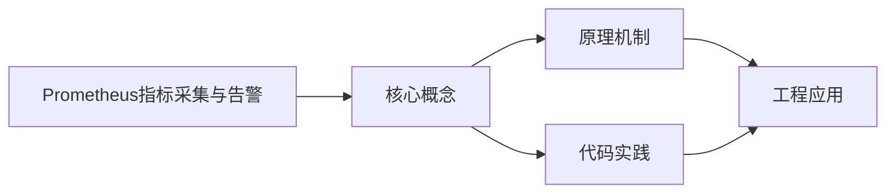
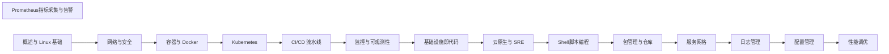

## 1. 学习目标（Bloom 分类）

本节按照布鲁姆教育目标分类学组织学习路径。本文主题为《Prometheus指标采集与告警》，属于 DevOps 模块，读者可以根据自身阶段选择阅读深度。

记忆层面：能够准确复述本文的核心概念、术语与基本语法或操作步骤，并能够在提问或检索时快速定位对应知识点。能够说出 DevOps 的核心概念、组件与标准流程。

理解层面：能够用自己的语言解释核心原理与工作机制，说明概念之间的因果关系，而不是机械记忆结论。能够解释 DevOps 的工作原理与关键机制。

应用层面：能够在真实项目或练习场景中运用本文知识解决具体问题，写出正确且可维护的实现。能够执行 DevOps 相关的标准操作与配置。

分析层面：能够拆解复杂问题，比较本文主题与相邻概念的异同，识别边界条件与例外情况。能够分析 DevOps 方案在可靠性、成本与性能上的权衡。

评价层面：能够根据约束条件（性能、可读性、安全、成本）评价不同方案的优劣，做出有依据的技术决策。能够评价 DevOps 中的技术选型。

创造层面：能够把本文知识与其他模块知识组合，设计出新的解决方案或可复用的工程模式。能够设计基于 DevOps 的完整解决方案。

通过本节学习，读者应当能够把《Prometheus指标采集与告警》纳入自己的知识网络，并与 DevOps 模块的其他主题（CI/CD、容器、编排、监控、GitOps）建立关联。

## 2. 历史动机与发展脉络

《Prometheus指标采集与告警》是 DevOps 领域的重要主题。要真正理解它，需要先了解它解决的问题与演进过程。

DevOps 源于 2009 年（“DevOpsDays”），核心是打破开发与运维壁垒，用自动化与协作缩短交付周期；CALMS 文化（文化、自动化、精益、度量、共享）是其框架。
技术栈演进：持续集成（CI）与持续交付（CD）、基础设施即代码（IaC）、容器（Docker）与编排（Kubernetes）、可观测性（监控/日志/追踪）。
2020 年代趋势：GitOps（声明式 + 自动同步）、平台工程（内部开发者平台）、FinOps（成本治理）、AI 辅助运维。

回到本文主题：Prometheus指标采集与告警 的提出与成熟，正是上述技术背景下的必然产物。早期实现往往以简单可用为目标，随着工程规模扩大，社区逐渐沉淀出标准做法与最佳实践；理解这一脉络，可以帮助读者判断“为什么文档中的推荐写法是现在这个样子”，也能在遇到历史遗留代码时准确识别其设计年代与取舍。


## 3. 形式化定义与核心概念精讲

本节把《Prometheus指标采集与告警》涉及的核心概念以“定义 + 讲解”的形式展开。读者应把定义当作工具，把讲解当作理解路径；两者结合才能形成可迁移的知识。

CI/CD 管线：代码提交 -> 构建 -> 测试 -> 制品 -> 部署；流水线即代码（GitHub Actions/Jenkins/GitLab CI）。
容器与镜像：OCI 规范、Dockerfile 分层、镜像仓库与签名；容器隔离（cgroup/namespace）。
编排：Kubernetes 的 Pod/Deployment/Service 抽象；声明式期望状态与控制器调和。

### 3.1 原文章节逐一精讲

原文档把主题拆分为 13 个小节，下面按顺序给出每一节的导读讲解，随后保留原文细节供精读。

#### 原文精读（完整保留）

# Prometheus 监控查询命令速查手册

> **符号约定**:`< >` 必填参数 | `[ ]` 可选参数

---

#### 1. Prometheus 架构

##### 1.1 Pull 模型

Pull 模型是Prometheus指标采集与告警的重要组成部分。本节详细介绍Pull 模型的核心概念、工作原理和实际应用。

**关键要点**：

- Pull 模型的定义与核心原理
- Pull 模型的实现方式与技术细节
- Pull 模型在实际场景中的应用与最佳实践
- Pull 模型的常见问题与解决方案

Pull 模型在工程实践中需要根据具体场景选择合适的策略，平衡性能、可靠性和复杂度。

##### 1.2 四种指标类型

四种指标类型是Prometheus指标采集与告警的重要组成部分。本节详细介绍四种指标类型的核心概念、工作原理和实际应用。

**关键要点**：

- 四种指标类型的定义与核心原理
- 四种指标类型的实现方式与技术细节
- 四种指标类型在实际场景中的应用与最佳实践
- 四种指标类型的常见问题与解决方案

四种指标类型在工程实践中需要根据具体场景选择合适的策略，平衡性能、可靠性和复杂度。

#### 2. PromQL 查询

##### 2.1 即时向量与范围向量

即时向量与范围向量是Prometheus指标采集与告警的重要组成部分。本节详细介绍即时向量与范围向量的核心概念、工作原理和实际应用。

**关键要点**：

- 即时向量与范围向量的定义与核心原理
- 即时向量与范围向量的实现方式与技术细节
- 即时向量与范围向量在实际场景中的应用与最佳实践
- 即时向量与范围向量的常见问题与解决方案

即时向量与范围向量在工程实践中需要根据具体场景选择合适的策略，平衡性能、可靠性和复杂度。

##### 2.2 聚合操作

聚合操作是Prometheus指标采集与告警的重要组成部分。本节详细介绍聚合操作的核心概念、工作原理和实际应用。

**关键要点**：

- 聚合操作的定义与核心原理
- 聚合操作的实现方式与技术细节
- 聚合操作在实际场景中的应用与最佳实践
- 聚合操作的常见问题与解决方案

聚合操作在工程实践中需要根据具体场景选择合适的策略，平衡性能、可靠性和复杂度。

##### 2.3 常用查询模式

常用查询模式是Prometheus指标采集与告警的重要组成部分。本节详细介绍常用查询模式的核心概念、工作原理和实际应用。

**关键要点**：

- 常用查询模式的定义与核心原理
- 常用查询模式的实现方式与技术细节
- 常用查询模式在实际场景中的应用与最佳实践
- 常用查询模式的常见问题与解决方案

常用查询模式在工程实践中需要根据具体场景选择合适的策略，平衡性能、可靠性和复杂度。

#### 3. 告警配置

##### 3.1 告警规则

告警规则是Prometheus指标采集与告警的重要组成部分。本节详细介绍告警规则的核心概念、工作原理和实际应用。

**关键要点**：

- 告警规则的定义与核心原理
- 告警规则的实现方式与技术细节
- 告警规则在实际场景中的应用与最佳实践
- 告警规则的常见问题与解决方案

告警规则在工程实践中需要根据具体场景选择合适的策略，平衡性能、可靠性和复杂度。

##### 3.2 Alertmanager 路由

Alertmanager 路由是Prometheus指标采集与告警的重要组成部分。本节详细介绍Alertmanager 路由的核心概念、工作原理和实际应用。

**关键要点**：

- Alertmanager 路由的定义与核心原理
- Alertmanager 路由的实现方式与技术细节
- Alertmanager 路由在实际场景中的应用与最佳实践
- Alertmanager 路由的常见问题与解决方案

Alertmanager 路由在工程实践中需要根据具体场景选择合适的策略，平衡性能、可靠性和复杂度。

##### 3.3 抑制与静默

抑制与静默是Prometheus指标采集与告警的重要组成部分。本节详细介绍抑制与静默的核心概念、工作原理和实际应用。

**关键要点**：

- 抑制与静默的定义与核心原理
- 抑制与静默的实现方式与技术细节
- 抑制与静默在实际场景中的应用与最佳实践
- 抑制与静默的常见问题与解决方案

抑制与静默在工程实践中需要根据具体场景选择合适的策略，平衡性能、可靠性和复杂度。

#### 4. 最佳实践

##### 4.1 指标命名

指标命名是Prometheus指标采集与告警的重要组成部分。本节详细介绍指标命名的核心概念、工作原理和实际应用。

**关键要点**：

- 指标命名的定义与核心原理
- 指标命名的实现方式与技术细节
- 指标命名在实际场景中的应用与最佳实践
- 指标命名的常见问题与解决方案

指标命名在工程实践中需要根据具体场景选择合适的策略，平衡性能、可靠性和复杂度。

##### 4.2 标签设计

标签设计是Prometheus指标采集与告警的重要组成部分。本节详细介绍标签设计的核心概念、工作原理和实际应用。

**关键要点**：

- 标签设计的定义与核心原理
- 标签设计的实现方式与技术细节
- 标签设计在实际场景中的应用与最佳实践
- 标签设计的常见问题与解决方案

标签设计在工程实践中需要根据具体场景选择合适的策略，平衡性能、可靠性和复杂度。

##### 4.3 告警分级

告警分级是Prometheus指标采集与告警的重要组成部分。本节详细介绍告警分级的核心概念、工作原理和实际应用。

**关键要点**：

- 告警分级的定义与核心原理
- 告警分级的实现方式与技术细节
- 告警分级在实际场景中的应用与最佳实践
- 告警分级的常见问题与解决方案

告警分级在工程实践中需要根据具体场景选择合适的策略，平衡性能、可靠性和复杂度。
#### promtool 工具

**基本用法:检查配置**
`promtool check config <配置文件>`

```bash
# 检查 prometheus.yml 配置语法
promtool check config /etc/prometheus/prometheus.yml

# 检查规则文件
promtool check rules /etc/prometheus/rules/*.yml

# 检查告警规则文件
promtool check rules alerts.yml
```

---

**基本用法:测试 PromQL 查询**
`promtool query instant <服务器> <查询表达式>`

```bash
# 即时查询
promtool query instant http://localhost:9090 'up'

# 查询 CPU 使用率
promtool query instant http://localhost:9090 '100 - (avg by (instance) (rate(node_cpu_seconds_total{mode="idle"}[5m])) * 100)'

# 范围查询
promtool query range http://localhost:9090 'up' --start=2024-01-01T00:00:00Z --end=2024-01-01T01:00:00Z --step=60s
```

---

**基本用法:调试告警规则**
`promtool test rules <test.yaml>`

```yaml
# test.yaml 告警规则测试
rule_files:
- alerts.yml
evaluation_interval: 1m
tests:
- interval: 1m
  input_series:
  - series: 'node_cpu_seconds_total{mode="idle",instance="node1"}'
    values: '0+100x10'
  alert_rule_test:
  - eval_time: 10m
    alertname: HighCpuUsage
    exp_alerts:
    - exp_labels:
        severity: warning
        instance: node1
```

```bash
# 执行测试
promtool test rules test.yaml
```

---

#### 基础查询 PromQL

**基本用法:即时查询**
`curl -G <服务器>/api/v1/query --data-urlencode "query=<表达式>"`

```bash
# 通过 HTTP 即时查询
curl -G http://localhost:9090/api/v1/query --data-urlencode "query=up"

# 查询所有节点的 CPU 空闲率
curl -G http://localhost:9090/api/v1/query \
  --data-urlencode "query=node_cpu_seconds_total{mode='idle'}"

# 查询指定时间点的数据
curl -G http://localhost:9090/api/v1/query \
  --data-urlencode "query=up" \
  --data-urlencode "time=1704067200"
```

---

**基本用法:范围查询**
`curl -G <服务器>/api/v1/query_range --data-urlencode "query=<表达式>"`

```bash
# 范围查询(过去 1 小时,每 60 秒采样)
curl -G http://localhost:9090/api/v1/query_range \
  --data-urlencode "query=up" \
  --data-urlencode "start=$(date -d '1 hour ago' +%s)" \
  --data-urlencode "end=$(date +%s)" \
  --data-urlencode "step=60"
```

---

**基本用法:基础指标查询**
`<指标名>`

```promql
# 查询所有 up 指标
up

# 查询指定 job 的指标
up{job="node-exporter"}

# 查询匹配多个标签
node_cpu_seconds_total{job="node-exporter", mode="idle"}

# 使用正则匹配
http_requests_total{method=~"GET|POST"}

# 使用负向匹配
http_requests_total{status!~"5.."}
```

---

#### 聚合与计算

**基本用法:聚合函数**
`<函数>(<表达式>) by (<标签>)`

```promql
# 按实例平均 CPU 使用率
avg by (instance) (rate(node_cpu_seconds_total{mode="idle"}[5m]))

# 按 job 统计 HTTP 请求总数
sum by (job) (http_requests_total)

# 按方法统计每秒请求量
sum by (method) (rate(http_requests_total[5m]))

# 计算多实例最大值
max by (instance) (node_memory_MemAvailable_bytes)

# 计算分位数
histogram_quantile(0.95, sum by (le) (rate(http_request_duration_seconds_bucket[5m])))
```

---

**基本用法:速率计算**
`rate(<指标>[<时间窗口>])`

```promql
# 每秒速率(适用于 counter)
rate(http_requests_total[5m])

# 增量(适用于 counter,不归一化)
increase(http_requests_total[1h])

# irate 即时速率(更高精度但更不稳定)
irate(http_requests_total[1m])

# 计算过去 5 分钟的平均 QPS
sum(rate(http_requests_total[5m]))
```

---

**基本用法:数学运算**
`<表达式> <运算符> <表达式>`

```promql
# 计算内存使用率
(node_memory_MemTotal_bytes - node_memory_MemAvailable_bytes) / node_memory_MemTotal_bytes * 100

# 计算 CPU 使用率(百分比)
100 - (avg by (instance) (rate(node_cpu_seconds_total{mode="idle"}[5m])) * 100)

# 单位转换(字节转 GB)
node_memory_MemTotal_bytes / 1024 / 1024 / 1024

# 使用 clamp 防止异常值
clamp_max(clamp_min(rate(http_requests_total[5m]), 0), 1000)
```

---

#### 告警规则

**基本用法:定义告警规则**
`groups: - rules:`

```yaml
# alerts.yml 告警规则文件
groups:
- name: node-alerts
  rules:
  - alert: HighCpuUsage
    expr: 100 - (avg by (instance) (rate(node_cpu_seconds_total{mode="idle"}[5m])) * 100) > 80
    for: 5m
    labels:
      severity: warning
    annotations:
      summary: "CPU 使用率过高 {{ $labels.instance }}"
      description: "实例 {{ $labels.instance }} CPU 使用率超过 80%,当前值: {{ $value }}%"
```

---

**基本用法:多条件告警**
`expr: <表达式1> and <表达式2>`

```yaml
# 多条件组合告警
groups:
- name: composite-alerts
  rules:
  - alert: HighMemoryAndCpu
    expr: >
      (node_memory_MemAvailable_bytes / node_memory_MemTotal_bytes < 0.2)
      and
      (100 - (avg by (instance) (rate(node_cpu_seconds_total{mode="idle"}[5m])) * 100) > 80)
    for: 10m
    labels:
      severity: critical
    annotations:
      summary: "节点 {{ $labels.instance }} 内存和 CPU 同时告急"

  - alert: PodCrashLooping
    expr: increase(kube_pod_container_status_restarts_total[1h]) > 5
    for: 5m
    labels:
      severity: warning
```

---

**基本用法:告警抑制与静默**
`inhibit_rules:`

```yaml
# 抑制规则:节点宕机时不发送其上所有 Pod 告警
inhibit_rules:
- source_match:
    alert: NodeDown
  target_match_re:
    alert: PodDown|ServiceDown
  equal: ['node']

# 通过 Alertmanager API 创建静默
curl -X POST http://alertmanager:9093/api/v2/silences \
  -H "Content-Type: application/json" \
  -d '{
    "matchers": [{"name": "instance", "value": "node1", "isRegex": false}],
    "startsAt": "2024-01-01T00:00:00Z",
    "endsAt": "2024-01-01T02:00:00Z",
    "createdBy": "admin",
    "comment": "维护窗口"
  }'
```

---

#### 服务发现

**基本用法:Kubernetes 服务发现**
`kubernetes_sd_configs`

```yaml
# prometheus.yml K8s 服务发现配置
scrape_configs:
- job_name: 'kubernetes-pods'
  kubernetes_sd_configs:
  - role: pod
  relabel_configs:
  - source_labels: [__meta_kubernetes_pod_annotation_prometheus_io_scrape]
    action: keep
    regex: true
  - source_labels: [__meta_kubernetes_pod_annotation_prometheus_io_path]
    action: replace
    target_label: __metrics_path__
    regex: (.+)
  - source_labels: [__meta_kubernetes_pod_annotation_prometheus_io_port, __meta_kubernetes_pod_ip]
    action: replace
    target_label: __address__
    regex: (.+);(.+)
    replacement: $2:$1
```

---

**基本用法:静态配置**
`static_configs`

```yaml
# 静态目标配置
scrape_configs:
- job_name: 'node-exporter'
  static_configs:
  - targets:
    - 'node1:9100'
    - 'node2:9100'
    labels:
      env: production

- job_name: 'mysql-exporter'
  static_configs:
  - targets: ['mysql-exporter:9104']
```

---

**基本用法:文件服务发现**
`file_sd_configs`

```yaml
# 基于文件的服务发现
scrape_configs:
- job_name: 'file-based'
  file_sd_configs:
  - files:
    - '/etc/prometheus/targets/*.yml'
    refresh_interval: 30s
```

```yaml
# targets/web.yml 目标文件
- targets:
  - web1.example.com:9100
  - web2.example.com:9100
  labels:
    service: web
```

---

#### 标签与重新标记

**基本用法:relabel_configs**
`relabel_configs`

```yaml
# 重新标记示例
scrape_configs:
- job_name: 'node'
  static_configs:
  - targets: ['node1:9100']
  relabel_configs:
  - source_labels: [__address__]
    target_label: instance
    regex: '([^:]+):.*'
    replacement: '$1'

  # 过滤目标
  - source_labels: [__meta_kubernetes_pod_phase]
    action: keep
    regex: Running

  # 标签映射
  - source_labels: [__meta_kubernetes_namespace]
    target_label: namespace
```

---

**基本用法:metric_relabel_configs**
`metric_relabel_configs`

```yaml
# 采集后修改指标(过滤、改名等)
scrape_configs:
- job_name: 'app'
  static_configs:
  - targets: ['app:8080']
  metric_relabel_configs:
  # 丢弃高基数指标
  - source_labels: [__name__]
    regex: 'go_.*'
    action: drop

  # 重命名指标
  - source_labels: [__name__]
    target_label: __name__
    regex: 'http_requests_total'
    replacement: 'app_http_requests_total'
```

---

#### 远程存储与联邦

**基本用法:远程写入**
`remote_write`

```yaml
# 远程写入配置(发送到 Thanos/Mimir 等)
remote_write:
- url: 'http://mimir:8080/api/v1/push'
  headers:
    X-Scope-OrgID: tenant1
  write_relabel_configs:
  - source_labels: [__name__]
    regex: 'go_.*'
    action: drop

# 远程读取
remote_read:
- url: 'http://mimir:8080/api/v1/read'
```

---

**基本用法:联邦集群**
`scrape_configs with federation`

```yaml
# 联邦配置(从其他 Prometheus 抓取)
scrape_configs:
- job_name: 'federate'
  scrape_interval: 30s
  honor_labels: true
  metrics_path: '/federate'
  params:
    'match[]':
    - '{job="node-exporter"}'
    - '{__name__=~"job:.*"}'
  static_configs:
  - targets: ['prometheus-child:9090']
```

---

#### API 查询

**基本用法:查询指标元数据**
`curl <服务器>/api/v1/<端点>`

```bash
# 查询所有指标名
curl http://localhost:9090/api/v1/label/__name__/values

# 查询标签值
curl http://localhost:9090/api/v1/label/job/values

# 查询指标元数据
curl http://localhost:9090/api/v1/metadata

# 查询目标状态
curl http://localhost:9090/api/v1/targets
```

---

**基本用法:查询告警状态**
`curl <服务器>/api/v1/alerts`

```bash
# 查询当前触发的告警
curl http://localhost:9090/api/v1/alerts | jq '.data.alerts[] | {alertname: .labels.alertname, state: .state}'

# 查询规则
curl http://localhost:9090/api/v1/rules | jq '.data.groups[].rules[]'

# 查询 Alertmanager 告警
curl http://alertmanager:9093/api/v2/alerts | jq '.[]'
```

---

**基本用法:管理 Alertmanager 静默**
`curl -X <方法> <alertmanager>/api/v2/silences`

```bash
# 列出所有静默
curl http://alertmanager:9093/api/v2/silences

# 创建静默
curl -X POST http://alertmanager:9093/api/v2/silences \
  -H "Content-Type: application/json" \
  -d '{
    "matchers": [{"name": "alertname", "value": "HighCpuUsage", "isRegex": false}],
    "startsAt": "2024-01-01T00:00:00Z",
    "endsAt": "2024-01-01T04:00:00Z",
    "createdBy": "ops",
    "comment": "夜间维护"
  }'

# 删除静默(需要静默 ID)
curl -X DELETE http://alertmanager:9093/api/v2/silence/<silence-id>
```

---

#### 性能与排查

**基本用法:查看采集状态**
`curl <服务器>/api/v1/targets`

```bash
# 查看所有采集目标状态
curl -s http://localhost:9090/api/v1/targets | jq '.data.activeTargets[] | {job: .labels.job, health: .health, lastError: .lastError}'

# 查看失败的目标
curl -s http://localhost:9090/api/v1/targets | jq '.data.activeTargets[] | select(.health=="down")'

# 查看 TSDB 状态
curl -s http://localhost:9090/api/v1/status/tsdb | jq '.data'
```

---

**基本用法:检查配置与规则**
`curl <服务器>/api/v1/status/config`

```bash
# 查看当前配置
curl -s http://localhost:9090/api/v1/status/config | jq '.data.yaml'

# 查看规则
curl -s http://localhost:9090/api/v1/rules | jq '.data.groups[]'

# 查看_flags
curl -s http://localhost:9090/api/v1/status/flags | jq '.data'

# 查看 TSDB 统计信息
curl -s http://localhost:9090/api/v1/status/tsdb | jq '.data.seriesCountByMetricName | to_entries | sort_by(.value) | reverse | .[:10]'
```

---

**基本用法:热重载配置**
`curl -X POST <服务器>/-/reload`

```bash
# 热重载配置文件
curl -X POST http://localhost:9090/-/reload

# 或者发送 SIGHUP 信号
kill -HUP $(pgrep prometheus)

# 验证配置生效
curl -s http://localhost:9090/api/v1/status/config | jq '.data.yaml | fromyaml | .scrape_configs | length'
```


### 3.2 概念关系图

下面用 Mermaid 图表达本文核心概念之间的关系，帮助读者建立整体图景：



图中展示的是本文知识的结构化关系：核心概念是入口，原理机制解释“为什么”，代码实践演示“怎么做”，工程应用回答“何时用”。读者学习时可以把每个小节的内容挂接到对应节点上。

## 4. 理论推导与原理解析

本节深入《Prometheus指标采集与告警》背后的原理。理论部分不求面面俱到，而是聚焦“能解释现象、能指导实践”的关键推导。

CI/CD 管线：代码提交 -> 构建 -> 测试 -> 制品 -> 部署；流水线即代码（GitHub Actions/Jenkins/GitLab CI）。
容器与镜像：OCI 规范、Dockerfile 分层、镜像仓库与签名；容器隔离（cgroup/namespace）。
编排：Kubernetes 的 Pod/Deployment/Service 抽象；声明式期望状态与控制器调和。
可观测性三支柱：指标（Prometheus）、日志（Loki/ELK）、追踪（OpenTelemetry）。

需要强调的是，理论推导与工程实践之间存在翻译层：理论给出的是理想化模型与边界条件，工程代码则必须处理真实环境中的例外。读者在学习时应先掌握理论的“标准情形”，再通过陷阱章节了解“非标准情形”。

## 5. 代码示例与逐行讲解

本节把原文中的代码示例系统整理，并为每个示例补充用途说明与讲解。读者不应只浏览代码，而应逐段对照讲解理解设计意图。

### 5.1 示例：promtool 工具

该示例来自原文《promtool 工具》小节，用于演示Prometheus指标采集与告警相关操作。阅读时请先看代码结构，再看其后的讲解。

```bash
# 检查 prometheus.yml 配置语法
promtool check config /etc/prometheus/prometheus.yml

# 检查规则文件
promtool check rules /etc/prometheus/rules/*.yml

# 检查告警规则文件
promtool check rules alerts.yml
```

讲解：这段代码演示了本节核心知识点。代码中的关键操作可以归纳为三步：准备（定义或初始化）、执行（核心逻辑）、收尾（释放资源或返回结果）。实际项目中，这三步往往被封装为函数或类，以提升复用性与可测试性。

关键点分析：

该示例共 6 行有效代码，结构以数据或配置为主。阅读时应关注：数据字段的含义、配置项的作用，以及它们与运行行为的对应关系。

进阶思考路径：先尝试修改参数观察行为变化，再把示例中的模式迁移到自己的项目中；每次修改都记录预期与实测差异，这是把示例转化为能力的最快方式。

### 5.2 示例：promtool 工具

该示例来自原文《promtool 工具》小节，用于演示Prometheus指标采集与告警相关操作。阅读时请先看代码结构，再看其后的讲解。

```bash
# 即时查询
promtool query instant http://localhost:9090 'up'

# 查询 CPU 使用率
promtool query instant http://localhost:9090 '100 - (avg by (instance) (rate(node_cpu_seconds_total{mode="idle"}[5m])) * 100)'

# 范围查询
promtool query range http://localhost:9090 'up' --start=2024-01-01T00:00:00Z --end=2024-01-01T01:00:00Z --step=60s
```

讲解：这段代码演示了本节核心知识点。代码中的关键操作可以归纳为三步：准备（定义或初始化）、执行（核心逻辑）、收尾（释放资源或返回结果）。实际项目中，这三步往往被封装为函数或类，以提升复用性与可测试性。

关键点分析：

该示例共 6 行有效代码，结构以数据或配置为主。阅读时应关注：数据字段的含义、配置项的作用，以及它们与运行行为的对应关系。

进阶思考路径：先尝试修改参数观察行为变化，再把示例中的模式迁移到自己的项目中；每次修改都记录预期与实测差异，这是把示例转化为能力的最快方式。

### 5.3 示例：promtool 工具

该示例来自原文《promtool 工具》小节，用于演示Prometheus指标采集与告警相关操作。阅读时请先看代码结构，再看其后的讲解。

```yaml
# test.yaml 告警规则测试
rule_files:
- alerts.yml
evaluation_interval: 1m
tests:
- interval: 1m
  input_series:
  - series: 'node_cpu_seconds_total{mode="idle",instance="node1"}'
    values: '0+100x10'
  alert_rule_test:
  - eval_time: 10m
    alertname: HighCpuUsage
    exp_alerts:
    - exp_labels:
        severity: warning
        instance: node1
```

讲解：这段代码演示了本节核心知识点。代码中的关键操作可以归纳为三步：准备（定义或初始化）、执行（核心逻辑）、收尾（释放资源或返回结果）。实际项目中，这三步往往被封装为函数或类，以提升复用性与可测试性。

关键点分析：

该示例共 16 行有效代码，结构以数据或配置为主。阅读时应关注：数据字段的含义、配置项的作用，以及它们与运行行为的对应关系。

进阶思考路径：先尝试修改参数观察行为变化，再把示例中的模式迁移到自己的项目中；每次修改都记录预期与实测差异，这是把示例转化为能力的最快方式。

### 5.4 示例：promtool 工具

该示例来自原文《promtool 工具》小节，用于演示Prometheus指标采集与告警相关操作。阅读时请先看代码结构，再看其后的讲解。

```bash
# 执行测试
promtool test rules test.yaml
```

讲解：这段代码演示了本节核心知识点。代码中的关键操作可以归纳为三步：准备（定义或初始化）、执行（核心逻辑）、收尾（释放资源或返回结果）。实际项目中，这三步往往被封装为函数或类，以提升复用性与可测试性。

关键点分析：

该示例共 2 行有效代码，结构以数据或配置为主。阅读时应关注：数据字段的含义、配置项的作用，以及它们与运行行为的对应关系。

进阶思考路径：先尝试修改参数观察行为变化，再把示例中的模式迁移到自己的项目中；每次修改都记录预期与实测差异，这是把示例转化为能力的最快方式。

### 5.5 示例：基础查询 PromQL

该示例来自原文《基础查询 PromQL》小节，用于演示Prometheus指标采集与告警相关操作。阅读时请先看代码结构，再看其后的讲解。

```bash
# 通过 HTTP 即时查询
curl -G http://localhost:9090/api/v1/query --data-urlencode "query=up"

# 查询所有节点的 CPU 空闲率
curl -G http://localhost:9090/api/v1/query \
  --data-urlencode "query=node_cpu_seconds_total{mode='idle'}"

# 查询指定时间点的数据
curl -G http://localhost:9090/api/v1/query \
  --data-urlencode "query=up" \
  --data-urlencode "time=1704067200"
```

讲解：这段代码演示了本节核心知识点。代码中的关键操作可以归纳为三步：准备（定义或初始化）、执行（核心逻辑）、收尾（释放资源或返回结果）。实际项目中，这三步往往被封装为函数或类，以提升复用性与可测试性。

关键点分析：

该示例共 9 行有效代码，结构以数据或配置为主。阅读时应关注：数据字段的含义、配置项的作用，以及它们与运行行为的对应关系。

进阶思考路径：先尝试修改参数观察行为变化，再把示例中的模式迁移到自己的项目中；每次修改都记录预期与实测差异，这是把示例转化为能力的最快方式。

### 5.6 示例：基础查询 PromQL

该示例来自原文《基础查询 PromQL》小节，用于演示Prometheus指标采集与告警相关操作。阅读时请先看代码结构，再看其后的讲解。

```bash
# 范围查询(过去 1 小时,每 60 秒采样)
curl -G http://localhost:9090/api/v1/query_range \
  --data-urlencode "query=up" \
  --data-urlencode "start=$(date -d '1 hour ago' +%s)" \
  --data-urlencode "end=$(date +%s)" \
  --data-urlencode "step=60"
```

讲解：这段代码演示了本节核心知识点。代码中的关键操作可以归纳为三步：准备（定义或初始化）、执行（核心逻辑）、收尾（释放资源或返回结果）。实际项目中，这三步往往被封装为函数或类，以提升复用性与可测试性。

关键点分析：

该示例共 6 行有效代码，结构以数据或配置为主。阅读时应关注：数据字段的含义、配置项的作用，以及它们与运行行为的对应关系。

进阶思考路径：先尝试修改参数观察行为变化，再把示例中的模式迁移到自己的项目中；每次修改都记录预期与实测差异，这是把示例转化为能力的最快方式。

### 5.7 示例：基础查询 PromQL

该示例来自原文《基础查询 PromQL》小节，用于演示Prometheus指标采集与告警相关操作。阅读时请先看代码结构，再看其后的讲解。

```promql
# 查询所有 up 指标
up

# 查询指定 job 的指标
up{job="node-exporter"}

# 查询匹配多个标签
node_cpu_seconds_total{job="node-exporter", mode="idle"}

# 使用正则匹配
http_requests_total{method=~"GET|POST"}

# 使用负向匹配
http_requests_total{status!~"5.."}
```

讲解：这段代码演示了本节核心知识点。代码中的关键操作可以归纳为三步：准备（定义或初始化）、执行（核心逻辑）、收尾（释放资源或返回结果）。实际项目中，这三步往往被封装为函数或类，以提升复用性与可测试性。

关键点分析：

该示例共 10 行有效代码，结构以数据或配置为主。阅读时应关注：数据字段的含义、配置项的作用，以及它们与运行行为的对应关系。

进阶思考路径：先尝试修改参数观察行为变化，再把示例中的模式迁移到自己的项目中；每次修改都记录预期与实测差异，这是把示例转化为能力的最快方式。

### 5.8 示例：聚合与计算

该示例来自原文《聚合与计算》小节，用于演示Prometheus指标采集与告警相关操作。阅读时请先看代码结构，再看其后的讲解。

```promql
# 按实例平均 CPU 使用率
avg by (instance) (rate(node_cpu_seconds_total{mode="idle"}[5m]))

# 按 job 统计 HTTP 请求总数
sum by (job) (http_requests_total)

# 按方法统计每秒请求量
sum by (method) (rate(http_requests_total[5m]))

# 计算多实例最大值
max by (instance) (node_memory_MemAvailable_bytes)

# 计算分位数
histogram_quantile(0.95, sum by (le) (rate(http_request_duration_seconds_bucket[5m])))
```

讲解：这段代码演示了本节核心知识点。代码中的关键操作可以归纳为三步：准备（定义或初始化）、执行（核心逻辑）、收尾（释放资源或返回结果）。实际项目中，这三步往往被封装为函数或类，以提升复用性与可测试性。

关键点分析：

该示例共 10 行有效代码，结构以数据或配置为主。阅读时应关注：数据字段的含义、配置项的作用，以及它们与运行行为的对应关系。

进阶思考路径：先尝试修改参数观察行为变化，再把示例中的模式迁移到自己的项目中；每次修改都记录预期与实测差异，这是把示例转化为能力的最快方式。

### 5.9 示例：聚合与计算

该示例来自原文《聚合与计算》小节，用于演示Prometheus指标采集与告警相关操作。阅读时请先看代码结构，再看其后的讲解。

```promql
# 每秒速率(适用于 counter)
rate(http_requests_total[5m])

# 增量(适用于 counter,不归一化)
increase(http_requests_total[1h])

# irate 即时速率(更高精度但更不稳定)
irate(http_requests_total[1m])

# 计算过去 5 分钟的平均 QPS
sum(rate(http_requests_total[5m]))
```

讲解：这段代码演示了本节核心知识点。代码中的关键操作可以归纳为三步：准备（定义或初始化）、执行（核心逻辑）、收尾（释放资源或返回结果）。实际项目中，这三步往往被封装为函数或类，以提升复用性与可测试性。

关键点分析：

该示例共 8 行有效代码，结构以数据或配置为主。阅读时应关注：数据字段的含义、配置项的作用，以及它们与运行行为的对应关系。

进阶思考路径：先尝试修改参数观察行为变化，再把示例中的模式迁移到自己的项目中；每次修改都记录预期与实测差异，这是把示例转化为能力的最快方式。

### 5.10 示例：聚合与计算

该示例来自原文《聚合与计算》小节，用于演示Prometheus指标采集与告警相关操作。阅读时请先看代码结构，再看其后的讲解。

```promql
# 计算内存使用率
(node_memory_MemTotal_bytes - node_memory_MemAvailable_bytes) / node_memory_MemTotal_bytes * 100

# 计算 CPU 使用率(百分比)
100 - (avg by (instance) (rate(node_cpu_seconds_total{mode="idle"}[5m])) * 100)

# 单位转换(字节转 GB)
node_memory_MemTotal_bytes / 1024 / 1024 / 1024

# 使用 clamp 防止异常值
clamp_max(clamp_min(rate(http_requests_total[5m]), 0), 1000)
```

讲解：这段代码演示了本节核心知识点。代码中的关键操作可以归纳为三步：准备（定义或初始化）、执行（核心逻辑）、收尾（释放资源或返回结果）。实际项目中，这三步往往被封装为函数或类，以提升复用性与可测试性。

关键点分析：

该示例共 8 行有效代码，结构以数据或配置为主。阅读时应关注：数据字段的含义、配置项的作用，以及它们与运行行为的对应关系。

进阶思考路径：先尝试修改参数观察行为变化，再把示例中的模式迁移到自己的项目中；每次修改都记录预期与实测差异，这是把示例转化为能力的最快方式。

### 5.11 示例：告警规则

该示例来自原文《告警规则》小节，用于演示Prometheus指标采集与告警相关操作。阅读时请先看代码结构，再看其后的讲解。

```yaml
# alerts.yml 告警规则文件
groups:
- name: node-alerts
  rules:
  - alert: HighCpuUsage
    expr: 100 - (avg by (instance) (rate(node_cpu_seconds_total{mode="idle"}[5m])) * 100) > 80
    for: 5m
    labels:
      severity: warning
    annotations:
      summary: "CPU 使用率过高 {{ $labels.instance }}"
      description: "实例 {{ $labels.instance }} CPU 使用率超过 80%,当前值: {{ $value }}%"
```

讲解：这段代码演示了本节核心知识点。代码中的关键操作可以归纳为三步：准备（定义或初始化）、执行（核心逻辑）、收尾（释放资源或返回结果）。实际项目中，这三步往往被封装为函数或类，以提升复用性与可测试性。

关键点分析：

该示例共 12 行有效代码，结构以数据或配置为主。阅读时应关注：数据字段的含义、配置项的作用，以及它们与运行行为的对应关系。

进阶思考路径：先尝试修改参数观察行为变化，再把示例中的模式迁移到自己的项目中；每次修改都记录预期与实测差异，这是把示例转化为能力的最快方式。

### 5.12 示例：告警规则

该示例来自原文《告警规则》小节，用于演示Prometheus指标采集与告警相关操作。阅读时请先看代码结构，再看其后的讲解。

```yaml
# 多条件组合告警
groups:
- name: composite-alerts
  rules:
  - alert: HighMemoryAndCpu
    expr: >
      (node_memory_MemAvailable_bytes / node_memory_MemTotal_bytes < 0.2)
      and
      (100 - (avg by (instance) (rate(node_cpu_seconds_total{mode="idle"}[5m])) * 100) > 80)
    for: 10m
    labels:
      severity: critical
    annotations:
      summary: "节点 {{ $labels.instance }} 内存和 CPU 同时告急"

  - alert: PodCrashLooping
    expr: increase(kube_pod_container_status_restarts_total[1h]) > 5
    for: 5m
    labels:
      severity: warning
```

讲解：这段代码演示了本节核心知识点。代码中的关键操作可以归纳为三步：准备（定义或初始化）、执行（核心逻辑）、收尾（释放资源或返回结果）。实际项目中，这三步往往被封装为函数或类，以提升复用性与可测试性。

关键点分析：

该示例共 19 行有效代码，结构以数据或配置为主。阅读时应关注：数据字段的含义、配置项的作用，以及它们与运行行为的对应关系。

进阶思考路径：先尝试修改参数观察行为变化，再把示例中的模式迁移到自己的项目中；每次修改都记录预期与实测差异，这是把示例转化为能力的最快方式。

### 5.13 示例：告警规则

该示例来自原文《告警规则》小节，用于演示Prometheus指标采集与告警相关操作。阅读时请先看代码结构，再看其后的讲解。

```yaml
# 抑制规则:节点宕机时不发送其上所有 Pod 告警
inhibit_rules:
- source_match:
    alert: NodeDown
  target_match_re:
    alert: PodDown|ServiceDown
  equal: ['node']

# 通过 Alertmanager API 创建静默
curl -X POST http://alertmanager:9093/api/v2/silences \
  -H "Content-Type: application/json" \
  -d '{
    "matchers": [{"name": "instance", "value": "node1", "isRegex": false}],
    "startsAt": "2024-01-01T00:00:00Z",
    "endsAt": "2024-01-01T02:00:00Z",
    "createdBy": "admin",
    "comment": "维护窗口"
  }'
```

讲解：这段代码演示了本节核心知识点。代码中的关键操作可以归纳为三步：准备（定义或初始化）、执行（核心逻辑）、收尾（释放资源或返回结果）。实际项目中，这三步往往被封装为函数或类，以提升复用性与可测试性。

关键点分析：

该示例共 17 行有效代码，结构以数据或配置为主。阅读时应关注：数据字段的含义、配置项的作用，以及它们与运行行为的对应关系。

进阶思考路径：先尝试修改参数观察行为变化，再把示例中的模式迁移到自己的项目中；每次修改都记录预期与实测差异，这是把示例转化为能力的最快方式。

### 5.14 示例：服务发现

该示例来自原文《服务发现》小节，用于演示Prometheus指标采集与告警相关操作。阅读时请先看代码结构，再看其后的讲解。

```yaml
# prometheus.yml K8s 服务发现配置
scrape_configs:
- job_name: 'kubernetes-pods'
  kubernetes_sd_configs:
  - role: pod
  relabel_configs:
  - source_labels: [__meta_kubernetes_pod_annotation_prometheus_io_scrape]
    action: keep
    regex: true
  - source_labels: [__meta_kubernetes_pod_annotation_prometheus_io_path]
    action: replace
    target_label: __metrics_path__
    regex: (.+)
  - source_labels: [__meta_kubernetes_pod_annotation_prometheus_io_port, __meta_kubernetes_pod_ip]
    action: replace
    target_label: __address__
    regex: (.+);(.+)
    replacement: $2:$1
```

讲解：这段代码演示了本节核心知识点。代码中的关键操作可以归纳为三步：准备（定义或初始化）、执行（核心逻辑）、收尾（释放资源或返回结果）。实际项目中，这三步往往被封装为函数或类，以提升复用性与可测试性。

关键点分析：

该示例共 18 行有效代码，结构以数据或配置为主。阅读时应关注：数据字段的含义、配置项的作用，以及它们与运行行为的对应关系。

进阶思考路径：先尝试修改参数观察行为变化，再把示例中的模式迁移到自己的项目中；每次修改都记录预期与实测差异，这是把示例转化为能力的最快方式。

### 5.15 示例：服务发现

该示例来自原文《服务发现》小节，用于演示Prometheus指标采集与告警相关操作。阅读时请先看代码结构，再看其后的讲解。

```yaml
# 静态目标配置
scrape_configs:
- job_name: 'node-exporter'
  static_configs:
  - targets:
    - 'node1:9100'
    - 'node2:9100'
    labels:
      env: production

- job_name: 'mysql-exporter'
  static_configs:
  - targets: ['mysql-exporter:9104']
```

讲解：这段代码演示了本节核心知识点。代码中的关键操作可以归纳为三步：准备（定义或初始化）、执行（核心逻辑）、收尾（释放资源或返回结果）。实际项目中，这三步往往被封装为函数或类，以提升复用性与可测试性。

关键点分析：

该示例共 12 行有效代码，结构以数据或配置为主。阅读时应关注：数据字段的含义、配置项的作用，以及它们与运行行为的对应关系。

进阶思考路径：先尝试修改参数观察行为变化，再把示例中的模式迁移到自己的项目中；每次修改都记录预期与实测差异，这是把示例转化为能力的最快方式。

### 5.16 示例：服务发现

该示例来自原文《服务发现》小节，用于演示Prometheus指标采集与告警相关操作。阅读时请先看代码结构，再看其后的讲解。

```yaml
# 基于文件的服务发现
scrape_configs:
- job_name: 'file-based'
  file_sd_configs:
  - files:
    - '/etc/prometheus/targets/*.yml'
    refresh_interval: 30s
```

讲解：这段代码演示了本节核心知识点。代码中的关键操作可以归纳为三步：准备（定义或初始化）、执行（核心逻辑）、收尾（释放资源或返回结果）。实际项目中，这三步往往被封装为函数或类，以提升复用性与可测试性。

关键点分析：

该示例共 7 行有效代码，结构以数据或配置为主。阅读时应关注：数据字段的含义、配置项的作用，以及它们与运行行为的对应关系。

进阶思考路径：先尝试修改参数观察行为变化，再把示例中的模式迁移到自己的项目中；每次修改都记录预期与实测差异，这是把示例转化为能力的最快方式。

### 5.17 示例：服务发现

该示例来自原文《服务发现》小节，用于演示Prometheus指标采集与告警相关操作。阅读时请先看代码结构，再看其后的讲解。

```yaml
# targets/web.yml 目标文件
- targets:
  - web1.example.com:9100
  - web2.example.com:9100
  labels:
    service: web
```

讲解：这段代码演示了本节核心知识点。代码中的关键操作可以归纳为三步：准备（定义或初始化）、执行（核心逻辑）、收尾（释放资源或返回结果）。实际项目中，这三步往往被封装为函数或类，以提升复用性与可测试性。

关键点分析：

该示例共 6 行有效代码，结构以数据或配置为主。阅读时应关注：数据字段的含义、配置项的作用，以及它们与运行行为的对应关系。

进阶思考路径：先尝试修改参数观察行为变化，再把示例中的模式迁移到自己的项目中；每次修改都记录预期与实测差异，这是把示例转化为能力的最快方式。

### 5.18 示例：标签与重新标记

该示例来自原文《标签与重新标记》小节，用于演示Prometheus指标采集与告警相关操作。阅读时请先看代码结构，再看其后的讲解。

```yaml
# 重新标记示例
scrape_configs:
- job_name: 'node'
  static_configs:
  - targets: ['node1:9100']
  relabel_configs:
  - source_labels: [__address__]
    target_label: instance
    regex: '([^:]+):.*'
    replacement: '$1'

  # 过滤目标
  - source_labels: [__meta_kubernetes_pod_phase]
    action: keep
    regex: Running

  # 标签映射
  - source_labels: [__meta_kubernetes_namespace]
    target_label: namespace
```

讲解：这段代码演示了本节核心知识点。代码中的关键操作可以归纳为三步：准备（定义或初始化）、执行（核心逻辑）、收尾（释放资源或返回结果）。实际项目中，这三步往往被封装为函数或类，以提升复用性与可测试性。

关键点分析：

该示例共 17 行有效代码，结构以数据或配置为主。阅读时应关注：数据字段的含义、配置项的作用，以及它们与运行行为的对应关系。

进阶思考路径：先尝试修改参数观察行为变化，再把示例中的模式迁移到自己的项目中；每次修改都记录预期与实测差异，这是把示例转化为能力的最快方式。

### 5.19 示例：标签与重新标记

该示例来自原文《标签与重新标记》小节，用于演示Prometheus指标采集与告警相关操作。阅读时请先看代码结构，再看其后的讲解。

```yaml
# 采集后修改指标(过滤、改名等)
scrape_configs:
- job_name: 'app'
  static_configs:
  - targets: ['app:8080']
  metric_relabel_configs:
  # 丢弃高基数指标
  - source_labels: [__name__]
    regex: 'go_.*'
    action: drop

  # 重命名指标
  - source_labels: [__name__]
    target_label: __name__
    regex: 'http_requests_total'
    replacement: 'app_http_requests_total'
```

讲解：这段代码演示了本节核心知识点。代码中的关键操作可以归纳为三步：准备（定义或初始化）、执行（核心逻辑）、收尾（释放资源或返回结果）。实际项目中，这三步往往被封装为函数或类，以提升复用性与可测试性。

关键点分析：

该示例共 15 行有效代码，结构以数据或配置为主。阅读时应关注：数据字段的含义、配置项的作用，以及它们与运行行为的对应关系。

进阶思考路径：先尝试修改参数观察行为变化，再把示例中的模式迁移到自己的项目中；每次修改都记录预期与实测差异，这是把示例转化为能力的最快方式。

### 5.20 示例：远程存储与联邦

该示例来自原文《远程存储与联邦》小节，用于演示Prometheus指标采集与告警相关操作。阅读时请先看代码结构，再看其后的讲解。

```yaml
# 远程写入配置(发送到 Thanos/Mimir 等)
remote_write:
- url: 'http://mimir:8080/api/v1/push'
  headers:
    X-Scope-OrgID: tenant1
  write_relabel_configs:
  - source_labels: [__name__]
    regex: 'go_.*'
    action: drop

# 远程读取
remote_read:
- url: 'http://mimir:8080/api/v1/read'
```

讲解：这段代码演示了本节核心知识点。代码中的关键操作可以归纳为三步：准备（定义或初始化）、执行（核心逻辑）、收尾（释放资源或返回结果）。实际项目中，这三步往往被封装为函数或类，以提升复用性与可测试性。

关键点分析：

该示例共 12 行有效代码，结构以数据或配置为主。阅读时应关注：数据字段的含义、配置项的作用，以及它们与运行行为的对应关系。

进阶思考路径：先尝试修改参数观察行为变化，再把示例中的模式迁移到自己的项目中；每次修改都记录预期与实测差异，这是把示例转化为能力的最快方式。

### 5.21 示例：远程存储与联邦

该示例来自原文《远程存储与联邦》小节，用于演示Prometheus指标采集与告警相关操作。阅读时请先看代码结构，再看其后的讲解。

```yaml
# 联邦配置(从其他 Prometheus 抓取)
scrape_configs:
- job_name: 'federate'
  scrape_interval: 30s
  honor_labels: true
  metrics_path: '/federate'
  params:
    'match[]':
    - '{job="node-exporter"}'
    - '{__name__=~"job:.*"}'
  static_configs:
  - targets: ['prometheus-child:9090']
```

讲解：这段代码演示了本节核心知识点。代码中的关键操作可以归纳为三步：准备（定义或初始化）、执行（核心逻辑）、收尾（释放资源或返回结果）。实际项目中，这三步往往被封装为函数或类，以提升复用性与可测试性。

关键点分析：

该示例共 12 行有效代码，结构以数据或配置为主。阅读时应关注：数据字段的含义、配置项的作用，以及它们与运行行为的对应关系。

进阶思考路径：先尝试修改参数观察行为变化，再把示例中的模式迁移到自己的项目中；每次修改都记录预期与实测差异，这是把示例转化为能力的最快方式。

### 5.22 示例：API 查询

该示例来自原文《API 查询》小节，用于演示Prometheus指标采集与告警相关操作。阅读时请先看代码结构，再看其后的讲解。

```bash
# 查询所有指标名
curl http://localhost:9090/api/v1/label/__name__/values

# 查询标签值
curl http://localhost:9090/api/v1/label/job/values

# 查询指标元数据
curl http://localhost:9090/api/v1/metadata

# 查询目标状态
curl http://localhost:9090/api/v1/targets
```

讲解：这段代码演示了本节核心知识点。代码中的关键操作可以归纳为三步：准备（定义或初始化）、执行（核心逻辑）、收尾（释放资源或返回结果）。实际项目中，这三步往往被封装为函数或类，以提升复用性与可测试性。

关键点分析：

该示例共 8 行有效代码，结构以数据或配置为主。阅读时应关注：数据字段的含义、配置项的作用，以及它们与运行行为的对应关系。

进阶思考路径：先尝试修改参数观察行为变化，再把示例中的模式迁移到自己的项目中；每次修改都记录预期与实测差异，这是把示例转化为能力的最快方式。

### 5.23 示例：API 查询

该示例来自原文《API 查询》小节，用于演示Prometheus指标采集与告警相关操作。阅读时请先看代码结构，再看其后的讲解。

```bash
# 查询当前触发的告警
curl http://localhost:9090/api/v1/alerts | jq '.data.alerts[] | {alertname: .labels.alertname, state: .state}'

# 查询规则
curl http://localhost:9090/api/v1/rules | jq '.data.groups[].rules[]'

# 查询 Alertmanager 告警
curl http://alertmanager:9093/api/v2/alerts | jq '.[]'
```

讲解：这段代码演示了本节核心知识点。代码中的关键操作可以归纳为三步：准备（定义或初始化）、执行（核心逻辑）、收尾（释放资源或返回结果）。实际项目中，这三步往往被封装为函数或类，以提升复用性与可测试性。

关键点分析：

该示例共 6 行有效代码，结构以数据或配置为主。阅读时应关注：数据字段的含义、配置项的作用，以及它们与运行行为的对应关系。

进阶思考路径：先尝试修改参数观察行为变化，再把示例中的模式迁移到自己的项目中；每次修改都记录预期与实测差异，这是把示例转化为能力的最快方式。

### 5.24 示例：API 查询

该示例来自原文《API 查询》小节，用于演示Prometheus指标采集与告警相关操作。阅读时请先看代码结构，再看其后的讲解。

```bash
# 列出所有静默
curl http://alertmanager:9093/api/v2/silences

# 创建静默
curl -X POST http://alertmanager:9093/api/v2/silences \
  -H "Content-Type: application/json" \
  -d '{
    "matchers": [{"name": "alertname", "value": "HighCpuUsage", "isRegex": false}],
    "startsAt": "2024-01-01T00:00:00Z",
    "endsAt": "2024-01-01T04:00:00Z",
    "createdBy": "ops",
    "comment": "夜间维护"
  }'

# 删除静默(需要静默 ID)
curl -X DELETE http://alertmanager:9093/api/v2/silence/<silence-id>
```

讲解：这段代码演示了本节核心知识点。代码中的关键操作可以归纳为三步：准备（定义或初始化）、执行（核心逻辑）、收尾（释放资源或返回结果）。实际项目中，这三步往往被封装为函数或类，以提升复用性与可测试性。

关键点分析：

该示例共 14 行有效代码，结构以数据或配置为主。阅读时应关注：数据字段的含义、配置项的作用，以及它们与运行行为的对应关系。

进阶思考路径：先尝试修改参数观察行为变化，再把示例中的模式迁移到自己的项目中；每次修改都记录预期与实测差异，这是把示例转化为能力的最快方式。

### 5.25 示例：性能与排查

该示例来自原文《性能与排查》小节，用于演示Prometheus指标采集与告警相关操作。阅读时请先看代码结构，再看其后的讲解。

```bash
# 查看所有采集目标状态
curl -s http://localhost:9090/api/v1/targets | jq '.data.activeTargets[] | {job: .labels.job, health: .health, lastError: .lastError}'

# 查看失败的目标
curl -s http://localhost:9090/api/v1/targets | jq '.data.activeTargets[] | select(.health=="down")'

# 查看 TSDB 状态
curl -s http://localhost:9090/api/v1/status/tsdb | jq '.data'
```

讲解：这段代码演示了本节核心知识点。代码中的关键操作可以归纳为三步：准备（定义或初始化）、执行（核心逻辑）、收尾（释放资源或返回结果）。实际项目中，这三步往往被封装为函数或类，以提升复用性与可测试性。

关键点分析：

该示例共 6 行有效代码，结构以数据或配置为主。阅读时应关注：数据字段的含义、配置项的作用，以及它们与运行行为的对应关系。

进阶思考路径：先尝试修改参数观察行为变化，再把示例中的模式迁移到自己的项目中；每次修改都记录预期与实测差异，这是把示例转化为能力的最快方式。

### 5.26 示例：性能与排查

该示例来自原文《性能与排查》小节，用于演示Prometheus指标采集与告警相关操作。阅读时请先看代码结构，再看其后的讲解。

```bash
# 查看当前配置
curl -s http://localhost:9090/api/v1/status/config | jq '.data.yaml'

# 查看规则
curl -s http://localhost:9090/api/v1/rules | jq '.data.groups[]'

# 查看_flags
curl -s http://localhost:9090/api/v1/status/flags | jq '.data'

# 查看 TSDB 统计信息
curl -s http://localhost:9090/api/v1/status/tsdb | jq '.data.seriesCountByMetricName | to_entries | sort_by(.value) | reverse | .[:10]'
```

讲解：这段代码演示了本节核心知识点。代码中的关键操作可以归纳为三步：准备（定义或初始化）、执行（核心逻辑）、收尾（释放资源或返回结果）。实际项目中，这三步往往被封装为函数或类，以提升复用性与可测试性。

关键点分析：

该示例共 8 行有效代码，结构以数据或配置为主。阅读时应关注：数据字段的含义、配置项的作用，以及它们与运行行为的对应关系。

进阶思考路径：先尝试修改参数观察行为变化，再把示例中的模式迁移到自己的项目中；每次修改都记录预期与实测差异，这是把示例转化为能力的最快方式。

### 5.27 示例：性能与排查

该示例来自原文《性能与排查》小节，用于演示Prometheus指标采集与告警相关操作。阅读时请先看代码结构，再看其后的讲解。

```bash
# 热重载配置文件
curl -X POST http://localhost:9090/-/reload

# 或者发送 SIGHUP 信号
kill -HUP $(pgrep prometheus)

# 验证配置生效
curl -s http://localhost:9090/api/v1/status/config | jq '.data.yaml | fromyaml | .scrape_configs | length'
```

讲解：这段代码演示了本节核心知识点。代码中的关键操作可以归纳为三步：准备（定义或初始化）、执行（核心逻辑）、收尾（释放资源或返回结果）。实际项目中，这三步往往被封装为函数或类，以提升复用性与可测试性。

关键点分析：

该示例共 6 行有效代码，结构以数据或配置为主。阅读时应关注：数据字段的含义、配置项的作用，以及它们与运行行为的对应关系。

进阶思考路径：先尝试修改参数观察行为变化，再把示例中的模式迁移到自己的项目中；每次修改都记录预期与实测差异，这是把示例转化为能力的最快方式。


综合以上示例，可以总结出本主题的代码实践要点：第一，先定义清晰的输入输出契约；第二，核心逻辑保持单一职责；第三，错误处理与边界条件不可省略；第四，命名与注释表达意图而非复述代码。

## 6. 对比分析

对比是理解《Prometheus指标采集与告警》定位的最快路径。下面从多个维度与相邻方案进行对比。

CI 与 CD：CI 保证可集成，CD 保证可交付；两者可独立实施。
Kubernetes 与 Docker Compose：K8s 生产级编排；Compose 单机开发。
传统运维与 SRE：SRE 用软件工程方法运维，错误预算与 SLO。

对比的目的不是分出绝对优劣，而是建立选择依据：不同约束条件下，最优解不同。读者应把每个对比维度转化为决策检查清单。

## 7. 常见陷阱与最佳实践

本节整理该主题的高频错误与推荐做法。每个陷阱先描述现象，再解释原因，最后给出最佳实践。

### 7.1 环境漂移

手工配置导致环境不一致。全部走 IaC 与镜像。

深入讲解：该问题之所以被归类为“常见陷阱”，是因为它在初学者的代码中反复出现，而且往往不在第一时间暴露——错误通常隐藏在特定数据或特定时序下。

从成因上看，环境漂移 一般源于对 DevOps 某个机制的理解偏差：要么误用了默认行为，要么忽略了边界条件，要么把其他语言的思维惯性带了过来。

从影响上看，环境漂移 轻则产生错误结果，重则导致资源泄漏、数据损坏或安全事故；这也是为什么工程评审中会把它列为检查项。

从修复策略上看，处理环境漂移的正确顺序是：先复现（构造最小用例），再定位（确认机制层面的根因），最后修复并补充回归测试。跳过复现直接改代码，往往治标不治本。

### 7.2 秘密硬编码

密钥进仓库。使用 Secret 管理与注入。

深入讲解：该问题之所以被归类为“常见陷阱”，是因为它在初学者的代码中反复出现，而且往往不在第一时间暴露——错误通常隐藏在特定数据或特定时序下。

从成因上看，秘密硬编码 一般源于对 DevOps 某个机制的理解偏差：要么误用了默认行为，要么忽略了边界条件，要么把其他语言的思维惯性带了过来。

从影响上看，秘密硬编码 轻则产生错误结果，重则导致资源泄漏、数据损坏或安全事故；这也是为什么工程评审中会把它列为检查项。

从修复策略上看，处理秘密硬编码的正确顺序是：先复现（构造最小用例），再定位（确认机制层面的根因），最后修复并补充回归测试。跳过复现直接改代码，往往治标不治本。

### 7.3 构建不可复现

依赖未锁定。锁定依赖版本与基础镜像 digest。

深入讲解：该问题之所以被归类为“常见陷阱”，是因为它在初学者的代码中反复出现，而且往往不在第一时间暴露——错误通常隐藏在特定数据或特定时序下。

从成因上看，构建不可复现 一般源于对 DevOps 某个机制的理解偏差：要么误用了默认行为，要么忽略了边界条件，要么把其他语言的思维惯性带了过来。

从影响上看，构建不可复现 轻则产生错误结果，重则导致资源泄漏、数据损坏或安全事故；这也是为什么工程评审中会把它列为检查项。

从修复策略上看，处理构建不可复现的正确顺序是：先复现（构造最小用例），再定位（确认机制层面的根因），最后修复并补充回归测试。跳过复现直接改代码，往往治标不治本。

### 7.4 测试后置

问题到生产才发现。左移：单元/集成/E2E 分层。

深入讲解：该问题之所以被归类为“常见陷阱”，是因为它在初学者的代码中反复出现，而且往往不在第一时间暴露——错误通常隐藏在特定数据或特定时序下。

从成因上看，测试后置 一般源于对 DevOps 某个机制的理解偏差：要么误用了默认行为，要么忽略了边界条件，要么把其他语言的思维惯性带了过来。

从影响上看，测试后置 轻则产生错误结果，重则导致资源泄漏、数据损坏或安全事故；这也是为什么工程评审中会把它列为检查项。

从修复策略上看，处理测试后置的正确顺序是：先复现（构造最小用例），再定位（确认机制层面的根因），最后修复并补充回归测试。跳过复现直接改代码，往往治标不治本。

### 7.5 回滚缺失

发布失败无法回退。保留历史镜像与一键回滚。

深入讲解：该问题之所以被归类为“常见陷阱”，是因为它在初学者的代码中反复出现，而且往往不在第一时间暴露——错误通常隐藏在特定数据或特定时序下。

从成因上看，回滚缺失 一般源于对 DevOps 某个机制的理解偏差：要么误用了默认行为，要么忽略了边界条件，要么把其他语言的思维惯性带了过来。

从影响上看，回滚缺失 轻则产生错误结果，重则导致资源泄漏、数据损坏或安全事故；这也是为什么工程评审中会把它列为检查项。

从修复策略上看，处理回滚缺失的正确顺序是：先复现（构造最小用例），再定位（确认机制层面的根因），最后修复并补充回归测试。跳过复现直接改代码，往往治标不治本。

### 7.6 监控盲区

无指标与告警。核心链路全量可观测。

深入讲解：该问题之所以被归类为“常见陷阱”，是因为它在初学者的代码中反复出现，而且往往不在第一时间暴露——错误通常隐藏在特定数据或特定时序下。

从成因上看，监控盲区 一般源于对 DevOps 某个机制的理解偏差：要么误用了默认行为，要么忽略了边界条件，要么把其他语言的思维惯性带了过来。

从影响上看，监控盲区 轻则产生错误结果，重则导致资源泄漏、数据损坏或安全事故；这也是为什么工程评审中会把它列为检查项。

从修复策略上看，处理监控盲区的正确顺序是：先复现（构造最小用例），再定位（确认机制层面的根因），最后修复并补充回归测试。跳过复现直接改代码，往往治标不治本。

### 7.7 权限过大

CI 权限超需求。最小权限与短期凭证。

深入讲解：该问题之所以被归类为“常见陷阱”，是因为它在初学者的代码中反复出现，而且往往不在第一时间暴露——错误通常隐藏在特定数据或特定时序下。

从成因上看，权限过大 一般源于对 DevOps 某个机制的理解偏差：要么误用了默认行为，要么忽略了边界条件，要么把其他语言的思维惯性带了过来。

从影响上看，权限过大 轻则产生错误结果，重则导致资源泄漏、数据损坏或安全事故；这也是为什么工程评审中会把它列为检查项。

从修复策略上看，处理权限过大的正确顺序是：先复现（构造最小用例），再定位（确认机制层面的根因），最后修复并补充回归测试。跳过复现直接改代码，往往治标不治本。

### 7.8 部署频率低

大爆炸发布风险高。小步快跑与灰度。

深入讲解：该问题之所以被归类为“常见陷阱”，是因为它在初学者的代码中反复出现，而且往往不在第一时间暴露——错误通常隐藏在特定数据或特定时序下。

从成因上看，部署频率低 一般源于对 DevOps 某个机制的理解偏差：要么误用了默认行为，要么忽略了边界条件，要么把其他语言的思维惯性带了过来。

从影响上看，部署频率低 轻则产生错误结果，重则导致资源泄漏、数据损坏或安全事故；这也是为什么工程评审中会把它列为检查项。

从修复策略上看，处理部署频率低的正确顺序是：先复现（构造最小用例），再定位（确认机制层面的根因），最后修复并补充回归测试。跳过复现直接改代码，往往治标不治本。

### 7.0 最佳实践总览

1. 一切皆代码：流水线、基础设施、配置版本化。
2. 发布可重复：相同代码 + 相同制品 -> 相同环境。
3. 失败可预期：小批量、金丝雀、自动回滚。
4. 度量驱动：DORA 指标（部署频率、变更前置时间、恢复时间、变更失败率）。

把这些最佳实践固化为团队规范与代码评审检查项，是避免同类问题反复出现的关键。

## 8. 工程实践

本节把《Prometheus指标采集与告警》放入真实工程场景，给出可复用的模式与组织方法。

GitHub Actions：workflow/job/step 模型，矩阵测试，环境与密钥管理。
GitOps：Argo CD 同步 Git 仓库与集群状态，PR 即发布审批。
平台工程：模板化应用脚手架（Backstage）、自助环境、成本可视化。

### 8.1 工程实践的原则拆解

以上工程实践可以归纳为四条原则。第一，配置与代码分离：DevOps 项目中环境差异应通过配置注入，而不是散落在代码分支中；这保证同一份代码可以在开发、测试、生产环境一致运行。

第二，接口稳定优先：对外接口（函数签名、协议、数据格式）一旦被消费方依赖，变更成本极高；设计时应预留扩展点并保持向后兼容。

第三，可观测性内置：日志、指标与追踪应该在功能开发时同步设计，而不是故障发生后补救；没有观测手段的模块等于黑盒。

第四，变更可回滚：任何发布都应有对应的回滚方案；数据库迁移、配置变更与代码发布一样需要版本管理与逆向路径。

### 8.2 实践落地的检查清单

- [ ] GitHub Actions：对照本节描述，检查当前项目是否已经落实；未落实的项列入技术债并排期处理。
- [ ] GitOps：对照本节描述，检查当前项目是否已经落实；未落实的项列入技术债并排期处理。
- [ ] 平台工程：对照本节描述，检查当前项目是否已经落实；未落实的项列入技术债并排期处理。

工程实践的共性原则：配置与代码分离、接口稳定优先、可观测性内置、变更可回滚。这些原则适用于本主题的所有实现。

## 9. 案例研究

本节通过一个完整案例把《Prometheus指标采集与告警》的知识串起来。案例按“需求分析、方案设计、实现、验证”四步展开。

需求：为微服务搭建从提交到生产的自动化管线。
方案：GitHub Actions 构建镜像 + 测试 + 扫描，Argo CD 部署到 K8s，Prometheus 监控。
要点：镜像 tag 用 commit SHA；金丝雀发布；回滚演练。
验证：发布频率与失败率度量、故障注入演练。

### 9.1 案例的扩展讨论

把案例中的方案放大到真实规模，需要额外考虑三个问题：

第一，规模：当数据量或并发量上升一个数量级时，原方案中的数据结构、缓存策略与任务调度是否仍然成立？通常需要引入分层与异步。

第二，团队：多人协作时，模块边界、接口契约与代码所有权必须明确；案例中的实现应拆分为可独立测试的单元，并配合文档说明设计意图。

第三，演进：上线后的需求变化不可避免；方案设计时应预留扩展点（配置化、插件化、事件化），并定期用真实指标验证假设。


案例研究的学习方法：先独立阅读需求，尝试在脑中形成方案，再对照实现与讲解，最后思考“如果约束变化（数据量、并发、团队规模），方案应如何调整”。

## 10. 知识要点总结与深入讲解

本节以讲解形式汇总全文要点，替代传统的习题与自测，读者不需要答题，只需跟随解释建立完整的认知框架。

关于《Prometheus指标采集与告警》的核心结论：

DevOps 的本质是自动化与协作，工具只是载体。
可重复、可回滚、可观测是三条主线。
从 DORA 指标开始度量改进，避免为工具而工具。

原文档各小节的要点回顾：

- 1. Prometheus 架构：该小节围绕Prometheus指标采集与告警展开具体细节，阅读时应关注其与核心结论的对应关系；每个小节都是核心结论在某一个侧面的展开。
- 2. PromQL 查询：该小节围绕Prometheus指标采集与告警展开具体细节，阅读时应关注其与核心结论的对应关系；每个小节都是核心结论在某一个侧面的展开。
- 3. 告警配置：该小节围绕Prometheus指标采集与告警展开具体细节，阅读时应关注其与核心结论的对应关系；每个小节都是核心结论在某一个侧面的展开。
- 4. 最佳实践：该小节围绕Prometheus指标采集与告警展开具体细节，阅读时应关注其与核心结论的对应关系；每个小节都是核心结论在某一个侧面的展开。
- promtool 工具：该小节围绕Prometheus指标采集与告警展开具体细节，阅读时应关注其与核心结论的对应关系；每个小节都是核心结论在某一个侧面的展开。
- 基础查询 PromQL：该小节围绕Prometheus指标采集与告警展开具体细节，阅读时应关注其与核心结论的对应关系；每个小节都是核心结论在某一个侧面的展开。
- 聚合与计算：该小节围绕Prometheus指标采集与告警展开具体细节，阅读时应关注其与核心结论的对应关系；每个小节都是核心结论在某一个侧面的展开。
- 告警规则：该小节围绕Prometheus指标采集与告警展开具体细节，阅读时应关注其与核心结论的对应关系；每个小节都是核心结论在某一个侧面的展开。
- 服务发现：该小节围绕Prometheus指标采集与告警展开具体细节，阅读时应关注其与核心结论的对应关系；每个小节都是核心结论在某一个侧面的展开。
- 标签与重新标记：该小节围绕Prometheus指标采集与告警展开具体细节，阅读时应关注其与核心结论的对应关系；每个小节都是核心结论在某一个侧面的展开。
- 远程存储与联邦：该小节围绕Prometheus指标采集与告警展开具体细节，阅读时应关注其与核心结论的对应关系；每个小节都是核心结论在某一个侧面的展开。
- API 查询：该小节围绕Prometheus指标采集与告警展开具体细节，阅读时应关注其与核心结论的对应关系；每个小节都是核心结论在某一个侧面的展开。
- 性能与排查：该小节围绕Prometheus指标采集与告警展开具体细节，阅读时应关注其与核心结论的对应关系；每个小节都是核心结论在某一个侧面的展开。

把以上要点与第 3-9 节的内容对照复习，即可完成对本文主题的闭环学习。

## 11. 参考文献


GitHub Actions 文档：https://docs.github.com/zh/actions
GitLab CI 文档：https://docs.gitlab.com/ci/
Argo CD：https://argo-cd.readthedocs.io/
DORA 研究：https://dora.dev/
DevOps 手册（Gene Kim 等）：https://itrevolution.com/devops-handbook/

## 12. 延伸阅读


Docker 与 Kubernetes 深入，见 031-devops 模块文档。
CI/CD 管线设计，见 031-devops 模块 CICD 文档。
云原生架构，见 034-cloud-computing 模块。
尚硅谷 Bilibili 空间（https://space.bilibili.com/302417610 ）提供 DevOps 课程。

## 14. 模块知识图谱与学习路径

本文属于 DevOps 模块。为了把《Prometheus指标采集与告警》放入完整的知识网络，下面列出本模块的全部主题并给出相互关联的导读。学习时建议按模块内顺序推进，并在每个文档中留意交叉引用。



上图为模块主题的推荐学习顺序示意图（仅展示前若干主题）。各主题之间存在三类关联：

第一，前置依赖关系：早期主题是后期主题的基础，例如环境与语法先行、进阶主题随后；

第二，横向并列关系：同一层级主题从不同角度覆盖模块能力，学习顺序可以按兴趣调整；

第三，工程组合关系：多个主题在真实项目中组合使用，例如配置、性能与安全主题往往出现在同一系统的不同层面。

### 14.1 模块主题速查表

| 文档 | 主题 | 与本文的关联 |
| --- | --- | --- |
| 概述与 Linux 基础 | 001-OverviewLinuxBasics | 本文的前置基础 |
| 网络与安全 | 002-NetworkSecurity | 本文的安全延伸 |
| 容器与 Docker | 003-ContainerDocker | 本文的并列主题 |
| Kubernetes | 004-Kubernetes | 本文的并列主题 |
| CI/CD 流水线 | 005-CICDPipeline | 本文的并列主题 |
| 监控与可观测性 | 006-MonitorAndObservability | 本文的并列主题 |
| 基础设施即代码 | 007-IaC | 本文的前置基础 |
| 云原生与 SRE | 008-CloudNativeSRE | 本文的并列主题 |
| Shell脚本编程 | 009-ShellScriptProgramming | 本文的并列主题 |
| 包管理与仓库 | 010-PackageManagementRepository | 本文的并列主题 |
| 服务网格 | 011-ServiceMesh | 本文的并列主题 |
| 日志管理 | 012-LogManagement | 本文的并列主题 |
| 配置管理 | 013-ConfigManagement | 本文的并列主题 |
| 性能调优 | 014-PerformanceTuning | 本文的性能延伸 |
| 高可用架构 | 015-HighAvailabilityArchitecture | 本文的原理深化 |
| 自动化测试 | 016-AutomationTest | 本文的并列主题 |
| 故障排查 | 017-Troubleshooting | 本文的并列主题 |
| 容器安全 | 018-ContainerSecurity | 本文的安全延伸 |
| GitOps与持续交付 | 019-GitOpsCD | 本文的并列主题 |
| 监控与告警 | 020-MonitorAndAlert | 本文的并列主题 |
| 网络与安全进阶 | 021-NetworkSecurityAdvanced | 本文的安全延伸 |
| 数据库运维 | 022-DatabaseOps | 本文的并列主题 |
| Dockerfile多阶段构建 | 023-DockerfileMultiBuild | 本文的并列主题 |
| Kubernetes核心资源详解 | 024-KubernetesCoreDetailed | 本文的并列主题 |
| Helm-Chart应用打包 | 025-HelmChartApplicationPackage | 本文的并列主题 |
| Terraform资源编排 | 026-Terraform | 本文的并列主题 |
| Ansible-Playbook配置管理 | 027-AnsiblePlaybookConfigManagement | 本文的并列主题 |
| Prometheus指标采集与告警 | 028-Prometheus | 本文自身 |
| Grafana仪表盘配置 | 029-GrafanaTableConfig | 本文的并列主题 |
| ELK-Stack日志分析 | 030-ELKStackLogAnalysis | 本文的并列主题 |
| OpenTelemetry | 031-OpenTelemetry | 本文的并列主题 |
| GitOps与ArgoCD | 032-GitOpsArgoCD | 本文的并列主题 |
| DevOps kubectl 基础命令 | 033-KubectlBasics | 本文的前置基础 |
| DevOps Helm 包管理命令 | 034-HelmCommands | 本文的并列主题 |
| DevOps Jenkins Pipeline | 035-JenkinsPipeline | 本文的并列主题 |
| DevOps GitLab CI/CD | 036-GitLabCI | 本文的并列主题 |

速查表的作用是让读者快速判断：哪些文档应在阅读本文前掌握（前置基础），哪些文档应在阅读本文后继续（延伸主题）。本模块的交叉引用体系即以此表为基础。

## 15. 术语表

下表整理《Prometheus指标采集与告警》及 DevOps 模块中出现的高频术语，给出简明释义。术语按字母序或逻辑序排列，供查阅。

| 术语 | 释义 |
| --- | --- |
| CI/CD 管线 | 代码提交 -> 构建 -> 测试 -> 制品 -> 部署；流水线即代码（GitHub Actions/Jenkins/GitLab CI）。 |
| 容器与镜像 | OCI 规范、Dockerfile 分层、镜像仓库与签名；容器隔离（cgroup/namespace）。 |
| 编排 | Kubernetes 的 Pod/Deployment/Service 抽象；声明式期望状态与控制器调和。 |
| 可观测性三支柱 | 指标（Prometheus）、日志（Loki/ELK）、追踪（OpenTelemetry）。 |
| 环境漂移（易错点） | 参见常见陷阱章节的详细讲解 |
| 秘密硬编码（易错点） | 参见常见陷阱章节的详细讲解 |
| 构建不可复现（易错点） | 参见常见陷阱章节的详细讲解 |
| 测试后置（易错点） | 参见常见陷阱章节的详细讲解 |
| 回滚缺失（易错点） | 参见常见陷阱章节的详细讲解 |
| 监控盲区（易错点） | 参见常见陷阱章节的详细讲解 |

术语表与正文配合使用：先通读正文，遇到模糊术语回查本表；长期使用后术语会自然进入工作记忆。
