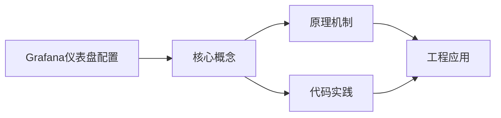
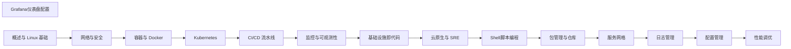

## 1. 学习目标（Bloom 分类）

本节按照布鲁姆教育目标分类学组织学习路径。本文主题为《Grafana仪表盘配置》，属于 DevOps 模块，读者可以根据自身阶段选择阅读深度。

记忆层面：能够准确复述本文的核心概念、术语与基本语法或操作步骤，并能够在提问或检索时快速定位对应知识点。能够说出 DevOps 的核心概念、组件与标准流程。

理解层面：能够用自己的语言解释核心原理与工作机制，说明概念之间的因果关系，而不是机械记忆结论。能够解释 DevOps 的工作原理与关键机制。

应用层面：能够在真实项目或练习场景中运用本文知识解决具体问题，写出正确且可维护的实现。能够执行 DevOps 相关的标准操作与配置。

分析层面：能够拆解复杂问题，比较本文主题与相邻概念的异同，识别边界条件与例外情况。能够分析 DevOps 方案在可靠性、成本与性能上的权衡。

评价层面：能够根据约束条件（性能、可读性、安全、成本）评价不同方案的优劣，做出有依据的技术决策。能够评价 DevOps 中的技术选型。

创造层面：能够把本文知识与其他模块知识组合，设计出新的解决方案或可复用的工程模式。能够设计基于 DevOps 的完整解决方案。

通过本节学习，读者应当能够把《Grafana仪表盘配置》纳入自己的知识网络，并与 DevOps 模块的其他主题（CI/CD、容器、编排、监控、GitOps）建立关联。

## 2. 历史动机与发展脉络

《Grafana仪表盘配置》是 DevOps 领域的重要主题。要真正理解它，需要先了解它解决的问题与演进过程。

DevOps 源于 2009 年（“DevOpsDays”），核心是打破开发与运维壁垒，用自动化与协作缩短交付周期；CALMS 文化（文化、自动化、精益、度量、共享）是其框架。
技术栈演进：持续集成（CI）与持续交付（CD）、基础设施即代码（IaC）、容器（Docker）与编排（Kubernetes）、可观测性（监控/日志/追踪）。
2020 年代趋势：GitOps（声明式 + 自动同步）、平台工程（内部开发者平台）、FinOps（成本治理）、AI 辅助运维。

回到本文主题：Grafana仪表盘配置 的提出与成熟，正是上述技术背景下的必然产物。早期实现往往以简单可用为目标，随着工程规模扩大，社区逐渐沉淀出标准做法与最佳实践；理解这一脉络，可以帮助读者判断“为什么文档中的推荐写法是现在这个样子”，也能在遇到历史遗留代码时准确识别其设计年代与取舍。


## 3. 形式化定义与核心概念精讲

本节把《Grafana仪表盘配置》涉及的核心概念以“定义 + 讲解”的形式展开。读者应把定义当作工具，把讲解当作理解路径；两者结合才能形成可迁移的知识。

CI/CD 管线：代码提交 -> 构建 -> 测试 -> 制品 -> 部署；流水线即代码（GitHub Actions/Jenkins/GitLab CI）。
容器与镜像：OCI 规范、Dockerfile 分层、镜像仓库与签名；容器隔离（cgroup/namespace）。
编排：Kubernetes 的 Pod/Deployment/Service 抽象；声明式期望状态与控制器调和。

### 3.1 原文章节逐一精讲

原文档把主题拆分为 14 个小节，下面按顺序给出每一节的导读讲解，随后保留原文细节供精读。

#### 原文精读（完整保留）

# Grafana 可视化与仪表盘速查手册

> **符号约定**:`< >` 必填参数 | `[ ]` 可选参数

---

#### 1. 数据源配置

##### 1.1 Prometheus

Prometheus是Grafana仪表盘配置的重要组成部分。本节详细介绍Prometheus的核心概念、工作原理和实际应用。

**关键要点**：

- Prometheus的定义与核心原理
- Prometheus的实现方式与技术细节
- Prometheus在实际场景中的应用与最佳实践
- Prometheus的常见问题与解决方案

Prometheus在工程实践中需要根据具体场景选择合适的策略，平衡性能、可靠性和复杂度。

##### 1.2 Loki

Loki是Grafana仪表盘配置的重要组成部分。本节详细介绍Loki的核心概念、工作原理和实际应用。

**关键要点**：

- Loki的定义与核心原理
- Loki的实现方式与技术细节
- Loki在实际场景中的应用与最佳实践
- Loki的常见问题与解决方案

Loki在工程实践中需要根据具体场景选择合适的策略，平衡性能、可靠性和复杂度。

##### 1.3 Elasticsearch

Elasticsearch是Grafana仪表盘配置的重要组成部分。本节详细介绍Elasticsearch的核心概念、工作原理和实际应用。

**关键要点**：

- Elasticsearch的定义与核心原理
- Elasticsearch的实现方式与技术细节
- Elasticsearch在实际场景中的应用与最佳实践
- Elasticsearch的常见问题与解决方案

Elasticsearch在工程实践中需要根据具体场景选择合适的策略，平衡性能、可靠性和复杂度。

#### 2. 面板类型

##### 2.1 时间序列图

时间序列图是Grafana仪表盘配置的重要组成部分。本节详细介绍时间序列图的核心概念、工作原理和实际应用。

**关键要点**：

- 时间序列图的定义与核心原理
- 时间序列图的实现方式与技术细节
- 时间序列图在实际场景中的应用与最佳实践
- 时间序列图的常见问题与解决方案

时间序列图在工程实践中需要根据具体场景选择合适的策略，平衡性能、可靠性和复杂度。

##### 2.2 仪表盘

仪表盘是Grafana仪表盘配置的重要组成部分。本节详细介绍仪表盘的核心概念、工作原理和实际应用。

**关键要点**：

- 仪表盘的定义与核心原理
- 仪表盘的实现方式与技术细节
- 仪表盘在实际场景中的应用与最佳实践
- 仪表盘的常见问题与解决方案

仪表盘在工程实践中需要根据具体场景选择合适的策略，平衡性能、可靠性和复杂度。

##### 2.3 热力图

热力图是Grafana仪表盘配置的重要组成部分。本节详细介绍热力图的核心概念、工作原理和实际应用。

**关键要点**：

- 热力图的定义与核心原理
- 热力图的实现方式与技术细节
- 热力图在实际场景中的应用与最佳实践
- 热力图的常见问题与解决方案

热力图在工程实践中需要根据具体场景选择合适的策略，平衡性能、可靠性和复杂度。

##### 2.4 表格

表格是Grafana仪表盘配置的重要组成部分。本节详细介绍表格的核心概念、工作原理和实际应用。

**关键要点**：

- 表格的定义与核心原理
- 表格的实现方式与技术细节
- 表格在实际场景中的应用与最佳实践
- 表格的常见问题与解决方案

表格在工程实践中需要根据具体场景选择合适的策略，平衡性能、可靠性和复杂度。

#### 3. 变量与模板

##### 3.1 查询变量

查询变量是Grafana仪表盘配置的重要组成部分。本节详细介绍查询变量的核心概念、工作原理和实际应用。

**关键要点**：

- 查询变量的定义与核心原理
- 查询变量的实现方式与技术细节
- 查询变量在实际场景中的应用与最佳实践
- 查询变量的常见问题与解决方案

查询变量在工程实践中需要根据具体场景选择合适的策略，平衡性能、可靠性和复杂度。

##### 3.2 间隔变量

间隔变量是Grafana仪表盘配置的重要组成部分。本节详细介绍间隔变量的核心概念、工作原理和实际应用。

**关键要点**：

- 间隔变量的定义与核心原理
- 间隔变量的实现方式与技术细节
- 间隔变量在实际场景中的应用与最佳实践
- 间隔变量的常见问题与解决方案

间隔变量在工程实践中需要根据具体场景选择合适的策略，平衡性能、可靠性和复杂度。

##### 3.3 链接面板

链接面板是Grafana仪表盘配置的重要组成部分。本节详细介绍链接面板的核心概念、工作原理和实际应用。

**关键要点**：

- 链接面板的定义与核心原理
- 链接面板的实现方式与技术细节
- 链接面板在实际场景中的应用与最佳实践
- 链接面板的常见问题与解决方案

链接面板在工程实践中需要根据具体场景选择合适的策略，平衡性能、可靠性和复杂度。

#### 4. 告警集成

##### 4.1 Grafana 告警规则

Grafana 告警规则是Grafana仪表盘配置的重要组成部分。本节详细介绍Grafana 告警规则的核心概念、工作原理和实际应用。

**关键要点**：

- Grafana 告警规则的定义与核心原理
- Grafana 告警规则的实现方式与技术细节
- Grafana 告警规则在实际场景中的应用与最佳实践
- Grafana 告警规则的常见问题与解决方案

Grafana 告警规则在工程实践中需要根据具体场景选择合适的策略，平衡性能、可靠性和复杂度。

##### 4.2 通知渠道

通知渠道是Grafana仪表盘配置的重要组成部分。本节详细介绍通知渠道的核心概念、工作原理和实际应用。

**关键要点**：

- 通知渠道的定义与核心原理
- 通知渠道的实现方式与技术细节
- 通知渠道在实际场景中的应用与最佳实践
- 通知渠道的常见问题与解决方案

通知渠道在工程实践中需要根据具体场景选择合适的策略，平衡性能、可靠性和复杂度。
#### 服务管理

**基本用法:启动 Grafana**
`grafana-server --config=<配置文件>`

```bash
# Linux 启动
systemctl start grafana-server
systemctl enable grafana-server

# 直接运行二进制
grafana-server --config=/etc/grafana/grafana.ini --homepath=/usr/share/grafana

# Docker 启动
docker run -d --name=grafana -p 3000:3000 grafana/grafana:latest

# Docker Compose 启动(带持久化)
docker run -d --name=grafana -p 3000:3000 \
  -v grafana-storage:/var/lib/grafana \
  -v /etc/grafana/provisioning:/etc/grafana/provisioning \
  grafana/grafana:latest
```

---

**基本用法:查看 Grafana 状态**
`systemctl status grafana-server`

```bash
# 查看服务状态
systemctl status grafana-server

# 查看日志
journalctl -u grafana-server -f --tail=50

# 查看容器日志
docker logs -f grafana --tail=50

# 查看版本
grafana-server -v
docker exec grafana grafana-cli --version
```

---

#### grafana-cli 命令

**基本用法:安装插件**
`grafana-cli plugins install <插件名>`

```bash
# 安装饼图插件
grafana-cli plugins install grafana-piechart-panel

# 安装时钟插件
grafana-cli plugins install grafana-clock-panel

# 安装点击house 数据源
grafana-cli plugins install vertamedia-clickhouse-datasource

# 重启 Grafana 使插件生效
systemctl restart grafana-server
```

---

**基本用法:管理插件**
`grafana-cli plugins <list|install|remove>`

```bash
# 列出已安装插件
grafana-cli plugins ls

# 升级指定插件
grafana-cli plugins upgrade grafana-piechart-panel

# 卸载插件
grafana-cli plugins remove grafana-piechart-panel

# 安装指定版本
grafana-cli plugins install grafana-piechart-panel 1.5.0
```

---

**基本用法:重置管理员密码**
`grafana-cli admin reset-admin-password <新密码>`

```bash
# 重置 admin 密码
grafana-cli admin reset-admin-password newpassword

# Docker 环境重置密码
docker exec -it grafana grafana-cli admin reset-admin-password newpassword

# 查看用户列表(SQLite)
sqlite3 /var/lib/grafana/grafana.db "SELECT login,email FROM user;"
```

---

#### API 操作

**基本用法:认证与获取 API Key**
`curl -u <用户>:<密码> <服务器>/api/...`

```bash
# 基本认证访问 API
curl -u admin:admin http://localhost:3000/api/health

# 创建 API Token
curl -X POST -H "Content-Type: application/json" -u admin:admin \
  http://localhost:3000/api/auth/keys \
  -d '{"name":"ci-key","role":"Admin","secondsToLive":86400}'

# 使用 Token 访问
curl -H "Authorization: Bearer <token>" http://localhost:3000/api/org
```

---

**基本用法:管理数据源**
`curl <服务器>/api/datasources`

```bash
# 列出所有数据源
curl -H "Authorization: Bearer <token>" http://localhost:3000/api/datasources

# 创建 Prometheus 数据源
curl -X POST -H "Authorization: Bearer <token>" -H "Content-Type: application/json" \
  http://localhost:3000/api/datasources \
  -d '{
    "name": "Prometheus",
    "type": "prometheus",
    "url": "http://prometheus:9090",
    "access": "proxy",
    "isDefault": true
  }'

# 测试数据源连接
curl -X POST -H "Authorization: Bearer <token>" \
  http://localhost:3000/api/datasources/name/Prometheus/health
```

---

**基本用法:管理仪表盘**
`curl <服务器>/api/dashboards`

```bash
# 查找仪表盘
curl -H "Authorization: Bearer <token>" \
  "http://localhost:3000/api/search?query=node"

# 导出仪表盘 JSON
curl -H "Authorization: Bearer <token>" \
  http://localhost:3000/api/dashboards/uid/node-overview > dashboard.json

# 导入仪表盘
curl -X POST -H "Authorization: Bearer <token>" -H "Content-Type: application/json" \
  http://localhost:3000/api/dashboards/db \
  -d @dashboard.json
```

---

#### 仪表盘配置

**基本用法:仪表盘 JSON 结构**
`{ "dashboard": {...}, "folderId": 0, "overwrite": false }`

```json
{
  "dashboard": {
    "id": null,
    "uid": "node-overview",
    "title": "节点概览",
    "tags": ["node", "linux"],
    "timezone": "browser",
    "schemaVersion": 39,
    "refresh": "30s",
    "time": {
      "from": "now-6h",
      "to": "now"
    },
    "panels": [
      {
        "id": 1,
        "title": "CPU 使用率",
        "type": "stat",
        "datasource": "Prometheus",
        "targets": [
          {
            "expr": "100 - avg(rate(node_cpu_seconds_total{mode='idle'}[5m])) * 100",
            "legendFormat": "{{instance}}"
          }
        ],
        "gridPos": {"h": 8, "w": 6, "x": 0, "y": 0}
      }
    ]
  },
  "folderId": 0,
  "overwrite": true
}
```

---

**基本用法:变量配置**
`templating.list`

```json
{
  "templating": {
    "list": [
      {
        "name": "datasource",
        "type": "datasource",
        "query": "prometheus",
        "current": {"text": "Prometheus", "value": "Prometheus"}
      },
      {
        "name": "instance",
        "type": "query",
        "datasource": "$datasource",
        "query": "label_values(node_cpu_seconds_total, instance)",
        "refresh": 1,
        "includeAll": true,
        "multi": true
      },
      {
        "name": "interval",
        "type": "interval",
        "options": [
          {"text": "1m", "value": "1m"},
          {"text": "5m", "value": "5m"},
          {"text": "1h", "value": "1h"}
        ],
        "current": {"text": "5m", "value": "5m"}
      }
    ]
  }
}
```

---

**基本用法:面板类型选择**
`type: <类型>`

```json
// 时间序列图
{"type": "timeseries", "title": "CPU 趋势"}

// 仪表盘
{"type": "gauge", "title": "内存使用率"}

// 统计数字
{"type": "stat", "title": "实例总数"}

// 表格
{"type": "table", "title": "节点列表"}

// 热力图
{"type": "heatmap", "title": "请求延迟分布"}

// 日志视图
{"type": "logs", "title": "应用日志"}
```

---

#### Provisioning 自动配置

**基本用法:数据源自动配置**
`provisioning/datasources/datasource.yaml`

```yaml
# provisioning/datasources/datasource.yaml
apiVersion: 1

datasources:
- name: Prometheus
  type: prometheus
  access: proxy
  url: http://prometheus:9090
  isDefault: true
  editable: true

- name: Loki
  type: loki
  access: proxy
  url: http://loki:3100

- name: MySQL
  type: mysql
  url: mysql:3306
  user: readonly
  secureJsonData:
    password: ${MYSQL_PASSWORD}
  jsonData:
    database: metrics
```

---

**基本用法:仪表盘自动配置**
`provisioning/dashboards/dashboard.yaml`

```yaml
# provisioning/dashboards/dashboard.yaml
apiVersion: 1

providers:
- name: 'default'
  orgId: 1
  folder: 'Auto Provisioned'
  folderUid: auto-folder
  type: file
  disableDeletion: false
  updateIntervalSeconds: 30
  allowUiUpdates: true
  options:
    path: /var/lib/grafana/dashboards
    foldersFromFilesStructure: true
```

---

**基本用法:告警规则自动配置**
`provisioning/alerting/rules.yaml`

```yaml
# provisioning/alerting/rules.yaml
apiVersion: 1
groups:
- name: node-alerts
  interval: 30s
  rules:
  - uid: high-cpu
    title: High CPU Usage
    condition: A
    data:
    - refId: A
      relativeTimeRange:
        from: 600
        to: 0
      datasourceUid: prometheus-uid
      model:
        expr: "100 - avg(rate(node_cpu_seconds_total{mode='idle'}[5m])) * 100 > 80"
        instant: true
    noDataState: NoData
    execErrState: Error
    for: 5m
    annotations:
      summary: "CPU 使用率过高"
    labels:
      severity: warning
```

---

#### 告警管理

**基本用法:配置通知渠道**
`provisioning/alerting/contactpoints.yaml`

```yaml
# provisioning/alerting/contactpoints.yaml
apiVersion: 1
contactPoints:
- name: slack-notification
  uid: slack-cp
  type: slack
  settings:
    url: https://hooks.slack.com/services/xxx
    channel: "#alerts"
  disableResolveMessage: false

- name: email-notification
  uid: email-cp
  type: email
  settings:
    addresses: ops@example.com
```

---

**基本用法:通知策略**
`provisioning/alerting/notificationpolicies.yaml`

```yaml
# provisioning/alerting/notificationpolicies.yaml
apiVersion: 1
policies:
- orgId: 1
  receiver: default
  group_by: ['alertname']
  group_wait: 30s
  group_interval: 5m
  repeat_interval: 4h
  routes:
  - receiver: slack-notification
    matchers:
    - severity="critical"
    group_wait: 10s
  - receiver: email-notification
    matchers:
    - severity="warning"
    mute_time_intervals:
    - offhours
```

---

#### 用户与组织管理

**基本用法:管理用户**
`curl -X POST <服务器>/api/admin/users`

```bash
# 创建用户
curl -X POST -H "Authorization: Bearer <token>" -H "Content-Type: application/json" \
  http://localhost:3000/api/admin/users \
  -d '{"name":"Alice","email":"alice@example.com","login":"alice","password":"pass123"}'

# 修改用户角色
curl -X PATCH -H "Authorization: Bearer <token>" -H "Content-Type: application/json" \
  http://localhost:3000/api/org/users/2 \
  -d '{"role":"Editor"}'

# 列出组织成员
curl -H "Authorization: Bearer <token>" http://localhost:3000/api/org/users
```

---

**基本用法:管理组织**
`curl <服务器>/api/orgs`

```bash
# 创建组织
curl -X POST -H "Authorization: Bearer <token>" -H "Content-Type: application/json" \
  http://localhost:3000/api/orgs \
  -d '{"name":"Engineering"}'

# 切换当前组织
curl -X POST -H "Authorization: Bearer <token>" \
  http://localhost:3000/api/user/using/2

# 列出所有组织
curl -H "Authorization: Bearer <token>" http://localhost:3000/api/orgs
```

---

#### 备份与迁移

**基本用法:导出仪表盘**
`curl <服务器>/api/dashboards/uid/<uid>`

```bash
# 导出单个仪表盘
curl -H "Authorization: Bearer <token>" \
  http://localhost:3000/api/dashboards/uid/node-overview > node-overview.json

# 批量导出所有仪表盘
for uid in $(curl -s -H "Authorization: Bearer <token>" \
  http://localhost:3000/api/search?type=dash-db | jq -r '.[].uid'); do
  curl -s -H "Authorization: Bearer <token>" \
    http://localhost:3000/api/dashboards/uid/$uid > "dashboard-${uid}.json"
done
```

---

**基本用法:备份 SQLite 数据库**
`sqlite3 <数据库文件> .backup <备份文件>`

```bash
# 在线备份 SQLite 数据库
sqlite3 /var/lib/grafana/grafana.db ".backup /backup/grafana-$(date +%Y%m%d).db"

# 备份配置与数据卷
docker run --rm -v grafana-storage:/data -v $(pwd):/backup alpine \
  tar czf /backup/grafana-$(date +%Y%m%d).tar.gz /data

# 恢复备份
docker run --rm -v grafana-storage:/data -v $(pwd):/backup alpine \
  tar xzf /backup/grafana-backup.tar.gz -C /
```

---

#### 性能与排查

**基本用法:查看 Grafana 健康状态**
`curl <服务器>/api/health`

```bash
# 健康检查
curl http://localhost:3000/api/health

# 查看指标
curl http://localhost:3000/metrics | grep grafana_

# 查看统计信息
curl -H "Authorization: Bearer <token>" \
  http://localhost:3000/api/admin/stats
```

---

**基本用法:配置日志级别**
`log.level = <级别>`

```ini
# grafana.ini 日志配置
[log]
mode = console file
level = info
filters = alerting.notifier:debug

[log.file]
level = info
max_lines = 1000000
max_size_shift = 28
daily_rotate = true
max_days = 7
```

```bash
# 运行时动态修改日志级别
curl -X PUT -H "Authorization: Bearer <token>" -H "Content-Type: application/json" \
  http://localhost:3000/api/admin/settings \
  -d '{"log.level":"debug"}'
```

---

**基本用法:查询性能优化**
`Query inspector`

```bash
# 通过 API 检查查询性能
curl -X POST -H "Authorization: Bearer <token>" -H "Content-Type: application/json" \
  http://localhost:3000/api/ds/query \
  -d '{
    "queries": [{
      "refId": "A",
      "datasource": {"uid": "prometheus"},
      "expr": "rate(http_requests_total[5m])",
      "instant": false,
      "range": true
    }],
    "from": "now-1h",
    "to": "now"
  }'

# 查看慢查询日志
journalctl -u grafana-server | grep "slow query"
```

---

#### 集成与导出

**基本用法:导出为图片或 PDF**
`curl <服务器>/render/d/<dashboard-uid>`

```bash
# 渲染仪表盘为图片(需安装 image renderer 插件)
curl "http://localhost:3000/render/d/node-overview?from=now-6h&to=now&width=1000&height=500" \
  -H "Authorization: Bearer <token>" -o dashboard.png

# 渲染特定面板
curl "http://localhost:3000/render/d-solo/node-overview/panel-1?from=now-6h&to=now&width=1000&height=500" \
  -H "Authorization: Bearer <token>" -o panel.png

# 通过共享快照 API
curl -X POST -H "Authorization: Bearer <token>" -H "Content-Type: application/json" \
  http://localhost:3000/api/snapshots \
  -d @dashboard.json
```

---

**基本用法:嵌入外部网页**
`<iframe src="<grafana-url>/d/<uid>">`

```html
<!-- 启用嵌入模式需要在 grafana.ini 中配置 -->
<!-- [security] allow_embedding = true -->

<iframe
  src="http://grafana:3000/d/node-overview?from=now-6h&to=now&kiosk=tv"
  width="100%"
  height="600"
  frameborder="0">
</iframe>

<!-- 通过 URL 参数控制显示 -->
<!-- kiosk=tv: 电视模式(隐藏顶部栏) -->
<!-- kiosk=1: 全屏模式(隐藏所有控件) -->
<!-- theme=light: 浅色主题 -->
```


### 3.2 概念关系图

下面用 Mermaid 图表达本文核心概念之间的关系，帮助读者建立整体图景：



图中展示的是本文知识的结构化关系：核心概念是入口，原理机制解释“为什么”，代码实践演示“怎么做”，工程应用回答“何时用”。读者学习时可以把每个小节的内容挂接到对应节点上。

## 4. 理论推导与原理解析

本节深入《Grafana仪表盘配置》背后的原理。理论部分不求面面俱到，而是聚焦“能解释现象、能指导实践”的关键推导。

CI/CD 管线：代码提交 -> 构建 -> 测试 -> 制品 -> 部署；流水线即代码（GitHub Actions/Jenkins/GitLab CI）。
容器与镜像：OCI 规范、Dockerfile 分层、镜像仓库与签名；容器隔离（cgroup/namespace）。
编排：Kubernetes 的 Pod/Deployment/Service 抽象；声明式期望状态与控制器调和。
可观测性三支柱：指标（Prometheus）、日志（Loki/ELK）、追踪（OpenTelemetry）。

需要强调的是，理论推导与工程实践之间存在翻译层：理论给出的是理想化模型与边界条件，工程代码则必须处理真实环境中的例外。读者在学习时应先掌握理论的“标准情形”，再通过陷阱章节了解“非标准情形”。

## 5. 代码示例与逐行讲解

本节把原文中的代码示例系统整理，并为每个示例补充用途说明与讲解。读者不应只浏览代码，而应逐段对照讲解理解设计意图。

### 5.1 示例：服务管理

该示例来自原文《服务管理》小节，用于演示Grafana仪表盘配置相关操作。阅读时请先看代码结构，再看其后的讲解。

```bash
# Linux 启动
systemctl start grafana-server
systemctl enable grafana-server

# 直接运行二进制
grafana-server --config=/etc/grafana/grafana.ini --homepath=/usr/share/grafana

# Docker 启动
docker run -d --name=grafana -p 3000:3000 grafana/grafana:latest

# Docker Compose 启动(带持久化)
docker run -d --name=grafana -p 3000:3000 \
  -v grafana-storage:/var/lib/grafana \
  -v /etc/grafana/provisioning:/etc/grafana/provisioning \
  grafana/grafana:latest
```

讲解：这段代码演示了本节核心知识点。代码中的关键操作可以归纳为三步：准备（定义或初始化）、执行（核心逻辑）、收尾（释放资源或返回结果）。实际项目中，这三步往往被封装为函数或类，以提升复用性与可测试性。

关键点分析：

该示例共 12 行有效代码，结构以数据或配置为主。阅读时应关注：数据字段的含义、配置项的作用，以及它们与运行行为的对应关系。

进阶思考路径：先尝试修改参数观察行为变化，再把示例中的模式迁移到自己的项目中；每次修改都记录预期与实测差异，这是把示例转化为能力的最快方式。

### 5.2 示例：服务管理

该示例来自原文《服务管理》小节，用于演示Grafana仪表盘配置相关操作。阅读时请先看代码结构，再看其后的讲解。

```bash
# 查看服务状态
systemctl status grafana-server

# 查看日志
journalctl -u grafana-server -f --tail=50

# 查看容器日志
docker logs -f grafana --tail=50

# 查看版本
grafana-server -v
docker exec grafana grafana-cli --version
```

讲解：这段代码演示了本节核心知识点。代码中的关键操作可以归纳为三步：准备（定义或初始化）、执行（核心逻辑）、收尾（释放资源或返回结果）。实际项目中，这三步往往被封装为函数或类，以提升复用性与可测试性。

关键点分析：

该示例共 9 行有效代码，结构以数据或配置为主。阅读时应关注：数据字段的含义、配置项的作用，以及它们与运行行为的对应关系。

进阶思考路径：先尝试修改参数观察行为变化，再把示例中的模式迁移到自己的项目中；每次修改都记录预期与实测差异，这是把示例转化为能力的最快方式。

### 5.3 示例：grafana-cli 命令

该示例来自原文《grafana-cli 命令》小节，用于演示Grafana仪表盘配置相关操作。阅读时请先看代码结构，再看其后的讲解。

```bash
# 安装饼图插件
grafana-cli plugins install grafana-piechart-panel

# 安装时钟插件
grafana-cli plugins install grafana-clock-panel

# 安装点击house 数据源
grafana-cli plugins install vertamedia-clickhouse-datasource

# 重启 Grafana 使插件生效
systemctl restart grafana-server
```

讲解：这段代码演示了本节核心知识点。代码中的关键操作可以归纳为三步：准备（定义或初始化）、执行（核心逻辑）、收尾（释放资源或返回结果）。实际项目中，这三步往往被封装为函数或类，以提升复用性与可测试性。

关键点分析：

该示例共 8 行有效代码，结构以数据或配置为主。阅读时应关注：数据字段的含义、配置项的作用，以及它们与运行行为的对应关系。

进阶思考路径：先尝试修改参数观察行为变化，再把示例中的模式迁移到自己的项目中；每次修改都记录预期与实测差异，这是把示例转化为能力的最快方式。

### 5.4 示例：grafana-cli 命令

该示例来自原文《grafana-cli 命令》小节，用于演示Grafana仪表盘配置相关操作。阅读时请先看代码结构，再看其后的讲解。

```bash
# 列出已安装插件
grafana-cli plugins ls

# 升级指定插件
grafana-cli plugins upgrade grafana-piechart-panel

# 卸载插件
grafana-cli plugins remove grafana-piechart-panel

# 安装指定版本
grafana-cli plugins install grafana-piechart-panel 1.5.0
```

讲解：这段代码演示了本节核心知识点。代码中的关键操作可以归纳为三步：准备（定义或初始化）、执行（核心逻辑）、收尾（释放资源或返回结果）。实际项目中，这三步往往被封装为函数或类，以提升复用性与可测试性。

关键点分析：

该示例共 8 行有效代码，结构以数据或配置为主。阅读时应关注：数据字段的含义、配置项的作用，以及它们与运行行为的对应关系。

进阶思考路径：先尝试修改参数观察行为变化，再把示例中的模式迁移到自己的项目中；每次修改都记录预期与实测差异，这是把示例转化为能力的最快方式。

### 5.5 示例：grafana-cli 命令

该示例来自原文《grafana-cli 命令》小节，用于演示Grafana仪表盘配置相关操作。阅读时请先看代码结构，再看其后的讲解。

```bash
# 重置 admin 密码
grafana-cli admin reset-admin-password newpassword

# Docker 环境重置密码
docker exec -it grafana grafana-cli admin reset-admin-password newpassword

# 查看用户列表(SQLite)
sqlite3 /var/lib/grafana/grafana.db "SELECT login,email FROM user;"
```

讲解：这段代码演示了本节核心知识点。代码中的关键操作可以归纳为三步：准备（定义或初始化）、执行（核心逻辑）、收尾（释放资源或返回结果）。实际项目中，这三步往往被封装为函数或类，以提升复用性与可测试性。

关键点分析：

该示例共 6 行有效代码，包含 2 类关键结构（SELECT、FROM）。其中：

- 入口与初始化部分负责建立上下文，对应实际项目中的启动或装配逻辑；
- 核心逻辑部分体现本文主题的主要操作，是阅读时最需要对照讲解理解的部分；
- 输出或返回部分把结果交给调用方，注意其类型与边界条件。

进阶思考路径：先尝试修改参数观察行为变化，再把示例中的模式迁移到自己的项目中；每次修改都记录预期与实测差异，这是把示例转化为能力的最快方式。

### 5.6 示例：API 操作

该示例来自原文《API 操作》小节，用于演示Grafana仪表盘配置相关操作。阅读时请先看代码结构，再看其后的讲解。

```bash
# 基本认证访问 API
curl -u admin:admin http://localhost:3000/api/health

# 创建 API Token
curl -X POST -H "Content-Type: application/json" -u admin:admin \
  http://localhost:3000/api/auth/keys \
  -d '{"name":"ci-key","role":"Admin","secondsToLive":86400}'

# 使用 Token 访问
curl -H "Authorization: Bearer <token>" http://localhost:3000/api/org
```

讲解：这段代码演示了本节核心知识点。代码中的关键操作可以归纳为三步：准备（定义或初始化）、执行（核心逻辑）、收尾（释放资源或返回结果）。实际项目中，这三步往往被封装为函数或类，以提升复用性与可测试性。

关键点分析：

该示例共 8 行有效代码，结构以数据或配置为主。阅读时应关注：数据字段的含义、配置项的作用，以及它们与运行行为的对应关系。

进阶思考路径：先尝试修改参数观察行为变化，再把示例中的模式迁移到自己的项目中；每次修改都记录预期与实测差异，这是把示例转化为能力的最快方式。

### 5.7 示例：API 操作

该示例来自原文《API 操作》小节，用于演示Grafana仪表盘配置相关操作。阅读时请先看代码结构，再看其后的讲解。

```bash
# 列出所有数据源
curl -H "Authorization: Bearer <token>" http://localhost:3000/api/datasources

# 创建 Prometheus 数据源
curl -X POST -H "Authorization: Bearer <token>" -H "Content-Type: application/json" \
  http://localhost:3000/api/datasources \
  -d '{
    "name": "Prometheus",
    "type": "prometheus",
    "url": "http://prometheus:9090",
    "access": "proxy",
    "isDefault": true
  }'

# 测试数据源连接
curl -X POST -H "Authorization: Bearer <token>" \
  http://localhost:3000/api/datasources/name/Prometheus/health
```

讲解：这段代码演示了本节核心知识点。代码中的关键操作可以归纳为三步：准备（定义或初始化）、执行（核心逻辑）、收尾（释放资源或返回结果）。实际项目中，这三步往往被封装为函数或类，以提升复用性与可测试性。

关键点分析：

该示例共 15 行有效代码，结构以数据或配置为主。阅读时应关注：数据字段的含义、配置项的作用，以及它们与运行行为的对应关系。

进阶思考路径：先尝试修改参数观察行为变化，再把示例中的模式迁移到自己的项目中；每次修改都记录预期与实测差异，这是把示例转化为能力的最快方式。

### 5.8 示例：API 操作

该示例来自原文《API 操作》小节，用于演示Grafana仪表盘配置相关操作。阅读时请先看代码结构，再看其后的讲解。

```bash
# 查找仪表盘
curl -H "Authorization: Bearer <token>" \
  "http://localhost:3000/api/search?query=node"

# 导出仪表盘 JSON
curl -H "Authorization: Bearer <token>" \
  http://localhost:3000/api/dashboards/uid/node-overview > dashboard.json

# 导入仪表盘
curl -X POST -H "Authorization: Bearer <token>" -H "Content-Type: application/json" \
  http://localhost:3000/api/dashboards/db \
  -d @dashboard.json
```

讲解：这段代码演示了本节核心知识点。代码中的关键操作可以归纳为三步：准备（定义或初始化）、执行（核心逻辑）、收尾（释放资源或返回结果）。实际项目中，这三步往往被封装为函数或类，以提升复用性与可测试性。

关键点分析：

该示例共 10 行有效代码，结构以数据或配置为主。阅读时应关注：数据字段的含义、配置项的作用，以及它们与运行行为的对应关系。

进阶思考路径：先尝试修改参数观察行为变化，再把示例中的模式迁移到自己的项目中；每次修改都记录预期与实测差异，这是把示例转化为能力的最快方式。

### 5.9 示例：仪表盘配置

该示例来自原文《仪表盘配置》小节，用于演示Grafana仪表盘配置相关操作。阅读时请先看代码结构，再看其后的讲解。

```json
{
  "dashboard": {
    "id": null,
    "uid": "node-overview",
    "title": "节点概览",
    "tags": ["node", "linux"],
    "timezone": "browser",
    "schemaVersion": 39,
    "refresh": "30s",
    "time": {
      "from": "now-6h",
      "to": "now"
    },
    "panels": [
      {
        "id": 1,
        "title": "CPU 使用率",
        "type": "stat",
        "datasource": "Prometheus",
        "targets": [
          {
            "expr": "100 - avg(rate(node_cpu_seconds_total{mode='idle'}[5m])) * 100",
            "legendFormat": "{{instance}}"
          }
        ],
        "gridPos": {"h": 8, "w": 6, "x": 0, "y": 0}
      }
    ]
  },
  "folderId": 0,
  "overwrite": true
}
```

讲解：这段代码演示了本节核心知识点。代码中的关键操作可以归纳为三步：准备（定义或初始化）、执行（核心逻辑）、收尾（释放资源或返回结果）。实际项目中，这三步往往被封装为函数或类，以提升复用性与可测试性。

关键点分析：

该示例共 32 行有效代码，结构以数据或配置为主。阅读时应关注：数据字段的含义、配置项的作用，以及它们与运行行为的对应关系。

进阶思考路径：先尝试修改参数观察行为变化，再把示例中的模式迁移到自己的项目中；每次修改都记录预期与实测差异，这是把示例转化为能力的最快方式。

### 5.10 示例：仪表盘配置

该示例来自原文《仪表盘配置》小节，用于演示Grafana仪表盘配置相关操作。阅读时请先看代码结构，再看其后的讲解。

```json
{
  "templating": {
    "list": [
      {
        "name": "datasource",
        "type": "datasource",
        "query": "prometheus",
        "current": {"text": "Prometheus", "value": "Prometheus"}
      },
      {
        "name": "instance",
        "type": "query",
        "datasource": "$datasource",
        "query": "label_values(node_cpu_seconds_total, instance)",
        "refresh": 1,
        "includeAll": true,
        "multi": true
      },
      {
        "name": "interval",
        "type": "interval",
        "options": [
          {"text": "1m", "value": "1m"},
          {"text": "5m", "value": "5m"},
          {"text": "1h", "value": "1h"}
        ],
        "current": {"text": "5m", "value": "5m"}
      }
    ]
  }
}
```

讲解：这段代码演示了本节核心知识点。代码中的关键操作可以归纳为三步：准备（定义或初始化）、执行（核心逻辑）、收尾（释放资源或返回结果）。实际项目中，这三步往往被封装为函数或类，以提升复用性与可测试性。

关键点分析：

该示例共 31 行有效代码，结构以数据或配置为主。阅读时应关注：数据字段的含义、配置项的作用，以及它们与运行行为的对应关系。

进阶思考路径：先尝试修改参数观察行为变化，再把示例中的模式迁移到自己的项目中；每次修改都记录预期与实测差异，这是把示例转化为能力的最快方式。

### 5.11 示例：仪表盘配置

该示例来自原文《仪表盘配置》小节，用于演示Grafana仪表盘配置相关操作。阅读时请先看代码结构，再看其后的讲解。

```json
// 时间序列图
{"type": "timeseries", "title": "CPU 趋势"}

// 仪表盘
{"type": "gauge", "title": "内存使用率"}

// 统计数字
{"type": "stat", "title": "实例总数"}

// 表格
{"type": "table", "title": "节点列表"}

// 热力图
{"type": "heatmap", "title": "请求延迟分布"}

// 日志视图
{"type": "logs", "title": "应用日志"}
```

讲解：这段代码演示了本节核心知识点。代码中的关键操作可以归纳为三步：准备（定义或初始化）、执行（核心逻辑）、收尾（释放资源或返回结果）。实际项目中，这三步往往被封装为函数或类，以提升复用性与可测试性。

关键点分析：

该示例共 12 行有效代码，结构以数据或配置为主。阅读时应关注：数据字段的含义、配置项的作用，以及它们与运行行为的对应关系。

进阶思考路径：先尝试修改参数观察行为变化，再把示例中的模式迁移到自己的项目中；每次修改都记录预期与实测差异，这是把示例转化为能力的最快方式。

### 5.12 示例：Provisioning 自动配置

该示例来自原文《Provisioning 自动配置》小节，用于演示Grafana仪表盘配置相关操作。阅读时请先看代码结构，再看其后的讲解。

```yaml
# provisioning/datasources/datasource.yaml
apiVersion: 1

datasources:
- name: Prometheus
  type: prometheus
  access: proxy
  url: http://prometheus:9090
  isDefault: true
  editable: true

- name: Loki
  type: loki
  access: proxy
  url: http://loki:3100

- name: MySQL
  type: mysql
  url: mysql:3306
  user: readonly
  secureJsonData:
    password: ${MYSQL_PASSWORD}
  jsonData:
    database: metrics
```

讲解：这段代码演示了本节核心知识点。代码中的关键操作可以归纳为三步：准备（定义或初始化）、执行（核心逻辑）、收尾（释放资源或返回结果）。实际项目中，这三步往往被封装为函数或类，以提升复用性与可测试性。

关键点分析：

该示例共 21 行有效代码，包含 1 类关键结构（apiVersion）。其中：

- 入口与初始化部分负责建立上下文，对应实际项目中的启动或装配逻辑；
- 核心逻辑部分体现本文主题的主要操作，是阅读时最需要对照讲解理解的部分；
- 输出或返回部分把结果交给调用方，注意其类型与边界条件。

进阶思考路径：先尝试修改参数观察行为变化，再把示例中的模式迁移到自己的项目中；每次修改都记录预期与实测差异，这是把示例转化为能力的最快方式。

### 5.13 示例：Provisioning 自动配置

该示例来自原文《Provisioning 自动配置》小节，用于演示Grafana仪表盘配置相关操作。阅读时请先看代码结构，再看其后的讲解。

```yaml
# provisioning/dashboards/dashboard.yaml
apiVersion: 1

providers:
- name: 'default'
  orgId: 1
  folder: 'Auto Provisioned'
  folderUid: auto-folder
  type: file
  disableDeletion: false
  updateIntervalSeconds: 30
  allowUiUpdates: true
  options:
    path: /var/lib/grafana/dashboards
    foldersFromFilesStructure: true
```

讲解：这段代码演示了本节核心知识点。代码中的关键操作可以归纳为三步：准备（定义或初始化）、执行（核心逻辑）、收尾（释放资源或返回结果）。实际项目中，这三步往往被封装为函数或类，以提升复用性与可测试性。

关键点分析：

该示例共 14 行有效代码，包含 1 类关键结构（apiVersion）。其中：

- 入口与初始化部分负责建立上下文，对应实际项目中的启动或装配逻辑；
- 核心逻辑部分体现本文主题的主要操作，是阅读时最需要对照讲解理解的部分；
- 输出或返回部分把结果交给调用方，注意其类型与边界条件。

进阶思考路径：先尝试修改参数观察行为变化，再把示例中的模式迁移到自己的项目中；每次修改都记录预期与实测差异，这是把示例转化为能力的最快方式。

### 5.14 示例：Provisioning 自动配置

该示例来自原文《Provisioning 自动配置》小节，用于演示Grafana仪表盘配置相关操作。阅读时请先看代码结构，再看其后的讲解。

```yaml
# provisioning/alerting/rules.yaml
apiVersion: 1
groups:
- name: node-alerts
  interval: 30s
  rules:
  - uid: high-cpu
    title: High CPU Usage
    condition: A
    data:
    - refId: A
      relativeTimeRange:
        from: 600
        to: 0
      datasourceUid: prometheus-uid
      model:
        expr: "100 - avg(rate(node_cpu_seconds_total{mode='idle'}[5m])) * 100 > 80"
        instant: true
    noDataState: NoData
    execErrState: Error
    for: 5m
    annotations:
      summary: "CPU 使用率过高"
    labels:
      severity: warning
```

讲解：这段代码演示了本节核心知识点。代码中的关键操作可以归纳为三步：准备（定义或初始化）、执行（核心逻辑）、收尾（释放资源或返回结果）。实际项目中，这三步往往被封装为函数或类，以提升复用性与可测试性。

关键点分析：

该示例共 25 行有效代码，包含 1 类关键结构（apiVersion）。其中：

- 入口与初始化部分负责建立上下文，对应实际项目中的启动或装配逻辑；
- 核心逻辑部分体现本文主题的主要操作，是阅读时最需要对照讲解理解的部分；
- 输出或返回部分把结果交给调用方，注意其类型与边界条件。

进阶思考路径：先尝试修改参数观察行为变化，再把示例中的模式迁移到自己的项目中；每次修改都记录预期与实测差异，这是把示例转化为能力的最快方式。

### 5.15 示例：告警管理

该示例来自原文《告警管理》小节，用于演示Grafana仪表盘配置相关操作。阅读时请先看代码结构，再看其后的讲解。

```yaml
# provisioning/alerting/contactpoints.yaml
apiVersion: 1
contactPoints:
- name: slack-notification
  uid: slack-cp
  type: slack
  settings:
    url: https://hooks.slack.com/services/xxx
    channel: "#alerts"
  disableResolveMessage: false

- name: email-notification
  uid: email-cp
  type: email
  settings:
    addresses: ops@example.com
```

讲解：这段代码演示了本节核心知识点。代码中的关键操作可以归纳为三步：准备（定义或初始化）、执行（核心逻辑）、收尾（释放资源或返回结果）。实际项目中，这三步往往被封装为函数或类，以提升复用性与可测试性。

关键点分析：

该示例共 15 行有效代码，包含 1 类关键结构（apiVersion）。其中：

- 入口与初始化部分负责建立上下文，对应实际项目中的启动或装配逻辑；
- 核心逻辑部分体现本文主题的主要操作，是阅读时最需要对照讲解理解的部分；
- 输出或返回部分把结果交给调用方，注意其类型与边界条件。

进阶思考路径：先尝试修改参数观察行为变化，再把示例中的模式迁移到自己的项目中；每次修改都记录预期与实测差异，这是把示例转化为能力的最快方式。

### 5.16 示例：告警管理

该示例来自原文《告警管理》小节，用于演示Grafana仪表盘配置相关操作。阅读时请先看代码结构，再看其后的讲解。

```yaml
# provisioning/alerting/notificationpolicies.yaml
apiVersion: 1
policies:
- orgId: 1
  receiver: default
  group_by: ['alertname']
  group_wait: 30s
  group_interval: 5m
  repeat_interval: 4h
  routes:
  - receiver: slack-notification
    matchers:
    - severity="critical"
    group_wait: 10s
  - receiver: email-notification
    matchers:
    - severity="warning"
    mute_time_intervals:
    - offhours
```

讲解：这段代码演示了本节核心知识点。代码中的关键操作可以归纳为三步：准备（定义或初始化）、执行（核心逻辑）、收尾（释放资源或返回结果）。实际项目中，这三步往往被封装为函数或类，以提升复用性与可测试性。

关键点分析：

该示例共 19 行有效代码，包含 1 类关键结构（apiVersion）。其中：

- 入口与初始化部分负责建立上下文，对应实际项目中的启动或装配逻辑；
- 核心逻辑部分体现本文主题的主要操作，是阅读时最需要对照讲解理解的部分；
- 输出或返回部分把结果交给调用方，注意其类型与边界条件。

进阶思考路径：先尝试修改参数观察行为变化，再把示例中的模式迁移到自己的项目中；每次修改都记录预期与实测差异，这是把示例转化为能力的最快方式。

### 5.17 示例：用户与组织管理

该示例来自原文《用户与组织管理》小节，用于演示Grafana仪表盘配置相关操作。阅读时请先看代码结构，再看其后的讲解。

```bash
# 创建用户
curl -X POST -H "Authorization: Bearer <token>" -H "Content-Type: application/json" \
  http://localhost:3000/api/admin/users \
  -d '{"name":"Alice","email":"alice@example.com","login":"alice","password":"pass123"}'

# 修改用户角色
curl -X PATCH -H "Authorization: Bearer <token>" -H "Content-Type: application/json" \
  http://localhost:3000/api/org/users/2 \
  -d '{"role":"Editor"}'

# 列出组织成员
curl -H "Authorization: Bearer <token>" http://localhost:3000/api/org/users
```

讲解：这段代码演示了本节核心知识点。代码中的关键操作可以归纳为三步：准备（定义或初始化）、执行（核心逻辑）、收尾（释放资源或返回结果）。实际项目中，这三步往往被封装为函数或类，以提升复用性与可测试性。

关键点分析：

该示例共 10 行有效代码，结构以数据或配置为主。阅读时应关注：数据字段的含义、配置项的作用，以及它们与运行行为的对应关系。

进阶思考路径：先尝试修改参数观察行为变化，再把示例中的模式迁移到自己的项目中；每次修改都记录预期与实测差异，这是把示例转化为能力的最快方式。

### 5.18 示例：用户与组织管理

该示例来自原文《用户与组织管理》小节，用于演示Grafana仪表盘配置相关操作。阅读时请先看代码结构，再看其后的讲解。

```bash
# 创建组织
curl -X POST -H "Authorization: Bearer <token>" -H "Content-Type: application/json" \
  http://localhost:3000/api/orgs \
  -d '{"name":"Engineering"}'

# 切换当前组织
curl -X POST -H "Authorization: Bearer <token>" \
  http://localhost:3000/api/user/using/2

# 列出所有组织
curl -H "Authorization: Bearer <token>" http://localhost:3000/api/orgs
```

讲解：这段代码演示了本节核心知识点。代码中的关键操作可以归纳为三步：准备（定义或初始化）、执行（核心逻辑）、收尾（释放资源或返回结果）。实际项目中，这三步往往被封装为函数或类，以提升复用性与可测试性。

关键点分析：

该示例共 9 行有效代码，结构以数据或配置为主。阅读时应关注：数据字段的含义、配置项的作用，以及它们与运行行为的对应关系。

进阶思考路径：先尝试修改参数观察行为变化，再把示例中的模式迁移到自己的项目中；每次修改都记录预期与实测差异，这是把示例转化为能力的最快方式。

### 5.19 示例：备份与迁移

该示例来自原文《备份与迁移》小节，用于演示Grafana仪表盘配置相关操作。阅读时请先看代码结构，再看其后的讲解。

```bash
# 导出单个仪表盘
curl -H "Authorization: Bearer <token>" \
  http://localhost:3000/api/dashboards/uid/node-overview > node-overview.json

# 批量导出所有仪表盘
for uid in $(curl -s -H "Authorization: Bearer <token>" \
  http://localhost:3000/api/search?type=dash-db | jq -r '.[].uid'); do
  curl -s -H "Authorization: Bearer <token>" \
    http://localhost:3000/api/dashboards/uid/$uid > "dashboard-${uid}.json"
done
```

讲解：这段代码演示了本节核心知识点。代码中的关键操作可以归纳为三步：准备（定义或初始化）、执行（核心逻辑）、收尾（释放资源或返回结果）。实际项目中，这三步往往被封装为函数或类，以提升复用性与可测试性。

关键点分析：

该示例共 9 行有效代码，包含 1 类关键结构（for）。其中：

- 入口与初始化部分负责建立上下文，对应实际项目中的启动或装配逻辑；
- 核心逻辑部分体现本文主题的主要操作，是阅读时最需要对照讲解理解的部分；
- 输出或返回部分把结果交给调用方，注意其类型与边界条件。

进阶思考路径：先尝试修改参数观察行为变化，再把示例中的模式迁移到自己的项目中；每次修改都记录预期与实测差异，这是把示例转化为能力的最快方式。

### 5.20 示例：备份与迁移

该示例来自原文《备份与迁移》小节，用于演示Grafana仪表盘配置相关操作。阅读时请先看代码结构，再看其后的讲解。

```bash
# 在线备份 SQLite 数据库
sqlite3 /var/lib/grafana/grafana.db ".backup /backup/grafana-$(date +%Y%m%d).db"

# 备份配置与数据卷
docker run --rm -v grafana-storage:/data -v $(pwd):/backup alpine \
  tar czf /backup/grafana-$(date +%Y%m%d).tar.gz /data

# 恢复备份
docker run --rm -v grafana-storage:/data -v $(pwd):/backup alpine \
  tar xzf /backup/grafana-backup.tar.gz -C /
```

讲解：这段代码演示了本节核心知识点。代码中的关键操作可以归纳为三步：准备（定义或初始化）、执行（核心逻辑）、收尾（释放资源或返回结果）。实际项目中，这三步往往被封装为函数或类，以提升复用性与可测试性。

关键点分析：

该示例共 8 行有效代码，结构以数据或配置为主。阅读时应关注：数据字段的含义、配置项的作用，以及它们与运行行为的对应关系。

进阶思考路径：先尝试修改参数观察行为变化，再把示例中的模式迁移到自己的项目中；每次修改都记录预期与实测差异，这是把示例转化为能力的最快方式。

### 5.21 示例：性能与排查

该示例来自原文《性能与排查》小节，用于演示Grafana仪表盘配置相关操作。阅读时请先看代码结构，再看其后的讲解。

```bash
# 健康检查
curl http://localhost:3000/api/health

# 查看指标
curl http://localhost:3000/metrics | grep grafana_

# 查看统计信息
curl -H "Authorization: Bearer <token>" \
  http://localhost:3000/api/admin/stats
```

讲解：这段代码演示了本节核心知识点。代码中的关键操作可以归纳为三步：准备（定义或初始化）、执行（核心逻辑）、收尾（释放资源或返回结果）。实际项目中，这三步往往被封装为函数或类，以提升复用性与可测试性。

关键点分析：

该示例共 7 行有效代码，结构以数据或配置为主。阅读时应关注：数据字段的含义、配置项的作用，以及它们与运行行为的对应关系。

进阶思考路径：先尝试修改参数观察行为变化，再把示例中的模式迁移到自己的项目中；每次修改都记录预期与实测差异，这是把示例转化为能力的最快方式。

### 5.22 示例：性能与排查

该示例来自原文《性能与排查》小节，用于演示Grafana仪表盘配置相关操作。阅读时请先看代码结构，再看其后的讲解。

```ini
# grafana.ini 日志配置
[log]
mode = console file
level = info
filters = alerting.notifier:debug

[log.file]
level = info
max_lines = 1000000
max_size_shift = 28
daily_rotate = true
max_days = 7
```

讲解：这段代码演示了本节核心知识点。代码中的关键操作可以归纳为三步：准备（定义或初始化）、执行（核心逻辑）、收尾（释放资源或返回结果）。实际项目中，这三步往往被封装为函数或类，以提升复用性与可测试性。

关键点分析：

该示例共 11 行有效代码，结构以数据或配置为主。阅读时应关注：数据字段的含义、配置项的作用，以及它们与运行行为的对应关系。

进阶思考路径：先尝试修改参数观察行为变化，再把示例中的模式迁移到自己的项目中；每次修改都记录预期与实测差异，这是把示例转化为能力的最快方式。

### 5.23 示例：性能与排查

该示例来自原文《性能与排查》小节，用于演示Grafana仪表盘配置相关操作。阅读时请先看代码结构，再看其后的讲解。

```bash
# 运行时动态修改日志级别
curl -X PUT -H "Authorization: Bearer <token>" -H "Content-Type: application/json" \
  http://localhost:3000/api/admin/settings \
  -d '{"log.level":"debug"}'
```

讲解：这段代码演示了本节核心知识点。代码中的关键操作可以归纳为三步：准备（定义或初始化）、执行（核心逻辑）、收尾（释放资源或返回结果）。实际项目中，这三步往往被封装为函数或类，以提升复用性与可测试性。

关键点分析：

该示例共 4 行有效代码，结构以数据或配置为主。阅读时应关注：数据字段的含义、配置项的作用，以及它们与运行行为的对应关系。

进阶思考路径：先尝试修改参数观察行为变化，再把示例中的模式迁移到自己的项目中；每次修改都记录预期与实测差异，这是把示例转化为能力的最快方式。

### 5.24 示例：性能与排查

该示例来自原文《性能与排查》小节，用于演示Grafana仪表盘配置相关操作。阅读时请先看代码结构，再看其后的讲解。

```bash
# 通过 API 检查查询性能
curl -X POST -H "Authorization: Bearer <token>" -H "Content-Type: application/json" \
  http://localhost:3000/api/ds/query \
  -d '{
    "queries": [{
      "refId": "A",
      "datasource": {"uid": "prometheus"},
      "expr": "rate(http_requests_total[5m])",
      "instant": false,
      "range": true
    }],
    "from": "now-1h",
    "to": "now"
  }'

# 查看慢查询日志
journalctl -u grafana-server | grep "slow query"
```

讲解：这段代码演示了本节核心知识点。代码中的关键操作可以归纳为三步：准备（定义或初始化）、执行（核心逻辑）、收尾（释放资源或返回结果）。实际项目中，这三步往往被封装为函数或类，以提升复用性与可测试性。

关键点分析：

该示例共 16 行有效代码，结构以数据或配置为主。阅读时应关注：数据字段的含义、配置项的作用，以及它们与运行行为的对应关系。

进阶思考路径：先尝试修改参数观察行为变化，再把示例中的模式迁移到自己的项目中；每次修改都记录预期与实测差异，这是把示例转化为能力的最快方式。

### 5.25 示例：集成与导出

该示例来自原文《集成与导出》小节，用于演示Grafana仪表盘配置相关操作。阅读时请先看代码结构，再看其后的讲解。

```bash
# 渲染仪表盘为图片(需安装 image renderer 插件)
curl "http://localhost:3000/render/d/node-overview?from=now-6h&to=now&width=1000&height=500" \
  -H "Authorization: Bearer <token>" -o dashboard.png

# 渲染特定面板
curl "http://localhost:3000/render/d-solo/node-overview/panel-1?from=now-6h&to=now&width=1000&height=500" \
  -H "Authorization: Bearer <token>" -o panel.png

# 通过共享快照 API
curl -X POST -H "Authorization: Bearer <token>" -H "Content-Type: application/json" \
  http://localhost:3000/api/snapshots \
  -d @dashboard.json
```

讲解：这段代码演示了本节核心知识点。代码中的关键操作可以归纳为三步：准备（定义或初始化）、执行（核心逻辑）、收尾（释放资源或返回结果）。实际项目中，这三步往往被封装为函数或类，以提升复用性与可测试性。

关键点分析：

该示例共 10 行有效代码，结构以数据或配置为主。阅读时应关注：数据字段的含义、配置项的作用，以及它们与运行行为的对应关系。

进阶思考路径：先尝试修改参数观察行为变化，再把示例中的模式迁移到自己的项目中；每次修改都记录预期与实测差异，这是把示例转化为能力的最快方式。

### 5.26 示例：集成与导出

该示例来自原文《集成与导出》小节，用于演示Grafana仪表盘配置相关操作。阅读时请先看代码结构，再看其后的讲解。

```html
<!-- 启用嵌入模式需要在 grafana.ini 中配置 -->
<!-- [security] allow_embedding = true -->

<iframe
  src="http://grafana:3000/d/node-overview?from=now-6h&to=now&kiosk=tv"
  width="100%"
  height="600"
  frameborder="0">
</iframe>

<!-- 通过 URL 参数控制显示 -->
<!-- kiosk=tv: 电视模式(隐藏顶部栏) -->
<!-- kiosk=1: 全屏模式(隐藏所有控件) -->
<!-- theme=light: 浅色主题 -->
```

讲解：这段代码演示了本节核心知识点。代码中的关键操作可以归纳为三步：准备（定义或初始化）、执行（核心逻辑）、收尾（释放资源或返回结果）。实际项目中，这三步往往被封装为函数或类，以提升复用性与可测试性。

关键点分析：

该示例共 12 行有效代码，结构以数据或配置为主。阅读时应关注：数据字段的含义、配置项的作用，以及它们与运行行为的对应关系。

进阶思考路径：先尝试修改参数观察行为变化，再把示例中的模式迁移到自己的项目中；每次修改都记录预期与实测差异，这是把示例转化为能力的最快方式。


综合以上示例，可以总结出本主题的代码实践要点：第一，先定义清晰的输入输出契约；第二，核心逻辑保持单一职责；第三，错误处理与边界条件不可省略；第四，命名与注释表达意图而非复述代码。

## 6. 对比分析

对比是理解《Grafana仪表盘配置》定位的最快路径。下面从多个维度与相邻方案进行对比。

CI 与 CD：CI 保证可集成，CD 保证可交付；两者可独立实施。
Kubernetes 与 Docker Compose：K8s 生产级编排；Compose 单机开发。
传统运维与 SRE：SRE 用软件工程方法运维，错误预算与 SLO。

对比的目的不是分出绝对优劣，而是建立选择依据：不同约束条件下，最优解不同。读者应把每个对比维度转化为决策检查清单。

## 7. 常见陷阱与最佳实践

本节整理该主题的高频错误与推荐做法。每个陷阱先描述现象，再解释原因，最后给出最佳实践。

### 7.1 环境漂移

手工配置导致环境不一致。全部走 IaC 与镜像。

深入讲解：该问题之所以被归类为“常见陷阱”，是因为它在初学者的代码中反复出现，而且往往不在第一时间暴露——错误通常隐藏在特定数据或特定时序下。

从成因上看，环境漂移 一般源于对 DevOps 某个机制的理解偏差：要么误用了默认行为，要么忽略了边界条件，要么把其他语言的思维惯性带了过来。

从影响上看，环境漂移 轻则产生错误结果，重则导致资源泄漏、数据损坏或安全事故；这也是为什么工程评审中会把它列为检查项。

从修复策略上看，处理环境漂移的正确顺序是：先复现（构造最小用例），再定位（确认机制层面的根因），最后修复并补充回归测试。跳过复现直接改代码，往往治标不治本。

### 7.2 秘密硬编码

密钥进仓库。使用 Secret 管理与注入。

深入讲解：该问题之所以被归类为“常见陷阱”，是因为它在初学者的代码中反复出现，而且往往不在第一时间暴露——错误通常隐藏在特定数据或特定时序下。

从成因上看，秘密硬编码 一般源于对 DevOps 某个机制的理解偏差：要么误用了默认行为，要么忽略了边界条件，要么把其他语言的思维惯性带了过来。

从影响上看，秘密硬编码 轻则产生错误结果，重则导致资源泄漏、数据损坏或安全事故；这也是为什么工程评审中会把它列为检查项。

从修复策略上看，处理秘密硬编码的正确顺序是：先复现（构造最小用例），再定位（确认机制层面的根因），最后修复并补充回归测试。跳过复现直接改代码，往往治标不治本。

### 7.3 构建不可复现

依赖未锁定。锁定依赖版本与基础镜像 digest。

深入讲解：该问题之所以被归类为“常见陷阱”，是因为它在初学者的代码中反复出现，而且往往不在第一时间暴露——错误通常隐藏在特定数据或特定时序下。

从成因上看，构建不可复现 一般源于对 DevOps 某个机制的理解偏差：要么误用了默认行为，要么忽略了边界条件，要么把其他语言的思维惯性带了过来。

从影响上看，构建不可复现 轻则产生错误结果，重则导致资源泄漏、数据损坏或安全事故；这也是为什么工程评审中会把它列为检查项。

从修复策略上看，处理构建不可复现的正确顺序是：先复现（构造最小用例），再定位（确认机制层面的根因），最后修复并补充回归测试。跳过复现直接改代码，往往治标不治本。

### 7.4 测试后置

问题到生产才发现。左移：单元/集成/E2E 分层。

深入讲解：该问题之所以被归类为“常见陷阱”，是因为它在初学者的代码中反复出现，而且往往不在第一时间暴露——错误通常隐藏在特定数据或特定时序下。

从成因上看，测试后置 一般源于对 DevOps 某个机制的理解偏差：要么误用了默认行为，要么忽略了边界条件，要么把其他语言的思维惯性带了过来。

从影响上看，测试后置 轻则产生错误结果，重则导致资源泄漏、数据损坏或安全事故；这也是为什么工程评审中会把它列为检查项。

从修复策略上看，处理测试后置的正确顺序是：先复现（构造最小用例），再定位（确认机制层面的根因），最后修复并补充回归测试。跳过复现直接改代码，往往治标不治本。

### 7.5 回滚缺失

发布失败无法回退。保留历史镜像与一键回滚。

深入讲解：该问题之所以被归类为“常见陷阱”，是因为它在初学者的代码中反复出现，而且往往不在第一时间暴露——错误通常隐藏在特定数据或特定时序下。

从成因上看，回滚缺失 一般源于对 DevOps 某个机制的理解偏差：要么误用了默认行为，要么忽略了边界条件，要么把其他语言的思维惯性带了过来。

从影响上看，回滚缺失 轻则产生错误结果，重则导致资源泄漏、数据损坏或安全事故；这也是为什么工程评审中会把它列为检查项。

从修复策略上看，处理回滚缺失的正确顺序是：先复现（构造最小用例），再定位（确认机制层面的根因），最后修复并补充回归测试。跳过复现直接改代码，往往治标不治本。

### 7.6 监控盲区

无指标与告警。核心链路全量可观测。

深入讲解：该问题之所以被归类为“常见陷阱”，是因为它在初学者的代码中反复出现，而且往往不在第一时间暴露——错误通常隐藏在特定数据或特定时序下。

从成因上看，监控盲区 一般源于对 DevOps 某个机制的理解偏差：要么误用了默认行为，要么忽略了边界条件，要么把其他语言的思维惯性带了过来。

从影响上看，监控盲区 轻则产生错误结果，重则导致资源泄漏、数据损坏或安全事故；这也是为什么工程评审中会把它列为检查项。

从修复策略上看，处理监控盲区的正确顺序是：先复现（构造最小用例），再定位（确认机制层面的根因），最后修复并补充回归测试。跳过复现直接改代码，往往治标不治本。

### 7.7 权限过大

CI 权限超需求。最小权限与短期凭证。

深入讲解：该问题之所以被归类为“常见陷阱”，是因为它在初学者的代码中反复出现，而且往往不在第一时间暴露——错误通常隐藏在特定数据或特定时序下。

从成因上看，权限过大 一般源于对 DevOps 某个机制的理解偏差：要么误用了默认行为，要么忽略了边界条件，要么把其他语言的思维惯性带了过来。

从影响上看，权限过大 轻则产生错误结果，重则导致资源泄漏、数据损坏或安全事故；这也是为什么工程评审中会把它列为检查项。

从修复策略上看，处理权限过大的正确顺序是：先复现（构造最小用例），再定位（确认机制层面的根因），最后修复并补充回归测试。跳过复现直接改代码，往往治标不治本。

### 7.8 部署频率低

大爆炸发布风险高。小步快跑与灰度。

深入讲解：该问题之所以被归类为“常见陷阱”，是因为它在初学者的代码中反复出现，而且往往不在第一时间暴露——错误通常隐藏在特定数据或特定时序下。

从成因上看，部署频率低 一般源于对 DevOps 某个机制的理解偏差：要么误用了默认行为，要么忽略了边界条件，要么把其他语言的思维惯性带了过来。

从影响上看，部署频率低 轻则产生错误结果，重则导致资源泄漏、数据损坏或安全事故；这也是为什么工程评审中会把它列为检查项。

从修复策略上看，处理部署频率低的正确顺序是：先复现（构造最小用例），再定位（确认机制层面的根因），最后修复并补充回归测试。跳过复现直接改代码，往往治标不治本。

### 7.0 最佳实践总览

1. 一切皆代码：流水线、基础设施、配置版本化。
2. 发布可重复：相同代码 + 相同制品 -> 相同环境。
3. 失败可预期：小批量、金丝雀、自动回滚。
4. 度量驱动：DORA 指标（部署频率、变更前置时间、恢复时间、变更失败率）。

把这些最佳实践固化为团队规范与代码评审检查项，是避免同类问题反复出现的关键。

## 8. 工程实践

本节把《Grafana仪表盘配置》放入真实工程场景，给出可复用的模式与组织方法。

GitHub Actions：workflow/job/step 模型，矩阵测试，环境与密钥管理。
GitOps：Argo CD 同步 Git 仓库与集群状态，PR 即发布审批。
平台工程：模板化应用脚手架（Backstage）、自助环境、成本可视化。

### 8.1 工程实践的原则拆解

以上工程实践可以归纳为四条原则。第一，配置与代码分离：DevOps 项目中环境差异应通过配置注入，而不是散落在代码分支中；这保证同一份代码可以在开发、测试、生产环境一致运行。

第二，接口稳定优先：对外接口（函数签名、协议、数据格式）一旦被消费方依赖，变更成本极高；设计时应预留扩展点并保持向后兼容。

第三，可观测性内置：日志、指标与追踪应该在功能开发时同步设计，而不是故障发生后补救；没有观测手段的模块等于黑盒。

第四，变更可回滚：任何发布都应有对应的回滚方案；数据库迁移、配置变更与代码发布一样需要版本管理与逆向路径。

### 8.2 实践落地的检查清单

- [ ] GitHub Actions：对照本节描述，检查当前项目是否已经落实；未落实的项列入技术债并排期处理。
- [ ] GitOps：对照本节描述，检查当前项目是否已经落实；未落实的项列入技术债并排期处理。
- [ ] 平台工程：对照本节描述，检查当前项目是否已经落实；未落实的项列入技术债并排期处理。

工程实践的共性原则：配置与代码分离、接口稳定优先、可观测性内置、变更可回滚。这些原则适用于本主题的所有实现。

## 9. 案例研究

本节通过一个完整案例把《Grafana仪表盘配置》的知识串起来。案例按“需求分析、方案设计、实现、验证”四步展开。

需求：为微服务搭建从提交到生产的自动化管线。
方案：GitHub Actions 构建镜像 + 测试 + 扫描，Argo CD 部署到 K8s，Prometheus 监控。
要点：镜像 tag 用 commit SHA；金丝雀发布；回滚演练。
验证：发布频率与失败率度量、故障注入演练。

### 9.1 案例的扩展讨论

把案例中的方案放大到真实规模，需要额外考虑三个问题：

第一，规模：当数据量或并发量上升一个数量级时，原方案中的数据结构、缓存策略与任务调度是否仍然成立？通常需要引入分层与异步。

第二，团队：多人协作时，模块边界、接口契约与代码所有权必须明确；案例中的实现应拆分为可独立测试的单元，并配合文档说明设计意图。

第三，演进：上线后的需求变化不可避免；方案设计时应预留扩展点（配置化、插件化、事件化），并定期用真实指标验证假设。


案例研究的学习方法：先独立阅读需求，尝试在脑中形成方案，再对照实现与讲解，最后思考“如果约束变化（数据量、并发、团队规模），方案应如何调整”。

## 10. 知识要点总结与深入讲解

本节以讲解形式汇总全文要点，替代传统的习题与自测，读者不需要答题，只需跟随解释建立完整的认知框架。

关于《Grafana仪表盘配置》的核心结论：

DevOps 的本质是自动化与协作，工具只是载体。
可重复、可回滚、可观测是三条主线。
从 DORA 指标开始度量改进，避免为工具而工具。

原文档各小节的要点回顾：

- 1. 数据源配置：该小节围绕Grafana仪表盘配置展开具体细节，阅读时应关注其与核心结论的对应关系；每个小节都是核心结论在某一个侧面的展开。
- 2. 面板类型：该小节围绕Grafana仪表盘配置展开具体细节，阅读时应关注其与核心结论的对应关系；每个小节都是核心结论在某一个侧面的展开。
- 3. 变量与模板：该小节围绕Grafana仪表盘配置展开具体细节，阅读时应关注其与核心结论的对应关系；每个小节都是核心结论在某一个侧面的展开。
- 4. 告警集成：该小节围绕Grafana仪表盘配置展开具体细节，阅读时应关注其与核心结论的对应关系；每个小节都是核心结论在某一个侧面的展开。
- 服务管理：该小节围绕Grafana仪表盘配置展开具体细节，阅读时应关注其与核心结论的对应关系；每个小节都是核心结论在某一个侧面的展开。
- grafana-cli 命令：该小节围绕Grafana仪表盘配置展开具体细节，阅读时应关注其与核心结论的对应关系；每个小节都是核心结论在某一个侧面的展开。
- API 操作：该小节围绕Grafana仪表盘配置展开具体细节，阅读时应关注其与核心结论的对应关系；每个小节都是核心结论在某一个侧面的展开。
- 仪表盘配置：该小节围绕Grafana仪表盘配置展开具体细节，阅读时应关注其与核心结论的对应关系；每个小节都是核心结论在某一个侧面的展开。
- Provisioning 自动配置：该小节围绕Grafana仪表盘配置展开具体细节，阅读时应关注其与核心结论的对应关系；每个小节都是核心结论在某一个侧面的展开。
- 告警管理：该小节围绕Grafana仪表盘配置展开具体细节，阅读时应关注其与核心结论的对应关系；每个小节都是核心结论在某一个侧面的展开。
- 用户与组织管理：该小节围绕Grafana仪表盘配置展开具体细节，阅读时应关注其与核心结论的对应关系；每个小节都是核心结论在某一个侧面的展开。
- 备份与迁移：该小节围绕Grafana仪表盘配置展开具体细节，阅读时应关注其与核心结论的对应关系；每个小节都是核心结论在某一个侧面的展开。
- 性能与排查：该小节围绕Grafana仪表盘配置展开具体细节，阅读时应关注其与核心结论的对应关系；每个小节都是核心结论在某一个侧面的展开。
- 集成与导出：该小节围绕Grafana仪表盘配置展开具体细节，阅读时应关注其与核心结论的对应关系；每个小节都是核心结论在某一个侧面的展开。

把以上要点与第 3-9 节的内容对照复习，即可完成对本文主题的闭环学习。

## 11. 参考文献


GitHub Actions 文档：https://docs.github.com/zh/actions
GitLab CI 文档：https://docs.gitlab.com/ci/
Argo CD：https://argo-cd.readthedocs.io/
DORA 研究：https://dora.dev/
DevOps 手册（Gene Kim 等）：https://itrevolution.com/devops-handbook/

## 12. 延伸阅读


Docker 与 Kubernetes 深入，见 031-devops 模块文档。
CI/CD 管线设计，见 031-devops 模块 CICD 文档。
云原生架构，见 034-cloud-computing 模块。
尚硅谷 Bilibili 空间（https://space.bilibili.com/302417610 ）提供 DevOps 课程。

## 14. 模块知识图谱与学习路径

本文属于 DevOps 模块。为了把《Grafana仪表盘配置》放入完整的知识网络，下面列出本模块的全部主题并给出相互关联的导读。学习时建议按模块内顺序推进，并在每个文档中留意交叉引用。



上图为模块主题的推荐学习顺序示意图（仅展示前若干主题）。各主题之间存在三类关联：

第一，前置依赖关系：早期主题是后期主题的基础，例如环境与语法先行、进阶主题随后；

第二，横向并列关系：同一层级主题从不同角度覆盖模块能力，学习顺序可以按兴趣调整；

第三，工程组合关系：多个主题在真实项目中组合使用，例如配置、性能与安全主题往往出现在同一系统的不同层面。

### 14.1 模块主题速查表

| 文档 | 主题 | 与本文的关联 |
| --- | --- | --- |
| 概述与 Linux 基础 | 001-OverviewLinuxBasics | 本文的前置基础 |
| 网络与安全 | 002-NetworkSecurity | 本文的安全延伸 |
| 容器与 Docker | 003-ContainerDocker | 本文的并列主题 |
| Kubernetes | 004-Kubernetes | 本文的并列主题 |
| CI/CD 流水线 | 005-CICDPipeline | 本文的并列主题 |
| 监控与可观测性 | 006-MonitorAndObservability | 本文的并列主题 |
| 基础设施即代码 | 007-IaC | 本文的前置基础 |
| 云原生与 SRE | 008-CloudNativeSRE | 本文的并列主题 |
| Shell脚本编程 | 009-ShellScriptProgramming | 本文的并列主题 |
| 包管理与仓库 | 010-PackageManagementRepository | 本文的并列主题 |
| 服务网格 | 011-ServiceMesh | 本文的并列主题 |
| 日志管理 | 012-LogManagement | 本文的并列主题 |
| 配置管理 | 013-ConfigManagement | 本文的并列主题 |
| 性能调优 | 014-PerformanceTuning | 本文的性能延伸 |
| 高可用架构 | 015-HighAvailabilityArchitecture | 本文的原理深化 |
| 自动化测试 | 016-AutomationTest | 本文的并列主题 |
| 故障排查 | 017-Troubleshooting | 本文的并列主题 |
| 容器安全 | 018-ContainerSecurity | 本文的安全延伸 |
| GitOps与持续交付 | 019-GitOpsCD | 本文的并列主题 |
| 监控与告警 | 020-MonitorAndAlert | 本文的并列主题 |
| 网络与安全进阶 | 021-NetworkSecurityAdvanced | 本文的安全延伸 |
| 数据库运维 | 022-DatabaseOps | 本文的并列主题 |
| Dockerfile多阶段构建 | 023-DockerfileMultiBuild | 本文的并列主题 |
| Kubernetes核心资源详解 | 024-KubernetesCoreDetailed | 本文的并列主题 |
| Helm-Chart应用打包 | 025-HelmChartApplicationPackage | 本文的并列主题 |
| Terraform资源编排 | 026-Terraform | 本文的并列主题 |
| Ansible-Playbook配置管理 | 027-AnsiblePlaybookConfigManagement | 本文的并列主题 |
| Prometheus指标采集与告警 | 028-Prometheus | 本文的并列主题 |
| Grafana仪表盘配置 | 029-GrafanaTableConfig | 本文自身 |
| ELK-Stack日志分析 | 030-ELKStackLogAnalysis | 本文的并列主题 |
| OpenTelemetry | 031-OpenTelemetry | 本文的并列主题 |
| GitOps与ArgoCD | 032-GitOpsArgoCD | 本文的并列主题 |
| DevOps kubectl 基础命令 | 033-KubectlBasics | 本文的前置基础 |
| DevOps Helm 包管理命令 | 034-HelmCommands | 本文的并列主题 |
| DevOps Jenkins Pipeline | 035-JenkinsPipeline | 本文的并列主题 |
| DevOps GitLab CI/CD | 036-GitLabCI | 本文的并列主题 |

速查表的作用是让读者快速判断：哪些文档应在阅读本文前掌握（前置基础），哪些文档应在阅读本文后继续（延伸主题）。本模块的交叉引用体系即以此表为基础。

## 15. 术语表

下表整理《Grafana仪表盘配置》及 DevOps 模块中出现的高频术语，给出简明释义。术语按字母序或逻辑序排列，供查阅。

| 术语 | 释义 |
| --- | --- |
| CI/CD 管线 | 代码提交 -> 构建 -> 测试 -> 制品 -> 部署；流水线即代码（GitHub Actions/Jenkins/GitLab CI）。 |
| 容器与镜像 | OCI 规范、Dockerfile 分层、镜像仓库与签名；容器隔离（cgroup/namespace）。 |
| 编排 | Kubernetes 的 Pod/Deployment/Service 抽象；声明式期望状态与控制器调和。 |
| 可观测性三支柱 | 指标（Prometheus）、日志（Loki/ELK）、追踪（OpenTelemetry）。 |
| 环境漂移（易错点） | 参见常见陷阱章节的详细讲解 |
| 秘密硬编码（易错点） | 参见常见陷阱章节的详细讲解 |
| 构建不可复现（易错点） | 参见常见陷阱章节的详细讲解 |
| 测试后置（易错点） | 参见常见陷阱章节的详细讲解 |
| 回滚缺失（易错点） | 参见常见陷阱章节的详细讲解 |
| 监控盲区（易错点） | 参见常见陷阱章节的详细讲解 |

术语表与正文配合使用：先通读正文，遇到模糊术语回查本表；长期使用后术语会自然进入工作记忆。
