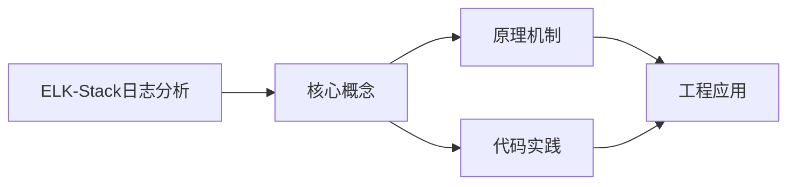
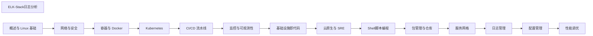

## 1. 学习目标（Bloom 分类）

本节按照布鲁姆教育目标分类学组织学习路径。本文主题为《ELK-Stack日志分析》，属于 DevOps 模块，读者可以根据自身阶段选择阅读深度。

记忆层面：能够准确复述本文的核心概念、术语与基本语法或操作步骤，并能够在提问或检索时快速定位对应知识点。能够说出 DevOps 的核心概念、组件与标准流程。

理解层面：能够用自己的语言解释核心原理与工作机制，说明概念之间的因果关系，而不是机械记忆结论。能够解释 DevOps 的工作原理与关键机制。

应用层面：能够在真实项目或练习场景中运用本文知识解决具体问题，写出正确且可维护的实现。能够执行 DevOps 相关的标准操作与配置。

分析层面：能够拆解复杂问题，比较本文主题与相邻概念的异同，识别边界条件与例外情况。能够分析 DevOps 方案在可靠性、成本与性能上的权衡。

评价层面：能够根据约束条件（性能、可读性、安全、成本）评价不同方案的优劣，做出有依据的技术决策。能够评价 DevOps 中的技术选型。

创造层面：能够把本文知识与其他模块知识组合，设计出新的解决方案或可复用的工程模式。能够设计基于 DevOps 的完整解决方案。

通过本节学习，读者应当能够把《ELK-Stack日志分析》纳入自己的知识网络，并与 DevOps 模块的其他主题（CI/CD、容器、编排、监控、GitOps）建立关联。

## 2. 历史动机与发展脉络

《ELK-Stack日志分析》是 DevOps 领域的重要主题。要真正理解它，需要先了解它解决的问题与演进过程。

DevOps 源于 2009 年（“DevOpsDays”），核心是打破开发与运维壁垒，用自动化与协作缩短交付周期；CALMS 文化（文化、自动化、精益、度量、共享）是其框架。
技术栈演进：持续集成（CI）与持续交付（CD）、基础设施即代码（IaC）、容器（Docker）与编排（Kubernetes）、可观测性（监控/日志/追踪）。
2020 年代趋势：GitOps（声明式 + 自动同步）、平台工程（内部开发者平台）、FinOps（成本治理）、AI 辅助运维。

回到本文主题：ELK-Stack日志分析 的提出与成熟，正是上述技术背景下的必然产物。早期实现往往以简单可用为目标，随着工程规模扩大，社区逐渐沉淀出标准做法与最佳实践；理解这一脉络，可以帮助读者判断“为什么文档中的推荐写法是现在这个样子”，也能在遇到历史遗留代码时准确识别其设计年代与取舍。


## 3. 形式化定义与核心概念精讲

本节把《ELK-Stack日志分析》涉及的核心概念以“定义 + 讲解”的形式展开。读者应把定义当作工具，把讲解当作理解路径；两者结合才能形成可迁移的知识。

CI/CD 管线：代码提交 -> 构建 -> 测试 -> 制品 -> 部署；流水线即代码（GitHub Actions/Jenkins/GitLab CI）。
容器与镜像：OCI 规范、Dockerfile 分层、镜像仓库与签名；容器隔离（cgroup/namespace）。
编排：Kubernetes 的 Pod/Deployment/Service 抽象；声明式期望状态与控制器调和。

### 3.1 原文章节逐一精讲

原文档把主题拆分为 13 个小节，下面按顺序给出每一节的导读讲解，随后保留原文细节供精读。

#### 原文精读（完整保留）

# ELK 日志栈命令速查手册

> **符号约定**:`< >` 必填参数 | `[ ]` 可选参数

---

#### 1. Elasticsearch

##### 1.1 索引与分片

索引与分片是ELK-Stack日志分析的重要组成部分。本节详细介绍索引与分片的核心概念、工作原理和实际应用。

**关键要点**：

- 索引与分片的定义与核心原理
- 索引与分片的实现方式与技术细节
- 索引与分片在实际场景中的应用与最佳实践
- 索引与分片的常见问题与解决方案

索引与分片在工程实践中需要根据具体场景选择合适的策略，平衡性能、可靠性和复杂度。

##### 1.2 映射与模板

映射与模板是ELK-Stack日志分析的重要组成部分。本节详细介绍映射与模板的核心概念、工作原理和实际应用。

**关键要点**：

- 映射与模板的定义与核心原理
- 映射与模板的实现方式与技术细节
- 映射与模板在实际场景中的应用与最佳实践
- 映射与模板的常见问题与解决方案

映射与模板在工程实践中需要根据具体场景选择合适的策略，平衡性能、可靠性和复杂度。

##### 1.3 查询 DSL

查询 DSL是ELK-Stack日志分析的重要组成部分。本节详细介绍查询 DSL的核心概念、工作原理和实际应用。

**关键要点**：

- 查询 DSL的定义与核心原理
- 查询 DSL的实现方式与技术细节
- 查询 DSL在实际场景中的应用与最佳实践
- 查询 DSL的常见问题与解决方案

查询 DSL在工程实践中需要根据具体场景选择合适的策略，平衡性能、可靠性和复杂度。

#### 2. Logstash

##### 2.1 输入/过滤/输出插件

输入/过滤/输出插件是ELK-Stack日志分析的重要组成部分。本节详细介绍输入/过滤/输出插件的核心概念、工作原理和实际应用。

**关键要点**：

- 输入/过滤/输出插件的定义与核心原理
- 输入/过滤/输出插件的实现方式与技术细节
- 输入/过滤/输出插件在实际场景中的应用与最佳实践
- 输入/过滤/输出插件的常见问题与解决方案

输入/过滤/输出插件在工程实践中需要根据具体场景选择合适的策略，平衡性能、可靠性和复杂度。

##### 2.2 Grok 解析

Grok 解析是ELK-Stack日志分析的重要组成部分。本节详细介绍Grok 解析的核心概念、工作原理和实际应用。

**关键要点**：

- Grok 解析的定义与核心原理
- Grok 解析的实现方式与技术细节
- Grok 解析在实际场景中的应用与最佳实践
- Grok 解析的常见问题与解决方案

Grok 解析在工程实践中需要根据具体场景选择合适的策略，平衡性能、可靠性和复杂度。

##### 2.3 管道配置

管道配置是ELK-Stack日志分析的重要组成部分。本节详细介绍管道配置的核心概念、工作原理和实际应用。

**关键要点**：

- 管道配置的定义与核心原理
- 管道配置的实现方式与技术细节
- 管道配置在实际场景中的应用与最佳实践
- 管道配置的常见问题与解决方案

管道配置在工程实践中需要根据具体场景选择合适的策略，平衡性能、可靠性和复杂度。

#### 3. Kibana

##### 3.1 Discover 探索

Discover 探索是ELK-Stack日志分析的重要组成部分。本节详细介绍Discover 探索的核心概念、工作原理和实际应用。

**关键要点**：

- Discover 探索的定义与核心原理
- Discover 探索的实现方式与技术细节
- Discover 探索在实际场景中的应用与最佳实践
- Discover 探索的常见问题与解决方案

Discover 探索在工程实践中需要根据具体场景选择合适的策略，平衡性能、可靠性和复杂度。

##### 3.2 Dashboard 仪表盘

Dashboard 仪表盘是ELK-Stack日志分析的重要组成部分。本节详细介绍Dashboard 仪表盘的核心概念、工作原理和实际应用。

**关键要点**：

- Dashboard 仪表盘的定义与核心原理
- Dashboard 仪表盘的实现方式与技术细节
- Dashboard 仪表盘在实际场景中的应用与最佳实践
- Dashboard 仪表盘的常见问题与解决方案

Dashboard 仪表盘在工程实践中需要根据具体场景选择合适的策略，平衡性能、可靠性和复杂度。

##### 3.3 KQL 查询

KQL 查询是ELK-Stack日志分析的重要组成部分。本节详细介绍KQL 查询的核心概念、工作原理和实际应用。

**关键要点**：

- KQL 查询的定义与核心原理
- KQL 查询的实现方式与技术细节
- KQL 查询在实际场景中的应用与最佳实践
- KQL 查询的常见问题与解决方案

KQL 查询在工程实践中需要根据具体场景选择合适的策略，平衡性能、可靠性和复杂度。

#### 4. 架构优化

##### 4.1 Filebeat 轻量采集

Filebeat 轻量采集是ELK-Stack日志分析的重要组成部分。本节详细介绍Filebeat 轻量采集的核心概念、工作原理和实际应用。

**关键要点**：

- Filebeat 轻量采集的定义与核心原理
- Filebeat 轻量采集的实现方式与技术细节
- Filebeat 轻量采集在实际场景中的应用与最佳实践
- Filebeat 轻量采集的常见问题与解决方案

Filebeat 轻量采集在工程实践中需要根据具体场景选择合适的策略，平衡性能、可靠性和复杂度。

##### 4.2 索引生命周期管理

索引生命周期管理是ELK-Stack日志分析的重要组成部分。本节详细介绍索引生命周期管理的核心概念、工作原理和实际应用。

**关键要点**：

- 索引生命周期管理的定义与核心原理
- 索引生命周期管理的实现方式与技术细节
- 索引生命周期管理在实际场景中的应用与最佳实践
- 索引生命周期管理的常见问题与解决方案

索引生命周期管理在工程实践中需要根据具体场景选择合适的策略，平衡性能、可靠性和复杂度。
#### Elasticsearch 基础操作

**基本用法:集群健康检查**
`curl <服务器>/_cluster/health`

```bash
# 查看集群健康状态
curl -X GET "localhost:9200/_cluster/health?pretty"

# 查看集群健康状态(含分片级)
curl -X GET "localhost:9200/_cluster/health?level=indices&pretty"

# 查看节点信息
curl -X GET "localhost:9200/_cat/nodes?v"

# 查看主节点
curl -X GET "localhost:9200/_cat/master?v"
```

---

**基本用法:索引管理**
`curl -X <方法> <服务器>/<索引>`

```bash
# 列出所有索引
curl -X GET "localhost:9200/_cat/indices?v"

# 创建索引(指定分片与副本)
curl -X PUT "localhost:9200/logs-2024-01" -H 'Content-Type: application/json' -d '{
  "settings": {
    "number_of_shards": 3,
    "number_of_replicas": 1
  }
}'

# 删除索引
curl -X DELETE "localhost:9200/logs-2024-01"

# 查看索引设置
curl -X GET "localhost:9200/logs-2024-01/_settings?pretty"
```

---

**基本用法:文档增删改查**
`curl -X <方法> <服务器>/<索引>/_doc/<id>`

```bash
# 索引文档(指定 ID)
curl -X PUT "localhost:9200/logs-2024-01/_doc/1" -H 'Content-Type: application/json' -d '{
  "level": "info",
  "message": "服务启动",
  "timestamp": "2024-01-01T00:00:00Z"
}'

# 自动生成 ID
curl -X POST "localhost:9200/logs-2024-01/_doc" -H 'Content-Type: application/json' -d '{
  "level": "error",
  "message": "数据库连接失败"
}'

# 获取文档
curl -X GET "localhost:9200/logs-2024-01/_doc/1?pretty"

# 更新文档
curl -X POST "localhost:9200/logs-2024-01/_update/1" -H 'Content-Type: application/json' -d '{
  "doc": {"level": "warning"}
}'

# 删除文档
curl -X DELETE "localhost:9200/logs-2024-01/_doc/1"
```

---

#### Elasticsearch 查询

**基本用法:搜索文档**
`curl -X GET <服务器>/<索引>/_search`

```bash
# 简单查询(匹配所有)
curl -X GET "localhost:9200/logs-2024-01/_search?q=*&pretty"

# 按字段搜索
curl -X GET "localhost:9200/logs-2024-01/_search?q=level:error&pretty"

# 使用 DSL 查询
curl -X GET "localhost:9200/logs-2024-01/_search?pretty" -H 'Content-Type: application/json' -d '{
  "query": {
    "match": {
      "message": "数据库"
    }
  }
}'
```

---

**基本用法:布尔查询**
`bool: must|should|must_not|filter`

```bash
# 多条件组合查询
curl -X GET "localhost:9200/logs-*/_search?pretty" -H 'Content-Type: application/json' -d '{
  "query": {
    "bool": {
      "must": [
        {"match": {"level": "error"}}
      ],
      "filter": [
        {"range": {"timestamp": {"gte": "now-1h"}}}
      ],
      "must_not": [
        {"match": {"message": "debug"}}
      ]
    }
  },
  "sort": [{"timestamp": "desc"}],
  "size": 20
}'
```

---

**基本用法:聚合查询**
`aggs`

```bash
# 按级别分组统计
curl -X GET "localhost:9200/logs-*/_search" -H 'Content-Type: application/json' -d '{
  "size": 0,
  "aggs": {
    "levels": {
      "terms": {"field": "level.keyword", "size": 10}
    }
  }
}'

# 时间直方图聚合
curl -X GET "localhost:9200/logs-*/_search" -H 'Content-Type: application/json' -d '{
  "size": 0,
  "aggs": {
    "logs_over_time": {
      "date_histogram": {
        "field": "timestamp",
        "calendar_interval": "1h"
      }
    }
  }
}'
```

---

#### Elasticsearch 索引模板

**基本用法:创建索引模板**
`PUT _index_template`

```bash
# 创建索引模板(匹配 logs-* 索引)
curl -X PUT "localhost:9200/_index_template/logs-template" -H 'Content-Type: application/json' -d '{
  "index_patterns": ["logs-*"],
  "template": {
    "settings": {
      "number_of_shards": 3,
      "number_of_replicas": 1,
      "index.lifecycle.name": "logs-policy"
    },
    "mappings": {
      "properties": {
        "timestamp": {"type": "date"},
        "level": {"type": "keyword"},
        "message": {"type": "text"},
        "service": {"type": "keyword"}
      }
    }
  }
}'
```

---

**基本用法:ILM 索引生命周期管理**
`PUT _ilm/policy`

```bash
# 创建 ILM 策略
curl -X PUT "localhost:9200/_ilm/policy/logs-policy" -H 'Content-Type: application/json' -d '{
  "policy": {
    "phases": {
      "hot": {
        "actions": {
          "rollover": {
            "max_age": "7d",
            "max_size": "50gb"
          }
        }
      },
      "warm": {
        "min_age": "30d",
        "actions": {
          "shrink": {"number_of_shards": 1},
          "forcemerge": {"max_num_segments": 1}
        }
      },
      "delete": {
        "min_age": "90d",
        "actions": {"delete": {}}
      }
    }
  }
}'

# 查看 ILM 状态
curl -X GET "localhost:9200/_ilm/policy/logs-policy?pretty"
```

---

#### Logstash 配置

**基本用法:Logstash 配置结构**
`input {} filter {} output {}`

```
# logstash.conf 配置文件结构
input {
  beats {
    port => 5044
  }
}

filter {
  grok {
    match => { "message" => "%{TIMESTAMP_ISO8601:timestamp} %{LOGLEVEL:level} %{GREEDYDATA:msg}" }
  }
  date {
    match => ["timestamp", "ISO8601"]
    target => "@timestamp"
  }
}

output {
  elasticsearch {
    hosts => ["localhost:9200"]
    index => "logs-%{+YYYY.MM.dd}"
  }
}
```

---

**基本用法:测试 Logstash 配置**
`bin/logstash -f <配置> -t`

```bash
# 测试配置语法
bin/logstash -f /etc/logstash/conf.d/logs.conf -t

# 启动 Logstash
bin/logstash -f /etc/logstash/conf.d/logs.conf

# 启动时启用配置自动重载
bin/logstash -f /etc/logstash/conf.d/logs.conf --config.reload.automatic

# 直接输入数据测试
echo '{"message":"test log"}' | bin/logstash -e 'input { stdin { codec => json } } output { stdout { codec => rubydebug } }'
```

---

**基本用法:Grok 模式匹配**
`grok { match => { "message" => "<模式>" } }`

```
# 常用 Grok 模式
# 解析 Nginx 访问日志
filter {
  grok {
    match => { "message" => '%{IPORHOST:client_ip} - %{DATA:user} \[%{HTTPDATE:timestamp}\] "%{WORD:method} %{URIPATHPARAM:request} HTTP/%{NUMBER:http_version}" %{NUMBER:status} %{NUMBER:bytes} "%{DATA:referrer}" "%{DATA:agent}"' }
  }
}

# 解析 Java 异常堆栈
filter {
  multiline {
    pattern => "^\s"
    what => "previous"
  }
  grok {
    match => { "message" => "%{TIMESTAMP_ISO8601:timestamp} %{LOGLEVEL:level} \[%{DATA:thread}\] %{DATA:logger} - %{GREEDYDATA:msg}" }
  }
}
```

---

**基本用法:条件处理**
`if [字段] == "值" { ... }`

```
# 根据日志级别路由
filter {
  if [level] == "ERROR" {
    mutate {
      add_tag => ["alert"]
    }
  } else if [level] in ["WARN", "INFO"] {
    mutate {
      add_tag => ["info"]
    }
  } else {
    mutate {
      add_tag => ["debug"]
      add_field => { "env" => "unknown" }
    }
  }
}

output {
  if "alert" in [tags] {
    elasticsearch {
      hosts => ["localhost:9200"]
      index => "alerts-%{+YYYY.MM.dd}"
    }
  }
}
```

---

#### Kibana 操作

**基本用法:启动 Kibana**
`bin/kibana`

```bash
# Linux 启动
systemctl start kibana
systemctl enable kibana

# 直接运行
bin/kibana --config /etc/kibana/kibana.yml

# Docker 启动
docker run -d --name kibana -p 5601:5601 \
  -e ELASTICSEARCH_HOSTS=http://elasticsearch:9200 \
  kibana:8.11.0

# 查看日志
journalctl -u kibana -f
docker logs -f kibana
```

---

**基本用法:Kibana API**
`curl <服务器>:5601/api/...`

```bash
# 健康检查
curl http://localhost:5601/api/status

# 创建索引模式
curl -X POST -u elastic:password -H "Content-Type: application/json" -H "kbn-xsrf: true" \
  http://localhost:5601/api/index_patterns/index_pattern \
  -d '{
    "index_pattern": {
      "title": "logs-*",
      "timeFieldName": "@timestamp"
    }
  }'

# 查询索引模式
curl -u elastic:password http://localhost:5601/api/index_patterns
```

---

**基本用法:导出与导入对象**
`curl <服务器>:5601/api/saved_objects/_export`

```bash
# 导出仪表盘
curl -X POST -u elastic:password -H "Content-Type: application/json" -H "kbn-xsrf: true" \
  http://localhost:5601/api/saved_objects/_export \
  -d '{
    "objects": [
      {"type": "dashboard", "id": "web-logs-dashboard"}
    ]
  }' > dashboard.ndjson

# 导入仪表盘
curl -X POST -u elastic:password -H "Content-Type: application/json" -H "kbn-xsrf: true" \
  http://localhost:5601/api/saved_objects/_import?overwrite=true \
  -F file=@dashboard.ndjson
```

---

#### Filebeat 采集

**基本用法:启动 Filebeat**
`filebeat -c <配置>`

```bash
# 启动 Filebeat
systemctl start filebeat
systemctl enable filebeat

# 测试配置
filebeat test config -c /etc/filebeat/filebeat.yml

# 测试输出连接
filebeat test output -c /etc/filebeat/filebeat.yml

# 直接运行(前台)
filebeat -e -c /etc/filebeat/filebeat.yml
```

---

**基本用法:Filebeat 配置**
`filebeat.inputs`

```yaml
# filebeat.yml 输入配置
filebeat.inputs:
- type: log
  enabled: true
  paths:
    - /var/log/nginx/access.log
  fields:
    service: nginx
    env: production
  fields_under_root: true

- type: container
  paths:
    - /var/lib/docker/containers/*/*.log
  processors:
  - add_kubernetes_metadata:
      host: ${NODE_NAME}
      matchers:
      - logs_path:
          logs_path: "/var/lib/docker/containers/"

output.logstash:
  hosts: ["logstash:5044"]
  indices:
  - "logs-%{[service]}"
```

---

**基本用法:启用模块**
`filebeat modules enable <模块>`

```bash
# 启用 Nginx 模块
filebeat modules enable nginx

# 启用多个模块
filebeat modules enable nginx mysql redis

# 查看已启用模块
filebeat modules list

# 模块配置(在 modules.d/nginx.yml)
cat modules.d/nginx.yml
```

```yaml
# modules.d/nginx.yml Nginx 模块配置
- module: nginx
  access:
    enabled: true
    var.paths: ["/var/log/nginx/access.log"]
  error:
    enabled: true
    var.paths: ["/var/log/nginx/error.log"]
```

---

#### 集群管理

**基本用法:节点管理**
`curl <服务器>/_cat/nodes`

```bash
# 查看节点列表
curl "localhost:9200/_cat/nodes?v&h=name,ip,role,master,heap.percent,ram.percent,disk.used_percent"

# 查看节点磁盘使用
curl "localhost:9200/_cat/allocation?v"

# 查看节点统计
curl "localhost:9200/_nodes/stats?pretty"

# 临时排除节点(用于维护)
curl -X PUT "localhost:9200/_cluster/settings" -H 'Content-Type: application/json' -d '{
  "transient": {
    "cluster.routing.allocation.exclude._ip": "192.168.1.100"
  }
}'
```

---

**基本用法:分片管理**
`curl <服务器>/_cat/shards`

```bash
# 查看分片分布
curl "localhost:9200/_cat/shards?v"

# 查看未分配分片
curl "localhost:9200/_cat/shards?v" | grep UNASSIGNED

# 查看分片分配原因
curl "localhost:9200/_cluster/allocation/explain?pretty"

# 手动重新路由分片
curl -X POST "localhost:9200/_cluster/reroute" -H 'Content-Type: application/json' -d '{
  "commands": [
    {
      "move": {
        "index": "logs-2024-01",
        "shard": 0,
        "from_node": "node-1",
        "to_node": "node-2"
      }
    }
  ]
}'
```

---

**基本用法:快照与恢复**
`PUT _snapshot/<仓库>/<快照>`

```bash
# 注册快照仓库
curl -X PUT "localhost:9200/_snapshot/backup" -H 'Content-Type: application/json' -d '{
  "type": "fs",
  "settings": {
    "location": "/backup/es-snapshots"
  }
}'

# 创建快照
curl -X PUT "localhost:9200/_snapshot/backup/snapshot-2024-01-01?wait_for_completion=true"

# 查看快照
curl "localhost:9200/_snapshot/backup/_all?pretty"

# 恢复快照
curl -X POST "localhost:9200/_snapshot/backup/snapshot-2024-01-01/_restore" -H 'Content-Type: application/json' -d '{
  "indices": "logs-*",
  "ignore_unavailable": true
}'
```

---

#### 安全与认证

**基本用法:启用安全认证**
`xpack.security.enabled: true`

```yaml
# elasticsearch.yml 启用安全
xpack.security.enabled: true
xpack.security.transport.ssl.enabled: true
xpack.security.transport.ssl.verification_mode: certificate
xpack.security.transport.ssl.keystore.path: elastic-certificates.p12
xpack.security.transport.ssl.truststore.path: elastic-certificates.p12
```

```bash
# 生成证书
bin/elasticsearch-certutil ca
bin/elasticsearch-certutil cert --ca elastic-stack-ca.p12

# 设置内置用户密码
bin/elasticsearch-setup-passwords auto

# 修改用户密码
curl -u elastic:password -X PUT "localhost:9200/_security/user/elastic/_password" -H 'Content-Type: application/json' -d '{
  "password": "newpassword"
}'
```

---

**基本用法:创建用户与角色**
`POST _security/user/<用户名>`

```bash
# 创建角色
curl -u elastic:password -X POST "localhost:9200/_security/role/logs_reader" -H 'Content-Type: application/json' -d '{
  "indices": [
    {
      "names": ["logs-*"],
      "privileges": ["read", "view_index_metadata"]
    }
  ]
}'

# 创建用户
curl -u elastic:password -X POST "localhost:9200/_security/user/alice" -H 'Content-Type: application/json' -d '{
  "password": "alicepass",
  "roles": ["logs_reader"],
  "full_name": "Alice",
  "email": "alice@example.com"
}'

# 创建 API Key
curl -u elastic:password -X POST "localhost:9200/_security/api_key" -H 'Content-Type: application/json' -d '{
  "name": "logstash-key",
  "role_descriptors": {
    "logs_writer": {
      "indices": [{"names": ["logs-*"], "privileges": ["write", "create_index"]}]
    }
  }
}'
```

---

#### 排查与监控

**基本用法:查看集群统计**
`curl <服务器>/_cluster/stats`

```bash
# 集群统计信息
curl "localhost:9200/_cluster/stats?human&pretty"

# 索引统计
curl "localhost:9200/_stats?pretty"

# 节点线程池
curl "localhost:9200/_cat/thread_pool?v"

# 查看正在执行的任务
curl "localhost:9200/_cat/tasks?v"
```

---

**基本用法:排查慢查询**
`index.search.slowlog`

```bash
# 启用慢查询日志
curl -X PUT "localhost:9200/logs-*/_settings" -H 'Content-Type: application/json' -d '{
  "index.search.slowlog.threshold.query.warn": "10s",
  "index.search.slowlog.threshold.query.info": "5s",
  "index.indexing.slowlog.threshold.index.warn": "10s"
}'

# 查看任务
curl "localhost:9200/_tasks?detailed=true&actions=*search*&pretty"

# 取消长时间运行的任务
curl -X POST "localhost:9200/_tasks/<task_id>/_cancel"
```

---

**基本用法:清理与优化**
`POST <索引>/_forcemerge`

```bash
# 强制合并(减少段数量,优化只读索引)
curl -X POST "localhost:9200/logs-2023-*/_forcemerge?max_num_segments=1"

# 清理缓存
curl -X POST "localhost:9200/_cache/clear"

# 删除旧索引
curl -X DELETE "localhost:9200/logs-2023.01.*"

# 关闭索引(不删除但释放资源)
curl -X POST "localhost:9200/logs-2023.01/_close"

# 重新打开索引
curl -X POST "localhost:9200/logs-2023.01/_open"
```


### 3.2 概念关系图

下面用 Mermaid 图表达本文核心概念之间的关系，帮助读者建立整体图景：



图中展示的是本文知识的结构化关系：核心概念是入口，原理机制解释“为什么”，代码实践演示“怎么做”，工程应用回答“何时用”。读者学习时可以把每个小节的内容挂接到对应节点上。

## 4. 理论推导与原理解析

本节深入《ELK-Stack日志分析》背后的原理。理论部分不求面面俱到，而是聚焦“能解释现象、能指导实践”的关键推导。

CI/CD 管线：代码提交 -> 构建 -> 测试 -> 制品 -> 部署；流水线即代码（GitHub Actions/Jenkins/GitLab CI）。
容器与镜像：OCI 规范、Dockerfile 分层、镜像仓库与签名；容器隔离（cgroup/namespace）。
编排：Kubernetes 的 Pod/Deployment/Service 抽象；声明式期望状态与控制器调和。
可观测性三支柱：指标（Prometheus）、日志（Loki/ELK）、追踪（OpenTelemetry）。

需要强调的是，理论推导与工程实践之间存在翻译层：理论给出的是理想化模型与边界条件，工程代码则必须处理真实环境中的例外。读者在学习时应先掌握理论的“标准情形”，再通过陷阱章节了解“非标准情形”。

## 5. 代码示例与逐行讲解

本节把原文中的代码示例系统整理，并为每个示例补充用途说明与讲解。读者不应只浏览代码，而应逐段对照讲解理解设计意图。

### 5.1 示例：Elasticsearch 基础操作

该示例来自原文《Elasticsearch 基础操作》小节，用于演示ELK-Stack日志分析相关操作。阅读时请先看代码结构，再看其后的讲解。

```bash
# 查看集群健康状态
curl -X GET "localhost:9200/_cluster/health?pretty"

# 查看集群健康状态(含分片级)
curl -X GET "localhost:9200/_cluster/health?level=indices&pretty"

# 查看节点信息
curl -X GET "localhost:9200/_cat/nodes?v"

# 查看主节点
curl -X GET "localhost:9200/_cat/master?v"
```

讲解：这段代码演示了本节核心知识点。代码中的关键操作可以归纳为三步：准备（定义或初始化）、执行（核心逻辑）、收尾（释放资源或返回结果）。实际项目中，这三步往往被封装为函数或类，以提升复用性与可测试性。

关键点分析：

该示例共 8 行有效代码，结构以数据或配置为主。阅读时应关注：数据字段的含义、配置项的作用，以及它们与运行行为的对应关系。

进阶思考路径：先尝试修改参数观察行为变化，再把示例中的模式迁移到自己的项目中；每次修改都记录预期与实测差异，这是把示例转化为能力的最快方式。

### 5.2 示例：Elasticsearch 基础操作

该示例来自原文《Elasticsearch 基础操作》小节，用于演示ELK-Stack日志分析相关操作。阅读时请先看代码结构，再看其后的讲解。

```bash
# 列出所有索引
curl -X GET "localhost:9200/_cat/indices?v"

# 创建索引(指定分片与副本)
curl -X PUT "localhost:9200/logs-2024-01" -H 'Content-Type: application/json' -d '{
  "settings": {
    "number_of_shards": 3,
    "number_of_replicas": 1
  }
}'

# 删除索引
curl -X DELETE "localhost:9200/logs-2024-01"

# 查看索引设置
curl -X GET "localhost:9200/logs-2024-01/_settings?pretty"
```

讲解：这段代码演示了本节核心知识点。代码中的关键操作可以归纳为三步：准备（定义或初始化）、执行（核心逻辑）、收尾（释放资源或返回结果）。实际项目中，这三步往往被封装为函数或类，以提升复用性与可测试性。

关键点分析：

该示例共 13 行有效代码，结构以数据或配置为主。阅读时应关注：数据字段的含义、配置项的作用，以及它们与运行行为的对应关系。

进阶思考路径：先尝试修改参数观察行为变化，再把示例中的模式迁移到自己的项目中；每次修改都记录预期与实测差异，这是把示例转化为能力的最快方式。

### 5.3 示例：Elasticsearch 基础操作

该示例来自原文《Elasticsearch 基础操作》小节，用于演示ELK-Stack日志分析相关操作。阅读时请先看代码结构，再看其后的讲解。

```bash
# 索引文档(指定 ID)
curl -X PUT "localhost:9200/logs-2024-01/_doc/1" -H 'Content-Type: application/json' -d '{
  "level": "info",
  "message": "服务启动",
  "timestamp": "2024-01-01T00:00:00Z"
}'

# 自动生成 ID
curl -X POST "localhost:9200/logs-2024-01/_doc" -H 'Content-Type: application/json' -d '{
  "level": "error",
  "message": "数据库连接失败"
}'

# 获取文档
curl -X GET "localhost:9200/logs-2024-01/_doc/1?pretty"

# 更新文档
curl -X POST "localhost:9200/logs-2024-01/_update/1" -H 'Content-Type: application/json' -d '{
  "doc": {"level": "warning"}
}'

# 删除文档
curl -X DELETE "localhost:9200/logs-2024-01/_doc/1"
```

讲解：这段代码演示了本节核心知识点。代码中的关键操作可以归纳为三步：准备（定义或初始化）、执行（核心逻辑）、收尾（释放资源或返回结果）。实际项目中，这三步往往被封装为函数或类，以提升复用性与可测试性。

关键点分析：

该示例共 19 行有效代码，结构以数据或配置为主。阅读时应关注：数据字段的含义、配置项的作用，以及它们与运行行为的对应关系。

进阶思考路径：先尝试修改参数观察行为变化，再把示例中的模式迁移到自己的项目中；每次修改都记录预期与实测差异，这是把示例转化为能力的最快方式。

### 5.4 示例：Elasticsearch 查询

该示例来自原文《Elasticsearch 查询》小节，用于演示ELK-Stack日志分析相关操作。阅读时请先看代码结构，再看其后的讲解。

```bash
# 简单查询(匹配所有)
curl -X GET "localhost:9200/logs-2024-01/_search?q=*&pretty"

# 按字段搜索
curl -X GET "localhost:9200/logs-2024-01/_search?q=level:error&pretty"

# 使用 DSL 查询
curl -X GET "localhost:9200/logs-2024-01/_search?pretty" -H 'Content-Type: application/json' -d '{
  "query": {
    "match": {
      "message": "数据库"
    }
  }
}'
```

讲解：这段代码演示了本节核心知识点。代码中的关键操作可以归纳为三步：准备（定义或初始化）、执行（核心逻辑）、收尾（释放资源或返回结果）。实际项目中，这三步往往被封装为函数或类，以提升复用性与可测试性。

关键点分析：

该示例共 12 行有效代码，结构以数据或配置为主。阅读时应关注：数据字段的含义、配置项的作用，以及它们与运行行为的对应关系。

进阶思考路径：先尝试修改参数观察行为变化，再把示例中的模式迁移到自己的项目中；每次修改都记录预期与实测差异，这是把示例转化为能力的最快方式。

### 5.5 示例：Elasticsearch 查询

该示例来自原文《Elasticsearch 查询》小节，用于演示ELK-Stack日志分析相关操作。阅读时请先看代码结构，再看其后的讲解。

```bash
# 多条件组合查询
curl -X GET "localhost:9200/logs-*/_search?pretty" -H 'Content-Type: application/json' -d '{
  "query": {
    "bool": {
      "must": [
        {"match": {"level": "error"}}
      ],
      "filter": [
        {"range": {"timestamp": {"gte": "now-1h"}}}
      ],
      "must_not": [
        {"match": {"message": "debug"}}
      ]
    }
  },
  "sort": [{"timestamp": "desc"}],
  "size": 20
}'
```

讲解：这段代码演示了本节核心知识点。代码中的关键操作可以归纳为三步：准备（定义或初始化）、执行（核心逻辑）、收尾（释放资源或返回结果）。实际项目中，这三步往往被封装为函数或类，以提升复用性与可测试性。

关键点分析：

该示例共 18 行有效代码，结构以数据或配置为主。阅读时应关注：数据字段的含义、配置项的作用，以及它们与运行行为的对应关系。

进阶思考路径：先尝试修改参数观察行为变化，再把示例中的模式迁移到自己的项目中；每次修改都记录预期与实测差异，这是把示例转化为能力的最快方式。

### 5.6 示例：Elasticsearch 查询

该示例来自原文《Elasticsearch 查询》小节，用于演示ELK-Stack日志分析相关操作。阅读时请先看代码结构，再看其后的讲解。

```bash
# 按级别分组统计
curl -X GET "localhost:9200/logs-*/_search" -H 'Content-Type: application/json' -d '{
  "size": 0,
  "aggs": {
    "levels": {
      "terms": {"field": "level.keyword", "size": 10}
    }
  }
}'

# 时间直方图聚合
curl -X GET "localhost:9200/logs-*/_search" -H 'Content-Type: application/json' -d '{
  "size": 0,
  "aggs": {
    "logs_over_time": {
      "date_histogram": {
        "field": "timestamp",
        "calendar_interval": "1h"
      }
    }
  }
}'
```

讲解：这段代码演示了本节核心知识点。代码中的关键操作可以归纳为三步：准备（定义或初始化）、执行（核心逻辑）、收尾（释放资源或返回结果）。实际项目中，这三步往往被封装为函数或类，以提升复用性与可测试性。

关键点分析：

该示例共 21 行有效代码，结构以数据或配置为主。阅读时应关注：数据字段的含义、配置项的作用，以及它们与运行行为的对应关系。

进阶思考路径：先尝试修改参数观察行为变化，再把示例中的模式迁移到自己的项目中；每次修改都记录预期与实测差异，这是把示例转化为能力的最快方式。

### 5.7 示例：Elasticsearch 索引模板

该示例来自原文《Elasticsearch 索引模板》小节，用于演示ELK-Stack日志分析相关操作。阅读时请先看代码结构，再看其后的讲解。

```bash
# 创建索引模板(匹配 logs-* 索引)
curl -X PUT "localhost:9200/_index_template/logs-template" -H 'Content-Type: application/json' -d '{
  "index_patterns": ["logs-*"],
  "template": {
    "settings": {
      "number_of_shards": 3,
      "number_of_replicas": 1,
      "index.lifecycle.name": "logs-policy"
    },
    "mappings": {
      "properties": {
        "timestamp": {"type": "date"},
        "level": {"type": "keyword"},
        "message": {"type": "text"},
        "service": {"type": "keyword"}
      }
    }
  }
}'
```

讲解：这段代码演示了本节核心知识点。代码中的关键操作可以归纳为三步：准备（定义或初始化）、执行（核心逻辑）、收尾（释放资源或返回结果）。实际项目中，这三步往往被封装为函数或类，以提升复用性与可测试性。

关键点分析：

该示例共 19 行有效代码，结构以数据或配置为主。阅读时应关注：数据字段的含义、配置项的作用，以及它们与运行行为的对应关系。

进阶思考路径：先尝试修改参数观察行为变化，再把示例中的模式迁移到自己的项目中；每次修改都记录预期与实测差异，这是把示例转化为能力的最快方式。

### 5.8 示例：Elasticsearch 索引模板

该示例来自原文《Elasticsearch 索引模板》小节，用于演示ELK-Stack日志分析相关操作。阅读时请先看代码结构，再看其后的讲解。

```bash
# 创建 ILM 策略
curl -X PUT "localhost:9200/_ilm/policy/logs-policy" -H 'Content-Type: application/json' -d '{
  "policy": {
    "phases": {
      "hot": {
        "actions": {
          "rollover": {
            "max_age": "7d",
            "max_size": "50gb"
          }
        }
      },
      "warm": {
        "min_age": "30d",
        "actions": {
          "shrink": {"number_of_shards": 1},
          "forcemerge": {"max_num_segments": 1}
        }
      },
      "delete": {
        "min_age": "90d",
        "actions": {"delete": {}}
      }
    }
  }
}'

# 查看 ILM 状态
curl -X GET "localhost:9200/_ilm/policy/logs-policy?pretty"
```

讲解：这段代码演示了本节核心知识点。代码中的关键操作可以归纳为三步：准备（定义或初始化）、执行（核心逻辑）、收尾（释放资源或返回结果）。实际项目中，这三步往往被封装为函数或类，以提升复用性与可测试性。

关键点分析：

该示例共 28 行有效代码，结构以数据或配置为主。阅读时应关注：数据字段的含义、配置项的作用，以及它们与运行行为的对应关系。

进阶思考路径：先尝试修改参数观察行为变化，再把示例中的模式迁移到自己的项目中；每次修改都记录预期与实测差异，这是把示例转化为能力的最快方式。

### 5.9 示例：Logstash 配置

该示例来自原文《Logstash 配置》小节，用于演示ELK-Stack日志分析相关操作。阅读时请先看代码结构，再看其后的讲解。

```text
# logstash.conf 配置文件结构
input {
  beats {
    port => 5044
  }
}

filter {
  grok {
    match => { "message" => "%{TIMESTAMP_ISO8601:timestamp} %{LOGLEVEL:level} %{GREEDYDATA:msg}" }
  }
  date {
    match => ["timestamp", "ISO8601"]
    target => "@timestamp"
  }
}

output {
  elasticsearch {
    hosts => ["localhost:9200"]
    index => "logs-%{+YYYY.MM.dd}"
  }
}
```

讲解：这段代码演示了本节核心知识点。代码中的关键操作可以归纳为三步：准备（定义或初始化）、执行（核心逻辑）、收尾（释放资源或返回结果）。实际项目中，这三步往往被封装为函数或类，以提升复用性与可测试性。

关键点分析：

该示例共 21 行有效代码，结构以数据或配置为主。阅读时应关注：数据字段的含义、配置项的作用，以及它们与运行行为的对应关系。

进阶思考路径：先尝试修改参数观察行为变化，再把示例中的模式迁移到自己的项目中；每次修改都记录预期与实测差异，这是把示例转化为能力的最快方式。

### 5.10 示例：Logstash 配置

该示例来自原文《Logstash 配置》小节，用于演示ELK-Stack日志分析相关操作。阅读时请先看代码结构，再看其后的讲解。

```bash
# 测试配置语法
bin/logstash -f /etc/logstash/conf.d/logs.conf -t

# 启动 Logstash
bin/logstash -f /etc/logstash/conf.d/logs.conf

# 启动时启用配置自动重载
bin/logstash -f /etc/logstash/conf.d/logs.conf --config.reload.automatic

# 直接输入数据测试
echo '{"message":"test log"}' | bin/logstash -e 'input { stdin { codec => json } } output { stdout { codec => rubydebug } }'
```

讲解：这段代码演示了本节核心知识点。代码中的关键操作可以归纳为三步：准备（定义或初始化）、执行（核心逻辑）、收尾（释放资源或返回结果）。实际项目中，这三步往往被封装为函数或类，以提升复用性与可测试性。

关键点分析：

该示例共 8 行有效代码，结构以数据或配置为主。阅读时应关注：数据字段的含义、配置项的作用，以及它们与运行行为的对应关系。

进阶思考路径：先尝试修改参数观察行为变化，再把示例中的模式迁移到自己的项目中；每次修改都记录预期与实测差异，这是把示例转化为能力的最快方式。

### 5.11 示例：Logstash 配置

该示例来自原文《Logstash 配置》小节，用于演示ELK-Stack日志分析相关操作。阅读时请先看代码结构，再看其后的讲解。

```text
# 常用 Grok 模式
# 解析 Nginx 访问日志
filter {
  grok {
    match => { "message" => '%{IPORHOST:client_ip} - %{DATA:user} \[%{HTTPDATE:timestamp}\] "%{WORD:method} %{URIPATHPARAM:request} HTTP/%{NUMBER:http_version}" %{NUMBER:status} %{NUMBER:bytes} "%{DATA:referrer}" "%{DATA:agent}"' }
  }
}

# 解析 Java 异常堆栈
filter {
  multiline {
    pattern => "^\s"
    what => "previous"
  }
  grok {
    match => { "message" => "%{TIMESTAMP_ISO8601:timestamp} %{LOGLEVEL:level} \[%{DATA:thread}\] %{DATA:logger} - %{GREEDYDATA:msg}" }
  }
}
```

讲解：这段代码演示了本节核心知识点。代码中的关键操作可以归纳为三步：准备（定义或初始化）、执行（核心逻辑）、收尾（释放资源或返回结果）。实际项目中，这三步往往被封装为函数或类，以提升复用性与可测试性。

关键点分析：

该示例共 17 行有效代码，结构以数据或配置为主。阅读时应关注：数据字段的含义、配置项的作用，以及它们与运行行为的对应关系。

进阶思考路径：先尝试修改参数观察行为变化，再把示例中的模式迁移到自己的项目中；每次修改都记录预期与实测差异，这是把示例转化为能力的最快方式。

### 5.12 示例：Logstash 配置

该示例来自原文《Logstash 配置》小节，用于演示ELK-Stack日志分析相关操作。阅读时请先看代码结构，再看其后的讲解。

```text
# 根据日志级别路由
filter {
  if [level] == "ERROR" {
    mutate {
      add_tag => ["alert"]
    }
  } else if [level] in ["WARN", "INFO"] {
    mutate {
      add_tag => ["info"]
    }
  } else {
    mutate {
      add_tag => ["debug"]
      add_field => { "env" => "unknown" }
    }
  }
}

output {
  if "alert" in [tags] {
    elasticsearch {
      hosts => ["localhost:9200"]
      index => "alerts-%{+YYYY.MM.dd}"
    }
  }
}
```

讲解：这段代码演示了本节核心知识点。代码中的关键操作可以归纳为三步：准备（定义或初始化）、执行（核心逻辑）、收尾（释放资源或返回结果）。实际项目中，这三步往往被封装为函数或类，以提升复用性与可测试性。

关键点分析：

该示例共 25 行有效代码，包含 1 类关键结构（if）。其中：

- 入口与初始化部分负责建立上下文，对应实际项目中的启动或装配逻辑；
- 核心逻辑部分体现本文主题的主要操作，是阅读时最需要对照讲解理解的部分；
- 输出或返回部分把结果交给调用方，注意其类型与边界条件。

进阶思考路径：先尝试修改参数观察行为变化，再把示例中的模式迁移到自己的项目中；每次修改都记录预期与实测差异，这是把示例转化为能力的最快方式。

### 5.13 示例：Kibana 操作

该示例来自原文《Kibana 操作》小节，用于演示ELK-Stack日志分析相关操作。阅读时请先看代码结构，再看其后的讲解。

```bash
# Linux 启动
systemctl start kibana
systemctl enable kibana

# 直接运行
bin/kibana --config /etc/kibana/kibana.yml

# Docker 启动
docker run -d --name kibana -p 5601:5601 \
  -e ELASTICSEARCH_HOSTS=http://elasticsearch:9200 \
  kibana:8.11.0

# 查看日志
journalctl -u kibana -f
docker logs -f kibana
```

讲解：这段代码演示了本节核心知识点。代码中的关键操作可以归纳为三步：准备（定义或初始化）、执行（核心逻辑）、收尾（释放资源或返回结果）。实际项目中，这三步往往被封装为函数或类，以提升复用性与可测试性。

关键点分析：

该示例共 12 行有效代码，结构以数据或配置为主。阅读时应关注：数据字段的含义、配置项的作用，以及它们与运行行为的对应关系。

进阶思考路径：先尝试修改参数观察行为变化，再把示例中的模式迁移到自己的项目中；每次修改都记录预期与实测差异，这是把示例转化为能力的最快方式。

### 5.14 示例：Kibana 操作

该示例来自原文《Kibana 操作》小节，用于演示ELK-Stack日志分析相关操作。阅读时请先看代码结构，再看其后的讲解。

```bash
# 健康检查
curl http://localhost:5601/api/status

# 创建索引模式
curl -X POST -u elastic:password -H "Content-Type: application/json" -H "kbn-xsrf: true" \
  http://localhost:5601/api/index_patterns/index_pattern \
  -d '{
    "index_pattern": {
      "title": "logs-*",
      "timeFieldName": "@timestamp"
    }
  }'

# 查询索引模式
curl -u elastic:password http://localhost:5601/api/index_patterns
```

讲解：这段代码演示了本节核心知识点。代码中的关键操作可以归纳为三步：准备（定义或初始化）、执行（核心逻辑）、收尾（释放资源或返回结果）。实际项目中，这三步往往被封装为函数或类，以提升复用性与可测试性。

关键点分析：

该示例共 13 行有效代码，结构以数据或配置为主。阅读时应关注：数据字段的含义、配置项的作用，以及它们与运行行为的对应关系。

进阶思考路径：先尝试修改参数观察行为变化，再把示例中的模式迁移到自己的项目中；每次修改都记录预期与实测差异，这是把示例转化为能力的最快方式。

### 5.15 示例：Kibana 操作

该示例来自原文《Kibana 操作》小节，用于演示ELK-Stack日志分析相关操作。阅读时请先看代码结构，再看其后的讲解。

```bash
# 导出仪表盘
curl -X POST -u elastic:password -H "Content-Type: application/json" -H "kbn-xsrf: true" \
  http://localhost:5601/api/saved_objects/_export \
  -d '{
    "objects": [
      {"type": "dashboard", "id": "web-logs-dashboard"}
    ]
  }' > dashboard.ndjson

# 导入仪表盘
curl -X POST -u elastic:password -H "Content-Type: application/json" -H "kbn-xsrf: true" \
  http://localhost:5601/api/saved_objects/_import?overwrite=true \
  -F file=@dashboard.ndjson
```

讲解：这段代码演示了本节核心知识点。代码中的关键操作可以归纳为三步：准备（定义或初始化）、执行（核心逻辑）、收尾（释放资源或返回结果）。实际项目中，这三步往往被封装为函数或类，以提升复用性与可测试性。

关键点分析：

该示例共 12 行有效代码，包含 1 类关键结构（import）。其中：

- 入口与初始化部分负责建立上下文，对应实际项目中的启动或装配逻辑；
- 核心逻辑部分体现本文主题的主要操作，是阅读时最需要对照讲解理解的部分；
- 输出或返回部分把结果交给调用方，注意其类型与边界条件。

进阶思考路径：先尝试修改参数观察行为变化，再把示例中的模式迁移到自己的项目中；每次修改都记录预期与实测差异，这是把示例转化为能力的最快方式。

### 5.16 示例：Filebeat 采集

该示例来自原文《Filebeat 采集》小节，用于演示ELK-Stack日志分析相关操作。阅读时请先看代码结构，再看其后的讲解。

```bash
# 启动 Filebeat
systemctl start filebeat
systemctl enable filebeat

# 测试配置
filebeat test config -c /etc/filebeat/filebeat.yml

# 测试输出连接
filebeat test output -c /etc/filebeat/filebeat.yml

# 直接运行(前台)
filebeat -e -c /etc/filebeat/filebeat.yml
```

讲解：这段代码演示了本节核心知识点。代码中的关键操作可以归纳为三步：准备（定义或初始化）、执行（核心逻辑）、收尾（释放资源或返回结果）。实际项目中，这三步往往被封装为函数或类，以提升复用性与可测试性。

关键点分析：

该示例共 9 行有效代码，结构以数据或配置为主。阅读时应关注：数据字段的含义、配置项的作用，以及它们与运行行为的对应关系。

进阶思考路径：先尝试修改参数观察行为变化，再把示例中的模式迁移到自己的项目中；每次修改都记录预期与实测差异，这是把示例转化为能力的最快方式。

### 5.17 示例：Filebeat 采集

该示例来自原文《Filebeat 采集》小节，用于演示ELK-Stack日志分析相关操作。阅读时请先看代码结构，再看其后的讲解。

```yaml
# filebeat.yml 输入配置
filebeat.inputs:
- type: log
  enabled: true
  paths:
    - /var/log/nginx/access.log
  fields:
    service: nginx
    env: production
  fields_under_root: true

- type: container
  paths:
    - /var/lib/docker/containers/*/*.log
  processors:
  - add_kubernetes_metadata:
      host: ${NODE_NAME}
      matchers:
      - logs_path:
          logs_path: "/var/lib/docker/containers/"

output.logstash:
  hosts: ["logstash:5044"]
  indices:
  - "logs-%{[service]}"
```

讲解：这段代码演示了本节核心知识点。代码中的关键操作可以归纳为三步：准备（定义或初始化）、执行（核心逻辑）、收尾（释放资源或返回结果）。实际项目中，这三步往往被封装为函数或类，以提升复用性与可测试性。

关键点分析：

该示例共 23 行有效代码，结构以数据或配置为主。阅读时应关注：数据字段的含义、配置项的作用，以及它们与运行行为的对应关系。

进阶思考路径：先尝试修改参数观察行为变化，再把示例中的模式迁移到自己的项目中；每次修改都记录预期与实测差异，这是把示例转化为能力的最快方式。

### 5.18 示例：Filebeat 采集

该示例来自原文《Filebeat 采集》小节，用于演示ELK-Stack日志分析相关操作。阅读时请先看代码结构，再看其后的讲解。

```bash
# 启用 Nginx 模块
filebeat modules enable nginx

# 启用多个模块
filebeat modules enable nginx mysql redis

# 查看已启用模块
filebeat modules list

# 模块配置(在 modules.d/nginx.yml)
cat modules.d/nginx.yml
```

讲解：这段代码演示了本节核心知识点。代码中的关键操作可以归纳为三步：准备（定义或初始化）、执行（核心逻辑）、收尾（释放资源或返回结果）。实际项目中，这三步往往被封装为函数或类，以提升复用性与可测试性。

关键点分析：

该示例共 8 行有效代码，结构以数据或配置为主。阅读时应关注：数据字段的含义、配置项的作用，以及它们与运行行为的对应关系。

进阶思考路径：先尝试修改参数观察行为变化，再把示例中的模式迁移到自己的项目中；每次修改都记录预期与实测差异，这是把示例转化为能力的最快方式。

### 5.19 示例：Filebeat 采集

该示例来自原文《Filebeat 采集》小节，用于演示ELK-Stack日志分析相关操作。阅读时请先看代码结构，再看其后的讲解。

```yaml
# modules.d/nginx.yml Nginx 模块配置
- module: nginx
  access:
    enabled: true
    var.paths: ["/var/log/nginx/access.log"]
  error:
    enabled: true
    var.paths: ["/var/log/nginx/error.log"]
```

讲解：这段代码演示了本节核心知识点。代码中的关键操作可以归纳为三步：准备（定义或初始化）、执行（核心逻辑）、收尾（释放资源或返回结果）。实际项目中，这三步往往被封装为函数或类，以提升复用性与可测试性。

关键点分析：

该示例共 8 行有效代码，结构以数据或配置为主。阅读时应关注：数据字段的含义、配置项的作用，以及它们与运行行为的对应关系。

进阶思考路径：先尝试修改参数观察行为变化，再把示例中的模式迁移到自己的项目中；每次修改都记录预期与实测差异，这是把示例转化为能力的最快方式。

### 5.20 示例：集群管理

该示例来自原文《集群管理》小节，用于演示ELK-Stack日志分析相关操作。阅读时请先看代码结构，再看其后的讲解。

```bash
# 查看节点列表
curl "localhost:9200/_cat/nodes?v&h=name,ip,role,master,heap.percent,ram.percent,disk.used_percent"

# 查看节点磁盘使用
curl "localhost:9200/_cat/allocation?v"

# 查看节点统计
curl "localhost:9200/_nodes/stats?pretty"

# 临时排除节点(用于维护)
curl -X PUT "localhost:9200/_cluster/settings" -H 'Content-Type: application/json' -d '{
  "transient": {
    "cluster.routing.allocation.exclude._ip": "192.168.1.100"
  }
}'
```

讲解：这段代码演示了本节核心知识点。代码中的关键操作可以归纳为三步：准备（定义或初始化）、执行（核心逻辑）、收尾（释放资源或返回结果）。实际项目中，这三步往往被封装为函数或类，以提升复用性与可测试性。

关键点分析：

该示例共 12 行有效代码，结构以数据或配置为主。阅读时应关注：数据字段的含义、配置项的作用，以及它们与运行行为的对应关系。

进阶思考路径：先尝试修改参数观察行为变化，再把示例中的模式迁移到自己的项目中；每次修改都记录预期与实测差异，这是把示例转化为能力的最快方式。

### 5.21 示例：集群管理

该示例来自原文《集群管理》小节，用于演示ELK-Stack日志分析相关操作。阅读时请先看代码结构，再看其后的讲解。

```bash
# 查看分片分布
curl "localhost:9200/_cat/shards?v"

# 查看未分配分片
curl "localhost:9200/_cat/shards?v" | grep UNASSIGNED

# 查看分片分配原因
curl "localhost:9200/_cluster/allocation/explain?pretty"

# 手动重新路由分片
curl -X POST "localhost:9200/_cluster/reroute" -H 'Content-Type: application/json' -d '{
  "commands": [
    {
      "move": {
        "index": "logs-2024-01",
        "shard": 0,
        "from_node": "node-1",
        "to_node": "node-2"
      }
    }
  ]
}'
```

讲解：这段代码演示了本节核心知识点。代码中的关键操作可以归纳为三步：准备（定义或初始化）、执行（核心逻辑）、收尾（释放资源或返回结果）。实际项目中，这三步往往被封装为函数或类，以提升复用性与可测试性。

关键点分析：

该示例共 19 行有效代码，结构以数据或配置为主。阅读时应关注：数据字段的含义、配置项的作用，以及它们与运行行为的对应关系。

进阶思考路径：先尝试修改参数观察行为变化，再把示例中的模式迁移到自己的项目中；每次修改都记录预期与实测差异，这是把示例转化为能力的最快方式。

### 5.22 示例：集群管理

该示例来自原文《集群管理》小节，用于演示ELK-Stack日志分析相关操作。阅读时请先看代码结构，再看其后的讲解。

```bash
# 注册快照仓库
curl -X PUT "localhost:9200/_snapshot/backup" -H 'Content-Type: application/json' -d '{
  "type": "fs",
  "settings": {
    "location": "/backup/es-snapshots"
  }
}'

# 创建快照
curl -X PUT "localhost:9200/_snapshot/backup/snapshot-2024-01-01?wait_for_completion=true"

# 查看快照
curl "localhost:9200/_snapshot/backup/_all?pretty"

# 恢复快照
curl -X POST "localhost:9200/_snapshot/backup/snapshot-2024-01-01/_restore" -H 'Content-Type: application/json' -d '{
  "indices": "logs-*",
  "ignore_unavailable": true
}'
```

讲解：这段代码演示了本节核心知识点。代码中的关键操作可以归纳为三步：准备（定义或初始化）、执行（核心逻辑）、收尾（释放资源或返回结果）。实际项目中，这三步往往被封装为函数或类，以提升复用性与可测试性。

关键点分析：

该示例共 16 行有效代码，结构以数据或配置为主。阅读时应关注：数据字段的含义、配置项的作用，以及它们与运行行为的对应关系。

进阶思考路径：先尝试修改参数观察行为变化，再把示例中的模式迁移到自己的项目中；每次修改都记录预期与实测差异，这是把示例转化为能力的最快方式。

### 5.23 示例：安全与认证

该示例来自原文《安全与认证》小节，用于演示ELK-Stack日志分析相关操作。阅读时请先看代码结构，再看其后的讲解。

```yaml
# elasticsearch.yml 启用安全
xpack.security.enabled: true
xpack.security.transport.ssl.enabled: true
xpack.security.transport.ssl.verification_mode: certificate
xpack.security.transport.ssl.keystore.path: elastic-certificates.p12
xpack.security.transport.ssl.truststore.path: elastic-certificates.p12
```

讲解：这段代码演示了本节核心知识点。代码中的关键操作可以归纳为三步：准备（定义或初始化）、执行（核心逻辑）、收尾（释放资源或返回结果）。实际项目中，这三步往往被封装为函数或类，以提升复用性与可测试性。

关键点分析：

该示例共 6 行有效代码，结构以数据或配置为主。阅读时应关注：数据字段的含义、配置项的作用，以及它们与运行行为的对应关系。

进阶思考路径：先尝试修改参数观察行为变化，再把示例中的模式迁移到自己的项目中；每次修改都记录预期与实测差异，这是把示例转化为能力的最快方式。

### 5.24 示例：安全与认证

该示例来自原文《安全与认证》小节，用于演示ELK-Stack日志分析相关操作。阅读时请先看代码结构，再看其后的讲解。

```bash
# 生成证书
bin/elasticsearch-certutil ca
bin/elasticsearch-certutil cert --ca elastic-stack-ca.p12

# 设置内置用户密码
bin/elasticsearch-setup-passwords auto

# 修改用户密码
curl -u elastic:password -X PUT "localhost:9200/_security/user/elastic/_password" -H 'Content-Type: application/json' -d '{
  "password": "newpassword"
}'
```

讲解：这段代码演示了本节核心知识点。代码中的关键操作可以归纳为三步：准备（定义或初始化）、执行（核心逻辑）、收尾（释放资源或返回结果）。实际项目中，这三步往往被封装为函数或类，以提升复用性与可测试性。

关键点分析：

该示例共 9 行有效代码，结构以数据或配置为主。阅读时应关注：数据字段的含义、配置项的作用，以及它们与运行行为的对应关系。

进阶思考路径：先尝试修改参数观察行为变化，再把示例中的模式迁移到自己的项目中；每次修改都记录预期与实测差异，这是把示例转化为能力的最快方式。

### 5.25 示例：安全与认证

该示例来自原文《安全与认证》小节，用于演示ELK-Stack日志分析相关操作。阅读时请先看代码结构，再看其后的讲解。

```bash
# 创建角色
curl -u elastic:password -X POST "localhost:9200/_security/role/logs_reader" -H 'Content-Type: application/json' -d '{
  "indices": [
    {
      "names": ["logs-*"],
      "privileges": ["read", "view_index_metadata"]
    }
  ]
}'

# 创建用户
curl -u elastic:password -X POST "localhost:9200/_security/user/alice" -H 'Content-Type: application/json' -d '{
  "password": "alicepass",
  "roles": ["logs_reader"],
  "full_name": "Alice",
  "email": "alice@example.com"
}'

# 创建 API Key
curl -u elastic:password -X POST "localhost:9200/_security/api_key" -H 'Content-Type: application/json' -d '{
  "name": "logstash-key",
  "role_descriptors": {
    "logs_writer": {
      "indices": [{"names": ["logs-*"], "privileges": ["write", "create_index"]}]
    }
  }
}'
```

讲解：这段代码演示了本节核心知识点。代码中的关键操作可以归纳为三步：准备（定义或初始化）、执行（核心逻辑）、收尾（释放资源或返回结果）。实际项目中，这三步往往被封装为函数或类，以提升复用性与可测试性。

关键点分析：

该示例共 25 行有效代码，结构以数据或配置为主。阅读时应关注：数据字段的含义、配置项的作用，以及它们与运行行为的对应关系。

进阶思考路径：先尝试修改参数观察行为变化，再把示例中的模式迁移到自己的项目中；每次修改都记录预期与实测差异，这是把示例转化为能力的最快方式。

### 5.26 示例：排查与监控

该示例来自原文《排查与监控》小节，用于演示ELK-Stack日志分析相关操作。阅读时请先看代码结构，再看其后的讲解。

```bash
# 集群统计信息
curl "localhost:9200/_cluster/stats?human&pretty"

# 索引统计
curl "localhost:9200/_stats?pretty"

# 节点线程池
curl "localhost:9200/_cat/thread_pool?v"

# 查看正在执行的任务
curl "localhost:9200/_cat/tasks?v"
```

讲解：这段代码演示了本节核心知识点。代码中的关键操作可以归纳为三步：准备（定义或初始化）、执行（核心逻辑）、收尾（释放资源或返回结果）。实际项目中，这三步往往被封装为函数或类，以提升复用性与可测试性。

关键点分析：

该示例共 8 行有效代码，结构以数据或配置为主。阅读时应关注：数据字段的含义、配置项的作用，以及它们与运行行为的对应关系。

进阶思考路径：先尝试修改参数观察行为变化，再把示例中的模式迁移到自己的项目中；每次修改都记录预期与实测差异，这是把示例转化为能力的最快方式。

### 5.27 示例：排查与监控

该示例来自原文《排查与监控》小节，用于演示ELK-Stack日志分析相关操作。阅读时请先看代码结构，再看其后的讲解。

```bash
# 启用慢查询日志
curl -X PUT "localhost:9200/logs-*/_settings" -H 'Content-Type: application/json' -d '{
  "index.search.slowlog.threshold.query.warn": "10s",
  "index.search.slowlog.threshold.query.info": "5s",
  "index.indexing.slowlog.threshold.index.warn": "10s"
}'

# 查看任务
curl "localhost:9200/_tasks?detailed=true&actions=*search*&pretty"

# 取消长时间运行的任务
curl -X POST "localhost:9200/_tasks/<task_id>/_cancel"
```

讲解：这段代码演示了本节核心知识点。代码中的关键操作可以归纳为三步：准备（定义或初始化）、执行（核心逻辑）、收尾（释放资源或返回结果）。实际项目中，这三步往往被封装为函数或类，以提升复用性与可测试性。

关键点分析：

该示例共 10 行有效代码，结构以数据或配置为主。阅读时应关注：数据字段的含义、配置项的作用，以及它们与运行行为的对应关系。

进阶思考路径：先尝试修改参数观察行为变化，再把示例中的模式迁移到自己的项目中；每次修改都记录预期与实测差异，这是把示例转化为能力的最快方式。

### 5.28 示例：排查与监控

该示例来自原文《排查与监控》小节，用于演示ELK-Stack日志分析相关操作。阅读时请先看代码结构，再看其后的讲解。

```bash
# 强制合并(减少段数量,优化只读索引)
curl -X POST "localhost:9200/logs-2023-*/_forcemerge?max_num_segments=1"

# 清理缓存
curl -X POST "localhost:9200/_cache/clear"

# 删除旧索引
curl -X DELETE "localhost:9200/logs-2023.01.*"

# 关闭索引(不删除但释放资源)
curl -X POST "localhost:9200/logs-2023.01/_close"

# 重新打开索引
curl -X POST "localhost:9200/logs-2023.01/_open"
```

讲解：这段代码演示了本节核心知识点。代码中的关键操作可以归纳为三步：准备（定义或初始化）、执行（核心逻辑）、收尾（释放资源或返回结果）。实际项目中，这三步往往被封装为函数或类，以提升复用性与可测试性。

关键点分析：

该示例共 10 行有效代码，结构以数据或配置为主。阅读时应关注：数据字段的含义、配置项的作用，以及它们与运行行为的对应关系。

进阶思考路径：先尝试修改参数观察行为变化，再把示例中的模式迁移到自己的项目中；每次修改都记录预期与实测差异，这是把示例转化为能力的最快方式。


综合以上示例，可以总结出本主题的代码实践要点：第一，先定义清晰的输入输出契约；第二，核心逻辑保持单一职责；第三，错误处理与边界条件不可省略；第四，命名与注释表达意图而非复述代码。

## 6. 对比分析

对比是理解《ELK-Stack日志分析》定位的最快路径。下面从多个维度与相邻方案进行对比。

CI 与 CD：CI 保证可集成，CD 保证可交付；两者可独立实施。
Kubernetes 与 Docker Compose：K8s 生产级编排；Compose 单机开发。
传统运维与 SRE：SRE 用软件工程方法运维，错误预算与 SLO。

对比的目的不是分出绝对优劣，而是建立选择依据：不同约束条件下，最优解不同。读者应把每个对比维度转化为决策检查清单。

## 7. 常见陷阱与最佳实践

本节整理该主题的高频错误与推荐做法。每个陷阱先描述现象，再解释原因，最后给出最佳实践。

### 7.1 环境漂移

手工配置导致环境不一致。全部走 IaC 与镜像。

深入讲解：该问题之所以被归类为“常见陷阱”，是因为它在初学者的代码中反复出现，而且往往不在第一时间暴露——错误通常隐藏在特定数据或特定时序下。

从成因上看，环境漂移 一般源于对 DevOps 某个机制的理解偏差：要么误用了默认行为，要么忽略了边界条件，要么把其他语言的思维惯性带了过来。

从影响上看，环境漂移 轻则产生错误结果，重则导致资源泄漏、数据损坏或安全事故；这也是为什么工程评审中会把它列为检查项。

从修复策略上看，处理环境漂移的正确顺序是：先复现（构造最小用例），再定位（确认机制层面的根因），最后修复并补充回归测试。跳过复现直接改代码，往往治标不治本。

### 7.2 秘密硬编码

密钥进仓库。使用 Secret 管理与注入。

深入讲解：该问题之所以被归类为“常见陷阱”，是因为它在初学者的代码中反复出现，而且往往不在第一时间暴露——错误通常隐藏在特定数据或特定时序下。

从成因上看，秘密硬编码 一般源于对 DevOps 某个机制的理解偏差：要么误用了默认行为，要么忽略了边界条件，要么把其他语言的思维惯性带了过来。

从影响上看，秘密硬编码 轻则产生错误结果，重则导致资源泄漏、数据损坏或安全事故；这也是为什么工程评审中会把它列为检查项。

从修复策略上看，处理秘密硬编码的正确顺序是：先复现（构造最小用例），再定位（确认机制层面的根因），最后修复并补充回归测试。跳过复现直接改代码，往往治标不治本。

### 7.3 构建不可复现

依赖未锁定。锁定依赖版本与基础镜像 digest。

深入讲解：该问题之所以被归类为“常见陷阱”，是因为它在初学者的代码中反复出现，而且往往不在第一时间暴露——错误通常隐藏在特定数据或特定时序下。

从成因上看，构建不可复现 一般源于对 DevOps 某个机制的理解偏差：要么误用了默认行为，要么忽略了边界条件，要么把其他语言的思维惯性带了过来。

从影响上看，构建不可复现 轻则产生错误结果，重则导致资源泄漏、数据损坏或安全事故；这也是为什么工程评审中会把它列为检查项。

从修复策略上看，处理构建不可复现的正确顺序是：先复现（构造最小用例），再定位（确认机制层面的根因），最后修复并补充回归测试。跳过复现直接改代码，往往治标不治本。

### 7.4 测试后置

问题到生产才发现。左移：单元/集成/E2E 分层。

深入讲解：该问题之所以被归类为“常见陷阱”，是因为它在初学者的代码中反复出现，而且往往不在第一时间暴露——错误通常隐藏在特定数据或特定时序下。

从成因上看，测试后置 一般源于对 DevOps 某个机制的理解偏差：要么误用了默认行为，要么忽略了边界条件，要么把其他语言的思维惯性带了过来。

从影响上看，测试后置 轻则产生错误结果，重则导致资源泄漏、数据损坏或安全事故；这也是为什么工程评审中会把它列为检查项。

从修复策略上看，处理测试后置的正确顺序是：先复现（构造最小用例），再定位（确认机制层面的根因），最后修复并补充回归测试。跳过复现直接改代码，往往治标不治本。

### 7.5 回滚缺失

发布失败无法回退。保留历史镜像与一键回滚。

深入讲解：该问题之所以被归类为“常见陷阱”，是因为它在初学者的代码中反复出现，而且往往不在第一时间暴露——错误通常隐藏在特定数据或特定时序下。

从成因上看，回滚缺失 一般源于对 DevOps 某个机制的理解偏差：要么误用了默认行为，要么忽略了边界条件，要么把其他语言的思维惯性带了过来。

从影响上看，回滚缺失 轻则产生错误结果，重则导致资源泄漏、数据损坏或安全事故；这也是为什么工程评审中会把它列为检查项。

从修复策略上看，处理回滚缺失的正确顺序是：先复现（构造最小用例），再定位（确认机制层面的根因），最后修复并补充回归测试。跳过复现直接改代码，往往治标不治本。

### 7.6 监控盲区

无指标与告警。核心链路全量可观测。

深入讲解：该问题之所以被归类为“常见陷阱”，是因为它在初学者的代码中反复出现，而且往往不在第一时间暴露——错误通常隐藏在特定数据或特定时序下。

从成因上看，监控盲区 一般源于对 DevOps 某个机制的理解偏差：要么误用了默认行为，要么忽略了边界条件，要么把其他语言的思维惯性带了过来。

从影响上看，监控盲区 轻则产生错误结果，重则导致资源泄漏、数据损坏或安全事故；这也是为什么工程评审中会把它列为检查项。

从修复策略上看，处理监控盲区的正确顺序是：先复现（构造最小用例），再定位（确认机制层面的根因），最后修复并补充回归测试。跳过复现直接改代码，往往治标不治本。

### 7.7 权限过大

CI 权限超需求。最小权限与短期凭证。

深入讲解：该问题之所以被归类为“常见陷阱”，是因为它在初学者的代码中反复出现，而且往往不在第一时间暴露——错误通常隐藏在特定数据或特定时序下。

从成因上看，权限过大 一般源于对 DevOps 某个机制的理解偏差：要么误用了默认行为，要么忽略了边界条件，要么把其他语言的思维惯性带了过来。

从影响上看，权限过大 轻则产生错误结果，重则导致资源泄漏、数据损坏或安全事故；这也是为什么工程评审中会把它列为检查项。

从修复策略上看，处理权限过大的正确顺序是：先复现（构造最小用例），再定位（确认机制层面的根因），最后修复并补充回归测试。跳过复现直接改代码，往往治标不治本。

### 7.8 部署频率低

大爆炸发布风险高。小步快跑与灰度。

深入讲解：该问题之所以被归类为“常见陷阱”，是因为它在初学者的代码中反复出现，而且往往不在第一时间暴露——错误通常隐藏在特定数据或特定时序下。

从成因上看，部署频率低 一般源于对 DevOps 某个机制的理解偏差：要么误用了默认行为，要么忽略了边界条件，要么把其他语言的思维惯性带了过来。

从影响上看，部署频率低 轻则产生错误结果，重则导致资源泄漏、数据损坏或安全事故；这也是为什么工程评审中会把它列为检查项。

从修复策略上看，处理部署频率低的正确顺序是：先复现（构造最小用例），再定位（确认机制层面的根因），最后修复并补充回归测试。跳过复现直接改代码，往往治标不治本。

### 7.0 最佳实践总览

1. 一切皆代码：流水线、基础设施、配置版本化。
2. 发布可重复：相同代码 + 相同制品 -> 相同环境。
3. 失败可预期：小批量、金丝雀、自动回滚。
4. 度量驱动：DORA 指标（部署频率、变更前置时间、恢复时间、变更失败率）。

把这些最佳实践固化为团队规范与代码评审检查项，是避免同类问题反复出现的关键。

## 8. 工程实践

本节把《ELK-Stack日志分析》放入真实工程场景，给出可复用的模式与组织方法。

GitHub Actions：workflow/job/step 模型，矩阵测试，环境与密钥管理。
GitOps：Argo CD 同步 Git 仓库与集群状态，PR 即发布审批。
平台工程：模板化应用脚手架（Backstage）、自助环境、成本可视化。

### 8.1 工程实践的原则拆解

以上工程实践可以归纳为四条原则。第一，配置与代码分离：DevOps 项目中环境差异应通过配置注入，而不是散落在代码分支中；这保证同一份代码可以在开发、测试、生产环境一致运行。

第二，接口稳定优先：对外接口（函数签名、协议、数据格式）一旦被消费方依赖，变更成本极高；设计时应预留扩展点并保持向后兼容。

第三，可观测性内置：日志、指标与追踪应该在功能开发时同步设计，而不是故障发生后补救；没有观测手段的模块等于黑盒。

第四，变更可回滚：任何发布都应有对应的回滚方案；数据库迁移、配置变更与代码发布一样需要版本管理与逆向路径。

### 8.2 实践落地的检查清单

- [ ] GitHub Actions：对照本节描述，检查当前项目是否已经落实；未落实的项列入技术债并排期处理。
- [ ] GitOps：对照本节描述，检查当前项目是否已经落实；未落实的项列入技术债并排期处理。
- [ ] 平台工程：对照本节描述，检查当前项目是否已经落实；未落实的项列入技术债并排期处理。

工程实践的共性原则：配置与代码分离、接口稳定优先、可观测性内置、变更可回滚。这些原则适用于本主题的所有实现。

## 9. 案例研究

本节通过一个完整案例把《ELK-Stack日志分析》的知识串起来。案例按“需求分析、方案设计、实现、验证”四步展开。

需求：为微服务搭建从提交到生产的自动化管线。
方案：GitHub Actions 构建镜像 + 测试 + 扫描，Argo CD 部署到 K8s，Prometheus 监控。
要点：镜像 tag 用 commit SHA；金丝雀发布；回滚演练。
验证：发布频率与失败率度量、故障注入演练。

### 9.1 案例的扩展讨论

把案例中的方案放大到真实规模，需要额外考虑三个问题：

第一，规模：当数据量或并发量上升一个数量级时，原方案中的数据结构、缓存策略与任务调度是否仍然成立？通常需要引入分层与异步。

第二，团队：多人协作时，模块边界、接口契约与代码所有权必须明确；案例中的实现应拆分为可独立测试的单元，并配合文档说明设计意图。

第三，演进：上线后的需求变化不可避免；方案设计时应预留扩展点（配置化、插件化、事件化），并定期用真实指标验证假设。


案例研究的学习方法：先独立阅读需求，尝试在脑中形成方案，再对照实现与讲解，最后思考“如果约束变化（数据量、并发、团队规模），方案应如何调整”。

## 10. 知识要点总结与深入讲解

本节以讲解形式汇总全文要点，替代传统的习题与自测，读者不需要答题，只需跟随解释建立完整的认知框架。

关于《ELK-Stack日志分析》的核心结论：

DevOps 的本质是自动化与协作，工具只是载体。
可重复、可回滚、可观测是三条主线。
从 DORA 指标开始度量改进，避免为工具而工具。

原文档各小节的要点回顾：

- 1. Elasticsearch：该小节围绕ELK-Stack日志分析展开具体细节，阅读时应关注其与核心结论的对应关系；每个小节都是核心结论在某一个侧面的展开。
- 2. Logstash：该小节围绕ELK-Stack日志分析展开具体细节，阅读时应关注其与核心结论的对应关系；每个小节都是核心结论在某一个侧面的展开。
- 3. Kibana：该小节围绕ELK-Stack日志分析展开具体细节，阅读时应关注其与核心结论的对应关系；每个小节都是核心结论在某一个侧面的展开。
- 4. 架构优化：该小节围绕ELK-Stack日志分析展开具体细节，阅读时应关注其与核心结论的对应关系；每个小节都是核心结论在某一个侧面的展开。
- Elasticsearch 基础操作：该小节围绕ELK-Stack日志分析展开具体细节，阅读时应关注其与核心结论的对应关系；每个小节都是核心结论在某一个侧面的展开。
- Elasticsearch 查询：该小节围绕ELK-Stack日志分析展开具体细节，阅读时应关注其与核心结论的对应关系；每个小节都是核心结论在某一个侧面的展开。
- Elasticsearch 索引模板：该小节围绕ELK-Stack日志分析展开具体细节，阅读时应关注其与核心结论的对应关系；每个小节都是核心结论在某一个侧面的展开。
- Logstash 配置：该小节围绕ELK-Stack日志分析展开具体细节，阅读时应关注其与核心结论的对应关系；每个小节都是核心结论在某一个侧面的展开。
- Kibana 操作：该小节围绕ELK-Stack日志分析展开具体细节，阅读时应关注其与核心结论的对应关系；每个小节都是核心结论在某一个侧面的展开。
- Filebeat 采集：该小节围绕ELK-Stack日志分析展开具体细节，阅读时应关注其与核心结论的对应关系；每个小节都是核心结论在某一个侧面的展开。
- 集群管理：该小节围绕ELK-Stack日志分析展开具体细节，阅读时应关注其与核心结论的对应关系；每个小节都是核心结论在某一个侧面的展开。
- 安全与认证：该小节围绕ELK-Stack日志分析展开具体细节，阅读时应关注其与核心结论的对应关系；每个小节都是核心结论在某一个侧面的展开。
- 排查与监控：该小节围绕ELK-Stack日志分析展开具体细节，阅读时应关注其与核心结论的对应关系；每个小节都是核心结论在某一个侧面的展开。

把以上要点与第 3-9 节的内容对照复习，即可完成对本文主题的闭环学习。

## 11. 参考文献


GitHub Actions 文档：https://docs.github.com/zh/actions
GitLab CI 文档：https://docs.gitlab.com/ci/
Argo CD：https://argo-cd.readthedocs.io/
DORA 研究：https://dora.dev/
DevOps 手册（Gene Kim 等）：https://itrevolution.com/devops-handbook/

## 12. 延伸阅读


Docker 与 Kubernetes 深入，见 031-devops 模块文档。
CI/CD 管线设计，见 031-devops 模块 CICD 文档。
云原生架构，见 034-cloud-computing 模块。
尚硅谷 Bilibili 空间（https://space.bilibili.com/302417610 ）提供 DevOps 课程。

## 14. 模块知识图谱与学习路径

本文属于 DevOps 模块。为了把《ELK-Stack日志分析》放入完整的知识网络，下面列出本模块的全部主题并给出相互关联的导读。学习时建议按模块内顺序推进，并在每个文档中留意交叉引用。



上图为模块主题的推荐学习顺序示意图（仅展示前若干主题）。各主题之间存在三类关联：

第一，前置依赖关系：早期主题是后期主题的基础，例如环境与语法先行、进阶主题随后；

第二，横向并列关系：同一层级主题从不同角度覆盖模块能力，学习顺序可以按兴趣调整；

第三，工程组合关系：多个主题在真实项目中组合使用，例如配置、性能与安全主题往往出现在同一系统的不同层面。

### 14.1 模块主题速查表

| 文档 | 主题 | 与本文的关联 |
| --- | --- | --- |
| 概述与 Linux 基础 | 001-OverviewLinuxBasics | 本文的前置基础 |
| 网络与安全 | 002-NetworkSecurity | 本文的安全延伸 |
| 容器与 Docker | 003-ContainerDocker | 本文的并列主题 |
| Kubernetes | 004-Kubernetes | 本文的并列主题 |
| CI/CD 流水线 | 005-CICDPipeline | 本文的并列主题 |
| 监控与可观测性 | 006-MonitorAndObservability | 本文的并列主题 |
| 基础设施即代码 | 007-IaC | 本文的前置基础 |
| 云原生与 SRE | 008-CloudNativeSRE | 本文的并列主题 |
| Shell脚本编程 | 009-ShellScriptProgramming | 本文的并列主题 |
| 包管理与仓库 | 010-PackageManagementRepository | 本文的并列主题 |
| 服务网格 | 011-ServiceMesh | 本文的并列主题 |
| 日志管理 | 012-LogManagement | 本文的并列主题 |
| 配置管理 | 013-ConfigManagement | 本文的并列主题 |
| 性能调优 | 014-PerformanceTuning | 本文的性能延伸 |
| 高可用架构 | 015-HighAvailabilityArchitecture | 本文的原理深化 |
| 自动化测试 | 016-AutomationTest | 本文的并列主题 |
| 故障排查 | 017-Troubleshooting | 本文的并列主题 |
| 容器安全 | 018-ContainerSecurity | 本文的安全延伸 |
| GitOps与持续交付 | 019-GitOpsCD | 本文的并列主题 |
| 监控与告警 | 020-MonitorAndAlert | 本文的并列主题 |
| 网络与安全进阶 | 021-NetworkSecurityAdvanced | 本文的安全延伸 |
| 数据库运维 | 022-DatabaseOps | 本文的并列主题 |
| Dockerfile多阶段构建 | 023-DockerfileMultiBuild | 本文的并列主题 |
| Kubernetes核心资源详解 | 024-KubernetesCoreDetailed | 本文的并列主题 |
| Helm-Chart应用打包 | 025-HelmChartApplicationPackage | 本文的并列主题 |
| Terraform资源编排 | 026-Terraform | 本文的并列主题 |
| Ansible-Playbook配置管理 | 027-AnsiblePlaybookConfigManagement | 本文的并列主题 |
| Prometheus指标采集与告警 | 028-Prometheus | 本文的并列主题 |
| Grafana仪表盘配置 | 029-GrafanaTableConfig | 本文的并列主题 |
| ELK-Stack日志分析 | 030-ELKStackLogAnalysis | 本文自身 |
| OpenTelemetry | 031-OpenTelemetry | 本文的并列主题 |
| GitOps与ArgoCD | 032-GitOpsArgoCD | 本文的并列主题 |
| DevOps kubectl 基础命令 | 033-KubectlBasics | 本文的前置基础 |
| DevOps Helm 包管理命令 | 034-HelmCommands | 本文的并列主题 |
| DevOps Jenkins Pipeline | 035-JenkinsPipeline | 本文的并列主题 |
| DevOps GitLab CI/CD | 036-GitLabCI | 本文的并列主题 |

速查表的作用是让读者快速判断：哪些文档应在阅读本文前掌握（前置基础），哪些文档应在阅读本文后继续（延伸主题）。本模块的交叉引用体系即以此表为基础。

## 15. 术语表

下表整理《ELK-Stack日志分析》及 DevOps 模块中出现的高频术语，给出简明释义。术语按字母序或逻辑序排列，供查阅。

| 术语 | 释义 |
| --- | --- |
| CI/CD 管线 | 代码提交 -> 构建 -> 测试 -> 制品 -> 部署；流水线即代码（GitHub Actions/Jenkins/GitLab CI）。 |
| 容器与镜像 | OCI 规范、Dockerfile 分层、镜像仓库与签名；容器隔离（cgroup/namespace）。 |
| 编排 | Kubernetes 的 Pod/Deployment/Service 抽象；声明式期望状态与控制器调和。 |
| 可观测性三支柱 | 指标（Prometheus）、日志（Loki/ELK）、追踪（OpenTelemetry）。 |
| 环境漂移（易错点） | 参见常见陷阱章节的详细讲解 |
| 秘密硬编码（易错点） | 参见常见陷阱章节的详细讲解 |
| 构建不可复现（易错点） | 参见常见陷阱章节的详细讲解 |
| 测试后置（易错点） | 参见常见陷阱章节的详细讲解 |
| 回滚缺失（易错点） | 参见常见陷阱章节的详细讲解 |
| 监控盲区（易错点） | 参见常见陷阱章节的详细讲解 |

术语表与正文配合使用：先通读正文，遇到模糊术语回查本表；长期使用后术语会自然进入工作记忆。
