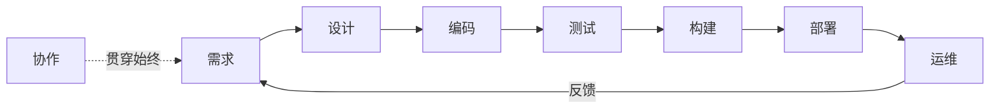
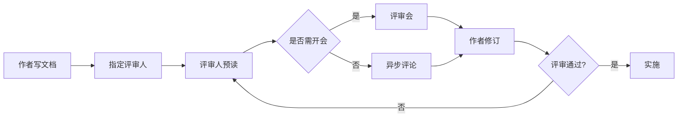
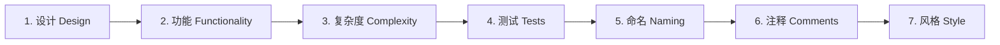
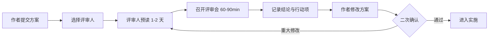
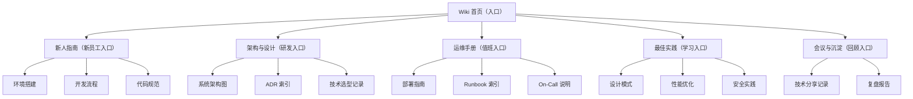
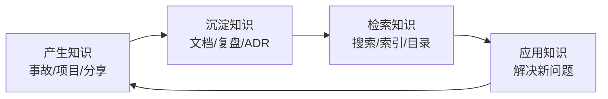

<!-- ============ 文档分隔线：039-engineering-practices/001-EngineeringPracticeOverview.md ============ -->

## 1. 从一个故事说起：为什么需要"工程化"

先看两个场景。

**场景 A：一个人的项目。** 小林自己开发了一个小工具，代码都在自己脑子里，改完就跑，跑通就发。没有任何文档，也没有测试，但工具只有他自己用，出了 bug 他打开编辑器五分钟就修好。这个阶段，**不需要任何工程化**——因为唯一的用户就是作者本人，唯一的"团队"也是作者本人。

**场景 B：二十个人的产品。** 同样是这个工具，现在有 20 个工程师一起开发：有人负责前端、有人负责后端、有人负责运维。小林发现：他改了数据库连接方式，负责部署的老张不知道；老张上线了新版本，负责前端的小李没跟上接口变化；三个月的某天，有人"顺手"改了一个函数签名，编译没报错，但线上功能悄悄坏掉了，直到用户投诉才发现。

同一个问题出现了：**当软件开发从"一个人"变成"一个团队"、从"一次性的小工具"变成"持续演进的系统"时，光靠个人记忆和自觉已经无法保证质量和进度了。** 工程化，就是把这套"靠人"的经验，转变成"靠制度和工具"的系统方法。

工程化不是给开发者增加负担的条条框框，而是**用科学的方法管理复杂度**：把不可靠的个人行为，变成可复制的团队流程。这就是本模块要讲的全部内容。

## 2. 工程化到底是什么

### 2.1 一个朴素的定义

工程化（Engineering Practice）可以概括为一句话：

> **把软件开发中那些"碰运气"的成分，变成"可预期"的流程。**

具体拆开看，包含三个层次：

| 层次 | 回答的问题 | 例子 |
| :--- | :--- | :--- |
| 规范性 | 怎么做才对？ | 编码规范、提交规范、文档规范 |
| 流程化 | 先做什么后做什么？ | 需求 → 设计 → 编码 → 测试 → 发布 |
| 自动化 | 哪些事不该人做？ | CI 构建、自动化测试、自动部署 |

这三层是递进关系：先有"规矩"（规范），再定"顺序"（流程），最后把重复的事情交给"机器"（自动化）。

### 2.2 工程化 ≠ 一堆文档

很多人对工程化有误解，以为工程化就是"写很多文档、开很多会、走很多审批"。恰恰相反，**文档和会议只是手段，不是目的**。如果一份文档写了没人看、一个会议开了没结论，那它们不但没有价值，反而是浪费。

判断一个工程实践是否值得，只有一个标准：

> **它是否让"整个系统"变得更可靠、更可维护、更高效？**

比如代码审查：它让每个改动在被合并前经过他人检查，减少线上事故——值得。但如果在审查时互相挑刺、拖延数周，阻碍了所有人的进度——那这个实践就执行坏了。

### 2.3 工程化的两条铁律

**铁律一：工程化的目的是降低风险，不是消灭风险。** 世界上没有"零事故"的软件系统，工程化要做的是让事故发生得更少、发生后恢复得更快、影响范围更小。

**铁律二：工程化的代价必须小于收益。** 一个小团队、小项目，采用过重的流程只会拖慢速度。工程化的深度应当与团队规模、系统复杂度、风险等级相匹配。这就是为什么后续会反复强调"适度"。

## 3. 工程化的五大核心思维

工程化不仅仅是一堆实践清单，更是一套思考方式。以下五种思维是理解所有工程实践的地基。

### 3.1 系统思维：看整体，而不是局部

**反例**：小林发现数据库查询慢，于是在查询语句后面加了个"ORDER BY"试图优化，结果问题依旧——因为慢的根本原因是缺少索引，而不是排序。

**正例**：遇到性能问题，先画一张"请求从用户到数据库的完整路径图"，看清楚瓶颈到底在哪一环，再动手。

系统思维要求我们：分析问题时，把代码、配置、网络、依赖、团队协作看作一个相互关联的整体，而不是孤立的零件。

### 3.2 权衡思维：没有银弹，只有取舍

软件工程里没有"完美方案"。用微服务换取独立部署，就要付出分布式复杂度的代价；用强一致性换取数据准确，就要付出性能的代价；用严格流程换取质量，就要付出速度的代价。

**关键问题不是"哪个方案最好"，而是"哪个方案在当下的约束下最合适"。** 任何工程决策，都要同时看到收益和代价，并明确写下来（这就是后面会讲的 ADR——架构决策记录）。

### 3.3 度量思维：用数据说话，而不是拍脑袋

"系统好像变慢了"是感觉，"P99 延迟从 120ms 涨到 350ms"是数据。感觉无法管理，数据才可以。

度量思维包含三件事：

1. **定义指标**：什么算"好"？比如"发布成功率 99%"
2. **采集数据**：如何持续测量？比如 CI 系统自动统计
3. **数据驱动决策**：根据数据决定要不要改进、改进是否生效

注意：度量不是为了考核个人，而是为了发现问题。指标设计得不好（比如只看代码行数），反而会诱导错误行为。

### 3.4 迭代思维：小步快跑，持续改进

没有人能一次设计出完美的系统。工程化的正确姿势是：**每次改进一小步，验证，再改进**。

- 功能开发：先做最小可用版本，收集反馈再迭代
- 流程改进：先在小范围试点，有效再推广
- 系统重构：分阶段进行，每次改动保持系统可用

迭代思维的反面是"憋大招"：几个月不发布，一次性上线巨大改动——一旦出问题，定位成本极高。

### 3.5 防御思维：假设一切可能出错

写代码时要默认：用户会输入奇怪的数据、网络会断、磁盘会满、依赖会升级、同事会误操作。

防御思维落地为三个习惯：

- **校验**：所有外部输入都要验证合法性
- **降级**：核心功能挂了，非核心功能要能降级继续服务
- **可恢复**：出了事故，要有预案和备份能恢复

**案例**：某支付系统在"双十一"前做了一次演练，发现如果数据库主库宕机，备用切换需要 40 分钟——远超客户可接受范围。于是团队提前优化了切换脚本，把时间缩短到 8 分钟。这就是防御思维的实战价值：**不假设"不会出事"，而是提前准备"出事怎么办"。**

## 4. 工程师素养：工程化的执行者

工程化最终要靠人来执行。一个合格的工程师，需要具备以下素养：

### 4.1 技术深度与广度

**深度**：至少在一个领域达到专家水平（比如精通数据库原理），遇到深水区问题能独立解决。**广度**：对相邻领域有基本了解（前端了解后端、后端了解运维），能跨领域协作。

深度让你"做得成"，广度让你"做得对"——因为很多问题的根源在别处。

### 4.2 沟通与协作

工程师的产出不仅是代码，还有决策与影响。一个方案再好，如果说不清楚为什么这么做，就无法获得团队支持。

好的技术沟通有三个要点：

1. **讲清楚问题**：先说明"我们面对什么问题"，再说"我建议怎么做"
2. **讲清楚理由**：方案为什么优于替代方案，用数据或原理支撑
3. **讲清楚代价**：这个方案放弃/牺牲了什么

### 4.3 学习能力

技术栈每三到五年就有一轮更新。工程化思维本身是"元能力"——掌握它之后，无论技术怎么变，你都有一套应对新问题的方法论。这比记住某个框架的用法重要得多。

### 4.4 工匠精神

"能用"和"好用"之间，隔着工匠精神：命名清晰、边界处理完善、错误信息友好、注释解释原因而非复述代码。工匠精神不是完美主义——它是在可接受的成本内，把质量做到位。

## 5. 工程实践体系全景

把工程实践按软件生命周期展开，可以看到一个完整的体系。每个阶段都有对应的关键实践。



| 阶段 | 核心问题 | 关键实践 | 本模块对应文档 |
| :--- | :--- | :--- | :--- |
| 设计 | 做什么、怎么做 | RFC、ADR、方案评审 | 设计文档规范、技术方案评审 |
| 编码 | 怎么写才正确可维护 | 编码规范、代码审查 | 代码审查清单 |
| 测试 | 怎么证明它是对的 | 单元/集成/E2E 测试 | 见 036-software-testing |
| 构建 | 怎么稳定地产出制品 | CI 流水线 | 见 031-devops |
| 部署 | 怎么安全地上线 | 灰度、回滚、蓝绿发布 | 见 031-devops |
| 运维 | 怎么保证持续可用 | 监控、告警、On-Call | On-Call 最佳实践 |
| 协作 | 怎么让团队高效 | 站会、回顾、知识分享 | 知识管理 |

注意一个容易被忽略的要点：**这个环是闭合的**。运维中发现的教训要反馈回设计阶段，形成"事故 → 复盘 → 改进 → 预防"的闭环。这也是本模块每篇文档反复出现的主题。

## 6. 实践成熟度：你的团队在哪个级别

判断一个团队的工程化水平，可以用业界广泛认可的成熟度模型（源自 CMMI 思想）。它描述了一个团队从"靠个人英雄主义"到"系统化持续改进"的五个阶段：

### L1 初始级：全靠个人

- 特征：没有流程规范，每个人按自己的习惯写代码
- 表现：项目成功与否取决于"有没有厉害的人"，人员离职=知识流失
- 典型场景：一人开发的小工具、创业初期的代码库

### L2 可重复级：经验可复制

- 特征：有基本的约定（比如命名规范、提交规范），踩过的坑会记下来
- 表现：同一件事第二次做能成功，但靠的是"老人带新人"的口口相传
- 提升动作：把口头经验书面化，建立第一个 Runbook

### L3 已定义级：流程标准化

- 特征：流程被写成文档，全员按统一流程执行
- 表现：新成员按文档即可上手，团队不依赖个别"关键人"
- 提升动作：CI/CD 落地、代码审查制度化、设计文档规范化

### L4 已管理级：量化度量

- 特征：流程不仅定义，而且用数据度量
- 表现：能回答"发布成功率是多少""平均修复时间多长""告警准确率如何"
- 提升动作：建立 SLO/SLI 指标体系，用数据驱动改进

### L5 优化级：持续改进

- 特征：基于数据主动优化流程，鼓励创新
- 表现：团队会主动消灭低效环节，比如自动化重复劳动、压缩发布周期
- 提升动作：定期复盘流程本身，引入新技术试点

**请思考：你所在的团队（或你想象中将要加入的团队）处于哪个级别？** 这不是为了评价好坏，而是为了找到"下一步改什么"。绝大多数团队卡在 L2 到 L3 之间——它们不是缺流程，而是缺"把流程写下来并坚持执行"的决心。

## 7. 核心实践原则

以下是贯穿整个工程实践模块的五条原则。理解它们，后面每篇文档都是在这些原则上的具体展开。

### 7.1 自动化优先

凡是"重复的、机械的、容易出错的"操作，都应当自动化：代码格式化交给工具、构建交给 CI、部署交给流水线、检查交给 Lint。

**为什么重要**：人做重复操作必然出错（忘了跑测试、漏了部署步骤、改了 A 忘了 B）。机器不会累、不会忘、不会"觉得这次应该没问题"。

**边界**：自动化也有成本（写脚本的时间、维护流水线的时间），所以"自动化优先"不是"什么都自动化"，而是"优先考虑自动化，当成本大于收益时再手工"。

### 7.2 文档即代码

文档与代码同仓库、同评审、同版本管理。这样做的核心价值是：**文档不会与代码脱节**。代码改了，同一次提交里的文档必须一起改，审查者会看到两者的一致性。

文档即代码的落地方式：

- 文档用 Markdown 纯文本存放（可 diff、可审查）
- 文档放在代码仓库里（与代码同目录或 docs/ 目录）
- 文档随代码一起走 CI 审查（检查链接有效性、格式合法性）
- 文档变更与代码变更在同一个 PR 里评审

### 7.3 左移：越早发现问题越便宜

软件工程有一个著名的规律：**缺陷发现得越晚，修复成本越高。** 需求阶段的错误可能只要 1 小时修复，上线后才发现则要改代码、走发布流程、通知用户，成本放大几十上百倍。

"左移"就是把质量活动往前移：需求阶段就评审需求、设计阶段就评审方案、编码阶段就写测试、合并前就做代码审查——而不是等问题上线后再说。

### 7.4 反馈闭环

任何流程都要有"结果反馈"：测试失败要通知到人、发布成功要留痕、事故复盘要有行动项、行动项要有人跟踪完成。

没有闭环的流程是形式主义：测试跑了没人看结果 = 没跑；复盘写了行动项没人落实 = 没复盘。

### 7.5 渐进式推进

工程化改造最忌讳"一刀切"：突然要求所有团队第二天起必须写 RFC、必须 100% 测试覆盖、必须两周一个发布周期——这会引发强烈抵触，最终不了了之。

正确的推进方式：

1. 选择一个痛点最明显的环节（比如"部署总出问题"）
2. 小范围试点（一个团队先跑通）
3. 验证效果，形成可复制的模板
4. 逐步推广到全团队

## 8. 从 0 到 1：一个团队的工程化落地路线

假设一个 10 人团队，代码库乱、上线靠手动、事故频发，想启动工程化改造。推荐的落地顺序（从易到难、从见效快到见效慢）：

**第一阶段（第 1 个月）：止血**

- 建立 Git 分支规范与提交规范（小成本、立刻见效）
- 引入代码格式化工具与 Lint（自动拦截低级错误）
- 建立测试环境与正式环境分离（避免"在开发环境上线"）

**第二阶段（第 2-3 个月）：自动化**

- 搭建 CI：每次提交自动跑测试与构建（让"红/绿"状态人人可见）
- 建立基本的监控与告警（先解决"出事没人知道"）
- 编写第一批 Runbook（部署手册、常见故障手册）

**第三阶段（第 4-6 个月）：制度化**

- 代码审查制度化（全员参与，明确审查标准）
- 引入设计文档（RFC/ADR），重大改动先设计再编码
- 启动事故复盘（无指责、行动项闭环）

**第四阶段（持续）：度量与优化**

- 建立 SLO 指标体系（可用性、延迟、错误率）
- 按数据优化流程（哪些告警无效、哪些环节拖慢发布）
- 定期复盘流程本身，持续改进

**关键提醒**：以上路线不是唯一正确的答案。工程化没有标准答案，只有"适合当前团队状况"的答案。落地过程中要不断问自己：**这个实践解决了真实问题吗？代价可接受吗？**

## 9. 常见误区

### 误区一：工程化 = 流程越重越好

**错误认知**：流程多了、文档多了、审批多了，就是工程化做得好。

**真相**：过重的流程会拖慢一切。工程化的深度应当与团队规模、系统风险成正比。2 个人的工具项目和 200 人的交易系统，需要的工程化程度完全不同。**判断标准永远是"收益是否大于代价"。**

### 误区二：工程化是管理者的事，与开发无关

**错误认知**：定规范、建流程是领导/PM 的事，工程师只管写代码。

**真相**：工程化的最终执行者是每一个工程师。代码审查需要你认真参与，事故复盘需要你坦诚分享，文档需要你认真编写。**没有工程师认同的工程化，只是墙上的一纸空文。**

### 误区三：工程化 = 写一堆没人看的文档

**错误认知**：工程化就是写文档，写完就完事。

**真相**：文档是手段不是目的。如果一份设计文档写完后没人评审、没人按它实现、没人更新，那它就是垃圾。文档的价值在于"被使用"，而不是"被生产"。

### 误区四：自动化之后就可以不用人管了

**错误认知**：CI 跑起来了、监控装好了，就可以高枕无忧。

**真相**：自动化系统本身也需要维护：CI 脚本要更新、监控阈值要调整、告警要定期审查是否有效。自动化把"人做重复的事"变成"人做更高级的事"，而不是"人不做事"。

## 10. 本章小结

工程化是什么：**把软件开发中"碰运气"的成分，变成"可预期"的流程。**

- 它的核心是三大递进：规范（怎么做对）→ 流程（先做什么）→ 自动化（什么交给机器）
- 它的五大思维：系统、权衡、度量、迭代、防御
- 它的完整体系：设计 → 编码 → 测试 → 构建 → 部署 → 运维 → 协作，形成闭环
- 它的成熟度：从"靠个人"到"可复制"到"已定义"到"可度量"到"持续优化"
- 它的五条原则：自动化优先、文档即代码、左移、反馈闭环、渐进式推进

<!-- ============ 文档分隔线：039-engineering-practices/002-DesignDocumentStandard.md ============ -->

## 1. 为什么需要设计文档

### 1.1 一个真实的场景

小周负责一个订单系统。某天产品经理提出需求："用户下单后 15 分钟内可以取消订单。"

小周觉得很简单，直接动手写代码：在下单接口后面加了个取消逻辑，测试通过，上线。结果一周后：

- 用户在下单 16 分钟后点了"取消"，系统弹了个"操作失败"，产品经理来问怎么回事；
- 运营发现，取消的订单没有把"库存"加回去，导致商品超卖；
- 三个月后，小周自己都忘了当时为什么要把取消时间限制在 15 分钟，只知道"不能改，改了会出问题"。

**问题出在哪？** 不是代码写错了，而是**需求被直接翻译成了代码，中间缺了"设计"这一层**。没有人认真想过：为什么是 15 分钟？取消订单对库存、对支付、对优惠券分别有什么影响？这 15 分钟是写死的还是可配置的？取消后数据如何归档？

设计文档，就是强制你**在写代码之前，先把这些问题想清楚、写下来、并让大家讨论**的工具。

### 1.2 设计文档的三个价值

**价值一：逼你想清楚。** 写作的过程就是思考的过程。很多"写代码时才发现的问题"，其实在写设计文档时就应该被发现——因为文档要求你把边界条件、异常路径、数据流都写出来。

**价值二：让团队对齐。** 你的方案可能会影响别的模块（数据库、前端、运维）。提前让大家看文档，可以在实施前发现"这个 API 字段前端不好用""这个表结构扩展性差"等问题，而不是等代码写完了再返工。

**价值三：留下决策记录。** 半年后有人问"为什么这里要加 15 分钟限制"，答案在文档里，而不是在某个离职同事的脑子里。

## 2. 三种设计文书：RFC、ADR、技术方案

很多初学者把设计文档混为一谈，其实工程实践中有三种用途不同的文书。搞清楚它们的区别，是本章的核心。

| 文书 | 用途 | 什么时候写 | 性质 |
| :--- | :--- | :--- | :--- |
| RFC | 提出并讨论一个方案 | 方案**定稿前**，需要团队讨论 | 提案，可修改 |
| ADR | 记录一个重要决策 | 决策**做出后** | 记录，不可修改 |
| 技术方案 | 描述"怎么做"的完整设计 | 项目/功能开发前 | 指南，按需更新 |

用一个"盖房子"的类比来理解：

- **RFC** 是"我打算这样盖这栋房子，大家看看有没有更好的主意"——是讨论稿，改来改去很正常；
- **ADR** 是"我们决定用砖混结构而不是框架结构，因为……"——是决定记录，一旦定下就不再改（要改就重新记录一个新决定）；
- **技术方案** 是"这栋房子的完整施工图纸"——描述怎么从地基到封顶。

三者是**递进关系**：先有 RFC 讨论 → 讨论达成一致后形成 ADR 记录 → 然后写详细的技术方案指导实施。

```
需求 → RFC（讨论方案）→ 决策 → ADR（记录决策）→ 技术方案（指导实施）→ 代码
```

## 3. RFC：方案提案

### 3.1 什么是 RFC

RFC（Request for Comments，请求意见稿）用于**在实施前提出一个技术方案，并邀请团队讨论**。它的灵魂是"征求意见"：RFC 不是最终的结论，而是讨论的起点。

业界最著名的 RFC 流程是 Rust 语言社区：每个重大语言特性都要先提交 RFC，社区讨论、修订、最终由核心团队决定采纳或拒绝。React 的很多重要设计也走类似的公开流程。

### 3.2 RFC 的完整模板

```markdown
# RFC-003: 订单取消功能设计

| 元数据 | 值 |
| :--- | :--- |
| 作者 | 小周 |
| 状态 | 草案 / 评审中 / 已批准 / 已拒绝 |
| 创建日期 | 2026-08-02 |
| 目标决策日期 | 2026-08-09 |
| 相关方 | 订单组、支付组、前端组 |

## 摘要

用户下单后可在 15 分钟内取消订单，取消后库存回补、支付原路退回。

## 动机

### 问题陈述

用户误下单后无法取消，只能联系客服，客服工单量占比 12%。

### 目标

- 用户可在 15 分钟内自助取消
- 取消后库存准确回补，不允许超卖
- 支付金额原路退回

### 非目标（明确不做的）

- 不做"取消次数限制"
- 不做"部分取消"（一次只能取消整个订单）

## 详细设计

### 取消时间窗口

- 窗口长度可配置，默认 15 分钟，配置中心下发
- 窗口计算以"支付成功时间"为起点

### 状态机

下单 → 支付成功 → [15 分钟内] 取消申请 → 库存回补 → 退款 → 已取消

### API 设计

POST /orders/{id}/cancel
请求：{ "reason": "误下单" }
响应：200 + 新状态；409 表示已超过取消窗口

### 数据模型

orders 表新增字段：cancel_deadline_at、cancelled_at、cancel_reason

### 关键流程

1. 校验订单属于当前用户
2. 校验当前时间 < cancel_deadline_at
3. 开启事务：改订单状态 → 回补库存 → 记录取消日志
4. 提交事务后异步发起退款
5. 退款失败进入对账队列，人工介入

## 替代方案

### 方案 A：不限制时间，任何时候可取消

- 优点：用户体验最好
- 缺点：高峰期取消会造成库存剧烈波动，且超过发货时间后取消代价高
- 未采纳原因：业务上不可接受

### 方案 B：仅限"未支付"订单可取消

- 优点：实现最简单
- 缺点：未解决"误下单已支付"的核心痛点
- 未采纳原因：不解决问题

## 权衡取舍

| 取舍 | 选择 | 放弃 |
| :--- | :--- | :--- |
| 窗口时长 | 15 分钟可配置 | 更严格的规则 |
| 取消方式 | 仅整单取消 | 部分取消 |

## 风险与缓解

| 风险 | 影响 | 缓解 |
| :--- | :--- | :--- |
| 退款失败 | 资金风险 | 对账队列+告警 |
| 库存回补失败 | 超卖 | 事务+补偿脚本 |

## 迁移与兼容

- 存量订单不开放取消（新增 cancel_deadline_at 为空即不可取消）
- 前端在 15 分钟后隐藏取消按钮并提示

## 开放问题

- 取消是否占用用户每月取消额度？（待产品确认）
```

### 3.3 写 RFC 的三个关键

1. **"非目标"比"目标"更重要。** 明确写出"我们这次不做 X"，可以防止讨论跑偏。很多项目失败不是因为没做什么，而是因为什么都想做、结果什么都没做透。

2. **替代方案必须认真写。** "我们考虑了 A、B，因为 XX 原因选了 C"——这句话能向评审者证明你做过功课，也常常在写作过程中帮你发现自己方案的缺陷。

3. **目标决策日期要明确。** RFC 最怕"讨论了三个月没结论"。给每个 RFC 设定一个决策截止日，到时间必须有结论（采纳/拒绝/要求修改），否则 RFC 就失去意义。

## 4. ADR：架构决策记录

### 4.1 什么是 ADR

ADR（Architecture Decision Record，架构决策记录）由 Michael Nygard 在 2011 年提出，用于**记录一个已做出的重要决策及其理由**。

和 RFC 最大的区别：**RFC 在决策前写（可修改），ADR 在决策后写（一旦接受就不可修改）。** 如果后来决策被推翻了，不是去改旧 ADR，而是写一个新的 ADR 声明"取代了 ADR-003"。

### 4.2 ADR 模板（MADR 风格）

业界最流行的轻量模板是 MADR（Markdown Architectural Decision Records）：

```markdown
# ADR-012：订单系统使用 PostgreSQL 作为主数据库

## 状态

已接受

## 背景与上下文

订单系统需要支撑：
- 事务性写入（订单+库存+流水强一致）
- JSON 灵活字段（订单扩展属性）
- 全文检索（客服按商品名/单号搜索订单）
当前 MySQL 5.7 版本已到生命周期末期，且 JSON 能力弱。

## 决策

采用 PostgreSQL 16 作为订单系统主数据库。

## 理由（为什么）

1. 原生 JSONB 类型：性能与功能均优于 MySQL 的 JSON
2. 更成熟的 MVCC 与高级索引（部分索引、表达式索引）
3. 全文检索能力内置，减少引入 ES 的必要性
4. 团队已完成 PoC 验证：读写性能满足目标，数据迁移耗时 3 小时

## 后果

### 正面
- 满足全部功能需求，无需额外中间件
- 版本更新、社区活跃

### 负面
- 运维团队需要补充 PostgreSQL 经验（计划一次培训）
- 部分云厂商的托管服务价格略高于 MySQL

### 风险
- 迁移过程中数据一致性：通过双写+校验脚本缓解
- 团队习惯迁移成本：前 1 个月配置"PG 值班答疑人"

## 替代方案

- 继续使用 MySQL 8.0：JSON 能力不足，需额外引入 ES，复杂度更高
- TiDB：分布式能力超出当前需求，运维成本高

## 相关决策

- 取代 ADR-002（最初选择 MySQL）
- 关联 ADR-015（缓存采用 Redis）
```

### 4.3 ADR 的四个编写要点

**要点一：一个 ADR 只记录一个决策。** 不要在一篇 ADR 里同时写"数据库选型"和"缓存选型"——这是两个独立决策，应该分开记录。

**要点二：背景要写"当时的约束"，而不是"现在的结果"。** 目的是让未来的读者理解"当时为什么做这个决定"。如果只说结论不说上下文，ADR 就失去了意义。

**要点三：后果要同时写正面和负面。** 只写正面后果的 ADR 是宣传稿。诚实地记录负面后果，才能让未来的团队知道"这个决策的代价是什么"。

**要点四：写得要快。** 一篇 ADR 应该 10-20 分钟写完。如果写得太久，说明决策范围太大，应该拆分成多个决策。

### 4.4 ADR 的目录组织

ADR 通常放在仓库的 `docs/adr/` 目录，按编号排序：

```
docs/adr/
  0001-use-postgresql.md
  0002-adopt-grpc.md
  0003-react-for-frontend.md
  README.md   # ADR 索引表
```

README 里维护一张索引表，方便快速查找：

| 编号 | 决策 | 状态 | 日期 |
| :--- | :--- | :--- | :--- |
| 0001 | 使用 PostgreSQL | 已接受 | 2026-05-01 |
| 0002 | 内部通信用 gRPC | 已接受 | 2026-05-15 |
| 0003 | 前端用 React | 已废弃（被 0007 取代） | 2026-06-01 |
| 0007 | 前端用 Vue 3 | 已接受 | 2026-08-02 |

## 5. 技术方案文档

### 5.1 与 RFC/ADR 的区别

技术方案（Design Doc / Technical Design）描述的是"一个功能/项目怎么做"的完整设计，比 RFC 更详细、比 ADR 更全面。它指导整个实施过程。

可以这样理解：

- RFC 回答："我们该不该做、大概怎么做？"（短、粗、讨论用）
- ADR 回答："这个技术选型定了，是 XXX，因为 YYY。"（短、准、记录用）
- 技术方案回答："这个功能完整的设计是什么样？"（长、细、实施用）

### 5.2 技术方案模板

```markdown
# 「订单取消」技术方案

## 1. 背景与目标

### 1.1 业务背景
用户误下单后无法取消，客服工单占比 12%，需要自助取消能力。

### 1.2 技术目标
- 支持 15 分钟可配置取消窗口
- 库存回补准确率 100%（不允许超卖）
- 退款链路自动对账

### 1.3 非目标
- 不支持部分取消
- 不支持取消次数限制
- 不涉及用户评价体系

## 2. 现状分析

### 2.1 当前架构
[订单服务] → [订单库(MySQL)]、[库存服务] → [库存库]、
[支付网关] → [支付回调]

### 2.2 存在的问题
- 订单状态只有"已创建/已支付/已完成"，无"已取消"
- 库存扣减在支付回调后执行，取消需要逆操作

## 3. 方案设计

### 3.1 总体架构
新增取消状态与取消流程，复用现有事务框架

### 3.2 核心流程（时序）
用户点击取消 → 订单服务校验窗口 → 开启事务(状态+库存+流水)
→ 提交 → 异步退款 → 退款回调更新退款状态

### 3.3 数据模型
orders: +cancel_deadline_at DATETIME, +cancelled_at DATETIME,
        +cancel_reason VARCHAR(200)

### 3.4 API 设计
POST /orders/{id}/cancel   （见 RFC-003 中的 API 定义）

### 3.5 安全设计
- 仅订单所属用户可取消（鉴权）
- 取消接口幂等（重复调用只成功一次）

## 4. 方案对比

| 维度 | 方案A：仅整单取消 | 方案B：支持部分取消 |
| :--- | :--- | :--- |
| 实现复杂度 | 低 | 高（需拆单+多行库存） |
| 用户体验 | 满足 95% 场景 | 更完整 |
| 风险 | 低 | 中（部分取消退款规则复杂） |

结论：首期采用方案 A，部分取消作为二期规划。

## 5. 容量与性能

### 5.1 容量估算
取消峰值 QPS 约 50，库存回补事务 < 100ms，现有资源充足。

### 5.2 性能目标
取消接口 P99 < 300ms

### 5.3 压测方案
jmeter 模拟 100 并发取消，观察事务时长与数据库锁等待。

## 6. 风险与应对

| 风险 | 等级 | 应对 |
| :--- | :--- | :--- |
| 退款失败 | P0 | 对账任务+告警+人工介入手册 |
| 并发取消与支付冲突 | P1 | 状态机校验+唯一约束 |
| 库存回补重复 | P1 | 幂等键+事务 |

## 7. 实施计划

- 第一周：数据库变更+状态机改造
- 第二周：取消接口+库存回补
- 第三周：退款链路+对账
- 第四周：联调、压测、上线

## 8. 监控与告警

- 指标：取消成功率、取消延迟、退款失败数
- 告警：退款失败率 > 1% 触发 P1
```

### 5.3 技术方案的篇幅控制

技术方案不是越长越好。一个经验法则：

- 小型改动（改个字段、加个接口）：**不需要写技术方案**，直接 RFC 或代码审查解决
- 中型功能（一个新的业务模块）：1-3 页技术方案足够
- 大型系统（架构重构、平台建设）：需要完整方案，可能要 5-10 页甚至更多

**"写不写方案"的判断标准**：这个改动如果做错了，返工成本高不高？如果返工成本低（比如改个字段），就不需要方案；如果返工成本高（比如选错架构），就必须先设计。

## 6. 写作技巧：让文档真正被读

写了没人读的文档就是浪费。以下技巧能提高文档的"被读率"：

### 6.1 先结论后细节

用"金字塔原理"组织内容：**结论先行，再展开理由，最后给细节。** 读者扫描文档时，只看前几行就能理解你的核心主张，有兴趣再深入看。

反例：开头先写三页背景调研，最后一行才说"所以我们用 X"。
正例：开头第一段就说"本方案建议使用 X，因为 A、B、C 三个理由"，再展开。

### 6.2 为读者而写，不是为自己

问自己三个问题：

1. **谁在读？** 评审者（要判断方案是否可行）、实施者（要照着写代码）、新人（要理解为什么这么做）——读者不同，关注点不同
2. **他们要做什么？** 评审者要"提意见"，实施者要"照着做"
3. **他们缺少什么背景？** 补上必要的上下文，但不要科普常识

### 6.3 用数据说话

"性能可以满足要求"不如"压测显示 P99=150ms，目标 300ms"。**能用数字的地方不用形容词。** 数据不仅增加可信度，也方便评审者判断。

### 6.4 保持"够新"而非"完美"

设计文档是活文档：方案定稿后，实施中发现的新情况应当回写到文档里。但也不要为了追求"永远最新"而频繁改版——**文档的核心价值是"记录了当时的设计与理由"，而不是"永远和代码完全一致"。** 重大偏差（比如改了架构）才需要更新文档，小细节差异让代码注释去补充。

## 7. 文档评审流程

设计文档写完后，要走评审才能进入实施。完整流程：



**评审要点**：

1. **材料提前发**：至少提前 1-2 个工作日发文档，评审会不是现场读文档会
2. **评审人要对**：邀请真正相关的人——受影响的模块负责人、有经验的架构师、实施者本人
3. **结论要记录**：评审会要产出明确结论（通过/有条件通过/重审）和行动项
4. **拒绝"沉默即同意"**：评审人没回复 = 没评审，不能当作默认通过

## 8. 常见错误与反模式

### 反模式一：文档与代码脱节

文档写的是方案 A，代码实现的是方案 B，而且没人更新文档。后果：文档变成"历史遗留垃圾"，新人不信文档、自己翻代码。

**对策**：文档和代码同 PR 变更（文档即代码），代码审查时同时看文档是否同步。

### 反模式二：什么都写进文档

把"变量怎么命名"这种常识也写进设计文档，篇幅膨胀、重点淹没。

**对策**：设计文档只写"有决策含量的内容"——需要讨论的、有取舍的、影响他人的。纯常识留给代码规范和教科书。

### 反模式三：评审走过场

评审会开着，但没人真看文档，最后"全体通过"。等实施到一半发现方案有重大问题，返工。

**对策**：评审人必须真读真评。可以在评审会前要求每人提至少一个具体问题，强制参与。

### 反模式四：ADR 写成了"事后诸葛亮"流水账

为了"看起来规范"给每个小改动都写 ADR，而且内容空泛（"我们决定用 X"没有任何理由）。ADR 泛滥后，没人再读 ADR。

**对策**：只对"架构级、影响深远、难以逆转"的决策写 ADR。能轻易改回来的决策（比如"这个页面用蓝色"）不需要 ADR。

<!-- ============ 文档分隔线：039-engineering-practices/003-CodeReviewChecklist.md ============ -->

## 1. 从"作文批改"到"代码评审"

### 1.1 你其实早就做过代码评审

想象一下学生时代的场景：老师发回批改过的作文，红笔写满了批注——"这里逻辑不通""这个例子不恰当""结尾太仓促"。你在看批注时学到了两件事：一是知道了自己作文的问题，二是通过老师的视角学会了"什么样的文章算好文章"。

**代码评审（Code Review）本质上就是"作文批改"，只不过被改的对象是代码，批改者是你的同事。** 在代码评审中：

- **作者（Author）** 提交自己写的代码（在 Git 里叫 Pull Request 或 PR）
- **评审者（Reviewer）** 阅读代码、提出意见、决定是否批准合并
- **被改进的对象** 是代码库的整体健康度，而不是作者的个人能力

### 1.2 为什么需要代码评审

很多人第一次接触代码评审时的第一反应是："我自己写的代码自己最清楚，为什么要让别人看？"

这个想法只对了一半。**"自己最清楚"说的是意图，而不是质量。** 人类有一个认知盲区：写代码的人太熟悉自己的思路，往往看不出自己代码中的问题。就像作家很难发现自己的错别字——因为大脑会自动"脑补"正确的内容。

代码评审解决的正是这个盲区。它带来四个核心价值：

**价值一：质量保障。** 每行代码在被合并前经过第二双眼睛检查，能发现：边界条件没处理、错误路径遗漏、性能隐患、安全隐患。据统计，代码评审能提前拦截相当比例的线上缺陷——比上线后由用户发现再修复，成本低得多。

**价值二：知识共享。** 评审者是"读"别人代码最多的人。通过评审，团队每个人都能了解"别的模块在做什么、怎么做的"，打破信息孤岛。新人也通过评审快速了解团队规范和代码风格。

**价值三：标准统一。** 团队用同一个评审标准，代码风格、命名习惯、架构约定就会自然趋同。这比贴一份"编码规范文档"有效得多——因为规范是"在真实场景中被执行"的，而不是"挂在墙上"的。

**价值四：导师作用。** 有经验的工程师通过评审，把"为什么这里要这样写"讲给新人听——这是性价比最高的知识传递方式之一。

### 1.3 代码评审的三个前提

代码评审不是"灵丹妙药"，它要生效需要三个前提：

1. **评审发生在合并前。** 只有"先审查、后合并"才能真正拦截问题。如果代码先合并了再补审查，那只是形式主义。
2. **作者愿意接受意见。** 作者要明白：被指出问题不是"被打脸"，而是"有人帮你兜底"。
3. **评审者认真负责。** 评审不是"点个同意"走流程，而是要真的读懂代码、真的思考。

## 2. Google 的评审标准：持续改进，而非完美

Google 公开的工程实践文档（google.github.io/eng-practices）是全球代码评审领域最有影响力的公开资料。它最重要的原则只有一句话，值得全文加粗：

> **评审者应当在一份变更"确实改善了系统整体代码健康度"时批准它，即使这份变更并不完美。**

这句话听起来简单，但它纠正了两个极端：

**极端一：完美主义评审。** 评审者要求作者把所有细节都打磨到"理想状态"才放行：变量名还能更好、抽象还能更优雅、某个边界还能再想想。结果是：PR 永远合不进去，团队速度被拖垮，作者逐渐失去改进的动力。

**极端二：橡皮图章评审。** 评审者看都不看就批准，避免冲突。结果是：审查形同虚设，代码质量逐年下滑。

Google 的原则给出了第三条路：**"好"的标准不是"完美"，而是"比之前更好"（definitely improves the overall code health）。** 只要这个变更整体上是改进（利大于弊），就应当放行，把"锦上添花"的意见留到下一次变更。

配套的还有三条子原则：

**子原则一：技术事实和数据压倒个人偏好。** "我觉得这样更好"是个人偏好；"这样写会有 500ms 的额外延迟"是技术事实。评审应当基于事实。

**子原则二：风格问题以风格指南为准。** 纯风格问题（缩进、命名）以团队风格指南为唯一标准。指南没规定的，尊重作者的选择——"我和你的写法不同"不是阻止合并的理由。

**子原则三：小评论标注"Nit"。** Google 规定，非关键的润色意见要用 "Nit:"（nitpick，吹毛求疵）前缀标注，让作者知道"这只是可选优化，可以不改"。

## 3. 评审顺序：先看设计，再看细节

评审者拿到一份 PR，应该按什么顺序看？Google 的建议是**从宏观到微观**，因为后一层的质量问题，往往源于前一层的决策错误：



**为什么设计排第一？** 因为如果设计方向错了，后面的修正都白费：改命名、改风格都救不了一个"根本不该这么做"的代码。先确认"这个方案对不对"，再花时间抠细节。

### 3.1 第一层：设计

- 这个变更是否属于正确的模块/代码库？
- 是否与系统的其他部分正确集成？
- 现在是不是添加这个功能的最佳时机？
- 是否过度设计（为不存在的未来需求增加复杂度）或设计不足（没有考虑边界）？

### 3.2 第二层：功能

- 代码是否真正实现了 PR 描述的功能？
- 是否对用户有益？还是"实现了一个没人需要的需求"？
- 边界情况是否处理？（空值、超长、并发、重试）
- 错误路径是否完善？（网络失败、数据库异常、依赖不可用）

### 3.3 第三层：复杂度

- 是否存在不必要的复杂度？
- 单函数是否过长（一般超过 30-50 行就需要警惕）？
- 嵌套层级是否过深（超过 3 层就应该重构）？
- 是否有重复代码模式（复制粘贴的变体）？
- 是否有不必要的抽象（为了"通用"而通用）？

**检查复杂度的核心问题**：这段代码能否被一个不熟悉背景的同事快速理解？如果不能，要么是注释不够，要么是设计过复杂。

### 3.4 第四层：测试

- 这个功能有测试吗？测试失败时能正确反映问题吗？
- 测试是"验证行为"还是"只是为了覆盖率的摆设"？
- 边界情况有测试吗？
- Mock 是否合理？（过度 Mock 会导致测试"测试的是 Mock 而不是代码"）
- 测试代码本身是否清晰可读？

### 3.5 第五层：命名

- 变量/函数/类名是否准确描述了它们的含义？
- 是否有误导性命名（名字说 A，行为却是 B）？
- 是否有无意义的缩写（`uas` 不如 `userAccountService`）？

### 3.6 第六层：注释

- 注释解释"为什么"，而不是复述"是什么"？

好的注释：`// 使用 HashMap 而非 ConcurrentHashMap：此映射仅在单线程内使用，且读多写少`

坏的注释：

```java
// 设置用户名
user.setName(name);
```

- 是否存在过时或错误的注释？（比没有注释更危险）
- TODO 注释是否有对应 issue 跟踪？

### 3.7 第七层：风格

- 是否符合团队风格指南？
- 与周围代码风格是否一致？

注意：风格是**优先级最低**的维度。纯风格问题不应阻塞合并（除非违反强制规范）。

## 4. 完整的审查清单（Checklist）

把以上维度整理成一份可执行的清单。评审者可以对照清单逐项检查：

### 4.1 正确性

- [ ] 功能是否符合需求描述
- [ ] 边界条件是否处理（空值、0、负值、极值、超长输入）
- [ ] 错误处理是否完善（异常、失败路径、重试逻辑）
- [ ] 并发安全（是否有可能的竞态条件、死锁）
- [ ] 资源释放（连接、文件、内存是否在 finally/RAII 中释放）
- [ ] 幂等性（重复执行结果是否一致）

### 4.2 可读性

- [ ] 命名是否清晰准确
- [ ] 逻辑结构是否易懂（复杂逻辑是否有清晰的层次）
- [ ] 复杂部分是否有必要注释
- [ ] 函数是否过长、嵌套是否过深
- [ ] 是否有"魔法数字/魔法字符串"（应该提取为命名常量）

### 4.3 可维护性

- [ ] 是否遵循单一职责（一个函数/类只做一件事）
- [ ] 是否有重复代码（应该提取复用）
- [ ] 硬编码是否应该参数化
- [ ] 模块间耦合是否合理
- [ ] 新增类似功能时是否只需少量修改（扩展性）

### 4.4 安全性

- [ ] 外部输入是否全部验证（类型、长度、范围、白名单）
- [ ] 数据库操作是否使用参数化查询（防 SQL 注入）
- [ ] 用户输出是否转义（防 XSS）
- [ ] 是否泄露敏感信息（密钥、密码、token 是否出现在代码/日志中）
- [ ] 是否检查权限（越权访问防护）

### 4.5 性能

- [ ] 是否存在 N+1 查询（循环内查询数据库）
- [ ] 是否有明显不必要的计算（循环内重复计算常量）
- [ ] 是否合理使用缓存（热点数据）
- [ ] 大数据量操作是否用批量代替单条循环
- [ ] 是否创建了不必要的对象/大对象

### 4.6 测试

- [ ] 核心逻辑是否有测试覆盖
- [ ] 测试是否真正验证行为（断言是否有效）
- [ ] 边界与异常路径是否有测试
- [ ] Mock 使用是否合理
- [ ] 测试是否独立可重复（不依赖外部状态）

## 5. 评论的艺术：好评论 vs 坏评论

评审的质量，最终体现在**评论的质量**上。一条好的评论，能让作者直接行动；一条坏评论，只会引发争执。

### 5.1 评论分级：让作者知道严重程度

Google 建议用前缀明确标注严重级别，避免作者误解：

| 前缀 | 含义 | 作者处理方式 |
| :--- | :--- | :--- |
| （无前缀） | 必须修改 | 阻塞合并，必须处理 |
| Nit: | 锦上添花 | 可选，作者可忽略 |
| 建议 | 非必须但推荐 | 作者自主决定 |
| 问题 | 需澄清 | 需要作者回答 |

### 5.2 坏评论长什么样

**坏评论一：只说不改。**

> "这段代码有问题。"

问题出在哪？作者一脸懵：哪里有问题？什么问题？怎么改？——这不是评论，这是情绪。

**坏评论二：攻击作者。**

> "你怎么会这么写？这太业余了。"

攻击人而不对事，会摧毁作者的安全感，让整个团队以后都不敢提问题。评审的铁律是**对事不对人**。

**坏评论三：个人偏好当标准。**

> "我更喜欢用 switch 而不是 if-else。"

如果两者技术上都等价，这只是个人偏好，不该作为必须修改的意见。

### 5.3 好评论长什么样

**好评论一：指出问题 + 解释原因 + 给出建议。**

> "`requests.get()` 在网络失败时会抛 ConnectionError。这里没有 try/except，一旦外部服务抖动，用户会直接看到 500 错误。建议包一层 try/except，记录日志后返回友好错误。（Blocking：这是用户请求路径）"

这条评论做到了四件事：**说出具体问题（缺异常处理）、解释影响（用户看到 500）、给出方案（try/except）、标注级别（Blocking）**。作者看完就能直接动手改。

**好评论二：质疑设计但留出讨论空间。**

> "我注意到这里把支付逻辑拆成了独立服务。我担心的权衡是：这会引入一次额外的网络调用，而且部署依赖变复杂了。能补充一下为什么选择拆分而不是在现有服务内实现吗？"

这条评论不否定作者的方案，而是**说明自己的顾虑（网络开销、部署复杂度），邀请作者解释**——这是建设性的技术讨论，而不是命令。

**好评论三：指出问题但不越权修改。**

> "这里的循环在每次迭代里都调用 `getUserById`，会产生 N+1 查询。建议改为批量查询一次再内存映射。如果你想让我帮忙改，说一声。"

指出问题 + 给出方案 + 尊重作者对代码的所有权。

### 5.4 写评论的四条黄金法则

1. **对代码不对人。** 永远评论"这段代码"，而不是"你"。可以说"这里需要处理空值"，不要说"你怎么不处理空值"。

2. **先认可，再提意见。** 看到好的设计、清晰的名字、漂亮的边界处理，要说出来。认可不是客套，它让作者明白"什么是好的"，也营造安全的讨论氛围。

3. **给出"为什么"。** "这样写更好"不够，要说"因为……"。没有理由的评论只会引发"我不觉得"的拉锯。

4. **聚焦，不堆积。** 一条评论只谈一个问题。把互不相关的意见合并在一句"这整段可以简化"里，作者反而不知道该改哪。

## 6. 评审者的姿态：5 个该做与 5 个不该做

### 该做的

1. **先读 PR 描述和上下文。** 不了解"这次变更想解决什么"就评审，等于盲人摸象。
2. **从整体到局部。** 先确认设计，再抠细节（见第 3 节的顺序）。
3. **及时完成。** Google 的标准是"一个工作日内给出首轮反馈"。拖延会让分支分叉、冲突累积，反而制造风险。
4. **区分"必须"与"建议"。** 明确标注级别，不要所有问题都同等权重。
5. **理解作者的处境。** 作者可能受时间压力、技术约束、历史包袱影响。批评前先问"为什么这样设计"。

### 不该做的

1. **橡皮图章。** 不看就批准。如果你没时间，可以明确说"我先看核心逻辑，细节稍后"，但不能假装看过。
2. **完美主义。** 见第 2 节——"持续改进"而非"一步到位"。
3. **越权修改。** 评审是提意见，不是替作者重写。重大改动应该由作者自己完成（除非作者明确请求帮助）。
4. **情绪化表达。** "这不是我想要的""太乱了"——这类情绪语言没有任何信息量。
5. **当场重构别人的设计。** 如果设计方向有问题，先讨论"要不要换方向"，而不是直接按自己的思路改。

## 7. 作者的姿态：怎么把 PR 送进评审

代码评审不是"评审者的单方面审判"，作者也有自己的责任：

### 7.1 提交前的自查清单

- [ ] 自己通读一遍 diff，确认没有明显的调试残留（console.log、断点、注释掉的代码）
- [ ] 本地跑通测试与构建
- [ ] 写清楚 PR 描述：**为什么改、怎么改、影响范围**（评审者最需要的信息）
- [ ] 关联相关 issue（让评审者理解上下文）
- [ ] 把大 PR 拆小（详见下节）
- [ ] 需要的话附上截图/日志/测试结果

### 7.2 收到意见后的正确姿势

**正确：** 逐条回应（"已改""接受建议""我倾向保留，理由是……"），有分歧就讨论，讨论不清就升级（找第三方仲裁或团队规范）。

**错误：** 全部接受不加思考（可能引入评审者的个人偏好）、全部反驳（错失改进机会）、默默改完不回帖（评审者不知道你的处理结果，无从确认）。

**原则：** 技术问题讲数据、讲原理；风格问题以团队规范为准；如果评审者和作者各执一词且都有道理，**作者有最终决定权**——但评审者的意见必须被认真考虑过。

## 8. 让评审更高效：小 PR、快反馈、自动化辅助

### 8.1 小 PR：评审效率的第一杠杆

Google 建议一个变更控制在 200 行以内（约合一个"合理大小"的改动）。

- 50 行的 PR：10 分钟审完，当天合入
- 500 行的 PR：半天才能审完，容易排期拖延，合入时已经和主分支冲突

**小 PR 不是风格偏好，而是部署策略**：变更越小，评审越快，合并越安全，回滚越容易。如果一个需求改动太大，拆成多个连续的 PR（先改数据层、再改接口、最后改 UI），每个 PR 独立可合并。

### 8.2 快速反馈：评审的响应 SLA

- **评审者**：一个工作日内给出首轮反馈（哪怕只说"已收到，今天内审完"）
- **作者**：收到意见后尽快处理，避免 PR 长期悬挂

一条经验法则：**PR 悬挂的时间越长，合并的风险越大。** 因为主分支一直在变，你的分支会持续落后，最终要么冲突、要么在合并时引入隐藏问题。

### 8.3 自动化辅助：让机器人做机械活

2026 年的代码评审中，AI 工具（GitHub Copilot、CodeRabbit 等）已经可以承担第一遍机械审查：

- 风格与格式检查（交给 Lint + 格式化工具）
- 明显的 bug 模式（空指针、越界、资源未释放）
- 缺失的错误处理提示
- 依赖安全检查、覆盖率报告

**AI 审查的价值**是让人类评审者专注于 AI 做不好的事情：架构合理性、上下文理解、业务影响、团队规范、新人带教。**正确的工作流**：AI 先扫一遍机械问题，人类再聚焦设计层面——两者配合，而不是互相替代。

## 9. 常见反模式：评审是如何被做坏的

### 反模式一：橡皮图章（Rubber Stamp）

**症状**：所有 PR 秒批，从不提意见。**后果**：评审形同虚设，问题全留到线上。**对策**：每个 PR 至少认真看核心逻辑，提出至少一个具体问题（哪怕是小问题）。

### 反模式二：吹毛求疵（Nitpicking）

**症状**：只盯着格式、命名、标点，从不讨论设计与逻辑。**后果**：作者觉得评审者"没事找事"，评审失去信任。**对策**：把精力放在设计、功能、复杂度等真正影响质量的地方。

### 反模式三：拖延症（Review Latency）

**症状**：PR 挂一周没人理，作者催了才看一眼。**后果**：分支持续分叉，合并风险累积；团队速度被拖垮。**对策**：把"一个工作日内响应"当作评审者的 SLA。

### 反模式四：对抗式评审

**症状**：评论语气攻击性、情绪化，把技术讨论变成个人恩怨。**后果**：作者开始隐瞒问题、规避评审，团队信任崩塌。**对策**：对事不对人，用"这条代码路径"替代"你"。

### 反模式五：过度设计要求

**症状**：要求作者为"未来可能的需求"增加抽象层、通用组件。**后果**：代码提前复杂化，YAGNI（You Aren't Gonna Need It，你不需要它）原则被违背。**对策**：评审聚焦"当前需求是否被正确实现"，未来的扩展留到未来。

<!-- ============ 文档分隔线：039-engineering-practices/004-OnCallPractice.md ============ -->

## 1. 从"急诊室值班"说起

### 1.1 On-Call 到底是什么

想象医院里的急诊室：病人在任何时间都可能被送来，所以急诊医生必须**轮流值班**——这周是你，深夜 2 点也可能被叫起来；你不在的时候，会有另一位医生接替你。值班医生的职责不是"治好所有病"，而是"在病人到来时，第一时间稳住局面，该止血的止血、该转科的转科"。

**On-Call（在线值班）在软件行业里的含义一模一样**：软件系统 7×24 小时运行，出问题的时间不分白天黑夜。团队需要安排工程师轮流值班，在系统出故障时第一时间响应、止血、恢复。

On-Call 的核心定义：

> **On-Call 是工程师轮流承担"系统故障第一响应人"的制度：告警响了，值班工程师负责确认问题、评估影响、止损恢复，并决定是否需要升级。**

### 1.2 谁需要 On-Call

不是所有团队都需要 7×24 值班。判断标准很简单：**你的系统在"非工作时间"出问题，会造成什么后果？**

- 内部工具（只有员工用，白天用）：工作日值班即可
- 对外服务（用户随时在用）：需要 7×24 值班
- 交易/金融/医疗系统（出事故后果严重）：必须 7×24，且升级路径要非常严密

**关键认知**：On-Call 不是"运维团队的事"，而是"研发团队的事"。业界有一条原则叫"谁开发谁运维"（You build it, you run it）：**让写代码的人负责自己代码的线上运行**。因为只有写代码的人才最清楚"这个系统哪里容易出问题、出问题该怎么排查"。让完全不了解代码的人值班，等于让不懂这台机器的机修工去修飞机。

## 2. 值班轮换的设计：让制度可持续

On-Call 制度最大的敌人是**不可持续**。值班工程师要忍受半夜被叫醒、周末被打断、持续的精神压力。如果制度设计不合理，团队很快就会倦怠、流失。以下是设计健康轮值的核心规则（数据来自 Google SRE 实践与业界调研）：

### 2.1 规则一：每轮值班至少 6 人

Google SRE 的经验是：**每个轮值小组至少要 6 人**。为什么？

- 6 人轮值，每个人大约每 6 周才值一次班，中间有充分的恢复期
- 如果只有 4 人，意味着每 4 周就轮到一次，一年 13 次值班，睡眠、社交、健康全部被侵蚀
- 少于 6 人时，一旦有人请假/生病，剩下的几个人被迫高频轮值，直接崩溃

**如果团队不足 6 人怎么办？** 不要硬上 24×7 轮值，改为：

- 与兄弟团队合作（follow-the-sun，按区域接力值班）
- 只在业务高峰时段值班（triage-only hours），非高峰段告警自动转工单、次日处理

### 2.2 规则二：主备双人制

**永远不要只让一个人独扛值班。** 标准配置是"主值班 + 备值班"：

| 角色 | 确认窗口 | 升级触发 |
| :--- | :--- | :--- |
| 主值班（Primary） | 5 分钟内确认 | 未确认 → 自动升级到备值班 |
| 备值班（Secondary） | 10 分钟内确认 | 未确认 → 升级到技术负责人 |
| 技术负责人（EM） | 15 分钟内确认 | 未确认 → 升级到更高级别 |

为什么必须双人？因为主值班可能正在睡觉、在飞机上、在开会——**人的不可达性比想象中高得多**。双人制让"确认失败"的概率大幅下降。

### 2.3 规则三：每班告警上限 2 次

这是 Google SRE 公开书里最重要的数字之一：**一个值班班次（12 小时）内，被真实告警打扰的次数上限是 2 次。**

如果值班期间被叫醒超过 2 次，说明**系统有问题**，而不是值班工程师"不行"：可能是告警太吵（噪音太多）、系统太脆弱（频繁故障）、或者两者兼有。

把这个数字当成"健康红线"来监控：如果连续两个月的平均值超过 2 次/班，就要把它当作**系统问题**来治理（告警收敛、稳定性建设），而不是让值班工程师硬扛。

### 2.4 规则四：每次交接都要有仪式

交接是轮值制度里最容易被忽视、也最昂贵的环节。**值班交接不只是一句话"我下班了你上"，而是一次结构化的信息传递。**

交接至少覆盖四件事：

1. **进行中的事故**：当前有没有未处理完的故障？进展如何？
2. **持续关注项**：有哪些"已知的坑"？比如某个告警最近总是误报、某个依赖下周要发新版
3. **本周变更**：这周部署了什么？下一个值班者需要知道哪些变更可能引起问题
4. **Runbook 更新**：这周发现哪些排查手册不准确？有没有补充？

**代价**：跳过交接的团队，会反复"重新发现"同一个问题——上一个班次发现的线索，下一个班次完全不知道，然后从头排查。

### 2.5 规则五：补偿必须明确

值班是额外付出，团队必须有明确的补偿机制（三选一，必须选一个）：

- **补休**：晚上 10 点后或周末被叫起的时间，兑换成带薪补休，两周内休掉
- **固定津贴**：值班期间每周固定补贴（比如 300-800 美元/周，无论是否被叫醒）
- **混合制**：少量固定补贴 + 每次实际响应额外补贴

**最差的制度是"你是月薪制，自己消化"**——把值班成本转嫁给工程师的健康，最终体现在离职率上。行业调研数据：没有明确值班补偿的团队，资深工程师离职率是对照组的 2.4 倍。

## 3. 告警管理：让告警"少而准"

告警是 On-Call 的"触发源"。**告警管理的目标不是"覆盖所有异常"，而是"每一次告警都值得叫醒一个人"。**

### 3.1 告警疲劳：On-Call 的头号杀手

行业现状（多家观测平台 2025-2026 年的调研数据）：一个监控体系一周可以产生上千条告警，其中**真正需要立即行动的只占约 3%**。其余全是：

- 41% 自行恢复（等工程师打开电脑时，指标已经恢复正常了）
- 18% 重复告警（同一个问题的多个监控各自报警）
- 22% 没有 Runbook（工程师接到告警后不知道该怎么排查）

当告警大多数是噪音时，人会本能地"无视提醒"——就像"狼来了"故事里的村民。**这就是告警疲劳，它的可怕之处在于：当真正的 P0 事故发生时，值班工程师的第一反应也是"又是误报吧"，宝贵的黄金响应时间被浪费在"确认告警是否真实"上。**

### 3.2 好告警的标准：基于用户体验，而非机器指标

设计告警时，问自己一个问题：**这个告警响起来时，用户正在经历什么？**

错误示例：监控到"某台服务器 CPU 超过 90%"就告警。但 CPU 高并不等于用户受影响——可能只是批处理任务在跑，用户完全无感。

正确示例：监控到"过去 5 分钟，用户请求的错误率超过 5%"才告警。**告警应该描述用户体验的劣化，而不是底层指标的变化。** 底层指标只是用户问题的"代理信号"，而且是嘈杂的代理信号。

业界把需要持续监控的信号总结为**四大黄金信号（The Four Golden Signals）**：

| 信号 | 含义 | 示例 |
| :--- | :--- | :--- |
| 延迟 Latency | 请求响应有多快 | P95 响应时间 < 500ms |
| 流量 Traffic | 系统承受的负载 | 每秒请求数、并发连接数 |
| 错误 Errors | 请求失败的比例 | 5xx 占比、显式错误码 |
| 饱和度 Saturation | 系统还能承受多少 | CPU/内存/队列水位 |

**告警原则**：优先围绕"错误率和延迟"这类用户体验信号设计告警，而不是围绕 CPU、内存这类机器指标。

### 3.3 SLO 错误预算告警：告警的新范式

2026 年主流团队已经抛弃"指标超过阈值就告警"的老办法，改用**基于 SLO（服务等级目标）的告警**。

先理解三个概念：

- **SLI（Service Level Indicator，服务等级指标）**：实际测量的指标。如"30 天内成功请求占比 99.7%"
- **SLO（Service Level Objective，服务等级目标）**：团队设定的内部目标。如"30 天内可用性 ≥ 99.5%"
- **错误预算（Error Budget）**：SLO 允许的"失败额度"。SLO 99.9% 意味着每月允许失败 43.2 分钟

**基于错误预算的告警逻辑**：不是"指标坏了就告警"，而是"错误预算消耗速度过快才告警"。

举例：SLO 是"月度可用性 99.9%"，对应每月错误预算 43 分钟。

- 如果当前错误率会**在 24 小时内烧光整个月预算** → 立即告警（P1，叫醒人）
- 如果当前错误率会**在一周内烧光预算** → 创建工单，工作时间处理
- 如果消耗速度正常 → 不告警

这种告警方式自动过滤了"短暂抖动但总体健康"的情况，从根本上消灭了大量噪音告警。

### 3.4 告警分级与升级路径

每个告警必须有**明确的级别 + 对应的升级路径**，不能让值班工程师在凌晨 3 点靠判断力决定"这个要不要叫醒别人"：

| 级别 | 含义 | 响应时间 | 处理方式 |
| :--- | :--- | :--- | :--- |
| P0 严重 | 服务完全不可用/数据丢失 | 立即 | 启动应急响应，通知所有相关方 |
| P1 高 | 核心功能受损/大范围受影响 | 15 分钟内 | 立即处理 |
| P2 中 | 非核心功能异常/有临时绕过方案 | 1 小时内 | 正常工作处理 |
| P3 低 | 轻微降级/不影响用户 | 4 小时内 | 排期处理 |
| P4 信息 | 仅通知，无需立即行动 | 下个工作日 | 转工单 |

**关键实践**：P0/P1 必须配置"升级路径"（Primary 未响应 → Secondary → 负责人），且告警详情里必须**直接附带 Runbook 链接**，让值班者一打开就知道该干什么。

## 4. 应急响应：从"混乱"到"有序"

### 4.1 没有结构的事故响应 = 聊天室的混乱

想象一次大型事故：10 个工程师同时涌入事故群，各自猜测、各自排查，没有人知道"现在到底怎么样了"，也没有人拍板"下一步干什么"。每个高管的私信都在问"情况如何"，而排查的人根本没时间回答。

这就是**没有应急响应结构**的典型画面。Google SRE 的解决方案是从消防界借来的 **ICS（Incident Command System，事故指挥系统）**：**一个人指挥，其他人各司其职，绝不群龙无首。**

### 4.2 四个核心角色

| 角色 | 职责 | 关键原则 |
| :--- | :--- | :--- |
| 指挥官 IC | 唯一决策者 | **不碰键盘**，只做决策：问"我们知道了什么、在做什么、谁负责" |
| 技术负责人 SME | 技术排查与止损 | 提出方案、执行排查，向 IC 汇报 |
| 沟通负责人 Comms | 对外通报 | 向用户/高管/内部更新状态，不让 SME 被打断 |
| 记录员 Scribe | 记录时间线 | 记录"几点发生了什么"，让复盘报告自动成型 |

**指挥官不是"最资深的人"，而是"拿了指挥帽的人"。** 一个新工程师也可以当 IC，资深工程师当 SME——**职级不会自动赋予指挥权**。交接指挥权时要有正式仪式："我把指挥权交给 Sarah，Sarah 你接受吗？"并在事故频道公开宣布。

### 4.3 事故严重级别（以 Google 分级为参考）

| 级别 | 描述 | 示例 | 响应 |
| :--- | :--- | :--- | :--- |
| Sev0 | 面向客户的大规模故障，重大收入/安全/信任影响 | 登录全挂、支付全挂、数据丢失中 | 完整 ICS 启动，15 分钟内发布状态页 |
| Sev1 | 大量用户或关键流程严重受损 | 搜索坏了、结账错误率 50% | 完整 ICS，状态页每 30-60 分钟更新 |
| Sev2 | 影响有限或有绕过方案 | 单个功能降级、延迟升高 | 轻量指挥结构，超时未解决再升级 |
| Sev3 | 低影响问题 | 次要 UI bug、内部工具慢 | 工作日处理，不需要即时响应 |

**重要原则：严重级别要"早声明、勤修订"。** 一开始以为是 Sev2，后来发现是数据丢失——**一旦确认，立即升级为 Sev0 并公开宣布**。最危险的是"悄悄恶化"：事故在扩大，但级别没更新，导致响应资源不足。

### 4.4 应急响应流程：八步走

```
1. 确认告警    → 验证告警是否真实（先看 Runbook 的"快速确认"步骤）
2. 评估影响    → 影响多少用户？哪些功能？有无数据风险？
3. 通知相关方  → 按升级路径通知；需要时启动状态页
4. 止血        → 优先恢复服务（回滚/降级/限流/扩容/熔断）
5. 根因分析    → 恢复后定位根本原因
6. 修复        → 实施正式修复（不要用"临时止血方案"当修复）
7. 验证        → 确认指标恢复正常、用户无感
8. 复盘        → 48 小时内完成事故复盘（见《事故复盘方法论》）
```

### 4.5 止血手段工具箱

止损阶段的目标是"**先让服务恢复，再找原因**"。常用手段：

| 手段 | 适用场景 | 说明 |
| :--- | :--- | :--- |
| 回滚 | 新版本引入故障 | 退回上一个稳定版本 |
| 降级 | 非核心功能拖垮核心 | 关闭次要功能，保住主流程 |
| 限流 | 流量冲击 | 丢弃或排队多余请求 |
| 扩容 | 容量不足 | 增加实例/副本 |
| 熔断 | 依赖故障 | 快速失败，不再等待慢依赖 |
| 切换 | 单点故障 | 切换到备用系统/机房 |

**原则**：止血方案和正式修复要分开。止血方案（如降级）可以先上；但**止血不等于修复**——后续必须做正式修复，并确认根因，否则事故会以另一种形式复发。

## 5. Runbook：值班者的"标准操作手册"

### 5.1 为什么必须写 Runbook

想象你被 3 点的告警吵醒，系统在报警，而你接手这套系统才两个月。此刻你最需要的是什么？**一份清晰的"遇到这个告警该干什么"的操作手册**——这就是 Runbook（标准操作手册）。

Runbook 的价值：

- **消除"从零排查"**：有手册的告警，平均排查时间比没有手册的少 20-30 分钟
- **降低值班门槛**：新人也能处理老问题
- **沉淀团队经验**：这次踩的坑写进手册，下次就是一条现成的路

### 5.2 Runbook 模板

```markdown
# [告警名称] 应急手册

## 告警信息

- 告警名称: HighErrorRate（错误率过高）
- 严重级别: P1
- 触发条件: 5 分钟内错误率 > 5%
- 关联指标: error_rate、请求量

## 影响评估

- 可能影响: 用户请求失败、功能不可用
- 快速判断: 打开 Grafana 看 error_rate 曲线，
  确认是整体上升还是某个接口/某台实例上升

## 快速止血（先做这些）

1. 若确认是"新发布引入" → 立即回滚到上一个版本
2. 若确认是"依赖故障" → 切换到备用依赖/降级
3. 若确认是"流量冲击" → 开启限流

## 详细排查（止血后做）

1. 查 error_rate 按接口分组：哪类请求在失败？
2. 查失败日志：错误码是什么？超时？拒绝连接？
3. 查依赖服务健康状态：数据库/缓存/外部 API
4. 查近期部署记录：最近 24 小时发了什么变更？

## 修复方案

1. 临时方案: 回滚 / 降级 / 限流
2. 正式修复: [写明需要改什么代码/配置]
3. 验证: 观察 10 分钟 error_rate 恢复至 < 1%

## 升级路径

- L1: 值班工程师（5 分钟未确认 → 升级）
- L2: 服务负责人
- L3: 技术负责人/架构师
```

### 5.3 Runbook 的维护

- **放 Git 仓库**（docs/runbooks/），随代码一起版本管理
- **从告警直接链接**：每个告警的通知里带上对应 Runbook 链接
- **事故中更新**：值班中发现手册有误或缺失，当场补充
- **定期审查**：季度检查手册与实际是否一致

## 6. On-Call 的健康与可持续

### 6.1 值班的健康红线

- 每班告警 ≤ 2 次（见 2.3 节）
- 每人值班频率 ≥ 间隔 5-6 周
- 值班后有明确的补休/补偿
- 值班压力有人关注（主管定期沟通，不能只看"事故处理得怎么样"）

### 6.2 把值班当产品来改进

优秀团队会把 On-Call 当"产品"持续改进，目标很简单：**让值班越来越轻松**。

- 每月统计：告警总数、误报率、MTTR（平均恢复时间）
- 找出最吵的告警：逐条问"这条告警真的需要叫醒人吗？"——不需要就降级/删除
- 找出重复事故：同一类问题反复出现 → 推动根因修复，而不是继续灭火
- 让"系统稳定性"成为团队目标：值班轻松 = 系统健康，这是所有人的共同利益

**经典案例**（某 SaaS 公司实测）：35 人的团队，监控体系长了三年，积累了 340 条告警规则、每周 80+ 条 PagerDuty 告警，其中约一半是误报或自愈。团队花 6 周重构：按 SLO 设计告警、清理无效规则（340 → 87 条）、给每条告警写 Runbook。结果：每周告警从 80+ 降到 11 条，且全部可行动；真实事故的 MTTR 从 47 分钟降到 9 分钟。

**这个案例说明**：告警变少不是"监控变弱了"，而是"监控变聪明了"——把力气花在真正影响用户的信号上。

## 7. 常见误区

### 误区一：告警越多越安全

**错误认知**：监控越全、告警越多，系统就越安全。

**真相**：告警太多会让人麻木（告警疲劳），真正出事时反而被忽略。**告警的价值不在数量，在"每一条都值得被处理"。**

### 误区二：值班是运维的事，研发不用管

**错误认知**：On-Call 是运维/值班团队的专职工作。

**真相**：**谁开发谁运维**是行业主流原则。研发参与值班，才能写代码时想着"这功能上线后好不好运维"，才能对线上问题有切身体会。

### 误区三：值班工程师必须"随叫随到、无限扛压"

**错误认知**：被半夜叫醒是"应该的"，扛不住就是能力问题。

**真相**：值班压力需要制度化管理——轮值人数、告警上限、补偿机制都是制度问题。**如果团队值班体验越来越差，要修的是制度，不是换人。**

### 误区四：Runbook 写一次就完事

**错误认知**：手册写完放着，系统变了也不更新。

**真相**：过时的 Runbook 比没有更糟——值班者照着错的步骤操作，可能造成二次事故。手册必须随系统变更同步维护。

<!-- ============ 文档分隔线：039-engineering-practices/005-IncidentRetrospectiveMethodology.md ============ -->

## 1. 从"飞机失事调查"说起

### 1.1 航空业教给软件业的一课

航空业有一个著名的原则：**每一次空难都会被极其严肃地调查，而调查的目的不是"惩罚飞行员"，而是"让这类事故永不重演"。**

调查员会做三件事：

1. **找到黑匣子**——记录飞行全程数据的设备，重建"发生了什么"
2. **还原时间线**——每一分钟、每一个操作、每一个系统状态
3. **找出系统原因**——是飞机设计缺陷？培训不足？流程漏洞？还是多个因素叠加？

航空业把每一次事故都变成一次"系统改进的机会"：新的检查单、新的设计标准、新的培训内容。今天你坐飞机之所以安全，正是因为几十年来一代又一代的事故调查，把各种可能的失败模式都变成了预防措施。

**软件行业的事故复盘（Postmortem）学的是同一件事**：系统出故障后，不是"揪出责任人"，而是**通过系统化的调查，找到让故障发生的"系统缺陷"，并把它修复，让同类事故不再重演。**

### 1.2 什么是 Postmortem

Postmortem（事后总结/事故复盘）的定义：

> **Postmortem 是一份书面记录，描述一次事故"发生了什么、造成了什么影响、我们如何响应、根本原因是什么、以及为了防止重演我们要采取什么行动"。**

它不是一个"批斗会"，而是一份**学习文件**。Google SRE 书中的核心观点值得反复读：

> "书写事后总结不是一种惩罚，而是整个公司的一次学习机会。"

### 1.3 复盘的价值

- **防止重演**：找出根因并修复，让"同一类事故"不再发生（事故不可避免，但重复的事故可以避免）
- **沉淀经验**：把这次踩的坑写下来，下次遇到类似问题，直接有路可走
- **暴露系统弱点**：很多事故是"多重小缺陷叠加"的结果——复盘能发现这些平时看不见的弱点
- **建立信任**：透明地复盘，让团队敢于承认问题，而不是隐瞒问题（隐瞒才是最大的隐患）

## 2. 无指责文化（Blameless Culture）：复盘的第一块基石

### 2.1 复盘最大的敌人：恐惧

假设你犯了一个错误导致线上事故。公司有两种处理方式：

**方式 A**：追责。你被批评、被扣绩效、写检讨。→ 你的反应是：下次出错**藏起来**，自己偷偷修，不让别人知道。

**方式 B**：无指责复盘。大家坐下来分析"是系统里哪个环节让这个错误成为可能"。→ 你的反应是：坦承发生了什么，和大家一起找系统缺陷。

**方式 A 的致命后果**：错误被隐藏，系统缺陷没有被修复。同样的错误会在别人身上再犯，而且因为没人讨论，永远发现不了。**指责不是解决安全问题的方式，隐瞒才是。** 航空业早就明白：如果飞行员因为害怕被处罚而隐瞒操作失误，航空安全数据就是假的，灾难性事故只会更多。

### 2.2 无指责复盘的假定

无指责复盘建立在一个关键假定上（源自 John Allspaw 的经典文章"Blameless PostMortems and a Just Culture"，2012）：

> **参与事故的每个人都是出于善意，并且基于当时掌握的信息，做出了在当时看来最合理的决定。**

基于这个假定，复盘问的问题从"**谁**做错了什么？"变成"**什么系统因素**让错误变得容易发生？"：

- 不是"小张忘了检查磁盘空间"，而是"为什么系统没有在磁盘快满时自动告警？"
- 不是"小李用错了命令"，而是"为什么删除命令没有二次确认？"
- 不是"老王没看文档"，而是"为什么文档存在但没人知道它在那里？"

### 2.3 无指责 ≠ 零问责

这里有一个常见误解：无指责 = 谁都不用负责 = 犯错了也没事。

**真相是**：无指责复盘和问责制并不矛盾。复盘依然会产生**行动项**（Action Items），每一项都有负责人、有截止日期、必须落实。它问责的对象是"系统改进"，而不是"个人错误"。

区别在于：

| 维度 | 指责文化 | 无指责文化 |
| :--- | :--- | :--- |
| 关注点 | 谁犯的错 | 系统哪里允许这个错发生 |
| 结果 | 处罚个人 | 修复系统 |
| 信息 | 被隐瞒 | 被坦诚分享 |
| 团队感受 | 恐惧、防御 | 心理安全、学习 |

## 3. 根因分析：5-Whys 方法

### 3.1 什么是 5-Whys

5-Whys（五次为什么）起源于丰田生产系统，是根因分析最经典的工具。方法简单到极致：

> **对问题连续追问"为什么"，每次追问都用上一个答案作为新问题的基础，通常问 5 次就能从"表面现象"追到"系统根因"。**

### 3.2 一个完整的 5-Whys 案例

**问题：网站响应超时。**

```
第 1 问：为什么网站响应超时？
答：数据库查询很慢。

第 2 问：为什么数据库查询很慢？
答：一个关键查询缺少索引，走了全表扫描。

第 3 问：为什么新增的查询没有加索引？
答：代码审查时没有人检查这条查询的索引情况。

第 4 问：为什么代码审查没检查索引？
答：审查清单里没有"数据库查询性能"这个检查项。

第 5 问：为什么审查清单会漏掉这个检查项？
答：清单是两年前写的，当时团队还没有数据库性能问题，
    之后从未系统性地更新过审查清单。
```

**看这条链的终点**：真正的根因不是"数据库查询慢"（那是症状），也不是"没加索引"（那是直接原因），而是**"审查清单两年未更新，缺少数据库性能检查项"**——这是一个可以修复的系统缺陷。

**修复行动**：更新代码审查清单，增加数据库查询性能检查项；同时为数据库增加慢查询自动告警（这样即使以后再有漏网之鱼，也能在监控层面兜底）。

### 3.3 5-Whys 的注意事项

1. **不要停在"人"身上。** "因为小张忘了"不是根因，是借口。继续问："为什么小张会忘？流程上如何防止？"

2. **至少追问 3 层。** 停在第一层（"数据库慢"）往往得不到可执行的修复——除非你能回答"为什么数据库会慢"。

3. **不要过度深挖。** 5 层通常够用。继续追问到"宇宙起源"没有意义，找到"可以采取行动的那一层"就停。

4. **允许分支。** 一次事故往往有多个原因链（技术链 + 检测延迟链 + 响应延迟链），每条链都要追。

5. **重视"检测与响应"链。** 很多事故不是"没坏"，而是"坏了很久没人发现"。如果事故是因为"没被及时发现"而升级的，要单独追问："为什么没能更早发现？"

## 4. 复盘报告：结构化模板

复盘报告是复盘的产出物。一份好报告应该让"没参与事故的人"也能完全理解发生了什么。以下是经过实践检验的模板：

```markdown
# 事故复盘：订单服务 503 故障（2026-08-02）

## 基本信息

- 事故时间：2026-08-02 02:15 - 02:47（共 32 分钟）
- 影响范围：订单查询接口全线 503，下单功能受影响
- 受影响用户：约 12 万活跃用户
- 严重级别：Sev1
- 值班工程师：小周
- 复盘时间：2026-08-03（事故后 24 小时）

## 摘要（Executive Summary）

2026-08-02 凌晨 2:15，订单服务因数据库连接池被打满而整体不可用，
持续 32 分钟。直接原因是凌晨 2:00 上线的批量任务与线上流量同时
争抢数据库连接。根本原因是连接池上限设置过小且缺少连接池使用率
告警。已修复连接池配置、增加告警、并更新部署检查清单。

## 时间线（Timeline）

| 时间 | 事件 |
| :--- | :--- |
| 02:00 | 批量对账任务部署上线 |
| 02:15 | 告警触发：订单服务错误率 > 5% |
| 02:17 | 值班工程师确认告警，开始排查 |
| 02:22 | 确认数据库连接池耗尽（active=200/200） |
| 02:25 | 暂停批量任务，连接逐步释放 |
| 02:31 | 错误率回落至 < 1% |
| 02:47 | 确认服务完全恢复，关闭事故 |
| 03:00 | 启动复盘流程，通知相关方 |

## 影响评估（Impact）

- 用户可见影响：订单查询失败、下单超时
- 数据影响：无数据丢失（写入未受影响）
- 业务影响：32 分钟不可用，约等于月度错误预算的 0.7%
- 外部沟通：状态页 02:25 发布，02:50 标记已恢复

## 根因分析（Root Cause）

### 直接原因

数据库连接池（max 200）被凌晨 2:00 启动的批量对账任务耗尽，
线上流量请求无法获取连接，全部等待超时。

### 根本原因（5-Whys 链）

1. 为什么订单服务 503？→ 连接池耗尽，请求拿不到连接
2. 为什么连接池耗尽？→ 批量任务瞬时占用 180+ 连接
3. 为什么批量任务与线上流量争抢连接？→ 部署时未评估
   批量任务对连接池的占用
4. 为什么未评估？→ 部署检查清单没有"资源占用评估"环节
5. 为什么检查清单缺失？→ 清单未随系统演进更新，且连接池
   使用率无告警，问题在"无人察觉"中逐步放大

### 其他贡献因素

- 连接池使用率没有监控（如果 02:00 就告警，可在影响用户前干预）
- 批量任务未设置"错峰"执行（可配置为凌晨低峰）

## 改进行动（Action Items）

| # | 行动 | 负责人 | 截止日期 | 优先级 |
| :--- | :--- | :--- | :--- | :--- |
| 1 | 连接池上限 200 → 500，并设置等待队列超时 | 小周 | 08-03 | P0 |
| 2 | 增加"连接池使用率"监控与告警（>80% 告警） | 小李 | 08-03 | P0 |
| 3 | 部署检查清单增加"资源占用评估"环节 | 小周 | 08-05 | P1 |
| 4 | 批量任务改为可配置错峰执行 | 小王 | 08-07 | P1 |
| 5 | 本复盘纳入团队季度 Review | 技术负责人 | 09-30 | P2 |

## 经验教训（Lessons Learned）

### 做得好的

- 告警在 2 分钟内触发，响应迅速
- 止血决策正确：先暂停批量任务释放连接

### 需要改进的

- 连接池这类"容量类"指标没有纳入监控
- 批量任务上线前缺少资源评估

### 幸运的地方

- 事故发生在凌晨低峰，影响面相对可控
- 没有造成数据丢失

## 附录

- 相关告警截图、日志链接、代码变更记录
```

### 4.1 模板中的五个关键部分

1. **摘要**：给忙碌的读者（包括管理层）看的 2-3 句话总结
2. **时间线**：复盘的"黑匣子"，按分钟记录，是所有分析的依据
3. **根因分析**：直接原因 + 根本原因（5-Whys），区分"症状"和"病因"
4. **改进行动**：复盘的"产出"，每项都有负责人、截止日期、优先级——**没有行动项的复盘是空谈**
5. **经验教训**：做得好的 / 需要改进的 / 幸运的地方（"幸运"这一栏非常重要——它提醒团队哪些环节只是"运气好"才没出事）

## 5. 复盘会议：怎么开一场有效的复盘

复盘会议的目标是**集体学习**，不是"读报告"。流程参考：

```
1. 主持人开场：说明目的（学习，不是追责）        (5 min)
2. 值班工程师讲述时间线                          (10 min)
3. 集体讨论根因：5-Whys 逐层过，允许补充          (15 min)
4. 制定改进行动：明确负责人与期限                 (10 min)
5. 总结：确认"幸运的地方"与"下次要避免的"        (5 min)
```

### 5.1 主持人的职责

- **保护心理安全**：一旦有人开始指责他人，主持人要及时把话题拉回"系统因素"
- **控制节奏**：每个环节限时，避免在某个细节上无休止争论
- **确保参与**：让沉默的人发言，他们可能有不同的视角
- **落实产出**：确认每个行动项都有主人和期限

### 5.2 何时触发复盘

不是每次事故都要完整复盘。触发条件通常是：

- 用户可见的宕机或服务降级
- 任何数据丢失
- 值班工程师被人工介入（说明自动化没兜住）
- 事故持续时间过长（超过既定阈值）
- 监控没发现、靠人工发现的问题（说明监控有盲区）

**时间要求**：事故后 48 小时内完成复盘。拖得越久，细节遗忘得越多，复盘质量越差。

## 6. 复盘文化：让"学习"成为团队习惯

### 6.1 复盘文化的五个要素

| 要素 | 说明 |
| :--- | :--- |
| 及时性 | 事故后 48 小时内完成 |
| 全员参与 | 相关人员都要参加，包括新人和旁观者 |
| 文档公开 | 复盘报告全员可查（经验共享） |
| 跟踪闭环 | 改进行动必须落实，季度回顾执行情况 |
| 定期回顾 | 定期审视"复盘改进行动是否真正减少了事故" |

### 6.2 让复盘文化落地的小技巧

- **复盘阅读俱乐部**：每月挑一份"最有价值"的复盘报告，团队一起精读
- **季度复盘回顾**：回顾本季度的改进行动，哪些完成了、哪些没有、没有的原因是什么
- **"本月最佳复盘"**：表彰写得最坦诚、最有学习价值的复盘，传递"坦诚是被鼓励的"信号
- **预演（Premortem）**：在**做大事之前**（上线大版本、大重构），先假设"它失败了，为什么会失败"，提前想好失败模式——这是复盘的"前向版本"

### 6.3 复盘的常见失败模式

**失败一：复盘变成批斗会。** 主持人一开口就是"这次事故谁的责任"，全场防御。→ 结果：没人说真话，报告全是"官方话术"。

**失败二：行动项无人跟踪。** 复盘会开完，行动项列了一堆，一个月后没人落实。→ 结果：同样的错误换个场景再犯一遍。

**失败三：报告写给自己看。** 报告冗长、术语堆砌、只有当事人才看得懂。→ 结果：其他人无法从中学到东西。

**失败四：只追技术原因，不追流程原因。** "数据库配置错了"是技术原因，但"为什么配置错了没被发现"是流程原因——后者往往才是真正需要修复的。

## 7. 常见误区

### 误区一：复盘 = 找责任人

**错误认知**：复盘就是查清楚"谁干的"，然后处理谁。

**真相**：复盘的目的恰恰相反——**把注意力从"人"转移到"系统"**。系统缺陷修复了，换谁做这个操作都不会出错；只惩罚个人，下次换个人还会踩同一个坑。

### 误区二：事故一定是"某个人的错误"

**错误认知**：出事故一定有人做错了什么。

**真相**：大多数事故是**系统性原因**的叠加：流程缺失、工具缺陷、信息不透明、监控盲区……单个人只是"压垮骆驼的最后一根稻草"。复盘要找出的是"骆驼的背"为什么这么脆弱。

### 误区三：复盘报告写完就完事

**错误认知**：报告归档，任务结束。

**真相**：报告只是开始。**真正的产出是行动项及其落实。** 没有落实的行动项 = 没有复盘。

### 误区四：只有大事故才值得复盘

**错误认知**：小问题不用复盘，浪费时间。

**真相**：小问题反复发生，往往是更大问题的前兆。"连接池偶发打满"不追根因，几个月后可能就是"高峰期大面积 503"。**小事故用轻量复盘（10 分钟 + 简短报告），大事故用完整复盘。**

<!-- ============ 文档分隔线：039-engineering-practices/006-TechnicalReview.md ============ -->

## 1. 从"体检"说起：为什么方案要评审

### 1.1 一个比喻

你带一位家人去体检。体检的意义在于：**在疾病还没造成严重后果时，就发现潜在问题。** 体检做的检查越早、越全面，越能避免大病。相反，如果等到"身体已经很难受了"才去医院，往往已经错过了最佳干预时机。

**技术方案评审（Design Review）就是软件项目的"体检"。** 在方案还没变成代码、还没上线之前，让一群有经验的人提前"把脉"：这个方案可行吗？有漏洞吗？风险在哪里？——趁发现问题还便宜的时候发现它。

### 1.2 为什么"早发现"如此重要

软件工程有个著名的经验规律：**缺陷发现得越晚，修复成本越高。**

- 方案阶段发现的问题：改几个字，成本几乎为零
- 编码阶段发现的问题：改代码，成本 1 倍
- 测试阶段发现的问题：改代码 + 重新测试，成本 5-10 倍
- 上线后发现的问题：改代码 + 走发布流程 + 通知用户 + 修复数据 + 处理客诉，成本 50-100 倍

**方案评审的价值**，就是让问题在"成本几乎为零"的阶段被发现，而不是在"成本高到无法承受"的阶段才暴露。

### 1.3 方案评审与代码评审的区别

| 维度 | 方案评审 | 代码评审 |
| :--- | :--- | :--- |
| 评审对象 | 设计文档（RFC/技术方案） | 代码（PR） |
| 评审时机 | 编码**之前** | 编码**之后**、合并前 |
| 关注重点 | "该不该做、怎么做" | "做出来的对不对" |
| 发现问题成本 | 极低（改文档） | 中等（改代码） |

两者是**接力关系**：方案评审先把"方向"定对，代码评审再把"实现"做对。方案评审做得好的团队，代码评审的压力会小很多——因为大问题在方案阶段就解决了。

## 2. 评审时机：什么时候必须评审

不是所有改动都需要方案评审。评审是有成本的（要花别人的时间），所以要用在"值得评审"的地方。

### 2.1 必须评审的场景

1. **新增系统/大型模块**：搭一个全新的服务、一个新的核心模块
2. **架构级变更**：改变系统结构（引入微服务、换数据库、改消息模型）
3. **新技术选型**：引入一个团队没人用过的新框架、新数据库、新中间件
4. **跨团队影响**：改动会波及多个团队（改了别人在用的 API、数据结构）
5. **高成本改动**：改动大、耗时长、返工代价高

### 2.2 不需要评审的场景

- 小功能：加个字段、调个样式
- 纯增量：加一个不影响现有逻辑的新接口
- 可逆改动：做错了能轻易回退

**判断核心**：这个决定如果做错了，返工成本高不高？高 → 评审；低 → 直接做。

### 2.3 评审的黄金时间

方案评审最好在**方案初稿完成、但还没开始写代码时**进行。太早（只有想法没有方案）评审没有对象；太晚（代码写了一半）评审发现方向错了，返工成本已经很高。

## 3. 评审流程：从提交到结论

一个完整的评审流程：



### 3.1 流程要点

1. **材料先行**：评审材料提前 1-2 个工作日发出。评审会是"讨论方案"的，不是"现场读方案"的。没预读的评审者没有发言权（或者说，预读是评审者的责任）。

2. **选对评审人**：评审人的质量决定评审的质量。邀请四类人：
   - 方案作者（主讲人）
   - 受影响系统的负责人（他们最清楚影响）
   - 有经验的架构师/资深工程师（提供专业判断）
   - 必要的运维/安全/前端代表（评估跨领域影响）

3. **控制时长**：评审会控制在 60-90 分钟。超过时间还没结论的议题，单独拉会继续，不要让会议无限延长。

4. **结论要明确**：评审必须产出明确的结论（见第 5 节），并记录行动项。

5. **闭环**：结论是"有条件通过"的，要跟踪作者是否完成了指定修改。

### 3.2 评审角色分工

| 角色 | 职责 | 关键原则 |
| :--- | :--- | :--- |
| 作者 | 讲解方案、回答问题 | 诚实，不要"辩护模式" |
| 主持人 | 控场、确保覆盖所有维度 | 不偏袒，维护讨论秩序 |
| 架构师 | 评估架构合理性与可扩展性 | 关注长期影响 |
| 相关团队 | 评估影响和依赖 | 尽早提出跨团队问题 |
| 运维/安全 | 评估可运维性、安全性 | 从"上线后"视角挑刺 |

## 4. 评审维度：评审时看什么

评审需要一套系统的"检查清单"，确保不遗漏重要维度。以下三个维度是核心框架。

### 4.1 功能性：方案能解决问题吗

- **需求覆盖**：方案是否完整覆盖了所有需求？（有没有漏掉某个功能点？）
- **边界场景**：是否考虑了边界情况？（空数据、极端输入、并发、重试）
- **兼容性**：是否向后兼容？（老版本客户端、存量数据、已有接口）
- **降级方案**：故障时如何降级？（某个依赖挂了，系统怎么办）
- **可回滚性**：上线后发现问题，能回滚吗？回滚代价多大？

### 4.2 非功能性：方案"好用吗"

| 维度 | 要问的问题 |
| :--- | :--- |
| 性能 | 容量估算是否合理？性能目标是什么？如何验证？ |
| 可用性 | 有容错吗？降级路径清晰吗？恢复时间目标？ |
| 安全性 | 认证授权怎么做？敏感数据如何保护？有审计吗？ |
| 可扩展性 | 业务增长 10 倍，方案还成立吗？如何水平扩展？ |
| 可维护性 | 代码结构清晰吗？文档有吗？维护难度如何？ |
| 可观测性 | 有日志/指标/告警吗？出问题能快速定位吗？ |

**这六个维度中，可观测性是最容易被忽略的。** 很多方案上线后出问题定位不到原因，就是因为设计时没考虑"上线后怎么观测"。

### 4.3 工程性：方案"能落地吗"

| 维度 | 要问的问题 |
| :--- | :--- |
| 实施计划 | 里程碑合理吗？时间线现实吗？ |
| 测试方案 | 如何测试？覆盖哪些场景？如何验证正确性？ |
| 部署方案 | 怎么发布？灰度吗？有回滚预案吗？ |
| 监控方案 | 上线后监控什么？告警规则是什么？ |
| 文档计划 | 需要更新哪些文档？API 文档、运维手册？ |

### 4.4 评审提问的"三问"技巧

评审时最有效的提问方式，不是"我觉得不行"，而是三个问题：

1. **"如果 X 发生，会怎样？"**——把方案放在极端场景下考验（如果流量翻倍、如果这个依赖挂了、如果数据量涨 10 倍）
2. **"为什么选这个，而不是 A/B？"**——确认作者考虑过替代方案（如果没考虑过，说明设计不完整）
3. **"上线后怎么知道它出问题了？"**——检验可观测性设计

## 5. 评审结论：四种结果

评审必须有明确的结论，不能让作者"感觉大家都还 OK，但又没人明确说行"。

| 结论 | 含义 | 后续动作 |
| :--- | :--- | :--- |
| 通过 | 方案可执行 | 进入实施 |
| 有条件通过 | 修改指定项后可执行 | 作者修改，主持人确认 |
| 需要重审 | 重大修改后需再次评审 | 修改后重新走评审 |
| 不通过 | 方案不可行，需重新设计 | 重新设计方案 |

**关键**：有条件通过的"条件"必须**具体、可检查**。不能说"再优化一下"，要说"补充容量估算表并让运维确认"。模糊的条件等于没条件。

## 6. 评审实践：让评审真正高效

### 6.1 作者的准备

1. **写一份"摘要"放在最前面**：让评审者 3 分钟了解全貌
2. **明确列出"需要评审者重点看的"**：你是想让大家确认技术选型？还是帮你看边界处理？不同的诉求，评审的侧重点不同
3. **先自己审一遍**：提交前用第 4 节的清单自查，把明显的问题先改掉——不要浪费评审者的时间
4. **对评论保持开放**：评审会上是"讨论模式"，不是"辩护模式"。即使不同意也要听完，吸收合理部分

### 6.2 评审者的责任

1. **预读**：拿到材料先读，带着问题去开会
2. **关注决策而非细节**：评审讨论"这个架构行不行"，不讨论"这个变量叫什么"
3. **给建设性意见**：指出问题的同时，给出可操作的建议
4. **对事不对人**：评论方案，不评论作者
5. **按时完成**：评审拖沓会让方案悬置，团队空等

### 6.3 评审会议主持人

1. 会议开始先明确"评审目标"和"结论要求"（避免开成漫谈会）
2. 控制时间：每个议题限时
3. 记录所有结论和行动项（专人记录）
4. 结束时明确"结论是什么、作者下一步做什么"

### 6.4 评审会议的大忌

- **现场读方案**：评审者没预读，开会从第一页开始读 → 浪费时间
- **变成技术辩论**：作者和某个评审者就一个细节争论不休，其他人旁观 → 会后单独讨论
- **无结论散会**：开完会不知道"到底通过没有" → 必须有明确结论
- **评审者过少**：只有作者自己一个人"评审"自己 → 失去评审意义

## 7. 常见反模式

### 反模式一：橡皮图章评审

**症状**：评审材料没人细看，开会走过场，"好好好，通过"。**后果**：问题全留到编码阶段甚至上线后。**对策**：强制预读，每个评审者必须带至少一个具体问题参会。

### 反模式二：为评审而评审

**症状**：明明是小改动，非要走完整评审流程。**后果**：流程成本高于收益，团队对评审反感。**对策**：按第 2 节的时机标准决定要不要评审，小事直接做。

### 反模式三：评审变"批斗"

**症状**：评审者对作者严苛挑剔，把方案评审变成能力评估。**后果**：作者不敢提交方案，或提交"保守到没价值"的方案。**对策**：评审对事不对人，聚焦"方案是否可行"，不评价"作者水平"。

### 反模式四：结论模糊

**症状**：会议开完没有明确结论，作者不知道要不要改、改什么。**后果**：方案悬置或带着问题进入实施。**对策**：结束前 5 分钟明确"结论 + 条件 + 行动项"。

### 反模式五：只评审技术，不评审风险

**症状**：评审只讨论"怎么做"，不讨论"做不成怎么办"。**后果**：方案看起来很完美，但没有任何预案，一出问题就抓瞎。**对策**：强制包含"风险与应对"和"回滚方案"两个检查项。

## 8. 评审与其他实践的配合

方案评审不是孤立的，它和本模块其他实践协同工作：

| 实践 | 与评审的关系 |
| :--- | :--- |
| 设计文档规范 | 评审的对象就是设计文档；文档质量决定评审质量 |
| 代码审查 | 评审把方向定对，代码审查把实现做对 |
| 事故复盘 | 复盘发现的问题，会反哺到"方案评审清单"中 |
| 知识管理 | 评审结论和决策要沉淀到知识库 |

**一个实用的建议**：把历次事故复盘发现的问题，不断补充进"评审检查清单"。这样每一场评审，都带着过去所有事故的教训在运行——这是"让错误不再重演"最有效的机制。

<!-- ============ 文档分隔线：039-engineering-practices/007-KnowledgeManagement.md ============ -->

## 1. 从"图书馆"说起：团队的知识从哪里来

### 1.1 一个残酷的现实

小赵是团队里唯一懂"订单对账系统"的工程师。这套系统是他三年前搭的，很多"为什么这么设计"的逻辑只在他脑子里。某天小赵离职了。三个月后系统出了一个隐蔽的 bug，新接手的小钱花了整整两周才搞懂这套系统的来龙去脉——而这期间，他至少问了 6 个同事、翻了 40 个文件、对着代码猜了无数次"作者当时为什么要这么做"。

**这就是知识管理缺失的代价**：团队的知识如果只存在个别人的脑子里，那人一旦离开，知识就"蒸发"了。

### 1.2 知识管理的本质

知识管理（Knowledge Management）的目标可以概括为一句话：

> **把"存在人脑里的知识"转化为"存在团队里的知识"，让任何人在任何时候都能快速找到并复用。**

想象一个图书馆：书的分类有体系（书架编号）、检索有索引（卡片目录）、借阅有规则、新书有上架流程、旧书有淘汰机制。一个运转良好的图书馆，让"找一本书"变得非常快。

**团队的知识库就是一个图书馆**，只不过"书"是文档、代码注释、复盘报告、设计方案；"卡片目录"是搜索和索引；"上架流程"是文档的编写与维护规范。知识管理就是把"靠人传话"的信息流转方式，升级为"靠系统存取"的知识流转方式。

### 1.3 知识的两种类型

管理学把知识分为两种（Polanyi 的分类）：

| 类型 | 定义 | 例子 | 转化难度 |
| :--- | :--- | :--- | :--- |
| 显性知识 | 可以写下来的知识 | API 文档、架构图、规范 | 容易 |
| 隐性知识 | 只可意会、存在于经验中 | 排障直觉、设计品味、踩坑记忆 | 困难 |

**知识管理的核心挑战，是把"隐性知识"尽量转化为"显性知识"。** 比如老工程师的"排障直觉"，如果他能把排查步骤写成 Runbook，就变成了显性知识；如果只存在于他脑子里，一旦他离开就彻底丢失。

**关键认知**：隐性知识不可能 100% 转化（有些经验就是无法完全文字化），所以知识管理不是"消灭隐性知识"，而是"尽量转化 + 建立传承机制"（比如老带新、结对工作）。

## 2. 技术文档体系：团队的知识库骨架

### 2.1 文档的四类划分

团队文档按用途可以分为四类，各有各的读者和时效性要求：

| 类别 | 回答的问题 | 示例 | 读者 |
| :--- | :--- | :--- | :--- |
| 架构文档 | 系统为什么这么设计 | ADR、架构图、C4 模型 | 全员 |
| 开发文档 | 怎么在这个代码库上开发 | 编码规范、环境搭建、开发流程 | 开发者 |
| API 文档 | 接口怎么调用 | OpenAPI、gRPC proto、接口说明 | 调用方 |
| 运维文档 | 系统怎么部署和维护 | Runbook、部署手册、监控说明 | 运维/值班 |

**容易被忽视的一类**：新人指南（Onboarding Guide）——"从零开始在这个团队工作，需要知道什么"。这是性价比最高的文档之一：写一次，每个新人都受益，而且新人读完后提的问题会反过来暴露文档的不足。

### 2.2 文档即代码（Docs as Code）

现代工程团队普遍采用"文档即代码"的模式：**文档和代码一样，放在 Git 仓库里管理，走一样的版本控制、代码审查和发布流程。**

为什么比"把文档放在公司 Wiki/网盘"好？

1. **不会脱节**：代码变更时，同一个 PR 里的文档必须同步更新，审查者会检查一致性
2. **版本可控**：可以查看任何历史版本的文档，出了问题能追溯"文档什么时候被改错"
3. **自动构建**：Markdown 文档可以通过 CI 自动构建成网站（如 FANDEX 本身就是这么做的）
4. **可 diff 可审查**：文档修改像代码一样可以被审查，保证质量

**落地方式**：

```
docs/
  adr/            # 架构决策记录
  runbooks/       # 值班操作手册
  guides/         # 开发指南、新人指南
  api/            # API 文档（可自动生成）
  README.md       # 文档目录索引
```

### 2.3 文档的质量标准

不是所有"写下来的东西"都是好文档。一份好文档的标准：

1. **准确**：与实际代码一致（过时的文档比没有更糟）
2. **可搜索**：标题清晰、有索引、能被搜索到
3. **面向读者**：知道读者是谁，写他们需要的内容
4. **保持精简**：能短则短，不写废话
5. **有主人**：每份文档都有明确的维护者

**一个判断文档价值的简单方法**：如果有人照这份文档操作，能完成目标吗？如果不能（缺步骤、看不懂、与实际不符），这份文档就是负资产。

## 3. Wiki 建设：团队的知识中心

### 3.1 Wiki 与代码库文档的分工

很多团队会问：文档放代码仓库（docs/）还是放 Wiki？

| 对比 | 代码仓库文档 | Wiki |
| :--- | :--- | :--- |
| 优点 | 与代码同步、可版本控制 | 编写门槛低、适合协作编辑 |
| 缺点 | 不熟悉 Git 的人难编辑 | 容易过时、缺乏版本纪律 |
| 适合 | 与代码强相关的内容 | 流程类、制度类、会议记录类 |

**推荐实践**：**与代码相关的放仓库，与流程相关的放 Wiki。** 但无论放哪，都要遵循同样的维护纪律（有主人、定期审查、搜索友好），否则一样会变成"文档坟场"。

### 3.2 Wiki 的结构设计

一个清晰的 Wiki 结构，应当按"读者找信息的路径"来组织，而不是按"部门组织架构"来组织。典型结构：



**结构设计要点**：让"找文档的人"走最少的路。新人该看什么、研发该看什么、值班该看什么——从"入口"直接导航到"内容"，不要在几十个文件夹里翻找。

### 3.3 Wiki 的维护策略

Wiki 最大的敌人是**过期**。防止过期的策略：

1. **指定 Owner**：每个区域有明确负责人（"运维手册区归运维团队管"）
2. **定期审查**：季度审查文档时效性，过期的删除或更新
3. **贡献激励机制**：文档质量纳入团队文化（分享文档被认可、被表扬）
4. **搜索友好**：标签、索引、清晰的标题，让文档能被搜到

## 4. 知识分享：让知识流动起来

### 4.1 为什么"文档有了"还不够

文档解决"知识存取"，但知识的传播还需要**人的互动**。原因：

- 文档是"已经整理好的知识"，但很多知识在"还没整理"的状态时，只能通过交流传播
- 听人讲一遍，往往比读文档理解更快（尤其是隐性知识）
- 分享过程中的提问和讨论，能碰撞出新的知识

### 4.2 分享的形式与频率

| 形式 | 频率 | 时长 | 适合内容 |
| :--- | :--- | :--- | :--- |
| 技术分享会 | 每周 | 30-60 分钟 | 技术专题、项目复盘 |
| 闪电演讲 | 每周 | 5-10 分钟 | 小技巧、新工具 |
| 读书会 | 每月 | 60 分钟 | 书籍、论文精读 |
| 代码走读 | 按需 | 30 分钟 | 关键代码的设计讲解 |
| 工作坊 | 每季度 | 半天 | 实战演练、结对练习 |

### 4.3 让分享真正有效

1. **轮流主讲**：让每个人都有机会分享（也是锻炼表达能力的机会）
2. **录制存档**：分享录屏存到知识库，错过的人可以回看
3. **互动优先**：鼓励提问和讨论，不要变成"念 PPT"
4. **联系实际**：结合团队真实项目讲，而不是泛泛而谈
5. **认可激励**：分享被公开认可（口头表扬、文档归档、纳入绩效考量）

## 5. 组织学习：从个人知识到组织能力

### 5.1 学习型组织

管理学大师彼得·圣吉在《第五项修炼》中提出"学习型组织"的概念，其中有五个核心要素，放在工程团队语境下：

| 要素 | 在工程团队中的含义 |
| :--- | :--- |
| 系统思考 | 看到问题的整体（这个改动会如何影响整个系统） |
| 自我超越 | 个人持续学习，突破能力边界 |
| 心智模式 | 反思和改进"我们习惯的做事方式" |
| 共同愿景 | 团队共享目标（比如"零重大事故""一周一发布"） |
| 团队学习 | 集体复盘、集体分享，1+1>2 |

**组织学习的关键**：学习不只是"个人的事"。一个组织如果只在个人层面学习，那个人走了，学习成果就带走了。组织学习的标志是——**经验被沉淀为制度、文档、工具，留在组织里**。

### 5.2 知识管理的闭环

知识管理是一个闭环：



四个环节缺一不可：

- **产生**：没有产生环节，知识库就是空库
- **沉淀**：产生了但没写下来，等于没产生
- **检索**：写下来但找不到，等于没写
- **应用**：找到了但没人用，等于没找

**最常见的断点**是"检索"：文档写了一大堆，但搜索找不到、目录不清楚，大家干脆不找，直接问同事。所以知识管理要把"检索体验"当一等公民来设计。

### 5.3 知识管理度量

知识管理也需要度量，否则无法判断是否有效：

| 指标 | 含义 | 如何测量 |
| :--- | :--- | :--- |
| 文档覆盖率 | 关键系统有文档的比例 | 对照系统清单逐项检查 |
| 文档更新频率 | 文档是否长期未更新 | 检查文档最后修改时间 |
| 搜索命中率 | 搜索能找到答案的比例 | 调查"你最近一次查文档找到答案了吗" |
| 新人上手时间 | 新员工独立工作所需时间 | 对比新人平均上手周期 |
| "问我同事"比例 | 应该查文档却直接问人的次数 | 观察或调查 |

**核心问题**：如果团队里"有问题直接问人"的比例远高于"自己查文档"，说明知识库没有发挥作用——问题在系统，不在"大家不爱学习"。

## 6. 知识管理的常见失败模式

### 失败一：文档坟场

**症状**：Wiki 里有几千篇文档，但 80% 已经过期、没人看、没人维护。**后果**：大家不信文档，一切靠问人。**对策**：大规模清理一次（删除过期内容），建立"有主人 + 定期审查"机制。

### 失败二：只有沉淀，没有检索

**症状**：文档拼命写，但没有统一的目录和搜索入口，找一篇文档要翻半天。**后果**：文档变成"写了没人用"。**对策**：建索引（README）、统一命名、接入搜索工具。

### 失败三：知识只存在"关键人"脑子里

**症状**：某些系统只有一两个人懂，其他人不敢碰。**后果**：关键人一走，系统变"黑盒"。**对策**：强制文档化 + 轮岗/结对（让知识不再垄断）。

### 失败四：重建设轻维护

**症状**：花大力气搭了知识库，之后没人更新，一年后全部过期。**后果**：投入全打水漂。**对策**：把"文档维护"纳入日常工作（像代码一样评审、定期审查）。

### 失败五：分享变形式

**症状**：每周技术分享，但都是"念一遍 PPT"，没人提问、没人受益。**后果**：浪费时间，大家抵触。**对策**：要求分享与实际工作相关，增加互动环节，认可优质分享。

## 7. 知识管理的落地方案

### 7.1 从零开始的路线

如果你的团队还没有知识管理体系，不要一上来就"建设完整 Wiki"（大概率会变成坟场）。建议从最小闭环开始：

**第一步：先建"索引"而不是"内容"。** 建一个 README 或首页，列出"团队有什么系统、每套系统有什么文档、文档在哪"。让"找东西"先变得可能。

**第二步：从痛点开始沉淀。** 选择最痛的场景（比如"新人上手慢""值班排障难"），优先沉淀这两块内容（新人指南、Runbook）。

**第三步：建立"文档评审"习惯。** 文档和代码一样走评审：新文档有人审，改文档有人看 diff。让文档质量有保障。

**第四步：持续运营。** 每月花半天"知识盘点"：哪些文档该删、该更新、该补充。像维护代码一样维护知识库。

### 7.2 个人层面的知识管理

知识管理不只是组织的事，个人也可以做：

1. **写笔记**：学习、排障、新知识，随手记（结构化笔记）
2. **公开分享**：写博客、做分享，逼自己把隐性知识显性化
3. **建立个人知识库**：用工具（如 Obsidian、Notion）维护自己的笔记体系
4. **定期回顾**：重读旧笔记，更新过时内容

**个人知识管理的价值**：它训练你"把知识结构化"的能力——这种能力在写文档、做分享、解决复杂问题时都会用到，是工程师的元技能之一。
