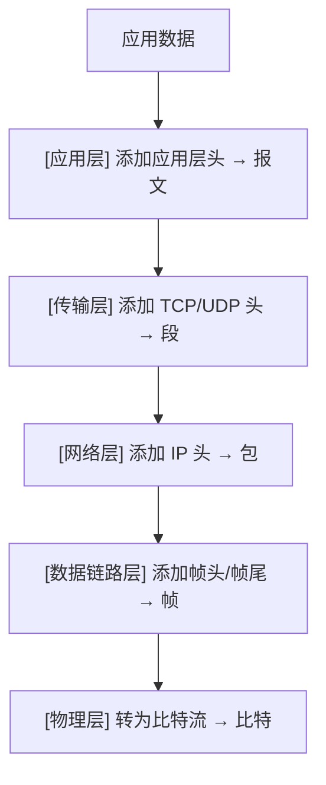
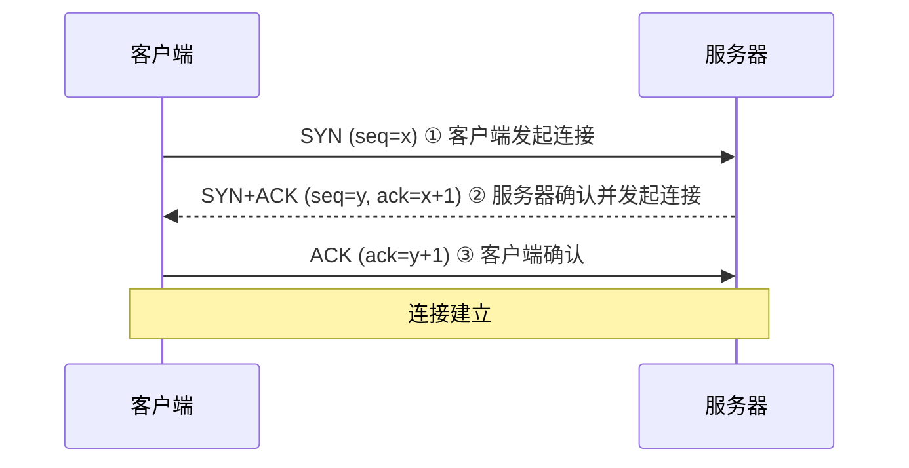
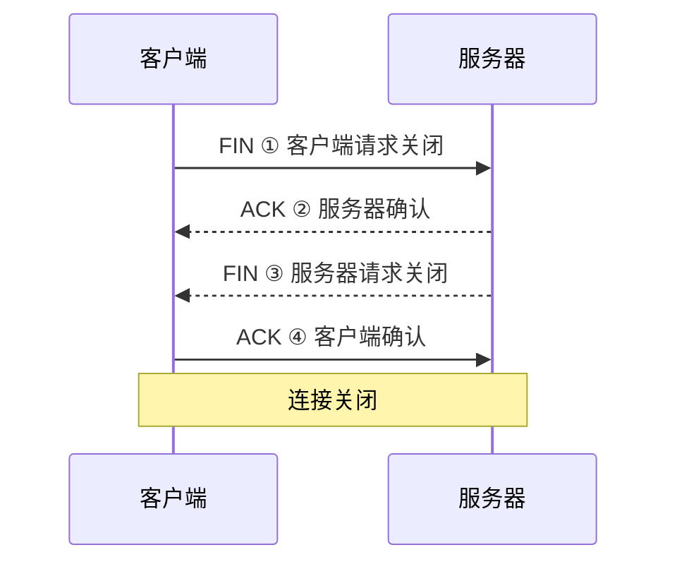
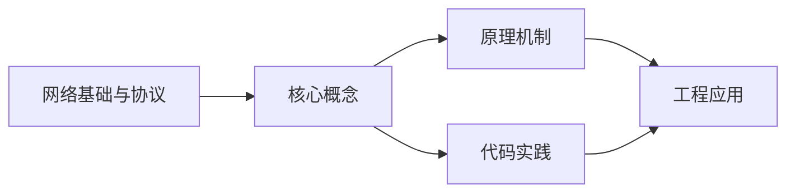

## 1. 学习目标（Bloom 分类）

本节按照布鲁姆教育目标分类学组织学习路径。本文主题为《网络基础与协议》，属于 网络 模块，读者可以根据自身阶段选择阅读深度。

记忆层面：能够准确复述本文的核心概念、术语与基本语法或操作步骤，并能够在提问或检索时快速定位对应知识点。能够说出 网络 的核心概念、组件与标准流程。

理解层面：能够用自己的语言解释核心原理与工作机制，说明概念之间的因果关系，而不是机械记忆结论。能够解释 网络 的工作原理与关键机制。

应用层面：能够在真实项目或练习场景中运用本文知识解决具体问题，写出正确且可维护的实现。能够执行 网络 相关的标准操作与配置。

分析层面：能够拆解复杂问题，比较本文主题与相邻概念的异同，识别边界条件与例外情况。能够分析 网络 方案在可靠性、成本与性能上的权衡。

评价层面：能够根据约束条件（性能、可读性、安全、成本）评价不同方案的优劣，做出有依据的技术决策。能够评价 网络 中的技术选型。

创造层面：能够把本文知识与其他模块知识组合，设计出新的解决方案或可复用的工程模式。能够设计基于 网络 的完整解决方案。

通过本节学习，读者应当能够把《网络基础与协议》纳入自己的知识网络，并与 网络 模块的其他主题（TCP/IP、HTTP、DNS、网络安全、负载均衡）建立关联。

## 2. 历史动机与发展脉络

《网络基础与协议》是 网络 领域的重要主题。要真正理解它，需要先了解它解决的问题与演进过程。

网络是分布式系统的地基：从 ARPANET（1969）到互联网，TCP/IP 协议族（1974 年提出）成为事实标准；HTTP 从 1991 年至今演进到 HTTP/3。
分层模型：OSI 七层与 TCP/IP 四层；每层职责清晰，上层依赖下层服务；理解分层才能定位故障。
现代网络主题：IPv6 过渡、HTTP/2/3、TLS 加密、CDN 与边缘计算、软件定义网络（SDN）。

回到本文主题：网络基础与协议 的提出与成熟，正是上述技术背景下的必然产物。早期实现往往以简单可用为目标，随着工程规模扩大，社区逐渐沉淀出标准做法与最佳实践；理解这一脉络，可以帮助读者判断“为什么文档中的推荐写法是现在这个样子”，也能在遇到历史遗留代码时准确识别其设计年代与取舍。


## 3. 形式化定义与核心概念精讲

本节把《网络基础与协议》涉及的核心概念以“定义 + 讲解”的形式展开。读者应把定义当作工具，把讲解当作理解路径；两者结合才能形成可迁移的知识。

TCP：三次握手建立、四次挥手关闭；可靠传输（序号/确认/重传）、流量控制（滑动窗口）、拥塞控制（慢启动/拥塞避免）。
HTTP：请求-响应模型；方法（GET/POST/PUT/DELETE）、状态码（2xx/3xx/4xx/5xx）、头字段；无状态 + Cookie/Token 会话。
DNS：域名到 IP 的分布式解析，递归与迭代查询，缓存与 TTL；HTTP 层通过域名访问。

### 3.1 原文章节逐一精讲

原文档把主题拆分为 27 个小节，下面按顺序给出每一节的导读讲解，随后保留原文细节供精读。

#### 原文精读（完整保留）

# Networking 网络配置

> **符号约定**：`< >` 必填参数 | `[ ]` 可选参数

---

#### 1. OSI 七层模型

##### 1.1 模型概述

OSI（Open Systems Interconnection）参考模型由 ISO 提出，将网络通信划分为七个层次，每层负责特定功能。

| 层次    | 名称       | 功能               | 数据单元    | 典型协议/设备        |
| :------ | :--------- | :----------------- | :---------- | :------------------- |
| 第 7 层 | 应用层     | 为应用程序提供服务 | 报文        | HTTP、FTP、SMTP、DNS |
| 第 6 层 | 表示层     | 数据格式转换、加密 | 报文        | SSL/TLS、JPEG        |
| 第 5 层 | 会话层     | 建立/管理/终止会话 | 报文        | NetBIOS、RPC         |
| 第 4 层 | 传输层     | 端到端可靠传输     | 段(Segment) | TCP、UDP             |
| 第 3 层 | 网络层     | 路由选择与寻址     | 包(Packet)  | IP、ICMP、路由器     |
| 第 2 层 | 数据链路层 | 帧的封装与传输     | 帧(Frame)   | Ethernet、交换机     |
| 第 1 层 | 物理层     | 比特流的传输       | 比特(Bit)   | 光纤、双绞线、集线器 |

##### 1.2 数据封装过程



#### 2. TCP/IP 协议栈

##### 2.1 TCP 三次握手



##### 2.2 TCP 四次挥手



##### 2.3 常用协议端口

| 协议  | 端口  | 传输层  | 用途     |
| :---- | :---- | :------ | :------- |
| HTTP  | 80    | TCP     | 网页浏览 |
| HTTPS | 443   | TCP     | 安全网页 |
| SSH   | 22    | TCP     | 远程管理 |
| DNS   | 53    | UDP/TCP | 域名解析 |
| DHCP  | 67/68 | UDP     | 地址分配 |
| SMTP  | 25    | TCP     | 邮件发送 |
| FTP   | 20/21 | TCP     | 文件传输 |
| SNMP  | 161   | UDP     | 网络管理 |

#### 3. IPv4/IPv6 地址规划

##### 3.1 IPv4 地址分类

| 类别 | 范围                        | 默认子网掩码  | 网络规模 |
| :--- | :-------------------------- | :------------ | :------- |
| A 类 | 1.0.0.0 ~ 126.255.255.255   | 255.0.0.0     | 大型网络 |
| B 类 | 128.0.0.0 ~ 191.255.255.255 | 255.255.0.0   | 中型网络 |
| C 类 | 192.0.0.0 ~ 223.255.255.255 | 255.255.255.0 | 小型网络 |

**私有地址范围**：

- A 类：`10.0.0.0 ~ 10.255.255.255`
- B 类：`172.16.0.0 ~ 172.31.255.255`
- C 类：`192.168.0.0 ~ 192.168.255.255`

##### 3.2 IPv6 地址

IPv6 地址长度 128 位，使用冒号十六进制表示：

```
2001:0db8:85a3:0000:0000:8a2e:0370:7334
缩写 → 2001:db8:85a3::8a2e:370:7334
```

| 类型     | 前缀      | 说明               |
| :------- | :-------- | :----------------- |
| 单播     | 全球路由  | 可路由的公网地址   |
| 链路本地 | fe80::/10 | 同一链路通信       |
| 唯一本地 | fc00::/7  | 等同 IPv4 私有地址 |
| 组播     | ff00::/8  | 一对多通信         |

#### 4. 子网划分

##### 4.1 子网掩码计算

```
IP 地址:    192.168.1.0/24
子网掩码:   255.255.255.0
主机位数:   32 - 24 = 8
可用主机数: 2^8 - 2 = 254

划分为 4 个子网（借 2 位）：
子网1: 192.168.1.0/26    范围: .1 ~ .62      广播: .63
子网2: 192.168.1.64/26   范围: .65 ~ .126    广播: .127
子网3: 192.168.1.128/26  范围: .129 ~ .190   广播: .191
子网4: 192.168.1.192/26  范围: .193 ~ .254   广播: .255
```

##### 4.2 VLSM 可变长子网掩码

VLSM 允许在同一网络中使用不同长度的子网掩码，提高地址利用率：

```
需求: 3 个子网，分别需要 50、20、10 台主机

子网1 (50台): 192.168.1.0/26   → 62 台主机
子网2 (20台): 192.168.1.64/27  → 30 台主机
子网3 (10台): 192.168.1.96/28  → 14 台主机
剩余:        192.168.1.112/28 → 可继续分配
```

#### 5. 路由协议

##### 5.1 静态路由

```bash
# 华为设备配置静态路由
[Huawei] ip route-static 10.1.2.0 255.255.255.0 10.1.1.2

# Cisco 设备配置静态路由
Router(config)# ip route 10.1.2.0 255.255.255.0 10.1.1.2

# 默认路由
[Huawei] ip route-static 0.0.0.0 0.0.0.0 192.168.1.1
```

##### 5.2 动态路由协议对比

| 协议 | 类型     | 算法         | 管理距离 | 适用场景      |
| :--- | :------- | :----------- | :------- | :------------ |
| RIP  | 距离矢量 | Bellman-Ford | 120      | 小型网络      |
| OSPF | 链路状态 | Dijkstra     | 110      | 中大型网络    |
| BGP  | 路径矢量 | 最佳路径选择 | 20/200   | 互联网/企业间 |

##### 5.3 OSPF 配置

```bash
# 华为设备 OSPF 配置
[Huawei] ospf 1 router-id 1.1.1.1
[Huawei-ospf-1] area 0
[Huawei-ospf-1-area-0.0.0.0] network 10.1.1.0 0.0.0.255
[Huawei-ospf-1-area-0.0.0.0] network 10.1.2.0 0.0.0.255

# 查看 OSPF 邻居
[Huawei] display ospf peer
```

##### 5.4 BGP 基础配置

```bash
# 华为设备 BGP 配置
[Huawei] bgp 65001
[Huawei-bgp] router-id 1.1.1.1
[Huawei-bgp] peer 10.1.1.2 as-number 65002
[Huawei-bgp] ipv4-family unicast
[Huawei-bgp-af-ipv4] peer 10.1.1.2 enable
[Huawei-bgp-af-ipv4] network 192.168.1.0 255.255.255.0
```

#### 6. VLAN 划分

##### 6.1 VLAN 原理

VLAN（Virtual Local Area Network）将物理局域网在逻辑上划分为多个广播域，减少广播流量、提高安全性。

```bash
# 华为交换机 VLAN 配置
[Switch] vlan batch 10 20 30          # 批量创建 VLAN
[Switch] interface GigabitEthernet0/0/1
[Switch-GE0/0/1] port link-type access
[Switch-GE0/0/1] port default vlan 10

# Trunk 链路配置
[Switch] interface GigabitEthernet0/0/24
[Switch-GE0/0/24] port link-type trunk
[Switch-GE0/0/24] port trunk allow-pass vlan 10 20 30
```

##### 6.2 VLAN 间路由

```bash
# 华为交换机 VLANIF 接口配置
[Switch] interface Vlanif10
[Switch-Vlanif10] ip address 192.168.10.1 24
[Switch] interface Vlanif20
[Switch-Vlanif20] ip address 192.168.20.1 24
```

#### 7. 生成树技术

##### 7.1 STP/RSTP/MSTP

| 协议 | 收敛速度 | 特点                        |
| :--- | :------- | :-------------------------- |
| STP  | 30~50 秒 | IEEE 802.1D，消除环路       |
| RSTP | 1~3 秒   | IEEE 802.1w，快速收敛       |
| MSTP | 1~3 秒   | IEEE 802.1s，多实例负载均衡 |

```bash
# 华为设备 MSTP 配置
[Switch] stp mode mstp
[Switch] stp region-configuration
[Switch-mst-region] region-name RG1
[Switch-mst-region] instance 1 vlan 10 20
[Switch-mst-region] instance 2 vlan 30 40
[Switch-mst-region] active region-configuration

# 设置根桥
[Switch] stp instance 1 root primary
[Switch] stp instance 2 root secondary
```

#### 8. 链路聚合

链路聚合（Eth-Trunk）将多条物理链路捆绑为一条逻辑链路，提高带宽和可靠性。

```bash
# 华为设备链路聚合配置
[Switch] interface Eth-Trunk 1
[Switch-Eth-Trunk1] mode lacp-static
[Switch-Eth-Trunk1] trunkport GigabitEthernet0/0/1
[Switch-Eth-Trunk1] trunkport GigabitEthernet0/0/2
[Switch-Eth-Trunk1] port link-type trunk
[Switch-Eth-Trunk1] port trunk allow-pass vlan all

# 查看 Eth-Trunk 状态
[Switch] display eth-trunk 1
```

#### 9. VRRP 协议

VRRP（Virtual Router Redundancy Protocol）实现网关冗余，多台路由器组成虚拟路由器。

```bash
# 华为设备 VRRP 配置
[RouterA] interface Vlanif10
[RouterA-Vlanif10] ip address 192.168.10.1 24
[RouterA-Vlanif10] vrrp vrid 1 virtual-ip 192.168.10.254
[RouterA-Vlanif10] vrrp vrid 1 priority 120    # 主设备优先级更高
[RouterA-Vlanif10] vrrp vrid 1 preempt-mode timer delay 20

[RouterB] interface Vlanif10
[RouterB-Vlanif10] ip address 192.168.10.2 24
[RouterB-Vlanif10] vrrp vrid 1 virtual-ip 192.168.10.254
[RouterB-Vlanif10] vrrp vrid 1 priority 100    # 备设备默认优先级
```

#### 10. 广域网与隧道技术

##### 10.1 广域网技术

| 技术        | 速率 | 特点                 |
| :---------- | :--- | :------------------- |
| PPP         | 可变 | 点对点协议，支持认证 |
| HDLC        | 可变 | 高级数据链路控制     |
| Frame Relay | 可变 | 帧中继，已逐渐淘汰   |
| MPLS        | 高速 | 多协议标签交换       |

##### 10.2 GRE 隧道

```bash
# 华为设备 GRE 隧道配置
[RouterA] interface Tunnel0/0/1
[RouterA-Tunnel0/0/1] tunnel-protocol gre
[RouterA-Tunnel0/0/1] source 202.1.1.1
[RouterA-Tunnel0/0/1] destination 202.1.2.1
[RouterA-Tunnel0/0/1] ip address 10.1.1.1 30
```

#### 11. ACL 访问控制列表

```bash
# 基本 ACL（基于源地址）
[Router] acl 2000
[Router-acl-basic-2000] rule 5 permit source 192.168.1.0 0.0.0.255
[Router-acl-basic-2000] rule 10 deny source any

# 高级 ACL（基于五元组）
[Router] acl 3000
[Router-acl-adv-3000] rule 5 permit tcp source 192.168.1.0 0.0.0.255 \
  destination 10.1.1.0 0.0.0.255 destination-port eq 80
[Router-acl-adv-3000] rule 10 deny ip source any destination any

# 应用 ACL
[Router] interface GigabitEthernet0/0/1
[Router-GE0/0/1] traffic-filter inbound acl 3000
```

#### 12. SSH 安全配置

```bash
# 华为设备 SSH 配置
[Huawei] rsa local-key-pair create       # 生成 RSA 密钥对
[Huawei] aaa
[Huawei-aaa] local-user admin password cipher Admin@123
[Huawei-aaa] local-user admin service-type ssh
[Huawei-aaa] local-user admin privilege level 15
[Huawei] user-interface vty 0 4
[Huawei-ui-vty0-4] authentication-mode aaa
[Huawei-ui-vty0-4] protocol inbound ssh
[Huawei] stelnet server enable
```

#### 13. SNMP 协议

```bash
# 华为设备 SNMP 配置
[Huawei] snmp-agent community read Public@123
[Huawei] snmp-agent community write Private@123
[Huawei] snmp-agent sys-info version v2c
[Huawei] snmp-agent target-host trap address udp-domain 192.168.1.100 \
  params securityname Public@123
[Huawei] snmp-agent trap enable
```

| SNMP 版本 | 认证方式     | 安全性 |
| :-------- | :----------- | :----- |
| v1        | 团体名       | 低     |
| v2c       | 团体名       | 低     |
| v3        | USM 用户认证 | 高     |

#### 14. NAPT 网络地址端口转换

```bash
# 华为设备 NAPT 配置
[Router] acl 2000
[Router-acl-basic-2000] rule 5 permit source 192.168.1.0 0.0.0.255
[Router] nat address-group 1 202.1.1.10 202.1.1.20
[Router] interface GigabitEthernet0/0/1
[Router-GE0/0/1] nat outbound 2000 address-group 1

# Easy IP（直接使用接口地址）
[Router] interface GigabitEthernet0/0/1
[Router-GE0/0/1] nat outbound 2000
```

#### 15. Web Portal 认证

```bash
# 华为设备 Portal 认证配置
[Switch] portal free-rule 0 destination ip 192.168.1.100 mask 255.255.255.255
[Switch] portal web-server Server1
[Switch-portal-web-server-Server1] url http://192.168.1.100/portal
[Switch] interface Vlanif10
[Switch-Vlanif10] web-auth-server Server1 direct
```

#### 16. VPN 与 IPsec

##### 16.1 IPsec 协议体系

| 组件     | 协议            | 功能            |
| :------- | :-------------- | :-------------- |
| 安全协议 | AH / ESP        | 数据完整性/加密 |
| 密钥管理 | IKEv1 / IKEv2   | 协商安全参数    |
| 加密算法 | AES / 3DES      | 数据加密        |
| 认证算法 | SHA2 / MD5      | 完整性验证      |
| DH 组    | Group 2/5/14/24 | 密钥交换        |

##### 16.2 IPsec VPN 配置

```bash
# 华为设备 IPsec VPN 配置
# 1. 定义感兴趣流
[Router] acl 3001
[Router-acl-adv-3001] rule 5 permit ip source 192.168.1.0 0.0.0.255 \
  destination 10.1.1.0 0.0.0.255

# 2. IKE 提议
[Router] ike proposal 1
[Router-ike-proposal-1] encryption-algorithm aes-256
[Router-ike-proposal-1] dh group14
[Router-ike-proposal-1] authentication-algorithm sha2-256

# 3. IKE 对等体
[Router] ike peer Peer1 v2
[Router-ike-peer-Peer1] ike-proposal 1
[Router-ike-peer-Peer1] pre-shared-key cipher Key@123
[Router-ike-peer-Peer1] remote-address 202.1.2.1

# 4. IPsec 提议
[Router] ipsec proposal Prop1
[Router-ipsec-proposal-Prop1] encapsulation-mode tunnel
[Router-ipsec-proposal-Prop1] transform esp
[Router-ipsec-proposal-Prop1] esp authentication-algorithm sha2-256
[Router-ipsec-proposal-Prop1] esp encryption-algorithm aes-256

# 5. IPsec 策略
[Router] ipsec policy Policy1 10 isakmp
[Router-ipsec-policy-isakmp-Policy1-10] ike-peer Peer1
[Router-ipsec-policy-isakmp-Policy1-10] proposal Prop1
[Router-ipsec-policy-isakmp-Policy1-10] security acl 3001

# 6. 应用策略
[Router] interface GigabitEthernet0/0/1
[Router-GE0/0/1] ipsec policy Policy1
```
#### ifconfig 接口配置

**基本写法：查看所有接口**
`ifconfig`
```bash
# 查看所有网络接口
ifconfig
```

**基本写法：查看指定接口**
`ifconfig <接口>`
```bash
# 查看 eth0 接口信息
ifconfig eth0
```

**基本写法：配置 IP 地址**
`ifconfig <接口> <IP> netmask <掩码>`
```bash
# 配置 eth0 的 IP 地址
ifconfig eth0 192.168.1.100 netmask 255.255.255.0
```

**基本写法：启用接口**
`ifconfig <接口> up`
```bash
# 启用 eth0 接口
ifconfig eth0 up
```

**基本写法：禁用接口**
`ifconfig <接口> down`
```bash
# 禁用 eth0 接口
ifconfig eth0 down
```

**基本写法：设置 MTU**
`ifconfig <接口> mtu <大小>`
```bash
# 设置 MTU 为 1500
ifconfig eth0 mtu 1500
```

---

#### route 路由配置

**基本写法：查看路由表**
`route -n`
```bash
# 数字格式查看路由表
route -n
```

**基本写法：添加默认网关**
`route add default gw <网关>`
```bash
# 添加默认网关
route add default gw 192.168.1.1
```

**基本写法：添加静态路由**
`route add -net <网络> netmask <掩码> gw <网关>`
```bash
# 添加到 10.0.0.0/24 的路由
route add -net 10.0.0.0 netmask 255.255.255.0 gw 192.168.1.254
```

**基本写法：删除路由**
`route del -net <网络> netmask <掩码>`
```bash
# 删除指定路由
route del -net 10.0.0.0 netmask 255.255.255.0
```

**基本写法：通过接口添加路由**
`route add -net <网络> dev <接口>`
```bash
# 通过 eth1 接口添加路由
route add -net 172.16.0.0/16 dev eth1
```

---

#### 静态 IP 配置

**基本写法：配置静态 IP（Netplan）**
```yaml
`network:
  version: 2
  ethernets:
    <接口>:
      addresses: [<IP>/<前缀>]
      gateway4: <网关>
      nameservers:
        addresses: [<DNS>]`
```
```yaml
# Ubuntu Netplan 静态 IP 配置
network:
  version: 2
  ethernets:
    eth0:
      addresses: [192.168.1.100/24]
      gateway4: 192.168.1.1
      nameservers:
        addresses: [8.8.8.8, 8.8.4.4]
```

**基本写法：应用 Netplan 配置**
`netplan apply`
```bash
# 应用 Netplan 配置
netplan apply
```

**基本写法：配置静态 IP（ifupdown）**
```bash
`auto <接口>
iface <接口> inet static
    address <IP>
    netmask <掩码>
    gateway <网关>`
```
```bash
# /etc/network/interfaces 配置
auto eth0
iface eth0 inet static
    address 192.168.1.100
    netmask 255.255.255.0
    gateway 192.168.1.1
```

**基本写法：重启网络服务**
`systemctl restart networking`
```bash
# 重启网络服务
systemctl restart networking
```

---

#### DHCP 配置

**基本写法：DHCP 获取 IP**
`dhclient <接口>`
```bash
# 通过 DHCP 获取 IP 地址
dhclient eth0
```

**基本写法：释放 DHCP 租约**
`dhclient -r <接口>`
```bash
# 释放 DHCP 租约
dhclient -r eth0
```

**基本写法：配置 DHCP（Netplan）**
```yaml
`network:
  version: 2
  ethernets:
    <接口>:
      dhcp4: true`
```
```yaml
# Netplan DHCP 配置
network:
  version: 2
  ethernets:
    eth0:
      dhcp4: true
      dhcp6: true
```

---

#### DNS 配置

**基本写法：查看当前 DNS**
`cat /etc/resolv.conf`
```bash
# 查看当前 DNS 配置
cat /etc/resolv.conf
```

**基本写法：设置 DNS 服务器**
`# 编辑 /etc/resolv.conf`
```bash
# 设置 DNS 服务器
echo "nameserver 8.8.8.8" > /etc/resolv.conf
echo "nameserver 8.8.4.4" >> /etc/resolv.conf
```

**基本写法：设置 DNS 搜索域**
`# 编辑 /etc/resolv.conf`
```bash
# 设置搜索域
echo "search example.com" >> /etc/resolv.conf
```

**基本写法：使用 systemd-resolved 配置**
`# 编辑 /etc/systemd/resolved.conf`
```bash
# 配置 systemd-resolved
echo "DNS=8.8.8.8 8.8.4.4" >> /etc/systemd/resolved.conf
systemctl restart systemd-resolved
```

---

#### ethtool 网卡工具

**基本写法：查看网卡信息**
`ethtool <接口>`
```bash
# 查看 eth0 网卡信息
ethtool eth0
```

**基本写法：查看网卡驱动**
`ethtool -i <接口>`
```bash
# 查看网卡驱动信息
ethtool -i eth0
```

**基本写法：查看网卡统计**
`ethtool -S <接口>`
```bash
# 查看网卡统计信息
ethtool -S eth0
```

**基本写法：设置网卡速率**
`ethtool -s <接口> speed <速率> duplex <模式>`
```bash
# 设置网卡为 1000M 全双工
ethtool -s eth0 speed 1000 duplex full autoneg off
```

**基本写法：查看网卡支持的特性**
`ethtool -k <接口>`
```bash
# 查看网卡支持的卸载特性
ethtool -k eth0
```

---

#### 网络接口聚合

**基本写法：创建 bond 接口**
```bash
`modprobe bonding
ip link add bond0 type bond
ip link set eth0 master bond0
ip link set eth1 master bond0`
```
```bash
# 创建 bond0 聚合接口
modprobe bonding
ip link add bond0 type bond
ip link set eth0 master bond0
ip link set eth1 master bond0
ip link set bond0 up
```

**基本写法：配置 bond 模式**
`# /etc/modprobe.d/bonding.conf`
```bash
# 配置 bond 模式为 802.3ad
echo "options bonding mode=4 miimon=100" > /etc/modprobe.d/bonding.conf
```

---

#### 网络命名规范

**基本写法：查看接口命名规则**
`ip link show`
```bash
# 查看所有网络接口
ip link show
```

**基本写法：重命名网络接口**
```bash
`ip link set <接口> down
ip link set <接口> name <新名称>
ip link set <新名称> up`
```
```bash
# 重命名 eth0 为 wan0
ip link set eth0 down
ip link set eth0 name wan0
ip link set wan0 up
```

---

#### NetworkManager 管理

**基本写法：查看 nmcli 状态**
`nmcli general status`
```bash
# 查看 NetworkManager 状态
nmcli general status
```

**基本写法：查看所有连接**
`nmcli connection show`
```bash
# 列出所有网络连接
nmcli connection show
```

**基本写法：查看设备状态**
`nmcli device status`
```bash
# 查看所有网络设备状态
nmcli device status
```

**基本写法：配置静态 IP**
`nmcli connection modify <连接> ipv4.addresses <IP>/<前缀> ipv4.gateway <网关> ipv4.method manual`
```bash
# 配置静态 IP
nmcli connection modify eth0 ipv4.addresses 192.168.1.100/24 ipv4.gateway 192.168.1.1 ipv4.method manual
```

**基本写法：配置 DNS**
`nmcli connection modify <连接> ipv4.dns "<DNS1> <DNS2>"`
```bash
# 配置 DNS 服务器
nmcli connection modify eth0 ipv4.dns "8.8.8.8 8.8.4.4"
```

**基本写法：启用连接**
`nmcli connection up <连接>`
```bash
# 启用网络连接
nmcli connection up eth0
```

---

#### 网络故障排查

**基本写法：查看网络接口状态**
`ip -s link`
```bash
# 查看接口统计信息
ip -s link
```

**基本写法：检查网关连通性**
`ping -c 3 <网关>`
```bash
# 测试网关连通性
ping -c 3 192.168.1.1
```

**基本写法：检查 DNS 解析**
`nslookup <域名>`
```bash
# 测试 DNS 解析
nslookup example.com
```

**基本写法：查看路由路径**
`traceroute 8.8.8.8`
```bash
# 追踪到外网的路由
traceroute 8.8.8.8
```

**基本写法：重置网络配置**
`systemctl restart NetworkManager`
```bash
# 重启网络管理服务
systemctl restart NetworkManager
```

---

#### IPv6 配置

**基本写法：查看 IPv6 地址**
`ip -6 addr`
```bash
# 查看所有 IPv6 地址
ip -6 addr
```

**基本写法：添加 IPv6 地址**
`ip -6 addr add <IPv6>/<前缀> dev <接口>`
```bash
# 添加 IPv6 地址
ip -6 addr add 2001:db8::100/64 dev eth0
```

**基本写法：查看 IPv6 路由**
`ip -6 route`
```bash
# 查看 IPv6 路由表
ip -6 route
```

**基本写法：禁用 IPv6**
`# /etc/sysctl.conf`
```bash
# 禁用 IPv6
echo "net.ipv6.conf.all.disable_ipv6 = 1" >> /etc/sysctl.conf
echo "net.ipv6.conf.default.disable_ipv6 = 1" >> /etc/sysctl.conf
sysctl -p
```


### 3.2 概念关系图

下面用 Mermaid 图表达本文核心概念之间的关系，帮助读者建立整体图景：



图中展示的是本文知识的结构化关系：核心概念是入口，原理机制解释“为什么”，代码实践演示“怎么做”，工程应用回答“何时用”。读者学习时可以把每个小节的内容挂接到对应节点上。

## 4. 理论推导与原理解析

本节深入《网络基础与协议》背后的原理。理论部分不求面面俱到，而是聚焦“能解释现象、能指导实践”的关键推导。

TCP：三次握手建立、四次挥手关闭；可靠传输（序号/确认/重传）、流量控制（滑动窗口）、拥塞控制（慢启动/拥塞避免）。
HTTP：请求-响应模型；方法（GET/POST/PUT/DELETE）、状态码（2xx/3xx/4xx/5xx）、头字段；无状态 + Cookie/Token 会话。
DNS：域名到 IP 的分布式解析，递归与迭代查询，缓存与 TTL；HTTP 层通过域名访问。
TLS：握手协商密钥（证书 + 密钥交换），加密传输，防窃听防篡改；HTTPS 是 HTTP + TLS。

需要强调的是，理论推导与工程实践之间存在翻译层：理论给出的是理想化模型与边界条件，工程代码则必须处理真实环境中的例外。读者在学习时应先掌握理论的“标准情形”，再通过陷阱章节了解“非标准情形”。

## 5. 代码示例与逐行讲解

本节把原文中的代码示例系统整理，并为每个示例补充用途说明与讲解。读者不应只浏览代码，而应逐段对照讲解理解设计意图。

### 5.1 示例：1.2 数据封装过程

该示例来自原文《1.2 数据封装过程》小节，用于演示网络基础与协议相关操作。阅读时请先看代码结构，再看其后的讲解。


讲解：这段代码演示了本节核心知识点。代码中的关键操作可以归纳为三步：准备（定义或初始化）、执行（核心逻辑）、收尾（释放资源或返回结果）。实际项目中，这三步往往被封装为函数或类，以提升复用性与可测试性。

关键点分析：

该示例共 12 行有效代码，结构以数据或配置为主。阅读时应关注：数据字段的含义、配置项的作用，以及它们与运行行为的对应关系。

进阶思考路径：先尝试修改参数观察行为变化，再把示例中的模式迁移到自己的项目中；每次修改都记录预期与实测差异，这是把示例转化为能力的最快方式。

### 5.2 示例：2.1 TCP 三次握手

该示例来自原文《2.1 TCP 三次握手》小节，用于演示网络基础与协议相关操作。阅读时请先看代码结构，再看其后的讲解。


讲解：这段代码演示了本节核心知识点。代码中的关键操作可以归纳为三步：准备（定义或初始化）、执行（核心逻辑）、收尾（释放资源或返回结果）。实际项目中，这三步往往被封装为函数或类，以提升复用性与可测试性。

关键点分析：

该示例共 7 行有效代码，结构以数据或配置为主。阅读时应关注：数据字段的含义、配置项的作用，以及它们与运行行为的对应关系。

进阶思考路径：先尝试修改参数观察行为变化，再把示例中的模式迁移到自己的项目中；每次修改都记录预期与实测差异，这是把示例转化为能力的最快方式。

### 5.3 示例：2.2 TCP 四次挥手

该示例来自原文《2.2 TCP 四次挥手》小节，用于演示网络基础与协议相关操作。阅读时请先看代码结构，再看其后的讲解。


讲解：这段代码演示了本节核心知识点。代码中的关键操作可以归纳为三步：准备（定义或初始化）、执行（核心逻辑）、收尾（释放资源或返回结果）。实际项目中，这三步往往被封装为函数或类，以提升复用性与可测试性。

关键点分析：

该示例共 8 行有效代码，结构以数据或配置为主。阅读时应关注：数据字段的含义、配置项的作用，以及它们与运行行为的对应关系。

进阶思考路径：先尝试修改参数观察行为变化，再把示例中的模式迁移到自己的项目中；每次修改都记录预期与实测差异，这是把示例转化为能力的最快方式。

### 5.4 示例：3.2 IPv6 地址

该示例来自原文《3.2 IPv6 地址》小节，用于演示网络基础与协议相关操作。阅读时请先看代码结构，再看其后的讲解。

```text
2001:0db8:85a3:0000:0000:8a2e:0370:7334
缩写 → 2001:db8:85a3::8a2e:370:7334
```

讲解：这段代码演示了本节核心知识点。代码中的关键操作可以归纳为三步：准备（定义或初始化）、执行（核心逻辑）、收尾（释放资源或返回结果）。实际项目中，这三步往往被封装为函数或类，以提升复用性与可测试性。

关键点分析：

该示例共 2 行有效代码，结构以数据或配置为主。阅读时应关注：数据字段的含义、配置项的作用，以及它们与运行行为的对应关系。

进阶思考路径：先尝试修改参数观察行为变化，再把示例中的模式迁移到自己的项目中；每次修改都记录预期与实测差异，这是把示例转化为能力的最快方式。

### 5.5 示例：4.1 子网掩码计算

该示例来自原文《4.1 子网掩码计算》小节，用于演示网络基础与协议相关操作。阅读时请先看代码结构，再看其后的讲解。

```text
IP 地址:    192.168.1.0/24
子网掩码:   255.255.255.0
主机位数:   32 - 24 = 8
可用主机数: 2^8 - 2 = 254

划分为 4 个子网（借 2 位）：
子网1: 192.168.1.0/26    范围: .1 ~ .62      广播: .63
子网2: 192.168.1.64/26   范围: .65 ~ .126    广播: .127
子网3: 192.168.1.128/26  范围: .129 ~ .190   广播: .191
子网4: 192.168.1.192/26  范围: .193 ~ .254   广播: .255
```

讲解：这段代码演示了本节核心知识点。代码中的关键操作可以归纳为三步：准备（定义或初始化）、执行（核心逻辑）、收尾（释放资源或返回结果）。实际项目中，这三步往往被封装为函数或类，以提升复用性与可测试性。

关键点分析：

该示例共 9 行有效代码，结构以数据或配置为主。阅读时应关注：数据字段的含义、配置项的作用，以及它们与运行行为的对应关系。

进阶思考路径：先尝试修改参数观察行为变化，再把示例中的模式迁移到自己的项目中；每次修改都记录预期与实测差异，这是把示例转化为能力的最快方式。

### 5.6 示例：4.2 VLSM 可变长子网掩码

该示例来自原文《4.2 VLSM 可变长子网掩码》小节，用于演示网络基础与协议相关操作。阅读时请先看代码结构，再看其后的讲解。

```text
需求: 3 个子网，分别需要 50、20、10 台主机

子网1 (50台): 192.168.1.0/26   → 62 台主机
子网2 (20台): 192.168.1.64/27  → 30 台主机
子网3 (10台): 192.168.1.96/28  → 14 台主机
剩余:        192.168.1.112/28 → 可继续分配
```

讲解：这段代码演示了本节核心知识点。代码中的关键操作可以归纳为三步：准备（定义或初始化）、执行（核心逻辑）、收尾（释放资源或返回结果）。实际项目中，这三步往往被封装为函数或类，以提升复用性与可测试性。

关键点分析：

该示例共 5 行有效代码，结构以数据或配置为主。阅读时应关注：数据字段的含义、配置项的作用，以及它们与运行行为的对应关系。

进阶思考路径：先尝试修改参数观察行为变化，再把示例中的模式迁移到自己的项目中；每次修改都记录预期与实测差异，这是把示例转化为能力的最快方式。

### 5.7 示例：5.1 静态路由

该示例来自原文《5.1 静态路由》小节，用于演示网络基础与协议相关操作。阅读时请先看代码结构，再看其后的讲解。

```bash
# 华为设备配置静态路由
[Huawei] ip route-static 10.1.2.0 255.255.255.0 10.1.1.2

# Cisco 设备配置静态路由
Router(config)# ip route 10.1.2.0 255.255.255.0 10.1.1.2

# 默认路由
[Huawei] ip route-static 0.0.0.0 0.0.0.0 192.168.1.1
```

讲解：这段代码演示了本节核心知识点。代码中的关键操作可以归纳为三步：准备（定义或初始化）、执行（核心逻辑）、收尾（释放资源或返回结果）。实际项目中，这三步往往被封装为函数或类，以提升复用性与可测试性。

关键点分析：

该示例共 6 行有效代码，结构以数据或配置为主。阅读时应关注：数据字段的含义、配置项的作用，以及它们与运行行为的对应关系。

进阶思考路径：先尝试修改参数观察行为变化，再把示例中的模式迁移到自己的项目中；每次修改都记录预期与实测差异，这是把示例转化为能力的最快方式。

### 5.8 示例：5.3 OSPF 配置

该示例来自原文《5.3 OSPF 配置》小节，用于演示网络基础与协议相关操作。阅读时请先看代码结构，再看其后的讲解。

```bash
# 华为设备 OSPF 配置
[Huawei] ospf 1 router-id 1.1.1.1
[Huawei-ospf-1] area 0
[Huawei-ospf-1-area-0.0.0.0] network 10.1.1.0 0.0.0.255
[Huawei-ospf-1-area-0.0.0.0] network 10.1.2.0 0.0.0.255

# 查看 OSPF 邻居
[Huawei] display ospf peer
```

讲解：这段代码演示了本节核心知识点。代码中的关键操作可以归纳为三步：准备（定义或初始化）、执行（核心逻辑）、收尾（释放资源或返回结果）。实际项目中，这三步往往被封装为函数或类，以提升复用性与可测试性。

关键点分析：

该示例共 7 行有效代码，结构以数据或配置为主。阅读时应关注：数据字段的含义、配置项的作用，以及它们与运行行为的对应关系。

进阶思考路径：先尝试修改参数观察行为变化，再把示例中的模式迁移到自己的项目中；每次修改都记录预期与实测差异，这是把示例转化为能力的最快方式。

### 5.9 示例：5.4 BGP 基础配置

该示例来自原文《5.4 BGP 基础配置》小节，用于演示网络基础与协议相关操作。阅读时请先看代码结构，再看其后的讲解。

```bash
# 华为设备 BGP 配置
[Huawei] bgp 65001
[Huawei-bgp] router-id 1.1.1.1
[Huawei-bgp] peer 10.1.1.2 as-number 65002
[Huawei-bgp] ipv4-family unicast
[Huawei-bgp-af-ipv4] peer 10.1.1.2 enable
[Huawei-bgp-af-ipv4] network 192.168.1.0 255.255.255.0
```

讲解：这段代码演示了本节核心知识点。代码中的关键操作可以归纳为三步：准备（定义或初始化）、执行（核心逻辑）、收尾（释放资源或返回结果）。实际项目中，这三步往往被封装为函数或类，以提升复用性与可测试性。

关键点分析：

该示例共 7 行有效代码，结构以数据或配置为主。阅读时应关注：数据字段的含义、配置项的作用，以及它们与运行行为的对应关系。

进阶思考路径：先尝试修改参数观察行为变化，再把示例中的模式迁移到自己的项目中；每次修改都记录预期与实测差异，这是把示例转化为能力的最快方式。

### 5.10 示例：6.1 VLAN 原理

该示例来自原文《6.1 VLAN 原理》小节，用于演示网络基础与协议相关操作。阅读时请先看代码结构，再看其后的讲解。

```bash
# 华为交换机 VLAN 配置
[Switch] vlan batch 10 20 30          # 批量创建 VLAN
[Switch] interface GigabitEthernet0/0/1
[Switch-GE0/0/1] port link-type access
[Switch-GE0/0/1] port default vlan 10

# Trunk 链路配置
[Switch] interface GigabitEthernet0/0/24
[Switch-GE0/0/24] port link-type trunk
[Switch-GE0/0/24] port trunk allow-pass vlan 10 20 30
```

讲解：这段代码演示了本节核心知识点。代码中的关键操作可以归纳为三步：准备（定义或初始化）、执行（核心逻辑）、收尾（释放资源或返回结果）。实际项目中，这三步往往被封装为函数或类，以提升复用性与可测试性。

关键点分析：

该示例共 9 行有效代码，结构以数据或配置为主。阅读时应关注：数据字段的含义、配置项的作用，以及它们与运行行为的对应关系。

进阶思考路径：先尝试修改参数观察行为变化，再把示例中的模式迁移到自己的项目中；每次修改都记录预期与实测差异，这是把示例转化为能力的最快方式。

### 5.11 示例：6.2 VLAN 间路由

该示例来自原文《6.2 VLAN 间路由》小节，用于演示网络基础与协议相关操作。阅读时请先看代码结构，再看其后的讲解。

```bash
# 华为交换机 VLANIF 接口配置
[Switch] interface Vlanif10
[Switch-Vlanif10] ip address 192.168.10.1 24
[Switch] interface Vlanif20
[Switch-Vlanif20] ip address 192.168.20.1 24
```

讲解：这段代码演示了本节核心知识点。代码中的关键操作可以归纳为三步：准备（定义或初始化）、执行（核心逻辑）、收尾（释放资源或返回结果）。实际项目中，这三步往往被封装为函数或类，以提升复用性与可测试性。

关键点分析：

该示例共 5 行有效代码，结构以数据或配置为主。阅读时应关注：数据字段的含义、配置项的作用，以及它们与运行行为的对应关系。

进阶思考路径：先尝试修改参数观察行为变化，再把示例中的模式迁移到自己的项目中；每次修改都记录预期与实测差异，这是把示例转化为能力的最快方式。

### 5.12 示例：7.1 STP/RSTP/MSTP

该示例来自原文《7.1 STP/RSTP/MSTP》小节，用于演示网络基础与协议相关操作。阅读时请先看代码结构，再看其后的讲解。

```bash
# 华为设备 MSTP 配置
[Switch] stp mode mstp
[Switch] stp region-configuration
[Switch-mst-region] region-name RG1
[Switch-mst-region] instance 1 vlan 10 20
[Switch-mst-region] instance 2 vlan 30 40
[Switch-mst-region] active region-configuration

# 设置根桥
[Switch] stp instance 1 root primary
[Switch] stp instance 2 root secondary
```

讲解：这段代码演示了本节核心知识点。代码中的关键操作可以归纳为三步：准备（定义或初始化）、执行（核心逻辑）、收尾（释放资源或返回结果）。实际项目中，这三步往往被封装为函数或类，以提升复用性与可测试性。

关键点分析：

该示例共 10 行有效代码，结构以数据或配置为主。阅读时应关注：数据字段的含义、配置项的作用，以及它们与运行行为的对应关系。

进阶思考路径：先尝试修改参数观察行为变化，再把示例中的模式迁移到自己的项目中；每次修改都记录预期与实测差异，这是把示例转化为能力的最快方式。

### 5.13 示例：8. 链路聚合

该示例来自原文《8. 链路聚合》小节，用于演示网络基础与协议相关操作。阅读时请先看代码结构，再看其后的讲解。

```bash
# 华为设备链路聚合配置
[Switch] interface Eth-Trunk 1
[Switch-Eth-Trunk1] mode lacp-static
[Switch-Eth-Trunk1] trunkport GigabitEthernet0/0/1
[Switch-Eth-Trunk1] trunkport GigabitEthernet0/0/2
[Switch-Eth-Trunk1] port link-type trunk
[Switch-Eth-Trunk1] port trunk allow-pass vlan all

# 查看 Eth-Trunk 状态
[Switch] display eth-trunk 1
```

讲解：这段代码演示了本节核心知识点。代码中的关键操作可以归纳为三步：准备（定义或初始化）、执行（核心逻辑）、收尾（释放资源或返回结果）。实际项目中，这三步往往被封装为函数或类，以提升复用性与可测试性。

关键点分析：

该示例共 9 行有效代码，结构以数据或配置为主。阅读时应关注：数据字段的含义、配置项的作用，以及它们与运行行为的对应关系。

进阶思考路径：先尝试修改参数观察行为变化，再把示例中的模式迁移到自己的项目中；每次修改都记录预期与实测差异，这是把示例转化为能力的最快方式。

### 5.14 示例：9. VRRP 协议

该示例来自原文《9. VRRP 协议》小节，用于演示网络基础与协议相关操作。阅读时请先看代码结构，再看其后的讲解。

```bash
# 华为设备 VRRP 配置
[RouterA] interface Vlanif10
[RouterA-Vlanif10] ip address 192.168.10.1 24
[RouterA-Vlanif10] vrrp vrid 1 virtual-ip 192.168.10.254
[RouterA-Vlanif10] vrrp vrid 1 priority 120    # 主设备优先级更高
[RouterA-Vlanif10] vrrp vrid 1 preempt-mode timer delay 20

[RouterB] interface Vlanif10
[RouterB-Vlanif10] ip address 192.168.10.2 24
[RouterB-Vlanif10] vrrp vrid 1 virtual-ip 192.168.10.254
[RouterB-Vlanif10] vrrp vrid 1 priority 100    # 备设备默认优先级
```

讲解：这段代码演示了本节核心知识点。代码中的关键操作可以归纳为三步：准备（定义或初始化）、执行（核心逻辑）、收尾（释放资源或返回结果）。实际项目中，这三步往往被封装为函数或类，以提升复用性与可测试性。

关键点分析：

该示例共 10 行有效代码，结构以数据或配置为主。阅读时应关注：数据字段的含义、配置项的作用，以及它们与运行行为的对应关系。

进阶思考路径：先尝试修改参数观察行为变化，再把示例中的模式迁移到自己的项目中；每次修改都记录预期与实测差异，这是把示例转化为能力的最快方式。

### 5.15 示例：10.2 GRE 隧道

该示例来自原文《10.2 GRE 隧道》小节，用于演示网络基础与协议相关操作。阅读时请先看代码结构，再看其后的讲解。

```bash
# 华为设备 GRE 隧道配置
[RouterA] interface Tunnel0/0/1
[RouterA-Tunnel0/0/1] tunnel-protocol gre
[RouterA-Tunnel0/0/1] source 202.1.1.1
[RouterA-Tunnel0/0/1] destination 202.1.2.1
[RouterA-Tunnel0/0/1] ip address 10.1.1.1 30
```

讲解：这段代码演示了本节核心知识点。代码中的关键操作可以归纳为三步：准备（定义或初始化）、执行（核心逻辑）、收尾（释放资源或返回结果）。实际项目中，这三步往往被封装为函数或类，以提升复用性与可测试性。

关键点分析：

该示例共 6 行有效代码，结构以数据或配置为主。阅读时应关注：数据字段的含义、配置项的作用，以及它们与运行行为的对应关系。

进阶思考路径：先尝试修改参数观察行为变化，再把示例中的模式迁移到自己的项目中；每次修改都记录预期与实测差异，这是把示例转化为能力的最快方式。

### 5.16 示例：11. ACL 访问控制列表

该示例来自原文《11. ACL 访问控制列表》小节，用于演示网络基础与协议相关操作。阅读时请先看代码结构，再看其后的讲解。

```bash
# 基本 ACL（基于源地址）
[Router] acl 2000
[Router-acl-basic-2000] rule 5 permit source 192.168.1.0 0.0.0.255
[Router-acl-basic-2000] rule 10 deny source any

# 高级 ACL（基于五元组）
[Router] acl 3000
[Router-acl-adv-3000] rule 5 permit tcp source 192.168.1.0 0.0.0.255 \
  destination 10.1.1.0 0.0.0.255 destination-port eq 80
[Router-acl-adv-3000] rule 10 deny ip source any destination any

# 应用 ACL
[Router] interface GigabitEthernet0/0/1
[Router-GE0/0/1] traffic-filter inbound acl 3000
```

讲解：这段代码演示了本节核心知识点。代码中的关键操作可以归纳为三步：准备（定义或初始化）、执行（核心逻辑）、收尾（释放资源或返回结果）。实际项目中，这三步往往被封装为函数或类，以提升复用性与可测试性。

关键点分析：

该示例共 12 行有效代码，结构以数据或配置为主。阅读时应关注：数据字段的含义、配置项的作用，以及它们与运行行为的对应关系。

进阶思考路径：先尝试修改参数观察行为变化，再把示例中的模式迁移到自己的项目中；每次修改都记录预期与实测差异，这是把示例转化为能力的最快方式。

### 5.17 示例：12. SSH 安全配置

该示例来自原文《12. SSH 安全配置》小节，用于演示网络基础与协议相关操作。阅读时请先看代码结构，再看其后的讲解。

```bash
# 华为设备 SSH 配置
[Huawei] rsa local-key-pair create       # 生成 RSA 密钥对
[Huawei] aaa
[Huawei-aaa] local-user admin password cipher Admin@123
[Huawei-aaa] local-user admin service-type ssh
[Huawei-aaa] local-user admin privilege level 15
[Huawei] user-interface vty 0 4
[Huawei-ui-vty0-4] authentication-mode aaa
[Huawei-ui-vty0-4] protocol inbound ssh
[Huawei] stelnet server enable
```

讲解：这段代码演示了本节核心知识点。代码中的关键操作可以归纳为三步：准备（定义或初始化）、执行（核心逻辑）、收尾（释放资源或返回结果）。实际项目中，这三步往往被封装为函数或类，以提升复用性与可测试性。

关键点分析：

该示例共 10 行有效代码，结构以数据或配置为主。阅读时应关注：数据字段的含义、配置项的作用，以及它们与运行行为的对应关系。

进阶思考路径：先尝试修改参数观察行为变化，再把示例中的模式迁移到自己的项目中；每次修改都记录预期与实测差异，这是把示例转化为能力的最快方式。

### 5.18 示例：13. SNMP 协议

该示例来自原文《13. SNMP 协议》小节，用于演示网络基础与协议相关操作。阅读时请先看代码结构，再看其后的讲解。

```bash
# 华为设备 SNMP 配置
[Huawei] snmp-agent community read Public@123
[Huawei] snmp-agent community write Private@123
[Huawei] snmp-agent sys-info version v2c
[Huawei] snmp-agent target-host trap address udp-domain 192.168.1.100 \
  params securityname Public@123
[Huawei] snmp-agent trap enable
```

讲解：这段代码演示了本节核心知识点。代码中的关键操作可以归纳为三步：准备（定义或初始化）、执行（核心逻辑）、收尾（释放资源或返回结果）。实际项目中，这三步往往被封装为函数或类，以提升复用性与可测试性。

关键点分析：

该示例共 7 行有效代码，结构以数据或配置为主。阅读时应关注：数据字段的含义、配置项的作用，以及它们与运行行为的对应关系。

进阶思考路径：先尝试修改参数观察行为变化，再把示例中的模式迁移到自己的项目中；每次修改都记录预期与实测差异，这是把示例转化为能力的最快方式。

### 5.19 示例：14. NAPT 网络地址端口转换

该示例来自原文《14. NAPT 网络地址端口转换》小节，用于演示网络基础与协议相关操作。阅读时请先看代码结构，再看其后的讲解。

```bash
# 华为设备 NAPT 配置
[Router] acl 2000
[Router-acl-basic-2000] rule 5 permit source 192.168.1.0 0.0.0.255
[Router] nat address-group 1 202.1.1.10 202.1.1.20
[Router] interface GigabitEthernet0/0/1
[Router-GE0/0/1] nat outbound 2000 address-group 1

# Easy IP（直接使用接口地址）
[Router] interface GigabitEthernet0/0/1
[Router-GE0/0/1] nat outbound 2000
```

讲解：这段代码演示了本节核心知识点。代码中的关键操作可以归纳为三步：准备（定义或初始化）、执行（核心逻辑）、收尾（释放资源或返回结果）。实际项目中，这三步往往被封装为函数或类，以提升复用性与可测试性。

关键点分析：

该示例共 9 行有效代码，结构以数据或配置为主。阅读时应关注：数据字段的含义、配置项的作用，以及它们与运行行为的对应关系。

进阶思考路径：先尝试修改参数观察行为变化，再把示例中的模式迁移到自己的项目中；每次修改都记录预期与实测差异，这是把示例转化为能力的最快方式。

### 5.20 示例：15. Web Portal 认证

该示例来自原文《15. Web Portal 认证》小节，用于演示网络基础与协议相关操作。阅读时请先看代码结构，再看其后的讲解。

```bash
# 华为设备 Portal 认证配置
[Switch] portal free-rule 0 destination ip 192.168.1.100 mask 255.255.255.255
[Switch] portal web-server Server1
[Switch-portal-web-server-Server1] url http://192.168.1.100/portal
[Switch] interface Vlanif10
[Switch-Vlanif10] web-auth-server Server1 direct
```

讲解：这段代码演示了本节核心知识点。代码中的关键操作可以归纳为三步：准备（定义或初始化）、执行（核心逻辑）、收尾（释放资源或返回结果）。实际项目中，这三步往往被封装为函数或类，以提升复用性与可测试性。

关键点分析：

该示例共 6 行有效代码，结构以数据或配置为主。阅读时应关注：数据字段的含义、配置项的作用，以及它们与运行行为的对应关系。

进阶思考路径：先尝试修改参数观察行为变化，再把示例中的模式迁移到自己的项目中；每次修改都记录预期与实测差异，这是把示例转化为能力的最快方式。

### 5.21 示例：16.2 IPsec VPN 配置

该示例来自原文《16.2 IPsec VPN 配置》小节，用于演示网络基础与协议相关操作。阅读时请先看代码结构，再看其后的讲解。

```bash
# 华为设备 IPsec VPN 配置
# 1. 定义感兴趣流
[Router] acl 3001
[Router-acl-adv-3001] rule 5 permit ip source 192.168.1.0 0.0.0.255 \
  destination 10.1.1.0 0.0.0.255

# 2. IKE 提议
[Router] ike proposal 1
[Router-ike-proposal-1] encryption-algorithm aes-256
[Router-ike-proposal-1] dh group14
[Router-ike-proposal-1] authentication-algorithm sha2-256

# 3. IKE 对等体
[Router] ike peer Peer1 v2
[Router-ike-peer-Peer1] ike-proposal 1
[Router-ike-peer-Peer1] pre-shared-key cipher Key@123
[Router-ike-peer-Peer1] remote-address 202.1.2.1

# 4. IPsec 提议
[Router] ipsec proposal Prop1
[Router-ipsec-proposal-Prop1] encapsulation-mode tunnel
[Router-ipsec-proposal-Prop1] transform esp
[Router-ipsec-proposal-Prop1] esp authentication-algorithm sha2-256
[Router-ipsec-proposal-Prop1] esp encryption-algorithm aes-256

# 5. IPsec 策略
[Router] ipsec policy Policy1 10 isakmp
[Router-ipsec-policy-isakmp-Policy1-10] ike-peer Peer1
[Router-ipsec-policy-isakmp-Policy1-10] proposal Prop1
[Router-ipsec-policy-isakmp-Policy1-10] security acl 3001

# 6. 应用策略
[Router] interface GigabitEthernet0/0/1
[Router-GE0/0/1] ipsec policy Policy1
```

讲解：这段代码演示了本节核心知识点。代码中的关键操作可以归纳为三步：准备（定义或初始化）、执行（核心逻辑）、收尾（释放资源或返回结果）。实际项目中，这三步往往被封装为函数或类，以提升复用性与可测试性。

关键点分析：

该示例共 29 行有效代码，结构以数据或配置为主。阅读时应关注：数据字段的含义、配置项的作用，以及它们与运行行为的对应关系。

进阶思考路径：先尝试修改参数观察行为变化，再把示例中的模式迁移到自己的项目中；每次修改都记录预期与实测差异，这是把示例转化为能力的最快方式。

### 5.22 示例：ifconfig 接口配置

该示例来自原文《ifconfig 接口配置》小节，用于演示网络基础与协议相关操作。阅读时请先看代码结构，再看其后的讲解。

```bash
# 查看所有网络接口
ifconfig
```

讲解：这段代码演示了本节核心知识点。代码中的关键操作可以归纳为三步：准备（定义或初始化）、执行（核心逻辑）、收尾（释放资源或返回结果）。实际项目中，这三步往往被封装为函数或类，以提升复用性与可测试性。

关键点分析：

该示例共 2 行有效代码，结构以数据或配置为主。阅读时应关注：数据字段的含义、配置项的作用，以及它们与运行行为的对应关系。

进阶思考路径：先尝试修改参数观察行为变化，再把示例中的模式迁移到自己的项目中；每次修改都记录预期与实测差异，这是把示例转化为能力的最快方式。

### 5.23 示例：ifconfig 接口配置

该示例来自原文《ifconfig 接口配置》小节，用于演示网络基础与协议相关操作。阅读时请先看代码结构，再看其后的讲解。

```bash
# 查看 eth0 接口信息
ifconfig eth0
```

讲解：这段代码演示了本节核心知识点。代码中的关键操作可以归纳为三步：准备（定义或初始化）、执行（核心逻辑）、收尾（释放资源或返回结果）。实际项目中，这三步往往被封装为函数或类，以提升复用性与可测试性。

关键点分析：

该示例共 2 行有效代码，结构以数据或配置为主。阅读时应关注：数据字段的含义、配置项的作用，以及它们与运行行为的对应关系。

进阶思考路径：先尝试修改参数观察行为变化，再把示例中的模式迁移到自己的项目中；每次修改都记录预期与实测差异，这是把示例转化为能力的最快方式。

### 5.24 示例：ifconfig 接口配置

该示例来自原文《ifconfig 接口配置》小节，用于演示网络基础与协议相关操作。阅读时请先看代码结构，再看其后的讲解。

```bash
# 配置 eth0 的 IP 地址
ifconfig eth0 192.168.1.100 netmask 255.255.255.0
```

讲解：这段代码演示了本节核心知识点。代码中的关键操作可以归纳为三步：准备（定义或初始化）、执行（核心逻辑）、收尾（释放资源或返回结果）。实际项目中，这三步往往被封装为函数或类，以提升复用性与可测试性。

关键点分析：

该示例共 2 行有效代码，结构以数据或配置为主。阅读时应关注：数据字段的含义、配置项的作用，以及它们与运行行为的对应关系。

进阶思考路径：先尝试修改参数观察行为变化，再把示例中的模式迁移到自己的项目中；每次修改都记录预期与实测差异，这是把示例转化为能力的最快方式。

### 5.25 示例：ifconfig 接口配置

该示例来自原文《ifconfig 接口配置》小节，用于演示网络基础与协议相关操作。阅读时请先看代码结构，再看其后的讲解。

```bash
# 启用 eth0 接口
ifconfig eth0 up
```

讲解：这段代码演示了本节核心知识点。代码中的关键操作可以归纳为三步：准备（定义或初始化）、执行（核心逻辑）、收尾（释放资源或返回结果）。实际项目中，这三步往往被封装为函数或类，以提升复用性与可测试性。

关键点分析：

该示例共 2 行有效代码，结构以数据或配置为主。阅读时应关注：数据字段的含义、配置项的作用，以及它们与运行行为的对应关系。

进阶思考路径：先尝试修改参数观察行为变化，再把示例中的模式迁移到自己的项目中；每次修改都记录预期与实测差异，这是把示例转化为能力的最快方式。

### 5.26 示例：ifconfig 接口配置

该示例来自原文《ifconfig 接口配置》小节，用于演示网络基础与协议相关操作。阅读时请先看代码结构，再看其后的讲解。

```bash
# 禁用 eth0 接口
ifconfig eth0 down
```

讲解：这段代码演示了本节核心知识点。代码中的关键操作可以归纳为三步：准备（定义或初始化）、执行（核心逻辑）、收尾（释放资源或返回结果）。实际项目中，这三步往往被封装为函数或类，以提升复用性与可测试性。

关键点分析：

该示例共 2 行有效代码，结构以数据或配置为主。阅读时应关注：数据字段的含义、配置项的作用，以及它们与运行行为的对应关系。

进阶思考路径：先尝试修改参数观察行为变化，再把示例中的模式迁移到自己的项目中；每次修改都记录预期与实测差异，这是把示例转化为能力的最快方式。

### 5.27 示例：ifconfig 接口配置

该示例来自原文《ifconfig 接口配置》小节，用于演示网络基础与协议相关操作。阅读时请先看代码结构，再看其后的讲解。

```bash
# 设置 MTU 为 1500
ifconfig eth0 mtu 1500
```

讲解：这段代码演示了本节核心知识点。代码中的关键操作可以归纳为三步：准备（定义或初始化）、执行（核心逻辑）、收尾（释放资源或返回结果）。实际项目中，这三步往往被封装为函数或类，以提升复用性与可测试性。

关键点分析：

该示例共 2 行有效代码，结构以数据或配置为主。阅读时应关注：数据字段的含义、配置项的作用，以及它们与运行行为的对应关系。

进阶思考路径：先尝试修改参数观察行为变化，再把示例中的模式迁移到自己的项目中；每次修改都记录预期与实测差异，这是把示例转化为能力的最快方式。

### 5.28 示例：route 路由配置

该示例来自原文《route 路由配置》小节，用于演示网络基础与协议相关操作。阅读时请先看代码结构，再看其后的讲解。

```bash
# 数字格式查看路由表
route -n
```

讲解：这段代码演示了本节核心知识点。代码中的关键操作可以归纳为三步：准备（定义或初始化）、执行（核心逻辑）、收尾（释放资源或返回结果）。实际项目中，这三步往往被封装为函数或类，以提升复用性与可测试性。

关键点分析：

该示例共 2 行有效代码，结构以数据或配置为主。阅读时应关注：数据字段的含义、配置项的作用，以及它们与运行行为的对应关系。

进阶思考路径：先尝试修改参数观察行为变化，再把示例中的模式迁移到自己的项目中；每次修改都记录预期与实测差异，这是把示例转化为能力的最快方式。

### 5.29 示例：route 路由配置

该示例来自原文《route 路由配置》小节，用于演示网络基础与协议相关操作。阅读时请先看代码结构，再看其后的讲解。

```bash
# 添加默认网关
route add default gw 192.168.1.1
```

讲解：这段代码演示了本节核心知识点。代码中的关键操作可以归纳为三步：准备（定义或初始化）、执行（核心逻辑）、收尾（释放资源或返回结果）。实际项目中，这三步往往被封装为函数或类，以提升复用性与可测试性。

关键点分析：

该示例共 2 行有效代码，结构以数据或配置为主。阅读时应关注：数据字段的含义、配置项的作用，以及它们与运行行为的对应关系。

进阶思考路径：先尝试修改参数观察行为变化，再把示例中的模式迁移到自己的项目中；每次修改都记录预期与实测差异，这是把示例转化为能力的最快方式。

### 5.30 示例：route 路由配置

该示例来自原文《route 路由配置》小节，用于演示网络基础与协议相关操作。阅读时请先看代码结构，再看其后的讲解。

```bash
# 添加到 10.0.0.0/24 的路由
route add -net 10.0.0.0 netmask 255.255.255.0 gw 192.168.1.254
```

讲解：这段代码演示了本节核心知识点。代码中的关键操作可以归纳为三步：准备（定义或初始化）、执行（核心逻辑）、收尾（释放资源或返回结果）。实际项目中，这三步往往被封装为函数或类，以提升复用性与可测试性。

关键点分析：

该示例共 2 行有效代码，结构以数据或配置为主。阅读时应关注：数据字段的含义、配置项的作用，以及它们与运行行为的对应关系。

进阶思考路径：先尝试修改参数观察行为变化，再把示例中的模式迁移到自己的项目中；每次修改都记录预期与实测差异，这是把示例转化为能力的最快方式。

### 5.31 示例：route 路由配置

该示例来自原文《route 路由配置》小节，用于演示网络基础与协议相关操作。阅读时请先看代码结构，再看其后的讲解。

```bash
# 删除指定路由
route del -net 10.0.0.0 netmask 255.255.255.0
```

讲解：这段代码演示了本节核心知识点。代码中的关键操作可以归纳为三步：准备（定义或初始化）、执行（核心逻辑）、收尾（释放资源或返回结果）。实际项目中，这三步往往被封装为函数或类，以提升复用性与可测试性。

关键点分析：

该示例共 2 行有效代码，结构以数据或配置为主。阅读时应关注：数据字段的含义、配置项的作用，以及它们与运行行为的对应关系。

进阶思考路径：先尝试修改参数观察行为变化，再把示例中的模式迁移到自己的项目中；每次修改都记录预期与实测差异，这是把示例转化为能力的最快方式。

### 5.32 示例：route 路由配置

该示例来自原文《route 路由配置》小节，用于演示网络基础与协议相关操作。阅读时请先看代码结构，再看其后的讲解。

```bash
# 通过 eth1 接口添加路由
route add -net 172.16.0.0/16 dev eth1
```

讲解：这段代码演示了本节核心知识点。代码中的关键操作可以归纳为三步：准备（定义或初始化）、执行（核心逻辑）、收尾（释放资源或返回结果）。实际项目中，这三步往往被封装为函数或类，以提升复用性与可测试性。

关键点分析：

该示例共 2 行有效代码，结构以数据或配置为主。阅读时应关注：数据字段的含义、配置项的作用，以及它们与运行行为的对应关系。

进阶思考路径：先尝试修改参数观察行为变化，再把示例中的模式迁移到自己的项目中；每次修改都记录预期与实测差异，这是把示例转化为能力的最快方式。

### 5.33 示例：静态 IP 配置

该示例来自原文《静态 IP 配置》小节，用于演示网络基础与协议相关操作。阅读时请先看代码结构，再看其后的讲解。

```yaml
`network:
  version: 2
  ethernets:
    <接口>:
      addresses: [<IP>/<前缀>]
      gateway4: <网关>
      nameservers:
        addresses: [<DNS>]`
```

讲解：这段代码演示了本节核心知识点。代码中的关键操作可以归纳为三步：准备（定义或初始化）、执行（核心逻辑）、收尾（释放资源或返回结果）。实际项目中，这三步往往被封装为函数或类，以提升复用性与可测试性。

关键点分析：

该示例共 8 行有效代码，结构以数据或配置为主。阅读时应关注：数据字段的含义、配置项的作用，以及它们与运行行为的对应关系。

进阶思考路径：先尝试修改参数观察行为变化，再把示例中的模式迁移到自己的项目中；每次修改都记录预期与实测差异，这是把示例转化为能力的最快方式。

### 5.34 示例：静态 IP 配置

该示例来自原文《静态 IP 配置》小节，用于演示网络基础与协议相关操作。阅读时请先看代码结构，再看其后的讲解。

```yaml
# Ubuntu Netplan 静态 IP 配置
network:
  version: 2
  ethernets:
    eth0:
      addresses: [192.168.1.100/24]
      gateway4: 192.168.1.1
      nameservers:
        addresses: [8.8.8.8, 8.8.4.4]
```

讲解：这段代码演示了本节核心知识点。代码中的关键操作可以归纳为三步：准备（定义或初始化）、执行（核心逻辑）、收尾（释放资源或返回结果）。实际项目中，这三步往往被封装为函数或类，以提升复用性与可测试性。

关键点分析：

该示例共 9 行有效代码，结构以数据或配置为主。阅读时应关注：数据字段的含义、配置项的作用，以及它们与运行行为的对应关系。

进阶思考路径：先尝试修改参数观察行为变化，再把示例中的模式迁移到自己的项目中；每次修改都记录预期与实测差异，这是把示例转化为能力的最快方式。

### 5.35 示例：静态 IP 配置

该示例来自原文《静态 IP 配置》小节，用于演示网络基础与协议相关操作。阅读时请先看代码结构，再看其后的讲解。

```bash
# 应用 Netplan 配置
netplan apply
```

讲解：这段代码演示了本节核心知识点。代码中的关键操作可以归纳为三步：准备（定义或初始化）、执行（核心逻辑）、收尾（释放资源或返回结果）。实际项目中，这三步往往被封装为函数或类，以提升复用性与可测试性。

关键点分析：

该示例共 2 行有效代码，结构以数据或配置为主。阅读时应关注：数据字段的含义、配置项的作用，以及它们与运行行为的对应关系。

进阶思考路径：先尝试修改参数观察行为变化，再把示例中的模式迁移到自己的项目中；每次修改都记录预期与实测差异，这是把示例转化为能力的最快方式。

### 5.36 示例：静态 IP 配置

该示例来自原文《静态 IP 配置》小节，用于演示网络基础与协议相关操作。阅读时请先看代码结构，再看其后的讲解。

```bash
`auto <接口>
iface <接口> inet static
    address <IP>
    netmask <掩码>
    gateway <网关>`
```

讲解：这段代码演示了本节核心知识点。代码中的关键操作可以归纳为三步：准备（定义或初始化）、执行（核心逻辑）、收尾（释放资源或返回结果）。实际项目中，这三步往往被封装为函数或类，以提升复用性与可测试性。

关键点分析：

该示例共 5 行有效代码，结构以数据或配置为主。阅读时应关注：数据字段的含义、配置项的作用，以及它们与运行行为的对应关系。

进阶思考路径：先尝试修改参数观察行为变化，再把示例中的模式迁移到自己的项目中；每次修改都记录预期与实测差异，这是把示例转化为能力的最快方式。

### 5.37 示例：静态 IP 配置

该示例来自原文《静态 IP 配置》小节，用于演示网络基础与协议相关操作。阅读时请先看代码结构，再看其后的讲解。

```bash
# /etc/network/interfaces 配置
auto eth0
iface eth0 inet static
    address 192.168.1.100
    netmask 255.255.255.0
    gateway 192.168.1.1
```

讲解：这段代码演示了本节核心知识点。代码中的关键操作可以归纳为三步：准备（定义或初始化）、执行（核心逻辑）、收尾（释放资源或返回结果）。实际项目中，这三步往往被封装为函数或类，以提升复用性与可测试性。

关键点分析：

该示例共 6 行有效代码，结构以数据或配置为主。阅读时应关注：数据字段的含义、配置项的作用，以及它们与运行行为的对应关系。

进阶思考路径：先尝试修改参数观察行为变化，再把示例中的模式迁移到自己的项目中；每次修改都记录预期与实测差异，这是把示例转化为能力的最快方式。

### 5.38 示例：静态 IP 配置

该示例来自原文《静态 IP 配置》小节，用于演示网络基础与协议相关操作。阅读时请先看代码结构，再看其后的讲解。

```bash
# 重启网络服务
systemctl restart networking
```

讲解：这段代码演示了本节核心知识点。代码中的关键操作可以归纳为三步：准备（定义或初始化）、执行（核心逻辑）、收尾（释放资源或返回结果）。实际项目中，这三步往往被封装为函数或类，以提升复用性与可测试性。

关键点分析：

该示例共 2 行有效代码，结构以数据或配置为主。阅读时应关注：数据字段的含义、配置项的作用，以及它们与运行行为的对应关系。

进阶思考路径：先尝试修改参数观察行为变化，再把示例中的模式迁移到自己的项目中；每次修改都记录预期与实测差异，这是把示例转化为能力的最快方式。

### 5.39 示例：DHCP 配置

该示例来自原文《DHCP 配置》小节，用于演示网络基础与协议相关操作。阅读时请先看代码结构，再看其后的讲解。

```bash
# 通过 DHCP 获取 IP 地址
dhclient eth0
```

讲解：这段代码演示了本节核心知识点。代码中的关键操作可以归纳为三步：准备（定义或初始化）、执行（核心逻辑）、收尾（释放资源或返回结果）。实际项目中，这三步往往被封装为函数或类，以提升复用性与可测试性。

关键点分析：

该示例共 2 行有效代码，结构以数据或配置为主。阅读时应关注：数据字段的含义、配置项的作用，以及它们与运行行为的对应关系。

进阶思考路径：先尝试修改参数观察行为变化，再把示例中的模式迁移到自己的项目中；每次修改都记录预期与实测差异，这是把示例转化为能力的最快方式。

### 5.40 示例：DHCP 配置

该示例来自原文《DHCP 配置》小节，用于演示网络基础与协议相关操作。阅读时请先看代码结构，再看其后的讲解。

```bash
# 释放 DHCP 租约
dhclient -r eth0
```

讲解：这段代码演示了本节核心知识点。代码中的关键操作可以归纳为三步：准备（定义或初始化）、执行（核心逻辑）、收尾（释放资源或返回结果）。实际项目中，这三步往往被封装为函数或类，以提升复用性与可测试性。

关键点分析：

该示例共 2 行有效代码，结构以数据或配置为主。阅读时应关注：数据字段的含义、配置项的作用，以及它们与运行行为的对应关系。

进阶思考路径：先尝试修改参数观察行为变化，再把示例中的模式迁移到自己的项目中；每次修改都记录预期与实测差异，这是把示例转化为能力的最快方式。

### 5.41 示例：DHCP 配置

该示例来自原文《DHCP 配置》小节，用于演示网络基础与协议相关操作。阅读时请先看代码结构，再看其后的讲解。

```yaml
`network:
  version: 2
  ethernets:
    <接口>:
      dhcp4: true`
```

讲解：这段代码演示了本节核心知识点。代码中的关键操作可以归纳为三步：准备（定义或初始化）、执行（核心逻辑）、收尾（释放资源或返回结果）。实际项目中，这三步往往被封装为函数或类，以提升复用性与可测试性。

关键点分析：

该示例共 5 行有效代码，结构以数据或配置为主。阅读时应关注：数据字段的含义、配置项的作用，以及它们与运行行为的对应关系。

进阶思考路径：先尝试修改参数观察行为变化，再把示例中的模式迁移到自己的项目中；每次修改都记录预期与实测差异，这是把示例转化为能力的最快方式。

### 5.42 示例：DHCP 配置

该示例来自原文《DHCP 配置》小节，用于演示网络基础与协议相关操作。阅读时请先看代码结构，再看其后的讲解。

```yaml
# Netplan DHCP 配置
network:
  version: 2
  ethernets:
    eth0:
      dhcp4: true
      dhcp6: true
```

讲解：这段代码演示了本节核心知识点。代码中的关键操作可以归纳为三步：准备（定义或初始化）、执行（核心逻辑）、收尾（释放资源或返回结果）。实际项目中，这三步往往被封装为函数或类，以提升复用性与可测试性。

关键点分析：

该示例共 7 行有效代码，结构以数据或配置为主。阅读时应关注：数据字段的含义、配置项的作用，以及它们与运行行为的对应关系。

进阶思考路径：先尝试修改参数观察行为变化，再把示例中的模式迁移到自己的项目中；每次修改都记录预期与实测差异，这是把示例转化为能力的最快方式。

### 5.43 示例：DNS 配置

该示例来自原文《DNS 配置》小节，用于演示网络基础与协议相关操作。阅读时请先看代码结构，再看其后的讲解。

```bash
# 查看当前 DNS 配置
cat /etc/resolv.conf
```

讲解：这段代码演示了本节核心知识点。代码中的关键操作可以归纳为三步：准备（定义或初始化）、执行（核心逻辑）、收尾（释放资源或返回结果）。实际项目中，这三步往往被封装为函数或类，以提升复用性与可测试性。

关键点分析：

该示例共 2 行有效代码，结构以数据或配置为主。阅读时应关注：数据字段的含义、配置项的作用，以及它们与运行行为的对应关系。

进阶思考路径：先尝试修改参数观察行为变化，再把示例中的模式迁移到自己的项目中；每次修改都记录预期与实测差异，这是把示例转化为能力的最快方式。

### 5.44 示例：DNS 配置

该示例来自原文《DNS 配置》小节，用于演示网络基础与协议相关操作。阅读时请先看代码结构，再看其后的讲解。

```bash
# 设置 DNS 服务器
echo "nameserver 8.8.8.8" > /etc/resolv.conf
echo "nameserver 8.8.4.4" >> /etc/resolv.conf
```

讲解：这段代码演示了本节核心知识点。代码中的关键操作可以归纳为三步：准备（定义或初始化）、执行（核心逻辑）、收尾（释放资源或返回结果）。实际项目中，这三步往往被封装为函数或类，以提升复用性与可测试性。

关键点分析：

该示例共 3 行有效代码，结构以数据或配置为主。阅读时应关注：数据字段的含义、配置项的作用，以及它们与运行行为的对应关系。

进阶思考路径：先尝试修改参数观察行为变化，再把示例中的模式迁移到自己的项目中；每次修改都记录预期与实测差异，这是把示例转化为能力的最快方式。

### 5.45 示例：DNS 配置

该示例来自原文《DNS 配置》小节，用于演示网络基础与协议相关操作。阅读时请先看代码结构，再看其后的讲解。

```bash
# 设置搜索域
echo "search example.com" >> /etc/resolv.conf
```

讲解：这段代码演示了本节核心知识点。代码中的关键操作可以归纳为三步：准备（定义或初始化）、执行（核心逻辑）、收尾（释放资源或返回结果）。实际项目中，这三步往往被封装为函数或类，以提升复用性与可测试性。

关键点分析：

该示例共 2 行有效代码，结构以数据或配置为主。阅读时应关注：数据字段的含义、配置项的作用，以及它们与运行行为的对应关系。

进阶思考路径：先尝试修改参数观察行为变化，再把示例中的模式迁移到自己的项目中；每次修改都记录预期与实测差异，这是把示例转化为能力的最快方式。

### 5.46 示例：DNS 配置

该示例来自原文《DNS 配置》小节，用于演示网络基础与协议相关操作。阅读时请先看代码结构，再看其后的讲解。

```bash
# 配置 systemd-resolved
echo "DNS=8.8.8.8 8.8.4.4" >> /etc/systemd/resolved.conf
systemctl restart systemd-resolved
```

讲解：这段代码演示了本节核心知识点。代码中的关键操作可以归纳为三步：准备（定义或初始化）、执行（核心逻辑）、收尾（释放资源或返回结果）。实际项目中，这三步往往被封装为函数或类，以提升复用性与可测试性。

关键点分析：

该示例共 3 行有效代码，结构以数据或配置为主。阅读时应关注：数据字段的含义、配置项的作用，以及它们与运行行为的对应关系。

进阶思考路径：先尝试修改参数观察行为变化，再把示例中的模式迁移到自己的项目中；每次修改都记录预期与实测差异，这是把示例转化为能力的最快方式。

### 5.47 示例：ethtool 网卡工具

该示例来自原文《ethtool 网卡工具》小节，用于演示网络基础与协议相关操作。阅读时请先看代码结构，再看其后的讲解。

```bash
# 查看 eth0 网卡信息
ethtool eth0
```

讲解：这段代码演示了本节核心知识点。代码中的关键操作可以归纳为三步：准备（定义或初始化）、执行（核心逻辑）、收尾（释放资源或返回结果）。实际项目中，这三步往往被封装为函数或类，以提升复用性与可测试性。

关键点分析：

该示例共 2 行有效代码，结构以数据或配置为主。阅读时应关注：数据字段的含义、配置项的作用，以及它们与运行行为的对应关系。

进阶思考路径：先尝试修改参数观察行为变化，再把示例中的模式迁移到自己的项目中；每次修改都记录预期与实测差异，这是把示例转化为能力的最快方式。

### 5.48 示例：ethtool 网卡工具

该示例来自原文《ethtool 网卡工具》小节，用于演示网络基础与协议相关操作。阅读时请先看代码结构，再看其后的讲解。

```bash
# 查看网卡驱动信息
ethtool -i eth0
```

讲解：这段代码演示了本节核心知识点。代码中的关键操作可以归纳为三步：准备（定义或初始化）、执行（核心逻辑）、收尾（释放资源或返回结果）。实际项目中，这三步往往被封装为函数或类，以提升复用性与可测试性。

关键点分析：

该示例共 2 行有效代码，结构以数据或配置为主。阅读时应关注：数据字段的含义、配置项的作用，以及它们与运行行为的对应关系。

进阶思考路径：先尝试修改参数观察行为变化，再把示例中的模式迁移到自己的项目中；每次修改都记录预期与实测差异，这是把示例转化为能力的最快方式。

### 5.49 示例：ethtool 网卡工具

该示例来自原文《ethtool 网卡工具》小节，用于演示网络基础与协议相关操作。阅读时请先看代码结构，再看其后的讲解。

```bash
# 查看网卡统计信息
ethtool -S eth0
```

讲解：这段代码演示了本节核心知识点。代码中的关键操作可以归纳为三步：准备（定义或初始化）、执行（核心逻辑）、收尾（释放资源或返回结果）。实际项目中，这三步往往被封装为函数或类，以提升复用性与可测试性。

关键点分析：

该示例共 2 行有效代码，结构以数据或配置为主。阅读时应关注：数据字段的含义、配置项的作用，以及它们与运行行为的对应关系。

进阶思考路径：先尝试修改参数观察行为变化，再把示例中的模式迁移到自己的项目中；每次修改都记录预期与实测差异，这是把示例转化为能力的最快方式。

### 5.50 示例：ethtool 网卡工具

该示例来自原文《ethtool 网卡工具》小节，用于演示网络基础与协议相关操作。阅读时请先看代码结构，再看其后的讲解。

```bash
# 设置网卡为 1000M 全双工
ethtool -s eth0 speed 1000 duplex full autoneg off
```

讲解：这段代码演示了本节核心知识点。代码中的关键操作可以归纳为三步：准备（定义或初始化）、执行（核心逻辑）、收尾（释放资源或返回结果）。实际项目中，这三步往往被封装为函数或类，以提升复用性与可测试性。

关键点分析：

该示例共 2 行有效代码，结构以数据或配置为主。阅读时应关注：数据字段的含义、配置项的作用，以及它们与运行行为的对应关系。

进阶思考路径：先尝试修改参数观察行为变化，再把示例中的模式迁移到自己的项目中；每次修改都记录预期与实测差异，这是把示例转化为能力的最快方式。

### 5.51 示例：ethtool 网卡工具

该示例来自原文《ethtool 网卡工具》小节，用于演示网络基础与协议相关操作。阅读时请先看代码结构，再看其后的讲解。

```bash
# 查看网卡支持的卸载特性
ethtool -k eth0
```

讲解：这段代码演示了本节核心知识点。代码中的关键操作可以归纳为三步：准备（定义或初始化）、执行（核心逻辑）、收尾（释放资源或返回结果）。实际项目中，这三步往往被封装为函数或类，以提升复用性与可测试性。

关键点分析：

该示例共 2 行有效代码，结构以数据或配置为主。阅读时应关注：数据字段的含义、配置项的作用，以及它们与运行行为的对应关系。

进阶思考路径：先尝试修改参数观察行为变化，再把示例中的模式迁移到自己的项目中；每次修改都记录预期与实测差异，这是把示例转化为能力的最快方式。

### 5.52 示例：网络接口聚合

该示例来自原文《网络接口聚合》小节，用于演示网络基础与协议相关操作。阅读时请先看代码结构，再看其后的讲解。

```bash
`modprobe bonding
ip link add bond0 type bond
ip link set eth0 master bond0
ip link set eth1 master bond0`
```

讲解：这段代码演示了本节核心知识点。代码中的关键操作可以归纳为三步：准备（定义或初始化）、执行（核心逻辑）、收尾（释放资源或返回结果）。实际项目中，这三步往往被封装为函数或类，以提升复用性与可测试性。

关键点分析：

该示例共 4 行有效代码，结构以数据或配置为主。阅读时应关注：数据字段的含义、配置项的作用，以及它们与运行行为的对应关系。

进阶思考路径：先尝试修改参数观察行为变化，再把示例中的模式迁移到自己的项目中；每次修改都记录预期与实测差异，这是把示例转化为能力的最快方式。

### 5.53 示例：网络接口聚合

该示例来自原文《网络接口聚合》小节，用于演示网络基础与协议相关操作。阅读时请先看代码结构，再看其后的讲解。

```bash
# 创建 bond0 聚合接口
modprobe bonding
ip link add bond0 type bond
ip link set eth0 master bond0
ip link set eth1 master bond0
ip link set bond0 up
```

讲解：这段代码演示了本节核心知识点。代码中的关键操作可以归纳为三步：准备（定义或初始化）、执行（核心逻辑）、收尾（释放资源或返回结果）。实际项目中，这三步往往被封装为函数或类，以提升复用性与可测试性。

关键点分析：

该示例共 6 行有效代码，结构以数据或配置为主。阅读时应关注：数据字段的含义、配置项的作用，以及它们与运行行为的对应关系。

进阶思考路径：先尝试修改参数观察行为变化，再把示例中的模式迁移到自己的项目中；每次修改都记录预期与实测差异，这是把示例转化为能力的最快方式。

### 5.54 示例：网络接口聚合

该示例来自原文《网络接口聚合》小节，用于演示网络基础与协议相关操作。阅读时请先看代码结构，再看其后的讲解。

```bash
# 配置 bond 模式为 802.3ad
echo "options bonding mode=4 miimon=100" > /etc/modprobe.d/bonding.conf
```

讲解：这段代码演示了本节核心知识点。代码中的关键操作可以归纳为三步：准备（定义或初始化）、执行（核心逻辑）、收尾（释放资源或返回结果）。实际项目中，这三步往往被封装为函数或类，以提升复用性与可测试性。

关键点分析：

该示例共 2 行有效代码，结构以数据或配置为主。阅读时应关注：数据字段的含义、配置项的作用，以及它们与运行行为的对应关系。

进阶思考路径：先尝试修改参数观察行为变化，再把示例中的模式迁移到自己的项目中；每次修改都记录预期与实测差异，这是把示例转化为能力的最快方式。

### 5.55 示例：网络命名规范

该示例来自原文《网络命名规范》小节，用于演示网络基础与协议相关操作。阅读时请先看代码结构，再看其后的讲解。

```bash
# 查看所有网络接口
ip link show
```

讲解：这段代码演示了本节核心知识点。代码中的关键操作可以归纳为三步：准备（定义或初始化）、执行（核心逻辑）、收尾（释放资源或返回结果）。实际项目中，这三步往往被封装为函数或类，以提升复用性与可测试性。

关键点分析：

该示例共 2 行有效代码，结构以数据或配置为主。阅读时应关注：数据字段的含义、配置项的作用，以及它们与运行行为的对应关系。

进阶思考路径：先尝试修改参数观察行为变化，再把示例中的模式迁移到自己的项目中；每次修改都记录预期与实测差异，这是把示例转化为能力的最快方式。

### 5.56 示例：网络命名规范

该示例来自原文《网络命名规范》小节，用于演示网络基础与协议相关操作。阅读时请先看代码结构，再看其后的讲解。

```bash
`ip link set <接口> down
ip link set <接口> name <新名称>
ip link set <新名称> up`
```

讲解：这段代码演示了本节核心知识点。代码中的关键操作可以归纳为三步：准备（定义或初始化）、执行（核心逻辑）、收尾（释放资源或返回结果）。实际项目中，这三步往往被封装为函数或类，以提升复用性与可测试性。

关键点分析：

该示例共 3 行有效代码，结构以数据或配置为主。阅读时应关注：数据字段的含义、配置项的作用，以及它们与运行行为的对应关系。

进阶思考路径：先尝试修改参数观察行为变化，再把示例中的模式迁移到自己的项目中；每次修改都记录预期与实测差异，这是把示例转化为能力的最快方式。

### 5.57 示例：网络命名规范

该示例来自原文《网络命名规范》小节，用于演示网络基础与协议相关操作。阅读时请先看代码结构，再看其后的讲解。

```bash
# 重命名 eth0 为 wan0
ip link set eth0 down
ip link set eth0 name wan0
ip link set wan0 up
```

讲解：这段代码演示了本节核心知识点。代码中的关键操作可以归纳为三步：准备（定义或初始化）、执行（核心逻辑）、收尾（释放资源或返回结果）。实际项目中，这三步往往被封装为函数或类，以提升复用性与可测试性。

关键点分析：

该示例共 4 行有效代码，结构以数据或配置为主。阅读时应关注：数据字段的含义、配置项的作用，以及它们与运行行为的对应关系。

进阶思考路径：先尝试修改参数观察行为变化，再把示例中的模式迁移到自己的项目中；每次修改都记录预期与实测差异，这是把示例转化为能力的最快方式。

### 5.58 示例：NetworkManager 管理

该示例来自原文《NetworkManager 管理》小节，用于演示网络基础与协议相关操作。阅读时请先看代码结构，再看其后的讲解。

```bash
# 查看 NetworkManager 状态
nmcli general status
```

讲解：这段代码演示了本节核心知识点。代码中的关键操作可以归纳为三步：准备（定义或初始化）、执行（核心逻辑）、收尾（释放资源或返回结果）。实际项目中，这三步往往被封装为函数或类，以提升复用性与可测试性。

关键点分析：

该示例共 2 行有效代码，结构以数据或配置为主。阅读时应关注：数据字段的含义、配置项的作用，以及它们与运行行为的对应关系。

进阶思考路径：先尝试修改参数观察行为变化，再把示例中的模式迁移到自己的项目中；每次修改都记录预期与实测差异，这是把示例转化为能力的最快方式。

### 5.59 示例：NetworkManager 管理

该示例来自原文《NetworkManager 管理》小节，用于演示网络基础与协议相关操作。阅读时请先看代码结构，再看其后的讲解。

```bash
# 列出所有网络连接
nmcli connection show
```

讲解：这段代码演示了本节核心知识点。代码中的关键操作可以归纳为三步：准备（定义或初始化）、执行（核心逻辑）、收尾（释放资源或返回结果）。实际项目中，这三步往往被封装为函数或类，以提升复用性与可测试性。

关键点分析：

该示例共 2 行有效代码，结构以数据或配置为主。阅读时应关注：数据字段的含义、配置项的作用，以及它们与运行行为的对应关系。

进阶思考路径：先尝试修改参数观察行为变化，再把示例中的模式迁移到自己的项目中；每次修改都记录预期与实测差异，这是把示例转化为能力的最快方式。

### 5.60 示例：NetworkManager 管理

该示例来自原文《NetworkManager 管理》小节，用于演示网络基础与协议相关操作。阅读时请先看代码结构，再看其后的讲解。

```bash
# 查看所有网络设备状态
nmcli device status
```

讲解：这段代码演示了本节核心知识点。代码中的关键操作可以归纳为三步：准备（定义或初始化）、执行（核心逻辑）、收尾（释放资源或返回结果）。实际项目中，这三步往往被封装为函数或类，以提升复用性与可测试性。

关键点分析：

该示例共 2 行有效代码，结构以数据或配置为主。阅读时应关注：数据字段的含义、配置项的作用，以及它们与运行行为的对应关系。

进阶思考路径：先尝试修改参数观察行为变化，再把示例中的模式迁移到自己的项目中；每次修改都记录预期与实测差异，这是把示例转化为能力的最快方式。

### 5.61 示例：NetworkManager 管理

该示例来自原文《NetworkManager 管理》小节，用于演示网络基础与协议相关操作。阅读时请先看代码结构，再看其后的讲解。

```bash
# 配置静态 IP
nmcli connection modify eth0 ipv4.addresses 192.168.1.100/24 ipv4.gateway 192.168.1.1 ipv4.method manual
```

讲解：这段代码演示了本节核心知识点。代码中的关键操作可以归纳为三步：准备（定义或初始化）、执行（核心逻辑）、收尾（释放资源或返回结果）。实际项目中，这三步往往被封装为函数或类，以提升复用性与可测试性。

关键点分析：

该示例共 2 行有效代码，结构以数据或配置为主。阅读时应关注：数据字段的含义、配置项的作用，以及它们与运行行为的对应关系。

进阶思考路径：先尝试修改参数观察行为变化，再把示例中的模式迁移到自己的项目中；每次修改都记录预期与实测差异，这是把示例转化为能力的最快方式。

### 5.62 示例：NetworkManager 管理

该示例来自原文《NetworkManager 管理》小节，用于演示网络基础与协议相关操作。阅读时请先看代码结构，再看其后的讲解。

```bash
# 配置 DNS 服务器
nmcli connection modify eth0 ipv4.dns "8.8.8.8 8.8.4.4"
```

讲解：这段代码演示了本节核心知识点。代码中的关键操作可以归纳为三步：准备（定义或初始化）、执行（核心逻辑）、收尾（释放资源或返回结果）。实际项目中，这三步往往被封装为函数或类，以提升复用性与可测试性。

关键点分析：

该示例共 2 行有效代码，结构以数据或配置为主。阅读时应关注：数据字段的含义、配置项的作用，以及它们与运行行为的对应关系。

进阶思考路径：先尝试修改参数观察行为变化，再把示例中的模式迁移到自己的项目中；每次修改都记录预期与实测差异，这是把示例转化为能力的最快方式。

### 5.63 示例：NetworkManager 管理

该示例来自原文《NetworkManager 管理》小节，用于演示网络基础与协议相关操作。阅读时请先看代码结构，再看其后的讲解。

```bash
# 启用网络连接
nmcli connection up eth0
```

讲解：这段代码演示了本节核心知识点。代码中的关键操作可以归纳为三步：准备（定义或初始化）、执行（核心逻辑）、收尾（释放资源或返回结果）。实际项目中，这三步往往被封装为函数或类，以提升复用性与可测试性。

关键点分析：

该示例共 2 行有效代码，结构以数据或配置为主。阅读时应关注：数据字段的含义、配置项的作用，以及它们与运行行为的对应关系。

进阶思考路径：先尝试修改参数观察行为变化，再把示例中的模式迁移到自己的项目中；每次修改都记录预期与实测差异，这是把示例转化为能力的最快方式。

### 5.64 示例：网络故障排查

该示例来自原文《网络故障排查》小节，用于演示网络基础与协议相关操作。阅读时请先看代码结构，再看其后的讲解。

```bash
# 查看接口统计信息
ip -s link
```

讲解：这段代码演示了本节核心知识点。代码中的关键操作可以归纳为三步：准备（定义或初始化）、执行（核心逻辑）、收尾（释放资源或返回结果）。实际项目中，这三步往往被封装为函数或类，以提升复用性与可测试性。

关键点分析：

该示例共 2 行有效代码，结构以数据或配置为主。阅读时应关注：数据字段的含义、配置项的作用，以及它们与运行行为的对应关系。

进阶思考路径：先尝试修改参数观察行为变化，再把示例中的模式迁移到自己的项目中；每次修改都记录预期与实测差异，这是把示例转化为能力的最快方式。

### 5.65 示例：网络故障排查

该示例来自原文《网络故障排查》小节，用于演示网络基础与协议相关操作。阅读时请先看代码结构，再看其后的讲解。

```bash
# 测试网关连通性
ping -c 3 192.168.1.1
```

讲解：这段代码演示了本节核心知识点。代码中的关键操作可以归纳为三步：准备（定义或初始化）、执行（核心逻辑）、收尾（释放资源或返回结果）。实际项目中，这三步往往被封装为函数或类，以提升复用性与可测试性。

关键点分析：

该示例共 2 行有效代码，结构以数据或配置为主。阅读时应关注：数据字段的含义、配置项的作用，以及它们与运行行为的对应关系。

进阶思考路径：先尝试修改参数观察行为变化，再把示例中的模式迁移到自己的项目中；每次修改都记录预期与实测差异，这是把示例转化为能力的最快方式。

### 5.66 示例：网络故障排查

该示例来自原文《网络故障排查》小节，用于演示网络基础与协议相关操作。阅读时请先看代码结构，再看其后的讲解。

```bash
# 测试 DNS 解析
nslookup example.com
```

讲解：这段代码演示了本节核心知识点。代码中的关键操作可以归纳为三步：准备（定义或初始化）、执行（核心逻辑）、收尾（释放资源或返回结果）。实际项目中，这三步往往被封装为函数或类，以提升复用性与可测试性。

关键点分析：

该示例共 2 行有效代码，结构以数据或配置为主。阅读时应关注：数据字段的含义、配置项的作用，以及它们与运行行为的对应关系。

进阶思考路径：先尝试修改参数观察行为变化，再把示例中的模式迁移到自己的项目中；每次修改都记录预期与实测差异，这是把示例转化为能力的最快方式。

### 5.67 示例：网络故障排查

该示例来自原文《网络故障排查》小节，用于演示网络基础与协议相关操作。阅读时请先看代码结构，再看其后的讲解。

```bash
# 追踪到外网的路由
traceroute 8.8.8.8
```

讲解：这段代码演示了本节核心知识点。代码中的关键操作可以归纳为三步：准备（定义或初始化）、执行（核心逻辑）、收尾（释放资源或返回结果）。实际项目中，这三步往往被封装为函数或类，以提升复用性与可测试性。

关键点分析：

该示例共 2 行有效代码，结构以数据或配置为主。阅读时应关注：数据字段的含义、配置项的作用，以及它们与运行行为的对应关系。

进阶思考路径：先尝试修改参数观察行为变化，再把示例中的模式迁移到自己的项目中；每次修改都记录预期与实测差异，这是把示例转化为能力的最快方式。

### 5.68 示例：网络故障排查

该示例来自原文《网络故障排查》小节，用于演示网络基础与协议相关操作。阅读时请先看代码结构，再看其后的讲解。

```bash
# 重启网络管理服务
systemctl restart NetworkManager
```

讲解：这段代码演示了本节核心知识点。代码中的关键操作可以归纳为三步：准备（定义或初始化）、执行（核心逻辑）、收尾（释放资源或返回结果）。实际项目中，这三步往往被封装为函数或类，以提升复用性与可测试性。

关键点分析：

该示例共 2 行有效代码，结构以数据或配置为主。阅读时应关注：数据字段的含义、配置项的作用，以及它们与运行行为的对应关系。

进阶思考路径：先尝试修改参数观察行为变化，再把示例中的模式迁移到自己的项目中；每次修改都记录预期与实测差异，这是把示例转化为能力的最快方式。

### 5.69 示例：IPv6 配置

该示例来自原文《IPv6 配置》小节，用于演示网络基础与协议相关操作。阅读时请先看代码结构，再看其后的讲解。

```bash
# 查看所有 IPv6 地址
ip -6 addr
```

讲解：这段代码演示了本节核心知识点。代码中的关键操作可以归纳为三步：准备（定义或初始化）、执行（核心逻辑）、收尾（释放资源或返回结果）。实际项目中，这三步往往被封装为函数或类，以提升复用性与可测试性。

关键点分析：

该示例共 2 行有效代码，结构以数据或配置为主。阅读时应关注：数据字段的含义、配置项的作用，以及它们与运行行为的对应关系。

进阶思考路径：先尝试修改参数观察行为变化，再把示例中的模式迁移到自己的项目中；每次修改都记录预期与实测差异，这是把示例转化为能力的最快方式。

### 5.70 示例：IPv6 配置

该示例来自原文《IPv6 配置》小节，用于演示网络基础与协议相关操作。阅读时请先看代码结构，再看其后的讲解。

```bash
# 添加 IPv6 地址
ip -6 addr add 2001:db8::100/64 dev eth0
```

讲解：这段代码演示了本节核心知识点。代码中的关键操作可以归纳为三步：准备（定义或初始化）、执行（核心逻辑）、收尾（释放资源或返回结果）。实际项目中，这三步往往被封装为函数或类，以提升复用性与可测试性。

关键点分析：

该示例共 2 行有效代码，结构以数据或配置为主。阅读时应关注：数据字段的含义、配置项的作用，以及它们与运行行为的对应关系。

进阶思考路径：先尝试修改参数观察行为变化，再把示例中的模式迁移到自己的项目中；每次修改都记录预期与实测差异，这是把示例转化为能力的最快方式。

### 5.71 示例：IPv6 配置

该示例来自原文《IPv6 配置》小节，用于演示网络基础与协议相关操作。阅读时请先看代码结构，再看其后的讲解。

```bash
# 查看 IPv6 路由表
ip -6 route
```

讲解：这段代码演示了本节核心知识点。代码中的关键操作可以归纳为三步：准备（定义或初始化）、执行（核心逻辑）、收尾（释放资源或返回结果）。实际项目中，这三步往往被封装为函数或类，以提升复用性与可测试性。

关键点分析：

该示例共 2 行有效代码，结构以数据或配置为主。阅读时应关注：数据字段的含义、配置项的作用，以及它们与运行行为的对应关系。

进阶思考路径：先尝试修改参数观察行为变化，再把示例中的模式迁移到自己的项目中；每次修改都记录预期与实测差异，这是把示例转化为能力的最快方式。

### 5.72 示例：IPv6 配置

该示例来自原文《IPv6 配置》小节，用于演示网络基础与协议相关操作。阅读时请先看代码结构，再看其后的讲解。

```bash
# 禁用 IPv6
echo "net.ipv6.conf.all.disable_ipv6 = 1" >> /etc/sysctl.conf
echo "net.ipv6.conf.default.disable_ipv6 = 1" >> /etc/sysctl.conf
sysctl -p
```

讲解：这段代码演示了本节核心知识点。代码中的关键操作可以归纳为三步：准备（定义或初始化）、执行（核心逻辑）、收尾（释放资源或返回结果）。实际项目中，这三步往往被封装为函数或类，以提升复用性与可测试性。

关键点分析：

该示例共 4 行有效代码，结构以数据或配置为主。阅读时应关注：数据字段的含义、配置项的作用，以及它们与运行行为的对应关系。

进阶思考路径：先尝试修改参数观察行为变化，再把示例中的模式迁移到自己的项目中；每次修改都记录预期与实测差异，这是把示例转化为能力的最快方式。


综合以上示例，可以总结出本主题的代码实践要点：第一，先定义清晰的输入输出契约；第二，核心逻辑保持单一职责；第三，错误处理与边界条件不可省略；第四，命名与注释表达意图而非复述代码。

## 6. 对比分析

对比是理解《网络基础与协议》定位的最快路径。下面从多个维度与相邻方案进行对比。

TCP 与 UDP：TCP 可靠有序、UDP 快速无连接；QUIC 在 UDP 上实现可靠与多路复用。
HTTP/1.1 与 HTTP/2：多路复用、头部压缩、服务器推送；HTTP/3 基于 QUIC 降低握手延迟。
负载均衡四层与七层：四层（L4）转发 IP/端口，七层（L7）按 HTTP 内容路由。

对比的目的不是分出绝对优劣，而是建立选择依据：不同约束条件下，最优解不同。读者应把每个对比维度转化为决策检查清单。

## 7. 常见陷阱与最佳实践

本节整理该主题的高频错误与推荐做法。每个陷阱先描述现象，再解释原因，最后给出最佳实践。

### 7.1 TCP 与 UDP 误用

可靠传输选 TCP，实时低延迟可容忍丢包选 UDP/QUIC。

深入讲解：该问题之所以被归类为“常见陷阱”，是因为它在初学者的代码中反复出现，而且往往不在第一时间暴露——错误通常隐藏在特定数据或特定时序下。

从成因上看，TCP 与 UDP 误用 一般源于对 网络 某个机制的理解偏差：要么误用了默认行为，要么忽略了边界条件，要么把其他语言的思维惯性带了过来。

从影响上看，TCP 与 UDP 误用 轻则产生错误结果，重则导致资源泄漏、数据损坏或安全事故；这也是为什么工程评审中会把它列为检查项。

从修复策略上看，处理TCP 与 UDP 误用的正确顺序是：先复现（构造最小用例），再定位（确认机制层面的根因），最后修复并补充回归测试。跳过复现直接改代码，往往治标不治本。

### 7.2 HTTP 状态码误用

业务错误返回 200 导致监控失真。按语义使用 4xx/5xx。

深入讲解：该问题之所以被归类为“常见陷阱”，是因为它在初学者的代码中反复出现，而且往往不在第一时间暴露——错误通常隐藏在特定数据或特定时序下。

从成因上看，HTTP 状态码误用 一般源于对 网络 某个机制的理解偏差：要么误用了默认行为，要么忽略了边界条件，要么把其他语言的思维惯性带了过来。

从影响上看，HTTP 状态码误用 轻则产生错误结果，重则导致资源泄漏、数据损坏或安全事故；这也是为什么工程评审中会把它列为检查项。

从修复策略上看，处理HTTP 状态码误用的正确顺序是：先复现（构造最小用例），再定位（确认机制层面的根因），最后修复并补充回归测试。跳过复现直接改代码，往往治标不治本。

### 7.3 DNS 缓存问题

域名变更后本地缓存旧 IP。TTL 与刷新策略。

深入讲解：该问题之所以被归类为“常见陷阱”，是因为它在初学者的代码中反复出现，而且往往不在第一时间暴露——错误通常隐藏在特定数据或特定时序下。

从成因上看，DNS 缓存问题 一般源于对 网络 某个机制的理解偏差：要么误用了默认行为，要么忽略了边界条件，要么把其他语言的思维惯性带了过来。

从影响上看，DNS 缓存问题 轻则产生错误结果，重则导致资源泄漏、数据损坏或安全事故；这也是为什么工程评审中会把它列为检查项。

从修复策略上看，处理DNS 缓存问题的正确顺序是：先复现（构造最小用例），再定位（确认机制层面的根因），最后修复并补充回归测试。跳过复现直接改代码，往往治标不治本。

### 7.4 TLS 证书过期

服务突然不可用。证书监控与自动续期。

深入讲解：该问题之所以被归类为“常见陷阱”，是因为它在初学者的代码中反复出现，而且往往不在第一时间暴露——错误通常隐藏在特定数据或特定时序下。

从成因上看，TLS 证书过期 一般源于对 网络 某个机制的理解偏差：要么误用了默认行为，要么忽略了边界条件，要么把其他语言的思维惯性带了过来。

从影响上看，TLS 证书过期 轻则产生错误结果，重则导致资源泄漏、数据损坏或安全事故；这也是为什么工程评审中会把它列为检查项。

从修复策略上看，处理TLS 证书过期的正确顺序是：先复现（构造最小用例），再定位（确认机制层面的根因），最后修复并补充回归测试。跳过复现直接改代码，往往治标不治本。

### 7.5 长连接泄漏

连接未复用或超时未清理。连接池 + 空闲超时。

深入讲解：该问题之所以被归类为“常见陷阱”，是因为它在初学者的代码中反复出现，而且往往不在第一时间暴露——错误通常隐藏在特定数据或特定时序下。

从成因上看，长连接泄漏 一般源于对 网络 某个机制的理解偏差：要么误用了默认行为，要么忽略了边界条件，要么把其他语言的思维惯性带了过来。

从影响上看，长连接泄漏 轻则产生错误结果，重则导致资源泄漏、数据损坏或安全事故；这也是为什么工程评审中会把它列为检查项。

从修复策略上看，处理长连接泄漏的正确顺序是：先复现（构造最小用例），再定位（确认机制层面的根因），最后修复并补充回归测试。跳过复现直接改代码，往往治标不治本。

### 7.6 CORS 误解

CORS 是浏览器策略非服务器安全。正确配置白名单。

深入讲解：该问题之所以被归类为“常见陷阱”，是因为它在初学者的代码中反复出现，而且往往不在第一时间暴露——错误通常隐藏在特定数据或特定时序下。

从成因上看，CORS 误解 一般源于对 网络 某个机制的理解偏差：要么误用了默认行为，要么忽略了边界条件，要么把其他语言的思维惯性带了过来。

从影响上看，CORS 误解 轻则产生错误结果，重则导致资源泄漏、数据损坏或安全事故；这也是为什么工程评审中会把它列为检查项。

从修复策略上看，处理CORS 误解的正确顺序是：先复现（构造最小用例），再定位（确认机制层面的根因），最后修复并补充回归测试。跳过复现直接改代码，往往治标不治本。

### 7.7 NAT 与内网穿透

P2P 场景需 NAT 打洞与中继。

深入讲解：该问题之所以被归类为“常见陷阱”，是因为它在初学者的代码中反复出现，而且往往不在第一时间暴露——错误通常隐藏在特定数据或特定时序下。

从成因上看，NAT 与内网穿透 一般源于对 网络 某个机制的理解偏差：要么误用了默认行为，要么忽略了边界条件，要么把其他语言的思维惯性带了过来。

从影响上看，NAT 与内网穿透 轻则产生错误结果，重则导致资源泄漏、数据损坏或安全事故；这也是为什么工程评审中会把它列为检查项。

从修复策略上看，处理NAT 与内网穿透的正确顺序是：先复现（构造最小用例），再定位（确认机制层面的根因），最后修复并补充回归测试。跳过复现直接改代码，往往治标不治本。

### 7.8 MTU 分片

大包触发分片丢包。合理设置 MSS/MTU。

深入讲解：该问题之所以被归类为“常见陷阱”，是因为它在初学者的代码中反复出现，而且往往不在第一时间暴露——错误通常隐藏在特定数据或特定时序下。

从成因上看，MTU 分片 一般源于对 网络 某个机制的理解偏差：要么误用了默认行为，要么忽略了边界条件，要么把其他语言的思维惯性带了过来。

从影响上看，MTU 分片 轻则产生错误结果，重则导致资源泄漏、数据损坏或安全事故；这也是为什么工程评审中会把它列为检查项。

从修复策略上看，处理MTU 分片的正确顺序是：先复现（构造最小用例），再定位（确认机制层面的根因），最后修复并补充回归测试。跳过复现直接改代码，往往治标不治本。

### 7.0 最佳实践总览

1. 域名与证书：统一管理 DNS、TLS 证书（自动续期）。
2. 性能：HTTP/2 多路复用、连接复用、压缩、缓存头。
3. 安全：TLS 1.2+、HSTS、安全 Cookie 属性。
4. 故障排查：ping/traceroute/curl/Dig/nslookup 分步定位。

把这些最佳实践固化为团队规范与代码评审检查项，是避免同类问题反复出现的关键。

## 8. 工程实践

本节把《网络基础与协议》放入真实工程场景，给出可复用的模式与组织方法。

架构：CDN 加速静态内容、反向代理（Nginx）终结 TLS、网关统一入口。
监控：延迟、丢包、带宽、HTTP 错误率；链路追踪定位跨服务延迟。
安全：WAF、DDoS 防护、速率限制、访问日志审计。

### 8.1 工程实践的原则拆解

以上工程实践可以归纳为四条原则。第一，配置与代码分离：网络 项目中环境差异应通过配置注入，而不是散落在代码分支中；这保证同一份代码可以在开发、测试、生产环境一致运行。

第二，接口稳定优先：对外接口（函数签名、协议、数据格式）一旦被消费方依赖，变更成本极高；设计时应预留扩展点并保持向后兼容。

第三，可观测性内置：日志、指标与追踪应该在功能开发时同步设计，而不是故障发生后补救；没有观测手段的模块等于黑盒。

第四，变更可回滚：任何发布都应有对应的回滚方案；数据库迁移、配置变更与代码发布一样需要版本管理与逆向路径。

### 8.2 实践落地的检查清单

- [ ] 架构：对照本节描述，检查当前项目是否已经落实；未落实的项列入技术债并排期处理。
- [ ] 监控：对照本节描述，检查当前项目是否已经落实；未落实的项列入技术债并排期处理。
- [ ] 安全：对照本节描述，检查当前项目是否已经落实；未落实的项列入技术债并排期处理。

工程实践的共性原则：配置与代码分离、接口稳定优先、可观测性内置、变更可回滚。这些原则适用于本主题的所有实现。

## 9. 案例研究

本节通过一个完整案例把《网络基础与协议》的知识串起来。案例按“需求分析、方案设计、实现、验证”四步展开。

需求：优化 Web 应用访问延迟与安全性。
方案：CDN 静态加速 + HTTP/3 + TLS 1.3 + 连接池优化。
要点：证书自动化、缓存策略、核心指标监控。
验证：多地测速、Lighthouse、安全扫描。

### 9.1 案例的扩展讨论

把案例中的方案放大到真实规模，需要额外考虑三个问题：

第一，规模：当数据量或并发量上升一个数量级时，原方案中的数据结构、缓存策略与任务调度是否仍然成立？通常需要引入分层与异步。

第二，团队：多人协作时，模块边界、接口契约与代码所有权必须明确；案例中的实现应拆分为可独立测试的单元，并配合文档说明设计意图。

第三，演进：上线后的需求变化不可避免；方案设计时应预留扩展点（配置化、插件化、事件化），并定期用真实指标验证假设。


案例研究的学习方法：先独立阅读需求，尝试在脑中形成方案，再对照实现与讲解，最后思考“如果约束变化（数据量、并发、团队规模），方案应如何调整”。

## 10. 知识要点总结与深入讲解

本节以讲解形式汇总全文要点，替代传统的习题与自测，读者不需要答题，只需跟随解释建立完整的认知框架。

关于《网络基础与协议》的核心结论：

网络问题的排查遵循分层法：物理/链路 -> 网络 -> 传输 -> 应用。
HTTP 与 TLS 是现代应用的两大接触面，状态码与证书是高频故障点。
性能与安全并存：加密、缓存、负载均衡是标配。

原文档各小节的要点回顾：

- 1. OSI 七层模型：该小节围绕网络基础与协议展开具体细节，阅读时应关注其与核心结论的对应关系；每个小节都是核心结论在某一个侧面的展开。
- 2. TCP/IP 协议栈：该小节围绕网络基础与协议展开具体细节，阅读时应关注其与核心结论的对应关系；每个小节都是核心结论在某一个侧面的展开。
- 3. IPv4/IPv6 地址规划：该小节围绕网络基础与协议展开具体细节，阅读时应关注其与核心结论的对应关系；每个小节都是核心结论在某一个侧面的展开。
- 4. 子网划分：该小节围绕网络基础与协议展开具体细节，阅读时应关注其与核心结论的对应关系；每个小节都是核心结论在某一个侧面的展开。
- 5. 路由协议：该小节围绕网络基础与协议展开具体细节，阅读时应关注其与核心结论的对应关系；每个小节都是核心结论在某一个侧面的展开。
- 6. VLAN 划分：该小节围绕网络基础与协议展开具体细节，阅读时应关注其与核心结论的对应关系；每个小节都是核心结论在某一个侧面的展开。
- 7. 生成树技术：该小节围绕网络基础与协议展开具体细节，阅读时应关注其与核心结论的对应关系；每个小节都是核心结论在某一个侧面的展开。
- 8. 链路聚合：该小节围绕网络基础与协议展开具体细节，阅读时应关注其与核心结论的对应关系；每个小节都是核心结论在某一个侧面的展开。
- 9. VRRP 协议：该小节围绕网络基础与协议展开具体细节，阅读时应关注其与核心结论的对应关系；每个小节都是核心结论在某一个侧面的展开。
- 10. 广域网与隧道技术：该小节围绕网络基础与协议展开具体细节，阅读时应关注其与核心结论的对应关系；每个小节都是核心结论在某一个侧面的展开。
- 11. ACL 访问控制列表：该小节围绕网络基础与协议展开具体细节，阅读时应关注其与核心结论的对应关系；每个小节都是核心结论在某一个侧面的展开。
- 12. SSH 安全配置：该小节围绕网络基础与协议展开具体细节，阅读时应关注其与核心结论的对应关系；每个小节都是核心结论在某一个侧面的展开。
- 13. SNMP 协议：该小节围绕网络基础与协议展开具体细节，阅读时应关注其与核心结论的对应关系；每个小节都是核心结论在某一个侧面的展开。
- 14. NAPT 网络地址端口转换：该小节围绕网络基础与协议展开具体细节，阅读时应关注其与核心结论的对应关系；每个小节都是核心结论在某一个侧面的展开。
- 15. Web Portal 认证：该小节围绕网络基础与协议展开具体细节，阅读时应关注其与核心结论的对应关系；每个小节都是核心结论在某一个侧面的展开。
- 16. VPN 与 IPsec：该小节围绕网络基础与协议展开具体细节，阅读时应关注其与核心结论的对应关系；每个小节都是核心结论在某一个侧面的展开。
- ifconfig 接口配置：该小节围绕网络基础与协议展开具体细节，阅读时应关注其与核心结论的对应关系；每个小节都是核心结论在某一个侧面的展开。
- route 路由配置：该小节围绕网络基础与协议展开具体细节，阅读时应关注其与核心结论的对应关系；每个小节都是核心结论在某一个侧面的展开。
- 静态 IP 配置：该小节围绕网络基础与协议展开具体细节，阅读时应关注其与核心结论的对应关系；每个小节都是核心结论在某一个侧面的展开。
- DHCP 配置：该小节围绕网络基础与协议展开具体细节，阅读时应关注其与核心结论的对应关系；每个小节都是核心结论在某一个侧面的展开。
- DNS 配置：该小节围绕网络基础与协议展开具体细节，阅读时应关注其与核心结论的对应关系；每个小节都是核心结论在某一个侧面的展开。
- ethtool 网卡工具：该小节围绕网络基础与协议展开具体细节，阅读时应关注其与核心结论的对应关系；每个小节都是核心结论在某一个侧面的展开。
- 网络接口聚合：该小节围绕网络基础与协议展开具体细节，阅读时应关注其与核心结论的对应关系；每个小节都是核心结论在某一个侧面的展开。
- 网络命名规范：该小节围绕网络基础与协议展开具体细节，阅读时应关注其与核心结论的对应关系；每个小节都是核心结论在某一个侧面的展开。
- NetworkManager 管理：该小节围绕网络基础与协议展开具体细节，阅读时应关注其与核心结论的对应关系；每个小节都是核心结论在某一个侧面的展开。
- 网络故障排查：该小节围绕网络基础与协议展开具体细节，阅读时应关注其与核心结论的对应关系；每个小节都是核心结论在某一个侧面的展开。
- IPv6 配置：该小节围绕网络基础与协议展开具体细节，阅读时应关注其与核心结论的对应关系；每个小节都是核心结论在某一个侧面的展开。

把以上要点与第 3-9 节的内容对照复习，即可完成对本文主题的闭环学习。

## 11. 参考文献


MDN HTTP 文档：https://developer.mozilla.org/zh-CN/docs/Web/HTTP
RFC 9110（HTTP 语义）：https://www.rfc-editor.org/rfc/rfc9110
TCP/IP 详解（W. Richard Stevens）：https://www.oreilly.com/library/view/tcpip-illustrated-vol/
Cloudflare 学习中心：https://www.cloudflare.com/learning/
DNS 原理（RFC 1035）：https://www.rfc-editor.org/rfc/rfc1035

## 12. 延伸阅读


网络基础与协议，见 032-networking 模块文档。
网络安全（TLS/WAF），见 033-cybersecurity 模块。
负载均衡与网关，见 031-devops 模块相关文档。
尚硅谷 Bilibili 空间（https://space.bilibili.com/302417610 ）提供计算机网络课程。

## 14. 模块知识图谱与学习路径

本文属于 网络 模块。为了把《网络基础与协议》放入完整的知识网络，下面列出本模块的全部主题并给出相互关联的导读。学习时建议按模块内顺序推进，并在每个文档中留意交叉引用。


上图为模块主题的推荐学习顺序示意图（仅展示前若干主题）。各主题之间存在三类关联：

第一，前置依赖关系：早期主题是后期主题的基础，例如环境与语法先行、进阶主题随后；

第二，横向并列关系：同一层级主题从不同角度覆盖模块能力，学习顺序可以按兴趣调整；

第三，工程组合关系：多个主题在真实项目中组合使用，例如配置、性能与安全主题往往出现在同一系统的不同层面。

### 14.1 模块主题速查表

| 文档 | 主题 | 与本文的关联 |
| --- | --- | --- |
| 网络基础与协议 | 001-NetworkBasicsAndProtocol | 本文自身 |
| 网络系统管理 | 002-NetworkSystemManagement | 本文的并列主题 |
| 网络布线与施工 | 003-NetworkWiringAndConstruction | 本文的并列主题 |
| OSI与TCP-IP模型 | 004-OSITCPIPModel | 本文的并列主题 |
| 交换与路由技术 | 005-SwitchingAndRouting | 本文的并列主题 |
| 网络安全技术 | 006-NetworkSecurityTech | 本文的安全延伸 |
| 无线网络 | 007-WirelessNetwork | 本文的并列主题 |
| SDN与网络自动化 | 008-SDNNetworkAutomation | 本文的并列主题 |
| 网络存储技术 | 009-NetworkStorageTechnology | 本文的并列主题 |
| 网络故障诊断 | 010-NetworkDiagnosis | 本文的并列主题 |
| 网络设计与规划 | 011-NetworkDesignPlanning | 本文的并列主题 |
| DNS与DHCP | 012-DNSDHCP | 本文的并列主题 |
| 负载均衡技术 | 013-LoadBalanceTech | 本文的并列主题 |
| 网络自动化 | 014-NetworkAutomation | 本文的并列主题 |
| 负载均衡算法 | 015-LoadBalanceAlgorithm | 本文的并列主题 |
| 高可用LVS | 016-HighAvailabilityLVS | 本文的并列主题 |
| Keepalived双机热备 | 017-KeepalivedDualHotStandby | 本文的并列主题 |
| 网络命名空间与虚拟网桥 | 018-NetworkNamespaceVirtualBridge | 本文的并列主题 |
| 隧道技术 | 019-Tunneling | 本文的并列主题 |
| 网络故障排查工具 | 020-NetworkTroubleshootTools | 本文的并列主题 |
| BGP与多线机房互联 | 021-BGP | 本文的并列主题 |
| SDN | 022-SDN | 本文的并列主题 |
| Networking ip 命令 | 023-IPCommands | 本文的并列主题 |
| Networking 连通性检测 | 024-PingTraceroute | 本文的并列主题 |
| Networking ss 与 netstat | 025-SSNetstat | 本文的并列主题 |
| Networking tcpdump 抓包 | 026-Tcpdump | 本文的并列主题 |
| Networking DNS 查询 | 027-DigNslookup | 本文的并列主题 |
| Networking curl HTTP 请求 | 028-CurlHTTPRequest | 本文的并列主题 |
| Networking iptables 防火墙 | 029-IptablesFirewall | 本文的并列主题 |
| Networking SSH 远程连接 | 030-SSHRemote | 本文的并列主题 |
| Networking nc 与 nmap | 031-NetcatNmap | 本文的并列主题 |
| Networking ARP 与路由 | 032-ARPRouting | 本文的并列主题 |
| Networking HTTP 协议 | 033-HTTPProtocol | 本文的并列主题 |
| Networking wget 文件下载 | 034-WgetDownload | 本文的并列主题 |
| Networking VPN 配置命令 | 035-VPNConfig | 本文的并列主题 |
| Networking Wireshark 命令行 | 036-WiresharkCLI | 本文的并列主题 |
| Networking IPv6 网络命令 | 037-IPv6Commands | 本文的并列主题 |
| Networking 代理配置 | 038-ProxyConfig | 本文的并列主题 |

速查表的作用是让读者快速判断：哪些文档应在阅读本文前掌握（前置基础），哪些文档应在阅读本文后继续（延伸主题）。本模块的交叉引用体系即以此表为基础。

## 15. 术语表

下表整理《网络基础与协议》及 网络 模块中出现的高频术语，给出简明释义。术语按字母序或逻辑序排列，供查阅。

| 术语 | 释义 |
| --- | --- |
| TCP | 三次握手建立、四次挥手关闭；可靠传输（序号/确认/重传）、流量控制（滑动窗口）、拥塞控制（慢启动/拥塞避免）。 |
| HTTP | 请求-响应模型；方法（GET/POST/PUT/DELETE）、状态码（2xx/3xx/4xx/5xx）、头字段；无状态 + Cookie/Token 会话。 |
| DNS | 域名到 IP 的分布式解析，递归与迭代查询，缓存与 TTL；HTTP 层通过域名访问。 |
| TLS | 握手协商密钥（证书 + 密钥交换），加密传输，防窃听防篡改；HTTPS 是 HTTP + TLS。 |
| TCP 与 UDP 误用（易错点） | 参见常见陷阱章节的详细讲解 |
| HTTP 状态码误用（易错点） | 参见常见陷阱章节的详细讲解 |
| DNS 缓存问题（易错点） | 参见常见陷阱章节的详细讲解 |
| TLS 证书过期（易错点） | 参见常见陷阱章节的详细讲解 |
| 长连接泄漏（易错点） | 参见常见陷阱章节的详细讲解 |
| CORS 误解（易错点） | 参见常见陷阱章节的详细讲解 |

术语表与正文配合使用：先通读正文，遇到模糊术语回查本表；长期使用后术语会自然进入工作记忆。
