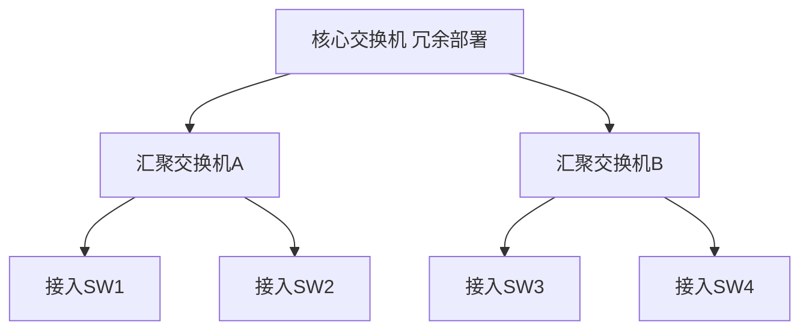
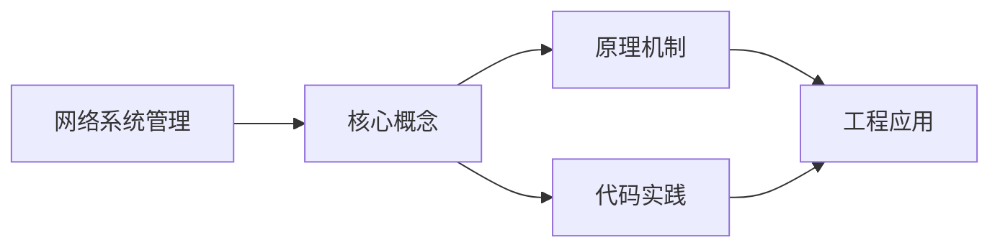

## 1. 学习目标（Bloom 分类）

本节按照布鲁姆教育目标分类学组织学习路径。本文主题为《网络系统管理》，属于 网络 模块，读者可以根据自身阶段选择阅读深度。

记忆层面：能够准确复述本文的核心概念、术语与基本语法或操作步骤，并能够在提问或检索时快速定位对应知识点。能够说出 网络 的核心概念、组件与标准流程。

理解层面：能够用自己的语言解释核心原理与工作机制，说明概念之间的因果关系，而不是机械记忆结论。能够解释 网络 的工作原理与关键机制。

应用层面：能够在真实项目或练习场景中运用本文知识解决具体问题，写出正确且可维护的实现。能够执行 网络 相关的标准操作与配置。

分析层面：能够拆解复杂问题，比较本文主题与相邻概念的异同，识别边界条件与例外情况。能够分析 网络 方案在可靠性、成本与性能上的权衡。

评价层面：能够根据约束条件（性能、可读性、安全、成本）评价不同方案的优劣，做出有依据的技术决策。能够评价 网络 中的技术选型。

创造层面：能够把本文知识与其他模块知识组合，设计出新的解决方案或可复用的工程模式。能够设计基于 网络 的完整解决方案。

通过本节学习，读者应当能够把《网络系统管理》纳入自己的知识网络，并与 网络 模块的其他主题（TCP/IP、HTTP、DNS、网络安全、负载均衡）建立关联。

## 2. 历史动机与发展脉络

《网络系统管理》是 网络 领域的重要主题。要真正理解它，需要先了解它解决的问题与演进过程。

网络是分布式系统的地基：从 ARPANET（1969）到互联网，TCP/IP 协议族（1974 年提出）成为事实标准；HTTP 从 1991 年至今演进到 HTTP/3。
分层模型：OSI 七层与 TCP/IP 四层；每层职责清晰，上层依赖下层服务；理解分层才能定位故障。
现代网络主题：IPv6 过渡、HTTP/2/3、TLS 加密、CDN 与边缘计算、软件定义网络（SDN）。

回到本文主题：网络系统管理 的提出与成熟，正是上述技术背景下的必然产物。早期实现往往以简单可用为目标，随着工程规模扩大，社区逐渐沉淀出标准做法与最佳实践；理解这一脉络，可以帮助读者判断“为什么文档中的推荐写法是现在这个样子”，也能在遇到历史遗留代码时准确识别其设计年代与取舍。


## 3. 形式化定义与核心概念精讲

本节把《网络系统管理》涉及的核心概念以“定义 + 讲解”的形式展开。读者应把定义当作工具，把讲解当作理解路径；两者结合才能形成可迁移的知识。

TCP：三次握手建立、四次挥手关闭；可靠传输（序号/确认/重传）、流量控制（滑动窗口）、拥塞控制（慢启动/拥塞避免）。
HTTP：请求-响应模型；方法（GET/POST/PUT/DELETE）、状态码（2xx/3xx/4xx/5xx）、头字段；无状态 + Cookie/Token 会话。
DNS：域名到 IP 的分布式解析，递归与迭代查询，缓存与 TTL；HTTP 层通过域名访问。

### 3.1 原文章节逐一精讲

原文档把主题拆分为 12 个小节，下面按顺序给出每一节的导读讲解，随后保留原文细节供精读。

#### 原文精读（完整保留）


#### 1. Windows Server 部署

##### 1.1 Windows Server 版本

| 版本                | 特点                   | 适用场景     |
| :------------------ | :--------------------- | :----------- |
| Windows Server 2022 | 安全性增强、Azure 混合 | 企业生产环境 |
| Windows Server 2019 | 稳定成熟               | 通用服务器   |
| Windows Server 2016 | Nano Server            | 轻量容器化   |

##### 1.2 服务器初始化

```powershell
# 修改计算机名
Rename-Computer -NewName "DC01" -Restart

# 配置静态 IP
New-NetIPAddress -InterfaceIndex 12 -IPAddress 192.168.1.10 `
  -PrefixLength 24 -DefaultGateway 192.168.1.1
Set-DnsClientServerAddress -InterfaceIndex 12 `
  -ServerAddresses 192.168.1.10,8.8.8.8

# 启用远程桌面
Set-ItemProperty -Path 'HKLM:\System\CurrentControlSet\Control\Terminal Server' `
  -name "fDenyTSConnections" -value 0
Enable-NetFirewallRule -DisplayGroup "Remote Desktop"

# Windows Update 配置
Install-Module PSWindowsUpdate -Force
Get-WindowsUpdate -AcceptAll -Install -AutoReboot
```

#### 2. 活动目录域服务（AD DS）

##### 2.1 域控制器安装

```powershell
# 安装 AD DS 角色
Install-WindowsFeature -Name AD-Domain-Services -IncludeManagementTools

# 提升为域控制器（新建林）
Install-ADDSForest -DomainName "fandex.local" `
  -DomainNetbiosName "FANDEX" `
  -ForestMode WinThreshold `
  -DomainMode WinThreshold `
  -DatabasePath "C:\Windows\NTDS" `
  -LogPath "C:\Windows\NTDS" `
  -SysvolPath "C:\Windows\SYSVOL" `
  -SafeModeAdministratorPassword (ConvertTo-SecureString "P@ssw0rd" -AsPlainText -Force) `
  -Force
```

##### 2.2 组织单位与用户管理

```powershell
# 创建组织单位
New-ADOrganizationalUnit -Name "研发部" -Path "DC=fandex,DC=local"
New-ADOrganizationalUnit -Name "运维部" -Path "DC=fandex,DC=local"

# 批量创建用户
$users = @(
  @{Name="张三"; SamAccountName="zhangsan"; Dept="研发部"},
  @{Name="李四"; SamAccountName="lisi"; Dept="运维部"}
)
foreach ($u in $users) {
  New-ADUser -Name $u.Name -SamAccountName $u.SamAccountName `
    -UserPrincipalName "$($u.SamAccountName)@fandex.local" `
    -Path "OU=$($u.Dept),DC=fandex,DC=local" `
    -AccountPassword (ConvertTo-SecureString "P@ssw0rd" -AsPlainText -Force) `
    -Enabled $true
}

# 创建安全组
New-ADGroup -Name "研发组" -GroupScope Global -Path "OU=研发部,DC=fandex,DC=local"
Add-ADGroupMember -Identity "研发组" -Members "zhangsan"
```

#### 3. DNS 服务配置

##### 3.1 DNS 服务器安装与配置

```powershell
# 安装 DNS 角色
Install-WindowsFeature -Name DNS -IncludeManagementTools

# 创建正向查找区域
Add-DnsServerPrimaryZone -Name "fandex.local" -ZoneFile "fandex.local.dns"

# 添加 A 记录
Add-DnsServerResourceRecordA -Name "web" -IPv4Address "192.168.1.20" `
  -ZoneName "fandex.local"

# 添加 CNAME 记录
Add-DnsServerResourceRecordCName -Name "www" -HostNameAlias "web.fandex.local" `
  -ZoneName "fandex.local"

# 添加 MX 记录
Add-DnsServerResourceRecordMX -Name "." -MailExchange "mail.fandex.local" `
  -Preference 10 -ZoneName "fandex.local"
```

##### 3.2 DNS 区域类型

| 区域类型 | 说明                 | 适用场景      |
| :------- | :------------------- | :------------ |
| 主要区域 | 可读写的区域副本     | 主 DNS 服务器 |
| 辅助区域 | 只读的区域副本       | 备份 DNS      |
| 存根区域 | 仅包含 NS/SOA/A 记录 | 跨域解析      |

#### 4. DHCP 服务配置

```powershell
# 安装 DHCP 角色
Install-WindowsFeature -Name DHCP -IncludeManagementTools

# 授权 DHCP 服务器
Add-DhcpServerInDC -DnsName "DC01.fandex.local"

# 创建作用域
Add-DhcpServerv4Scope -Name "办公网" -StartRange 192.168.1.100 `
  -EndRange 192.168.1.200 -SubnetMask 255.255.255.0 `
  -State Active

# 配置作用域选项
Set-DhcpServerv4OptionValue -ScopeId 192.168.1.0 `
  -DnsServer 192.168.1.10 -Router 192.168.1.1 `
  -DnsDomain "fandex.local"

# 排除地址范围
Add-DhcpServerv4ExclusionRange -ScopeId 192.168.1.0 `
  -StartRange 192.168.1.150 -EndRange 192.168.1.160

# DHCP 保留（绑定 MAC）
Add-DhcpServerv4Reservation -ScopeId 192.168.1.0 `
  -IPAddress 192.168.1.50 -ClientId "00-15-5D-01-02-03" `
  -Description "打印机"
```

#### 5. IIS Web 服务

```powershell
# 安装 IIS
Install-WindowsFeature -Name Web-Server -IncludeManagementTools

# 创建网站
New-IISSite -Name "FANDEX-Web" -PhysicalPath "C:\inetpub\fandex" `
  -BindingInformation "*:80:www.fandex.local"

# 配置 HTTPS 绑定
New-IISSiteBinding -Name "FANDEX-Web" `
  -BindingInformation "*:443:www.fandex.local" `
  -Protocol https -CertificateThumbprint (Get-ChildItem Cert:\LocalMachine\My)[0].Thumbprint

# 应用程序池配置
Set-IISAppPool -Name "FANDEX-Web Pool" -ManagedRuntimeVersion "v4.0" `
  -ProcessModelIdleTimeout "00:30:00" -PeriodicRestartTime "1.00:00:00"
```

#### 6. 文件服务

```powershell
# 安装文件服务角色
Install-WindowsFeature -Name FS-FileServer -IncludeManagementTools

# 创建共享文件夹
New-Item -Path "D:\Share\Public" -ItemType Directory -Force
New-SmbShare -Name "Public" -Path "D:\Share\Public" `
  -FullAccess "FANDEX\Domain Admins" `
  -ChangeAccess "FANDEX\研发组" `
  -ReadAccess "Everyone"

# 配置 NTFS 权限
$acl = Get-Acl "D:\Share\Public"
$rule = New-Object System.Security.AccessControl.FileSystemAccessRule(
  "FANDEX\研发组", "Modify", "ContainerInherit,ObjectInherit", "None", "Allow"
)
$acl.SetAccessRule($rule)
Set-Acl "D:\Share\Public" $acl

# 配置磁盘配额
New-FsrmQuota -Path "D:\Share\Public" -Size 10GB `
  -Description "公共目录10GB配额"
```

#### 7. 终端服务（RDS）

```powershell
# 安装远程桌面服务
Install-WindowsFeature -Name RDS-RD-Server,RDS-Licensing -IncludeManagementTools

# 配置 RDS 授权模式
Set-ItemProperty -Path 'HKLM:\SYSTEM\CurrentControlSet\Control\Terminal Server' `
  -Name "LicensingMode" -Value 4    # 4=Per-User

# 指定许可证服务器
Set-ItemProperty -Path 'HKLM:\SYSTEM\CurrentControlSet\Control\Terminal Server\LicenseServers' `
  -Name "ServerName" -Value "DC01.fandex.local"
```

#### 8. 组策略管理

##### 8.1 常用组策略

```powershell
# 创建 GPO
New-GPO -Name "安全基线策略" -Comment "企业安全基线配置"

# 链接 GPO 到 OU
New-GPLink -Name "安全基线策略" -Target "OU=研发部,DC=fandex,DC=local"

# 配置 GPO 注册表设置
Set-GPRegistryValue -Name "安全基线策略" `
  -Key "HKLM\Software\Policies\Microsoft\Windows\WindowsUpdate\AU" `
  -ValueName "AUOptions" -Type DWord -Value 4

# 常用安全策略
# 账户锁定策略
Set-GPRegistryValue -Name "安全基线策略" `
  -Key "HKLM\Software\Microsoft\Windows\CurrentVersion\Policies\System" `
  -ValueName "LockoutBadCount" -Type DWord -Value 5

# 禁用 USB 存储
Set-GPRegistryValue -Name "安全基线策略" `
  -Key "HKLM\Software\Policies\Microsoft\Windows\RemovableStorageDevices" `
  -ValueName "Deny_All" -Type DWord -Value 1
```

#### 9. Linux 服务器部署

##### 9.1 基础服务配置

```bash
# 网络配置（CentOS/Rocky）
nmcli con mod ens33 ipv4.addresses 192.168.1.20/24
nmcli con mod ens33 ipv4.gateway 192.168.1.1
nmcli con mod ens33 ipv4.dns "192.168.1.10,8.8.8.8"
nmcli con mod ens33 ipv4.method manual
nmcli con up ens33

# 防火墙配置
firewall-cmd --permanent --add-service=http
firewall-cmd --permanent --add-service=https
firewall-cmd --permanent --add-port=8080/tcp
firewall-cmd --reload

# SELinux 管理
setenforce 0                          # 临时关闭
sed -i 's/SELINUX=enforcing/SELINUX=permissive/' /etc/selinux/config  # 永久
```

##### 9.2 常用服务安装

```bash
# Nginx 安装与配置
dnf install nginx -y
systemctl enable --now nginx

# 配置虚拟主机
cat > /etc/nginx/conf.d/fandex.conf << 'EOF'
server {
    listen 80;
    server_name www.fandex.local;
    root /var/www/fandex;
    index index.html;

    location / {
        try_files $uri $uri/ =404;
    }
}
EOF

# MariaDB 安装
dnf install mariadb-server -y
systemctl enable --now mariadb
mysql_secure_installation
```

#### 10. Shell 脚本编程

##### 10.1 网络巡检脚本

```bash
#!/bin/bash
# 网络设备巡检脚本
# 用法: ./net_check.sh

LOG_FILE="/var/log/net_check_$(date +%Y%m%d).log"
DEVICES=("192.168.1.1" "192.168.1.2" "192.168.1.3")

echo "===== 网络巡检 $(date) =====" | tee -a $LOG_FILE

for ip in "${DEVICES[@]}"; do
    echo "--- 检查设备 $ip ---" | tee -a $LOG_FILE

    # Ping 检测
    if ping -c 3 -W 2 $ip &> /dev/null; then
        echo "[OK] $ip 可达" | tee -a $LOG_FILE
    else
        echo "[FAIL] $ip 不可达" | tee -a $LOG_FILE
    fi

    # 端口检测
    for port in 22 80 443; do
        timeout 2 bash -c "echo > /dev/tcp/$ip/$port" 2>/dev/null
        if [ $? -eq 0 ]; then
            echo "[OK] $ip:$port 开放" | tee -a $LOG_FILE
        else
            echo "[WARN] $ip:$port 关闭" | tee -a $LOG_FILE
        fi
    done
done

echo "===== 巡检完成 =====" | tee -a $LOG_FILE
```

##### 10.2 自动备份脚本

```bash
#!/bin/bash
# 配置文件自动备份脚本

BACKUP_DIR="/backup/config"
DATE=$(date +%Y%m%d_%H%M%S)
RETAIN_DAYS=30

mkdir -p $BACKUP_DIR

# 备份配置文件
tar czf "$BACKUP_DIR/etc_backup_$DATE.tar.gz" /etc/
tar czf "$BACKUP_DIR/nginx_backup_$DATE.tar.gz" /etc/nginx/

# 清理过期备份
find $BACKUP_DIR -name "*.tar.gz" -mtime +$RETAIN_DAYS -delete

echo "[$DATE] 备份完成，已清理 ${RETAIN_DAYS} 天前的备份"
```

#### 11. 数据中心网络搭建

##### 11.1 网络架构设计



##### 11.2 设备命名规范

| 位置   | 设备类型 | 命名格式             | 示例         |
| :----- | :------- | :------------------- | :----------- |
| 核心层 | 交换机   | DC-CORE-01           | DC-CORE-01   |
| 汇聚层 | 交换机   | DC-AGG-{楼栋}-01     | DC-AGG-A1-01 |
| 接入层 | 交换机   | DC-ACC-{楼层}-{编号} | DC-ACC-3F-01 |
| 防火墙 | FW       | DC-FW-01             | DC-FW-01     |
| 路由器 | RT       | DC-RT-01             | DC-RT-01     |

#### 12. 无线网络规划

##### 12.1 无线地勘与 AP 点位图设计

地勘流程：

1. **现场勘测**：获取建筑平面图，标注墙体材质、门窗位置
2. **信号覆盖模拟**：使用 Ekahau/iBwave 进行信号仿真
3. **AP 点位规划**：根据覆盖面积和用户密度确定 AP 数量
4. **信道规划**：2.4GHz 使用 1/6/11 信道，5GHz 使用非 DFS 信道
5. **功率调整**：边缘场强 ≥ -65dBm，重叠区域 ≥ -75dBm

##### 12.2 无线认证配置

```bash
# 华为 AC 配置 WPA2-Enterprise
[AC] wlan
[AC-wlan-view] security-profile name sec-enterprise
[AC-wlan-sec-prof-sec-enterprise] security wpa2 dot1x aes

# 配置 RADIUS 服务器
[AC] radius-server template radius1
[AC-radius-radius1] radius-server authentication 192.168.1.100 1812
[AC-radius-radius1] radius-server accounting 192.168.1.100 1813
[AC-radius-radius1] radius-server shared-key cipher Radius@123

# 802.1X 认证配置
[AC] aaa
[AC-aaa] authentication-scheme auth1
[AC-aaa-authen-auth1] authentication-mode radius
[AC-aaa] domain default
[AC-aaa-domain-default] authentication-scheme auth1
[AC-aaa-domain-default] radius-server radius1
```

##### 12.3 AP 隔离

```bash
# 华为 AC 配置用户隔离
[AC] wlan
[AC-wlan-view] traffic-profile name isolate
[AC-wlan-traffic-prof-isolate] user-isolate l2    # 二层隔离
[AC-wlan-traffic-prof-isolate] user-isolate l3    # 三层隔离
```

##### 12.4 数据加密

| 加密方式 | 算法     | 安全级别 | 说明               |
| :------- | :------- | :------- | :----------------- |
| WEP      | RC4      | 极低     | 已淘汰             |
| WPA-TKIP | TKIP     | 低       | 兼容旧设备         |
| WPA2-AES | AES-CCMP | 高       | 企业推荐           |
| WPA3-SAE | SAE      | 最高     | 新标准，抗离线字典 |

##### 12.5 AC 热备

```bash
# 华为 AC 双机热备配置
[AC1] wlan
[AC1-wlan-view] ac protect enable
[AC1-wlan-view] ac protect protect-ac 192.168.1.2 priority 6
[AC1-wlan-view] ac protect local-ac 192.168.1.1 priority 8

[AC2] wlan
[AC2-wlan-view] ac protect enable
[AC2-wlan-view] ac protect protect-ac 192.168.1.1 priority 8
[AC2-wlan-view] ac protect local-ac 192.168.1.2 priority 6
```


### 3.2 概念关系图

下面用 Mermaid 图表达本文核心概念之间的关系，帮助读者建立整体图景：



图中展示的是本文知识的结构化关系：核心概念是入口，原理机制解释“为什么”，代码实践演示“怎么做”，工程应用回答“何时用”。读者学习时可以把每个小节的内容挂接到对应节点上。

## 4. 理论推导与原理解析

本节深入《网络系统管理》背后的原理。理论部分不求面面俱到，而是聚焦“能解释现象、能指导实践”的关键推导。

TCP：三次握手建立、四次挥手关闭；可靠传输（序号/确认/重传）、流量控制（滑动窗口）、拥塞控制（慢启动/拥塞避免）。
HTTP：请求-响应模型；方法（GET/POST/PUT/DELETE）、状态码（2xx/3xx/4xx/5xx）、头字段；无状态 + Cookie/Token 会话。
DNS：域名到 IP 的分布式解析，递归与迭代查询，缓存与 TTL；HTTP 层通过域名访问。
TLS：握手协商密钥（证书 + 密钥交换），加密传输，防窃听防篡改；HTTPS 是 HTTP + TLS。

需要强调的是，理论推导与工程实践之间存在翻译层：理论给出的是理想化模型与边界条件，工程代码则必须处理真实环境中的例外。读者在学习时应先掌握理论的“标准情形”，再通过陷阱章节了解“非标准情形”。

## 5. 代码示例与逐行讲解

本节把原文中的代码示例系统整理，并为每个示例补充用途说明与讲解。读者不应只浏览代码，而应逐段对照讲解理解设计意图。

### 5.1 示例：1.2 服务器初始化

该示例来自原文《1.2 服务器初始化》小节，用于演示网络系统管理相关操作。阅读时请先看代码结构，再看其后的讲解。

```powershell
# 修改计算机名
Rename-Computer -NewName "DC01" -Restart

# 配置静态 IP
New-NetIPAddress -InterfaceIndex 12 -IPAddress 192.168.1.10 `
  -PrefixLength 24 -DefaultGateway 192.168.1.1
Set-DnsClientServerAddress -InterfaceIndex 12 `
  -ServerAddresses 192.168.1.10,8.8.8.8

# 启用远程桌面
Set-ItemProperty -Path 'HKLM:\System\CurrentControlSet\Control\Terminal Server' `
  -name "fDenyTSConnections" -value 0
Enable-NetFirewallRule -DisplayGroup "Remote Desktop"

# Windows Update 配置
Install-Module PSWindowsUpdate -Force
Get-WindowsUpdate -AcceptAll -Install -AutoReboot
```

讲解：这段代码演示了本节核心知识点。代码中的关键操作可以归纳为三步：准备（定义或初始化）、执行（核心逻辑）、收尾（释放资源或返回结果）。实际项目中，这三步往往被封装为函数或类，以提升复用性与可测试性。

关键点分析：

该示例共 14 行有效代码，结构以数据或配置为主。阅读时应关注：数据字段的含义、配置项的作用，以及它们与运行行为的对应关系。

进阶思考路径：先尝试修改参数观察行为变化，再把示例中的模式迁移到自己的项目中；每次修改都记录预期与实测差异，这是把示例转化为能力的最快方式。

### 5.2 示例：2.1 域控制器安装

该示例来自原文《2.1 域控制器安装》小节，用于演示网络系统管理相关操作。阅读时请先看代码结构，再看其后的讲解。

```powershell
# 安装 AD DS 角色
Install-WindowsFeature -Name AD-Domain-Services -IncludeManagementTools

# 提升为域控制器（新建林）
Install-ADDSForest -DomainName "fandex.local" `
  -DomainNetbiosName "FANDEX" `
  -ForestMode WinThreshold `
  -DomainMode WinThreshold `
  -DatabasePath "C:\Windows\NTDS" `
  -LogPath "C:\Windows\NTDS" `
  -SysvolPath "C:\Windows\SYSVOL" `
  -SafeModeAdministratorPassword (ConvertTo-SecureString "P@ssw0rd" -AsPlainText -Force) `
  -Force
```

讲解：这段代码演示了本节核心知识点。代码中的关键操作可以归纳为三步：准备（定义或初始化）、执行（核心逻辑）、收尾（释放资源或返回结果）。实际项目中，这三步往往被封装为函数或类，以提升复用性与可测试性。

关键点分析：

该示例共 12 行有效代码，结构以数据或配置为主。阅读时应关注：数据字段的含义、配置项的作用，以及它们与运行行为的对应关系。

进阶思考路径：先尝试修改参数观察行为变化，再把示例中的模式迁移到自己的项目中；每次修改都记录预期与实测差异，这是把示例转化为能力的最快方式。

### 5.3 示例：2.2 组织单位与用户管理

该示例来自原文《2.2 组织单位与用户管理》小节，用于演示网络系统管理相关操作。阅读时请先看代码结构，再看其后的讲解。

```powershell
# 创建组织单位
New-ADOrganizationalUnit -Name "研发部" -Path "DC=fandex,DC=local"
New-ADOrganizationalUnit -Name "运维部" -Path "DC=fandex,DC=local"

# 批量创建用户
$users = @(
  @{Name="张三"; SamAccountName="zhangsan"; Dept="研发部"},
  @{Name="李四"; SamAccountName="lisi"; Dept="运维部"}
)
foreach ($u in $users) {
  New-ADUser -Name $u.Name -SamAccountName $u.SamAccountName `
    -UserPrincipalName "$($u.SamAccountName)@fandex.local" `
    -Path "OU=$($u.Dept),DC=fandex,DC=local" `
    -AccountPassword (ConvertTo-SecureString "P@ssw0rd" -AsPlainText -Force) `
    -Enabled $true
}

# 创建安全组
New-ADGroup -Name "研发组" -GroupScope Global -Path "OU=研发部,DC=fandex,DC=local"
Add-ADGroupMember -Identity "研发组" -Members "zhangsan"
```

讲解：这段代码演示了本节核心知识点。代码中的关键操作可以归纳为三步：准备（定义或初始化）、执行（核心逻辑）、收尾（释放资源或返回结果）。实际项目中，这三步往往被封装为函数或类，以提升复用性与可测试性。

关键点分析：

该示例共 18 行有效代码，结构以数据或配置为主。阅读时应关注：数据字段的含义、配置项的作用，以及它们与运行行为的对应关系。

进阶思考路径：先尝试修改参数观察行为变化，再把示例中的模式迁移到自己的项目中；每次修改都记录预期与实测差异，这是把示例转化为能力的最快方式。

### 5.4 示例：3.1 DNS 服务器安装与配置

该示例来自原文《3.1 DNS 服务器安装与配置》小节，用于演示网络系统管理相关操作。阅读时请先看代码结构，再看其后的讲解。

```powershell
# 安装 DNS 角色
Install-WindowsFeature -Name DNS -IncludeManagementTools

# 创建正向查找区域
Add-DnsServerPrimaryZone -Name "fandex.local" -ZoneFile "fandex.local.dns"

# 添加 A 记录
Add-DnsServerResourceRecordA -Name "web" -IPv4Address "192.168.1.20" `
  -ZoneName "fandex.local"

# 添加 CNAME 记录
Add-DnsServerResourceRecordCName -Name "www" -HostNameAlias "web.fandex.local" `
  -ZoneName "fandex.local"

# 添加 MX 记录
Add-DnsServerResourceRecordMX -Name "." -MailExchange "mail.fandex.local" `
  -Preference 10 -ZoneName "fandex.local"
```

讲解：这段代码演示了本节核心知识点。代码中的关键操作可以归纳为三步：准备（定义或初始化）、执行（核心逻辑）、收尾（释放资源或返回结果）。实际项目中，这三步往往被封装为函数或类，以提升复用性与可测试性。

关键点分析：

该示例共 13 行有效代码，结构以数据或配置为主。阅读时应关注：数据字段的含义、配置项的作用，以及它们与运行行为的对应关系。

进阶思考路径：先尝试修改参数观察行为变化，再把示例中的模式迁移到自己的项目中；每次修改都记录预期与实测差异，这是把示例转化为能力的最快方式。

### 5.5 示例：4. DHCP 服务配置

该示例来自原文《4. DHCP 服务配置》小节，用于演示网络系统管理相关操作。阅读时请先看代码结构，再看其后的讲解。

```powershell
# 安装 DHCP 角色
Install-WindowsFeature -Name DHCP -IncludeManagementTools

# 授权 DHCP 服务器
Add-DhcpServerInDC -DnsName "DC01.fandex.local"

# 创建作用域
Add-DhcpServerv4Scope -Name "办公网" -StartRange 192.168.1.100 `
  -EndRange 192.168.1.200 -SubnetMask 255.255.255.0 `
  -State Active

# 配置作用域选项
Set-DhcpServerv4OptionValue -ScopeId 192.168.1.0 `
  -DnsServer 192.168.1.10 -Router 192.168.1.1 `
  -DnsDomain "fandex.local"

# 排除地址范围
Add-DhcpServerv4ExclusionRange -ScopeId 192.168.1.0 `
  -StartRange 192.168.1.150 -EndRange 192.168.1.160

# DHCP 保留（绑定 MAC）
Add-DhcpServerv4Reservation -ScopeId 192.168.1.0 `
  -IPAddress 192.168.1.50 -ClientId "00-15-5D-01-02-03" `
  -Description "打印机"
```

讲解：这段代码演示了本节核心知识点。代码中的关键操作可以归纳为三步：准备（定义或初始化）、执行（核心逻辑）、收尾（释放资源或返回结果）。实际项目中，这三步往往被封装为函数或类，以提升复用性与可测试性。

关键点分析：

该示例共 19 行有效代码，结构以数据或配置为主。阅读时应关注：数据字段的含义、配置项的作用，以及它们与运行行为的对应关系。

进阶思考路径：先尝试修改参数观察行为变化，再把示例中的模式迁移到自己的项目中；每次修改都记录预期与实测差异，这是把示例转化为能力的最快方式。

### 5.6 示例：5. IIS Web 服务

该示例来自原文《5. IIS Web 服务》小节，用于演示网络系统管理相关操作。阅读时请先看代码结构，再看其后的讲解。

```powershell
# 安装 IIS
Install-WindowsFeature -Name Web-Server -IncludeManagementTools

# 创建网站
New-IISSite -Name "FANDEX-Web" -PhysicalPath "C:\inetpub\fandex" `
  -BindingInformation "*:80:www.fandex.local"

# 配置 HTTPS 绑定
New-IISSiteBinding -Name "FANDEX-Web" `
  -BindingInformation "*:443:www.fandex.local" `
  -Protocol https -CertificateThumbprint (Get-ChildItem Cert:\LocalMachine\My)[0].Thumbprint

# 应用程序池配置
Set-IISAppPool -Name "FANDEX-Web Pool" -ManagedRuntimeVersion "v4.0" `
  -ProcessModelIdleTimeout "00:30:00" -PeriodicRestartTime "1.00:00:00"
```

讲解：这段代码演示了本节核心知识点。代码中的关键操作可以归纳为三步：准备（定义或初始化）、执行（核心逻辑）、收尾（释放资源或返回结果）。实际项目中，这三步往往被封装为函数或类，以提升复用性与可测试性。

关键点分析：

该示例共 12 行有效代码，结构以数据或配置为主。阅读时应关注：数据字段的含义、配置项的作用，以及它们与运行行为的对应关系。

进阶思考路径：先尝试修改参数观察行为变化，再把示例中的模式迁移到自己的项目中；每次修改都记录预期与实测差异，这是把示例转化为能力的最快方式。

### 5.7 示例：6. 文件服务

该示例来自原文《6. 文件服务》小节，用于演示网络系统管理相关操作。阅读时请先看代码结构，再看其后的讲解。

```powershell
# 安装文件服务角色
Install-WindowsFeature -Name FS-FileServer -IncludeManagementTools

# 创建共享文件夹
New-Item -Path "D:\Share\Public" -ItemType Directory -Force
New-SmbShare -Name "Public" -Path "D:\Share\Public" `
  -FullAccess "FANDEX\Domain Admins" `
  -ChangeAccess "FANDEX\研发组" `
  -ReadAccess "Everyone"

# 配置 NTFS 权限
$acl = Get-Acl "D:\Share\Public"
$rule = New-Object System.Security.AccessControl.FileSystemAccessRule(
  "FANDEX\研发组", "Modify", "ContainerInherit,ObjectInherit", "None", "Allow"
)
$acl.SetAccessRule($rule)
Set-Acl "D:\Share\Public" $acl

# 配置磁盘配额
New-FsrmQuota -Path "D:\Share\Public" -Size 10GB `
  -Description "公共目录10GB配额"
```

讲解：这段代码演示了本节核心知识点。代码中的关键操作可以归纳为三步：准备（定义或初始化）、执行（核心逻辑）、收尾（释放资源或返回结果）。实际项目中，这三步往往被封装为函数或类，以提升复用性与可测试性。

关键点分析：

该示例共 18 行有效代码，结构以数据或配置为主。阅读时应关注：数据字段的含义、配置项的作用，以及它们与运行行为的对应关系。

进阶思考路径：先尝试修改参数观察行为变化，再把示例中的模式迁移到自己的项目中；每次修改都记录预期与实测差异，这是把示例转化为能力的最快方式。

### 5.8 示例：7. 终端服务（RDS）

该示例来自原文《7. 终端服务（RDS）》小节，用于演示网络系统管理相关操作。阅读时请先看代码结构，再看其后的讲解。

```powershell
# 安装远程桌面服务
Install-WindowsFeature -Name RDS-RD-Server,RDS-Licensing -IncludeManagementTools

# 配置 RDS 授权模式
Set-ItemProperty -Path 'HKLM:\SYSTEM\CurrentControlSet\Control\Terminal Server' `
  -Name "LicensingMode" -Value 4    # 4=Per-User

# 指定许可证服务器
Set-ItemProperty -Path 'HKLM:\SYSTEM\CurrentControlSet\Control\Terminal Server\LicenseServers' `
  -Name "ServerName" -Value "DC01.fandex.local"
```

讲解：这段代码演示了本节核心知识点。代码中的关键操作可以归纳为三步：准备（定义或初始化）、执行（核心逻辑）、收尾（释放资源或返回结果）。实际项目中，这三步往往被封装为函数或类，以提升复用性与可测试性。

关键点分析：

该示例共 8 行有效代码，结构以数据或配置为主。阅读时应关注：数据字段的含义、配置项的作用，以及它们与运行行为的对应关系。

进阶思考路径：先尝试修改参数观察行为变化，再把示例中的模式迁移到自己的项目中；每次修改都记录预期与实测差异，这是把示例转化为能力的最快方式。

### 5.9 示例：8.1 常用组策略

该示例来自原文《8.1 常用组策略》小节，用于演示网络系统管理相关操作。阅读时请先看代码结构，再看其后的讲解。

```powershell
# 创建 GPO
New-GPO -Name "安全基线策略" -Comment "企业安全基线配置"

# 链接 GPO 到 OU
New-GPLink -Name "安全基线策略" -Target "OU=研发部,DC=fandex,DC=local"

# 配置 GPO 注册表设置
Set-GPRegistryValue -Name "安全基线策略" `
  -Key "HKLM\Software\Policies\Microsoft\Windows\WindowsUpdate\AU" `
  -ValueName "AUOptions" -Type DWord -Value 4

# 常用安全策略
# 账户锁定策略
Set-GPRegistryValue -Name "安全基线策略" `
  -Key "HKLM\Software\Microsoft\Windows\CurrentVersion\Policies\System" `
  -ValueName "LockoutBadCount" -Type DWord -Value 5

# 禁用 USB 存储
Set-GPRegistryValue -Name "安全基线策略" `
  -Key "HKLM\Software\Policies\Microsoft\Windows\RemovableStorageDevices" `
  -ValueName "Deny_All" -Type DWord -Value 1
```

讲解：这段代码演示了本节核心知识点。代码中的关键操作可以归纳为三步：准备（定义或初始化）、执行（核心逻辑）、收尾（释放资源或返回结果）。实际项目中，这三步往往被封装为函数或类，以提升复用性与可测试性。

关键点分析：

该示例共 17 行有效代码，结构以数据或配置为主。阅读时应关注：数据字段的含义、配置项的作用，以及它们与运行行为的对应关系。

进阶思考路径：先尝试修改参数观察行为变化，再把示例中的模式迁移到自己的项目中；每次修改都记录预期与实测差异，这是把示例转化为能力的最快方式。

### 5.10 示例：9.1 基础服务配置

该示例来自原文《9.1 基础服务配置》小节，用于演示网络系统管理相关操作。阅读时请先看代码结构，再看其后的讲解。

```bash
# 网络配置（CentOS/Rocky）
nmcli con mod ens33 ipv4.addresses 192.168.1.20/24
nmcli con mod ens33 ipv4.gateway 192.168.1.1
nmcli con mod ens33 ipv4.dns "192.168.1.10,8.8.8.8"
nmcli con mod ens33 ipv4.method manual
nmcli con up ens33

# 防火墙配置
firewall-cmd --permanent --add-service=http
firewall-cmd --permanent --add-service=https
firewall-cmd --permanent --add-port=8080/tcp
firewall-cmd --reload

# SELinux 管理
setenforce 0                          # 临时关闭
sed -i 's/SELINUX=enforcing/SELINUX=permissive/' /etc/selinux/config  # 永久
```

讲解：这段代码演示了本节核心知识点。代码中的关键操作可以归纳为三步：准备（定义或初始化）、执行（核心逻辑）、收尾（释放资源或返回结果）。实际项目中，这三步往往被封装为函数或类，以提升复用性与可测试性。

关键点分析：

该示例共 14 行有效代码，结构以数据或配置为主。阅读时应关注：数据字段的含义、配置项的作用，以及它们与运行行为的对应关系。

进阶思考路径：先尝试修改参数观察行为变化，再把示例中的模式迁移到自己的项目中；每次修改都记录预期与实测差异，这是把示例转化为能力的最快方式。

### 5.11 示例：9.2 常用服务安装

该示例来自原文《9.2 常用服务安装》小节，用于演示网络系统管理相关操作。阅读时请先看代码结构，再看其后的讲解。

```bash
# Nginx 安装与配置
dnf install nginx -y
systemctl enable --now nginx

# 配置虚拟主机
cat > /etc/nginx/conf.d/fandex.conf << 'EOF'
server {
    listen 80;
    server_name www.fandex.local;
    root /var/www/fandex;
    index index.html;

    location / {
        try_files $uri $uri/ =404;
    }
}
EOF

# MariaDB 安装
dnf install mariadb-server -y
systemctl enable --now mariadb
mysql_secure_installation
```

讲解：这段代码演示了本节核心知识点。代码中的关键操作可以归纳为三步：准备（定义或初始化）、执行（核心逻辑）、收尾（释放资源或返回结果）。实际项目中，这三步往往被封装为函数或类，以提升复用性与可测试性。

关键点分析：

该示例共 19 行有效代码，结构以数据或配置为主。阅读时应关注：数据字段的含义、配置项的作用，以及它们与运行行为的对应关系。

进阶思考路径：先尝试修改参数观察行为变化，再把示例中的模式迁移到自己的项目中；每次修改都记录预期与实测差异，这是把示例转化为能力的最快方式。

### 5.12 示例：10.1 网络巡检脚本

该示例来自原文《10.1 网络巡检脚本》小节，用于演示网络系统管理相关操作。阅读时请先看代码结构，再看其后的讲解。

```bash
#!/bin/bash
# 网络设备巡检脚本
# 用法: ./net_check.sh

LOG_FILE="/var/log/net_check_$(date +%Y%m%d).log"
DEVICES=("192.168.1.1" "192.168.1.2" "192.168.1.3")

echo "===== 网络巡检 $(date) =====" | tee -a $LOG_FILE

for ip in "${DEVICES[@]}"; do
    echo "--- 检查设备 $ip ---" | tee -a $LOG_FILE

    # Ping 检测
    if ping -c 3 -W 2 $ip &> /dev/null; then
        echo "[OK] $ip 可达" | tee -a $LOG_FILE
    else
        echo "[FAIL] $ip 不可达" | tee -a $LOG_FILE
    fi

    # 端口检测
    for port in 22 80 443; do
        timeout 2 bash -c "echo > /dev/tcp/$ip/$port" 2>/dev/null
        if [ $? -eq 0 ]; then
            echo "[OK] $ip:$port 开放" | tee -a $LOG_FILE
        else
            echo "[WARN] $ip:$port 关闭" | tee -a $LOG_FILE
        fi
    done
done

echo "===== 巡检完成 =====" | tee -a $LOG_FILE
```

讲解：这段代码演示了本节核心知识点。代码中的关键操作可以归纳为三步：准备（定义或初始化）、执行（核心逻辑）、收尾（释放资源或返回结果）。实际项目中，这三步往往被封装为函数或类，以提升复用性与可测试性。

关键点分析：

该示例共 25 行有效代码，包含 2 类关键结构（if、for）。其中：

- 入口与初始化部分负责建立上下文，对应实际项目中的启动或装配逻辑；
- 核心逻辑部分体现本文主题的主要操作，是阅读时最需要对照讲解理解的部分；
- 输出或返回部分把结果交给调用方，注意其类型与边界条件。

进阶思考路径：先尝试修改参数观察行为变化，再把示例中的模式迁移到自己的项目中；每次修改都记录预期与实测差异，这是把示例转化为能力的最快方式。

### 5.13 示例：10.2 自动备份脚本

该示例来自原文《10.2 自动备份脚本》小节，用于演示网络系统管理相关操作。阅读时请先看代码结构，再看其后的讲解。

```bash
#!/bin/bash
# 配置文件自动备份脚本

BACKUP_DIR="/backup/config"
DATE=$(date +%Y%m%d_%H%M%S)
RETAIN_DAYS=30

mkdir -p $BACKUP_DIR

# 备份配置文件
tar czf "$BACKUP_DIR/etc_backup_$DATE.tar.gz" /etc/
tar czf "$BACKUP_DIR/nginx_backup_$DATE.tar.gz" /etc/nginx/

# 清理过期备份
find $BACKUP_DIR -name "*.tar.gz" -mtime +$RETAIN_DAYS -delete

echo "[$DATE] 备份完成，已清理 ${RETAIN_DAYS} 天前的备份"
```

讲解：这段代码演示了本节核心知识点。代码中的关键操作可以归纳为三步：准备（定义或初始化）、执行（核心逻辑）、收尾（释放资源或返回结果）。实际项目中，这三步往往被封装为函数或类，以提升复用性与可测试性。

关键点分析：

该示例共 12 行有效代码，结构以数据或配置为主。阅读时应关注：数据字段的含义、配置项的作用，以及它们与运行行为的对应关系。

进阶思考路径：先尝试修改参数观察行为变化，再把示例中的模式迁移到自己的项目中；每次修改都记录预期与实测差异，这是把示例转化为能力的最快方式。

### 5.14 示例：11.1 网络架构设计

该示例来自原文《11.1 网络架构设计》小节，用于演示网络系统管理相关操作。阅读时请先看代码结构，再看其后的讲解。


讲解：这段代码演示了本节核心知识点。代码中的关键操作可以归纳为三步：准备（定义或初始化）、执行（核心逻辑）、收尾（释放资源或返回结果）。实际项目中，这三步往往被封装为函数或类，以提升复用性与可测试性。

关键点分析：

该示例共 5 行有效代码，结构以数据或配置为主。阅读时应关注：数据字段的含义、配置项的作用，以及它们与运行行为的对应关系。

进阶思考路径：先尝试修改参数观察行为变化，再把示例中的模式迁移到自己的项目中；每次修改都记录预期与实测差异，这是把示例转化为能力的最快方式。

### 5.15 示例：12.2 无线认证配置

该示例来自原文《12.2 无线认证配置》小节，用于演示网络系统管理相关操作。阅读时请先看代码结构，再看其后的讲解。

```bash
# 华为 AC 配置 WPA2-Enterprise
[AC] wlan
[AC-wlan-view] security-profile name sec-enterprise
[AC-wlan-sec-prof-sec-enterprise] security wpa2 dot1x aes

# 配置 RADIUS 服务器
[AC] radius-server template radius1
[AC-radius-radius1] radius-server authentication 192.168.1.100 1812
[AC-radius-radius1] radius-server accounting 192.168.1.100 1813
[AC-radius-radius1] radius-server shared-key cipher Radius@123

# 802.1X 认证配置
[AC] aaa
[AC-aaa] authentication-scheme auth1
[AC-aaa-authen-auth1] authentication-mode radius
[AC-aaa] domain default
[AC-aaa-domain-default] authentication-scheme auth1
[AC-aaa-domain-default] radius-server radius1
```

讲解：这段代码演示了本节核心知识点。代码中的关键操作可以归纳为三步：准备（定义或初始化）、执行（核心逻辑）、收尾（释放资源或返回结果）。实际项目中，这三步往往被封装为函数或类，以提升复用性与可测试性。

关键点分析：

该示例共 16 行有效代码，结构以数据或配置为主。阅读时应关注：数据字段的含义、配置项的作用，以及它们与运行行为的对应关系。

进阶思考路径：先尝试修改参数观察行为变化，再把示例中的模式迁移到自己的项目中；每次修改都记录预期与实测差异，这是把示例转化为能力的最快方式。

### 5.16 示例：12.3 AP 隔离

该示例来自原文《12.3 AP 隔离》小节，用于演示网络系统管理相关操作。阅读时请先看代码结构，再看其后的讲解。

```bash
# 华为 AC 配置用户隔离
[AC] wlan
[AC-wlan-view] traffic-profile name isolate
[AC-wlan-traffic-prof-isolate] user-isolate l2    # 二层隔离
[AC-wlan-traffic-prof-isolate] user-isolate l3    # 三层隔离
```

讲解：这段代码演示了本节核心知识点。代码中的关键操作可以归纳为三步：准备（定义或初始化）、执行（核心逻辑）、收尾（释放资源或返回结果）。实际项目中，这三步往往被封装为函数或类，以提升复用性与可测试性。

关键点分析：

该示例共 5 行有效代码，结构以数据或配置为主。阅读时应关注：数据字段的含义、配置项的作用，以及它们与运行行为的对应关系。

进阶思考路径：先尝试修改参数观察行为变化，再把示例中的模式迁移到自己的项目中；每次修改都记录预期与实测差异，这是把示例转化为能力的最快方式。

### 5.17 示例：12.5 AC 热备

该示例来自原文《12.5 AC 热备》小节，用于演示网络系统管理相关操作。阅读时请先看代码结构，再看其后的讲解。

```bash
# 华为 AC 双机热备配置
[AC1] wlan
[AC1-wlan-view] ac protect enable
[AC1-wlan-view] ac protect protect-ac 192.168.1.2 priority 6
[AC1-wlan-view] ac protect local-ac 192.168.1.1 priority 8

[AC2] wlan
[AC2-wlan-view] ac protect enable
[AC2-wlan-view] ac protect protect-ac 192.168.1.1 priority 8
[AC2-wlan-view] ac protect local-ac 192.168.1.2 priority 6
```

讲解：这段代码演示了本节核心知识点。代码中的关键操作可以归纳为三步：准备（定义或初始化）、执行（核心逻辑）、收尾（释放资源或返回结果）。实际项目中，这三步往往被封装为函数或类，以提升复用性与可测试性。

关键点分析：

该示例共 9 行有效代码，结构以数据或配置为主。阅读时应关注：数据字段的含义、配置项的作用，以及它们与运行行为的对应关系。

进阶思考路径：先尝试修改参数观察行为变化，再把示例中的模式迁移到自己的项目中；每次修改都记录预期与实测差异，这是把示例转化为能力的最快方式。


综合以上示例，可以总结出本主题的代码实践要点：第一，先定义清晰的输入输出契约；第二，核心逻辑保持单一职责；第三，错误处理与边界条件不可省略；第四，命名与注释表达意图而非复述代码。

## 6. 对比分析

对比是理解《网络系统管理》定位的最快路径。下面从多个维度与相邻方案进行对比。

TCP 与 UDP：TCP 可靠有序、UDP 快速无连接；QUIC 在 UDP 上实现可靠与多路复用。
HTTP/1.1 与 HTTP/2：多路复用、头部压缩、服务器推送；HTTP/3 基于 QUIC 降低握手延迟。
负载均衡四层与七层：四层（L4）转发 IP/端口，七层（L7）按 HTTP 内容路由。

对比的目的不是分出绝对优劣，而是建立选择依据：不同约束条件下，最优解不同。读者应把每个对比维度转化为决策检查清单。

## 7. 常见陷阱与最佳实践

本节整理该主题的高频错误与推荐做法。每个陷阱先描述现象，再解释原因，最后给出最佳实践。

### 7.1 TCP 与 UDP 误用

可靠传输选 TCP，实时低延迟可容忍丢包选 UDP/QUIC。

深入讲解：该问题之所以被归类为“常见陷阱”，是因为它在初学者的代码中反复出现，而且往往不在第一时间暴露——错误通常隐藏在特定数据或特定时序下。

从成因上看，TCP 与 UDP 误用 一般源于对 网络 某个机制的理解偏差：要么误用了默认行为，要么忽略了边界条件，要么把其他语言的思维惯性带了过来。

从影响上看，TCP 与 UDP 误用 轻则产生错误结果，重则导致资源泄漏、数据损坏或安全事故；这也是为什么工程评审中会把它列为检查项。

从修复策略上看，处理TCP 与 UDP 误用的正确顺序是：先复现（构造最小用例），再定位（确认机制层面的根因），最后修复并补充回归测试。跳过复现直接改代码，往往治标不治本。

### 7.2 HTTP 状态码误用

业务错误返回 200 导致监控失真。按语义使用 4xx/5xx。

深入讲解：该问题之所以被归类为“常见陷阱”，是因为它在初学者的代码中反复出现，而且往往不在第一时间暴露——错误通常隐藏在特定数据或特定时序下。

从成因上看，HTTP 状态码误用 一般源于对 网络 某个机制的理解偏差：要么误用了默认行为，要么忽略了边界条件，要么把其他语言的思维惯性带了过来。

从影响上看，HTTP 状态码误用 轻则产生错误结果，重则导致资源泄漏、数据损坏或安全事故；这也是为什么工程评审中会把它列为检查项。

从修复策略上看，处理HTTP 状态码误用的正确顺序是：先复现（构造最小用例），再定位（确认机制层面的根因），最后修复并补充回归测试。跳过复现直接改代码，往往治标不治本。

### 7.3 DNS 缓存问题

域名变更后本地缓存旧 IP。TTL 与刷新策略。

深入讲解：该问题之所以被归类为“常见陷阱”，是因为它在初学者的代码中反复出现，而且往往不在第一时间暴露——错误通常隐藏在特定数据或特定时序下。

从成因上看，DNS 缓存问题 一般源于对 网络 某个机制的理解偏差：要么误用了默认行为，要么忽略了边界条件，要么把其他语言的思维惯性带了过来。

从影响上看，DNS 缓存问题 轻则产生错误结果，重则导致资源泄漏、数据损坏或安全事故；这也是为什么工程评审中会把它列为检查项。

从修复策略上看，处理DNS 缓存问题的正确顺序是：先复现（构造最小用例），再定位（确认机制层面的根因），最后修复并补充回归测试。跳过复现直接改代码，往往治标不治本。

### 7.4 TLS 证书过期

服务突然不可用。证书监控与自动续期。

深入讲解：该问题之所以被归类为“常见陷阱”，是因为它在初学者的代码中反复出现，而且往往不在第一时间暴露——错误通常隐藏在特定数据或特定时序下。

从成因上看，TLS 证书过期 一般源于对 网络 某个机制的理解偏差：要么误用了默认行为，要么忽略了边界条件，要么把其他语言的思维惯性带了过来。

从影响上看，TLS 证书过期 轻则产生错误结果，重则导致资源泄漏、数据损坏或安全事故；这也是为什么工程评审中会把它列为检查项。

从修复策略上看，处理TLS 证书过期的正确顺序是：先复现（构造最小用例），再定位（确认机制层面的根因），最后修复并补充回归测试。跳过复现直接改代码，往往治标不治本。

### 7.5 长连接泄漏

连接未复用或超时未清理。连接池 + 空闲超时。

深入讲解：该问题之所以被归类为“常见陷阱”，是因为它在初学者的代码中反复出现，而且往往不在第一时间暴露——错误通常隐藏在特定数据或特定时序下。

从成因上看，长连接泄漏 一般源于对 网络 某个机制的理解偏差：要么误用了默认行为，要么忽略了边界条件，要么把其他语言的思维惯性带了过来。

从影响上看，长连接泄漏 轻则产生错误结果，重则导致资源泄漏、数据损坏或安全事故；这也是为什么工程评审中会把它列为检查项。

从修复策略上看，处理长连接泄漏的正确顺序是：先复现（构造最小用例），再定位（确认机制层面的根因），最后修复并补充回归测试。跳过复现直接改代码，往往治标不治本。

### 7.6 CORS 误解

CORS 是浏览器策略非服务器安全。正确配置白名单。

深入讲解：该问题之所以被归类为“常见陷阱”，是因为它在初学者的代码中反复出现，而且往往不在第一时间暴露——错误通常隐藏在特定数据或特定时序下。

从成因上看，CORS 误解 一般源于对 网络 某个机制的理解偏差：要么误用了默认行为，要么忽略了边界条件，要么把其他语言的思维惯性带了过来。

从影响上看，CORS 误解 轻则产生错误结果，重则导致资源泄漏、数据损坏或安全事故；这也是为什么工程评审中会把它列为检查项。

从修复策略上看，处理CORS 误解的正确顺序是：先复现（构造最小用例），再定位（确认机制层面的根因），最后修复并补充回归测试。跳过复现直接改代码，往往治标不治本。

### 7.7 NAT 与内网穿透

P2P 场景需 NAT 打洞与中继。

深入讲解：该问题之所以被归类为“常见陷阱”，是因为它在初学者的代码中反复出现，而且往往不在第一时间暴露——错误通常隐藏在特定数据或特定时序下。

从成因上看，NAT 与内网穿透 一般源于对 网络 某个机制的理解偏差：要么误用了默认行为，要么忽略了边界条件，要么把其他语言的思维惯性带了过来。

从影响上看，NAT 与内网穿透 轻则产生错误结果，重则导致资源泄漏、数据损坏或安全事故；这也是为什么工程评审中会把它列为检查项。

从修复策略上看，处理NAT 与内网穿透的正确顺序是：先复现（构造最小用例），再定位（确认机制层面的根因），最后修复并补充回归测试。跳过复现直接改代码，往往治标不治本。

### 7.8 MTU 分片

大包触发分片丢包。合理设置 MSS/MTU。

深入讲解：该问题之所以被归类为“常见陷阱”，是因为它在初学者的代码中反复出现，而且往往不在第一时间暴露——错误通常隐藏在特定数据或特定时序下。

从成因上看，MTU 分片 一般源于对 网络 某个机制的理解偏差：要么误用了默认行为，要么忽略了边界条件，要么把其他语言的思维惯性带了过来。

从影响上看，MTU 分片 轻则产生错误结果，重则导致资源泄漏、数据损坏或安全事故；这也是为什么工程评审中会把它列为检查项。

从修复策略上看，处理MTU 分片的正确顺序是：先复现（构造最小用例），再定位（确认机制层面的根因），最后修复并补充回归测试。跳过复现直接改代码，往往治标不治本。

### 7.0 最佳实践总览

1. 域名与证书：统一管理 DNS、TLS 证书（自动续期）。
2. 性能：HTTP/2 多路复用、连接复用、压缩、缓存头。
3. 安全：TLS 1.2+、HSTS、安全 Cookie 属性。
4. 故障排查：ping/traceroute/curl/Dig/nslookup 分步定位。

把这些最佳实践固化为团队规范与代码评审检查项，是避免同类问题反复出现的关键。

## 8. 工程实践

本节把《网络系统管理》放入真实工程场景，给出可复用的模式与组织方法。

架构：CDN 加速静态内容、反向代理（Nginx）终结 TLS、网关统一入口。
监控：延迟、丢包、带宽、HTTP 错误率；链路追踪定位跨服务延迟。
安全：WAF、DDoS 防护、速率限制、访问日志审计。

### 8.1 工程实践的原则拆解

以上工程实践可以归纳为四条原则。第一，配置与代码分离：网络 项目中环境差异应通过配置注入，而不是散落在代码分支中；这保证同一份代码可以在开发、测试、生产环境一致运行。

第二，接口稳定优先：对外接口（函数签名、协议、数据格式）一旦被消费方依赖，变更成本极高；设计时应预留扩展点并保持向后兼容。

第三，可观测性内置：日志、指标与追踪应该在功能开发时同步设计，而不是故障发生后补救；没有观测手段的模块等于黑盒。

第四，变更可回滚：任何发布都应有对应的回滚方案；数据库迁移、配置变更与代码发布一样需要版本管理与逆向路径。

### 8.2 实践落地的检查清单

- [ ] 架构：对照本节描述，检查当前项目是否已经落实；未落实的项列入技术债并排期处理。
- [ ] 监控：对照本节描述，检查当前项目是否已经落实；未落实的项列入技术债并排期处理。
- [ ] 安全：对照本节描述，检查当前项目是否已经落实；未落实的项列入技术债并排期处理。

工程实践的共性原则：配置与代码分离、接口稳定优先、可观测性内置、变更可回滚。这些原则适用于本主题的所有实现。

## 9. 案例研究

本节通过一个完整案例把《网络系统管理》的知识串起来。案例按“需求分析、方案设计、实现、验证”四步展开。

需求：优化 Web 应用访问延迟与安全性。
方案：CDN 静态加速 + HTTP/3 + TLS 1.3 + 连接池优化。
要点：证书自动化、缓存策略、核心指标监控。
验证：多地测速、Lighthouse、安全扫描。

### 9.1 案例的扩展讨论

把案例中的方案放大到真实规模，需要额外考虑三个问题：

第一，规模：当数据量或并发量上升一个数量级时，原方案中的数据结构、缓存策略与任务调度是否仍然成立？通常需要引入分层与异步。

第二，团队：多人协作时，模块边界、接口契约与代码所有权必须明确；案例中的实现应拆分为可独立测试的单元，并配合文档说明设计意图。

第三，演进：上线后的需求变化不可避免；方案设计时应预留扩展点（配置化、插件化、事件化），并定期用真实指标验证假设。


案例研究的学习方法：先独立阅读需求，尝试在脑中形成方案，再对照实现与讲解，最后思考“如果约束变化（数据量、并发、团队规模），方案应如何调整”。

## 10. 知识要点总结与深入讲解

本节以讲解形式汇总全文要点，替代传统的习题与自测，读者不需要答题，只需跟随解释建立完整的认知框架。

关于《网络系统管理》的核心结论：

网络问题的排查遵循分层法：物理/链路 -> 网络 -> 传输 -> 应用。
HTTP 与 TLS 是现代应用的两大接触面，状态码与证书是高频故障点。
性能与安全并存：加密、缓存、负载均衡是标配。

原文档各小节的要点回顾：

- 1. Windows Server 部署：该小节围绕网络系统管理展开具体细节，阅读时应关注其与核心结论的对应关系；每个小节都是核心结论在某一个侧面的展开。
- 2. 活动目录域服务（AD DS）：该小节围绕网络系统管理展开具体细节，阅读时应关注其与核心结论的对应关系；每个小节都是核心结论在某一个侧面的展开。
- 3. DNS 服务配置：该小节围绕网络系统管理展开具体细节，阅读时应关注其与核心结论的对应关系；每个小节都是核心结论在某一个侧面的展开。
- 4. DHCP 服务配置：该小节围绕网络系统管理展开具体细节，阅读时应关注其与核心结论的对应关系；每个小节都是核心结论在某一个侧面的展开。
- 5. IIS Web 服务：该小节围绕网络系统管理展开具体细节，阅读时应关注其与核心结论的对应关系；每个小节都是核心结论在某一个侧面的展开。
- 6. 文件服务：该小节围绕网络系统管理展开具体细节，阅读时应关注其与核心结论的对应关系；每个小节都是核心结论在某一个侧面的展开。
- 7. 终端服务（RDS）：该小节围绕网络系统管理展开具体细节，阅读时应关注其与核心结论的对应关系；每个小节都是核心结论在某一个侧面的展开。
- 8. 组策略管理：该小节围绕网络系统管理展开具体细节，阅读时应关注其与核心结论的对应关系；每个小节都是核心结论在某一个侧面的展开。
- 9. Linux 服务器部署：该小节围绕网络系统管理展开具体细节，阅读时应关注其与核心结论的对应关系；每个小节都是核心结论在某一个侧面的展开。
- 10. Shell 脚本编程：该小节围绕网络系统管理展开具体细节，阅读时应关注其与核心结论的对应关系；每个小节都是核心结论在某一个侧面的展开。
- 11. 数据中心网络搭建：该小节围绕网络系统管理展开具体细节，阅读时应关注其与核心结论的对应关系；每个小节都是核心结论在某一个侧面的展开。
- 12. 无线网络规划：该小节围绕网络系统管理展开具体细节，阅读时应关注其与核心结论的对应关系；每个小节都是核心结论在某一个侧面的展开。

把以上要点与第 3-9 节的内容对照复习，即可完成对本文主题的闭环学习。

## 11. 参考文献


MDN HTTP 文档：https://developer.mozilla.org/zh-CN/docs/Web/HTTP
RFC 9110（HTTP 语义）：https://www.rfc-editor.org/rfc/rfc9110
TCP/IP 详解（W. Richard Stevens）：https://www.oreilly.com/library/view/tcpip-illustrated-vol/
Cloudflare 学习中心：https://www.cloudflare.com/learning/
DNS 原理（RFC 1035）：https://www.rfc-editor.org/rfc/rfc1035

## 12. 延伸阅读


网络基础与协议，见 032-networking 模块文档。
网络安全（TLS/WAF），见 033-cybersecurity 模块。
负载均衡与网关，见 031-devops 模块相关文档。
尚硅谷 Bilibili 空间（https://space.bilibili.com/302417610 ）提供计算机网络课程。

## 14. 模块知识图谱与学习路径

本文属于 网络 模块。为了把《网络系统管理》放入完整的知识网络，下面列出本模块的全部主题并给出相互关联的导读。学习时建议按模块内顺序推进，并在每个文档中留意交叉引用。


上图为模块主题的推荐学习顺序示意图（仅展示前若干主题）。各主题之间存在三类关联：

第一，前置依赖关系：早期主题是后期主题的基础，例如环境与语法先行、进阶主题随后；

第二，横向并列关系：同一层级主题从不同角度覆盖模块能力，学习顺序可以按兴趣调整；

第三，工程组合关系：多个主题在真实项目中组合使用，例如配置、性能与安全主题往往出现在同一系统的不同层面。

### 14.1 模块主题速查表

| 文档 | 主题 | 与本文的关联 |
| --- | --- | --- |
| 网络基础与协议 | 001-NetworkBasicsAndProtocol | 本文的前置基础 |
| 网络系统管理 | 002-NetworkSystemManagement | 本文自身 |
| 网络布线与施工 | 003-NetworkWiringAndConstruction | 本文的并列主题 |
| OSI与TCP-IP模型 | 004-OSITCPIPModel | 本文的并列主题 |
| 交换与路由技术 | 005-SwitchingAndRouting | 本文的并列主题 |
| 网络安全技术 | 006-NetworkSecurityTech | 本文的安全延伸 |
| 无线网络 | 007-WirelessNetwork | 本文的并列主题 |
| SDN与网络自动化 | 008-SDNNetworkAutomation | 本文的并列主题 |
| 网络存储技术 | 009-NetworkStorageTechnology | 本文的并列主题 |
| 网络故障诊断 | 010-NetworkDiagnosis | 本文的并列主题 |
| 网络设计与规划 | 011-NetworkDesignPlanning | 本文的并列主题 |
| DNS与DHCP | 012-DNSDHCP | 本文的并列主题 |
| 负载均衡技术 | 013-LoadBalanceTech | 本文的并列主题 |
| 网络自动化 | 014-NetworkAutomation | 本文的并列主题 |
| 负载均衡算法 | 015-LoadBalanceAlgorithm | 本文的并列主题 |
| 高可用LVS | 016-HighAvailabilityLVS | 本文的并列主题 |
| Keepalived双机热备 | 017-KeepalivedDualHotStandby | 本文的并列主题 |
| 网络命名空间与虚拟网桥 | 018-NetworkNamespaceVirtualBridge | 本文的并列主题 |
| 隧道技术 | 019-Tunneling | 本文的并列主题 |
| 网络故障排查工具 | 020-NetworkTroubleshootTools | 本文的并列主题 |
| BGP与多线机房互联 | 021-BGP | 本文的并列主题 |
| SDN | 022-SDN | 本文的并列主题 |
| Networking ip 命令 | 023-IPCommands | 本文的并列主题 |
| Networking 连通性检测 | 024-PingTraceroute | 本文的并列主题 |
| Networking ss 与 netstat | 025-SSNetstat | 本文的并列主题 |
| Networking tcpdump 抓包 | 026-Tcpdump | 本文的并列主题 |
| Networking DNS 查询 | 027-DigNslookup | 本文的并列主题 |
| Networking curl HTTP 请求 | 028-CurlHTTPRequest | 本文的并列主题 |
| Networking iptables 防火墙 | 029-IptablesFirewall | 本文的并列主题 |
| Networking SSH 远程连接 | 030-SSHRemote | 本文的并列主题 |
| Networking nc 与 nmap | 031-NetcatNmap | 本文的并列主题 |
| Networking ARP 与路由 | 032-ARPRouting | 本文的并列主题 |
| Networking HTTP 协议 | 033-HTTPProtocol | 本文的并列主题 |
| Networking wget 文件下载 | 034-WgetDownload | 本文的并列主题 |
| Networking VPN 配置命令 | 035-VPNConfig | 本文的并列主题 |
| Networking Wireshark 命令行 | 036-WiresharkCLI | 本文的并列主题 |
| Networking IPv6 网络命令 | 037-IPv6Commands | 本文的并列主题 |
| Networking 代理配置 | 038-ProxyConfig | 本文的并列主题 |

速查表的作用是让读者快速判断：哪些文档应在阅读本文前掌握（前置基础），哪些文档应在阅读本文后继续（延伸主题）。本模块的交叉引用体系即以此表为基础。

## 15. 术语表

下表整理《网络系统管理》及 网络 模块中出现的高频术语，给出简明释义。术语按字母序或逻辑序排列，供查阅。

| 术语 | 释义 |
| --- | --- |
| TCP | 三次握手建立、四次挥手关闭；可靠传输（序号/确认/重传）、流量控制（滑动窗口）、拥塞控制（慢启动/拥塞避免）。 |
| HTTP | 请求-响应模型；方法（GET/POST/PUT/DELETE）、状态码（2xx/3xx/4xx/5xx）、头字段；无状态 + Cookie/Token 会话。 |
| DNS | 域名到 IP 的分布式解析，递归与迭代查询，缓存与 TTL；HTTP 层通过域名访问。 |
| TLS | 握手协商密钥（证书 + 密钥交换），加密传输，防窃听防篡改；HTTPS 是 HTTP + TLS。 |
| TCP 与 UDP 误用（易错点） | 参见常见陷阱章节的详细讲解 |
| HTTP 状态码误用（易错点） | 参见常见陷阱章节的详细讲解 |
| DNS 缓存问题（易错点） | 参见常见陷阱章节的详细讲解 |
| TLS 证书过期（易错点） | 参见常见陷阱章节的详细讲解 |
| 长连接泄漏（易错点） | 参见常见陷阱章节的详细讲解 |
| CORS 误解（易错点） | 参见常见陷阱章节的详细讲解 |

术语表与正文配合使用：先通读正文，遇到模糊术语回查本表；长期使用后术语会自然进入工作记忆。

## 13. 深度专题扩展

以下专题从不同角度深入本文主题，供有进阶需求的读者研读。每个专题独立成节，内容相互补充。

### 13.1 TCP 拥塞控制

慢启动：指数增长直到 ssthresh；拥塞避免：线性增长；快速重传/快速恢复处理丢包。
BBR（Google）基于带宽与延迟估计，替代丢包驱动的传统算法。
队列与缓冲膨胀（bufferbloat）导致延迟抖动；AQM（CoDel）缓解。
调优：理解 RTT、窗口与带宽延迟积（BDP）的关系。

### 13.2 HTTPS 与证书体系

TLS 握手：ClientHello -> ServerHello + 证书 -> 密钥交换 -> Finished；1.3 一轮往返完成。
证书链：根 CA -> 中间 CA -> 站点证书；OCSP/CRL 吊销检查。
Let's Encrypt 自动化签发与续期（ACME 协议）。
配置基线：TLS 1.2+、禁用弱套件、HSTS、证书透明度。

## 16. 核心概念串讲（复习视角）

本节以“把知识讲给他人听”的方式，把《网络系统管理》的核心概念重新串讲一遍。与前文按章节展开不同，这里的叙述更接近课堂总结：先说整体，再逐个展开，最后收束。

《网络系统管理》属于 网络 模块。要理解它，先要理解它在模块中的位置：它解决的是该领域的一个具体问题，并依赖模块内若干前置概念；反过来，它又为后续进阶主题提供基础。

第一个概念是TCP。三次握手建立、四次挥手关闭；可靠传输（序号/确认/重传）、流量控制（滑动窗口）、拥塞控制（慢启动/拥塞避免）。

在实际使用中，TCP需要与相邻概念区分：它们的区别不在于名称，而在于适用条件与行为边界；这正是前文对比分析章节的意义。

第一个概念是HTTP。请求-响应模型；方法（GET/POST/PUT/DELETE）、状态码（2xx/3xx/4xx/5xx）、头字段；无状态 + Cookie/Token 会话。

在实际使用中，HTTP需要与相邻概念区分：它们的区别不在于名称，而在于适用条件与行为边界；这正是前文对比分析章节的意义。

第一个概念是DNS。域名到 IP 的分布式解析，递归与迭代查询，缓存与 TTL；HTTP 层通过域名访问。

在实际使用中，DNS需要与相邻概念区分：它们的区别不在于名称，而在于适用条件与行为边界；这正是前文对比分析章节的意义。

接下来是TCP。三次握手建立、四次挥手关闭；可靠传输（序号/确认/重传）、流量控制（滑动窗口）、拥塞控制（慢启动/拥塞避免）。

理解该原理的关键不是记住结论，而是记住“它从什么假设出发、推出了什么、假设不成立时会怎样”。带着这个框架复习，原理之间就会连成网络。

接下来是HTTP。请求-响应模型；方法（GET/POST/PUT/DELETE）、状态码（2xx/3xx/4xx/5xx）、头字段；无状态 + Cookie/Token 会话。

理解该原理的关键不是记住结论，而是记住“它从什么假设出发、推出了什么、假设不成立时会怎样”。带着这个框架复习，原理之间就会连成网络。

接下来是DNS。域名到 IP 的分布式解析，递归与迭代查询，缓存与 TTL；HTTP 层通过域名访问。

理解该原理的关键不是记住结论，而是记住“它从什么假设出发、推出了什么、假设不成立时会怎样”。带着这个框架复习，原理之间就会连成网络。

接下来是TLS。握手协商密钥（证书 + 密钥交换），加密传输，防窃听防篡改；HTTPS 是 HTTP + TLS。

理解该原理的关键不是记住结论，而是记住“它从什么假设出发、推出了什么、假设不成立时会怎样”。带着这个框架复习，原理之间就会连成网络。

串讲收束：把概念与原理放回本文主题，可以得出一个总纲——定义描述是什么，原理解释为什么，实践回答怎么做。三者构成完整的学习闭环；后续遇到相关问题，都可以按这个总纲检索知识。
