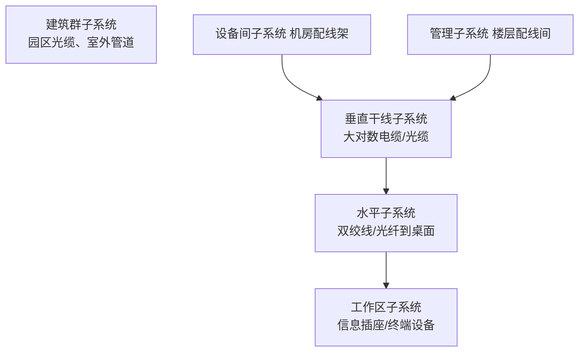
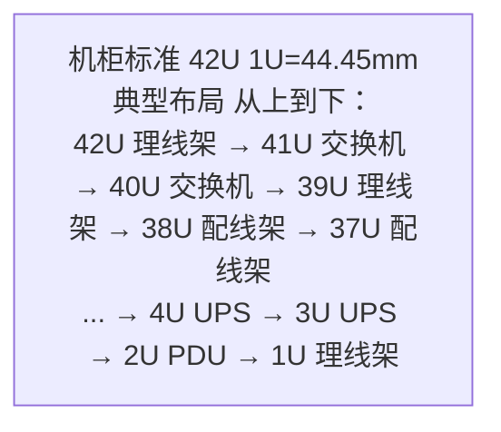
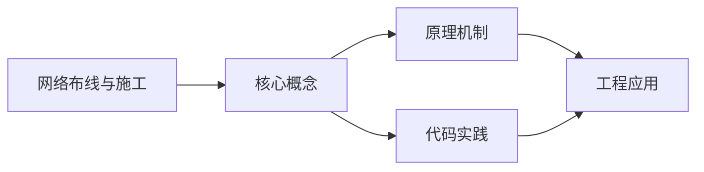

## 1. 学习目标（Bloom 分类）

本节按照布鲁姆教育目标分类学组织学习路径。本文主题为《网络布线与施工》，属于 网络 模块，读者可以根据自身阶段选择阅读深度。

记忆层面：能够准确复述本文的核心概念、术语与基本语法或操作步骤，并能够在提问或检索时快速定位对应知识点。能够说出 网络 的核心概念、组件与标准流程。

理解层面：能够用自己的语言解释核心原理与工作机制，说明概念之间的因果关系，而不是机械记忆结论。能够解释 网络 的工作原理与关键机制。

应用层面：能够在真实项目或练习场景中运用本文知识解决具体问题，写出正确且可维护的实现。能够执行 网络 相关的标准操作与配置。

分析层面：能够拆解复杂问题，比较本文主题与相邻概念的异同，识别边界条件与例外情况。能够分析 网络 方案在可靠性、成本与性能上的权衡。

评价层面：能够根据约束条件（性能、可读性、安全、成本）评价不同方案的优劣，做出有依据的技术决策。能够评价 网络 中的技术选型。

创造层面：能够把本文知识与其他模块知识组合，设计出新的解决方案或可复用的工程模式。能够设计基于 网络 的完整解决方案。

通过本节学习，读者应当能够把《网络布线与施工》纳入自己的知识网络，并与 网络 模块的其他主题（TCP/IP、HTTP、DNS、网络安全、负载均衡）建立关联。

## 2. 历史动机与发展脉络

《网络布线与施工》是 网络 领域的重要主题。要真正理解它，需要先了解它解决的问题与演进过程。

网络是分布式系统的地基：从 ARPANET（1969）到互联网，TCP/IP 协议族（1974 年提出）成为事实标准；HTTP 从 1991 年至今演进到 HTTP/3。
分层模型：OSI 七层与 TCP/IP 四层；每层职责清晰，上层依赖下层服务；理解分层才能定位故障。
现代网络主题：IPv6 过渡、HTTP/2/3、TLS 加密、CDN 与边缘计算、软件定义网络（SDN）。

回到本文主题：网络布线与施工 的提出与成熟，正是上述技术背景下的必然产物。早期实现往往以简单可用为目标，随着工程规模扩大，社区逐渐沉淀出标准做法与最佳实践；理解这一脉络，可以帮助读者判断“为什么文档中的推荐写法是现在这个样子”，也能在遇到历史遗留代码时准确识别其设计年代与取舍。


## 3. 形式化定义与核心概念精讲

本节把《网络布线与施工》涉及的核心概念以“定义 + 讲解”的形式展开。读者应把定义当作工具，把讲解当作理解路径；两者结合才能形成可迁移的知识。

TCP：三次握手建立、四次挥手关闭；可靠传输（序号/确认/重传）、流量控制（滑动窗口）、拥塞控制（慢启动/拥塞避免）。
HTTP：请求-响应模型；方法（GET/POST/PUT/DELETE）、状态码（2xx/3xx/4xx/5xx）、头字段；无状态 + Cookie/Token 会话。
DNS：域名到 IP 的分布式解析，递归与迭代查询，缓存与 TTL；HTTP 层通过域名访问。

### 3.1 原文章节逐一精讲

原文档把主题拆分为 10 个小节，下面按顺序给出每一节的导读讲解，随后保留原文细节供精读。

#### 原文精读（完整保留）


#### 1. 综合布线工程设计

##### 1.1 综合布线系统组成

综合布线系统由六个子系统构成：



##### 1.2 各子系统设计要点

| 子系统   | 传输介质             | 拓扑结构  | 设计要点            |
| :------- | :------------------- | :-------- | :------------------ |
| 工作区   | 跳线                 | 星型      | 每工位 ≥ 2 个信息点 |
| 水平     | 超5类/6类/6A类双绞线 | 星型      | 链路长度 ≤ 90m      |
| 垂直干线 | 室内多模/单模光缆    | 星型/树型 | 光纤芯数按需冗余    |
| 设备间   | 配线架/跳线          | 星型      | 环境温湿度控制      |
| 管理     | 配线架/标签          | 星型      | 标识规范、变更记录  |
| 建筑群   | 室外光缆             | 星型/环型 | 管道/直埋/架空敷设  |

##### 1.3 线缆选型

| 线缆类别     | 最大传输速率 | 带宽频率 | 有效传输距离 | 典型应用        |
| :----------- | :----------- | :------- | :----------- | :-------------- |
| 超5类(Cat5e) | 1Gbps        | 100MHz   | 100m         | 百兆/千兆以太网 |
| 6类(Cat6)    | 1Gbps        | 250MHz   | 100m         | 千兆以太网      |
| 6A类(Cat6A)  | 10Gbps       | 500MHz   | 100m         | 万兆以太网      |
| 多模光缆     | 10Gbps+      | -        | 300~550m     | 楼内垂直主干    |
| 单模光缆     | 100Gbps+     | -        | 10km+        | 建筑群/远距离   |

#### 2. 铜缆端接

##### 2.1 T568A 与 T568B 线序

```
T568B（国内常用）:
  1-橙白  2-橙  3-绿白  4-蓝  5-蓝白  6-绿  7-棕白  8-棕

T568A:
  1-绿白  2-绿  3-橙白  4-蓝  5-蓝白  6-橙  7-棕白  8-棕
```

> **注意**：同一工程中必须统一使用一种线序标准，推荐 T568B。

##### 2.2 线缆类型与用途

| 线缆类型          | 一端线序 | 另一端线序 | 用途                   |
| :---------------- | :------- | :--------- | :--------------------- |
| 直通线(Straight)  | T568B    | T568B      | 主机↔交换机、路由↔交换 |
| 交叉线(Crossover) | T568A    | T568B      | 同类设备直连           |
| 全反线(Rollover)  | 1→8翻转  | 8→1翻转    | Console 配置线         |

##### 2.3 端接工艺要求

1. 剥除护套长度：15~20mm
2. 解绞长度：≤ 13mm（超5类/6类），≤ 25mm（6A类）
3. 线对保持绞合状态至端接点
4. 端接后线缆不受侧向拉力
5. 使用专用打线工具（110型/Krone型）

#### 3. 光纤熔接

##### 3.1 光纤类型

| 类型     | 纤芯直径 | 包层直径 | 光源  | 传输距离  | 颜色标识 |
| :------- | :------- | :------- | :---- | :-------- | :------- |
| OM1 多模 | 62.5μm   | 125μm    | LED   | 275m@10G  | 橙色     |
| OM2 多模 | 50μm     | 125μm    | LED   | 550m@1G   | 橙色     |
| OM3 多模 | 50μm     | 125μm    | VCSEL | 300m@10G  | 水蓝色   |
| OM4 多模 | 50μm     | 125μm    | VCSEL | 400m@10G  | 品红色   |
| OS2 单模 | 9μm      | 125μm    | 激光  | 10km+@10G | 黄色     |

##### 3.2 光纤熔接流程

```
1. 剥缆 → 去除光缆外护套（约1.5m）
2. 剥纤 → 去除光纤涂覆层（30~40mm）
3. 清洁 → 无水酒精棉擦拭裸纤
4. 切割 → 精密光纤切割刀，切割长度 16±1mm
5. 熔接 → 光纤熔接机自动对准、放电熔接
6. 估算损耗 → 熔接机显示损耗值（应 ≤ 0.05dB）
7. 盘纤 → 在熔接盒中按规范盘绕余纤
8. 固定 → 热缩管保护熔接点
9. 测试 → OTDR 或光功率计测试链路损耗
```

##### 3.3 光纤连接器类型

| 连接器 | 形状   | 插入损耗 | 特点             | 应用       |
| :----- | :----- | :------- | :--------------- | :--------- |
| SC     | 方形   | ≤ 0.3dB  | 推拉式，密度高   | 交换机光口 |
| LC     | 小方形 | ≤ 0.2dB  | 小型化，双工常用 | SFP 模块   |
| FC     | 圆形   | ≤ 0.5dB  | 螺纹锁紧，抗震   | 电信设备   |
| ST     | 圆形   | ≤ 0.5dB  | 卡口式           | 旧设备     |
| MPO    | 矩形   | ≤ 0.5dB  | 多芯（12/24芯）  | 数据中心   |

#### 4. 配线架安装

##### 4.1 配线架类型

| 类型        | 用途           | 安装位置        |
| :---------- | :------------- | :-------------- |
| 110 配线架  | 语音/数据端接  | 楼层配线间      |
| RJ45 配线架 | 数据网络端接   | 楼层配线间/机房 |
| 光纤配线架  | 光纤端接与分配 | 机房            |
| 理线架      | 线缆整理与导向 | 机柜            |

##### 4.2 机柜安装规范



##### 4.3 机柜环境要求

| 参数 | 要求          | 说明           |
| :--- | :------------ | :------------- |
| 温度 | 18°C ~ 27°C   | ASHRAE 推荐    |
| 湿度 | 40% ~ 60% RH  | 防静电、防凝露 |
| 供电 | 双路 UPS      | 单路负载 ≤ 80% |
| 接地 | 接地电阻 ≤ 1Ω | 独立接地极     |
| 净空 | 前门 ≥ 0.6m   | 后门 ≥ 0.8m    |

#### 5. 理线与标识

##### 5.1 理线规范

```
1. 线缆从机柜两侧分别走线（左侧/右侧）
2. 使用理线架/理线槽固定线缆走向
3. 强电与弱电分离，间距 ≥ 30cm
4. 线缆弯曲半径：
   - 双绞线 ≥ 外径 8 倍
   - 光缆 ≥ 外径 15 倍
5. 预留适当余量（约 3~5m）
6. 使用魔术贴/尼龙扎带固定（避免过紧）
```

##### 5.2 标识规范

| 标识对象   | 标识格式                    | 示例                  |
| :--------- | :-------------------------- | :-------------------- |
| 线缆两端   | 楼栋-楼层-配线架号-端口号   | A-3F-PP01-05          |
| 配线架端口 | 配线架号-端口号             | PP01-05               |
| 信息插座   | 楼栋-楼层-房间号-信息点序号 | A-3F-301-02           |
| 光纤跳线   | 起点设备/端口-终点设备/端口 | SW1-G0/0/1-SW2-G0/0/1 |
| 机柜设备   | 设备类型-编号               | SW-CORE-01            |

#### 6. 室外光缆敷设

##### 6.1 敷设方式

| 方式 | 适用场景    | 施工要点               |
| :--- | :---------- | :--------------------- |
| 管道 | 园区主干    | 子管敷设，人手孔过渡   |
| 直埋 | 无管道区域  | 埋深 ≥ 0.8m，铺砖保护  |
| 架空 | 临时/远距离 | 钢绞线吊挂，杆距 ≤ 50m |
| 槽道 | 建筑间连廊  | 金属槽道，防火封堵     |

##### 6.2 室外光缆选型

```
GYTS — 金属加强构件、松套层绞、钢-聚乙烯护套
GYTA — 金属加强构件、松套层绞、铝-聚乙烯护套
GYFTY — 非金属加强构件、松套层绞、聚乙烯护套（防雷区）
ADSS — 全介质自承式光缆（电力杆塔）
```

##### 6.3 人手孔施工

```bash
# 人孔尺寸（标准）
小型人孔: 1.2m × 0.9m × 1.2m(深)
中型人孔: 1.5m × 1.2m × 1.5m(深)
大型人孔: 2.0m × 1.5m × 1.8m(深)

# 手孔尺寸
小型手孔: 0.5m × 0.4m × 0.5m(深)
大型手孔: 0.8m × 0.6m × 0.8m(深)
```

#### 7. 信息模块端接

##### 7.1 端接步骤

```
1. 剥除双绞线外护套约 50mm
2. 解开线对，按 T568B 线序排列
3. 将线对卡入模块 IDC 端子槽
4. 使用打线刀将线对压入并切断多余线头
5. 安装防尘盖板
6. 使用线缆测试仪验证连通性
```

##### 7.2 模块类型

| 类型         | 打线方式     | 特点               |
| :----------- | :----------- | :----------------- |
| 免打线模块   | 无需打线刀   | 快速安装，成本略高 |
| 110 打线模块 | 110 打线刀   | 传统方式，可靠性高 |
| Krone 模块   | Krone 打线刀 | 欧标，接触电阻小   |

#### 8. 施工工艺规范

##### 8.1 线缆敷设规范

| 项目       | 规范要求                    |
| :--------- | :-------------------------- |
| 牵引力     | 双绞线 ≤ 110N，光缆 ≤ 1500N |
| 弯曲半径   | 双绞线 ≥ 8D，光缆 ≥ 15D     |
| 敷设温度   | 双绞线 ≥ 0°C，光缆 ≥ -15°C  |
| 端接余量   | 每端预留 3~5m               |
| 管线填充率 | 直管 ≤ 40%，弯管 ≤ 30%      |

##### 8.2 防火封堵

```
1. 线缆穿越楼板/墙体 → 使用防火泥/防火板封堵
2. 桥架穿越防火分区 → 防火枕 + 防火泥
3. 管道穿墙 → 阻火圈 + 防火密封胶
4. 封堵厚度 ≥ 墙体/楼板厚度
```

#### 9. 网络测试

##### 9.1 测试类型

| 测试类型 | 测试内容           | 工具           | 标准    |
| :------- | :----------------- | :------------- | :------ |
| 验证测试 | 连通性、线序、长度 | 简易测试仪     | -       |
| 鉴定测试 | 基本性能参数       | 鉴定级测试仪   | -       |
| 认证测试 | 全部参数，出具报告 | Fluke DSX-8000 | TIA-568 |

##### 9.2 关键测试参数

| 参数                 | Cat5e 要求 | Cat6 要求 | Cat6A 要求 |
| :------------------- | :--------- | :-------- | :--------- |
| 接线图               | 正确       | 正确      | 正确       |
| 长度                 | ≤ 100m     | ≤ 100m    | ≤ 100m     |
| 衰减(Insertion Loss) | ≤ 21.7dB   | ≤ 20.9dB  | ≤ 20.3dB   |
| 近端串扰(NEXT)       | ≥ 30.1dB   | ≥ 39.9dB  | ≥ 39.9dB   |
| 综合近端串扰(PSNEXT) | ≥ 27.1dB   | ≥ 37.1dB  | ≥ 37.1dB   |
| 回波损耗(RL)         | ≥ 14.0dB   | ≥ 15.0dB  | ≥ 15.0dB   |

##### 9.3 光纤链路测试

```bash
# 光功率计测试（衰减法）
1. 校准光源和光功率计
2. 发送端接入光源，接收端接入光功率计
3. 记录光功率值，计算链路损耗

# OTDR 测试（时域反射法）
1. 设置参数：波长 1310/1550nm，脉宽、量程
2. 连接 OTDR 至光纤链路
3. 分析事件表：熔接点、连接器、断裂点
4. 判断链路质量

# 链路损耗预算
损耗 = 光纤衰减 + 熔接损耗 + 连接器损耗 + 余量
     = (0.35dB/km × L) + (0.05dB × N_熔接) + (0.3dB × N_连接器) + 3dB
```

#### 10. 项目组织管理

##### 10.1 项目阶段

```
需求调研 → 方案设计 → 招标采购 → 施工实施 → 测试验收 → 运维移交
```

##### 10.2 项目文档

| 文档类型     | 内容                         | 阶段     |
| :----------- | :--------------------------- | :------- |
| 需求规格书   | 用户需求、功能要求           | 需求调研 |
| 设计方案     | 系统架构、设备选型、图纸     | 方案设计 |
| 施工组织设计 | 施工计划、人员安排、安全措施 | 施工准备 |
| 测试报告     | 认证测试结果、问题记录       | 测试验收 |
| 竣工文档     | 竣工图纸、设备清单、配置表   | 竣工移交 |
| 验收报告     | 验收结论、遗留问题           | 验收     |

##### 10.3 施工安全管理

```
1. 施工人员佩戴安全帽、绝缘手套
2. 高空作业系安全带，2m 以上需审批
3. 用电设备接地良好，使用漏电保护器
4. 光纤施工佩戴护目镜，废纤收集处理
5. 每日施工前安全交底，每周安全例会
6. 施工现场设置警示标志和围挡
```

##### 10.4 质量控制要点

| 控制环节 | 检查内容               | 频率      |
| :------- | :--------------------- | :-------- |
| 材料进场 | 型号规格、外观、合格证 | 每批次    |
| 管线敷设 | 路由、间距、固定、标识 | 每日巡检  |
| 线缆端接 | 线序、工艺、标签       | 100% 检查 |
| 设备安装 | 位置、固定、接地、标签 | 逐台检查  |
| 系统测试 | 认证测试、功能测试     | 100% 测试 |


### 3.2 概念关系图

下面用 Mermaid 图表达本文核心概念之间的关系，帮助读者建立整体图景：



图中展示的是本文知识的结构化关系：核心概念是入口，原理机制解释“为什么”，代码实践演示“怎么做”，工程应用回答“何时用”。读者学习时可以把每个小节的内容挂接到对应节点上。

## 4. 理论推导与原理解析

本节深入《网络布线与施工》背后的原理。理论部分不求面面俱到，而是聚焦“能解释现象、能指导实践”的关键推导。

TCP：三次握手建立、四次挥手关闭；可靠传输（序号/确认/重传）、流量控制（滑动窗口）、拥塞控制（慢启动/拥塞避免）。
HTTP：请求-响应模型；方法（GET/POST/PUT/DELETE）、状态码（2xx/3xx/4xx/5xx）、头字段；无状态 + Cookie/Token 会话。
DNS：域名到 IP 的分布式解析，递归与迭代查询，缓存与 TTL；HTTP 层通过域名访问。
TLS：握手协商密钥（证书 + 密钥交换），加密传输，防窃听防篡改；HTTPS 是 HTTP + TLS。

需要强调的是，理论推导与工程实践之间存在翻译层：理论给出的是理想化模型与边界条件，工程代码则必须处理真实环境中的例外。读者在学习时应先掌握理论的“标准情形”，再通过陷阱章节了解“非标准情形”。

## 5. 代码示例与逐行讲解

本节把原文中的代码示例系统整理，并为每个示例补充用途说明与讲解。读者不应只浏览代码，而应逐段对照讲解理解设计意图。

### 5.1 示例：1.1 综合布线系统组成

该示例来自原文《1.1 综合布线系统组成》小节，用于演示网络布线与施工相关操作。阅读时请先看代码结构，再看其后的讲解。


讲解：这段代码演示了本节核心知识点。代码中的关键操作可以归纳为三步：准备（定义或初始化）、执行（核心逻辑）、收尾（释放资源或返回结果）。实际项目中，这三步往往被封装为函数或类，以提升复用性与可测试性。

关键点分析：

该示例共 11 行有效代码，结构以数据或配置为主。阅读时应关注：数据字段的含义、配置项的作用，以及它们与运行行为的对应关系。

进阶思考路径：先尝试修改参数观察行为变化，再把示例中的模式迁移到自己的项目中；每次修改都记录预期与实测差异，这是把示例转化为能力的最快方式。

### 5.2 示例：2.1 T568A 与 T568B 线序

该示例来自原文《2.1 T568A 与 T568B 线序》小节，用于演示网络布线与施工相关操作。阅读时请先看代码结构，再看其后的讲解。

```text
T568B（国内常用）:
  1-橙白  2-橙  3-绿白  4-蓝  5-蓝白  6-绿  7-棕白  8-棕

T568A:
  1-绿白  2-绿  3-橙白  4-蓝  5-蓝白  6-橙  7-棕白  8-棕
```

讲解：这段代码演示了本节核心知识点。代码中的关键操作可以归纳为三步：准备（定义或初始化）、执行（核心逻辑）、收尾（释放资源或返回结果）。实际项目中，这三步往往被封装为函数或类，以提升复用性与可测试性。

关键点分析：

该示例共 4 行有效代码，结构以数据或配置为主。阅读时应关注：数据字段的含义、配置项的作用，以及它们与运行行为的对应关系。

进阶思考路径：先尝试修改参数观察行为变化，再把示例中的模式迁移到自己的项目中；每次修改都记录预期与实测差异，这是把示例转化为能力的最快方式。

### 5.3 示例：3.2 光纤熔接流程

该示例来自原文《3.2 光纤熔接流程》小节，用于演示网络布线与施工相关操作。阅读时请先看代码结构，再看其后的讲解。

```text
1. 剥缆 → 去除光缆外护套（约1.5m）
2. 剥纤 → 去除光纤涂覆层（30~40mm）
3. 清洁 → 无水酒精棉擦拭裸纤
4. 切割 → 精密光纤切割刀，切割长度 16±1mm
5. 熔接 → 光纤熔接机自动对准、放电熔接
6. 估算损耗 → 熔接机显示损耗值（应 ≤ 0.05dB）
7. 盘纤 → 在熔接盒中按规范盘绕余纤
8. 固定 → 热缩管保护熔接点
9. 测试 → OTDR 或光功率计测试链路损耗
```

讲解：这段代码演示了本节核心知识点。代码中的关键操作可以归纳为三步：准备（定义或初始化）、执行（核心逻辑）、收尾（释放资源或返回结果）。实际项目中，这三步往往被封装为函数或类，以提升复用性与可测试性。

关键点分析：

该示例共 9 行有效代码，结构以数据或配置为主。阅读时应关注：数据字段的含义、配置项的作用，以及它们与运行行为的对应关系。

进阶思考路径：先尝试修改参数观察行为变化，再把示例中的模式迁移到自己的项目中；每次修改都记录预期与实测差异，这是把示例转化为能力的最快方式。

### 5.4 示例：4.2 机柜安装规范

该示例来自原文《4.2 机柜安装规范》小节，用于演示网络布线与施工相关操作。阅读时请先看代码结构，再看其后的讲解。


讲解：这段代码演示了本节核心知识点。代码中的关键操作可以归纳为三步：准备（定义或初始化）、执行（核心逻辑）、收尾（释放资源或返回结果）。实际项目中，这三步往往被封装为函数或类，以提升复用性与可测试性。

关键点分析：

该示例共 2 行有效代码，结构以数据或配置为主。阅读时应关注：数据字段的含义、配置项的作用，以及它们与运行行为的对应关系。

进阶思考路径：先尝试修改参数观察行为变化，再把示例中的模式迁移到自己的项目中；每次修改都记录预期与实测差异，这是把示例转化为能力的最快方式。

### 5.5 示例：5.1 理线规范

该示例来自原文《5.1 理线规范》小节，用于演示网络布线与施工相关操作。阅读时请先看代码结构，再看其后的讲解。

```text
1. 线缆从机柜两侧分别走线（左侧/右侧）
2. 使用理线架/理线槽固定线缆走向
3. 强电与弱电分离，间距 ≥ 30cm
4. 线缆弯曲半径：
   - 双绞线 ≥ 外径 8 倍
   - 光缆 ≥ 外径 15 倍
5. 预留适当余量（约 3~5m）
6. 使用魔术贴/尼龙扎带固定（避免过紧）
```

讲解：这段代码演示了本节核心知识点。代码中的关键操作可以归纳为三步：准备（定义或初始化）、执行（核心逻辑）、收尾（释放资源或返回结果）。实际项目中，这三步往往被封装为函数或类，以提升复用性与可测试性。

关键点分析：

该示例共 8 行有效代码，结构以数据或配置为主。阅读时应关注：数据字段的含义、配置项的作用，以及它们与运行行为的对应关系。

进阶思考路径：先尝试修改参数观察行为变化，再把示例中的模式迁移到自己的项目中；每次修改都记录预期与实测差异，这是把示例转化为能力的最快方式。

### 5.6 示例：6.2 室外光缆选型

该示例来自原文《6.2 室外光缆选型》小节，用于演示网络布线与施工相关操作。阅读时请先看代码结构，再看其后的讲解。

```text
GYTS — 金属加强构件、松套层绞、钢-聚乙烯护套
GYTA — 金属加强构件、松套层绞、铝-聚乙烯护套
GYFTY — 非金属加强构件、松套层绞、聚乙烯护套（防雷区）
ADSS — 全介质自承式光缆（电力杆塔）
```

讲解：这段代码演示了本节核心知识点。代码中的关键操作可以归纳为三步：准备（定义或初始化）、执行（核心逻辑）、收尾（释放资源或返回结果）。实际项目中，这三步往往被封装为函数或类，以提升复用性与可测试性。

关键点分析：

该示例共 4 行有效代码，结构以数据或配置为主。阅读时应关注：数据字段的含义、配置项的作用，以及它们与运行行为的对应关系。

进阶思考路径：先尝试修改参数观察行为变化，再把示例中的模式迁移到自己的项目中；每次修改都记录预期与实测差异，这是把示例转化为能力的最快方式。

### 5.7 示例：6.3 人手孔施工

该示例来自原文《6.3 人手孔施工》小节，用于演示网络布线与施工相关操作。阅读时请先看代码结构，再看其后的讲解。

```bash
# 人孔尺寸（标准）
小型人孔: 1.2m × 0.9m × 1.2m(深)
中型人孔: 1.5m × 1.2m × 1.5m(深)
大型人孔: 2.0m × 1.5m × 1.8m(深)

# 手孔尺寸
小型手孔: 0.5m × 0.4m × 0.5m(深)
大型手孔: 0.8m × 0.6m × 0.8m(深)
```

讲解：这段代码演示了本节核心知识点。代码中的关键操作可以归纳为三步：准备（定义或初始化）、执行（核心逻辑）、收尾（释放资源或返回结果）。实际项目中，这三步往往被封装为函数或类，以提升复用性与可测试性。

关键点分析：

该示例共 7 行有效代码，结构以数据或配置为主。阅读时应关注：数据字段的含义、配置项的作用，以及它们与运行行为的对应关系。

进阶思考路径：先尝试修改参数观察行为变化，再把示例中的模式迁移到自己的项目中；每次修改都记录预期与实测差异，这是把示例转化为能力的最快方式。

### 5.8 示例：7.1 端接步骤

该示例来自原文《7.1 端接步骤》小节，用于演示网络布线与施工相关操作。阅读时请先看代码结构，再看其后的讲解。

```text
1. 剥除双绞线外护套约 50mm
2. 解开线对，按 T568B 线序排列
3. 将线对卡入模块 IDC 端子槽
4. 使用打线刀将线对压入并切断多余线头
5. 安装防尘盖板
6. 使用线缆测试仪验证连通性
```

讲解：这段代码演示了本节核心知识点。代码中的关键操作可以归纳为三步：准备（定义或初始化）、执行（核心逻辑）、收尾（释放资源或返回结果）。实际项目中，这三步往往被封装为函数或类，以提升复用性与可测试性。

关键点分析：

该示例共 6 行有效代码，结构以数据或配置为主。阅读时应关注：数据字段的含义、配置项的作用，以及它们与运行行为的对应关系。

进阶思考路径：先尝试修改参数观察行为变化，再把示例中的模式迁移到自己的项目中；每次修改都记录预期与实测差异，这是把示例转化为能力的最快方式。

### 5.9 示例：8.2 防火封堵

该示例来自原文《8.2 防火封堵》小节，用于演示网络布线与施工相关操作。阅读时请先看代码结构，再看其后的讲解。

```text
1. 线缆穿越楼板/墙体 → 使用防火泥/防火板封堵
2. 桥架穿越防火分区 → 防火枕 + 防火泥
3. 管道穿墙 → 阻火圈 + 防火密封胶
4. 封堵厚度 ≥ 墙体/楼板厚度
```

讲解：这段代码演示了本节核心知识点。代码中的关键操作可以归纳为三步：准备（定义或初始化）、执行（核心逻辑）、收尾（释放资源或返回结果）。实际项目中，这三步往往被封装为函数或类，以提升复用性与可测试性。

关键点分析：

该示例共 4 行有效代码，结构以数据或配置为主。阅读时应关注：数据字段的含义、配置项的作用，以及它们与运行行为的对应关系。

进阶思考路径：先尝试修改参数观察行为变化，再把示例中的模式迁移到自己的项目中；每次修改都记录预期与实测差异，这是把示例转化为能力的最快方式。

### 5.10 示例：9.3 光纤链路测试

该示例来自原文《9.3 光纤链路测试》小节，用于演示网络布线与施工相关操作。阅读时请先看代码结构，再看其后的讲解。

```bash
# 光功率计测试（衰减法）
1. 校准光源和光功率计
2. 发送端接入光源，接收端接入光功率计
3. 记录光功率值，计算链路损耗

# OTDR 测试（时域反射法）
1. 设置参数：波长 1310/1550nm，脉宽、量程
2. 连接 OTDR 至光纤链路
3. 分析事件表：熔接点、连接器、断裂点
4. 判断链路质量

# 链路损耗预算
损耗 = 光纤衰减 + 熔接损耗 + 连接器损耗 + 余量
     = (0.35dB/km × L) + (0.05dB × N_熔接) + (0.3dB × N_连接器) + 3dB
```

讲解：这段代码演示了本节核心知识点。代码中的关键操作可以归纳为三步：准备（定义或初始化）、执行（核心逻辑）、收尾（释放资源或返回结果）。实际项目中，这三步往往被封装为函数或类，以提升复用性与可测试性。

关键点分析：

该示例共 12 行有效代码，结构以数据或配置为主。阅读时应关注：数据字段的含义、配置项的作用，以及它们与运行行为的对应关系。

进阶思考路径：先尝试修改参数观察行为变化，再把示例中的模式迁移到自己的项目中；每次修改都记录预期与实测差异，这是把示例转化为能力的最快方式。

### 5.11 示例：10.1 项目阶段

该示例来自原文《10.1 项目阶段》小节，用于演示网络布线与施工相关操作。阅读时请先看代码结构，再看其后的讲解。

```text
需求调研 → 方案设计 → 招标采购 → 施工实施 → 测试验收 → 运维移交
```

讲解：这段代码演示了本节核心知识点。代码中的关键操作可以归纳为三步：准备（定义或初始化）、执行（核心逻辑）、收尾（释放资源或返回结果）。实际项目中，这三步往往被封装为函数或类，以提升复用性与可测试性。

关键点分析：

该示例共 1 行有效代码，结构以数据或配置为主。阅读时应关注：数据字段的含义、配置项的作用，以及它们与运行行为的对应关系。

进阶思考路径：先尝试修改参数观察行为变化，再把示例中的模式迁移到自己的项目中；每次修改都记录预期与实测差异，这是把示例转化为能力的最快方式。

### 5.12 示例：10.3 施工安全管理

该示例来自原文《10.3 施工安全管理》小节，用于演示网络布线与施工相关操作。阅读时请先看代码结构，再看其后的讲解。

```text
1. 施工人员佩戴安全帽、绝缘手套
2. 高空作业系安全带，2m 以上需审批
3. 用电设备接地良好，使用漏电保护器
4. 光纤施工佩戴护目镜，废纤收集处理
5. 每日施工前安全交底，每周安全例会
6. 施工现场设置警示标志和围挡
```

讲解：这段代码演示了本节核心知识点。代码中的关键操作可以归纳为三步：准备（定义或初始化）、执行（核心逻辑）、收尾（释放资源或返回结果）。实际项目中，这三步往往被封装为函数或类，以提升复用性与可测试性。

关键点分析：

该示例共 6 行有效代码，结构以数据或配置为主。阅读时应关注：数据字段的含义、配置项的作用，以及它们与运行行为的对应关系。

进阶思考路径：先尝试修改参数观察行为变化，再把示例中的模式迁移到自己的项目中；每次修改都记录预期与实测差异，这是把示例转化为能力的最快方式。


综合以上示例，可以总结出本主题的代码实践要点：第一，先定义清晰的输入输出契约；第二，核心逻辑保持单一职责；第三，错误处理与边界条件不可省略；第四，命名与注释表达意图而非复述代码。

## 6. 对比分析

对比是理解《网络布线与施工》定位的最快路径。下面从多个维度与相邻方案进行对比。

TCP 与 UDP：TCP 可靠有序、UDP 快速无连接；QUIC 在 UDP 上实现可靠与多路复用。
HTTP/1.1 与 HTTP/2：多路复用、头部压缩、服务器推送；HTTP/3 基于 QUIC 降低握手延迟。
负载均衡四层与七层：四层（L4）转发 IP/端口，七层（L7）按 HTTP 内容路由。

对比的目的不是分出绝对优劣，而是建立选择依据：不同约束条件下，最优解不同。读者应把每个对比维度转化为决策检查清单。

## 7. 常见陷阱与最佳实践

本节整理该主题的高频错误与推荐做法。每个陷阱先描述现象，再解释原因，最后给出最佳实践。

### 7.1 TCP 与 UDP 误用

可靠传输选 TCP，实时低延迟可容忍丢包选 UDP/QUIC。

深入讲解：该问题之所以被归类为“常见陷阱”，是因为它在初学者的代码中反复出现，而且往往不在第一时间暴露——错误通常隐藏在特定数据或特定时序下。

从成因上看，TCP 与 UDP 误用 一般源于对 网络 某个机制的理解偏差：要么误用了默认行为，要么忽略了边界条件，要么把其他语言的思维惯性带了过来。

从影响上看，TCP 与 UDP 误用 轻则产生错误结果，重则导致资源泄漏、数据损坏或安全事故；这也是为什么工程评审中会把它列为检查项。

从修复策略上看，处理TCP 与 UDP 误用的正确顺序是：先复现（构造最小用例），再定位（确认机制层面的根因），最后修复并补充回归测试。跳过复现直接改代码，往往治标不治本。

### 7.2 HTTP 状态码误用

业务错误返回 200 导致监控失真。按语义使用 4xx/5xx。

深入讲解：该问题之所以被归类为“常见陷阱”，是因为它在初学者的代码中反复出现，而且往往不在第一时间暴露——错误通常隐藏在特定数据或特定时序下。

从成因上看，HTTP 状态码误用 一般源于对 网络 某个机制的理解偏差：要么误用了默认行为，要么忽略了边界条件，要么把其他语言的思维惯性带了过来。

从影响上看，HTTP 状态码误用 轻则产生错误结果，重则导致资源泄漏、数据损坏或安全事故；这也是为什么工程评审中会把它列为检查项。

从修复策略上看，处理HTTP 状态码误用的正确顺序是：先复现（构造最小用例），再定位（确认机制层面的根因），最后修复并补充回归测试。跳过复现直接改代码，往往治标不治本。

### 7.3 DNS 缓存问题

域名变更后本地缓存旧 IP。TTL 与刷新策略。

深入讲解：该问题之所以被归类为“常见陷阱”，是因为它在初学者的代码中反复出现，而且往往不在第一时间暴露——错误通常隐藏在特定数据或特定时序下。

从成因上看，DNS 缓存问题 一般源于对 网络 某个机制的理解偏差：要么误用了默认行为，要么忽略了边界条件，要么把其他语言的思维惯性带了过来。

从影响上看，DNS 缓存问题 轻则产生错误结果，重则导致资源泄漏、数据损坏或安全事故；这也是为什么工程评审中会把它列为检查项。

从修复策略上看，处理DNS 缓存问题的正确顺序是：先复现（构造最小用例），再定位（确认机制层面的根因），最后修复并补充回归测试。跳过复现直接改代码，往往治标不治本。

### 7.4 TLS 证书过期

服务突然不可用。证书监控与自动续期。

深入讲解：该问题之所以被归类为“常见陷阱”，是因为它在初学者的代码中反复出现，而且往往不在第一时间暴露——错误通常隐藏在特定数据或特定时序下。

从成因上看，TLS 证书过期 一般源于对 网络 某个机制的理解偏差：要么误用了默认行为，要么忽略了边界条件，要么把其他语言的思维惯性带了过来。

从影响上看，TLS 证书过期 轻则产生错误结果，重则导致资源泄漏、数据损坏或安全事故；这也是为什么工程评审中会把它列为检查项。

从修复策略上看，处理TLS 证书过期的正确顺序是：先复现（构造最小用例），再定位（确认机制层面的根因），最后修复并补充回归测试。跳过复现直接改代码，往往治标不治本。

### 7.5 长连接泄漏

连接未复用或超时未清理。连接池 + 空闲超时。

深入讲解：该问题之所以被归类为“常见陷阱”，是因为它在初学者的代码中反复出现，而且往往不在第一时间暴露——错误通常隐藏在特定数据或特定时序下。

从成因上看，长连接泄漏 一般源于对 网络 某个机制的理解偏差：要么误用了默认行为，要么忽略了边界条件，要么把其他语言的思维惯性带了过来。

从影响上看，长连接泄漏 轻则产生错误结果，重则导致资源泄漏、数据损坏或安全事故；这也是为什么工程评审中会把它列为检查项。

从修复策略上看，处理长连接泄漏的正确顺序是：先复现（构造最小用例），再定位（确认机制层面的根因），最后修复并补充回归测试。跳过复现直接改代码，往往治标不治本。

### 7.6 CORS 误解

CORS 是浏览器策略非服务器安全。正确配置白名单。

深入讲解：该问题之所以被归类为“常见陷阱”，是因为它在初学者的代码中反复出现，而且往往不在第一时间暴露——错误通常隐藏在特定数据或特定时序下。

从成因上看，CORS 误解 一般源于对 网络 某个机制的理解偏差：要么误用了默认行为，要么忽略了边界条件，要么把其他语言的思维惯性带了过来。

从影响上看，CORS 误解 轻则产生错误结果，重则导致资源泄漏、数据损坏或安全事故；这也是为什么工程评审中会把它列为检查项。

从修复策略上看，处理CORS 误解的正确顺序是：先复现（构造最小用例），再定位（确认机制层面的根因），最后修复并补充回归测试。跳过复现直接改代码，往往治标不治本。

### 7.7 NAT 与内网穿透

P2P 场景需 NAT 打洞与中继。

深入讲解：该问题之所以被归类为“常见陷阱”，是因为它在初学者的代码中反复出现，而且往往不在第一时间暴露——错误通常隐藏在特定数据或特定时序下。

从成因上看，NAT 与内网穿透 一般源于对 网络 某个机制的理解偏差：要么误用了默认行为，要么忽略了边界条件，要么把其他语言的思维惯性带了过来。

从影响上看，NAT 与内网穿透 轻则产生错误结果，重则导致资源泄漏、数据损坏或安全事故；这也是为什么工程评审中会把它列为检查项。

从修复策略上看，处理NAT 与内网穿透的正确顺序是：先复现（构造最小用例），再定位（确认机制层面的根因），最后修复并补充回归测试。跳过复现直接改代码，往往治标不治本。

### 7.8 MTU 分片

大包触发分片丢包。合理设置 MSS/MTU。

深入讲解：该问题之所以被归类为“常见陷阱”，是因为它在初学者的代码中反复出现，而且往往不在第一时间暴露——错误通常隐藏在特定数据或特定时序下。

从成因上看，MTU 分片 一般源于对 网络 某个机制的理解偏差：要么误用了默认行为，要么忽略了边界条件，要么把其他语言的思维惯性带了过来。

从影响上看，MTU 分片 轻则产生错误结果，重则导致资源泄漏、数据损坏或安全事故；这也是为什么工程评审中会把它列为检查项。

从修复策略上看，处理MTU 分片的正确顺序是：先复现（构造最小用例），再定位（确认机制层面的根因），最后修复并补充回归测试。跳过复现直接改代码，往往治标不治本。

### 7.0 最佳实践总览

1. 域名与证书：统一管理 DNS、TLS 证书（自动续期）。
2. 性能：HTTP/2 多路复用、连接复用、压缩、缓存头。
3. 安全：TLS 1.2+、HSTS、安全 Cookie 属性。
4. 故障排查：ping/traceroute/curl/Dig/nslookup 分步定位。

把这些最佳实践固化为团队规范与代码评审检查项，是避免同类问题反复出现的关键。

## 8. 工程实践

本节把《网络布线与施工》放入真实工程场景，给出可复用的模式与组织方法。

架构：CDN 加速静态内容、反向代理（Nginx）终结 TLS、网关统一入口。
监控：延迟、丢包、带宽、HTTP 错误率；链路追踪定位跨服务延迟。
安全：WAF、DDoS 防护、速率限制、访问日志审计。

### 8.1 工程实践的原则拆解

以上工程实践可以归纳为四条原则。第一，配置与代码分离：网络 项目中环境差异应通过配置注入，而不是散落在代码分支中；这保证同一份代码可以在开发、测试、生产环境一致运行。

第二，接口稳定优先：对外接口（函数签名、协议、数据格式）一旦被消费方依赖，变更成本极高；设计时应预留扩展点并保持向后兼容。

第三，可观测性内置：日志、指标与追踪应该在功能开发时同步设计，而不是故障发生后补救；没有观测手段的模块等于黑盒。

第四，变更可回滚：任何发布都应有对应的回滚方案；数据库迁移、配置变更与代码发布一样需要版本管理与逆向路径。

### 8.2 实践落地的检查清单

- [ ] 架构：对照本节描述，检查当前项目是否已经落实；未落实的项列入技术债并排期处理。
- [ ] 监控：对照本节描述，检查当前项目是否已经落实；未落实的项列入技术债并排期处理。
- [ ] 安全：对照本节描述，检查当前项目是否已经落实；未落实的项列入技术债并排期处理。

工程实践的共性原则：配置与代码分离、接口稳定优先、可观测性内置、变更可回滚。这些原则适用于本主题的所有实现。

## 9. 案例研究

本节通过一个完整案例把《网络布线与施工》的知识串起来。案例按“需求分析、方案设计、实现、验证”四步展开。

需求：优化 Web 应用访问延迟与安全性。
方案：CDN 静态加速 + HTTP/3 + TLS 1.3 + 连接池优化。
要点：证书自动化、缓存策略、核心指标监控。
验证：多地测速、Lighthouse、安全扫描。

### 9.1 案例的扩展讨论

把案例中的方案放大到真实规模，需要额外考虑三个问题：

第一，规模：当数据量或并发量上升一个数量级时，原方案中的数据结构、缓存策略与任务调度是否仍然成立？通常需要引入分层与异步。

第二，团队：多人协作时，模块边界、接口契约与代码所有权必须明确；案例中的实现应拆分为可独立测试的单元，并配合文档说明设计意图。

第三，演进：上线后的需求变化不可避免；方案设计时应预留扩展点（配置化、插件化、事件化），并定期用真实指标验证假设。


案例研究的学习方法：先独立阅读需求，尝试在脑中形成方案，再对照实现与讲解，最后思考“如果约束变化（数据量、并发、团队规模），方案应如何调整”。

## 10. 知识要点总结与深入讲解

本节以讲解形式汇总全文要点，替代传统的习题与自测，读者不需要答题，只需跟随解释建立完整的认知框架。

关于《网络布线与施工》的核心结论：

网络问题的排查遵循分层法：物理/链路 -> 网络 -> 传输 -> 应用。
HTTP 与 TLS 是现代应用的两大接触面，状态码与证书是高频故障点。
性能与安全并存：加密、缓存、负载均衡是标配。

原文档各小节的要点回顾：

- 1. 综合布线工程设计：该小节围绕网络布线与施工展开具体细节，阅读时应关注其与核心结论的对应关系；每个小节都是核心结论在某一个侧面的展开。
- 2. 铜缆端接：该小节围绕网络布线与施工展开具体细节，阅读时应关注其与核心结论的对应关系；每个小节都是核心结论在某一个侧面的展开。
- 3. 光纤熔接：该小节围绕网络布线与施工展开具体细节，阅读时应关注其与核心结论的对应关系；每个小节都是核心结论在某一个侧面的展开。
- 4. 配线架安装：该小节围绕网络布线与施工展开具体细节，阅读时应关注其与核心结论的对应关系；每个小节都是核心结论在某一个侧面的展开。
- 5. 理线与标识：该小节围绕网络布线与施工展开具体细节，阅读时应关注其与核心结论的对应关系；每个小节都是核心结论在某一个侧面的展开。
- 6. 室外光缆敷设：该小节围绕网络布线与施工展开具体细节，阅读时应关注其与核心结论的对应关系；每个小节都是核心结论在某一个侧面的展开。
- 7. 信息模块端接：该小节围绕网络布线与施工展开具体细节，阅读时应关注其与核心结论的对应关系；每个小节都是核心结论在某一个侧面的展开。
- 8. 施工工艺规范：该小节围绕网络布线与施工展开具体细节，阅读时应关注其与核心结论的对应关系；每个小节都是核心结论在某一个侧面的展开。
- 9. 网络测试：该小节围绕网络布线与施工展开具体细节，阅读时应关注其与核心结论的对应关系；每个小节都是核心结论在某一个侧面的展开。
- 10. 项目组织管理：该小节围绕网络布线与施工展开具体细节，阅读时应关注其与核心结论的对应关系；每个小节都是核心结论在某一个侧面的展开。

把以上要点与第 3-9 节的内容对照复习，即可完成对本文主题的闭环学习。

## 11. 参考文献


MDN HTTP 文档：https://developer.mozilla.org/zh-CN/docs/Web/HTTP
RFC 9110（HTTP 语义）：https://www.rfc-editor.org/rfc/rfc9110
TCP/IP 详解（W. Richard Stevens）：https://www.oreilly.com/library/view/tcpip-illustrated-vol/
Cloudflare 学习中心：https://www.cloudflare.com/learning/
DNS 原理（RFC 1035）：https://www.rfc-editor.org/rfc/rfc1035

## 12. 延伸阅读


网络基础与协议，见 032-networking 模块文档。
网络安全（TLS/WAF），见 033-cybersecurity 模块。
负载均衡与网关，见 031-devops 模块相关文档。
尚硅谷 Bilibili 空间（https://space.bilibili.com/302417610 ）提供计算机网络课程。

## 14. 模块知识图谱与学习路径

本文属于 网络 模块。为了把《网络布线与施工》放入完整的知识网络，下面列出本模块的全部主题并给出相互关联的导读。学习时建议按模块内顺序推进，并在每个文档中留意交叉引用。


上图为模块主题的推荐学习顺序示意图（仅展示前若干主题）。各主题之间存在三类关联：

第一，前置依赖关系：早期主题是后期主题的基础，例如环境与语法先行、进阶主题随后；

第二，横向并列关系：同一层级主题从不同角度覆盖模块能力，学习顺序可以按兴趣调整；

第三，工程组合关系：多个主题在真实项目中组合使用，例如配置、性能与安全主题往往出现在同一系统的不同层面。

### 14.1 模块主题速查表

| 文档 | 主题 | 与本文的关联 |
| --- | --- | --- |
| 网络基础与协议 | 001-NetworkBasicsAndProtocol | 本文的前置基础 |
| 网络系统管理 | 002-NetworkSystemManagement | 本文的并列主题 |
| 网络布线与施工 | 003-NetworkWiringAndConstruction | 本文自身 |
| OSI与TCP-IP模型 | 004-OSITCPIPModel | 本文的并列主题 |
| 交换与路由技术 | 005-SwitchingAndRouting | 本文的并列主题 |
| 网络安全技术 | 006-NetworkSecurityTech | 本文的安全延伸 |
| 无线网络 | 007-WirelessNetwork | 本文的并列主题 |
| SDN与网络自动化 | 008-SDNNetworkAutomation | 本文的并列主题 |
| 网络存储技术 | 009-NetworkStorageTechnology | 本文的并列主题 |
| 网络故障诊断 | 010-NetworkDiagnosis | 本文的并列主题 |
| 网络设计与规划 | 011-NetworkDesignPlanning | 本文的并列主题 |
| DNS与DHCP | 012-DNSDHCP | 本文的并列主题 |
| 负载均衡技术 | 013-LoadBalanceTech | 本文的并列主题 |
| 网络自动化 | 014-NetworkAutomation | 本文的并列主题 |
| 负载均衡算法 | 015-LoadBalanceAlgorithm | 本文的并列主题 |
| 高可用LVS | 016-HighAvailabilityLVS | 本文的并列主题 |
| Keepalived双机热备 | 017-KeepalivedDualHotStandby | 本文的并列主题 |
| 网络命名空间与虚拟网桥 | 018-NetworkNamespaceVirtualBridge | 本文的并列主题 |
| 隧道技术 | 019-Tunneling | 本文的并列主题 |
| 网络故障排查工具 | 020-NetworkTroubleshootTools | 本文的并列主题 |
| BGP与多线机房互联 | 021-BGP | 本文的并列主题 |
| SDN | 022-SDN | 本文的并列主题 |
| Networking ip 命令 | 023-IPCommands | 本文的并列主题 |
| Networking 连通性检测 | 024-PingTraceroute | 本文的并列主题 |
| Networking ss 与 netstat | 025-SSNetstat | 本文的并列主题 |
| Networking tcpdump 抓包 | 026-Tcpdump | 本文的并列主题 |
| Networking DNS 查询 | 027-DigNslookup | 本文的并列主题 |
| Networking curl HTTP 请求 | 028-CurlHTTPRequest | 本文的并列主题 |
| Networking iptables 防火墙 | 029-IptablesFirewall | 本文的并列主题 |
| Networking SSH 远程连接 | 030-SSHRemote | 本文的并列主题 |
| Networking nc 与 nmap | 031-NetcatNmap | 本文的并列主题 |
| Networking ARP 与路由 | 032-ARPRouting | 本文的并列主题 |
| Networking HTTP 协议 | 033-HTTPProtocol | 本文的并列主题 |
| Networking wget 文件下载 | 034-WgetDownload | 本文的并列主题 |
| Networking VPN 配置命令 | 035-VPNConfig | 本文的并列主题 |
| Networking Wireshark 命令行 | 036-WiresharkCLI | 本文的并列主题 |
| Networking IPv6 网络命令 | 037-IPv6Commands | 本文的并列主题 |
| Networking 代理配置 | 038-ProxyConfig | 本文的并列主题 |

速查表的作用是让读者快速判断：哪些文档应在阅读本文前掌握（前置基础），哪些文档应在阅读本文后继续（延伸主题）。本模块的交叉引用体系即以此表为基础。

## 15. 术语表

下表整理《网络布线与施工》及 网络 模块中出现的高频术语，给出简明释义。术语按字母序或逻辑序排列，供查阅。

| 术语 | 释义 |
| --- | --- |
| TCP | 三次握手建立、四次挥手关闭；可靠传输（序号/确认/重传）、流量控制（滑动窗口）、拥塞控制（慢启动/拥塞避免）。 |
| HTTP | 请求-响应模型；方法（GET/POST/PUT/DELETE）、状态码（2xx/3xx/4xx/5xx）、头字段；无状态 + Cookie/Token 会话。 |
| DNS | 域名到 IP 的分布式解析，递归与迭代查询，缓存与 TTL；HTTP 层通过域名访问。 |
| TLS | 握手协商密钥（证书 + 密钥交换），加密传输，防窃听防篡改；HTTPS 是 HTTP + TLS。 |
| TCP 与 UDP 误用（易错点） | 参见常见陷阱章节的详细讲解 |
| HTTP 状态码误用（易错点） | 参见常见陷阱章节的详细讲解 |
| DNS 缓存问题（易错点） | 参见常见陷阱章节的详细讲解 |
| TLS 证书过期（易错点） | 参见常见陷阱章节的详细讲解 |
| 长连接泄漏（易错点） | 参见常见陷阱章节的详细讲解 |
| CORS 误解（易错点） | 参见常见陷阱章节的详细讲解 |

术语表与正文配合使用：先通读正文，遇到模糊术语回查本表；长期使用后术语会自然进入工作记忆。

## 13. 深度专题扩展

以下专题从不同角度深入本文主题，供有进阶需求的读者研读。每个专题独立成节，内容相互补充。

### 13.1 TCP 拥塞控制

慢启动：指数增长直到 ssthresh；拥塞避免：线性增长；快速重传/快速恢复处理丢包。
BBR（Google）基于带宽与延迟估计，替代丢包驱动的传统算法。
队列与缓冲膨胀（bufferbloat）导致延迟抖动；AQM（CoDel）缓解。
调优：理解 RTT、窗口与带宽延迟积（BDP）的关系。

### 13.2 HTTPS 与证书体系

TLS 握手：ClientHello -> ServerHello + 证书 -> 密钥交换 -> Finished；1.3 一轮往返完成。
证书链：根 CA -> 中间 CA -> 站点证书；OCSP/CRL 吊销检查。
Let's Encrypt 自动化签发与续期（ACME 协议）。
配置基线：TLS 1.2+、禁用弱套件、HSTS、证书透明度。

## 16. 核心概念串讲（复习视角）

本节以“把知识讲给他人听”的方式，把《网络布线与施工》的核心概念重新串讲一遍。与前文按章节展开不同，这里的叙述更接近课堂总结：先说整体，再逐个展开，最后收束。

《网络布线与施工》属于 网络 模块。要理解它，先要理解它在模块中的位置：它解决的是该领域的一个具体问题，并依赖模块内若干前置概念；反过来，它又为后续进阶主题提供基础。

第一个概念是TCP。三次握手建立、四次挥手关闭；可靠传输（序号/确认/重传）、流量控制（滑动窗口）、拥塞控制（慢启动/拥塞避免）。

在实际使用中，TCP需要与相邻概念区分：它们的区别不在于名称，而在于适用条件与行为边界；这正是前文对比分析章节的意义。

第一个概念是HTTP。请求-响应模型；方法（GET/POST/PUT/DELETE）、状态码（2xx/3xx/4xx/5xx）、头字段；无状态 + Cookie/Token 会话。

在实际使用中，HTTP需要与相邻概念区分：它们的区别不在于名称，而在于适用条件与行为边界；这正是前文对比分析章节的意义。

第一个概念是DNS。域名到 IP 的分布式解析，递归与迭代查询，缓存与 TTL；HTTP 层通过域名访问。

在实际使用中，DNS需要与相邻概念区分：它们的区别不在于名称，而在于适用条件与行为边界；这正是前文对比分析章节的意义。

接下来是TCP。三次握手建立、四次挥手关闭；可靠传输（序号/确认/重传）、流量控制（滑动窗口）、拥塞控制（慢启动/拥塞避免）。

理解该原理的关键不是记住结论，而是记住“它从什么假设出发、推出了什么、假设不成立时会怎样”。带着这个框架复习，原理之间就会连成网络。

接下来是HTTP。请求-响应模型；方法（GET/POST/PUT/DELETE）、状态码（2xx/3xx/4xx/5xx）、头字段；无状态 + Cookie/Token 会话。

理解该原理的关键不是记住结论，而是记住“它从什么假设出发、推出了什么、假设不成立时会怎样”。带着这个框架复习，原理之间就会连成网络。

接下来是DNS。域名到 IP 的分布式解析，递归与迭代查询，缓存与 TTL；HTTP 层通过域名访问。

理解该原理的关键不是记住结论，而是记住“它从什么假设出发、推出了什么、假设不成立时会怎样”。带着这个框架复习，原理之间就会连成网络。

接下来是TLS。握手协商密钥（证书 + 密钥交换），加密传输，防窃听防篡改；HTTPS 是 HTTP + TLS。

理解该原理的关键不是记住结论，而是记住“它从什么假设出发、推出了什么、假设不成立时会怎样”。带着这个框架复习，原理之间就会连成网络。

串讲收束：把概念与原理放回本文主题，可以得出一个总纲——定义描述是什么，原理解释为什么，实践回答怎么做。三者构成完整的学习闭环；后续遇到相关问题，都可以按这个总纲检索知识。
