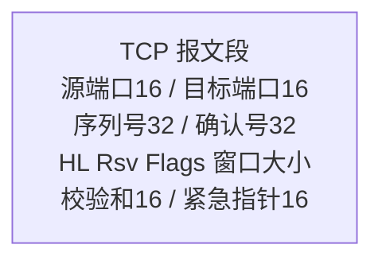
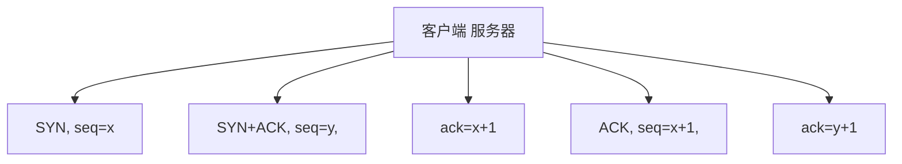
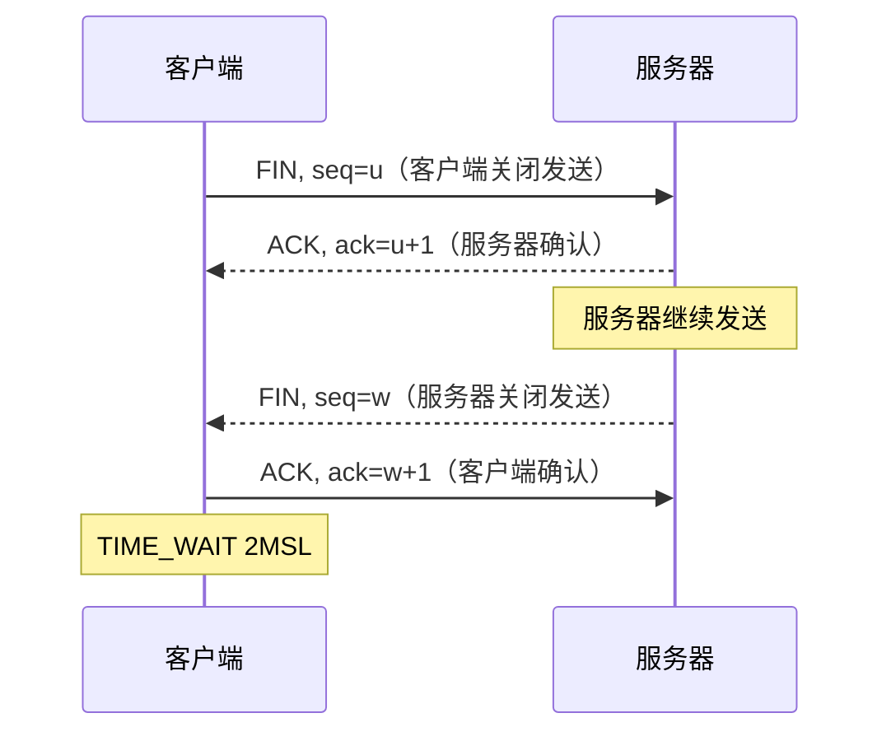
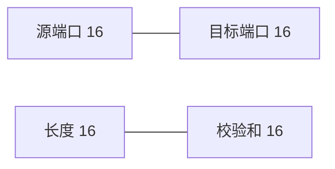
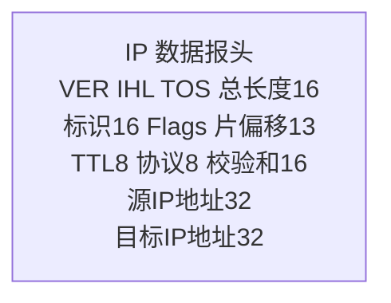
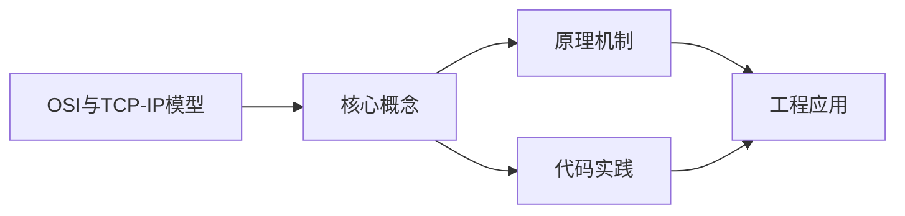
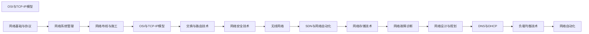

## 1. 学习目标（Bloom 分类）

本节按照布鲁姆教育目标分类学组织学习路径。本文主题为《OSI与TCP-IP模型》，属于 网络 模块，读者可以根据自身阶段选择阅读深度。

记忆层面：能够准确复述本文的核心概念、术语与基本语法或操作步骤，并能够在提问或检索时快速定位对应知识点。能够说出 网络 的核心概念、组件与标准流程。

理解层面：能够用自己的语言解释核心原理与工作机制，说明概念之间的因果关系，而不是机械记忆结论。能够解释 网络 的工作原理与关键机制。

应用层面：能够在真实项目或练习场景中运用本文知识解决具体问题，写出正确且可维护的实现。能够执行 网络 相关的标准操作与配置。

分析层面：能够拆解复杂问题，比较本文主题与相邻概念的异同，识别边界条件与例外情况。能够分析 网络 方案在可靠性、成本与性能上的权衡。

评价层面：能够根据约束条件（性能、可读性、安全、成本）评价不同方案的优劣，做出有依据的技术决策。能够评价 网络 中的技术选型。

创造层面：能够把本文知识与其他模块知识组合，设计出新的解决方案或可复用的工程模式。能够设计基于 网络 的完整解决方案。

通过本节学习，读者应当能够把《OSI与TCP-IP模型》纳入自己的知识网络，并与 网络 模块的其他主题（TCP/IP、HTTP、DNS、网络安全、负载均衡）建立关联。

## 2. 历史动机与发展脉络

《OSI与TCP-IP模型》是 网络 领域的重要主题。要真正理解它，需要先了解它解决的问题与演进过程。

网络是分布式系统的地基：从 ARPANET（1969）到互联网，TCP/IP 协议族（1974 年提出）成为事实标准；HTTP 从 1991 年至今演进到 HTTP/3。
分层模型：OSI 七层与 TCP/IP 四层；每层职责清晰，上层依赖下层服务；理解分层才能定位故障。
现代网络主题：IPv6 过渡、HTTP/2/3、TLS 加密、CDN 与边缘计算、软件定义网络（SDN）。

回到本文主题：OSI与TCP-IP模型 的提出与成熟，正是上述技术背景下的必然产物。早期实现往往以简单可用为目标，随着工程规模扩大，社区逐渐沉淀出标准做法与最佳实践；理解这一脉络，可以帮助读者判断“为什么文档中的推荐写法是现在这个样子”，也能在遇到历史遗留代码时准确识别其设计年代与取舍。


## 3. 形式化定义与核心概念精讲

本节把《OSI与TCP-IP模型》涉及的核心概念以“定义 + 讲解”的形式展开。读者应把定义当作工具，把讲解当作理解路径；两者结合才能形成可迁移的知识。

TCP：三次握手建立、四次挥手关闭；可靠传输（序号/确认/重传）、流量控制（滑动窗口）、拥塞控制（慢启动/拥塞避免）。
HTTP：请求-响应模型；方法（GET/POST/PUT/DELETE）、状态码（2xx/3xx/4xx/5xx）、头字段；无状态 + Cookie/Token 会话。
DNS：域名到 IP 的分布式解析，递归与迭代查询，缓存与 TTL；HTTP 层通过域名访问。

### 3.1 原文章节逐一精讲

原文档把主题拆分为 17 个小节，下面按顺序给出每一节的导读讲解，随后保留原文细节供精读。

#### 原文精读（完整保留）

# Networking TCP/IP 协议模型

> **符号约定**：`< >` 必填参数 | `[ ]` 可选参数

---

#### 1. OSI 七层模型详解

##### 1.1 各层功能

| 层级 | 名称       | 功能         | PDU         | 设备   |
| ---- | ---------- | ------------ | ----------- | ------ |
| 7    | 应用层     | 网络服务接口 | 数据        | 网关   |
| 6    | 表示层     | 数据格式转换 | 数据        | -      |
| 5    | 会话层     | 会话管理     | 数据        | -      |
| 4    | 传输层     | 端到端通信   | 段(Segment) | 防火墙 |
| 3    | 网络层     | 路由寻址     | 包(Packet)  | 路由器 |
| 2    | 数据链路层 | 帧传输       | 帧(Frame)   | 交换机 |
| 1    | 物理层     | 比特传输     | 比特(Bit)   | 集线器 |

##### 1.2 数据封装过程

```
应用数据
    ↓ + 应用层头
表示层PDU
    ↓ + 表示层头
会话层PDU
    ↓ + TCP/UDP头
传输层段(Segment)
    ↓ + IP头
网络层包(Packet)
    ↓ + 帧头+帧尾
数据链路层帧(Frame)
    ↓
物理层比特流(Bit)
```

#### 2. TCP/IP 模型

##### 2.1 四层结构

| TCP/IP 层  | 对应 OSI 层 | 协议                 |
| ---------- | ----------- | -------------------- |
| 应用层     | 5/6/7       | HTTP, DNS, SMTP, FTP |
| 传输层     | 4           | TCP, UDP, SCTP       |
| 网际层     | 3           | IP, ICMP, ARP        |
| 网络接口层 | 1/2         | Ethernet, Wi-Fi      |

##### 2.2 TCP vs OSI

| 特性     | OSI      | TCP/IP   |
| -------- | -------- | -------- |
| 层数     | 7        | 4        |
| 先有模型 | 是       | 否       |
| 实用性   | 理论参考 | 实际标准 |
| 严格分层 | 是       | 较灵活   |

#### 3. TCP 协议深度

##### 3.1 TCP 首部格式



**标志位**：

| 标志 | 含义             |
| ---- | ---------------- |
| URG  | 紧急指针有效     |
| ACK  | 确认号有效       |
| PSH  | 接收方应尽快交付 |
| RST  | 重置连接         |
| SYN  | 同步序列号       |
| FIN  | 释放连接         |

##### 3.2 三次握手



**为什么三次**：防止已失效的连接请求到达服务器。

##### 3.3 四次挥手



**TIME_WAIT**：等待 2MSL（最大报文段生存时间），确保最后一个 ACK 到达。

##### 3.4 滑动窗口

$$\text{发送窗口} = \min(\text{rwnd}, \text{cwnd})$$

- rwnd：接收方通告窗口
- cwnd：拥塞窗口

##### 3.5 TCP 状态机

```
CLOSED → SYN_SENT → ESTABLISHED
                ↓
CLOSED → LISTEN → SYN_RCVD → ESTABLISHED

ESTABLISHED → FIN_WAIT_1 → FIN_WAIT_2 → TIME_WAIT → CLOSED
ESTABLISHED → CLOSE_WAIT → LAST_ACK → CLOSED
```

#### 4. UDP 协议

##### 4.1 UDP 首部



仅 8 字节首部，无连接、无确认、无重传。

##### 4.2 TCP vs UDP

| 特性     | TCP       | UDP        |
| -------- | --------- | ---------- |
| 连接     | 面向连接  | 无连接     |
| 可靠性   | 可靠      | 不可靠     |
| 顺序     | 有序      | 无序       |
| 流控     | 有        | 无         |
| 拥塞控制 | 有        | 无         |
| 速度     | 较慢      | 快         |
| 首部     | 20~60字节 | 8字节      |
| 适用     | 文件传输  | 实时音视频 |

#### 5. IP 协议

##### 5.1 IPv4 首部



##### 5.2 IPv6 改进

| 特性     | IPv4         | IPv6       |
| -------- | ------------ | ---------- |
| 地址长度 | 32位         | 128位      |
| 首部     | 可变         | 固定40字节 |
| 分片     | 路由器可分片 | 仅源端分片 |
| 安全     | 可选         | 内置IPsec  |
| 配置     | 手动/DHCP    | 自动配置   |

##### 5.3 子网划分

$$\text{子网数} = 2^n$$

$$\text{每子网主机数} = 2^m - 2$$

其中 $n$ 为借用的位数，$m$ 为剩余主机位。

**示例**：192.168.1.0/24 划分为4个子网：

| 子网 | 网络地址         | 可用范围  | 广播地址 |
| ---- | ---------------- | --------- | -------- |
| 1    | 192.168.1.0/26   | .1~.62    | .63      |
| 2    | 192.168.1.64/26  | .65~.126  | .127     |
| 3    | 192.168.1.128/26 | .129~.190 | .191     |
| 4    | 192.168.1.192/26 | .193~.254 | .255     |

#### 6. ARP 与 ICMP

##### 6.1 ARP 协议

将 IP 地址解析为 MAC 地址：

```
主机A: 谁有 192.168.1.1？告诉 192.168.1.100（广播）
主机B: 192.168.1.1 的 MAC 是 aa:bb:cc:dd:ee:ff（单播）
```

**ARP 缓存**：

```bash
arp -a
ip neigh show
```

##### 6.2 ICMP 协议

| 类型 | 代码 | 含义         |
| ---- | ---- | ------------ |
| 0    | 0    | Echo Reply   |
| 3    | 0~15 | 目标不可达   |
| 5    | 0~3  | 重定向       |
| 8    | 0    | Echo Request |
| 11   | 0~1  | 超时         |

**Ping 原理**：发送 ICMP Echo Request，等待 Echo Reply。

**Traceroute 原理**：发送 TTL 递增的 IP 包，通过 ICMP 超时消息确定路径。
#### OSI 七层模型

**基本写法：OSI 模型层次**
```text
`7. 应用层 (Application) - HTTP/FTP/SMTP/DNS
6. 表示层 (Presentation) - SSL/TLS/JPEG/ASCII
5. 会话层 (Session) - NetBIOS/RPC
4. 传输层 (Transport) - TCP/UDP
3. 网络层 (Network) - IP/ICMP
2. 数据链路层 (Data Link) - Ethernet/ARP
1. 物理层 (Physical) - 电信号/光信号`
```
```text
# OSI 七层模型从上到下
7. 应用层 - 为应用程序提供网络服务
6. 表示层 - 数据格式转换和加密
5. 会话层 - 管理会话连接
4. 传输层 - 端到端通信
3. 网络层 - 路由和寻址
2. 数据链路层 - 相邻节点通信
1. 物理层 - 比特流传输
```

---

#### TCP/IP 四层模型

**基本写法：TCP/IP 模型层次**
```text
`4. 应用层 (Application) - HTTP/FTP/SMTP/DNS/SSH
3. 传输层 (Transport) - TCP/UDP
2. 网络层 (Internet) - IP/ICMP/ARP
1. 网络接口层 (Link) - Ethernet/WiFi`
```
```text
# TCP/IP 四层模型
4. 应用层 - 合并了 OSI 的应用、表示、会话层
3. 传输层 - 对应 OSI 传输层
2. 网络层 - 对应 OSI 网络层
1. 网络接口层 - 合并了 OSI 的数据链路和物理层
```

---

#### OSI 与 TCP/IP 对应关系

**基本写法：模型对应映射**
```text
`OSI 模型          TCP/IP 模型        协议示例
7. 应用层    -->   4. 应用层          HTTP, DNS
6. 表示层    -->   4. 应用层          SSL/TLS
5. 会话层    -->   4. 应用层          RPC
4. 传输层    -->   3. 传输层          TCP, UDP
3. 网络层    -->   2. 网络层          IP, ICMP
2. 数据链路层 -->  1. 网络接口层      Ethernet
1. 物理层    -->   1. 网络接口层      双绞线`
```
```text
# OSI 与 TCP/IP 模型对应关系
OSI 7层模型           TCP/IP 4层模型
应用层、表示层、会话层  -->  应用层
传输层              -->  传输层
网络层              -->  网络层
数据链路层、物理层      -->  网络接口层
```

---

#### TCP 协议

**基本写法：TCP 三次握手**
```text
`客户端              服务端
  |                   |
  |--- SYN ------->   |  客户端发送 SYN, seq=x
  |                   |
  |<-- SYN-ACK ----   |  服务端回复 SYN+ACK, seq=y, ack=x+1
  |                   |
  |--- ACK ------->   |  客户端发送 ACK, ack=y+1
  |                   |
  |<== 数据传输 ==>|`
```
```text
# TCP 三次握手建立连接
1. 客户端发送 SYN (seq=x)
2. 服务端回复 SYN+ACK (seq=y, ack=x+1)
3. 客户端发送 ACK (ack=y+1)
连接建立完成
```

**基本写法：TCP 四次挥手**
```text
`客户端              服务端
  |                   |
  |--- FIN ------->   |  客户端发送 FIN
  |<-- ACK --------   |  服务端回复 ACK
  |                   |
  |<-- FIN --------   |  服务端发送 FIN
  |--- ACK ------->   |  客户端回复 ACK`
```
```text
# TCP 四次挥手断开连接
1. 客户端发送 FIN
2. 服务端回复 ACK
3. 服务端发送 FIN
4. 客户端回复 ACK
连接断开完成
```

**基本写法：TCP 状态**
```text
`LISTEN       - 服务端监听端口
SYN_SENT     - 客户端已发送 SYN
SYN_RECV     - 服务端已收到 SYN
ESTABLISHED  - 连接已建立
FIN_WAIT_1   - 主动关闭方等待 FIN
FIN_WAIT_2   - 主动关闭方等待对方 FIN
TIME_WAIT    - 等待足够时间确保对方收到 ACK
CLOSE_WAIT   - 被动关闭方等待关闭
LAST_ACK     - 被动关闭方发送 FIN 后等待 ACK
CLOSED       - 连接已关闭`
```
```text
# TCP 连接状态转换
LISTEN -> SYN_RECV -> ESTABLISHED -> FIN_WAIT_1 -> FIN_WAIT_2 -> TIME_WAIT -> CLOSED
```

---

#### TCP 特性

**基本写法：TCP 可靠性机制**
```text
`- 序列号：保证数据有序到达
- 确认应答：确认收到的数据
- 超时重传：未收到确认则重传
- 流量控制：滑动窗口机制
- 拥塞控制：避免网络拥塞`
```
```text
# TCP 可靠性保障机制
1. 序列号和确认号 - 保证数据有序和完整
2. 超时重传 - 丢包时自动重传
3. 滑动窗口 - 流量控制
4. 拥塞控制 - 慢启动、拥塞避免
```

**基本写法：TCP 拥塞控制算法**
```text
`- 慢启动 (Slow Start) - 连接开始时缓慢增加窗口
- 拥塞避免 (Congestion Avoidance) - 线性增加窗口
- 快重传 (Fast Retransmit) - 收到 3 个重复 ACK 立即重传
- 快恢复 (Fast Recovery) - 快重传后不回到慢启动`
```
```text
# TCP 拥塞控制四个阶段
1. 慢启动 - 窗口指数增长
2. 拥塞避免 - 窗口线性增长
3. 快重传 - 检测丢包立即重传
4. 快恢复 - 拥塞后快速恢复
```

---

#### UDP 协议

**基本写法：UDP 特性**
```text
`- 无连接：不需要建立连接
- 不可靠：不保证数据到达
- 无序：不保证数据顺序
- 快速：无握手和确认开销
- 轻量：头部仅 8 字节`
```
```text
# UDP 协议特点
- 无连接，直接发送数据
- 不保证可靠性，可能丢包
- 头部小（8 字节），开销低
- 适用于实时应用：视频、语音、游戏
```

**基本写法：UDP 应用场景**
```text
`- DNS 查询 - 一次请求一次响应
- DHCP - 动态主机配置
- SNMP - 网络管理
- 流媒体 - 视频音频传输
- 在线游戏 - 实时交互`
```
```text
# UDP 常见应用
- DNS (端口 53) - 域名解析
- DHCP (端口 67/68) - IP 分配
- TFTP (端口 69) - 简单文件传输
- NTP (端口 123) - 时间同步
- SNMP (端口 161) - 网络管理
```

---

#### IP 协议

**基本写法：IPv4 地址结构**
`<网络号><主机号>`
```text
# IPv4 地址分类
A 类: 1.0.0.0 - 126.255.255.255   (默认掩码 /8)
B 类: 128.0.0.0 - 191.255.255.255 (默认掩码 /16)
C 类: 192.0.0.0 - 223.255.255.255 (默认掩码 /24)
D 类: 224.0.0.0 - 239.255.255.255 (组播)
E 类: 240.0.0.0 - 255.255.255.255 (保留)
```

**基本写法：私有 IP 地址范围**
```text
`10.0.0.0/8        - A 类私有
172.16.0.0/12     - B 类私有
192.168.0.0/16    - C 类私有`
```
```text
# RFC 1918 私有 IP 地址范围
A 类私有: 10.0.0.0 - 10.255.255.255 (10.0.0.0/8)
B 类私有: 172.16.0.0 - 172.31.255.255 (172.16.0.0/12)
C 类私有: 192.168.0.0 - 192.168.255.255 (192.168.0.0/16)
```

**基本写法：CIDR 表示法**
`<IP>/<前缀长度>`
```text
# CIDR 无类域间路由
192.168.1.0/24  - 256 个地址 (254 可用)
10.0.0.0/16     - 65536 个地址
172.16.0.0/12   - 1048576 个地址
```

**基本写法：IPv6 地址**
`<8组十六进制>:<8组十六进制>`
```text
# IPv6 地址格式
2001:0db8:85a3:0000:0000:8a2e:0370:7334

# 简化形式（省略前导零和连续零组）
2001:db8:85a3::8a2e:370:7334

# 回环地址
::1

# 未指定地址
::
```

---

#### ICMP 协议

**基本写法：ICMP 类型**
```text
`Type 0  - Echo Reply (ping 响应)
Type 3  - Destination Unreachable (目标不可达)
Type 8  - Echo Request (ping 请求)
Type 11 - Time Exceeded (超时)
Type 5  - Redirect (重定向)`
```
```text
# 常见 ICMP 类型
Type 0  - Echo Reply（ping 响应）
Type 3  - Destination Unreachable（目标不可达）
Type 8  - Echo Request（ping 请求）
Type 11 - Time Exceeded（TTL 超时，traceroute 使用）
```

**基本写法：ping 命令原理**
```bash
`# 发送 ICMP Echo Request
ping <目标>

# 接收 ICMP Echo Reply`
```
```bash
# ping 基于 ICMP 协议
ping -c 4 8.8.8.8
```

---

#### ARP 协议

**基本写法：ARP 工作流程**
```text
`1. 主机 A 查询 IP 对应的 MAC
2. 发送 ARP 请求（广播）
3. 目标主机 B 回复 ARP 响应（单播）
4. 主机 A 缓存 ARP 条目`
```
```text
# ARP 地址解析过程
1. 主机 A 需要发送数据给 192.168.1.2
2. 查询 ARP 缓存，未找到
3. 发送 ARP 广播：谁的 IP 是 192.168.1.2？
4. 主机 B 回复：我的 IP 是 192.168.1.2，MAC 是 xx:xx:xx:xx:xx:xx
5. 主机 A 缓存 ARP 条目并发送数据
```

**基本写法：查看 ARP 表**
`arp -a`
```bash
# 查看 ARP 缓存表
arp -a
```

---

#### 常见协议端口

**基本写法：常用 TCP 端口**
```text
`20/21  - FTP (文件传输)
22     - SSH (安全 Shell)
23     - Telnet (远程登录)
25     - SMTP (邮件发送)
53     - DNS (域名解析)
80     - HTTP (网页)
110    - POP3 (邮件接收)
143    - IMAP (邮件访问)
443    - HTTPS (安全网页)
3306   - MySQL
5432   - PostgreSQL
6379   - Redis
8080   - HTTP 备用`
```
```text
# 常用 TCP 服务端口
22   - SSH
80   - HTTP
443  - HTTPS
3306 - MySQL
5432 - PostgreSQL
6379 - Redis
```

**基本写法：常用 UDP 端口**
```text
`53     - DNS (域名解析)
67/68  - DHCP (动态主机配置)
69     - TFTP (简单文件传输)
123    - NTP (时间同步)
161    - SNMP (网络管理)`
```
```text
# 常用 UDP 服务端口
53   - DNS
67/68 - DHCP
123  - NTP
161  - SNMP
```

---

#### 子网划分

**基本写法：子网掩码计算**
`<IP>/<前缀>`
```text
# 子网掩码示例
/24 = 255.255.255.0    - 256 个地址
/25 = 255.255.255.128  - 128 个地址
/26 = 255.255.255.192  - 64 个地址
/27 = 255.255.255.224  - 32 个地址
/28 = 255.255.255.240  - 16 个地址
/30 = 255.255.255.252  - 4 个地址
```

**基本写法：计算可用主机数**
`可用主机 = 2^(32-前缀) - 2`
```text
# 子网可用主机数计算
/24 网络：2^8 - 2 = 254 个可用主机
/25 网络：2^7 - 2 = 126 个可用主机
/26 网络：2^6 - 2 = 62 个可用主机
/30 网络：2^2 - 2 = 2 个可用主机（点对点链路）
```

**基本写法：子网划分示例**
```bash
`# 将 192.168.1.0/24 划分为 4 个子网
子网 1: 192.168.1.0/26     (0-63)
子网 2: 192.168.1.64/26    (64-127)
子网 3: 192.168.1.128/26   (128-191)
子网 4: 192.168.1.192/26   (192-255)`
```
```text
# 192.168.1.0/24 划分为 4 个 /26 子网
子网 1: 192.168.1.0/26    范围 0-63     可用 1-62
子网 2: 192.168.1.64/26   范围 64-127   可用 65-126
子网 3: 192.168.1.128/26  范围 128-191  可用 129-190
子网 4: 192.168.1.192/26  范围 192-255  可用 193-254
```


### 3.2 概念关系图

下面用 Mermaid 图表达本文核心概念之间的关系，帮助读者建立整体图景：



图中展示的是本文知识的结构化关系：核心概念是入口，原理机制解释“为什么”，代码实践演示“怎么做”，工程应用回答“何时用”。读者学习时可以把每个小节的内容挂接到对应节点上。

## 4. 理论推导与原理解析

本节深入《OSI与TCP-IP模型》背后的原理。理论部分不求面面俱到，而是聚焦“能解释现象、能指导实践”的关键推导。

TCP：三次握手建立、四次挥手关闭；可靠传输（序号/确认/重传）、流量控制（滑动窗口）、拥塞控制（慢启动/拥塞避免）。
HTTP：请求-响应模型；方法（GET/POST/PUT/DELETE）、状态码（2xx/3xx/4xx/5xx）、头字段；无状态 + Cookie/Token 会话。
DNS：域名到 IP 的分布式解析，递归与迭代查询，缓存与 TTL；HTTP 层通过域名访问。
TLS：握手协商密钥（证书 + 密钥交换），加密传输，防窃听防篡改；HTTPS 是 HTTP + TLS。

需要强调的是，理论推导与工程实践之间存在翻译层：理论给出的是理想化模型与边界条件，工程代码则必须处理真实环境中的例外。读者在学习时应先掌握理论的“标准情形”，再通过陷阱章节了解“非标准情形”。

## 5. 代码示例与逐行讲解

本节把原文中的代码示例系统整理，并为每个示例补充用途说明与讲解。读者不应只浏览代码，而应逐段对照讲解理解设计意图。

### 5.1 示例：1.2 数据封装过程

该示例来自原文《1.2 数据封装过程》小节，用于演示OSI与TCP-IP模型相关操作。阅读时请先看代码结构，再看其后的讲解。

```text
应用数据
    ↓ + 应用层头
表示层PDU
    ↓ + 表示层头
会话层PDU
    ↓ + TCP/UDP头
传输层段(Segment)
    ↓ + IP头
网络层包(Packet)
    ↓ + 帧头+帧尾
数据链路层帧(Frame)
    ↓
物理层比特流(Bit)
```

讲解：这段代码演示了本节核心知识点。代码中的关键操作可以归纳为三步：准备（定义或初始化）、执行（核心逻辑）、收尾（释放资源或返回结果）。实际项目中，这三步往往被封装为函数或类，以提升复用性与可测试性。

关键点分析：

该示例共 13 行有效代码，结构以数据或配置为主。阅读时应关注：数据字段的含义、配置项的作用，以及它们与运行行为的对应关系。

进阶思考路径：先尝试修改参数观察行为变化，再把示例中的模式迁移到自己的项目中；每次修改都记录预期与实测差异，这是把示例转化为能力的最快方式。

### 5.2 示例：3.1 TCP 首部格式

该示例来自原文《3.1 TCP 首部格式》小节，用于演示OSI与TCP-IP模型相关操作。阅读时请先看代码结构，再看其后的讲解。


讲解：这段代码演示了本节核心知识点。代码中的关键操作可以归纳为三步：准备（定义或初始化）、执行（核心逻辑）、收尾（释放资源或返回结果）。实际项目中，这三步往往被封装为函数或类，以提升复用性与可测试性。

关键点分析：

该示例共 2 行有效代码，结构以数据或配置为主。阅读时应关注：数据字段的含义、配置项的作用，以及它们与运行行为的对应关系。

进阶思考路径：先尝试修改参数观察行为变化，再把示例中的模式迁移到自己的项目中；每次修改都记录预期与实测差异，这是把示例转化为能力的最快方式。

### 5.3 示例：3.2 三次握手

该示例来自原文《3.2 三次握手》小节，用于演示OSI与TCP-IP模型相关操作。阅读时请先看代码结构，再看其后的讲解。


讲解：这段代码演示了本节核心知识点。代码中的关键操作可以归纳为三步：准备（定义或初始化）、执行（核心逻辑）、收尾（释放资源或返回结果）。实际项目中，这三步往往被封装为函数或类，以提升复用性与可测试性。

关键点分析：

该示例共 12 行有效代码，结构以数据或配置为主。阅读时应关注：数据字段的含义、配置项的作用，以及它们与运行行为的对应关系。

进阶思考路径：先尝试修改参数观察行为变化，再把示例中的模式迁移到自己的项目中；每次修改都记录预期与实测差异，这是把示例转化为能力的最快方式。

### 5.4 示例：3.3 四次挥手

该示例来自原文《3.3 四次挥手》小节，用于演示OSI与TCP-IP模型相关操作。阅读时请先看代码结构，再看其后的讲解。


讲解：这段代码演示了本节核心知识点。代码中的关键操作可以归纳为三步：准备（定义或初始化）、执行（核心逻辑）、收尾（释放资源或返回结果）。实际项目中，这三步往往被封装为函数或类，以提升复用性与可测试性。

关键点分析：

该示例共 9 行有效代码，结构以数据或配置为主。阅读时应关注：数据字段的含义、配置项的作用，以及它们与运行行为的对应关系。

进阶思考路径：先尝试修改参数观察行为变化，再把示例中的模式迁移到自己的项目中；每次修改都记录预期与实测差异，这是把示例转化为能力的最快方式。

### 5.5 示例：3.5 TCP 状态机

该示例来自原文《3.5 TCP 状态机》小节，用于演示OSI与TCP-IP模型相关操作。阅读时请先看代码结构，再看其后的讲解。

```text
CLOSED → SYN_SENT → ESTABLISHED
                ↓
CLOSED → LISTEN → SYN_RCVD → ESTABLISHED

ESTABLISHED → FIN_WAIT_1 → FIN_WAIT_2 → TIME_WAIT → CLOSED
ESTABLISHED → CLOSE_WAIT → LAST_ACK → CLOSED
```

讲解：这段代码演示了本节核心知识点。代码中的关键操作可以归纳为三步：准备（定义或初始化）、执行（核心逻辑）、收尾（释放资源或返回结果）。实际项目中，这三步往往被封装为函数或类，以提升复用性与可测试性。

关键点分析：

该示例共 5 行有效代码，结构以数据或配置为主。阅读时应关注：数据字段的含义、配置项的作用，以及它们与运行行为的对应关系。

进阶思考路径：先尝试修改参数观察行为变化，再把示例中的模式迁移到自己的项目中；每次修改都记录预期与实测差异，这是把示例转化为能力的最快方式。

### 5.6 示例：4.1 UDP 首部

该示例来自原文《4.1 UDP 首部》小节，用于演示OSI与TCP-IP模型相关操作。阅读时请先看代码结构，再看其后的讲解。


讲解：这段代码演示了本节核心知识点。代码中的关键操作可以归纳为三步：准备（定义或初始化）、执行（核心逻辑）、收尾（释放资源或返回结果）。实际项目中，这三步往往被封装为函数或类，以提升复用性与可测试性。

关键点分析：

该示例共 3 行有效代码，结构以数据或配置为主。阅读时应关注：数据字段的含义、配置项的作用，以及它们与运行行为的对应关系。

进阶思考路径：先尝试修改参数观察行为变化，再把示例中的模式迁移到自己的项目中；每次修改都记录预期与实测差异，这是把示例转化为能力的最快方式。

### 5.7 示例：5.1 IPv4 首部

该示例来自原文《5.1 IPv4 首部》小节，用于演示OSI与TCP-IP模型相关操作。阅读时请先看代码结构，再看其后的讲解。


讲解：这段代码演示了本节核心知识点。代码中的关键操作可以归纳为三步：准备（定义或初始化）、执行（核心逻辑）、收尾（释放资源或返回结果）。实际项目中，这三步往往被封装为函数或类，以提升复用性与可测试性。

关键点分析：

该示例共 2 行有效代码，结构以数据或配置为主。阅读时应关注：数据字段的含义、配置项的作用，以及它们与运行行为的对应关系。

进阶思考路径：先尝试修改参数观察行为变化，再把示例中的模式迁移到自己的项目中；每次修改都记录预期与实测差异，这是把示例转化为能力的最快方式。

### 5.8 示例：6.1 ARP 协议

该示例来自原文《6.1 ARP 协议》小节，用于演示OSI与TCP-IP模型相关操作。阅读时请先看代码结构，再看其后的讲解。

```text
主机A: 谁有 192.168.1.1？告诉 192.168.1.100（广播）
主机B: 192.168.1.1 的 MAC 是 aa:bb:cc:dd:ee:ff（单播）
```

讲解：这段代码演示了本节核心知识点。代码中的关键操作可以归纳为三步：准备（定义或初始化）、执行（核心逻辑）、收尾（释放资源或返回结果）。实际项目中，这三步往往被封装为函数或类，以提升复用性与可测试性。

关键点分析：

该示例共 2 行有效代码，结构以数据或配置为主。阅读时应关注：数据字段的含义、配置项的作用，以及它们与运行行为的对应关系。

进阶思考路径：先尝试修改参数观察行为变化，再把示例中的模式迁移到自己的项目中；每次修改都记录预期与实测差异，这是把示例转化为能力的最快方式。

### 5.9 示例：6.1 ARP 协议

该示例来自原文《6.1 ARP 协议》小节，用于演示OSI与TCP-IP模型相关操作。阅读时请先看代码结构，再看其后的讲解。

```bash
arp -a
ip neigh show
```

讲解：这段代码演示了本节核心知识点。代码中的关键操作可以归纳为三步：准备（定义或初始化）、执行（核心逻辑）、收尾（释放资源或返回结果）。实际项目中，这三步往往被封装为函数或类，以提升复用性与可测试性。

关键点分析：

该示例共 2 行有效代码，结构以数据或配置为主。阅读时应关注：数据字段的含义、配置项的作用，以及它们与运行行为的对应关系。

进阶思考路径：先尝试修改参数观察行为变化，再把示例中的模式迁移到自己的项目中；每次修改都记录预期与实测差异，这是把示例转化为能力的最快方式。

### 5.10 示例：OSI 七层模型

该示例来自原文《OSI 七层模型》小节，用于演示OSI与TCP-IP模型相关操作。阅读时请先看代码结构，再看其后的讲解。

```text
`7. 应用层 (Application) - HTTP/FTP/SMTP/DNS
6. 表示层 (Presentation) - SSL/TLS/JPEG/ASCII
5. 会话层 (Session) - NetBIOS/RPC
4. 传输层 (Transport) - TCP/UDP
3. 网络层 (Network) - IP/ICMP
2. 数据链路层 (Data Link) - Ethernet/ARP
1. 物理层 (Physical) - 电信号/光信号`
```

讲解：这段代码演示了本节核心知识点。代码中的关键操作可以归纳为三步：准备（定义或初始化）、执行（核心逻辑）、收尾（释放资源或返回结果）。实际项目中，这三步往往被封装为函数或类，以提升复用性与可测试性。

关键点分析：

该示例共 7 行有效代码，结构以数据或配置为主。阅读时应关注：数据字段的含义、配置项的作用，以及它们与运行行为的对应关系。

进阶思考路径：先尝试修改参数观察行为变化，再把示例中的模式迁移到自己的项目中；每次修改都记录预期与实测差异，这是把示例转化为能力的最快方式。

### 5.11 示例：OSI 七层模型

该示例来自原文《OSI 七层模型》小节，用于演示OSI与TCP-IP模型相关操作。阅读时请先看代码结构，再看其后的讲解。

```text
# OSI 七层模型从上到下
7. 应用层 - 为应用程序提供网络服务
6. 表示层 - 数据格式转换和加密
5. 会话层 - 管理会话连接
4. 传输层 - 端到端通信
3. 网络层 - 路由和寻址
2. 数据链路层 - 相邻节点通信
1. 物理层 - 比特流传输
```

讲解：这段代码演示了本节核心知识点。代码中的关键操作可以归纳为三步：准备（定义或初始化）、执行（核心逻辑）、收尾（释放资源或返回结果）。实际项目中，这三步往往被封装为函数或类，以提升复用性与可测试性。

关键点分析：

该示例共 8 行有效代码，结构以数据或配置为主。阅读时应关注：数据字段的含义、配置项的作用，以及它们与运行行为的对应关系。

进阶思考路径：先尝试修改参数观察行为变化，再把示例中的模式迁移到自己的项目中；每次修改都记录预期与实测差异，这是把示例转化为能力的最快方式。

### 5.12 示例：TCP/IP 四层模型

该示例来自原文《TCP/IP 四层模型》小节，用于演示OSI与TCP-IP模型相关操作。阅读时请先看代码结构，再看其后的讲解。

```text
`4. 应用层 (Application) - HTTP/FTP/SMTP/DNS/SSH
3. 传输层 (Transport) - TCP/UDP
2. 网络层 (Internet) - IP/ICMP/ARP
1. 网络接口层 (Link) - Ethernet/WiFi`
```

讲解：这段代码演示了本节核心知识点。代码中的关键操作可以归纳为三步：准备（定义或初始化）、执行（核心逻辑）、收尾（释放资源或返回结果）。实际项目中，这三步往往被封装为函数或类，以提升复用性与可测试性。

关键点分析：

该示例共 4 行有效代码，结构以数据或配置为主。阅读时应关注：数据字段的含义、配置项的作用，以及它们与运行行为的对应关系。

进阶思考路径：先尝试修改参数观察行为变化，再把示例中的模式迁移到自己的项目中；每次修改都记录预期与实测差异，这是把示例转化为能力的最快方式。

### 5.13 示例：TCP/IP 四层模型

该示例来自原文《TCP/IP 四层模型》小节，用于演示OSI与TCP-IP模型相关操作。阅读时请先看代码结构，再看其后的讲解。

```text
# TCP/IP 四层模型
4. 应用层 - 合并了 OSI 的应用、表示、会话层
3. 传输层 - 对应 OSI 传输层
2. 网络层 - 对应 OSI 网络层
1. 网络接口层 - 合并了 OSI 的数据链路和物理层
```

讲解：这段代码演示了本节核心知识点。代码中的关键操作可以归纳为三步：准备（定义或初始化）、执行（核心逻辑）、收尾（释放资源或返回结果）。实际项目中，这三步往往被封装为函数或类，以提升复用性与可测试性。

关键点分析：

该示例共 5 行有效代码，结构以数据或配置为主。阅读时应关注：数据字段的含义、配置项的作用，以及它们与运行行为的对应关系。

进阶思考路径：先尝试修改参数观察行为变化，再把示例中的模式迁移到自己的项目中；每次修改都记录预期与实测差异，这是把示例转化为能力的最快方式。

### 5.14 示例：OSI 与 TCP/IP 对应关系

该示例来自原文《OSI 与 TCP/IP 对应关系》小节，用于演示OSI与TCP-IP模型相关操作。阅读时请先看代码结构，再看其后的讲解。

```text
`OSI 模型          TCP/IP 模型        协议示例
7. 应用层    -->   4. 应用层          HTTP, DNS
6. 表示层    -->   4. 应用层          SSL/TLS
5. 会话层    -->   4. 应用层          RPC
4. 传输层    -->   3. 传输层          TCP, UDP
3. 网络层    -->   2. 网络层          IP, ICMP
2. 数据链路层 -->  1. 网络接口层      Ethernet
1. 物理层    -->   1. 网络接口层      双绞线`
```

讲解：这段代码演示了本节核心知识点。代码中的关键操作可以归纳为三步：准备（定义或初始化）、执行（核心逻辑）、收尾（释放资源或返回结果）。实际项目中，这三步往往被封装为函数或类，以提升复用性与可测试性。

关键点分析：

该示例共 8 行有效代码，结构以数据或配置为主。阅读时应关注：数据字段的含义、配置项的作用，以及它们与运行行为的对应关系。

进阶思考路径：先尝试修改参数观察行为变化，再把示例中的模式迁移到自己的项目中；每次修改都记录预期与实测差异，这是把示例转化为能力的最快方式。

### 5.15 示例：OSI 与 TCP/IP 对应关系

该示例来自原文《OSI 与 TCP/IP 对应关系》小节，用于演示OSI与TCP-IP模型相关操作。阅读时请先看代码结构，再看其后的讲解。

```text
# OSI 与 TCP/IP 模型对应关系
OSI 7层模型           TCP/IP 4层模型
应用层、表示层、会话层  -->  应用层
传输层              -->  传输层
网络层              -->  网络层
数据链路层、物理层      -->  网络接口层
```

讲解：这段代码演示了本节核心知识点。代码中的关键操作可以归纳为三步：准备（定义或初始化）、执行（核心逻辑）、收尾（释放资源或返回结果）。实际项目中，这三步往往被封装为函数或类，以提升复用性与可测试性。

关键点分析：

该示例共 6 行有效代码，结构以数据或配置为主。阅读时应关注：数据字段的含义、配置项的作用，以及它们与运行行为的对应关系。

进阶思考路径：先尝试修改参数观察行为变化，再把示例中的模式迁移到自己的项目中；每次修改都记录预期与实测差异，这是把示例转化为能力的最快方式。

### 5.16 示例：TCP 协议

该示例来自原文《TCP 协议》小节，用于演示OSI与TCP-IP模型相关操作。阅读时请先看代码结构，再看其后的讲解。

```text
`客户端              服务端
  |                   |
  |--- SYN ------->   |  客户端发送 SYN, seq=x
  |                   |
  |<-- SYN-ACK ----   |  服务端回复 SYN+ACK, seq=y, ack=x+1
  |                   |
  |--- ACK ------->   |  客户端发送 ACK, ack=y+1
  |                   |
  |<== 数据传输 ==>|`
```

讲解：这段代码演示了本节核心知识点。代码中的关键操作可以归纳为三步：准备（定义或初始化）、执行（核心逻辑）、收尾（释放资源或返回结果）。实际项目中，这三步往往被封装为函数或类，以提升复用性与可测试性。

关键点分析：

该示例共 9 行有效代码，结构以数据或配置为主。阅读时应关注：数据字段的含义、配置项的作用，以及它们与运行行为的对应关系。

进阶思考路径：先尝试修改参数观察行为变化，再把示例中的模式迁移到自己的项目中；每次修改都记录预期与实测差异，这是把示例转化为能力的最快方式。

### 5.17 示例：TCP 协议

该示例来自原文《TCP 协议》小节，用于演示OSI与TCP-IP模型相关操作。阅读时请先看代码结构，再看其后的讲解。

```text
# TCP 三次握手建立连接
1. 客户端发送 SYN (seq=x)
2. 服务端回复 SYN+ACK (seq=y, ack=x+1)
3. 客户端发送 ACK (ack=y+1)
连接建立完成
```

讲解：这段代码演示了本节核心知识点。代码中的关键操作可以归纳为三步：准备（定义或初始化）、执行（核心逻辑）、收尾（释放资源或返回结果）。实际项目中，这三步往往被封装为函数或类，以提升复用性与可测试性。

关键点分析：

该示例共 5 行有效代码，结构以数据或配置为主。阅读时应关注：数据字段的含义、配置项的作用，以及它们与运行行为的对应关系。

进阶思考路径：先尝试修改参数观察行为变化，再把示例中的模式迁移到自己的项目中；每次修改都记录预期与实测差异，这是把示例转化为能力的最快方式。

### 5.18 示例：TCP 协议

该示例来自原文《TCP 协议》小节，用于演示OSI与TCP-IP模型相关操作。阅读时请先看代码结构，再看其后的讲解。

```text
`客户端              服务端
  |                   |
  |--- FIN ------->   |  客户端发送 FIN
  |<-- ACK --------   |  服务端回复 ACK
  |                   |
  |<-- FIN --------   |  服务端发送 FIN
  |--- ACK ------->   |  客户端回复 ACK`
```

讲解：这段代码演示了本节核心知识点。代码中的关键操作可以归纳为三步：准备（定义或初始化）、执行（核心逻辑）、收尾（释放资源或返回结果）。实际项目中，这三步往往被封装为函数或类，以提升复用性与可测试性。

关键点分析：

该示例共 7 行有效代码，结构以数据或配置为主。阅读时应关注：数据字段的含义、配置项的作用，以及它们与运行行为的对应关系。

进阶思考路径：先尝试修改参数观察行为变化，再把示例中的模式迁移到自己的项目中；每次修改都记录预期与实测差异，这是把示例转化为能力的最快方式。

### 5.19 示例：TCP 协议

该示例来自原文《TCP 协议》小节，用于演示OSI与TCP-IP模型相关操作。阅读时请先看代码结构，再看其后的讲解。

```text
# TCP 四次挥手断开连接
1. 客户端发送 FIN
2. 服务端回复 ACK
3. 服务端发送 FIN
4. 客户端回复 ACK
连接断开完成
```

讲解：这段代码演示了本节核心知识点。代码中的关键操作可以归纳为三步：准备（定义或初始化）、执行（核心逻辑）、收尾（释放资源或返回结果）。实际项目中，这三步往往被封装为函数或类，以提升复用性与可测试性。

关键点分析：

该示例共 6 行有效代码，结构以数据或配置为主。阅读时应关注：数据字段的含义、配置项的作用，以及它们与运行行为的对应关系。

进阶思考路径：先尝试修改参数观察行为变化，再把示例中的模式迁移到自己的项目中；每次修改都记录预期与实测差异，这是把示例转化为能力的最快方式。

### 5.20 示例：TCP 协议

该示例来自原文《TCP 协议》小节，用于演示OSI与TCP-IP模型相关操作。阅读时请先看代码结构，再看其后的讲解。

```text
`LISTEN       - 服务端监听端口
SYN_SENT     - 客户端已发送 SYN
SYN_RECV     - 服务端已收到 SYN
ESTABLISHED  - 连接已建立
FIN_WAIT_1   - 主动关闭方等待 FIN
FIN_WAIT_2   - 主动关闭方等待对方 FIN
TIME_WAIT    - 等待足够时间确保对方收到 ACK
CLOSE_WAIT   - 被动关闭方等待关闭
LAST_ACK     - 被动关闭方发送 FIN 后等待 ACK
CLOSED       - 连接已关闭`
```

讲解：这段代码演示了本节核心知识点。代码中的关键操作可以归纳为三步：准备（定义或初始化）、执行（核心逻辑）、收尾（释放资源或返回结果）。实际项目中，这三步往往被封装为函数或类，以提升复用性与可测试性。

关键点分析：

该示例共 10 行有效代码，结构以数据或配置为主。阅读时应关注：数据字段的含义、配置项的作用，以及它们与运行行为的对应关系。

进阶思考路径：先尝试修改参数观察行为变化，再把示例中的模式迁移到自己的项目中；每次修改都记录预期与实测差异，这是把示例转化为能力的最快方式。

### 5.21 示例：TCP 协议

该示例来自原文《TCP 协议》小节，用于演示OSI与TCP-IP模型相关操作。阅读时请先看代码结构，再看其后的讲解。

```text
# TCP 连接状态转换
LISTEN -> SYN_RECV -> ESTABLISHED -> FIN_WAIT_1 -> FIN_WAIT_2 -> TIME_WAIT -> CLOSED
```

讲解：这段代码演示了本节核心知识点。代码中的关键操作可以归纳为三步：准备（定义或初始化）、执行（核心逻辑）、收尾（释放资源或返回结果）。实际项目中，这三步往往被封装为函数或类，以提升复用性与可测试性。

关键点分析：

该示例共 2 行有效代码，结构以数据或配置为主。阅读时应关注：数据字段的含义、配置项的作用，以及它们与运行行为的对应关系。

进阶思考路径：先尝试修改参数观察行为变化，再把示例中的模式迁移到自己的项目中；每次修改都记录预期与实测差异，这是把示例转化为能力的最快方式。

### 5.22 示例：TCP 特性

该示例来自原文《TCP 特性》小节，用于演示OSI与TCP-IP模型相关操作。阅读时请先看代码结构，再看其后的讲解。

```text
`- 序列号：保证数据有序到达
- 确认应答：确认收到的数据
- 超时重传：未收到确认则重传
- 流量控制：滑动窗口机制
- 拥塞控制：避免网络拥塞`
```

讲解：这段代码演示了本节核心知识点。代码中的关键操作可以归纳为三步：准备（定义或初始化）、执行（核心逻辑）、收尾（释放资源或返回结果）。实际项目中，这三步往往被封装为函数或类，以提升复用性与可测试性。

关键点分析：

该示例共 5 行有效代码，结构以数据或配置为主。阅读时应关注：数据字段的含义、配置项的作用，以及它们与运行行为的对应关系。

进阶思考路径：先尝试修改参数观察行为变化，再把示例中的模式迁移到自己的项目中；每次修改都记录预期与实测差异，这是把示例转化为能力的最快方式。

### 5.23 示例：TCP 特性

该示例来自原文《TCP 特性》小节，用于演示OSI与TCP-IP模型相关操作。阅读时请先看代码结构，再看其后的讲解。

```text
# TCP 可靠性保障机制
1. 序列号和确认号 - 保证数据有序和完整
2. 超时重传 - 丢包时自动重传
3. 滑动窗口 - 流量控制
4. 拥塞控制 - 慢启动、拥塞避免
```

讲解：这段代码演示了本节核心知识点。代码中的关键操作可以归纳为三步：准备（定义或初始化）、执行（核心逻辑）、收尾（释放资源或返回结果）。实际项目中，这三步往往被封装为函数或类，以提升复用性与可测试性。

关键点分析：

该示例共 5 行有效代码，结构以数据或配置为主。阅读时应关注：数据字段的含义、配置项的作用，以及它们与运行行为的对应关系。

进阶思考路径：先尝试修改参数观察行为变化，再把示例中的模式迁移到自己的项目中；每次修改都记录预期与实测差异，这是把示例转化为能力的最快方式。

### 5.24 示例：TCP 特性

该示例来自原文《TCP 特性》小节，用于演示OSI与TCP-IP模型相关操作。阅读时请先看代码结构，再看其后的讲解。

```text
`- 慢启动 (Slow Start) - 连接开始时缓慢增加窗口
- 拥塞避免 (Congestion Avoidance) - 线性增加窗口
- 快重传 (Fast Retransmit) - 收到 3 个重复 ACK 立即重传
- 快恢复 (Fast Recovery) - 快重传后不回到慢启动`
```

讲解：这段代码演示了本节核心知识点。代码中的关键操作可以归纳为三步：准备（定义或初始化）、执行（核心逻辑）、收尾（释放资源或返回结果）。实际项目中，这三步往往被封装为函数或类，以提升复用性与可测试性。

关键点分析：

该示例共 4 行有效代码，结构以数据或配置为主。阅读时应关注：数据字段的含义、配置项的作用，以及它们与运行行为的对应关系。

进阶思考路径：先尝试修改参数观察行为变化，再把示例中的模式迁移到自己的项目中；每次修改都记录预期与实测差异，这是把示例转化为能力的最快方式。

### 5.25 示例：TCP 特性

该示例来自原文《TCP 特性》小节，用于演示OSI与TCP-IP模型相关操作。阅读时请先看代码结构，再看其后的讲解。

```text
# TCP 拥塞控制四个阶段
1. 慢启动 - 窗口指数增长
2. 拥塞避免 - 窗口线性增长
3. 快重传 - 检测丢包立即重传
4. 快恢复 - 拥塞后快速恢复
```

讲解：这段代码演示了本节核心知识点。代码中的关键操作可以归纳为三步：准备（定义或初始化）、执行（核心逻辑）、收尾（释放资源或返回结果）。实际项目中，这三步往往被封装为函数或类，以提升复用性与可测试性。

关键点分析：

该示例共 5 行有效代码，结构以数据或配置为主。阅读时应关注：数据字段的含义、配置项的作用，以及它们与运行行为的对应关系。

进阶思考路径：先尝试修改参数观察行为变化，再把示例中的模式迁移到自己的项目中；每次修改都记录预期与实测差异，这是把示例转化为能力的最快方式。

### 5.26 示例：UDP 协议

该示例来自原文《UDP 协议》小节，用于演示OSI与TCP-IP模型相关操作。阅读时请先看代码结构，再看其后的讲解。

```text
`- 无连接：不需要建立连接
- 不可靠：不保证数据到达
- 无序：不保证数据顺序
- 快速：无握手和确认开销
- 轻量：头部仅 8 字节`
```

讲解：这段代码演示了本节核心知识点。代码中的关键操作可以归纳为三步：准备（定义或初始化）、执行（核心逻辑）、收尾（释放资源或返回结果）。实际项目中，这三步往往被封装为函数或类，以提升复用性与可测试性。

关键点分析：

该示例共 5 行有效代码，结构以数据或配置为主。阅读时应关注：数据字段的含义、配置项的作用，以及它们与运行行为的对应关系。

进阶思考路径：先尝试修改参数观察行为变化，再把示例中的模式迁移到自己的项目中；每次修改都记录预期与实测差异，这是把示例转化为能力的最快方式。

### 5.27 示例：UDP 协议

该示例来自原文《UDP 协议》小节，用于演示OSI与TCP-IP模型相关操作。阅读时请先看代码结构，再看其后的讲解。

```text
# UDP 协议特点
- 无连接，直接发送数据
- 不保证可靠性，可能丢包
- 头部小（8 字节），开销低
- 适用于实时应用：视频、语音、游戏
```

讲解：这段代码演示了本节核心知识点。代码中的关键操作可以归纳为三步：准备（定义或初始化）、执行（核心逻辑）、收尾（释放资源或返回结果）。实际项目中，这三步往往被封装为函数或类，以提升复用性与可测试性。

关键点分析：

该示例共 5 行有效代码，结构以数据或配置为主。阅读时应关注：数据字段的含义、配置项的作用，以及它们与运行行为的对应关系。

进阶思考路径：先尝试修改参数观察行为变化，再把示例中的模式迁移到自己的项目中；每次修改都记录预期与实测差异，这是把示例转化为能力的最快方式。

### 5.28 示例：UDP 协议

该示例来自原文《UDP 协议》小节，用于演示OSI与TCP-IP模型相关操作。阅读时请先看代码结构，再看其后的讲解。

```text
`- DNS 查询 - 一次请求一次响应
- DHCP - 动态主机配置
- SNMP - 网络管理
- 流媒体 - 视频音频传输
- 在线游戏 - 实时交互`
```

讲解：这段代码演示了本节核心知识点。代码中的关键操作可以归纳为三步：准备（定义或初始化）、执行（核心逻辑）、收尾（释放资源或返回结果）。实际项目中，这三步往往被封装为函数或类，以提升复用性与可测试性。

关键点分析：

该示例共 5 行有效代码，结构以数据或配置为主。阅读时应关注：数据字段的含义、配置项的作用，以及它们与运行行为的对应关系。

进阶思考路径：先尝试修改参数观察行为变化，再把示例中的模式迁移到自己的项目中；每次修改都记录预期与实测差异，这是把示例转化为能力的最快方式。

### 5.29 示例：UDP 协议

该示例来自原文《UDP 协议》小节，用于演示OSI与TCP-IP模型相关操作。阅读时请先看代码结构，再看其后的讲解。

```text
# UDP 常见应用
- DNS (端口 53) - 域名解析
- DHCP (端口 67/68) - IP 分配
- TFTP (端口 69) - 简单文件传输
- NTP (端口 123) - 时间同步
- SNMP (端口 161) - 网络管理
```

讲解：这段代码演示了本节核心知识点。代码中的关键操作可以归纳为三步：准备（定义或初始化）、执行（核心逻辑）、收尾（释放资源或返回结果）。实际项目中，这三步往往被封装为函数或类，以提升复用性与可测试性。

关键点分析：

该示例共 6 行有效代码，结构以数据或配置为主。阅读时应关注：数据字段的含义、配置项的作用，以及它们与运行行为的对应关系。

进阶思考路径：先尝试修改参数观察行为变化，再把示例中的模式迁移到自己的项目中；每次修改都记录预期与实测差异，这是把示例转化为能力的最快方式。

### 5.30 示例：IP 协议

该示例来自原文《IP 协议》小节，用于演示OSI与TCP-IP模型相关操作。阅读时请先看代码结构，再看其后的讲解。

```text
# IPv4 地址分类
A 类: 1.0.0.0 - 126.255.255.255   (默认掩码 /8)
B 类: 128.0.0.0 - 191.255.255.255 (默认掩码 /16)
C 类: 192.0.0.0 - 223.255.255.255 (默认掩码 /24)
D 类: 224.0.0.0 - 239.255.255.255 (组播)
E 类: 240.0.0.0 - 255.255.255.255 (保留)
```

讲解：这段代码演示了本节核心知识点。代码中的关键操作可以归纳为三步：准备（定义或初始化）、执行（核心逻辑）、收尾（释放资源或返回结果）。实际项目中，这三步往往被封装为函数或类，以提升复用性与可测试性。

关键点分析：

该示例共 6 行有效代码，结构以数据或配置为主。阅读时应关注：数据字段的含义、配置项的作用，以及它们与运行行为的对应关系。

进阶思考路径：先尝试修改参数观察行为变化，再把示例中的模式迁移到自己的项目中；每次修改都记录预期与实测差异，这是把示例转化为能力的最快方式。

### 5.31 示例：IP 协议

该示例来自原文《IP 协议》小节，用于演示OSI与TCP-IP模型相关操作。阅读时请先看代码结构，再看其后的讲解。

```text
`10.0.0.0/8        - A 类私有
172.16.0.0/12     - B 类私有
192.168.0.0/16    - C 类私有`
```

讲解：这段代码演示了本节核心知识点。代码中的关键操作可以归纳为三步：准备（定义或初始化）、执行（核心逻辑）、收尾（释放资源或返回结果）。实际项目中，这三步往往被封装为函数或类，以提升复用性与可测试性。

关键点分析：

该示例共 3 行有效代码，结构以数据或配置为主。阅读时应关注：数据字段的含义、配置项的作用，以及它们与运行行为的对应关系。

进阶思考路径：先尝试修改参数观察行为变化，再把示例中的模式迁移到自己的项目中；每次修改都记录预期与实测差异，这是把示例转化为能力的最快方式。

### 5.32 示例：IP 协议

该示例来自原文《IP 协议》小节，用于演示OSI与TCP-IP模型相关操作。阅读时请先看代码结构，再看其后的讲解。

```text
# RFC 1918 私有 IP 地址范围
A 类私有: 10.0.0.0 - 10.255.255.255 (10.0.0.0/8)
B 类私有: 172.16.0.0 - 172.31.255.255 (172.16.0.0/12)
C 类私有: 192.168.0.0 - 192.168.255.255 (192.168.0.0/16)
```

讲解：这段代码演示了本节核心知识点。代码中的关键操作可以归纳为三步：准备（定义或初始化）、执行（核心逻辑）、收尾（释放资源或返回结果）。实际项目中，这三步往往被封装为函数或类，以提升复用性与可测试性。

关键点分析：

该示例共 4 行有效代码，结构以数据或配置为主。阅读时应关注：数据字段的含义、配置项的作用，以及它们与运行行为的对应关系。

进阶思考路径：先尝试修改参数观察行为变化，再把示例中的模式迁移到自己的项目中；每次修改都记录预期与实测差异，这是把示例转化为能力的最快方式。

### 5.33 示例：IP 协议

该示例来自原文《IP 协议》小节，用于演示OSI与TCP-IP模型相关操作。阅读时请先看代码结构，再看其后的讲解。

```text
# CIDR 无类域间路由
192.168.1.0/24  - 256 个地址 (254 可用)
10.0.0.0/16     - 65536 个地址
172.16.0.0/12   - 1048576 个地址
```

讲解：这段代码演示了本节核心知识点。代码中的关键操作可以归纳为三步：准备（定义或初始化）、执行（核心逻辑）、收尾（释放资源或返回结果）。实际项目中，这三步往往被封装为函数或类，以提升复用性与可测试性。

关键点分析：

该示例共 4 行有效代码，结构以数据或配置为主。阅读时应关注：数据字段的含义、配置项的作用，以及它们与运行行为的对应关系。

进阶思考路径：先尝试修改参数观察行为变化，再把示例中的模式迁移到自己的项目中；每次修改都记录预期与实测差异，这是把示例转化为能力的最快方式。

### 5.34 示例：IP 协议

该示例来自原文《IP 协议》小节，用于演示OSI与TCP-IP模型相关操作。阅读时请先看代码结构，再看其后的讲解。

```text
# IPv6 地址格式
2001:0db8:85a3:0000:0000:8a2e:0370:7334

# 简化形式（省略前导零和连续零组）
2001:db8:85a3::8a2e:370:7334

# 回环地址
::1

# 未指定地址
::
```

讲解：这段代码演示了本节核心知识点。代码中的关键操作可以归纳为三步：准备（定义或初始化）、执行（核心逻辑）、收尾（释放资源或返回结果）。实际项目中，这三步往往被封装为函数或类，以提升复用性与可测试性。

关键点分析：

该示例共 8 行有效代码，结构以数据或配置为主。阅读时应关注：数据字段的含义、配置项的作用，以及它们与运行行为的对应关系。

进阶思考路径：先尝试修改参数观察行为变化，再把示例中的模式迁移到自己的项目中；每次修改都记录预期与实测差异，这是把示例转化为能力的最快方式。

### 5.35 示例：ICMP 协议

该示例来自原文《ICMP 协议》小节，用于演示OSI与TCP-IP模型相关操作。阅读时请先看代码结构，再看其后的讲解。

```text
`Type 0  - Echo Reply (ping 响应)
Type 3  - Destination Unreachable (目标不可达)
Type 8  - Echo Request (ping 请求)
Type 11 - Time Exceeded (超时)
Type 5  - Redirect (重定向)`
```

讲解：这段代码演示了本节核心知识点。代码中的关键操作可以归纳为三步：准备（定义或初始化）、执行（核心逻辑）、收尾（释放资源或返回结果）。实际项目中，这三步往往被封装为函数或类，以提升复用性与可测试性。

关键点分析：

该示例共 5 行有效代码，结构以数据或配置为主。阅读时应关注：数据字段的含义、配置项的作用，以及它们与运行行为的对应关系。

进阶思考路径：先尝试修改参数观察行为变化，再把示例中的模式迁移到自己的项目中；每次修改都记录预期与实测差异，这是把示例转化为能力的最快方式。

### 5.36 示例：ICMP 协议

该示例来自原文《ICMP 协议》小节，用于演示OSI与TCP-IP模型相关操作。阅读时请先看代码结构，再看其后的讲解。

```text
# 常见 ICMP 类型
Type 0  - Echo Reply（ping 响应）
Type 3  - Destination Unreachable（目标不可达）
Type 8  - Echo Request（ping 请求）
Type 11 - Time Exceeded（TTL 超时，traceroute 使用）
```

讲解：这段代码演示了本节核心知识点。代码中的关键操作可以归纳为三步：准备（定义或初始化）、执行（核心逻辑）、收尾（释放资源或返回结果）。实际项目中，这三步往往被封装为函数或类，以提升复用性与可测试性。

关键点分析：

该示例共 5 行有效代码，结构以数据或配置为主。阅读时应关注：数据字段的含义、配置项的作用，以及它们与运行行为的对应关系。

进阶思考路径：先尝试修改参数观察行为变化，再把示例中的模式迁移到自己的项目中；每次修改都记录预期与实测差异，这是把示例转化为能力的最快方式。

### 5.37 示例：ICMP 协议

该示例来自原文《ICMP 协议》小节，用于演示OSI与TCP-IP模型相关操作。阅读时请先看代码结构，再看其后的讲解。

```bash
`# 发送 ICMP Echo Request
ping <目标>

# 接收 ICMP Echo Reply`
```

讲解：这段代码演示了本节核心知识点。代码中的关键操作可以归纳为三步：准备（定义或初始化）、执行（核心逻辑）、收尾（释放资源或返回结果）。实际项目中，这三步往往被封装为函数或类，以提升复用性与可测试性。

关键点分析：

该示例共 3 行有效代码，结构以数据或配置为主。阅读时应关注：数据字段的含义、配置项的作用，以及它们与运行行为的对应关系。

进阶思考路径：先尝试修改参数观察行为变化，再把示例中的模式迁移到自己的项目中；每次修改都记录预期与实测差异，这是把示例转化为能力的最快方式。

### 5.38 示例：ICMP 协议

该示例来自原文《ICMP 协议》小节，用于演示OSI与TCP-IP模型相关操作。阅读时请先看代码结构，再看其后的讲解。

```bash
# ping 基于 ICMP 协议
ping -c 4 8.8.8.8
```

讲解：这段代码演示了本节核心知识点。代码中的关键操作可以归纳为三步：准备（定义或初始化）、执行（核心逻辑）、收尾（释放资源或返回结果）。实际项目中，这三步往往被封装为函数或类，以提升复用性与可测试性。

关键点分析：

该示例共 2 行有效代码，结构以数据或配置为主。阅读时应关注：数据字段的含义、配置项的作用，以及它们与运行行为的对应关系。

进阶思考路径：先尝试修改参数观察行为变化，再把示例中的模式迁移到自己的项目中；每次修改都记录预期与实测差异，这是把示例转化为能力的最快方式。

### 5.39 示例：ARP 协议

该示例来自原文《ARP 协议》小节，用于演示OSI与TCP-IP模型相关操作。阅读时请先看代码结构，再看其后的讲解。

```text
`1. 主机 A 查询 IP 对应的 MAC
2. 发送 ARP 请求（广播）
3. 目标主机 B 回复 ARP 响应（单播）
4. 主机 A 缓存 ARP 条目`
```

讲解：这段代码演示了本节核心知识点。代码中的关键操作可以归纳为三步：准备（定义或初始化）、执行（核心逻辑）、收尾（释放资源或返回结果）。实际项目中，这三步往往被封装为函数或类，以提升复用性与可测试性。

关键点分析：

该示例共 4 行有效代码，结构以数据或配置为主。阅读时应关注：数据字段的含义、配置项的作用，以及它们与运行行为的对应关系。

进阶思考路径：先尝试修改参数观察行为变化，再把示例中的模式迁移到自己的项目中；每次修改都记录预期与实测差异，这是把示例转化为能力的最快方式。

### 5.40 示例：ARP 协议

该示例来自原文《ARP 协议》小节，用于演示OSI与TCP-IP模型相关操作。阅读时请先看代码结构，再看其后的讲解。

```text
# ARP 地址解析过程
1. 主机 A 需要发送数据给 192.168.1.2
2. 查询 ARP 缓存，未找到
3. 发送 ARP 广播：谁的 IP 是 192.168.1.2？
4. 主机 B 回复：我的 IP 是 192.168.1.2，MAC 是 xx:xx:xx:xx:xx:xx
5. 主机 A 缓存 ARP 条目并发送数据
```

讲解：这段代码演示了本节核心知识点。代码中的关键操作可以归纳为三步：准备（定义或初始化）、执行（核心逻辑）、收尾（释放资源或返回结果）。实际项目中，这三步往往被封装为函数或类，以提升复用性与可测试性。

关键点分析：

该示例共 6 行有效代码，结构以数据或配置为主。阅读时应关注：数据字段的含义、配置项的作用，以及它们与运行行为的对应关系。

进阶思考路径：先尝试修改参数观察行为变化，再把示例中的模式迁移到自己的项目中；每次修改都记录预期与实测差异，这是把示例转化为能力的最快方式。

### 5.41 示例：ARP 协议

该示例来自原文《ARP 协议》小节，用于演示OSI与TCP-IP模型相关操作。阅读时请先看代码结构，再看其后的讲解。

```bash
# 查看 ARP 缓存表
arp -a
```

讲解：这段代码演示了本节核心知识点。代码中的关键操作可以归纳为三步：准备（定义或初始化）、执行（核心逻辑）、收尾（释放资源或返回结果）。实际项目中，这三步往往被封装为函数或类，以提升复用性与可测试性。

关键点分析：

该示例共 2 行有效代码，结构以数据或配置为主。阅读时应关注：数据字段的含义、配置项的作用，以及它们与运行行为的对应关系。

进阶思考路径：先尝试修改参数观察行为变化，再把示例中的模式迁移到自己的项目中；每次修改都记录预期与实测差异，这是把示例转化为能力的最快方式。

### 5.42 示例：常见协议端口

该示例来自原文《常见协议端口》小节，用于演示OSI与TCP-IP模型相关操作。阅读时请先看代码结构，再看其后的讲解。

```text
`20/21  - FTP (文件传输)
22     - SSH (安全 Shell)
23     - Telnet (远程登录)
25     - SMTP (邮件发送)
53     - DNS (域名解析)
80     - HTTP (网页)
110    - POP3 (邮件接收)
143    - IMAP (邮件访问)
443    - HTTPS (安全网页)
3306   - MySQL
5432   - PostgreSQL
6379   - Redis
8080   - HTTP 备用`
```

讲解：这段代码演示了本节核心知识点。代码中的关键操作可以归纳为三步：准备（定义或初始化）、执行（核心逻辑）、收尾（释放资源或返回结果）。实际项目中，这三步往往被封装为函数或类，以提升复用性与可测试性。

关键点分析：

该示例共 13 行有效代码，结构以数据或配置为主。阅读时应关注：数据字段的含义、配置项的作用，以及它们与运行行为的对应关系。

进阶思考路径：先尝试修改参数观察行为变化，再把示例中的模式迁移到自己的项目中；每次修改都记录预期与实测差异，这是把示例转化为能力的最快方式。

### 5.43 示例：常见协议端口

该示例来自原文《常见协议端口》小节，用于演示OSI与TCP-IP模型相关操作。阅读时请先看代码结构，再看其后的讲解。

```text
# 常用 TCP 服务端口
22   - SSH
80   - HTTP
443  - HTTPS
3306 - MySQL
5432 - PostgreSQL
6379 - Redis
```

讲解：这段代码演示了本节核心知识点。代码中的关键操作可以归纳为三步：准备（定义或初始化）、执行（核心逻辑）、收尾（释放资源或返回结果）。实际项目中，这三步往往被封装为函数或类，以提升复用性与可测试性。

关键点分析：

该示例共 7 行有效代码，结构以数据或配置为主。阅读时应关注：数据字段的含义、配置项的作用，以及它们与运行行为的对应关系。

进阶思考路径：先尝试修改参数观察行为变化，再把示例中的模式迁移到自己的项目中；每次修改都记录预期与实测差异，这是把示例转化为能力的最快方式。

### 5.44 示例：常见协议端口

该示例来自原文《常见协议端口》小节，用于演示OSI与TCP-IP模型相关操作。阅读时请先看代码结构，再看其后的讲解。

```text
`53     - DNS (域名解析)
67/68  - DHCP (动态主机配置)
69     - TFTP (简单文件传输)
123    - NTP (时间同步)
161    - SNMP (网络管理)`
```

讲解：这段代码演示了本节核心知识点。代码中的关键操作可以归纳为三步：准备（定义或初始化）、执行（核心逻辑）、收尾（释放资源或返回结果）。实际项目中，这三步往往被封装为函数或类，以提升复用性与可测试性。

关键点分析：

该示例共 5 行有效代码，结构以数据或配置为主。阅读时应关注：数据字段的含义、配置项的作用，以及它们与运行行为的对应关系。

进阶思考路径：先尝试修改参数观察行为变化，再把示例中的模式迁移到自己的项目中；每次修改都记录预期与实测差异，这是把示例转化为能力的最快方式。

### 5.45 示例：常见协议端口

该示例来自原文《常见协议端口》小节，用于演示OSI与TCP-IP模型相关操作。阅读时请先看代码结构，再看其后的讲解。

```text
# 常用 UDP 服务端口
53   - DNS
67/68 - DHCP
123  - NTP
161  - SNMP
```

讲解：这段代码演示了本节核心知识点。代码中的关键操作可以归纳为三步：准备（定义或初始化）、执行（核心逻辑）、收尾（释放资源或返回结果）。实际项目中，这三步往往被封装为函数或类，以提升复用性与可测试性。

关键点分析：

该示例共 5 行有效代码，结构以数据或配置为主。阅读时应关注：数据字段的含义、配置项的作用，以及它们与运行行为的对应关系。

进阶思考路径：先尝试修改参数观察行为变化，再把示例中的模式迁移到自己的项目中；每次修改都记录预期与实测差异，这是把示例转化为能力的最快方式。

### 5.46 示例：子网划分

该示例来自原文《子网划分》小节，用于演示OSI与TCP-IP模型相关操作。阅读时请先看代码结构，再看其后的讲解。

```text
# 子网掩码示例
/24 = 255.255.255.0    - 256 个地址
/25 = 255.255.255.128  - 128 个地址
/26 = 255.255.255.192  - 64 个地址
/27 = 255.255.255.224  - 32 个地址
/28 = 255.255.255.240  - 16 个地址
/30 = 255.255.255.252  - 4 个地址
```

讲解：这段代码演示了本节核心知识点。代码中的关键操作可以归纳为三步：准备（定义或初始化）、执行（核心逻辑）、收尾（释放资源或返回结果）。实际项目中，这三步往往被封装为函数或类，以提升复用性与可测试性。

关键点分析：

该示例共 7 行有效代码，结构以数据或配置为主。阅读时应关注：数据字段的含义、配置项的作用，以及它们与运行行为的对应关系。

进阶思考路径：先尝试修改参数观察行为变化，再把示例中的模式迁移到自己的项目中；每次修改都记录预期与实测差异，这是把示例转化为能力的最快方式。

### 5.47 示例：子网划分

该示例来自原文《子网划分》小节，用于演示OSI与TCP-IP模型相关操作。阅读时请先看代码结构，再看其后的讲解。

```text
# 子网可用主机数计算
/24 网络：2^8 - 2 = 254 个可用主机
/25 网络：2^7 - 2 = 126 个可用主机
/26 网络：2^6 - 2 = 62 个可用主机
/30 网络：2^2 - 2 = 2 个可用主机（点对点链路）
```

讲解：这段代码演示了本节核心知识点。代码中的关键操作可以归纳为三步：准备（定义或初始化）、执行（核心逻辑）、收尾（释放资源或返回结果）。实际项目中，这三步往往被封装为函数或类，以提升复用性与可测试性。

关键点分析：

该示例共 5 行有效代码，结构以数据或配置为主。阅读时应关注：数据字段的含义、配置项的作用，以及它们与运行行为的对应关系。

进阶思考路径：先尝试修改参数观察行为变化，再把示例中的模式迁移到自己的项目中；每次修改都记录预期与实测差异，这是把示例转化为能力的最快方式。

### 5.48 示例：子网划分

该示例来自原文《子网划分》小节，用于演示OSI与TCP-IP模型相关操作。阅读时请先看代码结构，再看其后的讲解。

```bash
`# 将 192.168.1.0/24 划分为 4 个子网
子网 1: 192.168.1.0/26     (0-63)
子网 2: 192.168.1.64/26    (64-127)
子网 3: 192.168.1.128/26   (128-191)
子网 4: 192.168.1.192/26   (192-255)`
```

讲解：这段代码演示了本节核心知识点。代码中的关键操作可以归纳为三步：准备（定义或初始化）、执行（核心逻辑）、收尾（释放资源或返回结果）。实际项目中，这三步往往被封装为函数或类，以提升复用性与可测试性。

关键点分析：

该示例共 5 行有效代码，结构以数据或配置为主。阅读时应关注：数据字段的含义、配置项的作用，以及它们与运行行为的对应关系。

进阶思考路径：先尝试修改参数观察行为变化，再把示例中的模式迁移到自己的项目中；每次修改都记录预期与实测差异，这是把示例转化为能力的最快方式。

### 5.49 示例：子网划分

该示例来自原文《子网划分》小节，用于演示OSI与TCP-IP模型相关操作。阅读时请先看代码结构，再看其后的讲解。

```text
# 192.168.1.0/24 划分为 4 个 /26 子网
子网 1: 192.168.1.0/26    范围 0-63     可用 1-62
子网 2: 192.168.1.64/26   范围 64-127   可用 65-126
子网 3: 192.168.1.128/26  范围 128-191  可用 129-190
子网 4: 192.168.1.192/26  范围 192-255  可用 193-254
```

讲解：这段代码演示了本节核心知识点。代码中的关键操作可以归纳为三步：准备（定义或初始化）、执行（核心逻辑）、收尾（释放资源或返回结果）。实际项目中，这三步往往被封装为函数或类，以提升复用性与可测试性。

关键点分析：

该示例共 5 行有效代码，结构以数据或配置为主。阅读时应关注：数据字段的含义、配置项的作用，以及它们与运行行为的对应关系。

进阶思考路径：先尝试修改参数观察行为变化，再把示例中的模式迁移到自己的项目中；每次修改都记录预期与实测差异，这是把示例转化为能力的最快方式。


综合以上示例，可以总结出本主题的代码实践要点：第一，先定义清晰的输入输出契约；第二，核心逻辑保持单一职责；第三，错误处理与边界条件不可省略；第四，命名与注释表达意图而非复述代码。

## 6. 对比分析

对比是理解《OSI与TCP-IP模型》定位的最快路径。下面从多个维度与相邻方案进行对比。

TCP 与 UDP：TCP 可靠有序、UDP 快速无连接；QUIC 在 UDP 上实现可靠与多路复用。
HTTP/1.1 与 HTTP/2：多路复用、头部压缩、服务器推送；HTTP/3 基于 QUIC 降低握手延迟。
负载均衡四层与七层：四层（L4）转发 IP/端口，七层（L7）按 HTTP 内容路由。

对比的目的不是分出绝对优劣，而是建立选择依据：不同约束条件下，最优解不同。读者应把每个对比维度转化为决策检查清单。

## 7. 常见陷阱与最佳实践

本节整理该主题的高频错误与推荐做法。每个陷阱先描述现象，再解释原因，最后给出最佳实践。

### 7.1 TCP 与 UDP 误用

可靠传输选 TCP，实时低延迟可容忍丢包选 UDP/QUIC。

深入讲解：该问题之所以被归类为“常见陷阱”，是因为它在初学者的代码中反复出现，而且往往不在第一时间暴露——错误通常隐藏在特定数据或特定时序下。

从成因上看，TCP 与 UDP 误用 一般源于对 网络 某个机制的理解偏差：要么误用了默认行为，要么忽略了边界条件，要么把其他语言的思维惯性带了过来。

从影响上看，TCP 与 UDP 误用 轻则产生错误结果，重则导致资源泄漏、数据损坏或安全事故；这也是为什么工程评审中会把它列为检查项。

从修复策略上看，处理TCP 与 UDP 误用的正确顺序是：先复现（构造最小用例），再定位（确认机制层面的根因），最后修复并补充回归测试。跳过复现直接改代码，往往治标不治本。

### 7.2 HTTP 状态码误用

业务错误返回 200 导致监控失真。按语义使用 4xx/5xx。

深入讲解：该问题之所以被归类为“常见陷阱”，是因为它在初学者的代码中反复出现，而且往往不在第一时间暴露——错误通常隐藏在特定数据或特定时序下。

从成因上看，HTTP 状态码误用 一般源于对 网络 某个机制的理解偏差：要么误用了默认行为，要么忽略了边界条件，要么把其他语言的思维惯性带了过来。

从影响上看，HTTP 状态码误用 轻则产生错误结果，重则导致资源泄漏、数据损坏或安全事故；这也是为什么工程评审中会把它列为检查项。

从修复策略上看，处理HTTP 状态码误用的正确顺序是：先复现（构造最小用例），再定位（确认机制层面的根因），最后修复并补充回归测试。跳过复现直接改代码，往往治标不治本。

### 7.3 DNS 缓存问题

域名变更后本地缓存旧 IP。TTL 与刷新策略。

深入讲解：该问题之所以被归类为“常见陷阱”，是因为它在初学者的代码中反复出现，而且往往不在第一时间暴露——错误通常隐藏在特定数据或特定时序下。

从成因上看，DNS 缓存问题 一般源于对 网络 某个机制的理解偏差：要么误用了默认行为，要么忽略了边界条件，要么把其他语言的思维惯性带了过来。

从影响上看，DNS 缓存问题 轻则产生错误结果，重则导致资源泄漏、数据损坏或安全事故；这也是为什么工程评审中会把它列为检查项。

从修复策略上看，处理DNS 缓存问题的正确顺序是：先复现（构造最小用例），再定位（确认机制层面的根因），最后修复并补充回归测试。跳过复现直接改代码，往往治标不治本。

### 7.4 TLS 证书过期

服务突然不可用。证书监控与自动续期。

深入讲解：该问题之所以被归类为“常见陷阱”，是因为它在初学者的代码中反复出现，而且往往不在第一时间暴露——错误通常隐藏在特定数据或特定时序下。

从成因上看，TLS 证书过期 一般源于对 网络 某个机制的理解偏差：要么误用了默认行为，要么忽略了边界条件，要么把其他语言的思维惯性带了过来。

从影响上看，TLS 证书过期 轻则产生错误结果，重则导致资源泄漏、数据损坏或安全事故；这也是为什么工程评审中会把它列为检查项。

从修复策略上看，处理TLS 证书过期的正确顺序是：先复现（构造最小用例），再定位（确认机制层面的根因），最后修复并补充回归测试。跳过复现直接改代码，往往治标不治本。

### 7.5 长连接泄漏

连接未复用或超时未清理。连接池 + 空闲超时。

深入讲解：该问题之所以被归类为“常见陷阱”，是因为它在初学者的代码中反复出现，而且往往不在第一时间暴露——错误通常隐藏在特定数据或特定时序下。

从成因上看，长连接泄漏 一般源于对 网络 某个机制的理解偏差：要么误用了默认行为，要么忽略了边界条件，要么把其他语言的思维惯性带了过来。

从影响上看，长连接泄漏 轻则产生错误结果，重则导致资源泄漏、数据损坏或安全事故；这也是为什么工程评审中会把它列为检查项。

从修复策略上看，处理长连接泄漏的正确顺序是：先复现（构造最小用例），再定位（确认机制层面的根因），最后修复并补充回归测试。跳过复现直接改代码，往往治标不治本。

### 7.6 CORS 误解

CORS 是浏览器策略非服务器安全。正确配置白名单。

深入讲解：该问题之所以被归类为“常见陷阱”，是因为它在初学者的代码中反复出现，而且往往不在第一时间暴露——错误通常隐藏在特定数据或特定时序下。

从成因上看，CORS 误解 一般源于对 网络 某个机制的理解偏差：要么误用了默认行为，要么忽略了边界条件，要么把其他语言的思维惯性带了过来。

从影响上看，CORS 误解 轻则产生错误结果，重则导致资源泄漏、数据损坏或安全事故；这也是为什么工程评审中会把它列为检查项。

从修复策略上看，处理CORS 误解的正确顺序是：先复现（构造最小用例），再定位（确认机制层面的根因），最后修复并补充回归测试。跳过复现直接改代码，往往治标不治本。

### 7.7 NAT 与内网穿透

P2P 场景需 NAT 打洞与中继。

深入讲解：该问题之所以被归类为“常见陷阱”，是因为它在初学者的代码中反复出现，而且往往不在第一时间暴露——错误通常隐藏在特定数据或特定时序下。

从成因上看，NAT 与内网穿透 一般源于对 网络 某个机制的理解偏差：要么误用了默认行为，要么忽略了边界条件，要么把其他语言的思维惯性带了过来。

从影响上看，NAT 与内网穿透 轻则产生错误结果，重则导致资源泄漏、数据损坏或安全事故；这也是为什么工程评审中会把它列为检查项。

从修复策略上看，处理NAT 与内网穿透的正确顺序是：先复现（构造最小用例），再定位（确认机制层面的根因），最后修复并补充回归测试。跳过复现直接改代码，往往治标不治本。

### 7.8 MTU 分片

大包触发分片丢包。合理设置 MSS/MTU。

深入讲解：该问题之所以被归类为“常见陷阱”，是因为它在初学者的代码中反复出现，而且往往不在第一时间暴露——错误通常隐藏在特定数据或特定时序下。

从成因上看，MTU 分片 一般源于对 网络 某个机制的理解偏差：要么误用了默认行为，要么忽略了边界条件，要么把其他语言的思维惯性带了过来。

从影响上看，MTU 分片 轻则产生错误结果，重则导致资源泄漏、数据损坏或安全事故；这也是为什么工程评审中会把它列为检查项。

从修复策略上看，处理MTU 分片的正确顺序是：先复现（构造最小用例），再定位（确认机制层面的根因），最后修复并补充回归测试。跳过复现直接改代码，往往治标不治本。

### 7.0 最佳实践总览

1. 域名与证书：统一管理 DNS、TLS 证书（自动续期）。
2. 性能：HTTP/2 多路复用、连接复用、压缩、缓存头。
3. 安全：TLS 1.2+、HSTS、安全 Cookie 属性。
4. 故障排查：ping/traceroute/curl/Dig/nslookup 分步定位。

把这些最佳实践固化为团队规范与代码评审检查项，是避免同类问题反复出现的关键。

## 8. 工程实践

本节把《OSI与TCP-IP模型》放入真实工程场景，给出可复用的模式与组织方法。

架构：CDN 加速静态内容、反向代理（Nginx）终结 TLS、网关统一入口。
监控：延迟、丢包、带宽、HTTP 错误率；链路追踪定位跨服务延迟。
安全：WAF、DDoS 防护、速率限制、访问日志审计。

### 8.1 工程实践的原则拆解

以上工程实践可以归纳为四条原则。第一，配置与代码分离：网络 项目中环境差异应通过配置注入，而不是散落在代码分支中；这保证同一份代码可以在开发、测试、生产环境一致运行。

第二，接口稳定优先：对外接口（函数签名、协议、数据格式）一旦被消费方依赖，变更成本极高；设计时应预留扩展点并保持向后兼容。

第三，可观测性内置：日志、指标与追踪应该在功能开发时同步设计，而不是故障发生后补救；没有观测手段的模块等于黑盒。

第四，变更可回滚：任何发布都应有对应的回滚方案；数据库迁移、配置变更与代码发布一样需要版本管理与逆向路径。

### 8.2 实践落地的检查清单

- [ ] 架构：对照本节描述，检查当前项目是否已经落实；未落实的项列入技术债并排期处理。
- [ ] 监控：对照本节描述，检查当前项目是否已经落实；未落实的项列入技术债并排期处理。
- [ ] 安全：对照本节描述，检查当前项目是否已经落实；未落实的项列入技术债并排期处理。

工程实践的共性原则：配置与代码分离、接口稳定优先、可观测性内置、变更可回滚。这些原则适用于本主题的所有实现。

## 9. 案例研究

本节通过一个完整案例把《OSI与TCP-IP模型》的知识串起来。案例按“需求分析、方案设计、实现、验证”四步展开。

需求：优化 Web 应用访问延迟与安全性。
方案：CDN 静态加速 + HTTP/3 + TLS 1.3 + 连接池优化。
要点：证书自动化、缓存策略、核心指标监控。
验证：多地测速、Lighthouse、安全扫描。

### 9.1 案例的扩展讨论

把案例中的方案放大到真实规模，需要额外考虑三个问题：

第一，规模：当数据量或并发量上升一个数量级时，原方案中的数据结构、缓存策略与任务调度是否仍然成立？通常需要引入分层与异步。

第二，团队：多人协作时，模块边界、接口契约与代码所有权必须明确；案例中的实现应拆分为可独立测试的单元，并配合文档说明设计意图。

第三，演进：上线后的需求变化不可避免；方案设计时应预留扩展点（配置化、插件化、事件化），并定期用真实指标验证假设。


案例研究的学习方法：先独立阅读需求，尝试在脑中形成方案，再对照实现与讲解，最后思考“如果约束变化（数据量、并发、团队规模），方案应如何调整”。

## 10. 知识要点总结与深入讲解

本节以讲解形式汇总全文要点，替代传统的习题与自测，读者不需要答题，只需跟随解释建立完整的认知框架。

关于《OSI与TCP-IP模型》的核心结论：

网络问题的排查遵循分层法：物理/链路 -> 网络 -> 传输 -> 应用。
HTTP 与 TLS 是现代应用的两大接触面，状态码与证书是高频故障点。
性能与安全并存：加密、缓存、负载均衡是标配。

原文档各小节的要点回顾：

- 1. OSI 七层模型详解：该小节围绕OSI与TCP-IP模型展开具体细节，阅读时应关注其与核心结论的对应关系；每个小节都是核心结论在某一个侧面的展开。
- 2. TCP/IP 模型：该小节围绕OSI与TCP-IP模型展开具体细节，阅读时应关注其与核心结论的对应关系；每个小节都是核心结论在某一个侧面的展开。
- 3. TCP 协议深度：该小节围绕OSI与TCP-IP模型展开具体细节，阅读时应关注其与核心结论的对应关系；每个小节都是核心结论在某一个侧面的展开。
- 4. UDP 协议：该小节围绕OSI与TCP-IP模型展开具体细节，阅读时应关注其与核心结论的对应关系；每个小节都是核心结论在某一个侧面的展开。
- 5. IP 协议：该小节围绕OSI与TCP-IP模型展开具体细节，阅读时应关注其与核心结论的对应关系；每个小节都是核心结论在某一个侧面的展开。
- 6. ARP 与 ICMP：该小节围绕OSI与TCP-IP模型展开具体细节，阅读时应关注其与核心结论的对应关系；每个小节都是核心结论在某一个侧面的展开。
- OSI 七层模型：该小节围绕OSI与TCP-IP模型展开具体细节，阅读时应关注其与核心结论的对应关系；每个小节都是核心结论在某一个侧面的展开。
- TCP/IP 四层模型：该小节围绕OSI与TCP-IP模型展开具体细节，阅读时应关注其与核心结论的对应关系；每个小节都是核心结论在某一个侧面的展开。
- OSI 与 TCP/IP 对应关系：该小节围绕OSI与TCP-IP模型展开具体细节，阅读时应关注其与核心结论的对应关系；每个小节都是核心结论在某一个侧面的展开。
- TCP 协议：该小节围绕OSI与TCP-IP模型展开具体细节，阅读时应关注其与核心结论的对应关系；每个小节都是核心结论在某一个侧面的展开。
- TCP 特性：该小节围绕OSI与TCP-IP模型展开具体细节，阅读时应关注其与核心结论的对应关系；每个小节都是核心结论在某一个侧面的展开。
- UDP 协议：该小节围绕OSI与TCP-IP模型展开具体细节，阅读时应关注其与核心结论的对应关系；每个小节都是核心结论在某一个侧面的展开。
- IP 协议：该小节围绕OSI与TCP-IP模型展开具体细节，阅读时应关注其与核心结论的对应关系；每个小节都是核心结论在某一个侧面的展开。
- ICMP 协议：该小节围绕OSI与TCP-IP模型展开具体细节，阅读时应关注其与核心结论的对应关系；每个小节都是核心结论在某一个侧面的展开。
- ARP 协议：该小节围绕OSI与TCP-IP模型展开具体细节，阅读时应关注其与核心结论的对应关系；每个小节都是核心结论在某一个侧面的展开。
- 常见协议端口：该小节围绕OSI与TCP-IP模型展开具体细节，阅读时应关注其与核心结论的对应关系；每个小节都是核心结论在某一个侧面的展开。
- 子网划分：该小节围绕OSI与TCP-IP模型展开具体细节，阅读时应关注其与核心结论的对应关系；每个小节都是核心结论在某一个侧面的展开。

把以上要点与第 3-9 节的内容对照复习，即可完成对本文主题的闭环学习。

## 11. 参考文献


MDN HTTP 文档：https://developer.mozilla.org/zh-CN/docs/Web/HTTP
RFC 9110（HTTP 语义）：https://www.rfc-editor.org/rfc/rfc9110
TCP/IP 详解（W. Richard Stevens）：https://www.oreilly.com/library/view/tcpip-illustrated-vol/
Cloudflare 学习中心：https://www.cloudflare.com/learning/
DNS 原理（RFC 1035）：https://www.rfc-editor.org/rfc/rfc1035

## 12. 延伸阅读


网络基础与协议，见 032-networking 模块文档。
网络安全（TLS/WAF），见 033-cybersecurity 模块。
负载均衡与网关，见 031-devops 模块相关文档。
尚硅谷 Bilibili 空间（https://space.bilibili.com/302417610 ）提供计算机网络课程。

## 14. 模块知识图谱与学习路径

本文属于 网络 模块。为了把《OSI与TCP-IP模型》放入完整的知识网络，下面列出本模块的全部主题并给出相互关联的导读。学习时建议按模块内顺序推进，并在每个文档中留意交叉引用。



上图为模块主题的推荐学习顺序示意图（仅展示前若干主题）。各主题之间存在三类关联：

第一，前置依赖关系：早期主题是后期主题的基础，例如环境与语法先行、进阶主题随后；

第二，横向并列关系：同一层级主题从不同角度覆盖模块能力，学习顺序可以按兴趣调整；

第三，工程组合关系：多个主题在真实项目中组合使用，例如配置、性能与安全主题往往出现在同一系统的不同层面。

### 14.1 模块主题速查表

| 文档 | 主题 | 与本文的关联 |
| --- | --- | --- |
| 网络基础与协议 | 001-NetworkBasicsAndProtocol | 本文的前置基础 |
| 网络系统管理 | 002-NetworkSystemManagement | 本文的并列主题 |
| 网络布线与施工 | 003-NetworkWiringAndConstruction | 本文的并列主题 |
| OSI与TCP-IP模型 | 004-OSITCPIPModel | 本文自身 |
| 交换与路由技术 | 005-SwitchingAndRouting | 本文的并列主题 |
| 网络安全技术 | 006-NetworkSecurityTech | 本文的安全延伸 |
| 无线网络 | 007-WirelessNetwork | 本文的并列主题 |
| SDN与网络自动化 | 008-SDNNetworkAutomation | 本文的并列主题 |
| 网络存储技术 | 009-NetworkStorageTechnology | 本文的并列主题 |
| 网络故障诊断 | 010-NetworkDiagnosis | 本文的并列主题 |
| 网络设计与规划 | 011-NetworkDesignPlanning | 本文的并列主题 |
| DNS与DHCP | 012-DNSDHCP | 本文的并列主题 |
| 负载均衡技术 | 013-LoadBalanceTech | 本文的并列主题 |
| 网络自动化 | 014-NetworkAutomation | 本文的并列主题 |
| 负载均衡算法 | 015-LoadBalanceAlgorithm | 本文的并列主题 |
| 高可用LVS | 016-HighAvailabilityLVS | 本文的并列主题 |
| Keepalived双机热备 | 017-KeepalivedDualHotStandby | 本文的并列主题 |
| 网络命名空间与虚拟网桥 | 018-NetworkNamespaceVirtualBridge | 本文的并列主题 |
| 隧道技术 | 019-Tunneling | 本文的并列主题 |
| 网络故障排查工具 | 020-NetworkTroubleshootTools | 本文的并列主题 |
| BGP与多线机房互联 | 021-BGP | 本文的并列主题 |
| SDN | 022-SDN | 本文的并列主题 |
| Networking ip 命令 | 023-IPCommands | 本文的并列主题 |
| Networking 连通性检测 | 024-PingTraceroute | 本文的并列主题 |
| Networking ss 与 netstat | 025-SSNetstat | 本文的并列主题 |
| Networking tcpdump 抓包 | 026-Tcpdump | 本文的并列主题 |
| Networking DNS 查询 | 027-DigNslookup | 本文的并列主题 |
| Networking curl HTTP 请求 | 028-CurlHTTPRequest | 本文的并列主题 |
| Networking iptables 防火墙 | 029-IptablesFirewall | 本文的并列主题 |
| Networking SSH 远程连接 | 030-SSHRemote | 本文的并列主题 |
| Networking nc 与 nmap | 031-NetcatNmap | 本文的并列主题 |
| Networking ARP 与路由 | 032-ARPRouting | 本文的并列主题 |
| Networking HTTP 协议 | 033-HTTPProtocol | 本文的并列主题 |
| Networking wget 文件下载 | 034-WgetDownload | 本文的并列主题 |
| Networking VPN 配置命令 | 035-VPNConfig | 本文的并列主题 |
| Networking Wireshark 命令行 | 036-WiresharkCLI | 本文的并列主题 |
| Networking IPv6 网络命令 | 037-IPv6Commands | 本文的并列主题 |
| Networking 代理配置 | 038-ProxyConfig | 本文的并列主题 |

速查表的作用是让读者快速判断：哪些文档应在阅读本文前掌握（前置基础），哪些文档应在阅读本文后继续（延伸主题）。本模块的交叉引用体系即以此表为基础。

## 15. 术语表

下表整理《OSI与TCP-IP模型》及 网络 模块中出现的高频术语，给出简明释义。术语按字母序或逻辑序排列，供查阅。

| 术语 | 释义 |
| --- | --- |
| TCP | 三次握手建立、四次挥手关闭；可靠传输（序号/确认/重传）、流量控制（滑动窗口）、拥塞控制（慢启动/拥塞避免）。 |
| HTTP | 请求-响应模型；方法（GET/POST/PUT/DELETE）、状态码（2xx/3xx/4xx/5xx）、头字段；无状态 + Cookie/Token 会话。 |
| DNS | 域名到 IP 的分布式解析，递归与迭代查询，缓存与 TTL；HTTP 层通过域名访问。 |
| TLS | 握手协商密钥（证书 + 密钥交换），加密传输，防窃听防篡改；HTTPS 是 HTTP + TLS。 |
| TCP 与 UDP 误用（易错点） | 参见常见陷阱章节的详细讲解 |
| HTTP 状态码误用（易错点） | 参见常见陷阱章节的详细讲解 |
| DNS 缓存问题（易错点） | 参见常见陷阱章节的详细讲解 |
| TLS 证书过期（易错点） | 参见常见陷阱章节的详细讲解 |
| 长连接泄漏（易错点） | 参见常见陷阱章节的详细讲解 |
| CORS 误解（易错点） | 参见常见陷阱章节的详细讲解 |

术语表与正文配合使用：先通读正文，遇到模糊术语回查本表；长期使用后术语会自然进入工作记忆。
