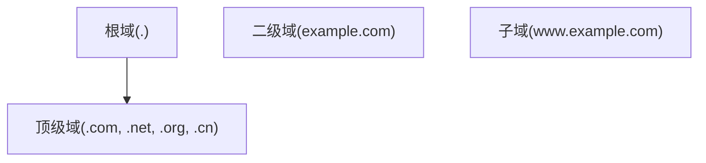

## 1. DNS 体系

### 1.1 域名层次



### 1.2 解析流程

```
客户端 → 本地DNS → 根DNS → 顶级域DNS → 权威DNS → 结果
```

递归查询 vs 迭代查询。

### 1.3 记录类型

| 类型  | 说明       | 示例                    |
| ----- | ---------- | ----------------------- |
| A     | IPv4地址   | 1.2.3.4                 |
| AAAA  | IPv6地址   | 2001:db8::1             |
| CNAME | 别名       | www → example.com       |
| MX    | 邮件交换   | 10 mail.example.com     |
| NS    | 名称服务器 | ns1.example.com         |
| TXT   | 文本记录   | SPF/DKIM                |
| SRV   | 服务定位   | \_sip.\_tcp.example.com |

### 1.4 DNSSEC

使用数字签名保护DNS响应：

- RRSIG：资源记录签名
- DNSKEY：公钥
- DS：委托签名者
- NSEC/NSEC3：不存在证明

## 2. DHCP

### 2.1 DORA 流程

```
客户端 → Discover(广播) → 服务器
客户端 ← Offer ← 服务器
客户端 → Request(广播) → 服务器
客户端 ← Ack ← 服务器
```

### 2.2 DHCP 中继

```bash
# 配置DHCP中继
interface Vlan10
  ip helper-address 10.0.0.100
```

### 2.3 IPAM

IP地址管理：统一管理IP分配、子网划分、DNS记录。

## 延伸阅读
网络基础与协议，见 032-networking 模块文档。
网络安全（TLS/WAF），见 033-cybersecurity 模块。
负载均衡与网关，见 031-devops 模块相关文档。
## 深度专题扩展

以下专题从不同角度深入本文主题，供有进阶需求的读者研读。每个专题独立成节，内容相互补充。

### 13.1 TCP 拥塞控制

慢启动：指数增长直到 ssthresh；拥塞避免：线性增长；快速重传/快速恢复处理丢包。
BBR（Google）基于带宽与延迟估计，替代丢包驱动的传统算法。
队列与缓冲膨胀（bufferbloat）导致延迟抖动；AQM（CoDel）缓解。
调优：理解 RTT、窗口与带宽延迟积（BDP）的关系。

### 13.2 HTTPS 与证书体系

TLS 握手：ClientHello -> ServerHello + 证书 -> 密钥交换 -> Finished；1.3 一轮往返完成。
证书链：根 CA -> 中间 CA -> 站点证书；OCSP/CRL 吊销检查。
Let's Encrypt 自动化签发与续期（ACME 协议）。
配置基线：TLS 1.2+、禁用弱套件、HSTS、证书透明度。
