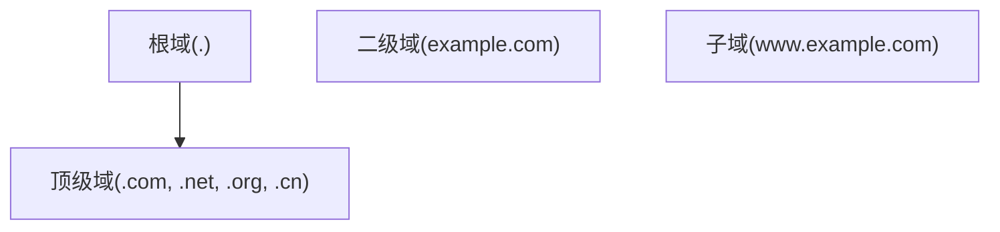

## 1. DNS 体系

### 1.1 域名层次



### 1.2 解析流程

```
客户端 → 本地DNS → 根DNS → 顶级域DNS → 权威DNS → 结果
```

递归查询 vs 迭代查询。

### 1.3 记录类型

| 类型  | 说明       | 示例                    |
| ----- | ---------- | ----------------------- |
| A     | IPv4地址   | 1.2.3.4                 |
| AAAA  | IPv6地址   | 2001:db8::1             |
| CNAME | 别名       | www → example.com       |
| MX    | 邮件交换   | 10 mail.example.com     |
| NS    | 名称服务器 | ns1.example.com         |
| TXT   | 文本记录   | SPF/DKIM                |
| SRV   | 服务定位   | \_sip.\_tcp.example.com |

### 1.4 DNSSEC

使用数字签名保护DNS响应：

- RRSIG：资源记录签名
- DNSKEY：公钥
- DS：委托签名者
- NSEC/NSEC3：不存在证明

## 2. DHCP

### 2.1 DORA 流程

```
客户端 → Discover(广播) → 服务器
客户端 ← Offer ← 服务器
客户端 → Request(广播) → 服务器
客户端 ← Ack ← 服务器
```

### 2.2 DHCP 中继

```bash
# 配置DHCP中继
interface Vlan10
  ip helper-address 10.0.0.100
```

### 2.3 IPAM

IP地址管理：统一管理IP分配、子网划分、DNS记录。

## 参考文献

MDN HTTP 文档：https://developer.mozilla.org/zh-CN/docs/Web/HTTP
RFC 9110（HTTP 语义）：https://www.rfc-editor.org/rfc/rfc9110
TCP/IP 详解（W. Richard Stevens）：https://www.oreilly.com/library/view/tcpip-illustrated-vol/
Cloudflare 学习中心：https://www.cloudflare.com/learning/
DNS 原理（RFC 1035）：https://www.rfc-editor.org/rfc/rfc1035

## 延伸阅读

网络基础与协议，见 032-networking 模块文档。
网络安全（TLS/WAF），见 033-cybersecurity 模块。
负载均衡与网关，见 031-devops 模块相关文档。
尚硅谷 Bilibili 空间（https://space.bilibili.com/302417610 ）提供计算机网络课程。

## 深度专题扩展

以下专题从不同角度深入本文主题，供有进阶需求的读者研读。每个专题独立成节，内容相互补充。

### 13.1 TCP 拥塞控制

慢启动：指数增长直到 ssthresh；拥塞避免：线性增长；快速重传/快速恢复处理丢包。
BBR（Google）基于带宽与延迟估计，替代丢包驱动的传统算法。
队列与缓冲膨胀（bufferbloat）导致延迟抖动；AQM（CoDel）缓解。
调优：理解 RTT、窗口与带宽延迟积（BDP）的关系。

### 13.2 HTTPS 与证书体系

TLS 握手：ClientHello -> ServerHello + 证书 -> 密钥交换 -> Finished；1.3 一轮往返完成。
证书链：根 CA -> 中间 CA -> 站点证书；OCSP/CRL 吊销检查。
Let's Encrypt 自动化签发与续期（ACME 协议）。
配置基线：TLS 1.2+、禁用弱套件、HSTS、证书透明度。

## 模块文档速查表

| 文档 | 主题 | 与本文的关联 |
| --- | --- | --- |
| 网络基础与协议 | 001-NetworkBasicsAndProtocol | 本文的前置基础 |
| 网络系统管理 | 002-NetworkSystemManagement | 本文的并列主题 |
| 网络布线与施工 | 003-NetworkWiringAndConstruction | 本文的并列主题 |
| OSI与TCP-IP模型 | 004-OSITCPIPModel | 本文的并列主题 |
| 交换与路由技术 | 005-SwitchingAndRouting | 本文的并列主题 |
| 网络安全技术 | 006-NetworkSecurityTech | 本文的安全延伸 |
| 无线网络 | 007-WirelessNetwork | 本文的并列主题 |
| SDN与网络自动化 | 008-SDNNetworkAutomation | 本文的并列主题 |
| 网络存储技术 | 009-NetworkStorageTechnology | 本文的并列主题 |
| 网络故障诊断 | 010-NetworkDiagnosis | 本文的并列主题 |
| 网络设计与规划 | 011-NetworkDesignPlanning | 本文的并列主题 |
| DNS与DHCP | 012-DNSDHCP | 本文自身 |
| 负载均衡技术 | 013-LoadBalanceTech | 本文的并列主题 |
| 网络自动化 | 014-NetworkAutomation | 本文的并列主题 |
| 负载均衡算法 | 015-LoadBalanceAlgorithm | 本文的并列主题 |
| 高可用LVS | 016-HighAvailabilityLVS | 本文的并列主题 |
| Keepalived双机热备 | 017-KeepalivedDualHotStandby | 本文的并列主题 |
| 网络命名空间与虚拟网桥 | 018-NetworkNamespaceVirtualBridge | 本文的并列主题 |
| 隧道技术 | 019-Tunneling | 本文的并列主题 |
| 网络故障排查工具 | 020-NetworkTroubleshootTools | 本文的并列主题 |
| BGP与多线机房互联 | 021-BGP | 本文的并列主题 |
| SDN | 022-SDN | 本文的并列主题 |
| Networking ip 命令 | 023-IPCommands | 本文的并列主题 |
| Networking 连通性检测 | 024-PingTraceroute | 本文的并列主题 |
| Networking ss 与 netstat | 025-SSNetstat | 本文的并列主题 |
| Networking tcpdump 抓包 | 026-Tcpdump | 本文的并列主题 |
| Networking DNS 查询 | 027-DigNslookup | 本文的并列主题 |
| Networking curl HTTP 请求 | 028-CurlHTTPRequest | 本文的并列主题 |
| Networking iptables 防火墙 | 029-IptablesFirewall | 本文的并列主题 |
| Networking SSH 远程连接 | 030-SSHRemote | 本文的并列主题 |
| Networking nc 与 nmap | 031-NetcatNmap | 本文的并列主题 |
| Networking ARP 与路由 | 032-ARPRouting | 本文的并列主题 |
| Networking HTTP 协议 | 033-HTTPProtocol | 本文的并列主题 |
| Networking wget 文件下载 | 034-WgetDownload | 本文的并列主题 |
| Networking VPN 配置命令 | 035-VPNConfig | 本文的并列主题 |
| Networking Wireshark 命令行 | 036-WiresharkCLI | 本文的并列主题 |
| Networking IPv6 网络命令 | 037-IPv6Commands | 本文的并列主题 |
| Networking 代理配置 | 038-ProxyConfig | 本文的并列主题 |
