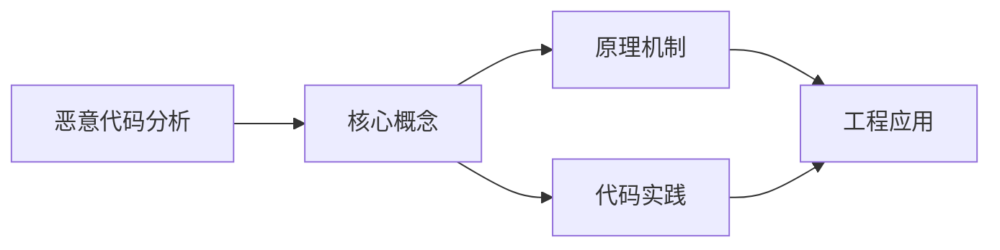
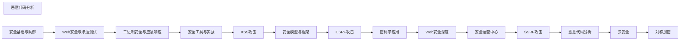

## 1. 学习目标（Bloom 分类）

本节按照布鲁姆教育目标分类学组织学习路径。本文主题为《恶意代码分析》，属于 网络安全 模块，读者可以根据自身阶段选择阅读深度。

记忆层面：能够准确复述本文的核心概念、术语与基本语法或操作步骤，并能够在提问或检索时快速定位对应知识点。能够说出 网络安全 的核心概念、组件与标准流程。

理解层面：能够用自己的语言解释核心原理与工作机制，说明概念之间的因果关系，而不是机械记忆结论。能够解释 网络安全 的工作原理与关键机制。

应用层面：能够在真实项目或练习场景中运用本文知识解决具体问题，写出正确且可维护的实现。能够执行 网络安全 相关的标准操作与配置。

分析层面：能够拆解复杂问题，比较本文主题与相邻概念的异同，识别边界条件与例外情况。能够分析 网络安全 方案在可靠性、成本与性能上的权衡。

评价层面：能够根据约束条件（性能、可读性、安全、成本）评价不同方案的优劣，做出有依据的技术决策。能够评价 网络安全 中的技术选型。

创造层面：能够把本文知识与其他模块知识组合，设计出新的解决方案或可复用的工程模式。能够设计基于 网络安全 的完整解决方案。

通过本节学习，读者应当能够把《恶意代码分析》纳入自己的知识网络，并与 网络安全 模块的其他主题（加密、认证、Web 安全、渗透测试、应急响应）建立关联。

## 2. 历史动机与发展脉络

《恶意代码分析》是 网络安全 领域的重要主题。要真正理解它，需要先了解它解决的问题与演进过程。

网络安全伴随计算机发展而来：1970 年代漏洞概念出现，1988 年 Morris 蠕虫推动 CERT 成立；现代安全已从“边界防御”转向“零信任”。
核心框架：CIA 三元组（机密性、完整性、可用性）；STRIDE 威胁建模；OWASP Top 10 是 Web 安全事实清单。
现代主题：零信任架构、供应链安全（SBOM）、云安全、DevSecOps、AI 安全；合规（等保、GDPR）驱动企业实践。

回到本文主题：恶意代码分析 的提出与成熟，正是上述技术背景下的必然产物。早期实现往往以简单可用为目标，随着工程规模扩大，社区逐渐沉淀出标准做法与最佳实践；理解这一脉络，可以帮助读者判断“为什么文档中的推荐写法是现在这个样子”，也能在遇到历史遗留代码时准确识别其设计年代与取舍。


## 3. 形式化定义与核心概念精讲

本节把《恶意代码分析》涉及的核心概念以“定义 + 讲解”的形式展开。读者应把定义当作工具，把讲解当作理解路径；两者结合才能形成可迁移的知识。

密码学基础：对称加密（AES）、非对称（RSA/ECC）、哈希（SHA-2/3）、HMAC；密码学是加密、签名与认证的地基。
认证与授权：口令哈希（bcrypt/argon2）、MFA、Session/JWT、OAuth 2.0/OIDC、RBAC/ABAC。
Web 攻击面：注入（SQL/XSS）、CSRF、SSRF、文件上传、反序列化；防御（输入校验、输出编码、CSP、SameSite）。

### 3.1 原文章节逐一精讲

原文档把主题拆分为 17 个小节，下面按顺序给出每一节的导读讲解，随后保留原文细节供精读。

#### 原文精读（完整保留）

# Cybersecurity 恶意软件分析命令

> **符号约定**:`< >` 必填参数 | `[ ]` 可选参数

---

#### 1. 恶意软件分类

##### 1.1 按行为分类

| 类型     | 行为         | 示例         |
| -------- | ------------ | ------------ |
| 病毒     | 感染宿主文件 | CIH          |
| 蠕虫     | 自我传播     | WannaCry     |
| 木马     | 伪装合法软件 | Emotet       |
| 勒索软件 | 加密勒索     | Ryuk         |
| Rootkit  | 隐藏自身     | Sony Rootkit |
| RAT      | 远程控制     | Gh0st        |

##### 1.2 按目标分类

| 类型     | 目标     | 示例    |
| -------- | -------- | ------- |
| 银行木马 | 网银     | Zeus    |
| 勒索软件 | 数据     | LockBit |
| 间谍软件 | 信息     | Pegasus |
| 僵尸网络 | 控制     | Mirai   |
| APT      | 持续渗透 | Stuxnet |

#### 2. 静态分析

##### 2.1 文件特征

```bash
# 文件类型
file malware.exe

# 哈希
sha256sum malware.exe

# 字符串提取
strings malware.exe | grep -i "http\|password\|key"

# PE头分析
python pefile.py malware.exe
```

##### 2.2 反汇编

| 工具         | 说明       |
| ------------ | ---------- |
| IDA Pro      | 专业反汇编 |
| Ghidra       | NSA开源    |
| Radare2      | 命令行     |
| Binary Ninja | 现代       |

##### 2.3 签名检测

```bash
# YARA 规则
rule Malware_Detector {
    meta:
        description = "Detects known malware"
    strings:
        $s1 = "cmd.exe /c" ascii
        $s2 = { 6A 40 68 00 30 00 00 }
    condition:
        any of them
}
```

#### 3. 动态分析

##### 3.1 沙箱分析

| 沙箱            | 特点   |
| --------------- | ------ |
| Cuckoo Sandbox  | 开源   |
| Joe Sandbox     | 商业   |
| ANY.RUN         | 交互式 |
| Hybrid Analysis | 在线   |

##### 3.2 行为监控

```bash
# 进程监控
Process Monitor (ProcMon)

# 网络监控
Wireshark / tcpdump

# 注册表监控
Regshot

# API 调用追踪
API Monitor
```

##### 3.3 网络行为分析

- DNS 请求
- HTTP/HTTPS 通信
- C2 通信模式
- 数据外传

#### 4. 逆向工程

##### 4.1 脱壳

| 壳        | 工具     |
| --------- | -------- |
| UPX       | upx -d   |
| Themida   | 手动脱壳 |
| VMProtect | 困难     |
| ASPack    | 脱壳工具 |

##### 4.2 调试

```bash
# x64dbg 调试
1. 设置断点
2. 单步执行
3. 查看寄存器和内存
4. 分析算法逻辑
```

##### 4.3 反混淆

- 字符串解密
- 控制流还原
- API 调用恢复

#### 5. 勒索软件分析

##### 5.1 常见勒索软件家族

| 家族     | 加密算法    | 特点            |
| -------- | ----------- | --------------- |
| WannaCry | AES+RSA     | 利用EternalBlue |
| Ryuk     | AES-256     | 针对性攻击      |
| LockBit  | AES+RSA     | RaaS模式        |
| Conti    | ChaCha8+RSA | 双重勒索        |

##### 5.2 分析要点

- 加密算法和密钥管理
- 文件扩展名修改
- 勒索信内容
- C2 通信方式
- 是否可解密

#### 6. 威胁情报生产

##### 6.1 IOC 提取

| IOC类型  | 示例     |
| -------- | -------- |
| 文件哈希 | SHA256   |
| IP地址   | C2服务器 |
| 域名     | DGA域名  |
| URL      | 下载地址 |
| 互斥量   | 运行标识 |
| 注册表键 | 持久化   |

##### 6.2 情报共享

- STIX/TAXII 标准
- MISP 平台
- OpenIOC 格式
#### 静态分析基础

**基本写法:文件类型识别**
`file <文件>`
```bash
# 识别恶意软件文件类型
file suspicious.exe
```

**基本写法:计算文件哈希**
`sha256sum <文件>`
```bash
# 计算文件 SHA256 哈希用于查重
sha256sum suspicious.exe
```

**基本写法:计算 MD5 哈希**
`md5sum <文件>`
```bash
# 计算 MD5 哈希便于查询
md5sum suspicious.exe
```

**基本写法:提取可打印字符串**
`strings <文件> | head -50`
```bash
# 提取文件中的可读字符串
strings suspicious.exe | head -50
```

**基本写法:提取长字符串**
`strings -n 10 <文件>`
```bash
# 提取长度超过 10 的字符串
strings -n 10 suspicious.exe
```

**基本写法:查看文件大小**
`ls -la <文件>`
```bash
# 查看文件大小与权限
ls -la suspicious.exe
```

---

#### YARA 规则匹配

**基本写法:扫描文件**
`yara <规则文件> <目标文件>`
```bash
# 使用 YARA 规则扫描恶意软件
yara malware_rules.yar suspicious.exe
```

**基本写法:递归扫描目录**
`yara -r <规则文件> <目录>`
```bash
# 递归扫描目录下所有文件
yara -r malware_rules.yar /malware_samples/
```

**基本写法:显示匹配的规则**
`yara -s <规则文件> <目标文件>`
```bash
# 显示匹配规则与匹配字符串
yara -s malware_rules.yar suspicious.exe
```

**基本写法:使用多个规则文件**
`yara -r <规则目录> <目标文件>`
```bash
# 使用规则目录中所有规则文件
yara -r /rules/ suspicious.exe
```

**基本写法:编译规则加速扫描**
`yarac <规则文件> <编译文件>`
```bash
# 预编译规则提高扫描速度
yarac malware_rules.yar compiled.yarc
yara compiled.yarc suspicious.exe
```

---

#### VirusTotal 查询

**基本写法:使用 API 查询哈希**
`curl "https://www.virustotal.com/api/v3/files/<哈希>"`
```bash
# 通过哈希查询 VirusTotal 报告
curl -H "x-apikey: <API_KEY>" "https://www.virustotal.com/api/v3/files/abc123"
```

**基本写法:上传文件扫描**
`curl -X POST "https://www.virustotal.com/api/v3/files" -F "file=@<文件>"`
```bash
# 上传文件到 VirusTotal 扫描
curl -X POST -H "x-apikey: <API_KEY>" "https://www.virustotal.com/api/v3/files" -F "file=@suspicious.exe"
```

**基本写法:获取分析结果**
`curl "https://www.virustotal.com/api/v3/analyses/<分析ID>"`
```bash
# 获取上传文件的分析结果
curl -H "x-apikey: <API_KEY>" "https://www.virustotal.com/api/v3/analyses/analysis_id"
```

**基本写法:使用 vt-cli 工具**
`vt scan file <文件>`
```bash
# 使用 VirusTotal CLI 工具扫描
vt scan file suspicious.exe
```

**基本写法:查询文件信息**
`vt file <哈希>`
```bash
# 查询文件详细信息
vt file abc123def456
```

---

#### 沙箱分析

**基本写法:使用 Cuckoo 沙箱**
`cuckoo submit <文件>`
```bash
# 提交文件到 Cuckoo 沙箱分析
cuckoo submit suspicious.exe
```

**基本写法:指定分析选项**
`cuckoo submit --options <选项> <文件>`
```bash
# 指定分析机器与超时
cuckoo submit --options timeout=300,machine=win10 suspicious.exe
```

**基本写法:查看分析任务**
`cuckoo tasks list`
```bash
# 列出所有分析任务
cuckoo tasks list
```

**基本写法:查看分析报告**
`cuckoo report <任务ID>`
```bash
# 查看指定任务分析报告
cuckoo report 123
```

**基本写法:导出分析结果**
`cuckoo report <任务ID> -f <格式>`
```bash
# 导出 JSON 格式分析报告
cuckoo report 123 -f json > report.json
```

---

#### 动态分析基础

**基本写法:跟踪系统调用**
`strace -f -o <输出文件> <程序>`
```bash
# 跟踪程序所有系统调用
strace -f -o syscall.log ./suspicious
```

**基本写法:跟踪库函数调用**
`ltrace -f -o <输出文件> <程序>`
```bash
# 跟踪库函数调用
ltrace -f -o libcall.log ./suspicious
```

**基本写法:过滤特定系统调用**
`strace -e trace=<调用类型> <程序>`
```bash
# 仅跟踪网络相关系统调用
strace -e trace=network -f ./suspicious
```

**基本写法:跟踪文件操作**
`strace -e trace=file <程序>`
```bash
# 仅跟踪文件相关操作
strace -e trace=file -f ./suspicious
```

**基本写法:跟踪进程创建**
`strace -e trace=process <程序>`
```bash
# 跟踪进程创建相关操作
strace -e trace=process -f ./suspicious
```

---

#### 网络行为分析

**基本写法:抓取程序网络流量**
`tcpdump -i any -w <输出文件> & <程序>`
```bash
# 抓取程序运行时的网络流量
sudo tcpdump -i any -w traffic.pcap &
./suspicious
```

**基本写法:分析 DNS 请求**
`tshark -r <PCAP文件> -Y "dns.qry.name"`
```bash
# 分析程序发起的 DNS 请求
tshark -r traffic.pcap -Y "dns.qry.name" -T fields -e dns.qry.name
```

**基本写法:分析 HTTP 请求**
`tshark -r <PCAP文件> -Y "http.request"`
```bash
# 分析程序发出的 HTTP 请求
tshark -r traffic.pcap -Y "http.request" -T fields -e http.host -e http.request.uri
```

**基本写法:统计连接目标**
`tshark -r <PCAP文件> -T fields -e ip.dst | sort | uniq -c`
```bash
# 统计程序连接的目标 IP
tshark -r traffic.pcap -T fields -e ip.dst | sort | uniq -c | sort -rn
```

**基本写法:提取 C2 通信特征**
`tshark -r <PCAP文件> -Y "tcp.port == 443" -T fields -e ip.dst`
```bash
# 提取可能的 C2 服务器地址
tshark -r traffic.pcap -Y "tcp.port == 443" -T fields -e ip.dst | sort -u
```

---

#### 文件行为监控

**基本写法:监控文件创建**
`inotifywait -m -r <监控目录>`
```bash
# 实时监控目录中文件创建事件
inotifywait -m -r /tmp -e create,modify,delete
```

**基本写法:使用 auditd 监控**
`auditctl -w <目录> -p war -k malware`
```bash
# 使用审计系统监控目录
sudo auditctl -w /tmp -p war -k malware
```

**基本写法:查看文件创建事件**
`ausearch -k malware`
```bash
# 查询监控到的文件操作
sudo ausearch -k malware
```

**基本写法:监控进程文件操作**
`lsof -p <PID>`
```bash
# 查看进程打开的所有文件
lsof -p 1234
```

**基本写法:持续监控进程文件操作**
`lsof -r -p <PID>`
```bash
# 持续监控进程文件操作变化
lsof -r -p 1234
```

---

#### 注册表与配置分析(Windows)

**基本写法:导出注册表快照**
`reg export HKLM <文件>`
```bash
# 导出注册表快照用于对比(Windows 环境)
reg export HKLM\Software hklm_backup.reg
```

**基本写法:对比注册表变化**
`fc <原文件> <新文件>`
```bash
# 对比注册表快照查找修改
fc original.reg modified.reg > changes.txt
```

**基本写法:使用 regripper 分析**
`regripper -r <注册表文件> -f <插件>`
```bash
# 使用 RegRipper 分析注册表文件
regripper -r NTUSER.DAT -f userassist
```

**基本写法:提取自启动项**
`reg query "HKLM\Software\Microsoft\Windows\CurrentVersion\Run"`
```bash
# 查看注册表自启动项
reg query "HKLM\Software\Microsoft\Windows\CurrentVersion\Run"
```

**基本写法:查看服务**
`sc query state= all`
```bash
# 查看所有系统服务
sc query state= all
```

---

#### 内存分析

**基本写法:使用 vol.py 分析内存**
`vol.py -f <内存镜像> imageinfo`
```bash
# 使用 Volatility 分析内存镜像基本信息
vol.py -f memory.dump imageinfo
```

**基本写法:列出进程**
`vol.py -f <内存镜像> --profile=<配置> pslist`
```bash
# 列出内存中的所有进程
vol.py -f memory.dump --profile=Win10x64 pslist
```

**基本写法:查找隐藏进程**
`vol.py -f <内存镜像> --profile=<配置> psxview`
```bash
# 检测隐藏进程
vol.py -f memory.dump --profile=Win10x64 psxview
```

**基本写法:提取进程内存**
`vol.py -f <内存镜像> --profile=<配置> memdump -p <PID> -D <目录>`
```bash
# 提取指定进程的内存
vol.py -f memory.dump --profile=Win10x64 memdump -p 1234 -D /tmp/
```

**基本写法:扫描网络连接**
`vol.py -f <内存镜像> --profile=<配置> netscan`
```bash
# 扫描内存中的网络连接
vol.py -f memory.dump --profile=Win10x64 netscan
```

---

#### 恶意软件脱壳

**基本写法:使用 upx 脱壳**
`upx -d <文件>`
```bash
# 脱壳 UPX 加壳的程序
upx -d packed.exe
```

**基本写法:查看 PE 节区熵**
`python3 -c "import pefile; pe=pefile.PE('<文件>'); ..."`
```bash
# 计算各节区熵值判断是否加壳
python3 -c "
import pefile, math
pe=pefile.PE('suspicious.exe')
for s in pe.sections:
    data=s.get_data()
    ent=-sum(data.count(bytes([b]))/len(data)*math.log2(data.count(bytes([b]))/len(data)) for b in range(256) if data.count(bytes([b])))
    print(f'{s.Name.decode()} 熵值: {ent:.2f}')
"
```

**基本写法:使用 diStorm 反汇编**
`python3 -c "from distorm3 import Decode; ..."`
```bash
# Python 使用 diStorm 反汇编代码
python3 -c "
from distorm3 import Decode
code=b'\\x48\\x89\\xe5'
for ins in Decode(0x1000, code):
    print(ins)
"
```

**基本写法:使用 pefile 查看入口点**
`python3 -c "import pefile; pe=pefile.PE('<文件>'); print(hex(pe.OPTIONAL_HEADER.AddressOfEntryPoint))"`
```bash
# 查看 PE 文件入口点判断是否加壳
python3 -c "import pefile; pe=pefile.PE('suspicious.exe'); print('入口点:', hex(pe.OPTIONAL_HEADER.AddressOfEntryPoint))"
```

---

#### 自动化分析流水线

**基本写法:批量计算哈希**
`for f in <目录>/*; do sha256sum "$f"; done`
```bash
# 批量计算目录中所有文件哈希
for f in /malware/*; do echo "$(sha256sum "$f" | cut -d' ' -f1) $f"; done > hashes.txt
```

**基本写法:批量提取字符串**
`for f in <目录>/*; do echo "=== $f ==="; strings "$f"; done`
```bash
# 批量提取所有样本的字符串
for f in /malware/*; do echo "=== $f ==="; strings -n 8 "$f"; done > all_strings.txt
```

**基本写法:批量 YARA 扫描**
`yara -r -s <规则文件> <目录>`
```bash
# 批量扫描目录下所有文件
yara -r -s /rules/*.yar /malware_samples/ > yara_results.txt
```

**基本写法:自动化分析脚本**
`./analyze.sh <文件>`
```bash
# 自动化分析脚本示例
# #!/bin/bash
# echo "文件类型: $(file -b $1)"
# echo "SHA256: $(sha256sum $1 | cut -d' ' -f1)"
# echo "字符串数: $(strings $1 | wc -l)"
# yara rules.yar $1
```

**基本写法:提交到沙箱批量分析**
`for f in <目录>/*; do cuckoo submit "$f"; done`
```bash
# 批量提交文件到沙箱分析
for f in /malware/*; do cuckoo submit "$f"; sleep 60; done
```


### 3.2 概念关系图

下面用 Mermaid 图表达本文核心概念之间的关系，帮助读者建立整体图景：



图中展示的是本文知识的结构化关系：核心概念是入口，原理机制解释“为什么”，代码实践演示“怎么做”，工程应用回答“何时用”。读者学习时可以把每个小节的内容挂接到对应节点上。

## 4. 理论推导与原理解析

本节深入《恶意代码分析》背后的原理。理论部分不求面面俱到，而是聚焦“能解释现象、能指导实践”的关键推导。

密码学基础：对称加密（AES）、非对称（RSA/ECC）、哈希（SHA-2/3）、HMAC；密码学是加密、签名与认证的地基。
认证与授权：口令哈希（bcrypt/argon2）、MFA、Session/JWT、OAuth 2.0/OIDC、RBAC/ABAC。
Web 攻击面：注入（SQL/XSS）、CSRF、SSRF、文件上传、反序列化；防御（输入校验、输出编码、CSP、SameSite）。
渗透测试流程：信息收集 -> 漏洞扫描 -> 利用 -> 提权 -> 横向 -> 报告；工具（Nmap、Burp、Metasploit）。

需要强调的是，理论推导与工程实践之间存在翻译层：理论给出的是理想化模型与边界条件，工程代码则必须处理真实环境中的例外。读者在学习时应先掌握理论的“标准情形”，再通过陷阱章节了解“非标准情形”。

## 5. 代码示例与逐行讲解

本节把原文中的代码示例系统整理，并为每个示例补充用途说明与讲解。读者不应只浏览代码，而应逐段对照讲解理解设计意图。

### 5.1 示例：2.1 文件特征

该示例来自原文《2.1 文件特征》小节，用于演示恶意代码分析相关操作。阅读时请先看代码结构，再看其后的讲解。

```bash
# 文件类型
file malware.exe

# 哈希
sha256sum malware.exe

# 字符串提取
strings malware.exe | grep -i "http\|password\|key"

# PE头分析
python pefile.py malware.exe
```

讲解：这段代码演示了本节核心知识点。代码中的关键操作可以归纳为三步：准备（定义或初始化）、执行（核心逻辑）、收尾（释放资源或返回结果）。实际项目中，这三步往往被封装为函数或类，以提升复用性与可测试性。

关键点分析：

该示例共 8 行有效代码，结构以数据或配置为主。阅读时应关注：数据字段的含义、配置项的作用，以及它们与运行行为的对应关系。

进阶思考路径：先尝试修改参数观察行为变化，再把示例中的模式迁移到自己的项目中；每次修改都记录预期与实测差异，这是把示例转化为能力的最快方式。

### 5.2 示例：2.3 签名检测

该示例来自原文《2.3 签名检测》小节，用于演示恶意代码分析相关操作。阅读时请先看代码结构，再看其后的讲解。

```bash
# YARA 规则
rule Malware_Detector {
    meta:
        description = "Detects known malware"
    strings:
        $s1 = "cmd.exe /c" ascii
        $s2 = { 6A 40 68 00 30 00 00 }
    condition:
        any of them
}
```

讲解：这段代码演示了本节核心知识点。代码中的关键操作可以归纳为三步：准备（定义或初始化）、执行（核心逻辑）、收尾（释放资源或返回结果）。实际项目中，这三步往往被封装为函数或类，以提升复用性与可测试性。

关键点分析：

该示例共 10 行有效代码，结构以数据或配置为主。阅读时应关注：数据字段的含义、配置项的作用，以及它们与运行行为的对应关系。

进阶思考路径：先尝试修改参数观察行为变化，再把示例中的模式迁移到自己的项目中；每次修改都记录预期与实测差异，这是把示例转化为能力的最快方式。

### 5.3 示例：3.2 行为监控

该示例来自原文《3.2 行为监控》小节，用于演示恶意代码分析相关操作。阅读时请先看代码结构，再看其后的讲解。

```bash
# 进程监控
Process Monitor (ProcMon)

# 网络监控
Wireshark / tcpdump

# 注册表监控
Regshot

# API 调用追踪
API Monitor
```

讲解：这段代码演示了本节核心知识点。代码中的关键操作可以归纳为三步：准备（定义或初始化）、执行（核心逻辑）、收尾（释放资源或返回结果）。实际项目中，这三步往往被封装为函数或类，以提升复用性与可测试性。

关键点分析：

该示例共 8 行有效代码，结构以数据或配置为主。阅读时应关注：数据字段的含义、配置项的作用，以及它们与运行行为的对应关系。

进阶思考路径：先尝试修改参数观察行为变化，再把示例中的模式迁移到自己的项目中；每次修改都记录预期与实测差异，这是把示例转化为能力的最快方式。

### 5.4 示例：4.2 调试

该示例来自原文《4.2 调试》小节，用于演示恶意代码分析相关操作。阅读时请先看代码结构，再看其后的讲解。

```bash
# x64dbg 调试
1. 设置断点
2. 单步执行
3. 查看寄存器和内存
4. 分析算法逻辑
```

讲解：这段代码演示了本节核心知识点。代码中的关键操作可以归纳为三步：准备（定义或初始化）、执行（核心逻辑）、收尾（释放资源或返回结果）。实际项目中，这三步往往被封装为函数或类，以提升复用性与可测试性。

关键点分析：

该示例共 5 行有效代码，结构以数据或配置为主。阅读时应关注：数据字段的含义、配置项的作用，以及它们与运行行为的对应关系。

进阶思考路径：先尝试修改参数观察行为变化，再把示例中的模式迁移到自己的项目中；每次修改都记录预期与实测差异，这是把示例转化为能力的最快方式。

### 5.5 示例：静态分析基础

该示例来自原文《静态分析基础》小节，用于演示恶意代码分析相关操作。阅读时请先看代码结构，再看其后的讲解。

```bash
# 识别恶意软件文件类型
file suspicious.exe
```

讲解：这段代码演示了本节核心知识点。代码中的关键操作可以归纳为三步：准备（定义或初始化）、执行（核心逻辑）、收尾（释放资源或返回结果）。实际项目中，这三步往往被封装为函数或类，以提升复用性与可测试性。

关键点分析：

该示例共 2 行有效代码，结构以数据或配置为主。阅读时应关注：数据字段的含义、配置项的作用，以及它们与运行行为的对应关系。

进阶思考路径：先尝试修改参数观察行为变化，再把示例中的模式迁移到自己的项目中；每次修改都记录预期与实测差异，这是把示例转化为能力的最快方式。

### 5.6 示例：静态分析基础

该示例来自原文《静态分析基础》小节，用于演示恶意代码分析相关操作。阅读时请先看代码结构，再看其后的讲解。

```bash
# 计算文件 SHA256 哈希用于查重
sha256sum suspicious.exe
```

讲解：这段代码演示了本节核心知识点。代码中的关键操作可以归纳为三步：准备（定义或初始化）、执行（核心逻辑）、收尾（释放资源或返回结果）。实际项目中，这三步往往被封装为函数或类，以提升复用性与可测试性。

关键点分析：

该示例共 2 行有效代码，结构以数据或配置为主。阅读时应关注：数据字段的含义、配置项的作用，以及它们与运行行为的对应关系。

进阶思考路径：先尝试修改参数观察行为变化，再把示例中的模式迁移到自己的项目中；每次修改都记录预期与实测差异，这是把示例转化为能力的最快方式。

### 5.7 示例：静态分析基础

该示例来自原文《静态分析基础》小节，用于演示恶意代码分析相关操作。阅读时请先看代码结构，再看其后的讲解。

```bash
# 计算 MD5 哈希便于查询
md5sum suspicious.exe
```

讲解：这段代码演示了本节核心知识点。代码中的关键操作可以归纳为三步：准备（定义或初始化）、执行（核心逻辑）、收尾（释放资源或返回结果）。实际项目中，这三步往往被封装为函数或类，以提升复用性与可测试性。

关键点分析：

该示例共 2 行有效代码，结构以数据或配置为主。阅读时应关注：数据字段的含义、配置项的作用，以及它们与运行行为的对应关系。

进阶思考路径：先尝试修改参数观察行为变化，再把示例中的模式迁移到自己的项目中；每次修改都记录预期与实测差异，这是把示例转化为能力的最快方式。

### 5.8 示例：静态分析基础

该示例来自原文《静态分析基础》小节，用于演示恶意代码分析相关操作。阅读时请先看代码结构，再看其后的讲解。

```bash
# 提取文件中的可读字符串
strings suspicious.exe | head -50
```

讲解：这段代码演示了本节核心知识点。代码中的关键操作可以归纳为三步：准备（定义或初始化）、执行（核心逻辑）、收尾（释放资源或返回结果）。实际项目中，这三步往往被封装为函数或类，以提升复用性与可测试性。

关键点分析：

该示例共 2 行有效代码，结构以数据或配置为主。阅读时应关注：数据字段的含义、配置项的作用，以及它们与运行行为的对应关系。

进阶思考路径：先尝试修改参数观察行为变化，再把示例中的模式迁移到自己的项目中；每次修改都记录预期与实测差异，这是把示例转化为能力的最快方式。

### 5.9 示例：静态分析基础

该示例来自原文《静态分析基础》小节，用于演示恶意代码分析相关操作。阅读时请先看代码结构，再看其后的讲解。

```bash
# 提取长度超过 10 的字符串
strings -n 10 suspicious.exe
```

讲解：这段代码演示了本节核心知识点。代码中的关键操作可以归纳为三步：准备（定义或初始化）、执行（核心逻辑）、收尾（释放资源或返回结果）。实际项目中，这三步往往被封装为函数或类，以提升复用性与可测试性。

关键点分析：

该示例共 2 行有效代码，结构以数据或配置为主。阅读时应关注：数据字段的含义、配置项的作用，以及它们与运行行为的对应关系。

进阶思考路径：先尝试修改参数观察行为变化，再把示例中的模式迁移到自己的项目中；每次修改都记录预期与实测差异，这是把示例转化为能力的最快方式。

### 5.10 示例：静态分析基础

该示例来自原文《静态分析基础》小节，用于演示恶意代码分析相关操作。阅读时请先看代码结构，再看其后的讲解。

```bash
# 查看文件大小与权限
ls -la suspicious.exe
```

讲解：这段代码演示了本节核心知识点。代码中的关键操作可以归纳为三步：准备（定义或初始化）、执行（核心逻辑）、收尾（释放资源或返回结果）。实际项目中，这三步往往被封装为函数或类，以提升复用性与可测试性。

关键点分析：

该示例共 2 行有效代码，结构以数据或配置为主。阅读时应关注：数据字段的含义、配置项的作用，以及它们与运行行为的对应关系。

进阶思考路径：先尝试修改参数观察行为变化，再把示例中的模式迁移到自己的项目中；每次修改都记录预期与实测差异，这是把示例转化为能力的最快方式。

### 5.11 示例：YARA 规则匹配

该示例来自原文《YARA 规则匹配》小节，用于演示恶意代码分析相关操作。阅读时请先看代码结构，再看其后的讲解。

```bash
# 使用 YARA 规则扫描恶意软件
yara malware_rules.yar suspicious.exe
```

讲解：这段代码演示了本节核心知识点。代码中的关键操作可以归纳为三步：准备（定义或初始化）、执行（核心逻辑）、收尾（释放资源或返回结果）。实际项目中，这三步往往被封装为函数或类，以提升复用性与可测试性。

关键点分析：

该示例共 2 行有效代码，结构以数据或配置为主。阅读时应关注：数据字段的含义、配置项的作用，以及它们与运行行为的对应关系。

进阶思考路径：先尝试修改参数观察行为变化，再把示例中的模式迁移到自己的项目中；每次修改都记录预期与实测差异，这是把示例转化为能力的最快方式。

### 5.12 示例：YARA 规则匹配

该示例来自原文《YARA 规则匹配》小节，用于演示恶意代码分析相关操作。阅读时请先看代码结构，再看其后的讲解。

```bash
# 递归扫描目录下所有文件
yara -r malware_rules.yar /malware_samples/
```

讲解：这段代码演示了本节核心知识点。代码中的关键操作可以归纳为三步：准备（定义或初始化）、执行（核心逻辑）、收尾（释放资源或返回结果）。实际项目中，这三步往往被封装为函数或类，以提升复用性与可测试性。

关键点分析：

该示例共 2 行有效代码，结构以数据或配置为主。阅读时应关注：数据字段的含义、配置项的作用，以及它们与运行行为的对应关系。

进阶思考路径：先尝试修改参数观察行为变化，再把示例中的模式迁移到自己的项目中；每次修改都记录预期与实测差异，这是把示例转化为能力的最快方式。

### 5.13 示例：YARA 规则匹配

该示例来自原文《YARA 规则匹配》小节，用于演示恶意代码分析相关操作。阅读时请先看代码结构，再看其后的讲解。

```bash
# 显示匹配规则与匹配字符串
yara -s malware_rules.yar suspicious.exe
```

讲解：这段代码演示了本节核心知识点。代码中的关键操作可以归纳为三步：准备（定义或初始化）、执行（核心逻辑）、收尾（释放资源或返回结果）。实际项目中，这三步往往被封装为函数或类，以提升复用性与可测试性。

关键点分析：

该示例共 2 行有效代码，结构以数据或配置为主。阅读时应关注：数据字段的含义、配置项的作用，以及它们与运行行为的对应关系。

进阶思考路径：先尝试修改参数观察行为变化，再把示例中的模式迁移到自己的项目中；每次修改都记录预期与实测差异，这是把示例转化为能力的最快方式。

### 5.14 示例：YARA 规则匹配

该示例来自原文《YARA 规则匹配》小节，用于演示恶意代码分析相关操作。阅读时请先看代码结构，再看其后的讲解。

```bash
# 使用规则目录中所有规则文件
yara -r /rules/ suspicious.exe
```

讲解：这段代码演示了本节核心知识点。代码中的关键操作可以归纳为三步：准备（定义或初始化）、执行（核心逻辑）、收尾（释放资源或返回结果）。实际项目中，这三步往往被封装为函数或类，以提升复用性与可测试性。

关键点分析：

该示例共 2 行有效代码，结构以数据或配置为主。阅读时应关注：数据字段的含义、配置项的作用，以及它们与运行行为的对应关系。

进阶思考路径：先尝试修改参数观察行为变化，再把示例中的模式迁移到自己的项目中；每次修改都记录预期与实测差异，这是把示例转化为能力的最快方式。

### 5.15 示例：YARA 规则匹配

该示例来自原文《YARA 规则匹配》小节，用于演示恶意代码分析相关操作。阅读时请先看代码结构，再看其后的讲解。

```bash
# 预编译规则提高扫描速度
yarac malware_rules.yar compiled.yarc
yara compiled.yarc suspicious.exe
```

讲解：这段代码演示了本节核心知识点。代码中的关键操作可以归纳为三步：准备（定义或初始化）、执行（核心逻辑）、收尾（释放资源或返回结果）。实际项目中，这三步往往被封装为函数或类，以提升复用性与可测试性。

关键点分析：

该示例共 3 行有效代码，结构以数据或配置为主。阅读时应关注：数据字段的含义、配置项的作用，以及它们与运行行为的对应关系。

进阶思考路径：先尝试修改参数观察行为变化，再把示例中的模式迁移到自己的项目中；每次修改都记录预期与实测差异，这是把示例转化为能力的最快方式。

### 5.16 示例：VirusTotal 查询

该示例来自原文《VirusTotal 查询》小节，用于演示恶意代码分析相关操作。阅读时请先看代码结构，再看其后的讲解。

```bash
# 通过哈希查询 VirusTotal 报告
curl -H "x-apikey: <API_KEY>" "https://www.virustotal.com/api/v3/files/abc123"
```

讲解：这段代码演示了本节核心知识点。代码中的关键操作可以归纳为三步：准备（定义或初始化）、执行（核心逻辑）、收尾（释放资源或返回结果）。实际项目中，这三步往往被封装为函数或类，以提升复用性与可测试性。

关键点分析：

该示例共 2 行有效代码，结构以数据或配置为主。阅读时应关注：数据字段的含义、配置项的作用，以及它们与运行行为的对应关系。

进阶思考路径：先尝试修改参数观察行为变化，再把示例中的模式迁移到自己的项目中；每次修改都记录预期与实测差异，这是把示例转化为能力的最快方式。

### 5.17 示例：VirusTotal 查询

该示例来自原文《VirusTotal 查询》小节，用于演示恶意代码分析相关操作。阅读时请先看代码结构，再看其后的讲解。

```bash
# 上传文件到 VirusTotal 扫描
curl -X POST -H "x-apikey: <API_KEY>" "https://www.virustotal.com/api/v3/files" -F "file=@suspicious.exe"
```

讲解：这段代码演示了本节核心知识点。代码中的关键操作可以归纳为三步：准备（定义或初始化）、执行（核心逻辑）、收尾（释放资源或返回结果）。实际项目中，这三步往往被封装为函数或类，以提升复用性与可测试性。

关键点分析：

该示例共 2 行有效代码，结构以数据或配置为主。阅读时应关注：数据字段的含义、配置项的作用，以及它们与运行行为的对应关系。

进阶思考路径：先尝试修改参数观察行为变化，再把示例中的模式迁移到自己的项目中；每次修改都记录预期与实测差异，这是把示例转化为能力的最快方式。

### 5.18 示例：VirusTotal 查询

该示例来自原文《VirusTotal 查询》小节，用于演示恶意代码分析相关操作。阅读时请先看代码结构，再看其后的讲解。

```bash
# 获取上传文件的分析结果
curl -H "x-apikey: <API_KEY>" "https://www.virustotal.com/api/v3/analyses/analysis_id"
```

讲解：这段代码演示了本节核心知识点。代码中的关键操作可以归纳为三步：准备（定义或初始化）、执行（核心逻辑）、收尾（释放资源或返回结果）。实际项目中，这三步往往被封装为函数或类，以提升复用性与可测试性。

关键点分析：

该示例共 2 行有效代码，结构以数据或配置为主。阅读时应关注：数据字段的含义、配置项的作用，以及它们与运行行为的对应关系。

进阶思考路径：先尝试修改参数观察行为变化，再把示例中的模式迁移到自己的项目中；每次修改都记录预期与实测差异，这是把示例转化为能力的最快方式。

### 5.19 示例：VirusTotal 查询

该示例来自原文《VirusTotal 查询》小节，用于演示恶意代码分析相关操作。阅读时请先看代码结构，再看其后的讲解。

```bash
# 使用 VirusTotal CLI 工具扫描
vt scan file suspicious.exe
```

讲解：这段代码演示了本节核心知识点。代码中的关键操作可以归纳为三步：准备（定义或初始化）、执行（核心逻辑）、收尾（释放资源或返回结果）。实际项目中，这三步往往被封装为函数或类，以提升复用性与可测试性。

关键点分析：

该示例共 2 行有效代码，结构以数据或配置为主。阅读时应关注：数据字段的含义、配置项的作用，以及它们与运行行为的对应关系。

进阶思考路径：先尝试修改参数观察行为变化，再把示例中的模式迁移到自己的项目中；每次修改都记录预期与实测差异，这是把示例转化为能力的最快方式。

### 5.20 示例：VirusTotal 查询

该示例来自原文《VirusTotal 查询》小节，用于演示恶意代码分析相关操作。阅读时请先看代码结构，再看其后的讲解。

```bash
# 查询文件详细信息
vt file abc123def456
```

讲解：这段代码演示了本节核心知识点。代码中的关键操作可以归纳为三步：准备（定义或初始化）、执行（核心逻辑）、收尾（释放资源或返回结果）。实际项目中，这三步往往被封装为函数或类，以提升复用性与可测试性。

关键点分析：

该示例共 2 行有效代码，结构以数据或配置为主。阅读时应关注：数据字段的含义、配置项的作用，以及它们与运行行为的对应关系。

进阶思考路径：先尝试修改参数观察行为变化，再把示例中的模式迁移到自己的项目中；每次修改都记录预期与实测差异，这是把示例转化为能力的最快方式。

### 5.21 示例：沙箱分析

该示例来自原文《沙箱分析》小节，用于演示恶意代码分析相关操作。阅读时请先看代码结构，再看其后的讲解。

```bash
# 提交文件到 Cuckoo 沙箱分析
cuckoo submit suspicious.exe
```

讲解：这段代码演示了本节核心知识点。代码中的关键操作可以归纳为三步：准备（定义或初始化）、执行（核心逻辑）、收尾（释放资源或返回结果）。实际项目中，这三步往往被封装为函数或类，以提升复用性与可测试性。

关键点分析：

该示例共 2 行有效代码，结构以数据或配置为主。阅读时应关注：数据字段的含义、配置项的作用，以及它们与运行行为的对应关系。

进阶思考路径：先尝试修改参数观察行为变化，再把示例中的模式迁移到自己的项目中；每次修改都记录预期与实测差异，这是把示例转化为能力的最快方式。

### 5.22 示例：沙箱分析

该示例来自原文《沙箱分析》小节，用于演示恶意代码分析相关操作。阅读时请先看代码结构，再看其后的讲解。

```bash
# 指定分析机器与超时
cuckoo submit --options timeout=300,machine=win10 suspicious.exe
```

讲解：这段代码演示了本节核心知识点。代码中的关键操作可以归纳为三步：准备（定义或初始化）、执行（核心逻辑）、收尾（释放资源或返回结果）。实际项目中，这三步往往被封装为函数或类，以提升复用性与可测试性。

关键点分析：

该示例共 2 行有效代码，结构以数据或配置为主。阅读时应关注：数据字段的含义、配置项的作用，以及它们与运行行为的对应关系。

进阶思考路径：先尝试修改参数观察行为变化，再把示例中的模式迁移到自己的项目中；每次修改都记录预期与实测差异，这是把示例转化为能力的最快方式。

### 5.23 示例：沙箱分析

该示例来自原文《沙箱分析》小节，用于演示恶意代码分析相关操作。阅读时请先看代码结构，再看其后的讲解。

```bash
# 列出所有分析任务
cuckoo tasks list
```

讲解：这段代码演示了本节核心知识点。代码中的关键操作可以归纳为三步：准备（定义或初始化）、执行（核心逻辑）、收尾（释放资源或返回结果）。实际项目中，这三步往往被封装为函数或类，以提升复用性与可测试性。

关键点分析：

该示例共 2 行有效代码，结构以数据或配置为主。阅读时应关注：数据字段的含义、配置项的作用，以及它们与运行行为的对应关系。

进阶思考路径：先尝试修改参数观察行为变化，再把示例中的模式迁移到自己的项目中；每次修改都记录预期与实测差异，这是把示例转化为能力的最快方式。

### 5.24 示例：沙箱分析

该示例来自原文《沙箱分析》小节，用于演示恶意代码分析相关操作。阅读时请先看代码结构，再看其后的讲解。

```bash
# 查看指定任务分析报告
cuckoo report 123
```

讲解：这段代码演示了本节核心知识点。代码中的关键操作可以归纳为三步：准备（定义或初始化）、执行（核心逻辑）、收尾（释放资源或返回结果）。实际项目中，这三步往往被封装为函数或类，以提升复用性与可测试性。

关键点分析：

该示例共 2 行有效代码，结构以数据或配置为主。阅读时应关注：数据字段的含义、配置项的作用，以及它们与运行行为的对应关系。

进阶思考路径：先尝试修改参数观察行为变化，再把示例中的模式迁移到自己的项目中；每次修改都记录预期与实测差异，这是把示例转化为能力的最快方式。

### 5.25 示例：沙箱分析

该示例来自原文《沙箱分析》小节，用于演示恶意代码分析相关操作。阅读时请先看代码结构，再看其后的讲解。

```bash
# 导出 JSON 格式分析报告
cuckoo report 123 -f json > report.json
```

讲解：这段代码演示了本节核心知识点。代码中的关键操作可以归纳为三步：准备（定义或初始化）、执行（核心逻辑）、收尾（释放资源或返回结果）。实际项目中，这三步往往被封装为函数或类，以提升复用性与可测试性。

关键点分析：

该示例共 2 行有效代码，结构以数据或配置为主。阅读时应关注：数据字段的含义、配置项的作用，以及它们与运行行为的对应关系。

进阶思考路径：先尝试修改参数观察行为变化，再把示例中的模式迁移到自己的项目中；每次修改都记录预期与实测差异，这是把示例转化为能力的最快方式。

### 5.26 示例：动态分析基础

该示例来自原文《动态分析基础》小节，用于演示恶意代码分析相关操作。阅读时请先看代码结构，再看其后的讲解。

```bash
# 跟踪程序所有系统调用
strace -f -o syscall.log ./suspicious
```

讲解：这段代码演示了本节核心知识点。代码中的关键操作可以归纳为三步：准备（定义或初始化）、执行（核心逻辑）、收尾（释放资源或返回结果）。实际项目中，这三步往往被封装为函数或类，以提升复用性与可测试性。

关键点分析：

该示例共 2 行有效代码，结构以数据或配置为主。阅读时应关注：数据字段的含义、配置项的作用，以及它们与运行行为的对应关系。

进阶思考路径：先尝试修改参数观察行为变化，再把示例中的模式迁移到自己的项目中；每次修改都记录预期与实测差异，这是把示例转化为能力的最快方式。

### 5.27 示例：动态分析基础

该示例来自原文《动态分析基础》小节，用于演示恶意代码分析相关操作。阅读时请先看代码结构，再看其后的讲解。

```bash
# 跟踪库函数调用
ltrace -f -o libcall.log ./suspicious
```

讲解：这段代码演示了本节核心知识点。代码中的关键操作可以归纳为三步：准备（定义或初始化）、执行（核心逻辑）、收尾（释放资源或返回结果）。实际项目中，这三步往往被封装为函数或类，以提升复用性与可测试性。

关键点分析：

该示例共 2 行有效代码，结构以数据或配置为主。阅读时应关注：数据字段的含义、配置项的作用，以及它们与运行行为的对应关系。

进阶思考路径：先尝试修改参数观察行为变化，再把示例中的模式迁移到自己的项目中；每次修改都记录预期与实测差异，这是把示例转化为能力的最快方式。

### 5.28 示例：动态分析基础

该示例来自原文《动态分析基础》小节，用于演示恶意代码分析相关操作。阅读时请先看代码结构，再看其后的讲解。

```bash
# 仅跟踪网络相关系统调用
strace -e trace=network -f ./suspicious
```

讲解：这段代码演示了本节核心知识点。代码中的关键操作可以归纳为三步：准备（定义或初始化）、执行（核心逻辑）、收尾（释放资源或返回结果）。实际项目中，这三步往往被封装为函数或类，以提升复用性与可测试性。

关键点分析：

该示例共 2 行有效代码，结构以数据或配置为主。阅读时应关注：数据字段的含义、配置项的作用，以及它们与运行行为的对应关系。

进阶思考路径：先尝试修改参数观察行为变化，再把示例中的模式迁移到自己的项目中；每次修改都记录预期与实测差异，这是把示例转化为能力的最快方式。

### 5.29 示例：动态分析基础

该示例来自原文《动态分析基础》小节，用于演示恶意代码分析相关操作。阅读时请先看代码结构，再看其后的讲解。

```bash
# 仅跟踪文件相关操作
strace -e trace=file -f ./suspicious
```

讲解：这段代码演示了本节核心知识点。代码中的关键操作可以归纳为三步：准备（定义或初始化）、执行（核心逻辑）、收尾（释放资源或返回结果）。实际项目中，这三步往往被封装为函数或类，以提升复用性与可测试性。

关键点分析：

该示例共 2 行有效代码，结构以数据或配置为主。阅读时应关注：数据字段的含义、配置项的作用，以及它们与运行行为的对应关系。

进阶思考路径：先尝试修改参数观察行为变化，再把示例中的模式迁移到自己的项目中；每次修改都记录预期与实测差异，这是把示例转化为能力的最快方式。

### 5.30 示例：动态分析基础

该示例来自原文《动态分析基础》小节，用于演示恶意代码分析相关操作。阅读时请先看代码结构，再看其后的讲解。

```bash
# 跟踪进程创建相关操作
strace -e trace=process -f ./suspicious
```

讲解：这段代码演示了本节核心知识点。代码中的关键操作可以归纳为三步：准备（定义或初始化）、执行（核心逻辑）、收尾（释放资源或返回结果）。实际项目中，这三步往往被封装为函数或类，以提升复用性与可测试性。

关键点分析：

该示例共 2 行有效代码，结构以数据或配置为主。阅读时应关注：数据字段的含义、配置项的作用，以及它们与运行行为的对应关系。

进阶思考路径：先尝试修改参数观察行为变化，再把示例中的模式迁移到自己的项目中；每次修改都记录预期与实测差异，这是把示例转化为能力的最快方式。

### 5.31 示例：网络行为分析

该示例来自原文《网络行为分析》小节，用于演示恶意代码分析相关操作。阅读时请先看代码结构，再看其后的讲解。

```bash
# 抓取程序运行时的网络流量
sudo tcpdump -i any -w traffic.pcap &
./suspicious
```

讲解：这段代码演示了本节核心知识点。代码中的关键操作可以归纳为三步：准备（定义或初始化）、执行（核心逻辑）、收尾（释放资源或返回结果）。实际项目中，这三步往往被封装为函数或类，以提升复用性与可测试性。

关键点分析：

该示例共 3 行有效代码，结构以数据或配置为主。阅读时应关注：数据字段的含义、配置项的作用，以及它们与运行行为的对应关系。

进阶思考路径：先尝试修改参数观察行为变化，再把示例中的模式迁移到自己的项目中；每次修改都记录预期与实测差异，这是把示例转化为能力的最快方式。

### 5.32 示例：网络行为分析

该示例来自原文《网络行为分析》小节，用于演示恶意代码分析相关操作。阅读时请先看代码结构，再看其后的讲解。

```bash
# 分析程序发起的 DNS 请求
tshark -r traffic.pcap -Y "dns.qry.name" -T fields -e dns.qry.name
```

讲解：这段代码演示了本节核心知识点。代码中的关键操作可以归纳为三步：准备（定义或初始化）、执行（核心逻辑）、收尾（释放资源或返回结果）。实际项目中，这三步往往被封装为函数或类，以提升复用性与可测试性。

关键点分析：

该示例共 2 行有效代码，结构以数据或配置为主。阅读时应关注：数据字段的含义、配置项的作用，以及它们与运行行为的对应关系。

进阶思考路径：先尝试修改参数观察行为变化，再把示例中的模式迁移到自己的项目中；每次修改都记录预期与实测差异，这是把示例转化为能力的最快方式。

### 5.33 示例：网络行为分析

该示例来自原文《网络行为分析》小节，用于演示恶意代码分析相关操作。阅读时请先看代码结构，再看其后的讲解。

```bash
# 分析程序发出的 HTTP 请求
tshark -r traffic.pcap -Y "http.request" -T fields -e http.host -e http.request.uri
```

讲解：这段代码演示了本节核心知识点。代码中的关键操作可以归纳为三步：准备（定义或初始化）、执行（核心逻辑）、收尾（释放资源或返回结果）。实际项目中，这三步往往被封装为函数或类，以提升复用性与可测试性。

关键点分析：

该示例共 2 行有效代码，结构以数据或配置为主。阅读时应关注：数据字段的含义、配置项的作用，以及它们与运行行为的对应关系。

进阶思考路径：先尝试修改参数观察行为变化，再把示例中的模式迁移到自己的项目中；每次修改都记录预期与实测差异，这是把示例转化为能力的最快方式。

### 5.34 示例：网络行为分析

该示例来自原文《网络行为分析》小节，用于演示恶意代码分析相关操作。阅读时请先看代码结构，再看其后的讲解。

```bash
# 统计程序连接的目标 IP
tshark -r traffic.pcap -T fields -e ip.dst | sort | uniq -c | sort -rn
```

讲解：这段代码演示了本节核心知识点。代码中的关键操作可以归纳为三步：准备（定义或初始化）、执行（核心逻辑）、收尾（释放资源或返回结果）。实际项目中，这三步往往被封装为函数或类，以提升复用性与可测试性。

关键点分析：

该示例共 2 行有效代码，结构以数据或配置为主。阅读时应关注：数据字段的含义、配置项的作用，以及它们与运行行为的对应关系。

进阶思考路径：先尝试修改参数观察行为变化，再把示例中的模式迁移到自己的项目中；每次修改都记录预期与实测差异，这是把示例转化为能力的最快方式。

### 5.35 示例：网络行为分析

该示例来自原文《网络行为分析》小节，用于演示恶意代码分析相关操作。阅读时请先看代码结构，再看其后的讲解。

```bash
# 提取可能的 C2 服务器地址
tshark -r traffic.pcap -Y "tcp.port == 443" -T fields -e ip.dst | sort -u
```

讲解：这段代码演示了本节核心知识点。代码中的关键操作可以归纳为三步：准备（定义或初始化）、执行（核心逻辑）、收尾（释放资源或返回结果）。实际项目中，这三步往往被封装为函数或类，以提升复用性与可测试性。

关键点分析：

该示例共 2 行有效代码，结构以数据或配置为主。阅读时应关注：数据字段的含义、配置项的作用，以及它们与运行行为的对应关系。

进阶思考路径：先尝试修改参数观察行为变化，再把示例中的模式迁移到自己的项目中；每次修改都记录预期与实测差异，这是把示例转化为能力的最快方式。

### 5.36 示例：文件行为监控

该示例来自原文《文件行为监控》小节，用于演示恶意代码分析相关操作。阅读时请先看代码结构，再看其后的讲解。

```bash
# 实时监控目录中文件创建事件
inotifywait -m -r /tmp -e create,modify,delete
```

讲解：这段代码演示了本节核心知识点。代码中的关键操作可以归纳为三步：准备（定义或初始化）、执行（核心逻辑）、收尾（释放资源或返回结果）。实际项目中，这三步往往被封装为函数或类，以提升复用性与可测试性。

关键点分析：

该示例共 2 行有效代码，结构以数据或配置为主。阅读时应关注：数据字段的含义、配置项的作用，以及它们与运行行为的对应关系。

进阶思考路径：先尝试修改参数观察行为变化，再把示例中的模式迁移到自己的项目中；每次修改都记录预期与实测差异，这是把示例转化为能力的最快方式。

### 5.37 示例：文件行为监控

该示例来自原文《文件行为监控》小节，用于演示恶意代码分析相关操作。阅读时请先看代码结构，再看其后的讲解。

```bash
# 使用审计系统监控目录
sudo auditctl -w /tmp -p war -k malware
```

讲解：这段代码演示了本节核心知识点。代码中的关键操作可以归纳为三步：准备（定义或初始化）、执行（核心逻辑）、收尾（释放资源或返回结果）。实际项目中，这三步往往被封装为函数或类，以提升复用性与可测试性。

关键点分析：

该示例共 2 行有效代码，结构以数据或配置为主。阅读时应关注：数据字段的含义、配置项的作用，以及它们与运行行为的对应关系。

进阶思考路径：先尝试修改参数观察行为变化，再把示例中的模式迁移到自己的项目中；每次修改都记录预期与实测差异，这是把示例转化为能力的最快方式。

### 5.38 示例：文件行为监控

该示例来自原文《文件行为监控》小节，用于演示恶意代码分析相关操作。阅读时请先看代码结构，再看其后的讲解。

```bash
# 查询监控到的文件操作
sudo ausearch -k malware
```

讲解：这段代码演示了本节核心知识点。代码中的关键操作可以归纳为三步：准备（定义或初始化）、执行（核心逻辑）、收尾（释放资源或返回结果）。实际项目中，这三步往往被封装为函数或类，以提升复用性与可测试性。

关键点分析：

该示例共 2 行有效代码，结构以数据或配置为主。阅读时应关注：数据字段的含义、配置项的作用，以及它们与运行行为的对应关系。

进阶思考路径：先尝试修改参数观察行为变化，再把示例中的模式迁移到自己的项目中；每次修改都记录预期与实测差异，这是把示例转化为能力的最快方式。

### 5.39 示例：文件行为监控

该示例来自原文《文件行为监控》小节，用于演示恶意代码分析相关操作。阅读时请先看代码结构，再看其后的讲解。

```bash
# 查看进程打开的所有文件
lsof -p 1234
```

讲解：这段代码演示了本节核心知识点。代码中的关键操作可以归纳为三步：准备（定义或初始化）、执行（核心逻辑）、收尾（释放资源或返回结果）。实际项目中，这三步往往被封装为函数或类，以提升复用性与可测试性。

关键点分析：

该示例共 2 行有效代码，结构以数据或配置为主。阅读时应关注：数据字段的含义、配置项的作用，以及它们与运行行为的对应关系。

进阶思考路径：先尝试修改参数观察行为变化，再把示例中的模式迁移到自己的项目中；每次修改都记录预期与实测差异，这是把示例转化为能力的最快方式。

### 5.40 示例：文件行为监控

该示例来自原文《文件行为监控》小节，用于演示恶意代码分析相关操作。阅读时请先看代码结构，再看其后的讲解。

```bash
# 持续监控进程文件操作变化
lsof -r -p 1234
```

讲解：这段代码演示了本节核心知识点。代码中的关键操作可以归纳为三步：准备（定义或初始化）、执行（核心逻辑）、收尾（释放资源或返回结果）。实际项目中，这三步往往被封装为函数或类，以提升复用性与可测试性。

关键点分析：

该示例共 2 行有效代码，结构以数据或配置为主。阅读时应关注：数据字段的含义、配置项的作用，以及它们与运行行为的对应关系。

进阶思考路径：先尝试修改参数观察行为变化，再把示例中的模式迁移到自己的项目中；每次修改都记录预期与实测差异，这是把示例转化为能力的最快方式。

### 5.41 示例：注册表与配置分析(Windows)

该示例来自原文《注册表与配置分析(Windows)》小节，用于演示恶意代码分析相关操作。阅读时请先看代码结构，再看其后的讲解。

```bash
# 导出注册表快照用于对比(Windows 环境)
reg export HKLM\Software hklm_backup.reg
```

讲解：这段代码演示了本节核心知识点。代码中的关键操作可以归纳为三步：准备（定义或初始化）、执行（核心逻辑）、收尾（释放资源或返回结果）。实际项目中，这三步往往被封装为函数或类，以提升复用性与可测试性。

关键点分析：

该示例共 2 行有效代码，结构以数据或配置为主。阅读时应关注：数据字段的含义、配置项的作用，以及它们与运行行为的对应关系。

进阶思考路径：先尝试修改参数观察行为变化，再把示例中的模式迁移到自己的项目中；每次修改都记录预期与实测差异，这是把示例转化为能力的最快方式。

### 5.42 示例：注册表与配置分析(Windows)

该示例来自原文《注册表与配置分析(Windows)》小节，用于演示恶意代码分析相关操作。阅读时请先看代码结构，再看其后的讲解。

```bash
# 对比注册表快照查找修改
fc original.reg modified.reg > changes.txt
```

讲解：这段代码演示了本节核心知识点。代码中的关键操作可以归纳为三步：准备（定义或初始化）、执行（核心逻辑）、收尾（释放资源或返回结果）。实际项目中，这三步往往被封装为函数或类，以提升复用性与可测试性。

关键点分析：

该示例共 2 行有效代码，结构以数据或配置为主。阅读时应关注：数据字段的含义、配置项的作用，以及它们与运行行为的对应关系。

进阶思考路径：先尝试修改参数观察行为变化，再把示例中的模式迁移到自己的项目中；每次修改都记录预期与实测差异，这是把示例转化为能力的最快方式。

### 5.43 示例：注册表与配置分析(Windows)

该示例来自原文《注册表与配置分析(Windows)》小节，用于演示恶意代码分析相关操作。阅读时请先看代码结构，再看其后的讲解。

```bash
# 使用 RegRipper 分析注册表文件
regripper -r NTUSER.DAT -f userassist
```

讲解：这段代码演示了本节核心知识点。代码中的关键操作可以归纳为三步：准备（定义或初始化）、执行（核心逻辑）、收尾（释放资源或返回结果）。实际项目中，这三步往往被封装为函数或类，以提升复用性与可测试性。

关键点分析：

该示例共 2 行有效代码，结构以数据或配置为主。阅读时应关注：数据字段的含义、配置项的作用，以及它们与运行行为的对应关系。

进阶思考路径：先尝试修改参数观察行为变化，再把示例中的模式迁移到自己的项目中；每次修改都记录预期与实测差异，这是把示例转化为能力的最快方式。

### 5.44 示例：注册表与配置分析(Windows)

该示例来自原文《注册表与配置分析(Windows)》小节，用于演示恶意代码分析相关操作。阅读时请先看代码结构，再看其后的讲解。

```bash
# 查看注册表自启动项
reg query "HKLM\Software\Microsoft\Windows\CurrentVersion\Run"
```

讲解：这段代码演示了本节核心知识点。代码中的关键操作可以归纳为三步：准备（定义或初始化）、执行（核心逻辑）、收尾（释放资源或返回结果）。实际项目中，这三步往往被封装为函数或类，以提升复用性与可测试性。

关键点分析：

该示例共 2 行有效代码，结构以数据或配置为主。阅读时应关注：数据字段的含义、配置项的作用，以及它们与运行行为的对应关系。

进阶思考路径：先尝试修改参数观察行为变化，再把示例中的模式迁移到自己的项目中；每次修改都记录预期与实测差异，这是把示例转化为能力的最快方式。

### 5.45 示例：注册表与配置分析(Windows)

该示例来自原文《注册表与配置分析(Windows)》小节，用于演示恶意代码分析相关操作。阅读时请先看代码结构，再看其后的讲解。

```bash
# 查看所有系统服务
sc query state= all
```

讲解：这段代码演示了本节核心知识点。代码中的关键操作可以归纳为三步：准备（定义或初始化）、执行（核心逻辑）、收尾（释放资源或返回结果）。实际项目中，这三步往往被封装为函数或类，以提升复用性与可测试性。

关键点分析：

该示例共 2 行有效代码，结构以数据或配置为主。阅读时应关注：数据字段的含义、配置项的作用，以及它们与运行行为的对应关系。

进阶思考路径：先尝试修改参数观察行为变化，再把示例中的模式迁移到自己的项目中；每次修改都记录预期与实测差异，这是把示例转化为能力的最快方式。

### 5.46 示例：内存分析

该示例来自原文《内存分析》小节，用于演示恶意代码分析相关操作。阅读时请先看代码结构，再看其后的讲解。

```bash
# 使用 Volatility 分析内存镜像基本信息
vol.py -f memory.dump imageinfo
```

讲解：这段代码演示了本节核心知识点。代码中的关键操作可以归纳为三步：准备（定义或初始化）、执行（核心逻辑）、收尾（释放资源或返回结果）。实际项目中，这三步往往被封装为函数或类，以提升复用性与可测试性。

关键点分析：

该示例共 2 行有效代码，结构以数据或配置为主。阅读时应关注：数据字段的含义、配置项的作用，以及它们与运行行为的对应关系。

进阶思考路径：先尝试修改参数观察行为变化，再把示例中的模式迁移到自己的项目中；每次修改都记录预期与实测差异，这是把示例转化为能力的最快方式。

### 5.47 示例：内存分析

该示例来自原文《内存分析》小节，用于演示恶意代码分析相关操作。阅读时请先看代码结构，再看其后的讲解。

```bash
# 列出内存中的所有进程
vol.py -f memory.dump --profile=Win10x64 pslist
```

讲解：这段代码演示了本节核心知识点。代码中的关键操作可以归纳为三步：准备（定义或初始化）、执行（核心逻辑）、收尾（释放资源或返回结果）。实际项目中，这三步往往被封装为函数或类，以提升复用性与可测试性。

关键点分析：

该示例共 2 行有效代码，结构以数据或配置为主。阅读时应关注：数据字段的含义、配置项的作用，以及它们与运行行为的对应关系。

进阶思考路径：先尝试修改参数观察行为变化，再把示例中的模式迁移到自己的项目中；每次修改都记录预期与实测差异，这是把示例转化为能力的最快方式。

### 5.48 示例：内存分析

该示例来自原文《内存分析》小节，用于演示恶意代码分析相关操作。阅读时请先看代码结构，再看其后的讲解。

```bash
# 检测隐藏进程
vol.py -f memory.dump --profile=Win10x64 psxview
```

讲解：这段代码演示了本节核心知识点。代码中的关键操作可以归纳为三步：准备（定义或初始化）、执行（核心逻辑）、收尾（释放资源或返回结果）。实际项目中，这三步往往被封装为函数或类，以提升复用性与可测试性。

关键点分析：

该示例共 2 行有效代码，结构以数据或配置为主。阅读时应关注：数据字段的含义、配置项的作用，以及它们与运行行为的对应关系。

进阶思考路径：先尝试修改参数观察行为变化，再把示例中的模式迁移到自己的项目中；每次修改都记录预期与实测差异，这是把示例转化为能力的最快方式。

### 5.49 示例：内存分析

该示例来自原文《内存分析》小节，用于演示恶意代码分析相关操作。阅读时请先看代码结构，再看其后的讲解。

```bash
# 提取指定进程的内存
vol.py -f memory.dump --profile=Win10x64 memdump -p 1234 -D /tmp/
```

讲解：这段代码演示了本节核心知识点。代码中的关键操作可以归纳为三步：准备（定义或初始化）、执行（核心逻辑）、收尾（释放资源或返回结果）。实际项目中，这三步往往被封装为函数或类，以提升复用性与可测试性。

关键点分析：

该示例共 2 行有效代码，结构以数据或配置为主。阅读时应关注：数据字段的含义、配置项的作用，以及它们与运行行为的对应关系。

进阶思考路径：先尝试修改参数观察行为变化，再把示例中的模式迁移到自己的项目中；每次修改都记录预期与实测差异，这是把示例转化为能力的最快方式。

### 5.50 示例：内存分析

该示例来自原文《内存分析》小节，用于演示恶意代码分析相关操作。阅读时请先看代码结构，再看其后的讲解。

```bash
# 扫描内存中的网络连接
vol.py -f memory.dump --profile=Win10x64 netscan
```

讲解：这段代码演示了本节核心知识点。代码中的关键操作可以归纳为三步：准备（定义或初始化）、执行（核心逻辑）、收尾（释放资源或返回结果）。实际项目中，这三步往往被封装为函数或类，以提升复用性与可测试性。

关键点分析：

该示例共 2 行有效代码，结构以数据或配置为主。阅读时应关注：数据字段的含义、配置项的作用，以及它们与运行行为的对应关系。

进阶思考路径：先尝试修改参数观察行为变化，再把示例中的模式迁移到自己的项目中；每次修改都记录预期与实测差异，这是把示例转化为能力的最快方式。

### 5.51 示例：恶意软件脱壳

该示例来自原文《恶意软件脱壳》小节，用于演示恶意代码分析相关操作。阅读时请先看代码结构，再看其后的讲解。

```bash
# 脱壳 UPX 加壳的程序
upx -d packed.exe
```

讲解：这段代码演示了本节核心知识点。代码中的关键操作可以归纳为三步：准备（定义或初始化）、执行（核心逻辑）、收尾（释放资源或返回结果）。实际项目中，这三步往往被封装为函数或类，以提升复用性与可测试性。

关键点分析：

该示例共 2 行有效代码，结构以数据或配置为主。阅读时应关注：数据字段的含义、配置项的作用，以及它们与运行行为的对应关系。

进阶思考路径：先尝试修改参数观察行为变化，再把示例中的模式迁移到自己的项目中；每次修改都记录预期与实测差异，这是把示例转化为能力的最快方式。

### 5.52 示例：恶意软件脱壳

该示例来自原文《恶意软件脱壳》小节，用于演示恶意代码分析相关操作。阅读时请先看代码结构，再看其后的讲解。

```bash
# 计算各节区熵值判断是否加壳
python3 -c "
import pefile, math
pe=pefile.PE('suspicious.exe')
for s in pe.sections:
    data=s.get_data()
    ent=-sum(data.count(bytes([b]))/len(data)*math.log2(data.count(bytes([b]))/len(data)) for b in range(256) if data.count(bytes([b])))
    print(f'{s.Name.decode()} 熵值: {ent:.2f}')
"
```

讲解：这段代码演示了本节核心知识点。代码中的关键操作可以归纳为三步：准备（定义或初始化）、执行（核心逻辑）、收尾（释放资源或返回结果）。实际项目中，这三步往往被封装为函数或类，以提升复用性与可测试性。

关键点分析：

该示例共 9 行有效代码，包含 3 类关键结构（import、if、for）。其中：

- 入口与初始化部分负责建立上下文，对应实际项目中的启动或装配逻辑；
- 核心逻辑部分体现本文主题的主要操作，是阅读时最需要对照讲解理解的部分；
- 输出或返回部分把结果交给调用方，注意其类型与边界条件。

进阶思考路径：先尝试修改参数观察行为变化，再把示例中的模式迁移到自己的项目中；每次修改都记录预期与实测差异，这是把示例转化为能力的最快方式。

### 5.53 示例：恶意软件脱壳

该示例来自原文《恶意软件脱壳》小节，用于演示恶意代码分析相关操作。阅读时请先看代码结构，再看其后的讲解。

```bash
# Python 使用 diStorm 反汇编代码
python3 -c "
from distorm3 import Decode
code=b'\\x48\\x89\\xe5'
for ins in Decode(0x1000, code):
    print(ins)
"
```

讲解：这段代码演示了本节核心知识点。代码中的关键操作可以归纳为三步：准备（定义或初始化）、执行（核心逻辑）、收尾（释放资源或返回结果）。实际项目中，这三步往往被封装为函数或类，以提升复用性与可测试性。

关键点分析：

该示例共 7 行有效代码，包含 3 类关键结构（import、from、for）。其中：

- 入口与初始化部分负责建立上下文，对应实际项目中的启动或装配逻辑；
- 核心逻辑部分体现本文主题的主要操作，是阅读时最需要对照讲解理解的部分；
- 输出或返回部分把结果交给调用方，注意其类型与边界条件。

进阶思考路径：先尝试修改参数观察行为变化，再把示例中的模式迁移到自己的项目中；每次修改都记录预期与实测差异，这是把示例转化为能力的最快方式。

### 5.54 示例：恶意软件脱壳

该示例来自原文《恶意软件脱壳》小节，用于演示恶意代码分析相关操作。阅读时请先看代码结构，再看其后的讲解。

```bash
# 查看 PE 文件入口点判断是否加壳
python3 -c "import pefile; pe=pefile.PE('suspicious.exe'); print('入口点:', hex(pe.OPTIONAL_HEADER.AddressOfEntryPoint))"
```

讲解：这段代码演示了本节核心知识点。代码中的关键操作可以归纳为三步：准备（定义或初始化）、执行（核心逻辑）、收尾（释放资源或返回结果）。实际项目中，这三步往往被封装为函数或类，以提升复用性与可测试性。

关键点分析：

该示例共 2 行有效代码，包含 1 类关键结构（import）。其中：

- 入口与初始化部分负责建立上下文，对应实际项目中的启动或装配逻辑；
- 核心逻辑部分体现本文主题的主要操作，是阅读时最需要对照讲解理解的部分；
- 输出或返回部分把结果交给调用方，注意其类型与边界条件。

进阶思考路径：先尝试修改参数观察行为变化，再把示例中的模式迁移到自己的项目中；每次修改都记录预期与实测差异，这是把示例转化为能力的最快方式。

### 5.55 示例：自动化分析流水线

该示例来自原文《自动化分析流水线》小节，用于演示恶意代码分析相关操作。阅读时请先看代码结构，再看其后的讲解。

```bash
# 批量计算目录中所有文件哈希
for f in /malware/*; do echo "$(sha256sum "$f" | cut -d' ' -f1) $f"; done > hashes.txt
```

讲解：这段代码演示了本节核心知识点。代码中的关键操作可以归纳为三步：准备（定义或初始化）、执行（核心逻辑）、收尾（释放资源或返回结果）。实际项目中，这三步往往被封装为函数或类，以提升复用性与可测试性。

关键点分析：

该示例共 2 行有效代码，包含 1 类关键结构（for）。其中：

- 入口与初始化部分负责建立上下文，对应实际项目中的启动或装配逻辑；
- 核心逻辑部分体现本文主题的主要操作，是阅读时最需要对照讲解理解的部分；
- 输出或返回部分把结果交给调用方，注意其类型与边界条件。

进阶思考路径：先尝试修改参数观察行为变化，再把示例中的模式迁移到自己的项目中；每次修改都记录预期与实测差异，这是把示例转化为能力的最快方式。

### 5.56 示例：自动化分析流水线

该示例来自原文《自动化分析流水线》小节，用于演示恶意代码分析相关操作。阅读时请先看代码结构，再看其后的讲解。

```bash
# 批量提取所有样本的字符串
for f in /malware/*; do echo "=== $f ==="; strings -n 8 "$f"; done > all_strings.txt
```

讲解：这段代码演示了本节核心知识点。代码中的关键操作可以归纳为三步：准备（定义或初始化）、执行（核心逻辑）、收尾（释放资源或返回结果）。实际项目中，这三步往往被封装为函数或类，以提升复用性与可测试性。

关键点分析：

该示例共 2 行有效代码，包含 1 类关键结构（for）。其中：

- 入口与初始化部分负责建立上下文，对应实际项目中的启动或装配逻辑；
- 核心逻辑部分体现本文主题的主要操作，是阅读时最需要对照讲解理解的部分；
- 输出或返回部分把结果交给调用方，注意其类型与边界条件。

进阶思考路径：先尝试修改参数观察行为变化，再把示例中的模式迁移到自己的项目中；每次修改都记录预期与实测差异，这是把示例转化为能力的最快方式。

### 5.57 示例：自动化分析流水线

该示例来自原文《自动化分析流水线》小节，用于演示恶意代码分析相关操作。阅读时请先看代码结构，再看其后的讲解。

```bash
# 批量扫描目录下所有文件
yara -r -s /rules/*.yar /malware_samples/ > yara_results.txt
```

讲解：这段代码演示了本节核心知识点。代码中的关键操作可以归纳为三步：准备（定义或初始化）、执行（核心逻辑）、收尾（释放资源或返回结果）。实际项目中，这三步往往被封装为函数或类，以提升复用性与可测试性。

关键点分析：

该示例共 2 行有效代码，结构以数据或配置为主。阅读时应关注：数据字段的含义、配置项的作用，以及它们与运行行为的对应关系。

进阶思考路径：先尝试修改参数观察行为变化，再把示例中的模式迁移到自己的项目中；每次修改都记录预期与实测差异，这是把示例转化为能力的最快方式。

### 5.58 示例：自动化分析流水线

该示例来自原文《自动化分析流水线》小节，用于演示恶意代码分析相关操作。阅读时请先看代码结构，再看其后的讲解。

```bash
# 自动化分析脚本示例
# #!/bin/bash
# echo "文件类型: $(file -b $1)"
# echo "SHA256: $(sha256sum $1 | cut -d' ' -f1)"
# echo "字符串数: $(strings $1 | wc -l)"
# yara rules.yar $1
```

讲解：这段代码演示了本节核心知识点。代码中的关键操作可以归纳为三步：准备（定义或初始化）、执行（核心逻辑）、收尾（释放资源或返回结果）。实际项目中，这三步往往被封装为函数或类，以提升复用性与可测试性。

关键点分析：

该示例共 6 行有效代码，结构以数据或配置为主。阅读时应关注：数据字段的含义、配置项的作用，以及它们与运行行为的对应关系。

进阶思考路径：先尝试修改参数观察行为变化，再把示例中的模式迁移到自己的项目中；每次修改都记录预期与实测差异，这是把示例转化为能力的最快方式。

### 5.59 示例：自动化分析流水线

该示例来自原文《自动化分析流水线》小节，用于演示恶意代码分析相关操作。阅读时请先看代码结构，再看其后的讲解。

```bash
# 批量提交文件到沙箱分析
for f in /malware/*; do cuckoo submit "$f"; sleep 60; done
```

讲解：这段代码演示了本节核心知识点。代码中的关键操作可以归纳为三步：准备（定义或初始化）、执行（核心逻辑）、收尾（释放资源或返回结果）。实际项目中，这三步往往被封装为函数或类，以提升复用性与可测试性。

关键点分析：

该示例共 2 行有效代码，包含 1 类关键结构（for）。其中：

- 入口与初始化部分负责建立上下文，对应实际项目中的启动或装配逻辑；
- 核心逻辑部分体现本文主题的主要操作，是阅读时最需要对照讲解理解的部分；
- 输出或返回部分把结果交给调用方，注意其类型与边界条件。

进阶思考路径：先尝试修改参数观察行为变化，再把示例中的模式迁移到自己的项目中；每次修改都记录预期与实测差异，这是把示例转化为能力的最快方式。


综合以上示例，可以总结出本主题的代码实践要点：第一，先定义清晰的输入输出契约；第二，核心逻辑保持单一职责；第三，错误处理与边界条件不可省略；第四，命名与注释表达意图而非复述代码。

## 6. 对比分析

对比是理解《恶意代码分析》定位的最快路径。下面从多个维度与相邻方案进行对比。

白盒与黑盒：白盒审代码，黑盒测外部；红蓝对抗验证整体。
等保 2.0 与 ISO 27001：合规框架驱动管理安全。
传统边界与零信任：零信任默认不信任任何请求，持续验证。

对比的目的不是分出绝对优劣，而是建立选择依据：不同约束条件下，最优解不同。读者应把每个对比维度转化为决策检查清单。

## 7. 常见陷阱与最佳实践

本节整理该主题的高频错误与推荐做法。每个陷阱先描述现象，再解释原因，最后给出最佳实践。

### 7.1 弱口令

默认口令与弱密码是最大入口。强制策略 + MFA。

深入讲解：该问题之所以被归类为“常见陷阱”，是因为它在初学者的代码中反复出现，而且往往不在第一时间暴露——错误通常隐藏在特定数据或特定时序下。

从成因上看，弱口令 一般源于对 网络安全 某个机制的理解偏差：要么误用了默认行为，要么忽略了边界条件，要么把其他语言的思维惯性带了过来。

从影响上看，弱口令 轻则产生错误结果，重则导致资源泄漏、数据损坏或安全事故；这也是为什么工程评审中会把它列为检查项。

从修复策略上看，处理弱口令的正确顺序是：先复现（构造最小用例），再定位（确认机制层面的根因），最后修复并补充回归测试。跳过复现直接改代码，往往治标不治本。

### 7.2 SQL 注入

拼接 SQL 直接执行。参数化查询 + 最小权限。

深入讲解：该问题之所以被归类为“常见陷阱”，是因为它在初学者的代码中反复出现，而且往往不在第一时间暴露——错误通常隐藏在特定数据或特定时序下。

从成因上看，SQL 注入 一般源于对 网络安全 某个机制的理解偏差：要么误用了默认行为，要么忽略了边界条件，要么把其他语言的思维惯性带了过来。

从影响上看，SQL 注入 轻则产生错误结果，重则导致资源泄漏、数据损坏或安全事故；这也是为什么工程评审中会把它列为检查项。

从修复策略上看，处理SQL 注入的正确顺序是：先复现（构造最小用例），再定位（确认机制层面的根因），最后修复并补充回归测试。跳过复现直接改代码，往往治标不治本。

### 7.3 XSS 未过滤

反射/存储型 XSS 窃取会话。输出编码 + CSP。

深入讲解：该问题之所以被归类为“常见陷阱”，是因为它在初学者的代码中反复出现，而且往往不在第一时间暴露——错误通常隐藏在特定数据或特定时序下。

从成因上看，XSS 未过滤 一般源于对 网络安全 某个机制的理解偏差：要么误用了默认行为，要么忽略了边界条件，要么把其他语言的思维惯性带了过来。

从影响上看，XSS 未过滤 轻则产生错误结果，重则导致资源泄漏、数据损坏或安全事故；这也是为什么工程评审中会把它列为检查项。

从修复策略上看，处理XSS 未过滤的正确顺序是：先复现（构造最小用例），再定位（确认机制层面的根因），最后修复并补充回归测试。跳过复现直接改代码，往往治标不治本。

### 7.4 敏感信息泄露

日志与前端暴露密钥。密钥管理 + 脱敏。

深入讲解：该问题之所以被归类为“常见陷阱”，是因为它在初学者的代码中反复出现，而且往往不在第一时间暴露——错误通常隐藏在特定数据或特定时序下。

从成因上看，敏感信息泄露 一般源于对 网络安全 某个机制的理解偏差：要么误用了默认行为，要么忽略了边界条件，要么把其他语言的思维惯性带了过来。

从影响上看，敏感信息泄露 轻则产生错误结果，重则导致资源泄漏、数据损坏或安全事故；这也是为什么工程评审中会把它列为检查项。

从修复策略上看，处理敏感信息泄露的正确顺序是：先复现（构造最小用例），再定位（确认机制层面的根因），最后修复并补充回归测试。跳过复现直接改代码，往往治标不治本。

### 7.5 依赖漏洞

第三方库已知漏洞。SCA 扫描 + 更新。

深入讲解：该问题之所以被归类为“常见陷阱”，是因为它在初学者的代码中反复出现，而且往往不在第一时间暴露——错误通常隐藏在特定数据或特定时序下。

从成因上看，依赖漏洞 一般源于对 网络安全 某个机制的理解偏差：要么误用了默认行为，要么忽略了边界条件，要么把其他语言的思维惯性带了过来。

从影响上看，依赖漏洞 轻则产生错误结果，重则导致资源泄漏、数据损坏或安全事故；这也是为什么工程评审中会把它列为检查项。

从修复策略上看，处理依赖漏洞的正确顺序是：先复现（构造最小用例），再定位（确认机制层面的根因），最后修复并补充回归测试。跳过复现直接改代码，往往治标不治本。

### 7.6 权限过度

账号权限超出职责。最小权限 + 定期审计。

深入讲解：该问题之所以被归类为“常见陷阱”，是因为它在初学者的代码中反复出现，而且往往不在第一时间暴露——错误通常隐藏在特定数据或特定时序下。

从成因上看，权限过度 一般源于对 网络安全 某个机制的理解偏差：要么误用了默认行为，要么忽略了边界条件，要么把其他语言的思维惯性带了过来。

从影响上看，权限过度 轻则产生错误结果，重则导致资源泄漏、数据损坏或安全事故；这也是为什么工程评审中会把它列为检查项。

从修复策略上看，处理权限过度的正确顺序是：先复现（构造最小用例），再定位（确认机制层面的根因），最后修复并补充回归测试。跳过复现直接改代码，往往治标不治本。

### 7.7 备份缺失

勒索软件无法恢复。离线备份 + 恢复演练。

深入讲解：该问题之所以被归类为“常见陷阱”，是因为它在初学者的代码中反复出现，而且往往不在第一时间暴露——错误通常隐藏在特定数据或特定时序下。

从成因上看，备份缺失 一般源于对 网络安全 某个机制的理解偏差：要么误用了默认行为，要么忽略了边界条件，要么把其他语言的思维惯性带了过来。

从影响上看，备份缺失 轻则产生错误结果，重则导致资源泄漏、数据损坏或安全事故；这也是为什么工程评审中会把它列为检查项。

从修复策略上看，处理备份缺失的正确顺序是：先复现（构造最小用例），再定位（确认机制层面的根因），最后修复并补充回归测试。跳过复现直接改代码，往往治标不治本。

### 7.8 安全意识薄弱

钓鱼与社会工程。培训 + 模拟演练。

深入讲解：该问题之所以被归类为“常见陷阱”，是因为它在初学者的代码中反复出现，而且往往不在第一时间暴露——错误通常隐藏在特定数据或特定时序下。

从成因上看，安全意识薄弱 一般源于对 网络安全 某个机制的理解偏差：要么误用了默认行为，要么忽略了边界条件，要么把其他语言的思维惯性带了过来。

从影响上看，安全意识薄弱 轻则产生错误结果，重则导致资源泄漏、数据损坏或安全事故；这也是为什么工程评审中会把它列为检查项。

从修复策略上看，处理安全意识薄弱的正确顺序是：先复现（构造最小用例），再定位（确认机制层面的根因），最后修复并补充回归测试。跳过复现直接改代码，往往治标不治本。

### 7.0 最佳实践总览

1. 纵深防御：网络、主机、应用、数据多层防线。
2. 最小权限与默认拒绝。
3. 安全左移：威胁建模与扫描进 CI。
4. 事件响应预案：检测、遏制、根除、恢复、复盘。

把这些最佳实践固化为团队规范与代码评审检查项，是避免同类问题反复出现的关键。

## 8. 工程实践

本节把《恶意代码分析》放入真实工程场景，给出可复用的模式与组织方法。

开发安全：依赖扫描、SAST（静态）、DAST（动态）、密钥扫描。
运行时：WAF、IDS/IPS、EDR、日志审计与 SIEM。
应急响应：SOP 文档、证据保全、复盘报告。

### 8.1 工程实践的原则拆解

以上工程实践可以归纳为四条原则。第一，配置与代码分离：网络安全 项目中环境差异应通过配置注入，而不是散落在代码分支中；这保证同一份代码可以在开发、测试、生产环境一致运行。

第二，接口稳定优先：对外接口（函数签名、协议、数据格式）一旦被消费方依赖，变更成本极高；设计时应预留扩展点并保持向后兼容。

第三，可观测性内置：日志、指标与追踪应该在功能开发时同步设计，而不是故障发生后补救；没有观测手段的模块等于黑盒。

第四，变更可回滚：任何发布都应有对应的回滚方案；数据库迁移、配置变更与代码发布一样需要版本管理与逆向路径。

### 8.2 实践落地的检查清单

- [ ] 开发安全：对照本节描述，检查当前项目是否已经落实；未落实的项列入技术债并排期处理。
- [ ] 运行时：对照本节描述，检查当前项目是否已经落实；未落实的项列入技术债并排期处理。
- [ ] 应急响应：对照本节描述，检查当前项目是否已经落实；未落实的项列入技术债并排期处理。

工程实践的共性原则：配置与代码分离、接口稳定优先、可观测性内置、变更可回滚。这些原则适用于本主题的所有实现。

## 9. 案例研究

本节通过一个完整案例把《恶意代码分析》的知识串起来。案例按“需求分析、方案设计、实现、验证”四步展开。

需求：为 Web 应用建立安全基线并验证。
方案：OWASP Top 10 对照加固 + 扫描 + 渗透测试。
要点：输入输出编码、CSP、认证加固、日志告警。
验证：漏扫报告清零高危、红队演练、事件响应演练。

### 9.1 案例的扩展讨论

把案例中的方案放大到真实规模，需要额外考虑三个问题：

第一，规模：当数据量或并发量上升一个数量级时，原方案中的数据结构、缓存策略与任务调度是否仍然成立？通常需要引入分层与异步。

第二，团队：多人协作时，模块边界、接口契约与代码所有权必须明确；案例中的实现应拆分为可独立测试的单元，并配合文档说明设计意图。

第三，演进：上线后的需求变化不可避免；方案设计时应预留扩展点（配置化、插件化、事件化），并定期用真实指标验证假设。


案例研究的学习方法：先独立阅读需求，尝试在脑中形成方案，再对照实现与讲解，最后思考“如果约束变化（数据量、并发、团队规模），方案应如何调整”。

## 10. 知识要点总结与深入讲解

本节以讲解形式汇总全文要点，替代传统的习题与自测，读者不需要答题，只需跟随解释建立完整的认知框架。

关于《恶意代码分析》的核心结论：

安全是设计出来的，不是事后补救。
OWASP Top 10 与 CIA 模型是入门主线。
纵深防御 + 最小权限 + 持续验证构成现代基线。

原文档各小节的要点回顾：

- 1. 恶意软件分类：该小节围绕恶意代码分析展开具体细节，阅读时应关注其与核心结论的对应关系；每个小节都是核心结论在某一个侧面的展开。
- 2. 静态分析：该小节围绕恶意代码分析展开具体细节，阅读时应关注其与核心结论的对应关系；每个小节都是核心结论在某一个侧面的展开。
- 3. 动态分析：该小节围绕恶意代码分析展开具体细节，阅读时应关注其与核心结论的对应关系；每个小节都是核心结论在某一个侧面的展开。
- 4. 逆向工程：该小节围绕恶意代码分析展开具体细节，阅读时应关注其与核心结论的对应关系；每个小节都是核心结论在某一个侧面的展开。
- 5. 勒索软件分析：该小节围绕恶意代码分析展开具体细节，阅读时应关注其与核心结论的对应关系；每个小节都是核心结论在某一个侧面的展开。
- 6. 威胁情报生产：该小节围绕恶意代码分析展开具体细节，阅读时应关注其与核心结论的对应关系；每个小节都是核心结论在某一个侧面的展开。
- 静态分析基础：该小节围绕恶意代码分析展开具体细节，阅读时应关注其与核心结论的对应关系；每个小节都是核心结论在某一个侧面的展开。
- YARA 规则匹配：该小节围绕恶意代码分析展开具体细节，阅读时应关注其与核心结论的对应关系；每个小节都是核心结论在某一个侧面的展开。
- VirusTotal 查询：该小节围绕恶意代码分析展开具体细节，阅读时应关注其与核心结论的对应关系；每个小节都是核心结论在某一个侧面的展开。
- 沙箱分析：该小节围绕恶意代码分析展开具体细节，阅读时应关注其与核心结论的对应关系；每个小节都是核心结论在某一个侧面的展开。
- 动态分析基础：该小节围绕恶意代码分析展开具体细节，阅读时应关注其与核心结论的对应关系；每个小节都是核心结论在某一个侧面的展开。
- 网络行为分析：该小节围绕恶意代码分析展开具体细节，阅读时应关注其与核心结论的对应关系；每个小节都是核心结论在某一个侧面的展开。
- 文件行为监控：该小节围绕恶意代码分析展开具体细节，阅读时应关注其与核心结论的对应关系；每个小节都是核心结论在某一个侧面的展开。
- 注册表与配置分析(Windows)：该小节围绕恶意代码分析展开具体细节，阅读时应关注其与核心结论的对应关系；每个小节都是核心结论在某一个侧面的展开。
- 内存分析：该小节围绕恶意代码分析展开具体细节，阅读时应关注其与核心结论的对应关系；每个小节都是核心结论在某一个侧面的展开。
- 恶意软件脱壳：该小节围绕恶意代码分析展开具体细节，阅读时应关注其与核心结论的对应关系；每个小节都是核心结论在某一个侧面的展开。
- 自动化分析流水线：该小节围绕恶意代码分析展开具体细节，阅读时应关注其与核心结论的对应关系；每个小节都是核心结论在某一个侧面的展开。

把以上要点与第 3-9 节的内容对照复习，即可完成对本文主题的闭环学习。

## 11. 参考文献


OWASP Top 10：https://owasp.org/www-project-top-ten/
OWASP Cheat Sheets：https://cheatsheetseries.owasp.org/
NIST 网络安全框架：https://www.nist.gov/cyberframework
CWE 数据库：https://cwe.mitre.org/
PortSwigger Web Security Academy：https://portswigger.net/web-security

## 12. 延伸阅读


密码学与证书，见 033-cybersecurity 模块文档。
Web 攻击与防御，见 033-cybersecurity 模块相关文档。
网络层安全，见 032-networking 模块。
黑马程序员 Bilibili 空间（https://space.bilibili.com/37974444 ）提供网络安全课程。

## 14. 模块知识图谱与学习路径

本文属于 网络安全 模块。为了把《恶意代码分析》放入完整的知识网络，下面列出本模块的全部主题并给出相互关联的导读。学习时建议按模块内顺序推进，并在每个文档中留意交叉引用。



上图为模块主题的推荐学习顺序示意图（仅展示前若干主题）。各主题之间存在三类关联：

第一，前置依赖关系：早期主题是后期主题的基础，例如环境与语法先行、进阶主题随后；

第二，横向并列关系：同一层级主题从不同角度覆盖模块能力，学习顺序可以按兴趣调整；

第三，工程组合关系：多个主题在真实项目中组合使用，例如配置、性能与安全主题往往出现在同一系统的不同层面。

### 14.1 模块主题速查表

| 文档 | 主题 | 与本文的关联 |
| --- | --- | --- |
| 安全基础与防御 | 001-SecurityBasicsDefense | 本文的前置基础 |
| Web安全与渗透测试 | 002-WebSecurityPenetrationTesting | 本文的安全延伸 |
| 二进制安全与应急响应 | 003-BinarySecurityAndIncidentResponse | 本文的安全延伸 |
| 安全工具与实战 | 004-SecurityToolsPractice | 本文的综合应用 |
| XSS攻击 | 005-XSSAttack | 本文的并列主题 |
| 安全模型与框架 | 006-SecurityModelFramework | 本文的安全延伸 |
| CSRF攻击 | 007-CSRFAttack | 本文的并列主题 |
| 密码学应用 | 008-CryptographyApplication | 本文的并列主题 |
| Web安全深度 | 009-WebSecurityDeep | 本文的安全延伸 |
| 安全运营中心 | 010-SOC | 本文的安全延伸 |
| SSRF攻击 | 011-SSRFAttack | 本文的并列主题 |
| 恶意代码分析 | 012-MalwareAnalysis | 本文自身 |
| 云安全 | 013-CloudSecurity | 本文的安全延伸 |
| 对称加密 | 014-SymmetricEncryption | 本文的安全延伸 |
| 应急响应 | 015-IncidentResponse | 本文的并列主题 |
| 非对称加密 | 016-AsymmetricEncryption | 本文的安全延伸 |
| 哈希算法 | 017-HashAlgorithm | 本文的并列主题 |
| 安全开发 | 018-SecureDevelopment | 本文的安全延伸 |
| 合规与审计 | 019-ComplianceAudit | 本文的并列主题 |
| 数字证书 | 020-DigitalCertificate | 本文的并列主题 |
| HTTPS原理 | 021-HTTPSPrinciple | 本文的原理深化 |
| 渗透测试方法论 | 022-PenetrationTestingMethodology | 本文的并列主题 |
| 信息收集 | 023-InformationGathering | 本文的并列主题 |
| 漏洞扫描 | 024-VulnerabilityScan | 本文的并列主题 |
| 安全编码原则 | 025-SecureCodingPrinciples | 本文的安全延伸 |
| 输入验证 | 026-InputValidation | 本文的并列主题 |
| 认证与授权 | 027-AuthenticationAuthorization | 本文的并列主题 |
| OWASP-Top-10详解 | 028-OWASPTop10Detailed | 本文的并列主题 |
| XXE攻击 | 029-XXEAttack | 本文的并列主题 |
| 反序列化漏洞 | 030-DeserializationVulnerability | 本文的并列主题 |
| 零信任架构 | 031-ZeroTrustArchitecture | 本文的原理深化 |
| 身份与访问管理 | 032-IdentityAccessManagement | 本文的并列主题 |
| 安全基线 | 033-SecurityBaseline | 本文的安全延伸 |
| 漏洞扫描工具 | 034-VulnerabilityScanTools | 本文的并列主题 |
| WAF规则 | 035-WAFRule | 本文的并列主题 |
| Cybersecurity OpenSSL 证书管理 | 036-OpenSSLCert | 本文的并列主题 |
| Cybersecurity OpenSSL 加密解密 | 037-OpenSSLEncrypt | 本文的安全延伸 |
| Cybersecurity nmap 端口扫描 | 038-NmapScan | 本文的并列主题 |
| Cybersecurity 哈希工具 | 039-HashTools | 本文的并列主题 |
| Cybersecurity hashcat 密码破解 | 040-Hashcat | 本文的并列主题 |
| Cybersecurity GPG 加密与签名 | 041-GPGEncrypt | 本文的安全延伸 |
| Cybersecurity SSH 密钥管理 | 042-SSHKeys | 本文的并列主题 |
| Cybersecurity 密码哈希 | 043-PasswordHash | 本文的并列主题 |
| Cybersecurity SQL 注入检测与防御 | 044-SQLInjection | 本文的并列主题 |
| Cybersecurity XSS 防御 | 045-XSSDefense | 本文的并列主题 |
| Cybersecurity CSRF 防御命令与配置 | 046-CSRFDefense | 本文的并列主题 |
| Cybersecurity XXE 防御与检测 | 047-XXEDefense | 本文的并列主题 |
| Cybersecurity 命令注入防御与检测 | 048-CommandInjection | 本文的并列主题 |
| Cybersecurity OAuth2/OIDC 配置命令 | 049-OAuth2OIDC | 本文的并列主题 |
| Cybersecurity 防火墙配置(ufw/firewalld) | 050-FirewallConfig | 本文的并列主题 |
| Cybersecurity IDS/IPS 命令(Suricata/Snort) | 051-IDSIPSCommands | 本文的并列主题 |
| Cybersecurity Metasploit 命令(渗透测试) | 052-MetasploitCommands | 本文的并列主题 |
| Cybersecurity Burp Suite 命令行 | 053-BurpSuiteCLI | 本文的并列主题 |
| Cybersecurity Nikto Web 扫描 | 054-NiktoScan | 本文的并列主题 |
| Cybersecurity OpenVAS 漏洞扫描 | 055-OpenVASCommands | 本文的并列主题 |
| Cybersecurity SELinux/AppArmor 强制访问控制 | 056-SELinuxAppArmor | 本文的并列主题 |
| Cybersecurity AIDE 文件完整性检查 | 057-AIDEFileIntegrity | 本文的并列主题 |
| Cybersecurity auditd 审计命令 | 058-AuditdCommands | 本文的并列主题 |
| Cybersecurity 隐写术工具命令 | 059-SteganographyTools | 本文的并列主题 |
| Cybersecurity 逆向工程命令(radare2/ghidra CLI) | 060-ReverseEngineering | 本文的并列主题 |

速查表的作用是让读者快速判断：哪些文档应在阅读本文前掌握（前置基础），哪些文档应在阅读本文后继续（延伸主题）。本模块的交叉引用体系即以此表为基础。

## 15. 术语表

下表整理《恶意代码分析》及 网络安全 模块中出现的高频术语，给出简明释义。术语按字母序或逻辑序排列，供查阅。

| 术语 | 释义 |
| --- | --- |
| 密码学基础 | 对称加密（AES）、非对称（RSA/ECC）、哈希（SHA-2/3）、HMAC；密码学是加密、签名与认证的地基。 |
| 认证与授权 | 口令哈希（bcrypt/argon2）、MFA、Session/JWT、OAuth 2.0/OIDC、RBAC/ABAC。 |
| Web 攻击面 | 注入（SQL/XSS）、CSRF、SSRF、文件上传、反序列化；防御（输入校验、输出编码、CSP、SameSite）。 |
| 渗透测试流程 | 信息收集 -> 漏洞扫描 -> 利用 -> 提权 -> 横向 -> 报告；工具（Nmap、Burp、Metasploit）。 |
| 弱口令（易错点） | 参见常见陷阱章节的详细讲解 |
| SQL 注入（易错点） | 参见常见陷阱章节的详细讲解 |
| XSS 未过滤（易错点） | 参见常见陷阱章节的详细讲解 |
| 敏感信息泄露（易错点） | 参见常见陷阱章节的详细讲解 |
| 依赖漏洞（易错点） | 参见常见陷阱章节的详细讲解 |
| 权限过度（易错点） | 参见常见陷阱章节的详细讲解 |

术语表与正文配合使用：先通读正文，遇到模糊术语回查本表；长期使用后术语会自然进入工作记忆。
