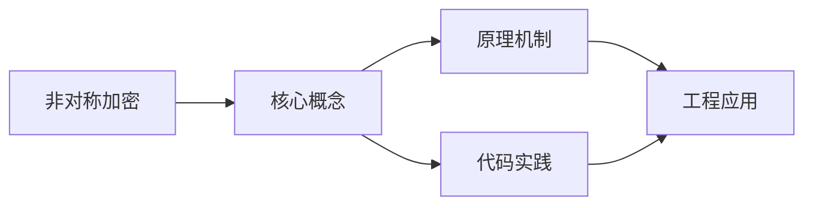
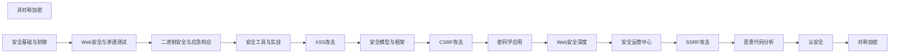

## 1. 学习目标（Bloom 分类）

本节按照布鲁姆教育目标分类学组织学习路径。本文主题为《非对称加密》，属于 网络安全 模块，读者可以根据自身阶段选择阅读深度。

记忆层面：能够准确复述本文的核心概念、术语与基本语法或操作步骤，并能够在提问或检索时快速定位对应知识点。能够说出 网络安全 的核心概念、组件与标准流程。

理解层面：能够用自己的语言解释核心原理与工作机制，说明概念之间的因果关系，而不是机械记忆结论。能够解释 网络安全 的工作原理与关键机制。

应用层面：能够在真实项目或练习场景中运用本文知识解决具体问题，写出正确且可维护的实现。能够执行 网络安全 相关的标准操作与配置。

分析层面：能够拆解复杂问题，比较本文主题与相邻概念的异同，识别边界条件与例外情况。能够分析 网络安全 方案在可靠性、成本与性能上的权衡。

评价层面：能够根据约束条件（性能、可读性、安全、成本）评价不同方案的优劣，做出有依据的技术决策。能够评价 网络安全 中的技术选型。

创造层面：能够把本文知识与其他模块知识组合，设计出新的解决方案或可复用的工程模式。能够设计基于 网络安全 的完整解决方案。

通过本节学习，读者应当能够把《非对称加密》纳入自己的知识网络，并与 网络安全 模块的其他主题（加密、认证、Web 安全、渗透测试、应急响应）建立关联。

## 2. 历史动机与发展脉络

《非对称加密》是 网络安全 领域的重要主题。要真正理解它，需要先了解它解决的问题与演进过程。

网络安全伴随计算机发展而来：1970 年代漏洞概念出现，1988 年 Morris 蠕虫推动 CERT 成立；现代安全已从“边界防御”转向“零信任”。
核心框架：CIA 三元组（机密性、完整性、可用性）；STRIDE 威胁建模；OWASP Top 10 是 Web 安全事实清单。
现代主题：零信任架构、供应链安全（SBOM）、云安全、DevSecOps、AI 安全；合规（等保、GDPR）驱动企业实践。

回到本文主题：非对称加密 的提出与成熟，正是上述技术背景下的必然产物。早期实现往往以简单可用为目标，随着工程规模扩大，社区逐渐沉淀出标准做法与最佳实践；理解这一脉络，可以帮助读者判断“为什么文档中的推荐写法是现在这个样子”，也能在遇到历史遗留代码时准确识别其设计年代与取舍。


## 3. 形式化定义与核心概念精讲

本节把《非对称加密》涉及的核心概念以“定义 + 讲解”的形式展开。读者应把定义当作工具，把讲解当作理解路径；两者结合才能形成可迁移的知识。

密码学基础：对称加密（AES）、非对称（RSA/ECC）、哈希（SHA-2/3）、HMAC；密码学是加密、签名与认证的地基。
认证与授权：口令哈希（bcrypt/argon2）、MFA、Session/JWT、OAuth 2.0/OIDC、RBAC/ABAC。
Web 攻击面：注入（SQL/XSS）、CSRF、SSRF、文件上传、反序列化；防御（输入校验、输出编码、CSP、SameSite）。

### 3.1 原文章节逐一精讲

原文档把主题拆分为 5 个小节，下面按顺序给出每一节的导读讲解，随后保留原文细节供精读。

#### 原文精读（完整保留）


#### 1. 非对称加密基础

##### 1.1 基本概念

非对称加密使用一对密钥：**公钥**（公开）和**私钥**（保密）。

$$E_{pub}(M) = C, \quad D_{priv}(C) = M$$

##### 1.2 核心应用

| 应用     | 方式               |
| -------- | ------------------ |
| 加密通信 | 公钥加密，私钥解密 |
| 数字签名 | 私钥签名，公钥验证 |
| 密钥交换 | 协商共享密钥       |

##### 1.3 与对称加密对比

| 对比项   | 对称加密     | 非对称加密    |
| -------- | ------------ | ------------- |
| 密钥     | 1 个共享密钥 | 公钥+私钥对   |
| 速度     | 快（1000x+） | 慢            |
| 密钥分发 | 困难         | 简单          |
| 典型用途 | 数据加密     | 密钥交换/签名 |

#### 2. RSA 算法

##### 2.1 数学基础

RSA 安全性基于**大整数分解困难性**。

**密钥生成**：

1. 选择两个大素数 $p, q$（通常 1024+ 位）
2. 计算 $n = pq$
3. 计算欧拉函数 $\phi(n) = (p-1)(q-1)$
4. 选择 $e$，满足 $1 < e < \phi(n)$，$\gcd(e, \phi(n)) = 1$（通常 $e = 65537$）
5. 计算 $d$，满足 $ed \equiv 1 \pmod{\phi(n)}$

- 公钥：$(n, e)$
- 私钥：$(n, d)$

**加密**：$C = M^e \mod n$

**解密**：$M = C^d \mod n$

##### 2.2 正确性证明

由 $ed \equiv 1 \pmod{\phi(n)}$，存在 $k$ 使 $ed = k\phi(n) + 1$

$$C^d = (M^e)^d = M^{ed} = M^{k\phi(n)+1} = M^{k\phi(n)} \cdot M \equiv M \pmod{n}$$

（由欧拉定理 $M^{\phi(n)} \equiv 1 \pmod{n}$，当 $\gcd(M, n) = 1$）

##### 2.3 RSA 填充方案

| 方案        | 全称                                  | 安全性                   |
| ----------- | ------------------------------------- | ------------------------ |
| PKCS#1 v1.5 | RSAES-PKCS1-v1_5                      | 存在 Bleichenbacher 攻击 |
| OAEP        | Optimal Asymmetric Encryption Padding | 推荐                     |
| PSS         | Probabilistic Signature Scheme        | 签名推荐                 |

**OAEP 填充**：

```
m' = m || 0...0  ← 填充到 n 的长度
m' = MGF(seed) XOR m' || seed = MGF(m') XOR seed
C = (m')^e mod n
```

##### 2.4 RSA 代码示例

```python
from cryptography.hazmat.primitives.asymmetric import rsa, padding
from cryptography.hazmat.primitives import hashes

# 生成密钥对
private_key = rsa.generate_private_key(
    public_exponent=65537,
    key_size=2048,
)
public_key = private_key.public_key()

# 加密
ciphertext = public_key.encrypt(
    message,
    padding.OAEP(
        mgf=padding.MGF1(algorithm=hashes.SHA256()),
        algorithm=hashes.SHA256(),
        label=None
    )
)

# 解密
plaintext = private_key.decrypt(
    ciphertext,
    padding.OAEP(
        mgf=padding.MGF1(algorithm=hashes.SHA256()),
        algorithm=hashes.SHA256(),
        label=None
    )
)
```

##### 2.5 RSA 攻击

| 攻击           | 条件              | 描述                 |
| -------------- | ----------------- | -------------------- |
| 分解攻击       | $n$ 较小          | 直接分解 $n$         |
| 共模攻击       | 同一 $n$ 不同 $e$ | 利用扩展欧几里得算法 |
| 低指数攻击     | $e$ 过小且 $M$ 短 | $M^e < n$ 时直接开方 |
| Bleichenbacher | PKCS#1 v1.5       | Oracle 攻击          |
| 侧信道         | 时间/功耗         | Montgomery 乘法泄露  |

#### 3. ECC 椭圆曲线加密

##### 3.1 数学基础

椭圆曲线定义：

$$y^2 = x^3 + ax + b \pmod{p}$$

**点加法**：$P + Q = R$

**标量乘法**：$kP = P + P + \cdots + P$（$k$ 次）

**离散对数问题**（ECDLP）：已知 $P$ 和 $kP$，求 $k$ 是困难的。

##### 3.2 常用曲线

| 曲线       | 密钥长度 | 等效 RSA  | 用途     |
| ---------- | -------- | --------- | -------- |
| secp256k1  | 256 位   | 3072 位   | Bitcoin  |
| P-256      | 256 位   | 3072 位   | TLS/通用 |
| P-384      | 384 位   | 7680 位   | 高安全   |
| Curve25519 | 256 位   | 3072 位   | 密钥交换 |
| Ed448      | 448 位   | ~14000 位 | 高安全   |

##### 3.3 ECDH 密钥交换

```
Alice: 生成私钥 a，计算 aG（G 为基点）
Bob:   生成私钥 b，计算 bG

交换: Alice → aG → Bob
      Bob   → bG → Alice

共享密钥:
Alice: a(bG) = abG
Bob:   b(aG) = abG
```

##### 3.4 ECDSA 签名

```python
from cryptography.hazmat.primitives.asymmetric import ec

# 生成密钥
private_key = ec.generate_private_key(ec.SECP256R1())
public_key = private_key.public_key()

# 签名
signature = private_key.sign(message, ec.ECDSA(hashes.SHA256()))

# 验证
public_key.verify(signature, message, ec.ECDSA(hashes.SHA256()))
```

##### 3.5 EdDSA（Ed25519）

```python
from cryptography.hazmat.primitives.asymmetric import ed25519

# 生成密钥
private_key = ed25519.Ed25519PrivateKey.generate()

# 签名（无需指定哈希算法）
signature = private_key.sign(message)

# 验证
public_key = private_key.public_key()
public_key.verify(signature, message)
```

**Ed25519 优势**：

- 确定性签名（无随机数依赖）
- 快速
- 抗侧信道
- 无歧义验证

#### 4. Diffie-Hellman 密钥交换

##### 4.1 经典 DH

$$A = g^a \mod p, \quad B = g^b \mod p$$

$$s = B^a \mod p = A^b \mod p = g^{ab} \mod p$$

##### 4.2 安全参数

| 参数 | 推荐值   |
| ---- | -------- |
| $p$  | 2048+ 位 |
| $g$  | 2 或 5   |

##### 4.3 前向保密

使用临时密钥（Ephemeral DH / DHE），每次会话生成新的 DH 参数，即使长期私钥泄露，历史会话仍安全。

#### 5. 算法选择指南

| 场景       | 推荐算法              |
| ---------- | --------------------- |
| 密钥交换   | X25519（ECDH）        |
| 数字签名   | Ed25519 / ECDSA P-256 |
| 加密       | RSA-OAEP 2048+        |
| 兼容旧系统 | RSA 2048+             |
| 禁止使用   | RSA 1024、DH 768      |


### 3.2 概念关系图

下面用 Mermaid 图表达本文核心概念之间的关系，帮助读者建立整体图景：



图中展示的是本文知识的结构化关系：核心概念是入口，原理机制解释“为什么”，代码实践演示“怎么做”，工程应用回答“何时用”。读者学习时可以把每个小节的内容挂接到对应节点上。

## 4. 理论推导与原理解析

本节深入《非对称加密》背后的原理。理论部分不求面面俱到，而是聚焦“能解释现象、能指导实践”的关键推导。

密码学基础：对称加密（AES）、非对称（RSA/ECC）、哈希（SHA-2/3）、HMAC；密码学是加密、签名与认证的地基。
认证与授权：口令哈希（bcrypt/argon2）、MFA、Session/JWT、OAuth 2.0/OIDC、RBAC/ABAC。
Web 攻击面：注入（SQL/XSS）、CSRF、SSRF、文件上传、反序列化；防御（输入校验、输出编码、CSP、SameSite）。
渗透测试流程：信息收集 -> 漏洞扫描 -> 利用 -> 提权 -> 横向 -> 报告；工具（Nmap、Burp、Metasploit）。

需要强调的是，理论推导与工程实践之间存在翻译层：理论给出的是理想化模型与边界条件，工程代码则必须处理真实环境中的例外。读者在学习时应先掌握理论的“标准情形”，再通过陷阱章节了解“非标准情形”。

## 5. 代码示例与逐行讲解

本节把原文中的代码示例系统整理，并为每个示例补充用途说明与讲解。读者不应只浏览代码，而应逐段对照讲解理解设计意图。

### 5.1 示例：2.3 RSA 填充方案

该示例来自原文《2.3 RSA 填充方案》小节，用于演示非对称加密相关操作。阅读时请先看代码结构，再看其后的讲解。

```text
m' = m || 0...0  ← 填充到 n 的长度
m' = MGF(seed) XOR m' || seed = MGF(m') XOR seed
C = (m')^e mod n
```

讲解：这段代码演示了本节核心知识点。代码中的关键操作可以归纳为三步：准备（定义或初始化）、执行（核心逻辑）、收尾（释放资源或返回结果）。实际项目中，这三步往往被封装为函数或类，以提升复用性与可测试性。

关键点分析：

该示例共 3 行有效代码，结构以数据或配置为主。阅读时应关注：数据字段的含义、配置项的作用，以及它们与运行行为的对应关系。

进阶思考路径：先尝试修改参数观察行为变化，再把示例中的模式迁移到自己的项目中；每次修改都记录预期与实测差异，这是把示例转化为能力的最快方式。

### 5.2 示例：2.4 RSA 代码示例

该示例来自原文《2.4 RSA 代码示例》小节，用于演示非对称加密相关操作。阅读时请先看代码结构，再看其后的讲解。

```python
from cryptography.hazmat.primitives.asymmetric import rsa, padding
from cryptography.hazmat.primitives import hashes

# 生成密钥对
private_key = rsa.generate_private_key(
    public_exponent=65537,
    key_size=2048,
)
public_key = private_key.public_key()

# 加密
ciphertext = public_key.encrypt(
    message,
    padding.OAEP(
        mgf=padding.MGF1(algorithm=hashes.SHA256()),
        algorithm=hashes.SHA256(),
        label=None
    )
)

# 解密
plaintext = private_key.decrypt(
    ciphertext,
    padding.OAEP(
        mgf=padding.MGF1(algorithm=hashes.SHA256()),
        algorithm=hashes.SHA256(),
        label=None
    )
)
```

讲解：这段代码演示了本节核心知识点。代码中的关键操作可以归纳为三步：准备（定义或初始化）、执行（核心逻辑）、收尾（释放资源或返回结果）。实际项目中，这三步往往被封装为函数或类，以提升复用性与可测试性。

关键点分析：

该示例共 26 行有效代码，包含 2 类关键结构（import、from）。其中：

- 入口与初始化部分负责建立上下文，对应实际项目中的启动或装配逻辑；
- 核心逻辑部分体现本文主题的主要操作，是阅读时最需要对照讲解理解的部分；
- 输出或返回部分把结果交给调用方，注意其类型与边界条件。

进阶思考路径：先尝试修改参数观察行为变化，再把示例中的模式迁移到自己的项目中；每次修改都记录预期与实测差异，这是把示例转化为能力的最快方式。

### 5.3 示例：3.3 ECDH 密钥交换

该示例来自原文《3.3 ECDH 密钥交换》小节，用于演示非对称加密相关操作。阅读时请先看代码结构，再看其后的讲解。

```text
Alice: 生成私钥 a，计算 aG（G 为基点）
Bob:   生成私钥 b，计算 bG

交换: Alice → aG → Bob
      Bob   → bG → Alice

共享密钥:
Alice: a(bG) = abG
Bob:   b(aG) = abG
```

讲解：这段代码演示了本节核心知识点。代码中的关键操作可以归纳为三步：准备（定义或初始化）、执行（核心逻辑）、收尾（释放资源或返回结果）。实际项目中，这三步往往被封装为函数或类，以提升复用性与可测试性。

关键点分析：

该示例共 7 行有效代码，结构以数据或配置为主。阅读时应关注：数据字段的含义、配置项的作用，以及它们与运行行为的对应关系。

进阶思考路径：先尝试修改参数观察行为变化，再把示例中的模式迁移到自己的项目中；每次修改都记录预期与实测差异，这是把示例转化为能力的最快方式。

### 5.4 示例：3.4 ECDSA 签名

该示例来自原文《3.4 ECDSA 签名》小节，用于演示非对称加密相关操作。阅读时请先看代码结构，再看其后的讲解。

```python
from cryptography.hazmat.primitives.asymmetric import ec

# 生成密钥
private_key = ec.generate_private_key(ec.SECP256R1())
public_key = private_key.public_key()

# 签名
signature = private_key.sign(message, ec.ECDSA(hashes.SHA256()))

# 验证
public_key.verify(signature, message, ec.ECDSA(hashes.SHA256()))
```

讲解：这段代码演示了本节核心知识点。代码中的关键操作可以归纳为三步：准备（定义或初始化）、执行（核心逻辑）、收尾（释放资源或返回结果）。实际项目中，这三步往往被封装为函数或类，以提升复用性与可测试性。

关键点分析：

该示例共 8 行有效代码，包含 2 类关键结构（import、from）。其中：

- 入口与初始化部分负责建立上下文，对应实际项目中的启动或装配逻辑；
- 核心逻辑部分体现本文主题的主要操作，是阅读时最需要对照讲解理解的部分；
- 输出或返回部分把结果交给调用方，注意其类型与边界条件。

进阶思考路径：先尝试修改参数观察行为变化，再把示例中的模式迁移到自己的项目中；每次修改都记录预期与实测差异，这是把示例转化为能力的最快方式。

### 5.5 示例：3.5 EdDSA（Ed25519）

该示例来自原文《3.5 EdDSA（Ed25519）》小节，用于演示非对称加密相关操作。阅读时请先看代码结构，再看其后的讲解。

```python
from cryptography.hazmat.primitives.asymmetric import ed25519

# 生成密钥
private_key = ed25519.Ed25519PrivateKey.generate()

# 签名（无需指定哈希算法）
signature = private_key.sign(message)

# 验证
public_key = private_key.public_key()
public_key.verify(signature, message)
```

讲解：这段代码演示了本节核心知识点。代码中的关键操作可以归纳为三步：准备（定义或初始化）、执行（核心逻辑）、收尾（释放资源或返回结果）。实际项目中，这三步往往被封装为函数或类，以提升复用性与可测试性。

关键点分析：

该示例共 8 行有效代码，包含 2 类关键结构（import、from）。其中：

- 入口与初始化部分负责建立上下文，对应实际项目中的启动或装配逻辑；
- 核心逻辑部分体现本文主题的主要操作，是阅读时最需要对照讲解理解的部分；
- 输出或返回部分把结果交给调用方，注意其类型与边界条件。

进阶思考路径：先尝试修改参数观察行为变化，再把示例中的模式迁移到自己的项目中；每次修改都记录预期与实测差异，这是把示例转化为能力的最快方式。


综合以上示例，可以总结出本主题的代码实践要点：第一，先定义清晰的输入输出契约；第二，核心逻辑保持单一职责；第三，错误处理与边界条件不可省略；第四，命名与注释表达意图而非复述代码。

## 6. 对比分析

对比是理解《非对称加密》定位的最快路径。下面从多个维度与相邻方案进行对比。

白盒与黑盒：白盒审代码，黑盒测外部；红蓝对抗验证整体。
等保 2.0 与 ISO 27001：合规框架驱动管理安全。
传统边界与零信任：零信任默认不信任任何请求，持续验证。

对比的目的不是分出绝对优劣，而是建立选择依据：不同约束条件下，最优解不同。读者应把每个对比维度转化为决策检查清单。

## 7. 常见陷阱与最佳实践

本节整理该主题的高频错误与推荐做法。每个陷阱先描述现象，再解释原因，最后给出最佳实践。

### 7.1 弱口令

默认口令与弱密码是最大入口。强制策略 + MFA。

深入讲解：该问题之所以被归类为“常见陷阱”，是因为它在初学者的代码中反复出现，而且往往不在第一时间暴露——错误通常隐藏在特定数据或特定时序下。

从成因上看，弱口令 一般源于对 网络安全 某个机制的理解偏差：要么误用了默认行为，要么忽略了边界条件，要么把其他语言的思维惯性带了过来。

从影响上看，弱口令 轻则产生错误结果，重则导致资源泄漏、数据损坏或安全事故；这也是为什么工程评审中会把它列为检查项。

从修复策略上看，处理弱口令的正确顺序是：先复现（构造最小用例），再定位（确认机制层面的根因），最后修复并补充回归测试。跳过复现直接改代码，往往治标不治本。

### 7.2 SQL 注入

拼接 SQL 直接执行。参数化查询 + 最小权限。

深入讲解：该问题之所以被归类为“常见陷阱”，是因为它在初学者的代码中反复出现，而且往往不在第一时间暴露——错误通常隐藏在特定数据或特定时序下。

从成因上看，SQL 注入 一般源于对 网络安全 某个机制的理解偏差：要么误用了默认行为，要么忽略了边界条件，要么把其他语言的思维惯性带了过来。

从影响上看，SQL 注入 轻则产生错误结果，重则导致资源泄漏、数据损坏或安全事故；这也是为什么工程评审中会把它列为检查项。

从修复策略上看，处理SQL 注入的正确顺序是：先复现（构造最小用例），再定位（确认机制层面的根因），最后修复并补充回归测试。跳过复现直接改代码，往往治标不治本。

### 7.3 XSS 未过滤

反射/存储型 XSS 窃取会话。输出编码 + CSP。

深入讲解：该问题之所以被归类为“常见陷阱”，是因为它在初学者的代码中反复出现，而且往往不在第一时间暴露——错误通常隐藏在特定数据或特定时序下。

从成因上看，XSS 未过滤 一般源于对 网络安全 某个机制的理解偏差：要么误用了默认行为，要么忽略了边界条件，要么把其他语言的思维惯性带了过来。

从影响上看，XSS 未过滤 轻则产生错误结果，重则导致资源泄漏、数据损坏或安全事故；这也是为什么工程评审中会把它列为检查项。

从修复策略上看，处理XSS 未过滤的正确顺序是：先复现（构造最小用例），再定位（确认机制层面的根因），最后修复并补充回归测试。跳过复现直接改代码，往往治标不治本。

### 7.4 敏感信息泄露

日志与前端暴露密钥。密钥管理 + 脱敏。

深入讲解：该问题之所以被归类为“常见陷阱”，是因为它在初学者的代码中反复出现，而且往往不在第一时间暴露——错误通常隐藏在特定数据或特定时序下。

从成因上看，敏感信息泄露 一般源于对 网络安全 某个机制的理解偏差：要么误用了默认行为，要么忽略了边界条件，要么把其他语言的思维惯性带了过来。

从影响上看，敏感信息泄露 轻则产生错误结果，重则导致资源泄漏、数据损坏或安全事故；这也是为什么工程评审中会把它列为检查项。

从修复策略上看，处理敏感信息泄露的正确顺序是：先复现（构造最小用例），再定位（确认机制层面的根因），最后修复并补充回归测试。跳过复现直接改代码，往往治标不治本。

### 7.5 依赖漏洞

第三方库已知漏洞。SCA 扫描 + 更新。

深入讲解：该问题之所以被归类为“常见陷阱”，是因为它在初学者的代码中反复出现，而且往往不在第一时间暴露——错误通常隐藏在特定数据或特定时序下。

从成因上看，依赖漏洞 一般源于对 网络安全 某个机制的理解偏差：要么误用了默认行为，要么忽略了边界条件，要么把其他语言的思维惯性带了过来。

从影响上看，依赖漏洞 轻则产生错误结果，重则导致资源泄漏、数据损坏或安全事故；这也是为什么工程评审中会把它列为检查项。

从修复策略上看，处理依赖漏洞的正确顺序是：先复现（构造最小用例），再定位（确认机制层面的根因），最后修复并补充回归测试。跳过复现直接改代码，往往治标不治本。

### 7.6 权限过度

账号权限超出职责。最小权限 + 定期审计。

深入讲解：该问题之所以被归类为“常见陷阱”，是因为它在初学者的代码中反复出现，而且往往不在第一时间暴露——错误通常隐藏在特定数据或特定时序下。

从成因上看，权限过度 一般源于对 网络安全 某个机制的理解偏差：要么误用了默认行为，要么忽略了边界条件，要么把其他语言的思维惯性带了过来。

从影响上看，权限过度 轻则产生错误结果，重则导致资源泄漏、数据损坏或安全事故；这也是为什么工程评审中会把它列为检查项。

从修复策略上看，处理权限过度的正确顺序是：先复现（构造最小用例），再定位（确认机制层面的根因），最后修复并补充回归测试。跳过复现直接改代码，往往治标不治本。

### 7.7 备份缺失

勒索软件无法恢复。离线备份 + 恢复演练。

深入讲解：该问题之所以被归类为“常见陷阱”，是因为它在初学者的代码中反复出现，而且往往不在第一时间暴露——错误通常隐藏在特定数据或特定时序下。

从成因上看，备份缺失 一般源于对 网络安全 某个机制的理解偏差：要么误用了默认行为，要么忽略了边界条件，要么把其他语言的思维惯性带了过来。

从影响上看，备份缺失 轻则产生错误结果，重则导致资源泄漏、数据损坏或安全事故；这也是为什么工程评审中会把它列为检查项。

从修复策略上看，处理备份缺失的正确顺序是：先复现（构造最小用例），再定位（确认机制层面的根因），最后修复并补充回归测试。跳过复现直接改代码，往往治标不治本。

### 7.8 安全意识薄弱

钓鱼与社会工程。培训 + 模拟演练。

深入讲解：该问题之所以被归类为“常见陷阱”，是因为它在初学者的代码中反复出现，而且往往不在第一时间暴露——错误通常隐藏在特定数据或特定时序下。

从成因上看，安全意识薄弱 一般源于对 网络安全 某个机制的理解偏差：要么误用了默认行为，要么忽略了边界条件，要么把其他语言的思维惯性带了过来。

从影响上看，安全意识薄弱 轻则产生错误结果，重则导致资源泄漏、数据损坏或安全事故；这也是为什么工程评审中会把它列为检查项。

从修复策略上看，处理安全意识薄弱的正确顺序是：先复现（构造最小用例），再定位（确认机制层面的根因），最后修复并补充回归测试。跳过复现直接改代码，往往治标不治本。

### 7.0 最佳实践总览

1. 纵深防御：网络、主机、应用、数据多层防线。
2. 最小权限与默认拒绝。
3. 安全左移：威胁建模与扫描进 CI。
4. 事件响应预案：检测、遏制、根除、恢复、复盘。

把这些最佳实践固化为团队规范与代码评审检查项，是避免同类问题反复出现的关键。

## 8. 工程实践

本节把《非对称加密》放入真实工程场景，给出可复用的模式与组织方法。

开发安全：依赖扫描、SAST（静态）、DAST（动态）、密钥扫描。
运行时：WAF、IDS/IPS、EDR、日志审计与 SIEM。
应急响应：SOP 文档、证据保全、复盘报告。

### 8.1 工程实践的原则拆解

以上工程实践可以归纳为四条原则。第一，配置与代码分离：网络安全 项目中环境差异应通过配置注入，而不是散落在代码分支中；这保证同一份代码可以在开发、测试、生产环境一致运行。

第二，接口稳定优先：对外接口（函数签名、协议、数据格式）一旦被消费方依赖，变更成本极高；设计时应预留扩展点并保持向后兼容。

第三，可观测性内置：日志、指标与追踪应该在功能开发时同步设计，而不是故障发生后补救；没有观测手段的模块等于黑盒。

第四，变更可回滚：任何发布都应有对应的回滚方案；数据库迁移、配置变更与代码发布一样需要版本管理与逆向路径。

### 8.2 实践落地的检查清单

- [ ] 开发安全：对照本节描述，检查当前项目是否已经落实；未落实的项列入技术债并排期处理。
- [ ] 运行时：对照本节描述，检查当前项目是否已经落实；未落实的项列入技术债并排期处理。
- [ ] 应急响应：对照本节描述，检查当前项目是否已经落实；未落实的项列入技术债并排期处理。

工程实践的共性原则：配置与代码分离、接口稳定优先、可观测性内置、变更可回滚。这些原则适用于本主题的所有实现。

## 9. 案例研究

本节通过一个完整案例把《非对称加密》的知识串起来。案例按“需求分析、方案设计、实现、验证”四步展开。

需求：为 Web 应用建立安全基线并验证。
方案：OWASP Top 10 对照加固 + 扫描 + 渗透测试。
要点：输入输出编码、CSP、认证加固、日志告警。
验证：漏扫报告清零高危、红队演练、事件响应演练。

### 9.1 案例的扩展讨论

把案例中的方案放大到真实规模，需要额外考虑三个问题：

第一，规模：当数据量或并发量上升一个数量级时，原方案中的数据结构、缓存策略与任务调度是否仍然成立？通常需要引入分层与异步。

第二，团队：多人协作时，模块边界、接口契约与代码所有权必须明确；案例中的实现应拆分为可独立测试的单元，并配合文档说明设计意图。

第三，演进：上线后的需求变化不可避免；方案设计时应预留扩展点（配置化、插件化、事件化），并定期用真实指标验证假设。


案例研究的学习方法：先独立阅读需求，尝试在脑中形成方案，再对照实现与讲解，最后思考“如果约束变化（数据量、并发、团队规模），方案应如何调整”。

## 10. 知识要点总结与深入讲解

本节以讲解形式汇总全文要点，替代传统的习题与自测，读者不需要答题，只需跟随解释建立完整的认知框架。

关于《非对称加密》的核心结论：

安全是设计出来的，不是事后补救。
OWASP Top 10 与 CIA 模型是入门主线。
纵深防御 + 最小权限 + 持续验证构成现代基线。

原文档各小节的要点回顾：

- 1. 非对称加密基础：该小节围绕非对称加密展开具体细节，阅读时应关注其与核心结论的对应关系；每个小节都是核心结论在某一个侧面的展开。
- 2. RSA 算法：该小节围绕非对称加密展开具体细节，阅读时应关注其与核心结论的对应关系；每个小节都是核心结论在某一个侧面的展开。
- 3. ECC 椭圆曲线加密：该小节围绕非对称加密展开具体细节，阅读时应关注其与核心结论的对应关系；每个小节都是核心结论在某一个侧面的展开。
- 4. Diffie-Hellman 密钥交换：该小节围绕非对称加密展开具体细节，阅读时应关注其与核心结论的对应关系；每个小节都是核心结论在某一个侧面的展开。
- 5. 算法选择指南：该小节围绕非对称加密展开具体细节，阅读时应关注其与核心结论的对应关系；每个小节都是核心结论在某一个侧面的展开。

把以上要点与第 3-9 节的内容对照复习，即可完成对本文主题的闭环学习。

## 11. 参考文献


OWASP Top 10：https://owasp.org/www-project-top-ten/
OWASP Cheat Sheets：https://cheatsheetseries.owasp.org/
NIST 网络安全框架：https://www.nist.gov/cyberframework
CWE 数据库：https://cwe.mitre.org/
PortSwigger Web Security Academy：https://portswigger.net/web-security

## 12. 延伸阅读


密码学与证书，见 033-cybersecurity 模块文档。
Web 攻击与防御，见 033-cybersecurity 模块相关文档。
网络层安全，见 032-networking 模块。
黑马程序员 Bilibili 空间（https://space.bilibili.com/37974444 ）提供网络安全课程。

## 14. 模块知识图谱与学习路径

本文属于 网络安全 模块。为了把《非对称加密》放入完整的知识网络，下面列出本模块的全部主题并给出相互关联的导读。学习时建议按模块内顺序推进，并在每个文档中留意交叉引用。



上图为模块主题的推荐学习顺序示意图（仅展示前若干主题）。各主题之间存在三类关联：

第一，前置依赖关系：早期主题是后期主题的基础，例如环境与语法先行、进阶主题随后；

第二，横向并列关系：同一层级主题从不同角度覆盖模块能力，学习顺序可以按兴趣调整；

第三，工程组合关系：多个主题在真实项目中组合使用，例如配置、性能与安全主题往往出现在同一系统的不同层面。

### 14.1 模块主题速查表

| 文档 | 主题 | 与本文的关联 |
| --- | --- | --- |
| 安全基础与防御 | 001-SecurityBasicsDefense | 本文的前置基础 |
| Web安全与渗透测试 | 002-WebSecurityPenetrationTesting | 本文的安全延伸 |
| 二进制安全与应急响应 | 003-BinarySecurityAndIncidentResponse | 本文的安全延伸 |
| 安全工具与实战 | 004-SecurityToolsPractice | 本文的综合应用 |
| XSS攻击 | 005-XSSAttack | 本文的并列主题 |
| 安全模型与框架 | 006-SecurityModelFramework | 本文的安全延伸 |
| CSRF攻击 | 007-CSRFAttack | 本文的并列主题 |
| 密码学应用 | 008-CryptographyApplication | 本文的并列主题 |
| Web安全深度 | 009-WebSecurityDeep | 本文的安全延伸 |
| 安全运营中心 | 010-SOC | 本文的安全延伸 |
| SSRF攻击 | 011-SSRFAttack | 本文的并列主题 |
| 恶意代码分析 | 012-MalwareAnalysis | 本文的并列主题 |
| 云安全 | 013-CloudSecurity | 本文的安全延伸 |
| 对称加密 | 014-SymmetricEncryption | 本文的安全延伸 |
| 应急响应 | 015-IncidentResponse | 本文的并列主题 |
| 非对称加密 | 016-AsymmetricEncryption | 本文自身 |
| 哈希算法 | 017-HashAlgorithm | 本文的并列主题 |
| 安全开发 | 018-SecureDevelopment | 本文的安全延伸 |
| 合规与审计 | 019-ComplianceAudit | 本文的并列主题 |
| 数字证书 | 020-DigitalCertificate | 本文的并列主题 |
| HTTPS原理 | 021-HTTPSPrinciple | 本文的原理深化 |
| 渗透测试方法论 | 022-PenetrationTestingMethodology | 本文的并列主题 |
| 信息收集 | 023-InformationGathering | 本文的并列主题 |
| 漏洞扫描 | 024-VulnerabilityScan | 本文的并列主题 |
| 安全编码原则 | 025-SecureCodingPrinciples | 本文的安全延伸 |
| 输入验证 | 026-InputValidation | 本文的并列主题 |
| 认证与授权 | 027-AuthenticationAuthorization | 本文的并列主题 |
| OWASP-Top-10详解 | 028-OWASPTop10Detailed | 本文的并列主题 |
| XXE攻击 | 029-XXEAttack | 本文的并列主题 |
| 反序列化漏洞 | 030-DeserializationVulnerability | 本文的并列主题 |
| 零信任架构 | 031-ZeroTrustArchitecture | 本文的原理深化 |
| 身份与访问管理 | 032-IdentityAccessManagement | 本文的并列主题 |
| 安全基线 | 033-SecurityBaseline | 本文的安全延伸 |
| 漏洞扫描工具 | 034-VulnerabilityScanTools | 本文的并列主题 |
| WAF规则 | 035-WAFRule | 本文的并列主题 |
| Cybersecurity OpenSSL 证书管理 | 036-OpenSSLCert | 本文的并列主题 |
| Cybersecurity OpenSSL 加密解密 | 037-OpenSSLEncrypt | 本文的安全延伸 |
| Cybersecurity nmap 端口扫描 | 038-NmapScan | 本文的并列主题 |
| Cybersecurity 哈希工具 | 039-HashTools | 本文的并列主题 |
| Cybersecurity hashcat 密码破解 | 040-Hashcat | 本文的并列主题 |
| Cybersecurity GPG 加密与签名 | 041-GPGEncrypt | 本文的安全延伸 |
| Cybersecurity SSH 密钥管理 | 042-SSHKeys | 本文的并列主题 |
| Cybersecurity 密码哈希 | 043-PasswordHash | 本文的并列主题 |
| Cybersecurity SQL 注入检测与防御 | 044-SQLInjection | 本文的并列主题 |
| Cybersecurity XSS 防御 | 045-XSSDefense | 本文的并列主题 |
| Cybersecurity CSRF 防御命令与配置 | 046-CSRFDefense | 本文的并列主题 |
| Cybersecurity XXE 防御与检测 | 047-XXEDefense | 本文的并列主题 |
| Cybersecurity 命令注入防御与检测 | 048-CommandInjection | 本文的并列主题 |
| Cybersecurity OAuth2/OIDC 配置命令 | 049-OAuth2OIDC | 本文的并列主题 |
| Cybersecurity 防火墙配置(ufw/firewalld) | 050-FirewallConfig | 本文的并列主题 |
| Cybersecurity IDS/IPS 命令(Suricata/Snort) | 051-IDSIPSCommands | 本文的并列主题 |
| Cybersecurity Metasploit 命令(渗透测试) | 052-MetasploitCommands | 本文的并列主题 |
| Cybersecurity Burp Suite 命令行 | 053-BurpSuiteCLI | 本文的并列主题 |
| Cybersecurity Nikto Web 扫描 | 054-NiktoScan | 本文的并列主题 |
| Cybersecurity OpenVAS 漏洞扫描 | 055-OpenVASCommands | 本文的并列主题 |
| Cybersecurity SELinux/AppArmor 强制访问控制 | 056-SELinuxAppArmor | 本文的并列主题 |
| Cybersecurity AIDE 文件完整性检查 | 057-AIDEFileIntegrity | 本文的并列主题 |
| Cybersecurity auditd 审计命令 | 058-AuditdCommands | 本文的并列主题 |
| Cybersecurity 隐写术工具命令 | 059-SteganographyTools | 本文的并列主题 |
| Cybersecurity 逆向工程命令(radare2/ghidra CLI) | 060-ReverseEngineering | 本文的并列主题 |

速查表的作用是让读者快速判断：哪些文档应在阅读本文前掌握（前置基础），哪些文档应在阅读本文后继续（延伸主题）。本模块的交叉引用体系即以此表为基础。

## 15. 术语表

下表整理《非对称加密》及 网络安全 模块中出现的高频术语，给出简明释义。术语按字母序或逻辑序排列，供查阅。

| 术语 | 释义 |
| --- | --- |
| 密码学基础 | 对称加密（AES）、非对称（RSA/ECC）、哈希（SHA-2/3）、HMAC；密码学是加密、签名与认证的地基。 |
| 认证与授权 | 口令哈希（bcrypt/argon2）、MFA、Session/JWT、OAuth 2.0/OIDC、RBAC/ABAC。 |
| Web 攻击面 | 注入（SQL/XSS）、CSRF、SSRF、文件上传、反序列化；防御（输入校验、输出编码、CSP、SameSite）。 |
| 渗透测试流程 | 信息收集 -> 漏洞扫描 -> 利用 -> 提权 -> 横向 -> 报告；工具（Nmap、Burp、Metasploit）。 |
| 弱口令（易错点） | 参见常见陷阱章节的详细讲解 |
| SQL 注入（易错点） | 参见常见陷阱章节的详细讲解 |
| XSS 未过滤（易错点） | 参见常见陷阱章节的详细讲解 |
| 敏感信息泄露（易错点） | 参见常见陷阱章节的详细讲解 |
| 依赖漏洞（易错点） | 参见常见陷阱章节的详细讲解 |
| 权限过度（易错点） | 参见常见陷阱章节的详细讲解 |

术语表与正文配合使用：先通读正文，遇到模糊术语回查本表；长期使用后术语会自然进入工作记忆。

## 13. 深度专题扩展

以下专题从不同角度深入本文主题，供有进阶需求的读者研读。每个专题独立成节，内容相互补充。

### 13.1 Web 攻击链详解

注入类：SQLi（参数化防御）、XSS（输出编码 + CSP）、命令注入（白名单）。
身份类：会话固定/劫持（HttpOnly + SameSite）、JWT 算法混淆（固定算法 + 校验）。
逻辑类：越权（IDOR）、竞态（TOCTOU）、支付篡改（服务端重算）。
防护纵深：WAF 拦截已知模式 + 应用层校验 + 监控异常。

### 13.2 零信任架构

核心原则：永不信任、始终验证；身份驱动策略而非网络位置。
组件：身份代理（IdP）、策略引擎（PDP）、网关（PEP）、微隔离。
落地路径：先高价值资产试点，逐步覆盖；配合 MFA 与设备合规。
成本与体验平衡：无密码（passkey）与连续评估是方向。

## 16. 核心概念串讲（复习视角）

本节以“把知识讲给他人听”的方式，把《非对称加密》的核心概念重新串讲一遍。与前文按章节展开不同，这里的叙述更接近课堂总结：先说整体，再逐个展开，最后收束。

《非对称加密》属于 网络安全 模块。要理解它，先要理解它在模块中的位置：它解决的是该领域的一个具体问题，并依赖模块内若干前置概念；反过来，它又为后续进阶主题提供基础。

第一个概念是密码学基础。对称加密（AES）、非对称（RSA/ECC）、哈希（SHA-2/3）、HMAC；密码学是加密、签名与认证的地基。

在实际使用中，密码学基础需要与相邻概念区分：它们的区别不在于名称，而在于适用条件与行为边界；这正是前文对比分析章节的意义。

第一个概念是认证与授权。口令哈希（bcrypt/argon2）、MFA、Session/JWT、OAuth 2.0/OIDC、RBAC/ABAC。

在实际使用中，认证与授权需要与相邻概念区分：它们的区别不在于名称，而在于适用条件与行为边界；这正是前文对比分析章节的意义。

第一个概念是Web 攻击面。注入（SQL/XSS）、CSRF、SSRF、文件上传、反序列化；防御（输入校验、输出编码、CSP、SameSite）。

在实际使用中，Web 攻击面需要与相邻概念区分：它们的区别不在于名称，而在于适用条件与行为边界；这正是前文对比分析章节的意义。

接下来是密码学基础。对称加密（AES）、非对称（RSA/ECC）、哈希（SHA-2/3）、HMAC；密码学是加密、签名与认证的地基。

理解该原理的关键不是记住结论，而是记住“它从什么假设出发、推出了什么、假设不成立时会怎样”。带着这个框架复习，原理之间就会连成网络。

接下来是认证与授权。口令哈希（bcrypt/argon2）、MFA、Session/JWT、OAuth 2.0/OIDC、RBAC/ABAC。

理解该原理的关键不是记住结论，而是记住“它从什么假设出发、推出了什么、假设不成立时会怎样”。带着这个框架复习，原理之间就会连成网络。

接下来是Web 攻击面。注入（SQL/XSS）、CSRF、SSRF、文件上传、反序列化；防御（输入校验、输出编码、CSP、SameSite）。

理解该原理的关键不是记住结论，而是记住“它从什么假设出发、推出了什么、假设不成立时会怎样”。带着这个框架复习，原理之间就会连成网络。

接下来是渗透测试流程。信息收集 -> 漏洞扫描 -> 利用 -> 提权 -> 横向 -> 报告；工具（Nmap、Burp、Metasploit）。

理解该原理的关键不是记住结论，而是记住“它从什么假设出发、推出了什么、假设不成立时会怎样”。带着这个框架复习，原理之间就会连成网络。

串讲收束：把概念与原理放回本文主题，可以得出一个总纲——定义描述是什么，原理解释为什么，实践回答怎么做。三者构成完整的学习闭环；后续遇到相关问题，都可以按这个总纲检索知识。
