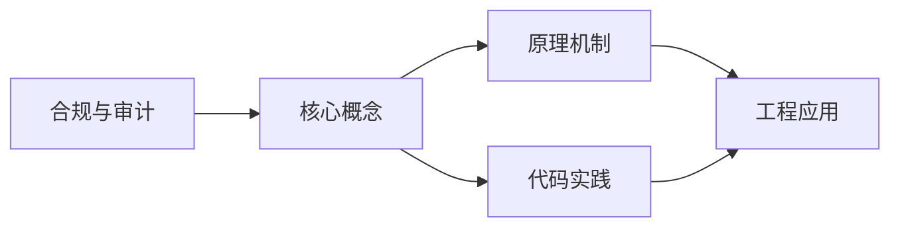
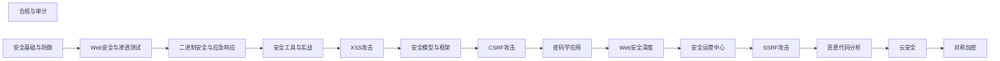

## 1. 学习目标（Bloom 分类）

本节按照布鲁姆教育目标分类学组织学习路径。本文主题为《合规与审计》，属于 网络安全 模块，读者可以根据自身阶段选择阅读深度。

记忆层面：能够准确复述本文的核心概念、术语与基本语法或操作步骤，并能够在提问或检索时快速定位对应知识点。能够说出 网络安全 的核心概念、组件与标准流程。

理解层面：能够用自己的语言解释核心原理与工作机制，说明概念之间的因果关系，而不是机械记忆结论。能够解释 网络安全 的工作原理与关键机制。

应用层面：能够在真实项目或练习场景中运用本文知识解决具体问题，写出正确且可维护的实现。能够执行 网络安全 相关的标准操作与配置。

分析层面：能够拆解复杂问题，比较本文主题与相邻概念的异同，识别边界条件与例外情况。能够分析 网络安全 方案在可靠性、成本与性能上的权衡。

评价层面：能够根据约束条件（性能、可读性、安全、成本）评价不同方案的优劣，做出有依据的技术决策。能够评价 网络安全 中的技术选型。

创造层面：能够把本文知识与其他模块知识组合，设计出新的解决方案或可复用的工程模式。能够设计基于 网络安全 的完整解决方案。

通过本节学习，读者应当能够把《合规与审计》纳入自己的知识网络，并与 网络安全 模块的其他主题（加密、认证、Web 安全、渗透测试、应急响应）建立关联。

## 2. 历史动机与发展脉络

《合规与审计》是 网络安全 领域的重要主题。要真正理解它，需要先了解它解决的问题与演进过程。

网络安全伴随计算机发展而来：1970 年代漏洞概念出现，1988 年 Morris 蠕虫推动 CERT 成立；现代安全已从“边界防御”转向“零信任”。
核心框架：CIA 三元组（机密性、完整性、可用性）；STRIDE 威胁建模；OWASP Top 10 是 Web 安全事实清单。
现代主题：零信任架构、供应链安全（SBOM）、云安全、DevSecOps、AI 安全；合规（等保、GDPR）驱动企业实践。

回到本文主题：合规与审计 的提出与成熟，正是上述技术背景下的必然产物。早期实现往往以简单可用为目标，随着工程规模扩大，社区逐渐沉淀出标准做法与最佳实践；理解这一脉络，可以帮助读者判断“为什么文档中的推荐写法是现在这个样子”，也能在遇到历史遗留代码时准确识别其设计年代与取舍。


## 3. 形式化定义与核心概念精讲

本节把《合规与审计》涉及的核心概念以“定义 + 讲解”的形式展开。读者应把定义当作工具，把讲解当作理解路径；两者结合才能形成可迁移的知识。

密码学基础：对称加密（AES）、非对称（RSA/ECC）、哈希（SHA-2/3）、HMAC；密码学是加密、签名与认证的地基。
认证与授权：口令哈希（bcrypt/argon2）、MFA、Session/JWT、OAuth 2.0/OIDC、RBAC/ABAC。
Web 攻击面：注入（SQL/XSS）、CSRF、SSRF、文件上传、反序列化；防御（输入校验、输出编码、CSP、SameSite）。

### 3.1 原文章节逐一精讲

原文档把主题拆分为 16 个小节，下面按顺序给出每一节的导读讲解，随后保留原文细节供精读。

#### 原文精读（完整保留）

# Cybersecurity 合规与系统加固命令

> **符号约定**:`< >` 必填参数 | `[ ]` 可选参数

---

#### 1. 合规体系

##### 1.1 主要法规标准

| 标准     | 地区 | 范围     |
| -------- | ---- | -------- |
| 等保2.0  | 中国 | 信息系统 |
| GDPR     | 欧盟 | 个人数据 |
| ISO27001 | 全球 | 信息安全 |
| SOC2     | 美国 | 服务组织 |
| PCI DSS  | 全球 | 支付卡   |
| HIPAA    | 美国 | 医疗     |

##### 1.2 合规管理流程

```
识别适用法规 → 差距分析 → 制定合规计划 → 实施控制 → 持续监控 → 审计评估
```

#### 2. 等保2.0

##### 2.1 定级流程

```
确定定级对象 → 初步确定等级 → 专家评审 → 主管部门审核 → 公安备案
```

##### 2.2 三级等保要求

| 类别     | 要求                     |
| -------- | ------------------------ |
| 物理安全 | 机房门禁、监控、消防     |
| 网络安全 | 边界防护、入侵检测       |
| 主机安全 | 身份鉴别、审计、入侵防范 |
| 应用安全 | 访问控制、通信完整性     |
| 数据安全 | 数据完整性、保密性、备份 |
| 管理安全 | 制度、人员、运维         |

#### 3. GDPR

##### 3.1 核心原则

- 合法性、公平性、透明性
- 目的限制
- 数据最小化
- 准确性
- 存储限制
- 完整性和保密性
- 问责制

##### 3.2 数据主体权利

| 权利       | 说明             |
| ---------- | ---------------- |
| 访问权     | 获取个人数据副本 |
| 更正权     | 修正不准确数据   |
| 删除权     | 被遗忘权         |
| 限制处理权 | 限制数据处理     |
| 数据可携权 | 转移数据         |
| 反对权     | 反对数据处理     |

##### 3.3 违规处罚

- 一般违规：1000万欧元或全球营业额2%
- 严重违规：2000万欧元或全球营业额4%

#### 4. 安全审计

##### 4.1 审计类型

| 类型     | 审计者   | 频率      |
| -------- | -------- | --------- |
| 内部审计 | 内部团队 | 季度/半年 |
| 外部审计 | 第三方   | 年度      |
| 合规审计 | 监管机构 | 按要求    |

##### 4.2 审计范围

- 访问控制审计
- 变更管理审计
- 日志审计
- 漏洞管理审计
- 备份恢复审计
- 人员安全审计

##### 4.3 审计证据

| 类型     | 示例               |
| -------- | ------------------ |
| 文档证据 | 策略文档、流程文件 |
| 技术证据 | 配置截图、日志记录 |
| 访谈证据 | 人员访谈记录       |
| 观察证据 | 现场观察记录       |

#### 5. 合规自动化

##### 5.1 自动化工具

| 工具         | 用途         |
| ------------ | ------------ |
| AWS Config   | 资源合规检查 |
| Azure Policy | 策略强制执行 |
| OPA          | 策略即代码   |
| InSpec       | 合规测试     |
| Prowler      | AWS安全检查  |

##### 5.2 合规即代码

```yaml
# OPA 策略：禁止公开S3桶
package aws.s3

deny[msg] {
bucket := input.resource.aws_s3_bucket[name]
bucket.acl == "public-read"
msg := sprintf("S3 bucket '%s' is publicly readable", [name])
}
```

##### 5.3 持续合规

```
代码提交 → 合规检查 → 部署 → 运行时监控 → 合规报告
```

- IaC扫描：部署前检查
- CSPM：运行时检查
- 持续报告：仪表盘展示
#### 系统账户加固

**基本写法:检查空密码账户**
`awk -F: '($2 == "") {print $1}' /etc/shadow`
```bash
# 查找密码为空的用户账户
sudo awk -F: '($2 == "") {print $1}' /etc/shadow
```

**基本写法:锁定空密码账户**
`passwd -l <用户>`
```bash
# 锁定空密码账户
sudo passwd -l username
```

**基本写法:设置密码最长有效期**
`chage -M <天数> <用户>`
```bash
# 设置密码 90 天必须更换
sudo chage -M 90 username
```

**基本写法:查看密码策略**
`chage -l <用户>`
```bash
# 查看用户密码策略信息
chage -l root
```

**基本写法:设置密码最短长度**
`sed -i 's/PASS_MIN_LEN.*/PASS_MIN_LEN 12/' /etc/login.defs`
```bash
# 设置密码最小长度为 12 位
sudo sed -i 's/PASS_MIN_LEN.*/PASS_MIN_LEN 12/' /etc/login.defs
```

**基本写法:检查 UID 为 0 的用户**
`awk -F: '$3 == 0 {print $1}' /etc/passwd`
```bash
# 查找 UID 为 0 的用户(应只有 root)
awk -F: '$3 == 0 {print $1}' /etc/passwd
```

---

#### SSH 服务加固

**基本写法:禁止 root 远程登录**
`sed -i 's/#PermitRootLogin.*/PermitRootLogin no/' /etc/ssh/sshd_config`
```bash
# 禁止 root 通过 SSH 登录
sudo sed -i 's/#PermitRootLogin.*/PermitRootLogin no/' /etc/ssh/sshd_config
```

**基本写法:禁用密码认证**
`sed -i 's/#PasswordAuthentication.*/PasswordAuthentication no/' /etc/ssh/sshd_config`
```bash
# 仅允许密钥认证
sudo sed -i 's/#PasswordAuthentication.*/PasswordAuthentication no/' /etc/ssh/sshd_config
```

**基本写法:修改默认端口**
`sed -i 's/#Port 22/Port 2222/' /etc/ssh/sshd_config`
```bash
# 修改 SSH 端口为 2222
sudo sed -i 's/#Port 22/Port 2222/' /etc/ssh/sshd_config
```

**基本写法:限制登录用户**
`echo "AllowUsers <用户>" >> /etc/ssh/sshd_config`
```bash
# 仅允许特定用户 SSH 登录
echo "AllowUsers admin deploy" | sudo tee -a /etc/ssh/sshd_config
```

**基本写法:重启 SSH 服务**
`systemctl restart sshd`
```bash
# 重启 SSH 服务应用配置
sudo systemctl restart sshd
```

---

#### 文件权限加固

**基本写法:查找无主文件**
`find / -nouser -o -nogroup 2>/dev/null`
```bash
# 查找无属主或无属组的文件
sudo find / -nouser -o -nogroup 2>/dev/null
```

**基本写法:查找世界可写文件**
`find / -perm -0002 -type f -not -path "/proc/*" 2>/dev/null`
```bash
# 查找世界可写文件
sudo find / -perm -0002 -type f -not -path "/proc/*" 2>/dev/null
```

**基本写法:查找 SUID 文件**
`find / -perm -4000 -type f 2>/dev/null`
```bash
# 查找所有 SUID 文件
sudo find / -perm -4000 -type f 2>/dev/null
```

**基本写法:查找 SGID 文件**
`find / -perm -2000 -type f 2>/dev/null`
```bash
# 查找所有 SGID 文件
sudo find / -perm -2000 -type f 2>/dev/null
```

**基本写法:加固关键文件权限**
`chmod 644 /etc/passwd; chmod 600 /etc/shadow`
```bash
# 设置关键系统文件权限
sudo chmod 644 /etc/passwd
sudo chmod 640 /etc/shadow
sudo chmod 644 /etc/group
sudo chmod 600 /etc/gshadow
```

---

#### 内核参数加固

**基本写法:启用 SYN Cookies**
`sysctl -w net.ipv4.tcp_syncookies=1`
```bash
# 启用 SYN Cookies 防 SYN Flood
sudo sysctl -w net.ipv4.tcp_syncookies=1
```

**基本写法:禁用 IP 转发**
`sysctl -w net.ipv4.ip_forward=0`
```bash
# 禁用 IP 转发(非路由器场景)
sudo sysctl -w net.ipv4.ip_forward=0
```

**基本写法:禁用源路由**
`sysctl -w net.ipv4.conf.all.accept_source_route=0`
```bash
# 禁用源路由数据包
sudo sysctl -w net.ipv4.conf.all.accept_source_route=0
sudo sysctl -w net.ipv4.conf.default.accept_source_route=0
```

**基本写法:启用反向路径过滤**
`sysctl -w net.ipv4.conf.all.rp_filter=1`
```bash
# 启用反向路径过滤防 IP 欺骗
sudo sysctl -w net.ipv4.conf.all.rp_filter=1
sudo sysctl -w net.ipv4.conf.default.rp_filter=1
```

**基本写法:永久保存配置**
`sysctl -p`
```bash
# 重新加载 sysctl 配置
sudo sysctl -p
```

---

#### 服务最小化

**基本写法:列出启用服务**
`systemctl list-unit-files --state=enabled`
```bash
# 列出所有开机自启服务
systemctl list-unit-files --state=enabled
```

**基本写法:禁用不必要服务**
`systemctl disable <服务>`
```bash
# 禁用不需要的服务
sudo systemctl disable avahi-daemon
sudo systemctl disable cups
```

**基本写法:停止运行中服务**
`systemctl stop <服务>`
```bash
# 停止不必要的服务
sudo systemctl stop bluetooth
sudo systemctl stop modem-manager
```

**基本写法:查看监听端口**
`ss -tlnp`
```bash
# 查看所有监听端口与服务
sudo ss -tlnp
```

**基本写法:卸载不需要软件**
`apt-get purge <包名>`
```bash
# 卸载不需要的软件包
sudo apt-get purge rpcbind nfs-common
```

---

#### 日志审计加固

**基本写法:启用审计服务**
`systemctl enable auditd`
```bash
# 启用 auditd 审计服务
sudo systemctl enable auditd
sudo systemctl start auditd
```

**基本写法:监控 passwd 文件**
`auditctl -w /etc/passwd -p wa -k passwd_change`
```bash
# 审计 passwd 文件变更
sudo auditctl -w /etc/passwd -p wa -k passwd_change
```

**基本写法:监控 sudo 使用**
`auditctl -w /var/log/sudo.log -p wa -k sudo_log`
```bash
# 审计 sudo 命令使用
sudo auditctl -w /var/log/sudo.log -p wa -k sudo_log
```

**基本写法:配置日志保留**
`sed -i 's/max_log_file.*/max_log_file = 50/' /etc/audit/auditd.conf`
```bash
# 配置审计日志保留大小
sudo sed -i 's/max_log_file.*/max_log_file = 50/' /etc/audit/auditd.conf
sudo sed -i 's/max_log_file_action.*/max_log_file_action = rotate/' /etc/audit/auditd.conf
```

**基本写法:启用远程日志**
`echo "*.* @<日志服务器>" >> /etc/rsyslog.conf`
```bash
# 配置远程日志服务器
echo "*.* @192.168.1.100" | sudo tee -a /etc/rsyslog.conf
sudo systemctl restart rsyslog
```

---

#### 网络加固

**基本写法:配置防火墙默认策略**
`ufw default deny incoming`
```bash
# 默认拒绝所有入站流量
sudo ufw default deny incoming
sudo ufw default allow outgoing
```

**基本写法:限制 SSH 连接速率**
`iptables -A INPUT -p tcp --dport 22 -m state --state NEW -m recent --set`
```bash
# 限制 SSH 连接速率防爆破
sudo iptables -A INPUT -p tcp --dport 22 -m state --state NEW -m recent --set
sudo iptables -A INPUT -p tcp --dport 22 -m state --state NEW -m recent --update --seconds 60 --hitcount 4 -j DROP
```

**基本写法:禁用 ICMP 重定向**
`sysctl -w net.ipv4.conf.all.accept_redirects=0`
```bash
# 禁用 ICMP 重定向防中间人攻击
sudo sysctl -w net.ipv4.conf.all.accept_redirects=0
sudo sysctl -w net.ipv4.conf.default.accept_redirects=0
```

**基本写法:禁用 ICMP 广播**
`sysctl -w net.ipv4.icmp_echo_ignore_broadcasts=1`
```bash
# 禁用 ICMP 广播响应
sudo sysctl -w net.ipv4.icmp_echo_ignore_broadcasts=1
```

**基本写法:启用防火墙**
`ufw enable`
```bash
# 启用 ufw 防火墙
sudo ufw enable
sudo ufw allow 22/tcp
```

---

#### 合规扫描工具

**基本写法:安装 Lynis**
`apt-get install lynis`
```bash
# 安装 Lynis 安全扫描工具
sudo apt-get install lynis
```

**基本写法:运行 Lynis 扫描**
`lynis audit system`
```bash
# 运行系统安全审计
sudo lynis audit system
```

**基本写法:输出扫描报告**
`lynis audit system --pentest`
```bash
# 以渗透测试视角运行扫描
sudo lynis audit system --pentest
```

**基本写法:查看扫描结果**
`cat /var/log/lynis.log | grep -E "Warning|Suggestion"`
```bash
# 查看 Lynis 扫描警告与建议
sudo cat /var/log/lynis.log | grep -E "Warning|Suggestion" | head -30
```

**基本写法:使用 OpenSCAP 扫描**
`oscap xccdf eval --profile <配置> <基准文件>`
```bash
# 使用 OpenSCAP 运行合规扫描
sudo oscap xccdf eval --profile xccdf_org.ssgproject.content_profile_pci_dss /usr/share/xml/scap/ssg/content/ssg-ubuntu2204-ds.xml
```

---

#### CIS 基准检查

**基本写法:检查密码策略**
`cat /etc/pam.d/common-password`
```bash
# 查看 PAM 密码策略配置
cat /etc/pam.d/common-password
```

**基本写法:检查登录失败锁定**
`cat /etc/pam.d/common-auth | grep pam_tally`
```bash
# 检查是否配置账户锁定策略
grep -i "pam_tally\|pam_faillock" /etc/pam.d/common-auth
```

**基本写法:配置登录失败锁定**
`echo "auth required pam_tally2.so deny=5 unlock_time=600" >> /etc/pam.d/common-auth`
```bash
# 配置 5 次失败后锁定 10 分钟
echo "auth required pam_tally2.so deny=5 unlock_time=600" | sudo tee -a /etc/pam.d/common-auth
```

**基本写法:检查会话超时**
`cat /etc/profile | grep -i TMOUT`
```bash
# 检查是否配置会话超时
grep -i "TMOUT" /etc/profile
```

**基本写法:配置会话超时**
`echo "export TMOUT=600" >> /etc/profile`
```bash
# 配置 10 分钟无操作自动登出
echo "export TMOUT=600" | sudo tee -a /etc/profile
```

---

#### 补丁管理

**基本写法:检查可用更新**
`apt-get update && apt list --upgradable`
```bash
# 列出所有可升级软件包
sudo apt-get update && apt list --upgradable
```

**基本写法:安装安全更新**
`apt-get upgrade`
```bash
# 安装所有可用更新
sudo apt-get upgrade -y
```

**基本写法:仅安装安全更新**
`unattended-upgrade --dry-run -v`
```bash
# 仅检查安全更新
sudo unattended-upgrade --dry-run -v
```

**基本写法:启用自动安全更新**
`dpkg-reconfigure -plow unattended-upgrades`
```bash
# 配置自动安装安全更新
sudo dpkg-reconfigure -plow unattended-upgrades
```

**基本写法:查看已安装补丁**
`apt list --installed | grep -i security`
```bash
# 查看已安装的安全更新
sudo apt list --installed | grep -i security
```

---

#### 加固自检脚本

**基本写法:综合安全检查**
`#!/bin/bash ...`
```bash
# 综合安全检查脚本
echo "=== 用户检查 ==="
awk -F: '$3 == 0 {print "UID 0 用户:", $1}' /etc/passwd
echo "=== SSH 配置 ==="
grep -E "PermitRootLogin|PasswordAuthentication|Port" /etc/ssh/sshd_config
echo "=== 监听端口 ==="
sudo ss -tlnp
echo "=== SUID 文件 ==="
sudo find / -perm -4000 -type f 2>/dev/null
```

**基本写法:检查服务状态**
`systemctl list-unit-files --state=enabled | wc -l`
```bash
# 统计启用服务数量
systemctl list-unit-files --state=enabled | wc -l
```

**基本写法:验证防火墙状态**
`ufw status`
```bash
# 验证防火墙启用状态
sudo ufw status verbose
```

**基本写法:生成加固报告**
`lynis audit system > hardening_report.txt 2>&1`
```bash
# 生成系统加固报告
sudo lynis audit system > hardening_report.txt 2>&1
echo "加固评分: $(grep "Hardening index" /var/log/lynis-report.dat | cut -d= -f2)"
```

**基本写法:对比加固前后**
`diff <(cat /etc/ssh/sshd_config) <(cat sshd_config.backup)`
```bash
# 对比配置文件变更
diff /etc/ssh/sshd_config /backup/sshd_config.backup
```


### 3.2 概念关系图

下面用 Mermaid 图表达本文核心概念之间的关系，帮助读者建立整体图景：



图中展示的是本文知识的结构化关系：核心概念是入口，原理机制解释“为什么”，代码实践演示“怎么做”，工程应用回答“何时用”。读者学习时可以把每个小节的内容挂接到对应节点上。

## 4. 理论推导与原理解析

本节深入《合规与审计》背后的原理。理论部分不求面面俱到，而是聚焦“能解释现象、能指导实践”的关键推导。

密码学基础：对称加密（AES）、非对称（RSA/ECC）、哈希（SHA-2/3）、HMAC；密码学是加密、签名与认证的地基。
认证与授权：口令哈希（bcrypt/argon2）、MFA、Session/JWT、OAuth 2.0/OIDC、RBAC/ABAC。
Web 攻击面：注入（SQL/XSS）、CSRF、SSRF、文件上传、反序列化；防御（输入校验、输出编码、CSP、SameSite）。
渗透测试流程：信息收集 -> 漏洞扫描 -> 利用 -> 提权 -> 横向 -> 报告；工具（Nmap、Burp、Metasploit）。

需要强调的是，理论推导与工程实践之间存在翻译层：理论给出的是理想化模型与边界条件，工程代码则必须处理真实环境中的例外。读者在学习时应先掌握理论的“标准情形”，再通过陷阱章节了解“非标准情形”。

## 5. 代码示例与逐行讲解

本节把原文中的代码示例系统整理，并为每个示例补充用途说明与讲解。读者不应只浏览代码，而应逐段对照讲解理解设计意图。

### 5.1 示例：1.2 合规管理流程

该示例来自原文《1.2 合规管理流程》小节，用于演示合规与审计相关操作。阅读时请先看代码结构，再看其后的讲解。

```text
识别适用法规 → 差距分析 → 制定合规计划 → 实施控制 → 持续监控 → 审计评估
```

讲解：这段代码演示了本节核心知识点。代码中的关键操作可以归纳为三步：准备（定义或初始化）、执行（核心逻辑）、收尾（释放资源或返回结果）。实际项目中，这三步往往被封装为函数或类，以提升复用性与可测试性。

关键点分析：

该示例共 1 行有效代码，结构以数据或配置为主。阅读时应关注：数据字段的含义、配置项的作用，以及它们与运行行为的对应关系。

进阶思考路径：先尝试修改参数观察行为变化，再把示例中的模式迁移到自己的项目中；每次修改都记录预期与实测差异，这是把示例转化为能力的最快方式。

### 5.2 示例：2.1 定级流程

该示例来自原文《2.1 定级流程》小节，用于演示合规与审计相关操作。阅读时请先看代码结构，再看其后的讲解。

```text
确定定级对象 → 初步确定等级 → 专家评审 → 主管部门审核 → 公安备案
```

讲解：这段代码演示了本节核心知识点。代码中的关键操作可以归纳为三步：准备（定义或初始化）、执行（核心逻辑）、收尾（释放资源或返回结果）。实际项目中，这三步往往被封装为函数或类，以提升复用性与可测试性。

关键点分析：

该示例共 1 行有效代码，结构以数据或配置为主。阅读时应关注：数据字段的含义、配置项的作用，以及它们与运行行为的对应关系。

进阶思考路径：先尝试修改参数观察行为变化，再把示例中的模式迁移到自己的项目中；每次修改都记录预期与实测差异，这是把示例转化为能力的最快方式。

### 5.3 示例：5.2 合规即代码

该示例来自原文《5.2 合规即代码》小节，用于演示合规与审计相关操作。阅读时请先看代码结构，再看其后的讲解。

```yaml
# OPA 策略：禁止公开S3桶
package aws.s3

deny[msg] {
bucket := input.resource.aws_s3_bucket[name]
bucket.acl == "public-read"
msg := sprintf("S3 bucket '%s' is publicly readable", [name])
}
```

讲解：这段代码演示了本节核心知识点。代码中的关键操作可以归纳为三步：准备（定义或初始化）、执行（核心逻辑）、收尾（释放资源或返回结果）。实际项目中，这三步往往被封装为函数或类，以提升复用性与可测试性。

关键点分析：

该示例共 7 行有效代码，结构以数据或配置为主。阅读时应关注：数据字段的含义、配置项的作用，以及它们与运行行为的对应关系。

进阶思考路径：先尝试修改参数观察行为变化，再把示例中的模式迁移到自己的项目中；每次修改都记录预期与实测差异，这是把示例转化为能力的最快方式。

### 5.4 示例：5.3 持续合规

该示例来自原文《5.3 持续合规》小节，用于演示合规与审计相关操作。阅读时请先看代码结构，再看其后的讲解。

```text
代码提交 → 合规检查 → 部署 → 运行时监控 → 合规报告
```

讲解：这段代码演示了本节核心知识点。代码中的关键操作可以归纳为三步：准备（定义或初始化）、执行（核心逻辑）、收尾（释放资源或返回结果）。实际项目中，这三步往往被封装为函数或类，以提升复用性与可测试性。

关键点分析：

该示例共 1 行有效代码，结构以数据或配置为主。阅读时应关注：数据字段的含义、配置项的作用，以及它们与运行行为的对应关系。

进阶思考路径：先尝试修改参数观察行为变化，再把示例中的模式迁移到自己的项目中；每次修改都记录预期与实测差异，这是把示例转化为能力的最快方式。

### 5.5 示例：系统账户加固

该示例来自原文《系统账户加固》小节，用于演示合规与审计相关操作。阅读时请先看代码结构，再看其后的讲解。

```bash
# 查找密码为空的用户账户
sudo awk -F: '($2 == "") {print $1}' /etc/shadow
```

讲解：这段代码演示了本节核心知识点。代码中的关键操作可以归纳为三步：准备（定义或初始化）、执行（核心逻辑）、收尾（释放资源或返回结果）。实际项目中，这三步往往被封装为函数或类，以提升复用性与可测试性。

关键点分析：

该示例共 2 行有效代码，结构以数据或配置为主。阅读时应关注：数据字段的含义、配置项的作用，以及它们与运行行为的对应关系。

进阶思考路径：先尝试修改参数观察行为变化，再把示例中的模式迁移到自己的项目中；每次修改都记录预期与实测差异，这是把示例转化为能力的最快方式。

### 5.6 示例：系统账户加固

该示例来自原文《系统账户加固》小节，用于演示合规与审计相关操作。阅读时请先看代码结构，再看其后的讲解。

```bash
# 锁定空密码账户
sudo passwd -l username
```

讲解：这段代码演示了本节核心知识点。代码中的关键操作可以归纳为三步：准备（定义或初始化）、执行（核心逻辑）、收尾（释放资源或返回结果）。实际项目中，这三步往往被封装为函数或类，以提升复用性与可测试性。

关键点分析：

该示例共 2 行有效代码，结构以数据或配置为主。阅读时应关注：数据字段的含义、配置项的作用，以及它们与运行行为的对应关系。

进阶思考路径：先尝试修改参数观察行为变化，再把示例中的模式迁移到自己的项目中；每次修改都记录预期与实测差异，这是把示例转化为能力的最快方式。

### 5.7 示例：系统账户加固

该示例来自原文《系统账户加固》小节，用于演示合规与审计相关操作。阅读时请先看代码结构，再看其后的讲解。

```bash
# 设置密码 90 天必须更换
sudo chage -M 90 username
```

讲解：这段代码演示了本节核心知识点。代码中的关键操作可以归纳为三步：准备（定义或初始化）、执行（核心逻辑）、收尾（释放资源或返回结果）。实际项目中，这三步往往被封装为函数或类，以提升复用性与可测试性。

关键点分析：

该示例共 2 行有效代码，结构以数据或配置为主。阅读时应关注：数据字段的含义、配置项的作用，以及它们与运行行为的对应关系。

进阶思考路径：先尝试修改参数观察行为变化，再把示例中的模式迁移到自己的项目中；每次修改都记录预期与实测差异，这是把示例转化为能力的最快方式。

### 5.8 示例：系统账户加固

该示例来自原文《系统账户加固》小节，用于演示合规与审计相关操作。阅读时请先看代码结构，再看其后的讲解。

```bash
# 查看用户密码策略信息
chage -l root
```

讲解：这段代码演示了本节核心知识点。代码中的关键操作可以归纳为三步：准备（定义或初始化）、执行（核心逻辑）、收尾（释放资源或返回结果）。实际项目中，这三步往往被封装为函数或类，以提升复用性与可测试性。

关键点分析：

该示例共 2 行有效代码，结构以数据或配置为主。阅读时应关注：数据字段的含义、配置项的作用，以及它们与运行行为的对应关系。

进阶思考路径：先尝试修改参数观察行为变化，再把示例中的模式迁移到自己的项目中；每次修改都记录预期与实测差异，这是把示例转化为能力的最快方式。

### 5.9 示例：系统账户加固

该示例来自原文《系统账户加固》小节，用于演示合规与审计相关操作。阅读时请先看代码结构，再看其后的讲解。

```bash
# 设置密码最小长度为 12 位
sudo sed -i 's/PASS_MIN_LEN.*/PASS_MIN_LEN 12/' /etc/login.defs
```

讲解：这段代码演示了本节核心知识点。代码中的关键操作可以归纳为三步：准备（定义或初始化）、执行（核心逻辑）、收尾（释放资源或返回结果）。实际项目中，这三步往往被封装为函数或类，以提升复用性与可测试性。

关键点分析：

该示例共 2 行有效代码，结构以数据或配置为主。阅读时应关注：数据字段的含义、配置项的作用，以及它们与运行行为的对应关系。

进阶思考路径：先尝试修改参数观察行为变化，再把示例中的模式迁移到自己的项目中；每次修改都记录预期与实测差异，这是把示例转化为能力的最快方式。

### 5.10 示例：系统账户加固

该示例来自原文《系统账户加固》小节，用于演示合规与审计相关操作。阅读时请先看代码结构，再看其后的讲解。

```bash
# 查找 UID 为 0 的用户(应只有 root)
awk -F: '$3 == 0 {print $1}' /etc/passwd
```

讲解：这段代码演示了本节核心知识点。代码中的关键操作可以归纳为三步：准备（定义或初始化）、执行（核心逻辑）、收尾（释放资源或返回结果）。实际项目中，这三步往往被封装为函数或类，以提升复用性与可测试性。

关键点分析：

该示例共 2 行有效代码，结构以数据或配置为主。阅读时应关注：数据字段的含义、配置项的作用，以及它们与运行行为的对应关系。

进阶思考路径：先尝试修改参数观察行为变化，再把示例中的模式迁移到自己的项目中；每次修改都记录预期与实测差异，这是把示例转化为能力的最快方式。

### 5.11 示例：SSH 服务加固

该示例来自原文《SSH 服务加固》小节，用于演示合规与审计相关操作。阅读时请先看代码结构，再看其后的讲解。

```bash
# 禁止 root 通过 SSH 登录
sudo sed -i 's/#PermitRootLogin.*/PermitRootLogin no/' /etc/ssh/sshd_config
```

讲解：这段代码演示了本节核心知识点。代码中的关键操作可以归纳为三步：准备（定义或初始化）、执行（核心逻辑）、收尾（释放资源或返回结果）。实际项目中，这三步往往被封装为函数或类，以提升复用性与可测试性。

关键点分析：

该示例共 2 行有效代码，结构以数据或配置为主。阅读时应关注：数据字段的含义、配置项的作用，以及它们与运行行为的对应关系。

进阶思考路径：先尝试修改参数观察行为变化，再把示例中的模式迁移到自己的项目中；每次修改都记录预期与实测差异，这是把示例转化为能力的最快方式。

### 5.12 示例：SSH 服务加固

该示例来自原文《SSH 服务加固》小节，用于演示合规与审计相关操作。阅读时请先看代码结构，再看其后的讲解。

```bash
# 仅允许密钥认证
sudo sed -i 's/#PasswordAuthentication.*/PasswordAuthentication no/' /etc/ssh/sshd_config
```

讲解：这段代码演示了本节核心知识点。代码中的关键操作可以归纳为三步：准备（定义或初始化）、执行（核心逻辑）、收尾（释放资源或返回结果）。实际项目中，这三步往往被封装为函数或类，以提升复用性与可测试性。

关键点分析：

该示例共 2 行有效代码，结构以数据或配置为主。阅读时应关注：数据字段的含义、配置项的作用，以及它们与运行行为的对应关系。

进阶思考路径：先尝试修改参数观察行为变化，再把示例中的模式迁移到自己的项目中；每次修改都记录预期与实测差异，这是把示例转化为能力的最快方式。

### 5.13 示例：SSH 服务加固

该示例来自原文《SSH 服务加固》小节，用于演示合规与审计相关操作。阅读时请先看代码结构，再看其后的讲解。

```bash
# 修改 SSH 端口为 2222
sudo sed -i 's/#Port 22/Port 2222/' /etc/ssh/sshd_config
```

讲解：这段代码演示了本节核心知识点。代码中的关键操作可以归纳为三步：准备（定义或初始化）、执行（核心逻辑）、收尾（释放资源或返回结果）。实际项目中，这三步往往被封装为函数或类，以提升复用性与可测试性。

关键点分析：

该示例共 2 行有效代码，结构以数据或配置为主。阅读时应关注：数据字段的含义、配置项的作用，以及它们与运行行为的对应关系。

进阶思考路径：先尝试修改参数观察行为变化，再把示例中的模式迁移到自己的项目中；每次修改都记录预期与实测差异，这是把示例转化为能力的最快方式。

### 5.14 示例：SSH 服务加固

该示例来自原文《SSH 服务加固》小节，用于演示合规与审计相关操作。阅读时请先看代码结构，再看其后的讲解。

```bash
# 仅允许特定用户 SSH 登录
echo "AllowUsers admin deploy" | sudo tee -a /etc/ssh/sshd_config
```

讲解：这段代码演示了本节核心知识点。代码中的关键操作可以归纳为三步：准备（定义或初始化）、执行（核心逻辑）、收尾（释放资源或返回结果）。实际项目中，这三步往往被封装为函数或类，以提升复用性与可测试性。

关键点分析：

该示例共 2 行有效代码，结构以数据或配置为主。阅读时应关注：数据字段的含义、配置项的作用，以及它们与运行行为的对应关系。

进阶思考路径：先尝试修改参数观察行为变化，再把示例中的模式迁移到自己的项目中；每次修改都记录预期与实测差异，这是把示例转化为能力的最快方式。

### 5.15 示例：SSH 服务加固

该示例来自原文《SSH 服务加固》小节，用于演示合规与审计相关操作。阅读时请先看代码结构，再看其后的讲解。

```bash
# 重启 SSH 服务应用配置
sudo systemctl restart sshd
```

讲解：这段代码演示了本节核心知识点。代码中的关键操作可以归纳为三步：准备（定义或初始化）、执行（核心逻辑）、收尾（释放资源或返回结果）。实际项目中，这三步往往被封装为函数或类，以提升复用性与可测试性。

关键点分析：

该示例共 2 行有效代码，结构以数据或配置为主。阅读时应关注：数据字段的含义、配置项的作用，以及它们与运行行为的对应关系。

进阶思考路径：先尝试修改参数观察行为变化，再把示例中的模式迁移到自己的项目中；每次修改都记录预期与实测差异，这是把示例转化为能力的最快方式。

### 5.16 示例：文件权限加固

该示例来自原文《文件权限加固》小节，用于演示合规与审计相关操作。阅读时请先看代码结构，再看其后的讲解。

```bash
# 查找无属主或无属组的文件
sudo find / -nouser -o -nogroup 2>/dev/null
```

讲解：这段代码演示了本节核心知识点。代码中的关键操作可以归纳为三步：准备（定义或初始化）、执行（核心逻辑）、收尾（释放资源或返回结果）。实际项目中，这三步往往被封装为函数或类，以提升复用性与可测试性。

关键点分析：

该示例共 2 行有效代码，结构以数据或配置为主。阅读时应关注：数据字段的含义、配置项的作用，以及它们与运行行为的对应关系。

进阶思考路径：先尝试修改参数观察行为变化，再把示例中的模式迁移到自己的项目中；每次修改都记录预期与实测差异，这是把示例转化为能力的最快方式。

### 5.17 示例：文件权限加固

该示例来自原文《文件权限加固》小节，用于演示合规与审计相关操作。阅读时请先看代码结构，再看其后的讲解。

```bash
# 查找世界可写文件
sudo find / -perm -0002 -type f -not -path "/proc/*" 2>/dev/null
```

讲解：这段代码演示了本节核心知识点。代码中的关键操作可以归纳为三步：准备（定义或初始化）、执行（核心逻辑）、收尾（释放资源或返回结果）。实际项目中，这三步往往被封装为函数或类，以提升复用性与可测试性。

关键点分析：

该示例共 2 行有效代码，结构以数据或配置为主。阅读时应关注：数据字段的含义、配置项的作用，以及它们与运行行为的对应关系。

进阶思考路径：先尝试修改参数观察行为变化，再把示例中的模式迁移到自己的项目中；每次修改都记录预期与实测差异，这是把示例转化为能力的最快方式。

### 5.18 示例：文件权限加固

该示例来自原文《文件权限加固》小节，用于演示合规与审计相关操作。阅读时请先看代码结构，再看其后的讲解。

```bash
# 查找所有 SUID 文件
sudo find / -perm -4000 -type f 2>/dev/null
```

讲解：这段代码演示了本节核心知识点。代码中的关键操作可以归纳为三步：准备（定义或初始化）、执行（核心逻辑）、收尾（释放资源或返回结果）。实际项目中，这三步往往被封装为函数或类，以提升复用性与可测试性。

关键点分析：

该示例共 2 行有效代码，结构以数据或配置为主。阅读时应关注：数据字段的含义、配置项的作用，以及它们与运行行为的对应关系。

进阶思考路径：先尝试修改参数观察行为变化，再把示例中的模式迁移到自己的项目中；每次修改都记录预期与实测差异，这是把示例转化为能力的最快方式。

### 5.19 示例：文件权限加固

该示例来自原文《文件权限加固》小节，用于演示合规与审计相关操作。阅读时请先看代码结构，再看其后的讲解。

```bash
# 查找所有 SGID 文件
sudo find / -perm -2000 -type f 2>/dev/null
```

讲解：这段代码演示了本节核心知识点。代码中的关键操作可以归纳为三步：准备（定义或初始化）、执行（核心逻辑）、收尾（释放资源或返回结果）。实际项目中，这三步往往被封装为函数或类，以提升复用性与可测试性。

关键点分析：

该示例共 2 行有效代码，结构以数据或配置为主。阅读时应关注：数据字段的含义、配置项的作用，以及它们与运行行为的对应关系。

进阶思考路径：先尝试修改参数观察行为变化，再把示例中的模式迁移到自己的项目中；每次修改都记录预期与实测差异，这是把示例转化为能力的最快方式。

### 5.20 示例：文件权限加固

该示例来自原文《文件权限加固》小节，用于演示合规与审计相关操作。阅读时请先看代码结构，再看其后的讲解。

```bash
# 设置关键系统文件权限
sudo chmod 644 /etc/passwd
sudo chmod 640 /etc/shadow
sudo chmod 644 /etc/group
sudo chmod 600 /etc/gshadow
```

讲解：这段代码演示了本节核心知识点。代码中的关键操作可以归纳为三步：准备（定义或初始化）、执行（核心逻辑）、收尾（释放资源或返回结果）。实际项目中，这三步往往被封装为函数或类，以提升复用性与可测试性。

关键点分析：

该示例共 5 行有效代码，结构以数据或配置为主。阅读时应关注：数据字段的含义、配置项的作用，以及它们与运行行为的对应关系。

进阶思考路径：先尝试修改参数观察行为变化，再把示例中的模式迁移到自己的项目中；每次修改都记录预期与实测差异，这是把示例转化为能力的最快方式。

### 5.21 示例：内核参数加固

该示例来自原文《内核参数加固》小节，用于演示合规与审计相关操作。阅读时请先看代码结构，再看其后的讲解。

```bash
# 启用 SYN Cookies 防 SYN Flood
sudo sysctl -w net.ipv4.tcp_syncookies=1
```

讲解：这段代码演示了本节核心知识点。代码中的关键操作可以归纳为三步：准备（定义或初始化）、执行（核心逻辑）、收尾（释放资源或返回结果）。实际项目中，这三步往往被封装为函数或类，以提升复用性与可测试性。

关键点分析：

该示例共 2 行有效代码，结构以数据或配置为主。阅读时应关注：数据字段的含义、配置项的作用，以及它们与运行行为的对应关系。

进阶思考路径：先尝试修改参数观察行为变化，再把示例中的模式迁移到自己的项目中；每次修改都记录预期与实测差异，这是把示例转化为能力的最快方式。

### 5.22 示例：内核参数加固

该示例来自原文《内核参数加固》小节，用于演示合规与审计相关操作。阅读时请先看代码结构，再看其后的讲解。

```bash
# 禁用 IP 转发(非路由器场景)
sudo sysctl -w net.ipv4.ip_forward=0
```

讲解：这段代码演示了本节核心知识点。代码中的关键操作可以归纳为三步：准备（定义或初始化）、执行（核心逻辑）、收尾（释放资源或返回结果）。实际项目中，这三步往往被封装为函数或类，以提升复用性与可测试性。

关键点分析：

该示例共 2 行有效代码，结构以数据或配置为主。阅读时应关注：数据字段的含义、配置项的作用，以及它们与运行行为的对应关系。

进阶思考路径：先尝试修改参数观察行为变化，再把示例中的模式迁移到自己的项目中；每次修改都记录预期与实测差异，这是把示例转化为能力的最快方式。

### 5.23 示例：内核参数加固

该示例来自原文《内核参数加固》小节，用于演示合规与审计相关操作。阅读时请先看代码结构，再看其后的讲解。

```bash
# 禁用源路由数据包
sudo sysctl -w net.ipv4.conf.all.accept_source_route=0
sudo sysctl -w net.ipv4.conf.default.accept_source_route=0
```

讲解：这段代码演示了本节核心知识点。代码中的关键操作可以归纳为三步：准备（定义或初始化）、执行（核心逻辑）、收尾（释放资源或返回结果）。实际项目中，这三步往往被封装为函数或类，以提升复用性与可测试性。

关键点分析：

该示例共 3 行有效代码，结构以数据或配置为主。阅读时应关注：数据字段的含义、配置项的作用，以及它们与运行行为的对应关系。

进阶思考路径：先尝试修改参数观察行为变化，再把示例中的模式迁移到自己的项目中；每次修改都记录预期与实测差异，这是把示例转化为能力的最快方式。

### 5.24 示例：内核参数加固

该示例来自原文《内核参数加固》小节，用于演示合规与审计相关操作。阅读时请先看代码结构，再看其后的讲解。

```bash
# 启用反向路径过滤防 IP 欺骗
sudo sysctl -w net.ipv4.conf.all.rp_filter=1
sudo sysctl -w net.ipv4.conf.default.rp_filter=1
```

讲解：这段代码演示了本节核心知识点。代码中的关键操作可以归纳为三步：准备（定义或初始化）、执行（核心逻辑）、收尾（释放资源或返回结果）。实际项目中，这三步往往被封装为函数或类，以提升复用性与可测试性。

关键点分析：

该示例共 3 行有效代码，结构以数据或配置为主。阅读时应关注：数据字段的含义、配置项的作用，以及它们与运行行为的对应关系。

进阶思考路径：先尝试修改参数观察行为变化，再把示例中的模式迁移到自己的项目中；每次修改都记录预期与实测差异，这是把示例转化为能力的最快方式。

### 5.25 示例：内核参数加固

该示例来自原文《内核参数加固》小节，用于演示合规与审计相关操作。阅读时请先看代码结构，再看其后的讲解。

```bash
# 重新加载 sysctl 配置
sudo sysctl -p
```

讲解：这段代码演示了本节核心知识点。代码中的关键操作可以归纳为三步：准备（定义或初始化）、执行（核心逻辑）、收尾（释放资源或返回结果）。实际项目中，这三步往往被封装为函数或类，以提升复用性与可测试性。

关键点分析：

该示例共 2 行有效代码，结构以数据或配置为主。阅读时应关注：数据字段的含义、配置项的作用，以及它们与运行行为的对应关系。

进阶思考路径：先尝试修改参数观察行为变化，再把示例中的模式迁移到自己的项目中；每次修改都记录预期与实测差异，这是把示例转化为能力的最快方式。

### 5.26 示例：服务最小化

该示例来自原文《服务最小化》小节，用于演示合规与审计相关操作。阅读时请先看代码结构，再看其后的讲解。

```bash
# 列出所有开机自启服务
systemctl list-unit-files --state=enabled
```

讲解：这段代码演示了本节核心知识点。代码中的关键操作可以归纳为三步：准备（定义或初始化）、执行（核心逻辑）、收尾（释放资源或返回结果）。实际项目中，这三步往往被封装为函数或类，以提升复用性与可测试性。

关键点分析：

该示例共 2 行有效代码，结构以数据或配置为主。阅读时应关注：数据字段的含义、配置项的作用，以及它们与运行行为的对应关系。

进阶思考路径：先尝试修改参数观察行为变化，再把示例中的模式迁移到自己的项目中；每次修改都记录预期与实测差异，这是把示例转化为能力的最快方式。

### 5.27 示例：服务最小化

该示例来自原文《服务最小化》小节，用于演示合规与审计相关操作。阅读时请先看代码结构，再看其后的讲解。

```bash
# 禁用不需要的服务
sudo systemctl disable avahi-daemon
sudo systemctl disable cups
```

讲解：这段代码演示了本节核心知识点。代码中的关键操作可以归纳为三步：准备（定义或初始化）、执行（核心逻辑）、收尾（释放资源或返回结果）。实际项目中，这三步往往被封装为函数或类，以提升复用性与可测试性。

关键点分析：

该示例共 3 行有效代码，结构以数据或配置为主。阅读时应关注：数据字段的含义、配置项的作用，以及它们与运行行为的对应关系。

进阶思考路径：先尝试修改参数观察行为变化，再把示例中的模式迁移到自己的项目中；每次修改都记录预期与实测差异，这是把示例转化为能力的最快方式。

### 5.28 示例：服务最小化

该示例来自原文《服务最小化》小节，用于演示合规与审计相关操作。阅读时请先看代码结构，再看其后的讲解。

```bash
# 停止不必要的服务
sudo systemctl stop bluetooth
sudo systemctl stop modem-manager
```

讲解：这段代码演示了本节核心知识点。代码中的关键操作可以归纳为三步：准备（定义或初始化）、执行（核心逻辑）、收尾（释放资源或返回结果）。实际项目中，这三步往往被封装为函数或类，以提升复用性与可测试性。

关键点分析：

该示例共 3 行有效代码，结构以数据或配置为主。阅读时应关注：数据字段的含义、配置项的作用，以及它们与运行行为的对应关系。

进阶思考路径：先尝试修改参数观察行为变化，再把示例中的模式迁移到自己的项目中；每次修改都记录预期与实测差异，这是把示例转化为能力的最快方式。

### 5.29 示例：服务最小化

该示例来自原文《服务最小化》小节，用于演示合规与审计相关操作。阅读时请先看代码结构，再看其后的讲解。

```bash
# 查看所有监听端口与服务
sudo ss -tlnp
```

讲解：这段代码演示了本节核心知识点。代码中的关键操作可以归纳为三步：准备（定义或初始化）、执行（核心逻辑）、收尾（释放资源或返回结果）。实际项目中，这三步往往被封装为函数或类，以提升复用性与可测试性。

关键点分析：

该示例共 2 行有效代码，结构以数据或配置为主。阅读时应关注：数据字段的含义、配置项的作用，以及它们与运行行为的对应关系。

进阶思考路径：先尝试修改参数观察行为变化，再把示例中的模式迁移到自己的项目中；每次修改都记录预期与实测差异，这是把示例转化为能力的最快方式。

### 5.30 示例：服务最小化

该示例来自原文《服务最小化》小节，用于演示合规与审计相关操作。阅读时请先看代码结构，再看其后的讲解。

```bash
# 卸载不需要的软件包
sudo apt-get purge rpcbind nfs-common
```

讲解：这段代码演示了本节核心知识点。代码中的关键操作可以归纳为三步：准备（定义或初始化）、执行（核心逻辑）、收尾（释放资源或返回结果）。实际项目中，这三步往往被封装为函数或类，以提升复用性与可测试性。

关键点分析：

该示例共 2 行有效代码，结构以数据或配置为主。阅读时应关注：数据字段的含义、配置项的作用，以及它们与运行行为的对应关系。

进阶思考路径：先尝试修改参数观察行为变化，再把示例中的模式迁移到自己的项目中；每次修改都记录预期与实测差异，这是把示例转化为能力的最快方式。

### 5.31 示例：日志审计加固

该示例来自原文《日志审计加固》小节，用于演示合规与审计相关操作。阅读时请先看代码结构，再看其后的讲解。

```bash
# 启用 auditd 审计服务
sudo systemctl enable auditd
sudo systemctl start auditd
```

讲解：这段代码演示了本节核心知识点。代码中的关键操作可以归纳为三步：准备（定义或初始化）、执行（核心逻辑）、收尾（释放资源或返回结果）。实际项目中，这三步往往被封装为函数或类，以提升复用性与可测试性。

关键点分析：

该示例共 3 行有效代码，结构以数据或配置为主。阅读时应关注：数据字段的含义、配置项的作用，以及它们与运行行为的对应关系。

进阶思考路径：先尝试修改参数观察行为变化，再把示例中的模式迁移到自己的项目中；每次修改都记录预期与实测差异，这是把示例转化为能力的最快方式。

### 5.32 示例：日志审计加固

该示例来自原文《日志审计加固》小节，用于演示合规与审计相关操作。阅读时请先看代码结构，再看其后的讲解。

```bash
# 审计 passwd 文件变更
sudo auditctl -w /etc/passwd -p wa -k passwd_change
```

讲解：这段代码演示了本节核心知识点。代码中的关键操作可以归纳为三步：准备（定义或初始化）、执行（核心逻辑）、收尾（释放资源或返回结果）。实际项目中，这三步往往被封装为函数或类，以提升复用性与可测试性。

关键点分析：

该示例共 2 行有效代码，结构以数据或配置为主。阅读时应关注：数据字段的含义、配置项的作用，以及它们与运行行为的对应关系。

进阶思考路径：先尝试修改参数观察行为变化，再把示例中的模式迁移到自己的项目中；每次修改都记录预期与实测差异，这是把示例转化为能力的最快方式。

### 5.33 示例：日志审计加固

该示例来自原文《日志审计加固》小节，用于演示合规与审计相关操作。阅读时请先看代码结构，再看其后的讲解。

```bash
# 审计 sudo 命令使用
sudo auditctl -w /var/log/sudo.log -p wa -k sudo_log
```

讲解：这段代码演示了本节核心知识点。代码中的关键操作可以归纳为三步：准备（定义或初始化）、执行（核心逻辑）、收尾（释放资源或返回结果）。实际项目中，这三步往往被封装为函数或类，以提升复用性与可测试性。

关键点分析：

该示例共 2 行有效代码，结构以数据或配置为主。阅读时应关注：数据字段的含义、配置项的作用，以及它们与运行行为的对应关系。

进阶思考路径：先尝试修改参数观察行为变化，再把示例中的模式迁移到自己的项目中；每次修改都记录预期与实测差异，这是把示例转化为能力的最快方式。

### 5.34 示例：日志审计加固

该示例来自原文《日志审计加固》小节，用于演示合规与审计相关操作。阅读时请先看代码结构，再看其后的讲解。

```bash
# 配置审计日志保留大小
sudo sed -i 's/max_log_file.*/max_log_file = 50/' /etc/audit/auditd.conf
sudo sed -i 's/max_log_file_action.*/max_log_file_action = rotate/' /etc/audit/auditd.conf
```

讲解：这段代码演示了本节核心知识点。代码中的关键操作可以归纳为三步：准备（定义或初始化）、执行（核心逻辑）、收尾（释放资源或返回结果）。实际项目中，这三步往往被封装为函数或类，以提升复用性与可测试性。

关键点分析：

该示例共 3 行有效代码，结构以数据或配置为主。阅读时应关注：数据字段的含义、配置项的作用，以及它们与运行行为的对应关系。

进阶思考路径：先尝试修改参数观察行为变化，再把示例中的模式迁移到自己的项目中；每次修改都记录预期与实测差异，这是把示例转化为能力的最快方式。

### 5.35 示例：日志审计加固

该示例来自原文《日志审计加固》小节，用于演示合规与审计相关操作。阅读时请先看代码结构，再看其后的讲解。

```bash
# 配置远程日志服务器
echo "*.* @192.168.1.100" | sudo tee -a /etc/rsyslog.conf
sudo systemctl restart rsyslog
```

讲解：这段代码演示了本节核心知识点。代码中的关键操作可以归纳为三步：准备（定义或初始化）、执行（核心逻辑）、收尾（释放资源或返回结果）。实际项目中，这三步往往被封装为函数或类，以提升复用性与可测试性。

关键点分析：

该示例共 3 行有效代码，结构以数据或配置为主。阅读时应关注：数据字段的含义、配置项的作用，以及它们与运行行为的对应关系。

进阶思考路径：先尝试修改参数观察行为变化，再把示例中的模式迁移到自己的项目中；每次修改都记录预期与实测差异，这是把示例转化为能力的最快方式。

### 5.36 示例：网络加固

该示例来自原文《网络加固》小节，用于演示合规与审计相关操作。阅读时请先看代码结构，再看其后的讲解。

```bash
# 默认拒绝所有入站流量
sudo ufw default deny incoming
sudo ufw default allow outgoing
```

讲解：这段代码演示了本节核心知识点。代码中的关键操作可以归纳为三步：准备（定义或初始化）、执行（核心逻辑）、收尾（释放资源或返回结果）。实际项目中，这三步往往被封装为函数或类，以提升复用性与可测试性。

关键点分析：

该示例共 3 行有效代码，结构以数据或配置为主。阅读时应关注：数据字段的含义、配置项的作用，以及它们与运行行为的对应关系。

进阶思考路径：先尝试修改参数观察行为变化，再把示例中的模式迁移到自己的项目中；每次修改都记录预期与实测差异，这是把示例转化为能力的最快方式。

### 5.37 示例：网络加固

该示例来自原文《网络加固》小节，用于演示合规与审计相关操作。阅读时请先看代码结构，再看其后的讲解。

```bash
# 限制 SSH 连接速率防爆破
sudo iptables -A INPUT -p tcp --dport 22 -m state --state NEW -m recent --set
sudo iptables -A INPUT -p tcp --dport 22 -m state --state NEW -m recent --update --seconds 60 --hitcount 4 -j DROP
```

讲解：这段代码演示了本节核心知识点。代码中的关键操作可以归纳为三步：准备（定义或初始化）、执行（核心逻辑）、收尾（释放资源或返回结果）。实际项目中，这三步往往被封装为函数或类，以提升复用性与可测试性。

关键点分析：

该示例共 3 行有效代码，结构以数据或配置为主。阅读时应关注：数据字段的含义、配置项的作用，以及它们与运行行为的对应关系。

进阶思考路径：先尝试修改参数观察行为变化，再把示例中的模式迁移到自己的项目中；每次修改都记录预期与实测差异，这是把示例转化为能力的最快方式。

### 5.38 示例：网络加固

该示例来自原文《网络加固》小节，用于演示合规与审计相关操作。阅读时请先看代码结构，再看其后的讲解。

```bash
# 禁用 ICMP 重定向防中间人攻击
sudo sysctl -w net.ipv4.conf.all.accept_redirects=0
sudo sysctl -w net.ipv4.conf.default.accept_redirects=0
```

讲解：这段代码演示了本节核心知识点。代码中的关键操作可以归纳为三步：准备（定义或初始化）、执行（核心逻辑）、收尾（释放资源或返回结果）。实际项目中，这三步往往被封装为函数或类，以提升复用性与可测试性。

关键点分析：

该示例共 3 行有效代码，结构以数据或配置为主。阅读时应关注：数据字段的含义、配置项的作用，以及它们与运行行为的对应关系。

进阶思考路径：先尝试修改参数观察行为变化，再把示例中的模式迁移到自己的项目中；每次修改都记录预期与实测差异，这是把示例转化为能力的最快方式。

### 5.39 示例：网络加固

该示例来自原文《网络加固》小节，用于演示合规与审计相关操作。阅读时请先看代码结构，再看其后的讲解。

```bash
# 禁用 ICMP 广播响应
sudo sysctl -w net.ipv4.icmp_echo_ignore_broadcasts=1
```

讲解：这段代码演示了本节核心知识点。代码中的关键操作可以归纳为三步：准备（定义或初始化）、执行（核心逻辑）、收尾（释放资源或返回结果）。实际项目中，这三步往往被封装为函数或类，以提升复用性与可测试性。

关键点分析：

该示例共 2 行有效代码，结构以数据或配置为主。阅读时应关注：数据字段的含义、配置项的作用，以及它们与运行行为的对应关系。

进阶思考路径：先尝试修改参数观察行为变化，再把示例中的模式迁移到自己的项目中；每次修改都记录预期与实测差异，这是把示例转化为能力的最快方式。

### 5.40 示例：网络加固

该示例来自原文《网络加固》小节，用于演示合规与审计相关操作。阅读时请先看代码结构，再看其后的讲解。

```bash
# 启用 ufw 防火墙
sudo ufw enable
sudo ufw allow 22/tcp
```

讲解：这段代码演示了本节核心知识点。代码中的关键操作可以归纳为三步：准备（定义或初始化）、执行（核心逻辑）、收尾（释放资源或返回结果）。实际项目中，这三步往往被封装为函数或类，以提升复用性与可测试性。

关键点分析：

该示例共 3 行有效代码，结构以数据或配置为主。阅读时应关注：数据字段的含义、配置项的作用，以及它们与运行行为的对应关系。

进阶思考路径：先尝试修改参数观察行为变化，再把示例中的模式迁移到自己的项目中；每次修改都记录预期与实测差异，这是把示例转化为能力的最快方式。

### 5.41 示例：合规扫描工具

该示例来自原文《合规扫描工具》小节，用于演示合规与审计相关操作。阅读时请先看代码结构，再看其后的讲解。

```bash
# 安装 Lynis 安全扫描工具
sudo apt-get install lynis
```

讲解：这段代码演示了本节核心知识点。代码中的关键操作可以归纳为三步：准备（定义或初始化）、执行（核心逻辑）、收尾（释放资源或返回结果）。实际项目中，这三步往往被封装为函数或类，以提升复用性与可测试性。

关键点分析：

该示例共 2 行有效代码，结构以数据或配置为主。阅读时应关注：数据字段的含义、配置项的作用，以及它们与运行行为的对应关系。

进阶思考路径：先尝试修改参数观察行为变化，再把示例中的模式迁移到自己的项目中；每次修改都记录预期与实测差异，这是把示例转化为能力的最快方式。

### 5.42 示例：合规扫描工具

该示例来自原文《合规扫描工具》小节，用于演示合规与审计相关操作。阅读时请先看代码结构，再看其后的讲解。

```bash
# 运行系统安全审计
sudo lynis audit system
```

讲解：这段代码演示了本节核心知识点。代码中的关键操作可以归纳为三步：准备（定义或初始化）、执行（核心逻辑）、收尾（释放资源或返回结果）。实际项目中，这三步往往被封装为函数或类，以提升复用性与可测试性。

关键点分析：

该示例共 2 行有效代码，结构以数据或配置为主。阅读时应关注：数据字段的含义、配置项的作用，以及它们与运行行为的对应关系。

进阶思考路径：先尝试修改参数观察行为变化，再把示例中的模式迁移到自己的项目中；每次修改都记录预期与实测差异，这是把示例转化为能力的最快方式。

### 5.43 示例：合规扫描工具

该示例来自原文《合规扫描工具》小节，用于演示合规与审计相关操作。阅读时请先看代码结构，再看其后的讲解。

```bash
# 以渗透测试视角运行扫描
sudo lynis audit system --pentest
```

讲解：这段代码演示了本节核心知识点。代码中的关键操作可以归纳为三步：准备（定义或初始化）、执行（核心逻辑）、收尾（释放资源或返回结果）。实际项目中，这三步往往被封装为函数或类，以提升复用性与可测试性。

关键点分析：

该示例共 2 行有效代码，结构以数据或配置为主。阅读时应关注：数据字段的含义、配置项的作用，以及它们与运行行为的对应关系。

进阶思考路径：先尝试修改参数观察行为变化，再把示例中的模式迁移到自己的项目中；每次修改都记录预期与实测差异，这是把示例转化为能力的最快方式。

### 5.44 示例：合规扫描工具

该示例来自原文《合规扫描工具》小节，用于演示合规与审计相关操作。阅读时请先看代码结构，再看其后的讲解。

```bash
# 查看 Lynis 扫描警告与建议
sudo cat /var/log/lynis.log | grep -E "Warning|Suggestion" | head -30
```

讲解：这段代码演示了本节核心知识点。代码中的关键操作可以归纳为三步：准备（定义或初始化）、执行（核心逻辑）、收尾（释放资源或返回结果）。实际项目中，这三步往往被封装为函数或类，以提升复用性与可测试性。

关键点分析：

该示例共 2 行有效代码，结构以数据或配置为主。阅读时应关注：数据字段的含义、配置项的作用，以及它们与运行行为的对应关系。

进阶思考路径：先尝试修改参数观察行为变化，再把示例中的模式迁移到自己的项目中；每次修改都记录预期与实测差异，这是把示例转化为能力的最快方式。

### 5.45 示例：合规扫描工具

该示例来自原文《合规扫描工具》小节，用于演示合规与审计相关操作。阅读时请先看代码结构，再看其后的讲解。

```bash
# 使用 OpenSCAP 运行合规扫描
sudo oscap xccdf eval --profile xccdf_org.ssgproject.content_profile_pci_dss /usr/share/xml/scap/ssg/content/ssg-ubuntu2204-ds.xml
```

讲解：这段代码演示了本节核心知识点。代码中的关键操作可以归纳为三步：准备（定义或初始化）、执行（核心逻辑）、收尾（释放资源或返回结果）。实际项目中，这三步往往被封装为函数或类，以提升复用性与可测试性。

关键点分析：

该示例共 2 行有效代码，结构以数据或配置为主。阅读时应关注：数据字段的含义、配置项的作用，以及它们与运行行为的对应关系。

进阶思考路径：先尝试修改参数观察行为变化，再把示例中的模式迁移到自己的项目中；每次修改都记录预期与实测差异，这是把示例转化为能力的最快方式。

### 5.46 示例：CIS 基准检查

该示例来自原文《CIS 基准检查》小节，用于演示合规与审计相关操作。阅读时请先看代码结构，再看其后的讲解。

```bash
# 查看 PAM 密码策略配置
cat /etc/pam.d/common-password
```

讲解：这段代码演示了本节核心知识点。代码中的关键操作可以归纳为三步：准备（定义或初始化）、执行（核心逻辑）、收尾（释放资源或返回结果）。实际项目中，这三步往往被封装为函数或类，以提升复用性与可测试性。

关键点分析：

该示例共 2 行有效代码，结构以数据或配置为主。阅读时应关注：数据字段的含义、配置项的作用，以及它们与运行行为的对应关系。

进阶思考路径：先尝试修改参数观察行为变化，再把示例中的模式迁移到自己的项目中；每次修改都记录预期与实测差异，这是把示例转化为能力的最快方式。

### 5.47 示例：CIS 基准检查

该示例来自原文《CIS 基准检查》小节，用于演示合规与审计相关操作。阅读时请先看代码结构，再看其后的讲解。

```bash
# 检查是否配置账户锁定策略
grep -i "pam_tally\|pam_faillock" /etc/pam.d/common-auth
```

讲解：这段代码演示了本节核心知识点。代码中的关键操作可以归纳为三步：准备（定义或初始化）、执行（核心逻辑）、收尾（释放资源或返回结果）。实际项目中，这三步往往被封装为函数或类，以提升复用性与可测试性。

关键点分析：

该示例共 2 行有效代码，结构以数据或配置为主。阅读时应关注：数据字段的含义、配置项的作用，以及它们与运行行为的对应关系。

进阶思考路径：先尝试修改参数观察行为变化，再把示例中的模式迁移到自己的项目中；每次修改都记录预期与实测差异，这是把示例转化为能力的最快方式。

### 5.48 示例：CIS 基准检查

该示例来自原文《CIS 基准检查》小节，用于演示合规与审计相关操作。阅读时请先看代码结构，再看其后的讲解。

```bash
# 配置 5 次失败后锁定 10 分钟
echo "auth required pam_tally2.so deny=5 unlock_time=600" | sudo tee -a /etc/pam.d/common-auth
```

讲解：这段代码演示了本节核心知识点。代码中的关键操作可以归纳为三步：准备（定义或初始化）、执行（核心逻辑）、收尾（释放资源或返回结果）。实际项目中，这三步往往被封装为函数或类，以提升复用性与可测试性。

关键点分析：

该示例共 2 行有效代码，结构以数据或配置为主。阅读时应关注：数据字段的含义、配置项的作用，以及它们与运行行为的对应关系。

进阶思考路径：先尝试修改参数观察行为变化，再把示例中的模式迁移到自己的项目中；每次修改都记录预期与实测差异，这是把示例转化为能力的最快方式。

### 5.49 示例：CIS 基准检查

该示例来自原文《CIS 基准检查》小节，用于演示合规与审计相关操作。阅读时请先看代码结构，再看其后的讲解。

```bash
# 检查是否配置会话超时
grep -i "TMOUT" /etc/profile
```

讲解：这段代码演示了本节核心知识点。代码中的关键操作可以归纳为三步：准备（定义或初始化）、执行（核心逻辑）、收尾（释放资源或返回结果）。实际项目中，这三步往往被封装为函数或类，以提升复用性与可测试性。

关键点分析：

该示例共 2 行有效代码，结构以数据或配置为主。阅读时应关注：数据字段的含义、配置项的作用，以及它们与运行行为的对应关系。

进阶思考路径：先尝试修改参数观察行为变化，再把示例中的模式迁移到自己的项目中；每次修改都记录预期与实测差异，这是把示例转化为能力的最快方式。

### 5.50 示例：CIS 基准检查

该示例来自原文《CIS 基准检查》小节，用于演示合规与审计相关操作。阅读时请先看代码结构，再看其后的讲解。

```bash
# 配置 10 分钟无操作自动登出
echo "export TMOUT=600" | sudo tee -a /etc/profile
```

讲解：这段代码演示了本节核心知识点。代码中的关键操作可以归纳为三步：准备（定义或初始化）、执行（核心逻辑）、收尾（释放资源或返回结果）。实际项目中，这三步往往被封装为函数或类，以提升复用性与可测试性。

关键点分析：

该示例共 2 行有效代码，结构以数据或配置为主。阅读时应关注：数据字段的含义、配置项的作用，以及它们与运行行为的对应关系。

进阶思考路径：先尝试修改参数观察行为变化，再把示例中的模式迁移到自己的项目中；每次修改都记录预期与实测差异，这是把示例转化为能力的最快方式。

### 5.51 示例：补丁管理

该示例来自原文《补丁管理》小节，用于演示合规与审计相关操作。阅读时请先看代码结构，再看其后的讲解。

```bash
# 列出所有可升级软件包
sudo apt-get update && apt list --upgradable
```

讲解：这段代码演示了本节核心知识点。代码中的关键操作可以归纳为三步：准备（定义或初始化）、执行（核心逻辑）、收尾（释放资源或返回结果）。实际项目中，这三步往往被封装为函数或类，以提升复用性与可测试性。

关键点分析：

该示例共 2 行有效代码，结构以数据或配置为主。阅读时应关注：数据字段的含义、配置项的作用，以及它们与运行行为的对应关系。

进阶思考路径：先尝试修改参数观察行为变化，再把示例中的模式迁移到自己的项目中；每次修改都记录预期与实测差异，这是把示例转化为能力的最快方式。

### 5.52 示例：补丁管理

该示例来自原文《补丁管理》小节，用于演示合规与审计相关操作。阅读时请先看代码结构，再看其后的讲解。

```bash
# 安装所有可用更新
sudo apt-get upgrade -y
```

讲解：这段代码演示了本节核心知识点。代码中的关键操作可以归纳为三步：准备（定义或初始化）、执行（核心逻辑）、收尾（释放资源或返回结果）。实际项目中，这三步往往被封装为函数或类，以提升复用性与可测试性。

关键点分析：

该示例共 2 行有效代码，结构以数据或配置为主。阅读时应关注：数据字段的含义、配置项的作用，以及它们与运行行为的对应关系。

进阶思考路径：先尝试修改参数观察行为变化，再把示例中的模式迁移到自己的项目中；每次修改都记录预期与实测差异，这是把示例转化为能力的最快方式。

### 5.53 示例：补丁管理

该示例来自原文《补丁管理》小节，用于演示合规与审计相关操作。阅读时请先看代码结构，再看其后的讲解。

```bash
# 仅检查安全更新
sudo unattended-upgrade --dry-run -v
```

讲解：这段代码演示了本节核心知识点。代码中的关键操作可以归纳为三步：准备（定义或初始化）、执行（核心逻辑）、收尾（释放资源或返回结果）。实际项目中，这三步往往被封装为函数或类，以提升复用性与可测试性。

关键点分析：

该示例共 2 行有效代码，结构以数据或配置为主。阅读时应关注：数据字段的含义、配置项的作用，以及它们与运行行为的对应关系。

进阶思考路径：先尝试修改参数观察行为变化，再把示例中的模式迁移到自己的项目中；每次修改都记录预期与实测差异，这是把示例转化为能力的最快方式。

### 5.54 示例：补丁管理

该示例来自原文《补丁管理》小节，用于演示合规与审计相关操作。阅读时请先看代码结构，再看其后的讲解。

```bash
# 配置自动安装安全更新
sudo dpkg-reconfigure -plow unattended-upgrades
```

讲解：这段代码演示了本节核心知识点。代码中的关键操作可以归纳为三步：准备（定义或初始化）、执行（核心逻辑）、收尾（释放资源或返回结果）。实际项目中，这三步往往被封装为函数或类，以提升复用性与可测试性。

关键点分析：

该示例共 2 行有效代码，结构以数据或配置为主。阅读时应关注：数据字段的含义、配置项的作用，以及它们与运行行为的对应关系。

进阶思考路径：先尝试修改参数观察行为变化，再把示例中的模式迁移到自己的项目中；每次修改都记录预期与实测差异，这是把示例转化为能力的最快方式。

### 5.55 示例：补丁管理

该示例来自原文《补丁管理》小节，用于演示合规与审计相关操作。阅读时请先看代码结构，再看其后的讲解。

```bash
# 查看已安装的安全更新
sudo apt list --installed | grep -i security
```

讲解：这段代码演示了本节核心知识点。代码中的关键操作可以归纳为三步：准备（定义或初始化）、执行（核心逻辑）、收尾（释放资源或返回结果）。实际项目中，这三步往往被封装为函数或类，以提升复用性与可测试性。

关键点分析：

该示例共 2 行有效代码，结构以数据或配置为主。阅读时应关注：数据字段的含义、配置项的作用，以及它们与运行行为的对应关系。

进阶思考路径：先尝试修改参数观察行为变化，再把示例中的模式迁移到自己的项目中；每次修改都记录预期与实测差异，这是把示例转化为能力的最快方式。

### 5.56 示例：加固自检脚本

该示例来自原文《加固自检脚本》小节，用于演示合规与审计相关操作。阅读时请先看代码结构，再看其后的讲解。

```bash
# 综合安全检查脚本
echo "=== 用户检查 ==="
awk -F: '$3 == 0 {print "UID 0 用户:", $1}' /etc/passwd
echo "=== SSH 配置 ==="
grep -E "PermitRootLogin|PasswordAuthentication|Port" /etc/ssh/sshd_config
echo "=== 监听端口 ==="
sudo ss -tlnp
echo "=== SUID 文件 ==="
sudo find / -perm -4000 -type f 2>/dev/null
```

讲解：这段代码演示了本节核心知识点。代码中的关键操作可以归纳为三步：准备（定义或初始化）、执行（核心逻辑）、收尾（释放资源或返回结果）。实际项目中，这三步往往被封装为函数或类，以提升复用性与可测试性。

关键点分析：

该示例共 9 行有效代码，结构以数据或配置为主。阅读时应关注：数据字段的含义、配置项的作用，以及它们与运行行为的对应关系。

进阶思考路径：先尝试修改参数观察行为变化，再把示例中的模式迁移到自己的项目中；每次修改都记录预期与实测差异，这是把示例转化为能力的最快方式。

### 5.57 示例：加固自检脚本

该示例来自原文《加固自检脚本》小节，用于演示合规与审计相关操作。阅读时请先看代码结构，再看其后的讲解。

```bash
# 统计启用服务数量
systemctl list-unit-files --state=enabled | wc -l
```

讲解：这段代码演示了本节核心知识点。代码中的关键操作可以归纳为三步：准备（定义或初始化）、执行（核心逻辑）、收尾（释放资源或返回结果）。实际项目中，这三步往往被封装为函数或类，以提升复用性与可测试性。

关键点分析：

该示例共 2 行有效代码，结构以数据或配置为主。阅读时应关注：数据字段的含义、配置项的作用，以及它们与运行行为的对应关系。

进阶思考路径：先尝试修改参数观察行为变化，再把示例中的模式迁移到自己的项目中；每次修改都记录预期与实测差异，这是把示例转化为能力的最快方式。

### 5.58 示例：加固自检脚本

该示例来自原文《加固自检脚本》小节，用于演示合规与审计相关操作。阅读时请先看代码结构，再看其后的讲解。

```bash
# 验证防火墙启用状态
sudo ufw status verbose
```

讲解：这段代码演示了本节核心知识点。代码中的关键操作可以归纳为三步：准备（定义或初始化）、执行（核心逻辑）、收尾（释放资源或返回结果）。实际项目中，这三步往往被封装为函数或类，以提升复用性与可测试性。

关键点分析：

该示例共 2 行有效代码，结构以数据或配置为主。阅读时应关注：数据字段的含义、配置项的作用，以及它们与运行行为的对应关系。

进阶思考路径：先尝试修改参数观察行为变化，再把示例中的模式迁移到自己的项目中；每次修改都记录预期与实测差异，这是把示例转化为能力的最快方式。

### 5.59 示例：加固自检脚本

该示例来自原文《加固自检脚本》小节，用于演示合规与审计相关操作。阅读时请先看代码结构，再看其后的讲解。

```bash
# 生成系统加固报告
sudo lynis audit system > hardening_report.txt 2>&1
echo "加固评分: $(grep "Hardening index" /var/log/lynis-report.dat | cut -d= -f2)"
```

讲解：这段代码演示了本节核心知识点。代码中的关键操作可以归纳为三步：准备（定义或初始化）、执行（核心逻辑）、收尾（释放资源或返回结果）。实际项目中，这三步往往被封装为函数或类，以提升复用性与可测试性。

关键点分析：

该示例共 3 行有效代码，结构以数据或配置为主。阅读时应关注：数据字段的含义、配置项的作用，以及它们与运行行为的对应关系。

进阶思考路径：先尝试修改参数观察行为变化，再把示例中的模式迁移到自己的项目中；每次修改都记录预期与实测差异，这是把示例转化为能力的最快方式。

### 5.60 示例：加固自检脚本

该示例来自原文《加固自检脚本》小节，用于演示合规与审计相关操作。阅读时请先看代码结构，再看其后的讲解。

```bash
# 对比配置文件变更
diff /etc/ssh/sshd_config /backup/sshd_config.backup
```

讲解：这段代码演示了本节核心知识点。代码中的关键操作可以归纳为三步：准备（定义或初始化）、执行（核心逻辑）、收尾（释放资源或返回结果）。实际项目中，这三步往往被封装为函数或类，以提升复用性与可测试性。

关键点分析：

该示例共 2 行有效代码，结构以数据或配置为主。阅读时应关注：数据字段的含义、配置项的作用，以及它们与运行行为的对应关系。

进阶思考路径：先尝试修改参数观察行为变化，再把示例中的模式迁移到自己的项目中；每次修改都记录预期与实测差异，这是把示例转化为能力的最快方式。


综合以上示例，可以总结出本主题的代码实践要点：第一，先定义清晰的输入输出契约；第二，核心逻辑保持单一职责；第三，错误处理与边界条件不可省略；第四，命名与注释表达意图而非复述代码。

## 6. 对比分析

对比是理解《合规与审计》定位的最快路径。下面从多个维度与相邻方案进行对比。

白盒与黑盒：白盒审代码，黑盒测外部；红蓝对抗验证整体。
等保 2.0 与 ISO 27001：合规框架驱动管理安全。
传统边界与零信任：零信任默认不信任任何请求，持续验证。

对比的目的不是分出绝对优劣，而是建立选择依据：不同约束条件下，最优解不同。读者应把每个对比维度转化为决策检查清单。

## 7. 常见陷阱与最佳实践

本节整理该主题的高频错误与推荐做法。每个陷阱先描述现象，再解释原因，最后给出最佳实践。

### 7.1 弱口令

默认口令与弱密码是最大入口。强制策略 + MFA。

深入讲解：该问题之所以被归类为“常见陷阱”，是因为它在初学者的代码中反复出现，而且往往不在第一时间暴露——错误通常隐藏在特定数据或特定时序下。

从成因上看，弱口令 一般源于对 网络安全 某个机制的理解偏差：要么误用了默认行为，要么忽略了边界条件，要么把其他语言的思维惯性带了过来。

从影响上看，弱口令 轻则产生错误结果，重则导致资源泄漏、数据损坏或安全事故；这也是为什么工程评审中会把它列为检查项。

从修复策略上看，处理弱口令的正确顺序是：先复现（构造最小用例），再定位（确认机制层面的根因），最后修复并补充回归测试。跳过复现直接改代码，往往治标不治本。

### 7.2 SQL 注入

拼接 SQL 直接执行。参数化查询 + 最小权限。

深入讲解：该问题之所以被归类为“常见陷阱”，是因为它在初学者的代码中反复出现，而且往往不在第一时间暴露——错误通常隐藏在特定数据或特定时序下。

从成因上看，SQL 注入 一般源于对 网络安全 某个机制的理解偏差：要么误用了默认行为，要么忽略了边界条件，要么把其他语言的思维惯性带了过来。

从影响上看，SQL 注入 轻则产生错误结果，重则导致资源泄漏、数据损坏或安全事故；这也是为什么工程评审中会把它列为检查项。

从修复策略上看，处理SQL 注入的正确顺序是：先复现（构造最小用例），再定位（确认机制层面的根因），最后修复并补充回归测试。跳过复现直接改代码，往往治标不治本。

### 7.3 XSS 未过滤

反射/存储型 XSS 窃取会话。输出编码 + CSP。

深入讲解：该问题之所以被归类为“常见陷阱”，是因为它在初学者的代码中反复出现，而且往往不在第一时间暴露——错误通常隐藏在特定数据或特定时序下。

从成因上看，XSS 未过滤 一般源于对 网络安全 某个机制的理解偏差：要么误用了默认行为，要么忽略了边界条件，要么把其他语言的思维惯性带了过来。

从影响上看，XSS 未过滤 轻则产生错误结果，重则导致资源泄漏、数据损坏或安全事故；这也是为什么工程评审中会把它列为检查项。

从修复策略上看，处理XSS 未过滤的正确顺序是：先复现（构造最小用例），再定位（确认机制层面的根因），最后修复并补充回归测试。跳过复现直接改代码，往往治标不治本。

### 7.4 敏感信息泄露

日志与前端暴露密钥。密钥管理 + 脱敏。

深入讲解：该问题之所以被归类为“常见陷阱”，是因为它在初学者的代码中反复出现，而且往往不在第一时间暴露——错误通常隐藏在特定数据或特定时序下。

从成因上看，敏感信息泄露 一般源于对 网络安全 某个机制的理解偏差：要么误用了默认行为，要么忽略了边界条件，要么把其他语言的思维惯性带了过来。

从影响上看，敏感信息泄露 轻则产生错误结果，重则导致资源泄漏、数据损坏或安全事故；这也是为什么工程评审中会把它列为检查项。

从修复策略上看，处理敏感信息泄露的正确顺序是：先复现（构造最小用例），再定位（确认机制层面的根因），最后修复并补充回归测试。跳过复现直接改代码，往往治标不治本。

### 7.5 依赖漏洞

第三方库已知漏洞。SCA 扫描 + 更新。

深入讲解：该问题之所以被归类为“常见陷阱”，是因为它在初学者的代码中反复出现，而且往往不在第一时间暴露——错误通常隐藏在特定数据或特定时序下。

从成因上看，依赖漏洞 一般源于对 网络安全 某个机制的理解偏差：要么误用了默认行为，要么忽略了边界条件，要么把其他语言的思维惯性带了过来。

从影响上看，依赖漏洞 轻则产生错误结果，重则导致资源泄漏、数据损坏或安全事故；这也是为什么工程评审中会把它列为检查项。

从修复策略上看，处理依赖漏洞的正确顺序是：先复现（构造最小用例），再定位（确认机制层面的根因），最后修复并补充回归测试。跳过复现直接改代码，往往治标不治本。

### 7.6 权限过度

账号权限超出职责。最小权限 + 定期审计。

深入讲解：该问题之所以被归类为“常见陷阱”，是因为它在初学者的代码中反复出现，而且往往不在第一时间暴露——错误通常隐藏在特定数据或特定时序下。

从成因上看，权限过度 一般源于对 网络安全 某个机制的理解偏差：要么误用了默认行为，要么忽略了边界条件，要么把其他语言的思维惯性带了过来。

从影响上看，权限过度 轻则产生错误结果，重则导致资源泄漏、数据损坏或安全事故；这也是为什么工程评审中会把它列为检查项。

从修复策略上看，处理权限过度的正确顺序是：先复现（构造最小用例），再定位（确认机制层面的根因），最后修复并补充回归测试。跳过复现直接改代码，往往治标不治本。

### 7.7 备份缺失

勒索软件无法恢复。离线备份 + 恢复演练。

深入讲解：该问题之所以被归类为“常见陷阱”，是因为它在初学者的代码中反复出现，而且往往不在第一时间暴露——错误通常隐藏在特定数据或特定时序下。

从成因上看，备份缺失 一般源于对 网络安全 某个机制的理解偏差：要么误用了默认行为，要么忽略了边界条件，要么把其他语言的思维惯性带了过来。

从影响上看，备份缺失 轻则产生错误结果，重则导致资源泄漏、数据损坏或安全事故；这也是为什么工程评审中会把它列为检查项。

从修复策略上看，处理备份缺失的正确顺序是：先复现（构造最小用例），再定位（确认机制层面的根因），最后修复并补充回归测试。跳过复现直接改代码，往往治标不治本。

### 7.8 安全意识薄弱

钓鱼与社会工程。培训 + 模拟演练。

深入讲解：该问题之所以被归类为“常见陷阱”，是因为它在初学者的代码中反复出现，而且往往不在第一时间暴露——错误通常隐藏在特定数据或特定时序下。

从成因上看，安全意识薄弱 一般源于对 网络安全 某个机制的理解偏差：要么误用了默认行为，要么忽略了边界条件，要么把其他语言的思维惯性带了过来。

从影响上看，安全意识薄弱 轻则产生错误结果，重则导致资源泄漏、数据损坏或安全事故；这也是为什么工程评审中会把它列为检查项。

从修复策略上看，处理安全意识薄弱的正确顺序是：先复现（构造最小用例），再定位（确认机制层面的根因），最后修复并补充回归测试。跳过复现直接改代码，往往治标不治本。

### 7.0 最佳实践总览

1. 纵深防御：网络、主机、应用、数据多层防线。
2. 最小权限与默认拒绝。
3. 安全左移：威胁建模与扫描进 CI。
4. 事件响应预案：检测、遏制、根除、恢复、复盘。

把这些最佳实践固化为团队规范与代码评审检查项，是避免同类问题反复出现的关键。

## 8. 工程实践

本节把《合规与审计》放入真实工程场景，给出可复用的模式与组织方法。

开发安全：依赖扫描、SAST（静态）、DAST（动态）、密钥扫描。
运行时：WAF、IDS/IPS、EDR、日志审计与 SIEM。
应急响应：SOP 文档、证据保全、复盘报告。

### 8.1 工程实践的原则拆解

以上工程实践可以归纳为四条原则。第一，配置与代码分离：网络安全 项目中环境差异应通过配置注入，而不是散落在代码分支中；这保证同一份代码可以在开发、测试、生产环境一致运行。

第二，接口稳定优先：对外接口（函数签名、协议、数据格式）一旦被消费方依赖，变更成本极高；设计时应预留扩展点并保持向后兼容。

第三，可观测性内置：日志、指标与追踪应该在功能开发时同步设计，而不是故障发生后补救；没有观测手段的模块等于黑盒。

第四，变更可回滚：任何发布都应有对应的回滚方案；数据库迁移、配置变更与代码发布一样需要版本管理与逆向路径。

### 8.2 实践落地的检查清单

- [ ] 开发安全：对照本节描述，检查当前项目是否已经落实；未落实的项列入技术债并排期处理。
- [ ] 运行时：对照本节描述，检查当前项目是否已经落实；未落实的项列入技术债并排期处理。
- [ ] 应急响应：对照本节描述，检查当前项目是否已经落实；未落实的项列入技术债并排期处理。

工程实践的共性原则：配置与代码分离、接口稳定优先、可观测性内置、变更可回滚。这些原则适用于本主题的所有实现。

## 9. 案例研究

本节通过一个完整案例把《合规与审计》的知识串起来。案例按“需求分析、方案设计、实现、验证”四步展开。

需求：为 Web 应用建立安全基线并验证。
方案：OWASP Top 10 对照加固 + 扫描 + 渗透测试。
要点：输入输出编码、CSP、认证加固、日志告警。
验证：漏扫报告清零高危、红队演练、事件响应演练。

### 9.1 案例的扩展讨论

把案例中的方案放大到真实规模，需要额外考虑三个问题：

第一，规模：当数据量或并发量上升一个数量级时，原方案中的数据结构、缓存策略与任务调度是否仍然成立？通常需要引入分层与异步。

第二，团队：多人协作时，模块边界、接口契约与代码所有权必须明确；案例中的实现应拆分为可独立测试的单元，并配合文档说明设计意图。

第三，演进：上线后的需求变化不可避免；方案设计时应预留扩展点（配置化、插件化、事件化），并定期用真实指标验证假设。


案例研究的学习方法：先独立阅读需求，尝试在脑中形成方案，再对照实现与讲解，最后思考“如果约束变化（数据量、并发、团队规模），方案应如何调整”。

## 10. 知识要点总结与深入讲解

本节以讲解形式汇总全文要点，替代传统的习题与自测，读者不需要答题，只需跟随解释建立完整的认知框架。

关于《合规与审计》的核心结论：

安全是设计出来的，不是事后补救。
OWASP Top 10 与 CIA 模型是入门主线。
纵深防御 + 最小权限 + 持续验证构成现代基线。

原文档各小节的要点回顾：

- 1. 合规体系：该小节围绕合规与审计展开具体细节，阅读时应关注其与核心结论的对应关系；每个小节都是核心结论在某一个侧面的展开。
- 2. 等保2.0：该小节围绕合规与审计展开具体细节，阅读时应关注其与核心结论的对应关系；每个小节都是核心结论在某一个侧面的展开。
- 3. GDPR：该小节围绕合规与审计展开具体细节，阅读时应关注其与核心结论的对应关系；每个小节都是核心结论在某一个侧面的展开。
- 4. 安全审计：该小节围绕合规与审计展开具体细节，阅读时应关注其与核心结论的对应关系；每个小节都是核心结论在某一个侧面的展开。
- 5. 合规自动化：该小节围绕合规与审计展开具体细节，阅读时应关注其与核心结论的对应关系；每个小节都是核心结论在某一个侧面的展开。
- 系统账户加固：该小节围绕合规与审计展开具体细节，阅读时应关注其与核心结论的对应关系；每个小节都是核心结论在某一个侧面的展开。
- SSH 服务加固：该小节围绕合规与审计展开具体细节，阅读时应关注其与核心结论的对应关系；每个小节都是核心结论在某一个侧面的展开。
- 文件权限加固：该小节围绕合规与审计展开具体细节，阅读时应关注其与核心结论的对应关系；每个小节都是核心结论在某一个侧面的展开。
- 内核参数加固：该小节围绕合规与审计展开具体细节，阅读时应关注其与核心结论的对应关系；每个小节都是核心结论在某一个侧面的展开。
- 服务最小化：该小节围绕合规与审计展开具体细节，阅读时应关注其与核心结论的对应关系；每个小节都是核心结论在某一个侧面的展开。
- 日志审计加固：该小节围绕合规与审计展开具体细节，阅读时应关注其与核心结论的对应关系；每个小节都是核心结论在某一个侧面的展开。
- 网络加固：该小节围绕合规与审计展开具体细节，阅读时应关注其与核心结论的对应关系；每个小节都是核心结论在某一个侧面的展开。
- 合规扫描工具：该小节围绕合规与审计展开具体细节，阅读时应关注其与核心结论的对应关系；每个小节都是核心结论在某一个侧面的展开。
- CIS 基准检查：该小节围绕合规与审计展开具体细节，阅读时应关注其与核心结论的对应关系；每个小节都是核心结论在某一个侧面的展开。
- 补丁管理：该小节围绕合规与审计展开具体细节，阅读时应关注其与核心结论的对应关系；每个小节都是核心结论在某一个侧面的展开。
- 加固自检脚本：该小节围绕合规与审计展开具体细节，阅读时应关注其与核心结论的对应关系；每个小节都是核心结论在某一个侧面的展开。

把以上要点与第 3-9 节的内容对照复习，即可完成对本文主题的闭环学习。

## 11. 参考文献


OWASP Top 10：https://owasp.org/www-project-top-ten/
OWASP Cheat Sheets：https://cheatsheetseries.owasp.org/
NIST 网络安全框架：https://www.nist.gov/cyberframework
CWE 数据库：https://cwe.mitre.org/
PortSwigger Web Security Academy：https://portswigger.net/web-security

## 12. 延伸阅读


密码学与证书，见 033-cybersecurity 模块文档。
Web 攻击与防御，见 033-cybersecurity 模块相关文档。
网络层安全，见 032-networking 模块。
黑马程序员 Bilibili 空间（https://space.bilibili.com/37974444 ）提供网络安全课程。

## 14. 模块知识图谱与学习路径

本文属于 网络安全 模块。为了把《合规与审计》放入完整的知识网络，下面列出本模块的全部主题并给出相互关联的导读。学习时建议按模块内顺序推进，并在每个文档中留意交叉引用。



上图为模块主题的推荐学习顺序示意图（仅展示前若干主题）。各主题之间存在三类关联：

第一，前置依赖关系：早期主题是后期主题的基础，例如环境与语法先行、进阶主题随后；

第二，横向并列关系：同一层级主题从不同角度覆盖模块能力，学习顺序可以按兴趣调整；

第三，工程组合关系：多个主题在真实项目中组合使用，例如配置、性能与安全主题往往出现在同一系统的不同层面。

### 14.1 模块主题速查表

| 文档 | 主题 | 与本文的关联 |
| --- | --- | --- |
| 安全基础与防御 | 001-SecurityBasicsDefense | 本文的前置基础 |
| Web安全与渗透测试 | 002-WebSecurityPenetrationTesting | 本文的安全延伸 |
| 二进制安全与应急响应 | 003-BinarySecurityAndIncidentResponse | 本文的安全延伸 |
| 安全工具与实战 | 004-SecurityToolsPractice | 本文的综合应用 |
| XSS攻击 | 005-XSSAttack | 本文的并列主题 |
| 安全模型与框架 | 006-SecurityModelFramework | 本文的安全延伸 |
| CSRF攻击 | 007-CSRFAttack | 本文的并列主题 |
| 密码学应用 | 008-CryptographyApplication | 本文的并列主题 |
| Web安全深度 | 009-WebSecurityDeep | 本文的安全延伸 |
| 安全运营中心 | 010-SOC | 本文的安全延伸 |
| SSRF攻击 | 011-SSRFAttack | 本文的并列主题 |
| 恶意代码分析 | 012-MalwareAnalysis | 本文的并列主题 |
| 云安全 | 013-CloudSecurity | 本文的安全延伸 |
| 对称加密 | 014-SymmetricEncryption | 本文的安全延伸 |
| 应急响应 | 015-IncidentResponse | 本文的并列主题 |
| 非对称加密 | 016-AsymmetricEncryption | 本文的安全延伸 |
| 哈希算法 | 017-HashAlgorithm | 本文的并列主题 |
| 安全开发 | 018-SecureDevelopment | 本文的安全延伸 |
| 合规与审计 | 019-ComplianceAudit | 本文自身 |
| 数字证书 | 020-DigitalCertificate | 本文的并列主题 |
| HTTPS原理 | 021-HTTPSPrinciple | 本文的原理深化 |
| 渗透测试方法论 | 022-PenetrationTestingMethodology | 本文的并列主题 |
| 信息收集 | 023-InformationGathering | 本文的并列主题 |
| 漏洞扫描 | 024-VulnerabilityScan | 本文的并列主题 |
| 安全编码原则 | 025-SecureCodingPrinciples | 本文的安全延伸 |
| 输入验证 | 026-InputValidation | 本文的并列主题 |
| 认证与授权 | 027-AuthenticationAuthorization | 本文的并列主题 |
| OWASP-Top-10详解 | 028-OWASPTop10Detailed | 本文的并列主题 |
| XXE攻击 | 029-XXEAttack | 本文的并列主题 |
| 反序列化漏洞 | 030-DeserializationVulnerability | 本文的并列主题 |
| 零信任架构 | 031-ZeroTrustArchitecture | 本文的原理深化 |
| 身份与访问管理 | 032-IdentityAccessManagement | 本文的并列主题 |
| 安全基线 | 033-SecurityBaseline | 本文的安全延伸 |
| 漏洞扫描工具 | 034-VulnerabilityScanTools | 本文的并列主题 |
| WAF规则 | 035-WAFRule | 本文的并列主题 |
| Cybersecurity OpenSSL 证书管理 | 036-OpenSSLCert | 本文的并列主题 |
| Cybersecurity OpenSSL 加密解密 | 037-OpenSSLEncrypt | 本文的安全延伸 |
| Cybersecurity nmap 端口扫描 | 038-NmapScan | 本文的并列主题 |
| Cybersecurity 哈希工具 | 039-HashTools | 本文的并列主题 |
| Cybersecurity hashcat 密码破解 | 040-Hashcat | 本文的并列主题 |
| Cybersecurity GPG 加密与签名 | 041-GPGEncrypt | 本文的安全延伸 |
| Cybersecurity SSH 密钥管理 | 042-SSHKeys | 本文的并列主题 |
| Cybersecurity 密码哈希 | 043-PasswordHash | 本文的并列主题 |
| Cybersecurity SQL 注入检测与防御 | 044-SQLInjection | 本文的并列主题 |
| Cybersecurity XSS 防御 | 045-XSSDefense | 本文的并列主题 |
| Cybersecurity CSRF 防御命令与配置 | 046-CSRFDefense | 本文的并列主题 |
| Cybersecurity XXE 防御与检测 | 047-XXEDefense | 本文的并列主题 |
| Cybersecurity 命令注入防御与检测 | 048-CommandInjection | 本文的并列主题 |
| Cybersecurity OAuth2/OIDC 配置命令 | 049-OAuth2OIDC | 本文的并列主题 |
| Cybersecurity 防火墙配置(ufw/firewalld) | 050-FirewallConfig | 本文的并列主题 |
| Cybersecurity IDS/IPS 命令(Suricata/Snort) | 051-IDSIPSCommands | 本文的并列主题 |
| Cybersecurity Metasploit 命令(渗透测试) | 052-MetasploitCommands | 本文的并列主题 |
| Cybersecurity Burp Suite 命令行 | 053-BurpSuiteCLI | 本文的并列主题 |
| Cybersecurity Nikto Web 扫描 | 054-NiktoScan | 本文的并列主题 |
| Cybersecurity OpenVAS 漏洞扫描 | 055-OpenVASCommands | 本文的并列主题 |
| Cybersecurity SELinux/AppArmor 强制访问控制 | 056-SELinuxAppArmor | 本文的并列主题 |
| Cybersecurity AIDE 文件完整性检查 | 057-AIDEFileIntegrity | 本文的并列主题 |
| Cybersecurity auditd 审计命令 | 058-AuditdCommands | 本文的并列主题 |
| Cybersecurity 隐写术工具命令 | 059-SteganographyTools | 本文的并列主题 |
| Cybersecurity 逆向工程命令(radare2/ghidra CLI) | 060-ReverseEngineering | 本文的并列主题 |

速查表的作用是让读者快速判断：哪些文档应在阅读本文前掌握（前置基础），哪些文档应在阅读本文后继续（延伸主题）。本模块的交叉引用体系即以此表为基础。

## 15. 术语表

下表整理《合规与审计》及 网络安全 模块中出现的高频术语，给出简明释义。术语按字母序或逻辑序排列，供查阅。

| 术语 | 释义 |
| --- | --- |
| 密码学基础 | 对称加密（AES）、非对称（RSA/ECC）、哈希（SHA-2/3）、HMAC；密码学是加密、签名与认证的地基。 |
| 认证与授权 | 口令哈希（bcrypt/argon2）、MFA、Session/JWT、OAuth 2.0/OIDC、RBAC/ABAC。 |
| Web 攻击面 | 注入（SQL/XSS）、CSRF、SSRF、文件上传、反序列化；防御（输入校验、输出编码、CSP、SameSite）。 |
| 渗透测试流程 | 信息收集 -> 漏洞扫描 -> 利用 -> 提权 -> 横向 -> 报告；工具（Nmap、Burp、Metasploit）。 |
| 弱口令（易错点） | 参见常见陷阱章节的详细讲解 |
| SQL 注入（易错点） | 参见常见陷阱章节的详细讲解 |
| XSS 未过滤（易错点） | 参见常见陷阱章节的详细讲解 |
| 敏感信息泄露（易错点） | 参见常见陷阱章节的详细讲解 |
| 依赖漏洞（易错点） | 参见常见陷阱章节的详细讲解 |
| 权限过度（易错点） | 参见常见陷阱章节的详细讲解 |

术语表与正文配合使用：先通读正文，遇到模糊术语回查本表；长期使用后术语会自然进入工作记忆。
