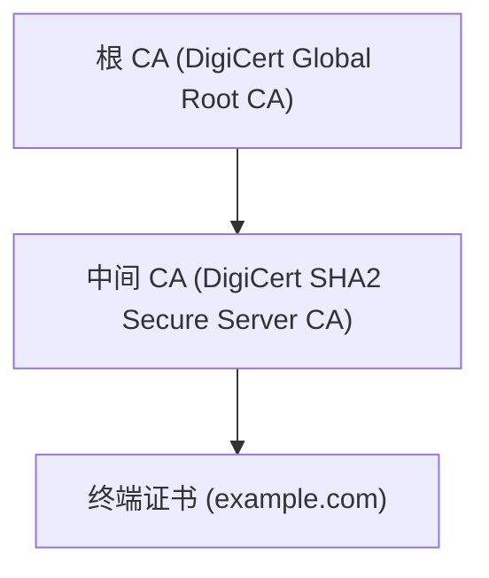
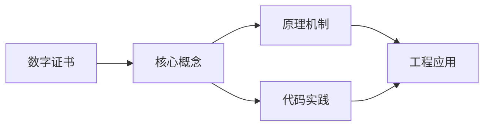

## 1. 学习目标（Bloom 分类）

本节按照布鲁姆教育目标分类学组织学习路径。本文主题为《数字证书》，属于 网络安全 模块，读者可以根据自身阶段选择阅读深度。

记忆层面：能够准确复述本文的核心概念、术语与基本语法或操作步骤，并能够在提问或检索时快速定位对应知识点。能够说出 网络安全 的核心概念、组件与标准流程。

理解层面：能够用自己的语言解释核心原理与工作机制，说明概念之间的因果关系，而不是机械记忆结论。能够解释 网络安全 的工作原理与关键机制。

应用层面：能够在真实项目或练习场景中运用本文知识解决具体问题，写出正确且可维护的实现。能够执行 网络安全 相关的标准操作与配置。

分析层面：能够拆解复杂问题，比较本文主题与相邻概念的异同，识别边界条件与例外情况。能够分析 网络安全 方案在可靠性、成本与性能上的权衡。

评价层面：能够根据约束条件（性能、可读性、安全、成本）评价不同方案的优劣，做出有依据的技术决策。能够评价 网络安全 中的技术选型。

创造层面：能够把本文知识与其他模块知识组合，设计出新的解决方案或可复用的工程模式。能够设计基于 网络安全 的完整解决方案。

通过本节学习，读者应当能够把《数字证书》纳入自己的知识网络，并与 网络安全 模块的其他主题（加密、认证、Web 安全、渗透测试、应急响应）建立关联。

## 2. 历史动机与发展脉络

《数字证书》是 网络安全 领域的重要主题。要真正理解它，需要先了解它解决的问题与演进过程。

网络安全伴随计算机发展而来：1970 年代漏洞概念出现，1988 年 Morris 蠕虫推动 CERT 成立；现代安全已从“边界防御”转向“零信任”。
核心框架：CIA 三元组（机密性、完整性、可用性）；STRIDE 威胁建模；OWASP Top 10 是 Web 安全事实清单。
现代主题：零信任架构、供应链安全（SBOM）、云安全、DevSecOps、AI 安全；合规（等保、GDPR）驱动企业实践。

回到本文主题：数字证书 的提出与成熟，正是上述技术背景下的必然产物。早期实现往往以简单可用为目标，随着工程规模扩大，社区逐渐沉淀出标准做法与最佳实践；理解这一脉络，可以帮助读者判断“为什么文档中的推荐写法是现在这个样子”，也能在遇到历史遗留代码时准确识别其设计年代与取舍。


## 3. 形式化定义与核心概念精讲

本节把《数字证书》涉及的核心概念以“定义 + 讲解”的形式展开。读者应把定义当作工具，把讲解当作理解路径；两者结合才能形成可迁移的知识。

密码学基础：对称加密（AES）、非对称（RSA/ECC）、哈希（SHA-2/3）、HMAC；密码学是加密、签名与认证的地基。
认证与授权：口令哈希（bcrypt/argon2）、MFA、Session/JWT、OAuth 2.0/OIDC、RBAC/ABAC。
Web 攻击面：注入（SQL/XSS）、CSRF、SSRF、文件上传、反序列化；防御（输入校验、输出编码、CSP、SameSite）。

### 3.1 原文章节逐一精讲

原文档把主题拆分为 17 个小节，下面按顺序给出每一节的导读讲解，随后保留原文细节供精读。

#### 原文精读（完整保留）

# Cybersecurity 证书验证与调试

> **符号约定**：`< >` 必填参数 | `[ ]` 可选参数

---

#### 1. 数字证书基础

##### 1.1 什么是数字证书

数字证书是电子文档，用于证明公钥的所有权。由受信任的证书颁发机构（CA）签名。

##### 1.2 核心组成

```
证书 = 公钥 + 身份信息 + 有效期 + CA 签名
```

##### 1.3 信任模型

```
根 CA → 中间 CA → 终端证书
  ↑
信任锚
```

#### 2. X.509 标准

##### 2.1 证书结构

```
Certificate ::= SEQUENCE {
    tbsCertificate       TBSCertificate,
    signatureAlgorithm   AlgorithmIdentifier,
    signatureValue       BIT STRING
}

TBSCertificate ::= SEQUENCE {
    version              [0] EXPLICIT INTEGER DEFAULT v1,
    serialNumber         CertificateSerialNumber,
    signature            AlgorithmIdentifier,
    issuer               Name,
    validity             Validity,
    subject              Name,
    subjectPublicKeyInfo SubjectPublicKeyInfo,
    issuerUniqueID       [1] IMPLICIT UniqueIdentifier OPTIONAL,
    subjectUniqueID      [2] IMPLICIT UniqueIdentifier OPTIONAL,
    extensions           [3] EXPLICIT Extensions OPTIONAL
}
```

##### 2.2 关键字段

| 字段          | 描述                |
| ------------- | ------------------- |
| Version       | v1(0)、v2(1)、v3(2) |
| Serial Number | CA 分配的唯一序列号 |
| Issuer        | 颁发者 DN           |
| Validity      | 起止时间            |
| Subject       | 主体 DN             |
| Public Key    | 公钥及算法          |
| Extensions    | 扩展信息            |

##### 2.3 重要扩展

| 扩展                           | 描述              | 关键性 |
| ------------------------------ | ----------------- | ------ |
| Subject Alternative Name (SAN) | 证书覆盖的域名/IP | 关键   |
| Basic Constraints              | CA 标志和路径深度 | 关键   |
| Key Usage                      | 密钥用途          | 关键   |
| Extended Key Usage             | 扩展密钥用途      | 非关键 |
| Authority Key Identifier       | 颁发者密钥标识    | 非关键 |
| Subject Key Identifier         | 主体密钥标识      | 非关键 |
| CRL Distribution Points        | CRL 分发点        | 非关键 |
| Authority Information Access   | OCSP 地址         | 非关键 |

##### 2.4 证书编码

| 格式    | 扩展名     | 描述                   |
| ------- | ---------- | ---------------------- |
| DER     | .der, .cer | 二进制编码             |
| PEM     | .pem, .crt | Base64 编码 + 头尾标记 |
| PKCS#7  | .p7b       | 证书链容器             |
| PKCS#12 | .p12, .pfx | 含私钥的容器           |

#### 3. PKI 体系

##### 3.1 PKI 组件

| 组件               | 功能           |
| ------------------ | -------------- |
| CA（证书颁发机构） | 签发和管理证书 |
| RA（注册机构）     | 身份验证       |
| 证书库             | 存储已颁发证书 |
| CRL/OCSP           | 证书状态查询   |
| 终端实体           | 证书使用者     |

##### 3.2 证书生命周期

```
申请 → 验证 → 签发 → 部署 → 使用 → 续期/吊销 → 过期
```

##### 3.3 证书类型

| 类型           | 验证级别         | 适用场景  |
| -------------- | ---------------- | --------- |
| DV（域名验证） | 仅验证域名控制权 | 个人网站  |
| OV（组织验证） | 验证组织身份     | 企业网站  |
| EV（扩展验证） | 严格身份验证     | 金融/电商 |

#### 4. 证书链验证

##### 4.1 验证流程

```
1. 检查证书签名是否由上级 CA 签发
2. 逐级验证直到根 CA
3. 检查每个证书的有效期
4. 检查证书是否被吊销（CRL/OCSP）
5. 检查 Key Usage 和 Extended Key Usage
6. 检查 SAN 是否匹配目标域名
```

##### 4.2 证书链示例



##### 4.3 交叉签名

当根 CA 更换密钥时，使用新旧密钥同时签名中间 CA，确保过渡期兼容性。

#### 5. 证书吊销

##### 5.1 CRL（证书吊销列表）

```xml
<!-- CRL 结构 -->
CertificateList ::= SEQUENCE {
    tbsCertList          TBSCertList,
    signatureAlgorithm   AlgorithmIdentifier,
    signatureValue       BIT STRING
}
```

**缺点**：

- 需要定期下载完整列表
- 延迟高
- 列表可能很大

##### 5.2 OCSP（在线证书状态协议）

```http
GET /ocsp?serial=123456 HTTP/1.1
Host: ocsp.example-ca.com
```

**响应**：

| 状态    | 含义       |
| ------- | ---------- |
| good    | 证书有效   |
| revoked | 证书已吊销 |
| unknown | 未知       |

##### 5.3 OCSP Stapling

服务器主动获取并缓存 OCSP 响应，在 TLS 握手时发送给客户端。

**优势**：

- 减少客户端到 OCSP 服务器的请求
- 提高隐私性
- 减少延迟

#### 6. 证书管理实践

##### 6.1 OpenSSL 常用命令

```bash
# 生成私钥
openssl genrsa -out private.key 2048

# 生成 CSR
openssl req -new -key private.key -out request.csr

# 自签名证书
openssl req -x509 -key private.key -out cert.pem -days 365

# 查看证书信息
openssl x509 -in cert.pem -text -noout

# 验证证书链
openssl verify -CAfile ca.pem cert.pem

# 转换格式
openssl x509 -in cert.der -inform DER -out cert.pem -outform PEM
```

##### 6.2 Let's Encrypt 自动化

```bash
# 使用 certbot 获取证书
certbot certonly --webroot -w /var/www/html -d example.com

# 自动续期
certbot renew --quiet
```

##### 6.3 证书固定（Certificate Pinning）

```http
Public-Key-Pins: pin-sha256="base64=="; max-age=5184000
```

> 注意：HTTP Public Key Pinning (HPKP) 已被 Chrome 废弃，推荐使用 Certificate Transparency。

##### 6.4 证书透明度（CT）

所有公开可信证书必须记录在 CT 日志中，可被公开审计。

```http
Expect-CT: enforce, max-age=86400, report-uri="https://example.com/ct-report"
```
#### SSL/TLS 连接测试

**基本写法：测试 HTTPS 连接**
`openssl s_client -connect <主机>:<端口>`
```bash
# 测试 HTTPS 连接
openssl s_client -connect example.com:443
```

**基本写法：指定 SNI**
`openssl s_client -connect <主机>:<端口> -servername <域名>`
```bash
# 指定 SNI 测试虚拟主机
openssl s_client -connect example.com:443 -servername example.com
```

**基本写法：查看证书链**
`openssl s_client -showcerts -connect <主机>:<端口>`
```bash
# 查看完整证书链
openssl s_client -showcerts -connect example.com:443
```

**基本写法：静默模式测试**
`echo | openssl s_client -connect <主机>:443 2>/dev/null`
```bash
# 静默测试不阻塞
echo | openssl s_client -connect example.com:443 2>/dev/null
```

**基本写法：测试 SMTP TLS**
`openssl s_client -starttls smtp -connect <主机>:<端口>`
```bash
# 测试 SMTP 服务的 STARTTLS
openssl s_client -starttls smtp -connect smtp.example.com:587
```

---

#### TLS 版本测试

**基本写法：测试 TLS 1.2**
`openssl s_client -tls1_2 -connect <主机>:<端口>`
```bash
# 测试服务器是否支持 TLS 1.2
openssl s_client -tls1_2 -connect example.com:443
```

**基本写法：测试 TLS 1.3**
`openssl s_client -tls1_3 -connect <主机>:<端口>`
```bash
# 测试服务器是否支持 TLS 1.3
openssl s_client -tls1_3 -connect example.com:443
```

**基本写法：禁用旧版本**
`openssl s_client -no_ssl3 -no_tls1 -no_tls1_1 -connect <主机>:<端口>`
```bash
# 禁用 SSL3、TLS1.0、TLS1.1
openssl s_client -no_ssl3 -no_tls1 -no_tls1_1 -connect example.com:443
```

**基本写法：查看协商的 TLS 版本**
`openssl s_client -connect <主机>:443 </dev/null 2>&1 | grep Protocol`
```bash
# 查看实际协商的 TLS 版本
openssl s_client -connect example.com:443 </dev/null 2>&1 | grep Protocol
```

---

#### 密码套件测试

**基本写法：查看支持的密码套件**
`openssl ciphers -v`
```bash
# 列出所有支持的密码套件
openssl ciphers -v
```

**基本写法：测试特定密码套件**
`openssl s_client -cipher <密码套件> -connect <主机>:<端口>`
```bash
# 测试服务器是否支持特定密码套件
openssl s_client -cipher 'ECDHE-RSA-AES256-GCM-SHA384' -connect example.com:443
```

**基本写法：只使用强密码套件**
`openssl s_client -cipher 'HIGH:!aNULL:!MD5' -connect <主机>:<端口>`
```bash
# 只使用高强度密码套件
openssl s_client -cipher 'HIGH:!aNULL:!MD5:!RC4' -connect example.com:443
```

**基本写法：查看协商的密码套件**
`openssl s_client -connect <主机>:443 </dev/null 2>&1 | grep Cipher`
```bash
# 查看实际协商的密码套件
openssl s_client -connect example.com:443 </dev/null 2>&1 | grep Cipher
```

---

#### 证书验证

**基本写法：验证证书链**
`openssl verify -CAfile <CA证书> <证书>`
```bash
# 验证证书是否有效
openssl verify -CAfile ca.crt server.crt
```

**基本写法：验证证书链含中间证书**
`openssl verify -CAfile <CA证书> -untrusted <中间证书> <证书>`
```bash
# 使用中间证书验证
openssl verify -CAfile root.crt -untrusted intermediate.crt server.crt
```

**基本写法：使用系统 CA 验证**
`openssl verify <证书>`
```bash
# 使用系统信任的 CA 验证证书
openssl verify server.crt
```

**基本写法：在线验证证书**
`openssl s_client -connect <主机>:443 -verify_return_error`
```bash
# 连接时验证证书有效性
openssl s_client -connect example.com:443 -verify_return_error
```

---

#### 证书信息提取

**基本写法：查看证书过期时间**
`openssl x509 -enddate -noout -in <证书>`
```bash
# 查看证书过期日期
openssl x509 -enddate -noout -in cert.pem
```

**基本写法：从远程服务器获取过期时间**
`echo | openssl s_client -connect <主机>:443 2>/dev/null | openssl x509 -noout -enddate`
```bash
# 查看远程服务器证书过期时间
echo | openssl s_client -connect example.com:443 2>/dev/null | openssl x509 -noout -enddate
```

**基本写法：查看证书主题**
`openssl x509 -subject -noout -in <证书>`
```bash
# 查看证书主题
openssl x509 -subject -noout -in cert.pem
```

**基本写法：查看证书颁发者**
`openssl x509 -issuer -noout -in <证书>`
```bash
# 查看证书颁发者
openssl x509 -issuer -noout -in cert.pem
```

**基本写法：查看证书 SAN**
`openssl x509 -text -noout -in <证书> | grep -A1 "Subject Alternative Name"`
```bash
# 查看证书的 Subject Alternative Names
openssl x509 -text -noout -in cert.pem | grep -A1 "Subject Alternative Name"
```

---

#### 证书匹配验证

**基本写法：验证证书和私钥匹配**
`openssl x509 -noout -modulus -in <证书> | openssl md5; openssl rsa -noout -modulus -in <私钥> | openssl md5`
```bash
# 对比证书和私钥的 modulus 是否一致
openssl x509 -noout -modulus -in cert.pem | openssl md5
openssl rsa -noout -modulus -in private.key | openssl md5
```

**基本写法：验证 CSR 和私钥匹配**
`openssl req -noout -modulus -in <CSR> | openssl md5; openssl rsa -noout -modulus -in <私钥> | openssl md5`
```bash
# 对比 CSR 和私钥的 modulus
openssl req -noout -modulus -in request.csr | openssl md5
openssl rsa -noout -modulus -in private.key | openssl md5
```

**基本写法：一键验证匹配**
`[ "$(openssl x509 -noout -modulus -in cert.pem | openssl md5)" = "$(openssl rsa -noout -modulus -in private.key | openssl md5)" ] && echo "匹配" || echo "不匹配"`
```bash
# 一键检查证书和私钥是否匹配
[ "$(openssl x509 -noout -modulus -in cert.pem | openssl md5)" = "$(openssl rsa -noout -modulus -in private.key | openssl md5)" ] && echo "匹配" || echo "不匹配"
```

---

#### 证书下载与导出

**基本写法：下载服务器证书**
`echo | openssl s_client -connect <主机>:443 2>/dev/null | openssl x509 -out <文件>`
```bash
# 下载远程服务器证书
echo | openssl s_client -connect example.com:443 2>/dev/null | openssl x509 -out cert.pem
```

**基本写法：下载完整证书链**
`openssl s_client -showcerts -connect <主机>:443 </dev/null 2>/dev/null | openssl x509 -out <文件>`
```bash
# 下载完整证书链
openssl s_client -showcerts -connect example.com:443 </dev/null 2>/dev/null | awk '/-----BEGIN/,/-----END/{print}' > chain.pem
```

**基本写法：从 PFX 导出证书和私钥**
`openssl pkcs12 -in <PFX> -clcerts -nokeys -out <证书>; openssl pkcs12 -in <PFX> -nocerts -nodes -out <私钥>`
```bash
# 从 PFX 文件分别导出证书和私钥
openssl pkcs12 -in cert.pfx -clcerts -nokeys -out cert.pem
openssl pkcs12 -in cert.pfx -nocerts -nodes -out private.key
```

---

#### 证书过期监控

**基本写法：检查证书剩余天数**
`openssl x509 -enddate -noout -in <证书> | cut -d= -f2`
```bash
# 查看证书过期日期
openssl x509 -enddate -noout -in cert.pem | cut -d= -f2
```

**基本写法：计算剩余天数**
```bash
`expiry=$(echo | openssl s_client -connect <主机>:443 2>/dev/null | openssl x509 -noout -enddate | cut -d= -f2)
days=$(( ( $(date -d "$expiry" +%s) - $(date +%s) ) / 86400 ))
echo "剩余 $days 天"`
```
```bash
# 计算远程证书剩余有效天数
expiry=$(echo | openssl s_client -connect example.com:443 2>/dev/null | openssl x509 -noout -enddate | cut -d= -f2)
days=$(( ( $(date -d "$expiry" +%s) - $(date +%s) ) / 86400 ))
echo "证书剩余 $days 天"
```

**基本写法：批量检查证书过期**
`for f in *.pem; do echo "$f: $(openssl x509 -enddate -noout -in $f | cut -d= -f2)"; done`
```bash
# 批量检查所有证书的过期时间
for f in *.pem; do echo "$f: $(openssl x509 -enddate -noout -in $f | cut -d= -f2)"; done
```

---

#### 证书调试

**基本写法：查看证书完整信息**
`openssl x509 -text -noout -in <证书>`
```bash
# 查看证书完整详细信息
openssl x509 -text -noout -in cert.pem
```

**基本写法：查看证书序列号**
`openssl x509 -serial -noout -in <证书>`
```bash
# 查看证书序列号
openssl x509 -serial -noout -in cert.pem
```

**基本写法：查看证书指纹**
`openssl x509 -fingerprint -sha256 -noout -in <证书>`
```bash
# 查看 SHA256 指纹
openssl x509 -fingerprint -sha256 -noout -in cert.pem
```

**基本写法：查看公钥信息**
`openssl x509 -pubkey -noout -in <证书> | openssl rsa -pubin -text -noout`
```bash
# 查看证书中的公钥信息
openssl x509 -pubkey -noout -in cert.pem | openssl rsa -pubin -text -noout
```

---

#### nmap SSL 扫描

**基本写法：枚举 SSL 密码套件**
`nmap --script ssl-enum-ciphers -p 443 <主机>`
```bash
# 使用 nmap 枚举 SSL 支持的密码套件
nmap --script ssl-enum-ciphers -p 443 example.com
```

**基本写法：检测 SSL 漏洞**
`nmap --script ssl-* -p 443 <主机>`
```bash
# 运行所有 SSL 相关脚本
nmap --script ssl-* -p 443 example.com
```

**基本写法：获取 SSL 证书**
`nmap --script ssl-cert -p 443 <主机>`
```bash
# 使用 nmap 获取 SSL 证书信息
nmap --script ssl-cert -p 443 example.com
```

---

#### 证书吊销检查

**基本写法：检查 OCSP 状态**
`openssl ocsp -issuer <CA证书> -cert <证书> -url <OCSP URL> -no_nonce`
```bash
# 检查证书的 OCSP 吊销状态
openssl ocsp -issuer ca.crt -cert server.crt -url http://ocsp.example.com -no_nonce
```

**基本写法：从证书提取 OCSP URL**
`openssl x509 -text -noout -in <证书> | grep "OCSP"`
```bash
# 提取证书中的 OCSP URL
openssl x509 -text -noout -in cert.pem | grep "OCSP - URI"
```

**基本写法：检查 CRL**
`openssl crl -text -noout -in <CRL文件>`
```bash
# 查看证书吊销列表内容
openssl crl -text -noout -in crl.pem
```


### 3.2 概念关系图

下面用 Mermaid 图表达本文核心概念之间的关系，帮助读者建立整体图景：



图中展示的是本文知识的结构化关系：核心概念是入口，原理机制解释“为什么”，代码实践演示“怎么做”，工程应用回答“何时用”。读者学习时可以把每个小节的内容挂接到对应节点上。

## 4. 理论推导与原理解析

本节深入《数字证书》背后的原理。理论部分不求面面俱到，而是聚焦“能解释现象、能指导实践”的关键推导。

密码学基础：对称加密（AES）、非对称（RSA/ECC）、哈希（SHA-2/3）、HMAC；密码学是加密、签名与认证的地基。
认证与授权：口令哈希（bcrypt/argon2）、MFA、Session/JWT、OAuth 2.0/OIDC、RBAC/ABAC。
Web 攻击面：注入（SQL/XSS）、CSRF、SSRF、文件上传、反序列化；防御（输入校验、输出编码、CSP、SameSite）。
渗透测试流程：信息收集 -> 漏洞扫描 -> 利用 -> 提权 -> 横向 -> 报告；工具（Nmap、Burp、Metasploit）。

需要强调的是，理论推导与工程实践之间存在翻译层：理论给出的是理想化模型与边界条件，工程代码则必须处理真实环境中的例外。读者在学习时应先掌握理论的“标准情形”，再通过陷阱章节了解“非标准情形”。

## 5. 代码示例与逐行讲解

本节把原文中的代码示例系统整理，并为每个示例补充用途说明与讲解。读者不应只浏览代码，而应逐段对照讲解理解设计意图。

### 5.1 示例：1.2 核心组成

该示例来自原文《1.2 核心组成》小节，用于演示数字证书相关操作。阅读时请先看代码结构，再看其后的讲解。

```text
证书 = 公钥 + 身份信息 + 有效期 + CA 签名
```

讲解：这段代码演示了本节核心知识点。代码中的关键操作可以归纳为三步：准备（定义或初始化）、执行（核心逻辑）、收尾（释放资源或返回结果）。实际项目中，这三步往往被封装为函数或类，以提升复用性与可测试性。

关键点分析：

该示例共 1 行有效代码，结构以数据或配置为主。阅读时应关注：数据字段的含义、配置项的作用，以及它们与运行行为的对应关系。

进阶思考路径：先尝试修改参数观察行为变化，再把示例中的模式迁移到自己的项目中；每次修改都记录预期与实测差异，这是把示例转化为能力的最快方式。

### 5.2 示例：1.3 信任模型

该示例来自原文《1.3 信任模型》小节，用于演示数字证书相关操作。阅读时请先看代码结构，再看其后的讲解。

```text
根 CA → 中间 CA → 终端证书
  ↑
信任锚
```

讲解：这段代码演示了本节核心知识点。代码中的关键操作可以归纳为三步：准备（定义或初始化）、执行（核心逻辑）、收尾（释放资源或返回结果）。实际项目中，这三步往往被封装为函数或类，以提升复用性与可测试性。

关键点分析：

该示例共 3 行有效代码，结构以数据或配置为主。阅读时应关注：数据字段的含义、配置项的作用，以及它们与运行行为的对应关系。

进阶思考路径：先尝试修改参数观察行为变化，再把示例中的模式迁移到自己的项目中；每次修改都记录预期与实测差异，这是把示例转化为能力的最快方式。

### 5.3 示例：2.1 证书结构

该示例来自原文《2.1 证书结构》小节，用于演示数字证书相关操作。阅读时请先看代码结构，再看其后的讲解。

```text
Certificate ::= SEQUENCE {
    tbsCertificate       TBSCertificate,
    signatureAlgorithm   AlgorithmIdentifier,
    signatureValue       BIT STRING
}

TBSCertificate ::= SEQUENCE {
    version              [0] EXPLICIT INTEGER DEFAULT v1,
    serialNumber         CertificateSerialNumber,
    signature            AlgorithmIdentifier,
    issuer               Name,
    validity             Validity,
    subject              Name,
    subjectPublicKeyInfo SubjectPublicKeyInfo,
    issuerUniqueID       [1] IMPLICIT UniqueIdentifier OPTIONAL,
    subjectUniqueID      [2] IMPLICIT UniqueIdentifier OPTIONAL,
    extensions           [3] EXPLICIT Extensions OPTIONAL
}
```

讲解：这段代码演示了本节核心知识点。代码中的关键操作可以归纳为三步：准备（定义或初始化）、执行（核心逻辑）、收尾（释放资源或返回结果）。实际项目中，这三步往往被封装为函数或类，以提升复用性与可测试性。

关键点分析：

该示例共 17 行有效代码，结构以数据或配置为主。阅读时应关注：数据字段的含义、配置项的作用，以及它们与运行行为的对应关系。

进阶思考路径：先尝试修改参数观察行为变化，再把示例中的模式迁移到自己的项目中；每次修改都记录预期与实测差异，这是把示例转化为能力的最快方式。

### 5.4 示例：3.2 证书生命周期

该示例来自原文《3.2 证书生命周期》小节，用于演示数字证书相关操作。阅读时请先看代码结构，再看其后的讲解。

```text
申请 → 验证 → 签发 → 部署 → 使用 → 续期/吊销 → 过期
```

讲解：这段代码演示了本节核心知识点。代码中的关键操作可以归纳为三步：准备（定义或初始化）、执行（核心逻辑）、收尾（释放资源或返回结果）。实际项目中，这三步往往被封装为函数或类，以提升复用性与可测试性。

关键点分析：

该示例共 1 行有效代码，结构以数据或配置为主。阅读时应关注：数据字段的含义、配置项的作用，以及它们与运行行为的对应关系。

进阶思考路径：先尝试修改参数观察行为变化，再把示例中的模式迁移到自己的项目中；每次修改都记录预期与实测差异，这是把示例转化为能力的最快方式。

### 5.5 示例：4.1 验证流程

该示例来自原文《4.1 验证流程》小节，用于演示数字证书相关操作。阅读时请先看代码结构，再看其后的讲解。

```text
1. 检查证书签名是否由上级 CA 签发
2. 逐级验证直到根 CA
3. 检查每个证书的有效期
4. 检查证书是否被吊销（CRL/OCSP）
5. 检查 Key Usage 和 Extended Key Usage
6. 检查 SAN 是否匹配目标域名
```

讲解：这段代码演示了本节核心知识点。代码中的关键操作可以归纳为三步：准备（定义或初始化）、执行（核心逻辑）、收尾（释放资源或返回结果）。实际项目中，这三步往往被封装为函数或类，以提升复用性与可测试性。

关键点分析：

该示例共 6 行有效代码，结构以数据或配置为主。阅读时应关注：数据字段的含义、配置项的作用，以及它们与运行行为的对应关系。

进阶思考路径：先尝试修改参数观察行为变化，再把示例中的模式迁移到自己的项目中；每次修改都记录预期与实测差异，这是把示例转化为能力的最快方式。

### 5.6 示例：4.2 证书链示例

该示例来自原文《4.2 证书链示例》小节，用于演示数字证书相关操作。阅读时请先看代码结构，再看其后的讲解。


讲解：这段代码演示了本节核心知识点。代码中的关键操作可以归纳为三步：准备（定义或初始化）、执行（核心逻辑）、收尾（释放资源或返回结果）。实际项目中，这三步往往被封装为函数或类，以提升复用性与可测试性。

关键点分析：

该示例共 6 行有效代码，结构以数据或配置为主。阅读时应关注：数据字段的含义、配置项的作用，以及它们与运行行为的对应关系。

进阶思考路径：先尝试修改参数观察行为变化，再把示例中的模式迁移到自己的项目中；每次修改都记录预期与实测差异，这是把示例转化为能力的最快方式。

### 5.7 示例：5.1 CRL（证书吊销列表）

该示例来自原文《5.1 CRL（证书吊销列表）》小节，用于演示数字证书相关操作。阅读时请先看代码结构，再看其后的讲解。

```xml
<!-- CRL 结构 -->
CertificateList ::= SEQUENCE {
    tbsCertList          TBSCertList,
    signatureAlgorithm   AlgorithmIdentifier,
    signatureValue       BIT STRING
}
```

讲解：这段代码演示了本节核心知识点。代码中的关键操作可以归纳为三步：准备（定义或初始化）、执行（核心逻辑）、收尾（释放资源或返回结果）。实际项目中，这三步往往被封装为函数或类，以提升复用性与可测试性。

关键点分析：

该示例共 6 行有效代码，结构以数据或配置为主。阅读时应关注：数据字段的含义、配置项的作用，以及它们与运行行为的对应关系。

进阶思考路径：先尝试修改参数观察行为变化，再把示例中的模式迁移到自己的项目中；每次修改都记录预期与实测差异，这是把示例转化为能力的最快方式。

### 5.8 示例：5.2 OCSP（在线证书状态协议）

该示例来自原文《5.2 OCSP（在线证书状态协议）》小节，用于演示数字证书相关操作。阅读时请先看代码结构，再看其后的讲解。

```http
GET /ocsp?serial=123456 HTTP/1.1
Host: ocsp.example-ca.com
```

讲解：这段代码演示了本节核心知识点。代码中的关键操作可以归纳为三步：准备（定义或初始化）、执行（核心逻辑）、收尾（释放资源或返回结果）。实际项目中，这三步往往被封装为函数或类，以提升复用性与可测试性。

关键点分析：

该示例共 2 行有效代码，结构以数据或配置为主。阅读时应关注：数据字段的含义、配置项的作用，以及它们与运行行为的对应关系。

进阶思考路径：先尝试修改参数观察行为变化，再把示例中的模式迁移到自己的项目中；每次修改都记录预期与实测差异，这是把示例转化为能力的最快方式。

### 5.9 示例：6.1 OpenSSL 常用命令

该示例来自原文《6.1 OpenSSL 常用命令》小节，用于演示数字证书相关操作。阅读时请先看代码结构，再看其后的讲解。

```bash
# 生成私钥
openssl genrsa -out private.key 2048

# 生成 CSR
openssl req -new -key private.key -out request.csr

# 自签名证书
openssl req -x509 -key private.key -out cert.pem -days 365

# 查看证书信息
openssl x509 -in cert.pem -text -noout

# 验证证书链
openssl verify -CAfile ca.pem cert.pem

# 转换格式
openssl x509 -in cert.der -inform DER -out cert.pem -outform PEM
```

讲解：这段代码演示了本节核心知识点。代码中的关键操作可以归纳为三步：准备（定义或初始化）、执行（核心逻辑）、收尾（释放资源或返回结果）。实际项目中，这三步往往被封装为函数或类，以提升复用性与可测试性。

关键点分析：

该示例共 12 行有效代码，结构以数据或配置为主。阅读时应关注：数据字段的含义、配置项的作用，以及它们与运行行为的对应关系。

进阶思考路径：先尝试修改参数观察行为变化，再把示例中的模式迁移到自己的项目中；每次修改都记录预期与实测差异，这是把示例转化为能力的最快方式。

### 5.10 示例：6.2 Let's Encrypt 自动化

该示例来自原文《6.2 Let's Encrypt 自动化》小节，用于演示数字证书相关操作。阅读时请先看代码结构，再看其后的讲解。

```bash
# 使用 certbot 获取证书
certbot certonly --webroot -w /var/www/html -d example.com

# 自动续期
certbot renew --quiet
```

讲解：这段代码演示了本节核心知识点。代码中的关键操作可以归纳为三步：准备（定义或初始化）、执行（核心逻辑）、收尾（释放资源或返回结果）。实际项目中，这三步往往被封装为函数或类，以提升复用性与可测试性。

关键点分析：

该示例共 4 行有效代码，结构以数据或配置为主。阅读时应关注：数据字段的含义、配置项的作用，以及它们与运行行为的对应关系。

进阶思考路径：先尝试修改参数观察行为变化，再把示例中的模式迁移到自己的项目中；每次修改都记录预期与实测差异，这是把示例转化为能力的最快方式。

### 5.11 示例：6.3 证书固定（Certificate Pinning）

该示例来自原文《6.3 证书固定（Certificate Pinning）》小节，用于演示数字证书相关操作。阅读时请先看代码结构，再看其后的讲解。

```http
Public-Key-Pins: pin-sha256="base64=="; max-age=5184000
```

讲解：这段代码演示了本节核心知识点。代码中的关键操作可以归纳为三步：准备（定义或初始化）、执行（核心逻辑）、收尾（释放资源或返回结果）。实际项目中，这三步往往被封装为函数或类，以提升复用性与可测试性。

关键点分析：

该示例共 1 行有效代码，结构以数据或配置为主。阅读时应关注：数据字段的含义、配置项的作用，以及它们与运行行为的对应关系。

进阶思考路径：先尝试修改参数观察行为变化，再把示例中的模式迁移到自己的项目中；每次修改都记录预期与实测差异，这是把示例转化为能力的最快方式。

### 5.12 示例：6.4 证书透明度（CT）

该示例来自原文《6.4 证书透明度（CT）》小节，用于演示数字证书相关操作。阅读时请先看代码结构，再看其后的讲解。

```http
Expect-CT: enforce, max-age=86400, report-uri="https://example.com/ct-report"
```

讲解：这段代码演示了本节核心知识点。代码中的关键操作可以归纳为三步：准备（定义或初始化）、执行（核心逻辑）、收尾（释放资源或返回结果）。实际项目中，这三步往往被封装为函数或类，以提升复用性与可测试性。

关键点分析：

该示例共 1 行有效代码，结构以数据或配置为主。阅读时应关注：数据字段的含义、配置项的作用，以及它们与运行行为的对应关系。

进阶思考路径：先尝试修改参数观察行为变化，再把示例中的模式迁移到自己的项目中；每次修改都记录预期与实测差异，这是把示例转化为能力的最快方式。

### 5.13 示例：SSL/TLS 连接测试

该示例来自原文《SSL/TLS 连接测试》小节，用于演示数字证书相关操作。阅读时请先看代码结构，再看其后的讲解。

```bash
# 测试 HTTPS 连接
openssl s_client -connect example.com:443
```

讲解：这段代码演示了本节核心知识点。代码中的关键操作可以归纳为三步：准备（定义或初始化）、执行（核心逻辑）、收尾（释放资源或返回结果）。实际项目中，这三步往往被封装为函数或类，以提升复用性与可测试性。

关键点分析：

该示例共 2 行有效代码，结构以数据或配置为主。阅读时应关注：数据字段的含义、配置项的作用，以及它们与运行行为的对应关系。

进阶思考路径：先尝试修改参数观察行为变化，再把示例中的模式迁移到自己的项目中；每次修改都记录预期与实测差异，这是把示例转化为能力的最快方式。

### 5.14 示例：SSL/TLS 连接测试

该示例来自原文《SSL/TLS 连接测试》小节，用于演示数字证书相关操作。阅读时请先看代码结构，再看其后的讲解。

```bash
# 指定 SNI 测试虚拟主机
openssl s_client -connect example.com:443 -servername example.com
```

讲解：这段代码演示了本节核心知识点。代码中的关键操作可以归纳为三步：准备（定义或初始化）、执行（核心逻辑）、收尾（释放资源或返回结果）。实际项目中，这三步往往被封装为函数或类，以提升复用性与可测试性。

关键点分析：

该示例共 2 行有效代码，结构以数据或配置为主。阅读时应关注：数据字段的含义、配置项的作用，以及它们与运行行为的对应关系。

进阶思考路径：先尝试修改参数观察行为变化，再把示例中的模式迁移到自己的项目中；每次修改都记录预期与实测差异，这是把示例转化为能力的最快方式。

### 5.15 示例：SSL/TLS 连接测试

该示例来自原文《SSL/TLS 连接测试》小节，用于演示数字证书相关操作。阅读时请先看代码结构，再看其后的讲解。

```bash
# 查看完整证书链
openssl s_client -showcerts -connect example.com:443
```

讲解：这段代码演示了本节核心知识点。代码中的关键操作可以归纳为三步：准备（定义或初始化）、执行（核心逻辑）、收尾（释放资源或返回结果）。实际项目中，这三步往往被封装为函数或类，以提升复用性与可测试性。

关键点分析：

该示例共 2 行有效代码，结构以数据或配置为主。阅读时应关注：数据字段的含义、配置项的作用，以及它们与运行行为的对应关系。

进阶思考路径：先尝试修改参数观察行为变化，再把示例中的模式迁移到自己的项目中；每次修改都记录预期与实测差异，这是把示例转化为能力的最快方式。

### 5.16 示例：SSL/TLS 连接测试

该示例来自原文《SSL/TLS 连接测试》小节，用于演示数字证书相关操作。阅读时请先看代码结构，再看其后的讲解。

```bash
# 静默测试不阻塞
echo | openssl s_client -connect example.com:443 2>/dev/null
```

讲解：这段代码演示了本节核心知识点。代码中的关键操作可以归纳为三步：准备（定义或初始化）、执行（核心逻辑）、收尾（释放资源或返回结果）。实际项目中，这三步往往被封装为函数或类，以提升复用性与可测试性。

关键点分析：

该示例共 2 行有效代码，结构以数据或配置为主。阅读时应关注：数据字段的含义、配置项的作用，以及它们与运行行为的对应关系。

进阶思考路径：先尝试修改参数观察行为变化，再把示例中的模式迁移到自己的项目中；每次修改都记录预期与实测差异，这是把示例转化为能力的最快方式。

### 5.17 示例：SSL/TLS 连接测试

该示例来自原文《SSL/TLS 连接测试》小节，用于演示数字证书相关操作。阅读时请先看代码结构，再看其后的讲解。

```bash
# 测试 SMTP 服务的 STARTTLS
openssl s_client -starttls smtp -connect smtp.example.com:587
```

讲解：这段代码演示了本节核心知识点。代码中的关键操作可以归纳为三步：准备（定义或初始化）、执行（核心逻辑）、收尾（释放资源或返回结果）。实际项目中，这三步往往被封装为函数或类，以提升复用性与可测试性。

关键点分析：

该示例共 2 行有效代码，结构以数据或配置为主。阅读时应关注：数据字段的含义、配置项的作用，以及它们与运行行为的对应关系。

进阶思考路径：先尝试修改参数观察行为变化，再把示例中的模式迁移到自己的项目中；每次修改都记录预期与实测差异，这是把示例转化为能力的最快方式。

### 5.18 示例：TLS 版本测试

该示例来自原文《TLS 版本测试》小节，用于演示数字证书相关操作。阅读时请先看代码结构，再看其后的讲解。

```bash
# 测试服务器是否支持 TLS 1.2
openssl s_client -tls1_2 -connect example.com:443
```

讲解：这段代码演示了本节核心知识点。代码中的关键操作可以归纳为三步：准备（定义或初始化）、执行（核心逻辑）、收尾（释放资源或返回结果）。实际项目中，这三步往往被封装为函数或类，以提升复用性与可测试性。

关键点分析：

该示例共 2 行有效代码，结构以数据或配置为主。阅读时应关注：数据字段的含义、配置项的作用，以及它们与运行行为的对应关系。

进阶思考路径：先尝试修改参数观察行为变化，再把示例中的模式迁移到自己的项目中；每次修改都记录预期与实测差异，这是把示例转化为能力的最快方式。

### 5.19 示例：TLS 版本测试

该示例来自原文《TLS 版本测试》小节，用于演示数字证书相关操作。阅读时请先看代码结构，再看其后的讲解。

```bash
# 测试服务器是否支持 TLS 1.3
openssl s_client -tls1_3 -connect example.com:443
```

讲解：这段代码演示了本节核心知识点。代码中的关键操作可以归纳为三步：准备（定义或初始化）、执行（核心逻辑）、收尾（释放资源或返回结果）。实际项目中，这三步往往被封装为函数或类，以提升复用性与可测试性。

关键点分析：

该示例共 2 行有效代码，结构以数据或配置为主。阅读时应关注：数据字段的含义、配置项的作用，以及它们与运行行为的对应关系。

进阶思考路径：先尝试修改参数观察行为变化，再把示例中的模式迁移到自己的项目中；每次修改都记录预期与实测差异，这是把示例转化为能力的最快方式。

### 5.20 示例：TLS 版本测试

该示例来自原文《TLS 版本测试》小节，用于演示数字证书相关操作。阅读时请先看代码结构，再看其后的讲解。

```bash
# 禁用 SSL3、TLS1.0、TLS1.1
openssl s_client -no_ssl3 -no_tls1 -no_tls1_1 -connect example.com:443
```

讲解：这段代码演示了本节核心知识点。代码中的关键操作可以归纳为三步：准备（定义或初始化）、执行（核心逻辑）、收尾（释放资源或返回结果）。实际项目中，这三步往往被封装为函数或类，以提升复用性与可测试性。

关键点分析：

该示例共 2 行有效代码，结构以数据或配置为主。阅读时应关注：数据字段的含义、配置项的作用，以及它们与运行行为的对应关系。

进阶思考路径：先尝试修改参数观察行为变化，再把示例中的模式迁移到自己的项目中；每次修改都记录预期与实测差异，这是把示例转化为能力的最快方式。

### 5.21 示例：TLS 版本测试

该示例来自原文《TLS 版本测试》小节，用于演示数字证书相关操作。阅读时请先看代码结构，再看其后的讲解。

```bash
# 查看实际协商的 TLS 版本
openssl s_client -connect example.com:443 </dev/null 2>&1 | grep Protocol
```

讲解：这段代码演示了本节核心知识点。代码中的关键操作可以归纳为三步：准备（定义或初始化）、执行（核心逻辑）、收尾（释放资源或返回结果）。实际项目中，这三步往往被封装为函数或类，以提升复用性与可测试性。

关键点分析：

该示例共 2 行有效代码，结构以数据或配置为主。阅读时应关注：数据字段的含义、配置项的作用，以及它们与运行行为的对应关系。

进阶思考路径：先尝试修改参数观察行为变化，再把示例中的模式迁移到自己的项目中；每次修改都记录预期与实测差异，这是把示例转化为能力的最快方式。

### 5.22 示例：密码套件测试

该示例来自原文《密码套件测试》小节，用于演示数字证书相关操作。阅读时请先看代码结构，再看其后的讲解。

```bash
# 列出所有支持的密码套件
openssl ciphers -v
```

讲解：这段代码演示了本节核心知识点。代码中的关键操作可以归纳为三步：准备（定义或初始化）、执行（核心逻辑）、收尾（释放资源或返回结果）。实际项目中，这三步往往被封装为函数或类，以提升复用性与可测试性。

关键点分析：

该示例共 2 行有效代码，结构以数据或配置为主。阅读时应关注：数据字段的含义、配置项的作用，以及它们与运行行为的对应关系。

进阶思考路径：先尝试修改参数观察行为变化，再把示例中的模式迁移到自己的项目中；每次修改都记录预期与实测差异，这是把示例转化为能力的最快方式。

### 5.23 示例：密码套件测试

该示例来自原文《密码套件测试》小节，用于演示数字证书相关操作。阅读时请先看代码结构，再看其后的讲解。

```bash
# 测试服务器是否支持特定密码套件
openssl s_client -cipher 'ECDHE-RSA-AES256-GCM-SHA384' -connect example.com:443
```

讲解：这段代码演示了本节核心知识点。代码中的关键操作可以归纳为三步：准备（定义或初始化）、执行（核心逻辑）、收尾（释放资源或返回结果）。实际项目中，这三步往往被封装为函数或类，以提升复用性与可测试性。

关键点分析：

该示例共 2 行有效代码，结构以数据或配置为主。阅读时应关注：数据字段的含义、配置项的作用，以及它们与运行行为的对应关系。

进阶思考路径：先尝试修改参数观察行为变化，再把示例中的模式迁移到自己的项目中；每次修改都记录预期与实测差异，这是把示例转化为能力的最快方式。

### 5.24 示例：密码套件测试

该示例来自原文《密码套件测试》小节，用于演示数字证书相关操作。阅读时请先看代码结构，再看其后的讲解。

```bash
# 只使用高强度密码套件
openssl s_client -cipher 'HIGH:!aNULL:!MD5:!RC4' -connect example.com:443
```

讲解：这段代码演示了本节核心知识点。代码中的关键操作可以归纳为三步：准备（定义或初始化）、执行（核心逻辑）、收尾（释放资源或返回结果）。实际项目中，这三步往往被封装为函数或类，以提升复用性与可测试性。

关键点分析：

该示例共 2 行有效代码，结构以数据或配置为主。阅读时应关注：数据字段的含义、配置项的作用，以及它们与运行行为的对应关系。

进阶思考路径：先尝试修改参数观察行为变化，再把示例中的模式迁移到自己的项目中；每次修改都记录预期与实测差异，这是把示例转化为能力的最快方式。

### 5.25 示例：密码套件测试

该示例来自原文《密码套件测试》小节，用于演示数字证书相关操作。阅读时请先看代码结构，再看其后的讲解。

```bash
# 查看实际协商的密码套件
openssl s_client -connect example.com:443 </dev/null 2>&1 | grep Cipher
```

讲解：这段代码演示了本节核心知识点。代码中的关键操作可以归纳为三步：准备（定义或初始化）、执行（核心逻辑）、收尾（释放资源或返回结果）。实际项目中，这三步往往被封装为函数或类，以提升复用性与可测试性。

关键点分析：

该示例共 2 行有效代码，结构以数据或配置为主。阅读时应关注：数据字段的含义、配置项的作用，以及它们与运行行为的对应关系。

进阶思考路径：先尝试修改参数观察行为变化，再把示例中的模式迁移到自己的项目中；每次修改都记录预期与实测差异，这是把示例转化为能力的最快方式。

### 5.26 示例：证书验证

该示例来自原文《证书验证》小节，用于演示数字证书相关操作。阅读时请先看代码结构，再看其后的讲解。

```bash
# 验证证书是否有效
openssl verify -CAfile ca.crt server.crt
```

讲解：这段代码演示了本节核心知识点。代码中的关键操作可以归纳为三步：准备（定义或初始化）、执行（核心逻辑）、收尾（释放资源或返回结果）。实际项目中，这三步往往被封装为函数或类，以提升复用性与可测试性。

关键点分析：

该示例共 2 行有效代码，结构以数据或配置为主。阅读时应关注：数据字段的含义、配置项的作用，以及它们与运行行为的对应关系。

进阶思考路径：先尝试修改参数观察行为变化，再把示例中的模式迁移到自己的项目中；每次修改都记录预期与实测差异，这是把示例转化为能力的最快方式。

### 5.27 示例：证书验证

该示例来自原文《证书验证》小节，用于演示数字证书相关操作。阅读时请先看代码结构，再看其后的讲解。

```bash
# 使用中间证书验证
openssl verify -CAfile root.crt -untrusted intermediate.crt server.crt
```

讲解：这段代码演示了本节核心知识点。代码中的关键操作可以归纳为三步：准备（定义或初始化）、执行（核心逻辑）、收尾（释放资源或返回结果）。实际项目中，这三步往往被封装为函数或类，以提升复用性与可测试性。

关键点分析：

该示例共 2 行有效代码，结构以数据或配置为主。阅读时应关注：数据字段的含义、配置项的作用，以及它们与运行行为的对应关系。

进阶思考路径：先尝试修改参数观察行为变化，再把示例中的模式迁移到自己的项目中；每次修改都记录预期与实测差异，这是把示例转化为能力的最快方式。

### 5.28 示例：证书验证

该示例来自原文《证书验证》小节，用于演示数字证书相关操作。阅读时请先看代码结构，再看其后的讲解。

```bash
# 使用系统信任的 CA 验证证书
openssl verify server.crt
```

讲解：这段代码演示了本节核心知识点。代码中的关键操作可以归纳为三步：准备（定义或初始化）、执行（核心逻辑）、收尾（释放资源或返回结果）。实际项目中，这三步往往被封装为函数或类，以提升复用性与可测试性。

关键点分析：

该示例共 2 行有效代码，结构以数据或配置为主。阅读时应关注：数据字段的含义、配置项的作用，以及它们与运行行为的对应关系。

进阶思考路径：先尝试修改参数观察行为变化，再把示例中的模式迁移到自己的项目中；每次修改都记录预期与实测差异，这是把示例转化为能力的最快方式。

### 5.29 示例：证书验证

该示例来自原文《证书验证》小节，用于演示数字证书相关操作。阅读时请先看代码结构，再看其后的讲解。

```bash
# 连接时验证证书有效性
openssl s_client -connect example.com:443 -verify_return_error
```

讲解：这段代码演示了本节核心知识点。代码中的关键操作可以归纳为三步：准备（定义或初始化）、执行（核心逻辑）、收尾（释放资源或返回结果）。实际项目中，这三步往往被封装为函数或类，以提升复用性与可测试性。

关键点分析：

该示例共 2 行有效代码，包含 1 类关键结构（return）。其中：

- 入口与初始化部分负责建立上下文，对应实际项目中的启动或装配逻辑；
- 核心逻辑部分体现本文主题的主要操作，是阅读时最需要对照讲解理解的部分；
- 输出或返回部分把结果交给调用方，注意其类型与边界条件。

进阶思考路径：先尝试修改参数观察行为变化，再把示例中的模式迁移到自己的项目中；每次修改都记录预期与实测差异，这是把示例转化为能力的最快方式。

### 5.30 示例：证书信息提取

该示例来自原文《证书信息提取》小节，用于演示数字证书相关操作。阅读时请先看代码结构，再看其后的讲解。

```bash
# 查看证书过期日期
openssl x509 -enddate -noout -in cert.pem
```

讲解：这段代码演示了本节核心知识点。代码中的关键操作可以归纳为三步：准备（定义或初始化）、执行（核心逻辑）、收尾（释放资源或返回结果）。实际项目中，这三步往往被封装为函数或类，以提升复用性与可测试性。

关键点分析：

该示例共 2 行有效代码，结构以数据或配置为主。阅读时应关注：数据字段的含义、配置项的作用，以及它们与运行行为的对应关系。

进阶思考路径：先尝试修改参数观察行为变化，再把示例中的模式迁移到自己的项目中；每次修改都记录预期与实测差异，这是把示例转化为能力的最快方式。

### 5.31 示例：证书信息提取

该示例来自原文《证书信息提取》小节，用于演示数字证书相关操作。阅读时请先看代码结构，再看其后的讲解。

```bash
# 查看远程服务器证书过期时间
echo | openssl s_client -connect example.com:443 2>/dev/null | openssl x509 -noout -enddate
```

讲解：这段代码演示了本节核心知识点。代码中的关键操作可以归纳为三步：准备（定义或初始化）、执行（核心逻辑）、收尾（释放资源或返回结果）。实际项目中，这三步往往被封装为函数或类，以提升复用性与可测试性。

关键点分析：

该示例共 2 行有效代码，结构以数据或配置为主。阅读时应关注：数据字段的含义、配置项的作用，以及它们与运行行为的对应关系。

进阶思考路径：先尝试修改参数观察行为变化，再把示例中的模式迁移到自己的项目中；每次修改都记录预期与实测差异，这是把示例转化为能力的最快方式。

### 5.32 示例：证书信息提取

该示例来自原文《证书信息提取》小节，用于演示数字证书相关操作。阅读时请先看代码结构，再看其后的讲解。

```bash
# 查看证书主题
openssl x509 -subject -noout -in cert.pem
```

讲解：这段代码演示了本节核心知识点。代码中的关键操作可以归纳为三步：准备（定义或初始化）、执行（核心逻辑）、收尾（释放资源或返回结果）。实际项目中，这三步往往被封装为函数或类，以提升复用性与可测试性。

关键点分析：

该示例共 2 行有效代码，结构以数据或配置为主。阅读时应关注：数据字段的含义、配置项的作用，以及它们与运行行为的对应关系。

进阶思考路径：先尝试修改参数观察行为变化，再把示例中的模式迁移到自己的项目中；每次修改都记录预期与实测差异，这是把示例转化为能力的最快方式。

### 5.33 示例：证书信息提取

该示例来自原文《证书信息提取》小节，用于演示数字证书相关操作。阅读时请先看代码结构，再看其后的讲解。

```bash
# 查看证书颁发者
openssl x509 -issuer -noout -in cert.pem
```

讲解：这段代码演示了本节核心知识点。代码中的关键操作可以归纳为三步：准备（定义或初始化）、执行（核心逻辑）、收尾（释放资源或返回结果）。实际项目中，这三步往往被封装为函数或类，以提升复用性与可测试性。

关键点分析：

该示例共 2 行有效代码，结构以数据或配置为主。阅读时应关注：数据字段的含义、配置项的作用，以及它们与运行行为的对应关系。

进阶思考路径：先尝试修改参数观察行为变化，再把示例中的模式迁移到自己的项目中；每次修改都记录预期与实测差异，这是把示例转化为能力的最快方式。

### 5.34 示例：证书信息提取

该示例来自原文《证书信息提取》小节，用于演示数字证书相关操作。阅读时请先看代码结构，再看其后的讲解。

```bash
# 查看证书的 Subject Alternative Names
openssl x509 -text -noout -in cert.pem | grep -A1 "Subject Alternative Name"
```

讲解：这段代码演示了本节核心知识点。代码中的关键操作可以归纳为三步：准备（定义或初始化）、执行（核心逻辑）、收尾（释放资源或返回结果）。实际项目中，这三步往往被封装为函数或类，以提升复用性与可测试性。

关键点分析：

该示例共 2 行有效代码，结构以数据或配置为主。阅读时应关注：数据字段的含义、配置项的作用，以及它们与运行行为的对应关系。

进阶思考路径：先尝试修改参数观察行为变化，再把示例中的模式迁移到自己的项目中；每次修改都记录预期与实测差异，这是把示例转化为能力的最快方式。

### 5.35 示例：证书匹配验证

该示例来自原文《证书匹配验证》小节，用于演示数字证书相关操作。阅读时请先看代码结构，再看其后的讲解。

```bash
# 对比证书和私钥的 modulus 是否一致
openssl x509 -noout -modulus -in cert.pem | openssl md5
openssl rsa -noout -modulus -in private.key | openssl md5
```

讲解：这段代码演示了本节核心知识点。代码中的关键操作可以归纳为三步：准备（定义或初始化）、执行（核心逻辑）、收尾（释放资源或返回结果）。实际项目中，这三步往往被封装为函数或类，以提升复用性与可测试性。

关键点分析：

该示例共 3 行有效代码，结构以数据或配置为主。阅读时应关注：数据字段的含义、配置项的作用，以及它们与运行行为的对应关系。

进阶思考路径：先尝试修改参数观察行为变化，再把示例中的模式迁移到自己的项目中；每次修改都记录预期与实测差异，这是把示例转化为能力的最快方式。

### 5.36 示例：证书匹配验证

该示例来自原文《证书匹配验证》小节，用于演示数字证书相关操作。阅读时请先看代码结构，再看其后的讲解。

```bash
# 对比 CSR 和私钥的 modulus
openssl req -noout -modulus -in request.csr | openssl md5
openssl rsa -noout -modulus -in private.key | openssl md5
```

讲解：这段代码演示了本节核心知识点。代码中的关键操作可以归纳为三步：准备（定义或初始化）、执行（核心逻辑）、收尾（释放资源或返回结果）。实际项目中，这三步往往被封装为函数或类，以提升复用性与可测试性。

关键点分析：

该示例共 3 行有效代码，结构以数据或配置为主。阅读时应关注：数据字段的含义、配置项的作用，以及它们与运行行为的对应关系。

进阶思考路径：先尝试修改参数观察行为变化，再把示例中的模式迁移到自己的项目中；每次修改都记录预期与实测差异，这是把示例转化为能力的最快方式。

### 5.37 示例：证书匹配验证

该示例来自原文《证书匹配验证》小节，用于演示数字证书相关操作。阅读时请先看代码结构，再看其后的讲解。

```bash
# 一键检查证书和私钥是否匹配
[ "$(openssl x509 -noout -modulus -in cert.pem | openssl md5)" = "$(openssl rsa -noout -modulus -in private.key | openssl md5)" ] && echo "匹配" || echo "不匹配"
```

讲解：这段代码演示了本节核心知识点。代码中的关键操作可以归纳为三步：准备（定义或初始化）、执行（核心逻辑）、收尾（释放资源或返回结果）。实际项目中，这三步往往被封装为函数或类，以提升复用性与可测试性。

关键点分析：

该示例共 2 行有效代码，结构以数据或配置为主。阅读时应关注：数据字段的含义、配置项的作用，以及它们与运行行为的对应关系。

进阶思考路径：先尝试修改参数观察行为变化，再把示例中的模式迁移到自己的项目中；每次修改都记录预期与实测差异，这是把示例转化为能力的最快方式。

### 5.38 示例：证书下载与导出

该示例来自原文《证书下载与导出》小节，用于演示数字证书相关操作。阅读时请先看代码结构，再看其后的讲解。

```bash
# 下载远程服务器证书
echo | openssl s_client -connect example.com:443 2>/dev/null | openssl x509 -out cert.pem
```

讲解：这段代码演示了本节核心知识点。代码中的关键操作可以归纳为三步：准备（定义或初始化）、执行（核心逻辑）、收尾（释放资源或返回结果）。实际项目中，这三步往往被封装为函数或类，以提升复用性与可测试性。

关键点分析：

该示例共 2 行有效代码，结构以数据或配置为主。阅读时应关注：数据字段的含义、配置项的作用，以及它们与运行行为的对应关系。

进阶思考路径：先尝试修改参数观察行为变化，再把示例中的模式迁移到自己的项目中；每次修改都记录预期与实测差异，这是把示例转化为能力的最快方式。

### 5.39 示例：证书下载与导出

该示例来自原文《证书下载与导出》小节，用于演示数字证书相关操作。阅读时请先看代码结构，再看其后的讲解。

```bash
# 下载完整证书链
openssl s_client -showcerts -connect example.com:443 </dev/null 2>/dev/null | awk '/-----BEGIN/,/-----END/{print}' > chain.pem
```

讲解：这段代码演示了本节核心知识点。代码中的关键操作可以归纳为三步：准备（定义或初始化）、执行（核心逻辑）、收尾（释放资源或返回结果）。实际项目中，这三步往往被封装为函数或类，以提升复用性与可测试性。

关键点分析：

该示例共 2 行有效代码，结构以数据或配置为主。阅读时应关注：数据字段的含义、配置项的作用，以及它们与运行行为的对应关系。

进阶思考路径：先尝试修改参数观察行为变化，再把示例中的模式迁移到自己的项目中；每次修改都记录预期与实测差异，这是把示例转化为能力的最快方式。

### 5.40 示例：证书下载与导出

该示例来自原文《证书下载与导出》小节，用于演示数字证书相关操作。阅读时请先看代码结构，再看其后的讲解。

```bash
# 从 PFX 文件分别导出证书和私钥
openssl pkcs12 -in cert.pfx -clcerts -nokeys -out cert.pem
openssl pkcs12 -in cert.pfx -nocerts -nodes -out private.key
```

讲解：这段代码演示了本节核心知识点。代码中的关键操作可以归纳为三步：准备（定义或初始化）、执行（核心逻辑）、收尾（释放资源或返回结果）。实际项目中，这三步往往被封装为函数或类，以提升复用性与可测试性。

关键点分析：

该示例共 3 行有效代码，结构以数据或配置为主。阅读时应关注：数据字段的含义、配置项的作用，以及它们与运行行为的对应关系。

进阶思考路径：先尝试修改参数观察行为变化，再把示例中的模式迁移到自己的项目中；每次修改都记录预期与实测差异，这是把示例转化为能力的最快方式。

### 5.41 示例：证书过期监控

该示例来自原文《证书过期监控》小节，用于演示数字证书相关操作。阅读时请先看代码结构，再看其后的讲解。

```bash
# 查看证书过期日期
openssl x509 -enddate -noout -in cert.pem | cut -d= -f2
```

讲解：这段代码演示了本节核心知识点。代码中的关键操作可以归纳为三步：准备（定义或初始化）、执行（核心逻辑）、收尾（释放资源或返回结果）。实际项目中，这三步往往被封装为函数或类，以提升复用性与可测试性。

关键点分析：

该示例共 2 行有效代码，结构以数据或配置为主。阅读时应关注：数据字段的含义、配置项的作用，以及它们与运行行为的对应关系。

进阶思考路径：先尝试修改参数观察行为变化，再把示例中的模式迁移到自己的项目中；每次修改都记录预期与实测差异，这是把示例转化为能力的最快方式。

### 5.42 示例：证书过期监控

该示例来自原文《证书过期监控》小节，用于演示数字证书相关操作。阅读时请先看代码结构，再看其后的讲解。

```bash
`expiry=$(echo | openssl s_client -connect <主机>:443 2>/dev/null | openssl x509 -noout -enddate | cut -d= -f2)
days=$(( ( $(date -d "$expiry" +%s) - $(date +%s) ) / 86400 ))
echo "剩余 $days 天"`
```

讲解：这段代码演示了本节核心知识点。代码中的关键操作可以归纳为三步：准备（定义或初始化）、执行（核心逻辑）、收尾（释放资源或返回结果）。实际项目中，这三步往往被封装为函数或类，以提升复用性与可测试性。

关键点分析：

该示例共 3 行有效代码，结构以数据或配置为主。阅读时应关注：数据字段的含义、配置项的作用，以及它们与运行行为的对应关系。

进阶思考路径：先尝试修改参数观察行为变化，再把示例中的模式迁移到自己的项目中；每次修改都记录预期与实测差异，这是把示例转化为能力的最快方式。

### 5.43 示例：证书过期监控

该示例来自原文《证书过期监控》小节，用于演示数字证书相关操作。阅读时请先看代码结构，再看其后的讲解。

```bash
# 计算远程证书剩余有效天数
expiry=$(echo | openssl s_client -connect example.com:443 2>/dev/null | openssl x509 -noout -enddate | cut -d= -f2)
days=$(( ( $(date -d "$expiry" +%s) - $(date +%s) ) / 86400 ))
echo "证书剩余 $days 天"
```

讲解：这段代码演示了本节核心知识点。代码中的关键操作可以归纳为三步：准备（定义或初始化）、执行（核心逻辑）、收尾（释放资源或返回结果）。实际项目中，这三步往往被封装为函数或类，以提升复用性与可测试性。

关键点分析：

该示例共 4 行有效代码，结构以数据或配置为主。阅读时应关注：数据字段的含义、配置项的作用，以及它们与运行行为的对应关系。

进阶思考路径：先尝试修改参数观察行为变化，再把示例中的模式迁移到自己的项目中；每次修改都记录预期与实测差异，这是把示例转化为能力的最快方式。

### 5.44 示例：证书过期监控

该示例来自原文《证书过期监控》小节，用于演示数字证书相关操作。阅读时请先看代码结构，再看其后的讲解。

```bash
# 批量检查所有证书的过期时间
for f in *.pem; do echo "$f: $(openssl x509 -enddate -noout -in $f | cut -d= -f2)"; done
```

讲解：这段代码演示了本节核心知识点。代码中的关键操作可以归纳为三步：准备（定义或初始化）、执行（核心逻辑）、收尾（释放资源或返回结果）。实际项目中，这三步往往被封装为函数或类，以提升复用性与可测试性。

关键点分析：

该示例共 2 行有效代码，包含 1 类关键结构（for）。其中：

- 入口与初始化部分负责建立上下文，对应实际项目中的启动或装配逻辑；
- 核心逻辑部分体现本文主题的主要操作，是阅读时最需要对照讲解理解的部分；
- 输出或返回部分把结果交给调用方，注意其类型与边界条件。

进阶思考路径：先尝试修改参数观察行为变化，再把示例中的模式迁移到自己的项目中；每次修改都记录预期与实测差异，这是把示例转化为能力的最快方式。

### 5.45 示例：证书调试

该示例来自原文《证书调试》小节，用于演示数字证书相关操作。阅读时请先看代码结构，再看其后的讲解。

```bash
# 查看证书完整详细信息
openssl x509 -text -noout -in cert.pem
```

讲解：这段代码演示了本节核心知识点。代码中的关键操作可以归纳为三步：准备（定义或初始化）、执行（核心逻辑）、收尾（释放资源或返回结果）。实际项目中，这三步往往被封装为函数或类，以提升复用性与可测试性。

关键点分析：

该示例共 2 行有效代码，结构以数据或配置为主。阅读时应关注：数据字段的含义、配置项的作用，以及它们与运行行为的对应关系。

进阶思考路径：先尝试修改参数观察行为变化，再把示例中的模式迁移到自己的项目中；每次修改都记录预期与实测差异，这是把示例转化为能力的最快方式。

### 5.46 示例：证书调试

该示例来自原文《证书调试》小节，用于演示数字证书相关操作。阅读时请先看代码结构，再看其后的讲解。

```bash
# 查看证书序列号
openssl x509 -serial -noout -in cert.pem
```

讲解：这段代码演示了本节核心知识点。代码中的关键操作可以归纳为三步：准备（定义或初始化）、执行（核心逻辑）、收尾（释放资源或返回结果）。实际项目中，这三步往往被封装为函数或类，以提升复用性与可测试性。

关键点分析：

该示例共 2 行有效代码，结构以数据或配置为主。阅读时应关注：数据字段的含义、配置项的作用，以及它们与运行行为的对应关系。

进阶思考路径：先尝试修改参数观察行为变化，再把示例中的模式迁移到自己的项目中；每次修改都记录预期与实测差异，这是把示例转化为能力的最快方式。

### 5.47 示例：证书调试

该示例来自原文《证书调试》小节，用于演示数字证书相关操作。阅读时请先看代码结构，再看其后的讲解。

```bash
# 查看 SHA256 指纹
openssl x509 -fingerprint -sha256 -noout -in cert.pem
```

讲解：这段代码演示了本节核心知识点。代码中的关键操作可以归纳为三步：准备（定义或初始化）、执行（核心逻辑）、收尾（释放资源或返回结果）。实际项目中，这三步往往被封装为函数或类，以提升复用性与可测试性。

关键点分析：

该示例共 2 行有效代码，结构以数据或配置为主。阅读时应关注：数据字段的含义、配置项的作用，以及它们与运行行为的对应关系。

进阶思考路径：先尝试修改参数观察行为变化，再把示例中的模式迁移到自己的项目中；每次修改都记录预期与实测差异，这是把示例转化为能力的最快方式。

### 5.48 示例：证书调试

该示例来自原文《证书调试》小节，用于演示数字证书相关操作。阅读时请先看代码结构，再看其后的讲解。

```bash
# 查看证书中的公钥信息
openssl x509 -pubkey -noout -in cert.pem | openssl rsa -pubin -text -noout
```

讲解：这段代码演示了本节核心知识点。代码中的关键操作可以归纳为三步：准备（定义或初始化）、执行（核心逻辑）、收尾（释放资源或返回结果）。实际项目中，这三步往往被封装为函数或类，以提升复用性与可测试性。

关键点分析：

该示例共 2 行有效代码，结构以数据或配置为主。阅读时应关注：数据字段的含义、配置项的作用，以及它们与运行行为的对应关系。

进阶思考路径：先尝试修改参数观察行为变化，再把示例中的模式迁移到自己的项目中；每次修改都记录预期与实测差异，这是把示例转化为能力的最快方式。

### 5.49 示例：nmap SSL 扫描

该示例来自原文《nmap SSL 扫描》小节，用于演示数字证书相关操作。阅读时请先看代码结构，再看其后的讲解。

```bash
# 使用 nmap 枚举 SSL 支持的密码套件
nmap --script ssl-enum-ciphers -p 443 example.com
```

讲解：这段代码演示了本节核心知识点。代码中的关键操作可以归纳为三步：准备（定义或初始化）、执行（核心逻辑）、收尾（释放资源或返回结果）。实际项目中，这三步往往被封装为函数或类，以提升复用性与可测试性。

关键点分析：

该示例共 2 行有效代码，结构以数据或配置为主。阅读时应关注：数据字段的含义、配置项的作用，以及它们与运行行为的对应关系。

进阶思考路径：先尝试修改参数观察行为变化，再把示例中的模式迁移到自己的项目中；每次修改都记录预期与实测差异，这是把示例转化为能力的最快方式。

### 5.50 示例：nmap SSL 扫描

该示例来自原文《nmap SSL 扫描》小节，用于演示数字证书相关操作。阅读时请先看代码结构，再看其后的讲解。

```bash
# 运行所有 SSL 相关脚本
nmap --script ssl-* -p 443 example.com
```

讲解：这段代码演示了本节核心知识点。代码中的关键操作可以归纳为三步：准备（定义或初始化）、执行（核心逻辑）、收尾（释放资源或返回结果）。实际项目中，这三步往往被封装为函数或类，以提升复用性与可测试性。

关键点分析：

该示例共 2 行有效代码，结构以数据或配置为主。阅读时应关注：数据字段的含义、配置项的作用，以及它们与运行行为的对应关系。

进阶思考路径：先尝试修改参数观察行为变化，再把示例中的模式迁移到自己的项目中；每次修改都记录预期与实测差异，这是把示例转化为能力的最快方式。

### 5.51 示例：nmap SSL 扫描

该示例来自原文《nmap SSL 扫描》小节，用于演示数字证书相关操作。阅读时请先看代码结构，再看其后的讲解。

```bash
# 使用 nmap 获取 SSL 证书信息
nmap --script ssl-cert -p 443 example.com
```

讲解：这段代码演示了本节核心知识点。代码中的关键操作可以归纳为三步：准备（定义或初始化）、执行（核心逻辑）、收尾（释放资源或返回结果）。实际项目中，这三步往往被封装为函数或类，以提升复用性与可测试性。

关键点分析：

该示例共 2 行有效代码，结构以数据或配置为主。阅读时应关注：数据字段的含义、配置项的作用，以及它们与运行行为的对应关系。

进阶思考路径：先尝试修改参数观察行为变化，再把示例中的模式迁移到自己的项目中；每次修改都记录预期与实测差异，这是把示例转化为能力的最快方式。

### 5.52 示例：证书吊销检查

该示例来自原文《证书吊销检查》小节，用于演示数字证书相关操作。阅读时请先看代码结构，再看其后的讲解。

```bash
# 检查证书的 OCSP 吊销状态
openssl ocsp -issuer ca.crt -cert server.crt -url http://ocsp.example.com -no_nonce
```

讲解：这段代码演示了本节核心知识点。代码中的关键操作可以归纳为三步：准备（定义或初始化）、执行（核心逻辑）、收尾（释放资源或返回结果）。实际项目中，这三步往往被封装为函数或类，以提升复用性与可测试性。

关键点分析：

该示例共 2 行有效代码，结构以数据或配置为主。阅读时应关注：数据字段的含义、配置项的作用，以及它们与运行行为的对应关系。

进阶思考路径：先尝试修改参数观察行为变化，再把示例中的模式迁移到自己的项目中；每次修改都记录预期与实测差异，这是把示例转化为能力的最快方式。

### 5.53 示例：证书吊销检查

该示例来自原文《证书吊销检查》小节，用于演示数字证书相关操作。阅读时请先看代码结构，再看其后的讲解。

```bash
# 提取证书中的 OCSP URL
openssl x509 -text -noout -in cert.pem | grep "OCSP - URI"
```

讲解：这段代码演示了本节核心知识点。代码中的关键操作可以归纳为三步：准备（定义或初始化）、执行（核心逻辑）、收尾（释放资源或返回结果）。实际项目中，这三步往往被封装为函数或类，以提升复用性与可测试性。

关键点分析：

该示例共 2 行有效代码，结构以数据或配置为主。阅读时应关注：数据字段的含义、配置项的作用，以及它们与运行行为的对应关系。

进阶思考路径：先尝试修改参数观察行为变化，再把示例中的模式迁移到自己的项目中；每次修改都记录预期与实测差异，这是把示例转化为能力的最快方式。

### 5.54 示例：证书吊销检查

该示例来自原文《证书吊销检查》小节，用于演示数字证书相关操作。阅读时请先看代码结构，再看其后的讲解。

```bash
# 查看证书吊销列表内容
openssl crl -text -noout -in crl.pem
```

讲解：这段代码演示了本节核心知识点。代码中的关键操作可以归纳为三步：准备（定义或初始化）、执行（核心逻辑）、收尾（释放资源或返回结果）。实际项目中，这三步往往被封装为函数或类，以提升复用性与可测试性。

关键点分析：

该示例共 2 行有效代码，结构以数据或配置为主。阅读时应关注：数据字段的含义、配置项的作用，以及它们与运行行为的对应关系。

进阶思考路径：先尝试修改参数观察行为变化，再把示例中的模式迁移到自己的项目中；每次修改都记录预期与实测差异，这是把示例转化为能力的最快方式。


综合以上示例，可以总结出本主题的代码实践要点：第一，先定义清晰的输入输出契约；第二，核心逻辑保持单一职责；第三，错误处理与边界条件不可省略；第四，命名与注释表达意图而非复述代码。

## 6. 对比分析

对比是理解《数字证书》定位的最快路径。下面从多个维度与相邻方案进行对比。

白盒与黑盒：白盒审代码，黑盒测外部；红蓝对抗验证整体。
等保 2.0 与 ISO 27001：合规框架驱动管理安全。
传统边界与零信任：零信任默认不信任任何请求，持续验证。

对比的目的不是分出绝对优劣，而是建立选择依据：不同约束条件下，最优解不同。读者应把每个对比维度转化为决策检查清单。

## 7. 常见陷阱与最佳实践

本节整理该主题的高频错误与推荐做法。每个陷阱先描述现象，再解释原因，最后给出最佳实践。

### 7.1 弱口令

默认口令与弱密码是最大入口。强制策略 + MFA。

深入讲解：该问题之所以被归类为“常见陷阱”，是因为它在初学者的代码中反复出现，而且往往不在第一时间暴露——错误通常隐藏在特定数据或特定时序下。

从成因上看，弱口令 一般源于对 网络安全 某个机制的理解偏差：要么误用了默认行为，要么忽略了边界条件，要么把其他语言的思维惯性带了过来。

从影响上看，弱口令 轻则产生错误结果，重则导致资源泄漏、数据损坏或安全事故；这也是为什么工程评审中会把它列为检查项。

从修复策略上看，处理弱口令的正确顺序是：先复现（构造最小用例），再定位（确认机制层面的根因），最后修复并补充回归测试。跳过复现直接改代码，往往治标不治本。

### 7.2 SQL 注入

拼接 SQL 直接执行。参数化查询 + 最小权限。

深入讲解：该问题之所以被归类为“常见陷阱”，是因为它在初学者的代码中反复出现，而且往往不在第一时间暴露——错误通常隐藏在特定数据或特定时序下。

从成因上看，SQL 注入 一般源于对 网络安全 某个机制的理解偏差：要么误用了默认行为，要么忽略了边界条件，要么把其他语言的思维惯性带了过来。

从影响上看，SQL 注入 轻则产生错误结果，重则导致资源泄漏、数据损坏或安全事故；这也是为什么工程评审中会把它列为检查项。

从修复策略上看，处理SQL 注入的正确顺序是：先复现（构造最小用例），再定位（确认机制层面的根因），最后修复并补充回归测试。跳过复现直接改代码，往往治标不治本。

### 7.3 XSS 未过滤

反射/存储型 XSS 窃取会话。输出编码 + CSP。

深入讲解：该问题之所以被归类为“常见陷阱”，是因为它在初学者的代码中反复出现，而且往往不在第一时间暴露——错误通常隐藏在特定数据或特定时序下。

从成因上看，XSS 未过滤 一般源于对 网络安全 某个机制的理解偏差：要么误用了默认行为，要么忽略了边界条件，要么把其他语言的思维惯性带了过来。

从影响上看，XSS 未过滤 轻则产生错误结果，重则导致资源泄漏、数据损坏或安全事故；这也是为什么工程评审中会把它列为检查项。

从修复策略上看，处理XSS 未过滤的正确顺序是：先复现（构造最小用例），再定位（确认机制层面的根因），最后修复并补充回归测试。跳过复现直接改代码，往往治标不治本。

### 7.4 敏感信息泄露

日志与前端暴露密钥。密钥管理 + 脱敏。

深入讲解：该问题之所以被归类为“常见陷阱”，是因为它在初学者的代码中反复出现，而且往往不在第一时间暴露——错误通常隐藏在特定数据或特定时序下。

从成因上看，敏感信息泄露 一般源于对 网络安全 某个机制的理解偏差：要么误用了默认行为，要么忽略了边界条件，要么把其他语言的思维惯性带了过来。

从影响上看，敏感信息泄露 轻则产生错误结果，重则导致资源泄漏、数据损坏或安全事故；这也是为什么工程评审中会把它列为检查项。

从修复策略上看，处理敏感信息泄露的正确顺序是：先复现（构造最小用例），再定位（确认机制层面的根因），最后修复并补充回归测试。跳过复现直接改代码，往往治标不治本。

### 7.5 依赖漏洞

第三方库已知漏洞。SCA 扫描 + 更新。

深入讲解：该问题之所以被归类为“常见陷阱”，是因为它在初学者的代码中反复出现，而且往往不在第一时间暴露——错误通常隐藏在特定数据或特定时序下。

从成因上看，依赖漏洞 一般源于对 网络安全 某个机制的理解偏差：要么误用了默认行为，要么忽略了边界条件，要么把其他语言的思维惯性带了过来。

从影响上看，依赖漏洞 轻则产生错误结果，重则导致资源泄漏、数据损坏或安全事故；这也是为什么工程评审中会把它列为检查项。

从修复策略上看，处理依赖漏洞的正确顺序是：先复现（构造最小用例），再定位（确认机制层面的根因），最后修复并补充回归测试。跳过复现直接改代码，往往治标不治本。

### 7.6 权限过度

账号权限超出职责。最小权限 + 定期审计。

深入讲解：该问题之所以被归类为“常见陷阱”，是因为它在初学者的代码中反复出现，而且往往不在第一时间暴露——错误通常隐藏在特定数据或特定时序下。

从成因上看，权限过度 一般源于对 网络安全 某个机制的理解偏差：要么误用了默认行为，要么忽略了边界条件，要么把其他语言的思维惯性带了过来。

从影响上看，权限过度 轻则产生错误结果，重则导致资源泄漏、数据损坏或安全事故；这也是为什么工程评审中会把它列为检查项。

从修复策略上看，处理权限过度的正确顺序是：先复现（构造最小用例），再定位（确认机制层面的根因），最后修复并补充回归测试。跳过复现直接改代码，往往治标不治本。

### 7.7 备份缺失

勒索软件无法恢复。离线备份 + 恢复演练。

深入讲解：该问题之所以被归类为“常见陷阱”，是因为它在初学者的代码中反复出现，而且往往不在第一时间暴露——错误通常隐藏在特定数据或特定时序下。

从成因上看，备份缺失 一般源于对 网络安全 某个机制的理解偏差：要么误用了默认行为，要么忽略了边界条件，要么把其他语言的思维惯性带了过来。

从影响上看，备份缺失 轻则产生错误结果，重则导致资源泄漏、数据损坏或安全事故；这也是为什么工程评审中会把它列为检查项。

从修复策略上看，处理备份缺失的正确顺序是：先复现（构造最小用例），再定位（确认机制层面的根因），最后修复并补充回归测试。跳过复现直接改代码，往往治标不治本。

### 7.8 安全意识薄弱

钓鱼与社会工程。培训 + 模拟演练。

深入讲解：该问题之所以被归类为“常见陷阱”，是因为它在初学者的代码中反复出现，而且往往不在第一时间暴露——错误通常隐藏在特定数据或特定时序下。

从成因上看，安全意识薄弱 一般源于对 网络安全 某个机制的理解偏差：要么误用了默认行为，要么忽略了边界条件，要么把其他语言的思维惯性带了过来。

从影响上看，安全意识薄弱 轻则产生错误结果，重则导致资源泄漏、数据损坏或安全事故；这也是为什么工程评审中会把它列为检查项。

从修复策略上看，处理安全意识薄弱的正确顺序是：先复现（构造最小用例），再定位（确认机制层面的根因），最后修复并补充回归测试。跳过复现直接改代码，往往治标不治本。

### 7.0 最佳实践总览

1. 纵深防御：网络、主机、应用、数据多层防线。
2. 最小权限与默认拒绝。
3. 安全左移：威胁建模与扫描进 CI。
4. 事件响应预案：检测、遏制、根除、恢复、复盘。

把这些最佳实践固化为团队规范与代码评审检查项，是避免同类问题反复出现的关键。

## 8. 工程实践

本节把《数字证书》放入真实工程场景，给出可复用的模式与组织方法。

开发安全：依赖扫描、SAST（静态）、DAST（动态）、密钥扫描。
运行时：WAF、IDS/IPS、EDR、日志审计与 SIEM。
应急响应：SOP 文档、证据保全、复盘报告。

### 8.1 工程实践的原则拆解

以上工程实践可以归纳为四条原则。第一，配置与代码分离：网络安全 项目中环境差异应通过配置注入，而不是散落在代码分支中；这保证同一份代码可以在开发、测试、生产环境一致运行。

第二，接口稳定优先：对外接口（函数签名、协议、数据格式）一旦被消费方依赖，变更成本极高；设计时应预留扩展点并保持向后兼容。

第三，可观测性内置：日志、指标与追踪应该在功能开发时同步设计，而不是故障发生后补救；没有观测手段的模块等于黑盒。

第四，变更可回滚：任何发布都应有对应的回滚方案；数据库迁移、配置变更与代码发布一样需要版本管理与逆向路径。

### 8.2 实践落地的检查清单

- [ ] 开发安全：对照本节描述，检查当前项目是否已经落实；未落实的项列入技术债并排期处理。
- [ ] 运行时：对照本节描述，检查当前项目是否已经落实；未落实的项列入技术债并排期处理。
- [ ] 应急响应：对照本节描述，检查当前项目是否已经落实；未落实的项列入技术债并排期处理。

工程实践的共性原则：配置与代码分离、接口稳定优先、可观测性内置、变更可回滚。这些原则适用于本主题的所有实现。

## 9. 案例研究

本节通过一个完整案例把《数字证书》的知识串起来。案例按“需求分析、方案设计、实现、验证”四步展开。

需求：为 Web 应用建立安全基线并验证。
方案：OWASP Top 10 对照加固 + 扫描 + 渗透测试。
要点：输入输出编码、CSP、认证加固、日志告警。
验证：漏扫报告清零高危、红队演练、事件响应演练。

### 9.1 案例的扩展讨论

把案例中的方案放大到真实规模，需要额外考虑三个问题：

第一，规模：当数据量或并发量上升一个数量级时，原方案中的数据结构、缓存策略与任务调度是否仍然成立？通常需要引入分层与异步。

第二，团队：多人协作时，模块边界、接口契约与代码所有权必须明确；案例中的实现应拆分为可独立测试的单元，并配合文档说明设计意图。

第三，演进：上线后的需求变化不可避免；方案设计时应预留扩展点（配置化、插件化、事件化），并定期用真实指标验证假设。


案例研究的学习方法：先独立阅读需求，尝试在脑中形成方案，再对照实现与讲解，最后思考“如果约束变化（数据量、并发、团队规模），方案应如何调整”。

## 10. 知识要点总结与深入讲解

本节以讲解形式汇总全文要点，替代传统的习题与自测，读者不需要答题，只需跟随解释建立完整的认知框架。

关于《数字证书》的核心结论：

安全是设计出来的，不是事后补救。
OWASP Top 10 与 CIA 模型是入门主线。
纵深防御 + 最小权限 + 持续验证构成现代基线。

原文档各小节的要点回顾：

- 1. 数字证书基础：该小节围绕数字证书展开具体细节，阅读时应关注其与核心结论的对应关系；每个小节都是核心结论在某一个侧面的展开。
- 2. X.509 标准：该小节围绕数字证书展开具体细节，阅读时应关注其与核心结论的对应关系；每个小节都是核心结论在某一个侧面的展开。
- 3. PKI 体系：该小节围绕数字证书展开具体细节，阅读时应关注其与核心结论的对应关系；每个小节都是核心结论在某一个侧面的展开。
- 4. 证书链验证：该小节围绕数字证书展开具体细节，阅读时应关注其与核心结论的对应关系；每个小节都是核心结论在某一个侧面的展开。
- 5. 证书吊销：该小节围绕数字证书展开具体细节，阅读时应关注其与核心结论的对应关系；每个小节都是核心结论在某一个侧面的展开。
- 6. 证书管理实践：该小节围绕数字证书展开具体细节，阅读时应关注其与核心结论的对应关系；每个小节都是核心结论在某一个侧面的展开。
- SSL/TLS 连接测试：该小节围绕数字证书展开具体细节，阅读时应关注其与核心结论的对应关系；每个小节都是核心结论在某一个侧面的展开。
- TLS 版本测试：该小节围绕数字证书展开具体细节，阅读时应关注其与核心结论的对应关系；每个小节都是核心结论在某一个侧面的展开。
- 密码套件测试：该小节围绕数字证书展开具体细节，阅读时应关注其与核心结论的对应关系；每个小节都是核心结论在某一个侧面的展开。
- 证书验证：该小节围绕数字证书展开具体细节，阅读时应关注其与核心结论的对应关系；每个小节都是核心结论在某一个侧面的展开。
- 证书信息提取：该小节围绕数字证书展开具体细节，阅读时应关注其与核心结论的对应关系；每个小节都是核心结论在某一个侧面的展开。
- 证书匹配验证：该小节围绕数字证书展开具体细节，阅读时应关注其与核心结论的对应关系；每个小节都是核心结论在某一个侧面的展开。
- 证书下载与导出：该小节围绕数字证书展开具体细节，阅读时应关注其与核心结论的对应关系；每个小节都是核心结论在某一个侧面的展开。
- 证书过期监控：该小节围绕数字证书展开具体细节，阅读时应关注其与核心结论的对应关系；每个小节都是核心结论在某一个侧面的展开。
- 证书调试：该小节围绕数字证书展开具体细节，阅读时应关注其与核心结论的对应关系；每个小节都是核心结论在某一个侧面的展开。
- nmap SSL 扫描：该小节围绕数字证书展开具体细节，阅读时应关注其与核心结论的对应关系；每个小节都是核心结论在某一个侧面的展开。
- 证书吊销检查：该小节围绕数字证书展开具体细节，阅读时应关注其与核心结论的对应关系；每个小节都是核心结论在某一个侧面的展开。

把以上要点与第 3-9 节的内容对照复习，即可完成对本文主题的闭环学习。

## 11. 参考文献


OWASP Top 10：https://owasp.org/www-project-top-ten/
OWASP Cheat Sheets：https://cheatsheetseries.owasp.org/
NIST 网络安全框架：https://www.nist.gov/cyberframework
CWE 数据库：https://cwe.mitre.org/
PortSwigger Web Security Academy：https://portswigger.net/web-security

## 12. 延伸阅读


密码学与证书，见 033-cybersecurity 模块文档。
Web 攻击与防御，见 033-cybersecurity 模块相关文档。
网络层安全，见 032-networking 模块。
黑马程序员 Bilibili 空间（https://space.bilibili.com/37974444 ）提供网络安全课程。

## 14. 模块知识图谱与学习路径

本文属于 网络安全 模块。为了把《数字证书》放入完整的知识网络，下面列出本模块的全部主题并给出相互关联的导读。学习时建议按模块内顺序推进，并在每个文档中留意交叉引用。


上图为模块主题的推荐学习顺序示意图（仅展示前若干主题）。各主题之间存在三类关联：

第一，前置依赖关系：早期主题是后期主题的基础，例如环境与语法先行、进阶主题随后；

第二，横向并列关系：同一层级主题从不同角度覆盖模块能力，学习顺序可以按兴趣调整；

第三，工程组合关系：多个主题在真实项目中组合使用，例如配置、性能与安全主题往往出现在同一系统的不同层面。

### 14.1 模块主题速查表

| 文档 | 主题 | 与本文的关联 |
| --- | --- | --- |
| 安全基础与防御 | 001-SecurityBasicsDefense | 本文的前置基础 |
| Web安全与渗透测试 | 002-WebSecurityPenetrationTesting | 本文的安全延伸 |
| 二进制安全与应急响应 | 003-BinarySecurityAndIncidentResponse | 本文的安全延伸 |
| 安全工具与实战 | 004-SecurityToolsPractice | 本文的综合应用 |
| XSS攻击 | 005-XSSAttack | 本文的并列主题 |
| 安全模型与框架 | 006-SecurityModelFramework | 本文的安全延伸 |
| CSRF攻击 | 007-CSRFAttack | 本文的并列主题 |
| 密码学应用 | 008-CryptographyApplication | 本文的并列主题 |
| Web安全深度 | 009-WebSecurityDeep | 本文的安全延伸 |
| 安全运营中心 | 010-SOC | 本文的安全延伸 |
| SSRF攻击 | 011-SSRFAttack | 本文的并列主题 |
| 恶意代码分析 | 012-MalwareAnalysis | 本文的并列主题 |
| 云安全 | 013-CloudSecurity | 本文的安全延伸 |
| 对称加密 | 014-SymmetricEncryption | 本文的安全延伸 |
| 应急响应 | 015-IncidentResponse | 本文的并列主题 |
| 非对称加密 | 016-AsymmetricEncryption | 本文的安全延伸 |
| 哈希算法 | 017-HashAlgorithm | 本文的并列主题 |
| 安全开发 | 018-SecureDevelopment | 本文的安全延伸 |
| 合规与审计 | 019-ComplianceAudit | 本文的并列主题 |
| 数字证书 | 020-DigitalCertificate | 本文自身 |
| HTTPS原理 | 021-HTTPSPrinciple | 本文的原理深化 |
| 渗透测试方法论 | 022-PenetrationTestingMethodology | 本文的并列主题 |
| 信息收集 | 023-InformationGathering | 本文的并列主题 |
| 漏洞扫描 | 024-VulnerabilityScan | 本文的并列主题 |
| 安全编码原则 | 025-SecureCodingPrinciples | 本文的安全延伸 |
| 输入验证 | 026-InputValidation | 本文的并列主题 |
| 认证与授权 | 027-AuthenticationAuthorization | 本文的并列主题 |
| OWASP-Top-10详解 | 028-OWASPTop10Detailed | 本文的并列主题 |
| XXE攻击 | 029-XXEAttack | 本文的并列主题 |
| 反序列化漏洞 | 030-DeserializationVulnerability | 本文的并列主题 |
| 零信任架构 | 031-ZeroTrustArchitecture | 本文的原理深化 |
| 身份与访问管理 | 032-IdentityAccessManagement | 本文的并列主题 |
| 安全基线 | 033-SecurityBaseline | 本文的安全延伸 |
| 漏洞扫描工具 | 034-VulnerabilityScanTools | 本文的并列主题 |
| WAF规则 | 035-WAFRule | 本文的并列主题 |
| Cybersecurity OpenSSL 证书管理 | 036-OpenSSLCert | 本文的并列主题 |
| Cybersecurity OpenSSL 加密解密 | 037-OpenSSLEncrypt | 本文的安全延伸 |
| Cybersecurity nmap 端口扫描 | 038-NmapScan | 本文的并列主题 |
| Cybersecurity 哈希工具 | 039-HashTools | 本文的并列主题 |
| Cybersecurity hashcat 密码破解 | 040-Hashcat | 本文的并列主题 |
| Cybersecurity GPG 加密与签名 | 041-GPGEncrypt | 本文的安全延伸 |
| Cybersecurity SSH 密钥管理 | 042-SSHKeys | 本文的并列主题 |
| Cybersecurity 密码哈希 | 043-PasswordHash | 本文的并列主题 |
| Cybersecurity SQL 注入检测与防御 | 044-SQLInjection | 本文的并列主题 |
| Cybersecurity XSS 防御 | 045-XSSDefense | 本文的并列主题 |
| Cybersecurity CSRF 防御命令与配置 | 046-CSRFDefense | 本文的并列主题 |
| Cybersecurity XXE 防御与检测 | 047-XXEDefense | 本文的并列主题 |
| Cybersecurity 命令注入防御与检测 | 048-CommandInjection | 本文的并列主题 |
| Cybersecurity OAuth2/OIDC 配置命令 | 049-OAuth2OIDC | 本文的并列主题 |
| Cybersecurity 防火墙配置(ufw/firewalld) | 050-FirewallConfig | 本文的并列主题 |
| Cybersecurity IDS/IPS 命令(Suricata/Snort) | 051-IDSIPSCommands | 本文的并列主题 |
| Cybersecurity Metasploit 命令(渗透测试) | 052-MetasploitCommands | 本文的并列主题 |
| Cybersecurity Burp Suite 命令行 | 053-BurpSuiteCLI | 本文的并列主题 |
| Cybersecurity Nikto Web 扫描 | 054-NiktoScan | 本文的并列主题 |
| Cybersecurity OpenVAS 漏洞扫描 | 055-OpenVASCommands | 本文的并列主题 |
| Cybersecurity SELinux/AppArmor 强制访问控制 | 056-SELinuxAppArmor | 本文的并列主题 |
| Cybersecurity AIDE 文件完整性检查 | 057-AIDEFileIntegrity | 本文的并列主题 |
| Cybersecurity auditd 审计命令 | 058-AuditdCommands | 本文的并列主题 |
| Cybersecurity 隐写术工具命令 | 059-SteganographyTools | 本文的并列主题 |
| Cybersecurity 逆向工程命令(radare2/ghidra CLI) | 060-ReverseEngineering | 本文的并列主题 |

速查表的作用是让读者快速判断：哪些文档应在阅读本文前掌握（前置基础），哪些文档应在阅读本文后继续（延伸主题）。本模块的交叉引用体系即以此表为基础。

## 15. 术语表

下表整理《数字证书》及 网络安全 模块中出现的高频术语，给出简明释义。术语按字母序或逻辑序排列，供查阅。

| 术语 | 释义 |
| --- | --- |
| 密码学基础 | 对称加密（AES）、非对称（RSA/ECC）、哈希（SHA-2/3）、HMAC；密码学是加密、签名与认证的地基。 |
| 认证与授权 | 口令哈希（bcrypt/argon2）、MFA、Session/JWT、OAuth 2.0/OIDC、RBAC/ABAC。 |
| Web 攻击面 | 注入（SQL/XSS）、CSRF、SSRF、文件上传、反序列化；防御（输入校验、输出编码、CSP、SameSite）。 |
| 渗透测试流程 | 信息收集 -> 漏洞扫描 -> 利用 -> 提权 -> 横向 -> 报告；工具（Nmap、Burp、Metasploit）。 |
| 弱口令（易错点） | 参见常见陷阱章节的详细讲解 |
| SQL 注入（易错点） | 参见常见陷阱章节的详细讲解 |
| XSS 未过滤（易错点） | 参见常见陷阱章节的详细讲解 |
| 敏感信息泄露（易错点） | 参见常见陷阱章节的详细讲解 |
| 依赖漏洞（易错点） | 参见常见陷阱章节的详细讲解 |
| 权限过度（易错点） | 参见常见陷阱章节的详细讲解 |

术语表与正文配合使用：先通读正文，遇到模糊术语回查本表；长期使用后术语会自然进入工作记忆。
