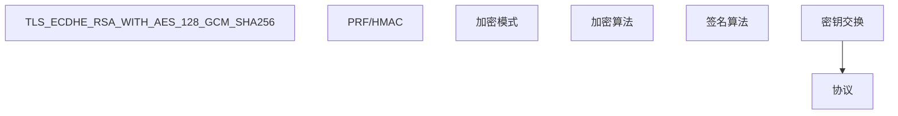

## 1. HTTPS 概述

### 1.1 什么是 HTTPS

HTTPS = HTTP + TLS/SSL，在传输层对 HTTP 通信进行加密，提供：

| 安全属性 | 描述           |
| -------- | -------------- |
| 机密性   | 数据加密传输   |
| 完整性   | 防止数据被篡改 |
| 身份认证 | 验证服务器身份 |

### 1.2 TLS 版本演进

| 版本    | 年份 | 状态     | 安全性      |
| ------- | ---- | -------- | ----------- |
| SSL 3.0 | 1996 | 废弃     | POODLE 攻击 |
| TLS 1.0 | 1999 | 废弃     | BEAST 攻击  |
| TLS 1.1 | 2006 | 废弃     | -           |
| TLS 1.2 | 2008 | 广泛使用 | 安全        |
| TLS 1.3 | 2018 | 推荐     | 最安全      |

## 2. TLS 1.2 握手过程

### 2.1 完整握手流程

```
Client                                          Server
  |                                                |
  |  1. ClientHello                                |
  |  (TLS版本, 密码套件, 随机数Rc, SNI)           |
  |----------------------------------------------->|
  |                                                |
  |  2. ServerHello                                |
  |  (TLS版本, 选定套件, 随机数Rs)                 |
  |  Certificate (服务器证书链)                     |
  |  ServerKeyExchange (DH参数)                    |
  |  ServerHelloDone                               |
  |<-----------------------------------------------|
  |                                                |
  |  3. ClientKeyExchange (DH公钥)                 |
  |  ChangeCipherSpec                              |
  |  Finished                                      |
  |----------------------------------------------->|
  |                                                |
  |  4. ChangeCipherSpec                           |
  |  Finished                                      |
  |<-----------------------------------------------|
  |                                                |
  |  ========== 加密通信开始 ==========            |
```

### 2.2 密钥推导

使用 ECDHE 密钥交换：

1. 双方交换 DH 公钥
2. 计算共享密钥 $K = g^{ab} \mod p$
3. 通过 PRF 推导主密钥：$master\_secret = PRF(K, "master secret", Rc || Rs)$
4. 从主密钥推导会话密钥：加密密钥、MAC 密钥、IV

### 2.3 密码套件



## 3. TLS 1.3 握手过程

### 3.1 1-RTT 握手

```
Client                                          Server
  |                                                |
  |  1. ClientHello                                |
  |  (TLS 1.3, 密码套件, DH公钥share, 随机数)     |
  |----------------------------------------------->|
  |                                                |
  |  2. ServerHello                                |
  |  (选定套件, DH公钥share)                       |
  |  EncryptedExtensions                           |
  |  Certificate                                   |
  |  CertificateVerify                             |
  |  Finished                                      |
  |<-----------------------------------------------|
  |                                                |
  |  3. Finished                                   |
  |----------------------------------------------->|
  |                                                |
  |  ========== 加密通信开始 ==========            |
```

### 3.2 TLS 1.3 改进

| 改进           | 描述                          |
| -------------- | ----------------------------- |
| 握手 1-RTT     | 合并密钥交换到 ClientHello    |
| 0-RTT 恢复     | 会话恢复零延迟                |
| 移除不安全算法 | 删除 RSA 密钥交换、CBC 模式等 |
| 强制前向保密   | 仅支持 ECDHE                  |
| 加密更多握手   | ServerHello 之后全部加密      |

### 3.3 0-RTT 恢复

```
Client                                          Server
  |                                                |
  |  ClientHello + Early Data                      |
  |  (PSK + DH share + 应用数据)                   |
  |----------------------------------------------->|
  |                                                |
  |  ServerHello + New Session Ticket              |
  |  Application Data                              |
  |<-----------------------------------------------|
```

**注意**：0-RTT 数据存在**重放攻击**风险，仅适用于幂等操作。

## 4. 证书验证

### 4.1 验证流程

```
1. 检查证书是否由受信 CA 签发（签名验证）
2. 检查证书域名是否匹配（SAN/CN）
3. 检查证书是否在有效期内
4. 检查证书是否被吊销（OCSP/CRL）
5. 检查证书链完整性
```

### 4.2 主机名验证

```python
import ssl
import socket

context = ssl.create_default_context()
with socket.create_connection(('example.com', 443)) as sock:
    with context.wrap_socket(sock, server_hostname='example.com') as ssock:
        cert = ssock.getpeercert()
        # 自动验证主机名
```

## 5. HTTPS 安全配置

### 5.1 Nginx 配置

```nginx
server {
    listen 443 ssl http2;
    server_name example.com;

    # 证书
    ssl_certificate /etc/ssl/certs/example.com.pem;
    ssl_certificate_key /etc/ssl/private/example.com.key;

    # TLS 版本
    ssl_protocols TLSv1.2 TLSv1.3;

    # 密码套件
    ssl_ciphers ECDHE-ECDSA-AES128-GCM-SHA256:ECDHE-RSA-AES128-GCM-SHA256:ECDHE-ECDSA-AES256-GCM-SHA384:ECDHE-RSA-AES256-GCM-SHA384;

    # 优先服务器密码套件
    ssl_prefer_server_ciphers on;

    # HSTS
    add_header Strict-Transport-Security "max-age=31536000; includeSubDomains; preload" always;

    # OCSP Stapling
    ssl_stapling on;
    ssl_stapling_verify on;
}
```

### 5.2 安全头

| 头                        | 值                                    | 作用           |
| ------------------------- | ------------------------------------- | -------------- |
| Strict-Transport-Security | `max-age=31536000; includeSubDomains` | 强制 HTTPS     |
| X-Content-Type-Options    | `nosniff`                             | 防止 MIME 嗅探 |
| X-Frame-Options           | `DENY`                                | 防止点击劫持   |

## 6. TLS 常见攻击

| 攻击       | 目标            | 防御             |
| ---------- | --------------- | ---------------- |
| BEAST      | TLS 1.0 CBC     | 升级到 TLS 1.2+  |
| POODLE     | SSL 3.0         | 禁用 SSL 3.0     |
| Heartbleed | OpenSSL 实现    | 升级 OpenSSL     |
| Logjam     | DH 512 位       | 使用 2048+ 位 DH |
| ROBOT      | RSA PKCS#1 v1.5 | 使用 RSA-OAEP    |
| Downgrade  | 协议降级        | TLS 1.3 强制     |

## 7. 证书部署最佳实践

| 实践              | 描述                       |
| ----------------- | -------------------------- |
| 自动续期          | 使用 certbot/Let's Encrypt |
| 证书监控          | 监控过期时间               |
| CT 日志           | 确保证书被记录             |
| 完美前向保密      | 仅使用 ECDHE 密码套件      |
| HTTP→HTTPS 重定向 | 301 重定向                 |
| HSTS Preload      | 提交到浏览器预加载列表     |

## 参考文献

OWASP Top 10：https://owasp.org/www-project-top-ten/
OWASP Cheat Sheets：https://cheatsheetseries.owasp.org/
NIST 网络安全框架：https://www.nist.gov/cyberframework
CWE 数据库：https://cwe.mitre.org/
PortSwigger Web Security Academy：https://portswigger.net/web-security

## 延伸阅读

密码学与证书，见 033-cybersecurity 模块文档。
Web 攻击与防御，见 033-cybersecurity 模块相关文档。
网络层安全，见 032-networking 模块。
黑马程序员 Bilibili 空间（https://space.bilibili.com/37974444 ）提供网络安全课程。

## 深度专题扩展

以下专题从不同角度深入本文主题，供有进阶需求的读者研读。每个专题独立成节，内容相互补充。

### 13.1 Web 攻击链详解

注入类：SQLi（参数化防御）、XSS（输出编码 + CSP）、命令注入（白名单）。
身份类：会话固定/劫持（HttpOnly + SameSite）、JWT 算法混淆（固定算法 + 校验）。
逻辑类：越权（IDOR）、竞态（TOCTOU）、支付篡改（服务端重算）。
防护纵深：WAF 拦截已知模式 + 应用层校验 + 监控异常。

### 13.2 零信任架构

核心原则：永不信任、始终验证；身份驱动策略而非网络位置。
组件：身份代理（IdP）、策略引擎（PDP）、网关（PEP）、微隔离。
落地路径：先高价值资产试点，逐步覆盖；配合 MFA 与设备合规。
成本与体验平衡：无密码（passkey）与连续评估是方向。

## 模块文档速查表

| 文档 | 主题 | 与本文的关联 |
| --- | --- | --- |
| 安全基础与防御 | 001-SecurityBasicsDefense | 本文的前置基础 |
| Web安全与渗透测试 | 002-WebSecurityPenetrationTesting | 本文的安全延伸 |
| 二进制安全与应急响应 | 003-BinarySecurityAndIncidentResponse | 本文的安全延伸 |
| 安全工具与实战 | 004-SecurityToolsPractice | 本文的综合应用 |
| XSS攻击 | 005-XSSAttack | 本文的并列主题 |
| 安全模型与框架 | 006-SecurityModelFramework | 本文的安全延伸 |
| CSRF攻击 | 007-CSRFAttack | 本文的并列主题 |
| 密码学应用 | 008-CryptographyApplication | 本文的并列主题 |
| Web安全深度 | 009-WebSecurityDeep | 本文的安全延伸 |
| 安全运营中心 | 010-SOC | 本文的安全延伸 |
| SSRF攻击 | 011-SSRFAttack | 本文的并列主题 |
| 恶意代码分析 | 012-MalwareAnalysis | 本文的并列主题 |
| 云安全 | 013-CloudSecurity | 本文的安全延伸 |
| 对称加密 | 014-SymmetricEncryption | 本文的安全延伸 |
| 应急响应 | 015-IncidentResponse | 本文的并列主题 |
| 非对称加密 | 016-AsymmetricEncryption | 本文的安全延伸 |
| 哈希算法 | 017-HashAlgorithm | 本文的并列主题 |
| 安全开发 | 018-SecureDevelopment | 本文的安全延伸 |
| 合规与审计 | 019-ComplianceAudit | 本文的并列主题 |
| 数字证书 | 020-DigitalCertificate | 本文的并列主题 |
| HTTPS原理 | 021-HTTPSPrinciple | 本文自身 |
| 渗透测试方法论 | 022-PenetrationTestingMethodology | 本文的并列主题 |
| 信息收集 | 023-InformationGathering | 本文的并列主题 |
| 漏洞扫描 | 024-VulnerabilityScan | 本文的并列主题 |
| 安全编码原则 | 025-SecureCodingPrinciples | 本文的安全延伸 |
| 输入验证 | 026-InputValidation | 本文的并列主题 |
| 认证与授权 | 027-AuthenticationAuthorization | 本文的并列主题 |
| OWASP-Top-10详解 | 028-OWASPTop10Detailed | 本文的并列主题 |
| XXE攻击 | 029-XXEAttack | 本文的并列主题 |
| 反序列化漏洞 | 030-DeserializationVulnerability | 本文的并列主题 |
| 零信任架构 | 031-ZeroTrustArchitecture | 本文的原理深化 |
| 身份与访问管理 | 032-IdentityAccessManagement | 本文的并列主题 |
| 安全基线 | 033-SecurityBaseline | 本文的安全延伸 |
| 漏洞扫描工具 | 034-VulnerabilityScanTools | 本文的并列主题 |
| WAF规则 | 035-WAFRule | 本文的并列主题 |
| Cybersecurity OpenSSL 证书管理 | 036-OpenSSLCert | 本文的并列主题 |
| Cybersecurity OpenSSL 加密解密 | 037-OpenSSLEncrypt | 本文的安全延伸 |
| Cybersecurity nmap 端口扫描 | 038-NmapScan | 本文的并列主题 |
| Cybersecurity 哈希工具 | 039-HashTools | 本文的并列主题 |
| Cybersecurity hashcat 密码破解 | 040-Hashcat | 本文的并列主题 |
| Cybersecurity GPG 加密与签名 | 041-GPGEncrypt | 本文的安全延伸 |
| Cybersecurity SSH 密钥管理 | 042-SSHKeys | 本文的并列主题 |
| Cybersecurity 密码哈希 | 043-PasswordHash | 本文的并列主题 |
| Cybersecurity SQL 注入检测与防御 | 044-SQLInjection | 本文的并列主题 |
| Cybersecurity XSS 防御 | 045-XSSDefense | 本文的并列主题 |
| Cybersecurity CSRF 防御命令与配置 | 046-CSRFDefense | 本文的并列主题 |
| Cybersecurity XXE 防御与检测 | 047-XXEDefense | 本文的并列主题 |
| Cybersecurity 命令注入防御与检测 | 048-CommandInjection | 本文的并列主题 |
| Cybersecurity OAuth2/OIDC 配置命令 | 049-OAuth2OIDC | 本文的并列主题 |
| Cybersecurity 防火墙配置(ufw/firewalld) | 050-FirewallConfig | 本文的并列主题 |
| Cybersecurity IDS/IPS 命令(Suricata/Snort) | 051-IDSIPSCommands | 本文的并列主题 |
| Cybersecurity Metasploit 命令(渗透测试) | 052-MetasploitCommands | 本文的并列主题 |
| Cybersecurity Burp Suite 命令行 | 053-BurpSuiteCLI | 本文的并列主题 |
| Cybersecurity Nikto Web 扫描 | 054-NiktoScan | 本文的并列主题 |
| Cybersecurity OpenVAS 漏洞扫描 | 055-OpenVASCommands | 本文的并列主题 |
| Cybersecurity SELinux/AppArmor 强制访问控制 | 056-SELinuxAppArmor | 本文的并列主题 |
| Cybersecurity AIDE 文件完整性检查 | 057-AIDEFileIntegrity | 本文的并列主题 |
| Cybersecurity auditd 审计命令 | 058-AuditdCommands | 本文的并列主题 |
| Cybersecurity 隐写术工具命令 | 059-SteganographyTools | 本文的并列主题 |
| Cybersecurity 逆向工程命令(radare2/ghidra CLI) | 060-ReverseEngineering | 本文的并列主题 |
