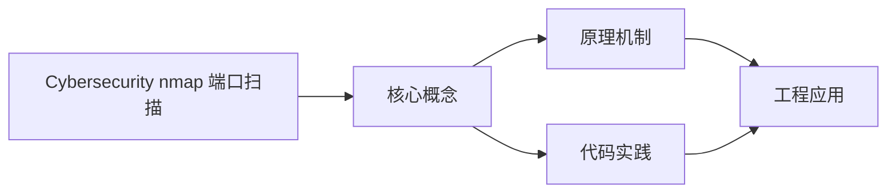
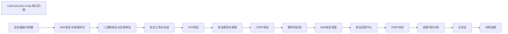

## 1. 学习目标（Bloom 分类）

本节按照布鲁姆教育目标分类学组织学习路径。本文主题为《Cybersecurity nmap 端口扫描》，属于 网络安全 模块，读者可以根据自身阶段选择阅读深度。

记忆层面：能够准确复述本文的核心概念、术语与基本语法或操作步骤，并能够在提问或检索时快速定位对应知识点。能够说出 网络安全 的核心概念、组件与标准流程。

理解层面：能够用自己的语言解释核心原理与工作机制，说明概念之间的因果关系，而不是机械记忆结论。能够解释 网络安全 的工作原理与关键机制。

应用层面：能够在真实项目或练习场景中运用本文知识解决具体问题，写出正确且可维护的实现。能够执行 网络安全 相关的标准操作与配置。

分析层面：能够拆解复杂问题，比较本文主题与相邻概念的异同，识别边界条件与例外情况。能够分析 网络安全 方案在可靠性、成本与性能上的权衡。

评价层面：能够根据约束条件（性能、可读性、安全、成本）评价不同方案的优劣，做出有依据的技术决策。能够评价 网络安全 中的技术选型。

创造层面：能够把本文知识与其他模块知识组合，设计出新的解决方案或可复用的工程模式。能够设计基于 网络安全 的完整解决方案。

通过本节学习，读者应当能够把《Cybersecurity nmap 端口扫描》纳入自己的知识网络，并与 网络安全 模块的其他主题（加密、认证、Web 安全、渗透测试、应急响应）建立关联。

## 2. 历史动机与发展脉络

《Cybersecurity nmap 端口扫描》是 网络安全 领域的重要主题。要真正理解它，需要先了解它解决的问题与演进过程。

网络安全伴随计算机发展而来：1970 年代漏洞概念出现，1988 年 Morris 蠕虫推动 CERT 成立；现代安全已从“边界防御”转向“零信任”。
核心框架：CIA 三元组（机密性、完整性、可用性）；STRIDE 威胁建模；OWASP Top 10 是 Web 安全事实清单。
现代主题：零信任架构、供应链安全（SBOM）、云安全、DevSecOps、AI 安全；合规（等保、GDPR）驱动企业实践。

回到本文主题：Cybersecurity nmap 端口扫描 的提出与成熟，正是上述技术背景下的必然产物。早期实现往往以简单可用为目标，随着工程规模扩大，社区逐渐沉淀出标准做法与最佳实践；理解这一脉络，可以帮助读者判断“为什么文档中的推荐写法是现在这个样子”，也能在遇到历史遗留代码时准确识别其设计年代与取舍。


## 3. 形式化定义与核心概念精讲

本节把《Cybersecurity nmap 端口扫描》涉及的核心概念以“定义 + 讲解”的形式展开。读者应把定义当作工具，把讲解当作理解路径；两者结合才能形成可迁移的知识。

密码学基础：对称加密（AES）、非对称（RSA/ECC）、哈希（SHA-2/3）、HMAC；密码学是加密、签名与认证的地基。
认证与授权：口令哈希（bcrypt/argon2）、MFA、Session/JWT、OAuth 2.0/OIDC、RBAC/ABAC。
Web 攻击面：注入（SQL/XSS）、CSRF、SSRF、文件上传、反序列化；防御（输入校验、输出编码、CSP、SameSite）。

### 3.1 原文章节逐一精讲

原文档把主题拆分为 10 个小节，下面按顺序给出每一节的导读讲解，随后保留原文细节供精读。

#### 原文精读（完整保留）

# Cybersecurity nmap 端口扫描

> **符号约定**：`< >` 必填参数 | `[ ]` 可选参数

---

#### nmap 基本扫描

**基本写法：扫描单个主机**
`nmap <主机>`
```bash
# 扫描目标主机常用端口
nmap 192.168.1.1
```

**基本写法：扫描域名**
`nmap <域名>`
```bash
# 扫描域名
nmap example.com
```

**基本写法：扫描 IP 范围**
`nmap <起始IP>-<结束IP>`
```bash
# 扫描 IP 范围
nmap 192.168.1.1-100
```

**基本写法：扫描整个子网**
`nmap <网段>/<前缀>`
```bash
# 扫描 192.168.1.0/24 网段
nmap 192.168.1.0/24
```

**基本写法：从文件读取目标**
`nmap -iL <文件>`
```bash
# 从文件读取目标列表
nmap -iL targets.txt
```

---

#### 主机发现

**基本写法：只发现存活主机**
`nmap -sn <目标>`
```bash
# Ping 扫描发现存活主机
nmap -sn 192.168.1.0/24
```

**基本写法：跳过主机发现**
`nmap -Pn <目标>`
```bash
# 跳过 Ping 直接扫描端口
nmap -Pn 192.168.1.1
```

**基本写法：使用 ARP 发现**
`nmap -PR <目标>`
```bash
# 使用 ARP 请求发现主机
nmap -PR 192.168.1.0/24
```

**基本写法：使用 ICMP 发现**
`nmap -PE <目标>`
```bash
# 使用 ICMP Echo 请求发现主机
nmap -PE 192.168.1.0/24
```

**基本写法：禁用 DNS 解析**
`nmap -n <目标>`
```bash
# 跳过 DNS 解析加快扫描
nmap -n 192.168.1.0/24
```

---

#### 端口扫描技术

**基本写法：SYN 半开扫描**
`nmap -sS <目标>`
```bash
# SYN 半开扫描（需 root 权限）
nmap -sS 192.168.1.1
```

**基本写法：TCP 全连接扫描**
`nmap -sT <目标>`
```bash
# TCP 全连接扫描
nmap -sT 192.168.1.1
```

**基本写法：UDP 扫描**
`nmap -sU <目标>`
```bash
# UDP 端口扫描
nmap -sU 192.168.1.1
```

**基本写法：FIN 扫描**
`nmap -sF <目标>`
```bash
# FIN 扫描绕过防火墙
nmap -sF 192.168.1.1
```

**基本写法：Xmas 扫描**
`nmap -sX <目标>`
```bash
# Xmas 扫描（FIN+PSH+URG）
nmap -sX 192.168.1.1
```

**基本写法：Null 扫描**
`nmap -sN <目标>`
```bash
# Null 扫描（无标志位）
nmap -sN 192.168.1.1
```

---

#### 端口指定

**基本写法：扫描指定端口**
`nmap -p <端口> <目标>`
```bash
# 扫描 80 端口
nmap -p 80 192.168.1.1
```

**基本写法：扫描多个端口**
`nmap -p <端口1>,<端口2> <目标>`
```bash
# 扫描 80 和 443 端口
nmap -p 80,443 192.168.1.1
```

**基本写法：扫描端口范围**
`nmap -p <起始>-<结束> <目标>`
```bash
# 扫描 1-1000 端口
nmap -p 1-1000 192.168.1.1
```

**基本写法：扫描所有端口**
`nmap -p- <目标>`
```bash
# 扫描所有 65535 个端口
nmap -p- 192.168.1.1
```

**基本写法：扫描常用端口**
`nmap -F <目标>`
```bash
# 快速扫描 100 个常用端口
nmap -F 192.168.1.1
```

**基本写法：扫描指定协议端口**
`nmap -p <协议>:<端口> <目标>`
```bash
# 扫描 TCP 80 和 UDP 53
nmap -p T:80,U:53 192.168.1.1
```

---

#### 服务与版本探测

**基本写法：服务版本探测**
`nmap -sV <目标>`
```bash
# 探测端口运行的服务版本
nmap -sV 192.168.1.1
```

**基本写法：操作系统探测**
`nmap -O <目标>`
```bash
# 探测目标操作系统
nmap -O 192.168.1.1
```

**基本写法：全面扫描**
`nmap -A <目标>`
```bash
# 启用所有高级探测功能
nmap -A 192.168.1.1
```

**基本写法：设置版本探测强度**
`nmap -sV --version-intensity <级别> <目标>`
```bash
# 设置版本探测强度（0-9）
nmap -sV --version-intensity 9 192.168.1.1
```

**基本写法：轻量级版本探测**
`nmap -sV --version-light <目标>`
```bash
# 轻量级版本探测
nmap -sV --version-light 192.168.1.1
```

---

#### 扫描时序与性能

**基本写法：设置时序模板**
`nmap -T<级别> <目标>`
```bash
# 使用 T4 时序模板（0-5）
nmap -T4 192.168.1.1
```

**基本写法：并行扫描**
`nmap --min-parallelism <数量> <目标>`
```bash
# 设置最小并行探测数
nmap --min-parallelism 10 192.168.1.1
```

**基本写法：限制扫描速率**
`nmap --max-rate <速率> <目标>`
```bash
# 限制每秒最大 100 个包
nmap --max-rate 100 192.168.1.1
```

**基本写法：设置超时**
`nmap --host-timeout <时间> <目标>`
```bash
# 设置每主机超时 30 分钟
nmap --host-timeout 30m 192.168.1.1
```

**基本写法：设置重试次数**
`nmap --max-retries <次数> <目标>`
```bash
# 设置最大重试次数
nmap --max-retries 2 192.168.1.1
```

---

#### NSE 脚本引擎

**基本写法：使用默认脚本**
`nmap -sC <目标>`
```bash
# 使用默认脚本集合
nmap -sC 192.168.1.1
```

**基本写法：指定脚本扫描**
`nmap --script <脚本> <目标>`
```bash
# 使用 vuln 类脚本扫描漏洞
nmap --script vuln 192.168.1.1
```

**基本写法：使用多个脚本**
`nmap --script <脚本1>,<脚本2> <目标>`
```bash
# 同时使用多个脚本
nmap --script http-title,ssl-cert 192.168.1.1
```

**基本写法：HTTP 标题枚举**
`nmap --script http-title -p <端口> <目标>`
```bash
# 获取 HTTP 服务标题
nmap --script http-title -p 80,443 192.168.1.1
```

**基本写法：SSL 证书枚举**
`nmap --script ssl-cert -p 443 <目标>`
```bash
# 获取 SSL 证书信息
nmap --script ssl-cert -p 443 example.com
```

**基本写法：检测弱密码套件**
`nmap --script ssl-enum-ciphers -p 443 <目标>`
```bash
# 枚举 SSL 支持的密码套件
nmap --script ssl-enum-ciphers -p 443 example.com
```

**基本写法：脚本参数设置**
`nmap --script <脚本> --script-args <参数>=<值> <目标>`
```bash
# 给脚本传递参数
nmap --script http-enum --script-args http-enum.basepath=/admin/ -p 80 192.168.1.1
```

---

#### 防火墙与 IDS 规避

**基本写法：分片发送数据包**
`nmap -f <目标>`
```bash
# 使用小分片绕过 IDS
nmap -f 192.168.1.1
```

**基本写法：设置 MTU**
`nmap --mtu <大小> <目标>`
```bash
# 设置自定义 MTU 大小
nmap --mtu 24 192.168.1.1
```

**基本写法：使用诱饵**
`nmap -D <诱饵1>,<诱饵2> <目标>`
```bash
# 使用诱饵 IP 隐藏真实源
nmap -D 192.168.1.100,192.168.1.101,ME 192.168.1.1
```

**基本写法：随机诱饵**
`nmap -D RND:<数量> <目标>`
```bash
# 使用 5 个随机诱饵
nmap -D RND:5 192.168.1.1
```

**基本写法：伪造源端口**
`nmap --source-port <端口> <目标>`
```bash
# 使用 53 端口作为源端口
nmap --source-port 53 192.168.1.1
```

**基本写法：随机化目标顺序**
`nmap --randomize-hosts <目标>`
```bash
# 随机化扫描顺序
nmap --randomize-hosts 192.168.1.0/24
```

---

#### 输出格式

**基本写法：标准输出到文件**
`nmap -oN <文件> <目标>`
```bash
# 输出标准格式到文件
nmap -oN scan.txt 192.168.1.1
```

**基本写法：XML 格式输出**
`nmap -oX <文件> <目标>`
```bash
# 输出 XML 格式便于程序解析
nmap -oX scan.xml 192.168.1.1
```

**基本写法：Grep 格式输出**
`nmap -oG <文件> <目标>`
```bash
# 输出 grep 友好格式
nmap -oG scan.gnmap 192.168.1.1
```

**基本写法：输出所有格式**
`nmap -oA <文件名> <目标>`
```bash
# 同时输出所有格式
nmap -oA scanresult 192.168.1.1
```

**基本写法：追加到输出文件**
`nmap --append-output -oN <文件> <目标>`
```bash
# 追加结果到已有文件
nmap --append-output -oN scan.txt 192.168.1.2
```

---

#### 实用扫描组合

**基本写法：快速发现存活主机**
`nmap -sn -T4 <网段>`
```bash
# 快速扫描网段存活主机
nmap -sn -T4 192.168.1.0/24
```

**基本写法：全面扫描单主机**
`nmap -sS -sV -O -A -T4 -p- <主机>`
```bash
# 全面扫描所有端口和服务
nmap -sS -sV -O -A -T4 -p- 192.168.1.1
```

**基本写法：扫描并保存结果**
`nmap -sV -oA <文件名> -p- <主机>`
```bash
# 扫描所有端口并保存结果
nmap -sV -oA fullscan -p- 192.168.1.1
```

**基本写法：隐蔽扫描**
`nmap -sS -f -T2 -D RND:3 --randomize-hosts <目标>`
```bash
# 慢速隐蔽扫描
nmap -sS -f -T2 -D RND:3 --randomize-hosts 192.168.1.1
```

**基本写法：扫描 Web 服务**
`nmap -p 80,443,8080,8443 -sV --script http-title,http-headers <目标>`
```bash
# 扫描常见 Web 端口并获取标题
nmap -p 80,443,8080,8443 -sV --script http-title,http-headers 192.168.1.1
```


### 3.2 概念关系图

下面用 Mermaid 图表达本文核心概念之间的关系，帮助读者建立整体图景：



图中展示的是本文知识的结构化关系：核心概念是入口，原理机制解释“为什么”，代码实践演示“怎么做”，工程应用回答“何时用”。读者学习时可以把每个小节的内容挂接到对应节点上。

## 4. 理论推导与原理解析

本节深入《Cybersecurity nmap 端口扫描》背后的原理。理论部分不求面面俱到，而是聚焦“能解释现象、能指导实践”的关键推导。

密码学基础：对称加密（AES）、非对称（RSA/ECC）、哈希（SHA-2/3）、HMAC；密码学是加密、签名与认证的地基。
认证与授权：口令哈希（bcrypt/argon2）、MFA、Session/JWT、OAuth 2.0/OIDC、RBAC/ABAC。
Web 攻击面：注入（SQL/XSS）、CSRF、SSRF、文件上传、反序列化；防御（输入校验、输出编码、CSP、SameSite）。
渗透测试流程：信息收集 -> 漏洞扫描 -> 利用 -> 提权 -> 横向 -> 报告；工具（Nmap、Burp、Metasploit）。

需要强调的是，理论推导与工程实践之间存在翻译层：理论给出的是理想化模型与边界条件，工程代码则必须处理真实环境中的例外。读者在学习时应先掌握理论的“标准情形”，再通过陷阱章节了解“非标准情形”。

## 5. 代码示例与逐行讲解

本节把原文中的代码示例系统整理，并为每个示例补充用途说明与讲解。读者不应只浏览代码，而应逐段对照讲解理解设计意图。

### 5.1 示例：nmap 基本扫描

该示例来自原文《nmap 基本扫描》小节，用于演示Cybersecurity nmap 端口扫描相关操作。阅读时请先看代码结构，再看其后的讲解。

```bash
# 扫描目标主机常用端口
nmap 192.168.1.1
```

讲解：这段代码演示了本节核心知识点。代码中的关键操作可以归纳为三步：准备（定义或初始化）、执行（核心逻辑）、收尾（释放资源或返回结果）。实际项目中，这三步往往被封装为函数或类，以提升复用性与可测试性。

关键点分析：

该示例共 2 行有效代码，结构以数据或配置为主。阅读时应关注：数据字段的含义、配置项的作用，以及它们与运行行为的对应关系。

进阶思考路径：先尝试修改参数观察行为变化，再把示例中的模式迁移到自己的项目中；每次修改都记录预期与实测差异，这是把示例转化为能力的最快方式。

### 5.2 示例：nmap 基本扫描

该示例来自原文《nmap 基本扫描》小节，用于演示Cybersecurity nmap 端口扫描相关操作。阅读时请先看代码结构，再看其后的讲解。

```bash
# 扫描域名
nmap example.com
```

讲解：这段代码演示了本节核心知识点。代码中的关键操作可以归纳为三步：准备（定义或初始化）、执行（核心逻辑）、收尾（释放资源或返回结果）。实际项目中，这三步往往被封装为函数或类，以提升复用性与可测试性。

关键点分析：

该示例共 2 行有效代码，结构以数据或配置为主。阅读时应关注：数据字段的含义、配置项的作用，以及它们与运行行为的对应关系。

进阶思考路径：先尝试修改参数观察行为变化，再把示例中的模式迁移到自己的项目中；每次修改都记录预期与实测差异，这是把示例转化为能力的最快方式。

### 5.3 示例：nmap 基本扫描

该示例来自原文《nmap 基本扫描》小节，用于演示Cybersecurity nmap 端口扫描相关操作。阅读时请先看代码结构，再看其后的讲解。

```bash
# 扫描 IP 范围
nmap 192.168.1.1-100
```

讲解：这段代码演示了本节核心知识点。代码中的关键操作可以归纳为三步：准备（定义或初始化）、执行（核心逻辑）、收尾（释放资源或返回结果）。实际项目中，这三步往往被封装为函数或类，以提升复用性与可测试性。

关键点分析：

该示例共 2 行有效代码，结构以数据或配置为主。阅读时应关注：数据字段的含义、配置项的作用，以及它们与运行行为的对应关系。

进阶思考路径：先尝试修改参数观察行为变化，再把示例中的模式迁移到自己的项目中；每次修改都记录预期与实测差异，这是把示例转化为能力的最快方式。

### 5.4 示例：nmap 基本扫描

该示例来自原文《nmap 基本扫描》小节，用于演示Cybersecurity nmap 端口扫描相关操作。阅读时请先看代码结构，再看其后的讲解。

```bash
# 扫描 192.168.1.0/24 网段
nmap 192.168.1.0/24
```

讲解：这段代码演示了本节核心知识点。代码中的关键操作可以归纳为三步：准备（定义或初始化）、执行（核心逻辑）、收尾（释放资源或返回结果）。实际项目中，这三步往往被封装为函数或类，以提升复用性与可测试性。

关键点分析：

该示例共 2 行有效代码，结构以数据或配置为主。阅读时应关注：数据字段的含义、配置项的作用，以及它们与运行行为的对应关系。

进阶思考路径：先尝试修改参数观察行为变化，再把示例中的模式迁移到自己的项目中；每次修改都记录预期与实测差异，这是把示例转化为能力的最快方式。

### 5.5 示例：nmap 基本扫描

该示例来自原文《nmap 基本扫描》小节，用于演示Cybersecurity nmap 端口扫描相关操作。阅读时请先看代码结构，再看其后的讲解。

```bash
# 从文件读取目标列表
nmap -iL targets.txt
```

讲解：这段代码演示了本节核心知识点。代码中的关键操作可以归纳为三步：准备（定义或初始化）、执行（核心逻辑）、收尾（释放资源或返回结果）。实际项目中，这三步往往被封装为函数或类，以提升复用性与可测试性。

关键点分析：

该示例共 2 行有效代码，结构以数据或配置为主。阅读时应关注：数据字段的含义、配置项的作用，以及它们与运行行为的对应关系。

进阶思考路径：先尝试修改参数观察行为变化，再把示例中的模式迁移到自己的项目中；每次修改都记录预期与实测差异，这是把示例转化为能力的最快方式。

### 5.6 示例：主机发现

该示例来自原文《主机发现》小节，用于演示Cybersecurity nmap 端口扫描相关操作。阅读时请先看代码结构，再看其后的讲解。

```bash
# Ping 扫描发现存活主机
nmap -sn 192.168.1.0/24
```

讲解：这段代码演示了本节核心知识点。代码中的关键操作可以归纳为三步：准备（定义或初始化）、执行（核心逻辑）、收尾（释放资源或返回结果）。实际项目中，这三步往往被封装为函数或类，以提升复用性与可测试性。

关键点分析：

该示例共 2 行有效代码，结构以数据或配置为主。阅读时应关注：数据字段的含义、配置项的作用，以及它们与运行行为的对应关系。

进阶思考路径：先尝试修改参数观察行为变化，再把示例中的模式迁移到自己的项目中；每次修改都记录预期与实测差异，这是把示例转化为能力的最快方式。

### 5.7 示例：主机发现

该示例来自原文《主机发现》小节，用于演示Cybersecurity nmap 端口扫描相关操作。阅读时请先看代码结构，再看其后的讲解。

```bash
# 跳过 Ping 直接扫描端口
nmap -Pn 192.168.1.1
```

讲解：这段代码演示了本节核心知识点。代码中的关键操作可以归纳为三步：准备（定义或初始化）、执行（核心逻辑）、收尾（释放资源或返回结果）。实际项目中，这三步往往被封装为函数或类，以提升复用性与可测试性。

关键点分析：

该示例共 2 行有效代码，结构以数据或配置为主。阅读时应关注：数据字段的含义、配置项的作用，以及它们与运行行为的对应关系。

进阶思考路径：先尝试修改参数观察行为变化，再把示例中的模式迁移到自己的项目中；每次修改都记录预期与实测差异，这是把示例转化为能力的最快方式。

### 5.8 示例：主机发现

该示例来自原文《主机发现》小节，用于演示Cybersecurity nmap 端口扫描相关操作。阅读时请先看代码结构，再看其后的讲解。

```bash
# 使用 ARP 请求发现主机
nmap -PR 192.168.1.0/24
```

讲解：这段代码演示了本节核心知识点。代码中的关键操作可以归纳为三步：准备（定义或初始化）、执行（核心逻辑）、收尾（释放资源或返回结果）。实际项目中，这三步往往被封装为函数或类，以提升复用性与可测试性。

关键点分析：

该示例共 2 行有效代码，结构以数据或配置为主。阅读时应关注：数据字段的含义、配置项的作用，以及它们与运行行为的对应关系。

进阶思考路径：先尝试修改参数观察行为变化，再把示例中的模式迁移到自己的项目中；每次修改都记录预期与实测差异，这是把示例转化为能力的最快方式。

### 5.9 示例：主机发现

该示例来自原文《主机发现》小节，用于演示Cybersecurity nmap 端口扫描相关操作。阅读时请先看代码结构，再看其后的讲解。

```bash
# 使用 ICMP Echo 请求发现主机
nmap -PE 192.168.1.0/24
```

讲解：这段代码演示了本节核心知识点。代码中的关键操作可以归纳为三步：准备（定义或初始化）、执行（核心逻辑）、收尾（释放资源或返回结果）。实际项目中，这三步往往被封装为函数或类，以提升复用性与可测试性。

关键点分析：

该示例共 2 行有效代码，结构以数据或配置为主。阅读时应关注：数据字段的含义、配置项的作用，以及它们与运行行为的对应关系。

进阶思考路径：先尝试修改参数观察行为变化，再把示例中的模式迁移到自己的项目中；每次修改都记录预期与实测差异，这是把示例转化为能力的最快方式。

### 5.10 示例：主机发现

该示例来自原文《主机发现》小节，用于演示Cybersecurity nmap 端口扫描相关操作。阅读时请先看代码结构，再看其后的讲解。

```bash
# 跳过 DNS 解析加快扫描
nmap -n 192.168.1.0/24
```

讲解：这段代码演示了本节核心知识点。代码中的关键操作可以归纳为三步：准备（定义或初始化）、执行（核心逻辑）、收尾（释放资源或返回结果）。实际项目中，这三步往往被封装为函数或类，以提升复用性与可测试性。

关键点分析：

该示例共 2 行有效代码，结构以数据或配置为主。阅读时应关注：数据字段的含义、配置项的作用，以及它们与运行行为的对应关系。

进阶思考路径：先尝试修改参数观察行为变化，再把示例中的模式迁移到自己的项目中；每次修改都记录预期与实测差异，这是把示例转化为能力的最快方式。

### 5.11 示例：端口扫描技术

该示例来自原文《端口扫描技术》小节，用于演示Cybersecurity nmap 端口扫描相关操作。阅读时请先看代码结构，再看其后的讲解。

```bash
# SYN 半开扫描（需 root 权限）
nmap -sS 192.168.1.1
```

讲解：这段代码演示了本节核心知识点。代码中的关键操作可以归纳为三步：准备（定义或初始化）、执行（核心逻辑）、收尾（释放资源或返回结果）。实际项目中，这三步往往被封装为函数或类，以提升复用性与可测试性。

关键点分析：

该示例共 2 行有效代码，结构以数据或配置为主。阅读时应关注：数据字段的含义、配置项的作用，以及它们与运行行为的对应关系。

进阶思考路径：先尝试修改参数观察行为变化，再把示例中的模式迁移到自己的项目中；每次修改都记录预期与实测差异，这是把示例转化为能力的最快方式。

### 5.12 示例：端口扫描技术

该示例来自原文《端口扫描技术》小节，用于演示Cybersecurity nmap 端口扫描相关操作。阅读时请先看代码结构，再看其后的讲解。

```bash
# TCP 全连接扫描
nmap -sT 192.168.1.1
```

讲解：这段代码演示了本节核心知识点。代码中的关键操作可以归纳为三步：准备（定义或初始化）、执行（核心逻辑）、收尾（释放资源或返回结果）。实际项目中，这三步往往被封装为函数或类，以提升复用性与可测试性。

关键点分析：

该示例共 2 行有效代码，结构以数据或配置为主。阅读时应关注：数据字段的含义、配置项的作用，以及它们与运行行为的对应关系。

进阶思考路径：先尝试修改参数观察行为变化，再把示例中的模式迁移到自己的项目中；每次修改都记录预期与实测差异，这是把示例转化为能力的最快方式。

### 5.13 示例：端口扫描技术

该示例来自原文《端口扫描技术》小节，用于演示Cybersecurity nmap 端口扫描相关操作。阅读时请先看代码结构，再看其后的讲解。

```bash
# UDP 端口扫描
nmap -sU 192.168.1.1
```

讲解：这段代码演示了本节核心知识点。代码中的关键操作可以归纳为三步：准备（定义或初始化）、执行（核心逻辑）、收尾（释放资源或返回结果）。实际项目中，这三步往往被封装为函数或类，以提升复用性与可测试性。

关键点分析：

该示例共 2 行有效代码，结构以数据或配置为主。阅读时应关注：数据字段的含义、配置项的作用，以及它们与运行行为的对应关系。

进阶思考路径：先尝试修改参数观察行为变化，再把示例中的模式迁移到自己的项目中；每次修改都记录预期与实测差异，这是把示例转化为能力的最快方式。

### 5.14 示例：端口扫描技术

该示例来自原文《端口扫描技术》小节，用于演示Cybersecurity nmap 端口扫描相关操作。阅读时请先看代码结构，再看其后的讲解。

```bash
# FIN 扫描绕过防火墙
nmap -sF 192.168.1.1
```

讲解：这段代码演示了本节核心知识点。代码中的关键操作可以归纳为三步：准备（定义或初始化）、执行（核心逻辑）、收尾（释放资源或返回结果）。实际项目中，这三步往往被封装为函数或类，以提升复用性与可测试性。

关键点分析：

该示例共 2 行有效代码，结构以数据或配置为主。阅读时应关注：数据字段的含义、配置项的作用，以及它们与运行行为的对应关系。

进阶思考路径：先尝试修改参数观察行为变化，再把示例中的模式迁移到自己的项目中；每次修改都记录预期与实测差异，这是把示例转化为能力的最快方式。

### 5.15 示例：端口扫描技术

该示例来自原文《端口扫描技术》小节，用于演示Cybersecurity nmap 端口扫描相关操作。阅读时请先看代码结构，再看其后的讲解。

```bash
# Xmas 扫描（FIN+PSH+URG）
nmap -sX 192.168.1.1
```

讲解：这段代码演示了本节核心知识点。代码中的关键操作可以归纳为三步：准备（定义或初始化）、执行（核心逻辑）、收尾（释放资源或返回结果）。实际项目中，这三步往往被封装为函数或类，以提升复用性与可测试性。

关键点分析：

该示例共 2 行有效代码，结构以数据或配置为主。阅读时应关注：数据字段的含义、配置项的作用，以及它们与运行行为的对应关系。

进阶思考路径：先尝试修改参数观察行为变化，再把示例中的模式迁移到自己的项目中；每次修改都记录预期与实测差异，这是把示例转化为能力的最快方式。

### 5.16 示例：端口扫描技术

该示例来自原文《端口扫描技术》小节，用于演示Cybersecurity nmap 端口扫描相关操作。阅读时请先看代码结构，再看其后的讲解。

```bash
# Null 扫描（无标志位）
nmap -sN 192.168.1.1
```

讲解：这段代码演示了本节核心知识点。代码中的关键操作可以归纳为三步：准备（定义或初始化）、执行（核心逻辑）、收尾（释放资源或返回结果）。实际项目中，这三步往往被封装为函数或类，以提升复用性与可测试性。

关键点分析：

该示例共 2 行有效代码，结构以数据或配置为主。阅读时应关注：数据字段的含义、配置项的作用，以及它们与运行行为的对应关系。

进阶思考路径：先尝试修改参数观察行为变化，再把示例中的模式迁移到自己的项目中；每次修改都记录预期与实测差异，这是把示例转化为能力的最快方式。

### 5.17 示例：端口指定

该示例来自原文《端口指定》小节，用于演示Cybersecurity nmap 端口扫描相关操作。阅读时请先看代码结构，再看其后的讲解。

```bash
# 扫描 80 端口
nmap -p 80 192.168.1.1
```

讲解：这段代码演示了本节核心知识点。代码中的关键操作可以归纳为三步：准备（定义或初始化）、执行（核心逻辑）、收尾（释放资源或返回结果）。实际项目中，这三步往往被封装为函数或类，以提升复用性与可测试性。

关键点分析：

该示例共 2 行有效代码，结构以数据或配置为主。阅读时应关注：数据字段的含义、配置项的作用，以及它们与运行行为的对应关系。

进阶思考路径：先尝试修改参数观察行为变化，再把示例中的模式迁移到自己的项目中；每次修改都记录预期与实测差异，这是把示例转化为能力的最快方式。

### 5.18 示例：端口指定

该示例来自原文《端口指定》小节，用于演示Cybersecurity nmap 端口扫描相关操作。阅读时请先看代码结构，再看其后的讲解。

```bash
# 扫描 80 和 443 端口
nmap -p 80,443 192.168.1.1
```

讲解：这段代码演示了本节核心知识点。代码中的关键操作可以归纳为三步：准备（定义或初始化）、执行（核心逻辑）、收尾（释放资源或返回结果）。实际项目中，这三步往往被封装为函数或类，以提升复用性与可测试性。

关键点分析：

该示例共 2 行有效代码，结构以数据或配置为主。阅读时应关注：数据字段的含义、配置项的作用，以及它们与运行行为的对应关系。

进阶思考路径：先尝试修改参数观察行为变化，再把示例中的模式迁移到自己的项目中；每次修改都记录预期与实测差异，这是把示例转化为能力的最快方式。

### 5.19 示例：端口指定

该示例来自原文《端口指定》小节，用于演示Cybersecurity nmap 端口扫描相关操作。阅读时请先看代码结构，再看其后的讲解。

```bash
# 扫描 1-1000 端口
nmap -p 1-1000 192.168.1.1
```

讲解：这段代码演示了本节核心知识点。代码中的关键操作可以归纳为三步：准备（定义或初始化）、执行（核心逻辑）、收尾（释放资源或返回结果）。实际项目中，这三步往往被封装为函数或类，以提升复用性与可测试性。

关键点分析：

该示例共 2 行有效代码，结构以数据或配置为主。阅读时应关注：数据字段的含义、配置项的作用，以及它们与运行行为的对应关系。

进阶思考路径：先尝试修改参数观察行为变化，再把示例中的模式迁移到自己的项目中；每次修改都记录预期与实测差异，这是把示例转化为能力的最快方式。

### 5.20 示例：端口指定

该示例来自原文《端口指定》小节，用于演示Cybersecurity nmap 端口扫描相关操作。阅读时请先看代码结构，再看其后的讲解。

```bash
# 扫描所有 65535 个端口
nmap -p- 192.168.1.1
```

讲解：这段代码演示了本节核心知识点。代码中的关键操作可以归纳为三步：准备（定义或初始化）、执行（核心逻辑）、收尾（释放资源或返回结果）。实际项目中，这三步往往被封装为函数或类，以提升复用性与可测试性。

关键点分析：

该示例共 2 行有效代码，结构以数据或配置为主。阅读时应关注：数据字段的含义、配置项的作用，以及它们与运行行为的对应关系。

进阶思考路径：先尝试修改参数观察行为变化，再把示例中的模式迁移到自己的项目中；每次修改都记录预期与实测差异，这是把示例转化为能力的最快方式。

### 5.21 示例：端口指定

该示例来自原文《端口指定》小节，用于演示Cybersecurity nmap 端口扫描相关操作。阅读时请先看代码结构，再看其后的讲解。

```bash
# 快速扫描 100 个常用端口
nmap -F 192.168.1.1
```

讲解：这段代码演示了本节核心知识点。代码中的关键操作可以归纳为三步：准备（定义或初始化）、执行（核心逻辑）、收尾（释放资源或返回结果）。实际项目中，这三步往往被封装为函数或类，以提升复用性与可测试性。

关键点分析：

该示例共 2 行有效代码，结构以数据或配置为主。阅读时应关注：数据字段的含义、配置项的作用，以及它们与运行行为的对应关系。

进阶思考路径：先尝试修改参数观察行为变化，再把示例中的模式迁移到自己的项目中；每次修改都记录预期与实测差异，这是把示例转化为能力的最快方式。

### 5.22 示例：端口指定

该示例来自原文《端口指定》小节，用于演示Cybersecurity nmap 端口扫描相关操作。阅读时请先看代码结构，再看其后的讲解。

```bash
# 扫描 TCP 80 和 UDP 53
nmap -p T:80,U:53 192.168.1.1
```

讲解：这段代码演示了本节核心知识点。代码中的关键操作可以归纳为三步：准备（定义或初始化）、执行（核心逻辑）、收尾（释放资源或返回结果）。实际项目中，这三步往往被封装为函数或类，以提升复用性与可测试性。

关键点分析：

该示例共 2 行有效代码，结构以数据或配置为主。阅读时应关注：数据字段的含义、配置项的作用，以及它们与运行行为的对应关系。

进阶思考路径：先尝试修改参数观察行为变化，再把示例中的模式迁移到自己的项目中；每次修改都记录预期与实测差异，这是把示例转化为能力的最快方式。

### 5.23 示例：服务与版本探测

该示例来自原文《服务与版本探测》小节，用于演示Cybersecurity nmap 端口扫描相关操作。阅读时请先看代码结构，再看其后的讲解。

```bash
# 探测端口运行的服务版本
nmap -sV 192.168.1.1
```

讲解：这段代码演示了本节核心知识点。代码中的关键操作可以归纳为三步：准备（定义或初始化）、执行（核心逻辑）、收尾（释放资源或返回结果）。实际项目中，这三步往往被封装为函数或类，以提升复用性与可测试性。

关键点分析：

该示例共 2 行有效代码，结构以数据或配置为主。阅读时应关注：数据字段的含义、配置项的作用，以及它们与运行行为的对应关系。

进阶思考路径：先尝试修改参数观察行为变化，再把示例中的模式迁移到自己的项目中；每次修改都记录预期与实测差异，这是把示例转化为能力的最快方式。

### 5.24 示例：服务与版本探测

该示例来自原文《服务与版本探测》小节，用于演示Cybersecurity nmap 端口扫描相关操作。阅读时请先看代码结构，再看其后的讲解。

```bash
# 探测目标操作系统
nmap -O 192.168.1.1
```

讲解：这段代码演示了本节核心知识点。代码中的关键操作可以归纳为三步：准备（定义或初始化）、执行（核心逻辑）、收尾（释放资源或返回结果）。实际项目中，这三步往往被封装为函数或类，以提升复用性与可测试性。

关键点分析：

该示例共 2 行有效代码，结构以数据或配置为主。阅读时应关注：数据字段的含义、配置项的作用，以及它们与运行行为的对应关系。

进阶思考路径：先尝试修改参数观察行为变化，再把示例中的模式迁移到自己的项目中；每次修改都记录预期与实测差异，这是把示例转化为能力的最快方式。

### 5.25 示例：服务与版本探测

该示例来自原文《服务与版本探测》小节，用于演示Cybersecurity nmap 端口扫描相关操作。阅读时请先看代码结构，再看其后的讲解。

```bash
# 启用所有高级探测功能
nmap -A 192.168.1.1
```

讲解：这段代码演示了本节核心知识点。代码中的关键操作可以归纳为三步：准备（定义或初始化）、执行（核心逻辑）、收尾（释放资源或返回结果）。实际项目中，这三步往往被封装为函数或类，以提升复用性与可测试性。

关键点分析：

该示例共 2 行有效代码，结构以数据或配置为主。阅读时应关注：数据字段的含义、配置项的作用，以及它们与运行行为的对应关系。

进阶思考路径：先尝试修改参数观察行为变化，再把示例中的模式迁移到自己的项目中；每次修改都记录预期与实测差异，这是把示例转化为能力的最快方式。

### 5.26 示例：服务与版本探测

该示例来自原文《服务与版本探测》小节，用于演示Cybersecurity nmap 端口扫描相关操作。阅读时请先看代码结构，再看其后的讲解。

```bash
# 设置版本探测强度（0-9）
nmap -sV --version-intensity 9 192.168.1.1
```

讲解：这段代码演示了本节核心知识点。代码中的关键操作可以归纳为三步：准备（定义或初始化）、执行（核心逻辑）、收尾（释放资源或返回结果）。实际项目中，这三步往往被封装为函数或类，以提升复用性与可测试性。

关键点分析：

该示例共 2 行有效代码，结构以数据或配置为主。阅读时应关注：数据字段的含义、配置项的作用，以及它们与运行行为的对应关系。

进阶思考路径：先尝试修改参数观察行为变化，再把示例中的模式迁移到自己的项目中；每次修改都记录预期与实测差异，这是把示例转化为能力的最快方式。

### 5.27 示例：服务与版本探测

该示例来自原文《服务与版本探测》小节，用于演示Cybersecurity nmap 端口扫描相关操作。阅读时请先看代码结构，再看其后的讲解。

```bash
# 轻量级版本探测
nmap -sV --version-light 192.168.1.1
```

讲解：这段代码演示了本节核心知识点。代码中的关键操作可以归纳为三步：准备（定义或初始化）、执行（核心逻辑）、收尾（释放资源或返回结果）。实际项目中，这三步往往被封装为函数或类，以提升复用性与可测试性。

关键点分析：

该示例共 2 行有效代码，结构以数据或配置为主。阅读时应关注：数据字段的含义、配置项的作用，以及它们与运行行为的对应关系。

进阶思考路径：先尝试修改参数观察行为变化，再把示例中的模式迁移到自己的项目中；每次修改都记录预期与实测差异，这是把示例转化为能力的最快方式。

### 5.28 示例：扫描时序与性能

该示例来自原文《扫描时序与性能》小节，用于演示Cybersecurity nmap 端口扫描相关操作。阅读时请先看代码结构，再看其后的讲解。

```bash
# 使用 T4 时序模板（0-5）
nmap -T4 192.168.1.1
```

讲解：这段代码演示了本节核心知识点。代码中的关键操作可以归纳为三步：准备（定义或初始化）、执行（核心逻辑）、收尾（释放资源或返回结果）。实际项目中，这三步往往被封装为函数或类，以提升复用性与可测试性。

关键点分析：

该示例共 2 行有效代码，结构以数据或配置为主。阅读时应关注：数据字段的含义、配置项的作用，以及它们与运行行为的对应关系。

进阶思考路径：先尝试修改参数观察行为变化，再把示例中的模式迁移到自己的项目中；每次修改都记录预期与实测差异，这是把示例转化为能力的最快方式。

### 5.29 示例：扫描时序与性能

该示例来自原文《扫描时序与性能》小节，用于演示Cybersecurity nmap 端口扫描相关操作。阅读时请先看代码结构，再看其后的讲解。

```bash
# 设置最小并行探测数
nmap --min-parallelism 10 192.168.1.1
```

讲解：这段代码演示了本节核心知识点。代码中的关键操作可以归纳为三步：准备（定义或初始化）、执行（核心逻辑）、收尾（释放资源或返回结果）。实际项目中，这三步往往被封装为函数或类，以提升复用性与可测试性。

关键点分析：

该示例共 2 行有效代码，结构以数据或配置为主。阅读时应关注：数据字段的含义、配置项的作用，以及它们与运行行为的对应关系。

进阶思考路径：先尝试修改参数观察行为变化，再把示例中的模式迁移到自己的项目中；每次修改都记录预期与实测差异，这是把示例转化为能力的最快方式。

### 5.30 示例：扫描时序与性能

该示例来自原文《扫描时序与性能》小节，用于演示Cybersecurity nmap 端口扫描相关操作。阅读时请先看代码结构，再看其后的讲解。

```bash
# 限制每秒最大 100 个包
nmap --max-rate 100 192.168.1.1
```

讲解：这段代码演示了本节核心知识点。代码中的关键操作可以归纳为三步：准备（定义或初始化）、执行（核心逻辑）、收尾（释放资源或返回结果）。实际项目中，这三步往往被封装为函数或类，以提升复用性与可测试性。

关键点分析：

该示例共 2 行有效代码，结构以数据或配置为主。阅读时应关注：数据字段的含义、配置项的作用，以及它们与运行行为的对应关系。

进阶思考路径：先尝试修改参数观察行为变化，再把示例中的模式迁移到自己的项目中；每次修改都记录预期与实测差异，这是把示例转化为能力的最快方式。

### 5.31 示例：扫描时序与性能

该示例来自原文《扫描时序与性能》小节，用于演示Cybersecurity nmap 端口扫描相关操作。阅读时请先看代码结构，再看其后的讲解。

```bash
# 设置每主机超时 30 分钟
nmap --host-timeout 30m 192.168.1.1
```

讲解：这段代码演示了本节核心知识点。代码中的关键操作可以归纳为三步：准备（定义或初始化）、执行（核心逻辑）、收尾（释放资源或返回结果）。实际项目中，这三步往往被封装为函数或类，以提升复用性与可测试性。

关键点分析：

该示例共 2 行有效代码，结构以数据或配置为主。阅读时应关注：数据字段的含义、配置项的作用，以及它们与运行行为的对应关系。

进阶思考路径：先尝试修改参数观察行为变化，再把示例中的模式迁移到自己的项目中；每次修改都记录预期与实测差异，这是把示例转化为能力的最快方式。

### 5.32 示例：扫描时序与性能

该示例来自原文《扫描时序与性能》小节，用于演示Cybersecurity nmap 端口扫描相关操作。阅读时请先看代码结构，再看其后的讲解。

```bash
# 设置最大重试次数
nmap --max-retries 2 192.168.1.1
```

讲解：这段代码演示了本节核心知识点。代码中的关键操作可以归纳为三步：准备（定义或初始化）、执行（核心逻辑）、收尾（释放资源或返回结果）。实际项目中，这三步往往被封装为函数或类，以提升复用性与可测试性。

关键点分析：

该示例共 2 行有效代码，结构以数据或配置为主。阅读时应关注：数据字段的含义、配置项的作用，以及它们与运行行为的对应关系。

进阶思考路径：先尝试修改参数观察行为变化，再把示例中的模式迁移到自己的项目中；每次修改都记录预期与实测差异，这是把示例转化为能力的最快方式。

### 5.33 示例：NSE 脚本引擎

该示例来自原文《NSE 脚本引擎》小节，用于演示Cybersecurity nmap 端口扫描相关操作。阅读时请先看代码结构，再看其后的讲解。

```bash
# 使用默认脚本集合
nmap -sC 192.168.1.1
```

讲解：这段代码演示了本节核心知识点。代码中的关键操作可以归纳为三步：准备（定义或初始化）、执行（核心逻辑）、收尾（释放资源或返回结果）。实际项目中，这三步往往被封装为函数或类，以提升复用性与可测试性。

关键点分析：

该示例共 2 行有效代码，结构以数据或配置为主。阅读时应关注：数据字段的含义、配置项的作用，以及它们与运行行为的对应关系。

进阶思考路径：先尝试修改参数观察行为变化，再把示例中的模式迁移到自己的项目中；每次修改都记录预期与实测差异，这是把示例转化为能力的最快方式。

### 5.34 示例：NSE 脚本引擎

该示例来自原文《NSE 脚本引擎》小节，用于演示Cybersecurity nmap 端口扫描相关操作。阅读时请先看代码结构，再看其后的讲解。

```bash
# 使用 vuln 类脚本扫描漏洞
nmap --script vuln 192.168.1.1
```

讲解：这段代码演示了本节核心知识点。代码中的关键操作可以归纳为三步：准备（定义或初始化）、执行（核心逻辑）、收尾（释放资源或返回结果）。实际项目中，这三步往往被封装为函数或类，以提升复用性与可测试性。

关键点分析：

该示例共 2 行有效代码，结构以数据或配置为主。阅读时应关注：数据字段的含义、配置项的作用，以及它们与运行行为的对应关系。

进阶思考路径：先尝试修改参数观察行为变化，再把示例中的模式迁移到自己的项目中；每次修改都记录预期与实测差异，这是把示例转化为能力的最快方式。

### 5.35 示例：NSE 脚本引擎

该示例来自原文《NSE 脚本引擎》小节，用于演示Cybersecurity nmap 端口扫描相关操作。阅读时请先看代码结构，再看其后的讲解。

```bash
# 同时使用多个脚本
nmap --script http-title,ssl-cert 192.168.1.1
```

讲解：这段代码演示了本节核心知识点。代码中的关键操作可以归纳为三步：准备（定义或初始化）、执行（核心逻辑）、收尾（释放资源或返回结果）。实际项目中，这三步往往被封装为函数或类，以提升复用性与可测试性。

关键点分析：

该示例共 2 行有效代码，结构以数据或配置为主。阅读时应关注：数据字段的含义、配置项的作用，以及它们与运行行为的对应关系。

进阶思考路径：先尝试修改参数观察行为变化，再把示例中的模式迁移到自己的项目中；每次修改都记录预期与实测差异，这是把示例转化为能力的最快方式。

### 5.36 示例：NSE 脚本引擎

该示例来自原文《NSE 脚本引擎》小节，用于演示Cybersecurity nmap 端口扫描相关操作。阅读时请先看代码结构，再看其后的讲解。

```bash
# 获取 HTTP 服务标题
nmap --script http-title -p 80,443 192.168.1.1
```

讲解：这段代码演示了本节核心知识点。代码中的关键操作可以归纳为三步：准备（定义或初始化）、执行（核心逻辑）、收尾（释放资源或返回结果）。实际项目中，这三步往往被封装为函数或类，以提升复用性与可测试性。

关键点分析：

该示例共 2 行有效代码，结构以数据或配置为主。阅读时应关注：数据字段的含义、配置项的作用，以及它们与运行行为的对应关系。

进阶思考路径：先尝试修改参数观察行为变化，再把示例中的模式迁移到自己的项目中；每次修改都记录预期与实测差异，这是把示例转化为能力的最快方式。

### 5.37 示例：NSE 脚本引擎

该示例来自原文《NSE 脚本引擎》小节，用于演示Cybersecurity nmap 端口扫描相关操作。阅读时请先看代码结构，再看其后的讲解。

```bash
# 获取 SSL 证书信息
nmap --script ssl-cert -p 443 example.com
```

讲解：这段代码演示了本节核心知识点。代码中的关键操作可以归纳为三步：准备（定义或初始化）、执行（核心逻辑）、收尾（释放资源或返回结果）。实际项目中，这三步往往被封装为函数或类，以提升复用性与可测试性。

关键点分析：

该示例共 2 行有效代码，结构以数据或配置为主。阅读时应关注：数据字段的含义、配置项的作用，以及它们与运行行为的对应关系。

进阶思考路径：先尝试修改参数观察行为变化，再把示例中的模式迁移到自己的项目中；每次修改都记录预期与实测差异，这是把示例转化为能力的最快方式。

### 5.38 示例：NSE 脚本引擎

该示例来自原文《NSE 脚本引擎》小节，用于演示Cybersecurity nmap 端口扫描相关操作。阅读时请先看代码结构，再看其后的讲解。

```bash
# 枚举 SSL 支持的密码套件
nmap --script ssl-enum-ciphers -p 443 example.com
```

讲解：这段代码演示了本节核心知识点。代码中的关键操作可以归纳为三步：准备（定义或初始化）、执行（核心逻辑）、收尾（释放资源或返回结果）。实际项目中，这三步往往被封装为函数或类，以提升复用性与可测试性。

关键点分析：

该示例共 2 行有效代码，结构以数据或配置为主。阅读时应关注：数据字段的含义、配置项的作用，以及它们与运行行为的对应关系。

进阶思考路径：先尝试修改参数观察行为变化，再把示例中的模式迁移到自己的项目中；每次修改都记录预期与实测差异，这是把示例转化为能力的最快方式。

### 5.39 示例：NSE 脚本引擎

该示例来自原文《NSE 脚本引擎》小节，用于演示Cybersecurity nmap 端口扫描相关操作。阅读时请先看代码结构，再看其后的讲解。

```bash
# 给脚本传递参数
nmap --script http-enum --script-args http-enum.basepath=/admin/ -p 80 192.168.1.1
```

讲解：这段代码演示了本节核心知识点。代码中的关键操作可以归纳为三步：准备（定义或初始化）、执行（核心逻辑）、收尾（释放资源或返回结果）。实际项目中，这三步往往被封装为函数或类，以提升复用性与可测试性。

关键点分析：

该示例共 2 行有效代码，结构以数据或配置为主。阅读时应关注：数据字段的含义、配置项的作用，以及它们与运行行为的对应关系。

进阶思考路径：先尝试修改参数观察行为变化，再把示例中的模式迁移到自己的项目中；每次修改都记录预期与实测差异，这是把示例转化为能力的最快方式。

### 5.40 示例：防火墙与 IDS 规避

该示例来自原文《防火墙与 IDS 规避》小节，用于演示Cybersecurity nmap 端口扫描相关操作。阅读时请先看代码结构，再看其后的讲解。

```bash
# 使用小分片绕过 IDS
nmap -f 192.168.1.1
```

讲解：这段代码演示了本节核心知识点。代码中的关键操作可以归纳为三步：准备（定义或初始化）、执行（核心逻辑）、收尾（释放资源或返回结果）。实际项目中，这三步往往被封装为函数或类，以提升复用性与可测试性。

关键点分析：

该示例共 2 行有效代码，结构以数据或配置为主。阅读时应关注：数据字段的含义、配置项的作用，以及它们与运行行为的对应关系。

进阶思考路径：先尝试修改参数观察行为变化，再把示例中的模式迁移到自己的项目中；每次修改都记录预期与实测差异，这是把示例转化为能力的最快方式。

### 5.41 示例：防火墙与 IDS 规避

该示例来自原文《防火墙与 IDS 规避》小节，用于演示Cybersecurity nmap 端口扫描相关操作。阅读时请先看代码结构，再看其后的讲解。

```bash
# 设置自定义 MTU 大小
nmap --mtu 24 192.168.1.1
```

讲解：这段代码演示了本节核心知识点。代码中的关键操作可以归纳为三步：准备（定义或初始化）、执行（核心逻辑）、收尾（释放资源或返回结果）。实际项目中，这三步往往被封装为函数或类，以提升复用性与可测试性。

关键点分析：

该示例共 2 行有效代码，结构以数据或配置为主。阅读时应关注：数据字段的含义、配置项的作用，以及它们与运行行为的对应关系。

进阶思考路径：先尝试修改参数观察行为变化，再把示例中的模式迁移到自己的项目中；每次修改都记录预期与实测差异，这是把示例转化为能力的最快方式。

### 5.42 示例：防火墙与 IDS 规避

该示例来自原文《防火墙与 IDS 规避》小节，用于演示Cybersecurity nmap 端口扫描相关操作。阅读时请先看代码结构，再看其后的讲解。

```bash
# 使用诱饵 IP 隐藏真实源
nmap -D 192.168.1.100,192.168.1.101,ME 192.168.1.1
```

讲解：这段代码演示了本节核心知识点。代码中的关键操作可以归纳为三步：准备（定义或初始化）、执行（核心逻辑）、收尾（释放资源或返回结果）。实际项目中，这三步往往被封装为函数或类，以提升复用性与可测试性。

关键点分析：

该示例共 2 行有效代码，结构以数据或配置为主。阅读时应关注：数据字段的含义、配置项的作用，以及它们与运行行为的对应关系。

进阶思考路径：先尝试修改参数观察行为变化，再把示例中的模式迁移到自己的项目中；每次修改都记录预期与实测差异，这是把示例转化为能力的最快方式。

### 5.43 示例：防火墙与 IDS 规避

该示例来自原文《防火墙与 IDS 规避》小节，用于演示Cybersecurity nmap 端口扫描相关操作。阅读时请先看代码结构，再看其后的讲解。

```bash
# 使用 5 个随机诱饵
nmap -D RND:5 192.168.1.1
```

讲解：这段代码演示了本节核心知识点。代码中的关键操作可以归纳为三步：准备（定义或初始化）、执行（核心逻辑）、收尾（释放资源或返回结果）。实际项目中，这三步往往被封装为函数或类，以提升复用性与可测试性。

关键点分析：

该示例共 2 行有效代码，结构以数据或配置为主。阅读时应关注：数据字段的含义、配置项的作用，以及它们与运行行为的对应关系。

进阶思考路径：先尝试修改参数观察行为变化，再把示例中的模式迁移到自己的项目中；每次修改都记录预期与实测差异，这是把示例转化为能力的最快方式。

### 5.44 示例：防火墙与 IDS 规避

该示例来自原文《防火墙与 IDS 规避》小节，用于演示Cybersecurity nmap 端口扫描相关操作。阅读时请先看代码结构，再看其后的讲解。

```bash
# 使用 53 端口作为源端口
nmap --source-port 53 192.168.1.1
```

讲解：这段代码演示了本节核心知识点。代码中的关键操作可以归纳为三步：准备（定义或初始化）、执行（核心逻辑）、收尾（释放资源或返回结果）。实际项目中，这三步往往被封装为函数或类，以提升复用性与可测试性。

关键点分析：

该示例共 2 行有效代码，结构以数据或配置为主。阅读时应关注：数据字段的含义、配置项的作用，以及它们与运行行为的对应关系。

进阶思考路径：先尝试修改参数观察行为变化，再把示例中的模式迁移到自己的项目中；每次修改都记录预期与实测差异，这是把示例转化为能力的最快方式。

### 5.45 示例：防火墙与 IDS 规避

该示例来自原文《防火墙与 IDS 规避》小节，用于演示Cybersecurity nmap 端口扫描相关操作。阅读时请先看代码结构，再看其后的讲解。

```bash
# 随机化扫描顺序
nmap --randomize-hosts 192.168.1.0/24
```

讲解：这段代码演示了本节核心知识点。代码中的关键操作可以归纳为三步：准备（定义或初始化）、执行（核心逻辑）、收尾（释放资源或返回结果）。实际项目中，这三步往往被封装为函数或类，以提升复用性与可测试性。

关键点分析：

该示例共 2 行有效代码，结构以数据或配置为主。阅读时应关注：数据字段的含义、配置项的作用，以及它们与运行行为的对应关系。

进阶思考路径：先尝试修改参数观察行为变化，再把示例中的模式迁移到自己的项目中；每次修改都记录预期与实测差异，这是把示例转化为能力的最快方式。

### 5.46 示例：输出格式

该示例来自原文《输出格式》小节，用于演示Cybersecurity nmap 端口扫描相关操作。阅读时请先看代码结构，再看其后的讲解。

```bash
# 输出标准格式到文件
nmap -oN scan.txt 192.168.1.1
```

讲解：这段代码演示了本节核心知识点。代码中的关键操作可以归纳为三步：准备（定义或初始化）、执行（核心逻辑）、收尾（释放资源或返回结果）。实际项目中，这三步往往被封装为函数或类，以提升复用性与可测试性。

关键点分析：

该示例共 2 行有效代码，结构以数据或配置为主。阅读时应关注：数据字段的含义、配置项的作用，以及它们与运行行为的对应关系。

进阶思考路径：先尝试修改参数观察行为变化，再把示例中的模式迁移到自己的项目中；每次修改都记录预期与实测差异，这是把示例转化为能力的最快方式。

### 5.47 示例：输出格式

该示例来自原文《输出格式》小节，用于演示Cybersecurity nmap 端口扫描相关操作。阅读时请先看代码结构，再看其后的讲解。

```bash
# 输出 XML 格式便于程序解析
nmap -oX scan.xml 192.168.1.1
```

讲解：这段代码演示了本节核心知识点。代码中的关键操作可以归纳为三步：准备（定义或初始化）、执行（核心逻辑）、收尾（释放资源或返回结果）。实际项目中，这三步往往被封装为函数或类，以提升复用性与可测试性。

关键点分析：

该示例共 2 行有效代码，结构以数据或配置为主。阅读时应关注：数据字段的含义、配置项的作用，以及它们与运行行为的对应关系。

进阶思考路径：先尝试修改参数观察行为变化，再把示例中的模式迁移到自己的项目中；每次修改都记录预期与实测差异，这是把示例转化为能力的最快方式。

### 5.48 示例：输出格式

该示例来自原文《输出格式》小节，用于演示Cybersecurity nmap 端口扫描相关操作。阅读时请先看代码结构，再看其后的讲解。

```bash
# 输出 grep 友好格式
nmap -oG scan.gnmap 192.168.1.1
```

讲解：这段代码演示了本节核心知识点。代码中的关键操作可以归纳为三步：准备（定义或初始化）、执行（核心逻辑）、收尾（释放资源或返回结果）。实际项目中，这三步往往被封装为函数或类，以提升复用性与可测试性。

关键点分析：

该示例共 2 行有效代码，结构以数据或配置为主。阅读时应关注：数据字段的含义、配置项的作用，以及它们与运行行为的对应关系。

进阶思考路径：先尝试修改参数观察行为变化，再把示例中的模式迁移到自己的项目中；每次修改都记录预期与实测差异，这是把示例转化为能力的最快方式。

### 5.49 示例：输出格式

该示例来自原文《输出格式》小节，用于演示Cybersecurity nmap 端口扫描相关操作。阅读时请先看代码结构，再看其后的讲解。

```bash
# 同时输出所有格式
nmap -oA scanresult 192.168.1.1
```

讲解：这段代码演示了本节核心知识点。代码中的关键操作可以归纳为三步：准备（定义或初始化）、执行（核心逻辑）、收尾（释放资源或返回结果）。实际项目中，这三步往往被封装为函数或类，以提升复用性与可测试性。

关键点分析：

该示例共 2 行有效代码，结构以数据或配置为主。阅读时应关注：数据字段的含义、配置项的作用，以及它们与运行行为的对应关系。

进阶思考路径：先尝试修改参数观察行为变化，再把示例中的模式迁移到自己的项目中；每次修改都记录预期与实测差异，这是把示例转化为能力的最快方式。

### 5.50 示例：输出格式

该示例来自原文《输出格式》小节，用于演示Cybersecurity nmap 端口扫描相关操作。阅读时请先看代码结构，再看其后的讲解。

```bash
# 追加结果到已有文件
nmap --append-output -oN scan.txt 192.168.1.2
```

讲解：这段代码演示了本节核心知识点。代码中的关键操作可以归纳为三步：准备（定义或初始化）、执行（核心逻辑）、收尾（释放资源或返回结果）。实际项目中，这三步往往被封装为函数或类，以提升复用性与可测试性。

关键点分析：

该示例共 2 行有效代码，结构以数据或配置为主。阅读时应关注：数据字段的含义、配置项的作用，以及它们与运行行为的对应关系。

进阶思考路径：先尝试修改参数观察行为变化，再把示例中的模式迁移到自己的项目中；每次修改都记录预期与实测差异，这是把示例转化为能力的最快方式。

### 5.51 示例：实用扫描组合

该示例来自原文《实用扫描组合》小节，用于演示Cybersecurity nmap 端口扫描相关操作。阅读时请先看代码结构，再看其后的讲解。

```bash
# 快速扫描网段存活主机
nmap -sn -T4 192.168.1.0/24
```

讲解：这段代码演示了本节核心知识点。代码中的关键操作可以归纳为三步：准备（定义或初始化）、执行（核心逻辑）、收尾（释放资源或返回结果）。实际项目中，这三步往往被封装为函数或类，以提升复用性与可测试性。

关键点分析：

该示例共 2 行有效代码，结构以数据或配置为主。阅读时应关注：数据字段的含义、配置项的作用，以及它们与运行行为的对应关系。

进阶思考路径：先尝试修改参数观察行为变化，再把示例中的模式迁移到自己的项目中；每次修改都记录预期与实测差异，这是把示例转化为能力的最快方式。

### 5.52 示例：实用扫描组合

该示例来自原文《实用扫描组合》小节，用于演示Cybersecurity nmap 端口扫描相关操作。阅读时请先看代码结构，再看其后的讲解。

```bash
# 全面扫描所有端口和服务
nmap -sS -sV -O -A -T4 -p- 192.168.1.1
```

讲解：这段代码演示了本节核心知识点。代码中的关键操作可以归纳为三步：准备（定义或初始化）、执行（核心逻辑）、收尾（释放资源或返回结果）。实际项目中，这三步往往被封装为函数或类，以提升复用性与可测试性。

关键点分析：

该示例共 2 行有效代码，结构以数据或配置为主。阅读时应关注：数据字段的含义、配置项的作用，以及它们与运行行为的对应关系。

进阶思考路径：先尝试修改参数观察行为变化，再把示例中的模式迁移到自己的项目中；每次修改都记录预期与实测差异，这是把示例转化为能力的最快方式。

### 5.53 示例：实用扫描组合

该示例来自原文《实用扫描组合》小节，用于演示Cybersecurity nmap 端口扫描相关操作。阅读时请先看代码结构，再看其后的讲解。

```bash
# 扫描所有端口并保存结果
nmap -sV -oA fullscan -p- 192.168.1.1
```

讲解：这段代码演示了本节核心知识点。代码中的关键操作可以归纳为三步：准备（定义或初始化）、执行（核心逻辑）、收尾（释放资源或返回结果）。实际项目中，这三步往往被封装为函数或类，以提升复用性与可测试性。

关键点分析：

该示例共 2 行有效代码，结构以数据或配置为主。阅读时应关注：数据字段的含义、配置项的作用，以及它们与运行行为的对应关系。

进阶思考路径：先尝试修改参数观察行为变化，再把示例中的模式迁移到自己的项目中；每次修改都记录预期与实测差异，这是把示例转化为能力的最快方式。

### 5.54 示例：实用扫描组合

该示例来自原文《实用扫描组合》小节，用于演示Cybersecurity nmap 端口扫描相关操作。阅读时请先看代码结构，再看其后的讲解。

```bash
# 慢速隐蔽扫描
nmap -sS -f -T2 -D RND:3 --randomize-hosts 192.168.1.1
```

讲解：这段代码演示了本节核心知识点。代码中的关键操作可以归纳为三步：准备（定义或初始化）、执行（核心逻辑）、收尾（释放资源或返回结果）。实际项目中，这三步往往被封装为函数或类，以提升复用性与可测试性。

关键点分析：

该示例共 2 行有效代码，结构以数据或配置为主。阅读时应关注：数据字段的含义、配置项的作用，以及它们与运行行为的对应关系。

进阶思考路径：先尝试修改参数观察行为变化，再把示例中的模式迁移到自己的项目中；每次修改都记录预期与实测差异，这是把示例转化为能力的最快方式。

### 5.55 示例：实用扫描组合

该示例来自原文《实用扫描组合》小节，用于演示Cybersecurity nmap 端口扫描相关操作。阅读时请先看代码结构，再看其后的讲解。

```bash
# 扫描常见 Web 端口并获取标题
nmap -p 80,443,8080,8443 -sV --script http-title,http-headers 192.168.1.1
```

讲解：这段代码演示了本节核心知识点。代码中的关键操作可以归纳为三步：准备（定义或初始化）、执行（核心逻辑）、收尾（释放资源或返回结果）。实际项目中，这三步往往被封装为函数或类，以提升复用性与可测试性。

关键点分析：

该示例共 2 行有效代码，结构以数据或配置为主。阅读时应关注：数据字段的含义、配置项的作用，以及它们与运行行为的对应关系。

进阶思考路径：先尝试修改参数观察行为变化，再把示例中的模式迁移到自己的项目中；每次修改都记录预期与实测差异，这是把示例转化为能力的最快方式。


综合以上示例，可以总结出本主题的代码实践要点：第一，先定义清晰的输入输出契约；第二，核心逻辑保持单一职责；第三，错误处理与边界条件不可省略；第四，命名与注释表达意图而非复述代码。

## 6. 对比分析

对比是理解《Cybersecurity nmap 端口扫描》定位的最快路径。下面从多个维度与相邻方案进行对比。

白盒与黑盒：白盒审代码，黑盒测外部；红蓝对抗验证整体。
等保 2.0 与 ISO 27001：合规框架驱动管理安全。
传统边界与零信任：零信任默认不信任任何请求，持续验证。

对比的目的不是分出绝对优劣，而是建立选择依据：不同约束条件下，最优解不同。读者应把每个对比维度转化为决策检查清单。

## 7. 常见陷阱与最佳实践

本节整理该主题的高频错误与推荐做法。每个陷阱先描述现象，再解释原因，最后给出最佳实践。

### 7.1 弱口令

默认口令与弱密码是最大入口。强制策略 + MFA。

深入讲解：该问题之所以被归类为“常见陷阱”，是因为它在初学者的代码中反复出现，而且往往不在第一时间暴露——错误通常隐藏在特定数据或特定时序下。

从成因上看，弱口令 一般源于对 网络安全 某个机制的理解偏差：要么误用了默认行为，要么忽略了边界条件，要么把其他语言的思维惯性带了过来。

从影响上看，弱口令 轻则产生错误结果，重则导致资源泄漏、数据损坏或安全事故；这也是为什么工程评审中会把它列为检查项。

从修复策略上看，处理弱口令的正确顺序是：先复现（构造最小用例），再定位（确认机制层面的根因），最后修复并补充回归测试。跳过复现直接改代码，往往治标不治本。

### 7.2 SQL 注入

拼接 SQL 直接执行。参数化查询 + 最小权限。

深入讲解：该问题之所以被归类为“常见陷阱”，是因为它在初学者的代码中反复出现，而且往往不在第一时间暴露——错误通常隐藏在特定数据或特定时序下。

从成因上看，SQL 注入 一般源于对 网络安全 某个机制的理解偏差：要么误用了默认行为，要么忽略了边界条件，要么把其他语言的思维惯性带了过来。

从影响上看，SQL 注入 轻则产生错误结果，重则导致资源泄漏、数据损坏或安全事故；这也是为什么工程评审中会把它列为检查项。

从修复策略上看，处理SQL 注入的正确顺序是：先复现（构造最小用例），再定位（确认机制层面的根因），最后修复并补充回归测试。跳过复现直接改代码，往往治标不治本。

### 7.3 XSS 未过滤

反射/存储型 XSS 窃取会话。输出编码 + CSP。

深入讲解：该问题之所以被归类为“常见陷阱”，是因为它在初学者的代码中反复出现，而且往往不在第一时间暴露——错误通常隐藏在特定数据或特定时序下。

从成因上看，XSS 未过滤 一般源于对 网络安全 某个机制的理解偏差：要么误用了默认行为，要么忽略了边界条件，要么把其他语言的思维惯性带了过来。

从影响上看，XSS 未过滤 轻则产生错误结果，重则导致资源泄漏、数据损坏或安全事故；这也是为什么工程评审中会把它列为检查项。

从修复策略上看，处理XSS 未过滤的正确顺序是：先复现（构造最小用例），再定位（确认机制层面的根因），最后修复并补充回归测试。跳过复现直接改代码，往往治标不治本。

### 7.4 敏感信息泄露

日志与前端暴露密钥。密钥管理 + 脱敏。

深入讲解：该问题之所以被归类为“常见陷阱”，是因为它在初学者的代码中反复出现，而且往往不在第一时间暴露——错误通常隐藏在特定数据或特定时序下。

从成因上看，敏感信息泄露 一般源于对 网络安全 某个机制的理解偏差：要么误用了默认行为，要么忽略了边界条件，要么把其他语言的思维惯性带了过来。

从影响上看，敏感信息泄露 轻则产生错误结果，重则导致资源泄漏、数据损坏或安全事故；这也是为什么工程评审中会把它列为检查项。

从修复策略上看，处理敏感信息泄露的正确顺序是：先复现（构造最小用例），再定位（确认机制层面的根因），最后修复并补充回归测试。跳过复现直接改代码，往往治标不治本。

### 7.5 依赖漏洞

第三方库已知漏洞。SCA 扫描 + 更新。

深入讲解：该问题之所以被归类为“常见陷阱”，是因为它在初学者的代码中反复出现，而且往往不在第一时间暴露——错误通常隐藏在特定数据或特定时序下。

从成因上看，依赖漏洞 一般源于对 网络安全 某个机制的理解偏差：要么误用了默认行为，要么忽略了边界条件，要么把其他语言的思维惯性带了过来。

从影响上看，依赖漏洞 轻则产生错误结果，重则导致资源泄漏、数据损坏或安全事故；这也是为什么工程评审中会把它列为检查项。

从修复策略上看，处理依赖漏洞的正确顺序是：先复现（构造最小用例），再定位（确认机制层面的根因），最后修复并补充回归测试。跳过复现直接改代码，往往治标不治本。

### 7.6 权限过度

账号权限超出职责。最小权限 + 定期审计。

深入讲解：该问题之所以被归类为“常见陷阱”，是因为它在初学者的代码中反复出现，而且往往不在第一时间暴露——错误通常隐藏在特定数据或特定时序下。

从成因上看，权限过度 一般源于对 网络安全 某个机制的理解偏差：要么误用了默认行为，要么忽略了边界条件，要么把其他语言的思维惯性带了过来。

从影响上看，权限过度 轻则产生错误结果，重则导致资源泄漏、数据损坏或安全事故；这也是为什么工程评审中会把它列为检查项。

从修复策略上看，处理权限过度的正确顺序是：先复现（构造最小用例），再定位（确认机制层面的根因），最后修复并补充回归测试。跳过复现直接改代码，往往治标不治本。

### 7.7 备份缺失

勒索软件无法恢复。离线备份 + 恢复演练。

深入讲解：该问题之所以被归类为“常见陷阱”，是因为它在初学者的代码中反复出现，而且往往不在第一时间暴露——错误通常隐藏在特定数据或特定时序下。

从成因上看，备份缺失 一般源于对 网络安全 某个机制的理解偏差：要么误用了默认行为，要么忽略了边界条件，要么把其他语言的思维惯性带了过来。

从影响上看，备份缺失 轻则产生错误结果，重则导致资源泄漏、数据损坏或安全事故；这也是为什么工程评审中会把它列为检查项。

从修复策略上看，处理备份缺失的正确顺序是：先复现（构造最小用例），再定位（确认机制层面的根因），最后修复并补充回归测试。跳过复现直接改代码，往往治标不治本。

### 7.8 安全意识薄弱

钓鱼与社会工程。培训 + 模拟演练。

深入讲解：该问题之所以被归类为“常见陷阱”，是因为它在初学者的代码中反复出现，而且往往不在第一时间暴露——错误通常隐藏在特定数据或特定时序下。

从成因上看，安全意识薄弱 一般源于对 网络安全 某个机制的理解偏差：要么误用了默认行为，要么忽略了边界条件，要么把其他语言的思维惯性带了过来。

从影响上看，安全意识薄弱 轻则产生错误结果，重则导致资源泄漏、数据损坏或安全事故；这也是为什么工程评审中会把它列为检查项。

从修复策略上看，处理安全意识薄弱的正确顺序是：先复现（构造最小用例），再定位（确认机制层面的根因），最后修复并补充回归测试。跳过复现直接改代码，往往治标不治本。

### 7.0 最佳实践总览

1. 纵深防御：网络、主机、应用、数据多层防线。
2. 最小权限与默认拒绝。
3. 安全左移：威胁建模与扫描进 CI。
4. 事件响应预案：检测、遏制、根除、恢复、复盘。

把这些最佳实践固化为团队规范与代码评审检查项，是避免同类问题反复出现的关键。

## 8. 工程实践

本节把《Cybersecurity nmap 端口扫描》放入真实工程场景，给出可复用的模式与组织方法。

开发安全：依赖扫描、SAST（静态）、DAST（动态）、密钥扫描。
运行时：WAF、IDS/IPS、EDR、日志审计与 SIEM。
应急响应：SOP 文档、证据保全、复盘报告。

### 8.1 工程实践的原则拆解

以上工程实践可以归纳为四条原则。第一，配置与代码分离：网络安全 项目中环境差异应通过配置注入，而不是散落在代码分支中；这保证同一份代码可以在开发、测试、生产环境一致运行。

第二，接口稳定优先：对外接口（函数签名、协议、数据格式）一旦被消费方依赖，变更成本极高；设计时应预留扩展点并保持向后兼容。

第三，可观测性内置：日志、指标与追踪应该在功能开发时同步设计，而不是故障发生后补救；没有观测手段的模块等于黑盒。

第四，变更可回滚：任何发布都应有对应的回滚方案；数据库迁移、配置变更与代码发布一样需要版本管理与逆向路径。

### 8.2 实践落地的检查清单

- [ ] 开发安全：对照本节描述，检查当前项目是否已经落实；未落实的项列入技术债并排期处理。
- [ ] 运行时：对照本节描述，检查当前项目是否已经落实；未落实的项列入技术债并排期处理。
- [ ] 应急响应：对照本节描述，检查当前项目是否已经落实；未落实的项列入技术债并排期处理。

工程实践的共性原则：配置与代码分离、接口稳定优先、可观测性内置、变更可回滚。这些原则适用于本主题的所有实现。

## 9. 案例研究

本节通过一个完整案例把《Cybersecurity nmap 端口扫描》的知识串起来。案例按“需求分析、方案设计、实现、验证”四步展开。

需求：为 Web 应用建立安全基线并验证。
方案：OWASP Top 10 对照加固 + 扫描 + 渗透测试。
要点：输入输出编码、CSP、认证加固、日志告警。
验证：漏扫报告清零高危、红队演练、事件响应演练。

### 9.1 案例的扩展讨论

把案例中的方案放大到真实规模，需要额外考虑三个问题：

第一，规模：当数据量或并发量上升一个数量级时，原方案中的数据结构、缓存策略与任务调度是否仍然成立？通常需要引入分层与异步。

第二，团队：多人协作时，模块边界、接口契约与代码所有权必须明确；案例中的实现应拆分为可独立测试的单元，并配合文档说明设计意图。

第三，演进：上线后的需求变化不可避免；方案设计时应预留扩展点（配置化、插件化、事件化），并定期用真实指标验证假设。


案例研究的学习方法：先独立阅读需求，尝试在脑中形成方案，再对照实现与讲解，最后思考“如果约束变化（数据量、并发、团队规模），方案应如何调整”。

## 10. 知识要点总结与深入讲解

本节以讲解形式汇总全文要点，替代传统的习题与自测，读者不需要答题，只需跟随解释建立完整的认知框架。

关于《Cybersecurity nmap 端口扫描》的核心结论：

安全是设计出来的，不是事后补救。
OWASP Top 10 与 CIA 模型是入门主线。
纵深防御 + 最小权限 + 持续验证构成现代基线。

原文档各小节的要点回顾：

- nmap 基本扫描：该小节围绕Cybersecurity nmap 端口扫描展开具体细节，阅读时应关注其与核心结论的对应关系；每个小节都是核心结论在某一个侧面的展开。
- 主机发现：该小节围绕Cybersecurity nmap 端口扫描展开具体细节，阅读时应关注其与核心结论的对应关系；每个小节都是核心结论在某一个侧面的展开。
- 端口扫描技术：该小节围绕Cybersecurity nmap 端口扫描展开具体细节，阅读时应关注其与核心结论的对应关系；每个小节都是核心结论在某一个侧面的展开。
- 端口指定：该小节围绕Cybersecurity nmap 端口扫描展开具体细节，阅读时应关注其与核心结论的对应关系；每个小节都是核心结论在某一个侧面的展开。
- 服务与版本探测：该小节围绕Cybersecurity nmap 端口扫描展开具体细节，阅读时应关注其与核心结论的对应关系；每个小节都是核心结论在某一个侧面的展开。
- 扫描时序与性能：该小节围绕Cybersecurity nmap 端口扫描展开具体细节，阅读时应关注其与核心结论的对应关系；每个小节都是核心结论在某一个侧面的展开。
- NSE 脚本引擎：该小节围绕Cybersecurity nmap 端口扫描展开具体细节，阅读时应关注其与核心结论的对应关系；每个小节都是核心结论在某一个侧面的展开。
- 防火墙与 IDS 规避：该小节围绕Cybersecurity nmap 端口扫描展开具体细节，阅读时应关注其与核心结论的对应关系；每个小节都是核心结论在某一个侧面的展开。
- 输出格式：该小节围绕Cybersecurity nmap 端口扫描展开具体细节，阅读时应关注其与核心结论的对应关系；每个小节都是核心结论在某一个侧面的展开。
- 实用扫描组合：该小节围绕Cybersecurity nmap 端口扫描展开具体细节，阅读时应关注其与核心结论的对应关系；每个小节都是核心结论在某一个侧面的展开。

把以上要点与第 3-9 节的内容对照复习，即可完成对本文主题的闭环学习。

## 11. 参考文献


OWASP Top 10：https://owasp.org/www-project-top-ten/
OWASP Cheat Sheets：https://cheatsheetseries.owasp.org/
NIST 网络安全框架：https://www.nist.gov/cyberframework
CWE 数据库：https://cwe.mitre.org/
PortSwigger Web Security Academy：https://portswigger.net/web-security

## 12. 延伸阅读


密码学与证书，见 033-cybersecurity 模块文档。
Web 攻击与防御，见 033-cybersecurity 模块相关文档。
网络层安全，见 032-networking 模块。
黑马程序员 Bilibili 空间（https://space.bilibili.com/37974444 ）提供网络安全课程。

## 14. 模块知识图谱与学习路径

本文属于 网络安全 模块。为了把《Cybersecurity nmap 端口扫描》放入完整的知识网络，下面列出本模块的全部主题并给出相互关联的导读。学习时建议按模块内顺序推进，并在每个文档中留意交叉引用。



上图为模块主题的推荐学习顺序示意图（仅展示前若干主题）。各主题之间存在三类关联：

第一，前置依赖关系：早期主题是后期主题的基础，例如环境与语法先行、进阶主题随后；

第二，横向并列关系：同一层级主题从不同角度覆盖模块能力，学习顺序可以按兴趣调整；

第三，工程组合关系：多个主题在真实项目中组合使用，例如配置、性能与安全主题往往出现在同一系统的不同层面。

### 14.1 模块主题速查表

| 文档 | 主题 | 与本文的关联 |
| --- | --- | --- |
| 安全基础与防御 | 001-SecurityBasicsDefense | 本文的前置基础 |
| Web安全与渗透测试 | 002-WebSecurityPenetrationTesting | 本文的安全延伸 |
| 二进制安全与应急响应 | 003-BinarySecurityAndIncidentResponse | 本文的安全延伸 |
| 安全工具与实战 | 004-SecurityToolsPractice | 本文的综合应用 |
| XSS攻击 | 005-XSSAttack | 本文的并列主题 |
| 安全模型与框架 | 006-SecurityModelFramework | 本文的安全延伸 |
| CSRF攻击 | 007-CSRFAttack | 本文的并列主题 |
| 密码学应用 | 008-CryptographyApplication | 本文的并列主题 |
| Web安全深度 | 009-WebSecurityDeep | 本文的安全延伸 |
| 安全运营中心 | 010-SOC | 本文的安全延伸 |
| SSRF攻击 | 011-SSRFAttack | 本文的并列主题 |
| 恶意代码分析 | 012-MalwareAnalysis | 本文的并列主题 |
| 云安全 | 013-CloudSecurity | 本文的安全延伸 |
| 对称加密 | 014-SymmetricEncryption | 本文的安全延伸 |
| 应急响应 | 015-IncidentResponse | 本文的并列主题 |
| 非对称加密 | 016-AsymmetricEncryption | 本文的安全延伸 |
| 哈希算法 | 017-HashAlgorithm | 本文的并列主题 |
| 安全开发 | 018-SecureDevelopment | 本文的安全延伸 |
| 合规与审计 | 019-ComplianceAudit | 本文的并列主题 |
| 数字证书 | 020-DigitalCertificate | 本文的并列主题 |
| HTTPS原理 | 021-HTTPSPrinciple | 本文的原理深化 |
| 渗透测试方法论 | 022-PenetrationTestingMethodology | 本文的并列主题 |
| 信息收集 | 023-InformationGathering | 本文的并列主题 |
| 漏洞扫描 | 024-VulnerabilityScan | 本文的并列主题 |
| 安全编码原则 | 025-SecureCodingPrinciples | 本文的安全延伸 |
| 输入验证 | 026-InputValidation | 本文的并列主题 |
| 认证与授权 | 027-AuthenticationAuthorization | 本文的并列主题 |
| OWASP-Top-10详解 | 028-OWASPTop10Detailed | 本文的并列主题 |
| XXE攻击 | 029-XXEAttack | 本文的并列主题 |
| 反序列化漏洞 | 030-DeserializationVulnerability | 本文的并列主题 |
| 零信任架构 | 031-ZeroTrustArchitecture | 本文的原理深化 |
| 身份与访问管理 | 032-IdentityAccessManagement | 本文的并列主题 |
| 安全基线 | 033-SecurityBaseline | 本文的安全延伸 |
| 漏洞扫描工具 | 034-VulnerabilityScanTools | 本文的并列主题 |
| WAF规则 | 035-WAFRule | 本文的并列主题 |
| Cybersecurity OpenSSL 证书管理 | 036-OpenSSLCert | 本文的并列主题 |
| Cybersecurity OpenSSL 加密解密 | 037-OpenSSLEncrypt | 本文的安全延伸 |
| Cybersecurity nmap 端口扫描 | 038-NmapScan | 本文自身 |
| Cybersecurity 哈希工具 | 039-HashTools | 本文的并列主题 |
| Cybersecurity hashcat 密码破解 | 040-Hashcat | 本文的并列主题 |
| Cybersecurity GPG 加密与签名 | 041-GPGEncrypt | 本文的安全延伸 |
| Cybersecurity SSH 密钥管理 | 042-SSHKeys | 本文的并列主题 |
| Cybersecurity 密码哈希 | 043-PasswordHash | 本文的并列主题 |
| Cybersecurity SQL 注入检测与防御 | 044-SQLInjection | 本文的并列主题 |
| Cybersecurity XSS 防御 | 045-XSSDefense | 本文的并列主题 |
| Cybersecurity CSRF 防御命令与配置 | 046-CSRFDefense | 本文的并列主题 |
| Cybersecurity XXE 防御与检测 | 047-XXEDefense | 本文的并列主题 |
| Cybersecurity 命令注入防御与检测 | 048-CommandInjection | 本文的并列主题 |
| Cybersecurity OAuth2/OIDC 配置命令 | 049-OAuth2OIDC | 本文的并列主题 |
| Cybersecurity 防火墙配置(ufw/firewalld) | 050-FirewallConfig | 本文的并列主题 |
| Cybersecurity IDS/IPS 命令(Suricata/Snort) | 051-IDSIPSCommands | 本文的并列主题 |
| Cybersecurity Metasploit 命令(渗透测试) | 052-MetasploitCommands | 本文的并列主题 |
| Cybersecurity Burp Suite 命令行 | 053-BurpSuiteCLI | 本文的并列主题 |
| Cybersecurity Nikto Web 扫描 | 054-NiktoScan | 本文的并列主题 |
| Cybersecurity OpenVAS 漏洞扫描 | 055-OpenVASCommands | 本文的并列主题 |
| Cybersecurity SELinux/AppArmor 强制访问控制 | 056-SELinuxAppArmor | 本文的并列主题 |
| Cybersecurity AIDE 文件完整性检查 | 057-AIDEFileIntegrity | 本文的并列主题 |
| Cybersecurity auditd 审计命令 | 058-AuditdCommands | 本文的并列主题 |
| Cybersecurity 隐写术工具命令 | 059-SteganographyTools | 本文的并列主题 |
| Cybersecurity 逆向工程命令(radare2/ghidra CLI) | 060-ReverseEngineering | 本文的并列主题 |

速查表的作用是让读者快速判断：哪些文档应在阅读本文前掌握（前置基础），哪些文档应在阅读本文后继续（延伸主题）。本模块的交叉引用体系即以此表为基础。

## 15. 术语表

下表整理《Cybersecurity nmap 端口扫描》及 网络安全 模块中出现的高频术语，给出简明释义。术语按字母序或逻辑序排列，供查阅。

| 术语 | 释义 |
| --- | --- |
| 密码学基础 | 对称加密（AES）、非对称（RSA/ECC）、哈希（SHA-2/3）、HMAC；密码学是加密、签名与认证的地基。 |
| 认证与授权 | 口令哈希（bcrypt/argon2）、MFA、Session/JWT、OAuth 2.0/OIDC、RBAC/ABAC。 |
| Web 攻击面 | 注入（SQL/XSS）、CSRF、SSRF、文件上传、反序列化；防御（输入校验、输出编码、CSP、SameSite）。 |
| 渗透测试流程 | 信息收集 -> 漏洞扫描 -> 利用 -> 提权 -> 横向 -> 报告；工具（Nmap、Burp、Metasploit）。 |
| 弱口令（易错点） | 参见常见陷阱章节的详细讲解 |
| SQL 注入（易错点） | 参见常见陷阱章节的详细讲解 |
| XSS 未过滤（易错点） | 参见常见陷阱章节的详细讲解 |
| 敏感信息泄露（易错点） | 参见常见陷阱章节的详细讲解 |
| 依赖漏洞（易错点） | 参见常见陷阱章节的详细讲解 |
| 权限过度（易错点） | 参见常见陷阱章节的详细讲解 |

术语表与正文配合使用：先通读正文，遇到模糊术语回查本表；长期使用后术语会自然进入工作记忆。
