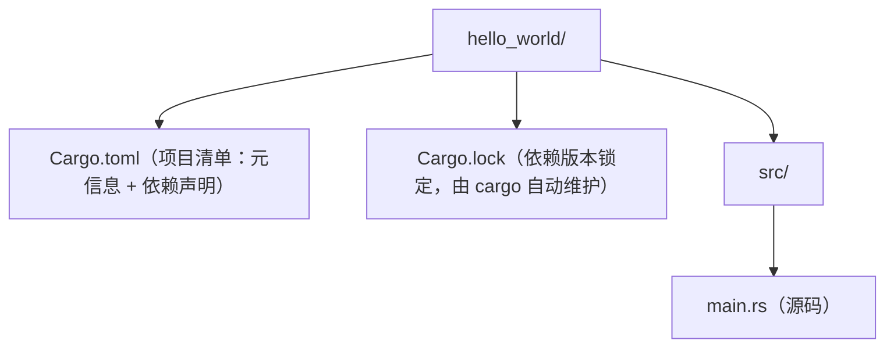

<!-- ============ 文档分隔线：041-rust/001-RustOverview.md ============ -->

> 本节为增量补充，帮助你选择 Rust 版本。

- Rust：1.97（2026-07-09）为当前稳定版；官方每 6 周发布一次小版本，建议始终跟随最新稳定版。
- Edition 2024 自 1.85 起稳定，新项目在 Cargo.toml 中声明 edition = "2024"。
- 生态：Cargo 是统一构建/依赖/测试/文档入口；Web 后端常用 axum + tokio，跨平台桌面常用 Tauri。


## 1. 从"给汽车装安全气囊"说起

### 1.1 Rust 是什么

想象一个汽车品牌（Rust）的卖点：**性能不输赛车（C/C++），但自带安全气囊（编译期内存安全）**——你在踩油门之前，安全系统已经检查过一切。

Rust 是一门系统级编程语言，由 Mozilla 资助开发，2015 年发布 1.0 版本。它的设计目标是在不牺牲性能的前提下提供内存安全：所有内存错误（空指针、悬垂引用、数据竞争、缓冲区溢出）都在编译期被拒绝，而不是等到运行时崩溃或被攻击者利用。

Rust 的 slogan 是"性能、可靠、生产力"（Performance, Reliability, Productivity）。它没有垃圾回收器（GC），也没有运行时开销，却通过所有权（ownership）系统在编译期管理内存。这使它成为 C/C++ 的有力竞争者，并被 Linux 内核、Windows、Cloudflare、Discord 等大型项目采用。

### 1.2 三种语言流派的定位

| 流派 | 代表 | 内存安全方式 | 性能 | 学习成本 |
| :--- | :--- | :--- | :--- | :--- |
| 系统级 | C/C++ | 手动管理 | 最高 | 高（且易出错） |
| 托管 | Java/Go/Python | 垃圾回收 | 中 | 中低 |
| **系统级+安全** | **Rust** | **编译期所有权** | **最高** | **中高（陡但值）** |

## 2. 为什么需要 Rust

### 2.1 C/C++ 的安全困境

C 语言自 1972 年以来一直是系统编程的主力，但内存安全漏洞（缓冲区溢出、use-after-free）占所有安全漏洞的相当比例。微软与 Google 的统计均显示，其产品中约 70% 的安全漏洞与内存安全相关。C++ 提供了 RAII 与智能指针，但默认仍然不安全：裸指针、手动 delete、迭代器失效仍然可以轻易触发未定义行为。

**一个真实的痛点**：Chrome 浏览器历年的高危漏洞中，约 70% 属于内存安全类——这正是 Google 推动 Rust 进入 Chromium 的原因。**"编译期就把这类 bug 消灭"是 Rust 的核心价值。**

### 2.2 托管语言的性能天花板

Java、Go、Python 等语言通过 GC 或运行时获得安全性与开发效率，但代价是内存占用与延迟不可控。对操作系统、数据库引擎、游戏引擎、嵌入式设备而言，GC 停顿与运行时体积不可接受。

Rust 的定位是填补空白：拥有 C 级别的性能，同时拥有比 Java 更强的编译期安全保障。

## 3. 核心概念速览

### 3.1 所有权（Ownership）

每个值在任意时刻只有一个所有者（owner）。当所有者离开作用域，值被自动释放（drop）。这替代了 GC 与手动 free。

```rust
fn main() {
    let s = String::from("hello"); // s 拥有字符串
    let t = s;                     // 所有权转移（move）到 t
    // println!("{s}");            // 错误：s 已失效
    println!("{t}");               // t 可以正常使用
}
```

讲解：`let t = s` 不发生深拷贝，而是把所有权从 s 转移给 t；此后 s 不可再使用。编译器在编译期强制执行这一规则，杜绝 double-free 与 use-after-free。

### 3.2 借用（Borrowing）

不转移所有权，而是临时借用：`&T` 不可变借用（可多个），`&mut T` 可变借用（唯一）。

```rust
fn len(s: &String) -> usize {
    s.len() // 只读借用，不获取所有权
}

fn main() {
    let s = String::from("hello");
    println!("{}", len(&s)); // 借用后 s 仍可用
}
```

讲解：借用规则在编译期检查：同一数据不能同时存在可变借用与不可变借用。这一规则让 Rust 在编译期就消除了数据竞争。

### 3.3 生命周期（Lifetime）

引用必须在其指向的值存活期间有效。多数情况下编译器能自动推断；复杂场景需要标注。

```rust
fn longest<'a>(x: &'a str, y: &'a str) -> &'a str {
    if x.len() > y.len() { x } else { y }
}
```

讲解：`<'a>` 声明生命周期参数，表示返回值引用与两个参数具有相同的有效范围。这保证返回的引用不会悬垂。

### 3.4 模式匹配与枚举

Rust 的 `enum` 是代数数据类型（ADT），配合 `match` 表达穷尽性检查：

```rust
enum Result<T, E> {
    Ok(T),
    Err(E),
}

fn parse(s: &str) -> Result<i32, String> {
    s.parse::<i32>().map_err(|_| format!("无法解析: {s}"))
}

fn main() {
    match parse("42") {
        Ok(v) => println!("解析成功: {v}"),
        Err(e) => println!("解析失败: {e}"),
    }
}
```

讲解：`Result` 是标准库的错误处理枚举；`match` 必须覆盖所有分支，因此不会漏掉错误路径。

## 4. Cargo 与工具链

Cargo 是 Rust 的构建系统与包管理器，功能类似 npm/Maven 的组合：

```bash
cargo new my-project     # 创建新项目
cargo build              # 构建（debug）
cargo build --release    # 优化构建
cargo run                # 运行
cargo test               # 运行测试
cargo fmt                # 格式化
cargo clippy             # 静态检查
cargo doc                # 生成文档
```

依赖在 `Cargo.toml` 中声明，从 crates.io 下载；`Cargo.lock` 锁定版本保证可复现构建。

```toml
[package]
name = "my-project"
version = "0.1.0"
edition = "2024"

[dependencies]
serde = { version = "1", features = ["derive"] }
tokio = { version = "1", features = ["full"] }
```

讲解：edition 是 Rust 的兼容性里程碑（2015/2018/2021/2024），新项目应使用最新 edition。

## 5. 标准库与常用生态

标准库（std）提供：集合（Vec、HashMap）、字符串（String、&str）、错误处理（Result、Option）、并发（线程、channel、原子）、I/O 与文件系统。

常用第三方生态：

| 领域 | crate | 说明 |
| --- | --- | --- |
| Web 后端 | axum / actix-web | 异步 HTTP 框架 |
| 异步运行时 | tokio | 事件驱动运行时 |
| 序列化 | serde | JSON/二进制序列化 |
| 命令行 | clap | 参数解析 |
| 日志 | tracing / log | 结构化日志与追踪 |
| 测试 | criterion | 基准测试 |
| 嵌入式 | embedded-hal | 硬件抽象 |
| WebAssembly | wasm-bindgen | JS 互操作 |

## 6. Rust 与其他语言的对比

### 6.1 Rust 与 C

Rust 提供与 C 相当的性能，但默认内存安全；C 语法简单、生态庞大，适合嵌入式与遗留系统。新系统项目应评估 Rust。

### 6.2 Rust 与 C++

C++ 功能最全、生态最成熟，但安全依赖纪律；Rust 用类型系统强制安全，工具链（cargo/clippy）更现代。游戏引擎与既有 C++ 代码库通常继续用 C++，新模块可用 Rust（FFI）。

### 6.3 Rust 与 Go

Go 语法简单、并发模型友好、编译快；Rust 控制精细、无 GC、性能上限更高。服务端选型：追求开发速度与生态用 Go，追求极致性能与资源控制用 Rust。

## 7. 学习路线建议

第一阶段（2-4 周）：所有权、借用、生命周期、基本类型与模式匹配；每天用 cargo 写小练习。

第二阶段（4-8 周）：错误处理、泛型与 trait、集合与迭代器、测试；读《Rust 程序设计语言》（TRPL）。

第三阶段（2-3 月）：异步（tokio）、Web 服务（axum）、serde 序列化、与 C 互操作；完成一个实战项目。

持续：读标准库源码、参与开源、用 clippy 保持代码质量。

## 8. 常见误区与注意事项

误区一：把 Rust 当成"更难写的 C"。Rust 的难度来自安全约束，但编译器错误信息非常友好，跟随提示修改即可。

误区二：到处用 `clone()` 逃避借用检查。clone 有性能成本；先理解借用与生命周期，再决定是否 clone。

误区三：滥用 `unwrap()`。生产代码应使用 `Result` 与 `?` 传播错误。

误区四：忽视异步生态的选型。tokio 是事实标准，团队应统一。

误区五：以为 Rust 只适合系统编程。它同样适合 Web 后端（axum）、CLI 工具、WebAssembly、数据处理——生态已经相当成熟。

## 11. 小结

Rust 是系统编程领域近十年最重要的语言创新：所有权系统把内存安全从"运行时检查"提升到"编译期保证"。学习 Rust 不仅获得一门语言，更能加深对内存、并发与编译原理的理解——这些知识对所有语言都有迁移价值。

**给初学者的建议**：不要被"所有权很可怕"的传闻吓退。先跟着 TRPL 前几章把"移动/借用/生命周期"三个概念过一遍，再动手写小项目——一旦编译器"教"会你它的思考方式，你会感谢它的严格。

<!-- ============ 文档分隔线：041-rust/002-RustEnvSetup.md ============ -->

## 1. 环境搭建前须知

学习 Rust 前，先理解它的工具链构成：Rust 由三部分组成——编译器（rustc）、构建与包管理工具（Cargo）、以及官方安装器（rustup）。

| 工具 | 作用 | 类比 |
| --- | --- | --- |
| rustup | 安装/管理 Rust 工具链，可切换稳定版、测试版 | nvm（Node 版本管理） |
| rustc | 编译器，把 .rs 源码编译为可执行文件 | gcc / clang |
| cargo | 项目构建、依赖管理、测试、发布 | npm + webpack 的组合 |

建议在 Windows 上使用 WSL2 或原生安装，二者均可；本教程以原生 Windows 安装为例。

## 2. 使用 rustup 安装

打开终端（PowerShell），访问官方安装页 https://rustup.rs/ 复制安装命令执行：

```bash
# Windows PowerShell 中执行
winget install Rustlang.Rustup
# 或从 https://rustup.rs/ 下载 rustup-init.exe 后运行
```

Linux / macOS 使用：

```bash
curl --proto '=https' --tlsv1.2 -sSf https://sh.rustup.rs | sh
```

讲解：rustup-init 安装的是 rustup 加最新稳定版工具链（stable）。安装完成后需要把 `%USERPROFILE%\.cargo\bin` 加入 PATH（安装器通常自动配置）。

验证安装：

```bash
rustc --version   # 例如 rustc 1.85.0
cargo --version   # 例如 cargo 1.85.0
```

讲解：若提示"command not found"，说明 PATH 未生效，请重开终端或手动把 `~/.cargo/bin` 加入 PATH。

## 3. 安装开发插件

编写 Rust 推荐 VS Code + rust-analyzer 插件：

| 插件 | 用途 |
| --- | --- |
| rust-analyzer | 代码补全、跳转、类型提示、错误波浪线（核心） |
| CodeLLDB | 断点调试 |
| Even Better TOML | Cargo.toml 高亮与补全 |
| crates | 依赖版本提示与升级 |

安装命令（VS Code 命令行）：`code --install-extension rust-lang.rust-analyzer`

讲解：rust-analyzer 会在你输入时即时分析代码，是 Rust 开发体验的关键；首次打开项目时它会后台编译索引，稍等片刻。

## 4. 创建第一个项目

用 cargo 新建项目并运行：

```bash
cargo new hello_world
cd hello_world
cargo run
```

讲解：`cargo new` 生成项目骨架（src/main.rs 与 Cargo.toml）；`cargo run` 编译并执行。控制台输出 `Hello, world!` 即成功。

```rust
// src/main.rs —— cargo new 自动生成的代码
fn main() {
    println!("Hello, world!");
}
```

讲解：`fn main()` 是程序入口；`println!` 是输出宏（注意是宏，带感叹号）；语句以分号结尾。

## 5. Cargo 项目结构



`Cargo.toml` 是项目的核心配置文件：

```toml
[package]
name = "hello_world"
version = "0.1.0"
edition = "2024"

[dependencies]
# 在此声明第三方依赖，例如：
# serde = { version = "1", features = ["derive"] }
```

讲解：`[package]` 段描述项目本身；`edition` 指定语言版本（新项目用 2024）；`[dependencies]` 段声明第三方库，cargo 会从 crates.io 自动下载。

## 6. 常用 cargo 命令

| 命令 | 作用 |
| --- | --- |
| cargo new <name> | 新建二进制项目 |
| cargo build | 编译（debug 模式） |
| cargo build --release | 编译（优化模式，用于发布） |
| cargo run | 编译并运行 |
| cargo check | 只做类型检查，不生成二进制（最快） |
| cargo test | 运行单元测试 |
| cargo fmt | 自动格式化代码 |
| cargo clippy | 静态检查，发现潜在问题 |
| cargo doc --open | 生成并打开依赖文档 |

开发循环建议：写代码 → `cargo check` 快速验证 → `cargo clippy` 检查质量 → `cargo test` 验证功能。

## 7. 常见问题排查

问题一：rustc 更新后旧项目无法编译。执行 `rustup update` 更新工具链；`cargo update` 更新依赖。

问题二：依赖下载缓慢。配置国内镜像源，在 `~/.cargo/config.toml` 中设置：

```toml
[source.crates-io]
replace-with = 'rsproxy'

[source.rsproxy]
registry = "sparse+https://rsproxy.cn/index/"
```

讲解：稀疏协议（sparse）比旧版 git 协议下载快数倍；更换镜像后删除 Cargo.lock 中缓存再重新 build 即可。

问题三：编辑器无智能提示。确认已安装 rust-analyzer 并重新加载窗口；检查项目根目录是否有 Cargo.toml。

## 10. 小结

环境搭建的核心是"rustup 管工具链、cargo 管项目、rust-analyzer 管编辑体验"。完成本课后，你已经能用 cargo 创建、编译、运行、测试 Rust 项目。下一步进入基础语法，学习变量、类型与函数。

> **一句话记忆**：Rust 环境三件套——"rustup 装工具链、cargo 建项目、rust-analyzer 给智能提示"；日常开发循环是 `cargo check`（快速验证）→ `cargo clippy`（查质量）→ `cargo test`（验功能）。

<!-- ============ 文档分隔线：041-rust/003-RustBasicSyntax.md ============ -->

## 1. 从"写便签"说起：变量与不可变性

想象你在一张便签上写字。Rust 的默认规则是：**便签写完就不能改**（不可变），除非你特意用记号笔标了"可改"（`mut`）。

Rust 变量默认不可变（immutable），这是安全设计的第一课：

```rust
fn main() {
    let x = 5;
    // x = 6;  // 错误：不可变变量不能赋值
    println!("x = {x}");

    let mut y = 5; // mut 声明可变
    y = 6;         // 合法
    println!("y = {y}");
}
```

讲解：`let` 声明变量，默认只读；需要修改时显式加 `mut`。这迫使程序员"默认不改、显式才改"，从源头减少状态变更带来的 bug。

`const` 与 `static` 是另外两种常量形式：

```rust
const MAX_SIZE: u32 = 100;          // 编译期常量，必须标注类型
static APP_NAME: &str = "FANDEX";   // 全局静态变量
```

讲解：`const` 可内联进使用处，无运行时开销；`static` 有固定内存地址，适合全局配置。

### 1.1 变量遮蔽（Shadowing）

```rust
let x = 5;
let x = x + 1;        // 新 x 遮蔽旧 x，类型可变
let x = x.to_string(); // 甚至可以改变类型
```

讲解：遮蔽允许重用变量名而无需 `mut`，常用于数值逐步变换的场景；它与"可变"的区别是：遮蔽是创建新变量。

## 2. 标量类型

Rust 的四大标量类型：

| 类型 | 说明 | 示例 |
| --- | --- | --- |
| 整数 | i8~i128、u8~u128、isize/usize | `let a: i32 = -5;` |
| 浮点 | f32、f64（默认 f64） | `let b: f64 = 3.14;` |
| 布尔 | bool | `let c = true;` |
| 字符 | char（4 字节，支持 Unicode） | `let d = '中';` |

```rust
fn main() {
    let a: i32 = 42;          // 整数，默认 i32
    let b = 3.14;             // 浮点，默认 f64
    let c: bool = true;
    let d: char = 'R';        // 单引号表示字符
    println!("{a} {b} {c} {d}");
}
```

讲解：整数带符号用 i 前缀（可正可负），无符号用 u；`usize` 与指针大小一致，常用于索引。数字字面量支持下划线分隔：`let big = 1_000_000;`。

运算与溢出：`+ - * / %` 与多数语言一致。debug 模式下溢出会 panic，release 模式按回绕（wrapping）处理：

```rust
let sum = 200u8 + 100u8;  // debug 下 panic，release 下回绕为 44
let safe = 200u8.wrapping_add(100); // 显式回绕，结果 44
```

讲解：需要处理溢出边界时，优先用 `wrapping_add`、`checked_add`（返回 Option）等显式方法，而不是依赖 debug/release 差异。

## 3. 元组与数组

复合类型用于把多个值组合在一起。

### 3.1 元组（Tuple）

```rust
let tup: (i32, f64, char) = (42, 3.14, 'R');
let (x, y, z) = tup;          // 解构（destructure）
println!("{x} {y} {z}");
println!("{}", tup.0);        // 索引访问，tup.0 即 42
```

讲解：元组可容纳不同类型、长度固定；解构一次性取出多个值，索引访问按位置取单个值。

### 3.2 数组（Array）

```rust
let arr: [i32; 3] = [1, 2, 3]; // 类型 + 长度
let zeros = [0; 5];            // 5 个 0，等价于 [0,0,0,0,0]
println!("{}", arr[0]);        // 越界会 panic
```

讲解：数组长度编译期确定、存于栈上；越界访问在运行时 panic（安全性：不会读到脏内存）。需要动态长度时用 Vec（见 007 篇）。

## 4. 函数

```rust
fn add(a: i32, b: i32) -> i32 {
    a + b          // 最后一个表达式即返回值，无分号
}

fn main() {
    let r = add(1, 2);
    println!("{r}");
}
```

讲解：函数参数必须标注类型；返回值用 `-> 类型` 声明。Rust 是表达式语言：函数体最后一行不加分号就作为返回值；加了分号则变成语句，返回 `()`。

```rust
fn greet() {                  // 无返回值，隐式返回 ()
    println!("hello");
}
```

讲解：`main` 返回 `()` 或 `Result`；早期函数提前返回用 `return` 关键字，与 C 系语言一致。

## 5. 控制流

### 5.1 if 表达式

```rust
let score = 85;
let grade = if score >= 90 { "A" } else if score >= 80 { "B" } else { "C" };
println!("grade = {grade}");
```

讲解：`if` 是表达式，可以赋值给变量；各分支必须返回同类型。注意没有三元运算符，`if/else` 就是替代品。

### 5.2 loop 循环

```rust
let mut count = 0;
let result = loop {
    count += 1;
    if count == 10 {
        break count * 2;   // break 可带出值
    }
};
println!("result = {result}");
```

讲解：`loop` 是无限循环，配合 `break` 退出；`break` 可以携带表达式作为 loop 的返回值。嵌套循环可用标签精确跳出：

```rust
'outer: loop {
    loop {
        break 'outer;  // 直接跳出外层循环
    }
}
```

### 5.3 while 与 for

```rust
let mut n = 3;
while n > 0 {
    println!("{n}");
    n -= 1;
}

// for 遍历区间（Range）
for i in 1..=5 {           // 1..5 不含 5；1..=5 含 5
    println!("{i}");
}

// for 遍历数组（推荐用法）
let arr = [10, 20, 30];
for v in arr {
    println!("{v}");
}
```

讲解：`for` 是遍历的首选——没有索引越界风险，配合迭代器可读性最佳；`while` 适合条件驱动场景。

## 6. 综合示例

用循环与函数求 1 到 100 的奇数和：

```rust
fn sum_odd(limit: u32) -> u32 {
    let mut total = 0;
    for i in 1..=limit {
        if i % 2 == 1 {
            total += i;
        }
    }
    total
}

fn main() {
    println!("{}", sum_odd(100)); // 输出 2500
}
```

讲解：把逻辑封装为函数、用 `for` 区间遍历、`if` 过滤、累加后返回——这是 Rust 最小可读的"算法骨架"。

## 7. 常见错误与对策

| 编译错误 | 原因 | 对策 |
| :--- | :--- | :--- |
| cannot assign to immutable variable | 给不可变变量赋值 | 声明时加 `mut`，或改用遮蔽 |
| mismatched types | 类型不匹配 | 检查字面量后缀或显式标注类型 |
| expected `()` | 函数多写了分号 | 去掉最后表达式的分号 |
| index out of bounds | 数组越界 | 用迭代器遍历，避免手动索引 |

## 10. 小结

本课覆盖变量、标量/复合类型、函数与控制流。核心记忆点：变量默认不可变（mut 显式可变）、表达式有值（if/loop 可返回）、for 优先于 while 做遍历。下一步学习 Rust 的灵魂——所有权与借用。

> **一句话记忆**：Rust 基础语法三件套——"变量默认只读（要改就 mut）、表达式都有值（if/loop 能返回）、遍历用 for（无越界风险）"；把这三条内化，写任何 Rust 代码都不会迷路。

<!-- ============ 文档分隔线：041-rust/004-RustOwnershipBorrowing.md ============ -->

## 1. 从"图书馆借书"说起：为什么需要所有权

### 1.1 内存管理的三难问题

任何语言都要回答一个问题：**谁负责内存的分配与释放？** 三种流派各有取舍：

| 流派 | 代表语言 | 机制 | 问题 |
| :--- | :--- | :--- | :--- |
| 手动管理 | C/C++ | 程序员 malloc/free | 悬垂指针、double-free、内存泄漏 |
| 垃圾回收 | Java/Go/Python | 运行时 GC | 停顿、内存开销 |
| **所有权** | **Rust** | **编译期静态检查** | 学习曲线陡 |

**Rust 选择了第三条路：所有权（Ownership）**——在**编译期**确定每个值的生命周期，既无 GC 停顿、也无手动释放，安全且零开销。

### 1.2 图书馆的类比

想象图书馆的管理规则：

- **每本书只有一个"借书人"**（值有且只有一个所有者）
- 借书人**离开图书馆时**必须把书放回（所有者离开作用域，值自动释放）
- 借书人**可以把书转借给另一个人**，转借后原借书人失去资格（所有权转移）

Rust 的所有权系统就是这套"图书馆规则"：编译器像一个严格的图书管理员，在代码编译时逐行检查"谁在管理这本书"，任何违规（比如两个人都声称拥有这本书）直接拒绝编译。

**Rust 的承诺**：所有内存错误（空指针、悬垂引用、数据竞争、缓冲区溢出）在**编译期**就被拒绝——不是"尽量安全"，而是"编译不过"。

## 2. 所有权三规则

**规则一**：每个值有且只有一个所有者（owner）变量。

**规则二**：所有者离开作用域时，值被自动释放（drop）。

**规则三**：值可以被转移（move）给新的所有者，旧所有者随即失效。

```rust
fn main() {
    let s = String::from("hello"); // s 是 String 的所有者
    println!("{}", s.len());
} // 此处 s 离开作用域，String 的内存自动释放
```

**解读**：

- `String::from` 在堆上分配内存，`s` 持有它的所有权
- 无需手动 `free`——离开作用域即析构（Rust 自动调用 drop）
- 栈上的整数等类型同样适用此规则，只是释放成本趋近于零

**关键认知**：Rust 没有 GC，内存释放靠"所有者离开作用域"这个可预测的时机。这就是为什么 Rust 能做到"零开销抽象"。

## 3. 移动（Move）与复制（Copy）

### 3.1 移动语义

```rust
let s1 = String::from("hello");
let s2 = s1;              // 所有权转移（move）
// println!("{s1}");      // 错误：s1 已失效
println!("{s2}");         // 正常
```

**为什么不能再用 s1**：`let s2 = s1` 没有深拷贝堆数据，只是把"指针+长度+容量"这三块栈数据转移给 s2，并让 s1 失效。

**这避免了两个严重问题**：

1. **double-free**：如果 s1、s2 都有效，离开作用域时同一块内存会被释放两次（崩溃）
2. **悬垂指针**：如果 s1 先被释放，s2 就成了悬垂引用

**代价是零**：转移只是拷贝几个字节的栈数据，堆数据原封不动。而编译器会阻止继续使用 s1——**移动不是隐藏的深拷贝，而是所有权转移**。

### 3.2 Copy 类型

像整数、布尔、浮点这样的"纯栈上数据"，赋值是**按位复制**，不会移动：

```rust
let a = 5;
let b = a;   // a 仍然可用，因为 i32 实现了 Copy
println!("{a} {b}"); // 输出 5 5
```

**Copy 与 Move 的判断标准**：

- **实现了 `Copy` trait 的类型**（标量、元组内全 Copy、`&T` 引用）：赋值即复制，原变量仍可用
- **`String`、`Vec` 等堆类型**：实现的是 `Move`，赋值后原变量失效

> **规则**：实现 Copy 的类型赋值后原变量仍可用，否则原变量失效。`String` 不能实现 Copy，因为深拷贝代价高；移动则是零成本的"改名"。

### 3.3 函数传参与返回

```rust
fn take(s: String) { /* 消耗传入的所有权 */ }
fn give() -> String { String::from("new") }

fn main() {
    let s = String::from("x");
    take(s);            // s 的所有权被函数消耗
    // println!("{s}"); // 错误：s 已 move 进函数

    let t = give();     // 返回值转移所有权给 t
}
```

**模式**：把所有权交给函数（消耗）、让函数返回所有权（产出），是 Rust 管理资源的基本节奏。但每次都这样传来传去很繁琐——**借用**就是为此而生。

## 4. 借用与引用

### 4.1 不可变引用：只借不拿

不想转移所有权、只想"借来看看"，用引用 `&T`：

```rust
fn calc_len(s: &String) -> usize {
    s.len()          // 只读访问，不获取所有权
}

fn main() {
    let s = String::from("hello");
    let len = calc_len(&s);
    println!("{len}");       // s 仍可用
}
```

**解读**：`&s` 创建不可变引用（借用），借出期间原所有者不受影响，借完自动归还。可以同时存在**多个**不可变引用（多个读者同时看书没问题）。

### 4.2 可变引用：独占借用

```rust
fn push_hello(s: &mut String) {
    s.push_str(", world");
}

fn main() {
    let mut s = String::from("hello");
    push_hello(&mut s);
    println!("{s}");
}
```

**核心约束（Rust 内存安全的关键）**：

> **同一时刻，一个值要么有多个不可变借用，要么只有一个可变借用。二者不可同时存在。**

```rust
let mut s = String::from("hi");
let r1 = &s;          // 不可变借用，可以
let r2 = &s;          // 多个不可变借用，可以（读读不冲突）
let r3 = &mut s;      // 错误：已有不可变借用时不能再创建可变借用
```

**这条规则在编译期消灭了数据竞争**：

- 数据竞争 = 多个线程同时读写同一内存
- Rust 规则：写（可变借用）必须独占，读（不可变借用）可以并行
- 无论单线程还是多线程，这条规则都成立——**数据竞争在编译期就被拒绝**

### 4.3 借用作用域（NLL）

```rust
let mut s = String::from("hi");
let r = &s;              // r 的借用开始
println!("{r}");         // 最后一次使用 r
let m = &mut s;          // 此时 r 已不再使用，可以创建可变借用
m.push_str("!");
```

**借用结束于最后一次使用（NLL，非词法生命周期）**。上例中 r 打印后就不再被使用，可变借用随后合法。

**实用技巧**：借用冲突时，通常可以"缩小借用作用域"解决——把借用的使用范围控制在最小区域，让借用尽早结束。

## 5. 切片（Slice）：数据的"窗口视图"

切片是对连续数据的一段**借用**视图，无所有权。字符串切片 `&str` 是最常见的：

```rust
let s = String::from("hello world");
let hello = &s[0..5];     // "hello"
let world = &s[6..];      // "world"（6 到末尾）
println!("{hello} {world}");
```

**注意（字节 vs 字符）**：切片范围是**字节索引**。中文字符占 3 字节，按字节切可能 panic（多字节边界需谨慎）。处理中文建议用 `.chars()` 迭代。

字符串字面量本身就是 `&str`：

```rust
let greeting: &str = "你好";  // "你好" 是编译期内置的 &str
```

数组切片：

```rust
let arr = [1, 2, 3, 4, 5];
let mid = &arr[1..4];       // [2, 3, 4]，类型 &[i32]
for v in mid {
    println!("{v}");
}
```

### 5.1 参数用切片而非引用（重要最佳实践）

**函数接收参数时优先用切片而非 `&String`/`&Vec`**，因为 `&str`/`&[T]` 能同时接收字面量、String、数组，通用性更强：

```rust
fn first_word(s: &str) -> &str {
    match s.find(' ') {
        Some(i) => &s[..i],
        None => s,
    }
}

fn main() {
    let s = String::from("hello world");
    println!("{}", first_word(&s));      // 传 &String 可自动转为 &str
    println!("{}", first_word("hi ok")); // 直接传字面量
}
```

**为什么参数写 `&str` 最灵活**：

- `&String` 可自动强转为 `&str`（deref coercion）
- 字面量、`&String`、`&Vec` 都能传给 `&str` 参数
- 返回的切片生命周期与输入绑定，保证不会悬垂

## 6. 生命周期：编译器怎么知道"引用还活着"

### 6.1 为什么要生命周期标注

引用必须保证"被引用的值还活着"。多数时候编译器能自动推断（NLL），但某些情况下需要显式标注：

```rust
fn longest<'a>(x: &'a str, y: &'a str) -> &'a str {
    if x.len() > y.len() { x } else { y }
}
```

**解读**：

- `'a` 是一个**生命周期参数**，声明"x、y、返回值共享同一个生命周期"
- 含义：返回值的存活时间，不会超过 x 和 y 中较短的
- 编译器用这个约束检查调用点：**如果返回值在某个参数失效后还在用，编译失败**

### 6.2 三种常见模式

| 模式 | 写法 | 场景 |
| :--- | :--- | :--- |
| 省略（自动） | `fn f(x: &str) -> &str` | 单个输入引用，返回其引用 |
| 多个输入需标注 | `fn f<'a>(x: &'a str, y: &'a str) -> &'a str` | 多个引用，需关联 |
| 结构体含引用 | `struct S<'a> { s: &'a str }` | 结构体持有引用 |

**实用建议**：生命周期标注是"编译器需要帮助时的工具"。90% 的代码用**省略规则**自动推断；只有返回引用且涉及多个输入时，才需要显式标注。不必一开始就掌握全部细节，先理解"生命周期防止悬垂引用"这个核心思想即可。

## 7. 综合示例：统计单词数

```rust
fn count_words(text: &str) -> usize {
    text.split_whitespace().count()
}

fn main() {
    let text = String::from("Rust ownership is safe");
    println!("{}", count_words(&text)); // 输出 4
    println!("{}", count_words("你好 Rust")); // 输出 2
}
```

**解读**：全程只借用不拷贝；`split_whitespace` 返回迭代器直接数个数，零分配。所有权系统的收益在此体现：简洁、安全、无 GC、无手动释放。

## 8. 常见错误与对策

| 编译错误 | 原因 | 对策 |
| :--- | :--- | :--- |
| use of moved value | 使用了已转移所有权的变量 | 改用引用传参，或 clone 一份 |
| cannot borrow as mutable | 同时存在不可变与可变借用 | 缩小借用作用域，或调整借用顺序 |
| cannot move out of borrowed content | 尝试从借用中拿走所有权 | 用 clone 或返回引用 |
| temporary value dropped | 引用指向了临时值 | 用变量持有临时值再借用 |
| lifetime may not live long enough | 返回值可能悬垂 | 检查返回值是否关联输入的生命周期 |

**通用调试手段**：

1. 遇到借用错误时，按编译器提示信息（E0502/E0505 等）逐条阅读
2. rust-analyzer 会标注问题行
3. 必要时用 `clone()` 快速通过，再回头优化为引用
4. **先编译通过，再优化借用**——编译器是最好的老师，它的提示几乎总是指向正确方向

## 11. 小结

所有权三规则（每值一主、主离即释、可转不移）+ 借用两条约束（不可变可并行、可变要独占）+ 切片视图（零拷贝的窗口）+ 生命周期（防止悬垂），构成了 Rust 内存安全的地基。

理解"移动 vs 复制""借用 vs 拥有"两组对立概念，就能读懂编译器的大部分报错——**Rust 编译器不是敌人，而是全天候的导师**。下一步学习结构体、枚举与模式匹配（见《结构体、枚举与模式匹配》），把这些机制组合成真实的数据结构。

> **一句话记忆**：Rust 用"所有权"替代"手动管理/GC"——每个值一个主人、主人离开作用域自动释放、转移所有权后旧主人失效；借用让"只借不拿"（`&T` 可多个，`&mut T` 要独占）成为可能，编译期就消灭了悬垂引用与数据竞争。

<!-- ============ 文档分隔线：041-rust/005-RustBorrowCheckerErrorGuide.md ============ -->

# 借用检查器报错实战

> 本篇为占位文档：主题已规划进学习路径，正文内容待补全。

**计划覆盖要点**：

- 所有权与借用高频错误清单
- E0382 值被移动后使用
- E0502 可变与不可变借用冲突
- E0597 引用生命周期不足
- 修复套路与替代设计

<!-- ============ 文档分隔线：041-rust/006-RustStructEnumMatch.md ============ -->

## 1. 从"登记表"说起：结构体（Struct）

想象一张学员登记表：姓名、年龄、是否活跃——几个字段合在一起，就是一个"学员"的整体信息。**结构体就是把多个字段组合成一个自定义类型**，是组织数据的基本单位。

```rust
struct User {
    name: String,
    age: u8,
    active: bool,
}

fn main() {
    let user = User {
        name: String::from("张三"),
        age: 18,
        active: true,
    };
    println!("{} {}", user.name, user.age);
}
```

讲解：字段默认不可变；整个结构体需要修改时声明 `let mut user`。结构体没有构造函数的强制语法，直接用字面量初始化。

### 1.1 字段初始化简写与更新语法

```rust
fn build_user(name: String, age: u8) -> User {
    User {
        name,        // 字段名与变量名相同可简写
        age,
        active: true,
    }
}

let u1 = build_user(String::from("李四"), 20);
let u2 = User { age: 21, ..u1 }; // 其余字段从 u1 复制
```

讲解：`..u1` 展开其余字段，等价于逐字段拷贝；注意它会把 `name`（String）从 u1 中移动走，此后 u1 不能再整体使用。

### 1.2 元组结构体与单元结构体

```rust
struct Color(u8, u8, u8);   // 元组结构体：字段无名字
let red = Color(255, 0, 0);
println!("{}", red.0);      // 按索引访问

struct Marker;              // 单元结构体：无字段，常用于类型标记
```

讲解：元组结构体适合"只有一个主要属性"的轻量封装；单元结构体常配合 trait 做类型级标记。

## 2. 方法（impl）

用 `impl` 块为结构体定义方法：

```rust
struct Rectangle {
    width: u32,
    height: u32,
}

impl Rectangle {
    // 方法：&self 借用结构体，只读
    fn area(&self) -> u32 {
        self.width * self.height
    }
    // 可变方法：&mut self
    fn scale(&mut self, factor: u32) {
        self.width *= factor;
        self.height *= factor;
    }
    // 关联函数：没有 self，等价于静态方法，用 :: 调用
    fn square(side: u32) -> Rectangle {
        Rectangle { width: side, height: side }
    }
}

fn main() {
    let mut r = Rectangle { width: 3, height: 4 };
    println!("area = {}", r.area());   // 12
    r.scale(2);
    println!("area = {}", r.area());   // 48

    let s = Rectangle::square(5);      // 关联函数用 :: 调用
    println!("area = {}", s.area());
}
```

讲解：`self` 三种形态：`&self`（借用只读）、`&mut self`（可变借用）、`self`（获取所有权）；关联函数无 self，用 `Type::fn()` 调用。Rust 没有继承，复用靠 trait（见 008 篇）。

### 2.1 结构体打印调试

结构体默认不能打印，需要派生（derive）`Debug`：

```rust
#[derive(Debug)]
struct Rectangle { width: u32, height: u32 }

fn main() {
    let r = Rectangle { width: 3, height: 4 };
    println!("{r:?}");       // 单行调试输出
    println!("{r:#?}");      // 多行美化输出
}
```

讲解：`#[derive(Debug)]` 让编译器自动生成调试打印实现；`{:#?}` 美化格式在排查数据结构时非常常用。

## 3. 枚举（Enum）

枚举把"多种可能的状态"表达为一种类型：

```rust
enum Direction {
    North,
    South,
    East,
    West,
}

fn describe(d: Direction) -> &'static str {
    match d {
        Direction::North => "北",
        Direction::South => "南",
        Direction::East => "东",
        Direction::West => "西",
    }
}
```

枚举变体可以携带数据，这是 Rust 枚举（代数数据类型 ADT）的威力：

```rust
enum Shape {
    Circle(f64),                    // 元组变体：半径
    Rectangle { w: f64, h: f64 },   // 结构体变体
    Empty,                          // 单元变体
}

fn area(s: Shape) -> f64 {
    match s {
        Shape::Circle(r) => 3.14159 * r * r,
        Shape::Rectangle { w, h } => w * h,
        Shape::Empty => 0.0,
    }
}
```

讲解：每个变体可带不同类型的数据，match 时统一解构——"一个类型承载多种形态"比继承体系更简洁、更易穷尽检查。

## 4. match 模式匹配

`match` 是 Rust 的控制流之王：按模式逐个尝试分支，**必须穷尽所有可能**。

```rust
fn classify(n: i32) -> &'static str {
    match n {
        0 => "零",
        1..=9 => "个位数",
        10..=99 => "两位数",
        _ => "大数",      // _ 通配符兜底
    }
}
```

讲解：数值字面量、区间 `..=`、通配符 `_` 都可作为模式。`_` 兜底让 match 不必列出全部情况；若不加兜底则必须穷尽。

match 可以解构组合数据并绑定变量：

```rust
let pair = (10, "ok");
match pair {
    (0, msg) => println!("第一个是零，消息：{msg}"),
    (n, "ok") => println!("消息是 ok，数值 {n}"),
    (n, msg) => println!("其他：{n} {msg}"),
}
```

讲解：解构的同时绑定字段；`_` 可以出现在子位置忽略某字段：`(_, msg)`。

### 4.1 if let 简化

只关心一个分支时用 `if let` 更简洁：

```rust
let config = Some("debug");
if let Some(v) = config {
    println!("配置值：{v}");
} else {
    println!("无配置");
}
```

讲解：等价于只有一个分支的 match；`while let` 同理，用于循环中重复匹配（如迭代 Option 序列）。

## 5. Option：可空值的正确姿势

Rust 没有 null。可空值用 `Option<T>` 枚举表达：

```rust
enum Option<T> {
    Some(T),   // 有值
    None,      // 无值
}

fn divide(a: f64, b: f64) -> Option<f64> {
    if b == 0.0 { None } else { Some(a / b) }
}

fn main() {
    match divide(10.0, 2.0) {
        Some(v) => println!("结果：{v}"),
        None => println!("除数为零"),
    }
}
```

讲解：`Option<T>` 是标准库枚举，`Some`/`None` 可直接使用（prelude 自动导入）。编译器强制你处理 None 分支——**不存在空指针解引用**，因为空值必须显式处理。

Option 的常用方法：

| 方法 | 作用 | 示例 |
| --- | --- | --- |
| unwrap() | 取出值，None 则 panic | `x.unwrap()` |
| unwrap_or(default) | None 时用默认值 | `x.unwrap_or(0)` |
| map(f) | 对 Some 内值做转换 | `x.map(|v| v * 2)` |
| is_some() / is_none() | 判断 | `x.is_some()` |

```rust
let a = Some(10);
let b: Option<i32> = None;
println!("{}", a.unwrap_or(0));      // 10
println!("{}", b.unwrap_or(0));      // 0
println!("{}", b.map(|v| v * 2).is_none()); // true
```

讲解：生产代码慎用 `unwrap()`（会 panic），先用 `unwrap_or` 或 match 显式处理；`?` 运算符在 006 篇错误处理中讲解。

## 6. 综合示例：用枚举实现简单状态机

```rust
#[derive(Debug)]
enum OrderState {
    Pending,
    Paid(u32),          // 已支付，记录支付流水号
    Shipped(String),    // 已发货，记录物流单号
    Done,
}

fn next_state(s: OrderState) -> OrderState {
    match s {
        OrderState::Pending => OrderState::Paid(1001),
        OrderState::Paid(id) => OrderState::Shipped(format!("SF{id}")),
        OrderState::Shipped(_) => OrderState::Done,
        OrderState::Done => OrderState::Done, // 终态
    }
}

fn main() {
    let mut state = OrderState::Pending;
    for _ in 0..3 {
        state = next_state(state);
        println!("{state:?}");
    }
}
```

讲解：枚举 + match 天然适合状态机：非法迁移在编译期难以表达，运行时靠 match 穷尽保证每一步都有处理。

## 7. 常见错误与对策

| 编译错误 | 原因 | 对策 |
| :--- | :--- | :--- |
| non-exhaustive patterns | match 未覆盖所有分支 | 补上剩余分支，或加 `_` 兜底 |
| no method named `area` | 结构体未定义该方法 | 用 `impl` 块添加方法 |
| `Rectangle` cannot be formatted | 结构体未实现 Debug | 加 `#[derive(Debug)]` |
| type `Option<T>` cannot be used with `?` | Option 与 Result 混用 | 用 `ok_or` 转换类型 |

## 10. 小结

结构体组织数据、impl 定义行为、枚举表达状态、match 穷尽处理分支、Option 消灭空指针。这五件套是 Rust 建模日常业务的基本功。下一步学习错误处理：让程序在失败时给出优雅的反馈而非崩溃。

> **一句话记忆**：Rust 建模五件套——"struct 装数据、impl 给行为、enum 表状态、match 穷尽分支、Option 替代 null"；把 `Option` 当"必须处理的空值"，把 `match` 当"编译器替你检查有没有漏掉分支"。

<!-- ============ 文档分隔线：041-rust/007-RustErrorHandling.md ============ -->

## 1. 从"外卖送餐"说起：错误处理的两条路径

想象点外卖：**餐厅没营业**（不可恢复——这家店永远送不了）和 **今天路上堵车**（可恢复——换个时间或路线还能送到）是两种完全不同的情况，处理方式也该不同。

Rust 把错误分成两类，处理方式截然不同：

| 错误类型 | 场景 | 处理方式 |
| --- | --- | --- |
| 不可恢复错误 | 程序无法继续（如数组越界、断言失败） | panic：展开并退出（可配置为直接终止） |
| 可恢复错误 | 文件不存在、网络超时、解析失败 | `Result<T, E>`：返回错误值，由调用方决定 |

设计哲学：**用类型表达失败**——函数签名里的 `Result` 就是文档，调用方被迫处理错误，不存在"悄悄失败"。

## 2. panic：不可恢复错误

```rust
fn main() {
    let v = vec![1, 2, 3];
    println!("{}", v[99]); // 越界访问 -> panic
}
```

讲解：越界、整数溢出（debug 模式）、显式 `panic!("msg")` 都会触发。panic 会打印错误信息、源码位置与回溯栈，然后回滚当前线程栈并释放资源（unwind）。

```rust
fn main() {
    panic!("出错了");          // 显式触发
    assert!(1 > 2, "断言失败"); // 断言失败也会 panic
}
```

讲解：`assert!` 系列宏在测试与内部不变量检查中常用。`panic!` 应在"程序无法继续"时使用，普通业务失败不要用 panic。

## 3. Result：可恢复错误

标准库的 `Result` 枚举（带两个泛型参数）：

```rust
enum Result<T, E> {
    Ok(T),   // 成功，携带结果值
    Err(E),  // 失败，携带错误值
}
```

```rust
use std::fs::File;
use std::io::Read;

fn read_whole(path: &str) -> Result<String, std::io::Error> {
    let mut f = File::open(path)?;   // ? 失败则提前返回 Err
    let mut content = String::new();
    f.read_to_string(&mut content)?; // ? 自动转换错误类型（此处同为 io::Error）
    Ok(content)
}
```

讲解：`?` 是错误处理的语法糖：`Ok(v)` 则解出 v 继续，`Err(e)` 则立即把 e 返回给调用方。函数返回类型必须为 `Result`（或 `Option`）才能用 `?`。

### 3.1 处理 Result 的常见方式

```rust
use std::fs;

// 方式一：match 显式处理
match fs::read_to_string("a.txt") {
    Ok(text) => println!("内容：{text}"),
    Err(e) => eprintln!("读取失败：{e}"),
}

// 方式二：unwrap——成功取 Ok，失败 panic（仅原型/测试使用）
let text = fs::read_to_string("a.txt").unwrap();

// 方式三：expect——panic 时附带自定义信息
let text = fs::read_to_string("a.txt")
    .expect("a.txt 必须存在");

// 方式四：unwrap_or——失败用默认值兜底
let text = fs::read_to_string("a.txt").unwrap_or_default();
```

讲解：`unwrap`/`expect` 遇到 Err 会 panic，仅适合"这个错误不可能发生"或原型阶段；生产代码用 `?` 或 match 显式处理。`eprintln!` 输出到标准错误流。

### 3.2 Result 与 Option 互转

```rust
// ok_or：Option -> Result
let maybe: Option<i32> = Some(42);
let result = maybe.ok_or("值不存在")?;   // 得 Result<i32, &str>

// 常用组合：链式 + ok_or
let port: u16 = "8080"
    .parse::<u16>()
    .ok()
    .ok_or("端口格式错误")?;
```

讲解：`ok_or` 让 Option 也能用 `?` 传播错误；`ok()` 把 Result 降级为 Option。二者配合可统一"可空 + 可失败"的处理链。

## 4. 自定义错误类型

业务系统应定义自己的错误类型，而不是到处用字符串。推荐用 `thiserror` 派生宏简化样板：

```toml
[dependencies]
thiserror = "2"
```

```rust
use thiserror::Error;

#[derive(Debug, Error)]
enum AppError {
    #[error("配置缺失：{key}")]
    MissingConfig { key: String },

    #[error("网络错误：{0}")]
    Network(#[from] std::io::Error),

    #[error("解析失败：{0}")]
    Parse(String),
}

fn load_config() -> Result<String, AppError> {
    let raw = std::fs::read_to_string("config.toml")?; // io::Error 自动转 Network
    if raw.is_empty() {
        return Err(AppError::MissingConfig { key: "config.toml".into() });
    }
    Ok(raw)
}
```

讲解：`#[derive(Error)]` 自动实现 `Display`（按 `#[error(...)]` 模板）与 `std::error::Error`；`#[from]` 生成 `From` 转换，使 `?` 能自动把 `io::Error` 转成 `AppError::Network`。

纯标准库实现（不引依赖）的原理：

```rust
#[derive(Debug)]
struct MyError(String);

impl std::fmt::Display for MyError {
    fn fmt(&self, f: &mut std::fmt::Formatter<'_>) -> std::fmt::Result {
        write!(f, "自定义错误：{}", self.0)
    }
}
impl std::error::Error for MyError {}
```

讲解：`std::error::Error` trait 要求类型同时实现 `Debug` 与 `Display`；手写这段代码就是 thiserror 替你生成的内容。

## 5. 错误转换：让 ? 自动工作

`?` 依赖 `From` trait 把底层错误转换为函数声明的错误类型：

```rust
use std::fs;
use std::net::IpAddr;

fn load_and_parse() -> Result<IpAddr, Box<dyn std::error::Error>> {
    let raw = fs::read_to_string("ip.txt")?;  // io::Error -> Box<dyn Error>
    let ip: IpAddr = raw.trim().parse()?;     // ParseIntError -> Box<dyn Error>
    Ok(ip)
}
```

讲解：`Box<dyn Error>` 是"万能错误容器"，任何实现了 `Error` 的类型都能 `?` 进去——适合快速原型。大型项目建议用 thiserror 定义精确错误类型，便于调用方按类型分支处理。

## 6. main 函数返回 Result

main 返回 `Result` 时，Err 会以非零退出码结束程序并打印 Debug 信息：

```rust
use std::fs;

fn main() -> Result<(), Box<dyn std::error::Error>> {
    let content = fs::read_to_string("a.txt")?;   // 失败直接退出
    println!("{content}");
    Ok(())
}
```

讲解：这是小型 CLI 工具的标准写法：错误沿 `?` 一路向上，main 兜底退出。也常用 `Result<(), AppError>`。

## 7. 常见错误处理模式对比

| 场景 | 推荐写法 |
| --- | --- |
| 原型/教学代码 | unwrap / expect |
| 普通业务函数 | `?` + 自定义错误类型 |
| 命令行工具 | main 返回 Result |
| 配置缺失等"不可能"情况 | expect 带清晰信息 |
| 错误后继续处理其他任务 | match 分分支处理 |

## 8. 综合示例：小型文件统计工具

```rust
use std::fs;
use std::io;

fn count_lines(path: &str) -> Result<usize, io::Error> {
    let content = fs::read_to_string(path)?;
    Ok(content.lines().count())
}

fn main() -> Result<(), Box<dyn std::error::Error>> {
    for path in ["a.txt", "b.txt"] {
        match count_lines(path) {
            Ok(n) => println!("{path}: {n} 行"),
            Err(e) => eprintln!("{path}: 读取失败 {e}"),
        }
    }
    Ok(())
}
```

讲解：核心业务函数返回 `Result<_, io::Error>` 保持精确；main 用 `Box<dyn Error>` 兜底；外层循环逐文件容错——错误"能精确时精确、能继续时继续"。

## 11. 小结

错误处理三板斧：`Result` 表达失败、`?` 简化传播、自定义错误类型提升可读性；`panic` 只留给不可恢复场景。牢记：**panic 是异常，Result 是常态**。下一步学习集合与迭代器，掌握 Rust 的日常数据处理武器库。

> **一句话记忆**：Rust 错误处理三句话——"能恢复的用 `Result`（`?` 一路传播）、不能恢复的用 `panic!`、生产代码别用 `unwrap`"；用 thiserror 定义自己的错误类型，让 `?` 自动做类型转换。

<!-- ============ 文档分隔线：041-rust/008-RustCollectionsIterators.md ============ -->

## 1. 从"工具箱"说起：集合总览

想象一个工具箱（标准库集合）：**抽屉（Vec）放有序的物品**、**带标签的格架（HashMap）按名字找物品**、**去重盒（HashSet）保证东西不重复**。Rust 的集合就是为这些需求准备的"专业容器"。

标准库集合都存放在堆上，可动态增长。最常用的三个：

| 集合 | 说明 | 典型场景 |
| --- | --- | --- |
| Vec\<T\> | 动态数组，O(1) 索引 | 有序数据列表 |
| HashMap\<K, V\> | 哈希表，O(1) 按键查找 | 键值映射 |
| HashSet\<T\> | 哈希集合，元素唯一 | 去重、成员判断 |

## 2. Vec：动态数组

```rust
fn main() {
    let mut v: Vec<i32> = Vec::new();
    v.push(1);
    v.push(2);
    v.push(3);
    println!("{:?}", v);            // [1, 2, 3]

    let v2 = vec![10, 20, 30];      // 宏创建更常用
    println!("{} {}", v2[0], v2.len());  // 10 3

    for x in &v2 {                  // 遍历借用
        println!("{x}");
    }
}
```

讲解：`vec!` 宏是创建 Vec 的惯用法；索引越界会 panic，可用 `get()` 返回 Option 安全访问。

```rust
let v = vec![1, 2, 3];
match v.get(5) {
    Some(x) => println!("{x}"),
    None => println!("索引越界"),
}
// 常用方法
let mut v = vec![3, 1, 2];
v.sort();              // 排序
v.push(9);             // 尾部追加
v.pop();               // 尾部弹出
println!("{}", v.first().unwrap_or(&0)); // 首元素
```

### 2.1 更新与所有权

```rust
let mut v = vec![1, 2, 3];
v[0] = 10;                       // 索引更新（需要 mut）
let x = &mut v[0];               // 可变借用后更新
*x += 1;
println!("{v:?}");               // [11, 2, 3]
```

讲解：修改元素需 `mut`；`&mut v[0]` 借用单个元素时，同一时刻不能同时借用其他元素（借用规则）。

## 3. HashMap：键值映射

```rust
use std::collections::HashMap;

fn main() {
    let mut scores = HashMap::new();
    scores.insert(String::from("Rust"), 95);
    scores.insert(String::from("Go"), 90);

    // 读取：get 返回 Option
    let s = scores.get("Rust");
    println!("{:?}", s);          // Some(95)

    // 遍历
    for (k, v) in &scores {
        println!("{k}: {v}");
    }

    // entry：有则更新，无则插入
    scores.entry(String::from("Rust")).or_insert(100);  // 已有 95，不覆盖
    scores.entry(String::from("C")).or_insert(88);      // 插入 88
    println!("{scores:?}");
}
```

讲解：`get` 返回 `Option<&V>` 避免空值；`entry().or_insert()` 是"统计词频"类问题的标准写法。

### 3.1 统计单词频次

```rust
use std::collections::HashMap;

fn freq(text: &str) -> HashMap<&str, u32> {
    let mut map = HashMap::new();
    for word in text.split_whitespace() {
        *map.entry(word).or_insert(0) += 1;
    }
    map
}

fn main() {
    let f = freq("the cat and the dog");
    println!("{:?}", f);  // {"the": 2, "cat": 1, ...}
}
```

讲解：`entry(word).or_insert(0)` 返回 `&mut u32`，解引用后自增；若键不存在则先插入 0。这是 HashMap 最常用的模式。

## 4. HashSet：集合运算

```rust
use std::collections::HashSet;

fn main() {
    let mut set = HashSet::new();
    set.insert("apple");
    set.insert("banana");
    set.insert("apple");          // 重复插入被忽略

    println!("{}", set.len());    // 2
    println!("{}", set.contains("apple")); // true

    // 集合运算
    let a: HashSet<_> = [1, 2, 3].into_iter().collect();
    let b: HashSet<_> = [3, 4, 5].into_iter().collect();
    let union: HashSet<_> = a.union(&b).copied().collect();       // {1,2,3,4,5}
    let diff: HashSet<_> = a.difference(&b).copied().collect();   // {1,2}
    println!("{union:?} {diff:?}");
}
```

讲解：`union`/`difference`/`intersection` 返回迭代器，`collect()` 收集成新集合。`&[i32]` 与 `into_iter` 是数组转集合的惯用桥接。

## 5. String 与 &str

Rust 有两种字符串，务必区分：

| 类型 | 说明 | 所有权 |
| --- | --- | --- |
| String | 可变、堆分配、UTF-8 | 拥有数据 |
| &str | 不可变、借用视图 | 借用数据 |

```rust
fn main() {
    let mut s = String::from("hello");
    s.push_str(", world");        // 追加
    s.push('!');                  // 追加单字符
    println!("{s}");

    let slice: &str = &s[..5];    // "hello"，&str 是 String 的视图
    let lit: &str = "直接字面量";   // 字面量天然是 &str

    // 常用操作
    let t = format!("{}-{}", s, 42); // format! 格式化拼接（不移动所有权）
    println!("{t} {}", t.len());     // len 是字节数
    println!("{} {}", t.contains("hello"), t.replace("hello", "hi"));
}
```

讲解：字符串拼接常用 `format!`；`len()` 返回字节数而非字符数（中文一个字符 3 字节），需要字符数用 `.chars().count()`。

## 6. 迭代器与链式操作

迭代器（Iterator）是 Rust 数据处理的核心抽象：惰性、零成本抽象、组合性强。

```rust
fn main() {
    let nums = vec![1, 2, 3, 4, 5, 6];

    let result: Vec<i32> = nums
        .iter()          // 创建迭代器（借用）
        .filter(|x| *x % 2 == 0)  // 过滤出偶数
        .map(|x| x * 10)          // 每个数乘 10
        .collect();               // 收集为 Vec
    println!("{result:?}");       // [20, 40, 60]

    // 聚合操作
    let sum: i32 = nums.iter().sum();        // 21
    let max = nums.iter().max().unwrap();    // 6
    let any = nums.iter().any(|x| x > 5);    // true
    println!("{sum} {max} {any}");
}
```

讲解：`filter` 接收闭包（注意 `*x` 解引用）、`map` 转换值、`collect` 终止迭代。链式调用没有中间 Vec 分配（零成本抽象），性能与手写循环相当。

### 6.1 常用迭代器方法

| 方法 | 作用 | 示例 |
| --- | --- | --- |
| iter() | 借用迭代 | `v.iter()` 得 `&i32` |
| into_iter() | 消费迭代（取走元素） | `v.into_iter()` 得 `i32` |
| filter | 保留满足条件的 | `xs.filter(|x| *x > 0)` |
| map | 变换每个元素 | `xs.map(|x| x * 2)` |
| take / skip | 取前 n 个 / 跳过 n 个 | `xs.take(3).skip(1)` |
| fold | 累加器归约 | `xs.fold(0, |acc, x| acc + x)` |
| collect | 收集为集合 | `xs.collect::<Vec<_>>()` |

```rust
// 链式示例：求前 5 个正数的平方和
let nums = vec![-3, -1, 0, 2, 4, 6, 8];
let sum: i32 = nums.iter()
    .filter(|x| **x > 0)
    .take(5)
    .map(|x| x * x)
    .sum();
println!("{sum}");   // 2^2+4^2+6^2+8^2 = 120
```

讲解：闭包参数是 `&&i32` 时需双重解引用 `**x`；`take(5)` 只取前 5 个，然后 map 后求和，一气呵成。

### 6.2 闭包捕获

```rust
let threshold = 50;
let big: Vec<_> = nums.iter()
    .filter(|x| **x > threshold)   // 闭包捕获外部变量 threshold（借用）
    .collect();
```

讲解：闭包可以捕获外层变量（默认按借用捕获）；需要拥有数据时加 `move` 关键字——这也是后续异步编程（Send 约束）的重要基础。

## 7. 综合示例：日志分析小工具

```rust
use std::collections::HashMap;

fn analyze(log: &str) -> (usize, HashMap<&str, usize>) {
    let total = log.lines().count();
    let mut level_count: HashMap<&str, usize> = HashMap::new();
    for line in log.lines() {
        let level = line.split_whitespace().nth(0).unwrap_or("unknown");
        *level_count.entry(level).or_insert(0) += 1;
    }
    (total, level_count)
}

fn main() {
    let log = "ERROR disk full\nINFO started\nERROR timeout\nINFO ok";
    let (total, counts) = analyze(log);
    println!("总行数: {total}");
    for (k, v) in &counts {
        println!("{k}: {v}");
    }
}
```

讲解：`lines()` 按行迭代、`split_whitespace` 分词、`entry().or_insert()` 计数——组合了本节全部知识点。

## 10. 小结

Vec/HashMap/HashSet 覆盖了绝大多数数据组织需求；String 与 &str 的区分沿用所有权思维；迭代器链式操作让数据处理"声明式、零分配、可组合"。下一步学习泛型与 Trait，让代码对不同类型复用。

> **一句话记忆**：Rust 集合三件套——"Vec 存顺序、HashMap 存映射、HashSet 做去重"；数据处理用迭代器链（`filter` → `map` → `collect`），声明式、零分配、性能与手写循环相当。

<!-- ============ 文档分隔线：041-rust/009-RustGenericTrait.md ============ -->

## 1. 从"万能插座"说起：泛型

想象一个万能插座：无论插头是两脚还是三脚、圆形还是方形，都能插进去用。**泛型（Generic）就是代码世界的"万能插座"**——让函数与类型对"任意类型"工作，编译时再针对每个具体类型生成专用代码（单态化，monomorphization），运行时零开销。

```rust
fn largest<T: PartialOrd>(list: &[T]) -> &T {
    let mut max = &list[0];
    for item in list {
        if item > max {
            max = item;
        }
    }
    max
}

fn main() {
    println!("{}", largest(&[1, 5, 3]));          // 5
    println!("{}", largest(&['a', 'z', 'm']));    // z
}
```

讲解：`<T>` 声明泛型参数；`T: PartialOrd` 是 **trait 约束**——T 必须支持比较运算。同一个函数既能处理整数数组又能处理字符数组，类型在调用处推断。

### 1.1 泛型结构体与方法

```rust
struct Point<T> {
    x: T,
    y: T,
}

impl<T> Point<T> {
    fn new(x: T, y: T) -> Self {
        Point { x, y }
    }
}

// 针对特定类型的专门实现：只有 Point<f64> 有该方法
impl Point<f64> {
    fn distance_from_origin(&self) -> f64 {
        (self.x * self.x + self.y * self.y).sqrt()
    }
}

fn main() {
    let p = Point::new(1, 2);
    let pf = Point { x: 3.0, y: 4.0 };
    println!("{}", pf.distance_from_origin()); // 5.0
}
```

讲解：`impl<T> Point<T>` 为所有类型实现方法；`impl Point<f64>` 只为 f64 类型实现专属方法。泛型与具体类型可实现不同行为。

## 2. Trait：行为的抽象接口

Trait 定义一组方法签名，相当于其他语言里的"接口"（interface）。它实现的是**行为复用**：结构体/枚举可以共享同一种行为定义。

```rust
pub trait Summary {
    fn summarize(&self) -> String;
}

pub struct Article {
    pub title: String,
    pub author: String,
}

impl Summary for Article {
    fn summarize(&self) -> String {
        format!("《{}》 by {}", self.title, self.author)
    }
}

pub struct Tweet {
    pub user: String,
    pub content: String,
}

impl Summary for Tweet {
    fn summarize(&self) -> String {
        format!("{} 说：{}", self.user, self.content)
    }
}
```

讲解：`trait` 只声明签名，`impl ... for ...` 为具体类型实现。Article 与 Tweet 形态不同，但都具备 `summarize` 行为——调用方无需关心具体类型。

### 2.1 默认实现

```rust
pub trait Summary {
    fn summarize_author(&self) -> String;         // 必须实现
    fn summarize(&self) -> String {               // 默认实现，可覆盖
        format!("作者：{}", self.summarize_author())
    }
}
```

讲解：带默认实现的 trait 方法，实现者可以只实现必须的方法；默认实现内部可以调用其他 trait 方法（本例调用必须方法）。

### 2.2 作为参数与返回类型

```rust
fn print_summary(item: &impl Summary) {       // impl Trait 语法（语法糖）
    println!("{}", item.summarize());
}

fn make_summary(kind: bool) -> impl Summary {  // 返回实现了 Summary 的类型
    if kind {
        Tweet { user: String::from("a"), content: String::from("hi") }
    } else {
        Article { title: String::from("t"), author: String::from("b") }
    }
}
```

讲解：`&impl Summary` 是"任何实现 Summary 的类型"；返回 `impl Summary` 要求**单一具体类型**（上面 if/else 返回不同类型会报错）。需要运行时多态时用 Trait 对象：

### 2.3 Trait 对象（动态分发）

```rust
fn make_summary_dyn(kind: bool) -> Box<dyn Summary> {  // 动态分发
    if kind {
        Box::new(Tweet { user: String::from("a"), content: String::from("hi") })
    } else {
        Box::new(Article { title: String::from("t"), author: String::from("b") })
    }
}
```

讲解：`dyn Summary` 是 trait 对象，借助 `Box` 装箱后可以在运行时选择不同实现（动态分发），代价是一次虚表间接调用。对比：泛型/`impl Trait` 是编译期静态分发，性能更优但类型必须确定。

## 3. 常用标准库 Trait

| Trait | 用途 | 示例 |
| --- | --- | --- |
| Debug | `{:?}` 调试输出 | `#[derive(Debug)]` |
| Display | `{}` 用户输出 | 实现 fmt 方法 |
| Clone | 深拷贝 | `x.clone()` |
| Copy | 按位复制（栈类型） | `#[derive(Copy, Clone)]` |
| PartialEq / Eq | 相等比较 | `x == y` |
| PartialOrd / Ord | 大小比较、排序 | `v.sort()` |
| Default | 默认值 | `#[derive(Default)]` |
| Iterator | 迭代器协议 | 见 007 篇 |
| From / Into | 类型转换 | `String::from(s)` |

通过 `#[derive(...)]` 派生这些 trait 是 Rust 最常用的"免费实现"：

```rust
#[derive(Debug, Clone, PartialEq, Default)]
struct Config {
    host: String,
    port: u16,
}

fn main() {
    let c1 = Config::default();                       // Default
    let c2 = c1.clone();                              // Clone
    println!("{:?}", c1);                             // Debug
    println!("{}", c1 == c2);                         // PartialEq
}
```

讲解：derive 只能用于"各字段也实现了该 trait"的类型；这大幅减少样板代码。自定义 `Display` 需要手写 `fmt` 方法（见 006 篇自定义错误示例）。

## 4. 生命周期标注

生命周期（Lifetime）描述引用有效的范围，主要出现在"返回的引用来自参数"这类场景。

### 4.1 生命周期省略规则

多数情况编译器自动推断，无需标注：

```rust
fn first(s: &str) -> &str {   // 单输入单输出：自动省略
    &s[..1]
}
```

需要标注的典型场景——多个输入引用：

```rust
fn longest<'a>(x: &'a str, y: &'a str) -> &'a str {
    if x.len() > y.len() { x } else { y }
}

fn main() {
    let s1 = String::from("long");
    let s2 = String::from("s");
    let r = longest(&s1, &s2);   // 返回的引用与 s1、s2 中较短者生命周期一致
    println!("{r}");
}
```

讲解：`<'a>` 是生命周期参数声明；约束"x、y 和返回值共用生命周期 'a"。编译器据此保证：返回的引用不会悬垂——即调用方不能让它活得比 s1/s2 更长。

### 4.2 生命周期与结构体

结构体持有引用时也必须标注：

```rust
struct Excerpt<'a> {
    part: &'a str,   // 该引用至少与结构体活得一样久
}

fn main() {
    let novel = String::from("hello world");
    let e = Excerpt { part: &novel[..5] };
    println!("{}", e.part);
}
```

讲解：`Excerpt<'a>` 表示结构体的生命周期参数；持有引用的结构体必须显式标注，编译器据此检查"引用不会比结构体先失效"。

### 4.3 'static 生命周期

```rust
let s: &'static str = "字符串字面量";   // 字面量存活于整个程序
```

讲解：`'static` 表示引用存活到程序结束，只用于字面量、常量等场景；**不要**因为"生命周期报错"就盲目加 `'static`——大多数报错应通过调整结构解决。

## 5. 泛型 + Trait + 生命周期组合

一个完整的"可比较、可打印"泛型函数：

```rust
use std::fmt::Display;

fn announce<T: Display + Clone>(label: &str, value: &T) {
    let cloned = value.clone();
    println!("{label}: {cloned}");
}

fn main() {
    announce("数字", &42);
    announce("文本", &"hello".to_string());
}
```

讲解：`T: Display + Clone` 表示 T 必须同时实现两个 trait（多约束）；参数 `&T` 是借用，内部需要所有权时用 clone。泛型函数最常见的三个关键词组合：`Display`（打印）、`Clone`（复制）、借用引用（避免移动）。

## 8. 小结

泛型解决"对多种类型写一份代码"，Trait 定义"行为的接口"，生命周期保证"引用不悬垂"。三者组合让 Rust 既能写出抽象代码，又保持零运行时开销与内存安全。下一步进入测试与调试，学会验证自己的代码。

> **一句话记忆**：Rust 抽象三件套——"泛型（`<T>`）对多种类型写一份代码、Trait（`impl ... for`）定义行为接口、生命周期（`'a`）保证引用不悬垂"；需要多态时，编译期选泛型（静态分发）、运行期选 `Box<dyn Trait>`（动态分发）。

<!-- ============ 文档分隔线：041-rust/010-RustTestingDebugging.md ============ -->

## 1. 测试为什么重要

Rust 把测试工具内置在工具链中：`cargo test` 一条命令即可运行全部测试。测试函数、断言宏、覆盖率（可选）无需额外框架，这保证了"测试是日常开发的一部分"而不是事后补课。

## 2. 第一个测试

```rust
fn add(a: i32, b: i32) -> i32 {
    a + b
}

#[cfg(test)]
mod tests {
    use super::*;

    #[test]
    fn test_add() {
        assert_eq!(add(2, 3), 5);
    }
}
```

讲解：`#[cfg(test)]` 表示该模块只在测试编译时存在；`#[test]` 标记测试函数；`use super::*` 引入被测代码。运行：

```bash
cargo test
```

输出 `test result: ok. 1 passed` 即通过。

### 2.1 断言宏

| 宏 | 作用 | 失败信息 |
| --- | --- | --- |
| assert!(cond) | 条件为真 | 可选自定义消息 |
| assert_eq!(a, b) | 两值相等 | 打印两边值（要求 Debug） |
| assert_ne!(a, b) | 两值不相等 | 同上 |
| panic!("msg") | 直接失败 | 自定义消息 |

```rust
#[test]
fn test_with_message() {
    let v = vec![1, 2, 3];
    assert!(v.len() == 3, "长度应为 3，实际 {}", v.len());
    assert_eq!(v.first(), Some(&1));
}
```

讲解：`assert_eq!` 比较的是值（会显示左右两侧）；注意 `v.first()` 返回 `Option<&i32>`，要与 `Some(&1)` 比较。自定义消息用 `format!` 风格占位符。

### 2.2 验证 panic：should_panic

```rust
#[test]
#[should_panic(expected = "越界")]
fn test_panic() {
    let v = vec![1];
    let _ = v[5]; // 触发越界 panic
}
```

讲解：`#[should_panic]` 断言测试内发生 panic 且消息包含 "越界"——适合测试非法输入路径。

### 2.3 返回 Result 的测试

```rust
fn parse_num(s: &str) -> Result<i32, std::num::ParseIntError> {
    s.parse()
}

#[test]
fn test_parse() -> Result<(), Box<dyn std::error::Error>> {
    assert_eq!(parse_num("42")?, 42);
    Ok(())
}
```

讲解：测试函数返回 `Result` 时，`?` 失败即测试失败——避免在测试里嵌套 unwrap。

## 3. 测试组织与运行控制

```bash
cargo test              # 运行全部测试
cargo test test_add     # 按名称过滤
cargo test -- --ignored # 只跑被 #[ignore] 标记的慢测试
cargo test --release    # 优化模式下测试
```

```rust
#[test]
#[ignore = "需要外部数据库，手动运行"]
fn test_slow_db() {
    // 长耗时测试
}
```

测试分三类：

| 类型 | 位置 | 说明 |
| --- | --- | --- |
| 单元测试 | 与代码同文件的 `mod tests` | 测内部函数与私有项 |
| 集成测试 | `tests/` 目录下的独立文件 | 从外部 API 视角测试 |
| 文档测试 | 代码注释中的示例 | `cargo test` 会编译执行文档示例 |

```rust
/// 计算两数之和
///
/// ```
/// use mylib::add;
/// assert_eq!(add(1, 2), 3);
/// ```
pub fn add(a: i32, b: i32) -> i32 { a + b }
```

讲解：文档注释中的代码块默认会作为测试运行——**示例代码永不撒谎**，这是 Rust 文档体系的独特优点。

## 4. cargo clippy 与代码质量

Clippy 是官方 lint 工具，发现常见错误模式与不优雅写法：

```bash
cargo clippy          # 静态检查
cargo clippy -- -W clippy::pedantic  # 更严格的检查
```

```rust
// 常见 clippy 提示示例
let s = format!("{}", 42);      // clippy: 直接 42.to_string() 更高效
if x == true { }                // clippy: 直接 if x
vec![].len()                    // clippy: 恒为 0
```

讲解：把 clippy 纳入日常循环（写代码 → cargo check → cargo clippy → cargo test），CI 中通常强制 clippy 无警告。

代码格式化使用 `cargo fmt`，配合编辑器保存时自动格式化：

```bash
cargo fmt              # 格式化整个项目
cargo fmt --check      # CI 中只检查是否已格式化
```

## 5. 调试技巧

### 5.1 dbg! 宏

```rust
fn main() {
    let x = 5;
    let y = dbg!(x * 2);       // 打印 "[src/main.rs:3] x * 2 = 10"
    let v = vec![1, 2, 3];
    dbg!(&v);                  // 打印变量内容与位置
    println!("{y}");
}
```

讲解：`dbg!` 输出到标准错误流（stderr），自动附文件与行号、表达式原文与值——比 `println!` 更省事，排查后记得删除。注意 `dbg!` 会**取走表达式所有权**，传 `&v` 借用更安全。

### 5.2 断点调试

VS Code + CodeLLDB 扩展支持断点、单步、变量监视：

```rust
fn main() {
    let nums = vec![3, 1, 4, 1, 5];
    let mut sum = 0;
    for n in nums {
        sum += n;   // 在此行打断点，观察 n 与 sum
    }
    println!("{sum}");
}
```

配置 `.vscode/launch.json`（CodeLLDB 类型），F5 启动调试。

### 5.3 常见调试手段速查

| 场景 | 手段 |
| --- | --- |
| 打印中间值 | `dbg!(expr)` |
| 观察数据结构 | 类型实现 `Debug` 后 `println!("{:#?}", v)` |
| 定位 panic 位置 | `RUST_BACKTRACE=1` 环境变量打印回溯栈 |
| 追踪借用错误 | 阅读编译器错误行号，rust-analyzer 悬停提示 |
| 性能热点 | `cargo build --release` + `cargo flamegraph` |

```bash
# PowerShell 中开启回溯栈
$env:RUST_BACKTRACE = "1"
cargo run
```

讲解：`RUST_BACKTRACE=1` 让 panic 输出完整调用栈，能快速定位是哪一行触发的；配合 `#[track_caller]`（标准库内部已用）能显示 panic 源头。

## 6. 综合示例：带测试的分数计算

```rust
pub fn grade(score: u32) -> &'static str {
    match score {
        90..=100 => "A",
        80..=89 => "B",
        70..=79 => "C",
        60..=69 => "D",
        0..=59 => "F",
        _ => panic!("score 越界: {score}"),
    }
}

#[cfg(test)]
mod tests {
    use super::*;

    #[test]
    fn test_grade_boundaries() {
        assert_eq!(grade(100), "A");
        assert_eq!(grade(90), "A");
        assert_eq!(grade(89), "B");
        assert_eq!(grade(60), "D");
        assert_eq!(grade(0), "F");
    }

    #[test]
    #[should_panic(expected = "越界")]
    fn test_grade_invalid() {
        grade(101);
    }
}
```

讲解：边界值测试（90/89/60 等临界点）是测试的核心价值；`#[should_panic]` 验证非法输入的防护路径。

## 9. 小结

测试三件套（`#[test]` + 断言宏 + cargo test）、质量双保险（clippy + fmt）、调试三板斧（dbg!、断点、RUST_BACKTRACE）。把"写代码 → check → clippy → test"变成肌肉记忆，代码质量就有了基本保障。下一步进入异步编程，学习高并发服务的基础。

> **一句话记忆**：Rust 质量保障四步曲——"`cargo check` 快验证、`cargo clippy` 查质量、`cargo fmt` 整格式、`cargo test` 验功能"；测试用 `#[test]` + `assert_eq!`，边界值优先测，调试用 `dbg!` + `RUST_BACKTRACE=1`。

<!-- ============ 文档分隔线：041-rust/011-RustAsyncTokio.md ============ -->

## 1. 为什么需要异步

网络服务大量时间花在等待 I/O（读写套接字、访问数据库）。传统线程模型为每个连接开一个线程，线程切换与内存开销巨大（"C10K 问题"）。异步编程让**单个线程在等待 I/O 时去执行其他任务**，用少量线程服务海量并发连接。

对比三种模型：

| 模型 | 并发单位 | 开销 | Rust 生态 |
| --- | --- | --- | --- |
| 线程 | OS 线程 | 大（栈内存、切换） | std::thread |
| 异步 | 任务（Future） | 极小 | tokio / async-std |
| 混合 | 任务 + 线程池 | 中 | tokio 多线程运行时 |

## 2. Future 与 async/await

`Future` 是一个"尚未完成的计算"的抽象：一个可被反复轮询（poll）直到完成的惰性值。

```rust
use tokio::time::{sleep, Duration};

async fn do_work(id: u32) -> u32 {
    println!("任务 {id} 开始");
    sleep(Duration::from_millis(100 * id as u64)).await; // 等待 100ms*id
    println!("任务 {id} 完成");
    id
}
```

讲解：`async fn` 返回一个 Future；函数体**不会立刻执行**，只有被运行时驱动（poll）时才开始。`sleep(...).await` 挂起当前任务，让出执行权，等待到期后继续。

### 2.1 执行入口

async 函数必须在一个运行时上执行：

```rust
#[tokio::main]
async fn main() {
    let a = do_work(1).await;   // 顺序等待：1s
    let b = do_work(2).await;
    println!("{a} {b}");
}
```

讲解：`#[tokio::main]` 宏启动 tokio 多线程运行时并运行 async main。顺序 `await` 时任务一个接一个执行；并发需要用 join 或 spawn。

### 2.2 并发执行

```rust
use tokio::join;

#[tokio::main]
async fn main() {
    let (a, b) = join!(do_work(1), do_work(2));  // 同时等待，共约 2s 而非 3s
    println!("{a} {b}");
}
```

`join!` 并发等待多个 Future；`tokio::spawn` 则把任务放到运行时上独立调度：

```rust
#[tokio::main]
async fn main() {
    let handle = tokio::spawn(do_work(3));   // 后台任务
    println!("main 继续做别的事");
    let result = handle.await.unwrap();      // 等待后台任务完成
    println!("{result}");
}
```

讲解：`spawn` 返回 `JoinHandle`，`await` 它得到 `Result<T, JoinError>`（任务 panic 时是 Err）。

## 3. tokio 运行时

```toml
[dependencies]
tokio = { version = "1", features = ["full"] }  # full 开启全部特性
```

运行时配置：

```rust
use tokio::runtime::Runtime;

fn main() {
    let rt = Runtime::new().unwrap();   // 多线程运行时，默认按 CPU 核数建 worker
    rt.block_on(async {
        println!("在运行时内执行异步代码");
    });
}
```

讲解：`#[tokio::main]` 就是"创建多线程 Runtime + block_on"的语法糖。`block_on` 是"同步世界进入异步世界"的入口。

### 3.1 常用异步组件

| tokio 组件 | 用途 | 对应同步概念 |
| --- | --- | --- |
| tokio::spawn | 后台任务 | std::thread::spawn |
| tokio::time::sleep | 异步等待 | std::thread::sleep |
| tokio::sync::Mutex | 异步互斥锁 | std::sync::Mutex |
| tokio::sync::mpsc | 多生产者单消费者通道 | std::sync::mpsc |
| tokio::io::{AsyncRead, AsyncWrite} | 异步读写 | std::io |

## 4. 常见异步模式

### 4.1 超时控制

```rust
use tokio::time::{timeout, Duration};

async fn fetch() -> String {
    sleep(Duration::from_secs(5)).await;
    String::from("数据")
}

#[tokio::main]
async fn main() {
    match timeout(Duration::from_secs(2), fetch()).await {
        Ok(data) => println!("拿到：{data}"),
        Err(_) => eprintln!("请求超时"),
    }
}
```

讲解：`timeout` 给 Future 加时间限制，超时返回 Err——外部 API 调用的必备防护。

### 4.2 异步共享状态：Mutex

```rust
use std::sync::Arc;
use tokio::sync::Mutex;

#[tokio::main]
async fn main() {
    let counter = Arc::new(Mutex::new(0));

    let mut handles = vec![];
    for _ in 0..10 {
        let c = Arc::clone(&counter);
        handles.push(tokio::spawn(async move {
            let mut guard = c.lock().await;
            *guard += 1;
        }));
    }
    for h in handles {
        h.await.unwrap();
    }
    println!("counter = {}", *counter.lock().await); // 10
}
```

讲解：`Arc` 提供多任务共享所有权；`tokio::sync::Mutex` 的锁要 `.await`（因为等待时会让出执行权）。**同步代码跨 await 持锁会死锁**——详见陷阱部分。

### 4.3 Select：多路选择

```rust
use tokio::select;

#[tokio::main]
async fn main() {
    let work = do_work(1);
    let shutdown = sleep(Duration::from_secs(1));

    select! {
        v = work => println!("任务先完成：{v}"),
        _ = shutdown => println!("1 秒到，取消任务"),
    }
}
```

讲解：`select!` 同时等待多个 Future，**谁先完成执行谁**，未完成的分支被取消——实现超时、取消、优雅关闭的标准武器。

## 5. 常见陷阱与对策

### 5.1 阻塞调用卡死运行时

```rust
#[tokio::main]
async fn main() {
    // 错误：同步阻塞 sleep 会卡住整个 worker 线程
    // std::thread::sleep(Duration::from_secs(1));

    // 正确：用异步 sleep
    tokio::time::sleep(Duration::from_secs(1)).await;
}
```

讲解：异步代码中**绝不使用同步阻塞调用**（thread::sleep、同步文件读写、CPU 密集计算），否则整个 worker 线程被卡住，并发吞吐瞬间崩塌。CPU 密集或阻塞 I/O 用 `spawn_blocking`：

```rust
let heavy = tokio::task::spawn_blocking(|| {
    // 同步的、CPU 密集的计算（如图像处理）
    let mut sum = 0u64;
    for i in 0..10_000_000 { sum += i; }
    sum
});
println!("{}", heavy.await.unwrap());
```

讲解：`spawn_blocking` 把同步任务丢到专门线程池执行，不阻塞异步 worker——阻塞代码与异步代码的正确桥接。

### 5.2 锁跨 await 与死锁

```rust
use std::sync::Mutex;   // 错误示范：标准库锁不是异步感知的

async fn bad() {
    // 标准库 MutexGuard 不是 Send，跨 await 无法编译
    // let guard = std_mutex.lock().unwrap();
    // some_async().await;   // 编译错误
}
```

讲解：标准库 `MutexGuard` 跨 await 持有会被编译器拒绝（不是 Send）；`tokio::sync::Mutex` 专门解决此问题。规则：**跨 await 的共享状态用 tokio 锁，纯同步临界区用 std 锁（更快）**。

### 5.3 Future 不是 Send 的报错

spawn 的任务若捕获了非 Send 类型（如裸指针、Rc），编译器报"future cannot be sent between threads"。对策：避免在 async 任务中持有 Rc/RefCell；用 Arc/Mutex 代替。

### 5.4 async 递归与 trait 的坑

```rust
// 递归 async fn 需要 Box::pin 包裹（Rust 2024 之前）
async fn rec(n: u32) -> u32 {
    if n == 0 { 0 } else { Box::pin(rec(n - 1)).await + 1 }
}
```

讲解：async fn 返回的 Future 大小不定（递归时未知），用 `Box::pin` 固定到堆上；trait 中的 async 方法也需类似处理（或用 async-trait crate）。

## 6. 综合示例：并发下载模拟

```rust
use tokio::time::{sleep, Duration};

async fn download(id: u32) -> u32 {
    sleep(Duration::from_millis(300)).await;   // 模拟网络耗时
    id * 10
}

#[tokio::main]
async fn main() {
    let tasks: Vec<_> = (0..10).map(|i| tokio::spawn(download(i))).collect();
    let mut results = vec![];
    for t in tasks {
        results.push(t.await.unwrap());
    }
    println!("结果: {results:?}");  // 10 个并发下载，总耗时约 300ms
}
```

讲解：`spawn` 并发执行 10 个下载任务，总耗时从 3 秒降到 0.3 秒——这就是异步的吞吐威力。`JoinHandle` 按序 await，但任务是并发的。

## 9. 小结

异步的核心是"Future 惰性 + await 挂起 + 运行时调度"：async 定义任务、await 等待完成、join!/spawn 并发、select! 多路选择、timeout 超时防护。牢记两条红线：异步中不用同步阻塞、跨 await 用 tokio 锁。下一步用 axum、serde、clap 搭建真实项目。

> **一句话记忆**：异步五件套——"`async fn` 定义任务、`.await` 挂起等待、`join!`/`spawn` 并发、`select!` 多路选择、`timeout` 超时防护"；两条红线：**异步代码绝不同步阻塞**（用 `spawn_blocking`）、**跨 await 用 tokio 锁**（`std::sync::Mutex` 会死锁）。

<!-- ============ 文档分隔线：041-rust/012-RustEcosystemProject.md ============ -->

## 1. 生态全景

Rust 服务端生态已相当成熟，四个核心 crate 覆盖了 Web 服务的主要需求：

| crate | 定位 | 类比 |
| --- | --- | --- |
| axum | 异步 Web 框架 | Express / Spring Boot |
| serde | 序列化/反序列化 | Jackson / JSON.stringify |
| clap | 命令行参数解析 | argparse / commander |
| tracing | 结构化日志与追踪 | slf4j / pino |

```toml
[dependencies]
axum = "0.8"
tokio = { version = "1", features = ["full"] }
serde = { version = "1", features = ["derive"] }
serde_json = "1"
clap = { version = "4", features = ["derive"] }
tracing = "0.1"
tracing-subscriber = "0.3"
```

## 2. axum：Web 服务

### 2.1 最小服务

```rust
use axum::{routing::get, Router};

async fn hello() -> &'static str {
    "Hello, World!"
}

#[tokio::main]
async fn main() {
    let app = Router::new()
        .route("/", get(hello))
        .route("/health", get(|| async { "ok" }));

    let listener = tokio::net::TcpListener::bind("0.0.0.0:3000").await.unwrap();
    println!("server listening on :3000");
    axum::serve(listener, app).await.unwrap();
}
```

讲解：`Router::new()` 建路由，`.route(path, get(handler))` 注册 GET 处理器；axum 处理器支持多种返回类型（&str、String、Json、Result 等）。`axum::serve` 启动 HTTP 服务。

### 2.2 JSON API 与路径参数

```rust
use axum::{extract::Path, Json, Router, routing::post};
use serde::{Deserialize, Serialize};

#[derive(Serialize, Deserialize)]
struct User {
    id: u32,
    name: String,
}

async fn get_user(Path(id): Path<u32>) -> Json<User> {
    Json(User { id, name: format!("user{id}") })
}

#[derive(Deserialize)]
struct CreateUser {
    name: String,
}

async fn create_user(Json(req): Json<CreateUser>) -> Json<User> {
    Json(User { id: 1, name: req.name })
}

fn main() {
    let app = Router::new()
        .route("/users/{id}", axum::routing::get(get_user))
        .route("/users", post(create_user));
    // ... 绑定端口并 serve（省略）
}
```

讲解：`Path<T>` 提取路径参数（axum 0.8 用 `{id}` 语法），`Json<T>` 自动反序列化请求体、序列化响应体——serde 是幕后功臣。

### 2.3 全局状态（State）

```rust
use std::sync::Arc;
use axum::{extract::State, Router, routing::get};

#[derive(Clone)]
struct AppState {
    config_version: u32,
}

async fn version(State(state): State<AppState>) -> String {
    format!("v{}", state.config_version)
}

fn main() {
    let state = AppState { config_version: 3 };
    let app = Router::new()
        .route("/version", get(version))
        .with_state(state);   // 注入全局状态
    // ... serve
}
```

讲解：`State<T>` 提取全局共享状态，处理器之间共享配置、数据库连接池等；要求 `T: Clone`（内部通常是 `Arc`）。

## 3. serde：序列化

```rust
use serde::{Serialize, Deserialize};

#[derive(Serialize, Deserialize, Debug)]
struct Config {
    host: String,
    port: u16,
    #[serde(default)]
    debug: bool,                 // 缺省字段给默认值
    #[serde(rename = "db_name")]
    db_name: String,             // JSON 字段名映射
}

fn main() -> Result<(), Box<dyn std::error::Error>> {
    let json = r#"{"host":"127.0.0.1","port":5432,"db_name":"fandex"}"#;
    let cfg: Config = serde_json::from_str(json)?;   // JSON -> 结构体
    println!("{cfg:?}");

    let out = serde_json::to_string_pretty(&cfg)?;   // 结构体 -> JSON
    println!("{out}");
    Ok(())
}
```

讲解：`Serialize`/`Deserialize` 派生宏自动生成转换代码。常用属性：`#[serde(default)]` 容错缺省字段、`#[serde(rename)]` 映射字段名、`#[serde(skip)]` 跳过字段。serde 不只支持 JSON，还支持 toml、yaml、二进制（bincode/postcard）等格式——`cargo add toml` 后即可 `toml::from_str`。

## 4. clap：命令行工具

```rust
use clap::Parser;

#[derive(Parser, Debug)]
#[command(name = "fandex", version, about = "FANDEX 命令行工具")]
struct Cli {
    /// 输入文件路径
    #[arg(short, long)]
    input: String,

    /// 输出文件路径
    #[arg(short, long, default_value = "out.txt")]
    output: String,

    /// 是否启用详细模式
    #[arg(short, long, default_value_t = false)]
    verbose: bool,
}

fn main() {
    let cli = Cli::parse();
    println!("{:?}", cli);
    if cli.verbose {
        println!("详细模式已开启");
    }
}
```

讲解：结构体即 CLI 定义：字段注释成为 --help 帮助文本，`#[arg(short, long)]` 生成 `-i/--input`，默认值、布尔开关一行搞定。运行 `cargo run -- -i data.txt --verbose` 测试。

## 5. tracing：日志与追踪

```rust
use tracing::{info, warn, error, debug};

fn main() {
    tracing_subscriber::fmt()
        .with_max_level(tracing::Level::DEBUG)
        .init();

    let user = "fanquanpp";
    info!(user, "用户登录");          // 结构化字段
    debug!("开始处理请求");
    warn!(reason = "重试次数超限", "请求失败");
    error!(code = 500, "服务器内部错误");
}
```

讲解：tracing 的日志带结构化字段（`key = value`），便于机器解析与链路追踪；`tracing_subscriber` 配置输出格式与级别。设置环境变量控制级别：`RUST_LOG=info cargo run`。

## 6. 项目实战：极简待办 API

把上述生态组合成一个完整可运行项目：

```rust
use std::sync::Arc;
use axum::{extract::State, routing::get, Json, Router};
use serde::{Deserialize, Serialize};
use tokio::sync::Mutex;

#[derive(Clone, Serialize, Deserialize, Debug)]
struct Todo {
    id: u32,
    title: String,
    done: bool,
}

#[derive(Default)]
struct Store {
    items: Vec<Todo>,
    next_id: u32,
}

type Db = Arc<Mutex<Store>>;

#[derive(Deserialize)]
struct NewTodo {
    title: String,
}

async fn list(State(db): State<Db>) -> Json<Vec<Todo>> {
    let store = db.lock().await;
    Json(store.items.clone())
}

async fn add(State(db): State<Db>, Json(req): Json<NewTodo>) -> Json<Todo> {
    let mut store = db.lock().await;
    store.next_id += 1;
    let todo = Todo { id: store.next_id, title: req.title, done: false };
    store.items.push(todo.clone());
    tracing::info!(id = todo.id, "新增待办");
    Json(todo)
}

#[tokio::main]
async fn main() {
    tracing_subscriber::fmt().init();
    let db: Db = Arc::new(Mutex::new(Store::default()));

    let app = Router::new()
        .route("/todos", get(list).post(add))
        .with_state(db);

    let listener = tokio::net::TcpListener::bind("0.0.0.0:3000").await.unwrap();
    tracing::info!("服务已启动：http://localhost:3000");
    axum::serve(listener, app).await.unwrap();
}
```

讲解：这是完整的生产骨架——`Arc<Mutex<Store>>` 共享内存状态、axum 路由、serde 自动序列化、tracing 打日志。测试：

```bash
curl -X POST http://localhost:3000/todos -H "Content-Type: application/json" -d '{"title":"学习 Rust"}'
curl http://localhost:3000/todos
```

## 7. 实战进阶建议

| 需求 | 推荐 crate |
| --- | --- |
| 数据库（SQL） | sqlx（异步、编译期检查 SQL） |
| 数据库（ORM） | sea-orm / diesel |
| 配置管理 | config（TOML/JSON/环境变量合并） |
| HTTP 客户端 | reqwest |
| 密码学/鉴权 | argon2、jsonwebtoken |
| 单元测试增强 | proptest（属性测试）、criterion（基准） |
| 部署 | Docker 多阶段构建，镜像约 10MB |

部署提示：Rust 静态编译，`cargo build --release` 后单二进制即可部署；配合 `docker run` 或 systemd 即可上线。

## 10. 小结

axum（路由）+ serde（数据）+ clap（CLI）+ tracing（日志）构成了 Rust 服务端开发的核心组合。本篇的待办 API 演示了从零搭建一个可运行服务的完整流程。至此，从环境搭建到生态实战的 Rust 系列学习路径已全部完成——用实战项目巩固知识，是进阶的不二法门。

**回顾完整学习路径**：环境搭建（002）→ 基础语法（003）→ 所有权（004）→ 结构体/枚举（005）→ 错误处理（006）→ 集合迭代器（007）→ 泛型 Trait（008）→ 测试调试（009）→ 异步（010）→ 生态实战（011）。每一环都为下一环铺路，建议按顺序学习并完成各章练习。

> **一句话记忆**：Rust 服务端四件套——"axum 管路由、serde 管数据、clap 管参数、tracing 管日志"；用它们组合出的待办 API 是生产级骨架（`Arc<Mutex<Store>>` + Router + Json），curl 一发即验。

<!-- ============ 文档分隔线：041-rust/013-RustSmartPointers.md ============ -->

# 智能指针

> 本篇为占位文档：主题已规划进学习路径，正文内容待补全。

**计划覆盖要点**：

- Box 与堆分配
- Rc/Arc 共享所有权
- Cell/RefCell 内部可变性
- 循环引用与 Weak
- Deref 与 Drop

<!-- ============ 文档分隔线：041-rust/014-RustMacros.md ============ -->

# 宏编程

> 本篇为占位文档：主题已规划进学习路径，正文内容待补全。

**计划覆盖要点**：

- macro_rules 声明宏
- 过程宏三类（derive/属性/函数式）
- derive 宏实战
- 卫生性与调试技巧

<!-- ============ 文档分隔线：041-rust/015-RustConcurrency.md ============ -->

# 并发编程

> 本篇为占位文档：主题已规划进学习路径，正文内容待补全。

**计划覆盖要点**：

- thread 与 move 闭包
- Mutex/RwLock 与 Arc
- channel 消息传递
- Send/Sync 语义
- 与 async 并发的取舍

<!-- ============ 文档分隔线：041-rust/016-RustLifetimesDeepDive.md ============ -->

# 生命周期深入

> 本篇为占位文档：主题已规划进学习路径，正文内容待补全。

**计划覆盖要点**：

- 生命周期是引用有效性的静态描述
- 标注语法与省略规则
- struct 与 impl 中的生命周期
- trait 与泛型生命周期、HRTB
- 常见报错解读与修复套路

<!-- ============ 文档分隔线：041-rust/017-RustClosuresFnTraits.md ============ -->

# 闭包与 Fn 特征

> 本篇为占位文档：主题已规划进学习路径，正文内容待补全。

**计划覆盖要点**：

- 闭包语法与捕获推断
- 三个 Fn 特征的区别与选择
- move 与所有权转移
- 作为参数与返回值
- 与迭代器适配器的配合

<!-- ============ 文档分隔线：041-rust/018-RustCargoAdvanced.md ============ -->

# Cargo 进阶

> 本篇为占位文档：主题已规划进学习路径，正文内容待补全。

**计划覆盖要点**：

- Cargo.toml 深度配置
- workspace 与依赖共享
- feature 门控与条件编译
- profile 与构建优化
- crates.io 发布流程

<!-- ============ 文档分隔线：041-rust/019-RustUnsafeRust.md ============ -->

# Unsafe Rust

> 本篇为占位文档：主题已规划进学习路径，正文内容待补全。

**计划覆盖要点**：

- unsafe 能做的五件事
- 裸指针与严格借用别名规则
- unsafe fn 与安全契约
- 封装安全抽象的惯例
- 与 FFI 的衔接（预览）
