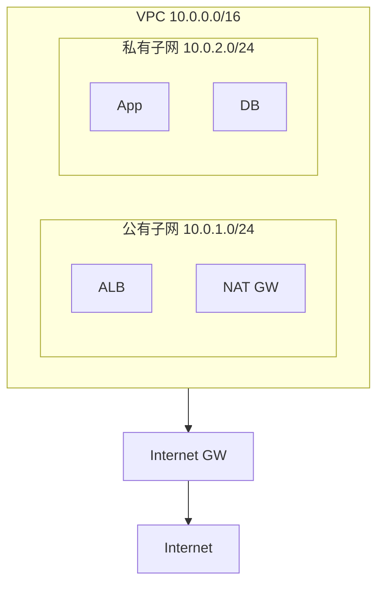
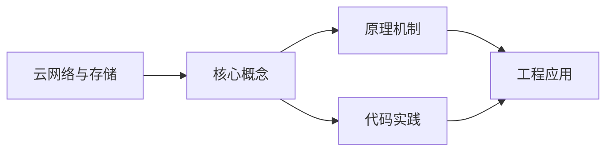
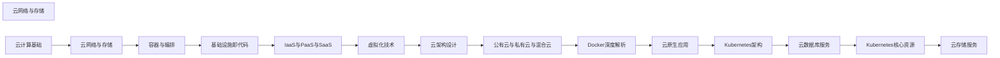

## 1. 学习目标（Bloom 分类）

本节按照布鲁姆教育目标分类学组织学习路径。本文主题为《云网络与存储》，属于 云计算 模块，读者可以根据自身阶段选择阅读深度。

记忆层面：能够准确复述本文的核心概念、术语与基本语法或操作步骤，并能够在提问或检索时快速定位对应知识点。能够说出 云计算 的核心概念、组件与标准流程。

理解层面：能够用自己的语言解释核心原理与工作机制，说明概念之间的因果关系，而不是机械记忆结论。能够解释 云计算 的工作原理与关键机制。

应用层面：能够在真实项目或练习场景中运用本文知识解决具体问题，写出正确且可维护的实现。能够执行 云计算 相关的标准操作与配置。

分析层面：能够拆解复杂问题，比较本文主题与相邻概念的异同，识别边界条件与例外情况。能够分析 云计算 方案在可靠性、成本与性能上的权衡。

评价层面：能够根据约束条件（性能、可读性、安全、成本）评价不同方案的优劣，做出有依据的技术决策。能够评价 云计算 中的技术选型。

创造层面：能够把本文知识与其他模块知识组合，设计出新的解决方案或可复用的工程模式。能够设计基于 云计算 的完整解决方案。

通过本节学习，读者应当能够把《云网络与存储》纳入自己的知识网络，并与 云计算 模块的其他主题（IaaS/PaaS/SaaS、虚拟化、云原生、成本治理）建立关联。

## 2. 历史动机与发展脉络

《云网络与存储》是 云计算 领域的重要主题。要真正理解它，需要先了解它解决的问题与演进过程。

云计算源于 1960 年代分时思想，2006 年 AWS 推出 EC2/S3 开启现代云服务时代；公有云（AWS/Azure/GCP/阿里云/华为云）与私有云、混合云并存。
服务模型：IaaS（虚拟机/存储/网络）、PaaS（托管运行时/数据库）、SaaS（应用即服务）；FaaS（函数即服务）进一步抽象。
云原生：容器、微服务、服务网格、声明式 API、不可变基础设施；CNCF 生态是云原生事实标准。

回到本文主题：云网络与存储 的提出与成熟，正是上述技术背景下的必然产物。早期实现往往以简单可用为目标，随着工程规模扩大，社区逐渐沉淀出标准做法与最佳实践；理解这一脉络，可以帮助读者判断“为什么文档中的推荐写法是现在这个样子”，也能在遇到历史遗留代码时准确识别其设计年代与取舍。


## 3. 形式化定义与核心概念精讲

本节把《云网络与存储》涉及的核心概念以“定义 + 讲解”的形式展开。读者应把定义当作工具，把讲解当作理解路径；两者结合才能形成可迁移的知识。

虚拟化：虚拟机（Hypervisor 硬件隔离）与容器（OS 级隔离）；虚拟化是弹性与多租户的基础。
核心服务：计算（EC2/ECS）、存储（对象/块/文件）、网络（VPC/负载均衡/CDN）、数据库（托管 RDS/NoSQL）。
弹性与计费：按需、预留、Spot；自动扩缩容（HPA/ASG）；FinOps 治理成本。

### 3.1 原文章节逐一精讲

原文档把主题拆分为 8 个小节，下面按顺序给出每一节的导读讲解，随后保留原文细节供精读。

#### 原文精读（完整保留）


#### 1. VPC 虚拟私有云

##### 1.1 VPC 概述

VPC（Virtual Private Cloud）是在公有云上创建的**逻辑隔离的虚拟网络**，用户可自定义网络拓扑、IP 地址范围、路由表和网关。

##### 1.2 VPC 核心组件



| 组件            | 说明                             |
| :-------------- | :------------------------------- |
| **VPC**         | 虚拟网络容器，定义 CIDR 地址范围 |
| **子网**        | VPC 内的网段，关联可用区         |
| **Internet GW** | 互联网网关，提供公网访问         |
| **NAT GW**      | NAT 网关，私有子网访问公网       |
| **路由表**      | 控制网络流量走向                 |
| **安全组**      | 实例级防火墙，控制入站出站规则   |
| **NACL**        | 子网级无状态防火墙               |

##### 1.3 子网规划

```python
# 子网规划示例
subnet_planning = {
    "vpc_cidr": "10.0.0.0/16",       # 65536 个地址
    "subnets": {
        # 公有子网 - 面向互联网
        "public-web-a": {
            "cidr": "10.0.1.0/24",    # 256 个地址
            "az": "us-east-1a",
            "type": "public",
            "purpose": "负载均衡、NAT网关"
        },
        "public-web-b": {
            "cidr": "10.0.2.0/24",
            "az": "us-east-1b",
            "type": "public",
            "purpose": "负载均衡、NAT网关"
        },
        # 私有子网 - 应用层
        "private-app-a": {
            "cidr": "10.0.10.0/24",
            "az": "us-east-1a",
            "type": "private",
            "purpose": "应用服务器"
        },
        "private-app-b": {
            "cidr": "10.0.11.0/24",
            "az": "us-east-1b",
            "type": "private",
            "purpose": "应用服务器"
        },
        # 私有子网 - 数据层
        "private-db-a": {
            "cidr": "10.0.20.0/24",
            "az": "us-east-1a",
            "type": "private",
            "purpose": "数据库"
        },
        "private-db-b": {
            "cidr": "10.0.21.0/24",
            "az": "us-east-1b",
            "type": "private",
            "purpose": "数据库"
        }
    }
}
```

##### 1.4 路由表配置

| 路由表         | 目标        | 下一跳  | 说明         |
| :------------- | :---------- | :------ | :----------- |
| **公有路由表** | 10.0.0.0/16 | local   | VPC 内部通信 |
|                | 0.0.0.0/0   | igw-xxx | 互联网网关   |
| **私有路由表** | 10.0.0.0/16 | local   | VPC 内部通信 |
|                | 0.0.0.0/0   | nat-xxx | NAT 网关     |

#### 2. 安全组配置

##### 2.1 安全组规则

```json5
// 安全组规则示例 - Web 服务器
{
  SecurityGroupId: 'sg-web',
  Rules: {
    Inbound: [
      {
        Protocol: 'TCP',
        Port: 443,
        Source: '0.0.0.0/0',
        Description: 'HTTPS 入站',
      },
      {
        Protocol: 'TCP',
        Port: 80,
        Source: '0.0.0.0/0',
        Description: 'HTTP 入站（重定向到 HTTPS）',
      },
      {
        Protocol: 'TCP',
        Port: 22,
        Source: '10.0.1.0/24',
        Description: 'SSH 仅限堡垒机子网',
      },
    ],
    Outbound: [
      {
        Protocol: 'TCP',
        Port: 443,
        Destination: '0.0.0.0/0',
        Description: 'HTTPS 出站（API 调用）',
      },
      {
        Protocol: 'TCP',
        Port: 3306,
        Destination: 'sg-db',
        Description: '访问数据库安全组',
      },
    ],
  },
}
```

##### 2.2 安全组最佳实践

| 原则               | 说明                              |
| :----------------- | :-------------------------------- |
| **最小权限**       | 仅开放必要的端口和来源            |
| **安全组引用**     | 安全组之间引用而非 IP 段          |
| **分层设计**       | Web → App → DB 各层独立安全组     |
| **禁止 0.0.0.0/0** | 管理端口（SSH/RDP）不应对公网开放 |
| **默认拒绝**       | 出站规则也应限制                  |

##### 2.3 安全组分层架构

```
Internet → [ALB 安全组: 80/443] → [Web 安全组: 仅 ALB] → [App 安全组: 仅 Web] → [DB 安全组: 仅 App]
```

#### 3. NAT 网关

##### 3.1 NAT 网关作用

私有子网中的实例需要访问公网（如下载补丁、调用外部 API），但不允许公网主动访问这些实例。NAT 网关提供**出站公网访问能力**。

##### 3.2 NAT 网关配置

```bash
# AWS 创建 NAT 网关
aws ec2 create-nat-gateway \
  --subnet-id subnet-public-a \
  --allocation-id eipalloc-xxx \
  --tag-specifications 'ResourceType=natgateway,Tags=[{Key=Name,Value=nat-gw-a}]'

# 更新私有子网路由表
aws ec2 create-route \
  --route-table-id rtb-private-a \
  --destination-cidr-block 0.0.0.0/0 \
  --nat-gateway-id nat-xxx
```

#### 4. 弹性计算服务

##### 4.1 实例类型选型

| 类型         | 特点         | 适用场景               | AWS 类型 | 阿里云类型 |
| :----------- | :----------- | :--------------------- | :------- | :--------- |
| **通用型**   | CPU/内存均衡 | Web 服务器、中小数据库 | M6i      | g7         |
| **计算优化** | 高 CPU       | 批处理、科学计算       | C6i      | c7         |
| **内存优化** | 大内存       | 数据库、缓存           | R6i      | r7         |
| **存储优化** | 高 I/O       | 数据仓库、日志处理     | I4i      | i3         |
| **GPU 型**   | GPU 加速     | AI 训练、渲染          | P5       | gn7        |

##### 4.2 实例生命周期

```
启动中 → 运行中 → 停止 → 停止中 → 运行中
  ↓                    ↓
  └──→ 终止（数据丢失）──┘
```

| 状态           | 计费   | 说明               |
| :------------- | :----- | :----------------- |
| **pending**    | 计费   | 正在启动           |
| **running**    | 计费   | 正在运行           |
| **stopping**   | 计费   | 正在停止           |
| **stopped**    | 不计费 | 已停止（EBS 保留） |
| **terminated** | 不计费 | 已终止（不可恢复） |

##### 4.3 User Data 启动脚本

```bash
#!/bin/bash
# EC2 User Data - 实例启动时自动执行

# 更新系统
yum update -y

# 安装 Docker
amazon-linux-extras install docker -y
systemctl start docker
systemctl enable docker
usermod -aG docker ec2-user

# 拉取并运行应用
docker pull myapp:latest
docker run -d -p 8080:8080 \
  -e DB_HOST=${DB_HOST} \
  -e DB_PASSWORD=${DB_PASSWORD} \
  --restart=always \
  myapp:latest

# 注册到负载均衡
aws elbv2 register-targets \
  --target-group-arn arn:aws:elasticloadbalancing:... \
  --targets Id=$(ec2-metadata --instance-id | cut -d' ' -f2)
```

#### 5. 镜像管理

##### 5.1 镜像类型

| 类型           | 说明                     | 适用         |
| :------------- | :----------------------- | :----------- |
| **公共镜像**   | 云商提供的官方镜像       | 标准化部署   |
| **自定义镜像** | 基于实例创建的私有镜像   | 快速复制环境 |
| **共享镜像**   | 其他账号共享的镜像       | 跨账号协作   |
| **市场镜像**   | 第三方发布的预装软件镜像 | 快速搭建     |

##### 5.2 镜像构建最佳实践

```dockerfile
# 构建应用镜像
FROM python:3.12-slim AS builder

WORKDIR /app
COPY requirements.txt .
RUN pip install --no-cache-dir -r requirements.txt

COPY . .

# 多阶段构建 - 减小镜像体积
FROM python:3.12-slim

WORKDIR /app
COPY --from=builder /usr/local/lib/python3.12/site-packages /usr/local/lib/python3.12/site-packages
COPY --from=builder /app .

EXPOSE 8080
CMD ["gunicorn", "-w", "4", "-b", "0.0.0.0:8080", "app:app"]
```

##### 5.3 镜像生命周期

```bash
# 创建自定义镜像
aws ec2 create-image \
  --instance-id i-xxx \
  --name "myapp-v2.3.1" \
  --description "Application image v2.3.1" \
  --no-reboot

# 跨区域复制镜像
aws ec2 copy-image \
  --source-region us-east-1 \
  --source-image-id ami-xxx \
  --region us-west-2 \
  --name "myapp-v2.3.1-west"

# 共享镜像给其他账号
aws ec2 modify-image-attribute \
  --image-id ami-xxx \
  --launch-permission "Add=[{UserId=123456789012}]"
```

#### 6. 块存储服务

##### 6.1 存储类型

| 类型           | IOPS   | 吞吐量    | 适用场景         | AWS 类型 |
| :------------- | :----- | :-------- | :--------------- | :------- |
| **标准 HDD**   | ~500   | ~90 MB/s  | 冷数据、日志     | st1      |
| **通用 SSD**   | 16,000 | 250 MB/s  | 系统盘、通用应用 | gp3      |
| **高性能 SSD** | 64,000 | 1000 MB/s | 数据库、高 I/O   | io2      |

##### 6.2 EBS 卷操作

```bash
# 创建 EBS 卷
aws ec2 create-volume \
  --availability-zone us-east-1a \
  --size 100 \
  --volume-type gp3 \
  --iops 3000 \
  --throughput 125

# 附加到实例
aws ec2 attach-volume \
  --volume-id vol-xxx \
  --instance-id i-xxx \
  --device /dev/sdf

# 创建快照
aws ec2 create-snapshot \
  --volume-id vol-xxx \
  --description "Daily backup"

# 从快照恢复
aws ec2 create-volume \
  --snapshot-id snap-xxx \
  --availability-zone us-east-1a
```

##### 6.3 快照策略

```bash
# 创建快照生命周期策略
aws dlm create-lifecycle-policy \
  --execution-role-arn arn:aws:iam::xxx:role/DLMRole \
  --description "Daily EBS backup" \
  --state ENABLED \
  --policy-details '{
    "PolicyType": "EBS_SNAPSHOT_MANAGEMENT",
    "ResourceTypes": ["VOLUME"],
    "TargetTags": [{"Key": "Backup", "Value": "daily"}],
    "Schedules": [{
      "Name": "DailyBackup",
      "CreateRule": {"Interval": 24, "IntervalUnit": "HOURS", "Times": ["03:00"]},
      "RetainRule": {"Count": 7},
      "CopyTags": true
    }]
  }'
```

#### 7. 对象存储服务

##### 7.1 对象存储概述

| 特性          | 说明                     |
| :------------ | :----------------------- |
| **无限容量**  | 存储空间无上限           |
| **高可用**    | 99.999999999% 数据持久性 |
| **HTTP 访问** | 通过 RESTful API 读写    |
| **分层存储**  | 标准/低频/归档/冷归档    |

##### 7.2 存储类型对比

| 存储类型   | 访问频率 | 存储成本 | 访问成本 | 最短存储时间 |
| :--------- | :------- | :------- | :------- | :----------- |
| **标准**   | 频繁     | 高       | 低       | 无           |
| **低频**   | 不频繁   | 中       | 中       | 30 天        |
| **归档**   | 极少     | 低       | 高       | 60 天        |
| **冷归档** | 极少     | 最低     | 最高     | 90 天        |

##### 7.3 S3 基本操作

```python
import boto3

s3 = boto3.client('s3')

# 创建存储桶
s3.create_bucket(
    Bucket='my-app-bucket',
    CreateBucketConfiguration={'LocationConstraint': 'us-east-1'}
)

# 上传文件
s3.upload_file(
    'local_file.pdf',
    'my-app-bucket',
    'documents/report.pdf',
    ExtraArgs={
        'ContentType': 'application/pdf',
        'Metadata': {'author': 'fanquanpp'}
    }
)

# 下载文件
s3.download_file('my-app-bucket', 'documents/report.pdf', '/tmp/report.pdf')

# 列出对象
response = s3.list_objects_v2(Bucket='my-app-bucket', Prefix='documents/')
for obj in response.get('Contents', []):
    print(f"{obj['Key']} - {obj['Size']} bytes - {obj['LastModified']}")

# 生成预签名 URL（临时访问）
url = s3.generate_presigned_url(
    'get_object',
    Params={'Bucket': 'my-app-bucket', 'Key': 'documents/report.pdf'},
    ExpiresIn=3600  # 1小时有效
)
```

##### 7.4 生命周期管理

```json5
// S3 生命周期规则
{
  Rules: [
    {
      ID: 'ArchiveOldLogs',
      Status: 'Enabled',
      Filter: { Prefix: 'logs/' },
      Transitions: [
        {
          Days: 30,
          StorageClass: 'STANDARD_IA', // 30天后转低频
        },
        {
          Days: 90,
          StorageClass: 'GLACIER', // 90天后转归档
        },
      ],
      Expiration: {
        Days: 365, // 365天后删除
      },
    },
  ],
}
```

#### 8. CDN 加速

##### 8.1 CDN 工作原理

```
用户请求 → 边缘节点（命中缓存）→ 返回内容
              ↓（未命中）
           回源到源站 → 缓存到边缘 → 返回内容
```

##### 8.2 CDN 配置

```bash
# 阿里云 CDN 配置
aliyun cdn AddCdnDomain \
  --DomainName cdn.example.com \
  --CdnType web \
  --Sources '[{"Content":"oss.example.com","Type":"oss","Priority":20}]'

# 缓存规则
# .html  → 缓存 10 分钟
# .jpg/.png → 缓存 30 天
# .css/.js  → 缓存 7 天
# /api/*    → 不缓存
```

##### 8.3 CDN 缓存策略

| 资源类型      | 缓存时间 | 说明             |
| :------------ | :------- | :--------------- |
| **静态资源**  | 30 天    | 图片、CSS、JS    |
| **HTML 页面** | 10 分钟  | 页面更新频率较高 |
| **API 响应**  | 不缓存   | 动态数据         |
| **视频文件**  | 90 天    | 大文件长期缓存   |

##### 8.4 CDN 性能优化

| 优化项         | 方法                           |
| :------------- | :----------------------------- |
| **缓存命中率** | 合理设置缓存规则和过期时间     |
| **回源优化**   | 回源跟随 301/302、回源超时配置 |
| **压缩**       | Gzip/Brotli 压缩传输           |
| **HTTPS**      | 全链路 HTTPS 加密              |
| **智能路由**   | 就近接入、智能 DNS 解析        |


### 3.2 概念关系图

下面用 Mermaid 图表达本文核心概念之间的关系，帮助读者建立整体图景：



图中展示的是本文知识的结构化关系：核心概念是入口，原理机制解释“为什么”，代码实践演示“怎么做”，工程应用回答“何时用”。读者学习时可以把每个小节的内容挂接到对应节点上。

## 4. 理论推导与原理解析

本节深入《云网络与存储》背后的原理。理论部分不求面面俱到，而是聚焦“能解释现象、能指导实践”的关键推导。

虚拟化：虚拟机（Hypervisor 硬件隔离）与容器（OS 级隔离）；虚拟化是弹性与多租户的基础。
核心服务：计算（EC2/ECS）、存储（对象/块/文件）、网络（VPC/负载均衡/CDN）、数据库（托管 RDS/NoSQL）。
弹性与计费：按需、预留、Spot；自动扩缩容（HPA/ASG）；FinOps 治理成本。
高可用设计：多可用区、故障域、跨区域容灾；RPO/RTO 目标驱动方案。

需要强调的是，理论推导与工程实践之间存在翻译层：理论给出的是理想化模型与边界条件，工程代码则必须处理真实环境中的例外。读者在学习时应先掌握理论的“标准情形”，再通过陷阱章节了解“非标准情形”。

## 5. 代码示例与逐行讲解

本节把原文中的代码示例系统整理，并为每个示例补充用途说明与讲解。读者不应只浏览代码，而应逐段对照讲解理解设计意图。

### 5.1 示例：1.2 VPC 核心组件

该示例来自原文《1.2 VPC 核心组件》小节，用于演示云网络与存储相关操作。阅读时请先看代码结构，再看其后的讲解。


讲解：这段代码演示了本节核心知识点。代码中的关键操作可以归纳为三步：准备（定义或初始化）、执行（核心逻辑）、收尾（释放资源或返回结果）。实际项目中，这三步往往被封装为函数或类，以提升复用性与可测试性。

关键点分析：

该示例共 13 行有效代码，结构以数据或配置为主。阅读时应关注：数据字段的含义、配置项的作用，以及它们与运行行为的对应关系。

进阶思考路径：先尝试修改参数观察行为变化，再把示例中的模式迁移到自己的项目中；每次修改都记录预期与实测差异，这是把示例转化为能力的最快方式。

### 5.2 示例：1.3 子网规划

该示例来自原文《1.3 子网规划》小节，用于演示云网络与存储相关操作。阅读时请先看代码结构，再看其后的讲解。

```python
# 子网规划示例
subnet_planning = {
    "vpc_cidr": "10.0.0.0/16",       # 65536 个地址
    "subnets": {
        # 公有子网 - 面向互联网
        "public-web-a": {
            "cidr": "10.0.1.0/24",    # 256 个地址
            "az": "us-east-1a",
            "type": "public",
            "purpose": "负载均衡、NAT网关"
        },
        "public-web-b": {
            "cidr": "10.0.2.0/24",
            "az": "us-east-1b",
            "type": "public",
            "purpose": "负载均衡、NAT网关"
        },
        # 私有子网 - 应用层
        "private-app-a": {
            "cidr": "10.0.10.0/24",
            "az": "us-east-1a",
            "type": "private",
            "purpose": "应用服务器"
        },
        "private-app-b": {
            "cidr": "10.0.11.0/24",
            "az": "us-east-1b",
            "type": "private",
            "purpose": "应用服务器"
        },
        # 私有子网 - 数据层
        "private-db-a": {
            "cidr": "10.0.20.0/24",
            "az": "us-east-1a",
            "type": "private",
            "purpose": "数据库"
        },
        "private-db-b": {
            "cidr": "10.0.21.0/24",
            "az": "us-east-1b",
            "type": "private",
            "purpose": "数据库"
        }
    }
}
```

讲解：这段代码演示了本节核心知识点。代码中的关键操作可以归纳为三步：准备（定义或初始化）、执行（核心逻辑）、收尾（释放资源或返回结果）。实际项目中，这三步往往被封装为函数或类，以提升复用性与可测试性。

关键点分析：

该示例共 45 行有效代码，结构以数据或配置为主。阅读时应关注：数据字段的含义、配置项的作用，以及它们与运行行为的对应关系。

进阶思考路径：先尝试修改参数观察行为变化，再把示例中的模式迁移到自己的项目中；每次修改都记录预期与实测差异，这是把示例转化为能力的最快方式。

### 5.3 示例：2.1 安全组规则

该示例来自原文《2.1 安全组规则》小节，用于演示云网络与存储相关操作。阅读时请先看代码结构，再看其后的讲解。

```json5
// 安全组规则示例 - Web 服务器
{
  SecurityGroupId: 'sg-web',
  Rules: {
    Inbound: [
      {
        Protocol: 'TCP',
        Port: 443,
        Source: '0.0.0.0/0',
        Description: 'HTTPS 入站',
      },
      {
        Protocol: 'TCP',
        Port: 80,
        Source: '0.0.0.0/0',
        Description: 'HTTP 入站（重定向到 HTTPS）',
      },
      {
        Protocol: 'TCP',
        Port: 22,
        Source: '10.0.1.0/24',
        Description: 'SSH 仅限堡垒机子网',
      },
    ],
    Outbound: [
      {
        Protocol: 'TCP',
        Port: 443,
        Destination: '0.0.0.0/0',
        Description: 'HTTPS 出站（API 调用）',
      },
      {
        Protocol: 'TCP',
        Port: 3306,
        Destination: 'sg-db',
        Description: '访问数据库安全组',
      },
    ],
  },
}
```

讲解：这段代码演示了本节核心知识点。代码中的关键操作可以归纳为三步：准备（定义或初始化）、执行（核心逻辑）、收尾（释放资源或返回结果）。实际项目中，这三步往往被封装为函数或类，以提升复用性与可测试性。

关键点分析：

该示例共 40 行有效代码，结构以数据或配置为主。阅读时应关注：数据字段的含义、配置项的作用，以及它们与运行行为的对应关系。

进阶思考路径：先尝试修改参数观察行为变化，再把示例中的模式迁移到自己的项目中；每次修改都记录预期与实测差异，这是把示例转化为能力的最快方式。

### 5.4 示例：2.3 安全组分层架构

该示例来自原文《2.3 安全组分层架构》小节，用于演示云网络与存储相关操作。阅读时请先看代码结构，再看其后的讲解。

```text
Internet → [ALB 安全组: 80/443] → [Web 安全组: 仅 ALB] → [App 安全组: 仅 Web] → [DB 安全组: 仅 App]
```

讲解：这段代码演示了本节核心知识点。代码中的关键操作可以归纳为三步：准备（定义或初始化）、执行（核心逻辑）、收尾（释放资源或返回结果）。实际项目中，这三步往往被封装为函数或类，以提升复用性与可测试性。

关键点分析：

该示例共 1 行有效代码，结构以数据或配置为主。阅读时应关注：数据字段的含义、配置项的作用，以及它们与运行行为的对应关系。

进阶思考路径：先尝试修改参数观察行为变化，再把示例中的模式迁移到自己的项目中；每次修改都记录预期与实测差异，这是把示例转化为能力的最快方式。

### 5.5 示例：3.2 NAT 网关配置

该示例来自原文《3.2 NAT 网关配置》小节，用于演示云网络与存储相关操作。阅读时请先看代码结构，再看其后的讲解。

```bash
# AWS 创建 NAT 网关
aws ec2 create-nat-gateway \
  --subnet-id subnet-public-a \
  --allocation-id eipalloc-xxx \
  --tag-specifications 'ResourceType=natgateway,Tags=[{Key=Name,Value=nat-gw-a}]'

# 更新私有子网路由表
aws ec2 create-route \
  --route-table-id rtb-private-a \
  --destination-cidr-block 0.0.0.0/0 \
  --nat-gateway-id nat-xxx
```

讲解：这段代码演示了本节核心知识点。代码中的关键操作可以归纳为三步：准备（定义或初始化）、执行（核心逻辑）、收尾（释放资源或返回结果）。实际项目中，这三步往往被封装为函数或类，以提升复用性与可测试性。

关键点分析：

该示例共 10 行有效代码，结构以数据或配置为主。阅读时应关注：数据字段的含义、配置项的作用，以及它们与运行行为的对应关系。

进阶思考路径：先尝试修改参数观察行为变化，再把示例中的模式迁移到自己的项目中；每次修改都记录预期与实测差异，这是把示例转化为能力的最快方式。

### 5.6 示例：4.2 实例生命周期

该示例来自原文《4.2 实例生命周期》小节，用于演示云网络与存储相关操作。阅读时请先看代码结构，再看其后的讲解。

```text
启动中 → 运行中 → 停止 → 停止中 → 运行中
  ↓                    ↓
  └──→ 终止（数据丢失）──┘
```

讲解：这段代码演示了本节核心知识点。代码中的关键操作可以归纳为三步：准备（定义或初始化）、执行（核心逻辑）、收尾（释放资源或返回结果）。实际项目中，这三步往往被封装为函数或类，以提升复用性与可测试性。

关键点分析：

该示例共 3 行有效代码，结构以数据或配置为主。阅读时应关注：数据字段的含义、配置项的作用，以及它们与运行行为的对应关系。

进阶思考路径：先尝试修改参数观察行为变化，再把示例中的模式迁移到自己的项目中；每次修改都记录预期与实测差异，这是把示例转化为能力的最快方式。

### 5.7 示例：4.3 User Data 启动脚本

该示例来自原文《4.3 User Data 启动脚本》小节，用于演示云网络与存储相关操作。阅读时请先看代码结构，再看其后的讲解。

```bash
#!/bin/bash
# EC2 User Data - 实例启动时自动执行

# 更新系统
yum update -y

# 安装 Docker
amazon-linux-extras install docker -y
systemctl start docker
systemctl enable docker
usermod -aG docker ec2-user

# 拉取并运行应用
docker pull myapp:latest
docker run -d -p 8080:8080 \
  -e DB_HOST=${DB_HOST} \
  -e DB_PASSWORD=${DB_PASSWORD} \
  --restart=always \
  myapp:latest

# 注册到负载均衡
aws elbv2 register-targets \
  --target-group-arn arn:aws:elasticloadbalancing:... \
  --targets Id=$(ec2-metadata --instance-id | cut -d' ' -f2)
```

讲解：这段代码演示了本节核心知识点。代码中的关键操作可以归纳为三步：准备（定义或初始化）、执行（核心逻辑）、收尾（释放资源或返回结果）。实际项目中，这三步往往被封装为函数或类，以提升复用性与可测试性。

关键点分析：

该示例共 20 行有效代码，结构以数据或配置为主。阅读时应关注：数据字段的含义、配置项的作用，以及它们与运行行为的对应关系。

进阶思考路径：先尝试修改参数观察行为变化，再把示例中的模式迁移到自己的项目中；每次修改都记录预期与实测差异，这是把示例转化为能力的最快方式。

### 5.8 示例：5.2 镜像构建最佳实践

该示例来自原文《5.2 镜像构建最佳实践》小节，用于演示云网络与存储相关操作。阅读时请先看代码结构，再看其后的讲解。

```dockerfile
# 构建应用镜像
FROM python:3.12-slim AS builder

WORKDIR /app
COPY requirements.txt .
RUN pip install --no-cache-dir -r requirements.txt

COPY . .

# 多阶段构建 - 减小镜像体积
FROM python:3.12-slim

WORKDIR /app
COPY --from=builder /usr/local/lib/python3.12/site-packages /usr/local/lib/python3.12/site-packages
COPY --from=builder /app .

EXPOSE 8080
CMD ["gunicorn", "-w", "4", "-b", "0.0.0.0:8080", "app:app"]
```

讲解：这段代码演示了本节核心知识点。代码中的关键操作可以归纳为三步：准备（定义或初始化）、执行（核心逻辑）、收尾（释放资源或返回结果）。实际项目中，这三步往往被封装为函数或类，以提升复用性与可测试性。

关键点分析：

该示例共 13 行有效代码，包含 1 类关键结构（FROM）。其中：

- 入口与初始化部分负责建立上下文，对应实际项目中的启动或装配逻辑；
- 核心逻辑部分体现本文主题的主要操作，是阅读时最需要对照讲解理解的部分；
- 输出或返回部分把结果交给调用方，注意其类型与边界条件。

进阶思考路径：先尝试修改参数观察行为变化，再把示例中的模式迁移到自己的项目中；每次修改都记录预期与实测差异，这是把示例转化为能力的最快方式。

### 5.9 示例：5.3 镜像生命周期

该示例来自原文《5.3 镜像生命周期》小节，用于演示云网络与存储相关操作。阅读时请先看代码结构，再看其后的讲解。

```bash
# 创建自定义镜像
aws ec2 create-image \
  --instance-id i-xxx \
  --name "myapp-v2.3.1" \
  --description "Application image v2.3.1" \
  --no-reboot

# 跨区域复制镜像
aws ec2 copy-image \
  --source-region us-east-1 \
  --source-image-id ami-xxx \
  --region us-west-2 \
  --name "myapp-v2.3.1-west"

# 共享镜像给其他账号
aws ec2 modify-image-attribute \
  --image-id ami-xxx \
  --launch-permission "Add=[{UserId=123456789012}]"
```

讲解：这段代码演示了本节核心知识点。代码中的关键操作可以归纳为三步：准备（定义或初始化）、执行（核心逻辑）、收尾（释放资源或返回结果）。实际项目中，这三步往往被封装为函数或类，以提升复用性与可测试性。

关键点分析：

该示例共 16 行有效代码，结构以数据或配置为主。阅读时应关注：数据字段的含义、配置项的作用，以及它们与运行行为的对应关系。

进阶思考路径：先尝试修改参数观察行为变化，再把示例中的模式迁移到自己的项目中；每次修改都记录预期与实测差异，这是把示例转化为能力的最快方式。

### 5.10 示例：6.2 EBS 卷操作

该示例来自原文《6.2 EBS 卷操作》小节，用于演示云网络与存储相关操作。阅读时请先看代码结构，再看其后的讲解。

```bash
# 创建 EBS 卷
aws ec2 create-volume \
  --availability-zone us-east-1a \
  --size 100 \
  --volume-type gp3 \
  --iops 3000 \
  --throughput 125

# 附加到实例
aws ec2 attach-volume \
  --volume-id vol-xxx \
  --instance-id i-xxx \
  --device /dev/sdf

# 创建快照
aws ec2 create-snapshot \
  --volume-id vol-xxx \
  --description "Daily backup"

# 从快照恢复
aws ec2 create-volume \
  --snapshot-id snap-xxx \
  --availability-zone us-east-1a
```

讲解：这段代码演示了本节核心知识点。代码中的关键操作可以归纳为三步：准备（定义或初始化）、执行（核心逻辑）、收尾（释放资源或返回结果）。实际项目中，这三步往往被封装为函数或类，以提升复用性与可测试性。

关键点分析：

该示例共 20 行有效代码，结构以数据或配置为主。阅读时应关注：数据字段的含义、配置项的作用，以及它们与运行行为的对应关系。

进阶思考路径：先尝试修改参数观察行为变化，再把示例中的模式迁移到自己的项目中；每次修改都记录预期与实测差异，这是把示例转化为能力的最快方式。

### 5.11 示例：6.3 快照策略

该示例来自原文《6.3 快照策略》小节，用于演示云网络与存储相关操作。阅读时请先看代码结构，再看其后的讲解。

```bash
# 创建快照生命周期策略
aws dlm create-lifecycle-policy \
  --execution-role-arn arn:aws:iam::xxx:role/DLMRole \
  --description "Daily EBS backup" \
  --state ENABLED \
  --policy-details '{
    "PolicyType": "EBS_SNAPSHOT_MANAGEMENT",
    "ResourceTypes": ["VOLUME"],
    "TargetTags": [{"Key": "Backup", "Value": "daily"}],
    "Schedules": [{
      "Name": "DailyBackup",
      "CreateRule": {"Interval": 24, "IntervalUnit": "HOURS", "Times": ["03:00"]},
      "RetainRule": {"Count": 7},
      "CopyTags": true
    }]
  }'
```

讲解：这段代码演示了本节核心知识点。代码中的关键操作可以归纳为三步：准备（定义或初始化）、执行（核心逻辑）、收尾（释放资源或返回结果）。实际项目中，这三步往往被封装为函数或类，以提升复用性与可测试性。

关键点分析：

该示例共 16 行有效代码，结构以数据或配置为主。阅读时应关注：数据字段的含义、配置项的作用，以及它们与运行行为的对应关系。

进阶思考路径：先尝试修改参数观察行为变化，再把示例中的模式迁移到自己的项目中；每次修改都记录预期与实测差异，这是把示例转化为能力的最快方式。

### 5.12 示例：7.3 S3 基本操作

该示例来自原文《7.3 S3 基本操作》小节，用于演示云网络与存储相关操作。阅读时请先看代码结构，再看其后的讲解。

```python
import boto3

s3 = boto3.client('s3')

# 创建存储桶
s3.create_bucket(
    Bucket='my-app-bucket',
    CreateBucketConfiguration={'LocationConstraint': 'us-east-1'}
)

# 上传文件
s3.upload_file(
    'local_file.pdf',
    'my-app-bucket',
    'documents/report.pdf',
    ExtraArgs={
        'ContentType': 'application/pdf',
        'Metadata': {'author': 'fanquanpp'}
    }
)

# 下载文件
s3.download_file('my-app-bucket', 'documents/report.pdf', '/tmp/report.pdf')

# 列出对象
response = s3.list_objects_v2(Bucket='my-app-bucket', Prefix='documents/')
for obj in response.get('Contents', []):
    print(f"{obj['Key']} - {obj['Size']} bytes - {obj['LastModified']}")

# 生成预签名 URL（临时访问）
url = s3.generate_presigned_url(
    'get_object',
    Params={'Bucket': 'my-app-bucket', 'Key': 'documents/report.pdf'},
    ExpiresIn=3600  # 1小时有效
)
```

讲解：这段代码演示了本节核心知识点。代码中的关键操作可以归纳为三步：准备（定义或初始化）、执行（核心逻辑）、收尾（释放资源或返回结果）。实际项目中，这三步往往被封装为函数或类，以提升复用性与可测试性。

关键点分析：

该示例共 29 行有效代码，包含 2 类关键结构（import、for）。其中：

- 入口与初始化部分负责建立上下文，对应实际项目中的启动或装配逻辑；
- 核心逻辑部分体现本文主题的主要操作，是阅读时最需要对照讲解理解的部分；
- 输出或返回部分把结果交给调用方，注意其类型与边界条件。

进阶思考路径：先尝试修改参数观察行为变化，再把示例中的模式迁移到自己的项目中；每次修改都记录预期与实测差异，这是把示例转化为能力的最快方式。

### 5.13 示例：7.4 生命周期管理

该示例来自原文《7.4 生命周期管理》小节，用于演示云网络与存储相关操作。阅读时请先看代码结构，再看其后的讲解。

```json5
// S3 生命周期规则
{
  Rules: [
    {
      ID: 'ArchiveOldLogs',
      Status: 'Enabled',
      Filter: { Prefix: 'logs/' },
      Transitions: [
        {
          Days: 30,
          StorageClass: 'STANDARD_IA', // 30天后转低频
        },
        {
          Days: 90,
          StorageClass: 'GLACIER', // 90天后转归档
        },
      ],
      Expiration: {
        Days: 365, // 365天后删除
      },
    },
  ],
}
```

讲解：这段代码演示了本节核心知识点。代码中的关键操作可以归纳为三步：准备（定义或初始化）、执行（核心逻辑）、收尾（释放资源或返回结果）。实际项目中，这三步往往被封装为函数或类，以提升复用性与可测试性。

关键点分析：

该示例共 23 行有效代码，结构以数据或配置为主。阅读时应关注：数据字段的含义、配置项的作用，以及它们与运行行为的对应关系。

进阶思考路径：先尝试修改参数观察行为变化，再把示例中的模式迁移到自己的项目中；每次修改都记录预期与实测差异，这是把示例转化为能力的最快方式。

### 5.14 示例：8.1 CDN 工作原理

该示例来自原文《8.1 CDN 工作原理》小节，用于演示云网络与存储相关操作。阅读时请先看代码结构，再看其后的讲解。

```text
用户请求 → 边缘节点（命中缓存）→ 返回内容
              ↓（未命中）
           回源到源站 → 缓存到边缘 → 返回内容
```

讲解：这段代码演示了本节核心知识点。代码中的关键操作可以归纳为三步：准备（定义或初始化）、执行（核心逻辑）、收尾（释放资源或返回结果）。实际项目中，这三步往往被封装为函数或类，以提升复用性与可测试性。

关键点分析：

该示例共 3 行有效代码，结构以数据或配置为主。阅读时应关注：数据字段的含义、配置项的作用，以及它们与运行行为的对应关系。

进阶思考路径：先尝试修改参数观察行为变化，再把示例中的模式迁移到自己的项目中；每次修改都记录预期与实测差异，这是把示例转化为能力的最快方式。

### 5.15 示例：8.2 CDN 配置

该示例来自原文《8.2 CDN 配置》小节，用于演示云网络与存储相关操作。阅读时请先看代码结构，再看其后的讲解。

```bash
# 阿里云 CDN 配置
aliyun cdn AddCdnDomain \
  --DomainName cdn.example.com \
  --CdnType web \
  --Sources '[{"Content":"oss.example.com","Type":"oss","Priority":20}]'

# 缓存规则
# .html  → 缓存 10 分钟
# .jpg/.png → 缓存 30 天
# .css/.js  → 缓存 7 天
# /api/*    → 不缓存
```

讲解：这段代码演示了本节核心知识点。代码中的关键操作可以归纳为三步：准备（定义或初始化）、执行（核心逻辑）、收尾（释放资源或返回结果）。实际项目中，这三步往往被封装为函数或类，以提升复用性与可测试性。

关键点分析：

该示例共 10 行有效代码，结构以数据或配置为主。阅读时应关注：数据字段的含义、配置项的作用，以及它们与运行行为的对应关系。

进阶思考路径：先尝试修改参数观察行为变化，再把示例中的模式迁移到自己的项目中；每次修改都记录预期与实测差异，这是把示例转化为能力的最快方式。


综合以上示例，可以总结出本主题的代码实践要点：第一，先定义清晰的输入输出契约；第二，核心逻辑保持单一职责；第三，错误处理与边界条件不可省略；第四，命名与注释表达意图而非复述代码。

## 6. 对比分析

对比是理解《云网络与存储》定位的最快路径。下面从多个维度与相邻方案进行对比。

公有云、私有云、混合云：公有云弹性成本优，私有云合规可控，混合云过渡。
虚拟机与容器：VM 强隔离通用，容器轻量交付快。
Serverless 与容器：FaaS 免运维按调用计费，容器可移植控制强。

对比的目的不是分出绝对优劣，而是建立选择依据：不同约束条件下，最优解不同。读者应把每个对比维度转化为决策检查清单。

## 7. 常见陷阱与最佳实践

本节整理该主题的高频错误与推荐做法。每个陷阱先描述现象，再解释原因，最后给出最佳实践。

### 7.1 单可用区部署

单点故障。多 AZ + 自动故障转移。

深入讲解：该问题之所以被归类为“常见陷阱”，是因为它在初学者的代码中反复出现，而且往往不在第一时间暴露——错误通常隐藏在特定数据或特定时序下。

从成因上看，单可用区部署 一般源于对 云计算 某个机制的理解偏差：要么误用了默认行为，要么忽略了边界条件，要么把其他语言的思维惯性带了过来。

从影响上看，单可用区部署 轻则产生错误结果，重则导致资源泄漏、数据损坏或安全事故；这也是为什么工程评审中会把它列为检查项。

从修复策略上看，处理单可用区部署的正确顺序是：先复现（构造最小用例），再定位（确认机制层面的根因），最后修复并补充回归测试。跳过复现直接改代码，往往治标不治本。

### 7.2 安全组过宽

0.0.0.0/0 全开。最小暴露 + 堡垒机。

深入讲解：该问题之所以被归类为“常见陷阱”，是因为它在初学者的代码中反复出现，而且往往不在第一时间暴露——错误通常隐藏在特定数据或特定时序下。

从成因上看，安全组过宽 一般源于对 云计算 某个机制的理解偏差：要么误用了默认行为，要么忽略了边界条件，要么把其他语言的思维惯性带了过来。

从影响上看，安全组过宽 轻则产生错误结果，重则导致资源泄漏、数据损坏或安全事故；这也是为什么工程评审中会把它列为检查项。

从修复策略上看，处理安全组过宽的正确顺序是：先复现（构造最小用例），再定位（确认机制层面的根因），最后修复并补充回归测试。跳过复现直接改代码，往往治标不治本。

### 7.3 存储类型误选

成本与性能失衡。按访问频率选择热/冷存储。

深入讲解：该问题之所以被归类为“常见陷阱”，是因为它在初学者的代码中反复出现，而且往往不在第一时间暴露——错误通常隐藏在特定数据或特定时序下。

从成因上看，存储类型误选 一般源于对 云计算 某个机制的理解偏差：要么误用了默认行为，要么忽略了边界条件，要么把其他语言的思维惯性带了过来。

从影响上看，存储类型误选 轻则产生错误结果，重则导致资源泄漏、数据损坏或安全事故；这也是为什么工程评审中会把它列为检查项。

从修复策略上看，处理存储类型误选的正确顺序是：先复现（构造最小用例），再定位（确认机制层面的根因），最后修复并补充回归测试。跳过复现直接改代码，往往治标不治本。

### 7.4 实例规格浪费

长期高配低用。右尺寸 + 弹性伸缩。

深入讲解：该问题之所以被归类为“常见陷阱”，是因为它在初学者的代码中反复出现，而且往往不在第一时间暴露——错误通常隐藏在特定数据或特定时序下。

从成因上看，实例规格浪费 一般源于对 云计算 某个机制的理解偏差：要么误用了默认行为，要么忽略了边界条件，要么把其他语言的思维惯性带了过来。

从影响上看，实例规格浪费 轻则产生错误结果，重则导致资源泄漏、数据损坏或安全事故；这也是为什么工程评审中会把它列为检查项。

从修复策略上看，处理实例规格浪费的正确顺序是：先复现（构造最小用例），再定位（确认机制层面的根因），最后修复并补充回归测试。跳过复现直接改代码，往往治标不治本。

### 7.5 成本失控

无预算告警。预算 + 标签 + 异常检测。

深入讲解：该问题之所以被归类为“常见陷阱”，是因为它在初学者的代码中反复出现，而且往往不在第一时间暴露——错误通常隐藏在特定数据或特定时序下。

从成因上看，成本失控 一般源于对 云计算 某个机制的理解偏差：要么误用了默认行为，要么忽略了边界条件，要么把其他语言的思维惯性带了过来。

从影响上看，成本失控 轻则产生错误结果，重则导致资源泄漏、数据损坏或安全事故；这也是为什么工程评审中会把它列为检查项。

从修复策略上看，处理成本失控的正确顺序是：先复现（构造最小用例），再定位（确认机制层面的根因），最后修复并补充回归测试。跳过复现直接改代码，往往治标不治本。

### 7.6 忽略供应商锁定

迁移困难。优先开源标准（K8s、Terraform）。

深入讲解：该问题之所以被归类为“常见陷阱”，是因为它在初学者的代码中反复出现，而且往往不在第一时间暴露——错误通常隐藏在特定数据或特定时序下。

从成因上看，忽略供应商锁定 一般源于对 云计算 某个机制的理解偏差：要么误用了默认行为，要么忽略了边界条件，要么把其他语言的思维惯性带了过来。

从影响上看，忽略供应商锁定 轻则产生错误结果，重则导致资源泄漏、数据损坏或安全事故；这也是为什么工程评审中会把它列为检查项。

从修复策略上看，处理忽略供应商锁定的正确顺序是：先复现（构造最小用例），再定位（确认机制层面的根因），最后修复并补充回归测试。跳过复现直接改代码，往往治标不治本。

### 7.7 备份未验证

备份不可恢复等于没有。定期恢复演练。

深入讲解：该问题之所以被归类为“常见陷阱”，是因为它在初学者的代码中反复出现，而且往往不在第一时间暴露——错误通常隐藏在特定数据或特定时序下。

从成因上看，备份未验证 一般源于对 云计算 某个机制的理解偏差：要么误用了默认行为，要么忽略了边界条件，要么把其他语言的思维惯性带了过来。

从影响上看，备份未验证 轻则产生错误结果，重则导致资源泄漏、数据损坏或安全事故；这也是为什么工程评审中会把它列为检查项。

从修复策略上看，处理备份未验证的正确顺序是：先复现（构造最小用例），再定位（确认机制层面的根因），最后修复并补充回归测试。跳过复现直接改代码，往往治标不治本。

### 7.8 密钥管理混乱

AK 泄露事故。使用云 KMS 与临时凭证。

深入讲解：该问题之所以被归类为“常见陷阱”，是因为它在初学者的代码中反复出现，而且往往不在第一时间暴露——错误通常隐藏在特定数据或特定时序下。

从成因上看，密钥管理混乱 一般源于对 云计算 某个机制的理解偏差：要么误用了默认行为，要么忽略了边界条件，要么把其他语言的思维惯性带了过来。

从影响上看，密钥管理混乱 轻则产生错误结果，重则导致资源泄漏、数据损坏或安全事故；这也是为什么工程评审中会把它列为检查项。

从修复策略上看，处理密钥管理混乱的正确顺序是：先复现（构造最小用例），再定位（确认机制层面的根因），最后修复并补充回归测试。跳过复现直接改代码，往往治标不治本。

### 7.0 最佳实践总览

1. IaC：Terraform/CloudFormation 管理资源，代码评审与审批。
2. 标签与成本分摊：环境/项目/团队标签驱动 FinOps。
3. 安全基线：CIS 基准扫描、IAM 最小权限、加密默认开启。
4. 架构评审：Well-Architected 五支柱（可靠性、安全、成本、性能、运维）。

把这些最佳实践固化为团队规范与代码评审检查项，是避免同类问题反复出现的关键。

## 8. 工程实践

本节把《云网络与存储》放入真实工程场景，给出可复用的模式与组织方法。

云原生应用：12 要素（配置注入、无状态、日志输出）、K8s 部署、服务网格（Istio）可观测。
迁移路径：Rehost（直接搬）、Replatform（小改）、Refactor（重构）、Retire。
多集群管理：GitOps + 联邦/平台抽象。

### 8.1 工程实践的原则拆解

以上工程实践可以归纳为四条原则。第一，配置与代码分离：云计算 项目中环境差异应通过配置注入，而不是散落在代码分支中；这保证同一份代码可以在开发、测试、生产环境一致运行。

第二，接口稳定优先：对外接口（函数签名、协议、数据格式）一旦被消费方依赖，变更成本极高；设计时应预留扩展点并保持向后兼容。

第三，可观测性内置：日志、指标与追踪应该在功能开发时同步设计，而不是故障发生后补救；没有观测手段的模块等于黑盒。

第四，变更可回滚：任何发布都应有对应的回滚方案；数据库迁移、配置变更与代码发布一样需要版本管理与逆向路径。

### 8.2 实践落地的检查清单

- [ ] 云原生应用：对照本节描述，检查当前项目是否已经落实；未落实的项列入技术债并排期处理。
- [ ] 迁移路径：对照本节描述，检查当前项目是否已经落实；未落实的项列入技术债并排期处理。
- [ ] 多集群管理：对照本节描述，检查当前项目是否已经落实；未落实的项列入技术债并排期处理。

工程实践的共性原则：配置与代码分离、接口稳定优先、可观测性内置、变更可回滚。这些原则适用于本主题的所有实现。

## 9. 案例研究

本节通过一个完整案例把《云网络与存储》的知识串起来。案例按“需求分析、方案设计、实现、验证”四步展开。

需求：把单体 Web 应用迁移到云原生架构。
方案：容器化 -> K8s 部署 -> 托管数据库 -> 监控告警。
要点：无状态化、配置外置、探针、弹性伸缩。
验证：故障演练（节点/区域故障）、压测弹性、成本对比。

### 9.1 案例的扩展讨论

把案例中的方案放大到真实规模，需要额外考虑三个问题：

第一，规模：当数据量或并发量上升一个数量级时，原方案中的数据结构、缓存策略与任务调度是否仍然成立？通常需要引入分层与异步。

第二，团队：多人协作时，模块边界、接口契约与代码所有权必须明确；案例中的实现应拆分为可独立测试的单元，并配合文档说明设计意图。

第三，演进：上线后的需求变化不可避免；方案设计时应预留扩展点（配置化、插件化、事件化），并定期用真实指标验证假设。


案例研究的学习方法：先独立阅读需求，尝试在脑中形成方案，再对照实现与讲解，最后思考“如果约束变化（数据量、并发、团队规模），方案应如何调整”。

## 10. 知识要点总结与深入讲解

本节以讲解形式汇总全文要点，替代传统的习题与自测，读者不需要答题，只需跟随解释建立完整的认知框架。

关于《云网络与存储》的核心结论：

云计算的本质是资源抽象与按需供给。
可靠性、安全与成本是架构三支柱。
云原生（容器 + 声明式 + 自动化）是主流交付形态。

原文档各小节的要点回顾：

- 1. VPC 虚拟私有云：该小节围绕云网络与存储展开具体细节，阅读时应关注其与核心结论的对应关系；每个小节都是核心结论在某一个侧面的展开。
- 2. 安全组配置：该小节围绕云网络与存储展开具体细节，阅读时应关注其与核心结论的对应关系；每个小节都是核心结论在某一个侧面的展开。
- 3. NAT 网关：该小节围绕云网络与存储展开具体细节，阅读时应关注其与核心结论的对应关系；每个小节都是核心结论在某一个侧面的展开。
- 4. 弹性计算服务：该小节围绕云网络与存储展开具体细节，阅读时应关注其与核心结论的对应关系；每个小节都是核心结论在某一个侧面的展开。
- 5. 镜像管理：该小节围绕云网络与存储展开具体细节，阅读时应关注其与核心结论的对应关系；每个小节都是核心结论在某一个侧面的展开。
- 6. 块存储服务：该小节围绕云网络与存储展开具体细节，阅读时应关注其与核心结论的对应关系；每个小节都是核心结论在某一个侧面的展开。
- 7. 对象存储服务：该小节围绕云网络与存储展开具体细节，阅读时应关注其与核心结论的对应关系；每个小节都是核心结论在某一个侧面的展开。
- 8. CDN 加速：该小节围绕云网络与存储展开具体细节，阅读时应关注其与核心结论的对应关系；每个小节都是核心结论在某一个侧面的展开。

把以上要点与第 3-9 节的内容对照复习，即可完成对本文主题的闭环学习。

## 11. 参考文献


AWS 文档：https://docs.aws.amazon.com/
Microsoft Azure 文档：https://learn.microsoft.com/zh-cn/azure/
Google Cloud 文档：https://cloud.google.com/docs?hl=zh-cn
阿里云文档：https://help.aliyun.com/
CNCF 云原生全景：https://landscape.cncf.io/

## 12. 延伸阅读


虚拟化与容器，见 034-cloud-computing 模块相关文档。
Kubernetes 架构，见 034-cloud-computing 模块 K8s 文档。
DevOps 与 IaC，见 031-devops 模块。
尚硅谷 Bilibili 空间（https://space.bilibili.com/302417610 ）提供云计算课程。

## 14. 模块知识图谱与学习路径

本文属于 云计算 模块。为了把《云网络与存储》放入完整的知识网络，下面列出本模块的全部主题并给出相互关联的导读。学习时建议按模块内顺序推进，并在每个文档中留意交叉引用。



上图为模块主题的推荐学习顺序示意图（仅展示前若干主题）。各主题之间存在三类关联：

第一，前置依赖关系：早期主题是后期主题的基础，例如环境与语法先行、进阶主题随后；

第二，横向并列关系：同一层级主题从不同角度覆盖模块能力，学习顺序可以按兴趣调整；

第三，工程组合关系：多个主题在真实项目中组合使用，例如配置、性能与安全主题往往出现在同一系统的不同层面。

### 14.1 模块主题速查表

| 文档 | 主题 | 与本文的关联 |
| --- | --- | --- |
| 云计算基础 | 001-CloudComputingBasics | 本文的前置基础 |
| 云网络与存储 | 002-CloudNetworkStorage | 本文自身 |
| 容器与编排 | 003-ContainerOrchestration | 本文的并列主题 |
| 基础设施即代码 | 004-IaC | 本文的前置基础 |
| IaaS与PaaS与SaaS | 005-IaaSPaaSSaaS | 本文的并列主题 |
| 虚拟化技术 | 006-VirtualizationTech | 本文的并列主题 |
| 云架构设计 | 007-CloudArchitectureDesign | 本文的原理深化 |
| 公有云与私有云与混合云 | 008-PublicCloudPrivateCloudHybridCloud | 本文的并列主题 |
| Docker深度解析 | 009-DockerDeepAnalysis | 本文的并列主题 |
| 云原生应用 | 010-CloudNativeApp | 本文的并列主题 |
| Kubernetes架构 | 011-KubernetesArchitecture | 本文的原理深化 |
| 云数据库服务 | 012-CloudDatabaseService | 本文的并列主题 |
| Kubernetes核心资源 | 013-KubernetesCore | 本文的并列主题 |
| 云存储服务 | 014-CloudStorageService | 本文的并列主题 |
| Kubernetes网络 | 015-KubernetesNetwork | 本文的并列主题 |
| 云网络服务 | 016-CloudNetworkService | 本文的并列主题 |
| Kubernetes存储 | 017-KubernetesStorage | 本文的并列主题 |
| 云安全服务 | 018-CloudSecurityService | 本文的安全延伸 |
| Helm包管理 | 019-HelmPackageManagement | 本文的并列主题 |
| 云成本优化 | 020-CloudCostOptimization | 本文的性能延伸 |
| 12要素应用 | 021-TwelveFactorApp | 本文的并列主题 |
| 微服务架构 | 022-MicroserviceArchitecture | 本文的原理深化 |
| 服务网格 | 023-ServiceMesh | 本文的并列主题 |
| 可观测性 | 024-Observability | 本文的并列主题 |
| AWS核心服务 | 025-AWSCore | 本文的并列主题 |
| 多云与混合云架构 | 026-MultiCloudHybridArchitecture | 本文的原理深化 |
| 负载均衡与自动伸缩 | 027-LoadBalanceAutoScaling | 本文的并列主题 |
| 无服务器架构 | 028-ServerlessArchitecture | 本文的原理深化 |
| 云迁移6R策略 | 029-CloudMigration6RStrategy | 本文的并列主题 |
| 云计算 AWS CLI 配置 | 030-AWSCliConfigure | 本文的并列主题 |
| 云计算 AWS S3 命令 | 031-AWSS3Command | 本文的并列主题 |
| 云计算 AWS EC2 命令 | 032-AWSEC2Command | 本文的并列主题 |
| 云计算 AWS Lambda 命令 | 033-AWSLambdaCommand | 本文的并列主题 |
| 云计算 AWS IAM 命令 | 034-AWSIAMCommand | 本文的并列主题 |
| 云计算 AWS CloudFormation | 035-AWSCloudFormation | 本文的并列主题 |
| 云计算 Azure CLI 配置 | 036-AzureCliConfigure | 本文的并列主题 |
| 云计算 Azure 资源组与 VM | 037-AzureGroupVMCommand | 本文的并列主题 |
| 云计算 Azure 存储命令 | 038-AzureStorageCommand | 本文的并列主题 |
| 云计算 GCP gcloud 配置 | 039-GCPCliConfigure | 本文的并列主题 |
| 云计算 GCP Compute 与 Storage | 040-GCPComputeStorage | 本文的并列主题 |
| 云计算 Terraform 基础 | 041-TerraformBasic | 本文的前置基础 |
| 云计算 Terraform 状态与模块 | 042-TerraformStateModule | 本文的并列主题 |
| AWS CloudWatch 监控日志命令 | 043-AWSCloudWatch | 本文的并列主题 |
| AWS RDS 数据库命令 | 044-AWSRDSCommands | 本文的并列主题 |
| AWS VPC 网络命令 | 045-AWSVPCCommands | 本文的并列主题 |
| AWS SQS/SNS 消息队列命令 | 046-AWSSQSCommands | 本文的并列主题 |
| AWS DynamoDB 命令 | 047-AWSDynamoDB | 本文的并列主题 |
| Azure Functions 命令 | 048-AzureFunctions | 本文的并列主题 |
| Azure AKS Kubernetes 命令 | 049-AzureAKSCommands | 本文的并列主题 |
| GCP GKE Kubernetes 命令 | 050-GCPGKECommands | 本文的并列主题 |
| GCP BigQuery 命令 | 051-GCPBigQuery | 本文的并列主题 |
| Pulumi IaC 命令 | 052-PulumiCommands | 本文的并列主题 |
| Harbor 私有镜像仓库命令 | 053-HarborRegistry | 本文的并列主题 |
| cloud-init 云实例初始化 | 054-CloudInitCommands | 本文的并列主题 |
| AWS CloudFront CDN 命令 | 055-AWSCloudFront | 本文的并列主题 |

速查表的作用是让读者快速判断：哪些文档应在阅读本文前掌握（前置基础），哪些文档应在阅读本文后继续（延伸主题）。本模块的交叉引用体系即以此表为基础。

## 15. 术语表

下表整理《云网络与存储》及 云计算 模块中出现的高频术语，给出简明释义。术语按字母序或逻辑序排列，供查阅。

| 术语 | 释义 |
| --- | --- |
| 虚拟化 | 虚拟机（Hypervisor 硬件隔离）与容器（OS 级隔离）；虚拟化是弹性与多租户的基础。 |
| 核心服务 | 计算（EC2/ECS）、存储（对象/块/文件）、网络（VPC/负载均衡/CDN）、数据库（托管 RDS/NoSQL）。 |
| 弹性与计费 | 按需、预留、Spot；自动扩缩容（HPA/ASG）；FinOps 治理成本。 |
| 高可用设计 | 多可用区、故障域、跨区域容灾；RPO/RTO 目标驱动方案。 |
| 单可用区部署（易错点） | 参见常见陷阱章节的详细讲解 |
| 安全组过宽（易错点） | 参见常见陷阱章节的详细讲解 |
| 存储类型误选（易错点） | 参见常见陷阱章节的详细讲解 |
| 实例规格浪费（易错点） | 参见常见陷阱章节的详细讲解 |
| 成本失控（易错点） | 参见常见陷阱章节的详细讲解 |
| 忽略供应商锁定（易错点） | 参见常见陷阱章节的详细讲解 |

术语表与正文配合使用：先通读正文，遇到模糊术语回查本表；长期使用后术语会自然进入工作记忆。

## 13. 深度专题扩展

以下专题从不同角度深入本文主题，供有进阶需求的读者研读。每个专题独立成节，内容相互补充。

### 13.1 FinOps 成本治理

三阶段：可见（成本分配与预算）、优化（右尺寸、Spot、闲置清理）、运营（持续迭代与责任到团队）。
工具：云厂商成本中心、OpenCost、Kubecost。
组织：FinOps 实践者角色、定期 review、浪费告警。
度量：单位成本（每请求/每用户成本）而非绝对金额。

### 13.2 高可用与容灾设计

可用性数学：99.9% 年停机约 8.7 小时，99.99% 约 52 分钟；多副本降低单点风险。
RPO（可容忍数据丢失）与 RTO（恢复时间）驱动备份与复制策略。
模式：多可用区部署、跨区域异步复制、数据库主备、对象存储版本。
演练：混沌工程（Chaos Monkey 思想）验证真实故障行为。

## 16. 核心概念串讲（复习视角）

本节以“把知识讲给他人听”的方式，把《云网络与存储》的核心概念重新串讲一遍。与前文按章节展开不同，这里的叙述更接近课堂总结：先说整体，再逐个展开，最后收束。

《云网络与存储》属于 云计算 模块。要理解它，先要理解它在模块中的位置：它解决的是该领域的一个具体问题，并依赖模块内若干前置概念；反过来，它又为后续进阶主题提供基础。

第一个概念是虚拟化。虚拟机（Hypervisor 硬件隔离）与容器（OS 级隔离）；虚拟化是弹性与多租户的基础。

在实际使用中，虚拟化需要与相邻概念区分：它们的区别不在于名称，而在于适用条件与行为边界；这正是前文对比分析章节的意义。

第一个概念是核心服务。计算（EC2/ECS）、存储（对象/块/文件）、网络（VPC/负载均衡/CDN）、数据库（托管 RDS/NoSQL）。

在实际使用中，核心服务需要与相邻概念区分：它们的区别不在于名称，而在于适用条件与行为边界；这正是前文对比分析章节的意义。

第一个概念是弹性与计费。按需、预留、Spot；自动扩缩容（HPA/ASG）；FinOps 治理成本。

在实际使用中，弹性与计费需要与相邻概念区分：它们的区别不在于名称，而在于适用条件与行为边界；这正是前文对比分析章节的意义。

接下来是虚拟化。虚拟机（Hypervisor 硬件隔离）与容器（OS 级隔离）；虚拟化是弹性与多租户的基础。

理解该原理的关键不是记住结论，而是记住“它从什么假设出发、推出了什么、假设不成立时会怎样”。带着这个框架复习，原理之间就会连成网络。

接下来是核心服务。计算（EC2/ECS）、存储（对象/块/文件）、网络（VPC/负载均衡/CDN）、数据库（托管 RDS/NoSQL）。

理解该原理的关键不是记住结论，而是记住“它从什么假设出发、推出了什么、假设不成立时会怎样”。带着这个框架复习，原理之间就会连成网络。

接下来是弹性与计费。按需、预留、Spot；自动扩缩容（HPA/ASG）；FinOps 治理成本。

理解该原理的关键不是记住结论，而是记住“它从什么假设出发、推出了什么、假设不成立时会怎样”。带着这个框架复习，原理之间就会连成网络。

接下来是高可用设计。多可用区、故障域、跨区域容灾；RPO/RTO 目标驱动方案。

理解该原理的关键不是记住结论，而是记住“它从什么假设出发、推出了什么、假设不成立时会怎样”。带着这个框架复习，原理之间就会连成网络。

串讲收束：把概念与原理放回本文主题，可以得出一个总纲——定义描述是什么，原理解释为什么，实践回答怎么做。三者构成完整的学习闭环；后续遇到相关问题，都可以按这个总纲检索知识。
