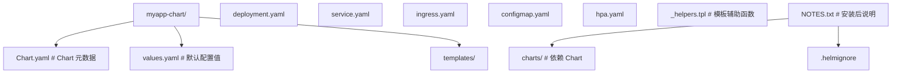
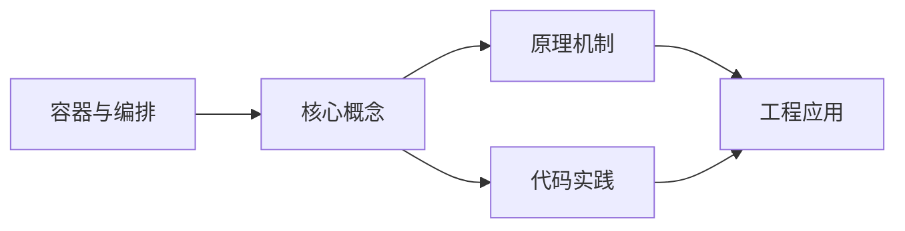
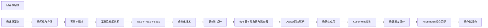

## 1. 学习目标（Bloom 分类）

本节按照布鲁姆教育目标分类学组织学习路径。本文主题为《容器与编排》，属于 云计算 模块，读者可以根据自身阶段选择阅读深度。

记忆层面：能够准确复述本文的核心概念、术语与基本语法或操作步骤，并能够在提问或检索时快速定位对应知识点。能够说出 云计算 的核心概念、组件与标准流程。

理解层面：能够用自己的语言解释核心原理与工作机制，说明概念之间的因果关系，而不是机械记忆结论。能够解释 云计算 的工作原理与关键机制。

应用层面：能够在真实项目或练习场景中运用本文知识解决具体问题，写出正确且可维护的实现。能够执行 云计算 相关的标准操作与配置。

分析层面：能够拆解复杂问题，比较本文主题与相邻概念的异同，识别边界条件与例外情况。能够分析 云计算 方案在可靠性、成本与性能上的权衡。

评价层面：能够根据约束条件（性能、可读性、安全、成本）评价不同方案的优劣，做出有依据的技术决策。能够评价 云计算 中的技术选型。

创造层面：能够把本文知识与其他模块知识组合，设计出新的解决方案或可复用的工程模式。能够设计基于 云计算 的完整解决方案。

通过本节学习，读者应当能够把《容器与编排》纳入自己的知识网络，并与 云计算 模块的其他主题（IaaS/PaaS/SaaS、虚拟化、云原生、成本治理）建立关联。

## 2. 历史动机与发展脉络

《容器与编排》是 云计算 领域的重要主题。要真正理解它，需要先了解它解决的问题与演进过程。

云计算源于 1960 年代分时思想，2006 年 AWS 推出 EC2/S3 开启现代云服务时代；公有云（AWS/Azure/GCP/阿里云/华为云）与私有云、混合云并存。
服务模型：IaaS（虚拟机/存储/网络）、PaaS（托管运行时/数据库）、SaaS（应用即服务）；FaaS（函数即服务）进一步抽象。
云原生：容器、微服务、服务网格、声明式 API、不可变基础设施；CNCF 生态是云原生事实标准。

回到本文主题：容器与编排 的提出与成熟，正是上述技术背景下的必然产物。早期实现往往以简单可用为目标，随着工程规模扩大，社区逐渐沉淀出标准做法与最佳实践；理解这一脉络，可以帮助读者判断“为什么文档中的推荐写法是现在这个样子”，也能在遇到历史遗留代码时准确识别其设计年代与取舍。


## 3. 形式化定义与核心概念精讲

本节把《容器与编排》涉及的核心概念以“定义 + 讲解”的形式展开。读者应把定义当作工具，把讲解当作理解路径；两者结合才能形成可迁移的知识。

虚拟化：虚拟机（Hypervisor 硬件隔离）与容器（OS 级隔离）；虚拟化是弹性与多租户的基础。
核心服务：计算（EC2/ECS）、存储（对象/块/文件）、网络（VPC/负载均衡/CDN）、数据库（托管 RDS/NoSQL）。
弹性与计费：按需、预留、Spot；自动扩缩容（HPA/ASG）；FinOps 治理成本。

### 3.1 原文章节逐一精讲

原文档把主题拆分为 4 个小节，下面按顺序给出每一节的导读讲解，随后保留原文细节供精读。

#### 原文精读（完整保留）


#### 1. Docker 容器技术

##### 1.1 Docker 核心概念

| 概念           | 说明                             |
| :------------- | :------------------------------- |
| **镜像**       | 只读模板，包含运行应用所需的一切 |
| **容器**       | 镜像的运行实例，隔离的进程       |
| **Dockerfile** | 构建镜像的指令文件               |
| **Registry**   | 镜像仓库，存储和分发镜像         |
| **Volume**     | 数据卷，持久化容器数据           |
| **Network**    | 容器网络，容器间通信             |

##### 1.2 Dockerfile 编写

```dockerfile
# 多阶段构建 - Node.js 应用
# 阶段1: 构建
FROM node:20-alpine AS builder
WORKDIR /app
COPY package*.json ./
RUN npm ci --only=production
COPY . .
RUN npm run build

# 阶段2: 运行
FROM node:20-alpine
WORKDIR /app
COPY --from=builder /app/dist ./dist
COPY --from=builder /app/node_modules ./node_modules
COPY --from=builder /app/package.json ./

# 非 root 用户
RUN addgroup -g 1001 appgroup && adduser -u 1001 -G appgroup -s /bin/sh -D appuser
USER appuser

EXPOSE 3000
HEALTHCHECK --interval=30s --timeout=3s \
  CMD wget --no-verbose --tries=1 --spider http://localhost:3000/health || exit 1

CMD ["node", "dist/main.js"]
```

##### 1.3 Dockerfile 最佳实践

| 实践              | 说明               |
| :---------------- | :----------------- |
| **多阶段构建**    | 减小最终镜像体积   |
| **使用 Alpine**   | 基础镜像选择精简版 |
| **合并 RUN 指令** | 减少镜像层数       |
| **.dockerignore** | 排除不需要的文件   |
| **非 root 运行**  | 安全性考虑         |
| **固定版本标签**  | 避免使用 latest    |

```dockerfile
# 合并 RUN 指令减少层数
RUN apt-get update && \
    apt-get install -y --no-install-recommends curl git && \
    rm -rf /var/lib/apt/lists/*
```

##### 1.4 Docker Compose

```yaml
# docker-compose.yml
version: '3.8'

services:
  app:
    build:
      context: .
      dockerfile: Dockerfile
    ports:
      - '3000:3000'
    environment:
      - NODE_ENV=production
      - DB_HOST=postgres
      - REDIS_HOST=redis
    depends_on:
      postgres:
        condition: service_healthy
      redis:
        condition: service_started
    restart: unless-stopped
    deploy:
      resources:
        limits:
          memory: 512M
          cpus: '0.5'

  postgres:
    image: postgres:16-alpine
    environment:
      POSTGRES_DB: myapp
      POSTGRES_USER: app
      POSTGRES_PASSWORD_FILE: /run/secrets/db_password
    volumes:
      - pgdata:/var/lib/postgresql/data
    healthcheck:
      test: ['CMD-SHELL', 'pg_isready -U app -d myapp']
      interval: 10s
      timeout: 5s
      retries: 5
    secrets:
      - db_password

  redis:
    image: redis:7-alpine
    command: redis-server --maxmemory 256mb --maxmemory-policy allkeys-lru
    volumes:
      - redisdata:/data

  nginx:
    image: nginx:alpine
    ports:
      - '80:80'
      - '443:443'
    volumes:
      - ./nginx.conf:/etc/nginx/nginx.conf:ro
    depends_on:
      - app

volumes:
  pgdata:
  redisdata:

secrets:
  db_password:
    file: ./secrets/db_password.txt
```

##### 1.5 常用 Docker 命令

```bash
# 镜像操作
docker build -t myapp:v1 .              # 构建镜像
docker images                            # 列出镜像
docker push registry/myapp:v1           # 推送镜像
docker rmi myapp:v1                     # 删除镜像

# 容器操作
docker run -d -p 3000:3000 --name app myapp:v1  # 运行容器
docker ps                                # 运行中的容器
docker logs -f app                       # 查看日志
docker exec -it app sh                   # 进入容器
docker stop app && docker rm app         # 停止并删除

# Compose 操作
docker compose up -d                     # 启动所有服务
docker compose down -v                   # 停止并删除（含数据卷）
docker compose logs -f app               # 跟踪日志
docker compose ps                        # 服务状态
```

#### 2. Kubernetes 编排

##### 2.1 K8s 核心概念

```mermaid
flowchart TD
    subgraph Cluster[Kubernetes Cluster]
        CP[Control Plane<br/>API Server / etcd / Scheduler / Controller Mgr]
        subgraph N1[Node 1]
            P1[Pod A] P2[Pod B]
            K1[kubelet kube-proxy]
        end
        subgraph N2[Node 2]
            P3[Pod C] P4[Pod D]
            K2[kubelet kube-proxy]
        end
        subgraph N3[Node 3]
            P5[Pod E] P6[Pod F]
            K3[kubelet kube-proxy]
        end
        CP --- N1
        CP --- N2
        CP --- N3
    end
```

##### 2.2 Pod

```yaml
# pod.yaml
apiVersion: v1
kind: Pod
metadata:
  name: myapp-pod
  labels:
    app: myapp
    tier: frontend
spec:
  containers:
    - name: app
      image: registry/myapp:v1
      ports:
        - containerPort: 3000
      resources:
        requests:
          memory: '256Mi'
          cpu: '250m'
        limits:
          memory: '512Mi'
          cpu: '500m'
      env:
        - name: NODE_ENV
          value: 'production'
        - name: DB_PASSWORD
          valueFrom:
            secretKeyRef:
              name: db-secret
              key: password
      livenessProbe:
        httpGet:
          path: /health
          port: 3000
        initialDelaySeconds: 15
        periodSeconds: 20
      readinessProbe:
        httpGet:
          path: /ready
          port: 3000
        initialDelaySeconds: 5
        periodSeconds: 10
    - name: log-sidecar
      image: fluent/fluentd:latest
      volumeMounts:
        - name: log-volume
          mountPath: /var/log/app
  volumes:
    - name: log-volume
      emptyDir: {}
```

##### 2.3 Deployment

```yaml
# deployment.yaml
apiVersion: apps/v1
kind: Deployment
metadata:
  name: myapp-deployment
  labels:
    app: myapp
spec:
  replicas: 3
  selector:
    matchLabels:
      app: myapp
  strategy:
    type: RollingUpdate
    rollingUpdate:
      maxSurge: 1 # 滚动更新时最多多出1个Pod
      maxUnavailable: 0 # 滚动更新时不允许不可用
  template:
    metadata:
      labels:
        app: myapp
    spec:
      containers:
        - name: app
          image: registry/myapp:v2
          ports:
            - containerPort: 3000
          resources:
            requests:
              memory: '256Mi'
              cpu: '250m'
            limits:
              memory: '512Mi'
              cpu: '500m'
```

##### 2.4 Service

```yaml
# service.yaml
apiVersion: v1
kind: Service
metadata:
  name: myapp-service
spec:
  selector:
    app: myapp
  ports:
    - protocol: TCP
      port: 80 # Service 端口
      targetPort: 3000 # Pod 端口
  type: ClusterIP # 集群内部访问
```

| Service 类型     | 说明                        | 适用场景     |
| :--------------- | :-------------------------- | :----------- |
| **ClusterIP**    | 集群内部 IP（默认）         | 内部服务通信 |
| **NodePort**     | 节点端口映射（30000-32767） | 开发测试     |
| **LoadBalancer** | 云商负载均衡器              | 生产对外服务 |
| **ExternalName** | CNAME 映射到外部域名        | 外部服务引用 |

##### 2.5 Ingress

```yaml
# ingress.yaml
apiVersion: networking.k8s.io/v1
kind: Ingress
metadata:
  name: myapp-ingress
  annotations:
    nginx.ingress.kubernetes.io/ssl-redirect: 'true'
    nginx.ingress.kubernetes.io/rate-limit: '100'
spec:
  ingressClassName: nginx
  tls:
    - hosts:
        - api.example.com
      secretName: tls-secret
  rules:
    - host: api.example.com
      http:
        paths:
          - path: /v1
            pathType: Prefix
            backend:
              service:
                name: myapp-v1-service
                port:
                  number: 80
          - path: /v2
            pathType: Prefix
            backend:
              service:
                name: myapp-v2-service
                port:
                  number: 80
```

##### 2.6 ConfigMap 与 Secret

```yaml
# configmap.yaml
apiVersion: v1
kind: ConfigMap
metadata:
  name: app-config
data:
  NODE_ENV: 'production'
  LOG_LEVEL: 'info'
  MAX_CONNECTIONS: '100'
  app.json: |
    {
      "theme": "dark",
      "language": "zh-CN"
    }

---
# secret.yaml
apiVersion: v1
kind: Secret
metadata:
  name: db-secret
type: Opaque
data:
  username: YWRtaW4= # base64("admin")
  password: cGFzc3dvcmQxMjM= # base64("password123")
stringData:
  connection-string: 'postgresql://admin:password123@db:5432/myapp'
```

##### 2.7 HPA 自动伸缩

```yaml
# hpa.yaml
apiVersion: autoscaling/v2
kind: HorizontalPodAutoscaler
metadata:
  name: myapp-hpa
spec:
  scaleTargetRef:
    apiVersion: apps/v1
    kind: Deployment
    name: myapp-deployment
  minReplicas: 2
  maxReplicas: 10
  metrics:
    - type: Resource
      resource:
        name: cpu
        target:
          type: Utilization
          averageUtilization: 70
    - type: Resource
      resource:
        name: memory
        target:
          type: Utilization
          averageUtilization: 80
  behavior:
    scaleUp:
      stabilizationWindowSeconds: 60
      policies:
        - type: Percent
          value: 100
          periodSeconds: 60
    scaleDown:
      stabilizationWindowSeconds: 300
      policies:
        - type: Percent
          value: 10
          periodSeconds: 60
```

##### 2.8 常用 kubectl 命令

```bash
# 资源查看
kubectl get pods -A                          # 所有命名空间的 Pod
kubectl get deploy,svc,ing -n production     # 查看多种资源
kubectl describe pod myapp-pod               # Pod 详情
kubectl logs -f deployment/myapp -c app      # 跟踪日志

# 资源操作
kubectl apply -f deployment.yaml             # 应用配置
kubectl delete -f deployment.yaml            # 删除资源
kubectl scale deployment myapp --replicas=5  # 手动扩缩容

# 调试
kubectl exec -it myapp-pod -- sh             # 进入容器
kubectl port-forward svc/myapp 8080:80       # 端口转发
kubectl top pods                             # 资源使用

# 滚动更新
kubectl set image deployment/myapp app=registry/myapp:v3
kubectl rollout status deployment/myapp
kubectl rollout undo deployment/myapp        # 回滚
```

#### 3. Helm 包管理

##### 3.1 Helm Chart 结构



##### 3.2 Chart.yaml

```yaml
apiVersion: v2
name: myapp
description: My Application Helm Chart
type: application
version: 1.2.3 # Chart 版本
appVersion: '2.3.1' # 应用版本
dependencies:
  - name: postgresql
    version: '14.x.x'
    repository: 'https://charts.bitnami.com/bitnami'
    condition: postgresql.enabled
  - name: redis
    version: '18.x.x'
    repository: 'https://charts.bitnami.com/bitnami'
    condition: redis.enabled
```

##### 3.3 values.yaml

```yaml
# 镜像配置
image:
  repository: registry/myapp
  tag: '2.3.1'
  pullPolicy: IfNotPresent

# 副本数
replicaCount: 3

# 资源限制
resources:
  requests:
    cpu: 250m
    memory: 256Mi
  limits:
    cpu: 500m
    memory: 512Mi

# Service 配置
service:
  type: ClusterIP
  port: 80

# Ingress 配置
ingress:
  enabled: true
  className: nginx
  hosts:
    - host: api.example.com
      paths:
        - path: /
          pathType: Prefix
  tls:
    - secretName: tls-secret
      hosts:
        - api.example.com

# 自动伸缩
autoscaling:
  enabled: true
  minReplicas: 2
  maxReplicas: 10
  targetCPUUtilizationPercentage: 70

# 依赖开关
postgresql:
  enabled: true
redis:
  enabled: true
```

##### 3.4 Helm 常用命令

```bash
# 添加仓库
helm repo add bitnami https://charts.bitnami.com/bitnami
helm repo update

# 安装/升级
helm install myapp ./myapp-chart -n production
helm upgrade myapp ./myapp-chart -n production
helm upgrade --install myapp ./myapp-chart -n production -f values-prod.yaml

# 查看
helm list -n production
helm status myapp -n production
helm history myapp -n production

# 回滚
helm rollback myapp 1 -n production

# 卸载
helm uninstall myapp -n production
```

#### 4. 容器镜像仓库

##### 4.1 仓库类型

| 类型         | 产品             | 特点       |
| :----------- | :--------------- | :--------- |
| **公有仓库** | Docker Hub、GHCR | 免费、公开 |
| **云商仓库** | ECR、ACR、Harbor | 集成、安全 |
| **私有仓库** | Harbor、Nexus    | 完全自控   |

##### 4.2 Harbor 私有仓库

```bash
# Docker 登录私有仓库
docker login harbor.example.com

# 镜像标签与推送
docker tag myapp:v1 harbor.example.com/project/myapp:v1
docker push harbor.example.com/project/myapp:v1

# 拉取镜像
docker pull harbor.example.com/project/myapp:v1

# K8s 使用私有仓库
kubectl create secret docker-registry harbor-secret \
  --docker-server=harbor.example.com \
  --docker-username=admin \
  --docker-password=Harbor12345 \
  -n production
```

##### 4.3 镜像安全扫描

```bash
# Trivy 扫描
trivy image harbor.example.com/project/myapp:v1

# 扫描严重漏洞
trivy image --severity HIGH,CRITICAL harbor.example.com/project/myapp:v1

# CI 中集成扫描
trivy image --exit-code 1 --severity HIGH,CRITICAL myapp:v1
```

##### 4.4 镜像标签策略

| 标签         | 说明                       | 示例            |
| :----------- | :------------------------- | :-------------- |
| **Git SHA**  | 精确对应代码版本           | `sha-abc1234`   |
| **语义版本** | 正式发布版本               | `v2.3.1`        |
| **分支名**   | 开发分支构建               | `main-20260614` |
| **latest**   | 最新构建（不推荐生产使用） | `latest`        |


### 3.2 概念关系图

下面用 Mermaid 图表达本文核心概念之间的关系，帮助读者建立整体图景：



图中展示的是本文知识的结构化关系：核心概念是入口，原理机制解释“为什么”，代码实践演示“怎么做”，工程应用回答“何时用”。读者学习时可以把每个小节的内容挂接到对应节点上。

## 4. 理论推导与原理解析

本节深入《容器与编排》背后的原理。理论部分不求面面俱到，而是聚焦“能解释现象、能指导实践”的关键推导。

虚拟化：虚拟机（Hypervisor 硬件隔离）与容器（OS 级隔离）；虚拟化是弹性与多租户的基础。
核心服务：计算（EC2/ECS）、存储（对象/块/文件）、网络（VPC/负载均衡/CDN）、数据库（托管 RDS/NoSQL）。
弹性与计费：按需、预留、Spot；自动扩缩容（HPA/ASG）；FinOps 治理成本。
高可用设计：多可用区、故障域、跨区域容灾；RPO/RTO 目标驱动方案。

需要强调的是，理论推导与工程实践之间存在翻译层：理论给出的是理想化模型与边界条件，工程代码则必须处理真实环境中的例外。读者在学习时应先掌握理论的“标准情形”，再通过陷阱章节了解“非标准情形”。

## 5. 代码示例与逐行讲解

本节把原文中的代码示例系统整理，并为每个示例补充用途说明与讲解。读者不应只浏览代码，而应逐段对照讲解理解设计意图。

### 5.1 示例：1.2 Dockerfile 编写

该示例来自原文《1.2 Dockerfile 编写》小节，用于演示容器与编排相关操作。阅读时请先看代码结构，再看其后的讲解。

```dockerfile
# 多阶段构建 - Node.js 应用
# 阶段1: 构建
FROM node:20-alpine AS builder
WORKDIR /app
COPY package*.json ./
RUN npm ci --only=production
COPY . .
RUN npm run build

# 阶段2: 运行
FROM node:20-alpine
WORKDIR /app
COPY --from=builder /app/dist ./dist
COPY --from=builder /app/node_modules ./node_modules
COPY --from=builder /app/package.json ./

# 非 root 用户
RUN addgroup -g 1001 appgroup && adduser -u 1001 -G appgroup -s /bin/sh -D appuser
USER appuser

EXPOSE 3000
HEALTHCHECK --interval=30s --timeout=3s \
  CMD wget --no-verbose --tries=1 --spider http://localhost:3000/health || exit 1

CMD ["node", "dist/main.js"]
```

讲解：这段代码演示了本节核心知识点。代码中的关键操作可以归纳为三步：准备（定义或初始化）、执行（核心逻辑）、收尾（释放资源或返回结果）。实际项目中，这三步往往被封装为函数或类，以提升复用性与可测试性。

关键点分析：

该示例共 21 行有效代码，包含 1 类关键结构（FROM）。其中：

- 入口与初始化部分负责建立上下文，对应实际项目中的启动或装配逻辑；
- 核心逻辑部分体现本文主题的主要操作，是阅读时最需要对照讲解理解的部分；
- 输出或返回部分把结果交给调用方，注意其类型与边界条件。

进阶思考路径：先尝试修改参数观察行为变化，再把示例中的模式迁移到自己的项目中；每次修改都记录预期与实测差异，这是把示例转化为能力的最快方式。

### 5.2 示例：1.3 Dockerfile 最佳实践

该示例来自原文《1.3 Dockerfile 最佳实践》小节，用于演示容器与编排相关操作。阅读时请先看代码结构，再看其后的讲解。

```dockerfile
# 合并 RUN 指令减少层数
RUN apt-get update && \
    apt-get install -y --no-install-recommends curl git && \
    rm -rf /var/lib/apt/lists/*
```

讲解：这段代码演示了本节核心知识点。代码中的关键操作可以归纳为三步：准备（定义或初始化）、执行（核心逻辑）、收尾（释放资源或返回结果）。实际项目中，这三步往往被封装为函数或类，以提升复用性与可测试性。

关键点分析：

该示例共 4 行有效代码，结构以数据或配置为主。阅读时应关注：数据字段的含义、配置项的作用，以及它们与运行行为的对应关系。

进阶思考路径：先尝试修改参数观察行为变化，再把示例中的模式迁移到自己的项目中；每次修改都记录预期与实测差异，这是把示例转化为能力的最快方式。

### 5.3 示例：1.4 Docker Compose

该示例来自原文《1.4 Docker Compose》小节，用于演示容器与编排相关操作。阅读时请先看代码结构，再看其后的讲解。

```yaml
# docker-compose.yml
version: '3.8'

services:
  app:
    build:
      context: .
      dockerfile: Dockerfile
    ports:
      - '3000:3000'
    environment:
      - NODE_ENV=production
      - DB_HOST=postgres
      - REDIS_HOST=redis
    depends_on:
      postgres:
        condition: service_healthy
      redis:
        condition: service_started
    restart: unless-stopped
    deploy:
      resources:
        limits:
          memory: 512M
          cpus: '0.5'

  postgres:
    image: postgres:16-alpine
    environment:
      POSTGRES_DB: myapp
      POSTGRES_USER: app
      POSTGRES_PASSWORD_FILE: /run/secrets/db_password
    volumes:
      - pgdata:/var/lib/postgresql/data
    healthcheck:
      test: ['CMD-SHELL', 'pg_isready -U app -d myapp']
      interval: 10s
      timeout: 5s
      retries: 5
    secrets:
      - db_password

  redis:
    image: redis:7-alpine
    command: redis-server --maxmemory 256mb --maxmemory-policy allkeys-lru
    volumes:
      - redisdata:/data

  nginx:
    image: nginx:alpine
    ports:
      - '80:80'
      - '443:443'
    volumes:
      - ./nginx.conf:/etc/nginx/nginx.conf:ro
    depends_on:
      - app

volumes:
  pgdata:
  redisdata:

secrets:
  db_password:
    file: ./secrets/db_password.txt
```

讲解：这段代码演示了本节核心知识点。代码中的关键操作可以归纳为三步：准备（定义或初始化）、执行（核心逻辑）、收尾（释放资源或返回结果）。实际项目中，这三步往往被封装为函数或类，以提升复用性与可测试性。

关键点分析：

该示例共 59 行有效代码，包含 1 类关键结构（dockerfile）。其中：

- 入口与初始化部分负责建立上下文，对应实际项目中的启动或装配逻辑；
- 核心逻辑部分体现本文主题的主要操作，是阅读时最需要对照讲解理解的部分；
- 输出或返回部分把结果交给调用方，注意其类型与边界条件。

进阶思考路径：先尝试修改参数观察行为变化，再把示例中的模式迁移到自己的项目中；每次修改都记录预期与实测差异，这是把示例转化为能力的最快方式。

### 5.4 示例：1.5 常用 Docker 命令

该示例来自原文《1.5 常用 Docker 命令》小节，用于演示容器与编排相关操作。阅读时请先看代码结构，再看其后的讲解。

```bash
# 镜像操作
docker build -t myapp:v1 .              # 构建镜像
docker images                            # 列出镜像
docker push registry/myapp:v1           # 推送镜像
docker rmi myapp:v1                     # 删除镜像

# 容器操作
docker run -d -p 3000:3000 --name app myapp:v1  # 运行容器
docker ps                                # 运行中的容器
docker logs -f app                       # 查看日志
docker exec -it app sh                   # 进入容器
docker stop app && docker rm app         # 停止并删除

# Compose 操作
docker compose up -d                     # 启动所有服务
docker compose down -v                   # 停止并删除（含数据卷）
docker compose logs -f app               # 跟踪日志
docker compose ps                        # 服务状态
```

讲解：这段代码演示了本节核心知识点。代码中的关键操作可以归纳为三步：准备（定义或初始化）、执行（核心逻辑）、收尾（释放资源或返回结果）。实际项目中，这三步往往被封装为函数或类，以提升复用性与可测试性。

关键点分析：

该示例共 16 行有效代码，结构以数据或配置为主。阅读时应关注：数据字段的含义、配置项的作用，以及它们与运行行为的对应关系。

进阶思考路径：先尝试修改参数观察行为变化，再把示例中的模式迁移到自己的项目中；每次修改都记录预期与实测差异，这是把示例转化为能力的最快方式。

### 5.5 示例：2.1 K8s 核心概念

该示例来自原文《2.1 K8s 核心概念》小节，用于演示容器与编排相关操作。阅读时请先看代码结构，再看其后的讲解。

```mermaid
flowchart TD
    subgraph Cluster[Kubernetes Cluster]
        CP[Control Plane<br/>API Server / etcd / Scheduler / Controller Mgr]
        subgraph N1[Node 1]
            P1[Pod A] P2[Pod B]
            K1[kubelet kube-proxy]
        end
        subgraph N2[Node 2]
            P3[Pod C] P4[Pod D]
            K2[kubelet kube-proxy]
        end
        subgraph N3[Node 3]
            P5[Pod E] P6[Pod F]
            K3[kubelet kube-proxy]
        end
        CP --- N1
        CP --- N2
        CP --- N3
    end
```

讲解：这段代码演示了本节核心知识点。代码中的关键操作可以归纳为三步：准备（定义或初始化）、执行（核心逻辑）、收尾（释放资源或返回结果）。实际项目中，这三步往往被封装为函数或类，以提升复用性与可测试性。

关键点分析：

该示例共 19 行有效代码，结构以数据或配置为主。阅读时应关注：数据字段的含义、配置项的作用，以及它们与运行行为的对应关系。

进阶思考路径：先尝试修改参数观察行为变化，再把示例中的模式迁移到自己的项目中；每次修改都记录预期与实测差异，这是把示例转化为能力的最快方式。

### 5.6 示例：2.2 Pod

该示例来自原文《2.2 Pod》小节，用于演示容器与编排相关操作。阅读时请先看代码结构，再看其后的讲解。

```yaml
# pod.yaml
apiVersion: v1
kind: Pod
metadata:
  name: myapp-pod
  labels:
    app: myapp
    tier: frontend
spec:
  containers:
    - name: app
      image: registry/myapp:v1
      ports:
        - containerPort: 3000
      resources:
        requests:
          memory: '256Mi'
          cpu: '250m'
        limits:
          memory: '512Mi'
          cpu: '500m'
      env:
        - name: NODE_ENV
          value: 'production'
        - name: DB_PASSWORD
          valueFrom:
            secretKeyRef:
              name: db-secret
              key: password
      livenessProbe:
        httpGet:
          path: /health
          port: 3000
        initialDelaySeconds: 15
        periodSeconds: 20
      readinessProbe:
        httpGet:
          path: /ready
          port: 3000
        initialDelaySeconds: 5
        periodSeconds: 10
    - name: log-sidecar
      image: fluent/fluentd:latest
      volumeMounts:
        - name: log-volume
          mountPath: /var/log/app
  volumes:
    - name: log-volume
      emptyDir: {}
```

讲解：这段代码演示了本节核心知识点。代码中的关键操作可以归纳为三步：准备（定义或初始化）、执行（核心逻辑）、收尾（释放资源或返回结果）。实际项目中，这三步往往被封装为函数或类，以提升复用性与可测试性。

关键点分析：

该示例共 49 行有效代码，包含 1 类关键结构（apiVersion）。其中：

- 入口与初始化部分负责建立上下文，对应实际项目中的启动或装配逻辑；
- 核心逻辑部分体现本文主题的主要操作，是阅读时最需要对照讲解理解的部分；
- 输出或返回部分把结果交给调用方，注意其类型与边界条件。

进阶思考路径：先尝试修改参数观察行为变化，再把示例中的模式迁移到自己的项目中；每次修改都记录预期与实测差异，这是把示例转化为能力的最快方式。

### 5.7 示例：2.3 Deployment

该示例来自原文《2.3 Deployment》小节，用于演示容器与编排相关操作。阅读时请先看代码结构，再看其后的讲解。

```yaml
# deployment.yaml
apiVersion: apps/v1
kind: Deployment
metadata:
  name: myapp-deployment
  labels:
    app: myapp
spec:
  replicas: 3
  selector:
    matchLabels:
      app: myapp
  strategy:
    type: RollingUpdate
    rollingUpdate:
      maxSurge: 1 # 滚动更新时最多多出1个Pod
      maxUnavailable: 0 # 滚动更新时不允许不可用
  template:
    metadata:
      labels:
        app: myapp
    spec:
      containers:
        - name: app
          image: registry/myapp:v2
          ports:
            - containerPort: 3000
          resources:
            requests:
              memory: '256Mi'
              cpu: '250m'
            limits:
              memory: '512Mi'
              cpu: '500m'
```

讲解：这段代码演示了本节核心知识点。代码中的关键操作可以归纳为三步：准备（定义或初始化）、执行（核心逻辑）、收尾（释放资源或返回结果）。实际项目中，这三步往往被封装为函数或类，以提升复用性与可测试性。

关键点分析：

该示例共 34 行有效代码，包含 1 类关键结构（apiVersion）。其中：

- 入口与初始化部分负责建立上下文，对应实际项目中的启动或装配逻辑；
- 核心逻辑部分体现本文主题的主要操作，是阅读时最需要对照讲解理解的部分；
- 输出或返回部分把结果交给调用方，注意其类型与边界条件。

进阶思考路径：先尝试修改参数观察行为变化，再把示例中的模式迁移到自己的项目中；每次修改都记录预期与实测差异，这是把示例转化为能力的最快方式。

### 5.8 示例：2.4 Service

该示例来自原文《2.4 Service》小节，用于演示容器与编排相关操作。阅读时请先看代码结构，再看其后的讲解。

```yaml
# service.yaml
apiVersion: v1
kind: Service
metadata:
  name: myapp-service
spec:
  selector:
    app: myapp
  ports:
    - protocol: TCP
      port: 80 # Service 端口
      targetPort: 3000 # Pod 端口
  type: ClusterIP # 集群内部访问
```

讲解：这段代码演示了本节核心知识点。代码中的关键操作可以归纳为三步：准备（定义或初始化）、执行（核心逻辑）、收尾（释放资源或返回结果）。实际项目中，这三步往往被封装为函数或类，以提升复用性与可测试性。

关键点分析：

该示例共 13 行有效代码，包含 1 类关键结构（apiVersion）。其中：

- 入口与初始化部分负责建立上下文，对应实际项目中的启动或装配逻辑；
- 核心逻辑部分体现本文主题的主要操作，是阅读时最需要对照讲解理解的部分；
- 输出或返回部分把结果交给调用方，注意其类型与边界条件。

进阶思考路径：先尝试修改参数观察行为变化，再把示例中的模式迁移到自己的项目中；每次修改都记录预期与实测差异，这是把示例转化为能力的最快方式。

### 5.9 示例：2.5 Ingress

该示例来自原文《2.5 Ingress》小节，用于演示容器与编排相关操作。阅读时请先看代码结构，再看其后的讲解。

```yaml
# ingress.yaml
apiVersion: networking.k8s.io/v1
kind: Ingress
metadata:
  name: myapp-ingress
  annotations:
    nginx.ingress.kubernetes.io/ssl-redirect: 'true'
    nginx.ingress.kubernetes.io/rate-limit: '100'
spec:
  ingressClassName: nginx
  tls:
    - hosts:
        - api.example.com
      secretName: tls-secret
  rules:
    - host: api.example.com
      http:
        paths:
          - path: /v1
            pathType: Prefix
            backend:
              service:
                name: myapp-v1-service
                port:
                  number: 80
          - path: /v2
            pathType: Prefix
            backend:
              service:
                name: myapp-v2-service
                port:
                  number: 80
```

讲解：这段代码演示了本节核心知识点。代码中的关键操作可以归纳为三步：准备（定义或初始化）、执行（核心逻辑）、收尾（释放资源或返回结果）。实际项目中，这三步往往被封装为函数或类，以提升复用性与可测试性。

关键点分析：

该示例共 32 行有效代码，包含 1 类关键结构（apiVersion）。其中：

- 入口与初始化部分负责建立上下文，对应实际项目中的启动或装配逻辑；
- 核心逻辑部分体现本文主题的主要操作，是阅读时最需要对照讲解理解的部分；
- 输出或返回部分把结果交给调用方，注意其类型与边界条件。

进阶思考路径：先尝试修改参数观察行为变化，再把示例中的模式迁移到自己的项目中；每次修改都记录预期与实测差异，这是把示例转化为能力的最快方式。

### 5.10 示例：2.6 ConfigMap 与 Secret

该示例来自原文《2.6 ConfigMap 与 Secret》小节，用于演示容器与编排相关操作。阅读时请先看代码结构，再看其后的讲解。

```yaml
# configmap.yaml
apiVersion: v1
kind: ConfigMap
metadata:
  name: app-config
data:
  NODE_ENV: 'production'
  LOG_LEVEL: 'info'
  MAX_CONNECTIONS: '100'
  app.json: |
    {
      "theme": "dark",
      "language": "zh-CN"
    }

---
# secret.yaml
apiVersion: v1
kind: Secret
metadata:
  name: db-secret
type: Opaque
data:
  username: YWRtaW4= # base64("admin")
  password: cGFzc3dvcmQxMjM= # base64("password123")
stringData:
  connection-string: 'postgresql://admin:password123@db:5432/myapp'
```

讲解：这段代码演示了本节核心知识点。代码中的关键操作可以归纳为三步：准备（定义或初始化）、执行（核心逻辑）、收尾（释放资源或返回结果）。实际项目中，这三步往往被封装为函数或类，以提升复用性与可测试性。

关键点分析：

该示例共 26 行有效代码，包含 1 类关键结构（apiVersion）。其中：

- 入口与初始化部分负责建立上下文，对应实际项目中的启动或装配逻辑；
- 核心逻辑部分体现本文主题的主要操作，是阅读时最需要对照讲解理解的部分；
- 输出或返回部分把结果交给调用方，注意其类型与边界条件。

进阶思考路径：先尝试修改参数观察行为变化，再把示例中的模式迁移到自己的项目中；每次修改都记录预期与实测差异，这是把示例转化为能力的最快方式。

### 5.11 示例：2.7 HPA 自动伸缩

该示例来自原文《2.7 HPA 自动伸缩》小节，用于演示容器与编排相关操作。阅读时请先看代码结构，再看其后的讲解。

```yaml
# hpa.yaml
apiVersion: autoscaling/v2
kind: HorizontalPodAutoscaler
metadata:
  name: myapp-hpa
spec:
  scaleTargetRef:
    apiVersion: apps/v1
    kind: Deployment
    name: myapp-deployment
  minReplicas: 2
  maxReplicas: 10
  metrics:
    - type: Resource
      resource:
        name: cpu
        target:
          type: Utilization
          averageUtilization: 70
    - type: Resource
      resource:
        name: memory
        target:
          type: Utilization
          averageUtilization: 80
  behavior:
    scaleUp:
      stabilizationWindowSeconds: 60
      policies:
        - type: Percent
          value: 100
          periodSeconds: 60
    scaleDown:
      stabilizationWindowSeconds: 300
      policies:
        - type: Percent
          value: 10
          periodSeconds: 60
```

讲解：这段代码演示了本节核心知识点。代码中的关键操作可以归纳为三步：准备（定义或初始化）、执行（核心逻辑）、收尾（释放资源或返回结果）。实际项目中，这三步往往被封装为函数或类，以提升复用性与可测试性。

关键点分析：

该示例共 38 行有效代码，包含 1 类关键结构（apiVersion）。其中：

- 入口与初始化部分负责建立上下文，对应实际项目中的启动或装配逻辑；
- 核心逻辑部分体现本文主题的主要操作，是阅读时最需要对照讲解理解的部分；
- 输出或返回部分把结果交给调用方，注意其类型与边界条件。

进阶思考路径：先尝试修改参数观察行为变化，再把示例中的模式迁移到自己的项目中；每次修改都记录预期与实测差异，这是把示例转化为能力的最快方式。

### 5.12 示例：2.8 常用 kubectl 命令

该示例来自原文《2.8 常用 kubectl 命令》小节，用于演示容器与编排相关操作。阅读时请先看代码结构，再看其后的讲解。

```bash
# 资源查看
kubectl get pods -A                          # 所有命名空间的 Pod
kubectl get deploy,svc,ing -n production     # 查看多种资源
kubectl describe pod myapp-pod               # Pod 详情
kubectl logs -f deployment/myapp -c app      # 跟踪日志

# 资源操作
kubectl apply -f deployment.yaml             # 应用配置
kubectl delete -f deployment.yaml            # 删除资源
kubectl scale deployment myapp --replicas=5  # 手动扩缩容

# 调试
kubectl exec -it myapp-pod -- sh             # 进入容器
kubectl port-forward svc/myapp 8080:80       # 端口转发
kubectl top pods                             # 资源使用

# 滚动更新
kubectl set image deployment/myapp app=registry/myapp:v3
kubectl rollout status deployment/myapp
kubectl rollout undo deployment/myapp        # 回滚
```

讲解：这段代码演示了本节核心知识点。代码中的关键操作可以归纳为三步：准备（定义或初始化）、执行（核心逻辑）、收尾（释放资源或返回结果）。实际项目中，这三步往往被封装为函数或类，以提升复用性与可测试性。

关键点分析：

该示例共 17 行有效代码，结构以数据或配置为主。阅读时应关注：数据字段的含义、配置项的作用，以及它们与运行行为的对应关系。

进阶思考路径：先尝试修改参数观察行为变化，再把示例中的模式迁移到自己的项目中；每次修改都记录预期与实测差异，这是把示例转化为能力的最快方式。

### 5.13 示例：3.1 Helm Chart 结构

该示例来自原文《3.1 Helm Chart 结构》小节，用于演示容器与编排相关操作。阅读时请先看代码结构，再看其后的讲解。


讲解：这段代码演示了本节核心知识点。代码中的关键操作可以归纳为三步：准备（定义或初始化）、执行（核心逻辑）、收尾（释放资源或返回结果）。实际项目中，这三步往往被封装为函数或类，以提升复用性与可测试性。

关键点分析：

该示例共 19 行有效代码，结构以数据或配置为主。阅读时应关注：数据字段的含义、配置项的作用，以及它们与运行行为的对应关系。

进阶思考路径：先尝试修改参数观察行为变化，再把示例中的模式迁移到自己的项目中；每次修改都记录预期与实测差异，这是把示例转化为能力的最快方式。

### 5.14 示例：3.2 Chart.yaml

该示例来自原文《3.2 Chart.yaml》小节，用于演示容器与编排相关操作。阅读时请先看代码结构，再看其后的讲解。

```yaml
apiVersion: v2
name: myapp
description: My Application Helm Chart
type: application
version: 1.2.3 # Chart 版本
appVersion: '2.3.1' # 应用版本
dependencies:
  - name: postgresql
    version: '14.x.x'
    repository: 'https://charts.bitnami.com/bitnami'
    condition: postgresql.enabled
  - name: redis
    version: '18.x.x'
    repository: 'https://charts.bitnami.com/bitnami'
    condition: redis.enabled
```

讲解：这段代码演示了本节核心知识点。代码中的关键操作可以归纳为三步：准备（定义或初始化）、执行（核心逻辑）、收尾（释放资源或返回结果）。实际项目中，这三步往往被封装为函数或类，以提升复用性与可测试性。

关键点分析：

该示例共 15 行有效代码，包含 1 类关键结构（apiVersion）。其中：

- 入口与初始化部分负责建立上下文，对应实际项目中的启动或装配逻辑；
- 核心逻辑部分体现本文主题的主要操作，是阅读时最需要对照讲解理解的部分；
- 输出或返回部分把结果交给调用方，注意其类型与边界条件。

进阶思考路径：先尝试修改参数观察行为变化，再把示例中的模式迁移到自己的项目中；每次修改都记录预期与实测差异，这是把示例转化为能力的最快方式。

### 5.15 示例：3.3 values.yaml

该示例来自原文《3.3 values.yaml》小节，用于演示容器与编排相关操作。阅读时请先看代码结构，再看其后的讲解。

```yaml
# 镜像配置
image:
  repository: registry/myapp
  tag: '2.3.1'
  pullPolicy: IfNotPresent

# 副本数
replicaCount: 3

# 资源限制
resources:
  requests:
    cpu: 250m
    memory: 256Mi
  limits:
    cpu: 500m
    memory: 512Mi

# Service 配置
service:
  type: ClusterIP
  port: 80

# Ingress 配置
ingress:
  enabled: true
  className: nginx
  hosts:
    - host: api.example.com
      paths:
        - path: /
          pathType: Prefix
  tls:
    - secretName: tls-secret
      hosts:
        - api.example.com

# 自动伸缩
autoscaling:
  enabled: true
  minReplicas: 2
  maxReplicas: 10
  targetCPUUtilizationPercentage: 70

# 依赖开关
postgresql:
  enabled: true
redis:
  enabled: true
```

讲解：这段代码演示了本节核心知识点。代码中的关键操作可以归纳为三步：准备（定义或初始化）、执行（核心逻辑）、收尾（释放资源或返回结果）。实际项目中，这三步往往被封装为函数或类，以提升复用性与可测试性。

关键点分析：

该示例共 43 行有效代码，包含 1 类关键结构（class）。其中：

- 入口与初始化部分负责建立上下文，对应实际项目中的启动或装配逻辑；
- 核心逻辑部分体现本文主题的主要操作，是阅读时最需要对照讲解理解的部分；
- 输出或返回部分把结果交给调用方，注意其类型与边界条件。

进阶思考路径：先尝试修改参数观察行为变化，再把示例中的模式迁移到自己的项目中；每次修改都记录预期与实测差异，这是把示例转化为能力的最快方式。

### 5.16 示例：3.4 Helm 常用命令

该示例来自原文《3.4 Helm 常用命令》小节，用于演示容器与编排相关操作。阅读时请先看代码结构，再看其后的讲解。

```bash
# 添加仓库
helm repo add bitnami https://charts.bitnami.com/bitnami
helm repo update

# 安装/升级
helm install myapp ./myapp-chart -n production
helm upgrade myapp ./myapp-chart -n production
helm upgrade --install myapp ./myapp-chart -n production -f values-prod.yaml

# 查看
helm list -n production
helm status myapp -n production
helm history myapp -n production

# 回滚
helm rollback myapp 1 -n production

# 卸载
helm uninstall myapp -n production
```

讲解：这段代码演示了本节核心知识点。代码中的关键操作可以归纳为三步：准备（定义或初始化）、执行（核心逻辑）、收尾（释放资源或返回结果）。实际项目中，这三步往往被封装为函数或类，以提升复用性与可测试性。

关键点分析：

该示例共 15 行有效代码，结构以数据或配置为主。阅读时应关注：数据字段的含义、配置项的作用，以及它们与运行行为的对应关系。

进阶思考路径：先尝试修改参数观察行为变化，再把示例中的模式迁移到自己的项目中；每次修改都记录预期与实测差异，这是把示例转化为能力的最快方式。

### 5.17 示例：4.2 Harbor 私有仓库

该示例来自原文《4.2 Harbor 私有仓库》小节，用于演示容器与编排相关操作。阅读时请先看代码结构，再看其后的讲解。

```bash
# Docker 登录私有仓库
docker login harbor.example.com

# 镜像标签与推送
docker tag myapp:v1 harbor.example.com/project/myapp:v1
docker push harbor.example.com/project/myapp:v1

# 拉取镜像
docker pull harbor.example.com/project/myapp:v1

# K8s 使用私有仓库
kubectl create secret docker-registry harbor-secret \
  --docker-server=harbor.example.com \
  --docker-username=admin \
  --docker-password=Harbor12345 \
  -n production
```

讲解：这段代码演示了本节核心知识点。代码中的关键操作可以归纳为三步：准备（定义或初始化）、执行（核心逻辑）、收尾（释放资源或返回结果）。实际项目中，这三步往往被封装为函数或类，以提升复用性与可测试性。

关键点分析：

该示例共 13 行有效代码，结构以数据或配置为主。阅读时应关注：数据字段的含义、配置项的作用，以及它们与运行行为的对应关系。

进阶思考路径：先尝试修改参数观察行为变化，再把示例中的模式迁移到自己的项目中；每次修改都记录预期与实测差异，这是把示例转化为能力的最快方式。

### 5.18 示例：4.3 镜像安全扫描

该示例来自原文《4.3 镜像安全扫描》小节，用于演示容器与编排相关操作。阅读时请先看代码结构，再看其后的讲解。

```bash
# Trivy 扫描
trivy image harbor.example.com/project/myapp:v1

# 扫描严重漏洞
trivy image --severity HIGH,CRITICAL harbor.example.com/project/myapp:v1

# CI 中集成扫描
trivy image --exit-code 1 --severity HIGH,CRITICAL myapp:v1
```

讲解：这段代码演示了本节核心知识点。代码中的关键操作可以归纳为三步：准备（定义或初始化）、执行（核心逻辑）、收尾（释放资源或返回结果）。实际项目中，这三步往往被封装为函数或类，以提升复用性与可测试性。

关键点分析：

该示例共 6 行有效代码，结构以数据或配置为主。阅读时应关注：数据字段的含义、配置项的作用，以及它们与运行行为的对应关系。

进阶思考路径：先尝试修改参数观察行为变化，再把示例中的模式迁移到自己的项目中；每次修改都记录预期与实测差异，这是把示例转化为能力的最快方式。


综合以上示例，可以总结出本主题的代码实践要点：第一，先定义清晰的输入输出契约；第二，核心逻辑保持单一职责；第三，错误处理与边界条件不可省略；第四，命名与注释表达意图而非复述代码。

## 6. 对比分析

对比是理解《容器与编排》定位的最快路径。下面从多个维度与相邻方案进行对比。

公有云、私有云、混合云：公有云弹性成本优，私有云合规可控，混合云过渡。
虚拟机与容器：VM 强隔离通用，容器轻量交付快。
Serverless 与容器：FaaS 免运维按调用计费，容器可移植控制强。

对比的目的不是分出绝对优劣，而是建立选择依据：不同约束条件下，最优解不同。读者应把每个对比维度转化为决策检查清单。

## 7. 常见陷阱与最佳实践

本节整理该主题的高频错误与推荐做法。每个陷阱先描述现象，再解释原因，最后给出最佳实践。

### 7.1 单可用区部署

单点故障。多 AZ + 自动故障转移。

深入讲解：该问题之所以被归类为“常见陷阱”，是因为它在初学者的代码中反复出现，而且往往不在第一时间暴露——错误通常隐藏在特定数据或特定时序下。

从成因上看，单可用区部署 一般源于对 云计算 某个机制的理解偏差：要么误用了默认行为，要么忽略了边界条件，要么把其他语言的思维惯性带了过来。

从影响上看，单可用区部署 轻则产生错误结果，重则导致资源泄漏、数据损坏或安全事故；这也是为什么工程评审中会把它列为检查项。

从修复策略上看，处理单可用区部署的正确顺序是：先复现（构造最小用例），再定位（确认机制层面的根因），最后修复并补充回归测试。跳过复现直接改代码，往往治标不治本。

### 7.2 安全组过宽

0.0.0.0/0 全开。最小暴露 + 堡垒机。

深入讲解：该问题之所以被归类为“常见陷阱”，是因为它在初学者的代码中反复出现，而且往往不在第一时间暴露——错误通常隐藏在特定数据或特定时序下。

从成因上看，安全组过宽 一般源于对 云计算 某个机制的理解偏差：要么误用了默认行为，要么忽略了边界条件，要么把其他语言的思维惯性带了过来。

从影响上看，安全组过宽 轻则产生错误结果，重则导致资源泄漏、数据损坏或安全事故；这也是为什么工程评审中会把它列为检查项。

从修复策略上看，处理安全组过宽的正确顺序是：先复现（构造最小用例），再定位（确认机制层面的根因），最后修复并补充回归测试。跳过复现直接改代码，往往治标不治本。

### 7.3 存储类型误选

成本与性能失衡。按访问频率选择热/冷存储。

深入讲解：该问题之所以被归类为“常见陷阱”，是因为它在初学者的代码中反复出现，而且往往不在第一时间暴露——错误通常隐藏在特定数据或特定时序下。

从成因上看，存储类型误选 一般源于对 云计算 某个机制的理解偏差：要么误用了默认行为，要么忽略了边界条件，要么把其他语言的思维惯性带了过来。

从影响上看，存储类型误选 轻则产生错误结果，重则导致资源泄漏、数据损坏或安全事故；这也是为什么工程评审中会把它列为检查项。

从修复策略上看，处理存储类型误选的正确顺序是：先复现（构造最小用例），再定位（确认机制层面的根因），最后修复并补充回归测试。跳过复现直接改代码，往往治标不治本。

### 7.4 实例规格浪费

长期高配低用。右尺寸 + 弹性伸缩。

深入讲解：该问题之所以被归类为“常见陷阱”，是因为它在初学者的代码中反复出现，而且往往不在第一时间暴露——错误通常隐藏在特定数据或特定时序下。

从成因上看，实例规格浪费 一般源于对 云计算 某个机制的理解偏差：要么误用了默认行为，要么忽略了边界条件，要么把其他语言的思维惯性带了过来。

从影响上看，实例规格浪费 轻则产生错误结果，重则导致资源泄漏、数据损坏或安全事故；这也是为什么工程评审中会把它列为检查项。

从修复策略上看，处理实例规格浪费的正确顺序是：先复现（构造最小用例），再定位（确认机制层面的根因），最后修复并补充回归测试。跳过复现直接改代码，往往治标不治本。

### 7.5 成本失控

无预算告警。预算 + 标签 + 异常检测。

深入讲解：该问题之所以被归类为“常见陷阱”，是因为它在初学者的代码中反复出现，而且往往不在第一时间暴露——错误通常隐藏在特定数据或特定时序下。

从成因上看，成本失控 一般源于对 云计算 某个机制的理解偏差：要么误用了默认行为，要么忽略了边界条件，要么把其他语言的思维惯性带了过来。

从影响上看，成本失控 轻则产生错误结果，重则导致资源泄漏、数据损坏或安全事故；这也是为什么工程评审中会把它列为检查项。

从修复策略上看，处理成本失控的正确顺序是：先复现（构造最小用例），再定位（确认机制层面的根因），最后修复并补充回归测试。跳过复现直接改代码，往往治标不治本。

### 7.6 忽略供应商锁定

迁移困难。优先开源标准（K8s、Terraform）。

深入讲解：该问题之所以被归类为“常见陷阱”，是因为它在初学者的代码中反复出现，而且往往不在第一时间暴露——错误通常隐藏在特定数据或特定时序下。

从成因上看，忽略供应商锁定 一般源于对 云计算 某个机制的理解偏差：要么误用了默认行为，要么忽略了边界条件，要么把其他语言的思维惯性带了过来。

从影响上看，忽略供应商锁定 轻则产生错误结果，重则导致资源泄漏、数据损坏或安全事故；这也是为什么工程评审中会把它列为检查项。

从修复策略上看，处理忽略供应商锁定的正确顺序是：先复现（构造最小用例），再定位（确认机制层面的根因），最后修复并补充回归测试。跳过复现直接改代码，往往治标不治本。

### 7.7 备份未验证

备份不可恢复等于没有。定期恢复演练。

深入讲解：该问题之所以被归类为“常见陷阱”，是因为它在初学者的代码中反复出现，而且往往不在第一时间暴露——错误通常隐藏在特定数据或特定时序下。

从成因上看，备份未验证 一般源于对 云计算 某个机制的理解偏差：要么误用了默认行为，要么忽略了边界条件，要么把其他语言的思维惯性带了过来。

从影响上看，备份未验证 轻则产生错误结果，重则导致资源泄漏、数据损坏或安全事故；这也是为什么工程评审中会把它列为检查项。

从修复策略上看，处理备份未验证的正确顺序是：先复现（构造最小用例），再定位（确认机制层面的根因），最后修复并补充回归测试。跳过复现直接改代码，往往治标不治本。

### 7.8 密钥管理混乱

AK 泄露事故。使用云 KMS 与临时凭证。

深入讲解：该问题之所以被归类为“常见陷阱”，是因为它在初学者的代码中反复出现，而且往往不在第一时间暴露——错误通常隐藏在特定数据或特定时序下。

从成因上看，密钥管理混乱 一般源于对 云计算 某个机制的理解偏差：要么误用了默认行为，要么忽略了边界条件，要么把其他语言的思维惯性带了过来。

从影响上看，密钥管理混乱 轻则产生错误结果，重则导致资源泄漏、数据损坏或安全事故；这也是为什么工程评审中会把它列为检查项。

从修复策略上看，处理密钥管理混乱的正确顺序是：先复现（构造最小用例），再定位（确认机制层面的根因），最后修复并补充回归测试。跳过复现直接改代码，往往治标不治本。

### 7.0 最佳实践总览

1. IaC：Terraform/CloudFormation 管理资源，代码评审与审批。
2. 标签与成本分摊：环境/项目/团队标签驱动 FinOps。
3. 安全基线：CIS 基准扫描、IAM 最小权限、加密默认开启。
4. 架构评审：Well-Architected 五支柱（可靠性、安全、成本、性能、运维）。

把这些最佳实践固化为团队规范与代码评审检查项，是避免同类问题反复出现的关键。

## 8. 工程实践

本节把《容器与编排》放入真实工程场景，给出可复用的模式与组织方法。

云原生应用：12 要素（配置注入、无状态、日志输出）、K8s 部署、服务网格（Istio）可观测。
迁移路径：Rehost（直接搬）、Replatform（小改）、Refactor（重构）、Retire。
多集群管理：GitOps + 联邦/平台抽象。

### 8.1 工程实践的原则拆解

以上工程实践可以归纳为四条原则。第一，配置与代码分离：云计算 项目中环境差异应通过配置注入，而不是散落在代码分支中；这保证同一份代码可以在开发、测试、生产环境一致运行。

第二，接口稳定优先：对外接口（函数签名、协议、数据格式）一旦被消费方依赖，变更成本极高；设计时应预留扩展点并保持向后兼容。

第三，可观测性内置：日志、指标与追踪应该在功能开发时同步设计，而不是故障发生后补救；没有观测手段的模块等于黑盒。

第四，变更可回滚：任何发布都应有对应的回滚方案；数据库迁移、配置变更与代码发布一样需要版本管理与逆向路径。

### 8.2 实践落地的检查清单

- [ ] 云原生应用：对照本节描述，检查当前项目是否已经落实；未落实的项列入技术债并排期处理。
- [ ] 迁移路径：对照本节描述，检查当前项目是否已经落实；未落实的项列入技术债并排期处理。
- [ ] 多集群管理：对照本节描述，检查当前项目是否已经落实；未落实的项列入技术债并排期处理。

工程实践的共性原则：配置与代码分离、接口稳定优先、可观测性内置、变更可回滚。这些原则适用于本主题的所有实现。

## 9. 案例研究

本节通过一个完整案例把《容器与编排》的知识串起来。案例按“需求分析、方案设计、实现、验证”四步展开。

需求：把单体 Web 应用迁移到云原生架构。
方案：容器化 -> K8s 部署 -> 托管数据库 -> 监控告警。
要点：无状态化、配置外置、探针、弹性伸缩。
验证：故障演练（节点/区域故障）、压测弹性、成本对比。

### 9.1 案例的扩展讨论

把案例中的方案放大到真实规模，需要额外考虑三个问题：

第一，规模：当数据量或并发量上升一个数量级时，原方案中的数据结构、缓存策略与任务调度是否仍然成立？通常需要引入分层与异步。

第二，团队：多人协作时，模块边界、接口契约与代码所有权必须明确；案例中的实现应拆分为可独立测试的单元，并配合文档说明设计意图。

第三，演进：上线后的需求变化不可避免；方案设计时应预留扩展点（配置化、插件化、事件化），并定期用真实指标验证假设。


案例研究的学习方法：先独立阅读需求，尝试在脑中形成方案，再对照实现与讲解，最后思考“如果约束变化（数据量、并发、团队规模），方案应如何调整”。

## 10. 知识要点总结与深入讲解

本节以讲解形式汇总全文要点，替代传统的习题与自测，读者不需要答题，只需跟随解释建立完整的认知框架。

关于《容器与编排》的核心结论：

云计算的本质是资源抽象与按需供给。
可靠性、安全与成本是架构三支柱。
云原生（容器 + 声明式 + 自动化）是主流交付形态。

原文档各小节的要点回顾：

- 1. Docker 容器技术：该小节围绕容器与编排展开具体细节，阅读时应关注其与核心结论的对应关系；每个小节都是核心结论在某一个侧面的展开。
- 2. Kubernetes 编排：该小节围绕容器与编排展开具体细节，阅读时应关注其与核心结论的对应关系；每个小节都是核心结论在某一个侧面的展开。
- 3. Helm 包管理：该小节围绕容器与编排展开具体细节，阅读时应关注其与核心结论的对应关系；每个小节都是核心结论在某一个侧面的展开。
- 4. 容器镜像仓库：该小节围绕容器与编排展开具体细节，阅读时应关注其与核心结论的对应关系；每个小节都是核心结论在某一个侧面的展开。

把以上要点与第 3-9 节的内容对照复习，即可完成对本文主题的闭环学习。

## 11. 参考文献


AWS 文档：https://docs.aws.amazon.com/
Microsoft Azure 文档：https://learn.microsoft.com/zh-cn/azure/
Google Cloud 文档：https://cloud.google.com/docs?hl=zh-cn
阿里云文档：https://help.aliyun.com/
CNCF 云原生全景：https://landscape.cncf.io/

## 12. 延伸阅读


虚拟化与容器，见 034-cloud-computing 模块相关文档。
Kubernetes 架构，见 034-cloud-computing 模块 K8s 文档。
DevOps 与 IaC，见 031-devops 模块。
尚硅谷 Bilibili 空间（https://space.bilibili.com/302417610 ）提供云计算课程。

## 14. 模块知识图谱与学习路径

本文属于 云计算 模块。为了把《容器与编排》放入完整的知识网络，下面列出本模块的全部主题并给出相互关联的导读。学习时建议按模块内顺序推进，并在每个文档中留意交叉引用。



上图为模块主题的推荐学习顺序示意图（仅展示前若干主题）。各主题之间存在三类关联：

第一，前置依赖关系：早期主题是后期主题的基础，例如环境与语法先行、进阶主题随后；

第二，横向并列关系：同一层级主题从不同角度覆盖模块能力，学习顺序可以按兴趣调整；

第三，工程组合关系：多个主题在真实项目中组合使用，例如配置、性能与安全主题往往出现在同一系统的不同层面。

### 14.1 模块主题速查表

| 文档 | 主题 | 与本文的关联 |
| --- | --- | --- |
| 云计算基础 | 001-CloudComputingBasics | 本文的前置基础 |
| 云网络与存储 | 002-CloudNetworkStorage | 本文的并列主题 |
| 容器与编排 | 003-ContainerOrchestration | 本文自身 |
| 基础设施即代码 | 004-IaC | 本文的前置基础 |
| IaaS与PaaS与SaaS | 005-IaaSPaaSSaaS | 本文的并列主题 |
| 虚拟化技术 | 006-VirtualizationTech | 本文的并列主题 |
| 云架构设计 | 007-CloudArchitectureDesign | 本文的原理深化 |
| 公有云与私有云与混合云 | 008-PublicCloudPrivateCloudHybridCloud | 本文的并列主题 |
| Docker深度解析 | 009-DockerDeepAnalysis | 本文的并列主题 |
| 云原生应用 | 010-CloudNativeApp | 本文的并列主题 |
| Kubernetes架构 | 011-KubernetesArchitecture | 本文的原理深化 |
| 云数据库服务 | 012-CloudDatabaseService | 本文的并列主题 |
| Kubernetes核心资源 | 013-KubernetesCore | 本文的并列主题 |
| 云存储服务 | 014-CloudStorageService | 本文的并列主题 |
| Kubernetes网络 | 015-KubernetesNetwork | 本文的并列主题 |
| 云网络服务 | 016-CloudNetworkService | 本文的并列主题 |
| Kubernetes存储 | 017-KubernetesStorage | 本文的并列主题 |
| 云安全服务 | 018-CloudSecurityService | 本文的安全延伸 |
| Helm包管理 | 019-HelmPackageManagement | 本文的并列主题 |
| 云成本优化 | 020-CloudCostOptimization | 本文的性能延伸 |
| 12要素应用 | 021-TwelveFactorApp | 本文的并列主题 |
| 微服务架构 | 022-MicroserviceArchitecture | 本文的原理深化 |
| 服务网格 | 023-ServiceMesh | 本文的并列主题 |
| 可观测性 | 024-Observability | 本文的并列主题 |
| AWS核心服务 | 025-AWSCore | 本文的并列主题 |
| 多云与混合云架构 | 026-MultiCloudHybridArchitecture | 本文的原理深化 |
| 负载均衡与自动伸缩 | 027-LoadBalanceAutoScaling | 本文的并列主题 |
| 无服务器架构 | 028-ServerlessArchitecture | 本文的原理深化 |
| 云迁移6R策略 | 029-CloudMigration6RStrategy | 本文的并列主题 |
| 云计算 AWS CLI 配置 | 030-AWSCliConfigure | 本文的并列主题 |
| 云计算 AWS S3 命令 | 031-AWSS3Command | 本文的并列主题 |
| 云计算 AWS EC2 命令 | 032-AWSEC2Command | 本文的并列主题 |
| 云计算 AWS Lambda 命令 | 033-AWSLambdaCommand | 本文的并列主题 |
| 云计算 AWS IAM 命令 | 034-AWSIAMCommand | 本文的并列主题 |
| 云计算 AWS CloudFormation | 035-AWSCloudFormation | 本文的并列主题 |
| 云计算 Azure CLI 配置 | 036-AzureCliConfigure | 本文的并列主题 |
| 云计算 Azure 资源组与 VM | 037-AzureGroupVMCommand | 本文的并列主题 |
| 云计算 Azure 存储命令 | 038-AzureStorageCommand | 本文的并列主题 |
| 云计算 GCP gcloud 配置 | 039-GCPCliConfigure | 本文的并列主题 |
| 云计算 GCP Compute 与 Storage | 040-GCPComputeStorage | 本文的并列主题 |
| 云计算 Terraform 基础 | 041-TerraformBasic | 本文的前置基础 |
| 云计算 Terraform 状态与模块 | 042-TerraformStateModule | 本文的并列主题 |
| AWS CloudWatch 监控日志命令 | 043-AWSCloudWatch | 本文的并列主题 |
| AWS RDS 数据库命令 | 044-AWSRDSCommands | 本文的并列主题 |
| AWS VPC 网络命令 | 045-AWSVPCCommands | 本文的并列主题 |
| AWS SQS/SNS 消息队列命令 | 046-AWSSQSCommands | 本文的并列主题 |
| AWS DynamoDB 命令 | 047-AWSDynamoDB | 本文的并列主题 |
| Azure Functions 命令 | 048-AzureFunctions | 本文的并列主题 |
| Azure AKS Kubernetes 命令 | 049-AzureAKSCommands | 本文的并列主题 |
| GCP GKE Kubernetes 命令 | 050-GCPGKECommands | 本文的并列主题 |
| GCP BigQuery 命令 | 051-GCPBigQuery | 本文的并列主题 |
| Pulumi IaC 命令 | 052-PulumiCommands | 本文的并列主题 |
| Harbor 私有镜像仓库命令 | 053-HarborRegistry | 本文的并列主题 |
| cloud-init 云实例初始化 | 054-CloudInitCommands | 本文的并列主题 |
| AWS CloudFront CDN 命令 | 055-AWSCloudFront | 本文的并列主题 |

速查表的作用是让读者快速判断：哪些文档应在阅读本文前掌握（前置基础），哪些文档应在阅读本文后继续（延伸主题）。本模块的交叉引用体系即以此表为基础。

## 15. 术语表

下表整理《容器与编排》及 云计算 模块中出现的高频术语，给出简明释义。术语按字母序或逻辑序排列，供查阅。

| 术语 | 释义 |
| --- | --- |
| 虚拟化 | 虚拟机（Hypervisor 硬件隔离）与容器（OS 级隔离）；虚拟化是弹性与多租户的基础。 |
| 核心服务 | 计算（EC2/ECS）、存储（对象/块/文件）、网络（VPC/负载均衡/CDN）、数据库（托管 RDS/NoSQL）。 |
| 弹性与计费 | 按需、预留、Spot；自动扩缩容（HPA/ASG）；FinOps 治理成本。 |
| 高可用设计 | 多可用区、故障域、跨区域容灾；RPO/RTO 目标驱动方案。 |
| 单可用区部署（易错点） | 参见常见陷阱章节的详细讲解 |
| 安全组过宽（易错点） | 参见常见陷阱章节的详细讲解 |
| 存储类型误选（易错点） | 参见常见陷阱章节的详细讲解 |
| 实例规格浪费（易错点） | 参见常见陷阱章节的详细讲解 |
| 成本失控（易错点） | 参见常见陷阱章节的详细讲解 |
| 忽略供应商锁定（易错点） | 参见常见陷阱章节的详细讲解 |

术语表与正文配合使用：先通读正文，遇到模糊术语回查本表；长期使用后术语会自然进入工作记忆。
