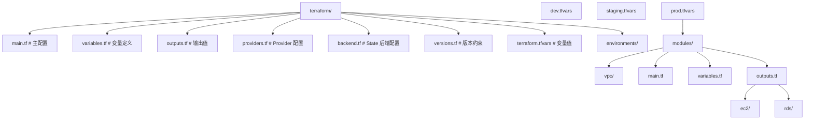
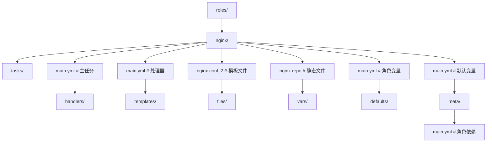

## 1. Terraform 基础设施即代码

### 1.1 Terraform 核心概念

| 概念         | 说明                               |
| :----------- | :--------------------------------- |
| **Provider** | 云服务商插件（AWS/Azure/阿里云等） |
| **Resource** | 基础设施资源定义（VM/VPC/DB等）    |
| **State**    | 资源状态文件，记录已创建的资源     |
| **Module**   | 可复用的 Terraform 配置包          |
| **Plan**     | 预览变更（干运行）                 |
| **Apply**    | 执行变更                           |

### 1.2 项目结构



### 1.3 Provider 配置

```hcl
# providers.tf
terraform {
  required_version = ">= 1.6"

  required_providers {
    aws = {
      source  = "hashicorp/aws"
      version = "~> 5.0"
    }
  }

  # 远程 State 存储
  backend "s3" {
    bucket         = "terraform-state-prod"
    key            = "infrastructure/terraform.tfstate"
    region         = "us-east-1"
    encrypt        = true
    dynamodb_table = "terraform-locks"
  }
}

provider "aws" {
  region = var.aws_region

  default_tags {
    tags = {
      Environment = var.environment
      ManagedBy   = "terraform"
      Project     = "myapp"
    }
  }
}
```

### 1.4 VPC 模块

```hcl
# modules/vpc/main.tf
resource "aws_vpc" "main" {
  cidr_block           = var.vpc_cidr
  enable_dns_hostnames = true
  enable_dns_support   = true

  tags = {
    Name = "${var.name}-vpc"
  }
}

# 公有子网
resource "aws_subnet" "public" {
  count                   = length(var.public_subnet_cidrs)
  vpc_id                  = aws_vpc.main.id
  cidr_block              = var.public_subnet_cidrs[count.index]
  availability_zone       = var.availability_zones[count.index]
  map_public_ip_on_launch = true

  tags = {
    Name = "${var.name}-public-${count.index + 1}"
    Tier = "public"
  }
}

# 私有子网
resource "aws_subnet" "private" {
  count             = length(var.private_subnet_cidrs)
  vpc_id            = aws_vpc.main.id
  cidr_block        = var.private_subnet_cidrs[count.index]
  availability_zone = var.availability_zones[count.index]

  tags = {
    Name = "${var.name}-private-${count.index + 1}"
    Tier = "private"
  }
}

# 互联网网关
resource "aws_internet_gateway" "main" {
  vpc_id = aws_vpc.main.id

  tags = {
    Name = "${var.name}-igw"
  }
}

# NAT 网关（每个 AZ 一个）
resource "aws_nat_gateway" "main" {
  count         = length(var.public_subnet_cidrs)
  allocation_id = aws_eip.nat[count.index].id
  subnet_id     = aws_subnet.public[count.index].id

  tags = {
    Name = "${var.name}-nat-${count.index + 1}"
  }
}

resource "aws_eip" "nat" {
  count  = length(var.public_subnet_cidrs)
  domain = "vpc"
}

# 公有路由表
resource "aws_route_table" "public" {
  vpc_id = aws_vpc.main.id

  route {
    cidr_block = "0.0.0.0/0"
    gateway_id = aws_internet_gateway.main.id
  }

  tags = {
    Name = "${var.name}-public-rt"
  }
}

# 私有路由表
resource "aws_route_table" "private" {
  count  = length(var.private_subnet_cidrs)
  vpc_id = aws_vpc.main.id

  route {
    cidr_block     = "0.0.0.0/0"
    nat_gateway_id = aws_nat_gateway.main[count.index].id
  }

  tags = {
    Name = "${var.name}-private-rt-${count.index + 1}"
  }
}
```

```hcl
# modules/vpc/variables.tf
variable "name" {
  description = "VPC 名称前缀"
  type        = string
}

variable "vpc_cidr" {
  description = "VPC CIDR 地址块"
  type        = string
  default     = "10.0.0.0/16"
}

variable "public_subnet_cidrs" {
  description = "公有子网 CIDR 列表"
  type        = list(string)
}

variable "private_subnet_cidrs" {
  description = "私有子网 CIDR 列表"
  type        = list(string)
}

variable "availability_zones" {
  description = "可用区列表"
  type        = list(string)
}
```

### 1.5 主配置

```hcl
# main.tf
module "vpc" {
  source = "./modules/vpc"

  name                 = "${var.project}-${var.environment}"
  vpc_cidr             = var.vpc_cidr
  public_subnet_cidrs  = var.public_subnet_cidrs
  private_subnet_cidrs = var.private_subnet_cidrs
  availability_zones   = var.availability_zones
}

# EC2 实例
resource "aws_instance" "app" {
  count         = var.app_instance_count
  ami           = data.aws_ami.ubuntu.id
  instance_type = var.instance_type
  subnet_id     = module.vpc.private_subnet_ids[count.index % length(module.vpc.private_subnet_ids)]

  vpc_security_group_ids = [aws_security_group.app.id]

  user_data = templatefile("${path.module}/user_data.sh.tpl", {
    environment = var.environment
    db_host     = aws_db_instance.main.address
  })

  tags = {
    Name = "${var.project}-${var.environment}-app-${count.index + 1}"
  }
}

# RDS 数据库
resource "aws_db_instance" "main" {
  identifier     = "${var.project}-${var.environment}-db"
  engine         = "postgresql"
  engine_version = "16.1"
  instance_class = var.db_instance_class

  allocated_storage     = 100
  max_allocated_storage = 500
  storage_encrypted     = true

  db_name  = "myapp"
  username = "dbadmin"
  password = var.db_password

  vpc_security_group_ids = [aws_security_group.db.id]
  db_subnet_group_name   = aws_db_subnet_group.main.name

  backup_retention_period = 7
  backup_window           = "03:00-04:00"
  maintenance_window      = "Mon:04:00-Mon:05:00"

  skip_final_snapshot = false
  final_snapshot_identifier = "${var.project}-${var.environment}-final"
}

# 数据源 - 获取最新 Ubuntu AMI
data "aws_ami" "ubuntu" {
  most_recent = true
  owners      = ["099720109477"]  # Canonical

  filter {
    name   = "name"
    values = ["ubuntu/images/hvm-ssd/ubuntu-jammy-22.04-amd64-server-*"]
  }
}
```

### 1.6 变量与输出

```hcl
# variables.tf
variable "project" {
  description = "项目名称"
  type        = string
  default     = "myapp"
}

variable "environment" {
  description = "环境名称"
  type        = string
}

variable "aws_region" {
  description = "AWS 区域"
  type        = string
  default     = "us-east-1"
}

variable "db_password" {
  description = "数据库密码"
  type        = string
  sensitive   = true
}

# outputs.tf
output "vpc_id" {
  description = "VPC ID"
  value       = module.vpc.vpc_id
}

output "app_instance_ids" {
  description = "应用实例 ID 列表"
  value       = aws_instance.app[*].id
}

output "db_endpoint" {
  description = "数据库连接端点"
  value       = aws_db_instance.main.endpoint
}
```

### 1.7 Terraform 工作流

```bash
# 初始化（下载 Provider 和模块）
terraform init

# 格式化代码
terraform fmt

# 验证语法
terraform validate

# 预览变更
terraform plan -var-file="environments/prod.tfvars" -out=tfplan

# 执行变更
terraform apply tfplan

# 查看状态
terraform state list
terraform state show aws_instance.app[0]

# 销毁所有资源
terraform destroy -var-file="environments/prod.tfvars"
```

## 2. Ansible 配置管理

### 2.1 Ansible 核心概念

| 概念          | 说明                             |
| :------------ | :------------------------------- |
| **Inventory** | 主机清单，定义管理的主机         |
| **Playbook**  | YAML 格式的任务编排文件          |
| **Role**      | 可复用的任务集合                 |
| **Module**    | 执行具体操作的模块               |
| **Handler**   | 被通知后执行的任务（如重启服务） |

### 2.2 Inventory 配置

```ini
# inventory/production.ini
[webservers]
web1 ansible_host=10.0.1.10
web2 ansible_host=10.0.1.11

[appservers]
app1 ansible_host=10.0.10.10
app2 ansible_host=10.0.10.11

[dbservers]
db1 ansible_host=10.0.20.10

[production:children]
webservers
appservers
dbservers

[production:vars]
ansible_user=ec2-user
ansible_ssh_private_key_file=~/.ssh/prod_key
ansible_python_interpreter=/usr/bin/python3
```

### 2.3 Playbook 编写

```yaml
# playbooks/deploy-app.yml
---
- name: 部署 Web 应用
  hosts: appservers
  become: true

  vars:
    app_version: '2.3.1'
    app_port: 3000
    app_dir: /opt/myapp

  tasks:
    - name: 安装依赖
      ansible.builtin.apt:
        name:
          - curl
          - python3-pip
        state: present
        update_cache: true

    - name: 创建应用目录
      ansible.builtin.file:
        path: '{{ app_dir }}'
        state: directory
        mode: '0755'

    - name: 下载应用包
      ansible.builtin.get_url:
        url: 'https://releases.example.com/myapp/{{ app_version }}/myapp-linux-amd64'
        dest: '{{ app_dir }}/myapp'
        mode: '0755'
      notify: restart myapp

    - name: 部署配置文件
      ansible.builtin.template:
        src: templates/app.conf.j2
        dest: '{{ app_dir }}/app.conf'
        mode: '0644'
      notify: restart myapp

    - name: 部署 systemd 服务
      ansible.builtin.template:
        src: templates/myapp.service.j2
        dest: /etc/systemd/system/myapp.service
        mode: '0644'
      notify: restart myapp

    - name: 确保 myapp 服务运行
      ansible.builtin.systemd:
        name: myapp
        state: started
        enabled: true
        daemon_reload: true

    - name: 等待应用就绪
      ansible.builtin.wait_for:
        port: '{{ app_port }}'
        delay: 5
        timeout: 60

  handlers:
    - name: restart myapp
      ansible.builtin.systemd:
        name: myapp
        state: restarted
```

### 2.4 Role 结构



### 2.5 模板文件

```jinja2
# roles/nginx/templates/nginx.conf.j2
worker_processes {{ ansible_processor_vcpus }};
error_log /var/log/nginx/error.log warn;
pid /var/run/nginx.pid;

events {
    worker_connections {{ nginx_worker_connections | default(1024) }};
}

http {
    include       /etc/nginx/mime.types;
    default_type  application/octet-stream;

    upstream app_backend {
        
        server {{ hostvars[host]['ansible_host'] }}:{{ app_port }};
        
    }

    server {
        listen 80;
        server_name {{ nginx_server_name }};

        location / {
            proxy_pass http://app_backend;
            proxy_set_header Host $host;
            proxy_set_header X-Real-IP $remote_addr;
        }
    }
}
```

## 3. Pulumi

### 3.1 Pulumi 概述

Pulumi 是使用**通用编程语言**（Python/TypeScript/Go）编写基础设施即代码的工具：

| 特性         | Terraform       | Pulumi          |
| :----------- | :-------------- | :-------------- |
| **语言**     | HCL（专用语言） | Python/TS/Go/C# |
| **状态管理** | 自管理/SaaS     | Pulumi Cloud    |
| **测试**     | 有限            | 原生单元测试    |
| **逻辑**     | 声明式          | 命令式+声明式   |
| **生态**     | 最丰富          | 增长中          |

### 3.2 Pulumi 示例（Python）

```python
# __main__.py
import pulumi
import pulumi_aws as aws

# 配置
config = pulumi.Config()
environment = config.get("environment") or "dev"

# 创建 VPC
vpc = aws.ec2.Vpc("main-vpc",
    cidr_block="10.0.0.0/16",
    enable_dns_hostnames=True,
    tags={"Name": f"myapp-{environment}-vpc"},
)

# 创建子网
public_subnet = aws.ec2.Subnet("public-subnet",
    vpc_id=vpc.id,
    cidr_block="10.0.1.0/24",
    availability_zone="us-east-1a",
    map_public_ip_on_launch=True,
    tags={"Name": f"myapp-{environment}-public"},
)

# 创建安全组
sg = aws.ec2.SecurityGroup("app-sg",
    vpc_id=vpc.id,
    description="Application security group",
    ingress=[
        aws.ec2.SecurityGroupIngressArgs(
            protocol="tcp",
            from_port=443,
            to_port=443,
            cidr_blocks=["0.0.0.0/0"],
        ),
    ],
    egress=[
        aws.ec2.SecurityGroupEgressArgs(
            protocol="-1",
            from_port=0,
            to_port=0,
            cidr_blocks=["0.0.0.0/0"],
        ),
    ],
)

# 输出
pulumi.export("vpc_id", vpc.id)
pulumi.export("subnet_id", public_subnet.id)
pulumi.export("security_group_id", sg.id)
```

## 4. GitOps

### 4.1 GitOps 原则

| 原则               | 说明                         |
| :----------------- | :--------------------------- |
| **声明式描述**     | 系统状态用声明式方式描述     |
| **Git 为唯一信源** | 所有变更通过 Git 提交        |
| **自动拉取**       | Agent 自动拉取并应用期望状态 |
| **持续协调**       | 持续比对实际状态与期望状态   |

### 4.2 ArgoCD 配置

```yaml
# argocd-app.yaml
apiVersion: argoproj.io/v1alpha1
kind: Application
metadata:
  name: myapp
  namespace: argocd
spec:
  project: default
  source:
    repoURL: https://github.com/org/k8s-manifests.git
    targetRevision: main
    path: overlays/production
  destination:
    server: https://kubernetes.default.svc
    namespace: production
  syncPolicy:
    automated:
      prune: true
      selfHeal: true
      allowEmpty: false
    syncOptions:
      - CreateNamespace=true
      - ServerSideApply=true
    retry:
      limit: 3
      backoff:
        duration: 5s
        factor: 2
        maxDuration: 3m
```

### 4.3 Flux 配置

```yaml
# gotk-sync.yaml
apiVersion: source.toolkit.fluxcd.io/v1
kind: GitRepository
metadata:
  name: myapp
  namespace: flux-system
spec:
  interval: 1m
  url: https://github.com/org/k8s-manifests.git
  ref:
    branch: main
---
apiVersion: kustomize.toolkit.fluxcd.io/v1
kind: Kustomization
metadata:
  name: myapp
  namespace: flux-system
spec:
  interval: 5m
  sourceRef:
    kind: GitRepository
    name: myapp
  path: './overlays/production'
  prune: true
  healthChecks:
    - apiVersion: apps/v1
      kind: Deployment
      name: myapp
      namespace: production
```

## 5. Python 自动化运维脚本

### 5.1 批量实例管理

```python
import boto3
import concurrent.futures

ec2 = boto3.resource('ec2')

def get_instances_by_tag(tag_key: str, tag_value: str):
    """根据标签获取实例列表"""
    return list(ec2.instances.filter(Filters=[
        {'Name': f'tag:{tag_key}', 'Values': [tag_value]},
        {'Name': 'instance-state-name', 'Values': ['running']}
    ]))

def execute_ssm_command(instance_ids: list, command: str):
    """通过 SSM 执行命令"""
    ssm = boto3.client('ssm')
    response = ssm.send_command(
        InstanceIds=instance_ids,
        DocumentName='AWS-RunShellScript',
        Parameters={'commands': [command]},
        TimeoutSeconds=300,
    )
    return response['Command']['CommandId']

def rolling_restart(tag_key: str, tag_value: str, batch_size: int = 1):
    """滚动重启实例"""
    instances = get_instances_by_tag(tag_key, tag_value)
    print(f"找到 {len(instances)} 个实例")

    for i in range(0, len(instances), batch_size):
        batch = instances[i:i + batch_size]
        ids = [inst.id for inst in batch]

        # 停止实例
        print(f"停止实例: {ids}")
        for inst in batch:
            inst.stop()
        for inst in batch:
            inst.wait_until_stopped()

        # 启动实例
        print(f"启动实例: {ids}")
        for inst in batch:
            inst.start()
        for inst in batch:
            inst.wait_until_running()

        # 健康检查
        print(f"等待实例就绪: {ids}")
        execute_ssm_command(ids, 'curl -sf http://localhost:3000/health || exit 1')
        print(f"批次 {i // batch_size + 1} 完成")
```

### 5.2 资源清理脚本

```python
import boto3
from datetime import datetime, timedelta

def cleanup_unused_resources(dry_run: bool = True):
    """清理未使用的云资源"""
    ec2 = boto3.resource('ec2')
    findings = []

    # 未附加的 EBS 卷
    for vol in ec2.volumes.filter(Filters=[
        {'Name': 'status', 'Values': ['available']}
    ]):
        findings.append({
            'type': 'EBS Volume',
            'id': vol.id,
            'size': f"{vol.size}GB",
            'age': str(datetime.now() - vol.create_time.replace(tzinfo=None)),
        })
        if not dry_run:
            vol.delete()

    # 未使用的弹性 IP
    for eip in ec2.vpc_addresses.all():
        if eip.instance_id is None:
            findings.append({
                'type': 'Elastic IP',
                'id': eip.allocation_id,
                'ip': eip.public_ip,
            })
            if not dry_run:
                eip.release()

    # 过期的快照（>30天）
    cutoff = datetime.now() - timedelta(days=30)
    for snap in ec2.snapshots.filter(OwnerIds=['self']):
        if snap.start_time.replace(tzinfo=None) < cutoff:
            # 检查是否被 AMI 引用
            is_used = any(
                snap.id in [b['Ebs']['SnapshotId'] for b in img.block_device_mappings]
                for img in ec2.images.filter(OwnerIds=['self'])
            )
            if not is_used:
                findings.append({
                    'type': 'Snapshot',
                    'id': snap.id,
                    'age': str(datetime.now() - snap.start_time.replace(tzinfo=None)),
                })
                if not dry_run:
                    snap.delete()

    return findings
```

## 6. 云监控告警

### 6.1 Prometheus 监控

```yaml
# prometheus.yml
global:
  scrape_interval: 15s
  evaluation_interval: 15s

rule_files:
  - 'alerts/*.yml'

scrape_configs:
  - job_name: 'kubernetes-pods'
    kubernetes_sd_configs:
      - role: pod
    relabel_configs:
      - source_labels: [__meta_kubernetes_pod_annotation_prometheus_io_scrape]
        action: keep
        regex: true

  - job_name: 'node-exporter'
    static_configs:
      - targets: ['node-exporter:9100']
```

### 6.2 告警规则

```yaml
# alerts/app-alerts.yml
groups:
  - name: app-alerts
    rules:
      - alert: HighErrorRate
        expr: rate(http_requests_total{status=~"5.."}[5m]) / rate(http_requests_total[5m]) > 0.05
        for: 5m
        labels:
          severity: critical
        annotations:
          summary: '高错误率: {{ $labels.instance }}'
          description: '5xx 错误率超过 5%，当前值: {{ $value | humanizePercentage }}'

      - alert: HighLatency
        expr: histogram_quantile(0.95, rate(http_request_duration_seconds_bucket[5m])) > 1
        for: 5m
        labels:
          severity: warning
        annotations:
          summary: '高延迟: {{ $labels.instance }}'
          description: 'P95 延迟超过 1s，当前值: {{ $value }}s'

      - alert: PodCrashLooping
        expr: rate(kube_pod_container_status_restarts_total[15m]) > 0
        for: 5m
        labels:
          severity: critical
        annotations:
          summary: 'Pod 崩溃重启: {{ $labels.namespace }}/{{ $labels.pod }}'
```

### 6.3 Grafana 仪表盘

```json5
// 关键监控面板
{
  dashboard: {
    title: 'Application Overview',
    panels: [
      {
        title: '请求速率 (QPS)',
        type: 'timeseries',
        targets: [{ expr: 'sum(rate(http_requests_total[5m]))' }],
      },
      {
        title: '错误率',
        type: 'gauge',
        targets: [
          {
            expr: 'sum(rate(http_requests_total{status=~"5.."}[5m])) / sum(rate(http_requests_total[5m]))',
          },
        ],
      },
      {
        title: 'P95 延迟',
        type: 'timeseries',
        targets: [
          {
            expr: 'histogram_quantile(0.95, sum(rate(http_request_duration_seconds_bucket[5m])) by (le))',
          },
        ],
      },
      {
        title: 'CPU 使用率',
        type: 'timeseries',
        targets: [
          {
            expr: 'sum(rate(container_cpu_usage_seconds_total{namespace="production"}[5m])) by (pod)',
          },
        ],
      },
      {
        title: '内存使用',
        type: 'timeseries',
        targets: [
          { expr: 'sum(container_memory_working_set_bytes{namespace="production"}) by (pod)' },
        ],
      },
    ],
  },
}
```

### 6.4 CloudWatch 告警

```bash
# 创建 CPU 告警
aws cloudwatch put-metric-alarm \
  --alarm-name "high-cpu-alert" \
  --alarm-description "CPU 使用率超过 80%" \
  --metric-name CPUUtilization \
  --namespace AWS/EC2 \
  --statistic Average \
  --period 300 \
  --threshold 80 \
  --comparison-operator GreaterThanThreshold \
  --evaluation-periods 2 \
  --dimensions Name=AutoScalingGroupName,Value=myapp-asg \
  --alarm-actions arn:aws:sns:us-east-1:xxx:ops-alerts

# 创建自定义指标告警
aws cloudwatch put-metric-alarm \
  --alarm-name "high-error-rate" \
  --metric-name ErrorRate \
  --namespace MyApp \
  --statistic Average \
  --period 60 \
  --threshold 5 \
  --comparison-operator GreaterThanThreshold \
  --evaluation-periods 3 \
  --datapoints-to-alarm 2 \
  --treat-missing-data breaching \
  --alarm-actions arn:aws:sns:us-east-1:xxx:ops-alerts
```

### 6.5 监控体系总览

```
指标采集 → 数据存储 → 可视化 → 告警 → 通知
   │          │          │        │       │
Prometheus   TSDB     Grafana  Alert   Slack/钉钉
CloudWatch   CloudWatch AWS     SNS     Email/SMS
Datadog      Datadog   Datadog  Monitor PagerDuty
```

| 层级         | 工具                      | 关注点             |
| :----------- | :------------------------ | :----------------- |
| **基础设施** | CloudWatch、Node Exporter | CPU/内存/磁盘/网络 |
| **应用层**   | APM、自定义指标           | 延迟/错误率/吞吐量 |
| **业务层**   | 自定义指标、日志分析      | 订单量/转化率      |
| **安全层**   | GuardDuty、WAF 日志       | 异常访问/攻击检测  |

## 参考文献

AWS 文档：https://docs.aws.amazon.com/
Microsoft Azure 文档：https://learn.microsoft.com/zh-cn/azure/
Google Cloud 文档：https://cloud.google.com/docs?hl=zh-cn
阿里云文档：https://help.aliyun.com/
CNCF 云原生全景：https://landscape.cncf.io/

## 延伸阅读

虚拟化与容器，见 034-cloud-computing 模块相关文档。
Kubernetes 架构，见 034-cloud-computing 模块 K8s 文档。
DevOps 与 IaC，见 031-devops 模块。
尚硅谷 Bilibili 空间（https://space.bilibili.com/302417610 ）提供云计算课程。

## 模块文档速查表

| 文档 | 主题 | 与本文的关联 |
| --- | --- | --- |
| 云计算基础 | 001-CloudComputingBasics | 本文的前置基础 |
| 云网络与存储 | 002-CloudNetworkStorage | 本文的并列主题 |
| 容器与编排 | 003-ContainerOrchestration | 本文的并列主题 |
| 基础设施即代码 | 004-IaC | 本文自身 |
| IaaS与PaaS与SaaS | 005-IaaSPaaSSaaS | 本文的并列主题 |
| 虚拟化技术 | 006-VirtualizationTech | 本文的并列主题 |
| 云架构设计 | 007-CloudArchitectureDesign | 本文的原理深化 |
| 公有云与私有云与混合云 | 008-PublicCloudPrivateCloudHybridCloud | 本文的并列主题 |
| Docker深度解析 | 009-DockerDeepAnalysis | 本文的并列主题 |
| 云原生应用 | 010-CloudNativeApp | 本文的并列主题 |
| Kubernetes架构 | 011-KubernetesArchitecture | 本文的原理深化 |
| 云数据库服务 | 012-CloudDatabaseService | 本文的并列主题 |
| Kubernetes核心资源 | 013-KubernetesCore | 本文的并列主题 |
| 云存储服务 | 014-CloudStorageService | 本文的并列主题 |
| Kubernetes网络 | 015-KubernetesNetwork | 本文的并列主题 |
| 云网络服务 | 016-CloudNetworkService | 本文的并列主题 |
| Kubernetes存储 | 017-KubernetesStorage | 本文的并列主题 |
| 云安全服务 | 018-CloudSecurityService | 本文的安全延伸 |
| Helm包管理 | 019-HelmPackageManagement | 本文的并列主题 |
| 云成本优化 | 020-CloudCostOptimization | 本文的性能延伸 |
| 12要素应用 | 021-TwelveFactorApp | 本文的并列主题 |
| 微服务架构 | 022-MicroserviceArchitecture | 本文的原理深化 |
| 服务网格 | 023-ServiceMesh | 本文的并列主题 |
| 可观测性 | 024-Observability | 本文的并列主题 |
| AWS核心服务 | 025-AWSCore | 本文的并列主题 |
| 多云与混合云架构 | 026-MultiCloudHybridArchitecture | 本文的原理深化 |
| 负载均衡与自动伸缩 | 027-LoadBalanceAutoScaling | 本文的并列主题 |
| 无服务器架构 | 028-ServerlessArchitecture | 本文的原理深化 |
| 云迁移6R策略 | 029-CloudMigration6RStrategy | 本文的并列主题 |
| 云计算 AWS CLI 配置 | 030-AWSCliConfigure | 本文的并列主题 |
| 云计算 AWS S3 命令 | 031-AWSS3Command | 本文的并列主题 |
| 云计算 AWS EC2 命令 | 032-AWSEC2Command | 本文的并列主题 |
| 云计算 AWS Lambda 命令 | 033-AWSLambdaCommand | 本文的并列主题 |
| 云计算 AWS IAM 命令 | 034-AWSIAMCommand | 本文的并列主题 |
| 云计算 AWS CloudFormation | 035-AWSCloudFormation | 本文的并列主题 |
| 云计算 Azure CLI 配置 | 036-AzureCliConfigure | 本文的并列主题 |
| 云计算 Azure 资源组与 VM | 037-AzureGroupVMCommand | 本文的并列主题 |
| 云计算 Azure 存储命令 | 038-AzureStorageCommand | 本文的并列主题 |
| 云计算 GCP gcloud 配置 | 039-GCPCliConfigure | 本文的并列主题 |
| 云计算 GCP Compute 与 Storage | 040-GCPComputeStorage | 本文的并列主题 |
| 云计算 Terraform 基础 | 041-TerraformBasic | 本文的前置基础 |
| 云计算 Terraform 状态与模块 | 042-TerraformStateModule | 本文的并列主题 |
| AWS CloudWatch 监控日志命令 | 043-AWSCloudWatch | 本文的并列主题 |
| AWS RDS 数据库命令 | 044-AWSRDSCommands | 本文的并列主题 |
| AWS VPC 网络命令 | 045-AWSVPCCommands | 本文的并列主题 |
| AWS SQS/SNS 消息队列命令 | 046-AWSSQSCommands | 本文的并列主题 |
| AWS DynamoDB 命令 | 047-AWSDynamoDB | 本文的并列主题 |
| Azure Functions 命令 | 048-AzureFunctions | 本文的并列主题 |
| Azure AKS Kubernetes 命令 | 049-AzureAKSCommands | 本文的并列主题 |
| GCP GKE Kubernetes 命令 | 050-GCPGKECommands | 本文的并列主题 |
| GCP BigQuery 命令 | 051-GCPBigQuery | 本文的并列主题 |
| Pulumi IaC 命令 | 052-PulumiCommands | 本文的并列主题 |
| Harbor 私有镜像仓库命令 | 053-HarborRegistry | 本文的并列主题 |
| cloud-init 云实例初始化 | 054-CloudInitCommands | 本文的并列主题 |
| AWS CloudFront CDN 命令 | 055-AWSCloudFront | 本文的并列主题 |
