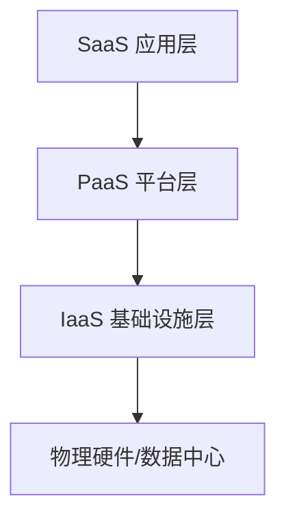

## 1. 云计算服务模式概述

### 1.1 服务模式层级



### 1.2 责任划分

| 层级     | IaaS   | PaaS   | SaaS   |
| -------- | ------ | ------ | ------ |
| 应用     | 客户   | 客户   | 供应商 |
| 数据     | 客户   | 客户   | 供应商 |
| 运行时   | 客户   | 供应商 | 供应商 |
| 中间件   | 客户   | 供应商 | 供应商 |
| 操作系统 | 客户   | 供应商 | 供应商 |
| 虚拟化   | 供应商 | 供应商 | 供应商 |
| 服务器   | 供应商 | 供应商 | 供应商 |
| 存储     | 供应商 | 供应商 | 供应商 |
| 网络     | 供应商 | 供应商 | 供应商 |

## 2. IaaS（基础设施即服务）

### 2.1 定义

提供虚拟化的计算资源（服务器、存储、网络），用户自行管理操作系统及以上层级。

### 2.2 核心服务

| 服务   | 描述             | 示例             |
| ------ | ---------------- | ---------------- |
| 计算   | 虚拟机/裸金属    | EC2, ECS, VM     |
| 存储   | 块/对象/文件存储 | S3, EBS, OSS     |
| 网络   | VPC/负载均衡     | VPC, ELB, SLB    |
| 数据库 | 自建数据库       | RDS（IaaS 模式） |

### 2.3 适用场景

- 需要完全控制操作系统
- 自定义运行时环境
- 迁移传统应用
- 高性能计算

### 2.4 代表产品

| 供应商 | 产品                           |
| ------ | ------------------------------ |
| AWS    | EC2, S3, VPC                   |
| Azure  | Virtual Machines, Blob Storage |
| GCP    | Compute Engine, Cloud Storage  |
| 阿里云 | ECS, OSS, VPC                  |
| 华为云 | ECS, OBS, VPC                  |

## 3. PaaS（平台即服务）

### 3.1 定义

提供应用运行平台，用户只需关注应用代码和数据，无需管理底层基础设施。

### 3.2 核心服务

| 服务     | 描述         | 示例                  |
| -------- | ------------ | --------------------- |
| 运行时   | 语言运行环境 | Node.js, Python, Java |
| 中间件   | 应用服务器   | Tomcat, Nginx         |
| 数据库   | 托管数据库   | RDS, Cloud SQL        |
| 消息队列 | 托管消息     | SQS, MQ               |
| CI/CD    | 构建部署     | CodePipeline          |

### 3.3 适用场景

- 快速应用开发
- 微服务架构
- API 后端
- DevOps 团队

### 3.4 代表产品

| 供应商 | 产品                           |
| ------ | ------------------------------ |
| AWS    | Elastic Beanstalk, Lambda, RDS |
| Azure  | App Service, Functions         |
| GCP    | App Engine, Cloud Functions    |
| 阿里云 | SAE, FC, RDS                   |
| Heroku | Heroku Platform                |

## 4. SaaS（软件即服务）

### 4.1 定义

直接提供可用的软件应用，用户通过浏览器或 API 使用，无需安装和维护。

### 4.2 核心特征

- 多租户架构
- 按需付费
- 自动更新
- 随时随地访问

### 4.3 适用场景

- 企业协作
- 客户管理
- 办公自动化
- 数据分析

### 4.4 代表产品

| 类别 | 产品                         |
| ---- | ---------------------------- |
| 协作 | Slack, Teams, 飞书           |
| CRM  | Salesforce, HubSpot          |
| 办公 | Google Workspace, Office 365 |
| 设计 | Figma, Canva                 |
| 开发 | GitHub, GitLab               |

## 5. 选型指南

### 5.1 决策矩阵

| 需求     | IaaS | PaaS | SaaS |
| -------- | ---- | ---- | ---- |
| 完全控制 |      |      |      |
| 快速上线 |      |      |      |
| 定制化   |      |      |      |
| 运维成本 | 高   | 中   | 低   |
| 技术门槛 | 高   | 中   | 低   |
| 长期成本 | 中   | 中   | 高   |

### 5.2 混合策略

```
核心业务 → IaaS（完全控制）
应用服务 → PaaS（快速迭代）
通用工具 → SaaS（降低成本）
```

## 延伸阅读
虚拟化与容器，见 034-cloud-computing 模块相关文档。
Kubernetes 架构，见 034-cloud-computing 模块 K8s 文档。
DevOps 与 IaC，见 031-devops 模块。
## 深度专题扩展

以下专题从不同角度深入本文主题，供有进阶需求的读者研读。每个专题独立成节，内容相互补充。

### 13.1 FinOps 成本治理

三阶段：可见（成本分配与预算）、优化（右尺寸、Spot、闲置清理）、运营（持续迭代与责任到团队）。
工具：云厂商成本中心、OpenCost、Kubecost。
组织：FinOps 实践者角色、定期 review、浪费告警。
度量：单位成本（每请求/每用户成本）而非绝对金额。

### 13.2 高可用与容灾设计

可用性数学：99.9% 年停机约 8.7 小时，99.99% 约 52 分钟；多副本降低单点风险。
RPO（可容忍数据丢失）与 RTO（恢复时间）驱动备份与复制策略。
模式：多可用区部署、跨区域异步复制、数据库主备、对象存储版本。
演练：混沌工程（Chaos Monkey 思想）验证真实故障行为。
