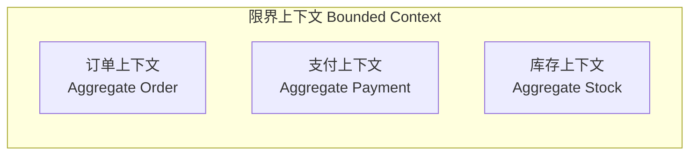
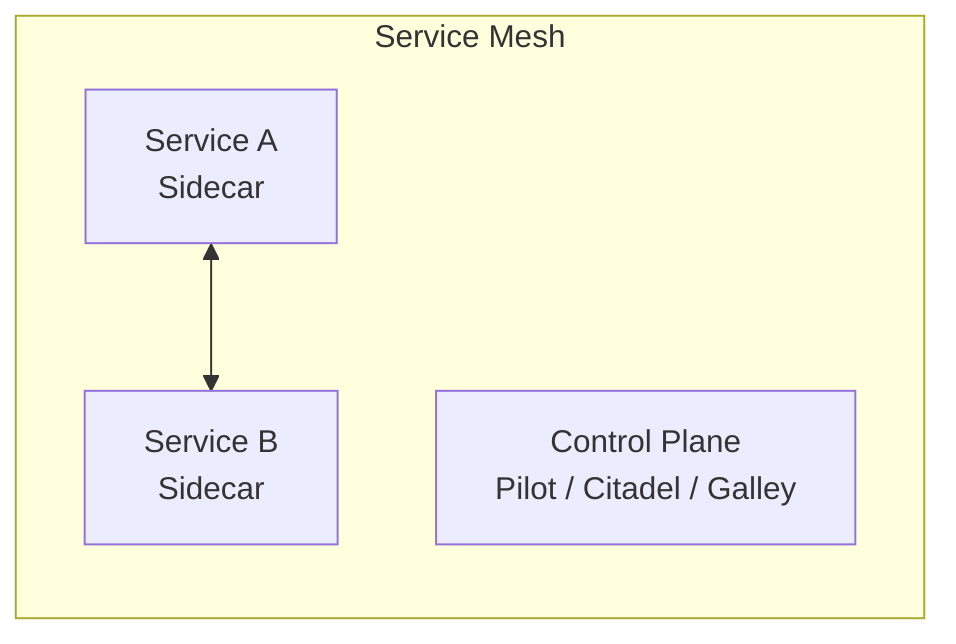
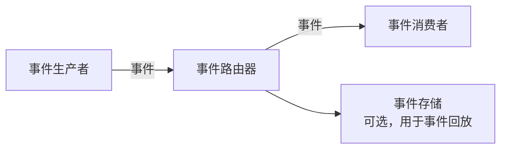
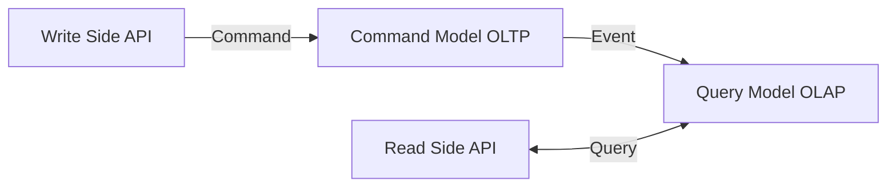
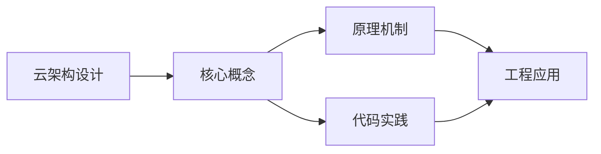
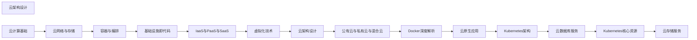

## 1. 学习目标（Bloom 分类）

本节按照布鲁姆教育目标分类学组织学习路径。本文主题为《云架构设计》，属于 云计算 模块，读者可以根据自身阶段选择阅读深度。

记忆层面：能够准确复述本文的核心概念、术语与基本语法或操作步骤，并能够在提问或检索时快速定位对应知识点。能够说出 云计算 的核心概念、组件与标准流程。

理解层面：能够用自己的语言解释核心原理与工作机制，说明概念之间的因果关系，而不是机械记忆结论。能够解释 云计算 的工作原理与关键机制。

应用层面：能够在真实项目或练习场景中运用本文知识解决具体问题，写出正确且可维护的实现。能够执行 云计算 相关的标准操作与配置。

分析层面：能够拆解复杂问题，比较本文主题与相邻概念的异同，识别边界条件与例外情况。能够分析 云计算 方案在可靠性、成本与性能上的权衡。

评价层面：能够根据约束条件（性能、可读性、安全、成本）评价不同方案的优劣，做出有依据的技术决策。能够评价 云计算 中的技术选型。

创造层面：能够把本文知识与其他模块知识组合，设计出新的解决方案或可复用的工程模式。能够设计基于 云计算 的完整解决方案。

通过本节学习，读者应当能够把《云架构设计》纳入自己的知识网络，并与 云计算 模块的其他主题（IaaS/PaaS/SaaS、虚拟化、云原生、成本治理）建立关联。

## 2. 历史动机与发展脉络

《云架构设计》是 云计算 领域的重要主题。要真正理解它，需要先了解它解决的问题与演进过程。

云计算源于 1960 年代分时思想，2006 年 AWS 推出 EC2/S3 开启现代云服务时代；公有云（AWS/Azure/GCP/阿里云/华为云）与私有云、混合云并存。
服务模型：IaaS（虚拟机/存储/网络）、PaaS（托管运行时/数据库）、SaaS（应用即服务）；FaaS（函数即服务）进一步抽象。
云原生：容器、微服务、服务网格、声明式 API、不可变基础设施；CNCF 生态是云原生事实标准。

回到本文主题：云架构设计 的提出与成熟，正是上述技术背景下的必然产物。早期实现往往以简单可用为目标，随着工程规模扩大，社区逐渐沉淀出标准做法与最佳实践；理解这一脉络，可以帮助读者判断“为什么文档中的推荐写法是现在这个样子”，也能在遇到历史遗留代码时准确识别其设计年代与取舍。


## 3. 形式化定义与核心概念精讲

本节把《云架构设计》涉及的核心概念以“定义 + 讲解”的形式展开。读者应把定义当作工具，把讲解当作理解路径；两者结合才能形成可迁移的知识。

虚拟化：虚拟机（Hypervisor 硬件隔离）与容器（OS 级隔离）；虚拟化是弹性与多租户的基础。
核心服务：计算（EC2/ECS）、存储（对象/块/文件）、网络（VPC/负载均衡/CDN）、数据库（托管 RDS/NoSQL）。
弹性与计费：按需、预留、Spot；自动扩缩容（HPA/ASG）；FinOps 治理成本。

### 3.1 原文章节逐一精讲

原文档把主题拆分为 6 个小节，下面按顺序给出每一节的导读讲解，随后保留原文细节供精读。

#### 原文精读（完整保留）


#### 1. 云架构设计原则

##### 1.1 Well-Architected Framework

AWS Well-Architected Framework 定义了六大支柱：

| 支柱     | 核心关注             | 关键实践                        |
| -------- | -------------------- | ------------------------------- |
| 卓越运营 | 运维自动化、事件响应 | IaC、可观测性、Runbook          |
| 安全性   | 数据保护、身份认证   | 最小权限、加密、审计            |
| 可靠性   | 故障恢复、弹性伸缩   | 多 AZ、自动恢复、混沌工程       |
| 性能效率 | 资源选型、高效利用   | 按需选型、缓存、压缩            |
| 成本优化 | 消除浪费、合理定价   | Reserved Instance、Right-sizing |
| 可持续性 | 资源效率、碳足迹     | Graviton、Spot、弹性调度        |

##### 1.2 云原生设计原则

- **不可变基础设施**：服务器不手动修改，通过替换实现变更
- **声明式 API**：描述期望状态，系统自动收敛
- **自服务**：开发团队自助获取资源，无需审批瓶颈
- **松耦合**：服务间通过 API 通信，独立部署与扩展
- **可观测**：指标、日志、链路追踪三位一体

##### 1.3 设计权衡

架构设计本质是权衡，常见决策点：

$$
\text{CAP} \Rightarrow \text{一致性 vs 可用性 vs 分区容错}
$$

$$
\text{延迟 vs 一致性} \Rightarrow \text{强一致（同步复制） vs 最终一致（异步复制）}
$$

$$
\text{成本 vs 可靠性} \Rightarrow \text{单区域 vs 多区域}
$$

#### 2. 微服务架构

##### 2.1 微服务拆分策略

**领域驱动设计（DDD）** 是微服务拆分的核心方法论：



拆分原则：

- **单一职责**：每个服务聚焦一个业务能力
- **独立部署**：服务可独立发布，不影响其他服务
- **数据自治**：每个服务拥有自己的数据存储
- **接口契约**：服务间通过明确定义的 API 交互

##### 2.2 服务通信模式

**同步通信**：

| 协议      | 适用场景       | 特点                   |
| --------- | -------------- | ---------------------- |
| REST/HTTP | CRUD 操作      | 简单通用，但开销大     |
| gRPC      | 服务间高频调用 | 高性能，强类型，流式   |
| GraphQL   | 前端聚合查询   | 按需获取，减少过度获取 |

**异步通信**：

| 模式      | 适用场景 | 代表技术      |
| --------- | -------- | ------------- |
| 点对点    | 任务分发 | RabbitMQ、SQS |
| 发布/订阅 | 事件通知 | Kafka、SNS    |
| 事件溯源  | 审计追踪 | EventStoreDB  |

##### 2.3 服务网格（Service Mesh）

服务网格将通信逻辑从应用代码中抽离到基础设施层：



核心能力：流量管理、安全通信（mTLS）、可观测性、故障注入。

#### 3. 事件驱动架构

##### 3.1 事件驱动核心概念



**事件 vs 命令 vs 查询**：

| 类型 | 意图           | 响应期望      | 示例             |
| ---- | -------------- | ------------- | ---------------- |
| 命令 | 请求执行操作   | 期望成功/失败 | `CreateOrder`    |
| 事件 | 通知已发生事实 | 无期望        | `OrderCreated`   |
| 查询 | 请求信息       | 期望返回数据  | `GetOrderStatus` |

##### 3.2 事件溯源（Event Sourcing）

不存储当前状态，而是存储所有状态变更事件：

```
传统方式：  Order { id: 1, status: "shipped", total: 99.9 }

事件溯源：  OrderCreated   { id: 1, items: [...], total: 99.9 }
           OrderPaid      { id: 1, paymentId: "pay_123" }
           OrderShipped   { id: 1, trackingNo: "SF123456" }
```

当前状态通过重放事件获得：

$$
\text{State}_{current} = \text{Apply}(\text{Event}_1, \text{Event}_2, \ldots, \text{Event}_n)
$$

为避免每次全量重放，使用**快照（Snapshot）**：

$$
\text{State}_{current} = \text{Apply}(\text{Snapshot}_k, \text{Event}_{k+1}, \ldots, \text{Event}_n)
$$

##### 3.3 CQRS 模式

命令查询职责分离（Command Query Responsibility Segregation）：



优势：读写模型独立优化，读侧可水平扩展；代价：最终一致性、复杂度增加。

#### 4. 无服务器架构

##### 4.1 Serverless 核心理念

Serverless 不是没有服务器，而是**无需管理服务器**：

- **FaaS（Function as a Service）**：按请求执行代码
- **BaaS（Backend as a Service）**：托管后端服务（数据库、认证、存储）

##### 4.2 FaaS 执行模型


冷启动时间参考：

| 运行时  | 冷启动时间 | 备注           |
| ------- | ---------- | -------------- |
| Node.js | 100-300ms  | 较快           |
| Python  | 200-500ms  | 中等           |
| Java    | 1-3s       | JVM 启动开销   |
| Go      | 50-200ms   | 编译型，启动快 |
| Rust    | 50-150ms   | 编译型，启动快 |
| .NET    | 500ms-2s   | CLR 初始化     |

##### 4.3 Serverless 适用场景

**适合**：

- 事件驱动型工作负载（Webhook、定时任务）
- 流量波动大的 API
- 数据处理管道（ETL）
- 实时文件处理（图片/视频转码）

**不适合**：

- 长时间运行任务（>15min）
- 低延迟要求（冷启动不可控）
- 需要持久连接（WebSocket、gRPC 流）
- 高频小请求（调用费用累积）

##### 4.4 Serverless 成本模型

$$
\text{月成本} = \text{请求数} \times \text{单价/百万请求} + \sum_{i} (\text{执行时间}_i \times \text{内存}_i \times \text{单价/GB·s})
$$

与传统方案的成本交叉点：

$$
\text{当 } \frac{\text{请求量} \times \text{平均执行时间}}{\text{时间窗口}} < \text{服务器利用率阈值} \text{ 时，Serverless 更优}
$$

#### 5. 多区域高可用架构

##### 5.1 高可用层级

```mermaid
flowchart TD
    GLB[全球负载均衡 DNS/CDN]
    subgraph RA[区域 A]
        ALB1[ALB 多 AZ]
        AZ1[AZ1] AZ2[AZ2] AZ3[AZ3]
        DB1[数据库主]
    end
    subgraph RB[区域 B]
        ALB2[ALB 多 AZ]
        BZ1[AZ1] BZ2[AZ2] BZ3[AZ3]
        DB2[数据库从]
    end
    GLB --> ALB1
    GLB --> ALB2
```

##### 5.2 RPO 与 RTO

| 指标                | 含义                     | 典型值                |
| ------------------- | ------------------------ | --------------------- |
| RPO（恢复点目标）   | 可容忍的最大数据丢失量   | 0（同步复制）- 数小时 |
| RTO（恢复时间目标） | 可容忍的最大服务中断时间 | 秒级 - 数小时         |

$$
\text{可用性} = \frac{\text{MTBF}}{\text{MTBF} + \text{MTTR}} = 1 - \frac{\text{MTTR}}{\text{MTBF} + \text{MTTR}}
$$

其中 MTBF 为平均故障间隔时间，MTTR 为平均恢复时间。

##### 5.3 灾备策略

| 策略       | RPO    | RTO    | 成本 | 实现方式                 |
| ---------- | ------ | ------ | ---- | ------------------------ |
| 备份与恢复 | 小时级 | 小时级 | 低   | 定期备份到对象存储       |
| 预置备用   | 分钟级 | 分钟级 | 中   | 备用区域保持最小容量     |
| 温备用     | 秒级   | 分钟级 | 中高 | 备用区域持续运行但流量低 |
| 多活       | 接近零 | 接近零 | 高   | 多区域同时服务           |

#### 6. 架构评审

##### 6.1 架构决策记录（ADR）

每个重要架构决策应记录：

```
ADR-001: 选择事件驱动架构处理订单流程

状态: 已接受

背景:
  订单系统需要与支付、库存、物流等多个系统交互，
  同步调用导致级联故障风险和响应延迟增加。

决策:
  采用事件驱动架构，订单服务发布领域事件，
  下游服务异步订阅处理。

后果:
  正面: 松耦合、弹性提升、可独立扩展
  负面: 最终一致性、调试复杂度增加、需要事件排序机制
```

##### 6.2 架构评审检查清单

**可靠性**：

- [ ] 单点故障是否消除
- [ ] 是否有自动故障转移机制
- [ ] 是否有重试与熔断策略
- [ ] 是否有混沌工程验证

**安全性**：

- [ ] 数据是否加密（传输中 + 静态）
- [ ] 身份认证与授权是否完备
- [ ] 是否有网络分段与隔离
- [ ] 是否有安全扫描与审计

**可扩展性**：

- [ ] 是否支持水平扩展
- [ ] 是否有自动伸缩策略
- [ ] 是否有缓存策略
- [ ] 数据库是否有分片方案

**可观测性**：

- [ ] 是否有指标监控
- [ ] 是否有分布式追踪
- [ ] 是否有结构化日志
- [ ] 是否有告警与 Runbook


### 3.2 概念关系图

下面用 Mermaid 图表达本文核心概念之间的关系，帮助读者建立整体图景：



图中展示的是本文知识的结构化关系：核心概念是入口，原理机制解释“为什么”，代码实践演示“怎么做”，工程应用回答“何时用”。读者学习时可以把每个小节的内容挂接到对应节点上。

## 4. 理论推导与原理解析

本节深入《云架构设计》背后的原理。理论部分不求面面俱到，而是聚焦“能解释现象、能指导实践”的关键推导。

虚拟化：虚拟机（Hypervisor 硬件隔离）与容器（OS 级隔离）；虚拟化是弹性与多租户的基础。
核心服务：计算（EC2/ECS）、存储（对象/块/文件）、网络（VPC/负载均衡/CDN）、数据库（托管 RDS/NoSQL）。
弹性与计费：按需、预留、Spot；自动扩缩容（HPA/ASG）；FinOps 治理成本。
高可用设计：多可用区、故障域、跨区域容灾；RPO/RTO 目标驱动方案。

需要强调的是，理论推导与工程实践之间存在翻译层：理论给出的是理想化模型与边界条件，工程代码则必须处理真实环境中的例外。读者在学习时应先掌握理论的“标准情形”，再通过陷阱章节了解“非标准情形”。

## 5. 代码示例与逐行讲解

本节把原文中的代码示例系统整理，并为每个示例补充用途说明与讲解。读者不应只浏览代码，而应逐段对照讲解理解设计意图。

### 5.1 示例：2.1 微服务拆分策略

该示例来自原文《2.1 微服务拆分策略》小节，用于演示云架构设计相关操作。阅读时请先看代码结构，再看其后的讲解。


讲解：这段代码演示了本节核心知识点。代码中的关键操作可以归纳为三步：准备（定义或初始化）、执行（核心逻辑）、收尾（释放资源或返回结果）。实际项目中，这三步往往被封装为函数或类，以提升复用性与可测试性。

关键点分析：

该示例共 6 行有效代码，结构以数据或配置为主。阅读时应关注：数据字段的含义、配置项的作用，以及它们与运行行为的对应关系。

进阶思考路径：先尝试修改参数观察行为变化，再把示例中的模式迁移到自己的项目中；每次修改都记录预期与实测差异，这是把示例转化为能力的最快方式。

### 5.2 示例：2.3 服务网格（Service Mesh）

该示例来自原文《2.3 服务网格（Service Mesh）》小节，用于演示云架构设计相关操作。阅读时请先看代码结构，再看其后的讲解。


讲解：这段代码演示了本节核心知识点。代码中的关键操作可以归纳为三步：准备（定义或初始化）、执行（核心逻辑）、收尾（释放资源或返回结果）。实际项目中，这三步往往被封装为函数或类，以提升复用性与可测试性。

关键点分析：

该示例共 5 行有效代码，结构以数据或配置为主。阅读时应关注：数据字段的含义、配置项的作用，以及它们与运行行为的对应关系。

进阶思考路径：先尝试修改参数观察行为变化，再把示例中的模式迁移到自己的项目中；每次修改都记录预期与实测差异，这是把示例转化为能力的最快方式。

### 5.3 示例：3.1 事件驱动核心概念

该示例来自原文《3.1 事件驱动核心概念》小节，用于演示云架构设计相关操作。阅读时请先看代码结构，再看其后的讲解。


讲解：这段代码演示了本节核心知识点。代码中的关键操作可以归纳为三步：准备（定义或初始化）、执行（核心逻辑）、收尾（释放资源或返回结果）。实际项目中，这三步往往被封装为函数或类，以提升复用性与可测试性。

关键点分析：

该示例共 3 行有效代码，结构以数据或配置为主。阅读时应关注：数据字段的含义、配置项的作用，以及它们与运行行为的对应关系。

进阶思考路径：先尝试修改参数观察行为变化，再把示例中的模式迁移到自己的项目中；每次修改都记录预期与实测差异，这是把示例转化为能力的最快方式。

### 5.4 示例：3.2 事件溯源（Event Sourcing）

该示例来自原文《3.2 事件溯源（Event Sourcing）》小节，用于演示云架构设计相关操作。阅读时请先看代码结构，再看其后的讲解。

```text
传统方式：  Order { id: 1, status: "shipped", total: 99.9 }

事件溯源：  OrderCreated   { id: 1, items: [...], total: 99.9 }
           OrderPaid      { id: 1, paymentId: "pay_123" }
           OrderShipped   { id: 1, trackingNo: "SF123456" }
```

讲解：这段代码演示了本节核心知识点。代码中的关键操作可以归纳为三步：准备（定义或初始化）、执行（核心逻辑）、收尾（释放资源或返回结果）。实际项目中，这三步往往被封装为函数或类，以提升复用性与可测试性。

关键点分析：

该示例共 4 行有效代码，结构以数据或配置为主。阅读时应关注：数据字段的含义、配置项的作用，以及它们与运行行为的对应关系。

进阶思考路径：先尝试修改参数观察行为变化，再把示例中的模式迁移到自己的项目中；每次修改都记录预期与实测差异，这是把示例转化为能力的最快方式。

### 5.5 示例：3.3 CQRS 模式

该示例来自原文《3.3 CQRS 模式》小节，用于演示云架构设计相关操作。阅读时请先看代码结构，再看其后的讲解。


讲解：这段代码演示了本节核心知识点。代码中的关键操作可以归纳为三步：准备（定义或初始化）、执行（核心逻辑）、收尾（释放资源或返回结果）。实际项目中，这三步往往被封装为函数或类，以提升复用性与可测试性。

关键点分析：

该示例共 3 行有效代码，结构以数据或配置为主。阅读时应关注：数据字段的含义、配置项的作用，以及它们与运行行为的对应关系。

进阶思考路径：先尝试修改参数观察行为变化，再把示例中的模式迁移到自己的项目中；每次修改都记录预期与实测差异，这是把示例转化为能力的最快方式。

### 5.6 示例：4.2 FaaS 执行模型

该示例来自原文《4.2 FaaS 执行模型》小节，用于演示云架构设计相关操作。阅读时请先看代码结构，再看其后的讲解。


讲解：这段代码演示了本节核心知识点。代码中的关键操作可以归纳为三步：准备（定义或初始化）、执行（核心逻辑）、收尾（释放资源或返回结果）。实际项目中，这三步往往被封装为函数或类，以提升复用性与可测试性。

关键点分析：

该示例共 3 行有效代码，结构以数据或配置为主。阅读时应关注：数据字段的含义、配置项的作用，以及它们与运行行为的对应关系。

进阶思考路径：先尝试修改参数观察行为变化，再把示例中的模式迁移到自己的项目中；每次修改都记录预期与实测差异，这是把示例转化为能力的最快方式。

### 5.7 示例：5.1 高可用层级

该示例来自原文《5.1 高可用层级》小节，用于演示云架构设计相关操作。阅读时请先看代码结构，再看其后的讲解。

```mermaid
flowchart TD
    GLB[全球负载均衡 DNS/CDN]
    subgraph RA[区域 A]
        ALB1[ALB 多 AZ]
        AZ1[AZ1] AZ2[AZ2] AZ3[AZ3]
        DB1[数据库主]
    end
    subgraph RB[区域 B]
        ALB2[ALB 多 AZ]
        BZ1[AZ1] BZ2[AZ2] BZ3[AZ3]
        DB2[数据库从]
    end
    GLB --> ALB1
    GLB --> ALB2
```

讲解：这段代码演示了本节核心知识点。代码中的关键操作可以归纳为三步：准备（定义或初始化）、执行（核心逻辑）、收尾（释放资源或返回结果）。实际项目中，这三步往往被封装为函数或类，以提升复用性与可测试性。

关键点分析：

该示例共 14 行有效代码，结构以数据或配置为主。阅读时应关注：数据字段的含义、配置项的作用，以及它们与运行行为的对应关系。

进阶思考路径：先尝试修改参数观察行为变化，再把示例中的模式迁移到自己的项目中；每次修改都记录预期与实测差异，这是把示例转化为能力的最快方式。

### 5.8 示例：6.1 架构决策记录（ADR）

该示例来自原文《6.1 架构决策记录（ADR）》小节，用于演示云架构设计相关操作。阅读时请先看代码结构，再看其后的讲解。

```text
ADR-001: 选择事件驱动架构处理订单流程

状态: 已接受

背景:
  订单系统需要与支付、库存、物流等多个系统交互，
  同步调用导致级联故障风险和响应延迟增加。

决策:
  采用事件驱动架构，订单服务发布领域事件，
  下游服务异步订阅处理。

后果:
  正面: 松耦合、弹性提升、可独立扩展
  负面: 最终一致性、调试复杂度增加、需要事件排序机制
```

讲解：这段代码演示了本节核心知识点。代码中的关键操作可以归纳为三步：准备（定义或初始化）、执行（核心逻辑）、收尾（释放资源或返回结果）。实际项目中，这三步往往被封装为函数或类，以提升复用性与可测试性。

关键点分析：

该示例共 11 行有效代码，结构以数据或配置为主。阅读时应关注：数据字段的含义、配置项的作用，以及它们与运行行为的对应关系。

进阶思考路径：先尝试修改参数观察行为变化，再把示例中的模式迁移到自己的项目中；每次修改都记录预期与实测差异，这是把示例转化为能力的最快方式。


综合以上示例，可以总结出本主题的代码实践要点：第一，先定义清晰的输入输出契约；第二，核心逻辑保持单一职责；第三，错误处理与边界条件不可省略；第四，命名与注释表达意图而非复述代码。

## 6. 对比分析

对比是理解《云架构设计》定位的最快路径。下面从多个维度与相邻方案进行对比。

公有云、私有云、混合云：公有云弹性成本优，私有云合规可控，混合云过渡。
虚拟机与容器：VM 强隔离通用，容器轻量交付快。
Serverless 与容器：FaaS 免运维按调用计费，容器可移植控制强。

对比的目的不是分出绝对优劣，而是建立选择依据：不同约束条件下，最优解不同。读者应把每个对比维度转化为决策检查清单。

## 7. 常见陷阱与最佳实践

本节整理该主题的高频错误与推荐做法。每个陷阱先描述现象，再解释原因，最后给出最佳实践。

### 7.1 单可用区部署

单点故障。多 AZ + 自动故障转移。

深入讲解：该问题之所以被归类为“常见陷阱”，是因为它在初学者的代码中反复出现，而且往往不在第一时间暴露——错误通常隐藏在特定数据或特定时序下。

从成因上看，单可用区部署 一般源于对 云计算 某个机制的理解偏差：要么误用了默认行为，要么忽略了边界条件，要么把其他语言的思维惯性带了过来。

从影响上看，单可用区部署 轻则产生错误结果，重则导致资源泄漏、数据损坏或安全事故；这也是为什么工程评审中会把它列为检查项。

从修复策略上看，处理单可用区部署的正确顺序是：先复现（构造最小用例），再定位（确认机制层面的根因），最后修复并补充回归测试。跳过复现直接改代码，往往治标不治本。

### 7.2 安全组过宽

0.0.0.0/0 全开。最小暴露 + 堡垒机。

深入讲解：该问题之所以被归类为“常见陷阱”，是因为它在初学者的代码中反复出现，而且往往不在第一时间暴露——错误通常隐藏在特定数据或特定时序下。

从成因上看，安全组过宽 一般源于对 云计算 某个机制的理解偏差：要么误用了默认行为，要么忽略了边界条件，要么把其他语言的思维惯性带了过来。

从影响上看，安全组过宽 轻则产生错误结果，重则导致资源泄漏、数据损坏或安全事故；这也是为什么工程评审中会把它列为检查项。

从修复策略上看，处理安全组过宽的正确顺序是：先复现（构造最小用例），再定位（确认机制层面的根因），最后修复并补充回归测试。跳过复现直接改代码，往往治标不治本。

### 7.3 存储类型误选

成本与性能失衡。按访问频率选择热/冷存储。

深入讲解：该问题之所以被归类为“常见陷阱”，是因为它在初学者的代码中反复出现，而且往往不在第一时间暴露——错误通常隐藏在特定数据或特定时序下。

从成因上看，存储类型误选 一般源于对 云计算 某个机制的理解偏差：要么误用了默认行为，要么忽略了边界条件，要么把其他语言的思维惯性带了过来。

从影响上看，存储类型误选 轻则产生错误结果，重则导致资源泄漏、数据损坏或安全事故；这也是为什么工程评审中会把它列为检查项。

从修复策略上看，处理存储类型误选的正确顺序是：先复现（构造最小用例），再定位（确认机制层面的根因），最后修复并补充回归测试。跳过复现直接改代码，往往治标不治本。

### 7.4 实例规格浪费

长期高配低用。右尺寸 + 弹性伸缩。

深入讲解：该问题之所以被归类为“常见陷阱”，是因为它在初学者的代码中反复出现，而且往往不在第一时间暴露——错误通常隐藏在特定数据或特定时序下。

从成因上看，实例规格浪费 一般源于对 云计算 某个机制的理解偏差：要么误用了默认行为，要么忽略了边界条件，要么把其他语言的思维惯性带了过来。

从影响上看，实例规格浪费 轻则产生错误结果，重则导致资源泄漏、数据损坏或安全事故；这也是为什么工程评审中会把它列为检查项。

从修复策略上看，处理实例规格浪费的正确顺序是：先复现（构造最小用例），再定位（确认机制层面的根因），最后修复并补充回归测试。跳过复现直接改代码，往往治标不治本。

### 7.5 成本失控

无预算告警。预算 + 标签 + 异常检测。

深入讲解：该问题之所以被归类为“常见陷阱”，是因为它在初学者的代码中反复出现，而且往往不在第一时间暴露——错误通常隐藏在特定数据或特定时序下。

从成因上看，成本失控 一般源于对 云计算 某个机制的理解偏差：要么误用了默认行为，要么忽略了边界条件，要么把其他语言的思维惯性带了过来。

从影响上看，成本失控 轻则产生错误结果，重则导致资源泄漏、数据损坏或安全事故；这也是为什么工程评审中会把它列为检查项。

从修复策略上看，处理成本失控的正确顺序是：先复现（构造最小用例），再定位（确认机制层面的根因），最后修复并补充回归测试。跳过复现直接改代码，往往治标不治本。

### 7.6 忽略供应商锁定

迁移困难。优先开源标准（K8s、Terraform）。

深入讲解：该问题之所以被归类为“常见陷阱”，是因为它在初学者的代码中反复出现，而且往往不在第一时间暴露——错误通常隐藏在特定数据或特定时序下。

从成因上看，忽略供应商锁定 一般源于对 云计算 某个机制的理解偏差：要么误用了默认行为，要么忽略了边界条件，要么把其他语言的思维惯性带了过来。

从影响上看，忽略供应商锁定 轻则产生错误结果，重则导致资源泄漏、数据损坏或安全事故；这也是为什么工程评审中会把它列为检查项。

从修复策略上看，处理忽略供应商锁定的正确顺序是：先复现（构造最小用例），再定位（确认机制层面的根因），最后修复并补充回归测试。跳过复现直接改代码，往往治标不治本。

### 7.7 备份未验证

备份不可恢复等于没有。定期恢复演练。

深入讲解：该问题之所以被归类为“常见陷阱”，是因为它在初学者的代码中反复出现，而且往往不在第一时间暴露——错误通常隐藏在特定数据或特定时序下。

从成因上看，备份未验证 一般源于对 云计算 某个机制的理解偏差：要么误用了默认行为，要么忽略了边界条件，要么把其他语言的思维惯性带了过来。

从影响上看，备份未验证 轻则产生错误结果，重则导致资源泄漏、数据损坏或安全事故；这也是为什么工程评审中会把它列为检查项。

从修复策略上看，处理备份未验证的正确顺序是：先复现（构造最小用例），再定位（确认机制层面的根因），最后修复并补充回归测试。跳过复现直接改代码，往往治标不治本。

### 7.8 密钥管理混乱

AK 泄露事故。使用云 KMS 与临时凭证。

深入讲解：该问题之所以被归类为“常见陷阱”，是因为它在初学者的代码中反复出现，而且往往不在第一时间暴露——错误通常隐藏在特定数据或特定时序下。

从成因上看，密钥管理混乱 一般源于对 云计算 某个机制的理解偏差：要么误用了默认行为，要么忽略了边界条件，要么把其他语言的思维惯性带了过来。

从影响上看，密钥管理混乱 轻则产生错误结果，重则导致资源泄漏、数据损坏或安全事故；这也是为什么工程评审中会把它列为检查项。

从修复策略上看，处理密钥管理混乱的正确顺序是：先复现（构造最小用例），再定位（确认机制层面的根因），最后修复并补充回归测试。跳过复现直接改代码，往往治标不治本。

### 7.0 最佳实践总览

1. IaC：Terraform/CloudFormation 管理资源，代码评审与审批。
2. 标签与成本分摊：环境/项目/团队标签驱动 FinOps。
3. 安全基线：CIS 基准扫描、IAM 最小权限、加密默认开启。
4. 架构评审：Well-Architected 五支柱（可靠性、安全、成本、性能、运维）。

把这些最佳实践固化为团队规范与代码评审检查项，是避免同类问题反复出现的关键。

## 8. 工程实践

本节把《云架构设计》放入真实工程场景，给出可复用的模式与组织方法。

云原生应用：12 要素（配置注入、无状态、日志输出）、K8s 部署、服务网格（Istio）可观测。
迁移路径：Rehost（直接搬）、Replatform（小改）、Refactor（重构）、Retire。
多集群管理：GitOps + 联邦/平台抽象。

### 8.1 工程实践的原则拆解

以上工程实践可以归纳为四条原则。第一，配置与代码分离：云计算 项目中环境差异应通过配置注入，而不是散落在代码分支中；这保证同一份代码可以在开发、测试、生产环境一致运行。

第二，接口稳定优先：对外接口（函数签名、协议、数据格式）一旦被消费方依赖，变更成本极高；设计时应预留扩展点并保持向后兼容。

第三，可观测性内置：日志、指标与追踪应该在功能开发时同步设计，而不是故障发生后补救；没有观测手段的模块等于黑盒。

第四，变更可回滚：任何发布都应有对应的回滚方案；数据库迁移、配置变更与代码发布一样需要版本管理与逆向路径。

### 8.2 实践落地的检查清单

- [ ] 云原生应用：对照本节描述，检查当前项目是否已经落实；未落实的项列入技术债并排期处理。
- [ ] 迁移路径：对照本节描述，检查当前项目是否已经落实；未落实的项列入技术债并排期处理。
- [ ] 多集群管理：对照本节描述，检查当前项目是否已经落实；未落实的项列入技术债并排期处理。

工程实践的共性原则：配置与代码分离、接口稳定优先、可观测性内置、变更可回滚。这些原则适用于本主题的所有实现。

## 9. 案例研究

本节通过一个完整案例把《云架构设计》的知识串起来。案例按“需求分析、方案设计、实现、验证”四步展开。

需求：把单体 Web 应用迁移到云原生架构。
方案：容器化 -> K8s 部署 -> 托管数据库 -> 监控告警。
要点：无状态化、配置外置、探针、弹性伸缩。
验证：故障演练（节点/区域故障）、压测弹性、成本对比。

### 9.1 案例的扩展讨论

把案例中的方案放大到真实规模，需要额外考虑三个问题：

第一，规模：当数据量或并发量上升一个数量级时，原方案中的数据结构、缓存策略与任务调度是否仍然成立？通常需要引入分层与异步。

第二，团队：多人协作时，模块边界、接口契约与代码所有权必须明确；案例中的实现应拆分为可独立测试的单元，并配合文档说明设计意图。

第三，演进：上线后的需求变化不可避免；方案设计时应预留扩展点（配置化、插件化、事件化），并定期用真实指标验证假设。


案例研究的学习方法：先独立阅读需求，尝试在脑中形成方案，再对照实现与讲解，最后思考“如果约束变化（数据量、并发、团队规模），方案应如何调整”。

## 10. 知识要点总结与深入讲解

本节以讲解形式汇总全文要点，替代传统的习题与自测，读者不需要答题，只需跟随解释建立完整的认知框架。

关于《云架构设计》的核心结论：

云计算的本质是资源抽象与按需供给。
可靠性、安全与成本是架构三支柱。
云原生（容器 + 声明式 + 自动化）是主流交付形态。

原文档各小节的要点回顾：

- 1. 云架构设计原则：该小节围绕云架构设计展开具体细节，阅读时应关注其与核心结论的对应关系；每个小节都是核心结论在某一个侧面的展开。
- 2. 微服务架构：该小节围绕云架构设计展开具体细节，阅读时应关注其与核心结论的对应关系；每个小节都是核心结论在某一个侧面的展开。
- 3. 事件驱动架构：该小节围绕云架构设计展开具体细节，阅读时应关注其与核心结论的对应关系；每个小节都是核心结论在某一个侧面的展开。
- 4. 无服务器架构：该小节围绕云架构设计展开具体细节，阅读时应关注其与核心结论的对应关系；每个小节都是核心结论在某一个侧面的展开。
- 5. 多区域高可用架构：该小节围绕云架构设计展开具体细节，阅读时应关注其与核心结论的对应关系；每个小节都是核心结论在某一个侧面的展开。
- 6. 架构评审：该小节围绕云架构设计展开具体细节，阅读时应关注其与核心结论的对应关系；每个小节都是核心结论在某一个侧面的展开。

把以上要点与第 3-9 节的内容对照复习，即可完成对本文主题的闭环学习。

## 11. 参考文献


AWS 文档：https://docs.aws.amazon.com/
Microsoft Azure 文档：https://learn.microsoft.com/zh-cn/azure/
Google Cloud 文档：https://cloud.google.com/docs?hl=zh-cn
阿里云文档：https://help.aliyun.com/
CNCF 云原生全景：https://landscape.cncf.io/

## 12. 延伸阅读


虚拟化与容器，见 034-cloud-computing 模块相关文档。
Kubernetes 架构，见 034-cloud-computing 模块 K8s 文档。
DevOps 与 IaC，见 031-devops 模块。
尚硅谷 Bilibili 空间（https://space.bilibili.com/302417610 ）提供云计算课程。

## 14. 模块知识图谱与学习路径

本文属于 云计算 模块。为了把《云架构设计》放入完整的知识网络，下面列出本模块的全部主题并给出相互关联的导读。学习时建议按模块内顺序推进，并在每个文档中留意交叉引用。



上图为模块主题的推荐学习顺序示意图（仅展示前若干主题）。各主题之间存在三类关联：

第一，前置依赖关系：早期主题是后期主题的基础，例如环境与语法先行、进阶主题随后；

第二，横向并列关系：同一层级主题从不同角度覆盖模块能力，学习顺序可以按兴趣调整；

第三，工程组合关系：多个主题在真实项目中组合使用，例如配置、性能与安全主题往往出现在同一系统的不同层面。

### 14.1 模块主题速查表

| 文档 | 主题 | 与本文的关联 |
| --- | --- | --- |
| 云计算基础 | 001-CloudComputingBasics | 本文的前置基础 |
| 云网络与存储 | 002-CloudNetworkStorage | 本文的并列主题 |
| 容器与编排 | 003-ContainerOrchestration | 本文的并列主题 |
| 基础设施即代码 | 004-IaC | 本文的前置基础 |
| IaaS与PaaS与SaaS | 005-IaaSPaaSSaaS | 本文的并列主题 |
| 虚拟化技术 | 006-VirtualizationTech | 本文的并列主题 |
| 云架构设计 | 007-CloudArchitectureDesign | 本文自身 |
| 公有云与私有云与混合云 | 008-PublicCloudPrivateCloudHybridCloud | 本文的并列主题 |
| Docker深度解析 | 009-DockerDeepAnalysis | 本文的并列主题 |
| 云原生应用 | 010-CloudNativeApp | 本文的并列主题 |
| Kubernetes架构 | 011-KubernetesArchitecture | 本文的原理深化 |
| 云数据库服务 | 012-CloudDatabaseService | 本文的并列主题 |
| Kubernetes核心资源 | 013-KubernetesCore | 本文的并列主题 |
| 云存储服务 | 014-CloudStorageService | 本文的并列主题 |
| Kubernetes网络 | 015-KubernetesNetwork | 本文的并列主题 |
| 云网络服务 | 016-CloudNetworkService | 本文的并列主题 |
| Kubernetes存储 | 017-KubernetesStorage | 本文的并列主题 |
| 云安全服务 | 018-CloudSecurityService | 本文的安全延伸 |
| Helm包管理 | 019-HelmPackageManagement | 本文的并列主题 |
| 云成本优化 | 020-CloudCostOptimization | 本文的性能延伸 |
| 12要素应用 | 021-TwelveFactorApp | 本文的并列主题 |
| 微服务架构 | 022-MicroserviceArchitecture | 本文的原理深化 |
| 服务网格 | 023-ServiceMesh | 本文的并列主题 |
| 可观测性 | 024-Observability | 本文的并列主题 |
| AWS核心服务 | 025-AWSCore | 本文的并列主题 |
| 多云与混合云架构 | 026-MultiCloudHybridArchitecture | 本文的原理深化 |
| 负载均衡与自动伸缩 | 027-LoadBalanceAutoScaling | 本文的并列主题 |
| 无服务器架构 | 028-ServerlessArchitecture | 本文的原理深化 |
| 云迁移6R策略 | 029-CloudMigration6RStrategy | 本文的并列主题 |
| 云计算 AWS CLI 配置 | 030-AWSCliConfigure | 本文的并列主题 |
| 云计算 AWS S3 命令 | 031-AWSS3Command | 本文的并列主题 |
| 云计算 AWS EC2 命令 | 032-AWSEC2Command | 本文的并列主题 |
| 云计算 AWS Lambda 命令 | 033-AWSLambdaCommand | 本文的并列主题 |
| 云计算 AWS IAM 命令 | 034-AWSIAMCommand | 本文的并列主题 |
| 云计算 AWS CloudFormation | 035-AWSCloudFormation | 本文的并列主题 |
| 云计算 Azure CLI 配置 | 036-AzureCliConfigure | 本文的并列主题 |
| 云计算 Azure 资源组与 VM | 037-AzureGroupVMCommand | 本文的并列主题 |
| 云计算 Azure 存储命令 | 038-AzureStorageCommand | 本文的并列主题 |
| 云计算 GCP gcloud 配置 | 039-GCPCliConfigure | 本文的并列主题 |
| 云计算 GCP Compute 与 Storage | 040-GCPComputeStorage | 本文的并列主题 |
| 云计算 Terraform 基础 | 041-TerraformBasic | 本文的前置基础 |
| 云计算 Terraform 状态与模块 | 042-TerraformStateModule | 本文的并列主题 |
| AWS CloudWatch 监控日志命令 | 043-AWSCloudWatch | 本文的并列主题 |
| AWS RDS 数据库命令 | 044-AWSRDSCommands | 本文的并列主题 |
| AWS VPC 网络命令 | 045-AWSVPCCommands | 本文的并列主题 |
| AWS SQS/SNS 消息队列命令 | 046-AWSSQSCommands | 本文的并列主题 |
| AWS DynamoDB 命令 | 047-AWSDynamoDB | 本文的并列主题 |
| Azure Functions 命令 | 048-AzureFunctions | 本文的并列主题 |
| Azure AKS Kubernetes 命令 | 049-AzureAKSCommands | 本文的并列主题 |
| GCP GKE Kubernetes 命令 | 050-GCPGKECommands | 本文的并列主题 |
| GCP BigQuery 命令 | 051-GCPBigQuery | 本文的并列主题 |
| Pulumi IaC 命令 | 052-PulumiCommands | 本文的并列主题 |
| Harbor 私有镜像仓库命令 | 053-HarborRegistry | 本文的并列主题 |
| cloud-init 云实例初始化 | 054-CloudInitCommands | 本文的并列主题 |
| AWS CloudFront CDN 命令 | 055-AWSCloudFront | 本文的并列主题 |

速查表的作用是让读者快速判断：哪些文档应在阅读本文前掌握（前置基础），哪些文档应在阅读本文后继续（延伸主题）。本模块的交叉引用体系即以此表为基础。

## 15. 术语表

下表整理《云架构设计》及 云计算 模块中出现的高频术语，给出简明释义。术语按字母序或逻辑序排列，供查阅。

| 术语 | 释义 |
| --- | --- |
| 虚拟化 | 虚拟机（Hypervisor 硬件隔离）与容器（OS 级隔离）；虚拟化是弹性与多租户的基础。 |
| 核心服务 | 计算（EC2/ECS）、存储（对象/块/文件）、网络（VPC/负载均衡/CDN）、数据库（托管 RDS/NoSQL）。 |
| 弹性与计费 | 按需、预留、Spot；自动扩缩容（HPA/ASG）；FinOps 治理成本。 |
| 高可用设计 | 多可用区、故障域、跨区域容灾；RPO/RTO 目标驱动方案。 |
| 单可用区部署（易错点） | 参见常见陷阱章节的详细讲解 |
| 安全组过宽（易错点） | 参见常见陷阱章节的详细讲解 |
| 存储类型误选（易错点） | 参见常见陷阱章节的详细讲解 |
| 实例规格浪费（易错点） | 参见常见陷阱章节的详细讲解 |
| 成本失控（易错点） | 参见常见陷阱章节的详细讲解 |
| 忽略供应商锁定（易错点） | 参见常见陷阱章节的详细讲解 |

术语表与正文配合使用：先通读正文，遇到模糊术语回查本表；长期使用后术语会自然进入工作记忆。

## 13. 深度专题扩展

以下专题从不同角度深入本文主题，供有进阶需求的读者研读。每个专题独立成节，内容相互补充。

### 13.1 FinOps 成本治理

三阶段：可见（成本分配与预算）、优化（右尺寸、Spot、闲置清理）、运营（持续迭代与责任到团队）。
工具：云厂商成本中心、OpenCost、Kubecost。
组织：FinOps 实践者角色、定期 review、浪费告警。
度量：单位成本（每请求/每用户成本）而非绝对金额。

### 13.2 高可用与容灾设计

可用性数学：99.9% 年停机约 8.7 小时，99.99% 约 52 分钟；多副本降低单点风险。
RPO（可容忍数据丢失）与 RTO（恢复时间）驱动备份与复制策略。
模式：多可用区部署、跨区域异步复制、数据库主备、对象存储版本。
演练：混沌工程（Chaos Monkey 思想）验证真实故障行为。

## 16. 核心概念串讲（复习视角）

本节以“把知识讲给他人听”的方式，把《云架构设计》的核心概念重新串讲一遍。与前文按章节展开不同，这里的叙述更接近课堂总结：先说整体，再逐个展开，最后收束。

《云架构设计》属于 云计算 模块。要理解它，先要理解它在模块中的位置：它解决的是该领域的一个具体问题，并依赖模块内若干前置概念；反过来，它又为后续进阶主题提供基础。

第一个概念是虚拟化。虚拟机（Hypervisor 硬件隔离）与容器（OS 级隔离）；虚拟化是弹性与多租户的基础。

在实际使用中，虚拟化需要与相邻概念区分：它们的区别不在于名称，而在于适用条件与行为边界；这正是前文对比分析章节的意义。

第一个概念是核心服务。计算（EC2/ECS）、存储（对象/块/文件）、网络（VPC/负载均衡/CDN）、数据库（托管 RDS/NoSQL）。

在实际使用中，核心服务需要与相邻概念区分：它们的区别不在于名称，而在于适用条件与行为边界；这正是前文对比分析章节的意义。

第一个概念是弹性与计费。按需、预留、Spot；自动扩缩容（HPA/ASG）；FinOps 治理成本。

在实际使用中，弹性与计费需要与相邻概念区分：它们的区别不在于名称，而在于适用条件与行为边界；这正是前文对比分析章节的意义。

接下来是虚拟化。虚拟机（Hypervisor 硬件隔离）与容器（OS 级隔离）；虚拟化是弹性与多租户的基础。

理解该原理的关键不是记住结论，而是记住“它从什么假设出发、推出了什么、假设不成立时会怎样”。带着这个框架复习，原理之间就会连成网络。

接下来是核心服务。计算（EC2/ECS）、存储（对象/块/文件）、网络（VPC/负载均衡/CDN）、数据库（托管 RDS/NoSQL）。

理解该原理的关键不是记住结论，而是记住“它从什么假设出发、推出了什么、假设不成立时会怎样”。带着这个框架复习，原理之间就会连成网络。

接下来是弹性与计费。按需、预留、Spot；自动扩缩容（HPA/ASG）；FinOps 治理成本。

理解该原理的关键不是记住结论，而是记住“它从什么假设出发、推出了什么、假设不成立时会怎样”。带着这个框架复习，原理之间就会连成网络。

接下来是高可用设计。多可用区、故障域、跨区域容灾；RPO/RTO 目标驱动方案。

理解该原理的关键不是记住结论，而是记住“它从什么假设出发、推出了什么、假设不成立时会怎样”。带着这个框架复习，原理之间就会连成网络。

串讲收束：把概念与原理放回本文主题，可以得出一个总纲——定义描述是什么，原理解释为什么，实践回答怎么做。三者构成完整的学习闭环；后续遇到相关问题，都可以按这个总纲检索知识。
