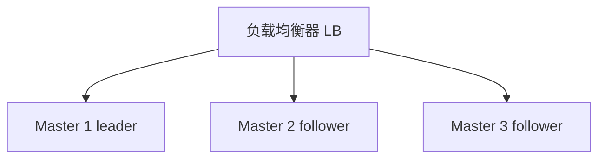
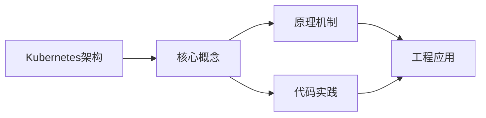
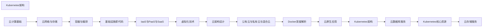

## 1. 学习目标（Bloom 分类）

本节按照布鲁姆教育目标分类学组织学习路径。本文主题为《Kubernetes架构》，属于 云计算 模块，读者可以根据自身阶段选择阅读深度。

记忆层面：能够准确复述本文的核心概念、术语与基本语法或操作步骤，并能够在提问或检索时快速定位对应知识点。能够说出 云计算 的核心概念、组件与标准流程。

理解层面：能够用自己的语言解释核心原理与工作机制，说明概念之间的因果关系，而不是机械记忆结论。能够解释 云计算 的工作原理与关键机制。

应用层面：能够在真实项目或练习场景中运用本文知识解决具体问题，写出正确且可维护的实现。能够执行 云计算 相关的标准操作与配置。

分析层面：能够拆解复杂问题，比较本文主题与相邻概念的异同，识别边界条件与例外情况。能够分析 云计算 方案在可靠性、成本与性能上的权衡。

评价层面：能够根据约束条件（性能、可读性、安全、成本）评价不同方案的优劣，做出有依据的技术决策。能够评价 云计算 中的技术选型。

创造层面：能够把本文知识与其他模块知识组合，设计出新的解决方案或可复用的工程模式。能够设计基于 云计算 的完整解决方案。

通过本节学习，读者应当能够把《Kubernetes架构》纳入自己的知识网络，并与 云计算 模块的其他主题（IaaS/PaaS/SaaS、虚拟化、云原生、成本治理）建立关联。

## 2. 历史动机与发展脉络

《Kubernetes架构》是 云计算 领域的重要主题。要真正理解它，需要先了解它解决的问题与演进过程。

云计算源于 1960 年代分时思想，2006 年 AWS 推出 EC2/S3 开启现代云服务时代；公有云（AWS/Azure/GCP/阿里云/华为云）与私有云、混合云并存。
服务模型：IaaS（虚拟机/存储/网络）、PaaS（托管运行时/数据库）、SaaS（应用即服务）；FaaS（函数即服务）进一步抽象。
云原生：容器、微服务、服务网格、声明式 API、不可变基础设施；CNCF 生态是云原生事实标准。

回到本文主题：Kubernetes架构 的提出与成熟，正是上述技术背景下的必然产物。早期实现往往以简单可用为目标，随着工程规模扩大，社区逐渐沉淀出标准做法与最佳实践；理解这一脉络，可以帮助读者判断“为什么文档中的推荐写法是现在这个样子”，也能在遇到历史遗留代码时准确识别其设计年代与取舍。


## 3. 形式化定义与核心概念精讲

本节把《Kubernetes架构》涉及的核心概念以“定义 + 讲解”的形式展开。读者应把定义当作工具，把讲解当作理解路径；两者结合才能形成可迁移的知识。

虚拟化：虚拟机（Hypervisor 硬件隔离）与容器（OS 级隔离）；虚拟化是弹性与多租户的基础。
核心服务：计算（EC2/ECS）、存储（对象/块/文件）、网络（VPC/负载均衡/CDN）、数据库（托管 RDS/NoSQL）。
弹性与计费：按需、预留、Spot；自动扩缩容（HPA/ASG）；FinOps 治理成本。

### 3.1 原文章节逐一精讲

原文档把主题拆分为 18 个小节，下面按顺序给出每一节的导读讲解，随后保留原文细节供精读。

#### 原文精读（完整保留）

# Kubernetes 高级命令(kubectl 进阶)

> **符号约定**：`< >` 必填参数 | `[ ]` 可选参数

---

#### 1. Kubernetes 整体架构

##### 1.1 架构图

```mermaid
flowchart TD
    subgraph CP[控制平面]
        API[API Server]
        SCH[Scheduler]
        CM[Controller Manager]
        ETCD[etcd]
    end
    subgraph N1[Node 1]
        K1[kubelet] P1[kube-proxy] PD1[Pods]
    end
    subgraph N2[Node 2]
        K2[kubelet] P2[kube-proxy] PD2[Pods]
    end
    CP --> N1
    CP --> N2
```

##### 1.2 设计理念

| 理念       | 描述                       |
| ---------- | -------------------------- |
| 声明式 API | 描述期望状态，系统自动趋近 |
| 控制循环   | 持续观测并调和状态         |
| 松耦合     | 组件间通过 API 通信        |
| 可扩展     | CRD、Operator、插件        |

#### 2. 控制平面组件

##### 2.1 API Server

集群的统一入口，所有操作都通过 API Server 进行。

**核心功能**：

- RESTful API 网关
- 认证、授权、准入控制
- 数据验证与持久化
- Watch 机制（变更通知）

**请求流程**：

```
请求 → 认证 → 授权 → 准入控制 → 验证 → etcd 持久化 → 响应
```

##### 2.2 etcd

分布式键值存储，Kubernetes 的唯一状态存储。

| 特性   | 描述            |
| ------ | --------------- |
| 一致性 | Raft 共识协议   |
| Watch  | 监听键值变化    |
| 事务   | Compare-and-Set |
| TTL    | 键值过期        |

**运维要点**：

- 奇数节点（3/5/7）
- SSD 存储
- 独立部署
- 定期备份

##### 2.3 Scheduler

负责将 Pod 调度到合适的节点。

**调度流程**：

```
1. 过滤（Filter）：排除不满足条件的节点
2. 评分（Score）：对可行节点打分
3. 绑定（Bind）：将 Pod 绑定到最高分节点
```

**调度策略**：

| 策略            | 描述                          |
| --------------- | ----------------------------- |
| 节点选择器      | `nodeSelector`                |
| 节点亲和性      | `nodeAffinity`                |
| Pod 亲和/反亲和 | `podAffinity/podAntiAffinity` |
| 污点与容忍      | `taints/tolerations`          |
| 资源限制        | CPU/内存请求与限制            |

##### 2.4 Controller Manager

运行各种控制器，每个控制器是一个控制循环。

| 控制器                     | 功能            |
| -------------------------- | --------------- |
| Deployment Controller      | 管理 ReplicaSet |
| ReplicaSet Controller      | 维护 Pod 副本数 |
| Node Controller            | 节点健康监测    |
| Job Controller             | 一次性任务      |
| Endpoints Controller       | Service 端点    |
| Service Account Controller | 服务账户        |

#### 3. 节点组件

##### 3.1 kubelet

节点上的代理，负责 Pod 的生命周期管理。

**核心职责**：

- Pod 创建与销毁
- 容器健康检查
- 资源使用上报
- Volume 挂载

##### 3.2 kube-proxy

维护网络规则，实现 Service 的负载均衡。

**代理模式**：

| 模式      | 描述          | 性能         |
| --------- | ------------- | ------------ |
| iptables  | iptables 规则 | 中           |
| IPVS      | IPVS 负载均衡 | 高           |
| userspace | 用户空间代理  | 低（已弃用） |

##### 3.3 容器运行时

| 运行时     | 特点            |
| ---------- | --------------- |
| containerd | 默认推荐        |
| CRI-O      | 轻量级          |
| Docker     | 已弃用（1.24+） |

#### 4. API 对象与资源

##### 4.1 核心资源

| 资源        | API 组     | 描述               |
| ----------- | ---------- | ------------------ |
| Pod         | core       | 最小调度单元       |
| Service     | core       | 服务发现与负载均衡 |
| ConfigMap   | core       | 配置管理           |
| Secret      | core       | 敏感数据           |
| Namespace   | core       | 资源隔离           |
| Deployment  | apps       | 无状态应用         |
| StatefulSet | apps       | 有状态应用         |
| DaemonSet   | apps       | 每节点一个 Pod     |
| Job         | batch      | 一次性任务         |
| CronJob     | batch      | 定时任务           |
| Ingress     | networking | HTTP 路由          |
| PV/PVC      | storage    | 持久化存储         |

##### 4.2 声明式管理

```yaml
# 期望状态
apiVersion: apps/v1
kind: Deployment
metadata:
  name: nginx
spec:
  replicas: 3
  selector:
    matchLabels:
      app: nginx
  template:
    metadata:
      labels:
        app: nginx
    spec:
      containers:
        - name: nginx
          image: nginx:1.25
```

#### 5. 高可用架构

##### 5.1 控制平面 HA



##### 5.2 etcd HA

- 3 节点容忍 1 节点故障
- 5 节点容忍 2 节点故障
- 使用 Raft 协议选举 Leader
#### 上下文与配置

**基本写法：查看 kubeconfig**
`kubectl config view`
```bash
# 查看当前 kubeconfig 配置
kubectl config view
```

---

**基本写法：合并多个 kubeconfig**
`KUBECONFIG=<文件1>:<文件2> kubectl config view --flatten > merged.conf`
```bash
# 合并多个集群配置
KUBECONFIG=~/.kube/config:cluster2.conf kubectl config view --flatten > merged.conf
```

---

**基本写法：切换上下文**
`kubectl config use-context <上下文名>`
```bash
# 切换到指定上下文
kubectl config use-context my-cluster
```

---

**基本写法：设置默认命名空间**
`kubectl config set-context --current --namespace=<命名空间>`
```bash
# 为当前上下文设置默认命名空间
kubectl config set-context --current --namespace=production
```

---

**基本写法：创建用户凭证**
`kubectl config set-credentials <用户名> --token=<token>`
```bash
# 为 kubeconfig 添加 token 认证
kubectl config set-credentials my-user --token=eyJhbGciOiJSUzI1...
```

---

#### 资源管理进阶

**基本写法：使用标签过滤**
`kubectl get pods -l <标签选择器>`
```bash
# 通过标签筛选 Pod
kubectl get pods -l app=web,tier=frontend
```

---

**基本写法：使用字段选择器**
`kubectl get pods --field-selector status.phase=Running`
```bash
# 仅查询运行中的 Pod
kubectl get pods --field-selector status.phase=Running
```

---

**基本写法：跨命名空间查询**
`kubectl get pods --all-namespaces`
```bash
# 查询所有命名空间的 Pod
kubectl get pods --all-namespaces
```

---

**基本写法：自定义列输出**
`kubectl get pods -o custom-columns=<列定义>`
```bash
# 自定义输出列展示资源使用
kubectl get pods -o custom-columns=NAME:.metadata.name,STATUS:.status.phase,NODE:.spec.nodeName
```

---

**基本写法：JSONPath 输出**
`kubectl get pods -o jsonpath='<表达式>'`
```bash
# 提取所有 Pod 名和 IP
kubectl get pods -o jsonpath='{range .items[*]}{.metadata.name}{"\t"}{.status.podIP}{"\n"}{end}'
```

---

#### Pod 调试

**基本写法：进入容器执行命令**
`kubectl exec -it <pod> [-c <容器>] -- <命令>`
```bash
# 进入 nginx 容器交互式 shell
kubectl exec -it my-pod -c nginx -- /bin/sh
```

---

**基本写法：临时调试容器**
`kubectl debug -it <pod> --image=<镜像> --target=<容器>`
```bash
# 注入临时调试容器排查问题
kubectl debug -it my-pod --image=busybox:1.36 --target=my-app
```

---

**基本写法：节点调试**
`kubectl debug node/<节点> -it --image=<镜像>`
```bash
# 在节点上创建调试 Pod
kubectl debug node/my-node -it --image=ubuntu:22.04
```

---

**基本写法：复制文件到容器**
`kubectl cp <本地文件> <命名空间>/<pod>:<路径>`
```bash
# 将本地文件复制到 Pod
kubectl cp ./app.conf my-pod:/etc/app/app.conf
```

---

**基本写法：端口转发**
`kubectl port-forward <pod> <本地端口>:<容器端口>`
```bash
# 转发 Pod 端口到本地
kubectl port-forward my-pod 8080:80
```

---

#### 日志与事件

**基本写法：查看多容器 Pod 日志**
`kubectl logs <pod> [-c <容器>] [--tail <行数>]`
```bash
# 查看指定容器最近 100 行日志
kubectl logs my-pod -c sidecar --tail=100
```

---

**基本写法：实时流式日志**
`kubectl logs -f <pod>`
```bash
# 实时跟踪 Pod 日志输出
kubectl logs -f my-pod
```

---

**基本写法：基于标签聚合日志**
`kubectl logs -l <标签选择器>`
```bash
# 查看某应用所有 Pod 日志
kubectl logs -l app=web --tail=50
```

---

**基本写法：查看之前容器日志**
`kubectl logs <pod> --previous`
```bash
# 查看容器崩溃前的日志
kubectl logs my-pod --previous
```

---

**基本写法：查看事件**
`kubectl get events [--sort-by='.lastTimestamp']`
```bash
# 按时间排序查看事件
kubectl get events --sort-by='.lastTimestamp' -n default
```

---

#### 资源伸缩

**基本写法：扩缩 Deployment**
`kubectl scale deployment <名称> --replicas=<数量>`
```bash
# 将副本数扩到 5
kubectl scale deployment web --replicas=5
```

---

**基本写法：基于文件扩缩**
`kubectl scale -f <文件> --replicas=<数量>`
```bash
# 通过资源清单文件扩缩
kubectl scale -f deployment.yaml --replicas=3
```

---

**基本写法：自动伸缩**
`kubectl autoscale deployment <名称> --min=<最小> --max=<最大> --cpu-percent=<百分比>`
```bash
# 创建 HPA 基于 CPU 自动伸缩
kubectl autoscale deployment web --min=2 --max=10 --cpu-percent=70
```

---

**基本写法：查看 HPA 状态**
`kubectl get hpa`
```bash
# 查看水平自动伸缩器
kubectl get hpa -w
```

---

**基本写法：滚动更新**
`kubectl set image deployment/<名称> <容器>=<新镜像>`
```bash
# 更新镜像触发滚动更新
kubectl set image deployment/web nginx=nginx:1.25
```

---

#### 滚动更新管理

**基本写法：查看更新状态**
`kubectl rollout status deployment/<名称>`
```bash
# 实时查看滚动更新进度
kubectl rollout status deployment/web
```

---

**基本写法：查看历史版本**
`kubectl rollout history deployment/<名称>`
```bash
# 查看 Deployment 修订历史
kubectl rollout history deployment/web
```

---

**基本写法：回滚到指定版本**
`kubectl rollout undo deployment/<名称> --to-revision=<版本>`
```bash
# 回滚到修订版本 3
kubectl rollout undo deployment/web --to-revision=3
```

---

**基本写法：暂停滚动更新**
`kubectl rollout pause deployment/<名称>`
```bash
# 暂停更新便于多次修改
kubectl rollout pause deployment/web
```

---

**基本写法：恢复滚动更新**
`kubectl rollout resume deployment/<名称>`
```bash
# 恢复暂停的滚动更新
kubectl rollout resume deployment/web
```

---

#### 网络与策略

**基本写法：创建网络策略**
```yaml
# network-policy.yaml 限制 Pod 间通信
apiVersion: networking.k8s.io/v1
kind: NetworkPolicy
metadata:
  name: web-policy
  namespace: default
spec:
  podSelector:
    matchLabels:
      app: web
  policyTypes:
    - Ingress
  ingress:
    - from:
        - podSelector:
            matchLabels:
              app: api
      ports:
        - protocol: TCP
          port: 80
```

---

**基本写法：应用网络策略**
`kubectl apply -f <策略文件>`
```bash
# 创建网络策略限制访问
kubectl apply -f network-policy.yaml
```

---

**基本写法：DNS 测试**
`kubectl run dns-test --image=busybox:1.36 --rm -it -- nslookup <服务名>`
```bash
# 测试集群内 DNS 解析
kubectl run dns-test --image=busybox:1.36 --rm -it -- nslookup kubernetes.default
```

---

**基本写法：连通性测试**
`kubectl run curl-test --image=curlimages/curl:8.5.0 --rm -it -- curl <URL>`
```bash
# 在集群内测试服务连通性
kubectl run curl-test --image=curlimages/curl:8.5.0 --rm -it -- curl http://web.default.svc.cluster.local
```

---

**基本写法：查看 Endpoints**
`kubectl get endpoints <服务名>`
```bash
# 查看服务对应的后端 Pod
kubectl get endpoints web
```

---

#### 存储管理

**基本写法：列出存储类**
`kubectl get storageclass`
```bash
# 查看集群所有存储类
kubectl get sc
```

---

**基本写法：创建持久卷声明**
```yaml
# pvc.yaml 持久卷声明
apiVersion: v1
kind: PersistentVolumeClaim
metadata:
  name: my-pvc
spec:
  accessModes:
    - ReadWriteOnce
  storageClassName: standard
  resources:
    requests:
      storage: 10Gi
```

---

**基本写法：动态供给卷**
`kubectl apply -f pvc.yaml`
```bash
# 创建 PVC 触发动态供给
kubectl apply -f pvc.yaml
```

---

**基本写法：查看 PV 状态**
`kubectl get pv`
```bash
# 查看所有持久卷
kubectl get pv -o wide
```

---

**基本写法：扩容 PVC**
`kubectl patch pvc <名称> -p '{"spec":{"resources":{"requests":{"storage":"20Gi"}}}}'`
```bash
# 在线扩容 PVC
kubectl patch pvc my-pvc -p '{"spec":{"resources":{"requests":{"storage":"20Gi"}}}}'
```

---

#### 安全与 RBAC

**基本写法：创建 Service Account**
`kubectl create serviceaccount <名称> [-n <命名空间>]`
```bash
# 创建服务账户
kubectl create serviceaccount my-sa -n default
```

---

**基本写法：创建角色**
```yaml
# role.yaml 命名空间内角色
apiVersion: rbac.authorization.k8s.io/v1
kind: Role
metadata:
  namespace: default
  name: pod-reader
rules:
  - apiGroups: [""]
    resources: ["pods", "pods/log"]
    verbs: ["get", "list", "watch"]
```

---

**基本写法：绑定角色**
`kubectl create rolebinding <绑定名> --role=<角色> --serviceaccount=<命名空间>:<SA>`
```bash
# 为 SA 绑定 Role
kubectl create rolebinding my-binding \
  --role=pod-reader \
  --serviceaccount=default:my-sa \
  -n default
```

---

**基本写法：集群角色绑定**
`kubectl create clusterrolebinding <绑定名> --clusterrole=<角色> --user=<用户>`
```bash
# 为用户绑定集群角色
kubectl create clusterrolebinding admin-binding \
  --clusterrole=cluster-admin \
  --user=alice@example.com
```

---

**基本写法：查看权限**
`kubectl auth can-i <动作> <资源> [--as=<用户>]`
```bash
# 检查用户是否有权限创建 Pod
kubectl auth can-i create pods --as=alice@example.com
```

---

#### 集群节点管理

**基本写法：查看节点详情**
`kubectl describe node <节点名>`
```bash
# 查看节点详细信息
kubectl describe node my-node
```

---

**基本写法：节点打标签**
`kubectl label nodes <节点> <键>=<值>`
```bash
# 为节点添加标签
kubectl label nodes my-node disktype=ssd
```

---

**基本写法：节点污点**
`kubectl taint nodes <节点> <键>=<值>:<效果>`
```bash
# 为节点添加 NoSchedule 污点
kubectl taint nodes my-node dedicated=gpu:NoSchedule
```

---

**基本写法：移除污点**
`kubectl taint nodes <节点> <键>:<效果>-`
```bash
# 移除节点污点(末尾减号)
kubectl taint nodes my-node dedicated=gpu:NoSchedule-
```

---

**基本写法：节点驱逐**
`kubectl drain <节点> --ignore-daemonsets --delete-emptydir-data`
```bash
# 安全驱逐节点上所有 Pod
kubectl drain my-node --ignore-daemonsets --delete-emptydir-data
```

---

#### 自定义资源与 Operator

**基本写法：查看 CRD**
`kubectl get crd`
```bash
# 列出所有自定义资源定义
kubectl get crd
```

---

**基本写法：查看 CR 实例**
`kubectl get <资源类型>`
```bash
# 查看某 CRD 的所有实例
kubectl get certificates
```

---

**基本写法：查看 Operator Pod**
`kubectl get pods -n <命名空间> | grep <operator>`
```bash
# 查看 Cert-Manager Operator
kubectl get pods -n cert-manager
```

---

**基本写法：查看 CR 详情**
`kubectl describe <资源类型> <名称>`
```bash
# 查看 Certificate 自定义资源详情
kubectl describe certificate my-cert -n default
```

---

**基本写法：编辑 CR**
`kubectl edit <资源类型> <名称>`
```bash
# 在线编辑自定义资源
kubectl edit certificate my-cert -n default
```

---

#### 性能与资源

**基本写法：查看资源使用**
`kubectl top pods`
```bash
# 查看 Pod CPU/内存使用
kubectl top pods -n default
```

---

**基本写法：查看节点资源**
`kubectl top nodes`
```bash
# 查看节点资源使用情况
kubectl top nodes
```

---

**基本写法：查看资源配额**
`kubectl describe resourcequota`
```bash
# 查看命名空间资源配额
kubectl describe resourcequota -n default
```

---

**基本写法：创建 LimitRange**
```yaml
# limit-range.yaml 默认资源限制
apiVersion: v1
kind: LimitRange
metadata:
  name: default-limits
spec:
  limits:
    - type: Container
      default:
        cpu: 500m
        memory: 512Mi
      defaultRequest:
        cpu: 100m
        memory: 128Mi
```

---

**基本写法：创建 ResourceQuota**
```yaml
# resource-quota.yaml 命名空间配额
apiVersion: v1
kind: ResourceQuota
metadata:
  name: compute-quota
spec:
  hard:
    requests.cpu: "4"
    requests.memory: 8Gi
    limits.cpu: "8"
    limits.memory: 16Gi
    persistentvolumeclaims: "10"
```

---

#### 高级调度

**基本写法：节点亲和性**
```yaml
# 通过节点亲和性调度 Pod
apiVersion: v1
kind: Pod
metadata:
  name: my-pod
spec:
  affinity:
    nodeAffinity:
      requiredDuringSchedulingIgnoredDuringExecution:
        nodeSelectorTerms:
          - matchExpressions:
              - key: disktype
                operator: In
                values:
                  - ssd
  containers:
    - name: app
      image: nginx:1.25
```

---

**基本写法：Pod 反亲和性**
```yaml
# Pod 反亲和性使副本分散到不同节点
spec:
  affinity:
    podAntiAffinity:
      requiredDuringSchedulingIgnoredDuringExecution:
        - labelSelector:
            matchExpressions:
              - key: app
                operator: In
                values:
                  - web
          topologyKey: kubernetes.io/hostname
```

---

**基本写法：拓扑分布约束**
```yaml
# 跨可用区均匀分布
spec:
  topologySpreadConstraints:
    - maxSkew: 1
      topologyKey: topology.kubernetes.io/zone
      whenUnsatisfiable: DoNotSchedule
      labelSelector:
        matchLabels:
          app: web
```

---

**基本写法：优先级与抢占**
```yaml
# 高优先级 Pod 抢占低优先级
apiVersion: scheduling.k8s.io/v1
kind: PriorityClass
metadata:
  name: high-priority
value: 1000
globalDefault: false
description: "高优先级 Pod"
```


### 3.2 概念关系图

下面用 Mermaid 图表达本文核心概念之间的关系，帮助读者建立整体图景：



图中展示的是本文知识的结构化关系：核心概念是入口，原理机制解释“为什么”，代码实践演示“怎么做”，工程应用回答“何时用”。读者学习时可以把每个小节的内容挂接到对应节点上。

## 4. 理论推导与原理解析

本节深入《Kubernetes架构》背后的原理。理论部分不求面面俱到，而是聚焦“能解释现象、能指导实践”的关键推导。

虚拟化：虚拟机（Hypervisor 硬件隔离）与容器（OS 级隔离）；虚拟化是弹性与多租户的基础。
核心服务：计算（EC2/ECS）、存储（对象/块/文件）、网络（VPC/负载均衡/CDN）、数据库（托管 RDS/NoSQL）。
弹性与计费：按需、预留、Spot；自动扩缩容（HPA/ASG）；FinOps 治理成本。
高可用设计：多可用区、故障域、跨区域容灾；RPO/RTO 目标驱动方案。

需要强调的是，理论推导与工程实践之间存在翻译层：理论给出的是理想化模型与边界条件，工程代码则必须处理真实环境中的例外。读者在学习时应先掌握理论的“标准情形”，再通过陷阱章节了解“非标准情形”。

## 5. 代码示例与逐行讲解

本节把原文中的代码示例系统整理，并为每个示例补充用途说明与讲解。读者不应只浏览代码，而应逐段对照讲解理解设计意图。

### 5.1 示例：1.1 架构图

该示例来自原文《1.1 架构图》小节，用于演示Kubernetes架构相关操作。阅读时请先看代码结构，再看其后的讲解。

```mermaid
flowchart TD
    subgraph CP[控制平面]
        API[API Server]
        SCH[Scheduler]
        CM[Controller Manager]
        ETCD[etcd]
    end
    subgraph N1[Node 1]
        K1[kubelet] P1[kube-proxy] PD1[Pods]
    end
    subgraph N2[Node 2]
        K2[kubelet] P2[kube-proxy] PD2[Pods]
    end
    CP --> N1
    CP --> N2
```

讲解：这段代码演示了本节核心知识点。代码中的关键操作可以归纳为三步：准备（定义或初始化）、执行（核心逻辑）、收尾（释放资源或返回结果）。实际项目中，这三步往往被封装为函数或类，以提升复用性与可测试性。

关键点分析：

该示例共 15 行有效代码，结构以数据或配置为主。阅读时应关注：数据字段的含义、配置项的作用，以及它们与运行行为的对应关系。

进阶思考路径：先尝试修改参数观察行为变化，再把示例中的模式迁移到自己的项目中；每次修改都记录预期与实测差异，这是把示例转化为能力的最快方式。

### 5.2 示例：2.1 API Server

该示例来自原文《2.1 API Server》小节，用于演示Kubernetes架构相关操作。阅读时请先看代码结构，再看其后的讲解。

```text
请求 → 认证 → 授权 → 准入控制 → 验证 → etcd 持久化 → 响应
```

讲解：这段代码演示了本节核心知识点。代码中的关键操作可以归纳为三步：准备（定义或初始化）、执行（核心逻辑）、收尾（释放资源或返回结果）。实际项目中，这三步往往被封装为函数或类，以提升复用性与可测试性。

关键点分析：

该示例共 1 行有效代码，结构以数据或配置为主。阅读时应关注：数据字段的含义、配置项的作用，以及它们与运行行为的对应关系。

进阶思考路径：先尝试修改参数观察行为变化，再把示例中的模式迁移到自己的项目中；每次修改都记录预期与实测差异，这是把示例转化为能力的最快方式。

### 5.3 示例：2.3 Scheduler

该示例来自原文《2.3 Scheduler》小节，用于演示Kubernetes架构相关操作。阅读时请先看代码结构，再看其后的讲解。

```text
1. 过滤（Filter）：排除不满足条件的节点
2. 评分（Score）：对可行节点打分
3. 绑定（Bind）：将 Pod 绑定到最高分节点
```

讲解：这段代码演示了本节核心知识点。代码中的关键操作可以归纳为三步：准备（定义或初始化）、执行（核心逻辑）、收尾（释放资源或返回结果）。实际项目中，这三步往往被封装为函数或类，以提升复用性与可测试性。

关键点分析：

该示例共 3 行有效代码，结构以数据或配置为主。阅读时应关注：数据字段的含义、配置项的作用，以及它们与运行行为的对应关系。

进阶思考路径：先尝试修改参数观察行为变化，再把示例中的模式迁移到自己的项目中；每次修改都记录预期与实测差异，这是把示例转化为能力的最快方式。

### 5.4 示例：4.2 声明式管理

该示例来自原文《4.2 声明式管理》小节，用于演示Kubernetes架构相关操作。阅读时请先看代码结构，再看其后的讲解。

```yaml
# 期望状态
apiVersion: apps/v1
kind: Deployment
metadata:
  name: nginx
spec:
  replicas: 3
  selector:
    matchLabels:
      app: nginx
  template:
    metadata:
      labels:
        app: nginx
    spec:
      containers:
        - name: nginx
          image: nginx:1.25
```

讲解：这段代码演示了本节核心知识点。代码中的关键操作可以归纳为三步：准备（定义或初始化）、执行（核心逻辑）、收尾（释放资源或返回结果）。实际项目中，这三步往往被封装为函数或类，以提升复用性与可测试性。

关键点分析：

该示例共 18 行有效代码，包含 1 类关键结构（apiVersion）。其中：

- 入口与初始化部分负责建立上下文，对应实际项目中的启动或装配逻辑；
- 核心逻辑部分体现本文主题的主要操作，是阅读时最需要对照讲解理解的部分；
- 输出或返回部分把结果交给调用方，注意其类型与边界条件。

进阶思考路径：先尝试修改参数观察行为变化，再把示例中的模式迁移到自己的项目中；每次修改都记录预期与实测差异，这是把示例转化为能力的最快方式。

### 5.5 示例：5.1 控制平面 HA

该示例来自原文《5.1 控制平面 HA》小节，用于演示Kubernetes架构相关操作。阅读时请先看代码结构，再看其后的讲解。


讲解：这段代码演示了本节核心知识点。代码中的关键操作可以归纳为三步：准备（定义或初始化）、执行（核心逻辑）、收尾（释放资源或返回结果）。实际项目中，这三步往往被封装为函数或类，以提升复用性与可测试性。

关键点分析：

该示例共 8 行有效代码，结构以数据或配置为主。阅读时应关注：数据字段的含义、配置项的作用，以及它们与运行行为的对应关系。

进阶思考路径：先尝试修改参数观察行为变化，再把示例中的模式迁移到自己的项目中；每次修改都记录预期与实测差异，这是把示例转化为能力的最快方式。

### 5.6 示例：上下文与配置

该示例来自原文《上下文与配置》小节，用于演示Kubernetes架构相关操作。阅读时请先看代码结构，再看其后的讲解。

```bash
# 查看当前 kubeconfig 配置
kubectl config view
```

讲解：这段代码演示了本节核心知识点。代码中的关键操作可以归纳为三步：准备（定义或初始化）、执行（核心逻辑）、收尾（释放资源或返回结果）。实际项目中，这三步往往被封装为函数或类，以提升复用性与可测试性。

关键点分析：

该示例共 2 行有效代码，结构以数据或配置为主。阅读时应关注：数据字段的含义、配置项的作用，以及它们与运行行为的对应关系。

进阶思考路径：先尝试修改参数观察行为变化，再把示例中的模式迁移到自己的项目中；每次修改都记录预期与实测差异，这是把示例转化为能力的最快方式。

### 5.7 示例：上下文与配置

该示例来自原文《上下文与配置》小节，用于演示Kubernetes架构相关操作。阅读时请先看代码结构，再看其后的讲解。

```bash
# 合并多个集群配置
KUBECONFIG=~/.kube/config:cluster2.conf kubectl config view --flatten > merged.conf
```

讲解：这段代码演示了本节核心知识点。代码中的关键操作可以归纳为三步：准备（定义或初始化）、执行（核心逻辑）、收尾（释放资源或返回结果）。实际项目中，这三步往往被封装为函数或类，以提升复用性与可测试性。

关键点分析：

该示例共 2 行有效代码，结构以数据或配置为主。阅读时应关注：数据字段的含义、配置项的作用，以及它们与运行行为的对应关系。

进阶思考路径：先尝试修改参数观察行为变化，再把示例中的模式迁移到自己的项目中；每次修改都记录预期与实测差异，这是把示例转化为能力的最快方式。

### 5.8 示例：上下文与配置

该示例来自原文《上下文与配置》小节，用于演示Kubernetes架构相关操作。阅读时请先看代码结构，再看其后的讲解。

```bash
# 切换到指定上下文
kubectl config use-context my-cluster
```

讲解：这段代码演示了本节核心知识点。代码中的关键操作可以归纳为三步：准备（定义或初始化）、执行（核心逻辑）、收尾（释放资源或返回结果）。实际项目中，这三步往往被封装为函数或类，以提升复用性与可测试性。

关键点分析：

该示例共 2 行有效代码，结构以数据或配置为主。阅读时应关注：数据字段的含义、配置项的作用，以及它们与运行行为的对应关系。

进阶思考路径：先尝试修改参数观察行为变化，再把示例中的模式迁移到自己的项目中；每次修改都记录预期与实测差异，这是把示例转化为能力的最快方式。

### 5.9 示例：上下文与配置

该示例来自原文《上下文与配置》小节，用于演示Kubernetes架构相关操作。阅读时请先看代码结构，再看其后的讲解。

```bash
# 为当前上下文设置默认命名空间
kubectl config set-context --current --namespace=production
```

讲解：这段代码演示了本节核心知识点。代码中的关键操作可以归纳为三步：准备（定义或初始化）、执行（核心逻辑）、收尾（释放资源或返回结果）。实际项目中，这三步往往被封装为函数或类，以提升复用性与可测试性。

关键点分析：

该示例共 2 行有效代码，结构以数据或配置为主。阅读时应关注：数据字段的含义、配置项的作用，以及它们与运行行为的对应关系。

进阶思考路径：先尝试修改参数观察行为变化，再把示例中的模式迁移到自己的项目中；每次修改都记录预期与实测差异，这是把示例转化为能力的最快方式。

### 5.10 示例：上下文与配置

该示例来自原文《上下文与配置》小节，用于演示Kubernetes架构相关操作。阅读时请先看代码结构，再看其后的讲解。

```bash
# 为 kubeconfig 添加 token 认证
kubectl config set-credentials my-user --token=eyJhbGciOiJSUzI1...
```

讲解：这段代码演示了本节核心知识点。代码中的关键操作可以归纳为三步：准备（定义或初始化）、执行（核心逻辑）、收尾（释放资源或返回结果）。实际项目中，这三步往往被封装为函数或类，以提升复用性与可测试性。

关键点分析：

该示例共 2 行有效代码，结构以数据或配置为主。阅读时应关注：数据字段的含义、配置项的作用，以及它们与运行行为的对应关系。

进阶思考路径：先尝试修改参数观察行为变化，再把示例中的模式迁移到自己的项目中；每次修改都记录预期与实测差异，这是把示例转化为能力的最快方式。

### 5.11 示例：资源管理进阶

该示例来自原文《资源管理进阶》小节，用于演示Kubernetes架构相关操作。阅读时请先看代码结构，再看其后的讲解。

```bash
# 通过标签筛选 Pod
kubectl get pods -l app=web,tier=frontend
```

讲解：这段代码演示了本节核心知识点。代码中的关键操作可以归纳为三步：准备（定义或初始化）、执行（核心逻辑）、收尾（释放资源或返回结果）。实际项目中，这三步往往被封装为函数或类，以提升复用性与可测试性。

关键点分析：

该示例共 2 行有效代码，结构以数据或配置为主。阅读时应关注：数据字段的含义、配置项的作用，以及它们与运行行为的对应关系。

进阶思考路径：先尝试修改参数观察行为变化，再把示例中的模式迁移到自己的项目中；每次修改都记录预期与实测差异，这是把示例转化为能力的最快方式。

### 5.12 示例：资源管理进阶

该示例来自原文《资源管理进阶》小节，用于演示Kubernetes架构相关操作。阅读时请先看代码结构，再看其后的讲解。

```bash
# 仅查询运行中的 Pod
kubectl get pods --field-selector status.phase=Running
```

讲解：这段代码演示了本节核心知识点。代码中的关键操作可以归纳为三步：准备（定义或初始化）、执行（核心逻辑）、收尾（释放资源或返回结果）。实际项目中，这三步往往被封装为函数或类，以提升复用性与可测试性。

关键点分析：

该示例共 2 行有效代码，结构以数据或配置为主。阅读时应关注：数据字段的含义、配置项的作用，以及它们与运行行为的对应关系。

进阶思考路径：先尝试修改参数观察行为变化，再把示例中的模式迁移到自己的项目中；每次修改都记录预期与实测差异，这是把示例转化为能力的最快方式。

### 5.13 示例：资源管理进阶

该示例来自原文《资源管理进阶》小节，用于演示Kubernetes架构相关操作。阅读时请先看代码结构，再看其后的讲解。

```bash
# 查询所有命名空间的 Pod
kubectl get pods --all-namespaces
```

讲解：这段代码演示了本节核心知识点。代码中的关键操作可以归纳为三步：准备（定义或初始化）、执行（核心逻辑）、收尾（释放资源或返回结果）。实际项目中，这三步往往被封装为函数或类，以提升复用性与可测试性。

关键点分析：

该示例共 2 行有效代码，结构以数据或配置为主。阅读时应关注：数据字段的含义、配置项的作用，以及它们与运行行为的对应关系。

进阶思考路径：先尝试修改参数观察行为变化，再把示例中的模式迁移到自己的项目中；每次修改都记录预期与实测差异，这是把示例转化为能力的最快方式。

### 5.14 示例：资源管理进阶

该示例来自原文《资源管理进阶》小节，用于演示Kubernetes架构相关操作。阅读时请先看代码结构，再看其后的讲解。

```bash
# 自定义输出列展示资源使用
kubectl get pods -o custom-columns=NAME:.metadata.name,STATUS:.status.phase,NODE:.spec.nodeName
```

讲解：这段代码演示了本节核心知识点。代码中的关键操作可以归纳为三步：准备（定义或初始化）、执行（核心逻辑）、收尾（释放资源或返回结果）。实际项目中，这三步往往被封装为函数或类，以提升复用性与可测试性。

关键点分析：

该示例共 2 行有效代码，结构以数据或配置为主。阅读时应关注：数据字段的含义、配置项的作用，以及它们与运行行为的对应关系。

进阶思考路径：先尝试修改参数观察行为变化，再把示例中的模式迁移到自己的项目中；每次修改都记录预期与实测差异，这是把示例转化为能力的最快方式。

### 5.15 示例：资源管理进阶

该示例来自原文《资源管理进阶》小节，用于演示Kubernetes架构相关操作。阅读时请先看代码结构，再看其后的讲解。

```bash
# 提取所有 Pod 名和 IP
kubectl get pods -o jsonpath='{range .items[*]}{.metadata.name}{"\t"}{.status.podIP}{"\n"}{end}'
```

讲解：这段代码演示了本节核心知识点。代码中的关键操作可以归纳为三步：准备（定义或初始化）、执行（核心逻辑）、收尾（释放资源或返回结果）。实际项目中，这三步往往被封装为函数或类，以提升复用性与可测试性。

关键点分析：

该示例共 2 行有效代码，结构以数据或配置为主。阅读时应关注：数据字段的含义、配置项的作用，以及它们与运行行为的对应关系。

进阶思考路径：先尝试修改参数观察行为变化，再把示例中的模式迁移到自己的项目中；每次修改都记录预期与实测差异，这是把示例转化为能力的最快方式。

### 5.16 示例：Pod 调试

该示例来自原文《Pod 调试》小节，用于演示Kubernetes架构相关操作。阅读时请先看代码结构，再看其后的讲解。

```bash
# 进入 nginx 容器交互式 shell
kubectl exec -it my-pod -c nginx -- /bin/sh
```

讲解：这段代码演示了本节核心知识点。代码中的关键操作可以归纳为三步：准备（定义或初始化）、执行（核心逻辑）、收尾（释放资源或返回结果）。实际项目中，这三步往往被封装为函数或类，以提升复用性与可测试性。

关键点分析：

该示例共 2 行有效代码，结构以数据或配置为主。阅读时应关注：数据字段的含义、配置项的作用，以及它们与运行行为的对应关系。

进阶思考路径：先尝试修改参数观察行为变化，再把示例中的模式迁移到自己的项目中；每次修改都记录预期与实测差异，这是把示例转化为能力的最快方式。

### 5.17 示例：Pod 调试

该示例来自原文《Pod 调试》小节，用于演示Kubernetes架构相关操作。阅读时请先看代码结构，再看其后的讲解。

```bash
# 注入临时调试容器排查问题
kubectl debug -it my-pod --image=busybox:1.36 --target=my-app
```

讲解：这段代码演示了本节核心知识点。代码中的关键操作可以归纳为三步：准备（定义或初始化）、执行（核心逻辑）、收尾（释放资源或返回结果）。实际项目中，这三步往往被封装为函数或类，以提升复用性与可测试性。

关键点分析：

该示例共 2 行有效代码，结构以数据或配置为主。阅读时应关注：数据字段的含义、配置项的作用，以及它们与运行行为的对应关系。

进阶思考路径：先尝试修改参数观察行为变化，再把示例中的模式迁移到自己的项目中；每次修改都记录预期与实测差异，这是把示例转化为能力的最快方式。

### 5.18 示例：Pod 调试

该示例来自原文《Pod 调试》小节，用于演示Kubernetes架构相关操作。阅读时请先看代码结构，再看其后的讲解。

```bash
# 在节点上创建调试 Pod
kubectl debug node/my-node -it --image=ubuntu:22.04
```

讲解：这段代码演示了本节核心知识点。代码中的关键操作可以归纳为三步：准备（定义或初始化）、执行（核心逻辑）、收尾（释放资源或返回结果）。实际项目中，这三步往往被封装为函数或类，以提升复用性与可测试性。

关键点分析：

该示例共 2 行有效代码，结构以数据或配置为主。阅读时应关注：数据字段的含义、配置项的作用，以及它们与运行行为的对应关系。

进阶思考路径：先尝试修改参数观察行为变化，再把示例中的模式迁移到自己的项目中；每次修改都记录预期与实测差异，这是把示例转化为能力的最快方式。

### 5.19 示例：Pod 调试

该示例来自原文《Pod 调试》小节，用于演示Kubernetes架构相关操作。阅读时请先看代码结构，再看其后的讲解。

```bash
# 将本地文件复制到 Pod
kubectl cp ./app.conf my-pod:/etc/app/app.conf
```

讲解：这段代码演示了本节核心知识点。代码中的关键操作可以归纳为三步：准备（定义或初始化）、执行（核心逻辑）、收尾（释放资源或返回结果）。实际项目中，这三步往往被封装为函数或类，以提升复用性与可测试性。

关键点分析：

该示例共 2 行有效代码，结构以数据或配置为主。阅读时应关注：数据字段的含义、配置项的作用，以及它们与运行行为的对应关系。

进阶思考路径：先尝试修改参数观察行为变化，再把示例中的模式迁移到自己的项目中；每次修改都记录预期与实测差异，这是把示例转化为能力的最快方式。

### 5.20 示例：Pod 调试

该示例来自原文《Pod 调试》小节，用于演示Kubernetes架构相关操作。阅读时请先看代码结构，再看其后的讲解。

```bash
# 转发 Pod 端口到本地
kubectl port-forward my-pod 8080:80
```

讲解：这段代码演示了本节核心知识点。代码中的关键操作可以归纳为三步：准备（定义或初始化）、执行（核心逻辑）、收尾（释放资源或返回结果）。实际项目中，这三步往往被封装为函数或类，以提升复用性与可测试性。

关键点分析：

该示例共 2 行有效代码，结构以数据或配置为主。阅读时应关注：数据字段的含义、配置项的作用，以及它们与运行行为的对应关系。

进阶思考路径：先尝试修改参数观察行为变化，再把示例中的模式迁移到自己的项目中；每次修改都记录预期与实测差异，这是把示例转化为能力的最快方式。

### 5.21 示例：日志与事件

该示例来自原文《日志与事件》小节，用于演示Kubernetes架构相关操作。阅读时请先看代码结构，再看其后的讲解。

```bash
# 查看指定容器最近 100 行日志
kubectl logs my-pod -c sidecar --tail=100
```

讲解：这段代码演示了本节核心知识点。代码中的关键操作可以归纳为三步：准备（定义或初始化）、执行（核心逻辑）、收尾（释放资源或返回结果）。实际项目中，这三步往往被封装为函数或类，以提升复用性与可测试性。

关键点分析：

该示例共 2 行有效代码，结构以数据或配置为主。阅读时应关注：数据字段的含义、配置项的作用，以及它们与运行行为的对应关系。

进阶思考路径：先尝试修改参数观察行为变化，再把示例中的模式迁移到自己的项目中；每次修改都记录预期与实测差异，这是把示例转化为能力的最快方式。

### 5.22 示例：日志与事件

该示例来自原文《日志与事件》小节，用于演示Kubernetes架构相关操作。阅读时请先看代码结构，再看其后的讲解。

```bash
# 实时跟踪 Pod 日志输出
kubectl logs -f my-pod
```

讲解：这段代码演示了本节核心知识点。代码中的关键操作可以归纳为三步：准备（定义或初始化）、执行（核心逻辑）、收尾（释放资源或返回结果）。实际项目中，这三步往往被封装为函数或类，以提升复用性与可测试性。

关键点分析：

该示例共 2 行有效代码，结构以数据或配置为主。阅读时应关注：数据字段的含义、配置项的作用，以及它们与运行行为的对应关系。

进阶思考路径：先尝试修改参数观察行为变化，再把示例中的模式迁移到自己的项目中；每次修改都记录预期与实测差异，这是把示例转化为能力的最快方式。

### 5.23 示例：日志与事件

该示例来自原文《日志与事件》小节，用于演示Kubernetes架构相关操作。阅读时请先看代码结构，再看其后的讲解。

```bash
# 查看某应用所有 Pod 日志
kubectl logs -l app=web --tail=50
```

讲解：这段代码演示了本节核心知识点。代码中的关键操作可以归纳为三步：准备（定义或初始化）、执行（核心逻辑）、收尾（释放资源或返回结果）。实际项目中，这三步往往被封装为函数或类，以提升复用性与可测试性。

关键点分析：

该示例共 2 行有效代码，结构以数据或配置为主。阅读时应关注：数据字段的含义、配置项的作用，以及它们与运行行为的对应关系。

进阶思考路径：先尝试修改参数观察行为变化，再把示例中的模式迁移到自己的项目中；每次修改都记录预期与实测差异，这是把示例转化为能力的最快方式。

### 5.24 示例：日志与事件

该示例来自原文《日志与事件》小节，用于演示Kubernetes架构相关操作。阅读时请先看代码结构，再看其后的讲解。

```bash
# 查看容器崩溃前的日志
kubectl logs my-pod --previous
```

讲解：这段代码演示了本节核心知识点。代码中的关键操作可以归纳为三步：准备（定义或初始化）、执行（核心逻辑）、收尾（释放资源或返回结果）。实际项目中，这三步往往被封装为函数或类，以提升复用性与可测试性。

关键点分析：

该示例共 2 行有效代码，结构以数据或配置为主。阅读时应关注：数据字段的含义、配置项的作用，以及它们与运行行为的对应关系。

进阶思考路径：先尝试修改参数观察行为变化，再把示例中的模式迁移到自己的项目中；每次修改都记录预期与实测差异，这是把示例转化为能力的最快方式。

### 5.25 示例：日志与事件

该示例来自原文《日志与事件》小节，用于演示Kubernetes架构相关操作。阅读时请先看代码结构，再看其后的讲解。

```bash
# 按时间排序查看事件
kubectl get events --sort-by='.lastTimestamp' -n default
```

讲解：这段代码演示了本节核心知识点。代码中的关键操作可以归纳为三步：准备（定义或初始化）、执行（核心逻辑）、收尾（释放资源或返回结果）。实际项目中，这三步往往被封装为函数或类，以提升复用性与可测试性。

关键点分析：

该示例共 2 行有效代码，结构以数据或配置为主。阅读时应关注：数据字段的含义、配置项的作用，以及它们与运行行为的对应关系。

进阶思考路径：先尝试修改参数观察行为变化，再把示例中的模式迁移到自己的项目中；每次修改都记录预期与实测差异，这是把示例转化为能力的最快方式。

### 5.26 示例：资源伸缩

该示例来自原文《资源伸缩》小节，用于演示Kubernetes架构相关操作。阅读时请先看代码结构，再看其后的讲解。

```bash
# 将副本数扩到 5
kubectl scale deployment web --replicas=5
```

讲解：这段代码演示了本节核心知识点。代码中的关键操作可以归纳为三步：准备（定义或初始化）、执行（核心逻辑）、收尾（释放资源或返回结果）。实际项目中，这三步往往被封装为函数或类，以提升复用性与可测试性。

关键点分析：

该示例共 2 行有效代码，结构以数据或配置为主。阅读时应关注：数据字段的含义、配置项的作用，以及它们与运行行为的对应关系。

进阶思考路径：先尝试修改参数观察行为变化，再把示例中的模式迁移到自己的项目中；每次修改都记录预期与实测差异，这是把示例转化为能力的最快方式。

### 5.27 示例：资源伸缩

该示例来自原文《资源伸缩》小节，用于演示Kubernetes架构相关操作。阅读时请先看代码结构，再看其后的讲解。

```bash
# 通过资源清单文件扩缩
kubectl scale -f deployment.yaml --replicas=3
```

讲解：这段代码演示了本节核心知识点。代码中的关键操作可以归纳为三步：准备（定义或初始化）、执行（核心逻辑）、收尾（释放资源或返回结果）。实际项目中，这三步往往被封装为函数或类，以提升复用性与可测试性。

关键点分析：

该示例共 2 行有效代码，结构以数据或配置为主。阅读时应关注：数据字段的含义、配置项的作用，以及它们与运行行为的对应关系。

进阶思考路径：先尝试修改参数观察行为变化，再把示例中的模式迁移到自己的项目中；每次修改都记录预期与实测差异，这是把示例转化为能力的最快方式。

### 5.28 示例：资源伸缩

该示例来自原文《资源伸缩》小节，用于演示Kubernetes架构相关操作。阅读时请先看代码结构，再看其后的讲解。

```bash
# 创建 HPA 基于 CPU 自动伸缩
kubectl autoscale deployment web --min=2 --max=10 --cpu-percent=70
```

讲解：这段代码演示了本节核心知识点。代码中的关键操作可以归纳为三步：准备（定义或初始化）、执行（核心逻辑）、收尾（释放资源或返回结果）。实际项目中，这三步往往被封装为函数或类，以提升复用性与可测试性。

关键点分析：

该示例共 2 行有效代码，结构以数据或配置为主。阅读时应关注：数据字段的含义、配置项的作用，以及它们与运行行为的对应关系。

进阶思考路径：先尝试修改参数观察行为变化，再把示例中的模式迁移到自己的项目中；每次修改都记录预期与实测差异，这是把示例转化为能力的最快方式。

### 5.29 示例：资源伸缩

该示例来自原文《资源伸缩》小节，用于演示Kubernetes架构相关操作。阅读时请先看代码结构，再看其后的讲解。

```bash
# 查看水平自动伸缩器
kubectl get hpa -w
```

讲解：这段代码演示了本节核心知识点。代码中的关键操作可以归纳为三步：准备（定义或初始化）、执行（核心逻辑）、收尾（释放资源或返回结果）。实际项目中，这三步往往被封装为函数或类，以提升复用性与可测试性。

关键点分析：

该示例共 2 行有效代码，结构以数据或配置为主。阅读时应关注：数据字段的含义、配置项的作用，以及它们与运行行为的对应关系。

进阶思考路径：先尝试修改参数观察行为变化，再把示例中的模式迁移到自己的项目中；每次修改都记录预期与实测差异，这是把示例转化为能力的最快方式。

### 5.30 示例：资源伸缩

该示例来自原文《资源伸缩》小节，用于演示Kubernetes架构相关操作。阅读时请先看代码结构，再看其后的讲解。

```bash
# 更新镜像触发滚动更新
kubectl set image deployment/web nginx=nginx:1.25
```

讲解：这段代码演示了本节核心知识点。代码中的关键操作可以归纳为三步：准备（定义或初始化）、执行（核心逻辑）、收尾（释放资源或返回结果）。实际项目中，这三步往往被封装为函数或类，以提升复用性与可测试性。

关键点分析：

该示例共 2 行有效代码，结构以数据或配置为主。阅读时应关注：数据字段的含义、配置项的作用，以及它们与运行行为的对应关系。

进阶思考路径：先尝试修改参数观察行为变化，再把示例中的模式迁移到自己的项目中；每次修改都记录预期与实测差异，这是把示例转化为能力的最快方式。

### 5.31 示例：滚动更新管理

该示例来自原文《滚动更新管理》小节，用于演示Kubernetes架构相关操作。阅读时请先看代码结构，再看其后的讲解。

```bash
# 实时查看滚动更新进度
kubectl rollout status deployment/web
```

讲解：这段代码演示了本节核心知识点。代码中的关键操作可以归纳为三步：准备（定义或初始化）、执行（核心逻辑）、收尾（释放资源或返回结果）。实际项目中，这三步往往被封装为函数或类，以提升复用性与可测试性。

关键点分析：

该示例共 2 行有效代码，结构以数据或配置为主。阅读时应关注：数据字段的含义、配置项的作用，以及它们与运行行为的对应关系。

进阶思考路径：先尝试修改参数观察行为变化，再把示例中的模式迁移到自己的项目中；每次修改都记录预期与实测差异，这是把示例转化为能力的最快方式。

### 5.32 示例：滚动更新管理

该示例来自原文《滚动更新管理》小节，用于演示Kubernetes架构相关操作。阅读时请先看代码结构，再看其后的讲解。

```bash
# 查看 Deployment 修订历史
kubectl rollout history deployment/web
```

讲解：这段代码演示了本节核心知识点。代码中的关键操作可以归纳为三步：准备（定义或初始化）、执行（核心逻辑）、收尾（释放资源或返回结果）。实际项目中，这三步往往被封装为函数或类，以提升复用性与可测试性。

关键点分析：

该示例共 2 行有效代码，结构以数据或配置为主。阅读时应关注：数据字段的含义、配置项的作用，以及它们与运行行为的对应关系。

进阶思考路径：先尝试修改参数观察行为变化，再把示例中的模式迁移到自己的项目中；每次修改都记录预期与实测差异，这是把示例转化为能力的最快方式。

### 5.33 示例：滚动更新管理

该示例来自原文《滚动更新管理》小节，用于演示Kubernetes架构相关操作。阅读时请先看代码结构，再看其后的讲解。

```bash
# 回滚到修订版本 3
kubectl rollout undo deployment/web --to-revision=3
```

讲解：这段代码演示了本节核心知识点。代码中的关键操作可以归纳为三步：准备（定义或初始化）、执行（核心逻辑）、收尾（释放资源或返回结果）。实际项目中，这三步往往被封装为函数或类，以提升复用性与可测试性。

关键点分析：

该示例共 2 行有效代码，结构以数据或配置为主。阅读时应关注：数据字段的含义、配置项的作用，以及它们与运行行为的对应关系。

进阶思考路径：先尝试修改参数观察行为变化，再把示例中的模式迁移到自己的项目中；每次修改都记录预期与实测差异，这是把示例转化为能力的最快方式。

### 5.34 示例：滚动更新管理

该示例来自原文《滚动更新管理》小节，用于演示Kubernetes架构相关操作。阅读时请先看代码结构，再看其后的讲解。

```bash
# 暂停更新便于多次修改
kubectl rollout pause deployment/web
```

讲解：这段代码演示了本节核心知识点。代码中的关键操作可以归纳为三步：准备（定义或初始化）、执行（核心逻辑）、收尾（释放资源或返回结果）。实际项目中，这三步往往被封装为函数或类，以提升复用性与可测试性。

关键点分析：

该示例共 2 行有效代码，结构以数据或配置为主。阅读时应关注：数据字段的含义、配置项的作用，以及它们与运行行为的对应关系。

进阶思考路径：先尝试修改参数观察行为变化，再把示例中的模式迁移到自己的项目中；每次修改都记录预期与实测差异，这是把示例转化为能力的最快方式。

### 5.35 示例：滚动更新管理

该示例来自原文《滚动更新管理》小节，用于演示Kubernetes架构相关操作。阅读时请先看代码结构，再看其后的讲解。

```bash
# 恢复暂停的滚动更新
kubectl rollout resume deployment/web
```

讲解：这段代码演示了本节核心知识点。代码中的关键操作可以归纳为三步：准备（定义或初始化）、执行（核心逻辑）、收尾（释放资源或返回结果）。实际项目中，这三步往往被封装为函数或类，以提升复用性与可测试性。

关键点分析：

该示例共 2 行有效代码，结构以数据或配置为主。阅读时应关注：数据字段的含义、配置项的作用，以及它们与运行行为的对应关系。

进阶思考路径：先尝试修改参数观察行为变化，再把示例中的模式迁移到自己的项目中；每次修改都记录预期与实测差异，这是把示例转化为能力的最快方式。

### 5.36 示例：网络与策略

该示例来自原文《网络与策略》小节，用于演示Kubernetes架构相关操作。阅读时请先看代码结构，再看其后的讲解。

```yaml
# network-policy.yaml 限制 Pod 间通信
apiVersion: networking.k8s.io/v1
kind: NetworkPolicy
metadata:
  name: web-policy
  namespace: default
spec:
  podSelector:
    matchLabels:
      app: web
  policyTypes:
    - Ingress
  ingress:
    - from:
        - podSelector:
            matchLabels:
              app: api
      ports:
        - protocol: TCP
          port: 80
```

讲解：这段代码演示了本节核心知识点。代码中的关键操作可以归纳为三步：准备（定义或初始化）、执行（核心逻辑）、收尾（释放资源或返回结果）。实际项目中，这三步往往被封装为函数或类，以提升复用性与可测试性。

关键点分析：

该示例共 20 行有效代码，包含 1 类关键结构（apiVersion）。其中：

- 入口与初始化部分负责建立上下文，对应实际项目中的启动或装配逻辑；
- 核心逻辑部分体现本文主题的主要操作，是阅读时最需要对照讲解理解的部分；
- 输出或返回部分把结果交给调用方，注意其类型与边界条件。

进阶思考路径：先尝试修改参数观察行为变化，再把示例中的模式迁移到自己的项目中；每次修改都记录预期与实测差异，这是把示例转化为能力的最快方式。

### 5.37 示例：网络与策略

该示例来自原文《网络与策略》小节，用于演示Kubernetes架构相关操作。阅读时请先看代码结构，再看其后的讲解。

```bash
# 创建网络策略限制访问
kubectl apply -f network-policy.yaml
```

讲解：这段代码演示了本节核心知识点。代码中的关键操作可以归纳为三步：准备（定义或初始化）、执行（核心逻辑）、收尾（释放资源或返回结果）。实际项目中，这三步往往被封装为函数或类，以提升复用性与可测试性。

关键点分析：

该示例共 2 行有效代码，结构以数据或配置为主。阅读时应关注：数据字段的含义、配置项的作用，以及它们与运行行为的对应关系。

进阶思考路径：先尝试修改参数观察行为变化，再把示例中的模式迁移到自己的项目中；每次修改都记录预期与实测差异，这是把示例转化为能力的最快方式。

### 5.38 示例：网络与策略

该示例来自原文《网络与策略》小节，用于演示Kubernetes架构相关操作。阅读时请先看代码结构，再看其后的讲解。

```bash
# 测试集群内 DNS 解析
kubectl run dns-test --image=busybox:1.36 --rm -it -- nslookup kubernetes.default
```

讲解：这段代码演示了本节核心知识点。代码中的关键操作可以归纳为三步：准备（定义或初始化）、执行（核心逻辑）、收尾（释放资源或返回结果）。实际项目中，这三步往往被封装为函数或类，以提升复用性与可测试性。

关键点分析：

该示例共 2 行有效代码，结构以数据或配置为主。阅读时应关注：数据字段的含义、配置项的作用，以及它们与运行行为的对应关系。

进阶思考路径：先尝试修改参数观察行为变化，再把示例中的模式迁移到自己的项目中；每次修改都记录预期与实测差异，这是把示例转化为能力的最快方式。

### 5.39 示例：网络与策略

该示例来自原文《网络与策略》小节，用于演示Kubernetes架构相关操作。阅读时请先看代码结构，再看其后的讲解。

```bash
# 在集群内测试服务连通性
kubectl run curl-test --image=curlimages/curl:8.5.0 --rm -it -- curl http://web.default.svc.cluster.local
```

讲解：这段代码演示了本节核心知识点。代码中的关键操作可以归纳为三步：准备（定义或初始化）、执行（核心逻辑）、收尾（释放资源或返回结果）。实际项目中，这三步往往被封装为函数或类，以提升复用性与可测试性。

关键点分析：

该示例共 2 行有效代码，结构以数据或配置为主。阅读时应关注：数据字段的含义、配置项的作用，以及它们与运行行为的对应关系。

进阶思考路径：先尝试修改参数观察行为变化，再把示例中的模式迁移到自己的项目中；每次修改都记录预期与实测差异，这是把示例转化为能力的最快方式。

### 5.40 示例：网络与策略

该示例来自原文《网络与策略》小节，用于演示Kubernetes架构相关操作。阅读时请先看代码结构，再看其后的讲解。

```bash
# 查看服务对应的后端 Pod
kubectl get endpoints web
```

讲解：这段代码演示了本节核心知识点。代码中的关键操作可以归纳为三步：准备（定义或初始化）、执行（核心逻辑）、收尾（释放资源或返回结果）。实际项目中，这三步往往被封装为函数或类，以提升复用性与可测试性。

关键点分析：

该示例共 2 行有效代码，结构以数据或配置为主。阅读时应关注：数据字段的含义、配置项的作用，以及它们与运行行为的对应关系。

进阶思考路径：先尝试修改参数观察行为变化，再把示例中的模式迁移到自己的项目中；每次修改都记录预期与实测差异，这是把示例转化为能力的最快方式。

### 5.41 示例：存储管理

该示例来自原文《存储管理》小节，用于演示Kubernetes架构相关操作。阅读时请先看代码结构，再看其后的讲解。

```bash
# 查看集群所有存储类
kubectl get sc
```

讲解：这段代码演示了本节核心知识点。代码中的关键操作可以归纳为三步：准备（定义或初始化）、执行（核心逻辑）、收尾（释放资源或返回结果）。实际项目中，这三步往往被封装为函数或类，以提升复用性与可测试性。

关键点分析：

该示例共 2 行有效代码，结构以数据或配置为主。阅读时应关注：数据字段的含义、配置项的作用，以及它们与运行行为的对应关系。

进阶思考路径：先尝试修改参数观察行为变化，再把示例中的模式迁移到自己的项目中；每次修改都记录预期与实测差异，这是把示例转化为能力的最快方式。

### 5.42 示例：存储管理

该示例来自原文《存储管理》小节，用于演示Kubernetes架构相关操作。阅读时请先看代码结构，再看其后的讲解。

```yaml
# pvc.yaml 持久卷声明
apiVersion: v1
kind: PersistentVolumeClaim
metadata:
  name: my-pvc
spec:
  accessModes:
    - ReadWriteOnce
  storageClassName: standard
  resources:
    requests:
      storage: 10Gi
```

讲解：这段代码演示了本节核心知识点。代码中的关键操作可以归纳为三步：准备（定义或初始化）、执行（核心逻辑）、收尾（释放资源或返回结果）。实际项目中，这三步往往被封装为函数或类，以提升复用性与可测试性。

关键点分析：

该示例共 12 行有效代码，包含 1 类关键结构（apiVersion）。其中：

- 入口与初始化部分负责建立上下文，对应实际项目中的启动或装配逻辑；
- 核心逻辑部分体现本文主题的主要操作，是阅读时最需要对照讲解理解的部分；
- 输出或返回部分把结果交给调用方，注意其类型与边界条件。

进阶思考路径：先尝试修改参数观察行为变化，再把示例中的模式迁移到自己的项目中；每次修改都记录预期与实测差异，这是把示例转化为能力的最快方式。

### 5.43 示例：存储管理

该示例来自原文《存储管理》小节，用于演示Kubernetes架构相关操作。阅读时请先看代码结构，再看其后的讲解。

```bash
# 创建 PVC 触发动态供给
kubectl apply -f pvc.yaml
```

讲解：这段代码演示了本节核心知识点。代码中的关键操作可以归纳为三步：准备（定义或初始化）、执行（核心逻辑）、收尾（释放资源或返回结果）。实际项目中，这三步往往被封装为函数或类，以提升复用性与可测试性。

关键点分析：

该示例共 2 行有效代码，结构以数据或配置为主。阅读时应关注：数据字段的含义、配置项的作用，以及它们与运行行为的对应关系。

进阶思考路径：先尝试修改参数观察行为变化，再把示例中的模式迁移到自己的项目中；每次修改都记录预期与实测差异，这是把示例转化为能力的最快方式。

### 5.44 示例：存储管理

该示例来自原文《存储管理》小节，用于演示Kubernetes架构相关操作。阅读时请先看代码结构，再看其后的讲解。

```bash
# 查看所有持久卷
kubectl get pv -o wide
```

讲解：这段代码演示了本节核心知识点。代码中的关键操作可以归纳为三步：准备（定义或初始化）、执行（核心逻辑）、收尾（释放资源或返回结果）。实际项目中，这三步往往被封装为函数或类，以提升复用性与可测试性。

关键点分析：

该示例共 2 行有效代码，结构以数据或配置为主。阅读时应关注：数据字段的含义、配置项的作用，以及它们与运行行为的对应关系。

进阶思考路径：先尝试修改参数观察行为变化，再把示例中的模式迁移到自己的项目中；每次修改都记录预期与实测差异，这是把示例转化为能力的最快方式。

### 5.45 示例：存储管理

该示例来自原文《存储管理》小节，用于演示Kubernetes架构相关操作。阅读时请先看代码结构，再看其后的讲解。

```bash
# 在线扩容 PVC
kubectl patch pvc my-pvc -p '{"spec":{"resources":{"requests":{"storage":"20Gi"}}}}'
```

讲解：这段代码演示了本节核心知识点。代码中的关键操作可以归纳为三步：准备（定义或初始化）、执行（核心逻辑）、收尾（释放资源或返回结果）。实际项目中，这三步往往被封装为函数或类，以提升复用性与可测试性。

关键点分析：

该示例共 2 行有效代码，结构以数据或配置为主。阅读时应关注：数据字段的含义、配置项的作用，以及它们与运行行为的对应关系。

进阶思考路径：先尝试修改参数观察行为变化，再把示例中的模式迁移到自己的项目中；每次修改都记录预期与实测差异，这是把示例转化为能力的最快方式。

### 5.46 示例：安全与 RBAC

该示例来自原文《安全与 RBAC》小节，用于演示Kubernetes架构相关操作。阅读时请先看代码结构，再看其后的讲解。

```bash
# 创建服务账户
kubectl create serviceaccount my-sa -n default
```

讲解：这段代码演示了本节核心知识点。代码中的关键操作可以归纳为三步：准备（定义或初始化）、执行（核心逻辑）、收尾（释放资源或返回结果）。实际项目中，这三步往往被封装为函数或类，以提升复用性与可测试性。

关键点分析：

该示例共 2 行有效代码，结构以数据或配置为主。阅读时应关注：数据字段的含义、配置项的作用，以及它们与运行行为的对应关系。

进阶思考路径：先尝试修改参数观察行为变化，再把示例中的模式迁移到自己的项目中；每次修改都记录预期与实测差异，这是把示例转化为能力的最快方式。

### 5.47 示例：安全与 RBAC

该示例来自原文《安全与 RBAC》小节，用于演示Kubernetes架构相关操作。阅读时请先看代码结构，再看其后的讲解。

```yaml
# role.yaml 命名空间内角色
apiVersion: rbac.authorization.k8s.io/v1
kind: Role
metadata:
  namespace: default
  name: pod-reader
rules:
  - apiGroups: [""]
    resources: ["pods", "pods/log"]
    verbs: ["get", "list", "watch"]
```

讲解：这段代码演示了本节核心知识点。代码中的关键操作可以归纳为三步：准备（定义或初始化）、执行（核心逻辑）、收尾（释放资源或返回结果）。实际项目中，这三步往往被封装为函数或类，以提升复用性与可测试性。

关键点分析：

该示例共 10 行有效代码，包含 1 类关键结构（apiVersion）。其中：

- 入口与初始化部分负责建立上下文，对应实际项目中的启动或装配逻辑；
- 核心逻辑部分体现本文主题的主要操作，是阅读时最需要对照讲解理解的部分；
- 输出或返回部分把结果交给调用方，注意其类型与边界条件。

进阶思考路径：先尝试修改参数观察行为变化，再把示例中的模式迁移到自己的项目中；每次修改都记录预期与实测差异，这是把示例转化为能力的最快方式。

### 5.48 示例：安全与 RBAC

该示例来自原文《安全与 RBAC》小节，用于演示Kubernetes架构相关操作。阅读时请先看代码结构，再看其后的讲解。

```bash
# 为 SA 绑定 Role
kubectl create rolebinding my-binding \
  --role=pod-reader \
  --serviceaccount=default:my-sa \
  -n default
```

讲解：这段代码演示了本节核心知识点。代码中的关键操作可以归纳为三步：准备（定义或初始化）、执行（核心逻辑）、收尾（释放资源或返回结果）。实际项目中，这三步往往被封装为函数或类，以提升复用性与可测试性。

关键点分析：

该示例共 5 行有效代码，结构以数据或配置为主。阅读时应关注：数据字段的含义、配置项的作用，以及它们与运行行为的对应关系。

进阶思考路径：先尝试修改参数观察行为变化，再把示例中的模式迁移到自己的项目中；每次修改都记录预期与实测差异，这是把示例转化为能力的最快方式。

### 5.49 示例：安全与 RBAC

该示例来自原文《安全与 RBAC》小节，用于演示Kubernetes架构相关操作。阅读时请先看代码结构，再看其后的讲解。

```bash
# 为用户绑定集群角色
kubectl create clusterrolebinding admin-binding \
  --clusterrole=cluster-admin \
  --user=alice@example.com
```

讲解：这段代码演示了本节核心知识点。代码中的关键操作可以归纳为三步：准备（定义或初始化）、执行（核心逻辑）、收尾（释放资源或返回结果）。实际项目中，这三步往往被封装为函数或类，以提升复用性与可测试性。

关键点分析：

该示例共 4 行有效代码，结构以数据或配置为主。阅读时应关注：数据字段的含义、配置项的作用，以及它们与运行行为的对应关系。

进阶思考路径：先尝试修改参数观察行为变化，再把示例中的模式迁移到自己的项目中；每次修改都记录预期与实测差异，这是把示例转化为能力的最快方式。

### 5.50 示例：安全与 RBAC

该示例来自原文《安全与 RBAC》小节，用于演示Kubernetes架构相关操作。阅读时请先看代码结构，再看其后的讲解。

```bash
# 检查用户是否有权限创建 Pod
kubectl auth can-i create pods --as=alice@example.com
```

讲解：这段代码演示了本节核心知识点。代码中的关键操作可以归纳为三步：准备（定义或初始化）、执行（核心逻辑）、收尾（释放资源或返回结果）。实际项目中，这三步往往被封装为函数或类，以提升复用性与可测试性。

关键点分析：

该示例共 2 行有效代码，结构以数据或配置为主。阅读时应关注：数据字段的含义、配置项的作用，以及它们与运行行为的对应关系。

进阶思考路径：先尝试修改参数观察行为变化，再把示例中的模式迁移到自己的项目中；每次修改都记录预期与实测差异，这是把示例转化为能力的最快方式。

### 5.51 示例：集群节点管理

该示例来自原文《集群节点管理》小节，用于演示Kubernetes架构相关操作。阅读时请先看代码结构，再看其后的讲解。

```bash
# 查看节点详细信息
kubectl describe node my-node
```

讲解：这段代码演示了本节核心知识点。代码中的关键操作可以归纳为三步：准备（定义或初始化）、执行（核心逻辑）、收尾（释放资源或返回结果）。实际项目中，这三步往往被封装为函数或类，以提升复用性与可测试性。

关键点分析：

该示例共 2 行有效代码，结构以数据或配置为主。阅读时应关注：数据字段的含义、配置项的作用，以及它们与运行行为的对应关系。

进阶思考路径：先尝试修改参数观察行为变化，再把示例中的模式迁移到自己的项目中；每次修改都记录预期与实测差异，这是把示例转化为能力的最快方式。

### 5.52 示例：集群节点管理

该示例来自原文《集群节点管理》小节，用于演示Kubernetes架构相关操作。阅读时请先看代码结构，再看其后的讲解。

```bash
# 为节点添加标签
kubectl label nodes my-node disktype=ssd
```

讲解：这段代码演示了本节核心知识点。代码中的关键操作可以归纳为三步：准备（定义或初始化）、执行（核心逻辑）、收尾（释放资源或返回结果）。实际项目中，这三步往往被封装为函数或类，以提升复用性与可测试性。

关键点分析：

该示例共 2 行有效代码，结构以数据或配置为主。阅读时应关注：数据字段的含义、配置项的作用，以及它们与运行行为的对应关系。

进阶思考路径：先尝试修改参数观察行为变化，再把示例中的模式迁移到自己的项目中；每次修改都记录预期与实测差异，这是把示例转化为能力的最快方式。

### 5.53 示例：集群节点管理

该示例来自原文《集群节点管理》小节，用于演示Kubernetes架构相关操作。阅读时请先看代码结构，再看其后的讲解。

```bash
# 为节点添加 NoSchedule 污点
kubectl taint nodes my-node dedicated=gpu:NoSchedule
```

讲解：这段代码演示了本节核心知识点。代码中的关键操作可以归纳为三步：准备（定义或初始化）、执行（核心逻辑）、收尾（释放资源或返回结果）。实际项目中，这三步往往被封装为函数或类，以提升复用性与可测试性。

关键点分析：

该示例共 2 行有效代码，结构以数据或配置为主。阅读时应关注：数据字段的含义、配置项的作用，以及它们与运行行为的对应关系。

进阶思考路径：先尝试修改参数观察行为变化，再把示例中的模式迁移到自己的项目中；每次修改都记录预期与实测差异，这是把示例转化为能力的最快方式。

### 5.54 示例：集群节点管理

该示例来自原文《集群节点管理》小节，用于演示Kubernetes架构相关操作。阅读时请先看代码结构，再看其后的讲解。

```bash
# 移除节点污点(末尾减号)
kubectl taint nodes my-node dedicated=gpu:NoSchedule-
```

讲解：这段代码演示了本节核心知识点。代码中的关键操作可以归纳为三步：准备（定义或初始化）、执行（核心逻辑）、收尾（释放资源或返回结果）。实际项目中，这三步往往被封装为函数或类，以提升复用性与可测试性。

关键点分析：

该示例共 2 行有效代码，结构以数据或配置为主。阅读时应关注：数据字段的含义、配置项的作用，以及它们与运行行为的对应关系。

进阶思考路径：先尝试修改参数观察行为变化，再把示例中的模式迁移到自己的项目中；每次修改都记录预期与实测差异，这是把示例转化为能力的最快方式。

### 5.55 示例：集群节点管理

该示例来自原文《集群节点管理》小节，用于演示Kubernetes架构相关操作。阅读时请先看代码结构，再看其后的讲解。

```bash
# 安全驱逐节点上所有 Pod
kubectl drain my-node --ignore-daemonsets --delete-emptydir-data
```

讲解：这段代码演示了本节核心知识点。代码中的关键操作可以归纳为三步：准备（定义或初始化）、执行（核心逻辑）、收尾（释放资源或返回结果）。实际项目中，这三步往往被封装为函数或类，以提升复用性与可测试性。

关键点分析：

该示例共 2 行有效代码，结构以数据或配置为主。阅读时应关注：数据字段的含义、配置项的作用，以及它们与运行行为的对应关系。

进阶思考路径：先尝试修改参数观察行为变化，再把示例中的模式迁移到自己的项目中；每次修改都记录预期与实测差异，这是把示例转化为能力的最快方式。

### 5.56 示例：自定义资源与 Operator

该示例来自原文《自定义资源与 Operator》小节，用于演示Kubernetes架构相关操作。阅读时请先看代码结构，再看其后的讲解。

```bash
# 列出所有自定义资源定义
kubectl get crd
```

讲解：这段代码演示了本节核心知识点。代码中的关键操作可以归纳为三步：准备（定义或初始化）、执行（核心逻辑）、收尾（释放资源或返回结果）。实际项目中，这三步往往被封装为函数或类，以提升复用性与可测试性。

关键点分析：

该示例共 2 行有效代码，结构以数据或配置为主。阅读时应关注：数据字段的含义、配置项的作用，以及它们与运行行为的对应关系。

进阶思考路径：先尝试修改参数观察行为变化，再把示例中的模式迁移到自己的项目中；每次修改都记录预期与实测差异，这是把示例转化为能力的最快方式。

### 5.57 示例：自定义资源与 Operator

该示例来自原文《自定义资源与 Operator》小节，用于演示Kubernetes架构相关操作。阅读时请先看代码结构，再看其后的讲解。

```bash
# 查看某 CRD 的所有实例
kubectl get certificates
```

讲解：这段代码演示了本节核心知识点。代码中的关键操作可以归纳为三步：准备（定义或初始化）、执行（核心逻辑）、收尾（释放资源或返回结果）。实际项目中，这三步往往被封装为函数或类，以提升复用性与可测试性。

关键点分析：

该示例共 2 行有效代码，结构以数据或配置为主。阅读时应关注：数据字段的含义、配置项的作用，以及它们与运行行为的对应关系。

进阶思考路径：先尝试修改参数观察行为变化，再把示例中的模式迁移到自己的项目中；每次修改都记录预期与实测差异，这是把示例转化为能力的最快方式。

### 5.58 示例：自定义资源与 Operator

该示例来自原文《自定义资源与 Operator》小节，用于演示Kubernetes架构相关操作。阅读时请先看代码结构，再看其后的讲解。

```bash
# 查看 Cert-Manager Operator
kubectl get pods -n cert-manager
```

讲解：这段代码演示了本节核心知识点。代码中的关键操作可以归纳为三步：准备（定义或初始化）、执行（核心逻辑）、收尾（释放资源或返回结果）。实际项目中，这三步往往被封装为函数或类，以提升复用性与可测试性。

关键点分析：

该示例共 2 行有效代码，结构以数据或配置为主。阅读时应关注：数据字段的含义、配置项的作用，以及它们与运行行为的对应关系。

进阶思考路径：先尝试修改参数观察行为变化，再把示例中的模式迁移到自己的项目中；每次修改都记录预期与实测差异，这是把示例转化为能力的最快方式。

### 5.59 示例：自定义资源与 Operator

该示例来自原文《自定义资源与 Operator》小节，用于演示Kubernetes架构相关操作。阅读时请先看代码结构，再看其后的讲解。

```bash
# 查看 Certificate 自定义资源详情
kubectl describe certificate my-cert -n default
```

讲解：这段代码演示了本节核心知识点。代码中的关键操作可以归纳为三步：准备（定义或初始化）、执行（核心逻辑）、收尾（释放资源或返回结果）。实际项目中，这三步往往被封装为函数或类，以提升复用性与可测试性。

关键点分析：

该示例共 2 行有效代码，结构以数据或配置为主。阅读时应关注：数据字段的含义、配置项的作用，以及它们与运行行为的对应关系。

进阶思考路径：先尝试修改参数观察行为变化，再把示例中的模式迁移到自己的项目中；每次修改都记录预期与实测差异，这是把示例转化为能力的最快方式。

### 5.60 示例：自定义资源与 Operator

该示例来自原文《自定义资源与 Operator》小节，用于演示Kubernetes架构相关操作。阅读时请先看代码结构，再看其后的讲解。

```bash
# 在线编辑自定义资源
kubectl edit certificate my-cert -n default
```

讲解：这段代码演示了本节核心知识点。代码中的关键操作可以归纳为三步：准备（定义或初始化）、执行（核心逻辑）、收尾（释放资源或返回结果）。实际项目中，这三步往往被封装为函数或类，以提升复用性与可测试性。

关键点分析：

该示例共 2 行有效代码，结构以数据或配置为主。阅读时应关注：数据字段的含义、配置项的作用，以及它们与运行行为的对应关系。

进阶思考路径：先尝试修改参数观察行为变化，再把示例中的模式迁移到自己的项目中；每次修改都记录预期与实测差异，这是把示例转化为能力的最快方式。

### 5.61 示例：性能与资源

该示例来自原文《性能与资源》小节，用于演示Kubernetes架构相关操作。阅读时请先看代码结构，再看其后的讲解。

```bash
# 查看 Pod CPU/内存使用
kubectl top pods -n default
```

讲解：这段代码演示了本节核心知识点。代码中的关键操作可以归纳为三步：准备（定义或初始化）、执行（核心逻辑）、收尾（释放资源或返回结果）。实际项目中，这三步往往被封装为函数或类，以提升复用性与可测试性。

关键点分析：

该示例共 2 行有效代码，结构以数据或配置为主。阅读时应关注：数据字段的含义、配置项的作用，以及它们与运行行为的对应关系。

进阶思考路径：先尝试修改参数观察行为变化，再把示例中的模式迁移到自己的项目中；每次修改都记录预期与实测差异，这是把示例转化为能力的最快方式。

### 5.62 示例：性能与资源

该示例来自原文《性能与资源》小节，用于演示Kubernetes架构相关操作。阅读时请先看代码结构，再看其后的讲解。

```bash
# 查看节点资源使用情况
kubectl top nodes
```

讲解：这段代码演示了本节核心知识点。代码中的关键操作可以归纳为三步：准备（定义或初始化）、执行（核心逻辑）、收尾（释放资源或返回结果）。实际项目中，这三步往往被封装为函数或类，以提升复用性与可测试性。

关键点分析：

该示例共 2 行有效代码，结构以数据或配置为主。阅读时应关注：数据字段的含义、配置项的作用，以及它们与运行行为的对应关系。

进阶思考路径：先尝试修改参数观察行为变化，再把示例中的模式迁移到自己的项目中；每次修改都记录预期与实测差异，这是把示例转化为能力的最快方式。

### 5.63 示例：性能与资源

该示例来自原文《性能与资源》小节，用于演示Kubernetes架构相关操作。阅读时请先看代码结构，再看其后的讲解。

```bash
# 查看命名空间资源配额
kubectl describe resourcequota -n default
```

讲解：这段代码演示了本节核心知识点。代码中的关键操作可以归纳为三步：准备（定义或初始化）、执行（核心逻辑）、收尾（释放资源或返回结果）。实际项目中，这三步往往被封装为函数或类，以提升复用性与可测试性。

关键点分析：

该示例共 2 行有效代码，结构以数据或配置为主。阅读时应关注：数据字段的含义、配置项的作用，以及它们与运行行为的对应关系。

进阶思考路径：先尝试修改参数观察行为变化，再把示例中的模式迁移到自己的项目中；每次修改都记录预期与实测差异，这是把示例转化为能力的最快方式。

### 5.64 示例：性能与资源

该示例来自原文《性能与资源》小节，用于演示Kubernetes架构相关操作。阅读时请先看代码结构，再看其后的讲解。

```yaml
# limit-range.yaml 默认资源限制
apiVersion: v1
kind: LimitRange
metadata:
  name: default-limits
spec:
  limits:
    - type: Container
      default:
        cpu: 500m
        memory: 512Mi
      defaultRequest:
        cpu: 100m
        memory: 128Mi
```

讲解：这段代码演示了本节核心知识点。代码中的关键操作可以归纳为三步：准备（定义或初始化）、执行（核心逻辑）、收尾（释放资源或返回结果）。实际项目中，这三步往往被封装为函数或类，以提升复用性与可测试性。

关键点分析：

该示例共 14 行有效代码，包含 1 类关键结构（apiVersion）。其中：

- 入口与初始化部分负责建立上下文，对应实际项目中的启动或装配逻辑；
- 核心逻辑部分体现本文主题的主要操作，是阅读时最需要对照讲解理解的部分；
- 输出或返回部分把结果交给调用方，注意其类型与边界条件。

进阶思考路径：先尝试修改参数观察行为变化，再把示例中的模式迁移到自己的项目中；每次修改都记录预期与实测差异，这是把示例转化为能力的最快方式。

### 5.65 示例：性能与资源

该示例来自原文《性能与资源》小节，用于演示Kubernetes架构相关操作。阅读时请先看代码结构，再看其后的讲解。

```yaml
# resource-quota.yaml 命名空间配额
apiVersion: v1
kind: ResourceQuota
metadata:
  name: compute-quota
spec:
  hard:
    requests.cpu: "4"
    requests.memory: 8Gi
    limits.cpu: "8"
    limits.memory: 16Gi
    persistentvolumeclaims: "10"
```

讲解：这段代码演示了本节核心知识点。代码中的关键操作可以归纳为三步：准备（定义或初始化）、执行（核心逻辑）、收尾（释放资源或返回结果）。实际项目中，这三步往往被封装为函数或类，以提升复用性与可测试性。

关键点分析：

该示例共 12 行有效代码，包含 1 类关键结构（apiVersion）。其中：

- 入口与初始化部分负责建立上下文，对应实际项目中的启动或装配逻辑；
- 核心逻辑部分体现本文主题的主要操作，是阅读时最需要对照讲解理解的部分；
- 输出或返回部分把结果交给调用方，注意其类型与边界条件。

进阶思考路径：先尝试修改参数观察行为变化，再把示例中的模式迁移到自己的项目中；每次修改都记录预期与实测差异，这是把示例转化为能力的最快方式。

### 5.66 示例：高级调度

该示例来自原文《高级调度》小节，用于演示Kubernetes架构相关操作。阅读时请先看代码结构，再看其后的讲解。

```yaml
# 通过节点亲和性调度 Pod
apiVersion: v1
kind: Pod
metadata:
  name: my-pod
spec:
  affinity:
    nodeAffinity:
      requiredDuringSchedulingIgnoredDuringExecution:
        nodeSelectorTerms:
          - matchExpressions:
              - key: disktype
                operator: In
                values:
                  - ssd
  containers:
    - name: app
      image: nginx:1.25
```

讲解：这段代码演示了本节核心知识点。代码中的关键操作可以归纳为三步：准备（定义或初始化）、执行（核心逻辑）、收尾（释放资源或返回结果）。实际项目中，这三步往往被封装为函数或类，以提升复用性与可测试性。

关键点分析：

该示例共 18 行有效代码，包含 1 类关键结构（apiVersion）。其中：

- 入口与初始化部分负责建立上下文，对应实际项目中的启动或装配逻辑；
- 核心逻辑部分体现本文主题的主要操作，是阅读时最需要对照讲解理解的部分；
- 输出或返回部分把结果交给调用方，注意其类型与边界条件。

进阶思考路径：先尝试修改参数观察行为变化，再把示例中的模式迁移到自己的项目中；每次修改都记录预期与实测差异，这是把示例转化为能力的最快方式。

### 5.67 示例：高级调度

该示例来自原文《高级调度》小节，用于演示Kubernetes架构相关操作。阅读时请先看代码结构，再看其后的讲解。

```yaml
# Pod 反亲和性使副本分散到不同节点
spec:
  affinity:
    podAntiAffinity:
      requiredDuringSchedulingIgnoredDuringExecution:
        - labelSelector:
            matchExpressions:
              - key: app
                operator: In
                values:
                  - web
          topologyKey: kubernetes.io/hostname
```

讲解：这段代码演示了本节核心知识点。代码中的关键操作可以归纳为三步：准备（定义或初始化）、执行（核心逻辑）、收尾（释放资源或返回结果）。实际项目中，这三步往往被封装为函数或类，以提升复用性与可测试性。

关键点分析：

该示例共 12 行有效代码，结构以数据或配置为主。阅读时应关注：数据字段的含义、配置项的作用，以及它们与运行行为的对应关系。

进阶思考路径：先尝试修改参数观察行为变化，再把示例中的模式迁移到自己的项目中；每次修改都记录预期与实测差异，这是把示例转化为能力的最快方式。

### 5.68 示例：高级调度

该示例来自原文《高级调度》小节，用于演示Kubernetes架构相关操作。阅读时请先看代码结构，再看其后的讲解。

```yaml
# 跨可用区均匀分布
spec:
  topologySpreadConstraints:
    - maxSkew: 1
      topologyKey: topology.kubernetes.io/zone
      whenUnsatisfiable: DoNotSchedule
      labelSelector:
        matchLabels:
          app: web
```

讲解：这段代码演示了本节核心知识点。代码中的关键操作可以归纳为三步：准备（定义或初始化）、执行（核心逻辑）、收尾（释放资源或返回结果）。实际项目中，这三步往往被封装为函数或类，以提升复用性与可测试性。

关键点分析：

该示例共 9 行有效代码，结构以数据或配置为主。阅读时应关注：数据字段的含义、配置项的作用，以及它们与运行行为的对应关系。

进阶思考路径：先尝试修改参数观察行为变化，再把示例中的模式迁移到自己的项目中；每次修改都记录预期与实测差异，这是把示例转化为能力的最快方式。

### 5.69 示例：高级调度

该示例来自原文《高级调度》小节，用于演示Kubernetes架构相关操作。阅读时请先看代码结构，再看其后的讲解。

```yaml
# 高优先级 Pod 抢占低优先级
apiVersion: scheduling.k8s.io/v1
kind: PriorityClass
metadata:
  name: high-priority
value: 1000
globalDefault: false
description: "高优先级 Pod"
```

讲解：这段代码演示了本节核心知识点。代码中的关键操作可以归纳为三步：准备（定义或初始化）、执行（核心逻辑）、收尾（释放资源或返回结果）。实际项目中，这三步往往被封装为函数或类，以提升复用性与可测试性。

关键点分析：

该示例共 8 行有效代码，包含 1 类关键结构（apiVersion）。其中：

- 入口与初始化部分负责建立上下文，对应实际项目中的启动或装配逻辑；
- 核心逻辑部分体现本文主题的主要操作，是阅读时最需要对照讲解理解的部分；
- 输出或返回部分把结果交给调用方，注意其类型与边界条件。

进阶思考路径：先尝试修改参数观察行为变化，再把示例中的模式迁移到自己的项目中；每次修改都记录预期与实测差异，这是把示例转化为能力的最快方式。


综合以上示例，可以总结出本主题的代码实践要点：第一，先定义清晰的输入输出契约；第二，核心逻辑保持单一职责；第三，错误处理与边界条件不可省略；第四，命名与注释表达意图而非复述代码。

## 6. 对比分析

对比是理解《Kubernetes架构》定位的最快路径。下面从多个维度与相邻方案进行对比。

公有云、私有云、混合云：公有云弹性成本优，私有云合规可控，混合云过渡。
虚拟机与容器：VM 强隔离通用，容器轻量交付快。
Serverless 与容器：FaaS 免运维按调用计费，容器可移植控制强。

对比的目的不是分出绝对优劣，而是建立选择依据：不同约束条件下，最优解不同。读者应把每个对比维度转化为决策检查清单。

## 7. 常见陷阱与最佳实践

本节整理该主题的高频错误与推荐做法。每个陷阱先描述现象，再解释原因，最后给出最佳实践。

### 7.1 单可用区部署

单点故障。多 AZ + 自动故障转移。

深入讲解：该问题之所以被归类为“常见陷阱”，是因为它在初学者的代码中反复出现，而且往往不在第一时间暴露——错误通常隐藏在特定数据或特定时序下。

从成因上看，单可用区部署 一般源于对 云计算 某个机制的理解偏差：要么误用了默认行为，要么忽略了边界条件，要么把其他语言的思维惯性带了过来。

从影响上看，单可用区部署 轻则产生错误结果，重则导致资源泄漏、数据损坏或安全事故；这也是为什么工程评审中会把它列为检查项。

从修复策略上看，处理单可用区部署的正确顺序是：先复现（构造最小用例），再定位（确认机制层面的根因），最后修复并补充回归测试。跳过复现直接改代码，往往治标不治本。

### 7.2 安全组过宽

0.0.0.0/0 全开。最小暴露 + 堡垒机。

深入讲解：该问题之所以被归类为“常见陷阱”，是因为它在初学者的代码中反复出现，而且往往不在第一时间暴露——错误通常隐藏在特定数据或特定时序下。

从成因上看，安全组过宽 一般源于对 云计算 某个机制的理解偏差：要么误用了默认行为，要么忽略了边界条件，要么把其他语言的思维惯性带了过来。

从影响上看，安全组过宽 轻则产生错误结果，重则导致资源泄漏、数据损坏或安全事故；这也是为什么工程评审中会把它列为检查项。

从修复策略上看，处理安全组过宽的正确顺序是：先复现（构造最小用例），再定位（确认机制层面的根因），最后修复并补充回归测试。跳过复现直接改代码，往往治标不治本。

### 7.3 存储类型误选

成本与性能失衡。按访问频率选择热/冷存储。

深入讲解：该问题之所以被归类为“常见陷阱”，是因为它在初学者的代码中反复出现，而且往往不在第一时间暴露——错误通常隐藏在特定数据或特定时序下。

从成因上看，存储类型误选 一般源于对 云计算 某个机制的理解偏差：要么误用了默认行为，要么忽略了边界条件，要么把其他语言的思维惯性带了过来。

从影响上看，存储类型误选 轻则产生错误结果，重则导致资源泄漏、数据损坏或安全事故；这也是为什么工程评审中会把它列为检查项。

从修复策略上看，处理存储类型误选的正确顺序是：先复现（构造最小用例），再定位（确认机制层面的根因），最后修复并补充回归测试。跳过复现直接改代码，往往治标不治本。

### 7.4 实例规格浪费

长期高配低用。右尺寸 + 弹性伸缩。

深入讲解：该问题之所以被归类为“常见陷阱”，是因为它在初学者的代码中反复出现，而且往往不在第一时间暴露——错误通常隐藏在特定数据或特定时序下。

从成因上看，实例规格浪费 一般源于对 云计算 某个机制的理解偏差：要么误用了默认行为，要么忽略了边界条件，要么把其他语言的思维惯性带了过来。

从影响上看，实例规格浪费 轻则产生错误结果，重则导致资源泄漏、数据损坏或安全事故；这也是为什么工程评审中会把它列为检查项。

从修复策略上看，处理实例规格浪费的正确顺序是：先复现（构造最小用例），再定位（确认机制层面的根因），最后修复并补充回归测试。跳过复现直接改代码，往往治标不治本。

### 7.5 成本失控

无预算告警。预算 + 标签 + 异常检测。

深入讲解：该问题之所以被归类为“常见陷阱”，是因为它在初学者的代码中反复出现，而且往往不在第一时间暴露——错误通常隐藏在特定数据或特定时序下。

从成因上看，成本失控 一般源于对 云计算 某个机制的理解偏差：要么误用了默认行为，要么忽略了边界条件，要么把其他语言的思维惯性带了过来。

从影响上看，成本失控 轻则产生错误结果，重则导致资源泄漏、数据损坏或安全事故；这也是为什么工程评审中会把它列为检查项。

从修复策略上看，处理成本失控的正确顺序是：先复现（构造最小用例），再定位（确认机制层面的根因），最后修复并补充回归测试。跳过复现直接改代码，往往治标不治本。

### 7.6 忽略供应商锁定

迁移困难。优先开源标准（K8s、Terraform）。

深入讲解：该问题之所以被归类为“常见陷阱”，是因为它在初学者的代码中反复出现，而且往往不在第一时间暴露——错误通常隐藏在特定数据或特定时序下。

从成因上看，忽略供应商锁定 一般源于对 云计算 某个机制的理解偏差：要么误用了默认行为，要么忽略了边界条件，要么把其他语言的思维惯性带了过来。

从影响上看，忽略供应商锁定 轻则产生错误结果，重则导致资源泄漏、数据损坏或安全事故；这也是为什么工程评审中会把它列为检查项。

从修复策略上看，处理忽略供应商锁定的正确顺序是：先复现（构造最小用例），再定位（确认机制层面的根因），最后修复并补充回归测试。跳过复现直接改代码，往往治标不治本。

### 7.7 备份未验证

备份不可恢复等于没有。定期恢复演练。

深入讲解：该问题之所以被归类为“常见陷阱”，是因为它在初学者的代码中反复出现，而且往往不在第一时间暴露——错误通常隐藏在特定数据或特定时序下。

从成因上看，备份未验证 一般源于对 云计算 某个机制的理解偏差：要么误用了默认行为，要么忽略了边界条件，要么把其他语言的思维惯性带了过来。

从影响上看，备份未验证 轻则产生错误结果，重则导致资源泄漏、数据损坏或安全事故；这也是为什么工程评审中会把它列为检查项。

从修复策略上看，处理备份未验证的正确顺序是：先复现（构造最小用例），再定位（确认机制层面的根因），最后修复并补充回归测试。跳过复现直接改代码，往往治标不治本。

### 7.8 密钥管理混乱

AK 泄露事故。使用云 KMS 与临时凭证。

深入讲解：该问题之所以被归类为“常见陷阱”，是因为它在初学者的代码中反复出现，而且往往不在第一时间暴露——错误通常隐藏在特定数据或特定时序下。

从成因上看，密钥管理混乱 一般源于对 云计算 某个机制的理解偏差：要么误用了默认行为，要么忽略了边界条件，要么把其他语言的思维惯性带了过来。

从影响上看，密钥管理混乱 轻则产生错误结果，重则导致资源泄漏、数据损坏或安全事故；这也是为什么工程评审中会把它列为检查项。

从修复策略上看，处理密钥管理混乱的正确顺序是：先复现（构造最小用例），再定位（确认机制层面的根因），最后修复并补充回归测试。跳过复现直接改代码，往往治标不治本。

### 7.0 最佳实践总览

1. IaC：Terraform/CloudFormation 管理资源，代码评审与审批。
2. 标签与成本分摊：环境/项目/团队标签驱动 FinOps。
3. 安全基线：CIS 基准扫描、IAM 最小权限、加密默认开启。
4. 架构评审：Well-Architected 五支柱（可靠性、安全、成本、性能、运维）。

把这些最佳实践固化为团队规范与代码评审检查项，是避免同类问题反复出现的关键。

## 8. 工程实践

本节把《Kubernetes架构》放入真实工程场景，给出可复用的模式与组织方法。

云原生应用：12 要素（配置注入、无状态、日志输出）、K8s 部署、服务网格（Istio）可观测。
迁移路径：Rehost（直接搬）、Replatform（小改）、Refactor（重构）、Retire。
多集群管理：GitOps + 联邦/平台抽象。

### 8.1 工程实践的原则拆解

以上工程实践可以归纳为四条原则。第一，配置与代码分离：云计算 项目中环境差异应通过配置注入，而不是散落在代码分支中；这保证同一份代码可以在开发、测试、生产环境一致运行。

第二，接口稳定优先：对外接口（函数签名、协议、数据格式）一旦被消费方依赖，变更成本极高；设计时应预留扩展点并保持向后兼容。

第三，可观测性内置：日志、指标与追踪应该在功能开发时同步设计，而不是故障发生后补救；没有观测手段的模块等于黑盒。

第四，变更可回滚：任何发布都应有对应的回滚方案；数据库迁移、配置变更与代码发布一样需要版本管理与逆向路径。

### 8.2 实践落地的检查清单

- [ ] 云原生应用：对照本节描述，检查当前项目是否已经落实；未落实的项列入技术债并排期处理。
- [ ] 迁移路径：对照本节描述，检查当前项目是否已经落实；未落实的项列入技术债并排期处理。
- [ ] 多集群管理：对照本节描述，检查当前项目是否已经落实；未落实的项列入技术债并排期处理。

工程实践的共性原则：配置与代码分离、接口稳定优先、可观测性内置、变更可回滚。这些原则适用于本主题的所有实现。

## 9. 案例研究

本节通过一个完整案例把《Kubernetes架构》的知识串起来。案例按“需求分析、方案设计、实现、验证”四步展开。

需求：把单体 Web 应用迁移到云原生架构。
方案：容器化 -> K8s 部署 -> 托管数据库 -> 监控告警。
要点：无状态化、配置外置、探针、弹性伸缩。
验证：故障演练（节点/区域故障）、压测弹性、成本对比。

### 9.1 案例的扩展讨论

把案例中的方案放大到真实规模，需要额外考虑三个问题：

第一，规模：当数据量或并发量上升一个数量级时，原方案中的数据结构、缓存策略与任务调度是否仍然成立？通常需要引入分层与异步。

第二，团队：多人协作时，模块边界、接口契约与代码所有权必须明确；案例中的实现应拆分为可独立测试的单元，并配合文档说明设计意图。

第三，演进：上线后的需求变化不可避免；方案设计时应预留扩展点（配置化、插件化、事件化），并定期用真实指标验证假设。


案例研究的学习方法：先独立阅读需求，尝试在脑中形成方案，再对照实现与讲解，最后思考“如果约束变化（数据量、并发、团队规模），方案应如何调整”。

## 10. 知识要点总结与深入讲解

本节以讲解形式汇总全文要点，替代传统的习题与自测，读者不需要答题，只需跟随解释建立完整的认知框架。

关于《Kubernetes架构》的核心结论：

云计算的本质是资源抽象与按需供给。
可靠性、安全与成本是架构三支柱。
云原生（容器 + 声明式 + 自动化）是主流交付形态。

原文档各小节的要点回顾：

- 1. Kubernetes 整体架构：该小节围绕Kubernetes架构展开具体细节，阅读时应关注其与核心结论的对应关系；每个小节都是核心结论在某一个侧面的展开。
- 2. 控制平面组件：该小节围绕Kubernetes架构展开具体细节，阅读时应关注其与核心结论的对应关系；每个小节都是核心结论在某一个侧面的展开。
- 3. 节点组件：该小节围绕Kubernetes架构展开具体细节，阅读时应关注其与核心结论的对应关系；每个小节都是核心结论在某一个侧面的展开。
- 4. API 对象与资源：该小节围绕Kubernetes架构展开具体细节，阅读时应关注其与核心结论的对应关系；每个小节都是核心结论在某一个侧面的展开。
- 5. 高可用架构：该小节围绕Kubernetes架构展开具体细节，阅读时应关注其与核心结论的对应关系；每个小节都是核心结论在某一个侧面的展开。
- 上下文与配置：该小节围绕Kubernetes架构展开具体细节，阅读时应关注其与核心结论的对应关系；每个小节都是核心结论在某一个侧面的展开。
- 资源管理进阶：该小节围绕Kubernetes架构展开具体细节，阅读时应关注其与核心结论的对应关系；每个小节都是核心结论在某一个侧面的展开。
- Pod 调试：该小节围绕Kubernetes架构展开具体细节，阅读时应关注其与核心结论的对应关系；每个小节都是核心结论在某一个侧面的展开。
- 日志与事件：该小节围绕Kubernetes架构展开具体细节，阅读时应关注其与核心结论的对应关系；每个小节都是核心结论在某一个侧面的展开。
- 资源伸缩：该小节围绕Kubernetes架构展开具体细节，阅读时应关注其与核心结论的对应关系；每个小节都是核心结论在某一个侧面的展开。
- 滚动更新管理：该小节围绕Kubernetes架构展开具体细节，阅读时应关注其与核心结论的对应关系；每个小节都是核心结论在某一个侧面的展开。
- 网络与策略：该小节围绕Kubernetes架构展开具体细节，阅读时应关注其与核心结论的对应关系；每个小节都是核心结论在某一个侧面的展开。
- 存储管理：该小节围绕Kubernetes架构展开具体细节，阅读时应关注其与核心结论的对应关系；每个小节都是核心结论在某一个侧面的展开。
- 安全与 RBAC：该小节围绕Kubernetes架构展开具体细节，阅读时应关注其与核心结论的对应关系；每个小节都是核心结论在某一个侧面的展开。
- 集群节点管理：该小节围绕Kubernetes架构展开具体细节，阅读时应关注其与核心结论的对应关系；每个小节都是核心结论在某一个侧面的展开。
- 自定义资源与 Operator：该小节围绕Kubernetes架构展开具体细节，阅读时应关注其与核心结论的对应关系；每个小节都是核心结论在某一个侧面的展开。
- 性能与资源：该小节围绕Kubernetes架构展开具体细节，阅读时应关注其与核心结论的对应关系；每个小节都是核心结论在某一个侧面的展开。
- 高级调度：该小节围绕Kubernetes架构展开具体细节，阅读时应关注其与核心结论的对应关系；每个小节都是核心结论在某一个侧面的展开。

把以上要点与第 3-9 节的内容对照复习，即可完成对本文主题的闭环学习。

## 11. 参考文献


AWS 文档：https://docs.aws.amazon.com/
Microsoft Azure 文档：https://learn.microsoft.com/zh-cn/azure/
Google Cloud 文档：https://cloud.google.com/docs?hl=zh-cn
阿里云文档：https://help.aliyun.com/
CNCF 云原生全景：https://landscape.cncf.io/

## 12. 延伸阅读


虚拟化与容器，见 034-cloud-computing 模块相关文档。
Kubernetes 架构，见 034-cloud-computing 模块 K8s 文档。
DevOps 与 IaC，见 031-devops 模块。
尚硅谷 Bilibili 空间（https://space.bilibili.com/302417610 ）提供云计算课程。

## 14. 模块知识图谱与学习路径

本文属于 云计算 模块。为了把《Kubernetes架构》放入完整的知识网络，下面列出本模块的全部主题并给出相互关联的导读。学习时建议按模块内顺序推进，并在每个文档中留意交叉引用。



上图为模块主题的推荐学习顺序示意图（仅展示前若干主题）。各主题之间存在三类关联：

第一，前置依赖关系：早期主题是后期主题的基础，例如环境与语法先行、进阶主题随后；

第二，横向并列关系：同一层级主题从不同角度覆盖模块能力，学习顺序可以按兴趣调整；

第三，工程组合关系：多个主题在真实项目中组合使用，例如配置、性能与安全主题往往出现在同一系统的不同层面。

### 14.1 模块主题速查表

| 文档 | 主题 | 与本文的关联 |
| --- | --- | --- |
| 云计算基础 | 001-CloudComputingBasics | 本文的前置基础 |
| 云网络与存储 | 002-CloudNetworkStorage | 本文的并列主题 |
| 容器与编排 | 003-ContainerOrchestration | 本文的并列主题 |
| 基础设施即代码 | 004-IaC | 本文的前置基础 |
| IaaS与PaaS与SaaS | 005-IaaSPaaSSaaS | 本文的并列主题 |
| 虚拟化技术 | 006-VirtualizationTech | 本文的并列主题 |
| 云架构设计 | 007-CloudArchitectureDesign | 本文的原理深化 |
| 公有云与私有云与混合云 | 008-PublicCloudPrivateCloudHybridCloud | 本文的并列主题 |
| Docker深度解析 | 009-DockerDeepAnalysis | 本文的并列主题 |
| 云原生应用 | 010-CloudNativeApp | 本文的并列主题 |
| Kubernetes架构 | 011-KubernetesArchitecture | 本文自身 |
| 云数据库服务 | 012-CloudDatabaseService | 本文的并列主题 |
| Kubernetes核心资源 | 013-KubernetesCore | 本文的并列主题 |
| 云存储服务 | 014-CloudStorageService | 本文的并列主题 |
| Kubernetes网络 | 015-KubernetesNetwork | 本文的并列主题 |
| 云网络服务 | 016-CloudNetworkService | 本文的并列主题 |
| Kubernetes存储 | 017-KubernetesStorage | 本文的并列主题 |
| 云安全服务 | 018-CloudSecurityService | 本文的安全延伸 |
| Helm包管理 | 019-HelmPackageManagement | 本文的并列主题 |
| 云成本优化 | 020-CloudCostOptimization | 本文的性能延伸 |
| 12要素应用 | 021-TwelveFactorApp | 本文的并列主题 |
| 微服务架构 | 022-MicroserviceArchitecture | 本文的原理深化 |
| 服务网格 | 023-ServiceMesh | 本文的并列主题 |
| 可观测性 | 024-Observability | 本文的并列主题 |
| AWS核心服务 | 025-AWSCore | 本文的并列主题 |
| 多云与混合云架构 | 026-MultiCloudHybridArchitecture | 本文的原理深化 |
| 负载均衡与自动伸缩 | 027-LoadBalanceAutoScaling | 本文的并列主题 |
| 无服务器架构 | 028-ServerlessArchitecture | 本文的原理深化 |
| 云迁移6R策略 | 029-CloudMigration6RStrategy | 本文的并列主题 |
| 云计算 AWS CLI 配置 | 030-AWSCliConfigure | 本文的并列主题 |
| 云计算 AWS S3 命令 | 031-AWSS3Command | 本文的并列主题 |
| 云计算 AWS EC2 命令 | 032-AWSEC2Command | 本文的并列主题 |
| 云计算 AWS Lambda 命令 | 033-AWSLambdaCommand | 本文的并列主题 |
| 云计算 AWS IAM 命令 | 034-AWSIAMCommand | 本文的并列主题 |
| 云计算 AWS CloudFormation | 035-AWSCloudFormation | 本文的并列主题 |
| 云计算 Azure CLI 配置 | 036-AzureCliConfigure | 本文的并列主题 |
| 云计算 Azure 资源组与 VM | 037-AzureGroupVMCommand | 本文的并列主题 |
| 云计算 Azure 存储命令 | 038-AzureStorageCommand | 本文的并列主题 |
| 云计算 GCP gcloud 配置 | 039-GCPCliConfigure | 本文的并列主题 |
| 云计算 GCP Compute 与 Storage | 040-GCPComputeStorage | 本文的并列主题 |
| 云计算 Terraform 基础 | 041-TerraformBasic | 本文的前置基础 |
| 云计算 Terraform 状态与模块 | 042-TerraformStateModule | 本文的并列主题 |
| AWS CloudWatch 监控日志命令 | 043-AWSCloudWatch | 本文的并列主题 |
| AWS RDS 数据库命令 | 044-AWSRDSCommands | 本文的并列主题 |
| AWS VPC 网络命令 | 045-AWSVPCCommands | 本文的并列主题 |
| AWS SQS/SNS 消息队列命令 | 046-AWSSQSCommands | 本文的并列主题 |
| AWS DynamoDB 命令 | 047-AWSDynamoDB | 本文的并列主题 |
| Azure Functions 命令 | 048-AzureFunctions | 本文的并列主题 |
| Azure AKS Kubernetes 命令 | 049-AzureAKSCommands | 本文的并列主题 |
| GCP GKE Kubernetes 命令 | 050-GCPGKECommands | 本文的并列主题 |
| GCP BigQuery 命令 | 051-GCPBigQuery | 本文的并列主题 |
| Pulumi IaC 命令 | 052-PulumiCommands | 本文的并列主题 |
| Harbor 私有镜像仓库命令 | 053-HarborRegistry | 本文的并列主题 |
| cloud-init 云实例初始化 | 054-CloudInitCommands | 本文的并列主题 |
| AWS CloudFront CDN 命令 | 055-AWSCloudFront | 本文的并列主题 |

速查表的作用是让读者快速判断：哪些文档应在阅读本文前掌握（前置基础），哪些文档应在阅读本文后继续（延伸主题）。本模块的交叉引用体系即以此表为基础。

## 15. 术语表

下表整理《Kubernetes架构》及 云计算 模块中出现的高频术语，给出简明释义。术语按字母序或逻辑序排列，供查阅。

| 术语 | 释义 |
| --- | --- |
| 虚拟化 | 虚拟机（Hypervisor 硬件隔离）与容器（OS 级隔离）；虚拟化是弹性与多租户的基础。 |
| 核心服务 | 计算（EC2/ECS）、存储（对象/块/文件）、网络（VPC/负载均衡/CDN）、数据库（托管 RDS/NoSQL）。 |
| 弹性与计费 | 按需、预留、Spot；自动扩缩容（HPA/ASG）；FinOps 治理成本。 |
| 高可用设计 | 多可用区、故障域、跨区域容灾；RPO/RTO 目标驱动方案。 |
| 单可用区部署（易错点） | 参见常见陷阱章节的详细讲解 |
| 安全组过宽（易错点） | 参见常见陷阱章节的详细讲解 |
| 存储类型误选（易错点） | 参见常见陷阱章节的详细讲解 |
| 实例规格浪费（易错点） | 参见常见陷阱章节的详细讲解 |
| 成本失控（易错点） | 参见常见陷阱章节的详细讲解 |
| 忽略供应商锁定（易错点） | 参见常见陷阱章节的详细讲解 |

术语表与正文配合使用：先通读正文，遇到模糊术语回查本表；长期使用后术语会自然进入工作记忆。
