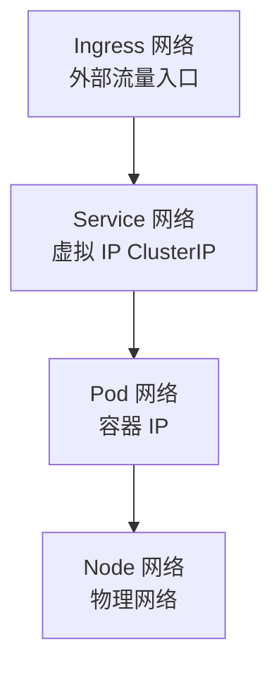

## 1. Kubernetes 网络模型

### 1.1 基本要求

| 要求             | 描述               |
| ---------------- | ------------------ |
| Pod 间直接通信   | 无需 NAT           |
| Node 与 Pod 通信 | 无需 NAT           |
| Pod 自身 IP      | 每个 Pod 有独立 IP |

### 1.2 三层网络



## 2. CNI 插件

### 2.1 常见 CNI

| 插件    | 模式          | 特点           |
| ------- | ------------- | -------------- |
| Calico  | BGP/VXLAN     | 网络策略强     |
| Flannel | VXLAN/host-gw | 简单易用       |
| Cilium  | eBPF          | 高性能、可观测 |
| Weave   | VXLAN         | 自动拓扑       |
| Antrea  | OVS           | VMware 生态    |

### 2.2 Calico 网络模式

| 模式  | 描述          | 性能 |
| ----- | ------------- | ---- |
| BGP   | 直接路由      | 高   |
| VXLAN | Overlay 封装  | 中   |
| IPIP  | IP-in-IP 封装 | 中   |

### 2.3 Cilium 优势

- 基于 eBPF，内核级数据路径
- 无需 iptables
- 支持 L3-L7 网络策略
- 内置可观测性（Hubble）

## 3. Pod 网络

### 3.1 同节点 Pod 通信

```
Pod A → veth pair → cni0 (bridge) → veth pair → Pod B
```

### 3.2 跨节点 Pod 通信

```
Pod A → veth → cni0 → 路由 → 物理网络 → 路由 → cni0 → veth → Pod B
```

### 3.3 Pause 容器

每个 Pod 有一个 Pause 容器，负责：

- 创建网络命名空间
- 维持 Pod 网络
- 共享网络栈

## 4. Service 网络

### 4.1 kube-proxy 工作原理

```
Client → ClusterIP → iptables/IPVS → Pod IP
```

### 4.2 iptables 模式

```bash
# 随机选择后端 Pod
-A KUBE-SERVICES -d 10.96.0.1/32 -j KUBE-SVC-XXX
-A KUBE-SVC-XXX -m statistic --probability 0.33 -j KUBE-SEP-POD1
-A KUBE-SVC-XXX -m statistic --probability 0.5 -j KUBE-SEP-POD2
-A KUBE-SVC-XXX -j KUBE-SEP-POD3
```

### 4.3 IPVS 模式

| 调度算法 | 描述       |
| -------- | ---------- |
| rr       | 轮询       |
| lc       | 最少连接   |
| wrr      | 加权轮询   |
| sh       | 源地址哈希 |

## 5. Ingress

### 5.1 Ingress 架构

```
Internet → Ingress Controller → Service → Pod
```

### 5.2 Ingress 配置

```yaml
apiVersion: networking.k8s.io/v1
kind: Ingress
metadata:
  name: web-ingress
  annotations:
    nginx.ingress.kubernetes.io/ssl-redirect: 'true'
spec:
  ingressClassName: nginx
  tls:
    - hosts:
        - example.com
      secretName: tls-secret
  rules:
    - host: example.com
      http:
        paths:
          - path: /api
            pathType: Prefix
            backend:
              service:
                name: api-service
                port:
                  number: 8080
          - path: /
            pathType: Prefix
            backend:
              service:
                name: web-service
                port:
                  number: 80
```

### 5.3 Ingress Controller 对比

| Controller    | 特点               |
| ------------- | ------------------ |
| NGINX Ingress | 最广泛使用         |
| Traefik       | 自动发现、配置简单 |
| Envoy/Istio   | 服务网格集成       |
| Kong          | API 网关功能       |

## 6. NetworkPolicy

### 6.1 概念

NetworkPolicy 控制 Pod 间的网络访问，类似防火墙规则。

### 6.2 配置示例

```yaml
apiVersion: networking.k8s.io/v1
kind: NetworkPolicy
metadata:
  name: api-policy
  namespace: production
spec:
  podSelector:
    matchLabels:
      app: api
  policyTypes:
    - Ingress
    - Egress
  ingress:
    - from:
        - namespaceSelector:
            matchLabels:
              env: production
        - podSelector:
            matchLabels:
              app: web
      ports:
        - port: 8080
          protocol: TCP
  egress:
    - to:
        - podSelector:
            matchLabels:
              app: database
      ports:
        - port: 5432
          protocol: TCP
```

### 6.3 默认策略

```yaml
# 默认拒绝所有入站
apiVersion: networking.k8s.io/v1
kind: NetworkPolicy
metadata:
  name: default-deny-ingress
spec:
  podSelector: {}
  policyTypes:
    - Ingress
```

> 注意：NetworkPolicy 需要支持它的 CNI 插件（Calico、Cilium 等），Flannel 不支持。

## 参考文献

AWS 文档：https://docs.aws.amazon.com/
Microsoft Azure 文档：https://learn.microsoft.com/zh-cn/azure/
Google Cloud 文档：https://cloud.google.com/docs?hl=zh-cn
阿里云文档：https://help.aliyun.com/
CNCF 云原生全景：https://landscape.cncf.io/

## 延伸阅读

虚拟化与容器，见 034-cloud-computing 模块相关文档。
Kubernetes 架构，见 034-cloud-computing 模块 K8s 文档。
DevOps 与 IaC，见 031-devops 模块。
尚硅谷 Bilibili 空间（https://space.bilibili.com/302417610 ）提供云计算课程。

## 深度专题扩展

以下专题从不同角度深入本文主题，供有进阶需求的读者研读。每个专题独立成节，内容相互补充。

### 13.1 FinOps 成本治理

三阶段：可见（成本分配与预算）、优化（右尺寸、Spot、闲置清理）、运营（持续迭代与责任到团队）。
工具：云厂商成本中心、OpenCost、Kubecost。
组织：FinOps 实践者角色、定期 review、浪费告警。
度量：单位成本（每请求/每用户成本）而非绝对金额。

### 13.2 高可用与容灾设计

可用性数学：99.9% 年停机约 8.7 小时，99.99% 约 52 分钟；多副本降低单点风险。
RPO（可容忍数据丢失）与 RTO（恢复时间）驱动备份与复制策略。
模式：多可用区部署、跨区域异步复制、数据库主备、对象存储版本。
演练：混沌工程（Chaos Monkey 思想）验证真实故障行为。

## 模块文档速查表

| 文档 | 主题 | 与本文的关联 |
| --- | --- | --- |
| 云计算基础 | 001-CloudComputingBasics | 本文的前置基础 |
| 云网络与存储 | 002-CloudNetworkStorage | 本文的并列主题 |
| 容器与编排 | 003-ContainerOrchestration | 本文的并列主题 |
| 基础设施即代码 | 004-IaC | 本文的前置基础 |
| IaaS与PaaS与SaaS | 005-IaaSPaaSSaaS | 本文的并列主题 |
| 虚拟化技术 | 006-VirtualizationTech | 本文的并列主题 |
| 云架构设计 | 007-CloudArchitectureDesign | 本文的原理深化 |
| 公有云与私有云与混合云 | 008-PublicCloudPrivateCloudHybridCloud | 本文的并列主题 |
| Docker深度解析 | 009-DockerDeepAnalysis | 本文的并列主题 |
| 云原生应用 | 010-CloudNativeApp | 本文的并列主题 |
| Kubernetes架构 | 011-KubernetesArchitecture | 本文的原理深化 |
| 云数据库服务 | 012-CloudDatabaseService | 本文的并列主题 |
| Kubernetes核心资源 | 013-KubernetesCore | 本文的并列主题 |
| 云存储服务 | 014-CloudStorageService | 本文的并列主题 |
| Kubernetes网络 | 015-KubernetesNetwork | 本文自身 |
| 云网络服务 | 016-CloudNetworkService | 本文的并列主题 |
| Kubernetes存储 | 017-KubernetesStorage | 本文的并列主题 |
| 云安全服务 | 018-CloudSecurityService | 本文的安全延伸 |
| Helm包管理 | 019-HelmPackageManagement | 本文的并列主题 |
| 云成本优化 | 020-CloudCostOptimization | 本文的性能延伸 |
| 12要素应用 | 021-TwelveFactorApp | 本文的并列主题 |
| 微服务架构 | 022-MicroserviceArchitecture | 本文的原理深化 |
| 服务网格 | 023-ServiceMesh | 本文的并列主题 |
| 可观测性 | 024-Observability | 本文的并列主题 |
| AWS核心服务 | 025-AWSCore | 本文的并列主题 |
| 多云与混合云架构 | 026-MultiCloudHybridArchitecture | 本文的原理深化 |
| 负载均衡与自动伸缩 | 027-LoadBalanceAutoScaling | 本文的并列主题 |
| 无服务器架构 | 028-ServerlessArchitecture | 本文的原理深化 |
| 云迁移6R策略 | 029-CloudMigration6RStrategy | 本文的并列主题 |
| 云计算 AWS CLI 配置 | 030-AWSCliConfigure | 本文的并列主题 |
| 云计算 AWS S3 命令 | 031-AWSS3Command | 本文的并列主题 |
| 云计算 AWS EC2 命令 | 032-AWSEC2Command | 本文的并列主题 |
| 云计算 AWS Lambda 命令 | 033-AWSLambdaCommand | 本文的并列主题 |
| 云计算 AWS IAM 命令 | 034-AWSIAMCommand | 本文的并列主题 |
| 云计算 AWS CloudFormation | 035-AWSCloudFormation | 本文的并列主题 |
| 云计算 Azure CLI 配置 | 036-AzureCliConfigure | 本文的并列主题 |
| 云计算 Azure 资源组与 VM | 037-AzureGroupVMCommand | 本文的并列主题 |
| 云计算 Azure 存储命令 | 038-AzureStorageCommand | 本文的并列主题 |
| 云计算 GCP gcloud 配置 | 039-GCPCliConfigure | 本文的并列主题 |
| 云计算 GCP Compute 与 Storage | 040-GCPComputeStorage | 本文的并列主题 |
| 云计算 Terraform 基础 | 041-TerraformBasic | 本文的前置基础 |
| 云计算 Terraform 状态与模块 | 042-TerraformStateModule | 本文的并列主题 |
| AWS CloudWatch 监控日志命令 | 043-AWSCloudWatch | 本文的并列主题 |
| AWS RDS 数据库命令 | 044-AWSRDSCommands | 本文的并列主题 |
| AWS VPC 网络命令 | 045-AWSVPCCommands | 本文的并列主题 |
| AWS SQS/SNS 消息队列命令 | 046-AWSSQSCommands | 本文的并列主题 |
| AWS DynamoDB 命令 | 047-AWSDynamoDB | 本文的并列主题 |
| Azure Functions 命令 | 048-AzureFunctions | 本文的并列主题 |
| Azure AKS Kubernetes 命令 | 049-AzureAKSCommands | 本文的并列主题 |
| GCP GKE Kubernetes 命令 | 050-GCPGKECommands | 本文的并列主题 |
| GCP BigQuery 命令 | 051-GCPBigQuery | 本文的并列主题 |
| Pulumi IaC 命令 | 052-PulumiCommands | 本文的并列主题 |
| Harbor 私有镜像仓库命令 | 053-HarborRegistry | 本文的并列主题 |
| cloud-init 云实例初始化 | 054-CloudInitCommands | 本文的并列主题 |
| AWS CloudFront CDN 命令 | 055-AWSCloudFront | 本文的并列主题 |
