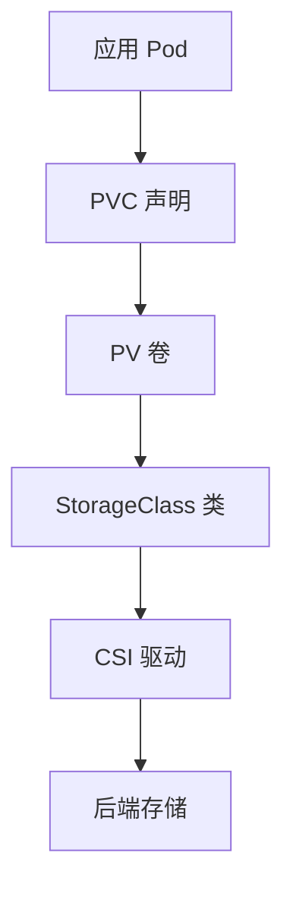

## 1. 存储概述

### 1.1 存储分层



### 1.2 存储类型

| 类型      | 描述     | 生命周期 |
| --------- | -------- | -------- |
| emptyDir  | 临时目录 | 随 Pod   |
| hostPath  | 节点路径 | 独立     |
| PV/PVC    | 持久卷   | 独立     |
| ConfigMap | 配置     | 独立     |
| Secret    | 敏感数据 | 独立     |

## 2. PV 与 PVC

### 2.1 PersistentVolume (PV)

```yaml
apiVersion: v1
kind: PersistentVolume
metadata:
  name: pv-nfs
spec:
  capacity:
    storage: 50Gi
  accessModes:
    - ReadWriteMany
  persistentVolumeReclaimPolicy: Retain
  storageClassName: nfs
  nfs:
    server: 10.0.0.100
    path: /data/share
```

### 2.2 PersistentVolumeClaim (PVC)

```yaml
apiVersion: v1
kind: PersistentVolumeClaim
metadata:
  name: app-data
spec:
  accessModes:
    - ReadWriteOnce
  resources:
    requests:
      storage: 10Gi
  storageClassName: fast-ssd
```

### 2.3 访问模式

| 模式             | 缩写 | 描述                 |
| ---------------- | ---- | -------------------- |
| ReadWriteOnce    | RWO  | 单节点读写           |
| ReadOnlyMany     | ROX  | 多节点只读           |
| ReadWriteMany    | RWX  | 多节点读写           |
| ReadWriteOncePod | RWOP | 单 Pod 读写（1.27+） |

### 2.4 回收策略

| 策略    | 描述                 |
| ------- | -------------------- |
| Retain  | 保留数据，需手动清理 |
| Delete  | 删除 PV 和后端存储   |
| Recycle | 已废弃               |

### 2.5 绑定流程

```
PVC 创建 → 控制器匹配 PV → 绑定 → Pod 使用 PVC
```

## 3. StorageClass

### 3.1 概念

StorageClass 定义存储"类"，支持动态供给。

### 3.2 配置示例

```yaml
apiVersion: storage.k8s.io/v1
kind: StorageClass
metadata:
  name: fast-ssd
provisioner: ebs.csi.aws.com
parameters:
  type: gp3
  iopsPerGB: '50'
  throughput: '250'
reclaimPolicy: Delete
volumeBindingMode: WaitForFirstConsumer
allowVolumeExpansion: true
```

### 3.3 动态供给流程

```
PVC 创建（指定 StorageClass）→
  Provisioner 检测 →
    自动创建 PV →
      PVC 绑定 PV →
        Pod 使用
```

### 3.4 卷绑定模式

| 模式                 | 描述              |
| -------------------- | ----------------- |
| Immediate            | 立即绑定          |
| WaitForFirstConsumer | 等 Pod 调度后绑定 |

## 4. CSI（容器存储接口）

### 4.1 概念

CSI 是 Kubernetes 存储插件的标准接口，使存储供应商无需修改 Kubernetes 代码。

### 4.2 CSI 架构

```
Kubernetes → CSI Sidecar → CSI Driver → 存储后端
```

### 4.3 常见 CSI 驱动

| 驱动                      | 后端存储            |
| ------------------------- | ------------------- |
| ebs.csi.aws.com           | AWS EBS             |
| disk.csi.azure.com        | Azure Disk          |
| pd.csi.storage.gke.io     | GCP Persistent Disk |
| disk.csi.alibabacloud.com | 阿里云云盘          |
| csi-hostpath              | 本地存储（测试）    |
| ceph-csi                  | Ceph RBD/CephFS     |
| nfs.csi.k8s.io            | NFS                 |

## 5. 临时存储

### 5.1 emptyDir

```yaml
apiVersion: v1
kind: Pod
metadata:
  name: cache-pod
spec:
  containers:
    - name: app
      image: nginx
      volumeMounts:
        - name: cache
          mountPath: /cache
  volumes:
    - name: cache
      emptyDir:
        medium: Memory # 可选：使用内存
        sizeLimit: 256Mi
```

### 5.2 hostPath

```yaml
volumes:
  - name: data
    hostPath:
      path: /data/app
      type: DirectoryOrCreate
```

> 注意：hostPath 不推荐生产使用，存在安全和调度问题。

## 6. 存储最佳实践

| 实践                 | 描述             |
| -------------------- | ---------------- |
| 使用 PVC 而非直接 PV | 解耦应用与存储   |
| 使用 StorageClass    | 动态供给         |
| WaitForFirstConsumer | 避免跨区绑定     |
| 数据备份             | 定期快照         |
| 加密存储             | 启用加密         |
| 监控                 | 监控存储使用率   |
| 清理策略             | 合理设置回收策略 |

## 参考文献

AWS 文档：https://docs.aws.amazon.com/
Microsoft Azure 文档：https://learn.microsoft.com/zh-cn/azure/
Google Cloud 文档：https://cloud.google.com/docs?hl=zh-cn
阿里云文档：https://help.aliyun.com/
CNCF 云原生全景：https://landscape.cncf.io/

## 延伸阅读

虚拟化与容器，见 034-cloud-computing 模块相关文档。
Kubernetes 架构，见 034-cloud-computing 模块 K8s 文档。
DevOps 与 IaC，见 031-devops 模块。
尚硅谷 Bilibili 空间（https://space.bilibili.com/302417610 ）提供云计算课程。

## 深度专题扩展

以下专题从不同角度深入本文主题，供有进阶需求的读者研读。每个专题独立成节，内容相互补充。

### 13.1 FinOps 成本治理

三阶段：可见（成本分配与预算）、优化（右尺寸、Spot、闲置清理）、运营（持续迭代与责任到团队）。
工具：云厂商成本中心、OpenCost、Kubecost。
组织：FinOps 实践者角色、定期 review、浪费告警。
度量：单位成本（每请求/每用户成本）而非绝对金额。

### 13.2 高可用与容灾设计

可用性数学：99.9% 年停机约 8.7 小时，99.99% 约 52 分钟；多副本降低单点风险。
RPO（可容忍数据丢失）与 RTO（恢复时间）驱动备份与复制策略。
模式：多可用区部署、跨区域异步复制、数据库主备、对象存储版本。
演练：混沌工程（Chaos Monkey 思想）验证真实故障行为。

## 模块文档速查表

| 文档 | 主题 | 与本文的关联 |
| --- | --- | --- |
| 云计算基础 | 001-CloudComputingBasics | 本文的前置基础 |
| 云网络与存储 | 002-CloudNetworkStorage | 本文的并列主题 |
| 容器与编排 | 003-ContainerOrchestration | 本文的并列主题 |
| 基础设施即代码 | 004-IaC | 本文的前置基础 |
| IaaS与PaaS与SaaS | 005-IaaSPaaSSaaS | 本文的并列主题 |
| 虚拟化技术 | 006-VirtualizationTech | 本文的并列主题 |
| 云架构设计 | 007-CloudArchitectureDesign | 本文的原理深化 |
| 公有云与私有云与混合云 | 008-PublicCloudPrivateCloudHybridCloud | 本文的并列主题 |
| Docker深度解析 | 009-DockerDeepAnalysis | 本文的并列主题 |
| 云原生应用 | 010-CloudNativeApp | 本文的并列主题 |
| Kubernetes架构 | 011-KubernetesArchitecture | 本文的原理深化 |
| 云数据库服务 | 012-CloudDatabaseService | 本文的并列主题 |
| Kubernetes核心资源 | 013-KubernetesCore | 本文的并列主题 |
| 云存储服务 | 014-CloudStorageService | 本文的并列主题 |
| Kubernetes网络 | 015-KubernetesNetwork | 本文的并列主题 |
| 云网络服务 | 016-CloudNetworkService | 本文的并列主题 |
| Kubernetes存储 | 017-KubernetesStorage | 本文自身 |
| 云安全服务 | 018-CloudSecurityService | 本文的安全延伸 |
| Helm包管理 | 019-HelmPackageManagement | 本文的并列主题 |
| 云成本优化 | 020-CloudCostOptimization | 本文的性能延伸 |
| 12要素应用 | 021-TwelveFactorApp | 本文的并列主题 |
| 微服务架构 | 022-MicroserviceArchitecture | 本文的原理深化 |
| 服务网格 | 023-ServiceMesh | 本文的并列主题 |
| 可观测性 | 024-Observability | 本文的并列主题 |
| AWS核心服务 | 025-AWSCore | 本文的并列主题 |
| 多云与混合云架构 | 026-MultiCloudHybridArchitecture | 本文的原理深化 |
| 负载均衡与自动伸缩 | 027-LoadBalanceAutoScaling | 本文的并列主题 |
| 无服务器架构 | 028-ServerlessArchitecture | 本文的原理深化 |
| 云迁移6R策略 | 029-CloudMigration6RStrategy | 本文的并列主题 |
| 云计算 AWS CLI 配置 | 030-AWSCliConfigure | 本文的并列主题 |
| 云计算 AWS S3 命令 | 031-AWSS3Command | 本文的并列主题 |
| 云计算 AWS EC2 命令 | 032-AWSEC2Command | 本文的并列主题 |
| 云计算 AWS Lambda 命令 | 033-AWSLambdaCommand | 本文的并列主题 |
| 云计算 AWS IAM 命令 | 034-AWSIAMCommand | 本文的并列主题 |
| 云计算 AWS CloudFormation | 035-AWSCloudFormation | 本文的并列主题 |
| 云计算 Azure CLI 配置 | 036-AzureCliConfigure | 本文的并列主题 |
| 云计算 Azure 资源组与 VM | 037-AzureGroupVMCommand | 本文的并列主题 |
| 云计算 Azure 存储命令 | 038-AzureStorageCommand | 本文的并列主题 |
| 云计算 GCP gcloud 配置 | 039-GCPCliConfigure | 本文的并列主题 |
| 云计算 GCP Compute 与 Storage | 040-GCPComputeStorage | 本文的并列主题 |
| 云计算 Terraform 基础 | 041-TerraformBasic | 本文的前置基础 |
| 云计算 Terraform 状态与模块 | 042-TerraformStateModule | 本文的并列主题 |
| AWS CloudWatch 监控日志命令 | 043-AWSCloudWatch | 本文的并列主题 |
| AWS RDS 数据库命令 | 044-AWSRDSCommands | 本文的并列主题 |
| AWS VPC 网络命令 | 045-AWSVPCCommands | 本文的并列主题 |
| AWS SQS/SNS 消息队列命令 | 046-AWSSQSCommands | 本文的并列主题 |
| AWS DynamoDB 命令 | 047-AWSDynamoDB | 本文的并列主题 |
| Azure Functions 命令 | 048-AzureFunctions | 本文的并列主题 |
| Azure AKS Kubernetes 命令 | 049-AzureAKSCommands | 本文的并列主题 |
| GCP GKE Kubernetes 命令 | 050-GCPGKECommands | 本文的并列主题 |
| GCP BigQuery 命令 | 051-GCPBigQuery | 本文的并列主题 |
| Pulumi IaC 命令 | 052-PulumiCommands | 本文的并列主题 |
| Harbor 私有镜像仓库命令 | 053-HarborRegistry | 本文的并列主题 |
| cloud-init 云实例初始化 | 054-CloudInitCommands | 本文的并列主题 |
| AWS CloudFront CDN 命令 | 055-AWSCloudFront | 本文的并列主题 |
