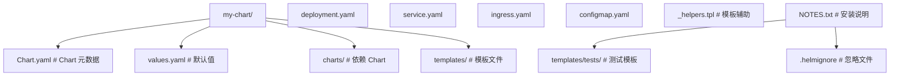

## 1. Helm 概述

### 1.1 什么是 Helm

Helm 是 Kubernetes 的包管理器，将应用定义为 Chart，实现一键部署和版本管理。

### 1.2 核心概念

| 概念       | 描述                  |
| ---------- | --------------------- |
| Chart      | 应用包（模板+默认值） |
| Release    | Chart 的部署实例      |
| Repository | Chart 仓库            |
| Values     | 配置值                |

### 1.3 Helm 3 vs Helm 2

| 对比项       | Helm 2           | Helm 3          |
| ------------ | ---------------- | --------------- |
| Tiller       | 需要             | 不需要          |
| 安全模型     | Tiller 权限      | kubeconfig 权限 |
| Release 存储 | ConfigMap/Secret | Secret          |
| 命名空间     | Tiller 全局      | 按命名空间      |

## 2. Chart 结构

### 2.1 目录结构



### 2.2 Chart.yaml

```yaml
apiVersion: v2
name: my-app
description: My application Helm chart
type: application
version: 1.0.0 # Chart 版本
appVersion: '2.1.0' # 应用版本
dependencies:
  - name: redis
    version: '17.0.0'
    repository: 'https://charts.bitnami.com/bitnami'
    condition: redis.enabled
```

### 2.3 values.yaml

```yaml
replicaCount: 3

image:
  repository: my-app
  pullPolicy: IfNotPresent
  tag: '2.1.0'

service:
  type: ClusterIP
  port: 80

ingress:
  enabled: true
  className: nginx
  hosts:
    - host: example.com
      paths:
        - path: /
          pathType: Prefix

resources:
  requests:
    cpu: 100m
    memory: 128Mi
  limits:
    cpu: 500m
    memory: 512Mi

redis:
  enabled: true
  auth:
    password: ''
```

## 3. 模板语法

### 3.1 基本语法

```yaml
# 引用值
{{ .Values.replicaCount }}

# 条件判断
{{- if .Values.ingress.enabled }}
# ingress 内容
{{- end }}

# 循环
{{- range .Values.ingress.hosts }}
- host: {{ .host }}
{{- end }}

# 默认值
image: "{{ .Values.image.repository }}:{{ .Values.image.tag | default .Chart.AppVersion }}"
```

### 3.2 辅助模板

```yaml
# templates/_helpers.tpl
{{- define "my-app.fullname" -}}
{{- if .Values.fullnameOverride }}
{{- .Values.fullnameOverride | trunc 63 | trimSuffix "-" }}
{{- else }}
{{- .Release.Name | trunc 63 | trimSuffix "-" }}
{{- end }}
{{- end }}

{{- define "my-app.labels" -}}
helm.sh/chart: {{ .Chart.Name }}-{{ .Chart.Version }}
app.kubernetes.io/name: {{ include "my-app.fullname" . }}
app.kubernetes.io/instance: {{ .Release.Name }}
{{- end }}
```

### 3.3 使用辅助模板

```yaml
metadata:
  name: { { include "my-app.fullname" . } }
  labels: { { - include "my-app.labels" . | nindent 4 } }
```

## 4. 常用命令

### 4.1 仓库管理

```bash
# 添加仓库
helm repo add bitnami https://charts.bitnami.com/bitnami

# 更新索引
helm repo update

# 搜索 Chart
helm search repo nginx
```

### 4.2 安装与升级

```bash
# 安装
helm install my-release bitnami/nginx

# 自定义值
helm install my-release bitnami/nginx -f values.yaml

# 设置单个值
helm install my-release bitnami/nginx --set service.type=NodePort

# 升级
helm upgrade my-release bitnami/nginx -f values.yaml

# 安装或升级
helm upgrade --install my-release bitnami/nginx -f values.yaml
```

### 4.3 管理与调试

```bash
# 查看已安装
helm list

# 查看状态
helm status my-release

# 查看历史
helm history my-release

# 回滚
helm rollback my-release 1

# 卸载
helm uninstall my-release

# 调试模板
helm template my-release . --debug
helm install --dry-run my-release . --debug
```

## 5. Chart 依赖

### 5.1 声明依赖

```yaml
# Chart.yaml
dependencies:
  - name: redis
    version: '17.0.0'
    repository: 'https://charts.bitnami.com/bitnami'
    condition: redis.enabled
  - name: postgresql
    version: '12.0.0'
    repository: 'https://charts.bitnami.com/bitnami'
    condition: postgresql.enabled
    alias: db
```

### 5.2 更新依赖

```bash
helm dependency update
helm dependency build
```

## 6. 最佳实践

| 实践     | 描述                         |
| -------- | ---------------------------- |
| 版本控制 | Chart 和 values 文件纳入 Git |
| 环境分离 | 每个环境独立 values 文件     |
| 条件依赖 | 使用 condition 控制可选组件  |
| 模板复用 | 使用 \_helpers.tpl           |
| 资源限制 | 始终设置 resources           |
| 健康检查 | 配置 liveness/readiness      |
| 镜像标签 | 不使用 latest                |
| 测试     | 编写 helm test               |

## 参考文献

AWS 文档：https://docs.aws.amazon.com/
Microsoft Azure 文档：https://learn.microsoft.com/zh-cn/azure/
Google Cloud 文档：https://cloud.google.com/docs?hl=zh-cn
阿里云文档：https://help.aliyun.com/
CNCF 云原生全景：https://landscape.cncf.io/

## 延伸阅读

虚拟化与容器，见 034-cloud-computing 模块相关文档。
Kubernetes 架构，见 034-cloud-computing 模块 K8s 文档。
DevOps 与 IaC，见 031-devops 模块。
尚硅谷 Bilibili 空间（https://space.bilibili.com/302417610 ）提供云计算课程。

## 深度专题扩展

以下专题从不同角度深入本文主题，供有进阶需求的读者研读。每个专题独立成节，内容相互补充。

### 13.1 FinOps 成本治理

三阶段：可见（成本分配与预算）、优化（右尺寸、Spot、闲置清理）、运营（持续迭代与责任到团队）。
工具：云厂商成本中心、OpenCost、Kubecost。
组织：FinOps 实践者角色、定期 review、浪费告警。
度量：单位成本（每请求/每用户成本）而非绝对金额。

### 13.2 高可用与容灾设计

可用性数学：99.9% 年停机约 8.7 小时，99.99% 约 52 分钟；多副本降低单点风险。
RPO（可容忍数据丢失）与 RTO（恢复时间）驱动备份与复制策略。
模式：多可用区部署、跨区域异步复制、数据库主备、对象存储版本。
演练：混沌工程（Chaos Monkey 思想）验证真实故障行为。

## 模块文档速查表

| 文档 | 主题 | 与本文的关联 |
| --- | --- | --- |
| 云计算基础 | 001-CloudComputingBasics | 本文的前置基础 |
| 云网络与存储 | 002-CloudNetworkStorage | 本文的并列主题 |
| 容器与编排 | 003-ContainerOrchestration | 本文的并列主题 |
| 基础设施即代码 | 004-IaC | 本文的前置基础 |
| IaaS与PaaS与SaaS | 005-IaaSPaaSSaaS | 本文的并列主题 |
| 虚拟化技术 | 006-VirtualizationTech | 本文的并列主题 |
| 云架构设计 | 007-CloudArchitectureDesign | 本文的原理深化 |
| 公有云与私有云与混合云 | 008-PublicCloudPrivateCloudHybridCloud | 本文的并列主题 |
| Docker深度解析 | 009-DockerDeepAnalysis | 本文的并列主题 |
| 云原生应用 | 010-CloudNativeApp | 本文的并列主题 |
| Kubernetes架构 | 011-KubernetesArchitecture | 本文的原理深化 |
| 云数据库服务 | 012-CloudDatabaseService | 本文的并列主题 |
| Kubernetes核心资源 | 013-KubernetesCore | 本文的并列主题 |
| 云存储服务 | 014-CloudStorageService | 本文的并列主题 |
| Kubernetes网络 | 015-KubernetesNetwork | 本文的并列主题 |
| 云网络服务 | 016-CloudNetworkService | 本文的并列主题 |
| Kubernetes存储 | 017-KubernetesStorage | 本文的并列主题 |
| 云安全服务 | 018-CloudSecurityService | 本文的安全延伸 |
| Helm包管理 | 019-HelmPackageManagement | 本文自身 |
| 云成本优化 | 020-CloudCostOptimization | 本文的性能延伸 |
| 12要素应用 | 021-TwelveFactorApp | 本文的并列主题 |
| 微服务架构 | 022-MicroserviceArchitecture | 本文的原理深化 |
| 服务网格 | 023-ServiceMesh | 本文的并列主题 |
| 可观测性 | 024-Observability | 本文的并列主题 |
| AWS核心服务 | 025-AWSCore | 本文的并列主题 |
| 多云与混合云架构 | 026-MultiCloudHybridArchitecture | 本文的原理深化 |
| 负载均衡与自动伸缩 | 027-LoadBalanceAutoScaling | 本文的并列主题 |
| 无服务器架构 | 028-ServerlessArchitecture | 本文的原理深化 |
| 云迁移6R策略 | 029-CloudMigration6RStrategy | 本文的并列主题 |
| 云计算 AWS CLI 配置 | 030-AWSCliConfigure | 本文的并列主题 |
| 云计算 AWS S3 命令 | 031-AWSS3Command | 本文的并列主题 |
| 云计算 AWS EC2 命令 | 032-AWSEC2Command | 本文的并列主题 |
| 云计算 AWS Lambda 命令 | 033-AWSLambdaCommand | 本文的并列主题 |
| 云计算 AWS IAM 命令 | 034-AWSIAMCommand | 本文的并列主题 |
| 云计算 AWS CloudFormation | 035-AWSCloudFormation | 本文的并列主题 |
| 云计算 Azure CLI 配置 | 036-AzureCliConfigure | 本文的并列主题 |
| 云计算 Azure 资源组与 VM | 037-AzureGroupVMCommand | 本文的并列主题 |
| 云计算 Azure 存储命令 | 038-AzureStorageCommand | 本文的并列主题 |
| 云计算 GCP gcloud 配置 | 039-GCPCliConfigure | 本文的并列主题 |
| 云计算 GCP Compute 与 Storage | 040-GCPComputeStorage | 本文的并列主题 |
| 云计算 Terraform 基础 | 041-TerraformBasic | 本文的前置基础 |
| 云计算 Terraform 状态与模块 | 042-TerraformStateModule | 本文的并列主题 |
| AWS CloudWatch 监控日志命令 | 043-AWSCloudWatch | 本文的并列主题 |
| AWS RDS 数据库命令 | 044-AWSRDSCommands | 本文的并列主题 |
| AWS VPC 网络命令 | 045-AWSVPCCommands | 本文的并列主题 |
| AWS SQS/SNS 消息队列命令 | 046-AWSSQSCommands | 本文的并列主题 |
| AWS DynamoDB 命令 | 047-AWSDynamoDB | 本文的并列主题 |
| Azure Functions 命令 | 048-AzureFunctions | 本文的并列主题 |
| Azure AKS Kubernetes 命令 | 049-AzureAKSCommands | 本文的并列主题 |
| GCP GKE Kubernetes 命令 | 050-GCPGKECommands | 本文的并列主题 |
| GCP BigQuery 命令 | 051-GCPBigQuery | 本文的并列主题 |
| Pulumi IaC 命令 | 052-PulumiCommands | 本文的并列主题 |
| Harbor 私有镜像仓库命令 | 053-HarborRegistry | 本文的并列主题 |
| cloud-init 云实例初始化 | 054-CloudInitCommands | 本文的并列主题 |
| AWS CloudFront CDN 命令 | 055-AWSCloudFront | 本文的并列主题 |
