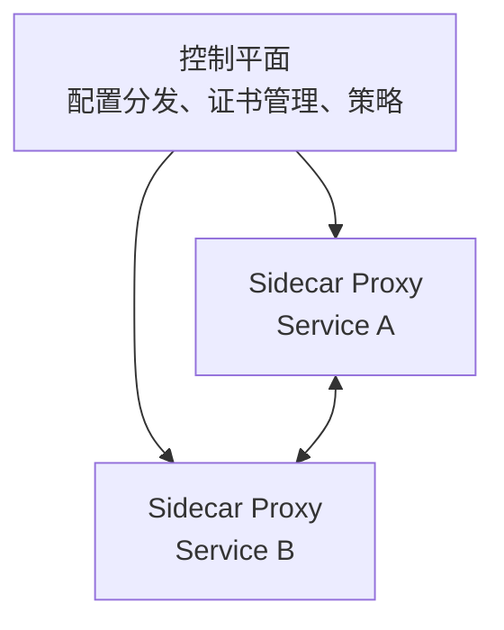

## 1. 服务网格概述

### 1.1 什么是服务网格

服务网格（Service Mesh）是专门处理服务间通信的基础设施层，通过 Sidecar 代理实现流量管理、安全通信和可观测性。

### 1.2 架构模式



### 1.3 核心功能

| 功能     | 描述                   |
| -------- | ---------------------- |
| 流量管理 | 路由、分流、重试、超时 |
| 安全     | mTLS、认证、授权       |
| 可观测性 | 指标、日志、追踪       |
| 弹性     | 熔断、限流、故障注入   |

## 2. Istio

### 2.1 架构

| 组件   | 功能                                  |
| ------ | ------------------------------------- |
| istiod | 控制平面（Pilot+Citadel+Galley 合并） |
| Envoy  | 数据平面 Sidecar 代理                 |

### 2.2 流量管理

**VirtualService**：

```yaml
apiVersion: networking.istio.io/v1beta1
kind: VirtualService
metadata:
  name: reviews
spec:
  hosts:
    - reviews
  http:
    - match:
        - headers:
            x-user-type:
              exact: premium
      route:
        - destination:
            host: reviews
            subset: v2
    - route:
        - destination:
            host: reviews
            subset: v1
          weight: 90
        - destination:
            host: reviews
            subset: v2
          weight: 10
```

**DestinationRule**：

```yaml
apiVersion: networking.istio.io/v1beta1
kind: DestinationRule
metadata:
  name: reviews
spec:
  host: reviews
  trafficPolicy:
    connectionPool:
      tcp:
        maxConnections: 100
    outlierDetection:
      consecutive5xxErrors: 5
      interval: 30s
      baseEjectionTime: 30s
  subsets:
    - name: v1
      labels:
        version: v1
    - name: v2
      labels:
        version: v2
```

### 2.3 安全策略

**PeerAuthentication（mTLS）**：

```yaml
apiVersion: security.istio.io/v1beta1
kind: PeerAuthentication
metadata:
  name: default
  namespace: istio-system
spec:
  mtls:
    mode: STRICT
```

**AuthorizationPolicy**：

```yaml
apiVersion: security.istio.io/v1beta1
kind: AuthorizationPolicy
metadata:
  name: api-access
spec:
  selector:
    matchLabels:
      app: api
  rules:
    - from:
        - source:
            principals: ['cluster.local/ns/default/sa/web']
      to:
        - operation:
            methods: ['GET', 'POST']
            paths: ['/api/*']
```

### 2.4 可观测性

| 组件       | 功能       |
| ---------- | ---------- |
| Prometheus | 指标收集   |
| Grafana    | 指标可视化 |
| Jaeger     | 分布式追踪 |
| Kiali      | 服务拓扑图 |

## 3. Linkerd

### 3.1 特点

| 特点      | 描述                    |
| --------- | ----------------------- |
| 轻量级    | Rust 实现的 micro-proxy |
| 简单      | 最小化配置              |
| 自动 mTLS | 默认启用                |
| 快速      | 低延迟开销              |

### 3.2 与 Istio 对比

| 对比项   | Istio       | Linkerd            |
| -------- | ----------- | ------------------ |
| 代理     | Envoy (C++) | micro-proxy (Rust) |
| 复杂度   | 高          | 低                 |
| 功能     | 全面        | 核心功能           |
| 资源消耗 | 高          | 低                 |
| 社区     | 大          | 中                 |
| 学习曲线 | 陡          | 平缓               |

## 4. 流量管理场景

### 4.1 金丝雀发布

```yaml
# 90% v1, 10% v2 → 逐步调整
apiVersion: networking.istio.io/v1beta1
kind: VirtualService
spec:
  http:
    - route:
        - destination:
            host: myapp
            subset: v1
          weight: 90
        - destination:
            host: myapp
            subset: v2
          weight: 10
```

### 4.2 故障注入

```yaml
# 注入 500ms 延迟，10% 概率
apiVersion: networking.istio.io/v1beta1
kind: VirtualService
spec:
  http:
    - fault:
        delay:
          percentage:
            value: 10
          fixedDelay: 500ms
      route:
        - destination:
            host: myapp
```

### 4.3 重试与超时

```yaml
apiVersion: networking.istio.io/v1beta1
kind: VirtualService
spec:
  http:
    - route:
        - destination:
            host: myapp
      retries:
        attempts: 3
        perTryTimeout: 2s
        retryOn: 5xx,reset,connect-failure
      timeout: 10s
```

## 5. 服务网格选型

| 场景              | 推荐                |
| ----------------- | ------------------- |
| 大规模/复杂需求   | Istio               |
| 中小规模/简单优先 | Linkerd             |
| eBPF 方案         | Cilium Service Mesh |
| 多集群            | Istio               |
| 资源受限          | Linkerd             |

## 延伸阅读
虚拟化与容器，见 034-cloud-computing 模块相关文档。
Kubernetes 架构，见 034-cloud-computing 模块 K8s 文档。
DevOps 与 IaC，见 031-devops 模块。
## 深度专题扩展

以下专题从不同角度深入本文主题，供有进阶需求的读者研读。每个专题独立成节，内容相互补充。

### 13.1 FinOps 成本治理

三阶段：可见（成本分配与预算）、优化（右尺寸、Spot、闲置清理）、运营（持续迭代与责任到团队）。
工具：云厂商成本中心、OpenCost、Kubecost。
组织：FinOps 实践者角色、定期 review、浪费告警。
度量：单位成本（每请求/每用户成本）而非绝对金额。

### 13.2 高可用与容灾设计

可用性数学：99.9% 年停机约 8.7 小时，99.99% 约 52 分钟；多副本降低单点风险。
RPO（可容忍数据丢失）与 RTO（恢复时间）驱动备份与复制策略。
模式：多可用区部署、跨区域异步复制、数据库主备、对象存储版本。
演练：混沌工程（Chaos Monkey 思想）验证真实故障行为。
