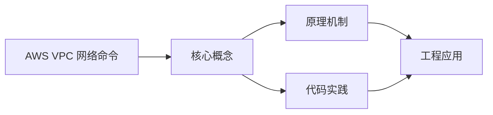
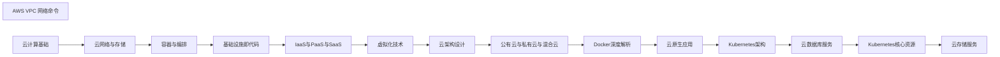

## 1. 学习目标（Bloom 分类）

本节按照布鲁姆教育目标分类学组织学习路径。本文主题为《AWS VPC 网络命令》，属于 云计算 模块，读者可以根据自身阶段选择阅读深度。

记忆层面：能够准确复述本文的核心概念、术语与基本语法或操作步骤，并能够在提问或检索时快速定位对应知识点。能够说出 云计算 的核心概念、组件与标准流程。

理解层面：能够用自己的语言解释核心原理与工作机制，说明概念之间的因果关系，而不是机械记忆结论。能够解释 云计算 的工作原理与关键机制。

应用层面：能够在真实项目或练习场景中运用本文知识解决具体问题，写出正确且可维护的实现。能够执行 云计算 相关的标准操作与配置。

分析层面：能够拆解复杂问题，比较本文主题与相邻概念的异同，识别边界条件与例外情况。能够分析 云计算 方案在可靠性、成本与性能上的权衡。

评价层面：能够根据约束条件（性能、可读性、安全、成本）评价不同方案的优劣，做出有依据的技术决策。能够评价 云计算 中的技术选型。

创造层面：能够把本文知识与其他模块知识组合，设计出新的解决方案或可复用的工程模式。能够设计基于 云计算 的完整解决方案。

通过本节学习，读者应当能够把《AWS VPC 网络命令》纳入自己的知识网络，并与 云计算 模块的其他主题（IaaS/PaaS/SaaS、虚拟化、云原生、成本治理）建立关联。

## 2. 历史动机与发展脉络

《AWS VPC 网络命令》是 云计算 领域的重要主题。要真正理解它，需要先了解它解决的问题与演进过程。

云计算源于 1960 年代分时思想，2006 年 AWS 推出 EC2/S3 开启现代云服务时代；公有云（AWS/Azure/GCP/阿里云/华为云）与私有云、混合云并存。
服务模型：IaaS（虚拟机/存储/网络）、PaaS（托管运行时/数据库）、SaaS（应用即服务）；FaaS（函数即服务）进一步抽象。
云原生：容器、微服务、服务网格、声明式 API、不可变基础设施；CNCF 生态是云原生事实标准。

回到本文主题：AWS VPC 网络命令 的提出与成熟，正是上述技术背景下的必然产物。早期实现往往以简单可用为目标，随着工程规模扩大，社区逐渐沉淀出标准做法与最佳实践；理解这一脉络，可以帮助读者判断“为什么文档中的推荐写法是现在这个样子”，也能在遇到历史遗留代码时准确识别其设计年代与取舍。


## 3. 形式化定义与核心概念精讲

本节把《AWS VPC 网络命令》涉及的核心概念以“定义 + 讲解”的形式展开。读者应把定义当作工具，把讲解当作理解路径；两者结合才能形成可迁移的知识。

虚拟化：虚拟机（Hypervisor 硬件隔离）与容器（OS 级隔离）；虚拟化是弹性与多租户的基础。
核心服务：计算（EC2/ECS）、存储（对象/块/文件）、网络（VPC/负载均衡/CDN）、数据库（托管 RDS/NoSQL）。
弹性与计费：按需、预留、Spot；自动扩缩容（HPA/ASG）；FinOps 治理成本。

### 3.1 原文章节逐一精讲

原文档把主题拆分为 10 个小节，下面按顺序给出每一节的导读讲解，随后保留原文细节供精读。

#### 原文精读（完整保留）

# AWS VPC 网络命令

> **符号约定**：`< >` 必填参数 | `[ ]` 可选参数

---

#### VPC 创建与管理

**基本写法：创建 VPC**
`aws ec2 create-vpc --cidr-block <CIDR> [--instance-tenancy <租期>]`
```bash
# 创建 10.0.0.0/16 网段的 VPC
aws ec2 create-vpc --cidr-block 10.0.0.0/16 --instance-tenancy default
```

---

**基本写法：列出所有 VPC**
`aws ec2 describe-vpcs`
```bash
# 查看账户所有 VPC
aws ec2 describe-vpcs
```

---

**基本写法：查看指定 VPC**
`aws ec2 describe-vpcs --vpc-ids <VPC ID>`
```bash
# 查看指定 VPC 详情
aws ec2 describe-vpcs --vpc-ids vpc-12345678
```

---

**基本写法：删除 VPC**
`aws ec2 delete-vpc --vpc-id <VPC ID>`
```bash
# 删除指定 VPC(必须先删除其下所有资源)
aws ec2 delete-vpc --vpc-id vpc-12345678
```

---

**基本写法：为 VPC 添加名称标签**
`aws ec2 create-tags --resources <资源ID> --tags Key=Name,Value=<名称>`
```bash
# 给 VPC 添加名称
aws ec2 create-tags \
  --resources vpc-12345678 \
  --tags Key=Name,Value=my-vpc
```

---

#### 子网管理

**基本写法：创建子网**
`aws ec2 create-subnet --vpc-id <VPC ID> --cidr-block <CIDR> [--availability-zone <AZ>]`
```bash
# 在 VPC 中创建子网
aws ec2 create-subnet \
  --vpc-id vpc-12345678 \
  --cidr-block 10.0.1.0/24 \
  --availability-zone us-east-1a
```

---

**基本写法：列出子网**
`aws ec2 describe-subnets [--filters Name=vpc-id,Values=<VPC ID>]`
```bash
# 查看指定 VPC 下所有子网
aws ec2 describe-subnets \
  --filters Name=vpc-id,Values=vpc-12345678
```

---

**基本写法：删除子网**
`aws ec2 delete-subnet --subnet-id <子网ID>`
```bash
# 删除指定子网
aws ec2 delete-subnet --subnet-id subnet-12345678
```

---

**基本写法：为子网开启公网映射**
`aws ec2 modify-subnet-attribute --subnet-id <子网ID> --map-public-ip-on-launch`
```bash
# 让子网中的实例自动获取公网 IP
aws ec2 modify-subnet-attribute \
  --subnet-id subnet-12345678 \
  --map-public-ip-on-launch
```

---

**基本写法：分配 IPv6 CIDR**
`aws ec2 associate-subnet-cidr-block --subnet-id <子网ID> --ipv6-cidr-block <IPv6 CIDR>`
```bash
# 为子网分配 IPv6 网段
aws ec2 associate-subnet-cidr-block \
  --subnet-id subnet-12345678 \
  --ipv6-cidr-block 2600:1f18:4113:b200::/64
```

---

#### 路由表

**基本写法：创建路由表**
`aws ec2 create-route-table --vpc-id <VPC ID>`
```bash
# 在指定 VPC 创建路由表
aws ec2 create-route-table --vpc-id vpc-12345678
```

---

**基本写法：添加路由**
`aws ec2 create-route --route-table-id <路由表ID> --destination-cidr-block <CIDR> --gateway-id <网关ID>`
```bash
# 添加 0.0.0.0/0 默认路由到 Internet 网关
aws ec2 create-route \
  --route-table-id rtb-12345678 \
  --destination-cidr-block 0.0.0.0/0 \
  --gateway-id igw-12345678
```

---

**基本写法：添加 NAT 网关路由**
`aws ec2 create-route --route-table-id <路由表ID> --destination-cidr-block <CIDR> --nat-gateway-id <NAT ID>`
```bash
# 私有子网通过 NAT 网关访问外网
aws ec2 create-route \
  --route-table-id rtb-12345678 \
  --destination-cidr-block 0.0.0.0/0 \
  --nat-gateway-id nat-12345678
```

---

**基本写法：关联子网**
`aws ec2 associate-route-table --route-table-id <路由表ID> --subnet-id <子网ID>`
```bash
# 将路由表关联到子网
aws ec2 associate-route-table \
  --route-table-id rtb-12345678 \
  --subnet-id subnet-12345678
```

---

**基本写法：列出路由表**
`aws ec2 describe-route-tables [--filters Name=vpc-id,Values=<VPC ID>]`
```bash
# 查看指定 VPC 的路由表
aws ec2 describe-route-tables \
  --filters Name=vpc-id,Values=vpc-12345678
```

---

#### 网关

**基本写法：创建 Internet 网关**
`aws ec2 create-internet-gateway`
```bash
# 创建 Internet Gateway
aws ec2 create-internet-gateway
```

---

**基本写法：附加到 VPC**
`aws ec2 attach-internet-gateway --internet-gateway-id <网关ID> --vpc-id <VPC ID>`
```bash
# 将 IGW 附加到 VPC
aws ec2 attach-internet-gateway \
  --internet-gateway-id igw-12345678 \
  --vpc-id vpc-12345678
```

---

**基本写法：创建 NAT 网关**
`aws ec2 create-nat-gateway --subnet-id <子网ID> --allocation-id <EIP ID>`
```bash
# 在公有子网创建 NAT 网关
aws ec2 create-nat-gateway \
  --subnet-id subnet-12345678 \
  --allocation-id eipalloc-12345678
```

---

**基本写法：创建 VPC 端点**
`aws ec2 create-vpc-endpoint --vpc-id <VPC ID> --service-name <服务名> --route-table-ids <路由表ID>`
```bash
# 创建 S3 Gateway 端点
aws ec2 create-vpc-endpoint \
  --vpc-id vpc-12345678 \
  --service-name com.amazonaws.us-east-1.s3 \
  --route-table-ids rtb-12345678
```

---

**基本写法：创建接口端点**
`aws ec2 create-vpc-endpoint --vpc-id <VPC ID> --vpc-endpoint-type Interface --service-name <服务名> --subnet-ids <子网ID>`
```bash
# 创建 PrivateLink 接口端点
aws ec2 create-vpc-endpoint \
  --vpc-id vpc-12345678 \
  --vpc-endpoint-type Interface \
  --service-name com.amazonaws.us-east-1.ec2 \
  --subnet-ids subnet-12345678
```

---

#### 安全组

**基本写法：创建安全组**
`aws ec2 create-security-group --group-name <组名> --description <描述> --vpc-id <VPC ID>`
```bash
# 在 VPC 中创建安全组
aws ec2 create-security-group \
  --group-name my-sg \
  --description "My security group" \
  --vpc-id vpc-12345678
```

---

**基本写法：添加入站规则**
`aws ec2 authorize-security-group-ingress --group-id <组ID> --protocol <协议> --port <端口> --cidr <CIDR>`
```bash
# 允许 0.0.0.0/0 访问 80 端口
aws ec2 authorize-security-group-ingress \
  --group-id sg-12345678 \
  --protocol tcp \
  --port 80 \
  --cidr 0.0.0.0/0
```

---

**基本写法：添加 SSH 入站规则**
`aws ec2 authorize-security-group-ingress --group-id <组ID> --protocol tcp --port 22 --cidr <CIDR>`
```bash
# 仅允许指定 IP 访问 22 端口
aws ec2 authorize-security-group-ingress \
  --group-id sg-12345678 \
  --protocol tcp \
  --port 22 \
  --cidr 203.0.113.0/24
```

---

**基本写法：移除入站规则**
`aws ec2 revoke-security-group-ingress --group-id <组ID> --protocol <协议> --port <端口> --cidr <CIDR>`
```bash
# 移除 80 端口的入站规则
aws ec2 revoke-security-group-ingress \
  --group-id sg-12345678 \
  --protocol tcp \
  --port 80 \
  --cidr 0.0.0.0/0
```

---

**基本写法：引用其他安全组**
`aws ec2 authorize-security-group-ingress --group-id <组ID> --protocol tcp --port <端口> --source-group <源组ID>`
```bash
# 允许其他安全组中的实例访问本组 3306 端口
aws ec2 authorize-security-group-ingress \
  --group-id sg-12345678 \
  --protocol tcp \
  --port 3306 \
  --source-group sg-87654321
```

---

#### 网络访问控制列表

**基本写法：创建网络 ACL**
`aws ec2 create-network-acl --vpc-id <VPC ID>`
```bash
# 在 VPC 中创建网络 ACL
aws ec2 create-network-acl --vpc-id vpc-12345678
```

---

**基本写法：添加 ACL 规则**
`aws ec2 create-network-acl-entry --network-acl-id <ACL ID> --rule-number <序号> --protocol <协议> --rule-action <动作> --cidr-block <CIDR> --port-range From=<起>,To=<止>`
```bash
# 添加允许 HTTP 入站的 ACL 规则
aws ec2 create-network-acl-entry \
  --network-acl-id acl-12345678 \
  --rule-number 100 \
  --protocol 6 \
  --rule-action allow \
  --cidr-block 0.0.0.0/0 \
  --port-range From=80,To=80 \
  --egress false
```

---

**基本写法：关联子网**
`aws ec2 replace-network-acl-association --association-id <关联ID> --network-acl-id <ACL ID>`
```bash
# 将 ACL 关联到子网
aws ec2 replace-network-acl-association \
  --association-id aclassoc-12345678 \
  --network-acl-id acl-12345678
```

---

**基本写法：查看网络 ACL**
`aws ec2 describe-network-acls [--filters Name=vpc-id,Values=<VPC ID>]`
```bash
# 列出指定 VPC 的所有 ACL
aws ec2 describe-network-acls \
  --filters Name=vpc-id,Values=vpc-12345678
```

---

#### 弹性 IP

**基本写法：分配弹性 IP**
`aws ec2 allocate-address --domain <域>`
```bash
# 为 VPC 分配弹性 IP
aws ec2 allocate-address --domain vpc
```

---

**基本写法：关联到实例**
`aws ec2 associate-address --instance-id <实例ID> --allocation-id <EIP ID>`
```bash
# 将弹性 IP 关联到 EC2 实例
aws ec2 associate-address \
  --instance-id i-1234567890abcdef0 \
  --allocation-id eipalloc-12345678
```

---

**基本写法：释放弹性 IP**
`aws ec2 release-address --allocation-id <EIP ID>`
```bash
# 释放未使用的弹性 IP
aws ec2 release-address --allocation-id eipalloc-12345678
```

---

**基本写法：查看所有弹性 IP**
`aws ec2 describe-addresses`
```bash
# 列出账户所有弹性 IP
aws ec2 describe-addresses
```

---

#### Peering 与 VPN

**基本写法：创建 VPC Peering**
`aws ec2 create-vpc-peering-connection --vpc-id <本端VPC> --peer-vpc-id <对端VPC>`
```bash
# 创建 VPC 对等连接
aws ec2 create-vpc-peering-connection \
  --vpc-id vpc-12345678 \
  --peer-vpc-id vpc-87654321
```

---

**基本写法：接受 Peering 请求**
`aws ec2 accept-vpc-peering-connection --vpc-peering-connection-id <连接ID>`
```bash
# 接收 VPC 对等连接请求
aws ec2 accept-vpc-peering-connection \
  --vpc-peering-connection-id pcx-12345678
```

---

**基本写法：创建客户网关**
`aws ec2 create-customer-gateway --type ipsec.1 --public-ip <公网IP> --bgp-asn <ASN>`
```bash
# 创建 VPN 客户网关
aws ec2 create-customer-gateway \
  --type ipsec.1 \
  --public-ip 203.0.113.10 \
  --bgp-asn 65000
```

---

**基本写法：创建 VPN 连接**
`aws ec2 create-vpn-connection --customer-gateway-id <CGW ID> --vpn-gateway-id <VGW ID> --type ipsec.1`
```bash
# 建立 Site-to-Site VPN 连接
aws ec2 create-vpn-connection \
  --customer-gateway-id cgw-12345678 \
  --vpn-gateway-id vgw-12345678 \
  --type ipsec.1
```

---

#### 流日志与网络监控

**基本写法：启用 VPC 流日志**
`aws ec2 create-flow-logs --resource-ids <资源ID> --resource-type <类型> --traffic-type <流量> --log-group-name <日志组>`
```bash
# 为 VPC 启用流日志记录所有流量
aws ec2 create-flow-logs \
  --resource-ids vpc-12345678 \
  --resource-type VPC \
  --traffic-type ALL \
  --log-group-name /aws/vpc/flowlogs \
  --deliver-logs-permission-arn arn:aws:iam::123456789012:role/FlowLogsRole
```

---

**基本写法：查看流日志**
`aws ec2 describe-flow-logs`
```bash
# 列出所有流日志配置
aws ec2 describe-flow-logs
```

---

**基本写法：删除流日志**
`aws ec2 delete-flow-logs --flow-log-ids <流日志ID>`
```bash
# 删除指定流日志
aws ec2 delete-flow-logs --flow-log-ids fl-12345678
```

---

**基本写法：启用 Reachability Analyzer**
`aws ec2 create-network-insights-path --source <资源ID> --destination <资源ID> --protocol <协议>`
```bash
# 创建路径分析(检查网络可达性)
aws ec2 create-network-insights-path \
  --source i-1234567890abcdef0 \
  --destination i-abcdef1234567890 \
  --protocol tcp
```

---

#### Transit Gateway

**基本写法：创建 Transit Gateway**
`aws ec2 create-transit-gateway [--description <描述>]`
```bash
# 创建中转网关用于多 VPC 互联
aws ec2 create-transit-gateway --description "my-tgw"
```

---

**基本写法：附加 VPC 到 TGW**
`aws ec2 create-transit-gateway-vpc-attachment --transit-gateway-id <TGW ID> --vpc-id <VPC ID> --subnet-ids <子网ID列表>`
```bash
# 将 VPC 附加到中转网关
aws ec2 create-transit-gateway-vpc-attachment \
  --transit-gateway-id tgw-12345678 \
  --vpc-id vpc-12345678 \
  --subnet-ids subnet-12345678 subnet-87654321
```

---

**基本写法：查看 TGW 附件**
`aws ec2 describe-transit-gateway-attachments`
```bash
# 列出所有 TGW 附件
aws ec2 describe-transit-gateway-attachments
```

---

**基本写法：创建 TGW 路由**
`aws ec2 create-transit-gateway-route --destination-cidr-block <CIDR> --transit-gateway-route-table-id <表ID> --transit-gateway-attachment-id <附件ID>`
```bash
# 在 TGW 路由表中添加路由
aws ec2 create-transit-gateway-route \
  --destination-cidr-block 10.0.0.0/16 \
  --transit-gateway-route-table-id tgw-rtb-12345678 \
  --transit-gateway-attachment-id tgw-attach-12345678
```


### 3.2 概念关系图

下面用 Mermaid 图表达本文核心概念之间的关系，帮助读者建立整体图景：



图中展示的是本文知识的结构化关系：核心概念是入口，原理机制解释“为什么”，代码实践演示“怎么做”，工程应用回答“何时用”。读者学习时可以把每个小节的内容挂接到对应节点上。

## 4. 理论推导与原理解析

本节深入《AWS VPC 网络命令》背后的原理。理论部分不求面面俱到，而是聚焦“能解释现象、能指导实践”的关键推导。

虚拟化：虚拟机（Hypervisor 硬件隔离）与容器（OS 级隔离）；虚拟化是弹性与多租户的基础。
核心服务：计算（EC2/ECS）、存储（对象/块/文件）、网络（VPC/负载均衡/CDN）、数据库（托管 RDS/NoSQL）。
弹性与计费：按需、预留、Spot；自动扩缩容（HPA/ASG）；FinOps 治理成本。
高可用设计：多可用区、故障域、跨区域容灾；RPO/RTO 目标驱动方案。

需要强调的是，理论推导与工程实践之间存在翻译层：理论给出的是理想化模型与边界条件，工程代码则必须处理真实环境中的例外。读者在学习时应先掌握理论的“标准情形”，再通过陷阱章节了解“非标准情形”。

## 5. 代码示例与逐行讲解

本节把原文中的代码示例系统整理，并为每个示例补充用途说明与讲解。读者不应只浏览代码，而应逐段对照讲解理解设计意图。

### 5.1 示例：VPC 创建与管理

该示例来自原文《VPC 创建与管理》小节，用于演示AWS VPC 网络命令相关操作。阅读时请先看代码结构，再看其后的讲解。

```bash
# 创建 10.0.0.0/16 网段的 VPC
aws ec2 create-vpc --cidr-block 10.0.0.0/16 --instance-tenancy default
```

讲解：这段代码演示了本节核心知识点。代码中的关键操作可以归纳为三步：准备（定义或初始化）、执行（核心逻辑）、收尾（释放资源或返回结果）。实际项目中，这三步往往被封装为函数或类，以提升复用性与可测试性。

关键点分析：

该示例共 2 行有效代码，结构以数据或配置为主。阅读时应关注：数据字段的含义、配置项的作用，以及它们与运行行为的对应关系。

进阶思考路径：先尝试修改参数观察行为变化，再把示例中的模式迁移到自己的项目中；每次修改都记录预期与实测差异，这是把示例转化为能力的最快方式。

### 5.2 示例：VPC 创建与管理

该示例来自原文《VPC 创建与管理》小节，用于演示AWS VPC 网络命令相关操作。阅读时请先看代码结构，再看其后的讲解。

```bash
# 查看账户所有 VPC
aws ec2 describe-vpcs
```

讲解：这段代码演示了本节核心知识点。代码中的关键操作可以归纳为三步：准备（定义或初始化）、执行（核心逻辑）、收尾（释放资源或返回结果）。实际项目中，这三步往往被封装为函数或类，以提升复用性与可测试性。

关键点分析：

该示例共 2 行有效代码，结构以数据或配置为主。阅读时应关注：数据字段的含义、配置项的作用，以及它们与运行行为的对应关系。

进阶思考路径：先尝试修改参数观察行为变化，再把示例中的模式迁移到自己的项目中；每次修改都记录预期与实测差异，这是把示例转化为能力的最快方式。

### 5.3 示例：VPC 创建与管理

该示例来自原文《VPC 创建与管理》小节，用于演示AWS VPC 网络命令相关操作。阅读时请先看代码结构，再看其后的讲解。

```bash
# 查看指定 VPC 详情
aws ec2 describe-vpcs --vpc-ids vpc-12345678
```

讲解：这段代码演示了本节核心知识点。代码中的关键操作可以归纳为三步：准备（定义或初始化）、执行（核心逻辑）、收尾（释放资源或返回结果）。实际项目中，这三步往往被封装为函数或类，以提升复用性与可测试性。

关键点分析：

该示例共 2 行有效代码，结构以数据或配置为主。阅读时应关注：数据字段的含义、配置项的作用，以及它们与运行行为的对应关系。

进阶思考路径：先尝试修改参数观察行为变化，再把示例中的模式迁移到自己的项目中；每次修改都记录预期与实测差异，这是把示例转化为能力的最快方式。

### 5.4 示例：VPC 创建与管理

该示例来自原文《VPC 创建与管理》小节，用于演示AWS VPC 网络命令相关操作。阅读时请先看代码结构，再看其后的讲解。

```bash
# 删除指定 VPC(必须先删除其下所有资源)
aws ec2 delete-vpc --vpc-id vpc-12345678
```

讲解：这段代码演示了本节核心知识点。代码中的关键操作可以归纳为三步：准备（定义或初始化）、执行（核心逻辑）、收尾（释放资源或返回结果）。实际项目中，这三步往往被封装为函数或类，以提升复用性与可测试性。

关键点分析：

该示例共 2 行有效代码，结构以数据或配置为主。阅读时应关注：数据字段的含义、配置项的作用，以及它们与运行行为的对应关系。

进阶思考路径：先尝试修改参数观察行为变化，再把示例中的模式迁移到自己的项目中；每次修改都记录预期与实测差异，这是把示例转化为能力的最快方式。

### 5.5 示例：VPC 创建与管理

该示例来自原文《VPC 创建与管理》小节，用于演示AWS VPC 网络命令相关操作。阅读时请先看代码结构，再看其后的讲解。

```bash
# 给 VPC 添加名称
aws ec2 create-tags \
  --resources vpc-12345678 \
  --tags Key=Name,Value=my-vpc
```

讲解：这段代码演示了本节核心知识点。代码中的关键操作可以归纳为三步：准备（定义或初始化）、执行（核心逻辑）、收尾（释放资源或返回结果）。实际项目中，这三步往往被封装为函数或类，以提升复用性与可测试性。

关键点分析：

该示例共 4 行有效代码，结构以数据或配置为主。阅读时应关注：数据字段的含义、配置项的作用，以及它们与运行行为的对应关系。

进阶思考路径：先尝试修改参数观察行为变化，再把示例中的模式迁移到自己的项目中；每次修改都记录预期与实测差异，这是把示例转化为能力的最快方式。

### 5.6 示例：子网管理

该示例来自原文《子网管理》小节，用于演示AWS VPC 网络命令相关操作。阅读时请先看代码结构，再看其后的讲解。

```bash
# 在 VPC 中创建子网
aws ec2 create-subnet \
  --vpc-id vpc-12345678 \
  --cidr-block 10.0.1.0/24 \
  --availability-zone us-east-1a
```

讲解：这段代码演示了本节核心知识点。代码中的关键操作可以归纳为三步：准备（定义或初始化）、执行（核心逻辑）、收尾（释放资源或返回结果）。实际项目中，这三步往往被封装为函数或类，以提升复用性与可测试性。

关键点分析：

该示例共 5 行有效代码，结构以数据或配置为主。阅读时应关注：数据字段的含义、配置项的作用，以及它们与运行行为的对应关系。

进阶思考路径：先尝试修改参数观察行为变化，再把示例中的模式迁移到自己的项目中；每次修改都记录预期与实测差异，这是把示例转化为能力的最快方式。

### 5.7 示例：子网管理

该示例来自原文《子网管理》小节，用于演示AWS VPC 网络命令相关操作。阅读时请先看代码结构，再看其后的讲解。

```bash
# 查看指定 VPC 下所有子网
aws ec2 describe-subnets \
  --filters Name=vpc-id,Values=vpc-12345678
```

讲解：这段代码演示了本节核心知识点。代码中的关键操作可以归纳为三步：准备（定义或初始化）、执行（核心逻辑）、收尾（释放资源或返回结果）。实际项目中，这三步往往被封装为函数或类，以提升复用性与可测试性。

关键点分析：

该示例共 3 行有效代码，结构以数据或配置为主。阅读时应关注：数据字段的含义、配置项的作用，以及它们与运行行为的对应关系。

进阶思考路径：先尝试修改参数观察行为变化，再把示例中的模式迁移到自己的项目中；每次修改都记录预期与实测差异，这是把示例转化为能力的最快方式。

### 5.8 示例：子网管理

该示例来自原文《子网管理》小节，用于演示AWS VPC 网络命令相关操作。阅读时请先看代码结构，再看其后的讲解。

```bash
# 删除指定子网
aws ec2 delete-subnet --subnet-id subnet-12345678
```

讲解：这段代码演示了本节核心知识点。代码中的关键操作可以归纳为三步：准备（定义或初始化）、执行（核心逻辑）、收尾（释放资源或返回结果）。实际项目中，这三步往往被封装为函数或类，以提升复用性与可测试性。

关键点分析：

该示例共 2 行有效代码，结构以数据或配置为主。阅读时应关注：数据字段的含义、配置项的作用，以及它们与运行行为的对应关系。

进阶思考路径：先尝试修改参数观察行为变化，再把示例中的模式迁移到自己的项目中；每次修改都记录预期与实测差异，这是把示例转化为能力的最快方式。

### 5.9 示例：子网管理

该示例来自原文《子网管理》小节，用于演示AWS VPC 网络命令相关操作。阅读时请先看代码结构，再看其后的讲解。

```bash
# 让子网中的实例自动获取公网 IP
aws ec2 modify-subnet-attribute \
  --subnet-id subnet-12345678 \
  --map-public-ip-on-launch
```

讲解：这段代码演示了本节核心知识点。代码中的关键操作可以归纳为三步：准备（定义或初始化）、执行（核心逻辑）、收尾（释放资源或返回结果）。实际项目中，这三步往往被封装为函数或类，以提升复用性与可测试性。

关键点分析：

该示例共 4 行有效代码，结构以数据或配置为主。阅读时应关注：数据字段的含义、配置项的作用，以及它们与运行行为的对应关系。

进阶思考路径：先尝试修改参数观察行为变化，再把示例中的模式迁移到自己的项目中；每次修改都记录预期与实测差异，这是把示例转化为能力的最快方式。

### 5.10 示例：子网管理

该示例来自原文《子网管理》小节，用于演示AWS VPC 网络命令相关操作。阅读时请先看代码结构，再看其后的讲解。

```bash
# 为子网分配 IPv6 网段
aws ec2 associate-subnet-cidr-block \
  --subnet-id subnet-12345678 \
  --ipv6-cidr-block 2600:1f18:4113:b200::/64
```

讲解：这段代码演示了本节核心知识点。代码中的关键操作可以归纳为三步：准备（定义或初始化）、执行（核心逻辑）、收尾（释放资源或返回结果）。实际项目中，这三步往往被封装为函数或类，以提升复用性与可测试性。

关键点分析：

该示例共 4 行有效代码，结构以数据或配置为主。阅读时应关注：数据字段的含义、配置项的作用，以及它们与运行行为的对应关系。

进阶思考路径：先尝试修改参数观察行为变化，再把示例中的模式迁移到自己的项目中；每次修改都记录预期与实测差异，这是把示例转化为能力的最快方式。

### 5.11 示例：路由表

该示例来自原文《路由表》小节，用于演示AWS VPC 网络命令相关操作。阅读时请先看代码结构，再看其后的讲解。

```bash
# 在指定 VPC 创建路由表
aws ec2 create-route-table --vpc-id vpc-12345678
```

讲解：这段代码演示了本节核心知识点。代码中的关键操作可以归纳为三步：准备（定义或初始化）、执行（核心逻辑）、收尾（释放资源或返回结果）。实际项目中，这三步往往被封装为函数或类，以提升复用性与可测试性。

关键点分析：

该示例共 2 行有效代码，结构以数据或配置为主。阅读时应关注：数据字段的含义、配置项的作用，以及它们与运行行为的对应关系。

进阶思考路径：先尝试修改参数观察行为变化，再把示例中的模式迁移到自己的项目中；每次修改都记录预期与实测差异，这是把示例转化为能力的最快方式。

### 5.12 示例：路由表

该示例来自原文《路由表》小节，用于演示AWS VPC 网络命令相关操作。阅读时请先看代码结构，再看其后的讲解。

```bash
# 添加 0.0.0.0/0 默认路由到 Internet 网关
aws ec2 create-route \
  --route-table-id rtb-12345678 \
  --destination-cidr-block 0.0.0.0/0 \
  --gateway-id igw-12345678
```

讲解：这段代码演示了本节核心知识点。代码中的关键操作可以归纳为三步：准备（定义或初始化）、执行（核心逻辑）、收尾（释放资源或返回结果）。实际项目中，这三步往往被封装为函数或类，以提升复用性与可测试性。

关键点分析：

该示例共 5 行有效代码，结构以数据或配置为主。阅读时应关注：数据字段的含义、配置项的作用，以及它们与运行行为的对应关系。

进阶思考路径：先尝试修改参数观察行为变化，再把示例中的模式迁移到自己的项目中；每次修改都记录预期与实测差异，这是把示例转化为能力的最快方式。

### 5.13 示例：路由表

该示例来自原文《路由表》小节，用于演示AWS VPC 网络命令相关操作。阅读时请先看代码结构，再看其后的讲解。

```bash
# 私有子网通过 NAT 网关访问外网
aws ec2 create-route \
  --route-table-id rtb-12345678 \
  --destination-cidr-block 0.0.0.0/0 \
  --nat-gateway-id nat-12345678
```

讲解：这段代码演示了本节核心知识点。代码中的关键操作可以归纳为三步：准备（定义或初始化）、执行（核心逻辑）、收尾（释放资源或返回结果）。实际项目中，这三步往往被封装为函数或类，以提升复用性与可测试性。

关键点分析：

该示例共 5 行有效代码，结构以数据或配置为主。阅读时应关注：数据字段的含义、配置项的作用，以及它们与运行行为的对应关系。

进阶思考路径：先尝试修改参数观察行为变化，再把示例中的模式迁移到自己的项目中；每次修改都记录预期与实测差异，这是把示例转化为能力的最快方式。

### 5.14 示例：路由表

该示例来自原文《路由表》小节，用于演示AWS VPC 网络命令相关操作。阅读时请先看代码结构，再看其后的讲解。

```bash
# 将路由表关联到子网
aws ec2 associate-route-table \
  --route-table-id rtb-12345678 \
  --subnet-id subnet-12345678
```

讲解：这段代码演示了本节核心知识点。代码中的关键操作可以归纳为三步：准备（定义或初始化）、执行（核心逻辑）、收尾（释放资源或返回结果）。实际项目中，这三步往往被封装为函数或类，以提升复用性与可测试性。

关键点分析：

该示例共 4 行有效代码，结构以数据或配置为主。阅读时应关注：数据字段的含义、配置项的作用，以及它们与运行行为的对应关系。

进阶思考路径：先尝试修改参数观察行为变化，再把示例中的模式迁移到自己的项目中；每次修改都记录预期与实测差异，这是把示例转化为能力的最快方式。

### 5.15 示例：路由表

该示例来自原文《路由表》小节，用于演示AWS VPC 网络命令相关操作。阅读时请先看代码结构，再看其后的讲解。

```bash
# 查看指定 VPC 的路由表
aws ec2 describe-route-tables \
  --filters Name=vpc-id,Values=vpc-12345678
```

讲解：这段代码演示了本节核心知识点。代码中的关键操作可以归纳为三步：准备（定义或初始化）、执行（核心逻辑）、收尾（释放资源或返回结果）。实际项目中，这三步往往被封装为函数或类，以提升复用性与可测试性。

关键点分析：

该示例共 3 行有效代码，结构以数据或配置为主。阅读时应关注：数据字段的含义、配置项的作用，以及它们与运行行为的对应关系。

进阶思考路径：先尝试修改参数观察行为变化，再把示例中的模式迁移到自己的项目中；每次修改都记录预期与实测差异，这是把示例转化为能力的最快方式。

### 5.16 示例：网关

该示例来自原文《网关》小节，用于演示AWS VPC 网络命令相关操作。阅读时请先看代码结构，再看其后的讲解。

```bash
# 创建 Internet Gateway
aws ec2 create-internet-gateway
```

讲解：这段代码演示了本节核心知识点。代码中的关键操作可以归纳为三步：准备（定义或初始化）、执行（核心逻辑）、收尾（释放资源或返回结果）。实际项目中，这三步往往被封装为函数或类，以提升复用性与可测试性。

关键点分析：

该示例共 2 行有效代码，结构以数据或配置为主。阅读时应关注：数据字段的含义、配置项的作用，以及它们与运行行为的对应关系。

进阶思考路径：先尝试修改参数观察行为变化，再把示例中的模式迁移到自己的项目中；每次修改都记录预期与实测差异，这是把示例转化为能力的最快方式。

### 5.17 示例：网关

该示例来自原文《网关》小节，用于演示AWS VPC 网络命令相关操作。阅读时请先看代码结构，再看其后的讲解。

```bash
# 将 IGW 附加到 VPC
aws ec2 attach-internet-gateway \
  --internet-gateway-id igw-12345678 \
  --vpc-id vpc-12345678
```

讲解：这段代码演示了本节核心知识点。代码中的关键操作可以归纳为三步：准备（定义或初始化）、执行（核心逻辑）、收尾（释放资源或返回结果）。实际项目中，这三步往往被封装为函数或类，以提升复用性与可测试性。

关键点分析：

该示例共 4 行有效代码，结构以数据或配置为主。阅读时应关注：数据字段的含义、配置项的作用，以及它们与运行行为的对应关系。

进阶思考路径：先尝试修改参数观察行为变化，再把示例中的模式迁移到自己的项目中；每次修改都记录预期与实测差异，这是把示例转化为能力的最快方式。

### 5.18 示例：网关

该示例来自原文《网关》小节，用于演示AWS VPC 网络命令相关操作。阅读时请先看代码结构，再看其后的讲解。

```bash
# 在公有子网创建 NAT 网关
aws ec2 create-nat-gateway \
  --subnet-id subnet-12345678 \
  --allocation-id eipalloc-12345678
```

讲解：这段代码演示了本节核心知识点。代码中的关键操作可以归纳为三步：准备（定义或初始化）、执行（核心逻辑）、收尾（释放资源或返回结果）。实际项目中，这三步往往被封装为函数或类，以提升复用性与可测试性。

关键点分析：

该示例共 4 行有效代码，结构以数据或配置为主。阅读时应关注：数据字段的含义、配置项的作用，以及它们与运行行为的对应关系。

进阶思考路径：先尝试修改参数观察行为变化，再把示例中的模式迁移到自己的项目中；每次修改都记录预期与实测差异，这是把示例转化为能力的最快方式。

### 5.19 示例：网关

该示例来自原文《网关》小节，用于演示AWS VPC 网络命令相关操作。阅读时请先看代码结构，再看其后的讲解。

```bash
# 创建 S3 Gateway 端点
aws ec2 create-vpc-endpoint \
  --vpc-id vpc-12345678 \
  --service-name com.amazonaws.us-east-1.s3 \
  --route-table-ids rtb-12345678
```

讲解：这段代码演示了本节核心知识点。代码中的关键操作可以归纳为三步：准备（定义或初始化）、执行（核心逻辑）、收尾（释放资源或返回结果）。实际项目中，这三步往往被封装为函数或类，以提升复用性与可测试性。

关键点分析：

该示例共 5 行有效代码，结构以数据或配置为主。阅读时应关注：数据字段的含义、配置项的作用，以及它们与运行行为的对应关系。

进阶思考路径：先尝试修改参数观察行为变化，再把示例中的模式迁移到自己的项目中；每次修改都记录预期与实测差异，这是把示例转化为能力的最快方式。

### 5.20 示例：网关

该示例来自原文《网关》小节，用于演示AWS VPC 网络命令相关操作。阅读时请先看代码结构，再看其后的讲解。

```bash
# 创建 PrivateLink 接口端点
aws ec2 create-vpc-endpoint \
  --vpc-id vpc-12345678 \
  --vpc-endpoint-type Interface \
  --service-name com.amazonaws.us-east-1.ec2 \
  --subnet-ids subnet-12345678
```

讲解：这段代码演示了本节核心知识点。代码中的关键操作可以归纳为三步：准备（定义或初始化）、执行（核心逻辑）、收尾（释放资源或返回结果）。实际项目中，这三步往往被封装为函数或类，以提升复用性与可测试性。

关键点分析：

该示例共 6 行有效代码，结构以数据或配置为主。阅读时应关注：数据字段的含义、配置项的作用，以及它们与运行行为的对应关系。

进阶思考路径：先尝试修改参数观察行为变化，再把示例中的模式迁移到自己的项目中；每次修改都记录预期与实测差异，这是把示例转化为能力的最快方式。

### 5.21 示例：安全组

该示例来自原文《安全组》小节，用于演示AWS VPC 网络命令相关操作。阅读时请先看代码结构，再看其后的讲解。

```bash
# 在 VPC 中创建安全组
aws ec2 create-security-group \
  --group-name my-sg \
  --description "My security group" \
  --vpc-id vpc-12345678
```

讲解：这段代码演示了本节核心知识点。代码中的关键操作可以归纳为三步：准备（定义或初始化）、执行（核心逻辑）、收尾（释放资源或返回结果）。实际项目中，这三步往往被封装为函数或类，以提升复用性与可测试性。

关键点分析：

该示例共 5 行有效代码，结构以数据或配置为主。阅读时应关注：数据字段的含义、配置项的作用，以及它们与运行行为的对应关系。

进阶思考路径：先尝试修改参数观察行为变化，再把示例中的模式迁移到自己的项目中；每次修改都记录预期与实测差异，这是把示例转化为能力的最快方式。

### 5.22 示例：安全组

该示例来自原文《安全组》小节，用于演示AWS VPC 网络命令相关操作。阅读时请先看代码结构，再看其后的讲解。

```bash
# 允许 0.0.0.0/0 访问 80 端口
aws ec2 authorize-security-group-ingress \
  --group-id sg-12345678 \
  --protocol tcp \
  --port 80 \
  --cidr 0.0.0.0/0
```

讲解：这段代码演示了本节核心知识点。代码中的关键操作可以归纳为三步：准备（定义或初始化）、执行（核心逻辑）、收尾（释放资源或返回结果）。实际项目中，这三步往往被封装为函数或类，以提升复用性与可测试性。

关键点分析：

该示例共 6 行有效代码，结构以数据或配置为主。阅读时应关注：数据字段的含义、配置项的作用，以及它们与运行行为的对应关系。

进阶思考路径：先尝试修改参数观察行为变化，再把示例中的模式迁移到自己的项目中；每次修改都记录预期与实测差异，这是把示例转化为能力的最快方式。

### 5.23 示例：安全组

该示例来自原文《安全组》小节，用于演示AWS VPC 网络命令相关操作。阅读时请先看代码结构，再看其后的讲解。

```bash
# 仅允许指定 IP 访问 22 端口
aws ec2 authorize-security-group-ingress \
  --group-id sg-12345678 \
  --protocol tcp \
  --port 22 \
  --cidr 203.0.113.0/24
```

讲解：这段代码演示了本节核心知识点。代码中的关键操作可以归纳为三步：准备（定义或初始化）、执行（核心逻辑）、收尾（释放资源或返回结果）。实际项目中，这三步往往被封装为函数或类，以提升复用性与可测试性。

关键点分析：

该示例共 6 行有效代码，结构以数据或配置为主。阅读时应关注：数据字段的含义、配置项的作用，以及它们与运行行为的对应关系。

进阶思考路径：先尝试修改参数观察行为变化，再把示例中的模式迁移到自己的项目中；每次修改都记录预期与实测差异，这是把示例转化为能力的最快方式。

### 5.24 示例：安全组

该示例来自原文《安全组》小节，用于演示AWS VPC 网络命令相关操作。阅读时请先看代码结构，再看其后的讲解。

```bash
# 移除 80 端口的入站规则
aws ec2 revoke-security-group-ingress \
  --group-id sg-12345678 \
  --protocol tcp \
  --port 80 \
  --cidr 0.0.0.0/0
```

讲解：这段代码演示了本节核心知识点。代码中的关键操作可以归纳为三步：准备（定义或初始化）、执行（核心逻辑）、收尾（释放资源或返回结果）。实际项目中，这三步往往被封装为函数或类，以提升复用性与可测试性。

关键点分析：

该示例共 6 行有效代码，结构以数据或配置为主。阅读时应关注：数据字段的含义、配置项的作用，以及它们与运行行为的对应关系。

进阶思考路径：先尝试修改参数观察行为变化，再把示例中的模式迁移到自己的项目中；每次修改都记录预期与实测差异，这是把示例转化为能力的最快方式。

### 5.25 示例：安全组

该示例来自原文《安全组》小节，用于演示AWS VPC 网络命令相关操作。阅读时请先看代码结构，再看其后的讲解。

```bash
# 允许其他安全组中的实例访问本组 3306 端口
aws ec2 authorize-security-group-ingress \
  --group-id sg-12345678 \
  --protocol tcp \
  --port 3306 \
  --source-group sg-87654321
```

讲解：这段代码演示了本节核心知识点。代码中的关键操作可以归纳为三步：准备（定义或初始化）、执行（核心逻辑）、收尾（释放资源或返回结果）。实际项目中，这三步往往被封装为函数或类，以提升复用性与可测试性。

关键点分析：

该示例共 6 行有效代码，结构以数据或配置为主。阅读时应关注：数据字段的含义、配置项的作用，以及它们与运行行为的对应关系。

进阶思考路径：先尝试修改参数观察行为变化，再把示例中的模式迁移到自己的项目中；每次修改都记录预期与实测差异，这是把示例转化为能力的最快方式。

### 5.26 示例：网络访问控制列表

该示例来自原文《网络访问控制列表》小节，用于演示AWS VPC 网络命令相关操作。阅读时请先看代码结构，再看其后的讲解。

```bash
# 在 VPC 中创建网络 ACL
aws ec2 create-network-acl --vpc-id vpc-12345678
```

讲解：这段代码演示了本节核心知识点。代码中的关键操作可以归纳为三步：准备（定义或初始化）、执行（核心逻辑）、收尾（释放资源或返回结果）。实际项目中，这三步往往被封装为函数或类，以提升复用性与可测试性。

关键点分析：

该示例共 2 行有效代码，结构以数据或配置为主。阅读时应关注：数据字段的含义、配置项的作用，以及它们与运行行为的对应关系。

进阶思考路径：先尝试修改参数观察行为变化，再把示例中的模式迁移到自己的项目中；每次修改都记录预期与实测差异，这是把示例转化为能力的最快方式。

### 5.27 示例：网络访问控制列表

该示例来自原文《网络访问控制列表》小节，用于演示AWS VPC 网络命令相关操作。阅读时请先看代码结构，再看其后的讲解。

```bash
# 添加允许 HTTP 入站的 ACL 规则
aws ec2 create-network-acl-entry \
  --network-acl-id acl-12345678 \
  --rule-number 100 \
  --protocol 6 \
  --rule-action allow \
  --cidr-block 0.0.0.0/0 \
  --port-range From=80,To=80 \
  --egress false
```

讲解：这段代码演示了本节核心知识点。代码中的关键操作可以归纳为三步：准备（定义或初始化）、执行（核心逻辑）、收尾（释放资源或返回结果）。实际项目中，这三步往往被封装为函数或类，以提升复用性与可测试性。

关键点分析：

该示例共 9 行有效代码，结构以数据或配置为主。阅读时应关注：数据字段的含义、配置项的作用，以及它们与运行行为的对应关系。

进阶思考路径：先尝试修改参数观察行为变化，再把示例中的模式迁移到自己的项目中；每次修改都记录预期与实测差异，这是把示例转化为能力的最快方式。

### 5.28 示例：网络访问控制列表

该示例来自原文《网络访问控制列表》小节，用于演示AWS VPC 网络命令相关操作。阅读时请先看代码结构，再看其后的讲解。

```bash
# 将 ACL 关联到子网
aws ec2 replace-network-acl-association \
  --association-id aclassoc-12345678 \
  --network-acl-id acl-12345678
```

讲解：这段代码演示了本节核心知识点。代码中的关键操作可以归纳为三步：准备（定义或初始化）、执行（核心逻辑）、收尾（释放资源或返回结果）。实际项目中，这三步往往被封装为函数或类，以提升复用性与可测试性。

关键点分析：

该示例共 4 行有效代码，包含 1 类关键结构（class）。其中：

- 入口与初始化部分负责建立上下文，对应实际项目中的启动或装配逻辑；
- 核心逻辑部分体现本文主题的主要操作，是阅读时最需要对照讲解理解的部分；
- 输出或返回部分把结果交给调用方，注意其类型与边界条件。

进阶思考路径：先尝试修改参数观察行为变化，再把示例中的模式迁移到自己的项目中；每次修改都记录预期与实测差异，这是把示例转化为能力的最快方式。

### 5.29 示例：网络访问控制列表

该示例来自原文《网络访问控制列表》小节，用于演示AWS VPC 网络命令相关操作。阅读时请先看代码结构，再看其后的讲解。

```bash
# 列出指定 VPC 的所有 ACL
aws ec2 describe-network-acls \
  --filters Name=vpc-id,Values=vpc-12345678
```

讲解：这段代码演示了本节核心知识点。代码中的关键操作可以归纳为三步：准备（定义或初始化）、执行（核心逻辑）、收尾（释放资源或返回结果）。实际项目中，这三步往往被封装为函数或类，以提升复用性与可测试性。

关键点分析：

该示例共 3 行有效代码，结构以数据或配置为主。阅读时应关注：数据字段的含义、配置项的作用，以及它们与运行行为的对应关系。

进阶思考路径：先尝试修改参数观察行为变化，再把示例中的模式迁移到自己的项目中；每次修改都记录预期与实测差异，这是把示例转化为能力的最快方式。

### 5.30 示例：弹性 IP

该示例来自原文《弹性 IP》小节，用于演示AWS VPC 网络命令相关操作。阅读时请先看代码结构，再看其后的讲解。

```bash
# 为 VPC 分配弹性 IP
aws ec2 allocate-address --domain vpc
```

讲解：这段代码演示了本节核心知识点。代码中的关键操作可以归纳为三步：准备（定义或初始化）、执行（核心逻辑）、收尾（释放资源或返回结果）。实际项目中，这三步往往被封装为函数或类，以提升复用性与可测试性。

关键点分析：

该示例共 2 行有效代码，结构以数据或配置为主。阅读时应关注：数据字段的含义、配置项的作用，以及它们与运行行为的对应关系。

进阶思考路径：先尝试修改参数观察行为变化，再把示例中的模式迁移到自己的项目中；每次修改都记录预期与实测差异，这是把示例转化为能力的最快方式。

### 5.31 示例：弹性 IP

该示例来自原文《弹性 IP》小节，用于演示AWS VPC 网络命令相关操作。阅读时请先看代码结构，再看其后的讲解。

```bash
# 将弹性 IP 关联到 EC2 实例
aws ec2 associate-address \
  --instance-id i-1234567890abcdef0 \
  --allocation-id eipalloc-12345678
```

讲解：这段代码演示了本节核心知识点。代码中的关键操作可以归纳为三步：准备（定义或初始化）、执行（核心逻辑）、收尾（释放资源或返回结果）。实际项目中，这三步往往被封装为函数或类，以提升复用性与可测试性。

关键点分析：

该示例共 4 行有效代码，结构以数据或配置为主。阅读时应关注：数据字段的含义、配置项的作用，以及它们与运行行为的对应关系。

进阶思考路径：先尝试修改参数观察行为变化，再把示例中的模式迁移到自己的项目中；每次修改都记录预期与实测差异，这是把示例转化为能力的最快方式。

### 5.32 示例：弹性 IP

该示例来自原文《弹性 IP》小节，用于演示AWS VPC 网络命令相关操作。阅读时请先看代码结构，再看其后的讲解。

```bash
# 释放未使用的弹性 IP
aws ec2 release-address --allocation-id eipalloc-12345678
```

讲解：这段代码演示了本节核心知识点。代码中的关键操作可以归纳为三步：准备（定义或初始化）、执行（核心逻辑）、收尾（释放资源或返回结果）。实际项目中，这三步往往被封装为函数或类，以提升复用性与可测试性。

关键点分析：

该示例共 2 行有效代码，结构以数据或配置为主。阅读时应关注：数据字段的含义、配置项的作用，以及它们与运行行为的对应关系。

进阶思考路径：先尝试修改参数观察行为变化，再把示例中的模式迁移到自己的项目中；每次修改都记录预期与实测差异，这是把示例转化为能力的最快方式。

### 5.33 示例：弹性 IP

该示例来自原文《弹性 IP》小节，用于演示AWS VPC 网络命令相关操作。阅读时请先看代码结构，再看其后的讲解。

```bash
# 列出账户所有弹性 IP
aws ec2 describe-addresses
```

讲解：这段代码演示了本节核心知识点。代码中的关键操作可以归纳为三步：准备（定义或初始化）、执行（核心逻辑）、收尾（释放资源或返回结果）。实际项目中，这三步往往被封装为函数或类，以提升复用性与可测试性。

关键点分析：

该示例共 2 行有效代码，结构以数据或配置为主。阅读时应关注：数据字段的含义、配置项的作用，以及它们与运行行为的对应关系。

进阶思考路径：先尝试修改参数观察行为变化，再把示例中的模式迁移到自己的项目中；每次修改都记录预期与实测差异，这是把示例转化为能力的最快方式。

### 5.34 示例：Peering 与 VPN

该示例来自原文《Peering 与 VPN》小节，用于演示AWS VPC 网络命令相关操作。阅读时请先看代码结构，再看其后的讲解。

```bash
# 创建 VPC 对等连接
aws ec2 create-vpc-peering-connection \
  --vpc-id vpc-12345678 \
  --peer-vpc-id vpc-87654321
```

讲解：这段代码演示了本节核心知识点。代码中的关键操作可以归纳为三步：准备（定义或初始化）、执行（核心逻辑）、收尾（释放资源或返回结果）。实际项目中，这三步往往被封装为函数或类，以提升复用性与可测试性。

关键点分析：

该示例共 4 行有效代码，结构以数据或配置为主。阅读时应关注：数据字段的含义、配置项的作用，以及它们与运行行为的对应关系。

进阶思考路径：先尝试修改参数观察行为变化，再把示例中的模式迁移到自己的项目中；每次修改都记录预期与实测差异，这是把示例转化为能力的最快方式。

### 5.35 示例：Peering 与 VPN

该示例来自原文《Peering 与 VPN》小节，用于演示AWS VPC 网络命令相关操作。阅读时请先看代码结构，再看其后的讲解。

```bash
# 接收 VPC 对等连接请求
aws ec2 accept-vpc-peering-connection \
  --vpc-peering-connection-id pcx-12345678
```

讲解：这段代码演示了本节核心知识点。代码中的关键操作可以归纳为三步：准备（定义或初始化）、执行（核心逻辑）、收尾（释放资源或返回结果）。实际项目中，这三步往往被封装为函数或类，以提升复用性与可测试性。

关键点分析：

该示例共 3 行有效代码，结构以数据或配置为主。阅读时应关注：数据字段的含义、配置项的作用，以及它们与运行行为的对应关系。

进阶思考路径：先尝试修改参数观察行为变化，再把示例中的模式迁移到自己的项目中；每次修改都记录预期与实测差异，这是把示例转化为能力的最快方式。

### 5.36 示例：Peering 与 VPN

该示例来自原文《Peering 与 VPN》小节，用于演示AWS VPC 网络命令相关操作。阅读时请先看代码结构，再看其后的讲解。

```bash
# 创建 VPN 客户网关
aws ec2 create-customer-gateway \
  --type ipsec.1 \
  --public-ip 203.0.113.10 \
  --bgp-asn 65000
```

讲解：这段代码演示了本节核心知识点。代码中的关键操作可以归纳为三步：准备（定义或初始化）、执行（核心逻辑）、收尾（释放资源或返回结果）。实际项目中，这三步往往被封装为函数或类，以提升复用性与可测试性。

关键点分析：

该示例共 5 行有效代码，结构以数据或配置为主。阅读时应关注：数据字段的含义、配置项的作用，以及它们与运行行为的对应关系。

进阶思考路径：先尝试修改参数观察行为变化，再把示例中的模式迁移到自己的项目中；每次修改都记录预期与实测差异，这是把示例转化为能力的最快方式。

### 5.37 示例：Peering 与 VPN

该示例来自原文《Peering 与 VPN》小节，用于演示AWS VPC 网络命令相关操作。阅读时请先看代码结构，再看其后的讲解。

```bash
# 建立 Site-to-Site VPN 连接
aws ec2 create-vpn-connection \
  --customer-gateway-id cgw-12345678 \
  --vpn-gateway-id vgw-12345678 \
  --type ipsec.1
```

讲解：这段代码演示了本节核心知识点。代码中的关键操作可以归纳为三步：准备（定义或初始化）、执行（核心逻辑）、收尾（释放资源或返回结果）。实际项目中，这三步往往被封装为函数或类，以提升复用性与可测试性。

关键点分析：

该示例共 5 行有效代码，结构以数据或配置为主。阅读时应关注：数据字段的含义、配置项的作用，以及它们与运行行为的对应关系。

进阶思考路径：先尝试修改参数观察行为变化，再把示例中的模式迁移到自己的项目中；每次修改都记录预期与实测差异，这是把示例转化为能力的最快方式。

### 5.38 示例：流日志与网络监控

该示例来自原文《流日志与网络监控》小节，用于演示AWS VPC 网络命令相关操作。阅读时请先看代码结构，再看其后的讲解。

```bash
# 为 VPC 启用流日志记录所有流量
aws ec2 create-flow-logs \
  --resource-ids vpc-12345678 \
  --resource-type VPC \
  --traffic-type ALL \
  --log-group-name /aws/vpc/flowlogs \
  --deliver-logs-permission-arn arn:aws:iam::123456789012:role/FlowLogsRole
```

讲解：这段代码演示了本节核心知识点。代码中的关键操作可以归纳为三步：准备（定义或初始化）、执行（核心逻辑）、收尾（释放资源或返回结果）。实际项目中，这三步往往被封装为函数或类，以提升复用性与可测试性。

关键点分析：

该示例共 7 行有效代码，结构以数据或配置为主。阅读时应关注：数据字段的含义、配置项的作用，以及它们与运行行为的对应关系。

进阶思考路径：先尝试修改参数观察行为变化，再把示例中的模式迁移到自己的项目中；每次修改都记录预期与实测差异，这是把示例转化为能力的最快方式。

### 5.39 示例：流日志与网络监控

该示例来自原文《流日志与网络监控》小节，用于演示AWS VPC 网络命令相关操作。阅读时请先看代码结构，再看其后的讲解。

```bash
# 列出所有流日志配置
aws ec2 describe-flow-logs
```

讲解：这段代码演示了本节核心知识点。代码中的关键操作可以归纳为三步：准备（定义或初始化）、执行（核心逻辑）、收尾（释放资源或返回结果）。实际项目中，这三步往往被封装为函数或类，以提升复用性与可测试性。

关键点分析：

该示例共 2 行有效代码，结构以数据或配置为主。阅读时应关注：数据字段的含义、配置项的作用，以及它们与运行行为的对应关系。

进阶思考路径：先尝试修改参数观察行为变化，再把示例中的模式迁移到自己的项目中；每次修改都记录预期与实测差异，这是把示例转化为能力的最快方式。

### 5.40 示例：流日志与网络监控

该示例来自原文《流日志与网络监控》小节，用于演示AWS VPC 网络命令相关操作。阅读时请先看代码结构，再看其后的讲解。

```bash
# 删除指定流日志
aws ec2 delete-flow-logs --flow-log-ids fl-12345678
```

讲解：这段代码演示了本节核心知识点。代码中的关键操作可以归纳为三步：准备（定义或初始化）、执行（核心逻辑）、收尾（释放资源或返回结果）。实际项目中，这三步往往被封装为函数或类，以提升复用性与可测试性。

关键点分析：

该示例共 2 行有效代码，结构以数据或配置为主。阅读时应关注：数据字段的含义、配置项的作用，以及它们与运行行为的对应关系。

进阶思考路径：先尝试修改参数观察行为变化，再把示例中的模式迁移到自己的项目中；每次修改都记录预期与实测差异，这是把示例转化为能力的最快方式。

### 5.41 示例：流日志与网络监控

该示例来自原文《流日志与网络监控》小节，用于演示AWS VPC 网络命令相关操作。阅读时请先看代码结构，再看其后的讲解。

```bash
# 创建路径分析(检查网络可达性)
aws ec2 create-network-insights-path \
  --source i-1234567890abcdef0 \
  --destination i-abcdef1234567890 \
  --protocol tcp
```

讲解：这段代码演示了本节核心知识点。代码中的关键操作可以归纳为三步：准备（定义或初始化）、执行（核心逻辑）、收尾（释放资源或返回结果）。实际项目中，这三步往往被封装为函数或类，以提升复用性与可测试性。

关键点分析：

该示例共 5 行有效代码，结构以数据或配置为主。阅读时应关注：数据字段的含义、配置项的作用，以及它们与运行行为的对应关系。

进阶思考路径：先尝试修改参数观察行为变化，再把示例中的模式迁移到自己的项目中；每次修改都记录预期与实测差异，这是把示例转化为能力的最快方式。

### 5.42 示例：Transit Gateway

该示例来自原文《Transit Gateway》小节，用于演示AWS VPC 网络命令相关操作。阅读时请先看代码结构，再看其后的讲解。

```bash
# 创建中转网关用于多 VPC 互联
aws ec2 create-transit-gateway --description "my-tgw"
```

讲解：这段代码演示了本节核心知识点。代码中的关键操作可以归纳为三步：准备（定义或初始化）、执行（核心逻辑）、收尾（释放资源或返回结果）。实际项目中，这三步往往被封装为函数或类，以提升复用性与可测试性。

关键点分析：

该示例共 2 行有效代码，结构以数据或配置为主。阅读时应关注：数据字段的含义、配置项的作用，以及它们与运行行为的对应关系。

进阶思考路径：先尝试修改参数观察行为变化，再把示例中的模式迁移到自己的项目中；每次修改都记录预期与实测差异，这是把示例转化为能力的最快方式。

### 5.43 示例：Transit Gateway

该示例来自原文《Transit Gateway》小节，用于演示AWS VPC 网络命令相关操作。阅读时请先看代码结构，再看其后的讲解。

```bash
# 将 VPC 附加到中转网关
aws ec2 create-transit-gateway-vpc-attachment \
  --transit-gateway-id tgw-12345678 \
  --vpc-id vpc-12345678 \
  --subnet-ids subnet-12345678 subnet-87654321
```

讲解：这段代码演示了本节核心知识点。代码中的关键操作可以归纳为三步：准备（定义或初始化）、执行（核心逻辑）、收尾（释放资源或返回结果）。实际项目中，这三步往往被封装为函数或类，以提升复用性与可测试性。

关键点分析：

该示例共 5 行有效代码，结构以数据或配置为主。阅读时应关注：数据字段的含义、配置项的作用，以及它们与运行行为的对应关系。

进阶思考路径：先尝试修改参数观察行为变化，再把示例中的模式迁移到自己的项目中；每次修改都记录预期与实测差异，这是把示例转化为能力的最快方式。

### 5.44 示例：Transit Gateway

该示例来自原文《Transit Gateway》小节，用于演示AWS VPC 网络命令相关操作。阅读时请先看代码结构，再看其后的讲解。

```bash
# 列出所有 TGW 附件
aws ec2 describe-transit-gateway-attachments
```

讲解：这段代码演示了本节核心知识点。代码中的关键操作可以归纳为三步：准备（定义或初始化）、执行（核心逻辑）、收尾（释放资源或返回结果）。实际项目中，这三步往往被封装为函数或类，以提升复用性与可测试性。

关键点分析：

该示例共 2 行有效代码，结构以数据或配置为主。阅读时应关注：数据字段的含义、配置项的作用，以及它们与运行行为的对应关系。

进阶思考路径：先尝试修改参数观察行为变化，再把示例中的模式迁移到自己的项目中；每次修改都记录预期与实测差异，这是把示例转化为能力的最快方式。

### 5.45 示例：Transit Gateway

该示例来自原文《Transit Gateway》小节，用于演示AWS VPC 网络命令相关操作。阅读时请先看代码结构，再看其后的讲解。

```bash
# 在 TGW 路由表中添加路由
aws ec2 create-transit-gateway-route \
  --destination-cidr-block 10.0.0.0/16 \
  --transit-gateway-route-table-id tgw-rtb-12345678 \
  --transit-gateway-attachment-id tgw-attach-12345678
```

讲解：这段代码演示了本节核心知识点。代码中的关键操作可以归纳为三步：准备（定义或初始化）、执行（核心逻辑）、收尾（释放资源或返回结果）。实际项目中，这三步往往被封装为函数或类，以提升复用性与可测试性。

关键点分析：

该示例共 5 行有效代码，结构以数据或配置为主。阅读时应关注：数据字段的含义、配置项的作用，以及它们与运行行为的对应关系。

进阶思考路径：先尝试修改参数观察行为变化，再把示例中的模式迁移到自己的项目中；每次修改都记录预期与实测差异，这是把示例转化为能力的最快方式。


综合以上示例，可以总结出本主题的代码实践要点：第一，先定义清晰的输入输出契约；第二，核心逻辑保持单一职责；第三，错误处理与边界条件不可省略；第四，命名与注释表达意图而非复述代码。

## 6. 对比分析

对比是理解《AWS VPC 网络命令》定位的最快路径。下面从多个维度与相邻方案进行对比。

公有云、私有云、混合云：公有云弹性成本优，私有云合规可控，混合云过渡。
虚拟机与容器：VM 强隔离通用，容器轻量交付快。
Serverless 与容器：FaaS 免运维按调用计费，容器可移植控制强。

对比的目的不是分出绝对优劣，而是建立选择依据：不同约束条件下，最优解不同。读者应把每个对比维度转化为决策检查清单。

## 7. 常见陷阱与最佳实践

本节整理该主题的高频错误与推荐做法。每个陷阱先描述现象，再解释原因，最后给出最佳实践。

### 7.1 单可用区部署

单点故障。多 AZ + 自动故障转移。

深入讲解：该问题之所以被归类为“常见陷阱”，是因为它在初学者的代码中反复出现，而且往往不在第一时间暴露——错误通常隐藏在特定数据或特定时序下。

从成因上看，单可用区部署 一般源于对 云计算 某个机制的理解偏差：要么误用了默认行为，要么忽略了边界条件，要么把其他语言的思维惯性带了过来。

从影响上看，单可用区部署 轻则产生错误结果，重则导致资源泄漏、数据损坏或安全事故；这也是为什么工程评审中会把它列为检查项。

从修复策略上看，处理单可用区部署的正确顺序是：先复现（构造最小用例），再定位（确认机制层面的根因），最后修复并补充回归测试。跳过复现直接改代码，往往治标不治本。

### 7.2 安全组过宽

0.0.0.0/0 全开。最小暴露 + 堡垒机。

深入讲解：该问题之所以被归类为“常见陷阱”，是因为它在初学者的代码中反复出现，而且往往不在第一时间暴露——错误通常隐藏在特定数据或特定时序下。

从成因上看，安全组过宽 一般源于对 云计算 某个机制的理解偏差：要么误用了默认行为，要么忽略了边界条件，要么把其他语言的思维惯性带了过来。

从影响上看，安全组过宽 轻则产生错误结果，重则导致资源泄漏、数据损坏或安全事故；这也是为什么工程评审中会把它列为检查项。

从修复策略上看，处理安全组过宽的正确顺序是：先复现（构造最小用例），再定位（确认机制层面的根因），最后修复并补充回归测试。跳过复现直接改代码，往往治标不治本。

### 7.3 存储类型误选

成本与性能失衡。按访问频率选择热/冷存储。

深入讲解：该问题之所以被归类为“常见陷阱”，是因为它在初学者的代码中反复出现，而且往往不在第一时间暴露——错误通常隐藏在特定数据或特定时序下。

从成因上看，存储类型误选 一般源于对 云计算 某个机制的理解偏差：要么误用了默认行为，要么忽略了边界条件，要么把其他语言的思维惯性带了过来。

从影响上看，存储类型误选 轻则产生错误结果，重则导致资源泄漏、数据损坏或安全事故；这也是为什么工程评审中会把它列为检查项。

从修复策略上看，处理存储类型误选的正确顺序是：先复现（构造最小用例），再定位（确认机制层面的根因），最后修复并补充回归测试。跳过复现直接改代码，往往治标不治本。

### 7.4 实例规格浪费

长期高配低用。右尺寸 + 弹性伸缩。

深入讲解：该问题之所以被归类为“常见陷阱”，是因为它在初学者的代码中反复出现，而且往往不在第一时间暴露——错误通常隐藏在特定数据或特定时序下。

从成因上看，实例规格浪费 一般源于对 云计算 某个机制的理解偏差：要么误用了默认行为，要么忽略了边界条件，要么把其他语言的思维惯性带了过来。

从影响上看，实例规格浪费 轻则产生错误结果，重则导致资源泄漏、数据损坏或安全事故；这也是为什么工程评审中会把它列为检查项。

从修复策略上看，处理实例规格浪费的正确顺序是：先复现（构造最小用例），再定位（确认机制层面的根因），最后修复并补充回归测试。跳过复现直接改代码，往往治标不治本。

### 7.5 成本失控

无预算告警。预算 + 标签 + 异常检测。

深入讲解：该问题之所以被归类为“常见陷阱”，是因为它在初学者的代码中反复出现，而且往往不在第一时间暴露——错误通常隐藏在特定数据或特定时序下。

从成因上看，成本失控 一般源于对 云计算 某个机制的理解偏差：要么误用了默认行为，要么忽略了边界条件，要么把其他语言的思维惯性带了过来。

从影响上看，成本失控 轻则产生错误结果，重则导致资源泄漏、数据损坏或安全事故；这也是为什么工程评审中会把它列为检查项。

从修复策略上看，处理成本失控的正确顺序是：先复现（构造最小用例），再定位（确认机制层面的根因），最后修复并补充回归测试。跳过复现直接改代码，往往治标不治本。

### 7.6 忽略供应商锁定

迁移困难。优先开源标准（K8s、Terraform）。

深入讲解：该问题之所以被归类为“常见陷阱”，是因为它在初学者的代码中反复出现，而且往往不在第一时间暴露——错误通常隐藏在特定数据或特定时序下。

从成因上看，忽略供应商锁定 一般源于对 云计算 某个机制的理解偏差：要么误用了默认行为，要么忽略了边界条件，要么把其他语言的思维惯性带了过来。

从影响上看，忽略供应商锁定 轻则产生错误结果，重则导致资源泄漏、数据损坏或安全事故；这也是为什么工程评审中会把它列为检查项。

从修复策略上看，处理忽略供应商锁定的正确顺序是：先复现（构造最小用例），再定位（确认机制层面的根因），最后修复并补充回归测试。跳过复现直接改代码，往往治标不治本。

### 7.7 备份未验证

备份不可恢复等于没有。定期恢复演练。

深入讲解：该问题之所以被归类为“常见陷阱”，是因为它在初学者的代码中反复出现，而且往往不在第一时间暴露——错误通常隐藏在特定数据或特定时序下。

从成因上看，备份未验证 一般源于对 云计算 某个机制的理解偏差：要么误用了默认行为，要么忽略了边界条件，要么把其他语言的思维惯性带了过来。

从影响上看，备份未验证 轻则产生错误结果，重则导致资源泄漏、数据损坏或安全事故；这也是为什么工程评审中会把它列为检查项。

从修复策略上看，处理备份未验证的正确顺序是：先复现（构造最小用例），再定位（确认机制层面的根因），最后修复并补充回归测试。跳过复现直接改代码，往往治标不治本。

### 7.8 密钥管理混乱

AK 泄露事故。使用云 KMS 与临时凭证。

深入讲解：该问题之所以被归类为“常见陷阱”，是因为它在初学者的代码中反复出现，而且往往不在第一时间暴露——错误通常隐藏在特定数据或特定时序下。

从成因上看，密钥管理混乱 一般源于对 云计算 某个机制的理解偏差：要么误用了默认行为，要么忽略了边界条件，要么把其他语言的思维惯性带了过来。

从影响上看，密钥管理混乱 轻则产生错误结果，重则导致资源泄漏、数据损坏或安全事故；这也是为什么工程评审中会把它列为检查项。

从修复策略上看，处理密钥管理混乱的正确顺序是：先复现（构造最小用例），再定位（确认机制层面的根因），最后修复并补充回归测试。跳过复现直接改代码，往往治标不治本。

### 7.0 最佳实践总览

1. IaC：Terraform/CloudFormation 管理资源，代码评审与审批。
2. 标签与成本分摊：环境/项目/团队标签驱动 FinOps。
3. 安全基线：CIS 基准扫描、IAM 最小权限、加密默认开启。
4. 架构评审：Well-Architected 五支柱（可靠性、安全、成本、性能、运维）。

把这些最佳实践固化为团队规范与代码评审检查项，是避免同类问题反复出现的关键。

## 8. 工程实践

本节把《AWS VPC 网络命令》放入真实工程场景，给出可复用的模式与组织方法。

云原生应用：12 要素（配置注入、无状态、日志输出）、K8s 部署、服务网格（Istio）可观测。
迁移路径：Rehost（直接搬）、Replatform（小改）、Refactor（重构）、Retire。
多集群管理：GitOps + 联邦/平台抽象。

### 8.1 工程实践的原则拆解

以上工程实践可以归纳为四条原则。第一，配置与代码分离：云计算 项目中环境差异应通过配置注入，而不是散落在代码分支中；这保证同一份代码可以在开发、测试、生产环境一致运行。

第二，接口稳定优先：对外接口（函数签名、协议、数据格式）一旦被消费方依赖，变更成本极高；设计时应预留扩展点并保持向后兼容。

第三，可观测性内置：日志、指标与追踪应该在功能开发时同步设计，而不是故障发生后补救；没有观测手段的模块等于黑盒。

第四，变更可回滚：任何发布都应有对应的回滚方案；数据库迁移、配置变更与代码发布一样需要版本管理与逆向路径。

### 8.2 实践落地的检查清单

- [ ] 云原生应用：对照本节描述，检查当前项目是否已经落实；未落实的项列入技术债并排期处理。
- [ ] 迁移路径：对照本节描述，检查当前项目是否已经落实；未落实的项列入技术债并排期处理。
- [ ] 多集群管理：对照本节描述，检查当前项目是否已经落实；未落实的项列入技术债并排期处理。

工程实践的共性原则：配置与代码分离、接口稳定优先、可观测性内置、变更可回滚。这些原则适用于本主题的所有实现。

## 9. 案例研究

本节通过一个完整案例把《AWS VPC 网络命令》的知识串起来。案例按“需求分析、方案设计、实现、验证”四步展开。

需求：把单体 Web 应用迁移到云原生架构。
方案：容器化 -> K8s 部署 -> 托管数据库 -> 监控告警。
要点：无状态化、配置外置、探针、弹性伸缩。
验证：故障演练（节点/区域故障）、压测弹性、成本对比。

### 9.1 案例的扩展讨论

把案例中的方案放大到真实规模，需要额外考虑三个问题：

第一，规模：当数据量或并发量上升一个数量级时，原方案中的数据结构、缓存策略与任务调度是否仍然成立？通常需要引入分层与异步。

第二，团队：多人协作时，模块边界、接口契约与代码所有权必须明确；案例中的实现应拆分为可独立测试的单元，并配合文档说明设计意图。

第三，演进：上线后的需求变化不可避免；方案设计时应预留扩展点（配置化、插件化、事件化），并定期用真实指标验证假设。


案例研究的学习方法：先独立阅读需求，尝试在脑中形成方案，再对照实现与讲解，最后思考“如果约束变化（数据量、并发、团队规模），方案应如何调整”。

## 10. 知识要点总结与深入讲解

本节以讲解形式汇总全文要点，替代传统的习题与自测，读者不需要答题，只需跟随解释建立完整的认知框架。

关于《AWS VPC 网络命令》的核心结论：

云计算的本质是资源抽象与按需供给。
可靠性、安全与成本是架构三支柱。
云原生（容器 + 声明式 + 自动化）是主流交付形态。

原文档各小节的要点回顾：

- VPC 创建与管理：该小节围绕AWS VPC 网络命令展开具体细节，阅读时应关注其与核心结论的对应关系；每个小节都是核心结论在某一个侧面的展开。
- 子网管理：该小节围绕AWS VPC 网络命令展开具体细节，阅读时应关注其与核心结论的对应关系；每个小节都是核心结论在某一个侧面的展开。
- 路由表：该小节围绕AWS VPC 网络命令展开具体细节，阅读时应关注其与核心结论的对应关系；每个小节都是核心结论在某一个侧面的展开。
- 网关：该小节围绕AWS VPC 网络命令展开具体细节，阅读时应关注其与核心结论的对应关系；每个小节都是核心结论在某一个侧面的展开。
- 安全组：该小节围绕AWS VPC 网络命令展开具体细节，阅读时应关注其与核心结论的对应关系；每个小节都是核心结论在某一个侧面的展开。
- 网络访问控制列表：该小节围绕AWS VPC 网络命令展开具体细节，阅读时应关注其与核心结论的对应关系；每个小节都是核心结论在某一个侧面的展开。
- 弹性 IP：该小节围绕AWS VPC 网络命令展开具体细节，阅读时应关注其与核心结论的对应关系；每个小节都是核心结论在某一个侧面的展开。
- Peering 与 VPN：该小节围绕AWS VPC 网络命令展开具体细节，阅读时应关注其与核心结论的对应关系；每个小节都是核心结论在某一个侧面的展开。
- 流日志与网络监控：该小节围绕AWS VPC 网络命令展开具体细节，阅读时应关注其与核心结论的对应关系；每个小节都是核心结论在某一个侧面的展开。
- Transit Gateway：该小节围绕AWS VPC 网络命令展开具体细节，阅读时应关注其与核心结论的对应关系；每个小节都是核心结论在某一个侧面的展开。

把以上要点与第 3-9 节的内容对照复习，即可完成对本文主题的闭环学习。

## 11. 参考文献


AWS 文档：https://docs.aws.amazon.com/
Microsoft Azure 文档：https://learn.microsoft.com/zh-cn/azure/
Google Cloud 文档：https://cloud.google.com/docs?hl=zh-cn
阿里云文档：https://help.aliyun.com/
CNCF 云原生全景：https://landscape.cncf.io/

## 12. 延伸阅读


虚拟化与容器，见 034-cloud-computing 模块相关文档。
Kubernetes 架构，见 034-cloud-computing 模块 K8s 文档。
DevOps 与 IaC，见 031-devops 模块。
尚硅谷 Bilibili 空间（https://space.bilibili.com/302417610 ）提供云计算课程。

## 14. 模块知识图谱与学习路径

本文属于 云计算 模块。为了把《AWS VPC 网络命令》放入完整的知识网络，下面列出本模块的全部主题并给出相互关联的导读。学习时建议按模块内顺序推进，并在每个文档中留意交叉引用。



上图为模块主题的推荐学习顺序示意图（仅展示前若干主题）。各主题之间存在三类关联：

第一，前置依赖关系：早期主题是后期主题的基础，例如环境与语法先行、进阶主题随后；

第二，横向并列关系：同一层级主题从不同角度覆盖模块能力，学习顺序可以按兴趣调整；

第三，工程组合关系：多个主题在真实项目中组合使用，例如配置、性能与安全主题往往出现在同一系统的不同层面。

### 14.1 模块主题速查表

| 文档 | 主题 | 与本文的关联 |
| --- | --- | --- |
| 云计算基础 | 001-CloudComputingBasics | 本文的前置基础 |
| 云网络与存储 | 002-CloudNetworkStorage | 本文的并列主题 |
| 容器与编排 | 003-ContainerOrchestration | 本文的并列主题 |
| 基础设施即代码 | 004-IaC | 本文的前置基础 |
| IaaS与PaaS与SaaS | 005-IaaSPaaSSaaS | 本文的并列主题 |
| 虚拟化技术 | 006-VirtualizationTech | 本文的并列主题 |
| 云架构设计 | 007-CloudArchitectureDesign | 本文的原理深化 |
| 公有云与私有云与混合云 | 008-PublicCloudPrivateCloudHybridCloud | 本文的并列主题 |
| Docker深度解析 | 009-DockerDeepAnalysis | 本文的并列主题 |
| 云原生应用 | 010-CloudNativeApp | 本文的并列主题 |
| Kubernetes架构 | 011-KubernetesArchitecture | 本文的原理深化 |
| 云数据库服务 | 012-CloudDatabaseService | 本文的并列主题 |
| Kubernetes核心资源 | 013-KubernetesCore | 本文的并列主题 |
| 云存储服务 | 014-CloudStorageService | 本文的并列主题 |
| Kubernetes网络 | 015-KubernetesNetwork | 本文的并列主题 |
| 云网络服务 | 016-CloudNetworkService | 本文的并列主题 |
| Kubernetes存储 | 017-KubernetesStorage | 本文的并列主题 |
| 云安全服务 | 018-CloudSecurityService | 本文的安全延伸 |
| Helm包管理 | 019-HelmPackageManagement | 本文的并列主题 |
| 云成本优化 | 020-CloudCostOptimization | 本文的性能延伸 |
| 12要素应用 | 021-TwelveFactorApp | 本文的并列主题 |
| 微服务架构 | 022-MicroserviceArchitecture | 本文的原理深化 |
| 服务网格 | 023-ServiceMesh | 本文的并列主题 |
| 可观测性 | 024-Observability | 本文的并列主题 |
| AWS核心服务 | 025-AWSCore | 本文的并列主题 |
| 多云与混合云架构 | 026-MultiCloudHybridArchitecture | 本文的原理深化 |
| 负载均衡与自动伸缩 | 027-LoadBalanceAutoScaling | 本文的并列主题 |
| 无服务器架构 | 028-ServerlessArchitecture | 本文的原理深化 |
| 云迁移6R策略 | 029-CloudMigration6RStrategy | 本文的并列主题 |
| 云计算 AWS CLI 配置 | 030-AWSCliConfigure | 本文的并列主题 |
| 云计算 AWS S3 命令 | 031-AWSS3Command | 本文的并列主题 |
| 云计算 AWS EC2 命令 | 032-AWSEC2Command | 本文的并列主题 |
| 云计算 AWS Lambda 命令 | 033-AWSLambdaCommand | 本文的并列主题 |
| 云计算 AWS IAM 命令 | 034-AWSIAMCommand | 本文的并列主题 |
| 云计算 AWS CloudFormation | 035-AWSCloudFormation | 本文的并列主题 |
| 云计算 Azure CLI 配置 | 036-AzureCliConfigure | 本文的并列主题 |
| 云计算 Azure 资源组与 VM | 037-AzureGroupVMCommand | 本文的并列主题 |
| 云计算 Azure 存储命令 | 038-AzureStorageCommand | 本文的并列主题 |
| 云计算 GCP gcloud 配置 | 039-GCPCliConfigure | 本文的并列主题 |
| 云计算 GCP Compute 与 Storage | 040-GCPComputeStorage | 本文的并列主题 |
| 云计算 Terraform 基础 | 041-TerraformBasic | 本文的前置基础 |
| 云计算 Terraform 状态与模块 | 042-TerraformStateModule | 本文的并列主题 |
| AWS CloudWatch 监控日志命令 | 043-AWSCloudWatch | 本文的并列主题 |
| AWS RDS 数据库命令 | 044-AWSRDSCommands | 本文的并列主题 |
| AWS VPC 网络命令 | 045-AWSVPCCommands | 本文自身 |
| AWS SQS/SNS 消息队列命令 | 046-AWSSQSCommands | 本文的并列主题 |
| AWS DynamoDB 命令 | 047-AWSDynamoDB | 本文的并列主题 |
| Azure Functions 命令 | 048-AzureFunctions | 本文的并列主题 |
| Azure AKS Kubernetes 命令 | 049-AzureAKSCommands | 本文的并列主题 |
| GCP GKE Kubernetes 命令 | 050-GCPGKECommands | 本文的并列主题 |
| GCP BigQuery 命令 | 051-GCPBigQuery | 本文的并列主题 |
| Pulumi IaC 命令 | 052-PulumiCommands | 本文的并列主题 |
| Harbor 私有镜像仓库命令 | 053-HarborRegistry | 本文的并列主题 |
| cloud-init 云实例初始化 | 054-CloudInitCommands | 本文的并列主题 |
| AWS CloudFront CDN 命令 | 055-AWSCloudFront | 本文的并列主题 |

速查表的作用是让读者快速判断：哪些文档应在阅读本文前掌握（前置基础），哪些文档应在阅读本文后继续（延伸主题）。本模块的交叉引用体系即以此表为基础。

## 15. 术语表

下表整理《AWS VPC 网络命令》及 云计算 模块中出现的高频术语，给出简明释义。术语按字母序或逻辑序排列，供查阅。

| 术语 | 释义 |
| --- | --- |
| 虚拟化 | 虚拟机（Hypervisor 硬件隔离）与容器（OS 级隔离）；虚拟化是弹性与多租户的基础。 |
| 核心服务 | 计算（EC2/ECS）、存储（对象/块/文件）、网络（VPC/负载均衡/CDN）、数据库（托管 RDS/NoSQL）。 |
| 弹性与计费 | 按需、预留、Spot；自动扩缩容（HPA/ASG）；FinOps 治理成本。 |
| 高可用设计 | 多可用区、故障域、跨区域容灾；RPO/RTO 目标驱动方案。 |
| 单可用区部署（易错点） | 参见常见陷阱章节的详细讲解 |
| 安全组过宽（易错点） | 参见常见陷阱章节的详细讲解 |
| 存储类型误选（易错点） | 参见常见陷阱章节的详细讲解 |
| 实例规格浪费（易错点） | 参见常见陷阱章节的详细讲解 |
| 成本失控（易错点） | 参见常见陷阱章节的详细讲解 |
| 忽略供应商锁定（易错点） | 参见常见陷阱章节的详细讲解 |

术语表与正文配合使用：先通读正文，遇到模糊术语回查本表；长期使用后术语会自然进入工作记忆。
