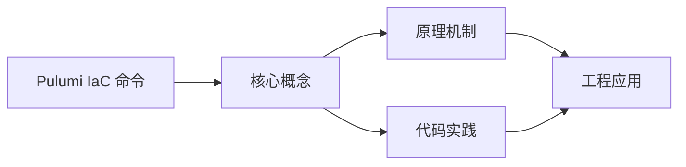
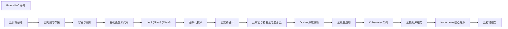

## 1. 学习目标（Bloom 分类）

本节按照布鲁姆教育目标分类学组织学习路径。本文主题为《Pulumi IaC 命令》，属于 云计算 模块，读者可以根据自身阶段选择阅读深度。

记忆层面：能够准确复述本文的核心概念、术语与基本语法或操作步骤，并能够在提问或检索时快速定位对应知识点。能够说出 云计算 的核心概念、组件与标准流程。

理解层面：能够用自己的语言解释核心原理与工作机制，说明概念之间的因果关系，而不是机械记忆结论。能够解释 云计算 的工作原理与关键机制。

应用层面：能够在真实项目或练习场景中运用本文知识解决具体问题，写出正确且可维护的实现。能够执行 云计算 相关的标准操作与配置。

分析层面：能够拆解复杂问题，比较本文主题与相邻概念的异同，识别边界条件与例外情况。能够分析 云计算 方案在可靠性、成本与性能上的权衡。

评价层面：能够根据约束条件（性能、可读性、安全、成本）评价不同方案的优劣，做出有依据的技术决策。能够评价 云计算 中的技术选型。

创造层面：能够把本文知识与其他模块知识组合，设计出新的解决方案或可复用的工程模式。能够设计基于 云计算 的完整解决方案。

通过本节学习，读者应当能够把《Pulumi IaC 命令》纳入自己的知识网络，并与 云计算 模块的其他主题（IaaS/PaaS/SaaS、虚拟化、云原生、成本治理）建立关联。

## 2. 历史动机与发展脉络

《Pulumi IaC 命令》是 云计算 领域的重要主题。要真正理解它，需要先了解它解决的问题与演进过程。

云计算源于 1960 年代分时思想，2006 年 AWS 推出 EC2/S3 开启现代云服务时代；公有云（AWS/Azure/GCP/阿里云/华为云）与私有云、混合云并存。
服务模型：IaaS（虚拟机/存储/网络）、PaaS（托管运行时/数据库）、SaaS（应用即服务）；FaaS（函数即服务）进一步抽象。
云原生：容器、微服务、服务网格、声明式 API、不可变基础设施；CNCF 生态是云原生事实标准。

回到本文主题：Pulumi IaC 命令 的提出与成熟，正是上述技术背景下的必然产物。早期实现往往以简单可用为目标，随着工程规模扩大，社区逐渐沉淀出标准做法与最佳实践；理解这一脉络，可以帮助读者判断“为什么文档中的推荐写法是现在这个样子”，也能在遇到历史遗留代码时准确识别其设计年代与取舍。


## 3. 形式化定义与核心概念精讲

本节把《Pulumi IaC 命令》涉及的核心概念以“定义 + 讲解”的形式展开。读者应把定义当作工具，把讲解当作理解路径；两者结合才能形成可迁移的知识。

虚拟化：虚拟机（Hypervisor 硬件隔离）与容器（OS 级隔离）；虚拟化是弹性与多租户的基础。
核心服务：计算（EC2/ECS）、存储（对象/块/文件）、网络（VPC/负载均衡/CDN）、数据库（托管 RDS/NoSQL）。
弹性与计费：按需、预留、Spot；自动扩缩容（HPA/ASG）；FinOps 治理成本。

### 3.1 原文章节逐一精讲

原文档把主题拆分为 13 个小节，下面按顺序给出每一节的导读讲解，随后保留原文细节供精读。

#### 原文精读（完整保留）

# Pulumi IaC 命令

> **符号约定**：`< >` 必填参数 | `[ ]` 可选参数

---

#### 安装与配置

**基本写法：安装 Pulumi CLI**
`curl -fsSL https://get.pulumi.com | sh`
```bash
# Linux/macOS 一键安装
curl -fsSL https://get.pulumi.com | sh
```

---

**基本写法：Windows 安装**
`winget install pulumi.pulumi`
```bash
# Windows 通过 winget 安装
winget install pulumi.pulumi
```

---

**基本写法：查看版本**
`pulumi version`
```bash
# 查看当前 Pulumi 版本
pulumi version
```

---

**基本写法：登录 Pulumi 服务**
`pulumi login`
```bash
# 登录 Pulumi 云服务
pulumi login
```

---

**基本写法：本地后端登录**
`pulumi login file://<路径>`
```bash
# 使用本地文件系统作为状态后端
pulumi login file://~/.pulumi
```

---

**基本写法：自托管后端**
`pulumi login <URL>`
```bash
# 登录自托管的 Pulumi 服务
pulumi login https://pulumi.example.com
```

---

#### 项目创建

**基本写法：创建新项目**
`pulumi new <模板> [--name <名称>]`
```bash
# 交互式创建 AWS Python 项目
pulumi new aws-python
```

---

**基本写法：创建 TypeScript AWS 项目**
`pulumi new aws-typescript`
```bash
# 创建 AWS TypeScript 模板项目
pulumi new aws-typescript --name my-app --description "My AWS App"
```

---

**基本写法：创建 GCP 项目**
`pulumi new gcp-typescript`
```bash
# 创建 GCP TypeScript 项目
pulumi new gcp-typescript
```

---

**基本写法：创建 Azure 项目**
`pulumi new azure-typescript`
```bash
# 创建 Azure TypeScript 项目
pulumi new azure-typescript
```

---

**基本写法：从模板创建**
`pulumi new https://github.com/<user>/<repo>`
```bash
# 从 GitHub 仓库创建项目
pulumi new https://github.com/pulumi/examples/tree/master/aws-py-eks
```

---

#### 配置管理

**基本写法：设置配置值**
`pulumi config set <键> <值>`
```bash
# 设置普通配置
pulumi config set aws:region us-east-1
```

---

**基本写法：设置敏感配置**
`pulumi config set <键> <值> --secret`
```bash
# 加密保存数据库密码
pulumi config set dbPassword "MyPass123!" --secret
```

---

**基本写法：查看所有配置**
`pulumi config`
```bash
# 查看当前堆栈所有配置
pulumi config
```

---

**基本写法：查看配置明文**
`pulumi config --show-secrets`
```bash
# 查看包含密钥的配置(谨慎使用)
pulumi config --show-secrets
```

---

**基本写法：获取单个配置**
`pulumi config get <键>`
```bash
# 获取指定配置值
pulumi config get aws:region
```

---

**基本写法：移除配置**
`pulumi config rm <键>`
```bash
# 删除指定配置项
pulumi config rm dbPassword
```

---

#### 堆栈管理

**基本写法：创建堆栈**
`pulumi stack init <堆栈名>`
```bash
# 创建生产堆栈
pulumi stack init production
```

---

**基本写法：列出堆栈**
`pulumi stack ls`
```bash
# 列出项目所有堆栈
pulumi stack ls
```

---

**基本写法：选择堆栈**
`pulumi stack select <堆栈名>`
```bash
# 切换到 dev 堆栈
pulumi stack select dev
```

---

**基本写法：查看当前堆栈**
`pulumi stack`
```bash
# 显示当前堆栈名称
pulumi stack
```

---

**基本写法：删除堆栈**
`pulumi stack rm <堆栈名>`
```bash
# 删除指定堆栈(需先清空资源)
pulumi stack rm staging
```

---

**基本写法：导出堆栈状态**
`pulumi stack export --file <文件>`
```bash
# 导出堆栈状态到本地文件
pulumi stack export --file state.json
```

---

#### 部署与预览

**基本写法：预览变更**
`pulumi preview`
```bash
# 预览将要执行的变更
pulumi preview
```

---

**基本写法：部署基础设施**
`pulumi up`
```bash
# 部署到当前堆栈
pulumi up
```

---

**基本写法：跳过确认部署**
`pulumi up --yes`
```bash
# 自动确认部署(用于 CI/CD)
pulumi up --yes
```

---

**基本写法：部署指定堆栈**
`pulumi up --stack <堆栈名>`
```bash
# 部署到 production 堆栈
pulumi up --stack production --yes
```

---

**基本写法：显示详细差异**
`pulumi up --diff`
```bash
# 部署时显示详细 diff
pulumi up --diff
```

---

**基本写法：销毁资源**
`pulumi destroy`
```bash
# 销毁堆栈中所有资源
pulumi destroy
```

---

#### 输出与查询

**基本写法：查看输出**
`pulumi stack output`
```bash
# 列出所有输出值
pulumi stack output
```

---

**基本写法：查看单个输出**
`pulumi stack output <输出名>`
```bash
# 获取指定输出值
pulumi stack output instanceId
```

---

**基本写法：输出 JSON 格式**
`pulumi stack output --json`
```bash
# JSON 格式输出便于脚本处理
pulumi stack output --json
```

---

**基本写法：显示输出值的密钥**
`pulumi stack output <名称> --show-secrets`
```bash
# 查看敏感输出值
pulumi stack output dbPassword --show-secrets
```

---

**基本写法：在程序中获取输出**
```typescript
// 在 Pulumi 程序中引用其他堆栈的输出
import * as pulumi from "@pulumi/pulumi";

const infraStack = new pulumi.StackReference("myorg/infra/prod");
const vpcId = infraStack.getOutput("vpcId");
```

---

#### 状态管理

**基本写法：查看状态资源**
`pulumi stack --show-ids`
```bash
# 查看堆栈中所有资源 ID
pulumi stack --show-ids
```

---

**基本写法：导入资源**
`pulumi import <类型> <名称> <ID>`
```bash
# 导入现有 EC2 实例到 Pulumi 管理
pulumi import aws:ec2/instance:Instance my-instance i-1234567890abcdef0
```

---

**基本写法：导入并生成代码**
`pulumi import <类型> <名称> <ID> --out <目录>`
```bash
# 生成导入资源的代码
pulumi import aws:ec2/instance:Instance my-instance i-1234567890abcdef0 --out imported
```

---

**基本写法：删除状态中的资源**
`pulumi state delete <资源URN>`
```bash
# 从状态中移除资源(不删除实际资源)
pulumi state delete "urn:pulumi:dev::my-app::aws:ec2/instance:Instance::my-instance"
```

---

**基本写法：取消操作**
`pulumi cancel`
```bash
# 取消正在进行的更新
pulumi cancel
```

---

#### 策略与合规

**基本写法：启用 Policy Pack**
`pulumi up --policy-pack <策略包路径>`
```bash
# 部署时应用 Policy Pack
pulumi up --policy-pack ./policies
```

---

**基本写法：强制执行策略**
`pulumi up --policy-pack <路径> --policy-pack-enforcement-level mandatory`
```bash
# 强制策略(违规时阻止部署)
pulumi up \
  --policy-pack ./policies \
  --policy-pack-enforcement-level mandatory
```

---

**基本写法：查看策略违规**
`pulumi preview --policy-pack <路径>`
```bash
# 预览时仅检查策略违规
pulumi preview --policy-pack ./policies
```

---

**基本写法：创建 Policy Pack**
```typescript
// policies/index.ts
import { PolicyPack } from "@pulumi/policy";

new PolicyPack("my-policy-pack", {
  policies: [
    {
      name: "no-public-ec2",
      description: "禁止 EC2 实例直接关联公网 IP",
      enforcementLevel: "mandatory",
      validateResource: (args, reportViolation) => {
        if (args.type === "aws:ec2/instance:Instance") {
          if (args.props.associatePublicIpAddress) {
            reportViolation("EC2 不应直接关联公网 IP");
          }
        }
      },
    },
  ],
});
```

---

#### 提供者配置

**基本写法：配置 AWS 提供者**
```typescript
// 配置 AWS 提供者指定区域
import * as aws from "@pulumi/aws";

const provider = new aws.Provider("my-provider", {
  region: "us-west-2",
});
```

---

**基本写法：使用指定 profile**
`pulumi config set aws:profile <profile名>`
```bash
# 使用特定 AWS profile
pulumi config set aws:profile production
```

---

**基本写法：多区域部署**
```typescript
// 为不同区域创建不同提供者
import * as aws from "@pulumi/aws";

const usEastProvider = new aws.Provider("us-east", { region: "us-east-1" });
const usWestProvider = new aws.Provider("us-west", { region: "us-west-2" });
```

---

**基本写法：自定义提供者端点**
```typescript
// 使用 LocalStack 端点本地测试
import * as aws from "@pulumi/aws";

const localstackProvider = new aws.Provider("localstack", {
  endpoints: [{ hostname: "localhost", port: 4566, protocol: "http" }],
  skipCredentialsValidation: true,
  skipMetadataApiCheck: true,
});
```

---

#### CI/CD 集成

**基本写法：设置 GitHub Actions**
```yaml
# .github/workflows/pulumi.yml
name: Pulumi
on:
  push:
    branches: [main]
jobs:
  deploy:
    runs-on: ubuntu-latest
    steps:
      - uses: actions/checkout@v4
      - uses: actions/setup-node@v4
        with:
          node-version: '20'
      - run: npm install
      - uses: pulumi/actions@v5
        with:
          command: up
          stack-name: production
        env:
          PULUMI_ACCESS_TOKEN: ${{ secrets.PULUMI_ACCESS_TOKEN }}
          AWS_ACCESS_KEY_ID: ${{ secrets.AWS_ACCESS_KEY_ID }}
          AWS_SECRET_ACCESS_KEY: ${{ secrets.AWS_SECRET_ACCESS_KEY }}
```

---

**基本写法：使用 access token**
`pulumi login --token <token>`
```bash
# 通过 token 非交互登录(用于 CI)
pulumi login --token pul-xxxxxxxxxx
```

---

**基本写法：CI 模式**
`pulumi up --yes --non-interactive`
```bash
# 非交互模式部署
pulumi up --yes --non-interactive
```

---

**基本写法：使用 GitHub OIDC**
```yaml
# 通过 GitHub OIDC 部署到 AWS
permissions:
  id-token: write
  contents: read
jobs:
  deploy:
    steps:
      - uses: aws-actions/configure-aws-credentials@v4
        with:
          role-to-assume: arn:aws:iam::123456789012:role/github-actions
          aws-region: us-east-1
      - uses: pulumi/actions@v5
        with:
          command: up
          stack-name: production
```

---

#### 组件与抽象

**基本写法：创建组件资源**
```typescript
// 创建可复用的组件资源
import * as pulumi from "@pulumi/pulumi";
import * as aws from "@pulumi/aws";

export class WebServer extends pulumi.ComponentResource {
  public readonly instanceId: pulumi.Output<string>;

  constructor(name: string, opts?: pulumi.ComponentResourceOptions) {
    super("my:module:WebServer", name, {}, opts);

    const sg = new aws.ec2.SecurityGroup(`${name}-sg`, {
      ingress: [{ protocol: "tcp", fromPort: 80, toPort: 80, cidrBlocks: ["0.0.0.0/0"] }],
    }, { parent: this });

    const instance = new aws.ec2.Instance(`${name}-instance`, {
      instanceType: "t3.micro",
      ami: "ami-0c55b159cbfafe1f0",
      vpcSecurityGroupIds: [sg.id],
    }, { parent: this });

    this.instanceId = instance.id;
    this.registerOutputs({ instanceId: this.instanceId });
  }
}
```

---

**基本写法：使用组件**
```typescript
// 在主程序中使用自定义组件
import { WebServer } from "./webserver";

const web1 = new WebServer("web1");
const web2 = new WebServer("web2");
export const web1Id = web1.instanceId;
```

---

**基本写法：导出多资源**
```typescript
// 同时导出多个相关资源
import * as aws from "@pulumi/aws";

const bucket = new aws.s3.Bucket("my-bucket");
const table = new aws.dynamodb.Table("my-table", {
  attributes: [{ name: "id", type: "S" }],
  hashKey: "id",
  billingMode: "PAY_PER_REQUEST",
});

export const bucketName = bucket.id;
export const tableName = table.id;
```

---

#### 模板与示例

**基本写法：列出所有模板**
`pulumi new --list-templates`
```bash
# 查看所有可用项目模板
pulumi new --list-templates
```

---

**基本写法：使用 Kubernetes 模板**
`pulumi new kubernetes-typescript`
```bash
# 创建 K8s TypeScript 项目
pulumi new kubernetes-typescript
```

---

**基本写法：使用容器模板**
`pulumi new dockerfile`
```bash
# 从 Dockerfile 创建项目
pulumi new dockerfile
```

---

**基本写法：查看示例**
`pulumi new --list-templates | grep example`
```bash
# 列出示例模板
pulumi new --list-templates
```

---

#### 别名与重构

**基本写法：重命名资源**
```typescript
// 通过 alias 重命名资源而不重建
import * as aws from "@pulumi/aws";

const bucket = new aws.s3.Bucket("new-name", {
  // 其他属性
}, {
  aliases: [{ name: "old-name" }],
});
```

---

**基本写法：跨类型别名**
```typescript
// 跨类型迁移资源
const instance = new aws.ec2.Instance("my-instance", {
  // ...
}, {
  aliases: [{ type: "aws:ec2/instance:InstanceV1" }],
});
```

---

**基本写法：父资源别名**
```typescript
// 修改父资源时保持子资源
const child = new SomeResource("child", { /* ... */ }, {
  parent: newParent,
  aliases: [{ parent: oldParent }],
});
```

---

**基本写法：批量别名**
```typescript
// 多个别名同时使用
const resource = new SomeResource("name", { /* ... */ }, {
  aliases: [
    { name: "old-name-1" },
    { name: "old-name-2" },
    { type: "old:type:Resource" },
  ],
});
```


### 3.2 概念关系图

下面用 Mermaid 图表达本文核心概念之间的关系，帮助读者建立整体图景：



图中展示的是本文知识的结构化关系：核心概念是入口，原理机制解释“为什么”，代码实践演示“怎么做”，工程应用回答“何时用”。读者学习时可以把每个小节的内容挂接到对应节点上。

## 4. 理论推导与原理解析

本节深入《Pulumi IaC 命令》背后的原理。理论部分不求面面俱到，而是聚焦“能解释现象、能指导实践”的关键推导。

虚拟化：虚拟机（Hypervisor 硬件隔离）与容器（OS 级隔离）；虚拟化是弹性与多租户的基础。
核心服务：计算（EC2/ECS）、存储（对象/块/文件）、网络（VPC/负载均衡/CDN）、数据库（托管 RDS/NoSQL）。
弹性与计费：按需、预留、Spot；自动扩缩容（HPA/ASG）；FinOps 治理成本。
高可用设计：多可用区、故障域、跨区域容灾；RPO/RTO 目标驱动方案。

需要强调的是，理论推导与工程实践之间存在翻译层：理论给出的是理想化模型与边界条件，工程代码则必须处理真实环境中的例外。读者在学习时应先掌握理论的“标准情形”，再通过陷阱章节了解“非标准情形”。

## 5. 代码示例与逐行讲解

本节把原文中的代码示例系统整理，并为每个示例补充用途说明与讲解。读者不应只浏览代码，而应逐段对照讲解理解设计意图。

### 5.1 示例：安装与配置

该示例来自原文《安装与配置》小节，用于演示Pulumi IaC 命令相关操作。阅读时请先看代码结构，再看其后的讲解。

```bash
# Linux/macOS 一键安装
curl -fsSL https://get.pulumi.com | sh
```

讲解：这段代码演示了本节核心知识点。代码中的关键操作可以归纳为三步：准备（定义或初始化）、执行（核心逻辑）、收尾（释放资源或返回结果）。实际项目中，这三步往往被封装为函数或类，以提升复用性与可测试性。

关键点分析：

该示例共 2 行有效代码，结构以数据或配置为主。阅读时应关注：数据字段的含义、配置项的作用，以及它们与运行行为的对应关系。

进阶思考路径：先尝试修改参数观察行为变化，再把示例中的模式迁移到自己的项目中；每次修改都记录预期与实测差异，这是把示例转化为能力的最快方式。

### 5.2 示例：安装与配置

该示例来自原文《安装与配置》小节，用于演示Pulumi IaC 命令相关操作。阅读时请先看代码结构，再看其后的讲解。

```bash
# Windows 通过 winget 安装
winget install pulumi.pulumi
```

讲解：这段代码演示了本节核心知识点。代码中的关键操作可以归纳为三步：准备（定义或初始化）、执行（核心逻辑）、收尾（释放资源或返回结果）。实际项目中，这三步往往被封装为函数或类，以提升复用性与可测试性。

关键点分析：

该示例共 2 行有效代码，结构以数据或配置为主。阅读时应关注：数据字段的含义、配置项的作用，以及它们与运行行为的对应关系。

进阶思考路径：先尝试修改参数观察行为变化，再把示例中的模式迁移到自己的项目中；每次修改都记录预期与实测差异，这是把示例转化为能力的最快方式。

### 5.3 示例：安装与配置

该示例来自原文《安装与配置》小节，用于演示Pulumi IaC 命令相关操作。阅读时请先看代码结构，再看其后的讲解。

```bash
# 查看当前 Pulumi 版本
pulumi version
```

讲解：这段代码演示了本节核心知识点。代码中的关键操作可以归纳为三步：准备（定义或初始化）、执行（核心逻辑）、收尾（释放资源或返回结果）。实际项目中，这三步往往被封装为函数或类，以提升复用性与可测试性。

关键点分析：

该示例共 2 行有效代码，结构以数据或配置为主。阅读时应关注：数据字段的含义、配置项的作用，以及它们与运行行为的对应关系。

进阶思考路径：先尝试修改参数观察行为变化，再把示例中的模式迁移到自己的项目中；每次修改都记录预期与实测差异，这是把示例转化为能力的最快方式。

### 5.4 示例：安装与配置

该示例来自原文《安装与配置》小节，用于演示Pulumi IaC 命令相关操作。阅读时请先看代码结构，再看其后的讲解。

```bash
# 登录 Pulumi 云服务
pulumi login
```

讲解：这段代码演示了本节核心知识点。代码中的关键操作可以归纳为三步：准备（定义或初始化）、执行（核心逻辑）、收尾（释放资源或返回结果）。实际项目中，这三步往往被封装为函数或类，以提升复用性与可测试性。

关键点分析：

该示例共 2 行有效代码，结构以数据或配置为主。阅读时应关注：数据字段的含义、配置项的作用，以及它们与运行行为的对应关系。

进阶思考路径：先尝试修改参数观察行为变化，再把示例中的模式迁移到自己的项目中；每次修改都记录预期与实测差异，这是把示例转化为能力的最快方式。

### 5.5 示例：安装与配置

该示例来自原文《安装与配置》小节，用于演示Pulumi IaC 命令相关操作。阅读时请先看代码结构，再看其后的讲解。

```bash
# 使用本地文件系统作为状态后端
pulumi login file://~/.pulumi
```

讲解：这段代码演示了本节核心知识点。代码中的关键操作可以归纳为三步：准备（定义或初始化）、执行（核心逻辑）、收尾（释放资源或返回结果）。实际项目中，这三步往往被封装为函数或类，以提升复用性与可测试性。

关键点分析：

该示例共 2 行有效代码，结构以数据或配置为主。阅读时应关注：数据字段的含义、配置项的作用，以及它们与运行行为的对应关系。

进阶思考路径：先尝试修改参数观察行为变化，再把示例中的模式迁移到自己的项目中；每次修改都记录预期与实测差异，这是把示例转化为能力的最快方式。

### 5.6 示例：安装与配置

该示例来自原文《安装与配置》小节，用于演示Pulumi IaC 命令相关操作。阅读时请先看代码结构，再看其后的讲解。

```bash
# 登录自托管的 Pulumi 服务
pulumi login https://pulumi.example.com
```

讲解：这段代码演示了本节核心知识点。代码中的关键操作可以归纳为三步：准备（定义或初始化）、执行（核心逻辑）、收尾（释放资源或返回结果）。实际项目中，这三步往往被封装为函数或类，以提升复用性与可测试性。

关键点分析：

该示例共 2 行有效代码，结构以数据或配置为主。阅读时应关注：数据字段的含义、配置项的作用，以及它们与运行行为的对应关系。

进阶思考路径：先尝试修改参数观察行为变化，再把示例中的模式迁移到自己的项目中；每次修改都记录预期与实测差异，这是把示例转化为能力的最快方式。

### 5.7 示例：项目创建

该示例来自原文《项目创建》小节，用于演示Pulumi IaC 命令相关操作。阅读时请先看代码结构，再看其后的讲解。

```bash
# 交互式创建 AWS Python 项目
pulumi new aws-python
```

讲解：这段代码演示了本节核心知识点。代码中的关键操作可以归纳为三步：准备（定义或初始化）、执行（核心逻辑）、收尾（释放资源或返回结果）。实际项目中，这三步往往被封装为函数或类，以提升复用性与可测试性。

关键点分析：

该示例共 2 行有效代码，结构以数据或配置为主。阅读时应关注：数据字段的含义、配置项的作用，以及它们与运行行为的对应关系。

进阶思考路径：先尝试修改参数观察行为变化，再把示例中的模式迁移到自己的项目中；每次修改都记录预期与实测差异，这是把示例转化为能力的最快方式。

### 5.8 示例：项目创建

该示例来自原文《项目创建》小节，用于演示Pulumi IaC 命令相关操作。阅读时请先看代码结构，再看其后的讲解。

```bash
# 创建 AWS TypeScript 模板项目
pulumi new aws-typescript --name my-app --description "My AWS App"
```

讲解：这段代码演示了本节核心知识点。代码中的关键操作可以归纳为三步：准备（定义或初始化）、执行（核心逻辑）、收尾（释放资源或返回结果）。实际项目中，这三步往往被封装为函数或类，以提升复用性与可测试性。

关键点分析：

该示例共 2 行有效代码，结构以数据或配置为主。阅读时应关注：数据字段的含义、配置项的作用，以及它们与运行行为的对应关系。

进阶思考路径：先尝试修改参数观察行为变化，再把示例中的模式迁移到自己的项目中；每次修改都记录预期与实测差异，这是把示例转化为能力的最快方式。

### 5.9 示例：项目创建

该示例来自原文《项目创建》小节，用于演示Pulumi IaC 命令相关操作。阅读时请先看代码结构，再看其后的讲解。

```bash
# 创建 GCP TypeScript 项目
pulumi new gcp-typescript
```

讲解：这段代码演示了本节核心知识点。代码中的关键操作可以归纳为三步：准备（定义或初始化）、执行（核心逻辑）、收尾（释放资源或返回结果）。实际项目中，这三步往往被封装为函数或类，以提升复用性与可测试性。

关键点分析：

该示例共 2 行有效代码，结构以数据或配置为主。阅读时应关注：数据字段的含义、配置项的作用，以及它们与运行行为的对应关系。

进阶思考路径：先尝试修改参数观察行为变化，再把示例中的模式迁移到自己的项目中；每次修改都记录预期与实测差异，这是把示例转化为能力的最快方式。

### 5.10 示例：项目创建

该示例来自原文《项目创建》小节，用于演示Pulumi IaC 命令相关操作。阅读时请先看代码结构，再看其后的讲解。

```bash
# 创建 Azure TypeScript 项目
pulumi new azure-typescript
```

讲解：这段代码演示了本节核心知识点。代码中的关键操作可以归纳为三步：准备（定义或初始化）、执行（核心逻辑）、收尾（释放资源或返回结果）。实际项目中，这三步往往被封装为函数或类，以提升复用性与可测试性。

关键点分析：

该示例共 2 行有效代码，结构以数据或配置为主。阅读时应关注：数据字段的含义、配置项的作用，以及它们与运行行为的对应关系。

进阶思考路径：先尝试修改参数观察行为变化，再把示例中的模式迁移到自己的项目中；每次修改都记录预期与实测差异，这是把示例转化为能力的最快方式。

### 5.11 示例：项目创建

该示例来自原文《项目创建》小节，用于演示Pulumi IaC 命令相关操作。阅读时请先看代码结构，再看其后的讲解。

```bash
# 从 GitHub 仓库创建项目
pulumi new https://github.com/pulumi/examples/tree/master/aws-py-eks
```

讲解：这段代码演示了本节核心知识点。代码中的关键操作可以归纳为三步：准备（定义或初始化）、执行（核心逻辑）、收尾（释放资源或返回结果）。实际项目中，这三步往往被封装为函数或类，以提升复用性与可测试性。

关键点分析：

该示例共 2 行有效代码，结构以数据或配置为主。阅读时应关注：数据字段的含义、配置项的作用，以及它们与运行行为的对应关系。

进阶思考路径：先尝试修改参数观察行为变化，再把示例中的模式迁移到自己的项目中；每次修改都记录预期与实测差异，这是把示例转化为能力的最快方式。

### 5.12 示例：配置管理

该示例来自原文《配置管理》小节，用于演示Pulumi IaC 命令相关操作。阅读时请先看代码结构，再看其后的讲解。

```bash
# 设置普通配置
pulumi config set aws:region us-east-1
```

讲解：这段代码演示了本节核心知识点。代码中的关键操作可以归纳为三步：准备（定义或初始化）、执行（核心逻辑）、收尾（释放资源或返回结果）。实际项目中，这三步往往被封装为函数或类，以提升复用性与可测试性。

关键点分析：

该示例共 2 行有效代码，结构以数据或配置为主。阅读时应关注：数据字段的含义、配置项的作用，以及它们与运行行为的对应关系。

进阶思考路径：先尝试修改参数观察行为变化，再把示例中的模式迁移到自己的项目中；每次修改都记录预期与实测差异，这是把示例转化为能力的最快方式。

### 5.13 示例：配置管理

该示例来自原文《配置管理》小节，用于演示Pulumi IaC 命令相关操作。阅读时请先看代码结构，再看其后的讲解。

```bash
# 加密保存数据库密码
pulumi config set dbPassword "MyPass123!" --secret
```

讲解：这段代码演示了本节核心知识点。代码中的关键操作可以归纳为三步：准备（定义或初始化）、执行（核心逻辑）、收尾（释放资源或返回结果）。实际项目中，这三步往往被封装为函数或类，以提升复用性与可测试性。

关键点分析：

该示例共 2 行有效代码，结构以数据或配置为主。阅读时应关注：数据字段的含义、配置项的作用，以及它们与运行行为的对应关系。

进阶思考路径：先尝试修改参数观察行为变化，再把示例中的模式迁移到自己的项目中；每次修改都记录预期与实测差异，这是把示例转化为能力的最快方式。

### 5.14 示例：配置管理

该示例来自原文《配置管理》小节，用于演示Pulumi IaC 命令相关操作。阅读时请先看代码结构，再看其后的讲解。

```bash
# 查看当前堆栈所有配置
pulumi config
```

讲解：这段代码演示了本节核心知识点。代码中的关键操作可以归纳为三步：准备（定义或初始化）、执行（核心逻辑）、收尾（释放资源或返回结果）。实际项目中，这三步往往被封装为函数或类，以提升复用性与可测试性。

关键点分析：

该示例共 2 行有效代码，结构以数据或配置为主。阅读时应关注：数据字段的含义、配置项的作用，以及它们与运行行为的对应关系。

进阶思考路径：先尝试修改参数观察行为变化，再把示例中的模式迁移到自己的项目中；每次修改都记录预期与实测差异，这是把示例转化为能力的最快方式。

### 5.15 示例：配置管理

该示例来自原文《配置管理》小节，用于演示Pulumi IaC 命令相关操作。阅读时请先看代码结构，再看其后的讲解。

```bash
# 查看包含密钥的配置(谨慎使用)
pulumi config --show-secrets
```

讲解：这段代码演示了本节核心知识点。代码中的关键操作可以归纳为三步：准备（定义或初始化）、执行（核心逻辑）、收尾（释放资源或返回结果）。实际项目中，这三步往往被封装为函数或类，以提升复用性与可测试性。

关键点分析：

该示例共 2 行有效代码，结构以数据或配置为主。阅读时应关注：数据字段的含义、配置项的作用，以及它们与运行行为的对应关系。

进阶思考路径：先尝试修改参数观察行为变化，再把示例中的模式迁移到自己的项目中；每次修改都记录预期与实测差异，这是把示例转化为能力的最快方式。

### 5.16 示例：配置管理

该示例来自原文《配置管理》小节，用于演示Pulumi IaC 命令相关操作。阅读时请先看代码结构，再看其后的讲解。

```bash
# 获取指定配置值
pulumi config get aws:region
```

讲解：这段代码演示了本节核心知识点。代码中的关键操作可以归纳为三步：准备（定义或初始化）、执行（核心逻辑）、收尾（释放资源或返回结果）。实际项目中，这三步往往被封装为函数或类，以提升复用性与可测试性。

关键点分析：

该示例共 2 行有效代码，结构以数据或配置为主。阅读时应关注：数据字段的含义、配置项的作用，以及它们与运行行为的对应关系。

进阶思考路径：先尝试修改参数观察行为变化，再把示例中的模式迁移到自己的项目中；每次修改都记录预期与实测差异，这是把示例转化为能力的最快方式。

### 5.17 示例：配置管理

该示例来自原文《配置管理》小节，用于演示Pulumi IaC 命令相关操作。阅读时请先看代码结构，再看其后的讲解。

```bash
# 删除指定配置项
pulumi config rm dbPassword
```

讲解：这段代码演示了本节核心知识点。代码中的关键操作可以归纳为三步：准备（定义或初始化）、执行（核心逻辑）、收尾（释放资源或返回结果）。实际项目中，这三步往往被封装为函数或类，以提升复用性与可测试性。

关键点分析：

该示例共 2 行有效代码，结构以数据或配置为主。阅读时应关注：数据字段的含义、配置项的作用，以及它们与运行行为的对应关系。

进阶思考路径：先尝试修改参数观察行为变化，再把示例中的模式迁移到自己的项目中；每次修改都记录预期与实测差异，这是把示例转化为能力的最快方式。

### 5.18 示例：堆栈管理

该示例来自原文《堆栈管理》小节，用于演示Pulumi IaC 命令相关操作。阅读时请先看代码结构，再看其后的讲解。

```bash
# 创建生产堆栈
pulumi stack init production
```

讲解：这段代码演示了本节核心知识点。代码中的关键操作可以归纳为三步：准备（定义或初始化）、执行（核心逻辑）、收尾（释放资源或返回结果）。实际项目中，这三步往往被封装为函数或类，以提升复用性与可测试性。

关键点分析：

该示例共 2 行有效代码，结构以数据或配置为主。阅读时应关注：数据字段的含义、配置项的作用，以及它们与运行行为的对应关系。

进阶思考路径：先尝试修改参数观察行为变化，再把示例中的模式迁移到自己的项目中；每次修改都记录预期与实测差异，这是把示例转化为能力的最快方式。

### 5.19 示例：堆栈管理

该示例来自原文《堆栈管理》小节，用于演示Pulumi IaC 命令相关操作。阅读时请先看代码结构，再看其后的讲解。

```bash
# 列出项目所有堆栈
pulumi stack ls
```

讲解：这段代码演示了本节核心知识点。代码中的关键操作可以归纳为三步：准备（定义或初始化）、执行（核心逻辑）、收尾（释放资源或返回结果）。实际项目中，这三步往往被封装为函数或类，以提升复用性与可测试性。

关键点分析：

该示例共 2 行有效代码，结构以数据或配置为主。阅读时应关注：数据字段的含义、配置项的作用，以及它们与运行行为的对应关系。

进阶思考路径：先尝试修改参数观察行为变化，再把示例中的模式迁移到自己的项目中；每次修改都记录预期与实测差异，这是把示例转化为能力的最快方式。

### 5.20 示例：堆栈管理

该示例来自原文《堆栈管理》小节，用于演示Pulumi IaC 命令相关操作。阅读时请先看代码结构，再看其后的讲解。

```bash
# 切换到 dev 堆栈
pulumi stack select dev
```

讲解：这段代码演示了本节核心知识点。代码中的关键操作可以归纳为三步：准备（定义或初始化）、执行（核心逻辑）、收尾（释放资源或返回结果）。实际项目中，这三步往往被封装为函数或类，以提升复用性与可测试性。

关键点分析：

该示例共 2 行有效代码，结构以数据或配置为主。阅读时应关注：数据字段的含义、配置项的作用，以及它们与运行行为的对应关系。

进阶思考路径：先尝试修改参数观察行为变化，再把示例中的模式迁移到自己的项目中；每次修改都记录预期与实测差异，这是把示例转化为能力的最快方式。

### 5.21 示例：堆栈管理

该示例来自原文《堆栈管理》小节，用于演示Pulumi IaC 命令相关操作。阅读时请先看代码结构，再看其后的讲解。

```bash
# 显示当前堆栈名称
pulumi stack
```

讲解：这段代码演示了本节核心知识点。代码中的关键操作可以归纳为三步：准备（定义或初始化）、执行（核心逻辑）、收尾（释放资源或返回结果）。实际项目中，这三步往往被封装为函数或类，以提升复用性与可测试性。

关键点分析：

该示例共 2 行有效代码，结构以数据或配置为主。阅读时应关注：数据字段的含义、配置项的作用，以及它们与运行行为的对应关系。

进阶思考路径：先尝试修改参数观察行为变化，再把示例中的模式迁移到自己的项目中；每次修改都记录预期与实测差异，这是把示例转化为能力的最快方式。

### 5.22 示例：堆栈管理

该示例来自原文《堆栈管理》小节，用于演示Pulumi IaC 命令相关操作。阅读时请先看代码结构，再看其后的讲解。

```bash
# 删除指定堆栈(需先清空资源)
pulumi stack rm staging
```

讲解：这段代码演示了本节核心知识点。代码中的关键操作可以归纳为三步：准备（定义或初始化）、执行（核心逻辑）、收尾（释放资源或返回结果）。实际项目中，这三步往往被封装为函数或类，以提升复用性与可测试性。

关键点分析：

该示例共 2 行有效代码，结构以数据或配置为主。阅读时应关注：数据字段的含义、配置项的作用，以及它们与运行行为的对应关系。

进阶思考路径：先尝试修改参数观察行为变化，再把示例中的模式迁移到自己的项目中；每次修改都记录预期与实测差异，这是把示例转化为能力的最快方式。

### 5.23 示例：堆栈管理

该示例来自原文《堆栈管理》小节，用于演示Pulumi IaC 命令相关操作。阅读时请先看代码结构，再看其后的讲解。

```bash
# 导出堆栈状态到本地文件
pulumi stack export --file state.json
```

讲解：这段代码演示了本节核心知识点。代码中的关键操作可以归纳为三步：准备（定义或初始化）、执行（核心逻辑）、收尾（释放资源或返回结果）。实际项目中，这三步往往被封装为函数或类，以提升复用性与可测试性。

关键点分析：

该示例共 2 行有效代码，结构以数据或配置为主。阅读时应关注：数据字段的含义、配置项的作用，以及它们与运行行为的对应关系。

进阶思考路径：先尝试修改参数观察行为变化，再把示例中的模式迁移到自己的项目中；每次修改都记录预期与实测差异，这是把示例转化为能力的最快方式。

### 5.24 示例：部署与预览

该示例来自原文《部署与预览》小节，用于演示Pulumi IaC 命令相关操作。阅读时请先看代码结构，再看其后的讲解。

```bash
# 预览将要执行的变更
pulumi preview
```

讲解：这段代码演示了本节核心知识点。代码中的关键操作可以归纳为三步：准备（定义或初始化）、执行（核心逻辑）、收尾（释放资源或返回结果）。实际项目中，这三步往往被封装为函数或类，以提升复用性与可测试性。

关键点分析：

该示例共 2 行有效代码，结构以数据或配置为主。阅读时应关注：数据字段的含义、配置项的作用，以及它们与运行行为的对应关系。

进阶思考路径：先尝试修改参数观察行为变化，再把示例中的模式迁移到自己的项目中；每次修改都记录预期与实测差异，这是把示例转化为能力的最快方式。

### 5.25 示例：部署与预览

该示例来自原文《部署与预览》小节，用于演示Pulumi IaC 命令相关操作。阅读时请先看代码结构，再看其后的讲解。

```bash
# 部署到当前堆栈
pulumi up
```

讲解：这段代码演示了本节核心知识点。代码中的关键操作可以归纳为三步：准备（定义或初始化）、执行（核心逻辑）、收尾（释放资源或返回结果）。实际项目中，这三步往往被封装为函数或类，以提升复用性与可测试性。

关键点分析：

该示例共 2 行有效代码，结构以数据或配置为主。阅读时应关注：数据字段的含义、配置项的作用，以及它们与运行行为的对应关系。

进阶思考路径：先尝试修改参数观察行为变化，再把示例中的模式迁移到自己的项目中；每次修改都记录预期与实测差异，这是把示例转化为能力的最快方式。

### 5.26 示例：部署与预览

该示例来自原文《部署与预览》小节，用于演示Pulumi IaC 命令相关操作。阅读时请先看代码结构，再看其后的讲解。

```bash
# 自动确认部署(用于 CI/CD)
pulumi up --yes
```

讲解：这段代码演示了本节核心知识点。代码中的关键操作可以归纳为三步：准备（定义或初始化）、执行（核心逻辑）、收尾（释放资源或返回结果）。实际项目中，这三步往往被封装为函数或类，以提升复用性与可测试性。

关键点分析：

该示例共 2 行有效代码，结构以数据或配置为主。阅读时应关注：数据字段的含义、配置项的作用，以及它们与运行行为的对应关系。

进阶思考路径：先尝试修改参数观察行为变化，再把示例中的模式迁移到自己的项目中；每次修改都记录预期与实测差异，这是把示例转化为能力的最快方式。

### 5.27 示例：部署与预览

该示例来自原文《部署与预览》小节，用于演示Pulumi IaC 命令相关操作。阅读时请先看代码结构，再看其后的讲解。

```bash
# 部署到 production 堆栈
pulumi up --stack production --yes
```

讲解：这段代码演示了本节核心知识点。代码中的关键操作可以归纳为三步：准备（定义或初始化）、执行（核心逻辑）、收尾（释放资源或返回结果）。实际项目中，这三步往往被封装为函数或类，以提升复用性与可测试性。

关键点分析：

该示例共 2 行有效代码，结构以数据或配置为主。阅读时应关注：数据字段的含义、配置项的作用，以及它们与运行行为的对应关系。

进阶思考路径：先尝试修改参数观察行为变化，再把示例中的模式迁移到自己的项目中；每次修改都记录预期与实测差异，这是把示例转化为能力的最快方式。

### 5.28 示例：部署与预览

该示例来自原文《部署与预览》小节，用于演示Pulumi IaC 命令相关操作。阅读时请先看代码结构，再看其后的讲解。

```bash
# 部署时显示详细 diff
pulumi up --diff
```

讲解：这段代码演示了本节核心知识点。代码中的关键操作可以归纳为三步：准备（定义或初始化）、执行（核心逻辑）、收尾（释放资源或返回结果）。实际项目中，这三步往往被封装为函数或类，以提升复用性与可测试性。

关键点分析：

该示例共 2 行有效代码，结构以数据或配置为主。阅读时应关注：数据字段的含义、配置项的作用，以及它们与运行行为的对应关系。

进阶思考路径：先尝试修改参数观察行为变化，再把示例中的模式迁移到自己的项目中；每次修改都记录预期与实测差异，这是把示例转化为能力的最快方式。

### 5.29 示例：部署与预览

该示例来自原文《部署与预览》小节，用于演示Pulumi IaC 命令相关操作。阅读时请先看代码结构，再看其后的讲解。

```bash
# 销毁堆栈中所有资源
pulumi destroy
```

讲解：这段代码演示了本节核心知识点。代码中的关键操作可以归纳为三步：准备（定义或初始化）、执行（核心逻辑）、收尾（释放资源或返回结果）。实际项目中，这三步往往被封装为函数或类，以提升复用性与可测试性。

关键点分析：

该示例共 2 行有效代码，结构以数据或配置为主。阅读时应关注：数据字段的含义、配置项的作用，以及它们与运行行为的对应关系。

进阶思考路径：先尝试修改参数观察行为变化，再把示例中的模式迁移到自己的项目中；每次修改都记录预期与实测差异，这是把示例转化为能力的最快方式。

### 5.30 示例：输出与查询

该示例来自原文《输出与查询》小节，用于演示Pulumi IaC 命令相关操作。阅读时请先看代码结构，再看其后的讲解。

```bash
# 列出所有输出值
pulumi stack output
```

讲解：这段代码演示了本节核心知识点。代码中的关键操作可以归纳为三步：准备（定义或初始化）、执行（核心逻辑）、收尾（释放资源或返回结果）。实际项目中，这三步往往被封装为函数或类，以提升复用性与可测试性。

关键点分析：

该示例共 2 行有效代码，结构以数据或配置为主。阅读时应关注：数据字段的含义、配置项的作用，以及它们与运行行为的对应关系。

进阶思考路径：先尝试修改参数观察行为变化，再把示例中的模式迁移到自己的项目中；每次修改都记录预期与实测差异，这是把示例转化为能力的最快方式。

### 5.31 示例：输出与查询

该示例来自原文《输出与查询》小节，用于演示Pulumi IaC 命令相关操作。阅读时请先看代码结构，再看其后的讲解。

```bash
# 获取指定输出值
pulumi stack output instanceId
```

讲解：这段代码演示了本节核心知识点。代码中的关键操作可以归纳为三步：准备（定义或初始化）、执行（核心逻辑）、收尾（释放资源或返回结果）。实际项目中，这三步往往被封装为函数或类，以提升复用性与可测试性。

关键点分析：

该示例共 2 行有效代码，结构以数据或配置为主。阅读时应关注：数据字段的含义、配置项的作用，以及它们与运行行为的对应关系。

进阶思考路径：先尝试修改参数观察行为变化，再把示例中的模式迁移到自己的项目中；每次修改都记录预期与实测差异，这是把示例转化为能力的最快方式。

### 5.32 示例：输出与查询

该示例来自原文《输出与查询》小节，用于演示Pulumi IaC 命令相关操作。阅读时请先看代码结构，再看其后的讲解。

```bash
# JSON 格式输出便于脚本处理
pulumi stack output --json
```

讲解：这段代码演示了本节核心知识点。代码中的关键操作可以归纳为三步：准备（定义或初始化）、执行（核心逻辑）、收尾（释放资源或返回结果）。实际项目中，这三步往往被封装为函数或类，以提升复用性与可测试性。

关键点分析：

该示例共 2 行有效代码，结构以数据或配置为主。阅读时应关注：数据字段的含义、配置项的作用，以及它们与运行行为的对应关系。

进阶思考路径：先尝试修改参数观察行为变化，再把示例中的模式迁移到自己的项目中；每次修改都记录预期与实测差异，这是把示例转化为能力的最快方式。

### 5.33 示例：输出与查询

该示例来自原文《输出与查询》小节，用于演示Pulumi IaC 命令相关操作。阅读时请先看代码结构，再看其后的讲解。

```bash
# 查看敏感输出值
pulumi stack output dbPassword --show-secrets
```

讲解：这段代码演示了本节核心知识点。代码中的关键操作可以归纳为三步：准备（定义或初始化）、执行（核心逻辑）、收尾（释放资源或返回结果）。实际项目中，这三步往往被封装为函数或类，以提升复用性与可测试性。

关键点分析：

该示例共 2 行有效代码，结构以数据或配置为主。阅读时应关注：数据字段的含义、配置项的作用，以及它们与运行行为的对应关系。

进阶思考路径：先尝试修改参数观察行为变化，再把示例中的模式迁移到自己的项目中；每次修改都记录预期与实测差异，这是把示例转化为能力的最快方式。

### 5.34 示例：输出与查询

该示例来自原文《输出与查询》小节，用于演示Pulumi IaC 命令相关操作。阅读时请先看代码结构，再看其后的讲解。

```typescript
// 在 Pulumi 程序中引用其他堆栈的输出
import * as pulumi from "@pulumi/pulumi";

const infraStack = new pulumi.StackReference("myorg/infra/prod");
const vpcId = infraStack.getOutput("vpcId");
```

讲解：这段代码演示了本节核心知识点。代码中的关键操作可以归纳为三步：准备（定义或初始化）、执行（核心逻辑）、收尾（释放资源或返回结果）。实际项目中，这三步往往被封装为函数或类，以提升复用性与可测试性。

关键点分析：

该示例共 4 行有效代码，包含 2 类关键结构（import、from）。其中：

- 入口与初始化部分负责建立上下文，对应实际项目中的启动或装配逻辑；
- 核心逻辑部分体现本文主题的主要操作，是阅读时最需要对照讲解理解的部分；
- 输出或返回部分把结果交给调用方，注意其类型与边界条件。

进阶思考路径：先尝试修改参数观察行为变化，再把示例中的模式迁移到自己的项目中；每次修改都记录预期与实测差异，这是把示例转化为能力的最快方式。

### 5.35 示例：状态管理

该示例来自原文《状态管理》小节，用于演示Pulumi IaC 命令相关操作。阅读时请先看代码结构，再看其后的讲解。

```bash
# 查看堆栈中所有资源 ID
pulumi stack --show-ids
```

讲解：这段代码演示了本节核心知识点。代码中的关键操作可以归纳为三步：准备（定义或初始化）、执行（核心逻辑）、收尾（释放资源或返回结果）。实际项目中，这三步往往被封装为函数或类，以提升复用性与可测试性。

关键点分析：

该示例共 2 行有效代码，结构以数据或配置为主。阅读时应关注：数据字段的含义、配置项的作用，以及它们与运行行为的对应关系。

进阶思考路径：先尝试修改参数观察行为变化，再把示例中的模式迁移到自己的项目中；每次修改都记录预期与实测差异，这是把示例转化为能力的最快方式。

### 5.36 示例：状态管理

该示例来自原文《状态管理》小节，用于演示Pulumi IaC 命令相关操作。阅读时请先看代码结构，再看其后的讲解。

```bash
# 导入现有 EC2 实例到 Pulumi 管理
pulumi import aws:ec2/instance:Instance my-instance i-1234567890abcdef0
```

讲解：这段代码演示了本节核心知识点。代码中的关键操作可以归纳为三步：准备（定义或初始化）、执行（核心逻辑）、收尾（释放资源或返回结果）。实际项目中，这三步往往被封装为函数或类，以提升复用性与可测试性。

关键点分析：

该示例共 2 行有效代码，包含 1 类关键结构（import）。其中：

- 入口与初始化部分负责建立上下文，对应实际项目中的启动或装配逻辑；
- 核心逻辑部分体现本文主题的主要操作，是阅读时最需要对照讲解理解的部分；
- 输出或返回部分把结果交给调用方，注意其类型与边界条件。

进阶思考路径：先尝试修改参数观察行为变化，再把示例中的模式迁移到自己的项目中；每次修改都记录预期与实测差异，这是把示例转化为能力的最快方式。

### 5.37 示例：状态管理

该示例来自原文《状态管理》小节，用于演示Pulumi IaC 命令相关操作。阅读时请先看代码结构，再看其后的讲解。

```bash
# 生成导入资源的代码
pulumi import aws:ec2/instance:Instance my-instance i-1234567890abcdef0 --out imported
```

讲解：这段代码演示了本节核心知识点。代码中的关键操作可以归纳为三步：准备（定义或初始化）、执行（核心逻辑）、收尾（释放资源或返回结果）。实际项目中，这三步往往被封装为函数或类，以提升复用性与可测试性。

关键点分析：

该示例共 2 行有效代码，包含 1 类关键结构（import）。其中：

- 入口与初始化部分负责建立上下文，对应实际项目中的启动或装配逻辑；
- 核心逻辑部分体现本文主题的主要操作，是阅读时最需要对照讲解理解的部分；
- 输出或返回部分把结果交给调用方，注意其类型与边界条件。

进阶思考路径：先尝试修改参数观察行为变化，再把示例中的模式迁移到自己的项目中；每次修改都记录预期与实测差异，这是把示例转化为能力的最快方式。

### 5.38 示例：状态管理

该示例来自原文《状态管理》小节，用于演示Pulumi IaC 命令相关操作。阅读时请先看代码结构，再看其后的讲解。

```bash
# 从状态中移除资源(不删除实际资源)
pulumi state delete "urn:pulumi:dev::my-app::aws:ec2/instance:Instance::my-instance"
```

讲解：这段代码演示了本节核心知识点。代码中的关键操作可以归纳为三步：准备（定义或初始化）、执行（核心逻辑）、收尾（释放资源或返回结果）。实际项目中，这三步往往被封装为函数或类，以提升复用性与可测试性。

关键点分析：

该示例共 2 行有效代码，结构以数据或配置为主。阅读时应关注：数据字段的含义、配置项的作用，以及它们与运行行为的对应关系。

进阶思考路径：先尝试修改参数观察行为变化，再把示例中的模式迁移到自己的项目中；每次修改都记录预期与实测差异，这是把示例转化为能力的最快方式。

### 5.39 示例：状态管理

该示例来自原文《状态管理》小节，用于演示Pulumi IaC 命令相关操作。阅读时请先看代码结构，再看其后的讲解。

```bash
# 取消正在进行的更新
pulumi cancel
```

讲解：这段代码演示了本节核心知识点。代码中的关键操作可以归纳为三步：准备（定义或初始化）、执行（核心逻辑）、收尾（释放资源或返回结果）。实际项目中，这三步往往被封装为函数或类，以提升复用性与可测试性。

关键点分析：

该示例共 2 行有效代码，结构以数据或配置为主。阅读时应关注：数据字段的含义、配置项的作用，以及它们与运行行为的对应关系。

进阶思考路径：先尝试修改参数观察行为变化，再把示例中的模式迁移到自己的项目中；每次修改都记录预期与实测差异，这是把示例转化为能力的最快方式。

### 5.40 示例：策略与合规

该示例来自原文《策略与合规》小节，用于演示Pulumi IaC 命令相关操作。阅读时请先看代码结构，再看其后的讲解。

```bash
# 部署时应用 Policy Pack
pulumi up --policy-pack ./policies
```

讲解：这段代码演示了本节核心知识点。代码中的关键操作可以归纳为三步：准备（定义或初始化）、执行（核心逻辑）、收尾（释放资源或返回结果）。实际项目中，这三步往往被封装为函数或类，以提升复用性与可测试性。

关键点分析：

该示例共 2 行有效代码，结构以数据或配置为主。阅读时应关注：数据字段的含义、配置项的作用，以及它们与运行行为的对应关系。

进阶思考路径：先尝试修改参数观察行为变化，再把示例中的模式迁移到自己的项目中；每次修改都记录预期与实测差异，这是把示例转化为能力的最快方式。

### 5.41 示例：策略与合规

该示例来自原文《策略与合规》小节，用于演示Pulumi IaC 命令相关操作。阅读时请先看代码结构，再看其后的讲解。

```bash
# 强制策略(违规时阻止部署)
pulumi up \
  --policy-pack ./policies \
  --policy-pack-enforcement-level mandatory
```

讲解：这段代码演示了本节核心知识点。代码中的关键操作可以归纳为三步：准备（定义或初始化）、执行（核心逻辑）、收尾（释放资源或返回结果）。实际项目中，这三步往往被封装为函数或类，以提升复用性与可测试性。

关键点分析：

该示例共 4 行有效代码，结构以数据或配置为主。阅读时应关注：数据字段的含义、配置项的作用，以及它们与运行行为的对应关系。

进阶思考路径：先尝试修改参数观察行为变化，再把示例中的模式迁移到自己的项目中；每次修改都记录预期与实测差异，这是把示例转化为能力的最快方式。

### 5.42 示例：策略与合规

该示例来自原文《策略与合规》小节，用于演示Pulumi IaC 命令相关操作。阅读时请先看代码结构，再看其后的讲解。

```bash
# 预览时仅检查策略违规
pulumi preview --policy-pack ./policies
```

讲解：这段代码演示了本节核心知识点。代码中的关键操作可以归纳为三步：准备（定义或初始化）、执行（核心逻辑）、收尾（释放资源或返回结果）。实际项目中，这三步往往被封装为函数或类，以提升复用性与可测试性。

关键点分析：

该示例共 2 行有效代码，结构以数据或配置为主。阅读时应关注：数据字段的含义、配置项的作用，以及它们与运行行为的对应关系。

进阶思考路径：先尝试修改参数观察行为变化，再把示例中的模式迁移到自己的项目中；每次修改都记录预期与实测差异，这是把示例转化为能力的最快方式。

### 5.43 示例：策略与合规

该示例来自原文《策略与合规》小节，用于演示Pulumi IaC 命令相关操作。阅读时请先看代码结构，再看其后的讲解。

```typescript
// policies/index.ts
import { PolicyPack } from "@pulumi/policy";

new PolicyPack("my-policy-pack", {
  policies: [
    {
      name: "no-public-ec2",
      description: "禁止 EC2 实例直接关联公网 IP",
      enforcementLevel: "mandatory",
      validateResource: (args, reportViolation) => {
        if (args.type === "aws:ec2/instance:Instance") {
          if (args.props.associatePublicIpAddress) {
            reportViolation("EC2 不应直接关联公网 IP");
          }
        }
      },
    },
  ],
});
```

讲解：这段代码演示了本节核心知识点。代码中的关键操作可以归纳为三步：准备（定义或初始化）、执行（核心逻辑）、收尾（释放资源或返回结果）。实际项目中，这三步往往被封装为函数或类，以提升复用性与可测试性。

关键点分析：

该示例共 18 行有效代码，包含 3 类关键结构（import、from、if）。其中：

- 入口与初始化部分负责建立上下文，对应实际项目中的启动或装配逻辑；
- 核心逻辑部分体现本文主题的主要操作，是阅读时最需要对照讲解理解的部分；
- 输出或返回部分把结果交给调用方，注意其类型与边界条件。

进阶思考路径：先尝试修改参数观察行为变化，再把示例中的模式迁移到自己的项目中；每次修改都记录预期与实测差异，这是把示例转化为能力的最快方式。

### 5.44 示例：提供者配置

该示例来自原文《提供者配置》小节，用于演示Pulumi IaC 命令相关操作。阅读时请先看代码结构，再看其后的讲解。

```typescript
// 配置 AWS 提供者指定区域
import * as aws from "@pulumi/aws";

const provider = new aws.Provider("my-provider", {
  region: "us-west-2",
});
```

讲解：这段代码演示了本节核心知识点。代码中的关键操作可以归纳为三步：准备（定义或初始化）、执行（核心逻辑）、收尾（释放资源或返回结果）。实际项目中，这三步往往被封装为函数或类，以提升复用性与可测试性。

关键点分析：

该示例共 5 行有效代码，包含 2 类关键结构（import、from）。其中：

- 入口与初始化部分负责建立上下文，对应实际项目中的启动或装配逻辑；
- 核心逻辑部分体现本文主题的主要操作，是阅读时最需要对照讲解理解的部分；
- 输出或返回部分把结果交给调用方，注意其类型与边界条件。

进阶思考路径：先尝试修改参数观察行为变化，再把示例中的模式迁移到自己的项目中；每次修改都记录预期与实测差异，这是把示例转化为能力的最快方式。

### 5.45 示例：提供者配置

该示例来自原文《提供者配置》小节，用于演示Pulumi IaC 命令相关操作。阅读时请先看代码结构，再看其后的讲解。

```bash
# 使用特定 AWS profile
pulumi config set aws:profile production
```

讲解：这段代码演示了本节核心知识点。代码中的关键操作可以归纳为三步：准备（定义或初始化）、执行（核心逻辑）、收尾（释放资源或返回结果）。实际项目中，这三步往往被封装为函数或类，以提升复用性与可测试性。

关键点分析：

该示例共 2 行有效代码，结构以数据或配置为主。阅读时应关注：数据字段的含义、配置项的作用，以及它们与运行行为的对应关系。

进阶思考路径：先尝试修改参数观察行为变化，再把示例中的模式迁移到自己的项目中；每次修改都记录预期与实测差异，这是把示例转化为能力的最快方式。

### 5.46 示例：提供者配置

该示例来自原文《提供者配置》小节，用于演示Pulumi IaC 命令相关操作。阅读时请先看代码结构，再看其后的讲解。

```typescript
// 为不同区域创建不同提供者
import * as aws from "@pulumi/aws";

const usEastProvider = new aws.Provider("us-east", { region: "us-east-1" });
const usWestProvider = new aws.Provider("us-west", { region: "us-west-2" });
```

讲解：这段代码演示了本节核心知识点。代码中的关键操作可以归纳为三步：准备（定义或初始化）、执行（核心逻辑）、收尾（释放资源或返回结果）。实际项目中，这三步往往被封装为函数或类，以提升复用性与可测试性。

关键点分析：

该示例共 4 行有效代码，包含 2 类关键结构（import、from）。其中：

- 入口与初始化部分负责建立上下文，对应实际项目中的启动或装配逻辑；
- 核心逻辑部分体现本文主题的主要操作，是阅读时最需要对照讲解理解的部分；
- 输出或返回部分把结果交给调用方，注意其类型与边界条件。

进阶思考路径：先尝试修改参数观察行为变化，再把示例中的模式迁移到自己的项目中；每次修改都记录预期与实测差异，这是把示例转化为能力的最快方式。

### 5.47 示例：提供者配置

该示例来自原文《提供者配置》小节，用于演示Pulumi IaC 命令相关操作。阅读时请先看代码结构，再看其后的讲解。

```typescript
// 使用 LocalStack 端点本地测试
import * as aws from "@pulumi/aws";

const localstackProvider = new aws.Provider("localstack", {
  endpoints: [{ hostname: "localhost", port: 4566, protocol: "http" }],
  skipCredentialsValidation: true,
  skipMetadataApiCheck: true,
});
```

讲解：这段代码演示了本节核心知识点。代码中的关键操作可以归纳为三步：准备（定义或初始化）、执行（核心逻辑）、收尾（释放资源或返回结果）。实际项目中，这三步往往被封装为函数或类，以提升复用性与可测试性。

关键点分析：

该示例共 7 行有效代码，包含 2 类关键结构（import、from）。其中：

- 入口与初始化部分负责建立上下文，对应实际项目中的启动或装配逻辑；
- 核心逻辑部分体现本文主题的主要操作，是阅读时最需要对照讲解理解的部分；
- 输出或返回部分把结果交给调用方，注意其类型与边界条件。

进阶思考路径：先尝试修改参数观察行为变化，再把示例中的模式迁移到自己的项目中；每次修改都记录预期与实测差异，这是把示例转化为能力的最快方式。

### 5.48 示例：CI/CD 集成

该示例来自原文《CI/CD 集成》小节，用于演示Pulumi IaC 命令相关操作。阅读时请先看代码结构，再看其后的讲解。

```yaml
# .github/workflows/pulumi.yml
name: Pulumi
on:
  push:
    branches: [main]
jobs:
  deploy:
    runs-on: ubuntu-latest
    steps:
      - uses: actions/checkout@v4
      - uses: actions/setup-node@v4
        with:
          node-version: '20'
      - run: npm install
      - uses: pulumi/actions@v5
        with:
          command: up
          stack-name: production
        env:
          PULUMI_ACCESS_TOKEN: ${{ secrets.PULUMI_ACCESS_TOKEN }}
          AWS_ACCESS_KEY_ID: ${{ secrets.AWS_ACCESS_KEY_ID }}
          AWS_SECRET_ACCESS_KEY: ${{ secrets.AWS_SECRET_ACCESS_KEY }}
```

讲解：这段代码演示了本节核心知识点。代码中的关键操作可以归纳为三步：准备（定义或初始化）、执行（核心逻辑）、收尾（释放资源或返回结果）。实际项目中，这三步往往被封装为函数或类，以提升复用性与可测试性。

关键点分析：

该示例共 22 行有效代码，结构以数据或配置为主。阅读时应关注：数据字段的含义、配置项的作用，以及它们与运行行为的对应关系。

进阶思考路径：先尝试修改参数观察行为变化，再把示例中的模式迁移到自己的项目中；每次修改都记录预期与实测差异，这是把示例转化为能力的最快方式。

### 5.49 示例：CI/CD 集成

该示例来自原文《CI/CD 集成》小节，用于演示Pulumi IaC 命令相关操作。阅读时请先看代码结构，再看其后的讲解。

```bash
# 通过 token 非交互登录(用于 CI)
pulumi login --token pul-xxxxxxxxxx
```

讲解：这段代码演示了本节核心知识点。代码中的关键操作可以归纳为三步：准备（定义或初始化）、执行（核心逻辑）、收尾（释放资源或返回结果）。实际项目中，这三步往往被封装为函数或类，以提升复用性与可测试性。

关键点分析：

该示例共 2 行有效代码，结构以数据或配置为主。阅读时应关注：数据字段的含义、配置项的作用，以及它们与运行行为的对应关系。

进阶思考路径：先尝试修改参数观察行为变化，再把示例中的模式迁移到自己的项目中；每次修改都记录预期与实测差异，这是把示例转化为能力的最快方式。

### 5.50 示例：CI/CD 集成

该示例来自原文《CI/CD 集成》小节，用于演示Pulumi IaC 命令相关操作。阅读时请先看代码结构，再看其后的讲解。

```bash
# 非交互模式部署
pulumi up --yes --non-interactive
```

讲解：这段代码演示了本节核心知识点。代码中的关键操作可以归纳为三步：准备（定义或初始化）、执行（核心逻辑）、收尾（释放资源或返回结果）。实际项目中，这三步往往被封装为函数或类，以提升复用性与可测试性。

关键点分析：

该示例共 2 行有效代码，结构以数据或配置为主。阅读时应关注：数据字段的含义、配置项的作用，以及它们与运行行为的对应关系。

进阶思考路径：先尝试修改参数观察行为变化，再把示例中的模式迁移到自己的项目中；每次修改都记录预期与实测差异，这是把示例转化为能力的最快方式。

### 5.51 示例：CI/CD 集成

该示例来自原文《CI/CD 集成》小节，用于演示Pulumi IaC 命令相关操作。阅读时请先看代码结构，再看其后的讲解。

```yaml
# 通过 GitHub OIDC 部署到 AWS
permissions:
  id-token: write
  contents: read
jobs:
  deploy:
    steps:
      - uses: aws-actions/configure-aws-credentials@v4
        with:
          role-to-assume: arn:aws:iam::123456789012:role/github-actions
          aws-region: us-east-1
      - uses: pulumi/actions@v5
        with:
          command: up
          stack-name: production
```

讲解：这段代码演示了本节核心知识点。代码中的关键操作可以归纳为三步：准备（定义或初始化）、执行（核心逻辑）、收尾（释放资源或返回结果）。实际项目中，这三步往往被封装为函数或类，以提升复用性与可测试性。

关键点分析：

该示例共 15 行有效代码，结构以数据或配置为主。阅读时应关注：数据字段的含义、配置项的作用，以及它们与运行行为的对应关系。

进阶思考路径：先尝试修改参数观察行为变化，再把示例中的模式迁移到自己的项目中；每次修改都记录预期与实测差异，这是把示例转化为能力的最快方式。

### 5.52 示例：组件与抽象

该示例来自原文《组件与抽象》小节，用于演示Pulumi IaC 命令相关操作。阅读时请先看代码结构，再看其后的讲解。

```typescript
// 创建可复用的组件资源
import * as pulumi from "@pulumi/pulumi";
import * as aws from "@pulumi/aws";

export class WebServer extends pulumi.ComponentResource {
  public readonly instanceId: pulumi.Output<string>;

  constructor(name: string, opts?: pulumi.ComponentResourceOptions) {
    super("my:module:WebServer", name, {}, opts);

    const sg = new aws.ec2.SecurityGroup(`${name}-sg`, {
      ingress: [{ protocol: "tcp", fromPort: 80, toPort: 80, cidrBlocks: ["0.0.0.0/0"] }],
    }, { parent: this });

    const instance = new aws.ec2.Instance(`${name}-instance`, {
      instanceType: "t3.micro",
      ami: "ami-0c55b159cbfafe1f0",
      vpcSecurityGroupIds: [sg.id],
    }, { parent: this });

    this.instanceId = instance.id;
    this.registerOutputs({ instanceId: this.instanceId });
  }
}
```

讲解：这段代码演示了本节核心知识点。代码中的关键操作可以归纳为三步：准备（定义或初始化）、执行（核心逻辑）、收尾（释放资源或返回结果）。实际项目中，这三步往往被封装为函数或类，以提升复用性与可测试性。

关键点分析：

该示例共 19 行有效代码，包含 3 类关键结构（class、import、from）。其中：

- 入口与初始化部分负责建立上下文，对应实际项目中的启动或装配逻辑；
- 核心逻辑部分体现本文主题的主要操作，是阅读时最需要对照讲解理解的部分；
- 输出或返回部分把结果交给调用方，注意其类型与边界条件。

进阶思考路径：先尝试修改参数观察行为变化，再把示例中的模式迁移到自己的项目中；每次修改都记录预期与实测差异，这是把示例转化为能力的最快方式。

### 5.53 示例：组件与抽象

该示例来自原文《组件与抽象》小节，用于演示Pulumi IaC 命令相关操作。阅读时请先看代码结构，再看其后的讲解。

```typescript
// 在主程序中使用自定义组件
import { WebServer } from "./webserver";

const web1 = new WebServer("web1");
const web2 = new WebServer("web2");
export const web1Id = web1.instanceId;
```

讲解：这段代码演示了本节核心知识点。代码中的关键操作可以归纳为三步：准备（定义或初始化）、执行（核心逻辑）、收尾（释放资源或返回结果）。实际项目中，这三步往往被封装为函数或类，以提升复用性与可测试性。

关键点分析：

该示例共 5 行有效代码，包含 2 类关键结构（import、from）。其中：

- 入口与初始化部分负责建立上下文，对应实际项目中的启动或装配逻辑；
- 核心逻辑部分体现本文主题的主要操作，是阅读时最需要对照讲解理解的部分；
- 输出或返回部分把结果交给调用方，注意其类型与边界条件。

进阶思考路径：先尝试修改参数观察行为变化，再把示例中的模式迁移到自己的项目中；每次修改都记录预期与实测差异，这是把示例转化为能力的最快方式。

### 5.54 示例：组件与抽象

该示例来自原文《组件与抽象》小节，用于演示Pulumi IaC 命令相关操作。阅读时请先看代码结构，再看其后的讲解。

```typescript
// 同时导出多个相关资源
import * as aws from "@pulumi/aws";

const bucket = new aws.s3.Bucket("my-bucket");
const table = new aws.dynamodb.Table("my-table", {
  attributes: [{ name: "id", type: "S" }],
  hashKey: "id",
  billingMode: "PAY_PER_REQUEST",
});

export const bucketName = bucket.id;
export const tableName = table.id;
```

讲解：这段代码演示了本节核心知识点。代码中的关键操作可以归纳为三步：准备（定义或初始化）、执行（核心逻辑）、收尾（释放资源或返回结果）。实际项目中，这三步往往被封装为函数或类，以提升复用性与可测试性。

关键点分析：

该示例共 10 行有效代码，包含 2 类关键结构（import、from）。其中：

- 入口与初始化部分负责建立上下文，对应实际项目中的启动或装配逻辑；
- 核心逻辑部分体现本文主题的主要操作，是阅读时最需要对照讲解理解的部分；
- 输出或返回部分把结果交给调用方，注意其类型与边界条件。

进阶思考路径：先尝试修改参数观察行为变化，再把示例中的模式迁移到自己的项目中；每次修改都记录预期与实测差异，这是把示例转化为能力的最快方式。

### 5.55 示例：模板与示例

该示例来自原文《模板与示例》小节，用于演示Pulumi IaC 命令相关操作。阅读时请先看代码结构，再看其后的讲解。

```bash
# 查看所有可用项目模板
pulumi new --list-templates
```

讲解：这段代码演示了本节核心知识点。代码中的关键操作可以归纳为三步：准备（定义或初始化）、执行（核心逻辑）、收尾（释放资源或返回结果）。实际项目中，这三步往往被封装为函数或类，以提升复用性与可测试性。

关键点分析：

该示例共 2 行有效代码，结构以数据或配置为主。阅读时应关注：数据字段的含义、配置项的作用，以及它们与运行行为的对应关系。

进阶思考路径：先尝试修改参数观察行为变化，再把示例中的模式迁移到自己的项目中；每次修改都记录预期与实测差异，这是把示例转化为能力的最快方式。

### 5.56 示例：模板与示例

该示例来自原文《模板与示例》小节，用于演示Pulumi IaC 命令相关操作。阅读时请先看代码结构，再看其后的讲解。

```bash
# 创建 K8s TypeScript 项目
pulumi new kubernetes-typescript
```

讲解：这段代码演示了本节核心知识点。代码中的关键操作可以归纳为三步：准备（定义或初始化）、执行（核心逻辑）、收尾（释放资源或返回结果）。实际项目中，这三步往往被封装为函数或类，以提升复用性与可测试性。

关键点分析：

该示例共 2 行有效代码，结构以数据或配置为主。阅读时应关注：数据字段的含义、配置项的作用，以及它们与运行行为的对应关系。

进阶思考路径：先尝试修改参数观察行为变化，再把示例中的模式迁移到自己的项目中；每次修改都记录预期与实测差异，这是把示例转化为能力的最快方式。

### 5.57 示例：模板与示例

该示例来自原文《模板与示例》小节，用于演示Pulumi IaC 命令相关操作。阅读时请先看代码结构，再看其后的讲解。

```bash
# 从 Dockerfile 创建项目
pulumi new dockerfile
```

讲解：这段代码演示了本节核心知识点。代码中的关键操作可以归纳为三步：准备（定义或初始化）、执行（核心逻辑）、收尾（释放资源或返回结果）。实际项目中，这三步往往被封装为函数或类，以提升复用性与可测试性。

关键点分析：

该示例共 2 行有效代码，包含 1 类关键结构（dockerfile）。其中：

- 入口与初始化部分负责建立上下文，对应实际项目中的启动或装配逻辑；
- 核心逻辑部分体现本文主题的主要操作，是阅读时最需要对照讲解理解的部分；
- 输出或返回部分把结果交给调用方，注意其类型与边界条件。

进阶思考路径：先尝试修改参数观察行为变化，再把示例中的模式迁移到自己的项目中；每次修改都记录预期与实测差异，这是把示例转化为能力的最快方式。

### 5.58 示例：模板与示例

该示例来自原文《模板与示例》小节，用于演示Pulumi IaC 命令相关操作。阅读时请先看代码结构，再看其后的讲解。

```bash
# 列出示例模板
pulumi new --list-templates
```

讲解：这段代码演示了本节核心知识点。代码中的关键操作可以归纳为三步：准备（定义或初始化）、执行（核心逻辑）、收尾（释放资源或返回结果）。实际项目中，这三步往往被封装为函数或类，以提升复用性与可测试性。

关键点分析：

该示例共 2 行有效代码，结构以数据或配置为主。阅读时应关注：数据字段的含义、配置项的作用，以及它们与运行行为的对应关系。

进阶思考路径：先尝试修改参数观察行为变化，再把示例中的模式迁移到自己的项目中；每次修改都记录预期与实测差异，这是把示例转化为能力的最快方式。

### 5.59 示例：别名与重构

该示例来自原文《别名与重构》小节，用于演示Pulumi IaC 命令相关操作。阅读时请先看代码结构，再看其后的讲解。

```typescript
// 通过 alias 重命名资源而不重建
import * as aws from "@pulumi/aws";

const bucket = new aws.s3.Bucket("new-name", {
  // 其他属性
}, {
  aliases: [{ name: "old-name" }],
});
```

讲解：这段代码演示了本节核心知识点。代码中的关键操作可以归纳为三步：准备（定义或初始化）、执行（核心逻辑）、收尾（释放资源或返回结果）。实际项目中，这三步往往被封装为函数或类，以提升复用性与可测试性。

关键点分析：

该示例共 7 行有效代码，包含 2 类关键结构（import、from）。其中：

- 入口与初始化部分负责建立上下文，对应实际项目中的启动或装配逻辑；
- 核心逻辑部分体现本文主题的主要操作，是阅读时最需要对照讲解理解的部分；
- 输出或返回部分把结果交给调用方，注意其类型与边界条件。

进阶思考路径：先尝试修改参数观察行为变化，再把示例中的模式迁移到自己的项目中；每次修改都记录预期与实测差异，这是把示例转化为能力的最快方式。

### 5.60 示例：别名与重构

该示例来自原文《别名与重构》小节，用于演示Pulumi IaC 命令相关操作。阅读时请先看代码结构，再看其后的讲解。

```typescript
// 跨类型迁移资源
const instance = new aws.ec2.Instance("my-instance", {
  // ...
}, {
  aliases: [{ type: "aws:ec2/instance:InstanceV1" }],
});
```

讲解：这段代码演示了本节核心知识点。代码中的关键操作可以归纳为三步：准备（定义或初始化）、执行（核心逻辑）、收尾（释放资源或返回结果）。实际项目中，这三步往往被封装为函数或类，以提升复用性与可测试性。

关键点分析：

该示例共 6 行有效代码，结构以数据或配置为主。阅读时应关注：数据字段的含义、配置项的作用，以及它们与运行行为的对应关系。

进阶思考路径：先尝试修改参数观察行为变化，再把示例中的模式迁移到自己的项目中；每次修改都记录预期与实测差异，这是把示例转化为能力的最快方式。

### 5.61 示例：别名与重构

该示例来自原文《别名与重构》小节，用于演示Pulumi IaC 命令相关操作。阅读时请先看代码结构，再看其后的讲解。

```typescript
// 修改父资源时保持子资源
const child = new SomeResource("child", { /* ... */ }, {
  parent: newParent,
  aliases: [{ parent: oldParent }],
});
```

讲解：这段代码演示了本节核心知识点。代码中的关键操作可以归纳为三步：准备（定义或初始化）、执行（核心逻辑）、收尾（释放资源或返回结果）。实际项目中，这三步往往被封装为函数或类，以提升复用性与可测试性。

关键点分析：

该示例共 5 行有效代码，结构以数据或配置为主。阅读时应关注：数据字段的含义、配置项的作用，以及它们与运行行为的对应关系。

进阶思考路径：先尝试修改参数观察行为变化，再把示例中的模式迁移到自己的项目中；每次修改都记录预期与实测差异，这是把示例转化为能力的最快方式。

### 5.62 示例：别名与重构

该示例来自原文《别名与重构》小节，用于演示Pulumi IaC 命令相关操作。阅读时请先看代码结构，再看其后的讲解。

```typescript
// 多个别名同时使用
const resource = new SomeResource("name", { /* ... */ }, {
  aliases: [
    { name: "old-name-1" },
    { name: "old-name-2" },
    { type: "old:type:Resource" },
  ],
});
```

讲解：这段代码演示了本节核心知识点。代码中的关键操作可以归纳为三步：准备（定义或初始化）、执行（核心逻辑）、收尾（释放资源或返回结果）。实际项目中，这三步往往被封装为函数或类，以提升复用性与可测试性。

关键点分析：

该示例共 8 行有效代码，结构以数据或配置为主。阅读时应关注：数据字段的含义、配置项的作用，以及它们与运行行为的对应关系。

进阶思考路径：先尝试修改参数观察行为变化，再把示例中的模式迁移到自己的项目中；每次修改都记录预期与实测差异，这是把示例转化为能力的最快方式。


综合以上示例，可以总结出本主题的代码实践要点：第一，先定义清晰的输入输出契约；第二，核心逻辑保持单一职责；第三，错误处理与边界条件不可省略；第四，命名与注释表达意图而非复述代码。

## 6. 对比分析

对比是理解《Pulumi IaC 命令》定位的最快路径。下面从多个维度与相邻方案进行对比。

公有云、私有云、混合云：公有云弹性成本优，私有云合规可控，混合云过渡。
虚拟机与容器：VM 强隔离通用，容器轻量交付快。
Serverless 与容器：FaaS 免运维按调用计费，容器可移植控制强。

对比的目的不是分出绝对优劣，而是建立选择依据：不同约束条件下，最优解不同。读者应把每个对比维度转化为决策检查清单。

## 7. 常见陷阱与最佳实践

本节整理该主题的高频错误与推荐做法。每个陷阱先描述现象，再解释原因，最后给出最佳实践。

### 7.1 单可用区部署

单点故障。多 AZ + 自动故障转移。

深入讲解：该问题之所以被归类为“常见陷阱”，是因为它在初学者的代码中反复出现，而且往往不在第一时间暴露——错误通常隐藏在特定数据或特定时序下。

从成因上看，单可用区部署 一般源于对 云计算 某个机制的理解偏差：要么误用了默认行为，要么忽略了边界条件，要么把其他语言的思维惯性带了过来。

从影响上看，单可用区部署 轻则产生错误结果，重则导致资源泄漏、数据损坏或安全事故；这也是为什么工程评审中会把它列为检查项。

从修复策略上看，处理单可用区部署的正确顺序是：先复现（构造最小用例），再定位（确认机制层面的根因），最后修复并补充回归测试。跳过复现直接改代码，往往治标不治本。

### 7.2 安全组过宽

0.0.0.0/0 全开。最小暴露 + 堡垒机。

深入讲解：该问题之所以被归类为“常见陷阱”，是因为它在初学者的代码中反复出现，而且往往不在第一时间暴露——错误通常隐藏在特定数据或特定时序下。

从成因上看，安全组过宽 一般源于对 云计算 某个机制的理解偏差：要么误用了默认行为，要么忽略了边界条件，要么把其他语言的思维惯性带了过来。

从影响上看，安全组过宽 轻则产生错误结果，重则导致资源泄漏、数据损坏或安全事故；这也是为什么工程评审中会把它列为检查项。

从修复策略上看，处理安全组过宽的正确顺序是：先复现（构造最小用例），再定位（确认机制层面的根因），最后修复并补充回归测试。跳过复现直接改代码，往往治标不治本。

### 7.3 存储类型误选

成本与性能失衡。按访问频率选择热/冷存储。

深入讲解：该问题之所以被归类为“常见陷阱”，是因为它在初学者的代码中反复出现，而且往往不在第一时间暴露——错误通常隐藏在特定数据或特定时序下。

从成因上看，存储类型误选 一般源于对 云计算 某个机制的理解偏差：要么误用了默认行为，要么忽略了边界条件，要么把其他语言的思维惯性带了过来。

从影响上看，存储类型误选 轻则产生错误结果，重则导致资源泄漏、数据损坏或安全事故；这也是为什么工程评审中会把它列为检查项。

从修复策略上看，处理存储类型误选的正确顺序是：先复现（构造最小用例），再定位（确认机制层面的根因），最后修复并补充回归测试。跳过复现直接改代码，往往治标不治本。

### 7.4 实例规格浪费

长期高配低用。右尺寸 + 弹性伸缩。

深入讲解：该问题之所以被归类为“常见陷阱”，是因为它在初学者的代码中反复出现，而且往往不在第一时间暴露——错误通常隐藏在特定数据或特定时序下。

从成因上看，实例规格浪费 一般源于对 云计算 某个机制的理解偏差：要么误用了默认行为，要么忽略了边界条件，要么把其他语言的思维惯性带了过来。

从影响上看，实例规格浪费 轻则产生错误结果，重则导致资源泄漏、数据损坏或安全事故；这也是为什么工程评审中会把它列为检查项。

从修复策略上看，处理实例规格浪费的正确顺序是：先复现（构造最小用例），再定位（确认机制层面的根因），最后修复并补充回归测试。跳过复现直接改代码，往往治标不治本。

### 7.5 成本失控

无预算告警。预算 + 标签 + 异常检测。

深入讲解：该问题之所以被归类为“常见陷阱”，是因为它在初学者的代码中反复出现，而且往往不在第一时间暴露——错误通常隐藏在特定数据或特定时序下。

从成因上看，成本失控 一般源于对 云计算 某个机制的理解偏差：要么误用了默认行为，要么忽略了边界条件，要么把其他语言的思维惯性带了过来。

从影响上看，成本失控 轻则产生错误结果，重则导致资源泄漏、数据损坏或安全事故；这也是为什么工程评审中会把它列为检查项。

从修复策略上看，处理成本失控的正确顺序是：先复现（构造最小用例），再定位（确认机制层面的根因），最后修复并补充回归测试。跳过复现直接改代码，往往治标不治本。

### 7.6 忽略供应商锁定

迁移困难。优先开源标准（K8s、Terraform）。

深入讲解：该问题之所以被归类为“常见陷阱”，是因为它在初学者的代码中反复出现，而且往往不在第一时间暴露——错误通常隐藏在特定数据或特定时序下。

从成因上看，忽略供应商锁定 一般源于对 云计算 某个机制的理解偏差：要么误用了默认行为，要么忽略了边界条件，要么把其他语言的思维惯性带了过来。

从影响上看，忽略供应商锁定 轻则产生错误结果，重则导致资源泄漏、数据损坏或安全事故；这也是为什么工程评审中会把它列为检查项。

从修复策略上看，处理忽略供应商锁定的正确顺序是：先复现（构造最小用例），再定位（确认机制层面的根因），最后修复并补充回归测试。跳过复现直接改代码，往往治标不治本。

### 7.7 备份未验证

备份不可恢复等于没有。定期恢复演练。

深入讲解：该问题之所以被归类为“常见陷阱”，是因为它在初学者的代码中反复出现，而且往往不在第一时间暴露——错误通常隐藏在特定数据或特定时序下。

从成因上看，备份未验证 一般源于对 云计算 某个机制的理解偏差：要么误用了默认行为，要么忽略了边界条件，要么把其他语言的思维惯性带了过来。

从影响上看，备份未验证 轻则产生错误结果，重则导致资源泄漏、数据损坏或安全事故；这也是为什么工程评审中会把它列为检查项。

从修复策略上看，处理备份未验证的正确顺序是：先复现（构造最小用例），再定位（确认机制层面的根因），最后修复并补充回归测试。跳过复现直接改代码，往往治标不治本。

### 7.8 密钥管理混乱

AK 泄露事故。使用云 KMS 与临时凭证。

深入讲解：该问题之所以被归类为“常见陷阱”，是因为它在初学者的代码中反复出现，而且往往不在第一时间暴露——错误通常隐藏在特定数据或特定时序下。

从成因上看，密钥管理混乱 一般源于对 云计算 某个机制的理解偏差：要么误用了默认行为，要么忽略了边界条件，要么把其他语言的思维惯性带了过来。

从影响上看，密钥管理混乱 轻则产生错误结果，重则导致资源泄漏、数据损坏或安全事故；这也是为什么工程评审中会把它列为检查项。

从修复策略上看，处理密钥管理混乱的正确顺序是：先复现（构造最小用例），再定位（确认机制层面的根因），最后修复并补充回归测试。跳过复现直接改代码，往往治标不治本。

### 7.0 最佳实践总览

1. IaC：Terraform/CloudFormation 管理资源，代码评审与审批。
2. 标签与成本分摊：环境/项目/团队标签驱动 FinOps。
3. 安全基线：CIS 基准扫描、IAM 最小权限、加密默认开启。
4. 架构评审：Well-Architected 五支柱（可靠性、安全、成本、性能、运维）。

把这些最佳实践固化为团队规范与代码评审检查项，是避免同类问题反复出现的关键。

## 8. 工程实践

本节把《Pulumi IaC 命令》放入真实工程场景，给出可复用的模式与组织方法。

云原生应用：12 要素（配置注入、无状态、日志输出）、K8s 部署、服务网格（Istio）可观测。
迁移路径：Rehost（直接搬）、Replatform（小改）、Refactor（重构）、Retire。
多集群管理：GitOps + 联邦/平台抽象。

### 8.1 工程实践的原则拆解

以上工程实践可以归纳为四条原则。第一，配置与代码分离：云计算 项目中环境差异应通过配置注入，而不是散落在代码分支中；这保证同一份代码可以在开发、测试、生产环境一致运行。

第二，接口稳定优先：对外接口（函数签名、协议、数据格式）一旦被消费方依赖，变更成本极高；设计时应预留扩展点并保持向后兼容。

第三，可观测性内置：日志、指标与追踪应该在功能开发时同步设计，而不是故障发生后补救；没有观测手段的模块等于黑盒。

第四，变更可回滚：任何发布都应有对应的回滚方案；数据库迁移、配置变更与代码发布一样需要版本管理与逆向路径。

### 8.2 实践落地的检查清单

- [ ] 云原生应用：对照本节描述，检查当前项目是否已经落实；未落实的项列入技术债并排期处理。
- [ ] 迁移路径：对照本节描述，检查当前项目是否已经落实；未落实的项列入技术债并排期处理。
- [ ] 多集群管理：对照本节描述，检查当前项目是否已经落实；未落实的项列入技术债并排期处理。

工程实践的共性原则：配置与代码分离、接口稳定优先、可观测性内置、变更可回滚。这些原则适用于本主题的所有实现。

## 9. 案例研究

本节通过一个完整案例把《Pulumi IaC 命令》的知识串起来。案例按“需求分析、方案设计、实现、验证”四步展开。

需求：把单体 Web 应用迁移到云原生架构。
方案：容器化 -> K8s 部署 -> 托管数据库 -> 监控告警。
要点：无状态化、配置外置、探针、弹性伸缩。
验证：故障演练（节点/区域故障）、压测弹性、成本对比。

### 9.1 案例的扩展讨论

把案例中的方案放大到真实规模，需要额外考虑三个问题：

第一，规模：当数据量或并发量上升一个数量级时，原方案中的数据结构、缓存策略与任务调度是否仍然成立？通常需要引入分层与异步。

第二，团队：多人协作时，模块边界、接口契约与代码所有权必须明确；案例中的实现应拆分为可独立测试的单元，并配合文档说明设计意图。

第三，演进：上线后的需求变化不可避免；方案设计时应预留扩展点（配置化、插件化、事件化），并定期用真实指标验证假设。


案例研究的学习方法：先独立阅读需求，尝试在脑中形成方案，再对照实现与讲解，最后思考“如果约束变化（数据量、并发、团队规模），方案应如何调整”。

## 10. 知识要点总结与深入讲解

本节以讲解形式汇总全文要点，替代传统的习题与自测，读者不需要答题，只需跟随解释建立完整的认知框架。

关于《Pulumi IaC 命令》的核心结论：

云计算的本质是资源抽象与按需供给。
可靠性、安全与成本是架构三支柱。
云原生（容器 + 声明式 + 自动化）是主流交付形态。

原文档各小节的要点回顾：

- 安装与配置：该小节围绕Pulumi IaC 命令展开具体细节，阅读时应关注其与核心结论的对应关系；每个小节都是核心结论在某一个侧面的展开。
- 项目创建：该小节围绕Pulumi IaC 命令展开具体细节，阅读时应关注其与核心结论的对应关系；每个小节都是核心结论在某一个侧面的展开。
- 配置管理：该小节围绕Pulumi IaC 命令展开具体细节，阅读时应关注其与核心结论的对应关系；每个小节都是核心结论在某一个侧面的展开。
- 堆栈管理：该小节围绕Pulumi IaC 命令展开具体细节，阅读时应关注其与核心结论的对应关系；每个小节都是核心结论在某一个侧面的展开。
- 部署与预览：该小节围绕Pulumi IaC 命令展开具体细节，阅读时应关注其与核心结论的对应关系；每个小节都是核心结论在某一个侧面的展开。
- 输出与查询：该小节围绕Pulumi IaC 命令展开具体细节，阅读时应关注其与核心结论的对应关系；每个小节都是核心结论在某一个侧面的展开。
- 状态管理：该小节围绕Pulumi IaC 命令展开具体细节，阅读时应关注其与核心结论的对应关系；每个小节都是核心结论在某一个侧面的展开。
- 策略与合规：该小节围绕Pulumi IaC 命令展开具体细节，阅读时应关注其与核心结论的对应关系；每个小节都是核心结论在某一个侧面的展开。
- 提供者配置：该小节围绕Pulumi IaC 命令展开具体细节，阅读时应关注其与核心结论的对应关系；每个小节都是核心结论在某一个侧面的展开。
- CI/CD 集成：该小节围绕Pulumi IaC 命令展开具体细节，阅读时应关注其与核心结论的对应关系；每个小节都是核心结论在某一个侧面的展开。
- 组件与抽象：该小节围绕Pulumi IaC 命令展开具体细节，阅读时应关注其与核心结论的对应关系；每个小节都是核心结论在某一个侧面的展开。
- 模板与示例：该小节围绕Pulumi IaC 命令展开具体细节，阅读时应关注其与核心结论的对应关系；每个小节都是核心结论在某一个侧面的展开。
- 别名与重构：该小节围绕Pulumi IaC 命令展开具体细节，阅读时应关注其与核心结论的对应关系；每个小节都是核心结论在某一个侧面的展开。

把以上要点与第 3-9 节的内容对照复习，即可完成对本文主题的闭环学习。

## 11. 参考文献


AWS 文档：https://docs.aws.amazon.com/
Microsoft Azure 文档：https://learn.microsoft.com/zh-cn/azure/
Google Cloud 文档：https://cloud.google.com/docs?hl=zh-cn
阿里云文档：https://help.aliyun.com/
CNCF 云原生全景：https://landscape.cncf.io/

## 12. 延伸阅读


虚拟化与容器，见 034-cloud-computing 模块相关文档。
Kubernetes 架构，见 034-cloud-computing 模块 K8s 文档。
DevOps 与 IaC，见 031-devops 模块。
尚硅谷 Bilibili 空间（https://space.bilibili.com/302417610 ）提供云计算课程。

## 14. 模块知识图谱与学习路径

本文属于 云计算 模块。为了把《Pulumi IaC 命令》放入完整的知识网络，下面列出本模块的全部主题并给出相互关联的导读。学习时建议按模块内顺序推进，并在每个文档中留意交叉引用。



上图为模块主题的推荐学习顺序示意图（仅展示前若干主题）。各主题之间存在三类关联：

第一，前置依赖关系：早期主题是后期主题的基础，例如环境与语法先行、进阶主题随后；

第二，横向并列关系：同一层级主题从不同角度覆盖模块能力，学习顺序可以按兴趣调整；

第三，工程组合关系：多个主题在真实项目中组合使用，例如配置、性能与安全主题往往出现在同一系统的不同层面。

### 14.1 模块主题速查表

| 文档 | 主题 | 与本文的关联 |
| --- | --- | --- |
| 云计算基础 | 001-CloudComputingBasics | 本文的前置基础 |
| 云网络与存储 | 002-CloudNetworkStorage | 本文的并列主题 |
| 容器与编排 | 003-ContainerOrchestration | 本文的并列主题 |
| 基础设施即代码 | 004-IaC | 本文的前置基础 |
| IaaS与PaaS与SaaS | 005-IaaSPaaSSaaS | 本文的并列主题 |
| 虚拟化技术 | 006-VirtualizationTech | 本文的并列主题 |
| 云架构设计 | 007-CloudArchitectureDesign | 本文的原理深化 |
| 公有云与私有云与混合云 | 008-PublicCloudPrivateCloudHybridCloud | 本文的并列主题 |
| Docker深度解析 | 009-DockerDeepAnalysis | 本文的并列主题 |
| 云原生应用 | 010-CloudNativeApp | 本文的并列主题 |
| Kubernetes架构 | 011-KubernetesArchitecture | 本文的原理深化 |
| 云数据库服务 | 012-CloudDatabaseService | 本文的并列主题 |
| Kubernetes核心资源 | 013-KubernetesCore | 本文的并列主题 |
| 云存储服务 | 014-CloudStorageService | 本文的并列主题 |
| Kubernetes网络 | 015-KubernetesNetwork | 本文的并列主题 |
| 云网络服务 | 016-CloudNetworkService | 本文的并列主题 |
| Kubernetes存储 | 017-KubernetesStorage | 本文的并列主题 |
| 云安全服务 | 018-CloudSecurityService | 本文的安全延伸 |
| Helm包管理 | 019-HelmPackageManagement | 本文的并列主题 |
| 云成本优化 | 020-CloudCostOptimization | 本文的性能延伸 |
| 12要素应用 | 021-TwelveFactorApp | 本文的并列主题 |
| 微服务架构 | 022-MicroserviceArchitecture | 本文的原理深化 |
| 服务网格 | 023-ServiceMesh | 本文的并列主题 |
| 可观测性 | 024-Observability | 本文的并列主题 |
| AWS核心服务 | 025-AWSCore | 本文的并列主题 |
| 多云与混合云架构 | 026-MultiCloudHybridArchitecture | 本文的原理深化 |
| 负载均衡与自动伸缩 | 027-LoadBalanceAutoScaling | 本文的并列主题 |
| 无服务器架构 | 028-ServerlessArchitecture | 本文的原理深化 |
| 云迁移6R策略 | 029-CloudMigration6RStrategy | 本文的并列主题 |
| 云计算 AWS CLI 配置 | 030-AWSCliConfigure | 本文的并列主题 |
| 云计算 AWS S3 命令 | 031-AWSS3Command | 本文的并列主题 |
| 云计算 AWS EC2 命令 | 032-AWSEC2Command | 本文的并列主题 |
| 云计算 AWS Lambda 命令 | 033-AWSLambdaCommand | 本文的并列主题 |
| 云计算 AWS IAM 命令 | 034-AWSIAMCommand | 本文的并列主题 |
| 云计算 AWS CloudFormation | 035-AWSCloudFormation | 本文的并列主题 |
| 云计算 Azure CLI 配置 | 036-AzureCliConfigure | 本文的并列主题 |
| 云计算 Azure 资源组与 VM | 037-AzureGroupVMCommand | 本文的并列主题 |
| 云计算 Azure 存储命令 | 038-AzureStorageCommand | 本文的并列主题 |
| 云计算 GCP gcloud 配置 | 039-GCPCliConfigure | 本文的并列主题 |
| 云计算 GCP Compute 与 Storage | 040-GCPComputeStorage | 本文的并列主题 |
| 云计算 Terraform 基础 | 041-TerraformBasic | 本文的前置基础 |
| 云计算 Terraform 状态与模块 | 042-TerraformStateModule | 本文的并列主题 |
| AWS CloudWatch 监控日志命令 | 043-AWSCloudWatch | 本文的并列主题 |
| AWS RDS 数据库命令 | 044-AWSRDSCommands | 本文的并列主题 |
| AWS VPC 网络命令 | 045-AWSVPCCommands | 本文的并列主题 |
| AWS SQS/SNS 消息队列命令 | 046-AWSSQSCommands | 本文的并列主题 |
| AWS DynamoDB 命令 | 047-AWSDynamoDB | 本文的并列主题 |
| Azure Functions 命令 | 048-AzureFunctions | 本文的并列主题 |
| Azure AKS Kubernetes 命令 | 049-AzureAKSCommands | 本文的并列主题 |
| GCP GKE Kubernetes 命令 | 050-GCPGKECommands | 本文的并列主题 |
| GCP BigQuery 命令 | 051-GCPBigQuery | 本文的并列主题 |
| Pulumi IaC 命令 | 052-PulumiCommands | 本文自身 |
| Harbor 私有镜像仓库命令 | 053-HarborRegistry | 本文的并列主题 |
| cloud-init 云实例初始化 | 054-CloudInitCommands | 本文的并列主题 |
| AWS CloudFront CDN 命令 | 055-AWSCloudFront | 本文的并列主题 |

速查表的作用是让读者快速判断：哪些文档应在阅读本文前掌握（前置基础），哪些文档应在阅读本文后继续（延伸主题）。本模块的交叉引用体系即以此表为基础。

## 15. 术语表

下表整理《Pulumi IaC 命令》及 云计算 模块中出现的高频术语，给出简明释义。术语按字母序或逻辑序排列，供查阅。

| 术语 | 释义 |
| --- | --- |
| 虚拟化 | 虚拟机（Hypervisor 硬件隔离）与容器（OS 级隔离）；虚拟化是弹性与多租户的基础。 |
| 核心服务 | 计算（EC2/ECS）、存储（对象/块/文件）、网络（VPC/负载均衡/CDN）、数据库（托管 RDS/NoSQL）。 |
| 弹性与计费 | 按需、预留、Spot；自动扩缩容（HPA/ASG）；FinOps 治理成本。 |
| 高可用设计 | 多可用区、故障域、跨区域容灾；RPO/RTO 目标驱动方案。 |
| 单可用区部署（易错点） | 参见常见陷阱章节的详细讲解 |
| 安全组过宽（易错点） | 参见常见陷阱章节的详细讲解 |
| 存储类型误选（易错点） | 参见常见陷阱章节的详细讲解 |
| 实例规格浪费（易错点） | 参见常见陷阱章节的详细讲解 |
| 成本失控（易错点） | 参见常见陷阱章节的详细讲解 |
| 忽略供应商锁定（易错点） | 参见常见陷阱章节的详细讲解 |

术语表与正文配合使用：先通读正文，遇到模糊术语回查本表；长期使用后术语会自然进入工作记忆。
