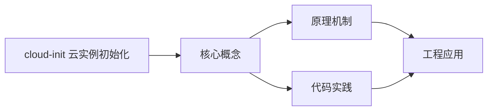
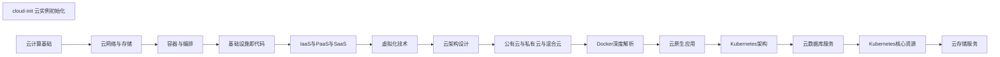

## 1. 学习目标（Bloom 分类）

本节按照布鲁姆教育目标分类学组织学习路径。本文主题为《cloud-init 云实例初始化》，属于 云计算 模块，读者可以根据自身阶段选择阅读深度。

记忆层面：能够准确复述本文的核心概念、术语与基本语法或操作步骤，并能够在提问或检索时快速定位对应知识点。能够说出 云计算 的核心概念、组件与标准流程。

理解层面：能够用自己的语言解释核心原理与工作机制，说明概念之间的因果关系，而不是机械记忆结论。能够解释 云计算 的工作原理与关键机制。

应用层面：能够在真实项目或练习场景中运用本文知识解决具体问题，写出正确且可维护的实现。能够执行 云计算 相关的标准操作与配置。

分析层面：能够拆解复杂问题，比较本文主题与相邻概念的异同，识别边界条件与例外情况。能够分析 云计算 方案在可靠性、成本与性能上的权衡。

评价层面：能够根据约束条件（性能、可读性、安全、成本）评价不同方案的优劣，做出有依据的技术决策。能够评价 云计算 中的技术选型。

创造层面：能够把本文知识与其他模块知识组合，设计出新的解决方案或可复用的工程模式。能够设计基于 云计算 的完整解决方案。

通过本节学习，读者应当能够把《cloud-init 云实例初始化》纳入自己的知识网络，并与 云计算 模块的其他主题（IaaS/PaaS/SaaS、虚拟化、云原生、成本治理）建立关联。

## 2. 历史动机与发展脉络

《cloud-init 云实例初始化》是 云计算 领域的重要主题。要真正理解它，需要先了解它解决的问题与演进过程。

云计算源于 1960 年代分时思想，2006 年 AWS 推出 EC2/S3 开启现代云服务时代；公有云（AWS/Azure/GCP/阿里云/华为云）与私有云、混合云并存。
服务模型：IaaS（虚拟机/存储/网络）、PaaS（托管运行时/数据库）、SaaS（应用即服务）；FaaS（函数即服务）进一步抽象。
云原生：容器、微服务、服务网格、声明式 API、不可变基础设施；CNCF 生态是云原生事实标准。

回到本文主题：cloud-init 云实例初始化 的提出与成熟，正是上述技术背景下的必然产物。早期实现往往以简单可用为目标，随着工程规模扩大，社区逐渐沉淀出标准做法与最佳实践；理解这一脉络，可以帮助读者判断“为什么文档中的推荐写法是现在这个样子”，也能在遇到历史遗留代码时准确识别其设计年代与取舍。


## 3. 形式化定义与核心概念精讲

本节把《cloud-init 云实例初始化》涉及的核心概念以“定义 + 讲解”的形式展开。读者应把定义当作工具，把讲解当作理解路径；两者结合才能形成可迁移的知识。

虚拟化：虚拟机（Hypervisor 硬件隔离）与容器（OS 级隔离）；虚拟化是弹性与多租户的基础。
核心服务：计算（EC2/ECS）、存储（对象/块/文件）、网络（VPC/负载均衡/CDN）、数据库（托管 RDS/NoSQL）。
弹性与计费：按需、预留、Spot；自动扩缩容（HPA/ASG）；FinOps 治理成本。

### 3.1 原文章节逐一精讲

原文档把主题拆分为 12 个小节，下面按顺序给出每一节的导读讲解，随后保留原文细节供精读。

#### 原文精读（完整保留）

# cloud-init 云实例初始化

> **符号约定**：`< >` 必填参数 | `[ ]` 可选参数

---

#### cloud-init 基础

**基本写法：查看版本**
`cloud-init --version`
```bash
# 查看 cloud-init 版本
cloud-init --version
```

---

**基本写法：查看 cloud-init 状态**
`cloud-init status`
```bash
# 查看实例初始化状态
cloud-init status
```

---

**基本写法：等待完成**
`cloud-init status --wait`
```bash
# 阻塞等待 cloud-init 完成
cloud-init status --wait
```

---

**基本写法：查看详细状态**
`cloud-init status --long`
```bash
# 显示详细 cloud-init 状态与错误信息
cloud-init status --long
```

---

**基本写法：查看 cloud-init 文档**
`cloud-init --help`
```bash
# 查看所有可用子命令
cloud-init --help
```

---

#### 用户数据配置

**基本写法：使用 cloud-config 格式**
```yaml
# user-data.yaml 用户数据脚本
#cloud-config
hostname: web-server
manage_etc_hosts: true
```

---

**基本写法：使用 shell 脚本**
```bash
#!/bin/bash
# user-data.sh 通过 shell 脚本初始化
set -e
apt-get update
apt-get install -y nginx
systemctl enable nginx
systemctl start nginx
```

---

**基本写法：包含文件**
```yaml
# 写入文件到实例
#cloud-config
write_files:
  - path: /etc/myapp/config.yaml
    content: |
      server:
        port: 8080
        host: 0.0.0.0
    owner: root:root
    permissions: '0644'
```

---

**基本写法：从 URL 下载文件**
```yaml
# 从远程 URL 下载配置文件
#cloud-config
write_files:
  - path: /etc/nginx/conf.d/default.conf
    encoding: b64
    content: <Base64 编码内容>
    defer: true
```

---

**基本写法：追加到文件**
```yaml
# 追加内容到已有文件
#cloud-config
write_files:
  - path: /etc/hosts
    content: |
      10.0.0.5  db.internal
      10.0.0.6  cache.internal
    append: true
```

---

#### 软件包管理

**基本写法：更新软件包**
```yaml
#cloud-config
package_update: true
package_upgrade: true
package_reboot_if_required: true
```

---

**基本写法：安装软件包**
```yaml
#cloud-config
packages:
  - nginx
  - git
  - htop
  - curl
package_update: true
```

---

**基本写法：指定软件源**
```yaml
#cloud-config
apt:
  sources:
    docker.list:
      source: "deb [arch=amd64] https://download.docker.com/linux/ubuntu focal stable"
      keyid: 9DC858229FC7DD38854AE2D88D81803C0EBFCD88
```

---

**基本写法：安装指定版本**
```yaml
#cloud-config
packages:
  - [nginx, 1.18.0-0ubuntu1]
package_update: true
```

---

**基本写法：安装 Snap 包**
```yaml
#cloud-config
snap:
  commands:
    - snap install --classic code
    - snap install go --channel 1.22/stable --classic
```

---

#### 用户与组管理

**基本写法：创建用户**
```yaml
#cloud-config
users:
  - name: deploy
    sudo: ALL=(ALL) NOPASSWD:ALL
    groups: sudo, docker
    shell: /bin/bash
    ssh_authorized_keys:
      - ssh-rsa AAAAB3NzaC1yc2E... user@example.com
```

---

**基本写法：默认用户配置 SSH key**
```yaml
#cloud-config
ssh_authorized_keys:
  - ssh-rsa AAAAB3NzaC1yc2E... admin@example.com
  - ssh-ed25519 AAAAC3NzaC1lZDI1... deploy@example.com
```

---

**基本写法：禁用密码登录**
```yaml
#cloud-config
ssh_pwauth: false
disable_root: true
```

---

**基本写法：设置用户密码**
```yaml
#cloud-config
chpasswd:
  list: |
    deploy:MyStrongPass123!
  expire: false
```

---

**基本写法：移除默认用户**
```yaml
#cloud-config
users:
  - default
  - name: myuser
    groups: sudo
    shell: /bin/bash
    sudo: ALL=(ALL) NOPASSWD:ALL
    lock_passwd: false
```

---

#### 命令执行

**基本写法：运行命令**
```yaml
#cloud-config
runcmd:
  - mkdir -p /data/app
  - chown -R deploy:deploy /data
  - systemctl restart nginx
```

---

**基本写法：执行多行脚本**
```yaml
#cloud-config
runcmd:
  - |
    #!/bin/bash
    set -e
    curl -fsSL https://get.docker.com -o get-docker.sh
    sh get-docker.sh
    systemctl enable docker
    systemctl start docker
```

---

**基本写法：bootcmd 启动命令**
```yaml
#cloud-config
bootcmd:
  - echo "Boot at $(date)" >> /var/log/boot.log
  - mkdir -p /mnt/data
```

---

**基本写法：使用模块顺序**
```yaml
#cloud-config
cloud_final_modules:
  - package-update-upgrade-install
  - puppet
  - chef
  - mcollective
  - salt-minion
  - reset_rmc
  - refresh_rmc_and_interface
  - rightscale_userdata
  - scripts-vendor
  - scripts-per-once
  - scripts-per-boot
  - scripts-per-instance
  - scripts-user
  - ssh-authkey-fingerprints
  - keys-to-console
  - install-hotplug
  - phone-home
  - final-message
  - power-state-change
```

---

#### 磁盘与挂载

**基本写法：挂载磁盘**
```yaml
#cloud-config
mounts:
  - [ /dev/vdb, /data, ext4, "defaults,noatime", "0", "2" ]
  - [ /dev/vdc, /backup, xfs, "defaults", "0", "0" ]
```

---

**基本写法：格式化磁盘**
```yaml
#cloud-config
disk_setup:
  /dev/vdb:
    table_type: gpt
    layout: true
    overwrite: false
fs_setup:
  - device: /dev/vdb
    filesystem: ext4
    label: data
```

---

**基本写法：创建 RAID**
```yaml
#cloud-config
disk_setup:
  md0:
    table_type: mbr
    layout: [ /dev/vdb, /dev/vdc ]
    overwrite: true
raidd:
  md0:
    devices:
      - /dev/vdb
      - /dev/vdc
    level: 1
    metadata: 1.2
    name: md0
```

---

**基本写法：调整 LVM**
```yaml
#cloud-config
lvm:
  lvmdisk:
    type: lvm
    devices:
      - /dev/vdb
  lvms:
    - name: data
      vg: lvmdisk
      size: 100G
```

---

**基本写法：fstab 配置**
```yaml
#cloud-config
mounts:
  - [ /dev/vdb, /data, ext4, "defaults,noatime,nofail", "0", "2" ]
  - [ /dev/vdc, /logs, xfs, "defaults,nofail", "0", "0" ]
  - [ tmpfs, /tmp, tmpfs, "defaults,size=2G", "0", "0" ]
```

---

#### 网络配置

**基本写法：配置静态 IP**
```yaml
#cloud-config
version: 2
ethernets:
  eth0:
    addresses:
      - 10.0.1.100/24
    gateway4: 10.0.1.1
    nameservers:
      addresses: [8.8.8.8, 1.1.1.1]
    routes:
      - to: 10.0.0.0/16
        via: 10.0.1.1
```

---

**基本写法：配置 DHCP**
```yaml
#cloud-config
version: 2
ethernets:
  eth0:
    dhcp4: true
    dhcp6: true
```

---

**基本写法：多网卡配置**
```yaml
#cloud-config
version: 2
ethernets:
  eth0:
    addresses: [10.0.1.100/24]
    gateway4: 10.0.1.1
  eth1:
    addresses: [192.168.1.50/24]
    routes:
      - to: 192.168.0.0/16
        via: 192.168.1.1
```

---

**基本写法：配置 Bonding**
```yaml
#cloud-config
version: 2
bonds:
  bond0:
    interfaces: [eth0, eth1]
    parameters:
      mode: 802.3ad
      lacp-rate: fast
      transmit-hash-policy: layer3+4
    addresses: [10.0.1.100/24]
    gateway4: 10.0.1.1
```

---

**基本写法：配置 VLAN**
```yaml
#cloud-config
version: 2
vlans:
  vlan100:
    id: 100
    link: eth0
    addresses: [10.100.0.10/24]
  vlan200:
    id: 200
    link: eth0
    addresses: [10.200.0.10/24]
```

---

#### 服务管理

**基本写法：启用服务**
```yaml
#cloud-config
runcmd:
  - systemctl enable nginx
  - systemctl enable docker
  - systemctl enable redis
```

---

**基本写法：自定义服务**
```yaml
#cloud-config
write_files:
  - path: /etc/systemd/system/myapp.service
    content: |
      [Unit]
      Description=My Application
      After=network.target
      [Service]
      Type=simple
      User=deploy
      ExecStart=/opt/myapp/app
      Restart=always
      [Install]
      WantedBy=multi-user.target
runcmd:
  - systemctl daemon-reload
  - systemctl enable myapp
  - systemctl start myapp
```

---

**基本写法：启动时延迟启动**
```yaml
#cloud-config
bootcmd:
  - sleep 30 && systemctl restart myapp &
```

---

#### 模块与日志

**基本写法：查看日志**
`sudo cat /var/log/cloud-init.log`
```bash
# 查看 cloud-init 详细日志
sudo cat /var/log/cloud-init.log | less
```

---

**基本写法：查看输出日志**
`sudo cat /var/log/cloud-init-output.log`
```bash
# 查看 cloud-init 执行输出
sudo tail -n 100 /var/log/cloud-init-output.log
```

---

**基本写法：清理 cloud-init 状态**
`sudo cloud-init clean`
```bash
# 清理 cloud-init 状态便于重新运行
sudo cloud-init clean
```

---

**基本写法：清理并重启**
`sudo cloud-init clean --logs --reboot`
```bash
# 清理日志并重启重新初始化
sudo cloud-init clean --logs --reboot
```

---

**基本写法：单模块运行**
`sudo cloud-init modules --mode=<模式> [--name=<模块>]`
```bash
# 单独运行指定模块
sudo cloud-init modules --mode=final --name=final-message
```

---

#### 调试与分析

**基本写法：查询实例元数据**
`curl http://169.254.169.254/latest/meta-data/`
```bash
# 查询 AWS EC2 元数据
curl -s http://169.254.169.254/latest/meta-data/instance-id
```

---

**基本写法：查询用户数据**
`curl http://169.254.169.254/latest/user-data`
```bash
# 查看实例启动时传入的用户数据
curl -s http://169.254.169.254/latest/user-data
```

---

**基本写法：分析 cloud-init 阶段**
`cloud-init analyze show`
```bash
# 显示各阶段耗时
cloud-init analyze show -i /var/log/cloud-init.log
```

---

**基本写法：生成时间报告**
`cloud-init analyze dump`
```bash
# 输出时间分析 JSON
cloud-init analyze dump -i /var/log/cloud-init.log > timing.json
```

---

**基本写法：验证 user-data**
`cloud-init schema --config-file <文件>`
```bash
# 验证 user-data 配置正确性
cloud-init schema --config-file user-data.yaml
```

---

#### 云平台集成

**基本写法：AWS EC2 启动模板**
```bash
# 通过 AWS CLI 创建带 user-data 的启动模板
aws ec2 create-launch-template \
  --launch-template-name my-template \
  --launch-template-data '{
    "ImageId": "ami-0c55b159cbfafe1f0",
    "InstanceType": "t3.micro",
    "UserData": "'"$(base64 -w 0 user-data.sh)"'"
  }'
```

---

**基本写法：Azure VM 自定义数据**
```bash
# 通过 Azure CLI 创建 VM 时传入 cloud-init
az vm create \
  --name my-vm \
  --resource-group my-rg \
  --image Ubuntu2204 \
  --custom-data @cloud-init.yaml \
  --admin-username azureuser
```

---

**基本写法：GCP GCE 启动脚本**
```bash
# 通过 gcloud 创建 GCE 实例并传入 cloud-init
gcloud compute instances create my-instance \
  --zone=us-central1-a \
  --image-family=ubuntu-2204-lts \
  --image-project=ubuntu-os-cloud \
  --metadata-from-file user-data=cloud-init.yaml
```

---

**基本写法：OpenStack 创建实例**
```bash
# OpenStack 使用 cloud-init
openstack server create \
  --flavor m1.medium \
  --image ubuntu-22.04 \
  --user-data cloud-init.yaml \
  my-instance
```

---

**基本写法：Vagrant 集成**
```ruby
# Vagrantfile 使用 cloud-init
Vagrant.configure("2") do |config|
  config.vm.box = "ubuntu/jammy64"
  config.vm.provider "virtualbox" do |vb|
    vb.memory = 2048
  end
  config.vm.provision "file", source: "./cloud-init.yaml", destination: "/tmp/cloud-init.yaml"
  config.vm.provision "shell", inline: "cloud-init --file /tmp/cloud-init.yaml init"
end
```

---

#### 高级应用

**基本写法：Power State 控制**
```yaml
#cloud-config
power_state:
  mode: reboot
  message: "Rebooting after cloud-init"
  timeout: 30
  condition: True
```

---

**基本写法：Phone Home 通知**
```yaml
#cloud-config
phone_home:
  url: http://config.example.com/register
  post: [ instance_id, hostname, fqdn ]
  tries: 10
```

---

**基本写法：设置时区**
```yaml
#cloud-config
timezone: Asia/Shanghai
locale: zh_CN.UTF-8
```

---

**基本写法：NTP 配置**
```yaml
#cloud-config
ntp:
  enabled: true
  ntp_client: chrony
  servers:
    - ntp.aliyun.com
    - cn.pool.ntp.org
  pools:
    - 0.cn.pool.ntp.org
```

---

**基本写法：指定数据源**
```yaml
#cloud-config
datasource_list:
  - Ec2
  - Azure
  - GCE
  - OpenStack
  - NoCloud
  - ConfigDrive
datasource:
  Ec2:
    timeout: 30
    max_wait: 120
```


### 3.2 概念关系图

下面用 Mermaid 图表达本文核心概念之间的关系，帮助读者建立整体图景：



图中展示的是本文知识的结构化关系：核心概念是入口，原理机制解释“为什么”，代码实践演示“怎么做”，工程应用回答“何时用”。读者学习时可以把每个小节的内容挂接到对应节点上。

## 4. 理论推导与原理解析

本节深入《cloud-init 云实例初始化》背后的原理。理论部分不求面面俱到，而是聚焦“能解释现象、能指导实践”的关键推导。

虚拟化：虚拟机（Hypervisor 硬件隔离）与容器（OS 级隔离）；虚拟化是弹性与多租户的基础。
核心服务：计算（EC2/ECS）、存储（对象/块/文件）、网络（VPC/负载均衡/CDN）、数据库（托管 RDS/NoSQL）。
弹性与计费：按需、预留、Spot；自动扩缩容（HPA/ASG）；FinOps 治理成本。
高可用设计：多可用区、故障域、跨区域容灾；RPO/RTO 目标驱动方案。

需要强调的是，理论推导与工程实践之间存在翻译层：理论给出的是理想化模型与边界条件，工程代码则必须处理真实环境中的例外。读者在学习时应先掌握理论的“标准情形”，再通过陷阱章节了解“非标准情形”。

## 5. 代码示例与逐行讲解

本节把原文中的代码示例系统整理，并为每个示例补充用途说明与讲解。读者不应只浏览代码，而应逐段对照讲解理解设计意图。

### 5.1 示例：cloud-init 基础

该示例来自原文《cloud-init 基础》小节，用于演示cloud-init 云实例初始化相关操作。阅读时请先看代码结构，再看其后的讲解。

```bash
# 查看 cloud-init 版本
cloud-init --version
```

讲解：这段代码演示了本节核心知识点。代码中的关键操作可以归纳为三步：准备（定义或初始化）、执行（核心逻辑）、收尾（释放资源或返回结果）。实际项目中，这三步往往被封装为函数或类，以提升复用性与可测试性。

关键点分析：

该示例共 2 行有效代码，结构以数据或配置为主。阅读时应关注：数据字段的含义、配置项的作用，以及它们与运行行为的对应关系。

进阶思考路径：先尝试修改参数观察行为变化，再把示例中的模式迁移到自己的项目中；每次修改都记录预期与实测差异，这是把示例转化为能力的最快方式。

### 5.2 示例：cloud-init 基础

该示例来自原文《cloud-init 基础》小节，用于演示cloud-init 云实例初始化相关操作。阅读时请先看代码结构，再看其后的讲解。

```bash
# 查看实例初始化状态
cloud-init status
```

讲解：这段代码演示了本节核心知识点。代码中的关键操作可以归纳为三步：准备（定义或初始化）、执行（核心逻辑）、收尾（释放资源或返回结果）。实际项目中，这三步往往被封装为函数或类，以提升复用性与可测试性。

关键点分析：

该示例共 2 行有效代码，结构以数据或配置为主。阅读时应关注：数据字段的含义、配置项的作用，以及它们与运行行为的对应关系。

进阶思考路径：先尝试修改参数观察行为变化，再把示例中的模式迁移到自己的项目中；每次修改都记录预期与实测差异，这是把示例转化为能力的最快方式。

### 5.3 示例：cloud-init 基础

该示例来自原文《cloud-init 基础》小节，用于演示cloud-init 云实例初始化相关操作。阅读时请先看代码结构，再看其后的讲解。

```bash
# 阻塞等待 cloud-init 完成
cloud-init status --wait
```

讲解：这段代码演示了本节核心知识点。代码中的关键操作可以归纳为三步：准备（定义或初始化）、执行（核心逻辑）、收尾（释放资源或返回结果）。实际项目中，这三步往往被封装为函数或类，以提升复用性与可测试性。

关键点分析：

该示例共 2 行有效代码，结构以数据或配置为主。阅读时应关注：数据字段的含义、配置项的作用，以及它们与运行行为的对应关系。

进阶思考路径：先尝试修改参数观察行为变化，再把示例中的模式迁移到自己的项目中；每次修改都记录预期与实测差异，这是把示例转化为能力的最快方式。

### 5.4 示例：cloud-init 基础

该示例来自原文《cloud-init 基础》小节，用于演示cloud-init 云实例初始化相关操作。阅读时请先看代码结构，再看其后的讲解。

```bash
# 显示详细 cloud-init 状态与错误信息
cloud-init status --long
```

讲解：这段代码演示了本节核心知识点。代码中的关键操作可以归纳为三步：准备（定义或初始化）、执行（核心逻辑）、收尾（释放资源或返回结果）。实际项目中，这三步往往被封装为函数或类，以提升复用性与可测试性。

关键点分析：

该示例共 2 行有效代码，结构以数据或配置为主。阅读时应关注：数据字段的含义、配置项的作用，以及它们与运行行为的对应关系。

进阶思考路径：先尝试修改参数观察行为变化，再把示例中的模式迁移到自己的项目中；每次修改都记录预期与实测差异，这是把示例转化为能力的最快方式。

### 5.5 示例：cloud-init 基础

该示例来自原文《cloud-init 基础》小节，用于演示cloud-init 云实例初始化相关操作。阅读时请先看代码结构，再看其后的讲解。

```bash
# 查看所有可用子命令
cloud-init --help
```

讲解：这段代码演示了本节核心知识点。代码中的关键操作可以归纳为三步：准备（定义或初始化）、执行（核心逻辑）、收尾（释放资源或返回结果）。实际项目中，这三步往往被封装为函数或类，以提升复用性与可测试性。

关键点分析：

该示例共 2 行有效代码，结构以数据或配置为主。阅读时应关注：数据字段的含义、配置项的作用，以及它们与运行行为的对应关系。

进阶思考路径：先尝试修改参数观察行为变化，再把示例中的模式迁移到自己的项目中；每次修改都记录预期与实测差异，这是把示例转化为能力的最快方式。

### 5.6 示例：用户数据配置

该示例来自原文《用户数据配置》小节，用于演示cloud-init 云实例初始化相关操作。阅读时请先看代码结构，再看其后的讲解。

```yaml
# user-data.yaml 用户数据脚本
#cloud-config
hostname: web-server
manage_etc_hosts: true
```

讲解：这段代码演示了本节核心知识点。代码中的关键操作可以归纳为三步：准备（定义或初始化）、执行（核心逻辑）、收尾（释放资源或返回结果）。实际项目中，这三步往往被封装为函数或类，以提升复用性与可测试性。

关键点分析：

该示例共 4 行有效代码，结构以数据或配置为主。阅读时应关注：数据字段的含义、配置项的作用，以及它们与运行行为的对应关系。

进阶思考路径：先尝试修改参数观察行为变化，再把示例中的模式迁移到自己的项目中；每次修改都记录预期与实测差异，这是把示例转化为能力的最快方式。

### 5.7 示例：用户数据配置

该示例来自原文《用户数据配置》小节，用于演示cloud-init 云实例初始化相关操作。阅读时请先看代码结构，再看其后的讲解。

```bash
#!/bin/bash
# user-data.sh 通过 shell 脚本初始化
set -e
apt-get update
apt-get install -y nginx
systemctl enable nginx
systemctl start nginx
```

讲解：这段代码演示了本节核心知识点。代码中的关键操作可以归纳为三步：准备（定义或初始化）、执行（核心逻辑）、收尾（释放资源或返回结果）。实际项目中，这三步往往被封装为函数或类，以提升复用性与可测试性。

关键点分析：

该示例共 7 行有效代码，结构以数据或配置为主。阅读时应关注：数据字段的含义、配置项的作用，以及它们与运行行为的对应关系。

进阶思考路径：先尝试修改参数观察行为变化，再把示例中的模式迁移到自己的项目中；每次修改都记录预期与实测差异，这是把示例转化为能力的最快方式。

### 5.8 示例：用户数据配置

该示例来自原文《用户数据配置》小节，用于演示cloud-init 云实例初始化相关操作。阅读时请先看代码结构，再看其后的讲解。

```yaml
# 写入文件到实例
#cloud-config
write_files:
  - path: /etc/myapp/config.yaml
    content: |
      server:
        port: 8080
        host: 0.0.0.0
    owner: root:root
    permissions: '0644'
```

讲解：这段代码演示了本节核心知识点。代码中的关键操作可以归纳为三步：准备（定义或初始化）、执行（核心逻辑）、收尾（释放资源或返回结果）。实际项目中，这三步往往被封装为函数或类，以提升复用性与可测试性。

关键点分析：

该示例共 10 行有效代码，结构以数据或配置为主。阅读时应关注：数据字段的含义、配置项的作用，以及它们与运行行为的对应关系。

进阶思考路径：先尝试修改参数观察行为变化，再把示例中的模式迁移到自己的项目中；每次修改都记录预期与实测差异，这是把示例转化为能力的最快方式。

### 5.9 示例：用户数据配置

该示例来自原文《用户数据配置》小节，用于演示cloud-init 云实例初始化相关操作。阅读时请先看代码结构，再看其后的讲解。

```yaml
# 从远程 URL 下载配置文件
#cloud-config
write_files:
  - path: /etc/nginx/conf.d/default.conf
    encoding: b64
    content: <Base64 编码内容>
    defer: true
```

讲解：这段代码演示了本节核心知识点。代码中的关键操作可以归纳为三步：准备（定义或初始化）、执行（核心逻辑）、收尾（释放资源或返回结果）。实际项目中，这三步往往被封装为函数或类，以提升复用性与可测试性。

关键点分析：

该示例共 7 行有效代码，结构以数据或配置为主。阅读时应关注：数据字段的含义、配置项的作用，以及它们与运行行为的对应关系。

进阶思考路径：先尝试修改参数观察行为变化，再把示例中的模式迁移到自己的项目中；每次修改都记录预期与实测差异，这是把示例转化为能力的最快方式。

### 5.10 示例：用户数据配置

该示例来自原文《用户数据配置》小节，用于演示cloud-init 云实例初始化相关操作。阅读时请先看代码结构，再看其后的讲解。

```yaml
# 追加内容到已有文件
#cloud-config
write_files:
  - path: /etc/hosts
    content: |
      10.0.0.5  db.internal
      10.0.0.6  cache.internal
    append: true
```

讲解：这段代码演示了本节核心知识点。代码中的关键操作可以归纳为三步：准备（定义或初始化）、执行（核心逻辑）、收尾（释放资源或返回结果）。实际项目中，这三步往往被封装为函数或类，以提升复用性与可测试性。

关键点分析：

该示例共 8 行有效代码，结构以数据或配置为主。阅读时应关注：数据字段的含义、配置项的作用，以及它们与运行行为的对应关系。

进阶思考路径：先尝试修改参数观察行为变化，再把示例中的模式迁移到自己的项目中；每次修改都记录预期与实测差异，这是把示例转化为能力的最快方式。

### 5.11 示例：软件包管理

该示例来自原文《软件包管理》小节，用于演示cloud-init 云实例初始化相关操作。阅读时请先看代码结构，再看其后的讲解。

```yaml
#cloud-config
package_update: true
package_upgrade: true
package_reboot_if_required: true
```

讲解：这段代码演示了本节核心知识点。代码中的关键操作可以归纳为三步：准备（定义或初始化）、执行（核心逻辑）、收尾（释放资源或返回结果）。实际项目中，这三步往往被封装为函数或类，以提升复用性与可测试性。

关键点分析：

该示例共 4 行有效代码，结构以数据或配置为主。阅读时应关注：数据字段的含义、配置项的作用，以及它们与运行行为的对应关系。

进阶思考路径：先尝试修改参数观察行为变化，再把示例中的模式迁移到自己的项目中；每次修改都记录预期与实测差异，这是把示例转化为能力的最快方式。

### 5.12 示例：软件包管理

该示例来自原文《软件包管理》小节，用于演示cloud-init 云实例初始化相关操作。阅读时请先看代码结构，再看其后的讲解。

```yaml
#cloud-config
packages:
  - nginx
  - git
  - htop
  - curl
package_update: true
```

讲解：这段代码演示了本节核心知识点。代码中的关键操作可以归纳为三步：准备（定义或初始化）、执行（核心逻辑）、收尾（释放资源或返回结果）。实际项目中，这三步往往被封装为函数或类，以提升复用性与可测试性。

关键点分析：

该示例共 7 行有效代码，结构以数据或配置为主。阅读时应关注：数据字段的含义、配置项的作用，以及它们与运行行为的对应关系。

进阶思考路径：先尝试修改参数观察行为变化，再把示例中的模式迁移到自己的项目中；每次修改都记录预期与实测差异，这是把示例转化为能力的最快方式。

### 5.13 示例：软件包管理

该示例来自原文《软件包管理》小节，用于演示cloud-init 云实例初始化相关操作。阅读时请先看代码结构，再看其后的讲解。

```yaml
#cloud-config
apt:
  sources:
    docker.list:
      source: "deb [arch=amd64] https://download.docker.com/linux/ubuntu focal stable"
      keyid: 9DC858229FC7DD38854AE2D88D81803C0EBFCD88
```

讲解：这段代码演示了本节核心知识点。代码中的关键操作可以归纳为三步：准备（定义或初始化）、执行（核心逻辑）、收尾（释放资源或返回结果）。实际项目中，这三步往往被封装为函数或类，以提升复用性与可测试性。

关键点分析：

该示例共 6 行有效代码，结构以数据或配置为主。阅读时应关注：数据字段的含义、配置项的作用，以及它们与运行行为的对应关系。

进阶思考路径：先尝试修改参数观察行为变化，再把示例中的模式迁移到自己的项目中；每次修改都记录预期与实测差异，这是把示例转化为能力的最快方式。

### 5.14 示例：软件包管理

该示例来自原文《软件包管理》小节，用于演示cloud-init 云实例初始化相关操作。阅读时请先看代码结构，再看其后的讲解。

```yaml
#cloud-config
packages:
  - [nginx, 1.18.0-0ubuntu1]
package_update: true
```

讲解：这段代码演示了本节核心知识点。代码中的关键操作可以归纳为三步：准备（定义或初始化）、执行（核心逻辑）、收尾（释放资源或返回结果）。实际项目中，这三步往往被封装为函数或类，以提升复用性与可测试性。

关键点分析：

该示例共 4 行有效代码，结构以数据或配置为主。阅读时应关注：数据字段的含义、配置项的作用，以及它们与运行行为的对应关系。

进阶思考路径：先尝试修改参数观察行为变化，再把示例中的模式迁移到自己的项目中；每次修改都记录预期与实测差异，这是把示例转化为能力的最快方式。

### 5.15 示例：软件包管理

该示例来自原文《软件包管理》小节，用于演示cloud-init 云实例初始化相关操作。阅读时请先看代码结构，再看其后的讲解。

```yaml
#cloud-config
snap:
  commands:
    - snap install --classic code
    - snap install go --channel 1.22/stable --classic
```

讲解：这段代码演示了本节核心知识点。代码中的关键操作可以归纳为三步：准备（定义或初始化）、执行（核心逻辑）、收尾（释放资源或返回结果）。实际项目中，这三步往往被封装为函数或类，以提升复用性与可测试性。

关键点分析：

该示例共 5 行有效代码，包含 1 类关键结构（class）。其中：

- 入口与初始化部分负责建立上下文，对应实际项目中的启动或装配逻辑；
- 核心逻辑部分体现本文主题的主要操作，是阅读时最需要对照讲解理解的部分；
- 输出或返回部分把结果交给调用方，注意其类型与边界条件。

进阶思考路径：先尝试修改参数观察行为变化，再把示例中的模式迁移到自己的项目中；每次修改都记录预期与实测差异，这是把示例转化为能力的最快方式。

### 5.16 示例：用户与组管理

该示例来自原文《用户与组管理》小节，用于演示cloud-init 云实例初始化相关操作。阅读时请先看代码结构，再看其后的讲解。

```yaml
#cloud-config
users:
  - name: deploy
    sudo: ALL=(ALL) NOPASSWD:ALL
    groups: sudo, docker
    shell: /bin/bash
    ssh_authorized_keys:
      - ssh-rsa AAAAB3NzaC1yc2E... user@example.com
```

讲解：这段代码演示了本节核心知识点。代码中的关键操作可以归纳为三步：准备（定义或初始化）、执行（核心逻辑）、收尾（释放资源或返回结果）。实际项目中，这三步往往被封装为函数或类，以提升复用性与可测试性。

关键点分析：

该示例共 8 行有效代码，结构以数据或配置为主。阅读时应关注：数据字段的含义、配置项的作用，以及它们与运行行为的对应关系。

进阶思考路径：先尝试修改参数观察行为变化，再把示例中的模式迁移到自己的项目中；每次修改都记录预期与实测差异，这是把示例转化为能力的最快方式。

### 5.17 示例：用户与组管理

该示例来自原文《用户与组管理》小节，用于演示cloud-init 云实例初始化相关操作。阅读时请先看代码结构，再看其后的讲解。

```yaml
#cloud-config
ssh_authorized_keys:
  - ssh-rsa AAAAB3NzaC1yc2E... admin@example.com
  - ssh-ed25519 AAAAC3NzaC1lZDI1... deploy@example.com
```

讲解：这段代码演示了本节核心知识点。代码中的关键操作可以归纳为三步：准备（定义或初始化）、执行（核心逻辑）、收尾（释放资源或返回结果）。实际项目中，这三步往往被封装为函数或类，以提升复用性与可测试性。

关键点分析：

该示例共 4 行有效代码，结构以数据或配置为主。阅读时应关注：数据字段的含义、配置项的作用，以及它们与运行行为的对应关系。

进阶思考路径：先尝试修改参数观察行为变化，再把示例中的模式迁移到自己的项目中；每次修改都记录预期与实测差异，这是把示例转化为能力的最快方式。

### 5.18 示例：用户与组管理

该示例来自原文《用户与组管理》小节，用于演示cloud-init 云实例初始化相关操作。阅读时请先看代码结构，再看其后的讲解。

```yaml
#cloud-config
ssh_pwauth: false
disable_root: true
```

讲解：这段代码演示了本节核心知识点。代码中的关键操作可以归纳为三步：准备（定义或初始化）、执行（核心逻辑）、收尾（释放资源或返回结果）。实际项目中，这三步往往被封装为函数或类，以提升复用性与可测试性。

关键点分析：

该示例共 3 行有效代码，结构以数据或配置为主。阅读时应关注：数据字段的含义、配置项的作用，以及它们与运行行为的对应关系。

进阶思考路径：先尝试修改参数观察行为变化，再把示例中的模式迁移到自己的项目中；每次修改都记录预期与实测差异，这是把示例转化为能力的最快方式。

### 5.19 示例：用户与组管理

该示例来自原文《用户与组管理》小节，用于演示cloud-init 云实例初始化相关操作。阅读时请先看代码结构，再看其后的讲解。

```yaml
#cloud-config
chpasswd:
  list: |
    deploy:MyStrongPass123!
  expire: false
```

讲解：这段代码演示了本节核心知识点。代码中的关键操作可以归纳为三步：准备（定义或初始化）、执行（核心逻辑）、收尾（释放资源或返回结果）。实际项目中，这三步往往被封装为函数或类，以提升复用性与可测试性。

关键点分析：

该示例共 5 行有效代码，结构以数据或配置为主。阅读时应关注：数据字段的含义、配置项的作用，以及它们与运行行为的对应关系。

进阶思考路径：先尝试修改参数观察行为变化，再把示例中的模式迁移到自己的项目中；每次修改都记录预期与实测差异，这是把示例转化为能力的最快方式。

### 5.20 示例：用户与组管理

该示例来自原文《用户与组管理》小节，用于演示cloud-init 云实例初始化相关操作。阅读时请先看代码结构，再看其后的讲解。

```yaml
#cloud-config
users:
  - default
  - name: myuser
    groups: sudo
    shell: /bin/bash
    sudo: ALL=(ALL) NOPASSWD:ALL
    lock_passwd: false
```

讲解：这段代码演示了本节核心知识点。代码中的关键操作可以归纳为三步：准备（定义或初始化）、执行（核心逻辑）、收尾（释放资源或返回结果）。实际项目中，这三步往往被封装为函数或类，以提升复用性与可测试性。

关键点分析：

该示例共 8 行有效代码，结构以数据或配置为主。阅读时应关注：数据字段的含义、配置项的作用，以及它们与运行行为的对应关系。

进阶思考路径：先尝试修改参数观察行为变化，再把示例中的模式迁移到自己的项目中；每次修改都记录预期与实测差异，这是把示例转化为能力的最快方式。

### 5.21 示例：命令执行

该示例来自原文《命令执行》小节，用于演示cloud-init 云实例初始化相关操作。阅读时请先看代码结构，再看其后的讲解。

```yaml
#cloud-config
runcmd:
  - mkdir -p /data/app
  - chown -R deploy:deploy /data
  - systemctl restart nginx
```

讲解：这段代码演示了本节核心知识点。代码中的关键操作可以归纳为三步：准备（定义或初始化）、执行（核心逻辑）、收尾（释放资源或返回结果）。实际项目中，这三步往往被封装为函数或类，以提升复用性与可测试性。

关键点分析：

该示例共 5 行有效代码，结构以数据或配置为主。阅读时应关注：数据字段的含义、配置项的作用，以及它们与运行行为的对应关系。

进阶思考路径：先尝试修改参数观察行为变化，再把示例中的模式迁移到自己的项目中；每次修改都记录预期与实测差异，这是把示例转化为能力的最快方式。

### 5.22 示例：命令执行

该示例来自原文《命令执行》小节，用于演示cloud-init 云实例初始化相关操作。阅读时请先看代码结构，再看其后的讲解。

```yaml
#cloud-config
runcmd:
  - |
    #!/bin/bash
    set -e
    curl -fsSL https://get.docker.com -o get-docker.sh
    sh get-docker.sh
    systemctl enable docker
    systemctl start docker
```

讲解：这段代码演示了本节核心知识点。代码中的关键操作可以归纳为三步：准备（定义或初始化）、执行（核心逻辑）、收尾（释放资源或返回结果）。实际项目中，这三步往往被封装为函数或类，以提升复用性与可测试性。

关键点分析：

该示例共 9 行有效代码，结构以数据或配置为主。阅读时应关注：数据字段的含义、配置项的作用，以及它们与运行行为的对应关系。

进阶思考路径：先尝试修改参数观察行为变化，再把示例中的模式迁移到自己的项目中；每次修改都记录预期与实测差异，这是把示例转化为能力的最快方式。

### 5.23 示例：命令执行

该示例来自原文《命令执行》小节，用于演示cloud-init 云实例初始化相关操作。阅读时请先看代码结构，再看其后的讲解。

```yaml
#cloud-config
bootcmd:
  - echo "Boot at $(date)" >> /var/log/boot.log
  - mkdir -p /mnt/data
```

讲解：这段代码演示了本节核心知识点。代码中的关键操作可以归纳为三步：准备（定义或初始化）、执行（核心逻辑）、收尾（释放资源或返回结果）。实际项目中，这三步往往被封装为函数或类，以提升复用性与可测试性。

关键点分析：

该示例共 4 行有效代码，结构以数据或配置为主。阅读时应关注：数据字段的含义、配置项的作用，以及它们与运行行为的对应关系。

进阶思考路径：先尝试修改参数观察行为变化，再把示例中的模式迁移到自己的项目中；每次修改都记录预期与实测差异，这是把示例转化为能力的最快方式。

### 5.24 示例：命令执行

该示例来自原文《命令执行》小节，用于演示cloud-init 云实例初始化相关操作。阅读时请先看代码结构，再看其后的讲解。

```yaml
#cloud-config
cloud_final_modules:
  - package-update-upgrade-install
  - puppet
  - chef
  - mcollective
  - salt-minion
  - reset_rmc
  - refresh_rmc_and_interface
  - rightscale_userdata
  - scripts-vendor
  - scripts-per-once
  - scripts-per-boot
  - scripts-per-instance
  - scripts-user
  - ssh-authkey-fingerprints
  - keys-to-console
  - install-hotplug
  - phone-home
  - final-message
  - power-state-change
```

讲解：这段代码演示了本节核心知识点。代码中的关键操作可以归纳为三步：准备（定义或初始化）、执行（核心逻辑）、收尾（释放资源或返回结果）。实际项目中，这三步往往被封装为函数或类，以提升复用性与可测试性。

关键点分析：

该示例共 21 行有效代码，结构以数据或配置为主。阅读时应关注：数据字段的含义、配置项的作用，以及它们与运行行为的对应关系。

进阶思考路径：先尝试修改参数观察行为变化，再把示例中的模式迁移到自己的项目中；每次修改都记录预期与实测差异，这是把示例转化为能力的最快方式。

### 5.25 示例：磁盘与挂载

该示例来自原文《磁盘与挂载》小节，用于演示cloud-init 云实例初始化相关操作。阅读时请先看代码结构，再看其后的讲解。

```yaml
#cloud-config
mounts:
  - [ /dev/vdb, /data, ext4, "defaults,noatime", "0", "2" ]
  - [ /dev/vdc, /backup, xfs, "defaults", "0", "0" ]
```

讲解：这段代码演示了本节核心知识点。代码中的关键操作可以归纳为三步：准备（定义或初始化）、执行（核心逻辑）、收尾（释放资源或返回结果）。实际项目中，这三步往往被封装为函数或类，以提升复用性与可测试性。

关键点分析：

该示例共 4 行有效代码，结构以数据或配置为主。阅读时应关注：数据字段的含义、配置项的作用，以及它们与运行行为的对应关系。

进阶思考路径：先尝试修改参数观察行为变化，再把示例中的模式迁移到自己的项目中；每次修改都记录预期与实测差异，这是把示例转化为能力的最快方式。

### 5.26 示例：磁盘与挂载

该示例来自原文《磁盘与挂载》小节，用于演示cloud-init 云实例初始化相关操作。阅读时请先看代码结构，再看其后的讲解。

```yaml
#cloud-config
disk_setup:
  /dev/vdb:
    table_type: gpt
    layout: true
    overwrite: false
fs_setup:
  - device: /dev/vdb
    filesystem: ext4
    label: data
```

讲解：这段代码演示了本节核心知识点。代码中的关键操作可以归纳为三步：准备（定义或初始化）、执行（核心逻辑）、收尾（释放资源或返回结果）。实际项目中，这三步往往被封装为函数或类，以提升复用性与可测试性。

关键点分析：

该示例共 10 行有效代码，结构以数据或配置为主。阅读时应关注：数据字段的含义、配置项的作用，以及它们与运行行为的对应关系。

进阶思考路径：先尝试修改参数观察行为变化，再把示例中的模式迁移到自己的项目中；每次修改都记录预期与实测差异，这是把示例转化为能力的最快方式。

### 5.27 示例：磁盘与挂载

该示例来自原文《磁盘与挂载》小节，用于演示cloud-init 云实例初始化相关操作。阅读时请先看代码结构，再看其后的讲解。

```yaml
#cloud-config
disk_setup:
  md0:
    table_type: mbr
    layout: [ /dev/vdb, /dev/vdc ]
    overwrite: true
raidd:
  md0:
    devices:
      - /dev/vdb
      - /dev/vdc
    level: 1
    metadata: 1.2
    name: md0
```

讲解：这段代码演示了本节核心知识点。代码中的关键操作可以归纳为三步：准备（定义或初始化）、执行（核心逻辑）、收尾（释放资源或返回结果）。实际项目中，这三步往往被封装为函数或类，以提升复用性与可测试性。

关键点分析：

该示例共 14 行有效代码，结构以数据或配置为主。阅读时应关注：数据字段的含义、配置项的作用，以及它们与运行行为的对应关系。

进阶思考路径：先尝试修改参数观察行为变化，再把示例中的模式迁移到自己的项目中；每次修改都记录预期与实测差异，这是把示例转化为能力的最快方式。

### 5.28 示例：磁盘与挂载

该示例来自原文《磁盘与挂载》小节，用于演示cloud-init 云实例初始化相关操作。阅读时请先看代码结构，再看其后的讲解。

```yaml
#cloud-config
lvm:
  lvmdisk:
    type: lvm
    devices:
      - /dev/vdb
  lvms:
    - name: data
      vg: lvmdisk
      size: 100G
```

讲解：这段代码演示了本节核心知识点。代码中的关键操作可以归纳为三步：准备（定义或初始化）、执行（核心逻辑）、收尾（释放资源或返回结果）。实际项目中，这三步往往被封装为函数或类，以提升复用性与可测试性。

关键点分析：

该示例共 10 行有效代码，结构以数据或配置为主。阅读时应关注：数据字段的含义、配置项的作用，以及它们与运行行为的对应关系。

进阶思考路径：先尝试修改参数观察行为变化，再把示例中的模式迁移到自己的项目中；每次修改都记录预期与实测差异，这是把示例转化为能力的最快方式。

### 5.29 示例：磁盘与挂载

该示例来自原文《磁盘与挂载》小节，用于演示cloud-init 云实例初始化相关操作。阅读时请先看代码结构，再看其后的讲解。

```yaml
#cloud-config
mounts:
  - [ /dev/vdb, /data, ext4, "defaults,noatime,nofail", "0", "2" ]
  - [ /dev/vdc, /logs, xfs, "defaults,nofail", "0", "0" ]
  - [ tmpfs, /tmp, tmpfs, "defaults,size=2G", "0", "0" ]
```

讲解：这段代码演示了本节核心知识点。代码中的关键操作可以归纳为三步：准备（定义或初始化）、执行（核心逻辑）、收尾（释放资源或返回结果）。实际项目中，这三步往往被封装为函数或类，以提升复用性与可测试性。

关键点分析：

该示例共 5 行有效代码，结构以数据或配置为主。阅读时应关注：数据字段的含义、配置项的作用，以及它们与运行行为的对应关系。

进阶思考路径：先尝试修改参数观察行为变化，再把示例中的模式迁移到自己的项目中；每次修改都记录预期与实测差异，这是把示例转化为能力的最快方式。

### 5.30 示例：网络配置

该示例来自原文《网络配置》小节，用于演示cloud-init 云实例初始化相关操作。阅读时请先看代码结构，再看其后的讲解。

```yaml
#cloud-config
version: 2
ethernets:
  eth0:
    addresses:
      - 10.0.1.100/24
    gateway4: 10.0.1.1
    nameservers:
      addresses: [8.8.8.8, 1.1.1.1]
    routes:
      - to: 10.0.0.0/16
        via: 10.0.1.1
```

讲解：这段代码演示了本节核心知识点。代码中的关键操作可以归纳为三步：准备（定义或初始化）、执行（核心逻辑）、收尾（释放资源或返回结果）。实际项目中，这三步往往被封装为函数或类，以提升复用性与可测试性。

关键点分析：

该示例共 12 行有效代码，结构以数据或配置为主。阅读时应关注：数据字段的含义、配置项的作用，以及它们与运行行为的对应关系。

进阶思考路径：先尝试修改参数观察行为变化，再把示例中的模式迁移到自己的项目中；每次修改都记录预期与实测差异，这是把示例转化为能力的最快方式。

### 5.31 示例：网络配置

该示例来自原文《网络配置》小节，用于演示cloud-init 云实例初始化相关操作。阅读时请先看代码结构，再看其后的讲解。

```yaml
#cloud-config
version: 2
ethernets:
  eth0:
    dhcp4: true
    dhcp6: true
```

讲解：这段代码演示了本节核心知识点。代码中的关键操作可以归纳为三步：准备（定义或初始化）、执行（核心逻辑）、收尾（释放资源或返回结果）。实际项目中，这三步往往被封装为函数或类，以提升复用性与可测试性。

关键点分析：

该示例共 6 行有效代码，结构以数据或配置为主。阅读时应关注：数据字段的含义、配置项的作用，以及它们与运行行为的对应关系。

进阶思考路径：先尝试修改参数观察行为变化，再把示例中的模式迁移到自己的项目中；每次修改都记录预期与实测差异，这是把示例转化为能力的最快方式。

### 5.32 示例：网络配置

该示例来自原文《网络配置》小节，用于演示cloud-init 云实例初始化相关操作。阅读时请先看代码结构，再看其后的讲解。

```yaml
#cloud-config
version: 2
ethernets:
  eth0:
    addresses: [10.0.1.100/24]
    gateway4: 10.0.1.1
  eth1:
    addresses: [192.168.1.50/24]
    routes:
      - to: 192.168.0.0/16
        via: 192.168.1.1
```

讲解：这段代码演示了本节核心知识点。代码中的关键操作可以归纳为三步：准备（定义或初始化）、执行（核心逻辑）、收尾（释放资源或返回结果）。实际项目中，这三步往往被封装为函数或类，以提升复用性与可测试性。

关键点分析：

该示例共 11 行有效代码，结构以数据或配置为主。阅读时应关注：数据字段的含义、配置项的作用，以及它们与运行行为的对应关系。

进阶思考路径：先尝试修改参数观察行为变化，再把示例中的模式迁移到自己的项目中；每次修改都记录预期与实测差异，这是把示例转化为能力的最快方式。

### 5.33 示例：网络配置

该示例来自原文《网络配置》小节，用于演示cloud-init 云实例初始化相关操作。阅读时请先看代码结构，再看其后的讲解。

```yaml
#cloud-config
version: 2
bonds:
  bond0:
    interfaces: [eth0, eth1]
    parameters:
      mode: 802.3ad
      lacp-rate: fast
      transmit-hash-policy: layer3+4
    addresses: [10.0.1.100/24]
    gateway4: 10.0.1.1
```

讲解：这段代码演示了本节核心知识点。代码中的关键操作可以归纳为三步：准备（定义或初始化）、执行（核心逻辑）、收尾（释放资源或返回结果）。实际项目中，这三步往往被封装为函数或类，以提升复用性与可测试性。

关键点分析：

该示例共 11 行有效代码，结构以数据或配置为主。阅读时应关注：数据字段的含义、配置项的作用，以及它们与运行行为的对应关系。

进阶思考路径：先尝试修改参数观察行为变化，再把示例中的模式迁移到自己的项目中；每次修改都记录预期与实测差异，这是把示例转化为能力的最快方式。

### 5.34 示例：网络配置

该示例来自原文《网络配置》小节，用于演示cloud-init 云实例初始化相关操作。阅读时请先看代码结构，再看其后的讲解。

```yaml
#cloud-config
version: 2
vlans:
  vlan100:
    id: 100
    link: eth0
    addresses: [10.100.0.10/24]
  vlan200:
    id: 200
    link: eth0
    addresses: [10.200.0.10/24]
```

讲解：这段代码演示了本节核心知识点。代码中的关键操作可以归纳为三步：准备（定义或初始化）、执行（核心逻辑）、收尾（释放资源或返回结果）。实际项目中，这三步往往被封装为函数或类，以提升复用性与可测试性。

关键点分析：

该示例共 11 行有效代码，结构以数据或配置为主。阅读时应关注：数据字段的含义、配置项的作用，以及它们与运行行为的对应关系。

进阶思考路径：先尝试修改参数观察行为变化，再把示例中的模式迁移到自己的项目中；每次修改都记录预期与实测差异，这是把示例转化为能力的最快方式。

### 5.35 示例：服务管理

该示例来自原文《服务管理》小节，用于演示cloud-init 云实例初始化相关操作。阅读时请先看代码结构，再看其后的讲解。

```yaml
#cloud-config
runcmd:
  - systemctl enable nginx
  - systemctl enable docker
  - systemctl enable redis
```

讲解：这段代码演示了本节核心知识点。代码中的关键操作可以归纳为三步：准备（定义或初始化）、执行（核心逻辑）、收尾（释放资源或返回结果）。实际项目中，这三步往往被封装为函数或类，以提升复用性与可测试性。

关键点分析：

该示例共 5 行有效代码，结构以数据或配置为主。阅读时应关注：数据字段的含义、配置项的作用，以及它们与运行行为的对应关系。

进阶思考路径：先尝试修改参数观察行为变化，再把示例中的模式迁移到自己的项目中；每次修改都记录预期与实测差异，这是把示例转化为能力的最快方式。

### 5.36 示例：服务管理

该示例来自原文《服务管理》小节，用于演示cloud-init 云实例初始化相关操作。阅读时请先看代码结构，再看其后的讲解。

```yaml
#cloud-config
write_files:
  - path: /etc/systemd/system/myapp.service
    content: |
      [Unit]
      Description=My Application
      After=network.target
      [Service]
      Type=simple
      User=deploy
      ExecStart=/opt/myapp/app
      Restart=always
      [Install]
      WantedBy=multi-user.target
runcmd:
  - systemctl daemon-reload
  - systemctl enable myapp
  - systemctl start myapp
```

讲解：这段代码演示了本节核心知识点。代码中的关键操作可以归纳为三步：准备（定义或初始化）、执行（核心逻辑）、收尾（释放资源或返回结果）。实际项目中，这三步往往被封装为函数或类，以提升复用性与可测试性。

关键点分析：

该示例共 18 行有效代码，结构以数据或配置为主。阅读时应关注：数据字段的含义、配置项的作用，以及它们与运行行为的对应关系。

进阶思考路径：先尝试修改参数观察行为变化，再把示例中的模式迁移到自己的项目中；每次修改都记录预期与实测差异，这是把示例转化为能力的最快方式。

### 5.37 示例：服务管理

该示例来自原文《服务管理》小节，用于演示cloud-init 云实例初始化相关操作。阅读时请先看代码结构，再看其后的讲解。

```yaml
#cloud-config
bootcmd:
  - sleep 30 && systemctl restart myapp &
```

讲解：这段代码演示了本节核心知识点。代码中的关键操作可以归纳为三步：准备（定义或初始化）、执行（核心逻辑）、收尾（释放资源或返回结果）。实际项目中，这三步往往被封装为函数或类，以提升复用性与可测试性。

关键点分析：

该示例共 3 行有效代码，结构以数据或配置为主。阅读时应关注：数据字段的含义、配置项的作用，以及它们与运行行为的对应关系。

进阶思考路径：先尝试修改参数观察行为变化，再把示例中的模式迁移到自己的项目中；每次修改都记录预期与实测差异，这是把示例转化为能力的最快方式。

### 5.38 示例：模块与日志

该示例来自原文《模块与日志》小节，用于演示cloud-init 云实例初始化相关操作。阅读时请先看代码结构，再看其后的讲解。

```bash
# 查看 cloud-init 详细日志
sudo cat /var/log/cloud-init.log | less
```

讲解：这段代码演示了本节核心知识点。代码中的关键操作可以归纳为三步：准备（定义或初始化）、执行（核心逻辑）、收尾（释放资源或返回结果）。实际项目中，这三步往往被封装为函数或类，以提升复用性与可测试性。

关键点分析：

该示例共 2 行有效代码，结构以数据或配置为主。阅读时应关注：数据字段的含义、配置项的作用，以及它们与运行行为的对应关系。

进阶思考路径：先尝试修改参数观察行为变化，再把示例中的模式迁移到自己的项目中；每次修改都记录预期与实测差异，这是把示例转化为能力的最快方式。

### 5.39 示例：模块与日志

该示例来自原文《模块与日志》小节，用于演示cloud-init 云实例初始化相关操作。阅读时请先看代码结构，再看其后的讲解。

```bash
# 查看 cloud-init 执行输出
sudo tail -n 100 /var/log/cloud-init-output.log
```

讲解：这段代码演示了本节核心知识点。代码中的关键操作可以归纳为三步：准备（定义或初始化）、执行（核心逻辑）、收尾（释放资源或返回结果）。实际项目中，这三步往往被封装为函数或类，以提升复用性与可测试性。

关键点分析：

该示例共 2 行有效代码，结构以数据或配置为主。阅读时应关注：数据字段的含义、配置项的作用，以及它们与运行行为的对应关系。

进阶思考路径：先尝试修改参数观察行为变化，再把示例中的模式迁移到自己的项目中；每次修改都记录预期与实测差异，这是把示例转化为能力的最快方式。

### 5.40 示例：模块与日志

该示例来自原文《模块与日志》小节，用于演示cloud-init 云实例初始化相关操作。阅读时请先看代码结构，再看其后的讲解。

```bash
# 清理 cloud-init 状态便于重新运行
sudo cloud-init clean
```

讲解：这段代码演示了本节核心知识点。代码中的关键操作可以归纳为三步：准备（定义或初始化）、执行（核心逻辑）、收尾（释放资源或返回结果）。实际项目中，这三步往往被封装为函数或类，以提升复用性与可测试性。

关键点分析：

该示例共 2 行有效代码，结构以数据或配置为主。阅读时应关注：数据字段的含义、配置项的作用，以及它们与运行行为的对应关系。

进阶思考路径：先尝试修改参数观察行为变化，再把示例中的模式迁移到自己的项目中；每次修改都记录预期与实测差异，这是把示例转化为能力的最快方式。

### 5.41 示例：模块与日志

该示例来自原文《模块与日志》小节，用于演示cloud-init 云实例初始化相关操作。阅读时请先看代码结构，再看其后的讲解。

```bash
# 清理日志并重启重新初始化
sudo cloud-init clean --logs --reboot
```

讲解：这段代码演示了本节核心知识点。代码中的关键操作可以归纳为三步：准备（定义或初始化）、执行（核心逻辑）、收尾（释放资源或返回结果）。实际项目中，这三步往往被封装为函数或类，以提升复用性与可测试性。

关键点分析：

该示例共 2 行有效代码，结构以数据或配置为主。阅读时应关注：数据字段的含义、配置项的作用，以及它们与运行行为的对应关系。

进阶思考路径：先尝试修改参数观察行为变化，再把示例中的模式迁移到自己的项目中；每次修改都记录预期与实测差异，这是把示例转化为能力的最快方式。

### 5.42 示例：模块与日志

该示例来自原文《模块与日志》小节，用于演示cloud-init 云实例初始化相关操作。阅读时请先看代码结构，再看其后的讲解。

```bash
# 单独运行指定模块
sudo cloud-init modules --mode=final --name=final-message
```

讲解：这段代码演示了本节核心知识点。代码中的关键操作可以归纳为三步：准备（定义或初始化）、执行（核心逻辑）、收尾（释放资源或返回结果）。实际项目中，这三步往往被封装为函数或类，以提升复用性与可测试性。

关键点分析：

该示例共 2 行有效代码，结构以数据或配置为主。阅读时应关注：数据字段的含义、配置项的作用，以及它们与运行行为的对应关系。

进阶思考路径：先尝试修改参数观察行为变化，再把示例中的模式迁移到自己的项目中；每次修改都记录预期与实测差异，这是把示例转化为能力的最快方式。

### 5.43 示例：调试与分析

该示例来自原文《调试与分析》小节，用于演示cloud-init 云实例初始化相关操作。阅读时请先看代码结构，再看其后的讲解。

```bash
# 查询 AWS EC2 元数据
curl -s http://169.254.169.254/latest/meta-data/instance-id
```

讲解：这段代码演示了本节核心知识点。代码中的关键操作可以归纳为三步：准备（定义或初始化）、执行（核心逻辑）、收尾（释放资源或返回结果）。实际项目中，这三步往往被封装为函数或类，以提升复用性与可测试性。

关键点分析：

该示例共 2 行有效代码，结构以数据或配置为主。阅读时应关注：数据字段的含义、配置项的作用，以及它们与运行行为的对应关系。

进阶思考路径：先尝试修改参数观察行为变化，再把示例中的模式迁移到自己的项目中；每次修改都记录预期与实测差异，这是把示例转化为能力的最快方式。

### 5.44 示例：调试与分析

该示例来自原文《调试与分析》小节，用于演示cloud-init 云实例初始化相关操作。阅读时请先看代码结构，再看其后的讲解。

```bash
# 查看实例启动时传入的用户数据
curl -s http://169.254.169.254/latest/user-data
```

讲解：这段代码演示了本节核心知识点。代码中的关键操作可以归纳为三步：准备（定义或初始化）、执行（核心逻辑）、收尾（释放资源或返回结果）。实际项目中，这三步往往被封装为函数或类，以提升复用性与可测试性。

关键点分析：

该示例共 2 行有效代码，结构以数据或配置为主。阅读时应关注：数据字段的含义、配置项的作用，以及它们与运行行为的对应关系。

进阶思考路径：先尝试修改参数观察行为变化，再把示例中的模式迁移到自己的项目中；每次修改都记录预期与实测差异，这是把示例转化为能力的最快方式。

### 5.45 示例：调试与分析

该示例来自原文《调试与分析》小节，用于演示cloud-init 云实例初始化相关操作。阅读时请先看代码结构，再看其后的讲解。

```bash
# 显示各阶段耗时
cloud-init analyze show -i /var/log/cloud-init.log
```

讲解：这段代码演示了本节核心知识点。代码中的关键操作可以归纳为三步：准备（定义或初始化）、执行（核心逻辑）、收尾（释放资源或返回结果）。实际项目中，这三步往往被封装为函数或类，以提升复用性与可测试性。

关键点分析：

该示例共 2 行有效代码，结构以数据或配置为主。阅读时应关注：数据字段的含义、配置项的作用，以及它们与运行行为的对应关系。

进阶思考路径：先尝试修改参数观察行为变化，再把示例中的模式迁移到自己的项目中；每次修改都记录预期与实测差异，这是把示例转化为能力的最快方式。

### 5.46 示例：调试与分析

该示例来自原文《调试与分析》小节，用于演示cloud-init 云实例初始化相关操作。阅读时请先看代码结构，再看其后的讲解。

```bash
# 输出时间分析 JSON
cloud-init analyze dump -i /var/log/cloud-init.log > timing.json
```

讲解：这段代码演示了本节核心知识点。代码中的关键操作可以归纳为三步：准备（定义或初始化）、执行（核心逻辑）、收尾（释放资源或返回结果）。实际项目中，这三步往往被封装为函数或类，以提升复用性与可测试性。

关键点分析：

该示例共 2 行有效代码，结构以数据或配置为主。阅读时应关注：数据字段的含义、配置项的作用，以及它们与运行行为的对应关系。

进阶思考路径：先尝试修改参数观察行为变化，再把示例中的模式迁移到自己的项目中；每次修改都记录预期与实测差异，这是把示例转化为能力的最快方式。

### 5.47 示例：调试与分析

该示例来自原文《调试与分析》小节，用于演示cloud-init 云实例初始化相关操作。阅读时请先看代码结构，再看其后的讲解。

```bash
# 验证 user-data 配置正确性
cloud-init schema --config-file user-data.yaml
```

讲解：这段代码演示了本节核心知识点。代码中的关键操作可以归纳为三步：准备（定义或初始化）、执行（核心逻辑）、收尾（释放资源或返回结果）。实际项目中，这三步往往被封装为函数或类，以提升复用性与可测试性。

关键点分析：

该示例共 2 行有效代码，结构以数据或配置为主。阅读时应关注：数据字段的含义、配置项的作用，以及它们与运行行为的对应关系。

进阶思考路径：先尝试修改参数观察行为变化，再把示例中的模式迁移到自己的项目中；每次修改都记录预期与实测差异，这是把示例转化为能力的最快方式。

### 5.48 示例：云平台集成

该示例来自原文《云平台集成》小节，用于演示cloud-init 云实例初始化相关操作。阅读时请先看代码结构，再看其后的讲解。

```bash
# 通过 AWS CLI 创建带 user-data 的启动模板
aws ec2 create-launch-template \
  --launch-template-name my-template \
  --launch-template-data '{
    "ImageId": "ami-0c55b159cbfafe1f0",
    "InstanceType": "t3.micro",
    "UserData": "'"$(base64 -w 0 user-data.sh)"'"
  }'
```

讲解：这段代码演示了本节核心知识点。代码中的关键操作可以归纳为三步：准备（定义或初始化）、执行（核心逻辑）、收尾（释放资源或返回结果）。实际项目中，这三步往往被封装为函数或类，以提升复用性与可测试性。

关键点分析：

该示例共 8 行有效代码，结构以数据或配置为主。阅读时应关注：数据字段的含义、配置项的作用，以及它们与运行行为的对应关系。

进阶思考路径：先尝试修改参数观察行为变化，再把示例中的模式迁移到自己的项目中；每次修改都记录预期与实测差异，这是把示例转化为能力的最快方式。

### 5.49 示例：云平台集成

该示例来自原文《云平台集成》小节，用于演示cloud-init 云实例初始化相关操作。阅读时请先看代码结构，再看其后的讲解。

```bash
# 通过 Azure CLI 创建 VM 时传入 cloud-init
az vm create \
  --name my-vm \
  --resource-group my-rg \
  --image Ubuntu2204 \
  --custom-data @cloud-init.yaml \
  --admin-username azureuser
```

讲解：这段代码演示了本节核心知识点。代码中的关键操作可以归纳为三步：准备（定义或初始化）、执行（核心逻辑）、收尾（释放资源或返回结果）。实际项目中，这三步往往被封装为函数或类，以提升复用性与可测试性。

关键点分析：

该示例共 7 行有效代码，结构以数据或配置为主。阅读时应关注：数据字段的含义、配置项的作用，以及它们与运行行为的对应关系。

进阶思考路径：先尝试修改参数观察行为变化，再把示例中的模式迁移到自己的项目中；每次修改都记录预期与实测差异，这是把示例转化为能力的最快方式。

### 5.50 示例：云平台集成

该示例来自原文《云平台集成》小节，用于演示cloud-init 云实例初始化相关操作。阅读时请先看代码结构，再看其后的讲解。

```bash
# 通过 gcloud 创建 GCE 实例并传入 cloud-init
gcloud compute instances create my-instance \
  --zone=us-central1-a \
  --image-family=ubuntu-2204-lts \
  --image-project=ubuntu-os-cloud \
  --metadata-from-file user-data=cloud-init.yaml
```

讲解：这段代码演示了本节核心知识点。代码中的关键操作可以归纳为三步：准备（定义或初始化）、执行（核心逻辑）、收尾（释放资源或返回结果）。实际项目中，这三步往往被封装为函数或类，以提升复用性与可测试性。

关键点分析：

该示例共 6 行有效代码，结构以数据或配置为主。阅读时应关注：数据字段的含义、配置项的作用，以及它们与运行行为的对应关系。

进阶思考路径：先尝试修改参数观察行为变化，再把示例中的模式迁移到自己的项目中；每次修改都记录预期与实测差异，这是把示例转化为能力的最快方式。

### 5.51 示例：云平台集成

该示例来自原文《云平台集成》小节，用于演示cloud-init 云实例初始化相关操作。阅读时请先看代码结构，再看其后的讲解。

```bash
# OpenStack 使用 cloud-init
openstack server create \
  --flavor m1.medium \
  --image ubuntu-22.04 \
  --user-data cloud-init.yaml \
  my-instance
```

讲解：这段代码演示了本节核心知识点。代码中的关键操作可以归纳为三步：准备（定义或初始化）、执行（核心逻辑）、收尾（释放资源或返回结果）。实际项目中，这三步往往被封装为函数或类，以提升复用性与可测试性。

关键点分析：

该示例共 6 行有效代码，结构以数据或配置为主。阅读时应关注：数据字段的含义、配置项的作用，以及它们与运行行为的对应关系。

进阶思考路径：先尝试修改参数观察行为变化，再把示例中的模式迁移到自己的项目中；每次修改都记录预期与实测差异，这是把示例转化为能力的最快方式。

### 5.52 示例：云平台集成

该示例来自原文《云平台集成》小节，用于演示cloud-init 云实例初始化相关操作。阅读时请先看代码结构，再看其后的讲解。

```ruby
# Vagrantfile 使用 cloud-init
Vagrant.configure("2") do |config|
  config.vm.box = "ubuntu/jammy64"
  config.vm.provider "virtualbox" do |vb|
    vb.memory = 2048
  end
  config.vm.provision "file", source: "./cloud-init.yaml", destination: "/tmp/cloud-init.yaml"
  config.vm.provision "shell", inline: "cloud-init --file /tmp/cloud-init.yaml init"
end
```

讲解：这段代码演示了本节核心知识点。代码中的关键操作可以归纳为三步：准备（定义或初始化）、执行（核心逻辑）、收尾（释放资源或返回结果）。实际项目中，这三步往往被封装为函数或类，以提升复用性与可测试性。

关键点分析：

该示例共 9 行有效代码，结构以数据或配置为主。阅读时应关注：数据字段的含义、配置项的作用，以及它们与运行行为的对应关系。

进阶思考路径：先尝试修改参数观察行为变化，再把示例中的模式迁移到自己的项目中；每次修改都记录预期与实测差异，这是把示例转化为能力的最快方式。

### 5.53 示例：高级应用

该示例来自原文《高级应用》小节，用于演示cloud-init 云实例初始化相关操作。阅读时请先看代码结构，再看其后的讲解。

```yaml
#cloud-config
power_state:
  mode: reboot
  message: "Rebooting after cloud-init"
  timeout: 30
  condition: True
```

讲解：这段代码演示了本节核心知识点。代码中的关键操作可以归纳为三步：准备（定义或初始化）、执行（核心逻辑）、收尾（释放资源或返回结果）。实际项目中，这三步往往被封装为函数或类，以提升复用性与可测试性。

关键点分析：

该示例共 6 行有效代码，结构以数据或配置为主。阅读时应关注：数据字段的含义、配置项的作用，以及它们与运行行为的对应关系。

进阶思考路径：先尝试修改参数观察行为变化，再把示例中的模式迁移到自己的项目中；每次修改都记录预期与实测差异，这是把示例转化为能力的最快方式。

### 5.54 示例：高级应用

该示例来自原文《高级应用》小节，用于演示cloud-init 云实例初始化相关操作。阅读时请先看代码结构，再看其后的讲解。

```yaml
#cloud-config
phone_home:
  url: http://config.example.com/register
  post: [ instance_id, hostname, fqdn ]
  tries: 10
```

讲解：这段代码演示了本节核心知识点。代码中的关键操作可以归纳为三步：准备（定义或初始化）、执行（核心逻辑）、收尾（释放资源或返回结果）。实际项目中，这三步往往被封装为函数或类，以提升复用性与可测试性。

关键点分析：

该示例共 5 行有效代码，结构以数据或配置为主。阅读时应关注：数据字段的含义、配置项的作用，以及它们与运行行为的对应关系。

进阶思考路径：先尝试修改参数观察行为变化，再把示例中的模式迁移到自己的项目中；每次修改都记录预期与实测差异，这是把示例转化为能力的最快方式。

### 5.55 示例：高级应用

该示例来自原文《高级应用》小节，用于演示cloud-init 云实例初始化相关操作。阅读时请先看代码结构，再看其后的讲解。

```yaml
#cloud-config
timezone: Asia/Shanghai
locale: zh_CN.UTF-8
```

讲解：这段代码演示了本节核心知识点。代码中的关键操作可以归纳为三步：准备（定义或初始化）、执行（核心逻辑）、收尾（释放资源或返回结果）。实际项目中，这三步往往被封装为函数或类，以提升复用性与可测试性。

关键点分析：

该示例共 3 行有效代码，结构以数据或配置为主。阅读时应关注：数据字段的含义、配置项的作用，以及它们与运行行为的对应关系。

进阶思考路径：先尝试修改参数观察行为变化，再把示例中的模式迁移到自己的项目中；每次修改都记录预期与实测差异，这是把示例转化为能力的最快方式。

### 5.56 示例：高级应用

该示例来自原文《高级应用》小节，用于演示cloud-init 云实例初始化相关操作。阅读时请先看代码结构，再看其后的讲解。

```yaml
#cloud-config
ntp:
  enabled: true
  ntp_client: chrony
  servers:
    - ntp.aliyun.com
    - cn.pool.ntp.org
  pools:
    - 0.cn.pool.ntp.org
```

讲解：这段代码演示了本节核心知识点。代码中的关键操作可以归纳为三步：准备（定义或初始化）、执行（核心逻辑）、收尾（释放资源或返回结果）。实际项目中，这三步往往被封装为函数或类，以提升复用性与可测试性。

关键点分析：

该示例共 9 行有效代码，结构以数据或配置为主。阅读时应关注：数据字段的含义、配置项的作用，以及它们与运行行为的对应关系。

进阶思考路径：先尝试修改参数观察行为变化，再把示例中的模式迁移到自己的项目中；每次修改都记录预期与实测差异，这是把示例转化为能力的最快方式。

### 5.57 示例：高级应用

该示例来自原文《高级应用》小节，用于演示cloud-init 云实例初始化相关操作。阅读时请先看代码结构，再看其后的讲解。

```yaml
#cloud-config
datasource_list:
  - Ec2
  - Azure
  - GCE
  - OpenStack
  - NoCloud
  - ConfigDrive
datasource:
  Ec2:
    timeout: 30
    max_wait: 120
```

讲解：这段代码演示了本节核心知识点。代码中的关键操作可以归纳为三步：准备（定义或初始化）、执行（核心逻辑）、收尾（释放资源或返回结果）。实际项目中，这三步往往被封装为函数或类，以提升复用性与可测试性。

关键点分析：

该示例共 12 行有效代码，结构以数据或配置为主。阅读时应关注：数据字段的含义、配置项的作用，以及它们与运行行为的对应关系。

进阶思考路径：先尝试修改参数观察行为变化，再把示例中的模式迁移到自己的项目中；每次修改都记录预期与实测差异，这是把示例转化为能力的最快方式。


综合以上示例，可以总结出本主题的代码实践要点：第一，先定义清晰的输入输出契约；第二，核心逻辑保持单一职责；第三，错误处理与边界条件不可省略；第四，命名与注释表达意图而非复述代码。

## 6. 对比分析

对比是理解《cloud-init 云实例初始化》定位的最快路径。下面从多个维度与相邻方案进行对比。

公有云、私有云、混合云：公有云弹性成本优，私有云合规可控，混合云过渡。
虚拟机与容器：VM 强隔离通用，容器轻量交付快。
Serverless 与容器：FaaS 免运维按调用计费，容器可移植控制强。

对比的目的不是分出绝对优劣，而是建立选择依据：不同约束条件下，最优解不同。读者应把每个对比维度转化为决策检查清单。

## 7. 常见陷阱与最佳实践

本节整理该主题的高频错误与推荐做法。每个陷阱先描述现象，再解释原因，最后给出最佳实践。

### 7.1 单可用区部署

单点故障。多 AZ + 自动故障转移。

深入讲解：该问题之所以被归类为“常见陷阱”，是因为它在初学者的代码中反复出现，而且往往不在第一时间暴露——错误通常隐藏在特定数据或特定时序下。

从成因上看，单可用区部署 一般源于对 云计算 某个机制的理解偏差：要么误用了默认行为，要么忽略了边界条件，要么把其他语言的思维惯性带了过来。

从影响上看，单可用区部署 轻则产生错误结果，重则导致资源泄漏、数据损坏或安全事故；这也是为什么工程评审中会把它列为检查项。

从修复策略上看，处理单可用区部署的正确顺序是：先复现（构造最小用例），再定位（确认机制层面的根因），最后修复并补充回归测试。跳过复现直接改代码，往往治标不治本。

### 7.2 安全组过宽

0.0.0.0/0 全开。最小暴露 + 堡垒机。

深入讲解：该问题之所以被归类为“常见陷阱”，是因为它在初学者的代码中反复出现，而且往往不在第一时间暴露——错误通常隐藏在特定数据或特定时序下。

从成因上看，安全组过宽 一般源于对 云计算 某个机制的理解偏差：要么误用了默认行为，要么忽略了边界条件，要么把其他语言的思维惯性带了过来。

从影响上看，安全组过宽 轻则产生错误结果，重则导致资源泄漏、数据损坏或安全事故；这也是为什么工程评审中会把它列为检查项。

从修复策略上看，处理安全组过宽的正确顺序是：先复现（构造最小用例），再定位（确认机制层面的根因），最后修复并补充回归测试。跳过复现直接改代码，往往治标不治本。

### 7.3 存储类型误选

成本与性能失衡。按访问频率选择热/冷存储。

深入讲解：该问题之所以被归类为“常见陷阱”，是因为它在初学者的代码中反复出现，而且往往不在第一时间暴露——错误通常隐藏在特定数据或特定时序下。

从成因上看，存储类型误选 一般源于对 云计算 某个机制的理解偏差：要么误用了默认行为，要么忽略了边界条件，要么把其他语言的思维惯性带了过来。

从影响上看，存储类型误选 轻则产生错误结果，重则导致资源泄漏、数据损坏或安全事故；这也是为什么工程评审中会把它列为检查项。

从修复策略上看，处理存储类型误选的正确顺序是：先复现（构造最小用例），再定位（确认机制层面的根因），最后修复并补充回归测试。跳过复现直接改代码，往往治标不治本。

### 7.4 实例规格浪费

长期高配低用。右尺寸 + 弹性伸缩。

深入讲解：该问题之所以被归类为“常见陷阱”，是因为它在初学者的代码中反复出现，而且往往不在第一时间暴露——错误通常隐藏在特定数据或特定时序下。

从成因上看，实例规格浪费 一般源于对 云计算 某个机制的理解偏差：要么误用了默认行为，要么忽略了边界条件，要么把其他语言的思维惯性带了过来。

从影响上看，实例规格浪费 轻则产生错误结果，重则导致资源泄漏、数据损坏或安全事故；这也是为什么工程评审中会把它列为检查项。

从修复策略上看，处理实例规格浪费的正确顺序是：先复现（构造最小用例），再定位（确认机制层面的根因），最后修复并补充回归测试。跳过复现直接改代码，往往治标不治本。

### 7.5 成本失控

无预算告警。预算 + 标签 + 异常检测。

深入讲解：该问题之所以被归类为“常见陷阱”，是因为它在初学者的代码中反复出现，而且往往不在第一时间暴露——错误通常隐藏在特定数据或特定时序下。

从成因上看，成本失控 一般源于对 云计算 某个机制的理解偏差：要么误用了默认行为，要么忽略了边界条件，要么把其他语言的思维惯性带了过来。

从影响上看，成本失控 轻则产生错误结果，重则导致资源泄漏、数据损坏或安全事故；这也是为什么工程评审中会把它列为检查项。

从修复策略上看，处理成本失控的正确顺序是：先复现（构造最小用例），再定位（确认机制层面的根因），最后修复并补充回归测试。跳过复现直接改代码，往往治标不治本。

### 7.6 忽略供应商锁定

迁移困难。优先开源标准（K8s、Terraform）。

深入讲解：该问题之所以被归类为“常见陷阱”，是因为它在初学者的代码中反复出现，而且往往不在第一时间暴露——错误通常隐藏在特定数据或特定时序下。

从成因上看，忽略供应商锁定 一般源于对 云计算 某个机制的理解偏差：要么误用了默认行为，要么忽略了边界条件，要么把其他语言的思维惯性带了过来。

从影响上看，忽略供应商锁定 轻则产生错误结果，重则导致资源泄漏、数据损坏或安全事故；这也是为什么工程评审中会把它列为检查项。

从修复策略上看，处理忽略供应商锁定的正确顺序是：先复现（构造最小用例），再定位（确认机制层面的根因），最后修复并补充回归测试。跳过复现直接改代码，往往治标不治本。

### 7.7 备份未验证

备份不可恢复等于没有。定期恢复演练。

深入讲解：该问题之所以被归类为“常见陷阱”，是因为它在初学者的代码中反复出现，而且往往不在第一时间暴露——错误通常隐藏在特定数据或特定时序下。

从成因上看，备份未验证 一般源于对 云计算 某个机制的理解偏差：要么误用了默认行为，要么忽略了边界条件，要么把其他语言的思维惯性带了过来。

从影响上看，备份未验证 轻则产生错误结果，重则导致资源泄漏、数据损坏或安全事故；这也是为什么工程评审中会把它列为检查项。

从修复策略上看，处理备份未验证的正确顺序是：先复现（构造最小用例），再定位（确认机制层面的根因），最后修复并补充回归测试。跳过复现直接改代码，往往治标不治本。

### 7.8 密钥管理混乱

AK 泄露事故。使用云 KMS 与临时凭证。

深入讲解：该问题之所以被归类为“常见陷阱”，是因为它在初学者的代码中反复出现，而且往往不在第一时间暴露——错误通常隐藏在特定数据或特定时序下。

从成因上看，密钥管理混乱 一般源于对 云计算 某个机制的理解偏差：要么误用了默认行为，要么忽略了边界条件，要么把其他语言的思维惯性带了过来。

从影响上看，密钥管理混乱 轻则产生错误结果，重则导致资源泄漏、数据损坏或安全事故；这也是为什么工程评审中会把它列为检查项。

从修复策略上看，处理密钥管理混乱的正确顺序是：先复现（构造最小用例），再定位（确认机制层面的根因），最后修复并补充回归测试。跳过复现直接改代码，往往治标不治本。

### 7.0 最佳实践总览

1. IaC：Terraform/CloudFormation 管理资源，代码评审与审批。
2. 标签与成本分摊：环境/项目/团队标签驱动 FinOps。
3. 安全基线：CIS 基准扫描、IAM 最小权限、加密默认开启。
4. 架构评审：Well-Architected 五支柱（可靠性、安全、成本、性能、运维）。

把这些最佳实践固化为团队规范与代码评审检查项，是避免同类问题反复出现的关键。

## 8. 工程实践

本节把《cloud-init 云实例初始化》放入真实工程场景，给出可复用的模式与组织方法。

云原生应用：12 要素（配置注入、无状态、日志输出）、K8s 部署、服务网格（Istio）可观测。
迁移路径：Rehost（直接搬）、Replatform（小改）、Refactor（重构）、Retire。
多集群管理：GitOps + 联邦/平台抽象。

### 8.1 工程实践的原则拆解

以上工程实践可以归纳为四条原则。第一，配置与代码分离：云计算 项目中环境差异应通过配置注入，而不是散落在代码分支中；这保证同一份代码可以在开发、测试、生产环境一致运行。

第二，接口稳定优先：对外接口（函数签名、协议、数据格式）一旦被消费方依赖，变更成本极高；设计时应预留扩展点并保持向后兼容。

第三，可观测性内置：日志、指标与追踪应该在功能开发时同步设计，而不是故障发生后补救；没有观测手段的模块等于黑盒。

第四，变更可回滚：任何发布都应有对应的回滚方案；数据库迁移、配置变更与代码发布一样需要版本管理与逆向路径。

### 8.2 实践落地的检查清单

- [ ] 云原生应用：对照本节描述，检查当前项目是否已经落实；未落实的项列入技术债并排期处理。
- [ ] 迁移路径：对照本节描述，检查当前项目是否已经落实；未落实的项列入技术债并排期处理。
- [ ] 多集群管理：对照本节描述，检查当前项目是否已经落实；未落实的项列入技术债并排期处理。

工程实践的共性原则：配置与代码分离、接口稳定优先、可观测性内置、变更可回滚。这些原则适用于本主题的所有实现。

## 9. 案例研究

本节通过一个完整案例把《cloud-init 云实例初始化》的知识串起来。案例按“需求分析、方案设计、实现、验证”四步展开。

需求：把单体 Web 应用迁移到云原生架构。
方案：容器化 -> K8s 部署 -> 托管数据库 -> 监控告警。
要点：无状态化、配置外置、探针、弹性伸缩。
验证：故障演练（节点/区域故障）、压测弹性、成本对比。

### 9.1 案例的扩展讨论

把案例中的方案放大到真实规模，需要额外考虑三个问题：

第一，规模：当数据量或并发量上升一个数量级时，原方案中的数据结构、缓存策略与任务调度是否仍然成立？通常需要引入分层与异步。

第二，团队：多人协作时，模块边界、接口契约与代码所有权必须明确；案例中的实现应拆分为可独立测试的单元，并配合文档说明设计意图。

第三，演进：上线后的需求变化不可避免；方案设计时应预留扩展点（配置化、插件化、事件化），并定期用真实指标验证假设。


案例研究的学习方法：先独立阅读需求，尝试在脑中形成方案，再对照实现与讲解，最后思考“如果约束变化（数据量、并发、团队规模），方案应如何调整”。

## 10. 知识要点总结与深入讲解

本节以讲解形式汇总全文要点，替代传统的习题与自测，读者不需要答题，只需跟随解释建立完整的认知框架。

关于《cloud-init 云实例初始化》的核心结论：

云计算的本质是资源抽象与按需供给。
可靠性、安全与成本是架构三支柱。
云原生（容器 + 声明式 + 自动化）是主流交付形态。

原文档各小节的要点回顾：

- cloud-init 基础：该小节围绕cloud-init 云实例初始化展开具体细节，阅读时应关注其与核心结论的对应关系；每个小节都是核心结论在某一个侧面的展开。
- 用户数据配置：该小节围绕cloud-init 云实例初始化展开具体细节，阅读时应关注其与核心结论的对应关系；每个小节都是核心结论在某一个侧面的展开。
- 软件包管理：该小节围绕cloud-init 云实例初始化展开具体细节，阅读时应关注其与核心结论的对应关系；每个小节都是核心结论在某一个侧面的展开。
- 用户与组管理：该小节围绕cloud-init 云实例初始化展开具体细节，阅读时应关注其与核心结论的对应关系；每个小节都是核心结论在某一个侧面的展开。
- 命令执行：该小节围绕cloud-init 云实例初始化展开具体细节，阅读时应关注其与核心结论的对应关系；每个小节都是核心结论在某一个侧面的展开。
- 磁盘与挂载：该小节围绕cloud-init 云实例初始化展开具体细节，阅读时应关注其与核心结论的对应关系；每个小节都是核心结论在某一个侧面的展开。
- 网络配置：该小节围绕cloud-init 云实例初始化展开具体细节，阅读时应关注其与核心结论的对应关系；每个小节都是核心结论在某一个侧面的展开。
- 服务管理：该小节围绕cloud-init 云实例初始化展开具体细节，阅读时应关注其与核心结论的对应关系；每个小节都是核心结论在某一个侧面的展开。
- 模块与日志：该小节围绕cloud-init 云实例初始化展开具体细节，阅读时应关注其与核心结论的对应关系；每个小节都是核心结论在某一个侧面的展开。
- 调试与分析：该小节围绕cloud-init 云实例初始化展开具体细节，阅读时应关注其与核心结论的对应关系；每个小节都是核心结论在某一个侧面的展开。
- 云平台集成：该小节围绕cloud-init 云实例初始化展开具体细节，阅读时应关注其与核心结论的对应关系；每个小节都是核心结论在某一个侧面的展开。
- 高级应用：该小节围绕cloud-init 云实例初始化展开具体细节，阅读时应关注其与核心结论的对应关系；每个小节都是核心结论在某一个侧面的展开。

把以上要点与第 3-9 节的内容对照复习，即可完成对本文主题的闭环学习。

## 11. 参考文献


AWS 文档：https://docs.aws.amazon.com/
Microsoft Azure 文档：https://learn.microsoft.com/zh-cn/azure/
Google Cloud 文档：https://cloud.google.com/docs?hl=zh-cn
阿里云文档：https://help.aliyun.com/
CNCF 云原生全景：https://landscape.cncf.io/

## 12. 延伸阅读


虚拟化与容器，见 034-cloud-computing 模块相关文档。
Kubernetes 架构，见 034-cloud-computing 模块 K8s 文档。
DevOps 与 IaC，见 031-devops 模块。
尚硅谷 Bilibili 空间（https://space.bilibili.com/302417610 ）提供云计算课程。

## 14. 模块知识图谱与学习路径

本文属于 云计算 模块。为了把《cloud-init 云实例初始化》放入完整的知识网络，下面列出本模块的全部主题并给出相互关联的导读。学习时建议按模块内顺序推进，并在每个文档中留意交叉引用。



上图为模块主题的推荐学习顺序示意图（仅展示前若干主题）。各主题之间存在三类关联：

第一，前置依赖关系：早期主题是后期主题的基础，例如环境与语法先行、进阶主题随后；

第二，横向并列关系：同一层级主题从不同角度覆盖模块能力，学习顺序可以按兴趣调整；

第三，工程组合关系：多个主题在真实项目中组合使用，例如配置、性能与安全主题往往出现在同一系统的不同层面。

### 14.1 模块主题速查表

| 文档 | 主题 | 与本文的关联 |
| --- | --- | --- |
| 云计算基础 | 001-CloudComputingBasics | 本文的前置基础 |
| 云网络与存储 | 002-CloudNetworkStorage | 本文的并列主题 |
| 容器与编排 | 003-ContainerOrchestration | 本文的并列主题 |
| 基础设施即代码 | 004-IaC | 本文的前置基础 |
| IaaS与PaaS与SaaS | 005-IaaSPaaSSaaS | 本文的并列主题 |
| 虚拟化技术 | 006-VirtualizationTech | 本文的并列主题 |
| 云架构设计 | 007-CloudArchitectureDesign | 本文的原理深化 |
| 公有云与私有云与混合云 | 008-PublicCloudPrivateCloudHybridCloud | 本文的并列主题 |
| Docker深度解析 | 009-DockerDeepAnalysis | 本文的并列主题 |
| 云原生应用 | 010-CloudNativeApp | 本文的并列主题 |
| Kubernetes架构 | 011-KubernetesArchitecture | 本文的原理深化 |
| 云数据库服务 | 012-CloudDatabaseService | 本文的并列主题 |
| Kubernetes核心资源 | 013-KubernetesCore | 本文的并列主题 |
| 云存储服务 | 014-CloudStorageService | 本文的并列主题 |
| Kubernetes网络 | 015-KubernetesNetwork | 本文的并列主题 |
| 云网络服务 | 016-CloudNetworkService | 本文的并列主题 |
| Kubernetes存储 | 017-KubernetesStorage | 本文的并列主题 |
| 云安全服务 | 018-CloudSecurityService | 本文的安全延伸 |
| Helm包管理 | 019-HelmPackageManagement | 本文的并列主题 |
| 云成本优化 | 020-CloudCostOptimization | 本文的性能延伸 |
| 12要素应用 | 021-TwelveFactorApp | 本文的并列主题 |
| 微服务架构 | 022-MicroserviceArchitecture | 本文的原理深化 |
| 服务网格 | 023-ServiceMesh | 本文的并列主题 |
| 可观测性 | 024-Observability | 本文的并列主题 |
| AWS核心服务 | 025-AWSCore | 本文的并列主题 |
| 多云与混合云架构 | 026-MultiCloudHybridArchitecture | 本文的原理深化 |
| 负载均衡与自动伸缩 | 027-LoadBalanceAutoScaling | 本文的并列主题 |
| 无服务器架构 | 028-ServerlessArchitecture | 本文的原理深化 |
| 云迁移6R策略 | 029-CloudMigration6RStrategy | 本文的并列主题 |
| 云计算 AWS CLI 配置 | 030-AWSCliConfigure | 本文的并列主题 |
| 云计算 AWS S3 命令 | 031-AWSS3Command | 本文的并列主题 |
| 云计算 AWS EC2 命令 | 032-AWSEC2Command | 本文的并列主题 |
| 云计算 AWS Lambda 命令 | 033-AWSLambdaCommand | 本文的并列主题 |
| 云计算 AWS IAM 命令 | 034-AWSIAMCommand | 本文的并列主题 |
| 云计算 AWS CloudFormation | 035-AWSCloudFormation | 本文的并列主题 |
| 云计算 Azure CLI 配置 | 036-AzureCliConfigure | 本文的并列主题 |
| 云计算 Azure 资源组与 VM | 037-AzureGroupVMCommand | 本文的并列主题 |
| 云计算 Azure 存储命令 | 038-AzureStorageCommand | 本文的并列主题 |
| 云计算 GCP gcloud 配置 | 039-GCPCliConfigure | 本文的并列主题 |
| 云计算 GCP Compute 与 Storage | 040-GCPComputeStorage | 本文的并列主题 |
| 云计算 Terraform 基础 | 041-TerraformBasic | 本文的前置基础 |
| 云计算 Terraform 状态与模块 | 042-TerraformStateModule | 本文的并列主题 |
| AWS CloudWatch 监控日志命令 | 043-AWSCloudWatch | 本文的并列主题 |
| AWS RDS 数据库命令 | 044-AWSRDSCommands | 本文的并列主题 |
| AWS VPC 网络命令 | 045-AWSVPCCommands | 本文的并列主题 |
| AWS SQS/SNS 消息队列命令 | 046-AWSSQSCommands | 本文的并列主题 |
| AWS DynamoDB 命令 | 047-AWSDynamoDB | 本文的并列主题 |
| Azure Functions 命令 | 048-AzureFunctions | 本文的并列主题 |
| Azure AKS Kubernetes 命令 | 049-AzureAKSCommands | 本文的并列主题 |
| GCP GKE Kubernetes 命令 | 050-GCPGKECommands | 本文的并列主题 |
| GCP BigQuery 命令 | 051-GCPBigQuery | 本文的并列主题 |
| Pulumi IaC 命令 | 052-PulumiCommands | 本文的并列主题 |
| Harbor 私有镜像仓库命令 | 053-HarborRegistry | 本文的并列主题 |
| cloud-init 云实例初始化 | 054-CloudInitCommands | 本文自身 |
| AWS CloudFront CDN 命令 | 055-AWSCloudFront | 本文的并列主题 |

速查表的作用是让读者快速判断：哪些文档应在阅读本文前掌握（前置基础），哪些文档应在阅读本文后继续（延伸主题）。本模块的交叉引用体系即以此表为基础。

## 15. 术语表

下表整理《cloud-init 云实例初始化》及 云计算 模块中出现的高频术语，给出简明释义。术语按字母序或逻辑序排列，供查阅。

| 术语 | 释义 |
| --- | --- |
| 虚拟化 | 虚拟机（Hypervisor 硬件隔离）与容器（OS 级隔离）；虚拟化是弹性与多租户的基础。 |
| 核心服务 | 计算（EC2/ECS）、存储（对象/块/文件）、网络（VPC/负载均衡/CDN）、数据库（托管 RDS/NoSQL）。 |
| 弹性与计费 | 按需、预留、Spot；自动扩缩容（HPA/ASG）；FinOps 治理成本。 |
| 高可用设计 | 多可用区、故障域、跨区域容灾；RPO/RTO 目标驱动方案。 |
| 单可用区部署（易错点） | 参见常见陷阱章节的详细讲解 |
| 安全组过宽（易错点） | 参见常见陷阱章节的详细讲解 |
| 存储类型误选（易错点） | 参见常见陷阱章节的详细讲解 |
| 实例规格浪费（易错点） | 参见常见陷阱章节的详细讲解 |
| 成本失控（易错点） | 参见常见陷阱章节的详细讲解 |
| 忽略供应商锁定（易错点） | 参见常见陷阱章节的详细讲解 |

术语表与正文配合使用：先通读正文，遇到模糊术语回查本表；长期使用后术语会自然进入工作记忆。
