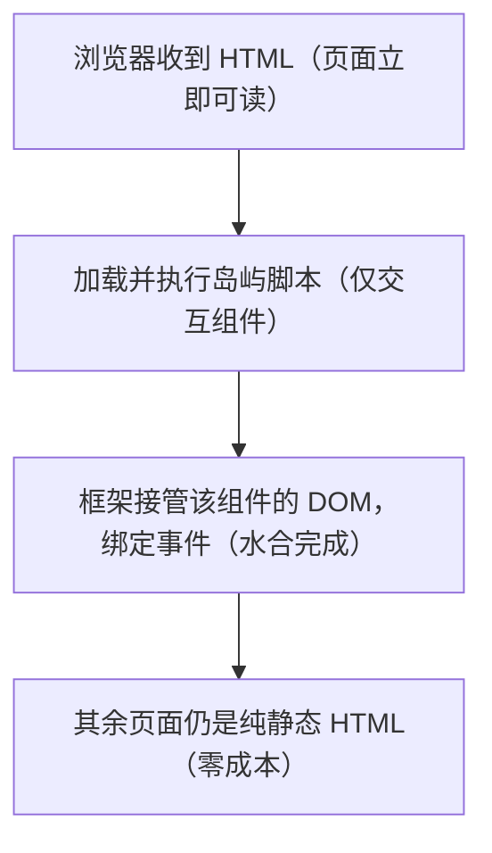
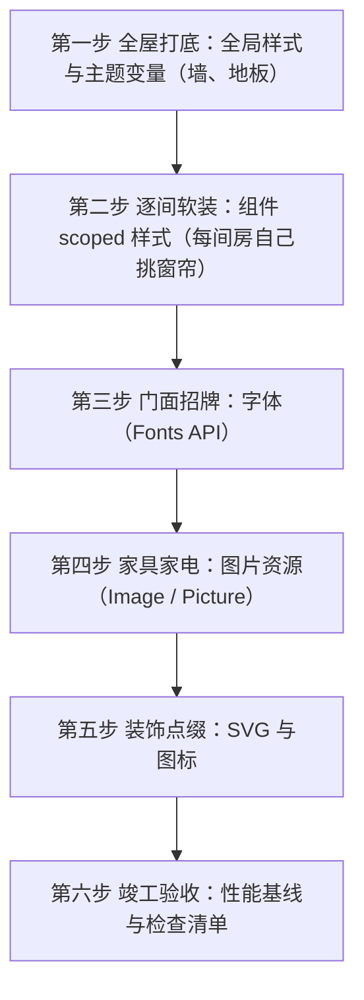
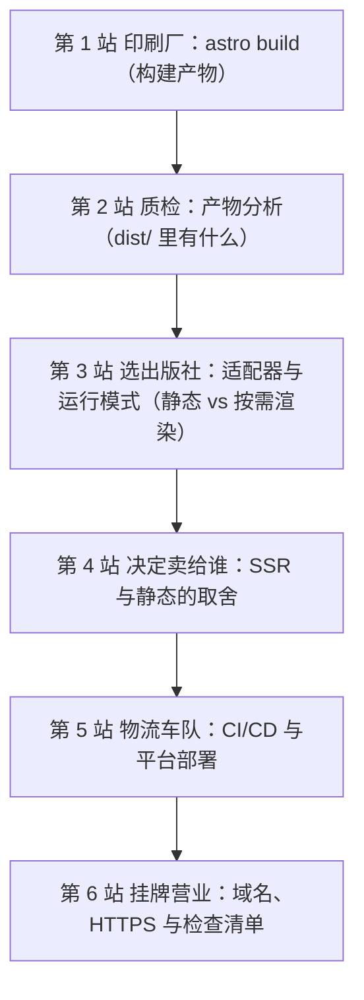
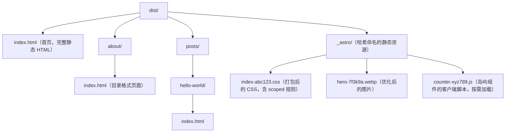

<!-- ============ 文档分隔线：043-astro/001-AstroOverview.md ============ -->

## 0. 从一个真实的故事说起

2023 年，一位叫阿禾的博主运营着一个技术博客，每周更新两三篇文章，内容扎实，读者不少。但有一个问题一直困扰着他：**网站加载太慢**。读者在微信里转发他的文章链接，点开后要转圈 3 到 5 秒才能看到正文，很多人等不及就关掉了页面。

阿禾很困惑：自己的博客文章就是文字加少量图片，数据量并不大，为什么会这么慢？他打开浏览器开发者工具查看网络请求，发现罪魁祸首是一大坨 JavaScript 文件——他的博客框架（一个典型的单页应用 SPA）把整个网站的"程序逻辑"打包成了一个近 300KB 的脚本。浏览器必须先下载、解析、执行完这段脚本，才能把文章渲染出来。也就是说，读者为了看一篇 2KB 的纯文字文章，被迫先下载 300KB 的代码。

这个场景在 2026 年的今天依然每天都在发生。而它的解法，就是本模块要学习的框架：**Astro**。


> 本节为增量补充，帮助你选择 Astro 版本。

- Astro：6.x 为当前稳定版（6.0 于 2026-03 发布，6.2 为最新），要求 Node.js 22+。
- 6.x 重点：新开发服务器、字体 API、内置 CSP、实验性 Rust 编译器、Adapter API 重构。
- 新项目直接执行 `npm create astro@latest`，模板会安装当前稳定版。

## 1. 问题解剖：内容站的性能困境

### 1.1 先直观理解：读者要的只是"一本书"

把阿禾的博客想象成一家书店。读者走进书店，只想直接拿走一本已经印好的书翻看。可是 SPA 式的网站相当于一家"没有现货、全靠现场打印"的书店：读者要书，店员才启动一台复印机，现场把纸一张张打印、装订、再递给读者。复印机（JavaScript 引擎）启动得再快，也比不上直接从书架上拿书快。

绝大多数内容站（博客、文档站、新闻站、产品介绍页）的本质就是"卖书"——把已经写好的内容交给读者。这类网站 90% 的页面内容在发布时就已经是确定的了，根本不需要浏览器现场"计算"出来。

### 1.2 再讲原理：SPA 为什么"重"

传统单页应用（SPA，Single Page Application）的工作方式是：

第一，浏览器下载一个包含全部页面逻辑的 JavaScript 大包（bundle）；

第二，JavaScript 在浏览器里运行，动态创建 DOM 节点，把内容"画"到页面上；

第三，用户点击导航时，不重新请求页面，而是由 JavaScript 直接换掉页面内容。

这套机制对"交互密集型应用"（如在线表格、后台管理系统）非常合适，但对内容站来说是大炮打蚊子。以 FANDEX 文档站为例，一篇文章页面里真正需要 JavaScript 的交互只有：目录高亮、主题切换、站内搜索。这些交互可能只占页面内容的 5% 到 10%。

**为 10% 的交互，付出 100% 的 JavaScript 成本，显然不划算。**

### 1.3 换一种思路：像报社一样出版

Astro 换了一种思路，它的工作方式更像一家**报社**：

- 编辑（开发者）写文章时用各种工具排版；
- 印刷厂（Astro 构建器）在每天凌晨把全部文章**提前印成报纸**（纯 HTML 文件）；
- 读者订阅时，快递员（静态托管/CDN）直接送报纸，**不需要现场印刷**；
- 只有"填字游戏"这种需要动笔的内容，才在报纸上附一支笔（按需加载的小段 JavaScript）。

这正是本模块 002 到 005 各篇将要展开的机制。下面先给出整体认知。

## 2. Astro 是什么

### 2.1 官方定义与版本现状

Astro 是一个面向**内容驱动网站**（博客、文档站、营销页、电商展示页）的 Web 框架。它于 2021 年发布，核心理念是：**默认输出零 JavaScript 的静态 HTML，只有显式标记的交互组件才在浏览器加载脚本**。

截至 2026 年 8 月，Astro 的版本演进如下：

| 版本 | 时间 | 关键特性 |
| --- | --- | --- |
| Astro 1.x | 2022 年 | 岛屿架构、SSG 起步 |
| Astro 2.x | 2023 年 | 内容集合（Content Collections）、类型安全的 Markdown |
| Astro 3.x | 2023 年 | View Transitions 预览、图片优化 |
| Astro 4.x | 2023 年底 | 更快的构建、国际化（i18n）路由 |
| Astro 5.x | 2024 年 12 月 | **Content Layer**（统一内容加载）、**Server Islands**（服务器岛） |
| Astro 6.x | 2026 年 | **Live Content Collections**（实时内容集合）、Fonts API、CSP 支持、Rust 编译器、Advanced Routing 预览 |
| Astro 7.x | 2026 年 | 预览阶段，基于 6.x 演进 |

其中 Astro 5 引入的 Content Layer 把"内容集合"从只能读本地 Markdown 扩展为"可以从任何数据源加载"的统一 API；Astro 6 进一步推出 Live Content Collections，允许内容在**请求时实时拉取**而非仅构建时获取，非常适合内容频繁更新的场景。2026 年 1 月 Cloudflare 收购了 Astro 团队，框架保持 MIT 开源许可。

### 2.2 Astro 的三大核心能力

第一，**静态优先**：默认构建时输出纯 HTML，首屏不需要任何 JavaScript，加载极快，SEO 友好；

第二，**按需水合**：交互组件通过 `client:` 指令显式声明加载时机，浏览器只加载用得到的脚本；

第三，**框架无关**：同一个页面可以混合使用 React、Vue、Svelte、Solid 等框架组件，互不冲突。

### 2.3 一分钟看懂 Astro 长什么样

一个最简单的 Astro 页面：

```astro
---
// 三个横线之间是"组件脚本"，在构建期运行，不会发给浏览器
const siteName = 'FANDEX 文档站'
const today = new Date().toLocaleDateString('zh-CN')
---

<!-- 下面是模板，输出为静态 HTML -->
<html lang="zh-CN">
  <head>
    <meta charset="utf-8" />
    <meta name="viewport" content="width=device-width, initial-scale=1" />
    <title>{siteName}</title>
  </head>
  <body>
    <h1>欢迎来到 {siteName}</h1>
    <p>今天日期：{today}</p>
  </body>
</html>
```

运行 `npm run build` 后，`dist/` 目录里就是一个不包含任何 JavaScript 的完整 HTML 文件。这正是 Astro 与 React/Vue SPA 最本质的区别。

## 3. 岛屿架构：用最少的 JS 换最多的交互

### 3.1 岛屿是什么

"岛屿架构"（Islands Architecture）这个概念最早由 Etsy 的前端架构师 Katie Sylor-Miller 在 2019 年提出，2020 年由 Preact 作者 Jason Miller 系统化阐述，Astro 是第一个把"选择性水合"作为内置能力的框架。

想象一片大海：整张网页是"海"，默认情况下海面只漂浮着静态 HTML，轻快而平静。只有少数需要交互的区域，像是海上的岛屿——搜索框、图片轮播、点赞按钮——才单独加载自己的 JavaScript，成为"岛屿"。岛屿之间互相独立，互不干扰。

在 Astro 的术语中，岛屿有两种：

| 类型 | 说明 | 典型场景 |
| --- | --- | --- |
| Client Island（客户端岛） | 交互组件在浏览器端独立水合（hydration），与页面其余静态部分隔离 | 搜索框、轮播图、表单校验 |
| Server Island（服务器岛） | 组件在服务器端按需渲染动态内容，不影响页面整体静态输出 | 登录用户头像、实时库存、个性化推荐 |

### 3.2 看代码：client 指令

```astro
---
// src/pages/index.astro
import SearchBox from '../components/SearchBox.tsx'   // React 组件
import ThemeToggle from '../components/ThemeToggle.astro'
---

<!-- 页面其余部分都是纯静态 HTML，不加载任何脚本 -->

<SearchBox client:load />   <!-- 页面加载时立即水合 -->
<ThemeToggle client:visible /> <!-- 滚动到可见区域才水合 -->
```

讲解：

- 不加任何指令的组件，只输出服务端渲染好的 HTML，零脚本；
- `client:load`：页面一加载就下载并执行该组件脚本；
- `client:idle`：浏览器空闲时再加载（默认值）；
- `client:visible`：组件进入视口才加载；
- `client:only`：只在客户端渲染（如纯前端组件）；
- `client:media="(max-width: 640px)"`：满足媒体查询才加载。

水合（hydration）的意思是：组件在构建期已经把 HTML 渲染出来了，浏览器端再加载一小段脚本，给这些 HTML"接上"事件、状态和交互能力。这样首屏内容立即可见，交互功能随后补齐。

### 3.3 性能收益有多大

Astro 官方及社区 2026 年的实测数据（来源见文末链接）：

- 一个典型 Astro 5 内容页每页的客户端 JavaScript 为 0 至 15KB；同等内容的 Next.js 16 页面为 85 至 250KB；
- 66% 的真实 Astro 站点在 Core Web Vitals（核心网页指标）上表现良好，同期 WordPress 为 48%、Gatsby 为 47%、Next.js 为 30%、Nuxt 为 28%。

对内容站而言，"快"不是锦上添花，而是用户留存和搜索引擎排名的决定性因素。

## 4. 项目结构：一本书的目录

理解 Astro 项目结构，相当于看一本书的目录——每个目录都有明确分工：

```text
my-astro-site/
  src/                      # 源码目录
    pages/                  # 路由目录：每个 .astro / .md 文件对应一个页面
      index.astro           # 首页 /
      about.md              # /about
      blog/[slug].astro     # 动态路由，生成 /blog/xxx
    components/             # 组件目录（.astro、.jsx、.vue 等）
    layouts/                # 布局组件目录（页面骨架）
    content/                # 内容目录（内容集合的数据源，可选）
    styles/                 # 全局样式
    content.config.ts       # 内容集合配置文件（用到内容集合时创建）
  public/                   # 静态资源：favicon、robots.txt 等，原样拷贝
  astro.config.mjs          # Astro 配置文件
  package.json              # 依赖与脚本
  tsconfig.json             # TypeScript 配置
```

讲解：`src/pages` 是文件路由——`pages/about.md` 自动生成 `/about` 页面；`pages/blog/[slug].astro` 是动态路由，一个文件可以生成无数个文章页。本模块 003 篇会详细展开路由，005 篇展开内容集合。

## 5. 组件与页面

### 5.1 .astro 组件三段式

每个 `.astro` 文件由三部分组成：组件脚本（frontmatter）、组件模板、可选的作用域样式。

```astro
---
// 第一部分：组件脚本，构建期运行
import Layout from '../layouts/BaseLayout.astro'
const title = 'Astro 入门'

// 可以在这里 fetch 数据、读取文件系统、访问环境变量
const apiUrl = import.meta.env.PUBLIC_API_URL
---

<!-- 第二部分：组件模板，输出 HTML -->
<Layout pageTitle={title}>
  <h1>{title}</h1>
  <p>本文数据来源：{apiUrl}</p>
</Layout>

<style>
  /* 第三部分：组件样式，默认自动加作用域，只影响本组件 */
  h1 { color: #1e40af; }
</style>
```

关键点：frontmatter 中的代码**在构建期于服务端执行**，可以访问文件系统、网络、环境变量，但永远不会发送到浏览器；模板部分使用 `{表达式}` 输出变量值。

### 5.2 交互组件作为岛屿

```astro
---
// src/pages/docs/index.astro
import SearchBox from '../components/SearchBox.tsx'
import { Code } from 'astro/components'
---

<h1>文档中心</h1>

<!-- 交互组件：显式声明水合时机 -->
<SearchBox client:visible />

<!-- 内置组件：代码高亮，构建期生成，零脚本 -->
<Code code="console.log('hi')" lang="js" theme="github-dark" />
```

讲解：`<Code />` 是 Astro 内置组件，由 Shiki 在构建期完成高亮，用户看到的只是高亮后的 HTML，没有运行时成本。这就是"能构建期做的，绝不留到浏览器做"的哲学体现。

## 6. 内容集合：文档站的"数据库"

### 6.1 内容集合解决什么问题

内容站有大量结构相同的 Markdown 文档（如 2000+ 篇课程文档），每篇都有 title、order、description 等元数据。如果没有约束，字段写错、缺失要到渲染时才暴露。内容集合用 **schema（数据结构校验规则）** 在构建期就拦住这些问题：

```ts
// src/content.config.ts
import { defineCollection, z } from 'astro:content'
import { glob } from 'astro/loaders'

const docs = defineCollection({
  // loader：声明内容从哪里来（这里是从磁盘读 Markdown）
  loader: glob({ pattern: '**/*.md', base: './cnt-content/full' }),
  // schema：声明 frontmatter 必须长什么样
  schema: z.object({
    title: z.string(),
    description: z.string().optional(),
    order: z.number().default(0),
    updated: z.coerce.date().optional(),
    module: z.string(),
  }),
})

export const collections = { docs }
```

### 6.2 查询与渲染

```astro
---
// src/pages/docs/index.astro
import { getCollection } from 'astro:content'

// 查询全部文档，按 order 排序
const docs = (await getCollection('docs')).sort(
  (a, b) => a.data.order - b.data.order
)
---

<h1>课程目录</h1>
<ul>
  {docs.map((doc) => (
    <li>
      <a href={`/docs/${doc.id}/`}>{doc.data.title}</a>
      <span>{doc.data.description}</span>
    </li>
  ))}
</ul>
```

讲解：`getCollection` 返回带类型的条目数组，每条包含 `id`（由文件路径生成）、`data`（校验后的 frontmatter）与 `body`（正文）。schema 校验失败时构建直接报错并给出精确信息，从源头保证元数据质量。这是 FANDEX 文档站的基石。

## 7. 布局、样式与集成

### 7.1 布局组件

布局（Layout）是一种特殊的组件，用于提供页面骨架（head、导航、页脚）：

```astro
---
// src/layouts/BaseLayout.astro
interface Props {
  title: string
}
const { title } = Astro.props
---

<!doctype html>
<html lang="zh-CN">
  <head>
    <meta charset="utf-8" />
    <meta name="viewport" content="width=device-width, initial-scale=1" />
    <title>{title}</title>
    <slot name="head" />  <!-- 具名插槽：页面可向 head 追加内容 -->
  </head>
  <body>
    <header>站点导航</header>
    <main>
      <slot />  <!-- 默认插槽：页面正文注入这里 -->
    </main>
    <footer>页脚</footer>
  </body>
</html>
```

### 7.2 样式方案

Astro 的样式体系覆盖四个层次：

第一，全局 CSS：在 `src/styles/` 引入，作用于全站；

第二，组件 scoped 样式：`<style>` 默认自动加作用域，互不污染；

第三，CSS Modules：`<style module>` 提供类名对象；

第四，集成 Tailwind：`npx astro add tailwind` 一键接入，FANDEX 文档站即采用 Tailwind。

### 7.3 常用官方集成

| 集成包 | 用途 |
| --- | --- |
| `@astrojs/react` / `@astrojs/vue` / `@astrojs/svelte` | 接入 UI 框架，构建交互岛屿 |
| `@astrojs/mdx` | 支持 MDX（Markdown 内嵌组件） |
| `@astrojs/sitemap` | 自动生成 sitemap.xml |
| `@astrojs/rss` | 生成 RSS 订阅源 |
| `@astrojs/cloudflare` / `@astrojs/netlify` / `@astrojs/vercel` | 部署适配器 |
| `@astrojs/tailwind` | Tailwind CSS 集成 |

## 8. 路由、SSR 与部署

### 8.1 静态与按需渲染

Astro 默认 `output: 'static'`，构建期生成全部页面，部署到任何静态托管即可。若需要按请求渲染的页面（如用户信息、实时数据），有两种方式：

- 在 `astro.config.mjs` 中配置 `output: 'server'` 全站启用 SSR（需配合适配器）；
- 更精细的做法：保持静态模式，在个别页面导出 `export const prerender = false`，只让该页面按需渲染。

文档站通常全部静态输出，个别页面（如搜索接口）按需渲染。

### 8.2 部署流水线

```bash
# 本地构建
npm run build

# 产物在 dist/ 目录，上传到任意静态托管即可
```

CI 中典型的做法是：`pnpm install && pnpm build`，然后把 `dist/` 上传到 GitHub Pages、Netlify、Vercel 或对象存储（OSS）。

## 9. 性能与 SEO

### 9.1 性能基线

- 零 JS 默认：HTML 直接可读，LCP（最大内容绘制）极快；
- 图片优化：`astro:assets` 的 `<Image />` 组件自动压缩、生成响应式尺寸、防布局偏移（CLS）；
- 资源内联：构建期内联关键 CSS 与字体，减少请求数；
- Astro 6 起 Sharp 成为默认图片处理引擎，开箱即用。

### 9.2 SEO 内置能力

- 语义化 HTML：默认输出可被搜索引擎直接解析；
- sitemap：`@astrojs/sitemap` 自动生成站点地图；
- RSS：`@astrojs/rss` 生成订阅源；
- 规范链接与 Open Graph：通过 frontmatter 与布局组件统一生成。

## 10. FANDEX 文档站实践

FANDEX 文档站的关键设计（即本模块所讲内容的综合应用）：

- 内容源：`cnt-content/full` 目录作为内容集合数据源，2000+ 篇 Markdown 文档；
- 元数据：frontmatter 统一规范（title、order、module、difficulty、related、prerequisites），由 schema 强制校验；
- 导航：按模块与 order 自动生成目录、面包屑与上一篇/下一篇；
- 检索：搜索组件作为岛屿按需加载，不拖慢首屏；
- 构建：`node scripts/build-stats.mjs && astro build`，CI 门禁包含构建检查与链接检查。


## 11. 常见错误与对策表

| 常见错误 | 报错/现象 | 原因 | 解决办法 |
| --- | --- | --- | --- |
| 交互组件没写 `client:` 指令 | 页面渲染了但按钮点了没反应 | Astro 默认不水合任何组件，组件只是静态 HTML | 给交互组件加 `client:load` 或 `client:visible` |
| 在 frontmatter 里使用 `window` / `document` | 构建时报 `window is not defined` | frontmatter 在 Node 环境（构建期）执行，没有浏览器 API | 改用 `<script>` 标签、`client:only` 组件或条件判断 |
| 内容集合 schema 缺失 | 文档元数据错误到运行时才暴露 | 没有定义 schema 或 schema 过松 | 为每个集合定义完整 schema，构建期即校验 |
| 全站开启 SSR | 失去静态优势，性能下降、托管成本升高 | `output: 'server'` 导致所有页面按请求渲染 | 默认静态输出，个别页面用 `prerender = false` |
| 忽略构建产物分析 | 页面 JS 体积悄悄变大 | 交互组件越加越多，未检查水合成本 | 查看 `astro build` 报告，按报告调整 `client:` 指令 |
| 误以为 Astro 是 SPA | 页面切换整页刷新，体验"传统" | 对 Astro 的工作模式理解偏差 | 可选接入 View Transitions 获得 SPA 般的平滑过渡 |

## 13. 一句话记忆

**Astro 是"内容优先"的 Web 框架：默认零 JavaScript 输出静态 HTML，交互组件像大海中的岛屿一样按需加载，让内容站又快又省。**

<!-- ============ 文档分隔线：043-astro/002-QuickStartProject.md ============ -->

## 0. 先想清楚：我们要搭一座什么样的"房子"

搭建一个 Astro 项目，很像用**积木搭一座房子**。

- 地基和框架（Node.js 环境、项目脚手架）要先打好，否则后面一切无从谈起；
- 每一块积木（目录、配置文件、页面文件）都有固定的形状和位置，放对了，房子自然立得起来；
- 你不必一次记住所有积木的用途，跟着图纸（向导）一步步走，先搭出能住的小房子，再慢慢加房间。

本篇就是你的"图纸"。请打开电脑终端（Windows 下推荐使用 PowerShell 或 VS Code 内置终端），跟着下面的步骤，一步一步实际操作。本模块后面的 003（路由）、004（组件）、005（内容集合）都建立在这套房子的基础上。

## 1. 准备工作

### 1.1 前置条件：Node.js 环境

Astro 是基于 Node.js 的工具链，先确认电脑上安装了正确版本的 Node.js。截至 2026 年，Astro 官方要求 **Node.js v22.12.0 或更高版本**（注意：奇数版本号如 v23 不受支持，这是 Astro 的明确约定）。

打开终端，输入以下两个命令检查：

```bash
node -v
npm -v
```

正常输出类似：

```text
v22.12.0
10.9.2
```

- `node -v` 显示 Node.js 版本号，以 `v` 开头；
- `npm -v` 显示 npm（Node 包管理器）版本号。npm 随 Node.js 一起安装，无需单独配置。

如果提示"node 不是内部或外部命令"，说明 Node.js 未安装或未加入 PATH。请先到 Node.js 官网（https://nodejs.org/zh-cn）下载 LTS 版本安装，安装时保持默认选项（勾选"Add to PATH"），重启终端后再检查。

### 1.2 前置条件：编辑器

推荐使用 VS Code，并安装官方 Astro 扩展（在 VS Code 扩展市场搜索 "Astro"，作者为 astro-build）。该扩展提供语法高亮、智能补全、类型检查提示，对新手非常重要。

### 1.3 检查是否已有 create-astro

不需要预先安装任何脚手架工具。`npm create astro@latest` 会在执行时自动临时下载 create-astro 向导，用完即走，不会污染你的环境。这也是它被称为"零配置启动"的原因。

## 2. 第 1 步：创建项目

### 2.1 打开终端并进入目标目录

在终端中，先进入你想存放项目的目录（例如 `C:\Users\你的用户名\projects`）：

```bash
cd projects
```

说明：`create astro` 可以在电脑上的任何位置运行，向导会自动为你创建项目文件夹，因此不需要提前手动新建空目录。

### 2.2 执行创建命令

```bash
npm create astro@latest
```

执行后，向导（CLI Wizard）会依次询问几个问题：

| 提问 | 选项 | 建议选择 |
| --- | --- | --- |
| 项目名称（Directory） | 输入任意英文名，如 `my-site` | 小写英文字母 + 连字符 |
| 选择模板（Select a template） | Baseline / Blog / Docs / Portfolio / Minimal 等 | 初学选 **Baseline**（空白基础模板） |
| 是否安装依赖（Install dependencies?） | Yes / No | Yes（省去后面手动 `npm install`） |
| 是否初始化 Git（Initialize a Git repository?） | Yes / No | 想用版本管理选 Yes，否则 No |
| 是否使用 TypeScript（Use TypeScript?） | Yes / No | 强烈建议 Yes（类型提示对学习有巨大帮助） |

如果你不想一路点选，可以用"非交互式"命令一步到位：

```bash
npm create astro@latest my-site -- --template baseline --install --git --no-ai --yes
```

各标志含义：

- `--template baseline`：使用空白基础模板；
- `--install`：创建后自动安装依赖；
- `--git`：初始化 Git 仓库（`--no-git` 则跳过）；
- `--yes`：跳过全部交互提示，使用默认值；
- `--no-ai`：跳过创建 AI 代理配置文件。

其他常用模板：`minimal`（最小模板）、`blog`（博客）、`docs`（文档站）、`portfolio`（作品集）。你甚至可以用任意 GitHub 仓库作为模板，例如 `--template 用户名/仓库名`。

### 2.3 查看创建结果

创建成功后，进入项目目录：

```bash
cd my-site
```

## 3. 第 2 步：启动开发服务器

### 3.1 安装依赖（如果向导中选了 No）

```bash
npm install
```

会生成 `node_modules/` 目录，把项目需要的全部依赖下载到本地。这一步通常需要 1 到 3 分钟，视网络情况而定。

### 3.2 启动开发模式

```bash
npm run dev
```

看到类似输出即为成功：

```text
  Local: http://localhost:4321/
```

用浏览器打开 **http://localhost:4321/**，你应该能看到模板默认的首页。

这里有几个概念需要理解：

- **开发服务器（dev server）**：一个在本地运行的服务，负责把 Astro 源码实时编译成浏览器能看懂的 HTML；
- **热更新（HMR，Hot Module Replacement）**：修改 `src/` 下的文件保存后，浏览器无需手动刷新即可看到变化；
- **默认端口 4321**：如果被占用，Astro 会自动改用 4322、4323 等。

停止服务器：在终端按 `Ctrl + C`。

## 4. 第 3 步：认识项目目录结构

打开 `my-site` 文件夹（建议直接用 VS Code 打开：在项目目录执行 `code .`），观察整体结构：

```text
my-site/
  src/                    # 源码目录（重点区域）
    pages/                # 路由目录：每个 .astro/.md 文件生成一个页面
      index.astro         # 首页，对应 /
    content.config.ts     # 内容集合配置（用到内容集合时才会创建）
  public/                 # 静态资源目录：favicon.svg、robots.txt 等
  astro.config.mjs        # Astro 配置文件
  package.json            # 项目依赖与脚本定义
  tsconfig.json           # TypeScript 配置
  README.md
```

逐块理解：

- `src/pages/`：**唯一必须存在的目录**。`index.astro` 是首页。你往这个目录里每添加一个文件，站点就多一个页面（详见 003 篇）；
- `src/` 下的 `components/`、`layouts/`、`styles/` 目录：模板不一定会创建，按需自己新建（详见 004 篇）；
- `public/`：放 favicon、robots.txt 等不需要处理的静态文件，构建时会**原样拷贝**到输出目录根路径，例如 `public/favicon.svg` 通过 `/favicon.svg` 访问；
- `astro.config.mjs`：Astro 的配置中心；
- `package.json`：记录依赖和 npm 脚本。

## 5. 第 4 步：认识核心配置文件

### 5.1 astro.config.mjs

```js
// astro.config.mjs
import { defineConfig } from 'astro/config'

// 官方推荐用 defineConfig 包裹配置，可获得类型提示与配置校验
export default defineConfig({
  site: 'https://example.com',  // 站点最终部署地址，生成 sitemap 和规范链接必需
  output: 'static',             // 输出模式：static（默认）/ server（SSR）/ hybrid
  compressHTML: true,           // 构建时压缩 HTML 中的空白字符
  markdown: {
    shikiConfig: { theme: 'github-dark' }, // 代码高亮主题（Shiki）
  },
})
```

讲解：

- `site`：填最终上线域名。不填也能构建，但 sitemap、OG 图片等依赖绝对地址的功能会失效；
- `output`：默认 `static`（构建期生成全部页面）。需要服务端渲染时改为 `server` 并安装适配器（详见 001 篇第 8 节）；
- `markdown.shikiConfig`：控制代码块高亮主题，常用的还有 `github-light`、`one-dark-pro` 等。

### 5.2 package.json 的脚本

打开 `package.json`，找到 `scripts` 字段：

```json
{
  "scripts": {
    "dev": "astro dev",
    "build": "astro build",
    "preview": "astro preview",
    "astro": "astro"
  }
}
```

| 命令 | 作用 |
| --- | --- |
| `npm run dev` | 启动开发服务器（热更新） |
| `npm run build` | 生产构建，输出到 `dist/` |
| `npm run preview` | 本地预览 `dist/` 构建产物（模拟线上环境） |
| `npx astro ...` | 调用 Astro CLI 子命令 |

## 6. 第 5 步：修改你的第一个页面

打开 `src/pages/index.astro`，里面是模板生成的首页。把内容替换为：

```astro
---
// frontmatter（组件脚本）：构建期执行，不会发送到浏览器
const siteName = '我的第一个 Astro 站点'
const author = 'FANDEX 学员'
const now = new Date().toLocaleDateString('zh-CN')
---

<!-- 模板：输出静态 HTML -->
<html lang="zh-CN">
  <head>
    <meta charset="utf-8" />
    <meta name="viewport" content="width=device-width, initial-scale=1" />
    <title>{siteName}</title>
  </head>
  <body>
    <h1>{siteName}</h1>
    <p>作者：{author}</p>
    <p>今天日期：{now}</p>
    <p>这段内容会被直接渲染为静态 HTML，无需任何客户端 JavaScript。</p>
  </body>
</html>
```

保存文件，回到浏览器（http://localhost:4321/），页面会自动刷新，你应该能看到自己的站点名和今天的日期。

关键语法点：

- `---` 包裹的 frontmatter 是"组件脚本"，在构建期于服务端运行，可以定义变量、导入模块、读取文件，但**不会**发送到浏览器；
- 模板中使用 `{表达式}` 语法输出变量的值；
- 这段 HTML 在构建后是完整、独立、可被搜索引擎直接抓取的静态文件。

## 7. 第 6 步：添加第二个页面

在 `src/pages/` 下新建文件 `about.astro`，写入：

```astro
---
const pageTitle = '关于本站'
---

<html lang="zh-CN">
  <head>
    <meta charset="utf-8" />
    <meta name="viewport" content="width=device-width, initial-scale=1" />
    <title>{pageTitle}</title>
  </head>
  <body>
    <h1>{pageTitle}</h1>
    <p>这是通过文件路由自动生成的第二个页面，访问 /about 即可看到。</p>
    <a href="/">返回首页</a>
  </body>
</html>
```

保存后，浏览器访问 **http://localhost:4321/about/**，即可看到新页面。

这就是 Astro"文件路由"的威力：**新增一个文件就是新增一个页面**，不需要配置任何路由表。页面之间用普通的 `<a href="/xxx">` 链接跳转即可（Astro 刻意不提供框架专属的 `<Link>` 组件）。

## 8. 第 7 步：构建与预览

开发调试完成后，生成用于上线的最终产物：

```bash
npm run build
```

构建结束后，项目根目录出现 `dist/` 文件夹，里面是全部静态文件（HTML、CSS、JS、图片）。预览生产产物：

```bash
npm run preview
```

浏览器访问输出的本地地址（通常也是 localhost:4321），体验与线上一致的效果。将 `dist/` 目录上传到任意静态托管平台（GitHub Pages、Netlify、Vercel、OSS 等）即可完成部署。

### 8.1 看看 dist 里长什么样

构建完成后打开 `dist/`，它的结构是"扁平化"的：每个页面生成一个对应的 HTML 文件，静态资源按类型归入 `_astro/` 目录：

```text
dist/
  index.html            # 首页 /
  about/index.html      # 页面 /about（子路径页面向下生成一层目录）
  _astro/               # 构建产物：压缩后的 CSS、JS、图片等
  favicon.svg           # public/ 里的文件原样拷贝到这里
```

理解两个细节：

- `about/index.html` 对应 `/about`，这是静态站点的常见组织方式（`build.format` 可以调整输出格式，如 `directory` 或 `file`）；
- `public/` 中的文件不经任何处理，原样出现在 `dist/` 根路径——所以 `public/favicon.svg` 在页面里用 `/favicon.svg` 引用即可。

## 9. 常用命令速查表

| 命令 | 作用 | 备注 |
| --- | --- | --- |
| `npm create astro@latest` | 启动创建向导 | 可加 `--template` 指定模板 |
| `npm run dev` | 启动开发服务器 | 默认 http://localhost:4321 |
| `npm run build` | 生产构建 | 输出到 `dist/` |
| `npm run preview` | 预览构建产物 | 需先 build |
| `npx astro add react` | 添加官方集成 | 支持 react、tailwind、mdx、sitemap 等 |
| `npx astro check` | 类型与语法检查 | CI 中常用 |
| `npx astro info` | 输出环境诊断信息 | 排查问题时贴给社区 |

## 10. 常见错误与对策表

| 常见错误 | 报错/现象 | 原因 | 解决办法 |
| --- | --- | --- | --- |
| `node` 不是内部或外部命令 | 终端提示命令不存在 | Node.js 未安装或未加入 PATH | 到 nodejs.org 安装 LTS 版，勾选 Add to PATH，重开终端 |
| `npm create astro@latest` 卡住或失败 | 长时间无响应或网络报错 | npm 源较慢或网络受限 | 切换镜像源：`npm config set registry https://registry.npmmirror.com` 后重试 |
| 版本过低错误 | 报错要求 Node.js 版本 >= 22.12.0 | Node.js 版本太旧 | 使用 nvm-windows 安装并切换新版本 |
| 端口被占用 | `Port 4321 is already in use` | 另一个进程占用了 4321 | 关掉占用进程，或让 Astro 自动改用 4322 等端口 |
| 页面修改后不刷新 | 浏览器看不到改动 | 开发服务器未运行，或改的是 `public/`（public 文件不触发 HMR） | 确认 `npm run dev` 在运行；`public/` 内容需手动刷新 |
| 构建后页面样式/资源 404 | 引用的图片、脚本找不到 | 资源路径写成了相对路径或未放进 `public/` | 资源放 `public/` 后用 `/文件名` 绝对路径引用 |

## 12. 一句话记忆

**`npm create astro@latest` 生成积木盒，`npm run dev` 边搭边看，`npm run build` 出成品——src/pages 里每个文件就是一块会自动变成页面的积木。**

<!-- ============ 文档分隔线：043-astro/003-PagesRouting.md ============ -->

## 0. 城市道路与路牌：理解路由的第一把钥匙

想象你站在一座陌生的城市里。这座城市的路网设计有一个奇特的规定：**每条街道的名字，就是这条街上唯一的门牌**。

- 你走在"中山路"，想去"图书馆"，只要沿路寻找"图书馆"字样的门牌即可；
- 每条街只有一块"整街名牌"（首页），而街上的每家店铺都按门牌编号排列（文章页、详情页）；
- 如果一座大楼里有多个楼层、多个房间，门牌就会写成"中山路 12 号 3 层 05 室"这样的多级地址；
- 如果城市改造把"旧街"并入了"新街"，市政部门会在旧街口立一块告示："本街已并入新街，请前往"——这就是重定向（Redirect）。

Astro 的**文件路由**（File-based Routing）与这套路牌逻辑完全一致：`src/pages/` 目录就是"城市道路"，目录里的每个文件就是"门牌"——**文件在目录里的路径，决定了它在网站上的 URL 地址**。你不需要维护任何"路由表"，放一个文件，就多一个页面。

## 1. 文件路由的原理

### 1.1 先直观理解

把 `src/pages/` 想象成"城市地图"，规则只有三条：

第一，`.astro`、`.md`、`.mdx`、`.html` 文件放在 `src/pages/` 下，自动变成网站页面；

第二，文件路径 = URL 路径：`src/pages/about.astro` 就是 `/about`；

第三，`index.astro` 是一个特殊名字：它代表"这条街的入口"，即目录的默认页。

### 1.2 再讲原理

Astro 构建器在构建期扫描 `src/pages/` 下的全部文件，把每个文件映射为一个路由对象。静态模式下，这些路由在构建时全部生成 HTML 文件输出到 `dist/`。整个过程不需要你注册任何配置，所以官方文档说："Astro 项目没有独立的路由配置。"

页面之间跳转使用**标准 HTML 的 `<a>` 链接**即可——Astro 刻意不提供类似 Next.js 的 `<Link>` 组件，因为对内容站来说，浏览器原生的链接就是最好的选择。

```astro
---
// src/pages/index.astro
---
<nav>
  <a href="/">首页</a>
  <a href="/about">关于</a>
  <a href="/blog">博客</a>
  <a href="/docs/getting-started">文档</a>
</nav>
```

注意：链接路径以 `/` 开头表示"站点根路径"。如果站点部署在子路径（例如 GitHub Pages 的 `https://user.github.io/repo/`），需要在 `astro.config.mjs` 中配置 `base: '/repo/'`，并把所有链接写成 `/repo/about` 的形式。

## 2. 静态路由：固定的路牌

### 2.1 路由映射规则表

`src/pages/` 目录下的文件与 URL 的对应关系：

| 文件路径（src/pages/ 下） | 生成的 URL |
| --- | --- |
| `index.astro` | `/` |
| `about.astro` | `/about` |
| `blog/index.astro` | `/blog` |
| `blog/post.md` | `/blog/post` |
| `docs/guide/getting-started.md` | `/docs/guide/getting-started` |
| `404.astro` | `/404`（特殊错误页） |

讲解：`index.astro` 是目录入口页；其余文件名直接对应路径段。Markdown 文件（`.md`）也能直接成为页面——正文写在 Markdown 里，frontmatter 中的 `title` 等字段自动成为页面元数据。URL 末尾是否带 `/` 取决于部署平台，一般无需关心。

### 2.2 一个纯 Markdown 的页面

```md
---
title: 关于本站
description: FANDEX 学习平台简介
---
# 关于本站

FANDEX 是一个面向零基础中文学习者的编程学习平台。
```

保存为 `src/pages/about.md` 后，访问 `/about` 即可看到渲染后的页面。这就是内容站"写 Markdown 即出页面"的体验。

## 3. 动态路由：带参数的路牌 [slug]

### 3.1 先直观理解

内容站经常有大量结构相同的页面：100 篇博客文章、2000 篇课程文档。总不能为每一篇都手动建一个文件吧？动态路由就是解决办法：**用方括号 `[xxx]` 在文件名里开一个"参数位"**，一个文件生成无数个页面，就像"中山路每家店铺的门牌都是『中山路 + 编号』"。

### 3.2 再看代码

```astro
---
// src/pages/blog/[slug].astro
// 静态模式下，动态路由必须导出 getStaticPaths，声明要生成哪些页面

export async function getStaticPaths() {
  // 模拟博客文章数据（实战中通常来自内容集合，见 005 篇）
  const posts = [
    { slug: 'hello', title: '你好，世界' },
    { slug: 'astro-guide', title: 'Astro 入门指南' },
    { slug: 'islands', title: '岛屿架构详解' },
  ]

  // 返回数组：每一项生成一个页面
  return posts.map((post) => ({
    params: { slug: post.slug },   // params：路由参数，键名必须与 [slug] 一致
    props: { title: post.title },  // props：传给页面的任意数据
  }))
}

const { slug } = Astro.params   // 当前路由的参数
const { title } = Astro.props   // getStaticPaths 传入的数据
---

<h1>{title}</h1>
<p>当前文章路径：/blog/{slug}</p>
```

讲解：这个文件会一次性生成 `/blog/hello`、`/blog/astro-guide`、`/blog/islands` 三个静态页面。`Astro.params` 读取 URL 里的参数；`Astro.props` 读取 `getStaticPaths` 传给页面的数据。

### 3.3 getStaticPaths 返回值的字段

| 字段 | 必填 | 说明 |
| --- | --- | --- |
| `params` | 是 | 路由参数对象，键必须与文件名中的 `[占位符]` 一一对应，值为字符串 |
| `props` | 否 | 传给页面的任意数据，模板中通过 `Astro.props` 访问 |

关键理解：静态模式下，`getStaticPaths` 在**构建期**执行，声明"这个动态路由要生成哪些页面"。漏掉的参数组合不会生成页面。这正是"内容规模可枚举"的静态站的正确打开方式。

## 4. 多级参数与 Rest 参数：更复杂的门牌

### 4.1 多级动态参数

URL 可以有多个路径段参数，例如国际化文档站：

```text
src/pages/docs/[lang]/[chapter].astro
  -> 生成 /docs/zh/intro
  -> 生成 /docs/en/setup
```

此时 `getStaticPaths` 中的 `params` 必须同时提供 `lang` 和 `chapter` 两个键：

```astro
---
// src/pages/docs/[lang]/[chapter].astro
export function getStaticPaths() {
  return [
    { params: { lang: 'zh', chapter: 'intro' } },
    { params: { lang: 'en', chapter: 'setup' } },
  ]
}

const { lang, chapter } = Astro.params
---

<p>语言：{lang}，章节：{chapter}</p>
```

### 4.2 Rest 参数 [...path]：通配门牌

当路径层级不确定（比如文档可能嵌套多级子目录）时，用 `[...path]` 匹配"剩余的所有路径段"：

```astro
---
// src/pages/docs/[...path].astro
export function getStaticPaths() {
  return [
    { params: { path: 'getting-started' } },  // /docs/getting-started
    { params: { path: 'guides/deploy' } },    // /docs/guides/deploy
    { params: { path: 'guides/deploy/vercel' } }, // 任意深度都行
    { params: { path: undefined } },          // 匹配 /docs 本身
  ]
}

const { path } = Astro.params
---

<!-- path 可能是字符串、字符串数组或 undefined -->
<p>文档路径：{path ?? '文档首页'}</p>
```

讲解：`[...path]` 是"兜底"参数，一个文件覆盖该目录下所有未匹配的路径。常见应用：文档站把所有章节统一渲染到同一模板，配合内容集合查询对应文档（见 005 篇）。

### 4.3 路由优先级

当静态路由与动态路由可能冲突时（如同时存在 `about.astro` 与 `[slug].astro`），Astro 有固定的优先级规则：**静态路由优先于动态路由**，`[param]` 优先于 `[...rest]`。也就是说，`/about` 永远命中 `about.astro`，不会被 `[slug].astro` 抢走。

## 5. 嵌套路由：目录即层级

### 5.1 用文件夹组织层级

文件路由天然支持嵌套——`src/pages/` 下的子目录就是 URL 的层级：

```text
src/pages/
  index.astro                  ->  /
  products/
    index.astro                ->  /products
    categories/
      [category].astro         ->  /products/categories/electronics
    [id].astro                 ->  /products/123
```

讲解：嵌套目录让 URL 结构清晰、有语义，也方便团队按功能划分代码。`products/index.astro` 是 `/products` 的入口页，`products/[id].astro` 为每个产品生成详情页。

### 5.2 实战：文档站目录 + 详情页

一个典型的文档站路由结构：

```text
src/pages/
  index.astro              # 首页
  docs/
    index.astro            # 文档列表
    [slug].astro           # 单篇文档详情
  404.astro                # 错误页
```

`docs/[slug].astro` 配合内容集合即可实现"一篇文档一个页面"（完整代码见第 8 节）。

## 6. 布局 Layout：统一的门面

### 6.1 布局组件与插槽

每个页面都写一遍 `<html>`、`<head>`、导航、页脚太重复。解决方案是布局组件：把公共骨架抽出来，用 `<slot />`（插槽）留出"内容注入点"。

```astro
---
// src/layouts/BaseLayout.astro
interface Props {
  title: string
  description?: string
}
const { title, description = 'FANDEX 文档站' } = Astro.props
---

<!doctype html>
<html lang="zh-CN">
  <head>
    <meta charset="utf-8" />
    <meta name="viewport" content="width=device-width, initial-scale=1" />
    <title>{title}</title>
    <meta name="description" content={description} />
    <slot name="head" />  <!-- 具名插槽：页面可向 head 追加内容 -->
  </head>
  <body>
    <header>
      <nav>
        <a href="/">首页</a>
        <a href="/docs">文档</a>
      </nav>
    </header>
    <main>
      <slot />  <!-- 默认插槽：页面正文注入这里 -->
    </main>
    <footer>© 2026 FANDEX</footer>
  </body>
</html>
```

### 6.2 页面使用布局

```astro
---
// src/pages/about.astro
import BaseLayout from '../layouts/BaseLayout.astro'
---

<BaseLayout title="关于我们">
  <h1>关于我们</h1>
  <p>这是一个使用布局组件的页面。</p>

  <!-- 向 head 区域追加内容：通过 slot="head" 属性 -->
  <meta slot="head" name="og:type" content="website" />
</BaseLayout>
```

讲解：页面只需关心自身内容，通过 Props 传 `title`，通过默认插槽提供正文。全站结构统一、样式一致，这是内容站组织页面的标准做法。Props 与插槽的底层机制在 004 篇详述。

## 7. 特殊页面与重定向

### 7.1 404 页面

```astro
---
// src/pages/404.astro
const pageTitle = '页面不存在'
---

<!doctype html>
<html lang="zh-CN">
  <head>
    <meta charset="utf-8" />
    <meta name="viewport" content="width=device-width, initial-scale=1" />
    <title>{pageTitle}</title>
  </head>
  <body>
    <h1>404：页面不存在</h1>
    <p>你访问的页面可能已被移动或删除。</p>
    <a href="/">返回首页</a>
  </body>
</html>
```

讲解：`404.astro` 是 Astro 的保留路由名，自动成为全站错误页。静态托管平台与 SSR 服务器都会在找不到路由时返回它。404 页面也可以像普通页面一样使用布局组件和样式。

### 7.2 重定向：旧门牌换新

方式一：配置式重定向（推荐，静态生成时直接用）

```js
// astro.config.mjs
export default defineConfig({
  redirects: {
    '/old-blog/': '/blog/',          // 整段路径重定向
    '/old-post/hello': '/blog/hello', // 单页重定向
  },
})
```

方式二：页面级动态重定向

```astro
---
// src/pages/legacy/[slug].astro
// 旧链接统一 301 到新地址
export async function getStaticPaths() {
  return [
    { params: { slug: 'old-hello' } },
    { params: { slug: 'old-guide' } },
  ]
}

const { slug } = Astro.params
// 返回 301 响应，浏览器自动跳转
return new Response(null, {
  status: 301,
  headers: { Location: `/blog/${slug.replace('old-', '')}` },
})
---
```

讲解：`301` 是"永久重定向"状态码，告诉搜索引擎"旧地址已废弃，用新地址收录"，是网站改版、文章迁移的标准做法。配置式重定向更简单直观，优先使用。

## 8. 路由与内容集合：黄金组合

动态路由 + 内容集合是内容站的核心模式：先用 `getCollection` 查询全部内容，再用 `getStaticPaths` 为每篇内容生成页面。

```astro
---
// src/pages/docs/[slug].astro
// 完整实现：一篇文档一个页面
import { getCollection, render } from 'astro:content'
import BaseLayout from '../../layouts/BaseLayout.astro'

// 构建期：列出全部文档路径
export async function getStaticPaths() {
  const docs = await getCollection('docs')
  return docs.map((doc) => ({
    params: { slug: doc.id },   // 用文档 id 作为 URL 参数
    props: { doc },
  }))
}

// 当前文档数据
const { doc } = Astro.props
const { Content } = await render(doc)  // 把 Markdown 正文编译为组件
---

<BaseLayout title={doc.data.title} description={doc.data.description}>
  <article>
    <h1>{doc.data.title}</h1>
    <Content />
  </article>
</BaseLayout>
```

讲解：这个文件运行时，全站每篇文档都有对应页面；`doc.data` 是经 schema 校验的 frontmatter（见 005 篇），`<Content />` 输出 Markdown 正文。构建期自动生成全部文章页，零运行时成本。

## 9. 常见错误与对策表

| 常见错误 | 报错/现象 | 原因 | 解决办法 |
| --- | --- | --- | --- |
| 动态路由未导出 `getStaticPaths` | 构建报 `getStaticPaths is required for dynamic routes` | 静态模式下，`[slug]` 等动态路由必须声明生成哪些页面 | 在页面中导出 `getStaticPaths`，返回含 `params` 的对象数组 |
| params 键名与文件名不匹配 | 构建报错或路由参数取不到值 | `getStaticPaths` 里 `params` 的键与 `[占位符]` 名称不一致 | 保证 `{ params: { slug: ... } }` 中的键名与 `[slug]` 完全一致 |
| props 是 undefined | 页面渲染空白或报错 | 忘记在 `getStaticPaths` 中传 `props`，或模板访问的字段名写错 | 返回项中加 `props`，模板中通过 `Astro.props.字段名` 访问 |
| 404 页面不生效 | 访问不存在地址显示空白页 | 未创建 `src/pages/404.astro` | 创建 404.astro，配置好看的错误页 |
| 旧链接失效 | 用户收藏的链接 404 | 改版后没有处理重定向 | 用 `astro.config.mjs` 的 `redirects` 配置 301 重定向 |
| 子路径部署后样式丢失 | 图片、CSS 全部 404 | 部署在 `/repo/` 子路径但未配置 `base` | 在 `astro.config.mjs` 配置 `base: '/repo/'`，链接使用 `/repo/` 前缀 |

## 11. 一句话记忆

**文件即路牌：`src/pages/` 里的每个文件对应一个 URL，`[方括号]` 是参数位，`index` 是入口，`404` 是错误页，`redirects` 是换路牌——放一个文件，就多一条路。**

<!-- ============ 文档分隔线：043-astro/004-ComponentsProps.md ============ -->

## 0. 乐高零件与说明书：先理解"为什么要组件"

玩过乐高的人都知道：一套乐高不会把"整个城堡"做成一个巨大的模具，而是拆成一盒**通用零件**（标准砖块、门窗、人仔），再配一本**说明书**。你可以按说明书拼出城堡，也可以换个拼法拼出飞船——同一盒零件，千变万化。

网页开发中的"组件"就是乐高零件：

- **零件** = 组件：一段可复用的"结构 + 逻辑 + 样式"；
- **说明书** = Props（参数）：告诉零件"这次要搭成什么样子"——搭红色的还是蓝色的、上面写什么字；
- **插槽** = 零件上的"凹槽接口"：允许你把别的小零件插进去，组合成更大的结构。

本模块 002 篇里，我们是在"搭一座房"（项目）；本篇则深入"房子里的每一块零件"（组件）以及零件之间如何拼装（Props 与 Slot）。

## 1. 对比驱动：没有组件 vs 有组件

### 1.1 先看"没有组件"的写法

假设要做一个博客首页，展示三篇文章卡片。不使用组件的写法是在页面里反复粘贴相同的 HTML 结构：

```astro
---
// src/pages/index.astro（无组件版）
const posts = [
  { title: 'Astro 入门', desc: '认识岛屿架构' },
  { title: '路由详解', desc: '文件路由与动态路由' },
  { title: '内容集合', desc: '类型安全的内容管理' },
]
---

<h1>博客首页</h1>

<!-- 第一篇卡片：完整写一遍 HTML -->
<article class="card">
  <h2>{posts[0].title}</h2>
  <p>{posts[0].desc}</p>
</article>

<!-- 第二篇卡片：再完整写一遍 -->
<article class="card">
  <h2>{posts[1].title}</h2>
  <p>{posts[1].desc}</p>
</article>

<!-- 第三篇卡片：第三遍…… -->
<article class="card">
  <h2>{posts[2].title}</h2>
  <p>{posts[2].desc}</p>
</article>
```

问题显而易见：

第一，**重复**：同样的 `<article class="card">` 结构写三遍，如果以后要在卡片里加"标签"或"阅读时间"，每处都要改；

第二，**易错**：手忙脚乱中容易把 `posts[1]` 写成 `posts[0]`，数据错位很难发现；

第三，**不可扩展**：文章从 3 篇变成 30 篇，代码量随之爆炸。

### 1.2 再看"有组件"的写法

把卡片抽成一个组件 `Card.astro`，页面代码立刻变得简洁：

```astro
---
// src/pages/index.astro（组件版）
import Card from '../components/Card.astro'

const posts = [
  { title: 'Astro 入门', desc: '认识岛屿架构' },
  { title: '路由详解', desc: '文件路由与动态路由' },
  { title: '内容集合', desc: '类型安全的内容管理' },
]
---

<h1>博客首页</h1>

<!-- 用组件 + 数组循环，一行输出全部卡片 -->
{posts.map((post) => (
  <Card title={post.title} desc={post.desc} />
))}
```

对比结论：

- 页面只表达"是什么"（有哪些卡片），不关心"卡片长什么样"；
- 组件只表达"长什么样"（结构 + 样式），不关心"数据从哪来"；
- 以后要改卡片样式，只改 `Card.astro` 一个文件，全站生效。

这就是组件化的意义：**把重复封装起来，把变化暴露成参数**。

## 2. 组件文件结构：一个 .astro 文件的三段式

每个 `.astro` 组件由三部分组成，对应乐高零件的"模具、拼装、涂装"：

```astro
---
// 第一部分：组件脚本（frontmatter）
// 构建期在服务端执行：可导入模块、读取数据、定义变量
// 这段代码永远不会发送到浏览器
const greeting = '你好，Astro'
const now = new Date().toLocaleDateString('zh-CN')
---

<!-- 第二部分：组件模板（输出 HTML） -->
<div class="hello">
  <p>{greeting}</p>
  <p>今天：{now}</p>
</div>

<style>
  /* 第三部分：组件样式（默认自动作用域隔离） */
  .hello { padding: 1rem; border: 1px solid #e5e7eb; border-radius: 8px; }
  .hello p { margin: 0.25rem 0; }
</style>
```

讲解：

- **组件脚本**：`---` 围栏内的 JavaScript，在构建期运行。可以 `import` 其他组件、`fetch` 数据、读取文件，但不会打包进浏览器脚本；
- **组件模板**：HTML 加 `{表达式}`。模板只支持"表达式"（计算出一个值），不支持 `if`/`for` 等完整语句；
- **组件样式**：`<style>` 中的规则会被自动加上作用域标记（如 `.hello` 编译成 `.hello:where(.astro-abc123)`），只影响本组件内的元素，多个组件写同名类也不会互相污染。

## 3. 组件引用组件：零件的嵌套

### 3.1 导入与使用

```astro
---
// src/pages/index.astro
import Card from '../components/Card.astro'
import Header from '../components/Header.astro'
---

<Header siteName="我的博客" />

<Card title="文章一" desc="第一篇" />
<Card title="文章二" desc="第二篇" />
```

讲解：

- 在 frontmatter 中用 `import` 导入组件，模板中即可像使用 HTML 标签一样使用；
- 组件名约定使用 **PascalCase**（首字母大写），与原生 HTML 标签区分；
- 页面本身也是一种组件——`src/pages/` 下的页面文件与 `src/components/` 下的组件文件语法完全一致，区别只是"页面会生成 URL，普通组件不会"。

### 3.2 内置组件

Astro 提供三个无需导入的内置组件：

| 组件 | 用途 |
| --- | --- |
| `<Code />` | 代码高亮（Shiki，构建期完成，零脚本） |
| `<Image />`、`<Picture />` | 图片优化（压缩、响应式、防 CLS） |
| `<Debug />` | 开发调试（在页面上打印对象） |

## 4. Props：向组件传参（说明书）

### 4.1 定义 Props 并接收

```astro
---
// src/components/Card.astro
// 1. 用 interface Props 声明组件接受哪些参数及其类型
interface Props {
  title: string          // 必填参数
  desc?: string          // 可选参数（? 表示可省略）
  tags?: string[]        // 数组类型
  featured?: boolean     // 布尔类型
}

// 2. 从 Astro.props 解构取出参数，可同时设置默认值
const { title, desc = '暂无描述', tags = [], featured = false } = Astro.props
---

<article class={featured ? 'card featured' : 'card'}>
  <h2>{title}</h2>
  <p>{desc}</p>

  {tags.length > 0 && (
    <ul>
      {tags.map((tag) => <li>{tag}</li>)}
    </ul>
  )}
</article>

<style>
  .card { border: 1px solid #ddd; border-radius: 8px; padding: 1rem; }
  .featured { border-color: #2563eb; box-shadow: 0 4px 12px rgba(37, 99, 235, 0.15); }
</style>
```

讲解：

- `interface Props` 与 TypeScript 语法一致，编辑器会提供完整补全与类型检查——传错类型、漏传必填参数，构建期/编辑时立刻报错；
- `Astro.props` 是组件接收到的全部参数的集合对象；
- 解构赋值时可以直接给默认值（`desc = '暂无描述'`），调用方没传时自动使用默认值。

### 4.2 使用组件并传参

```astro
---
// src/pages/index.astro
import Card from '../components/Card.astro'
---

<!-- 静态值：直接写 -->
<Card title="Astro 入门" desc="从零开始学习 Astro" />

<!-- 动态值：用 {} 包裹表达式 -->
<Card title={postTitle} tags={['框架', '教程']} />

<!-- 布尔参数：出现即 true -->
<Card title="置顶文章" featured />

<!-- 可选参数缺省：desc 使用默认值 -->
<Card title="无描述的卡片" />
```

讲解：

- 属性名使用 camelCase（驼峰式）；
- 静态字符串直接书写，动态值用 `{表达式}`；
- 布尔属性像 HTML 那样"写了就是 true"；
- 类型不符时构建期即报错，这是 Astro 组件的安全网。

## 5. Slot 插槽：零件上的凹槽

### 5.1 先直观理解 Props 与 Slot 的分工

- **Props 适合传"数据"**：标题、描述、数组、布尔值——适合告诉组件"内容是什么"；
- **Slot 适合传"一整块 HTML"**：当你希望组件"把我的内容放在指定的位置"时用插槽。比如布局组件需要把页面正文整体放进 `<main>` 中。

### 5.2 默认插槽

```astro
---
// src/components/Alert.astro
// 一个提示框组件：只负责"框"的样式，内容由调用方决定
---

<div class="alert">
  <slot />  <!-- 调用方写在组件标签之间的内容，渲染到这里 -->
</div>

<style>
  .alert {
    padding: 0.75rem 1rem;
    border-left: 4px solid #f59e0b;
    background: #fffbeb;
    border-radius: 4px;
  }
</style>
```

```astro
---
// src/pages/index.astro（使用方）
import Alert from '../components/Alert.astro'
---

<Alert>
  <strong>提示：</strong>这是一条自定义的提示内容。
</Alert>
```

渲染结果：

```html
<div class="alert">
  <strong>提示：</strong>这是一条自定义的提示内容。
</div>
```

讲解：`<slot />` 是插槽出口，组件标签之间的子内容会"流"到出口位置。这是布局组件（003 篇的 BaseLayout）实现"内容注入"的底层机制。

### 5.3 具名插槽：多个凹槽

一个组件需要多个占位区域时，用 `name` 属性区分：

```astro
---
// src/components/ArticleLayout.astro
interface Props { title: string }
const { title } = Astro.props
---

<article>
  <header>
    <slot name="header" />  <!-- 具名插槽：头部 -->
  </header>

  <h1>{title}</h1>

  <main>
    <slot />  <!-- 默认插槽：正文 -->
  </main>

  <footer>
    <slot name="footer" />  <!-- 具名插槽：页脚 -->
  </footer>
</article>
```

```astro
---
// src/pages/post.astro（使用方）
import ArticleLayout from '../components/ArticleLayout.astro'
---

<ArticleLayout title="插槽示例">
  <!-- 用 slot="名称" 属性定向到对应具名插槽 -->
  <span slot="header">发布于 2026-08-01</span>

  <!-- 未标注 slot 的内容自动进入默认插槽 -->
  <p>这里是正文内容。</p>
  <p>正文可以有多段。</p>

  <p slot="footer">版权信息</p>
</ArticleLayout>
```

讲解：通过 `slot="名称"` 把内容定向到对应具名插槽；未标注 `slot` 的内容全部进入默认插槽。页面骨架、文章布局类组件常用此模式组合头部、正文、侧栏等区域。

### 5.4 插槽回退内容：默认零件

```astro
---
// src/components/Alert.astro
---
<div class="alert">
  <!-- 调用方没传内容时，显示插槽内的回退内容 -->
  <slot>
    <strong>提示：</strong>这是一条默认提示。
  </slot>
</div>
```

讲解：插槽内可以写回退内容——调用方提供了内容就显示提供的，否则显示回退内容。适合为可选区域提供合理的默认值。

### 5.5 进阶：Astro.slots.render()

如果需要在组件脚本中把插槽内容当作字符串处理（例如传给第三方库），可以这样：

```astro
---
// src/components/Wrapper.astro
// 在组件脚本中异步渲染插槽内容
const headerHtml = await Astro.slots.render('header')
const hasFooter = Astro.slots.has('footer')
---
<div>
  <div set:html={headerHtml} />
  {hasFooter && <footer>有页脚内容</footer>}
</div>
```

讲解：`Astro.slots.render('名称')` 返回插槽渲染后的 HTML 字符串；`Astro.slots.has('名称')` 判断调用方是否提供了该插槽。这是高级用法，日常开发先用默认/具名插槽即可。

## 6. 模板中的常用表达式语法

| 语法 | 作用 | 示例 |
| --- | --- | --- |
| `{变量}` | 输出表达式结果 | `{title}` |
| `{条件 && <p>…</p>}` | 条件渲染（为真才渲染） | `{isLoggedIn && <p>已登录</p>}` |
| `{条件 ? A : B}` | 条件分支 | `{a > 0 ? '正数' : '非正数'}` |
| `{数组.map(x => …)}` | 列表渲染 | `{items.map(i => <li>{i}</li>)}` |
| `class={动态值}` | 动态属性 | `<div class={active ? 'on' : 'off'}>` |

注意：模板不支持 `if` / `for` 语句，只支持**表达式**（会计算出一个值的东西）。这是与 JSX 一致的规则，熟悉 React 的读者可以无缝迁移。

## 7. 作用域样式：零件的"涂装不串色"

### 7.1 自动 scoped

```astro
<style>
  /* 默认作用域：编译后自动变成 .card:where(.astro-xxxx) */
  .card { border: 1px solid #ddd; }
  h2 { margin: 0; }
</style>
```

讲解：组件内 `<style>` 的所有规则都会被自动加作用域，并且**不会向下穿透到子组件**。即使多个组件都写了 `.card`，也不会互相污染。这正是"零件涂装不串色"——每个组件的样式只属于自己。

### 7.2 全局样式的显式出口

```astro
<style>
  /* :global() 包裹的部分不做作用域处理，作用于全站 */
  :global(.markdown-body) h2 { font-size: 1.4rem; }

  /* 或者给整个 style 加 is:global 指令 */
  /* <style is:global> ... </style> */
</style>
```

讲解：`is:global` 与 `:global()` 是打破"组件隔离"的显式出口，常用于覆盖子组件样式或作用于 Markdown 渲染的全局内容。应谨慎使用——全局样式一旦失控，排查成本很高。

## 8. 组件实践建议

第一，**单一职责**：一个组件只做一件事。`Card` 只负责卡片展示，`Header` 只负责页头，不要混入不相关的逻辑；

第二，**数据向下传递**：页面持有数据，通过 Props 下发给展示型组件；不要在组件内部私自 fetch 与自身职责无关的数据；

第三，**Props 要收敛**：Props 数量过多（超过 5-6 个）时考虑拆分组件或传入对象；

第四，**样式随组件走**：默认 scoped 样式优先，全局样式只放主题级内容（颜色变量、字体、reset）；

第五，**命名清晰**：组件文件名用 PascalCase，如 `Pagination.astro`、`SearchBox.astro`，与页面文件区分。

## 9. 常见错误与对策表

| 常见错误 | 报错/现象 | 原因 | 解决办法 |
| --- | --- | --- | --- |
| Props 未声明类型直接使用 | 编辑器无提示，运行时不报错但易出错 | 忘记写 `interface Props` | 声明 `interface Props` 并解构 `Astro.props`，获得类型检查 |
| 忘记从 Astro.props 取参 | 模板中 `{title}` 空白 | 定义了 Props 但没解构赋值 | `const { title } = Astro.props` |
| 在模板里写 `if` 语句 | 编译报语法错误 | 模板只支持表达式，不支持语句 | 改用 `{条件 && …}` 或三元表达式 |
| 把函数/对象传给 HTML 元素属性 | 页面渲染异常或无效果 | HTML 属性只能接受字符串；`onClick` 等事件绑定不会生效 | 交互逻辑用 `<script>` 标签或 `client:*` 组件实现 |
| 组件 `<style>` 影响不到子组件 | 子组件样式没生效 | scoped 样式默认不穿透子组件 | 在父组件用 `:global()`，或在子组件内自行定义样式 |
| Slot 内容不显示 | 写了 `<Component>内容</Component>` 但页面没有内容 | 组件模板里忘了放 `<slot />` | 在组件模板的期望位置加上 `<slot />` |

## 11. 一句话记忆

**组件是乐高零件：Props 是说明书（传数据），Slot 是凹槽（插内容），`<style>` 是涂装（只属于自己）——把重复封装成零件，把变化暴露成参数。**

<!-- ============ 文档分隔线：043-astro/005-ContentCollections.md ============ -->

## 0. 一个知识管理者的困惑

小林是一家公司的知识管理员，负责维护公司内部的文档库。文档库刚建立时只有十几篇 Word 文档，他手动整理还忙得过来。随着团队扩张，文档涨到了 500 篇，问题开始爆发：

- 有的文档标题写错了，有的忘了写作者，有的日期格式是"2026/08/01"，有的是"2026年8月1日"；
- 每次想"找出所有 Python 相关的教程"，他都要打开每个文件翻一遍；
- 新同事入职时误改了旧文档的格式，目录索引完全乱了；
- 更糟的是，很多错误要等读者点开文档才发现，没人提前把关。

小林的困惑，本质上是**内容管理失控**的典型症状。而 Astro 的内容集合（Content Collections）就是为这个问题而生的解决方案——它像一个**图书馆编目系统**：

- 每本书（Markdown 文档）必须有**标准借书卡**（frontmatter 元数据）；
- 图书馆制定**分类规则**（schema 校验），书名、作者、日期、标签的格式全部统一，不符合规则的书**根本不让上架**（构建失败）；
- 读者通过**检索目录**（getCollection 查询 API）按分类、标签、日期快速找到书；
- 馆员（开发者）还可以随时把外部数据库、CMS 的内容"并入馆藏"（loader）。

从这篇开始，你将掌握让 500 篇、甚至 2000+ 篇文档（FANDEX 文档站的规模）保持秩序的核心工具。

## 1. 内容集合是什么

### 1.1 先直观理解

内容集合（Content Collections）就是把一批结构相似的 Markdown / MDX / JSON 文件**组织起来，统一做类型校验与查询**的机制。它是文档站、博客的"馆藏数据库"。

### 1.2 再讲原理：它解决内容站的三大痛点

第一，**元数据失控**：frontmatter 字段缺失、类型写错，只有渲染时才暴露，甚至悄悄埋雷；

第二，**查询零散**：每个页面各自读文件、解析，代码重复且易错；

第三，**无类型安全**：编辑器和编译器不知道文档里有什么字段，改字段名全靠记忆。

内容集合的解法：用 schema（基于 Zod 的类型校验库）为文档定义"数据结构"，加载时校验，查询时返回带类型的对象。**错误在构建期就被拦住，而不是在用户浏览器里爆炸。**

### 1.3 什么情况下该用集合

适合用内容集合：博客文章、课程文档、产品说明、新闻稿——**同一模板、大量相似文档**。

不适合用内容集合：首页、关于页等**单独页面**（这些直接放 `src/pages/` 即可，见 003 篇）。

## 2. 配置内容集合：建立馆藏目录

### 2.1 创建配置文件

Astro 5 开始，在项目根目录（或 `src/` 下）创建 `content.config.ts`（或 `.mjs` / `.js`）：

```ts
// content.config.ts
import { defineCollection, z } from 'astro:content'
import { glob } from 'astro/loaders'

// 定义 blog 集合：用 glob loader 加载 src/content/blog/ 下的 Markdown 文件
const blog = defineCollection({
  // loader：声明"内容从哪里来、如何加载"
  loader: glob({ pattern: '**/*.md', base: './src/content/blog' }),
  // schema：声明每篇文档的 frontmatter 必须长什么样
  schema: z.object({
    title: z.string(),                       // 必填：字符串
    description: z.string().optional(),      // 可选：字符串
    pubDate: z.coerce.date(),                // 必填：日期（字符串自动转 Date）
    tags: z.array(z.string()).default([]),   // 可选：字符串数组，默认空数组
    draft: z.boolean().default(false),       // 可选：布尔值，默认 false
    author: z.enum(['小林', '阿禾', 'FANDEX']), // 可选：枚举，只能取列出的值
  }),
})

// 导出 collections，把集合注册给 Astro
export const collections = { blog }
```

讲解：

- `defineCollection` 接收两个关键配置：`loader`（内容来源）与 `schema`（数据结构）；
- `z` 是 Zod 库，通过 `astro:content` 重新导出，无需单独安装；
- `z.coerce.date()` 会把 `"2026-08-01"` 这样的字符串自动转换为 `Date` 对象；
- `default()` 为缺失字段提供默认值——**新增字段时一定要给默认值**，否则存量文档会全部校验失败；
- `z.enum([...])` 限定取值范围，比如 author 只能填列出的几个名字，杜绝"阿和""阿禾"混用。

### 2.2 loader 的类型对比

| Loader | 适用场景 | 说明 |
| --- | --- | --- |
| `glob()` | 本地多个 Markdown/MDX/JSON 文件 | 按 glob 模式匹配文件，最常用 |
| `file()` | 单个 JSON/YAML 文件 | 从一个文件加载整组数据（如"国家列表"） |
| 自定义 loader | CMS、数据库、REST API | 实现 loader 函数，从任意数据源拉取并转换 |
| live loader | 需要实时更新的远程内容（Astro 6+） | 请求时实时拉取，无需重新构建（见第 8 节） |

`glob()` 的两个关键参数：

```ts
glob({
  pattern: '**/*.md',        // 匹配的文件模式（** 表示任意子目录）
  base: './src/content/blog', // 起始目录（相对于项目根）
})
```

FANDEX 文档站即用 `glob()` 加载 `cnt-content/full` 目录下的 2000+ 篇 Markdown 文档。

## 3. 文档的 frontmatter 规范：标准借书卡

集合内每篇文档的 frontmatter 必须通过 schema 校验：

```md
---
title: 内容集合使用指南
description: 学习如何定义 schema 并查询内容
pubDate: 2026-08-01
tags:
  - Astro
  - 内容
draft: false
author: FANDEX
---

这里是文档正文。frontmatter 与正文之间用空行分隔。

- frontmatter 以 `---` 包裹，字段必须符合 schema 声明；
- 缺少必填字段、类型错误、出现未声明字段，都会导致**构建失败**并给出精确报错；
- 编辑器装上 Astro 扩展后，写文档时就有字段补全提示。
```

一个常见的新手困惑：**"schema 里没声明的字段能写吗？"** 答案是不能——未声明字段会导致校验失败。这看似"限制"，实则是纪律：保证每篇文档的元数据完全可控，是内容站长期稳定的基石。

## 4. 查询内容：getCollection 与 getEntry

### 4.1 查询全部并排序

```astro
---
// src/pages/blog/index.astro
import { getCollection } from 'astro:content'

// 查询 blog 集合的全部条目
const posts = (await getCollection('blog'))
  // 过滤草稿：只显示已发布的文章
  .filter((post) => !post.data.draft)
  // 按发布日期倒序（最新在前）
  .sort((a, b) => b.data.pubDate.valueOf() - a.data.pubDate.valueOf())
---

<ul>
  {posts.map((post) => (
    <li>
      <a href={`/blog/${post.id}/`}>{post.data.title}</a>
      <time datetime={post.data.pubDate.toISOString()}>
        {post.data.pubDate.toLocaleDateString('zh-CN')}
      </time>
    </li>
  ))}
</ul>
```

讲解：`getCollection('blog')` 返回条目数组，每条包含：

- `id`：由文件路径生成（如 `guide/first-post`）；
- `data`：校验后的 frontmatter，类型与 schema 完全一致；
- `body`：文档正文原始内容（字符串）。

### 4.2 带过滤条件的查询

```ts
import { getCollection } from 'astro:content'

// 第二个参数是过滤函数：只返回 tags 包含 'Astro' 的条目
const astroPosts = await getCollection('blog', ({ data }) =>
  data.tags.includes('Astro')
)

// 组合过滤：Astro 标签且未发布为草稿
const publishedAstroPosts = await getCollection('blog', ({ data }) =>
  data.tags.includes('Astro') && !data.draft
)
```

讲解：过滤函数的返回值会收窄类型——`astroPosts` 的 `data.tags` 一定是 `string[]`，编辑器会给出精确补全，无需手动断言。

### 4.3 查询单条：getEntry

```ts
import { getEntry } from 'astro:content'

// 按集合名 + id 查询单条
const post = await getEntry('blog', 'guide/first-post')
// 返回 null 表示不存在
if (!post) {
  // 处理不存在的情况
}
```

讲解：`getEntry` 适合"已知 id 取单条"的场景，例如动态路由页面 `blog/[slug].astro` 内部（见 003 篇第 8 节）。

## 5. 渲染内容：render 与 <Content />

### 5.1 渲染单篇文章

```astro
---
// src/pages/blog/[slug].astro
// 动态路由 + 内容集合：一篇文档一个页面
import { getCollection, render } from 'astro:content'
import BaseLayout from '../../layouts/BaseLayout.astro'

// 构建期：为每篇文档生成一个页面
export async function getStaticPaths() {
  const posts = await getCollection('blog', ({ data }) => !data.draft)
  return posts.map((post) => ({
    params: { slug: post.id },
    props: { post },
  }))
}

const { post } = Astro.props
// render：把 Markdown 正文编译为可渲染的组件
const { Content, headings } = await render(post)
---

<BaseLayout title={post.data.title} description={post.data.description}>
  <article>
    <h1>{post.data.title}</h1>

    <p>
      发布于 {post.data.pubDate.toLocaleDateString('zh-CN')}
      · 标签：{post.data.tags.join(' / ')}
    </p>

    <!-- 正文输出点 -->
    <Content />

    <!-- headings：标题目录树，适合做文章目录导航 -->
    <nav>
      {headings.map((h) => (
        <a href={`#${h.slug}`}>{h.text}</a>
      ))}
    </nav>
  </article>
</BaseLayout>
```

讲解：

- `render(post)` 把 Markdown 正文编译为渲染组件 `<Content />`；
- `render` 还返回 `headings`（标题目录树，供目录组件使用）与 `remarkPluginFrontmatter`（插件附加数据）；
- 与 003 篇的动态路由配合，实现"一篇文档一个页面"的完整闭环。

### 5.2 render 的其他用途

```ts
const { Content, headings, remarkPluginFrontmatter } = await render(post)
```

- `headings`：`{ depth, slug, text }` 数组，是"文章目录"组件的数据源；
- `remarkPluginFrontmatter`：remark 插件产生的附加数据，可传递阅读时间、字数统计等。

## 6. 类型安全：schema 即契约

`schema` 的类型会自动推断到查询结果：定义集合时写一次 Zod schema，全项目所有 `getCollection` / `getEntry` 的返回值都带上精确类型。修改 schema 后，运行 `npx astro check` 能立刻找出所有字段用法不一致的代码位置。

```ts
// schema 变更后的类型即时生效
post.data.pubDate        // 类型为 Date，可调用 toISOString() / toLocaleDateString()
post.data.tags           // 类型为 string[]
post.data.author         // 类型为 '小林' | '阿禾' | 'FANDEX'
post.data.draft          // 类型为 boolean
```

## 7. 实践建议：让内容秩序长期有效

第一，**schema 是契约，字段只增不删**：新增字段必须带 `default`，否则存量文档全部构建失败；删除字段会导致查询代码报错，先排查引用点再删；

第二，**索引字段齐全**：`order`、`title`、`description` 等导航所需字段必须在 schema 中声明——FANDEX 的目录与面包屑完全由这些字段驱动；

第三，**正文与元数据分离**：正文负责内容，frontmatter 负责结构化信息，职责清晰，不要互相混杂；

第四，**善用枚举与默认值**：能用 `z.enum` 限制的不用 `z.string`，能给默认值的都给出，把"写错"变成"不可能"；

第五，**大站点考虑 build 缓存**：Astro 对内容集合有内置缓存与增量构建，内容越多收益越大。

## 8. 进阶：Live Content Collections（Astro 6+）

### 8.1 为什么需要"活"的集合

传统内容集合在**构建时**获取数据：内容更新了，必须重新构建部署才能生效。但对于电商库存、实时榜单、突发新闻这类**频繁变化**的内容，重建整个站点不现实。Astro 6 推出的 **Live Content Collections（实时内容集合）** 让内容在**请求时**实时拉取。

```ts
// src/live.config.ts（Astro 6+，与 content.config.ts 并存）
import { defineLiveCollection } from 'astro:content'

const products = defineLiveCollection({
  loader: async () => {
    // 每次请求实时拉取数据（示意）
    const response = await fetch('https://api.example.com/products')
    return response.json()
  },
})

export const collections = { products }
```

### 8.2 查询实时数据

```astro
---
import { getLiveCollection } from 'astro:content'

// 请求时实时获取，无需重新构建
const products = await getLiveCollection('products')
---

<ul>
  {products.map((p) => (
    <li>{p.name} —— 库存 {p.stock}</li>
  ))}
</ul>
```

讲解：Live Collections 适合"内容变化频繁、无法等重建"的场景；稳定的文章、文档仍应使用构建期集合（更快、更省）。**两者按需混用**是大型站点的常见形态。

## 9. 常见错误与对策表

| 常见错误 | 报错/现象 | 原因 | 解决办法 |
| --- | --- | --- | --- |
| 忘记创建配置文件 | 报 `Collection "blog" does not exist` | 未创建 `content.config.ts` 或未导出 `collections` | 创建配置文件，导出 `export const collections = { blog }` |
| frontmatter 缺必填字段 | 构建报 `Invalid value for "title"` 等 | schema 声明了必填字段但文档没写 | 补全必填字段，或把字段改为 `.optional()` / 加 `default()` |
| 日期格式混乱 | 构建报日期解析错误 | `z.coerce.date()` 无法解析某些格式 | 统一使用 `YYYY-MM-DD` 格式；或用 `z.string()` 存原始字符串 |
| schema 新增字段导致存量文档失败 | 构建全量报错 | 新增必填字段没有默认值 | 新字段加 `.default(...)` 或 `.optional()` |
| 查询了不存在的集合名 | 运行时报集合不存在 | `getCollection('xxx')` 名称拼写错误 | 检查集合名与 `collections` 对象键名一致 |
| 误把 pages 目录当集合数据源 | 查询结果与预期不符 | 内容文件同时放在 `src/pages/`（会生成页面）和集合目录 | 内容集合的数据文件放集合目录（如 `src/content/blog/`），不要放 `pages/` |

## 11. 一句话记忆

**内容集合是图书馆编目系统：loader 决定书从哪来，schema 决定借书卡的格式（不合格不上架），getCollection 是检索目录，render 把书的内容翻开给读者看。**

<!-- ============ 文档分隔线：043-astro/006-IslandsClientComponents.md ============ -->

## 0. 开篇：一座冰山和几座浮岛

想象你站在海边看一座冰山。冰山的大部分体积沉在水面之下，安静、稳定、纹丝不动；只有少数几处"浮岛"露出水面——也许是上面停着灯塔、站着海鸟。整座冰山不需要被拖船推着走，只有那些浮岛上的东西才需要"动"。

一个内容型网站（博客、文档站、教程站）和这座冰山一模一样：**绝大部分内容是文字、标题、图片，它们天生就是静态的，不需要任何 JavaScript 参与**。真正需要"动"的，只有少数几个部件——搜索框、主题切换按钮、评论区、目录高亮。传统做法却常常把整座冰山都装上发动机：浏览器先下载几十上百 KB 的框架脚本，再重新"驱动"整页。这就像为了点亮灯塔，给整座冰山配了一艘拖船。

本文从大家最常遇到的一个真实问题出发："为什么我写好的按钮，在页面上完全没反应？"沿着这个问题，逐步揭开 Astro 岛屿架构的面纱，讲清 `client:` 指令全家桶的用法与选择逻辑。

## 1. 问题引入：为什么我的页面没有交互？

### 1.1 一个新手一定会踩的坑

假设你已经会写 Astro 组件了，于是照着 React 的习惯写了一个计数器组件，然后在页面里引用它：

```tsx
// src/components/Counter.tsx（React 组件）
import { useState } from 'react'

export default function Counter() {
  const [count, setCount] = useState(0)
  return (
    <button onClick={() => setCount(count + 1)}>
      点击了 {count} 次
    </button>
  )
}
```

```astro
---
// src/pages/index.astro
import Counter from '../components/Counter.tsx'
---

<Counter />
```

在浏览器里打开页面：按钮老老实实地显示"点击了 0 次"，但**点了完全没反应**。为什么？

### 1.2 诊断：先看它是不是"活"的

原因一句话就能说清：**Astro 组件在构建期/请求期于服务端运行，产出的是纯 HTML 字符串；而 React、Vue、Svelte 这些框架组件默认也只是"被渲染成 HTML"，并没有被打包成浏览器里可运行的脚本。** 页面上那个按钮只是 HTML 的"照片"，不是"活人"。

验证方法很简单，打开浏览器开发者工具：

1. 在 Network 面板中，看页面是否加载了任何 `.js` 脚本（岛屿组件才会产生脚本，纯静态页面经常是零脚本）；
2. 在 Sources 面板搜索组件里的字符串（如"点击了"），找不到就说明这段逻辑根本没进浏览器。

这就是 Astro 最反直觉、也最核心的设计：**一切默认静态，交互必须显式声明**。要"激活"按钮，只需要给组件加上一个 `client:` 指令：

```astro
---
import Counter from '../components/Counter.tsx'
---

<!-- client:load：页面加载后立即下载并激活这个组件 -->
<Counter client:load />
```

刷新页面，按钮活了。至此，"为什么没有交互"的问题有了答案——**你没有告诉 Astro 这是一座需要水合的岛屿**。

## 2. 原理：岛屿架构与水合（hydration）

### 2.1 直观理解：海洋、岛屿与灯塔

把页面想象成一片海洋：

- **海洋**：默认渲染出的静态 HTML。它不需要任何 JavaScript 就能显示、就能被搜索引擎抓取、就能被用户阅读。Astro 组件（`.astro` 文件）永远属于海洋。
- **岛屿**：你显式标记的交互组件。它们浮在海面上，各自带着一座"灯塔"（框架运行时），独立发光。
- **灯塔**：组件真正"活过来"的过程，专业术语叫**水合（hydration）**——浏览器下载该组件的脚本，把服务端渲染好的 HTML 接管过来，绑定事件、初始化状态。

关键规则只有一条：**没有 `client:` 指令的框架组件，永远只是海洋里的一张静态照片；加了指令，它才成为一座会发光的岛屿。**

### 2.2 历史：岛屿架构从哪来

这个思想不是 Astro 发明的，但 Astro 把它做成了主流：

- 2019 年，Etsy 前端架构师 Katie Sylor-Miller 首次提出"component island（组件岛屿）"概念；
- 2020 年 8 月，Preact 作者 Jason Miller 在《Islands Architecture》一文中系统阐述了这套模式，并给出经典定义："在服务端渲染 HTML 页面，在高度动态的区域周围注入占位符或插槽，这些区域随后在客户端被'水合'为小型自包含组件，复用服务端渲染出的初始 HTML"；
- 这种技术也叫**局部水合 / 选择性水合（partial / selective hydration）**；
- Astro 是第一个把"选择性水合"内置为主流能力的 JavaScript Web 框架。

### 2.3 原理：水合时到底发生了什么

以 `<Counter client:load />` 为例，一次完整的水合分四步：

1. **构建期**：Astro 编译页面，把 Counter 渲染成静态 HTML（按钮 + "点击了 0 次"），同时分析出只有这个组件需要客户端脚本，为它单独打包成一个小的 JS chunk；
2. **加载期**：浏览器拿到 HTML，立即渲染出完整页面——此时页面已经可以阅读（无需等待任何 JS）；
3. **脚本期**：浏览器下载并执行 Counter 的 chunk，React 运行时找到服务端渲染出的那个按钮（通过 `data-astro-cid` 之类的标记），把虚拟 DOM 与现有 DOM 对齐；
4. **激活期**：事件绑定生效，`useState` 接管状态，按钮开始响应点击。



### 2.4 对比：岛屿架构 vs 传统 SPA

| 对比项 | 传统 SPA | Astro 岛屿架构 |
| --- | --- | --- |
| 首屏 HTML | 空骨架，靠 JS 渲染出内容 | 完整静态 HTML，JS 无关即可显示 |
| JS 体积 | 全站一个巨型 bundle（常见 100KB+） | 仅岛屿按需分片，纯静态页可为零 |
| 水合范围 | 整页水合 | 仅显式标记的岛屿水合 |
| 搜索引擎/禁用 JS 场景 | 可能看到空白页 | 内容完整可读 |
| 交互成本 | 与页面复杂度成正比 | 与岛屿数量成正比 |

> 需要说明：SPA 没有错，在"整个页面都在频繁变化状态"的应用场景（后台管理、聊天室）里 SPA 依然是最优解。岛屿架构的适用边界是**内容驱动型网站**——大部分内容静态、少数部件交互，这正是 Astro 的定位。选择取决于你的页面形态，而不是谁的宣传语更好听。

## 3. client: 指令全家桶：精确控制水合时机

`client:` 指令不只回答"要不要水合"，还回答"**什么时候**水合"。水合越早，交互响应越快；但脚本下载与执行会抢占主线程，影响首屏渲染。选择水合时机，本质是在"交互及时性"与"首屏性能"之间做权衡。

### 3.1 指令速查表

| 指令 | 水合时机 | 触发机制 | 典型场景 |
| --- | --- | --- | --- |
| `client:load` | 页面加载后立即 | 页面 load 后直接下载执行 | 首屏关键交互（导航搜索框） |
| `client:idle` | 浏览器空闲时 | requestIdleCallback | 非关键但常用的交互（主题切换） |
| `client:visible` | 元素进入视口时 | IntersectionObserver | 页面底部的评论区、轮播图 |
| `client:media="(max-width: 768px)"` | 匹配媒体查询时 | matchMedia | 仅移动端展示的抽屉菜单 |
| `client:focus` | 元素获得焦点时 | focus 事件 | 低优先级、聚焦才用的组件 |
| `client:only="react"` | 仅客户端渲染 | 跳过服务端渲染，直接客户端生成 | 依赖 window/document 的库 |

### 3.2 组合使用示例

```astro
---
// src/pages/blog/index.astro
import SearchBox from '../components/SearchBox.tsx'
import ThemeToggle from '../components/ThemeToggle.vue'
import CommentForm from '../components/CommentForm.svelte'
import MobileMenu from '../components/MobileMenu.tsx'
---

<header>
  <!-- 首屏可见、用户马上要用的搜索框：立即水合 -->
  <SearchBox client:load />

  <!-- 主题切换不阻塞首屏：浏览器空闲时再水合 -->
  <ThemeToggle client:idle />

  <!-- 只在小屏幕上出现的移动端菜单：命中媒体查询才水合 -->
  <MobileMenu client:media="(max-width: 768px)" />
</header>

<main>
  <!-- 正文…… -->
</main>

<footer>
  <!-- 页面底部的评论区：滚动到视口附近才水合 -->
  <CommentForm client:visible />
</footer>
```

### 3.3 三个容易混淆的点

**第一，`client:only` 会跳过服务端渲染。** 其余指令都是在"服务端已渲染出 HTML"的基础上水合；`client:only` 则完全不输出服务端 HTML，组件第一次出现在页面上就是客户端生成的结果。它只用于那些**在服务端无法运行**的组件（依赖 `window`、`document` 的第三方库）。必须显式声明框架名：`client:only="react"`。代价是首屏会短暂空白、SEO 拿不到内容，所以能用普通指令就不要用它。

**第二，`client:` 指令不能通过展开属性传入。** 指令必须能被编译器静态识别，`<Component {...props} />` 这种方式传 `client:load` 是无效的，必须直接写在标签上。

**第三，`client:visible` 不等于"懒加载图片"。** 它是观察组件本身的可见性，触发后组件立即水合，之后即使滚出视口也不会"脱水"。

### 3.4 水合时机选择的心智模型

从轻到重排列，作为默认决策顺序：

```text
能用纯 HTML/CSS 解决（<details>、:hover、CSS 动画）？ → 不引入框架
交互不紧急且在首屏外？ → client:visible
交互重要但不必立即？ → client:idle
首屏关键交互？ → client:load
只依赖浏览器 API、服务端跑不了？ → client:only
```

记住：**每加一个 `client:` 指令，就多一份真实下载与执行的 JS。先问"真的需要吗"，再问"什么时候水合"。**

## 4. 框架集成：React / Vue / Svelte 共存

### 4.1 安装集成

```bash
# 交互式向导：自动安装集成、写入配置、补装 JSX 相关依赖
npx astro add react
npx astro add vue
npx astro add svelte
# 也支持 preact / solid / alpinejs 等
npx astro add preact
```

### 4.2 配置确认

```js
// astro.config.mjs（安装后自动生成）
import { defineConfig } from 'astro/config'
import react from '@astrojs/react'
import vue from '@astrojs/vue'

export default defineConfig({
  // 一个项目可同时注册多个框架集成，按数组顺序生效
  integrations: [react(), vue()],
})
```

### 4.3 同一页面混用多个框架

这是 Astro 区别于"选一个框架"思路的核心能力：每个框架组件都是一座独立岛屿，由各自的运行时各自水合，互不干扰。

```astro
---
// src/pages/index.astro
import ReactCounter from '../components/ReactCounter.tsx'
import VueModal from '../components/VueModal.vue'
import SvelteSlider from '../components/SvelteSlider.svelte'
---

<ReactCounter client:load />
<VueModal client:idle />
<SvelteSlider client:visible />
```

构建产物中会分别出现 React 与 Vue 的运行时 chunk——也就是说**每引入一种框架，就多一份运行时开销**。多框架是"迁移期混用、团队语言不一"时的利器，但生产项目依然建议收敛到一到两种框架。

## 5. 岛屿之间的通信

### 5.1 从页面传入 Props（最常用）

构建期/请求期拿到的数据，可以直接作为 props 传给框架组件。Astro 会把 props 序列化进 HTML（内联 JSON 或 `data-astro-*` 属性），水合时框架读取并恢复。

```astro
---
// src/pages/docs.astro
import SearchBox from '../components/SearchBox.tsx'

const docs = await getCollection('docs')  // 构建期查询内容集合
---

<!-- 静态数据 → 客户端交互组件，数据经序列化传过去 -->
<SearchBox client:load items={docs.map((d) => d.data.title)} />
```

### 5.2 跨岛屿共享状态：nanostores

多个岛屿（甚至跨框架）需要共享同一份状态时，Astro 官方推荐 **nanostores**——一个框架无关的微型状态库（约 1KB）。它的核心思路：状态存在框架之外，各框架通过各自的绑定层订阅。

```ts
// src/stores/cart.ts：定义全局原子状态
import { atom } from 'nanostores'

// 购物车数量：任何岛屿都可读写
export const cartCount = atom(0)

export function addToCart() {
  cartCount.set(cartCount.get() + 1)
}
```

```tsx
// React 岛屿中订阅（@nanostores/react）
import { useStore } from '@nanostores/react'
import { cartCount } from '../stores/cart'

export default function CartBadge() {
  // useStore 让组件随状态变化自动重渲染
  const count = useStore(cartCount)
  return <span>购物车：{count} 件</span>
}
```

```vue
<!-- Vue 岛屿中订阅（@nanostores/vue） -->
<script setup lang="ts">
import { useStore } from '@nanostores/vue'
import { cartCount } from '../stores/cart'

const count = useStore(cartCount)
</script>

<template>
  <span>购物车：{{ count }} 件</span>
</template>
```

Svelte 则原生支持：`import { cartCount } from '../stores/cart'` 后直接用 `$cartCount` 即可自动订阅。这样"加购按钮"（React 岛屿）修改状态，"购物车角标"（Vue 岛屿）自动刷新，两个岛屿之间无需任何 props 传递。

### 5.3 自定义事件

对于一次性、松耦合的通知（如"搜索完成，请滚动到结果区"），可以用浏览器原生 `CustomEvent` 广播，由接收方岛屿监听：

```ts
// 发送方（任意岛屿内）
window.dispatchEvent(new CustomEvent('search:done', { detail: { query } }))
```

```ts
// 接收方（另一座岛屿内）
window.addEventListener('search:done', (e) => {
  console.log('收到搜索完成事件：', e.detail.query)
})
```

选择建议：**父子/兄弟组件之间的数据流用 Props；跨页面、跨框架的全局状态用 nanostores；一次性行为通知用 CustomEvent。**

## 6. 常见错误与对策

| 常见错误 | 典型报错/现象 | 原因 | 解决办法 |
| --- | --- | --- | --- |
| 框架组件没加 `client:` 指令 | 页面正常显示，但点击无任何反应 | 组件只被服务端渲染成 HTML，未打包进浏览器 | 按交互需求加 `client:load` / `client:idle` / `client:visible` 等 |
| `client:only` 忘记写框架名 | 构建报错提示缺少框架参数 | `client:only` 必须显式声明由哪个框架渲染 | 写成 `client:only="react"` |
| 用展开属性传指令 | `<Comp {...{ "client:load": true }} />` 无效 | 指令必须编译期静态可见，不能动态传入 | 直接把 `client:load` 写在标签上 |
| 给 Astro 组件（.astro）加 `client:` | 控制台提示不支持 | `.astro` 组件永远静态渲染，不能水合 | 交互逻辑请写到框架组件中，或用原生 `<script>` |
| 未安装对应框架集成 | 报错 `Cannot find module '@astrojs/react'` 之类 | 只装框架本身没装 Astro 集成 | 运行 `npx astro add react` 安装并配置集成 |
| 无差别给所有组件加 `client:load` | 首屏 JS 体积暴涨、Lighthouse 评分下降 | 水合时机选择过重，脚本抢占主线程 | 按"从轻到重"决策：visible → idle → load 逐级选择 |

## 8. 一句话记忆

**"页面默认是一片静态的海洋，只有显式加上 `client:` 指令的组件，才会变成一座被水合的岛屿——不加指令，就没有交互。"**

<!-- ============ 文档分隔线：043-astro/007-StylingFontsAssets.md ============ -->

## 0. 开篇：装修一套房子，先打底还是先挂画？

想象你要装修一套房子。有经验的工长绝不会让你先挂装饰画、再选窗帘、最后才想起刷墙——那会让前面所有努力都作废。正确的顺序是：**先全屋打底（刷墙、铺地板、定水电），再逐间软装（挑家具、窗帘），最后才是点缀（挂画、摆件）**。这个顺序的背后是依赖关系：打底定了全屋的基调，局部要服从整体，点缀品不承担结构功能。

给 Astro 网站加样式，和装修是同一套逻辑。本文按"装修流程"组织成一条完整的操作链：



每一步都可以独立使用，但理解了顺序，你才知道"全局样式应该放哪、为什么组件样式不会互相污染、字体和图片为什么应该走专用 API"。

## 1. 第一步，全屋打底：全局样式与主题变量

装修先刷墙。网站的"墙"是全局样式：字体基调、颜色体系、间距、浏览器默认样式重置（Reset）。它们决定全站的长相，所以必须**统一、集中、只写一份**。

### 1.1 用 CSS 变量定主题

主题类的内容（颜色、字号、间距）用 CSS 自定义属性（变量）定义在 `:root`，全站通过 `var(--xxx)` 引用。这样"改主题=改一个文件"，而不是全站搜索替换颜色值。

```css
/* src/styles/global.css */
:root {
  /* 品牌色系 */
  --color-primary: #2563eb;
  --color-primary-hover: #1d4ed8;
  --color-text: #1f2937;
  --color-text-muted: #6b7280;
  --color-bg: #ffffff;
  --color-border: #e5e7eb;
  /* 字体与圆角 */
  --font-sans: 'Inter', system-ui, sans-serif;
  --radius-md: 8px;
  /* 间距刻度 */
  --space-1: 0.25rem;
  --space-4: 1rem;
  --space-8: 2rem;
}

/* 最简单的 Reset：去掉默认外边距，统一行高 */
body {
  margin: 0;
  font-family: var(--font-sans);
  color: var(--color-text);
  line-height: 1.7;
  background: var(--color-bg);
}

/* 标题统一排版 */
h1, h2, h3, h4, h5, h6 {
  line-height: 1.25;
  margin: 0 0 var(--space-4) 0;
}
```

### 1.2 在哪里引入全局样式

全局样式**只在布局组件中引入一次**（推荐），Astro 构建时会对重复 import 做去重合并，不会出现重复代码：

```astro
---
// src/layouts/Layout.astro
import '../styles/global.css'
---
```

注意引入顺序的直观含义：全局样式先于页面内容输出，主题变量早于组件渲染生效。**不要在每个组件里都 import global.css**——虽然不会重复打包，但会让"全局样式在哪"变得难以维护。

### 1.3 为什么不用"全局选择器"乱写

很多新手习惯直接写 `div { ... }`、`p { ... }` 这类全局选择器。这等于给全屋只刷一种颜色：后续任何组件想有自己的样子，都得和全局规则"打架"（优先级之争），越改越乱。正确的分工是：**变量与 Reset 留在全局，组件细节一律走 scoped 样式**（下一步）。

## 2. 第二步，逐间软装：组件 scoped 样式

每间房可以挑自己的窗帘，但绝不能影响隔壁房间。Astro 的 `<style>` 标签天然就是"每间房的窗帘"——**默认作用域隔离（scoped）**。

### 2.1 基本写法

```astro
---
// src/components/Card.astro
---
<div class="card">
  <h2 class="title">卡片标题</h2>
  <p class="desc">卡片描述</p>
</div>

<style>
  .card {
    border: 1px solid var(--color-border);
    border-radius: var(--radius-md);
    padding: var(--space-4);
  }
  .title {
    margin: 0 0 var(--space-1) 0;
    font-size: 1.25rem;
    color: var(--color-primary);
  }
</style>
```

### 2.2 作用域隔离的原理：哈希属性

构建时，Astro 会给组件里的元素与选择器都加上一个唯一的哈希标记，例如：

```html
<!-- 构建后输出的 HTML -->
<div class="card" data-astro-cid-7f3k9a>
  <h2 class="title" data-astro-cid-7f3k9a>卡片标题</h2>
</div>
```

```css
/* 构建后输出的 CSS：选择器带上了属性标记 */
.card[data-astro-cid-7f3k9a] { ... }
.title[data-astro-cid-7f3k9a] { ... }
```

效果：就算另一个组件里也有一个 `.card`，两个选择器带不同的哈希，互不干扰。**删除组件时样式自动消失，没有样式泄漏，没有全局污染**。这就是"每间房的窗帘不影响隔壁"的实现细节。

### 2.3 需要"通向外面的样式"怎么办：is:global 与 :global()

两种写法作用相同，选择取决于你想表达的范围：

```astro
<!-- 方式一：整块样式全局化 -->
<style is:global>
  body { background: #f8fafc; }
</style>

<!-- 方式二：scoped 块内局部逃逸 -->
<style>
  .prose { max-width: 720px; margin: 0 auto; }
  /* 只让 .prose 内部的链接走全局规则 */
  .prose :global(a) { color: var(--color-primary); text-decoration: none; }
</style>
```

使用原则：**尽量用 `:global()` 缩小逃逸面**，把全局影响限制在一个范围内（如富文本正文 `.prose` 内的 `a` 标签），而不是整个 `<style>` 直接 `is:global`。逃逸面越小，越不容易踩到其他组件的样式。

### 2.4 全家桶横向对比

| 方案 | 写法 | 作用域 | 适用场景 |
| --- | --- | --- | --- |
| `<style>` | 组件内标签 | 自动 scoped | 组件局部样式（首选） |
| 全局样式文件 | `import './global.css'` | 全局 | 主题变量、Reset、字体基调 |
| `<style is:global>` | 显式声明 | 全局 | 覆盖第三方注入内容（如富文本正文） |
| CSS Modules | `*.module.css` | scoped（类名哈希） | React/Vue 等框架组件内部 |
| 预处理器 Sass/Less | `npm i sass` 后直接写 `lang="scss"` | 同左 | 需要嵌套、变量、mixin 的场景 |
| Tailwind | `npx astro add tailwind` | 按类名 | 工具类优先的项目 |

其中 Tailwind 与 Sass 属于"升级项"：Sass 只需 `npm install sass` 即可在 `<style lang="scss">` 中使用（Astro 开箱支持）；Tailwind 通过 `npx astro add tailwind` 一键集成，Astro 7 内置对 Tailwind 4 的完整支持（Vite 插件方式，无需 PostCSS 胶水）。

## 3. 第三步，门面招牌：字体与 Fonts API

房子的门面是招牌，网站的门面是字体。但"换招牌"远比换字体文件复杂：需要下载多种字重、处理加载性能、考虑用户隐私、防止文字布局抖动（CLS）。手动做这些很容易出错。

### 3.1 传统手动方式的问题

```css
/* 手动方式：你需要自己托管文件、写 @font-face、手动加 preload */
@font-face {
  font-family: 'MyFont';
  src: url('/fonts/MyFont.woff2') format('woff2');
  font-display: swap;
}
```

手动方式要操心的事情非常多：字体文件从哪下载、加载时用哪个回退字体避免闪烁、要不要预加载、第三方字体域名是否泄露用户 IP 到 Google……Astro 6 起内置的 **Fonts API** 把这些问题全部自动化了。

### 3.2 Fonts API：声明式配置，自动托管

```js
// astro.config.mjs
import { defineConfig, fontProviders } from 'astro/config'

export default defineConfig({
  fonts: [
    {
      // 从 Google Fonts 拉取并自托管（构建期下载到本地，不再依赖第三方域名）
      provider: fontProviders.google(),
      name: 'Inter',
      cssVariable: '--font-inter',
      weights: [400, 500, 700],
      subsets: ['latin'],
    },
    {
      // 使用本地字体文件（.woff2 放 src/assets 下）
      provider: fontProviders.local(),
      name: 'DingTalk',
      path: './src/assets/fonts/DingTalk.woff2',
      cssVariable: '--font-ding',
    },
  ],
})
```

配置要点：

1. **每个字体必须指定三项**：`name`（字体家族名）、`cssVariable`（注入的 CSS 变量名）、`provider`（字体来源）；
2. **内置 provider 包括**：Google、Fontsource、Adobe、Bunny、Fontshare、Google Icons 与 Local（本地文件），覆盖绝大多数使用场景；
3. **构建期行为**：Astro 下载字体文件并自托管（隐私友好、无第三方请求）、自动生成优化的回退字体（fallback metrics，消除 CLS）、输出 `font-display` 优化与预加载链接。

### 3.3 在页面中启用字体

```astro
---
// src/layouts/Layout.astro
import { Font } from 'astro/fonts'
---
<!doctype html>
<html lang="zh-CN">
  <head>
    <!-- <Font /> 会在 head 中输出字体 CSS 与预加载链接 -->
    <Font cssVariable="--font-inter" />
    <Font cssVariable="--font-ding" />
  </head>
  <body>
    <slot />
  </body>
</html>
```

启用后，配置中声明的 `cssVariable` 变成可用的 CSS 变量，在任何组件里直接引用：

```css
body {
  /* 引用 Fonts API 注入的字体变量 */
  font-family: var(--font-inter), system-ui, sans-serif;
}
h1 {
  font-family: var(--font-ding), sans-serif;
}
```

### 3.4 预加载与变量字体

- **预加载（preload）**：`<Font />` 自动为首屏关键字体输出 `<link rel="preload">`，加快首屏文字渲染；
- **变量字体**：Fonts API 支持 variable fonts，一个文件覆盖所有字重，进一步减小体积（配置时省略 `weights` 即视为变量字体）。

一句话总结第三步：**字体是"门面"，交给 Fonts API 这个专业团队处理，你只负责声明"用哪个、放哪、叫什么变量"。**

## 4. 第四步，家具家电：图片资源优化

图片是网站里最重的"家具"。一张 5MB 的原图直接丢上网页，等于在客厅放了一台超重的老式冰箱——又慢又占地方。Astro 内置 `astro:assets` 模块，扮演"家电搬运工"：构建期完成压缩、格式转换、尺寸裁剪。

### 4.1 先选址：src/assets 还是 public？

| 目录 | 处理方式 | 用途 |
| --- | --- | --- |
| `src/assets/` | 参与构建：压缩、转格式、哈希重命名、响应式尺寸 | 所有需要优化的图片（首选） |
| `public/` | 原样拷贝，不做任何处理 | favicon、robots.txt、无需优化的静态文件 |

口诀：**"要优化的进 `src/assets/`，原样给的进 `public/`。"**

### 4.2 Image 组件：最常用的家电

```astro
---
// src/components/Hero.astro
import { Image } from 'astro:assets'
import heroImg from '../assets/hero.jpg'  // 导入时获得图片元数据
---

<Image
  src={heroImg}
  alt="课程封面"
  width={1200}
  height={675}
  format="webp"          // 构建期转成 webp
  loading="lazy"         // 视口外懒加载
/>
```

构建期发生了什么：

1. **格式转换**：`format="webp"`（也支持 avif），旧格式浏览器自动回退；
2. **尺寸压缩**：按 `width`/`height` 输出指定尺寸；
3. **哈希重命名**：`hero_abc123.webp`，内容变化文件名才变，利于 CDN 长缓存；
4. **自动 `srcset`**：生成响应式尺寸集，浏览器按屏幕选择最合适的一张；
5. **宽高占位**：输出正确 `width`/`height` 属性，防止图片加载时页面跳动（CLS）。

### 4.3 Picture 组件与 getImage

```astro
---
// src/components/Banner.astro
import { Picture, getImage } from 'astro:assets'
import banner from '../assets/banner.png'
---

<!-- Picture：多格式 + 多尺寸组合，输出 <source> 列表 -->
<Picture
  src={banner}
  formats={['avif', 'webp']}
  sizes="(max-width: 800px) 100vw, 800px"
  alt="横幅"
/>

<!-- getImage：编程式获取优化后的图片 URL（适合内容集合正文） -->
<script>
  const optimized = await getImage({ src: banner, width: 400 })
  console.log(optimized.src)  // 优化后的文件地址
</script>
```

使用场景区分：**`<Image />` 用于模板中静态写好的图片；`<Picture />` 用于需要多格式多尺寸切换的场景；`getImage()` 用于代码中动态处理（如内容集合的 Markdown 正文图片）。**

### 4.4 远程图片与响应式

```js
// astro.config.mjs：登记远程图片域名（否则远程图片无法优化）
export default defineConfig({
  image: {
    domains: ['images.example.com'],
    // 或更精确的 remotePatterns（支持协议、主机名、路径模式匹配）
    remotePatterns: [{ protocol: 'https', hostname: 'cdn.example.com' }],
  },
})
```

关于响应式图片：Astro 5 起实验性的**响应式图片**（Responsive Images）在 Astro 6/7 已全面可用——开启后 `<Image />` 默认自动生成多尺寸 `srcset`，无需手写 `densities`/`sizes`，配合 `image.experimentalLayout` 还能输出 `fill` 模式的自动裁剪。手动需要精确控制时仍可显式传 `densities={[1, 2]}` 或 `sizes` 属性。

### 4.5 内容集合中的图片字段

```ts
// src/content.config.ts
import { defineCollection, z } from 'astro:content'
import { glob } from 'astro/loaders'

const posts = defineCollection({
  loader: glob({ pattern: '**/*.md', base: './src/content/blog' }),
  schema: z.object({
    // 声明图片字段：自动验证文件存在、读取尺寸元数据
    heroImage: z.image().optional(),
  }),
})
```

`getCollection()` 返回的 `heroImage` 可直接传给 `<Image src={entry.data.heroImage} />`，在查询阶段就完成校验与优化链路，杜绝"图片路径写错直到上线才发现"。

## 5. 第五步，装饰点缀：SVG 与图标

装修的最后是挂装饰画。网站的"装饰画"是 SVG——体积小、可缩放、可着色。

### 5.1 三种用法的选择

| 用法 | 写法 | 适用场景 |
| --- | --- | --- |
| 内联 `<svg>` | 直接写在模板里 | 少数简单图标（请求数最少） |
| SVG 组件 | `import Logo from '../assets/logo.svg?astro'` | 需要传 props、改属性、套样式的复杂插图 |
| SVG 精灵图 | 多图标合并为一个 sprite | 站点有大量图标（一次请求） |

### 5.2 把 SVG 导入为组件

```astro
---
// src/components/Header.astro
// ?astro 后缀：把 SVG 编译为 Astro 组件
import Logo from '../assets/logo.svg?astro'
---

<Logo class="logo" />
```

```css
/* 组件化后可以像普通元素一样套样式 */
.logo {
  width: 120px;
  height: 40px;
  color: var(--color-primary);  /* 若 SVG 使用 currentColor 可整体着色 */
}
```

`?astro` 组件化带来三个好处：可以接收 props（如 `size`）、可被 scoped 样式精准控制、构建时会自动清理无用属性（如编辑器的 `<metadata>` 等）。小项目图标少时直接用内联 `<svg>` 即可，避免过度工程。

## 6. 竣工验收：性能基线与检查清单

装修完要验收，网站要按下面四条基线自查：

第一，**主题走变量，细节走 scoped**：全局选择器只保留 Reset 与 `:root` 变量，组件样式全部 scoped，禁止滥用 `is:global`；

第二，**字体统一走 Fonts API**：不再手动 `@font-face`、不引第三方字体域名，预加载与回退交给框架，杜绝 FOUT 闪烁与 CLS；

第三，**图片一律经 `<Image />`/`<Picture />`**：杜绝原图直出，`public/` 只放 favicon、robots.txt 等无需优化的静态文件；

第四，**验收指标**：构建后检查 `dist/_astro/` 中无体积异常的图片/字体；用浏览器 DevTools 的 Coverage 面板确认没有"未被使用的 CSS"大量堆积（scoped 样式天然裁剪到最小，若发现全局样式膨胀，优先怀疑 `is:global` 滥用）。

## 7. 常见错误与对策

| 常见错误 | 典型报错/现象 | 原因 | 解决办法 |
| --- | --- | --- | --- |
| 图片放 `public/` 却用 `<Image />` | 报错提示图片不来自 `src/` | `<Image />` 只处理 `src/assets` 或已登记域名的远程图片 | 把需要优化的图片移入 `src/assets/` 后重新导入 |
| 远程图片未登记域名 | 报错 `remote image ... is not allowed` | 安全策略默认禁止未登记的远程域名 | 在 `image.domains` 或 `image.remotePatterns` 中登记 |
| 用了 `format="webp"` 但没生效 | 输出仍是原格式 | 浏览器/构建环境不支持目标格式，或未走 `<Image />` | 确认经 `astro:assets` 处理；avif/webp 支持性由框架自动回退 |
| `@font-face` 手动引入的字体不显示 | 控制台 404，字体加载失败 | 路径写错或未正确处理 `font-display` | 改用 Fonts API：`fontProviders.local()` + `<Font />` |
| 组件样式"串"到别的组件 | 某组件样式影响全站 | 误用了全局选择器或 `is:global` | 去掉 `is:global`，改用 scoped 选择器；需要外溢时用 `:global()` 收窄范围 |
| `import '../styles/global.css'` 重复引入 | 样式重复出现（通常无报错） | 在每个组件里都导入了全局样式 | 只在布局组件中引入一次，其余组件靠变量与 scoped 样式 |

## 9. 一句话记忆

**"全局样式刷墙、scoped 样式软装、字体交给 Fonts API、图片交给 astro:assets——装修从打底开始，优化从源头抓起。"**

<!-- ============ 文档分隔线：043-astro/008-BuildDeploy.md ============ -->

## 0. 开篇：一本书从手稿到书店的旅程

假设你写完了一本书的手稿。接下来会发生什么？手稿要送到**印刷厂**排版印刷，印好的样书要送去**质检**，然后你要选一家**出版社**（决定书的发行渠道），再决定这本书**卖给谁、放在哪个书架的哪个位置**，最后由**物流车队**把书送到全国书店，书店**挂上招牌正式营业**。每一站都有明确的任务，跳过任何一站，书就到不了读者手里。

网站上线是同一趟旅程。本文按"从构建到上线"的完整旅程组织，你跟着走一遍，就能理解 Astro 站点是如何从源代码变成全球可访问的网站的：



## 1. 第 1 站，印刷厂：astro build

### 1.1 构建在做什么

`astro build` 是 Astro 的"印刷车间"。它分两步完成印刷：

1. **打包**：把站点的页面、内容与客户端组件（岛屿）打包成 JavaScript；
2. **生成**：像运行一台小型服务器一样执行打包结果，为每个预渲染页面发起请求、渲染出完整 HTML，输出到 `dist/` 目录。

```bash
npm run build
# 构建完成后：
npm run preview   # 本地模拟生产环境，预览 dist/ 产物的实际效果
```

`preview` 值得养成习惯：它跑在构建产物之上，能发现"开发时正常、构建后异常"的差异（例如绝对路径、资源引用问题）。

### 1.2 构建产物长什么样

一次构建结束后，`dist/` 大致是这样的结构：



### 1.3 构建提速：Astro 7 的"新印刷机"

Astro 7 把印刷车间整体换成了原生性能：`.astro` 编译器重写为 Rust、Markdown 管线替换为 Rust 实现的 Sätteri、打包器升级为 Vite 8（内含 Rust 写的 Rolldown）。官方基准测试显示，真实站点构建提速 **15%-61%**，其中 Markdown 密集的文档站收益最大——例如官方文档站（约 6313 页）从 114.5 秒降到 73.5 秒，Cloudflare 开发者文档站（8431 页）从 386.9 秒降到 261.9 秒。**对你来说，构建命令和产物格式完全不变，只是等的时间变短了。**

## 2. 第 2 站，质检：读懂产物

书要质检，产物要分析。构建完成后做三件事，能避免大部分"上线才发现"的意外。

### 2.1 看结构：页面是否都在

逐个核对 `dist/` 中是否生成了所有预期页面（含动态路由展开后的全部实例）。漏页通常是 `getStaticPaths()` 返回的数据为空导致的。

### 2.2 看体积：有没有"意外的大包"

重点检查 `_astro/` 中最大的几个文件：

```bash
# 查看产物中各文件体积（按从大到小排序，前 20 个）
npx serve dist   # 或用任意静态服务器，打开 DevTools Network 观察
```

- 出现巨型 `.js`：八成是某个岛屿误用了 `client:load`，或第三方库被整包打入。回到 006 的水合决策，把不紧急的岛屿降级为 `client:idle`/`client:visible`；
- 出现巨型图片/字体：检查是否绕过 `<Image />` 原图直出，或 Fonts API 未启用。

### 2.3 看引用：资源路径是否自洽

确认 CSS、JS、图片的引用路径在 `preview` 下全部可访问（DevTools 无 404）。若站点要部署在域名子路径（如 `https://example.com/docs/`），则必须配置 `base`（见第 5 站），否则所有资源路径都会指向错误的根路径。

## 3. 第 3 站，选出版社：适配器与运行模式

书的发行渠道由出版社决定；网站的"运行方式"由**适配器（adapter）**决定。适配器把 Astro 的产物接入特定平台的运行环境（Node 服务器、Serverless 函数、边缘 Worker）。

### 3.1 三种运行模式（注意 5.x 之后的最新变化）

| 模式 | 配置 | 渲染时机 | 适用场景 |
| --- | --- | --- | --- |
| 静态（默认） | `output: 'static'` | 构建期一次性生成 | 博客、文档站、营销页（绝大多数内容站） |
| 服务端按需渲染 | `output: 'server'` + 适配器 | 每次请求 | 登录态、个性化、实时数据 |
| 静态为主 + 个别动态页 | `output: 'server'` + 页面内 `export const prerender = true` | 混合 | 大部分静态 + 少量动态（如登录页） |

需要特别说明：Astro 5 起**移除了独立的 `output: 'hybrid'` 模式**，简化为——静态模式全站静态；服务端模式默认按需渲染，个别页面用 `export const prerender = true` 标记为预渲染。判断一个页面是否预渲染，只需看这一行标记：

```astro
---
// src/pages/profile.astro（server 模式下）
// 默认按需渲染；加上这一行则改回构建期预渲染
export const prerender = true
---
```

### 3.2 安装适配器

```bash
# 官方适配器：Node.js、Netlify、Vercel、Cloudflare（另有 Deno、Bun 等）
npx astro add node
npx astro add netlify
npx astro add vercel
npx astro add cloudflare
```

`astro add` 会自动安装适配器、写入 `astro.config.mjs` 并提示后续步骤。以 Cloudflare 为例：

```js
// astro.config.mjs
import { defineConfig } from 'astro/config'
import cloudflare from '@astrojs/cloudflare'

export default defineConfig({
  output: 'server',
  adapter: cloudflare(),
})
```

### 3.3 本地开发与生产一致（Astro 6+ 的红利）

Astro 6 重构了开发服务器：通过 Vite 的 Environment API，开发环境可以直接运行目标平台的真实运行时。例如 Cloudflare 适配器在**开发、预渲染、生产**全程运行 `workerd` 运行时，本地就能直接使用 KV、D1、R2 等绑定，"本地好好的，上线就挂"这类问题从根上减少。

### 3.4 动态路由的两种命运

同一个 `[id].astro` 动态路由，在两种模式下走向完全不同：

```astro
---
// src/pages/product/[id].astro

// 静态模式：构建期必须通过 getStaticPaths() 枚举所有 id，输出全部页面
// 服务端模式：无需枚举，Astro.params 在请求时按 URL 匹配
const { id } = Astro.params
const product = await fetchProduct(id)  // 静态：构建期执行；服务端：请求期执行
---

<h1>{product.name}</h1>
```

理解这条差异，是排查"动态页面为什么是空的 / 为什么构建报错没有生成页面"的关键。

## 4. 第 4 站，决定卖给谁：SSR 与静态的取舍

选出版社之后要决定"读者是谁、书放哪个书架"。这一站给你一张决策表，避免为了"用上新功能"而给纯内容站强行上 SSR：

| 需求特征 | 推荐模式 | 理由 |
| --- | --- | --- |
| 内容几乎不变（博客、文档、营销页） | 静态 | 零服务器成本、任意静态托管、响应最快、CDN 天然缓存 |
| 每个用户内容不同（登录后个人中心） | 按需渲染（SSR） | 需要请求级数据与 Cookie 能力 |
| 数据偶尔变但不至于每次渲染（文章列表、价格页） | 静态或 SSR + 路由缓存 | "最快的构建是不发生的构建" |
| 大部分静态、少部分动态 | server + `prerender = true` 标记个别页 | 兼得两者优点 |

注意 `site` 配置在两种模式下都重要：

```js
// astro.config.mjs
export default defineConfig({
  output: 'static',
  // 站点正式域名：用于生成规范链接、sitemap 与 Open Graph 绝对地址
  site: 'https://docs.example.com',
  build: { format: 'directory' },  // 页面输出为 /about/index.html（默认）
})
```

## 5. 沿途的快速通道：路由缓存

"最快的构建是不发生的构建"——对按需渲染站点来说，最快的渲染是**不渲染**：命中缓存直接返回。Astro 7 中路由缓存（Route Caching）已稳定，通过 `routeRules` 按 URL 模式声明式配置：

```js
// astro.config.mjs（server 模式项目）
import { defineConfig, memoryCache } from 'astro/config'

export default defineConfig({
  output: 'server',
  cache: { provider: memoryCache() },   // 内置内存缓存提供方
  routeRules: [
    {
      pattern: '/blog/**',
      maxAge: 60 * 60,        // 缓存 1 小时
      swr: 60 * 60 * 24,      // 过期后 24 小时内仍可服务旧内容（Stale-While-Revalidate）
    },
  ],
})
```

缓存语义遵循标准 HTTP 缓存：`maxAge` 对应 `Cache-Control: max-age`，`swr` 对应 `stale-while-revalidate`。缓存命中时源站根本不渲染，高读低写的页面（文档、列表）收益最大。

### 5.1 更进一步的 CDN 缓存提供方（实验特性）

若部署在 Netlify / Vercel / Cloudflare，可把缓存配置下发到平台边缘：

```js
import { defineConfig } from 'astro/config'
import cloudflare from '@astrojs/cloudflare'

export default defineConfig({
  output: 'server',
  adapter: cloudflare({ cdnCache: { provider: 'cloudflare' } }),
})
```

启用后，`routeRules` 的缓存指令映射到平台原生缓存头与失效 API，响应缓存在全球边缘节点就近返回，进一步降低源站压力。

## 6. 第 5 站，物流车队：CI/CD 与平台部署

书的物流是车队，网站的物流是 **CI/CD**——代码一推，自动构建、自动测试、自动上线。

### 6.1 手工部署静态站

静态站点的产物是纯文件，可以部署到任何静态托管：

```bash
npm run build
# 把 dist/ 上传到任意平台：
#   GitHub Pages / 阿里云 OSS / S3 / Nginx 等
```

子路径部署时配置 `base`：

```js
// astro.config.mjs
export default defineConfig({
  base: '/docs/',  // 部署在 https://example.com/docs/ 时必配
})
```

### 6.2 平台一键部署（Netlify / Vercel）

Netlify 与 Vercel 对 Astro 提供第一方支持：在控制台导入 Git 仓库，平台自动识别 Astro 并填入默认参数（构建命令 `npm run build`、输出目录 `dist`）。静态与按需渲染均开箱即用，且支持每次提交的预览部署与一键回滚。

### 6.3 Cloudflare Pages / Workers

```bash
npm run build
# 纯静态：直接上传产物
npx wrangler pages deploy dist
# 使用 @astrojs/cloudflare 适配器的 SSR 站点：部署为 Workers
npx wrangler deploy
```

Astro 6+ 与 Cloudflare 深度合作（官方适配器在开发期即运行 `workerd`），KV/D1/R2 绑定在本地即可使用，上线后行为一致。

### 6.4 用 GitHub Actions 搭一条完整流水线

```yaml
# .github/workflows/deploy.yml（示意）
name: build-and-deploy
on: [push]
jobs:
  build:
    runs-on: ubuntu-latest
    steps:
      - uses: actions/checkout@v4
      - uses: actions/setup-node@v4
        with:
          node-version: 22          # Astro 7 要求 Node 22+
      - run: npm ci                 # 按锁文件精确安装依赖
      - run: npm run build          # 生产构建
      - run: npx astro check        # 类型检查作为质量门禁，失败即阻断
      # 之后可按需上传 dist/ 到 OSS / S3 / 触发平台部署钩子
```

流水线的价值在于**门禁**：安装、构建、类型检查任一环节失败，部署自动阻断，把错误挡在上线之前。FANDEX 的 CI 还包含链接检查与构建统计，保证 2000+ 篇文档构建稳定、无死链。

## 7. 第 6 站，挂牌营业：域名、HTTPS 与收尾检查

### 7.1 域名与 HTTPS

- **自定义域名**：在托管平台把域名解析（CNAME/ALIAS）指向站点，并配置平台侧的自定义域；
- **HTTPS 证书**：Netlify、Vercel、Cloudflare Pages 都提供免费自动证书（Let's Encrypt 类），配置域名后自动签发与续期，无需手动管理；
- **环境变量**：`process.env` / `import.meta.env` 中前缀为 `PUBLIC_` 的变量才会暴露到浏览器端，密钥类变量只能用于服务端代码。SSR 站点的密钥（数据库口令等）务必只存平台环境变量，绝不提交到仓库。

### 7.2 上线前检查清单

第一，`site` 与 `base` 配置正确，sitemap 与规范链接生成无误；

第二，SSR 站点确认适配器与平台运行时匹配（Node 函数 / 边缘 Worker / Serverless 函数）；

第三，动态页面配置 `routeRules` 缓存策略，上线后观察缓存命中率；

第四，构建产物无意外大 JS 包、无 404 资源（按第 2 站质检流程过一遍）；

第五，上线后手动走一遍核心路径：首页、一篇内容页、一个交互岛屿、一个 404 页。

## 8. 常见错误与对策

| 常见错误 | 典型报错/现象 | 原因 | 解决办法 |
| --- | --- | --- | --- |
| 部署后样式/图片全部 404 | 页面 HTML 正常但资源路径错 | 站点部署在子路径，未配置 `base` | `astro.config.mjs` 中设置 `base: '/子路径/'` 后重新构建 |
| 动态路由构建报"没有生成页面" | 报错提示 `getStaticPaths()` 返回空 | 静态模式下动态路由必须枚举所有路径 | 修正 `getStaticPaths()` 数据源；或改用 server 模式按请求渲染 |
| 部署到平台后是空白页 | 平台显示 404 / 无法访问 | 未安装适配器，或输出目录配置不对 | 按平台装对应适配器；确认构建输出目录为 `dist` |
| SSR 站点本地正常、线上异常 | 生产环境报运行时错误 | 平台运行时与本地 Node 环境差异（老版本尤其常见） | 升级 Astro 6+ 并确认适配器在开发期即运行目标运行时；核对 Node 版本 22+ |
| `npm run build` 在 CI 中失败 | 构建命令报错退出 | CI 环境 Node 版本过低（Astro 7 要求 Node 22+） | `actions/setup-node` 指定 `node-version: 22` |
| 缓存策略不生效 | 页面每次都重新渲染 | 未配置 `cache.provider`，或只配了 `routeRules` 没开 provider | 配置 `cache: { provider: memoryCache() }`（或平台 CDN provider） |

## 10. 一句话记忆

**"构建是印刷、产物要质检、适配器定发行渠道、缓存是快速通道、CI 是物流车队、域名与 HTTPS 是最后挂牌——上线是一趟从 dist/ 到全球 CDN 的完整旅程。"**

<!-- ============ 文档分隔线：043-astro/009-Astro7Features.md ============ -->

## 0. 开篇：一辆车的年度改款

车企每年都推出新款车型。有的年份是"大改款"：换发动机、换平台，开起来判若两车；有的年份只是"小改款"：改改大灯、升级车机，方向盘还是那个方向盘。判断一次改款重不重要，看的不是版本号跳了几位，而是**改了哪一层**——动力总成（引擎）换了，才叫脱胎换骨。

Astro 也是一样。2021 年 6 月这台"车"刚上路，到 2026 年已经完成多次改款。本文按**版本演进时间线**组织，带你从 1.0 一路开到 7.0：先看每一代的"改款主题"（引擎级还是外观级），再重点把当前最新版——**Astro 7**——的每一处升级拆开讲透。看完你会发现，Astro 7 正是那一次"换发动机"的大改款。

## 1. 时间线总览：六年七次改款

| 版本 | 发布时间 | 改款主题（"换的是哪一层"） | 代表性能力 |
| --- | --- | --- | --- |
| Astro 1.0 | 2022 年 8 月 | 上市首发 | 岛屿架构、零脚本默认、多框架集成 |
| Astro 2.0 | 2023 年 1 月 | 内容层起步 | Content Collections（内容集合）、Hybrid 渲染实验 |
| Astro 3.0 | 2023 年 8 月 | 体验小改 | View Transitions 实验、Vite 4.4、新文档站点 |
| Astro 4.0 | 2023 年 12 月 | 开发体验大改 | 开发者工具栏、i18n 路由、增量内容缓存实验 |
| Astro 5.0 | 2024 年 12 月 | 内容层重构 | Content Layer（内容层）、Server Islands、简化预渲染 |
| Astro 6.0 | 2026 年 3 月 | 平台级重构 | 重设计 dev server、Fonts API、CSP、路由缓存实验、Rust 编译器实验 |
| Astro 7.0 | 2026 年 6 月 | 引擎级大改 | Rust 编译器转正、Sätteri、Vite 8 + Rolldown、Advanced Routing |

> 说明：版本演进中值得关注的行业背景——Astro 项目 2021 年 6 月开源，2022 年 1 月成立 Astro Technology Company 专职维护，2026 年 1 月该公司加入 Cloudflare，因此 6.x/7.x 中 Cloudflare 适配器与开发体验的深度整合并非偶然。

## 2. 前传：1.0-5.0 的"改款史"

### 2.1 Astro 1.0（2022-08）：首发车型，定义"内容优先"

1.0 确立了 Astro 的全部根基：**岛屿架构**（页面默认零脚本，交互组件显式水合）、**多框架集成**（React/Vue/Svelte 同页共存）、**Astro 组件语法**（frontmatter + HTML 模板）。今天你写的每一行 `.astro` 代码，语法都来自这代车型。

### 2.2 Astro 2.0（2023-01）：内容集合与 Hybrid 实验

2.0 引入 **Content Collections**：给 Markdown/MDX 内容加 schema 校验与 TypeScript 类型推断，并首次实验 Hybrid Rendering（静态与 SSR 混用）。官方宣称同样站点可比 SPA 方案"少 90% 的 JavaScript、快 33%"。

### 2.3 Astro 3.0 / 4.0（2023）：体验改善

3.0 带来 View Transitions 实验支持（页面切换动画）；4.0 则是一次开发者体验大改款：**开发者工具栏**（浏览器内检查岛屿、无障碍审计）、**i18n 国际化路由**、增量内容缓存实验。这一代没有动架构，但把"写代码的体验"往前推了一大步。

### 2.4 Astro 5.0（2024-12）：内容层重构

5.0 把内容管理升级为 **Content Layer**：内容不再只能来自本地 Markdown，任何来源（CMS、REST API、数据库）都能通过 **loader** 接入统一的内容存储，类型安全不变。同时推出 **Server Islands**（服务端岛屿，`server:defer` 指令）、类型安全环境变量（`astro:env`），并**简化预渲染**——移除 `output: 'hybrid'`，改为每页 `prerender` 标记。内容集合构建速度提升最高 5 倍，内存占用下降 25%-50%。

## 3. Astro 6.0（2026-03）：换平台的那一步

6.0 是一次"平台级重构"，为 7.0 的引擎更换铺路：

- **重设计 dev server**：基于 Vite 7 的 Environment API，开发环境与生产构建共享同一套代码路径，目标平台的真实运行时（如 Cloudflare `workerd`）在开发期即可运行；
- **内置 Fonts API**：自动下载、缓存、自托管字体，自动生成优化回退与预加载链接（详见 007 文档）；
- **Content Security Policy（CSP）API**：内置安全配置，一键开启；
- **实验特性**：Rust 编译器、路由缓存、队列渲染；同时移除 Legacy Content Collections（必须使用 Content Layer API），Node.js 最低版本升到 22。

## 4. Astro 7.0（2026-06）：引擎级大改款

2026 年 6 月 22 日发布的 Astro 7，官方定位为"**速度版本**（speed release）"：**不改变组件语法、岛屿架构与路由模型**，而是把构建链路中最耗时的部分全部换成 Rust 原生实现。官方基准测试显示，真实站点构建提速 15%-61%，部分站点超过 2 倍。

升级方式（官方推荐）：

```bash
npx @astrojs/upgrade
# 新项目直接：
npm create astro@latest
```

### 4.1 第一台新引擎：Rust 编译器

`.astro` 组件的编译器从 Go 实现完全重写为 Rust：解析层基于 Oxc，CSS 作用域处理基于 Lightning CSS，按平台分发原生二进制（WASM 兜底）。

```astro
---
// 语法完全不变，编译路径已原生化
const items = ['Rust', 'Fast', 'Astro']
---

<ul>
  {items.map((item) => <li>{item}</li>)}
</ul>
```

对开发者而言**零感知**——写法不变、行为不变，只是编译更快、内存占用更低。但编译器行为更严格：未闭合标签直接报错（不再自动修正无效 HTML），空白处理遵循 JSX 规则（两个行内元素之间的换行不再产生可见空格，需要时显式书写）。

### 4.2 第二台新引擎：Sätteri Markdown/MDX 管线

Astro 7 默认的 Markdown/MDX 处理器替换为 **Sätteri**——基于 Rust 的原生管线（CommonMark 解析用 pulldown-cmark，MDX 表达式解析用 Oxc），此前在 6.4 作为可选项，7.0 转正为默认。

| 能力 | Sätteri 内置支持 | 备注 |
| --- | --- | --- |
| GFM（表格、任务列表等） | 原生 | 无需插件 |
| 标题 ID、Frontmatter、Wiki 链接 | 原生 | 开箱即用 |
| 数学公式、指令（directives） | 原生 | 容器块、折叠块等 |
| remark/rehype 插件 | 需迁移 | 安装 `@astrojs/markdown-remark` 继续使用 unified 生态 |

Sätteri 的提速原理：插件按声明的节点类型路由，不再整树遍历。官方文档站与 Cloudflare 文档站切换到 Sätteri 后，构建时间各减少 1 分钟以上。依赖 remark/rehype 插件的项目，需单独安装 `@astrojs/markdown-remark`（官方明确标注为 legacy 路径）。

```js
// astro.config.mjs：Markdown 行为仍可配置
export default defineConfig({
  markdown: {
    shikiConfig: { theme: 'github-dark' },  // 代码高亮主题
  },
})
```

### 4.3 第三台新引擎：Vite 8 与 Rolldown 打包器

Astro 7 升级到 Vite 8——Vite 史上最大版本之一：用 Rust 编写的 **Rolldown** 统一替代了 esbuild 与 Rollup 双打包器（此前开发期用 esbuild、生产期用 Rollup，两套管线需维护一致性）。基准测试中 Rolldown 比 Rollup 快 **10-30 倍**，同时兼容 Rollup 与 Vite 插件 API。

```text
旧方案：开发期 esbuild + 生产期 Rollup（两套管线、两套插件系统）
        │
        ▼
Vite 8：Rolldown 一套引擎通吃（原生速度、同一插件 API）
```

对大多数项目**零配置迁移**：Vite 8 的兼容层会自动转换既有的 `esbuild` 与 `rollupOptions` 配置，既有 Vite 插件继续工作。打包阶段是 Astro 构建的第一步，其加速直接作用于全站。依赖 Vite 内部 API 的自定义集成需对照 Vite 8 迁移指南验证。

### 4.4 第四项升级：队列渲染引擎

渲染引擎改为基于队列（queue-based）的方式：把页面中可并行渲染的部分排队调度，更充分地利用空闲 CPU。官方基准测试中，astro.build（约 308 页）构建从 62.7 秒降到 24.2 秒——队列渲染与三台"Rust 引擎"共同构成了 15%-61% 的整体提速。

### 4.5 Advanced Routing：src/fetch.ts 入口

高级路由在 Astro 7 中默认启用（此前为实验特性），新增 **`src/fetch.ts`** 保留文件名入口，让你完全掌控请求管线：

```ts
// src/fetch.ts
export default {
  async fetch(request, ctx) {
    // 请求入口：可先做鉴权、日志等横切处理
    ctx.logger.info(`请求进入：${request.url}`)

    // 每个 Astro 能力都是可组合的 fetch 处理
    const response = await ctx.render(request)
    response.headers.set('x-powered-by', 'Astro')
    return response
  },
}
```

要点：采用标准 fetch handler 模式（Request 进、Response 出，与 Cloudflare Workers、WinterCG 运行时一致），**兼容 Hono 中间件**，可直接复用 Hono 生态；把鉴权、日志、响应头改写等横切关注点集中到一个文件。注意 `src/fetch.ts` 是保留文件名，项目里已有同名文件需改名。

### 4.6 路由缓存：从实验到稳定

"最快的构建是不发生的构建。"Astro 6 实验性的**路由缓存**在 7.0 转正，通过 `routeRules` 按 URL 模式声明式配置（配合 `cache.provider`）：

```js
// astro.config.mjs（server 模式项目）
import { defineConfig, memoryCache } from 'astro/config'

export default defineConfig({
  output: 'server',
  cache: { provider: memoryCache() },
  routeRules: [
    {
      pattern: '/docs/**',
      maxAge: 3600,   // 缓存 1 小时
      swr: 86400,     // 过期后 24 小时内仍提供旧内容（Stale-While-Revalidate）
    },
  ],
})
```

同时新增**实验性 CDN 缓存提供方**：Netlify、Vercel、Cloudflare 三个官方适配器可将缓存配置下发到平台边缘节点，全球就近返回缓存响应，进一步降低源站压力。

### 4.7 安全升级：CSP 完善

CSP（Content Security Policy）从 Astro 6 起内置，7.0 继续完善，用于限制浏览器可加载的资源来源，防御 XSS：

```js
// astro.config.mjs
export default defineConfig({
  security: {
    contentSecurityPolicy: {
      'default-src': ["'self'"],
      'script-src': ["'self'", "'wasm-unsafe-eval'"],
      'style-src': ["'self'", "'unsafe-inline'"],
      'img-src': ["'self'", 'data:', 'https://assets.example.com'],
      'font-src': ["'self'", 'data:'],
    },
  },
})
```

构建时 Astro 依据配置生成 CSP 响应头（SSR）或 `<meta>` 标签（静态），并自动放行 Astro 自身需要的规则。收紧 `script-src` 是文档站最常见的 XSS 防护手段。

### 4.8 AI 增强：为编程工具优化的开发体验

Astro 7 针对 AI 编程工具优化了开发体验，也直接改善了人类开发者的终端体验：

1. **自动识别编码代理**：检测到 AI 环境时自动启用后台模式与 JSON 日志；
2. **后台开发服务器**：`astro dev` 不再阻塞终端，服务就绪后返回 URL 与进程 ID 并转入后台；
3. **进程管理命令**：`astro dev status` / `astro dev logs` / `astro dev stop`；
4. **健康检查端点**：每个开发服务器暴露 `/_astro/status` 供探测；
5. **结构化 JSON 日志**：`ctx.logger` 在 API 路由与中间件中始终可用，内置 `json`、`node`、`console` 处理器。

```bash
astro dev status
# 输出示例（JSON）：
# {"status":"running","pid":1234,"url":"http://localhost:4321"}
```

此前 AI 工具执行 `astro dev` 常遇到"命令不退出、重复启动、无法判断就绪"等问题，Astro 7 用"后台模式 + JSON 日志"提供了标准化的开发协议。

## 5. 升级到 Astro 7：注意事项清单

第一，**Node.js 版本**：最低要求 22（Node 18/20 不再支持），升级前先确认运行时；

第二，**模板语法更严格**：未闭合标签会构建报错，存量项目里的非规范 HTML 需修正；空白处理改为 JSX 风格，依赖行内元素间空格的布局需检查渲染结果；

第三，**Markdown 插件检查**：使用 remark/rehype/recma 插件的项目需迁移，或安装 `@astrojs/markdown-remark` 继续使用 unified 生态（Sätteri 默认不执行这些插件）；

第四，**Vite 深层集成**：依赖 Vite 内部 API 的集成需按 Vite 8 迁移指南测试，普通项目无需改动；

第五，**Astro DB 已移除**：`@astrojs/db` 及其 CLI 命令（`astro db`、`astro login`、`astro link` 等）在 7.0 中直接移除（而非弃用），改用独立数据库客户端。

## 6. 常见错误与对策

| 常见错误 | 典型报错/现象 | 原因 | 解决办法 |
| --- | --- | --- | --- |
| 升级后 Node 版本不满足 | 启动报错提示 Node 版本过低 | Astro 7 要求 Node 22+ | 升级 Node 到 22 及以上（如通过 nvm / fnm） |
| 未闭合标签升级后构建失败 | 构建报 HTML 解析错误 | 新 Rust 编译器不再自动修正无效 HTML | 修正模板中的未闭合标签（新增严格校验） |
| 页面行内元素间多出/消失空格 | 渲染结果与升级前不同 | 空白处理改为 JSX 风格 | 需要空格时显式书写，或使用 `&nbsp;` |
| remark/rehype 插件不生效 | Markdown 输出与升级前不一致 | Sätteri 默认不执行 unified 插件 | 安装 `@astrojs/markdown-remark` 显式保留 unified 管线，或迁移到 Sätteri 原生能力 |
| 找不到 `astro db` 命令 | 命令不存在 | `@astrojs/db` 在 7.0 被移除 | 改用独立数据库客户端或迁移到其他数据方案 |
| 升级后自定义 Vite 插件报错 | 插件在构建期报错 | 插件依赖 Vite 内部 API，Rolldown 下不兼容 | 对照 Vite 8 迁移指南调整插件，或等待插件作者适配 |

## 8. 一句话记忆

**"Astro 7 是'换发动机'的一次大改款：编译器、Markdown 管线、打包器全部 Rust 原生，语法与写法不变，构建提速 15%-61%，路由缓存转正、AI 开发体验就位——升级只是 `npx @astrojs/upgrade` 一条命令。"**

<!-- ============ 文档分隔线：043-astro/010-AstroFormsActions.md ============ -->

# 表单与 Actions

> 本篇为占位文档：主题已规划进学习路径，正文内容待补全。

**计划覆盖要点**：

- 表单基础与 POST 处理
- API 路由端点
- Astro Actions 服务端校验
- 渐进增强与错误反馈

<!-- ============ 文档分隔线：043-astro/011-AstroIntegrationsMdx.md ============ -->

# 集成与 MDX

> 本篇为占位文档：主题已规划进学习路径，正文内容待补全。

**计划覆盖要点**：

- 集成机制与 astro add
- MDX 组件化写作
- 常用官方集成选型
- 集成配置传参

<!-- ============ 文档分隔线：043-astro/012-AstroTestingDebugging.md ============ -->

# 测试与调试

> 本篇为占位文档：主题已规划进学习路径，正文内容待补全。

**计划覆盖要点**：

- Vitest 环境配置
- 组件与工具函数测试
- Playwright E2E
- astro check 与调试技巧
- CI 接入
