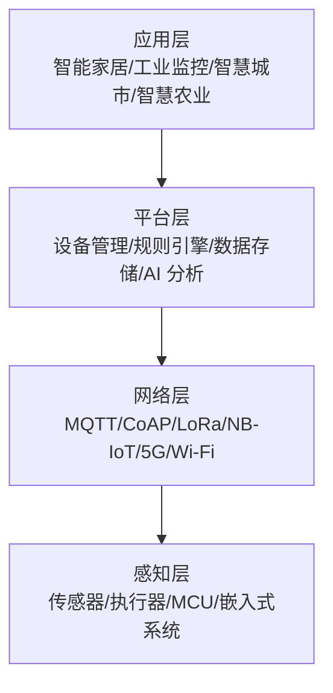
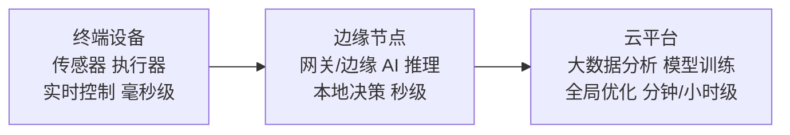

## 0. 零基础入门（从零开始）

### 0.1 零基础起点

本模块讲解物联网（IoT），零基础可学。硬件方面建议准备一块 ESP32 开发板（约 20-50 元）和一根 USB 数据线；软件方面安装 Arduino IDE 或 VS Code + PlatformIO。
物联网的直觉模型：传感器（如温度计）采集物理世界的数据，开发板把数据通过 Wi-Fi 发给服务器，你可以在手机或网页上看到并控制它。

### 0.2 第一个物联网程序：让 LED 灯闪烁

```cpp
// 每个 ESP32 程序都有 setup 和 loop 两个函数
void setup() {
  // 把 GPIO 2 引脚设置为输出模式（板上自带 LED 接在 2 号引脚）
  pinMode(2, OUTPUT);
}

void loop() {
  digitalWrite(2, HIGH);   // 引脚输出高电平：LED 点亮
  delay(1000);             // 保持 1 秒
  digitalWrite(2, LOW);    // 引脚输出低电平：LED 熄灭
  delay(1000);             // 保持 1 秒
}
```

ESP32 程序固定包含两个函数：setup 只运行一次（初始化），loop 不断循环（主逻辑）。
pinMode(2, OUTPUT) 把 2 号引脚配置为输出模式，表示这个引脚要向外供电驱动 LED。
digitalWrite(2, HIGH) 让引脚输出高电平（3.3V），LED 点亮；LOW 输出低电平（0V），LED 熄灭。
delay(1000) 让程序暂停 1 秒，否则 LED 亮灭切换太快肉眼无法分辨。
把代码上传到开发板后，你会看到板载 LED 每秒闪烁一次——这相当于物联网世界的“Hello World”，之后把 delay 换成传感器读数，就进入了真正的物联网开发。

## 1. IoT 概念

### 1.1 定义

物联网（Internet of Things, IoT）是通过**传感器、软件和网络连接**将物理设备与互联网连接起来的技术体系，实现物与物、人与物的智能互联。

### 1.2 发展历程

| 阶段       | 时间      | 特点             | 代表技术           |
| :--------- | :-------- | :--------------- | :----------------- |
| **萌芽期** | 1990s     | RFID 和 M2M 概念 | 条形码、RFID       |
| **起步期** | 2008-2012 | 传感器网络       | WSN、Zigbee        |
| **发展期** | 2013-2018 | 云平台和大数据   | AWS IoT、MQTT      |
| **成熟期** | 2019-2022 | 边缘计算和 AIoT  | 边缘推理、5G       |
| **智能化** | 2023-     | AI Agent + IoT   | 自主决策、数字孪生 |

### 1.3 IoT 核心特征

| 特征         | 描述                       |
| :----------- | :------------------------- |
| **全面感知** | 通过传感器获取物理世界信息 |
| **可靠传输** | 通过网络传输感知数据       |
| **智能处理** | 对数据进行存储、分析和决策 |
| **自动执行** | 根据决策自动控制设备       |

## 2. IoT 架构层次

### 2.1 四层架构



### 2.2 各层详解

| 层次       | 核心功能           | 关键技术             | 代表产品             |
| :--------- | :----------------- | :------------------- | :------------------- |
| **感知层** | 数据采集与执行     | 传感器、MCU、ADC/DAC | STM32、ESP32         |
| **网络层** | 数据传输           | MQTT、LoRa、NB-IoT   | EMQX、LoRa网关       |
| **平台层** | 设备管理与数据处理 | 云平台、规则引擎     | AWS IoT、ThingsBoard |
| **应用层** | 业务逻辑与用户交互 | Web/App、AI 分析     | 智能家居 App         |

### 2.3 边缘-云协同架构



## 3. 通信协议总览

### 3.1 协议分类

| 类别           | 协议               | 范围  | 特点           |
| :------------- | :----------------- | :---- | :------------- |
| **短距离**     | BLE、Zigbee、Wi-Fi | <100m | 高速率、低延迟 |
| **低功耗广域** | LoRa、NB-IoT       | <15km | 低功耗、低速率 |
| **蜂窝网络**   | 4G、5G             | 全国  | 高速率、高成本 |
| **应用层**     | MQTT、CoAP、HTTP   | -     | 设备-云通信    |

### 3.2 协议选型矩阵

| 场景     | 数据量 | 功耗 | 距离 | 推荐协议        |
| :------- | :----- | :--- | :--- | :-------------- |
| 智能家居 | 中     | 低   | 短   | Wi-Fi + BLE     |
| 环境监测 | 小     | 极低 | 远   | LoRa + MQTT     |
| 车联网   | 大     | 不限 | 远   | 5G + MQTT       |
| 工业控制 | 中     | 不限 | 短   | Ethernet + MQTT |
| 智慧农业 | 小     | 极低 | 远   | NB-IoT + CoAP   |

## 4. 应用场景

### 4.1 消费级 IoT

| 场景         | 设备             | 核心需求         |
| :----------- | :--------------- | :--------------- |
| **智能家居** | 灯光、空调、门锁 | 便捷、安全、互联 |
| **可穿戴**   | 手表、健康监测   | 低功耗、实时     |
| **车联网**   | T-Box、OBD       | 高可靠、低延迟   |

### 4.2 工业级 IoT（IIoT）

| 场景         | 设备            | 核心需求         |
| :----------- | :-------------- | :--------------- |
| **预测维护** | 振动/温度传感器 | 高精度、实时分析 |
| **数字孪生** | 全类型传感器    | 数据融合、可视化 |
| **质量检测** | 视觉/光谱传感器 | 高精度、AI 推理  |

### 4.3 城市级 IoT

| 场景         | 设备            | 核心需求       |
| :----------- | :-------------- | :------------- |
| **智慧照明** | 路灯控制器      | 节能、远程控制 |
| **环境监测** | 空气/噪声传感器 | 广覆盖、低功耗 |
| **智慧停车** | 地磁/摄像头     | 实时、准确     |

## 5. 行业趋势

### 5.1 技术趋势

| 趋势            | 描述               | 影响                   |
| :-------------- | :----------------- | :--------------------- |
| **AIoT**        | AI + IoT 融合      | 设备从感知走向认知     |
| **边缘智能**    | AI 推理下沉到边缘  | 降低延迟、保护隐私     |
| **5G IoT**      | 5G 网络切片        | 支持大规模、低延迟场景 |
| **数字孪生**    | 物理世界的数字映射 | 仿真、预测、优化       |
| **Matter 协议** | 智能家居统一标准   | 打破生态壁垒           |
| **卫星 IoT**    | 低轨卫星通信       | 覆盖偏远地区           |

### 5.2 市场规模

| 领域     | 2025 连接数(亿) | 2030 预测(亿) | CAGR |
| :------- | :-------------- | :------------ | :--- |
| 消费 IoT | 120             | 250           | 15%  |
| 工业 IoT | 50              | 150           | 25%  |
| 智慧城市 | 30              | 80            | 22%  |
| 智慧农业 | 10              | 40            | 32%  |

## 6. IoT 开发入门

### 6.1 技术栈

```
硬件层: 传感器 → MCU (STM32/ESP32) → 通信模块
  ↓
协议层: MQTT / CoAP / HTTP
  ↓
平台层: EMQX / ThingsBoard / AWS IoT Core
  ↓
应用层: Web / App / 数据分析
```

### 6.2 快速体验

```python
# 使用 paho-mqtt 连接 MQTT 服务器
import paho.mqtt.client as mqtt
import json
import time
import random

# 连接回调
def on_connect(client, userdata, flags, rc):
    print(f"连接结果: {rc}")
    client.subscribe("iot/sensor/commands")

# 消息回调
def on_message(client, userdata, msg):
    print(f"收到命令: {msg.topic} - {msg.payload.decode()}")

# 创建客户端
client = mqtt.Client(client_id="sensor_node_001")
client.on_connect = on_connect
client.on_message = on_message

# 连接服务器
client.connect("broker.emqx.io", 1883, 60)
client.loop_start()

# 模拟传感器数据上报
try:
    while True:
        data = {
            "device_id": "sensor_001",
            "temperature": round(random.uniform(20, 35), 1),
            "humidity": round(random.uniform(40, 80), 1),
            "timestamp": int(time.time())
        }
        client.publish("iot/sensor/data", json.dumps(data))
        print(f"上报数据: {data}")
        time.sleep(5)
except KeyboardInterrupt:
    client.loop_stop()
    client.disconnect()
```

## 7. 学习路线

```
入门 → 传感器与嵌入式 → 通信协议 → IoT 平台
  → 数据处理与分析 → 边缘计算 → 安全与隐私 → 实战项目
```

### 推荐学习顺序

1. 理解 IoT 架构和核心概念
2. 学习嵌入式开发（ESP32/STM32）
3. 掌握 MQTT 等通信协议
4. 了解 IoT 云平台
5. 学习时序数据库和流处理
6. 探索边缘计算和 AI 推理
7. 关注安全和隐私保护
8. 完成端到端实战项目

## 8. 小结

IoT 是连接物理世界和数字世界的桥梁：

1. **四层架构**（感知/网络/平台/应用）是理解 IoT 系统的基础
2. **通信协议**选型需综合考虑数据量、功耗、距离和成本
3. **AIoT** 是未来趋势，AI 能力正从云端下沉到边缘
4. 消费级 IoT 关注便捷和互联，工业级 IoT 关注可靠和实时
5. 入门建议从 ESP32 + MQTT 开始，逐步构建完整的 IoT 系统

## 参考文献

MQTT 规范：https://mqtt.org/
CoAP（RFC 7252）：https://www.rfc-editor.org/rfc/rfc7252
EMQX 文档：https://www.emqx.io/docs/zh/latest/
AWS IoT Core：https://aws.amazon.com/iot-core/
InfluxDB 文档：https://docs.influxdata.com/

## 延伸阅读

MQTT 与设备接入，见 035-iot 模块文档。
嵌入式 C 与硬件，见 025-c 模块。
时序数据与数据平台，见 052-big-data 模块。
黑马程序员 Bilibili 空间（https://space.bilibili.com/37974444 ）提供物联网课程。

## 深度专题扩展

以下专题从不同角度深入本文主题，供有进阶需求的读者研读。每个专题独立成节，内容相互补充。

### 13.1 MQTT 协议深入

报文类型：CONNECT/CONNACK/PUBLISH/PUBACK/SUBSCRIBE/SUBACK/PINGREQ/DISCONNECT。
会话状态：clean session、持久会话、消息保留（retain）与遗嘱（LWT）。
QoS 语义：0 至多一次，1 至少一次，2 恰好一次；QoS2 四步握手。
共享订阅（shared subscription）实现负载均衡；主题层级与通配符（+/#）。

### 13.2 边缘计算架构

边缘节点形态：网关、边缘服务器、设备端推理；部署容器或原生应用。
断网续传：本地消息队列 + 持久化 + 重连补传。
云端协同：模型下发（边缘推理）、规则下沉、影子同步。
KubeEdge/OpenYurt 把 K8s 延伸到边缘。

## 模块文档速查表

| 文档 | 主题 | 与本文的关联 |
| --- | --- | --- |
| 概述与架构 | 001-OverviewArchitecture | 本文自身 |
| 传感器与嵌入式 | 002-SensorEmbedded | 本文的并列主题 |
| 通信协议 | 003-CommunicationProtocol | 本文的并列主题 |
| 边缘计算 | 004-EdgeComputing | 本文的并列主题 |
| IoT 平台 | 005-IoT | 本文的并列主题 |
| 数据处理与分析 | 006-DataProcessingAnalysis | 本文的并列主题 |
| 安全与隐私 | 007-SecurityAndPrivacy | 本文的安全延伸 |
| 实战项目 | 008-PracticeProject | 本文的综合应用 |
| MQTT协议 | 009-MQTT | 本文的并列主题 |
| CoAP协议 | 010-CoAP | 本文的并列主题 |
| Arduino开发 | 011-ArduinoDevelopment | 本文的并列主题 |
| ESP32开发 | 012-ESP32Development | 本文的并列主题 |
| RT-Thread实时系统 | 013-RTThread | 本文的并列主题 |
| 边缘AI | 014-AI | 本文的并列主题 |
| LwM2M设备管理 | 015-LwM2MManagement | 本文的并列主题 |
| 时序数据库 | 016-TimeSeriesDatabase | 本文的并列主题 |
| 物联网安全 | 017-IoTSecurity | 本文的安全延伸 |
| 主流IoT平台 | 018-IoT | 本文的并列主题 |
| 数字孪生 | 019-DigitalTwin | 本文的并列主题 |
| 物联网 Mosquitto Broker 管理 | 020-MosquittoBrokerManage | 本文的并列主题 |
| 物联网 mosquitto_pub 发布命令 | 021-MosquittoPub | 本文的并列主题 |
| 物联网 mosquitto_sub 订阅命令 | 022-MosquittoSub | 本文的并列主题 |
| 物联网 ESP32 开发环境 | 023-ESP32Setup | 本文的前置基础 |
| 物联网 ESP32 GPIO 与引脚 | 024-ESP32GPIOPinout | 本文的并列主题 |
| 物联网 ESP32 I2C 通信 | 025-ESP32I2C | 本文的并列主题 |
| 物联网 ESP32 SPI 与 UART | 026-ESP32SPIUART | 本文的并列主题 |
| 物联网 ESP32 WiFi 配置 | 027-ESP32WiFiConfig | 本文的并列主题 |
| 物联网 ESP32 OTA 更新 | 028-ESP32OTA | 本文的并列主题 |
