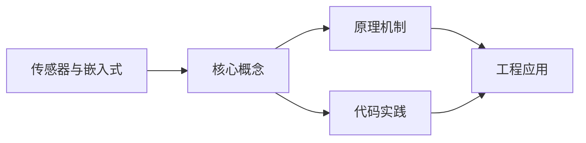
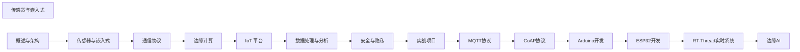

## 1. 学习目标（Bloom 分类）

本节按照布鲁姆教育目标分类学组织学习路径。本文主题为《传感器与嵌入式》，属于 物联网 模块，读者可以根据自身阶段选择阅读深度。

记忆层面：能够准确复述本文的核心概念、术语与基本语法或操作步骤，并能够在提问或检索时快速定位对应知识点。能够说出 物联网 的核心概念、组件与标准流程。

理解层面：能够用自己的语言解释核心原理与工作机制，说明概念之间的因果关系，而不是机械记忆结论。能够解释 物联网 的工作原理与关键机制。

应用层面：能够在真实项目或练习场景中运用本文知识解决具体问题，写出正确且可维护的实现。能够执行 物联网 相关的标准操作与配置。

分析层面：能够拆解复杂问题，比较本文主题与相邻概念的异同，识别边界条件与例外情况。能够分析 物联网 方案在可靠性、成本与性能上的权衡。

评价层面：能够根据约束条件（性能、可读性、安全、成本）评价不同方案的优劣，做出有依据的技术决策。能够评价 物联网 中的技术选型。

创造层面：能够把本文知识与其他模块知识组合，设计出新的解决方案或可复用的工程模式。能够设计基于 物联网 的完整解决方案。

通过本节学习，读者应当能够把《传感器与嵌入式》纳入自己的知识网络，并与 物联网 模块的其他主题（传感器、协议、边缘计算、设备管理）建立关联。

## 2. 历史动机与发展脉络

《传感器与嵌入式》是 物联网 领域的重要主题。要真正理解它，需要先了解它解决的问题与演进过程。

物联网（IoT）指设备互联的物理网络，起源可追溯到 1980 年代传感器网络；Kevin Ashton 1999 年提出 IoT 术语，RFID 是其早期载体。
架构分层：感知层（传感器/执行器）、网络层（连接）、平台层（设备管理/数据）、应用层（业务）；边缘计算将处理下沉到设备侧。
协议版图：MQTT（轻量发布订阅）、CoAP（受限设备）、HTTP/HTTPS、LoRa/NB-IoT（低功耗广域）、Zigbee/BLE（短距）。

回到本文主题：传感器与嵌入式 的提出与成熟，正是上述技术背景下的必然产物。早期实现往往以简单可用为目标，随着工程规模扩大，社区逐渐沉淀出标准做法与最佳实践；理解这一脉络，可以帮助读者判断“为什么文档中的推荐写法是现在这个样子”，也能在遇到历史遗留代码时准确识别其设计年代与取舍。


## 3. 形式化定义与核心概念精讲

本节把《传感器与嵌入式》涉及的核心概念以“定义 + 讲解”的形式展开。读者应把定义当作工具，把讲解当作理解路径；两者结合才能形成可迁移的知识。

MQTT：基于 TCP 的发布/订阅，QoS 0/1/2 分级投递，遗嘱消息；适合低带宽高延迟网络。
设备接入：设备注册、鉴权（X.509/Token）、上下行消息、影子设备（desired/reported 状态）。
边缘计算：边缘网关聚合数据、本地推理与断网续传；云端统一管理。

### 3.1 原文章节逐一精讲

原文档把主题拆分为 17 个小节，下面按顺序给出每一节的导读讲解，随后保留原文细节供精读。

#### 原文精读（完整保留）

# 物联网 ESP32 传感器读取

> **符号约定**：`< >` 必填参数 | `[ ]` 可选参数

---

#### 1. 传感器类型与原理

##### 1.1 传感器分类

| 类型       | 测量对象  | 代表传感器       | 输出信号 |
| :--------- | :-------- | :--------------- | :------- |
| **温度**   | 温度      | DS18B20、DHT22   | 数字/I2C |
| **湿度**   | 湿度      | DHT22、SHT30     | 数字/I2C |
| **压力**   | 气压/液压 | BMP280、MPX5010  | I2C/模拟 |
| **加速度** | 加速度    | MPU6050、ADXL345 | I2C/SPI  |
| **光照**   | 光强      | BH1750、光敏电阻 | I2C/模拟 |
| **气体**   | 气体浓度  | MQ-2、BME680     | 模拟/I2C |
| **距离**   | 距离      | HC-SR04、VL53L0X | 数字/I2C |
| **GPS**    | 位置      | NEO-6M、NEO-M8N  | UART     |

##### 1.2 模拟与数字传感器

| 类型     | 原理             | 优点           | 缺点             |
| :------- | :--------------- | :------------- | :--------------- |
| **模拟** | 输出连续电压信号 | 简单、低成本   | 需 ADC、抗干扰差 |
| **数字** | 输出数字信号     | 抗干扰、精度高 | 协议复杂         |

##### 1.3 ADC/DAC

```c
// STM32 ADC 读取模拟传感器
#include "stm32f4xx_hal.h"

ADC_HandleTypeDef hadc1;

void ADC_Init(void) {
    hadc1.Instance = ADC1;
    hadc1.Init.ClockPrescaler = ADC_CLOCK_SYNC_PCLK_DIV4;
    hadc1.Init.Resolution = ADC_RESOLUTION_12B;      // 12位精度
    hadc1.Init.ScanConvMode = DISABLE;
    hadc1.Init.ContinuousConvMode = ENABLE;           // 连续转换
    hadc1.Init.DMAContinuousRequests = ENABLE;
    HAL_ADC_Init(&hadc1);
}

uint16_t ADC_Read(uint32_t channel) {
    ADC_ChannelConfTypeDef sConfig = {0};
    sConfig.Channel = channel;
    sConfig.Rank = 1;
    sConfig.SamplingTime = ADC_SAMPLETIME_480CYCLES;
    HAL_ADC_ConfigChannel(&hadc1, &sConfig);

    HAL_ADC_Start(&hadc1);
    HAL_ADC_PollForConversion(&hadc1, HAL_MAX_DELAY);
    return HAL_ADC_GetValue(&hadc1);
}

// 将 ADC 值转换为电压和温度
float read_temperature(void) {
    uint16_t adc_value = ADC_Read(ADC_CHANNEL_0);
    float voltage = (adc_value / 4095.0f) * 3.3f;  // 12位, 3.3V参考
    float temperature = voltage * 100.0f;           // LM35: 10mV/°C
    return temperature;
}
```

#### 2. 嵌入式开发

##### 2.1 MCU 对比

| MCU             | 架构           | 主频   | Flash    | RAM   | Wi-Fi | 价格 |
| :-------------- | :------------- | :----- | :------- | :---- | :---- | :--- |
| **ESP32**       | Xtensa         | 240MHz | 4MB      | 520KB |       | ¥15  |
| **ESP32-S3**    | Xtensa         | 240MHz | 8-16MB   | 512KB |       | ¥20  |
| **STM32F4**     | ARM Cortex-M4  | 168MHz | 1MB      | 192KB |       | ¥25  |
| **STM32H7**     | ARM Cortex-M7  | 480MHz | 2MB      | 1MB   |       | ¥60  |
| **RP2040**      | ARM Cortex-M0+ | 133MHz | 16MB(外) | 264KB |       | ¥8   |
| **Arduino Uno** | AVR            | 16MHz  | 32KB     | 2KB   |       | ¥25  |

##### 2.2 ESP32 开发（Arduino）

```cpp
// ESP32 + DHT22 温湿度传感器
#include <WiFi.h>
#include <PubSubClient.h>
#include <DHT.h>

// 引脚定义
#define DHT_PIN 4
#define LED_PIN 2
#define DHT_TYPE DHT22

// WiFi 配置
const char* ssid = "YourWiFi";
const char* password = "YourPassword";

// MQTT 配置
const char* mqtt_server = "broker.emqx.io";
const int mqtt_port = 1883;
const char* mqtt_topic = "iot/sensor/data";

DHT dht(DHT_PIN, DHT_TYPE);
WiFiClient espClient;
PubSubClient client(espClient);

void setup_wifi() {
    delay(10);
    Serial.println("Connecting to WiFi...");
    WiFi.begin(ssid, password);
    while (WiFi.status() != WL_CONNECTED) {
        delay(500);
        Serial.print(".");
    }
    Serial.println("\nWiFi connected, IP: " + WiFi.localIP().toString());
}

void reconnect() {
    while (!client.connected()) {
        String clientId = "ESP32-" + String(random(0xffff), HEX);
        if (client.connect(clientId.c_str())) {
            Serial.println("MQTT connected");
            client.subscribe("iot/sensor/commands");
        } else {
            Serial.print("MQTT failed, rc=");
            Serial.print(client.state());
            delay(5000);
        }
    }
}

void callback(char* topic, byte* payload, unsigned int length) {
    String message;
    for (int i = 0; i < length; i++) {
        message += (char)payload[i];
    }
    Serial.println("Command: " + message);

    if (message == "LED_ON") digitalWrite(LED_PIN, HIGH);
    else if (message == "LED_OFF") digitalWrite(LED_PIN, LOW);
}

void setup() {
    Serial.begin(115200);
    dht.begin();
    pinMode(LED_PIN, OUTPUT);

    setup_wifi();
    client.setServer(mqtt_server, mqtt_port);
    client.setCallback(callback);
}

void loop() {
    if (!client.connected()) reconnect();
    client.loop();

    // 读取传感器
    float humidity = dht.readHumidity();
    float temperature = dht.readTemperature();

    if (isnan(humidity) || isnan(temperature)) {
        Serial.println("Sensor read failed!");
        delay(2000);
        return;
    }

    // 构建 JSON
    String payload = "{\"device\":\"ESP32-001\","
                     "\"temperature\":" + String(temperature, 1) + ","
                     "\"humidity\":" + String(humidity, 1) + "}";

    client.publish(mqtt_topic, payload.c_str());
    Serial.println("Published: " + payload);

    delay(5000);  // 每5秒上报
}
```

##### 2.3 ESP32 开发（MicroPython）

```python
# MicroPython - ESP32 温湿度上报
import machine
import dht
import time
import json
from umqtt.simple import MQTTClient

# 配置
WIFI_SSID = "YourWiFi"
WIFI_PASS = "YourPassword"
MQTT_BROKER = "broker.emqx.io"
MQTT_TOPIC = b"iot/sensor/data"

# 初始化
d = dht.DHT22(machine.Pin(4))
led = machine.Pin(2, machine.Pin.OUT)

def connect_wifi():
    import network
    sta = network.WLAN(network.STA_IF)
    sta.active(True)
    sta.connect(WIFI_SSID, WIFI_PASS)
    while not sta.isconnected():
        time.sleep(0.5)
    print("WiFi connected:", sta.ifconfig()[0])

def publish_data():
    mqtt = MQTTClient("esp32-001", MQTT_BROKER)
    mqtt.connect()

    while True:
        try:
            d.measure()
            data = {
                "device": "ESP32-001",
                "temperature": d.temperature(),
                "humidity": d.humidity(),
                "timestamp": time.time()
            }
            mqtt.publish(MQTT_TOPIC, json.dumps(data).encode())
            print("Published:", data)
        except Exception as e:
            print("Error:", e)

        time.sleep(5)

connect_wifi()
publish_data()
```

#### 3. 通信接口

##### 3.1 接口对比

| 接口       | 类型     | 速率           | 距离 | 设备数   | 用途              |
| :--------- | :------- | :------------- | :--- | :------- | :---------------- |
| **GPIO**   | 数字 I/O | -              | 板级 | 1        | LED、按键、继电器 |
| **I2C**    | 总线     | 100K-3.4Mbps   | 板级 | 127      | 传感器、EEPROM    |
| **SPI**    | 总线     | 10-80Mbps      | 板级 | 理论无限 | Flash、显示屏     |
| **UART**   | 点对点   | 9600-921600bps | 15m  | 1        | GPS、调试         |
| **1-Wire** | 总线     | 16.3kbps       | 100m | 100+     | DS18B20           |

##### 3.2 I2C 示例

```cpp
// ESP32 I2C 读取 BH1750 光照传感器
#include <Wire.h>

#define BH1750_ADDR 0x23

void setup() {
    Serial.begin(115200);
    Wire.begin(21, 22);  // SDA=21, SCL=22
}

uint16_t readLight() {
    Wire.beginTransmission(BH1750_ADDR);
    Wire.write(0x10);  // 连续高分辨率模式
    Wire.endTransmission();
    delay(120);

    Wire.requestFrom(BH1750_ADDR, 2);
    if (Wire.available() == 2) {
        uint16_t lux = (Wire.read() << 8) | Wire.read();
        return lux / 1.2;
    }
    return 0;
}

void loop() {
    uint16_t light = readLight();
    Serial.printf("Light: %d lux\n", light);
    delay(1000);
}
```

##### 3.3 SPI 示例

```cpp
// ESP32 SPI 读取数据
#include <SPI.h>

#define CS_PIN 5

void setup() {
    Serial.begin(115200);
    SPI.begin(18, 19, 23);  // SCK=18, MISO=19, MOSI=23
    pinMode(CS_PIN, OUTPUT);
    digitalWrite(CS_PIN, HIGH);
}

uint16_t spiRead16(uint8_t reg) {
    digitalWrite(CS_PIN, LOW);
    SPI.transfer(reg | 0x80);  // 读命令
    uint8_t msb = SPI.transfer(0x00);
    uint8_t lsb = SPI.transfer(0x00);
    digitalWrite(CS_PIN, HIGH);
    return (msb << 8) | lsb;
}
```

#### 4. 实时操作系统（RTOS）

##### 4.1 FreeRTOS

```c
// FreeRTOS 多任务示例
#include "freertos/FreeRTOS.h"
#include "freertos/task.h"
#include "freertos/queue.h"

// 数据队列
QueueHandle_t sensor_queue;

// 传感器读取任务
void sensor_task(void *pvParameters) {
    float sensor_data;
    while (1) {
        sensor_data = read_temperature();
        xQueueSend(sensor_queue, &sensor_data, portMAX_DELAY);
        vTaskDelay(pdMS_TO_TICKS(1000));  // 1秒周期
    }
}

// 数据上报任务
void upload_task(void *pvParameters) {
    float received_data;
    while (1) {
        if (xQueueReceive(sensor_queue, &received_data, portMAX_DELAY)) {
            mqtt_publish("iot/sensor/temp", &received_data);
        }
    }
}

// LED 闪烁任务
void led_task(void *pvParameters) {
    while (1) {
        gpio_set_level(LED_PIN, 1);
        vTaskDelay(pdMS_TO_TICKS(500));
        gpio_set_level(LED_PIN, 0);
        vTaskDelay(pdMS_TO_TICKS(500));
    }
}

void app_main() {
    sensor_queue = xQueueCreate(10, sizeof(float));

    xTaskCreate(sensor_task, "sensor", 4096, NULL, 2, NULL);
    xTaskCreate(upload_task, "upload", 4096, NULL, 1, NULL);
    xTaskCreate(led_task, "led", 2048, NULL, 0, NULL);
}
```

##### 4.2 任务优先级设计

| 任务       | 优先级 | 周期  | 说明               |
| :--------- | :----- | :---- | :----------------- |
| 安全监控   | 最高   | 10ms  | 紧急停止、过温保护 |
| 传感器采集 | 高     | 100ms | 数据采集           |
| 通信上报   | 中     | 1s    | MQTT 数据上报      |
| 显示更新   | 低     | 100ms | UI 刷新            |
| 系统维护   | 最低   | 10s   | 看门狗、日志       |

#### 5. 低功耗设计

##### 5.1 功耗模式

| 模式            | 电流      | 唤醒方式         | 适用场景 |
| :-------------- | :-------- | :--------------- | :------- |
| **Active**      | 100-240mA | -                | 正常运行 |
| **Light Sleep** | 0.8mA     | GPIO/Timer       | 短暂空闲 |
| **Deep Sleep**  | 10μA      | GPIO/Timer/Touch | 长期待机 |
| **Power Off**   | ~1μA      | 复位             | 极低功耗 |

##### 5.2 Deep Sleep 示例

```cpp
// ESP32 Deep Sleep 低功耗采集
#define uS_TO_S_FACTOR 1000000ULL
#define TIME_TO_SLEEP  300  // 5分钟

RTC_DATA_ATTR int bootCount = 0;  // RTC 内存保持

void setup() {
    Serial.begin(115200);
    bootCount++;
    Serial.printf("Boot #%d\n", bootCount);

    // 1. 唤醒后快速采集数据
    float temp = read_temperature();
    float humi = read_humidity();

    // 2. 连接 WiFi 并上报
    connect_wifi();
    mqtt_publish(temp, humi);

    // 3. 断开连接
    WiFi.disconnect(true);
    WiFi.mode(WIFI_OFF);

    // 4. 进入 Deep Sleep
    esp_sleep_enable_timer_wakeup(TIME_TO_SLEEP * uS_TO_S_FACTOR);
    esp_deep_sleep_start();
}

void loop() {
    // Deep Sleep 后不会执行到这里
}
```

##### 5.3 低功耗策略

| 策略         | 描述                 | 节电效果 |
| :----------- | :------------------- | :------- |
| **间歇工作** | 周期性唤醒采集       | 90-99%   |
| **降低频率** | 降低 CPU 主频        | 30-50%   |
| **关闭外设** | 不用时关闭 Wi-Fi/BLE | 60-80%   |
| **数据压缩** | 减少传输数据量       | 10-30%   |
| **批量传输** | 积攒后一次发送       | 20-40%   |

#### 6. 小结

传感器与嵌入式是 IoT 的硬件基础：

1. **传感器选型**需考虑精度、功耗、接口和成本
2. **ESP32** 是 IoT 开发的首选 MCU，内置 Wi-Fi/BLE，生态丰富
3. **I2C** 适合连接传感器，**SPI** 适合高速设备，**UART** 适合调试和 GPS
4. **FreeRTOS** 是嵌入式实时系统的标准，多任务协作提高效率
5. **Deep Sleep** 是电池供电设备的关键，可将功耗降至 μA 级
6. 低功耗设计需从硬件选型、软件策略和通信协议三方面综合考虑
#### DHT22 温湿度

**基本写法：包含 DHT 库**
`#include <DHT.h>`
```cpp
// 引入 Adafruit DHT 传感器库
#include <DHT.h>
```

---

**基本写法：初始化 DHT**
`DHT <名称>(<引脚>, <型号>);`
```cpp
// GPIO4 上接 DHT22
DHT dht(4, DHT22);
```

---

**基本写法：开始采集**
`<名称>.begin();`
```cpp
// 在 setup 中初始化传感器
dht.begin();
```

---

**基本写法：读取温度**
`<名称>.readTemperature()`
```cpp
// 返回摄氏温度
float t = dht.readTemperature();
```

---

**基本写法：读取湿度**
`<名称>.readHumidity()`
```cpp
// 返回相对湿度百分比
float h = dht.readHumidity();
```

---

**基本写法：检查读取失败**
```cpp
// 判断是否为 NaN 读取失败
if (isnan(t) || isnan(h)) {
  Serial.println("Failed to read DHT");
}
```

---

#### BME280 温湿度气压

**基本写法：包含 BME280 库**
`#include <Adafruit_BME280.h>`
```cpp
// 引入 BME280 库
#include <Adafruit_BME280.h>
```

---

**基本写法：初始化 BME280**
`<名称>.begin(<I2C 地址>);`
```cpp
// 默认地址 0x76 或 0x77
Adafruit_BME280 bme;
bool ok = bme.begin(0x76);
```

---

**基本写法：读取气压**
`<名称>.readPressure()`
```cpp
// 返回气压 Pa
float p = bme.readPressure();
```

---

**基本写法：读取海拔**
`<名称>.readAltitude(<海平面气压>);`
```cpp
// 计算海拔米
float alt = bme.readAltitude(1013.25);
```

---

#### DS18B20 单总线温度

**基本写法：包含 OneWire 与 DallasTemperature**
```cpp
// 引入单总线与 Dallas 温度库
#include <OneWire.h>
#include <DallasTemperature.h>
```

---

**基本写法：初始化 DS18B20**
```cpp
// GPIO5 接 DS18B20 数据线
OneWire oneWire(5);
DallasTemperature sensors(&oneWire);
sensors.begin();
```

---

**基本写法：请求温度转换**
`<名称>.requestTemperatures();`
```cpp
// 向所有传感器请求温度
sensors.requestTemperatures();
```

---

**基本写法：读取温度**
`<名称>.getTempCByIndex(<索引>)`
```cpp
// 读取第 0 个传感器温度
float t = sensors.getTempCByIndex(0);
```

---

**基本写法：按地址读取**
`<名称>.getTempC(<地址数组>)`
```cpp
// 通过 8 字节 ROM 地址读取
DeviceAddress addr;
sensors.getAddress(addr, 0);
float t = sensors.getTempC(addr);
```

---

#### 光敏传感器

**基本写法：模拟读取光强**
`analogRead(<引脚>)`
```cpp
// 读取 GPIO32 光敏电阻值 0-4095
int light = analogRead(32);
```

---

**基本写法：转换为 lux**
```cpp
// 简单映射到 0-1000 lux
float lux = map(light, 0, 4095, 0, 1000);
```

---

**基本写法：判断明暗**
```cpp
// 阈值判断白天黑夜
if (light < 1000) {
  Serial.println("Dark");
} else {
  Serial.println("Bright");
}
```

---

#### 土壤湿度传感器

**基本写法：模拟读取土壤湿度**
`analogRead(<引脚>)`
```cpp
// 读取 GPIO33 土壤湿度
int moisture = analogRead(33);
```

---

**基本写法：标定并换算百分比**
```cpp
// 通过标定值映射到 0-100%
int dry = 4095;
int wet = 1500;
int pct = map(moisture, dry, wet, 0, 100);
pct = constrain(pct, 0, 100);
```

---

**基本写法：电容式传感器读取**
```cpp
// 电容式土壤湿度需更长稳定时间
int moisture = analogRead(33);
delay(100);
```

---

#### 超声波测距 HC-SR04

**基本写法：定义触发与回响引脚**
```cpp
// 触发接 GPIO5 回响接 GPIO18
#define TRIG 5
#define ECHO 18
pinMode(TRIG, OUTPUT);
pinMode(ECHO, INPUT);
```

---

**基本写法：发送触发脉冲**
```cpp
// 10 微秒高电平触发测距
digitalWrite(TRIG, LOW);
delayMicroseconds(2);
digitalWrite(TRIG, HIGH);
delayMicroseconds(10);
digitalWrite(TRIG, LOW);
```

---

**基本写法：读取距离**
```cpp
// 通过回响高电平时长计算距离
long duration = pulseIn(ECHO, HIGH);
float distance = duration * 0.034 / 2;
```

---

**基本写法：过滤无效读数**
```cpp
// 过滤超出范围的读数
if (distance < 2 || distance > 400) {
  return -1;
}
```

---

#### PIR 人体感应

**基本写法：配置 PIR 引脚**
`pinMode(<引脚>, INPUT);`
```cpp
// GPIO14 接 PIR 输出
pinMode(14, INPUT);
```

---

**基本写法：读取 PIR 状态**
`digitalRead(<引脚>)`
```cpp
// 检测到人体返回 HIGH
int motion = digitalRead(14);
```

---

**基本写法：中断方式检测**
```cpp
// 通过中断实时响应
attachInterrupt(14, motionISR, RISING);
volatile bool motionDetected = false;
void motionISR() {
  motionDetected = true;
}
```

---

#### 继电器控制

**基本写法：配置继电器引脚**
`pinMode(<引脚>, OUTPUT);`
```cpp
// GPIO26 控制继电器
pinMode(26, OUTPUT);
```

---

**基本写法：打开继电器**
`digitalWrite(<引脚>, HIGH);`
```cpp
// 高电平触发继电器吸合
digitalWrite(26, HIGH);
```

---

**基本写法：关闭继电器**
`digitalWrite(<引脚>, LOW);`
```cpp
// 低电平释放继电器
digitalWrite(26, LOW);
```

---

#### MQ-2 气体检测

**基本写法：读取模拟气体值**
`analogRead(<引脚>)`
```cpp
// 读取 GPIO35 MQ-2 气体浓度
int gas = analogRead(35);
```

---

**基本写法：设置阈值告警**
```cpp
// 超过阈值判定为泄漏
if (gas > 2000) {
  Serial.println("Gas leak detected");
}
```

---

**基本写法：预热读取**
```cpp
// MQ-2 上电需预热 1-3 分钟
unsigned long start = millis();
while (millis() - start < 180000) {
  delay(1000);
}
```

---

#### 数据上报

**基本写法：周期性上报**
```cpp
// 每 60 秒读取并上报一次
unsigned long last = 0;
if (millis() - last >= 60000) {
  last = millis();
  float t = dht.readTemperature();
  publishSensor(t);
}
```

---

**基本写法：JSON 格式封装**
```cpp
// 将多传感器数据打包为 JSON
String json = "{";
json += "\"temp\":" + String(t) + ",";
json += "\"hum\":" + String(h) + ",";
json += "\"light\":" + String(light);
json += "}";
```

---

**基本写法：MQTT 上报**
```cpp
// 通过 PubSubClient 上报传感器数据
#include <PubSubClient.h>
client.publish("sensor/esp32-001", json.c_str());
```

---

#### 数据校准

**基本写法：多点标定**
```cpp
// 通过两点线性标定
float raw = analogRead(32);
float calibrated = (raw - rawLow) * (refHigh - refLow) / (rawHigh - rawLow) + refLow;
```

---

**基本写法：滑动平均滤波**
```cpp
// 滑动窗口平均减少抖动
const int N = 10;
int readings[N];
int idx = 0;
long total = 0;
total -= readings[idx];
readings[idx] = analogRead(32);
total += readings[idx];
idx = (idx + 1) % N;
float avg = total / (float)N;
```

---

**基本写法：剔除异常值**
```cpp
// 剔除超出合理范围的异常值
float value = readSensor();
if (value < MIN_VALID || value > MAX_VALID) {
  return lastValid;
}
lastValid = value;
```


### 3.2 概念关系图

下面用 Mermaid 图表达本文核心概念之间的关系，帮助读者建立整体图景：



图中展示的是本文知识的结构化关系：核心概念是入口，原理机制解释“为什么”，代码实践演示“怎么做”，工程应用回答“何时用”。读者学习时可以把每个小节的内容挂接到对应节点上。

## 4. 理论推导与原理解析

本节深入《传感器与嵌入式》背后的原理。理论部分不求面面俱到，而是聚焦“能解释现象、能指导实践”的关键推导。

MQTT：基于 TCP 的发布/订阅，QoS 0/1/2 分级投递，遗嘱消息；适合低带宽高延迟网络。
设备接入：设备注册、鉴权（X.509/Token）、上下行消息、影子设备（desired/reported 状态）。
边缘计算：边缘网关聚合数据、本地推理与断网续传；云端统一管理。
数据链路：采集 -> 清洗 -> 时序存储（InfluxDB/TDengine）-> 规则引擎 -> 应用。

需要强调的是，理论推导与工程实践之间存在翻译层：理论给出的是理想化模型与边界条件，工程代码则必须处理真实环境中的例外。读者在学习时应先掌握理论的“标准情形”，再通过陷阱章节了解“非标准情形”。

## 5. 代码示例与逐行讲解

本节把原文中的代码示例系统整理，并为每个示例补充用途说明与讲解。读者不应只浏览代码，而应逐段对照讲解理解设计意图。

### 5.1 示例：1.3 ADC/DAC

该示例来自原文《1.3 ADC/DAC》小节，用于演示传感器与嵌入式相关操作。阅读时请先看代码结构，再看其后的讲解。

```c
// STM32 ADC 读取模拟传感器
#include "stm32f4xx_hal.h"

ADC_HandleTypeDef hadc1;

void ADC_Init(void) {
    hadc1.Instance = ADC1;
    hadc1.Init.ClockPrescaler = ADC_CLOCK_SYNC_PCLK_DIV4;
    hadc1.Init.Resolution = ADC_RESOLUTION_12B;      // 12位精度
    hadc1.Init.ScanConvMode = DISABLE;
    hadc1.Init.ContinuousConvMode = ENABLE;           // 连续转换
    hadc1.Init.DMAContinuousRequests = ENABLE;
    HAL_ADC_Init(&hadc1);
}

uint16_t ADC_Read(uint32_t channel) {
    ADC_ChannelConfTypeDef sConfig = {0};
    sConfig.Channel = channel;
    sConfig.Rank = 1;
    sConfig.SamplingTime = ADC_SAMPLETIME_480CYCLES;
    HAL_ADC_ConfigChannel(&hadc1, &sConfig);

    HAL_ADC_Start(&hadc1);
    HAL_ADC_PollForConversion(&hadc1, HAL_MAX_DELAY);
    return HAL_ADC_GetValue(&hadc1);
}

// 将 ADC 值转换为电压和温度
float read_temperature(void) {
    uint16_t adc_value = ADC_Read(ADC_CHANNEL_0);
    float voltage = (adc_value / 4095.0f) * 3.3f;  // 12位, 3.3V参考
    float temperature = voltage * 100.0f;           // LM35: 10mV/°C
    return temperature;
}
```

讲解：这段代码演示了本节核心知识点。代码中的关键操作可以归纳为三步：准备（定义或初始化）、执行（核心逻辑）、收尾（释放资源或返回结果）。实际项目中，这三步往往被封装为函数或类，以提升复用性与可测试性。

关键点分析：

该示例共 29 行有效代码，包含 1 类关键结构（return）。其中：

- 入口与初始化部分负责建立上下文，对应实际项目中的启动或装配逻辑；
- 核心逻辑部分体现本文主题的主要操作，是阅读时最需要对照讲解理解的部分；
- 输出或返回部分把结果交给调用方，注意其类型与边界条件。

进阶思考路径：先尝试修改参数观察行为变化，再把示例中的模式迁移到自己的项目中；每次修改都记录预期与实测差异，这是把示例转化为能力的最快方式。

### 5.2 示例：2.2 ESP32 开发（Arduino）

该示例来自原文《2.2 ESP32 开发（Arduino）》小节，用于演示传感器与嵌入式相关操作。阅读时请先看代码结构，再看其后的讲解。

```cpp
// ESP32 + DHT22 温湿度传感器
#include <WiFi.h>
#include <PubSubClient.h>
#include <DHT.h>

// 引脚定义
#define DHT_PIN 4
#define LED_PIN 2
#define DHT_TYPE DHT22

// WiFi 配置
const char* ssid = "YourWiFi";
const char* password = "YourPassword";

// MQTT 配置
const char* mqtt_server = "broker.emqx.io";
const int mqtt_port = 1883;
const char* mqtt_topic = "iot/sensor/data";

DHT dht(DHT_PIN, DHT_TYPE);
WiFiClient espClient;
PubSubClient client(espClient);

void setup_wifi() {
    delay(10);
    Serial.println("Connecting to WiFi...");
    WiFi.begin(ssid, password);
    while (WiFi.status() != WL_CONNECTED) {
        delay(500);
        Serial.print(".");
    }
    Serial.println("\nWiFi connected, IP: " + WiFi.localIP().toString());
}

void reconnect() {
    while (!client.connected()) {
        String clientId = "ESP32-" + String(random(0xffff), HEX);
        if (client.connect(clientId.c_str())) {
            Serial.println("MQTT connected");
            client.subscribe("iot/sensor/commands");
        } else {
            Serial.print("MQTT failed, rc=");
            Serial.print(client.state());
            delay(5000);
        }
    }
}

void callback(char* topic, byte* payload, unsigned int length) {
    String message;
    for (int i = 0; i < length; i++) {
        message += (char)payload[i];
    }
    Serial.println("Command: " + message);

    if (message == "LED_ON") digitalWrite(LED_PIN, HIGH);
    else if (message == "LED_OFF") digitalWrite(LED_PIN, LOW);
}

void setup() {
    Serial.begin(115200);
    dht.begin();
    pinMode(LED_PIN, OUTPUT);

    setup_wifi();
    client.setServer(mqtt_server, mqtt_port);
    client.setCallback(callback);
}

void loop() {
    if (!client.connected()) reconnect();
    client.loop();

    // 读取传感器
    float humidity = dht.readHumidity();
    float temperature = dht.readTemperature();

    if (isnan(humidity) || isnan(temperature)) {
        Serial.println("Sensor read failed!");
        delay(2000);
        return;
    }

    // 构建 JSON
    String payload = "{\"device\":\"ESP32-001\","
                     "\"temperature\":" + String(temperature, 1) + ","
                     "\"humidity\":" + String(humidity, 1) + "}";

    client.publish(mqtt_topic, payload.c_str());
    Serial.println("Published: " + payload);

    delay(5000);  // 每5秒上报
}
```

讲解：这段代码演示了本节核心知识点。代码中的关键操作可以归纳为三步：准备（定义或初始化）、执行（核心逻辑）、收尾（释放资源或返回结果）。实际项目中，这三步往往被封装为函数或类，以提升复用性与可测试性。

关键点分析：

该示例共 77 行有效代码，包含 4 类关键结构（if、for、while、return）。其中：

- 入口与初始化部分负责建立上下文，对应实际项目中的启动或装配逻辑；
- 核心逻辑部分体现本文主题的主要操作，是阅读时最需要对照讲解理解的部分；
- 输出或返回部分把结果交给调用方，注意其类型与边界条件。

进阶思考路径：先尝试修改参数观察行为变化，再把示例中的模式迁移到自己的项目中；每次修改都记录预期与实测差异，这是把示例转化为能力的最快方式。

### 5.3 示例：2.3 ESP32 开发（MicroPython）

该示例来自原文《2.3 ESP32 开发（MicroPython）》小节，用于演示传感器与嵌入式相关操作。阅读时请先看代码结构，再看其后的讲解。

```python
# MicroPython - ESP32 温湿度上报
import machine
import dht
import time
import json
from umqtt.simple import MQTTClient

# 配置
WIFI_SSID = "YourWiFi"
WIFI_PASS = "YourPassword"
MQTT_BROKER = "broker.emqx.io"
MQTT_TOPIC = b"iot/sensor/data"

# 初始化
d = dht.DHT22(machine.Pin(4))
led = machine.Pin(2, machine.Pin.OUT)

def connect_wifi():
    import network
    sta = network.WLAN(network.STA_IF)
    sta.active(True)
    sta.connect(WIFI_SSID, WIFI_PASS)
    while not sta.isconnected():
        time.sleep(0.5)
    print("WiFi connected:", sta.ifconfig()[0])

def publish_data():
    mqtt = MQTTClient("esp32-001", MQTT_BROKER)
    mqtt.connect()

    while True:
        try:
            d.measure()
            data = {
                "device": "ESP32-001",
                "temperature": d.temperature(),
                "humidity": d.humidity(),
                "timestamp": time.time()
            }
            mqtt.publish(MQTT_TOPIC, json.dumps(data).encode())
            print("Published:", data)
        except Exception as e:
            print("Error:", e)

        time.sleep(5)

connect_wifi()
publish_data()
```

讲解：这段代码演示了本节核心知识点。代码中的关键操作可以归纳为三步：准备（定义或初始化）、执行（核心逻辑）、收尾（释放资源或返回结果）。实际项目中，这三步往往被封装为函数或类，以提升复用性与可测试性。

关键点分析：

该示例共 41 行有效代码，包含 4 类关键结构（def、import、from、while）。其中：

- 入口与初始化部分负责建立上下文，对应实际项目中的启动或装配逻辑；
- 核心逻辑部分体现本文主题的主要操作，是阅读时最需要对照讲解理解的部分；
- 输出或返回部分把结果交给调用方，注意其类型与边界条件。

进阶思考路径：先尝试修改参数观察行为变化，再把示例中的模式迁移到自己的项目中；每次修改都记录预期与实测差异，这是把示例转化为能力的最快方式。

### 5.4 示例：3.2 I2C 示例

该示例来自原文《3.2 I2C 示例》小节，用于演示传感器与嵌入式相关操作。阅读时请先看代码结构，再看其后的讲解。

```cpp
// ESP32 I2C 读取 BH1750 光照传感器
#include <Wire.h>

#define BH1750_ADDR 0x23

void setup() {
    Serial.begin(115200);
    Wire.begin(21, 22);  // SDA=21, SCL=22
}

uint16_t readLight() {
    Wire.beginTransmission(BH1750_ADDR);
    Wire.write(0x10);  // 连续高分辨率模式
    Wire.endTransmission();
    delay(120);

    Wire.requestFrom(BH1750_ADDR, 2);
    if (Wire.available() == 2) {
        uint16_t lux = (Wire.read() << 8) | Wire.read();
        return lux / 1.2;
    }
    return 0;
}

void loop() {
    uint16_t light = readLight();
    Serial.printf("Light: %d lux\n", light);
    delay(1000);
}
```

讲解：这段代码演示了本节核心知识点。代码中的关键操作可以归纳为三步：准备（定义或初始化）、执行（核心逻辑）、收尾（释放资源或返回结果）。实际项目中，这三步往往被封装为函数或类，以提升复用性与可测试性。

关键点分析：

该示例共 24 行有效代码，包含 2 类关键结构（if、return）。其中：

- 入口与初始化部分负责建立上下文，对应实际项目中的启动或装配逻辑；
- 核心逻辑部分体现本文主题的主要操作，是阅读时最需要对照讲解理解的部分；
- 输出或返回部分把结果交给调用方，注意其类型与边界条件。

进阶思考路径：先尝试修改参数观察行为变化，再把示例中的模式迁移到自己的项目中；每次修改都记录预期与实测差异，这是把示例转化为能力的最快方式。

### 5.5 示例：3.3 SPI 示例

该示例来自原文《3.3 SPI 示例》小节，用于演示传感器与嵌入式相关操作。阅读时请先看代码结构，再看其后的讲解。

```cpp
// ESP32 SPI 读取数据
#include <SPI.h>

#define CS_PIN 5

void setup() {
    Serial.begin(115200);
    SPI.begin(18, 19, 23);  // SCK=18, MISO=19, MOSI=23
    pinMode(CS_PIN, OUTPUT);
    digitalWrite(CS_PIN, HIGH);
}

uint16_t spiRead16(uint8_t reg) {
    digitalWrite(CS_PIN, LOW);
    SPI.transfer(reg | 0x80);  // 读命令
    uint8_t msb = SPI.transfer(0x00);
    uint8_t lsb = SPI.transfer(0x00);
    digitalWrite(CS_PIN, HIGH);
    return (msb << 8) | lsb;
}
```

讲解：这段代码演示了本节核心知识点。代码中的关键操作可以归纳为三步：准备（定义或初始化）、执行（核心逻辑）、收尾（释放资源或返回结果）。实际项目中，这三步往往被封装为函数或类，以提升复用性与可测试性。

关键点分析：

该示例共 17 行有效代码，包含 1 类关键结构（return）。其中：

- 入口与初始化部分负责建立上下文，对应实际项目中的启动或装配逻辑；
- 核心逻辑部分体现本文主题的主要操作，是阅读时最需要对照讲解理解的部分；
- 输出或返回部分把结果交给调用方，注意其类型与边界条件。

进阶思考路径：先尝试修改参数观察行为变化，再把示例中的模式迁移到自己的项目中；每次修改都记录预期与实测差异，这是把示例转化为能力的最快方式。

### 5.6 示例：4.1 FreeRTOS

该示例来自原文《4.1 FreeRTOS》小节，用于演示传感器与嵌入式相关操作。阅读时请先看代码结构，再看其后的讲解。

```c
// FreeRTOS 多任务示例
#include "freertos/FreeRTOS.h"
#include "freertos/task.h"
#include "freertos/queue.h"

// 数据队列
QueueHandle_t sensor_queue;

// 传感器读取任务
void sensor_task(void *pvParameters) {
    float sensor_data;
    while (1) {
        sensor_data = read_temperature();
        xQueueSend(sensor_queue, &sensor_data, portMAX_DELAY);
        vTaskDelay(pdMS_TO_TICKS(1000));  // 1秒周期
    }
}

// 数据上报任务
void upload_task(void *pvParameters) {
    float received_data;
    while (1) {
        if (xQueueReceive(sensor_queue, &received_data, portMAX_DELAY)) {
            mqtt_publish("iot/sensor/temp", &received_data);
        }
    }
}

// LED 闪烁任务
void led_task(void *pvParameters) {
    while (1) {
        gpio_set_level(LED_PIN, 1);
        vTaskDelay(pdMS_TO_TICKS(500));
        gpio_set_level(LED_PIN, 0);
        vTaskDelay(pdMS_TO_TICKS(500));
    }
}

void app_main() {
    sensor_queue = xQueueCreate(10, sizeof(float));

    xTaskCreate(sensor_task, "sensor", 4096, NULL, 2, NULL);
    xTaskCreate(upload_task, "upload", 4096, NULL, 1, NULL);
    xTaskCreate(led_task, "led", 2048, NULL, 0, NULL);
}
```

讲解：这段代码演示了本节核心知识点。代码中的关键操作可以归纳为三步：准备（定义或初始化）、执行（核心逻辑）、收尾（释放资源或返回结果）。实际项目中，这三步往往被封装为函数或类，以提升复用性与可测试性。

关键点分析：

该示例共 39 行有效代码，包含 2 类关键结构（if、while）。其中：

- 入口与初始化部分负责建立上下文，对应实际项目中的启动或装配逻辑；
- 核心逻辑部分体现本文主题的主要操作，是阅读时最需要对照讲解理解的部分；
- 输出或返回部分把结果交给调用方，注意其类型与边界条件。

进阶思考路径：先尝试修改参数观察行为变化，再把示例中的模式迁移到自己的项目中；每次修改都记录预期与实测差异，这是把示例转化为能力的最快方式。

### 5.7 示例：5.2 Deep Sleep 示例

该示例来自原文《5.2 Deep Sleep 示例》小节，用于演示传感器与嵌入式相关操作。阅读时请先看代码结构，再看其后的讲解。

```cpp
// ESP32 Deep Sleep 低功耗采集
#define uS_TO_S_FACTOR 1000000ULL
#define TIME_TO_SLEEP  300  // 5分钟

RTC_DATA_ATTR int bootCount = 0;  // RTC 内存保持

void setup() {
    Serial.begin(115200);
    bootCount++;
    Serial.printf("Boot #%d\n", bootCount);

    // 1. 唤醒后快速采集数据
    float temp = read_temperature();
    float humi = read_humidity();

    // 2. 连接 WiFi 并上报
    connect_wifi();
    mqtt_publish(temp, humi);

    // 3. 断开连接
    WiFi.disconnect(true);
    WiFi.mode(WIFI_OFF);

    // 4. 进入 Deep Sleep
    esp_sleep_enable_timer_wakeup(TIME_TO_SLEEP * uS_TO_S_FACTOR);
    esp_deep_sleep_start();
}

void loop() {
    // Deep Sleep 后不会执行到这里
}
```

讲解：这段代码演示了本节核心知识点。代码中的关键操作可以归纳为三步：准备（定义或初始化）、执行（核心逻辑）、收尾（释放资源或返回结果）。实际项目中，这三步往往被封装为函数或类，以提升复用性与可测试性。

关键点分析：

该示例共 24 行有效代码，结构以数据或配置为主。阅读时应关注：数据字段的含义、配置项的作用，以及它们与运行行为的对应关系。

进阶思考路径：先尝试修改参数观察行为变化，再把示例中的模式迁移到自己的项目中；每次修改都记录预期与实测差异，这是把示例转化为能力的最快方式。

### 5.8 示例：DHT22 温湿度

该示例来自原文《DHT22 温湿度》小节，用于演示传感器与嵌入式相关操作。阅读时请先看代码结构，再看其后的讲解。

```cpp
// 引入 Adafruit DHT 传感器库
#include <DHT.h>
```

讲解：这段代码演示了本节核心知识点。代码中的关键操作可以归纳为三步：准备（定义或初始化）、执行（核心逻辑）、收尾（释放资源或返回结果）。实际项目中，这三步往往被封装为函数或类，以提升复用性与可测试性。

关键点分析：

该示例共 2 行有效代码，结构以数据或配置为主。阅读时应关注：数据字段的含义、配置项的作用，以及它们与运行行为的对应关系。

进阶思考路径：先尝试修改参数观察行为变化，再把示例中的模式迁移到自己的项目中；每次修改都记录预期与实测差异，这是把示例转化为能力的最快方式。

### 5.9 示例：DHT22 温湿度

该示例来自原文《DHT22 温湿度》小节，用于演示传感器与嵌入式相关操作。阅读时请先看代码结构，再看其后的讲解。

```cpp
// GPIO4 上接 DHT22
DHT dht(4, DHT22);
```

讲解：这段代码演示了本节核心知识点。代码中的关键操作可以归纳为三步：准备（定义或初始化）、执行（核心逻辑）、收尾（释放资源或返回结果）。实际项目中，这三步往往被封装为函数或类，以提升复用性与可测试性。

关键点分析：

该示例共 2 行有效代码，结构以数据或配置为主。阅读时应关注：数据字段的含义、配置项的作用，以及它们与运行行为的对应关系。

进阶思考路径：先尝试修改参数观察行为变化，再把示例中的模式迁移到自己的项目中；每次修改都记录预期与实测差异，这是把示例转化为能力的最快方式。

### 5.10 示例：DHT22 温湿度

该示例来自原文《DHT22 温湿度》小节，用于演示传感器与嵌入式相关操作。阅读时请先看代码结构，再看其后的讲解。

```cpp
// 在 setup 中初始化传感器
dht.begin();
```

讲解：这段代码演示了本节核心知识点。代码中的关键操作可以归纳为三步：准备（定义或初始化）、执行（核心逻辑）、收尾（释放资源或返回结果）。实际项目中，这三步往往被封装为函数或类，以提升复用性与可测试性。

关键点分析：

该示例共 2 行有效代码，结构以数据或配置为主。阅读时应关注：数据字段的含义、配置项的作用，以及它们与运行行为的对应关系。

进阶思考路径：先尝试修改参数观察行为变化，再把示例中的模式迁移到自己的项目中；每次修改都记录预期与实测差异，这是把示例转化为能力的最快方式。

### 5.11 示例：DHT22 温湿度

该示例来自原文《DHT22 温湿度》小节，用于演示传感器与嵌入式相关操作。阅读时请先看代码结构，再看其后的讲解。

```cpp
// 返回摄氏温度
float t = dht.readTemperature();
```

讲解：这段代码演示了本节核心知识点。代码中的关键操作可以归纳为三步：准备（定义或初始化）、执行（核心逻辑）、收尾（释放资源或返回结果）。实际项目中，这三步往往被封装为函数或类，以提升复用性与可测试性。

关键点分析：

该示例共 2 行有效代码，结构以数据或配置为主。阅读时应关注：数据字段的含义、配置项的作用，以及它们与运行行为的对应关系。

进阶思考路径：先尝试修改参数观察行为变化，再把示例中的模式迁移到自己的项目中；每次修改都记录预期与实测差异，这是把示例转化为能力的最快方式。

### 5.12 示例：DHT22 温湿度

该示例来自原文《DHT22 温湿度》小节，用于演示传感器与嵌入式相关操作。阅读时请先看代码结构，再看其后的讲解。

```cpp
// 返回相对湿度百分比
float h = dht.readHumidity();
```

讲解：这段代码演示了本节核心知识点。代码中的关键操作可以归纳为三步：准备（定义或初始化）、执行（核心逻辑）、收尾（释放资源或返回结果）。实际项目中，这三步往往被封装为函数或类，以提升复用性与可测试性。

关键点分析：

该示例共 2 行有效代码，结构以数据或配置为主。阅读时应关注：数据字段的含义、配置项的作用，以及它们与运行行为的对应关系。

进阶思考路径：先尝试修改参数观察行为变化，再把示例中的模式迁移到自己的项目中；每次修改都记录预期与实测差异，这是把示例转化为能力的最快方式。

### 5.13 示例：DHT22 温湿度

该示例来自原文《DHT22 温湿度》小节，用于演示传感器与嵌入式相关操作。阅读时请先看代码结构，再看其后的讲解。

```cpp
// 判断是否为 NaN 读取失败
if (isnan(t) || isnan(h)) {
  Serial.println("Failed to read DHT");
}
```

讲解：这段代码演示了本节核心知识点。代码中的关键操作可以归纳为三步：准备（定义或初始化）、执行（核心逻辑）、收尾（释放资源或返回结果）。实际项目中，这三步往往被封装为函数或类，以提升复用性与可测试性。

关键点分析：

该示例共 4 行有效代码，包含 1 类关键结构（if）。其中：

- 入口与初始化部分负责建立上下文，对应实际项目中的启动或装配逻辑；
- 核心逻辑部分体现本文主题的主要操作，是阅读时最需要对照讲解理解的部分；
- 输出或返回部分把结果交给调用方，注意其类型与边界条件。

进阶思考路径：先尝试修改参数观察行为变化，再把示例中的模式迁移到自己的项目中；每次修改都记录预期与实测差异，这是把示例转化为能力的最快方式。

### 5.14 示例：BME280 温湿度气压

该示例来自原文《BME280 温湿度气压》小节，用于演示传感器与嵌入式相关操作。阅读时请先看代码结构，再看其后的讲解。

```cpp
// 引入 BME280 库
#include <Adafruit_BME280.h>
```

讲解：这段代码演示了本节核心知识点。代码中的关键操作可以归纳为三步：准备（定义或初始化）、执行（核心逻辑）、收尾（释放资源或返回结果）。实际项目中，这三步往往被封装为函数或类，以提升复用性与可测试性。

关键点分析：

该示例共 2 行有效代码，结构以数据或配置为主。阅读时应关注：数据字段的含义、配置项的作用，以及它们与运行行为的对应关系。

进阶思考路径：先尝试修改参数观察行为变化，再把示例中的模式迁移到自己的项目中；每次修改都记录预期与实测差异，这是把示例转化为能力的最快方式。

### 5.15 示例：BME280 温湿度气压

该示例来自原文《BME280 温湿度气压》小节，用于演示传感器与嵌入式相关操作。阅读时请先看代码结构，再看其后的讲解。

```cpp
// 默认地址 0x76 或 0x77
Adafruit_BME280 bme;
bool ok = bme.begin(0x76);
```

讲解：这段代码演示了本节核心知识点。代码中的关键操作可以归纳为三步：准备（定义或初始化）、执行（核心逻辑）、收尾（释放资源或返回结果）。实际项目中，这三步往往被封装为函数或类，以提升复用性与可测试性。

关键点分析：

该示例共 3 行有效代码，结构以数据或配置为主。阅读时应关注：数据字段的含义、配置项的作用，以及它们与运行行为的对应关系。

进阶思考路径：先尝试修改参数观察行为变化，再把示例中的模式迁移到自己的项目中；每次修改都记录预期与实测差异，这是把示例转化为能力的最快方式。

### 5.16 示例：BME280 温湿度气压

该示例来自原文《BME280 温湿度气压》小节，用于演示传感器与嵌入式相关操作。阅读时请先看代码结构，再看其后的讲解。

```cpp
// 返回气压 Pa
float p = bme.readPressure();
```

讲解：这段代码演示了本节核心知识点。代码中的关键操作可以归纳为三步：准备（定义或初始化）、执行（核心逻辑）、收尾（释放资源或返回结果）。实际项目中，这三步往往被封装为函数或类，以提升复用性与可测试性。

关键点分析：

该示例共 2 行有效代码，结构以数据或配置为主。阅读时应关注：数据字段的含义、配置项的作用，以及它们与运行行为的对应关系。

进阶思考路径：先尝试修改参数观察行为变化，再把示例中的模式迁移到自己的项目中；每次修改都记录预期与实测差异，这是把示例转化为能力的最快方式。

### 5.17 示例：BME280 温湿度气压

该示例来自原文《BME280 温湿度气压》小节，用于演示传感器与嵌入式相关操作。阅读时请先看代码结构，再看其后的讲解。

```cpp
// 计算海拔米
float alt = bme.readAltitude(1013.25);
```

讲解：这段代码演示了本节核心知识点。代码中的关键操作可以归纳为三步：准备（定义或初始化）、执行（核心逻辑）、收尾（释放资源或返回结果）。实际项目中，这三步往往被封装为函数或类，以提升复用性与可测试性。

关键点分析：

该示例共 2 行有效代码，结构以数据或配置为主。阅读时应关注：数据字段的含义、配置项的作用，以及它们与运行行为的对应关系。

进阶思考路径：先尝试修改参数观察行为变化，再把示例中的模式迁移到自己的项目中；每次修改都记录预期与实测差异，这是把示例转化为能力的最快方式。

### 5.18 示例：DS18B20 单总线温度

该示例来自原文《DS18B20 单总线温度》小节，用于演示传感器与嵌入式相关操作。阅读时请先看代码结构，再看其后的讲解。

```cpp
// 引入单总线与 Dallas 温度库
#include <OneWire.h>
#include <DallasTemperature.h>
```

讲解：这段代码演示了本节核心知识点。代码中的关键操作可以归纳为三步：准备（定义或初始化）、执行（核心逻辑）、收尾（释放资源或返回结果）。实际项目中，这三步往往被封装为函数或类，以提升复用性与可测试性。

关键点分析：

该示例共 3 行有效代码，结构以数据或配置为主。阅读时应关注：数据字段的含义、配置项的作用，以及它们与运行行为的对应关系。

进阶思考路径：先尝试修改参数观察行为变化，再把示例中的模式迁移到自己的项目中；每次修改都记录预期与实测差异，这是把示例转化为能力的最快方式。

### 5.19 示例：DS18B20 单总线温度

该示例来自原文《DS18B20 单总线温度》小节，用于演示传感器与嵌入式相关操作。阅读时请先看代码结构，再看其后的讲解。

```cpp
// GPIO5 接 DS18B20 数据线
OneWire oneWire(5);
DallasTemperature sensors(&oneWire);
sensors.begin();
```

讲解：这段代码演示了本节核心知识点。代码中的关键操作可以归纳为三步：准备（定义或初始化）、执行（核心逻辑）、收尾（释放资源或返回结果）。实际项目中，这三步往往被封装为函数或类，以提升复用性与可测试性。

关键点分析：

该示例共 4 行有效代码，结构以数据或配置为主。阅读时应关注：数据字段的含义、配置项的作用，以及它们与运行行为的对应关系。

进阶思考路径：先尝试修改参数观察行为变化，再把示例中的模式迁移到自己的项目中；每次修改都记录预期与实测差异，这是把示例转化为能力的最快方式。

### 5.20 示例：DS18B20 单总线温度

该示例来自原文《DS18B20 单总线温度》小节，用于演示传感器与嵌入式相关操作。阅读时请先看代码结构，再看其后的讲解。

```cpp
// 向所有传感器请求温度
sensors.requestTemperatures();
```

讲解：这段代码演示了本节核心知识点。代码中的关键操作可以归纳为三步：准备（定义或初始化）、执行（核心逻辑）、收尾（释放资源或返回结果）。实际项目中，这三步往往被封装为函数或类，以提升复用性与可测试性。

关键点分析：

该示例共 2 行有效代码，结构以数据或配置为主。阅读时应关注：数据字段的含义、配置项的作用，以及它们与运行行为的对应关系。

进阶思考路径：先尝试修改参数观察行为变化，再把示例中的模式迁移到自己的项目中；每次修改都记录预期与实测差异，这是把示例转化为能力的最快方式。

### 5.21 示例：DS18B20 单总线温度

该示例来自原文《DS18B20 单总线温度》小节，用于演示传感器与嵌入式相关操作。阅读时请先看代码结构，再看其后的讲解。

```cpp
// 读取第 0 个传感器温度
float t = sensors.getTempCByIndex(0);
```

讲解：这段代码演示了本节核心知识点。代码中的关键操作可以归纳为三步：准备（定义或初始化）、执行（核心逻辑）、收尾（释放资源或返回结果）。实际项目中，这三步往往被封装为函数或类，以提升复用性与可测试性。

关键点分析：

该示例共 2 行有效代码，结构以数据或配置为主。阅读时应关注：数据字段的含义、配置项的作用，以及它们与运行行为的对应关系。

进阶思考路径：先尝试修改参数观察行为变化，再把示例中的模式迁移到自己的项目中；每次修改都记录预期与实测差异，这是把示例转化为能力的最快方式。

### 5.22 示例：DS18B20 单总线温度

该示例来自原文《DS18B20 单总线温度》小节，用于演示传感器与嵌入式相关操作。阅读时请先看代码结构，再看其后的讲解。

```cpp
// 通过 8 字节 ROM 地址读取
DeviceAddress addr;
sensors.getAddress(addr, 0);
float t = sensors.getTempC(addr);
```

讲解：这段代码演示了本节核心知识点。代码中的关键操作可以归纳为三步：准备（定义或初始化）、执行（核心逻辑）、收尾（释放资源或返回结果）。实际项目中，这三步往往被封装为函数或类，以提升复用性与可测试性。

关键点分析：

该示例共 4 行有效代码，结构以数据或配置为主。阅读时应关注：数据字段的含义、配置项的作用，以及它们与运行行为的对应关系。

进阶思考路径：先尝试修改参数观察行为变化，再把示例中的模式迁移到自己的项目中；每次修改都记录预期与实测差异，这是把示例转化为能力的最快方式。

### 5.23 示例：光敏传感器

该示例来自原文《光敏传感器》小节，用于演示传感器与嵌入式相关操作。阅读时请先看代码结构，再看其后的讲解。

```cpp
// 读取 GPIO32 光敏电阻值 0-4095
int light = analogRead(32);
```

讲解：这段代码演示了本节核心知识点。代码中的关键操作可以归纳为三步：准备（定义或初始化）、执行（核心逻辑）、收尾（释放资源或返回结果）。实际项目中，这三步往往被封装为函数或类，以提升复用性与可测试性。

关键点分析：

该示例共 2 行有效代码，结构以数据或配置为主。阅读时应关注：数据字段的含义、配置项的作用，以及它们与运行行为的对应关系。

进阶思考路径：先尝试修改参数观察行为变化，再把示例中的模式迁移到自己的项目中；每次修改都记录预期与实测差异，这是把示例转化为能力的最快方式。

### 5.24 示例：光敏传感器

该示例来自原文《光敏传感器》小节，用于演示传感器与嵌入式相关操作。阅读时请先看代码结构，再看其后的讲解。

```cpp
// 简单映射到 0-1000 lux
float lux = map(light, 0, 4095, 0, 1000);
```

讲解：这段代码演示了本节核心知识点。代码中的关键操作可以归纳为三步：准备（定义或初始化）、执行（核心逻辑）、收尾（释放资源或返回结果）。实际项目中，这三步往往被封装为函数或类，以提升复用性与可测试性。

关键点分析：

该示例共 2 行有效代码，结构以数据或配置为主。阅读时应关注：数据字段的含义、配置项的作用，以及它们与运行行为的对应关系。

进阶思考路径：先尝试修改参数观察行为变化，再把示例中的模式迁移到自己的项目中；每次修改都记录预期与实测差异，这是把示例转化为能力的最快方式。

### 5.25 示例：光敏传感器

该示例来自原文《光敏传感器》小节，用于演示传感器与嵌入式相关操作。阅读时请先看代码结构，再看其后的讲解。

```cpp
// 阈值判断白天黑夜
if (light < 1000) {
  Serial.println("Dark");
} else {
  Serial.println("Bright");
}
```

讲解：这段代码演示了本节核心知识点。代码中的关键操作可以归纳为三步：准备（定义或初始化）、执行（核心逻辑）、收尾（释放资源或返回结果）。实际项目中，这三步往往被封装为函数或类，以提升复用性与可测试性。

关键点分析：

该示例共 6 行有效代码，包含 1 类关键结构（if）。其中：

- 入口与初始化部分负责建立上下文，对应实际项目中的启动或装配逻辑；
- 核心逻辑部分体现本文主题的主要操作，是阅读时最需要对照讲解理解的部分；
- 输出或返回部分把结果交给调用方，注意其类型与边界条件。

进阶思考路径：先尝试修改参数观察行为变化，再把示例中的模式迁移到自己的项目中；每次修改都记录预期与实测差异，这是把示例转化为能力的最快方式。

### 5.26 示例：土壤湿度传感器

该示例来自原文《土壤湿度传感器》小节，用于演示传感器与嵌入式相关操作。阅读时请先看代码结构，再看其后的讲解。

```cpp
// 读取 GPIO33 土壤湿度
int moisture = analogRead(33);
```

讲解：这段代码演示了本节核心知识点。代码中的关键操作可以归纳为三步：准备（定义或初始化）、执行（核心逻辑）、收尾（释放资源或返回结果）。实际项目中，这三步往往被封装为函数或类，以提升复用性与可测试性。

关键点分析：

该示例共 2 行有效代码，结构以数据或配置为主。阅读时应关注：数据字段的含义、配置项的作用，以及它们与运行行为的对应关系。

进阶思考路径：先尝试修改参数观察行为变化，再把示例中的模式迁移到自己的项目中；每次修改都记录预期与实测差异，这是把示例转化为能力的最快方式。

### 5.27 示例：土壤湿度传感器

该示例来自原文《土壤湿度传感器》小节，用于演示传感器与嵌入式相关操作。阅读时请先看代码结构，再看其后的讲解。

```cpp
// 通过标定值映射到 0-100%
int dry = 4095;
int wet = 1500;
int pct = map(moisture, dry, wet, 0, 100);
pct = constrain(pct, 0, 100);
```

讲解：这段代码演示了本节核心知识点。代码中的关键操作可以归纳为三步：准备（定义或初始化）、执行（核心逻辑）、收尾（释放资源或返回结果）。实际项目中，这三步往往被封装为函数或类，以提升复用性与可测试性。

关键点分析：

该示例共 5 行有效代码，结构以数据或配置为主。阅读时应关注：数据字段的含义、配置项的作用，以及它们与运行行为的对应关系。

进阶思考路径：先尝试修改参数观察行为变化，再把示例中的模式迁移到自己的项目中；每次修改都记录预期与实测差异，这是把示例转化为能力的最快方式。

### 5.28 示例：土壤湿度传感器

该示例来自原文《土壤湿度传感器》小节，用于演示传感器与嵌入式相关操作。阅读时请先看代码结构，再看其后的讲解。

```cpp
// 电容式土壤湿度需更长稳定时间
int moisture = analogRead(33);
delay(100);
```

讲解：这段代码演示了本节核心知识点。代码中的关键操作可以归纳为三步：准备（定义或初始化）、执行（核心逻辑）、收尾（释放资源或返回结果）。实际项目中，这三步往往被封装为函数或类，以提升复用性与可测试性。

关键点分析：

该示例共 3 行有效代码，结构以数据或配置为主。阅读时应关注：数据字段的含义、配置项的作用，以及它们与运行行为的对应关系。

进阶思考路径：先尝试修改参数观察行为变化，再把示例中的模式迁移到自己的项目中；每次修改都记录预期与实测差异，这是把示例转化为能力的最快方式。

### 5.29 示例：超声波测距 HC-SR04

该示例来自原文《超声波测距 HC-SR04》小节，用于演示传感器与嵌入式相关操作。阅读时请先看代码结构，再看其后的讲解。

```cpp
// 触发接 GPIO5 回响接 GPIO18
#define TRIG 5
#define ECHO 18
pinMode(TRIG, OUTPUT);
pinMode(ECHO, INPUT);
```

讲解：这段代码演示了本节核心知识点。代码中的关键操作可以归纳为三步：准备（定义或初始化）、执行（核心逻辑）、收尾（释放资源或返回结果）。实际项目中，这三步往往被封装为函数或类，以提升复用性与可测试性。

关键点分析：

该示例共 5 行有效代码，结构以数据或配置为主。阅读时应关注：数据字段的含义、配置项的作用，以及它们与运行行为的对应关系。

进阶思考路径：先尝试修改参数观察行为变化，再把示例中的模式迁移到自己的项目中；每次修改都记录预期与实测差异，这是把示例转化为能力的最快方式。

### 5.30 示例：超声波测距 HC-SR04

该示例来自原文《超声波测距 HC-SR04》小节，用于演示传感器与嵌入式相关操作。阅读时请先看代码结构，再看其后的讲解。

```cpp
// 10 微秒高电平触发测距
digitalWrite(TRIG, LOW);
delayMicroseconds(2);
digitalWrite(TRIG, HIGH);
delayMicroseconds(10);
digitalWrite(TRIG, LOW);
```

讲解：这段代码演示了本节核心知识点。代码中的关键操作可以归纳为三步：准备（定义或初始化）、执行（核心逻辑）、收尾（释放资源或返回结果）。实际项目中，这三步往往被封装为函数或类，以提升复用性与可测试性。

关键点分析：

该示例共 6 行有效代码，结构以数据或配置为主。阅读时应关注：数据字段的含义、配置项的作用，以及它们与运行行为的对应关系。

进阶思考路径：先尝试修改参数观察行为变化，再把示例中的模式迁移到自己的项目中；每次修改都记录预期与实测差异，这是把示例转化为能力的最快方式。

### 5.31 示例：超声波测距 HC-SR04

该示例来自原文《超声波测距 HC-SR04》小节，用于演示传感器与嵌入式相关操作。阅读时请先看代码结构，再看其后的讲解。

```cpp
// 通过回响高电平时长计算距离
long duration = pulseIn(ECHO, HIGH);
float distance = duration * 0.034 / 2;
```

讲解：这段代码演示了本节核心知识点。代码中的关键操作可以归纳为三步：准备（定义或初始化）、执行（核心逻辑）、收尾（释放资源或返回结果）。实际项目中，这三步往往被封装为函数或类，以提升复用性与可测试性。

关键点分析：

该示例共 3 行有效代码，结构以数据或配置为主。阅读时应关注：数据字段的含义、配置项的作用，以及它们与运行行为的对应关系。

进阶思考路径：先尝试修改参数观察行为变化，再把示例中的模式迁移到自己的项目中；每次修改都记录预期与实测差异，这是把示例转化为能力的最快方式。

### 5.32 示例：超声波测距 HC-SR04

该示例来自原文《超声波测距 HC-SR04》小节，用于演示传感器与嵌入式相关操作。阅读时请先看代码结构，再看其后的讲解。

```cpp
// 过滤超出范围的读数
if (distance < 2 || distance > 400) {
  return -1;
}
```

讲解：这段代码演示了本节核心知识点。代码中的关键操作可以归纳为三步：准备（定义或初始化）、执行（核心逻辑）、收尾（释放资源或返回结果）。实际项目中，这三步往往被封装为函数或类，以提升复用性与可测试性。

关键点分析：

该示例共 4 行有效代码，包含 2 类关键结构（if、return）。其中：

- 入口与初始化部分负责建立上下文，对应实际项目中的启动或装配逻辑；
- 核心逻辑部分体现本文主题的主要操作，是阅读时最需要对照讲解理解的部分；
- 输出或返回部分把结果交给调用方，注意其类型与边界条件。

进阶思考路径：先尝试修改参数观察行为变化，再把示例中的模式迁移到自己的项目中；每次修改都记录预期与实测差异，这是把示例转化为能力的最快方式。

### 5.33 示例：PIR 人体感应

该示例来自原文《PIR 人体感应》小节，用于演示传感器与嵌入式相关操作。阅读时请先看代码结构，再看其后的讲解。

```cpp
// GPIO14 接 PIR 输出
pinMode(14, INPUT);
```

讲解：这段代码演示了本节核心知识点。代码中的关键操作可以归纳为三步：准备（定义或初始化）、执行（核心逻辑）、收尾（释放资源或返回结果）。实际项目中，这三步往往被封装为函数或类，以提升复用性与可测试性。

关键点分析：

该示例共 2 行有效代码，结构以数据或配置为主。阅读时应关注：数据字段的含义、配置项的作用，以及它们与运行行为的对应关系。

进阶思考路径：先尝试修改参数观察行为变化，再把示例中的模式迁移到自己的项目中；每次修改都记录预期与实测差异，这是把示例转化为能力的最快方式。

### 5.34 示例：PIR 人体感应

该示例来自原文《PIR 人体感应》小节，用于演示传感器与嵌入式相关操作。阅读时请先看代码结构，再看其后的讲解。

```cpp
// 检测到人体返回 HIGH
int motion = digitalRead(14);
```

讲解：这段代码演示了本节核心知识点。代码中的关键操作可以归纳为三步：准备（定义或初始化）、执行（核心逻辑）、收尾（释放资源或返回结果）。实际项目中，这三步往往被封装为函数或类，以提升复用性与可测试性。

关键点分析：

该示例共 2 行有效代码，结构以数据或配置为主。阅读时应关注：数据字段的含义、配置项的作用，以及它们与运行行为的对应关系。

进阶思考路径：先尝试修改参数观察行为变化，再把示例中的模式迁移到自己的项目中；每次修改都记录预期与实测差异，这是把示例转化为能力的最快方式。

### 5.35 示例：PIR 人体感应

该示例来自原文《PIR 人体感应》小节，用于演示传感器与嵌入式相关操作。阅读时请先看代码结构，再看其后的讲解。

```cpp
// 通过中断实时响应
attachInterrupt(14, motionISR, RISING);
volatile bool motionDetected = false;
void motionISR() {
  motionDetected = true;
}
```

讲解：这段代码演示了本节核心知识点。代码中的关键操作可以归纳为三步：准备（定义或初始化）、执行（核心逻辑）、收尾（释放资源或返回结果）。实际项目中，这三步往往被封装为函数或类，以提升复用性与可测试性。

关键点分析：

该示例共 6 行有效代码，结构以数据或配置为主。阅读时应关注：数据字段的含义、配置项的作用，以及它们与运行行为的对应关系。

进阶思考路径：先尝试修改参数观察行为变化，再把示例中的模式迁移到自己的项目中；每次修改都记录预期与实测差异，这是把示例转化为能力的最快方式。

### 5.36 示例：继电器控制

该示例来自原文《继电器控制》小节，用于演示传感器与嵌入式相关操作。阅读时请先看代码结构，再看其后的讲解。

```cpp
// GPIO26 控制继电器
pinMode(26, OUTPUT);
```

讲解：这段代码演示了本节核心知识点。代码中的关键操作可以归纳为三步：准备（定义或初始化）、执行（核心逻辑）、收尾（释放资源或返回结果）。实际项目中，这三步往往被封装为函数或类，以提升复用性与可测试性。

关键点分析：

该示例共 2 行有效代码，结构以数据或配置为主。阅读时应关注：数据字段的含义、配置项的作用，以及它们与运行行为的对应关系。

进阶思考路径：先尝试修改参数观察行为变化，再把示例中的模式迁移到自己的项目中；每次修改都记录预期与实测差异，这是把示例转化为能力的最快方式。

### 5.37 示例：继电器控制

该示例来自原文《继电器控制》小节，用于演示传感器与嵌入式相关操作。阅读时请先看代码结构，再看其后的讲解。

```cpp
// 高电平触发继电器吸合
digitalWrite(26, HIGH);
```

讲解：这段代码演示了本节核心知识点。代码中的关键操作可以归纳为三步：准备（定义或初始化）、执行（核心逻辑）、收尾（释放资源或返回结果）。实际项目中，这三步往往被封装为函数或类，以提升复用性与可测试性。

关键点分析：

该示例共 2 行有效代码，结构以数据或配置为主。阅读时应关注：数据字段的含义、配置项的作用，以及它们与运行行为的对应关系。

进阶思考路径：先尝试修改参数观察行为变化，再把示例中的模式迁移到自己的项目中；每次修改都记录预期与实测差异，这是把示例转化为能力的最快方式。

### 5.38 示例：继电器控制

该示例来自原文《继电器控制》小节，用于演示传感器与嵌入式相关操作。阅读时请先看代码结构，再看其后的讲解。

```cpp
// 低电平释放继电器
digitalWrite(26, LOW);
```

讲解：这段代码演示了本节核心知识点。代码中的关键操作可以归纳为三步：准备（定义或初始化）、执行（核心逻辑）、收尾（释放资源或返回结果）。实际项目中，这三步往往被封装为函数或类，以提升复用性与可测试性。

关键点分析：

该示例共 2 行有效代码，结构以数据或配置为主。阅读时应关注：数据字段的含义、配置项的作用，以及它们与运行行为的对应关系。

进阶思考路径：先尝试修改参数观察行为变化，再把示例中的模式迁移到自己的项目中；每次修改都记录预期与实测差异，这是把示例转化为能力的最快方式。

### 5.39 示例：MQ-2 气体检测

该示例来自原文《MQ-2 气体检测》小节，用于演示传感器与嵌入式相关操作。阅读时请先看代码结构，再看其后的讲解。

```cpp
// 读取 GPIO35 MQ-2 气体浓度
int gas = analogRead(35);
```

讲解：这段代码演示了本节核心知识点。代码中的关键操作可以归纳为三步：准备（定义或初始化）、执行（核心逻辑）、收尾（释放资源或返回结果）。实际项目中，这三步往往被封装为函数或类，以提升复用性与可测试性。

关键点分析：

该示例共 2 行有效代码，结构以数据或配置为主。阅读时应关注：数据字段的含义、配置项的作用，以及它们与运行行为的对应关系。

进阶思考路径：先尝试修改参数观察行为变化，再把示例中的模式迁移到自己的项目中；每次修改都记录预期与实测差异，这是把示例转化为能力的最快方式。

### 5.40 示例：MQ-2 气体检测

该示例来自原文《MQ-2 气体检测》小节，用于演示传感器与嵌入式相关操作。阅读时请先看代码结构，再看其后的讲解。

```cpp
// 超过阈值判定为泄漏
if (gas > 2000) {
  Serial.println("Gas leak detected");
}
```

讲解：这段代码演示了本节核心知识点。代码中的关键操作可以归纳为三步：准备（定义或初始化）、执行（核心逻辑）、收尾（释放资源或返回结果）。实际项目中，这三步往往被封装为函数或类，以提升复用性与可测试性。

关键点分析：

该示例共 4 行有效代码，包含 1 类关键结构（if）。其中：

- 入口与初始化部分负责建立上下文，对应实际项目中的启动或装配逻辑；
- 核心逻辑部分体现本文主题的主要操作，是阅读时最需要对照讲解理解的部分；
- 输出或返回部分把结果交给调用方，注意其类型与边界条件。

进阶思考路径：先尝试修改参数观察行为变化，再把示例中的模式迁移到自己的项目中；每次修改都记录预期与实测差异，这是把示例转化为能力的最快方式。

### 5.41 示例：MQ-2 气体检测

该示例来自原文《MQ-2 气体检测》小节，用于演示传感器与嵌入式相关操作。阅读时请先看代码结构，再看其后的讲解。

```cpp
// MQ-2 上电需预热 1-3 分钟
unsigned long start = millis();
while (millis() - start < 180000) {
  delay(1000);
}
```

讲解：这段代码演示了本节核心知识点。代码中的关键操作可以归纳为三步：准备（定义或初始化）、执行（核心逻辑）、收尾（释放资源或返回结果）。实际项目中，这三步往往被封装为函数或类，以提升复用性与可测试性。

关键点分析：

该示例共 5 行有效代码，包含 1 类关键结构（while）。其中：

- 入口与初始化部分负责建立上下文，对应实际项目中的启动或装配逻辑；
- 核心逻辑部分体现本文主题的主要操作，是阅读时最需要对照讲解理解的部分；
- 输出或返回部分把结果交给调用方，注意其类型与边界条件。

进阶思考路径：先尝试修改参数观察行为变化，再把示例中的模式迁移到自己的项目中；每次修改都记录预期与实测差异，这是把示例转化为能力的最快方式。

### 5.42 示例：数据上报

该示例来自原文《数据上报》小节，用于演示传感器与嵌入式相关操作。阅读时请先看代码结构，再看其后的讲解。

```cpp
// 每 60 秒读取并上报一次
unsigned long last = 0;
if (millis() - last >= 60000) {
  last = millis();
  float t = dht.readTemperature();
  publishSensor(t);
}
```

讲解：这段代码演示了本节核心知识点。代码中的关键操作可以归纳为三步：准备（定义或初始化）、执行（核心逻辑）、收尾（释放资源或返回结果）。实际项目中，这三步往往被封装为函数或类，以提升复用性与可测试性。

关键点分析：

该示例共 7 行有效代码，包含 1 类关键结构（if）。其中：

- 入口与初始化部分负责建立上下文，对应实际项目中的启动或装配逻辑；
- 核心逻辑部分体现本文主题的主要操作，是阅读时最需要对照讲解理解的部分；
- 输出或返回部分把结果交给调用方，注意其类型与边界条件。

进阶思考路径：先尝试修改参数观察行为变化，再把示例中的模式迁移到自己的项目中；每次修改都记录预期与实测差异，这是把示例转化为能力的最快方式。

### 5.43 示例：数据上报

该示例来自原文《数据上报》小节，用于演示传感器与嵌入式相关操作。阅读时请先看代码结构，再看其后的讲解。

```cpp
// 将多传感器数据打包为 JSON
String json = "{";
json += "\"temp\":" + String(t) + ",";
json += "\"hum\":" + String(h) + ",";
json += "\"light\":" + String(light);
json += "}";
```

讲解：这段代码演示了本节核心知识点。代码中的关键操作可以归纳为三步：准备（定义或初始化）、执行（核心逻辑）、收尾（释放资源或返回结果）。实际项目中，这三步往往被封装为函数或类，以提升复用性与可测试性。

关键点分析：

该示例共 6 行有效代码，结构以数据或配置为主。阅读时应关注：数据字段的含义、配置项的作用，以及它们与运行行为的对应关系。

进阶思考路径：先尝试修改参数观察行为变化，再把示例中的模式迁移到自己的项目中；每次修改都记录预期与实测差异，这是把示例转化为能力的最快方式。

### 5.44 示例：数据上报

该示例来自原文《数据上报》小节，用于演示传感器与嵌入式相关操作。阅读时请先看代码结构，再看其后的讲解。

```cpp
// 通过 PubSubClient 上报传感器数据
#include <PubSubClient.h>
client.publish("sensor/esp32-001", json.c_str());
```

讲解：这段代码演示了本节核心知识点。代码中的关键操作可以归纳为三步：准备（定义或初始化）、执行（核心逻辑）、收尾（释放资源或返回结果）。实际项目中，这三步往往被封装为函数或类，以提升复用性与可测试性。

关键点分析：

该示例共 3 行有效代码，结构以数据或配置为主。阅读时应关注：数据字段的含义、配置项的作用，以及它们与运行行为的对应关系。

进阶思考路径：先尝试修改参数观察行为变化，再把示例中的模式迁移到自己的项目中；每次修改都记录预期与实测差异，这是把示例转化为能力的最快方式。

### 5.45 示例：数据校准

该示例来自原文《数据校准》小节，用于演示传感器与嵌入式相关操作。阅读时请先看代码结构，再看其后的讲解。

```cpp
// 通过两点线性标定
float raw = analogRead(32);
float calibrated = (raw - rawLow) * (refHigh - refLow) / (rawHigh - rawLow) + refLow;
```

讲解：这段代码演示了本节核心知识点。代码中的关键操作可以归纳为三步：准备（定义或初始化）、执行（核心逻辑）、收尾（释放资源或返回结果）。实际项目中，这三步往往被封装为函数或类，以提升复用性与可测试性。

关键点分析：

该示例共 3 行有效代码，结构以数据或配置为主。阅读时应关注：数据字段的含义、配置项的作用，以及它们与运行行为的对应关系。

进阶思考路径：先尝试修改参数观察行为变化，再把示例中的模式迁移到自己的项目中；每次修改都记录预期与实测差异，这是把示例转化为能力的最快方式。

### 5.46 示例：数据校准

该示例来自原文《数据校准》小节，用于演示传感器与嵌入式相关操作。阅读时请先看代码结构，再看其后的讲解。

```cpp
// 滑动窗口平均减少抖动
const int N = 10;
int readings[N];
int idx = 0;
long total = 0;
total -= readings[idx];
readings[idx] = analogRead(32);
total += readings[idx];
idx = (idx + 1) % N;
float avg = total / (float)N;
```

讲解：这段代码演示了本节核心知识点。代码中的关键操作可以归纳为三步：准备（定义或初始化）、执行（核心逻辑）、收尾（释放资源或返回结果）。实际项目中，这三步往往被封装为函数或类，以提升复用性与可测试性。

关键点分析：

该示例共 10 行有效代码，结构以数据或配置为主。阅读时应关注：数据字段的含义、配置项的作用，以及它们与运行行为的对应关系。

进阶思考路径：先尝试修改参数观察行为变化，再把示例中的模式迁移到自己的项目中；每次修改都记录预期与实测差异，这是把示例转化为能力的最快方式。

### 5.47 示例：数据校准

该示例来自原文《数据校准》小节，用于演示传感器与嵌入式相关操作。阅读时请先看代码结构，再看其后的讲解。

```cpp
// 剔除超出合理范围的异常值
float value = readSensor();
if (value < MIN_VALID || value > MAX_VALID) {
  return lastValid;
}
lastValid = value;
```

讲解：这段代码演示了本节核心知识点。代码中的关键操作可以归纳为三步：准备（定义或初始化）、执行（核心逻辑）、收尾（释放资源或返回结果）。实际项目中，这三步往往被封装为函数或类，以提升复用性与可测试性。

关键点分析：

该示例共 6 行有效代码，包含 2 类关键结构（if、return）。其中：

- 入口与初始化部分负责建立上下文，对应实际项目中的启动或装配逻辑；
- 核心逻辑部分体现本文主题的主要操作，是阅读时最需要对照讲解理解的部分；
- 输出或返回部分把结果交给调用方，注意其类型与边界条件。

进阶思考路径：先尝试修改参数观察行为变化，再把示例中的模式迁移到自己的项目中；每次修改都记录预期与实测差异，这是把示例转化为能力的最快方式。


综合以上示例，可以总结出本主题的代码实践要点：第一，先定义清晰的输入输出契约；第二，核心逻辑保持单一职责；第三，错误处理与边界条件不可省略；第四，命名与注释表达意图而非复述代码。

## 6. 对比分析

对比是理解《传感器与嵌入式》定位的最快路径。下面从多个维度与相邻方案进行对比。

MQTT 与 CoAP：MQTT 可靠投递与复杂订阅；CoAP 类 HTTP 请求响应，UDP 更轻。
边缘与云端计算：边缘低延迟省带宽，云端算力与全局视图。
短距与广域：BLE/Zigbee 室内短距；LoRa/NB-IoT 广域低功耗。

对比的目的不是分出绝对优劣，而是建立选择依据：不同约束条件下，最优解不同。读者应把每个对比维度转化为决策检查清单。

## 7. 常见陷阱与最佳实践

本节整理该主题的高频错误与推荐做法。每个陷阱先描述现象，再解释原因，最后给出最佳实践。

### 7.1 协议选择错误

高功耗设备用 HTTP 轮询浪费电。低功耗场景用 MQTT/CoAP。

深入讲解：该问题之所以被归类为“常见陷阱”，是因为它在初学者的代码中反复出现，而且往往不在第一时间暴露——错误通常隐藏在特定数据或特定时序下。

从成因上看，协议选择错误 一般源于对 物联网 某个机制的理解偏差：要么误用了默认行为，要么忽略了边界条件，要么把其他语言的思维惯性带了过来。

从影响上看，协议选择错误 轻则产生错误结果，重则导致资源泄漏、数据损坏或安全事故；这也是为什么工程评审中会把它列为检查项。

从修复策略上看，处理协议选择错误的正确顺序是：先复现（构造最小用例），再定位（确认机制层面的根因），最后修复并补充回归测试。跳过复现直接改代码，往往治标不治本。

### 7.2 安全裸奔

设备弱口令与明文传输。证书鉴权 + TLS。

深入讲解：该问题之所以被归类为“常见陷阱”，是因为它在初学者的代码中反复出现，而且往往不在第一时间暴露——错误通常隐藏在特定数据或特定时序下。

从成因上看，安全裸奔 一般源于对 物联网 某个机制的理解偏差：要么误用了默认行为，要么忽略了边界条件，要么把其他语言的思维惯性带了过来。

从影响上看，安全裸奔 轻则产生错误结果，重则导致资源泄漏、数据损坏或安全事故；这也是为什么工程评审中会把它列为检查项。

从修复策略上看，处理安全裸奔的正确顺序是：先复现（构造最小用例），再定位（确认机制层面的根因），最后修复并补充回归测试。跳过复现直接改代码，往往治标不治本。

### 7.3 消息乱序

QoS 与重连导致乱序。设计幂等与序号。

深入讲解：该问题之所以被归类为“常见陷阱”，是因为它在初学者的代码中反复出现，而且往往不在第一时间暴露——错误通常隐藏在特定数据或特定时序下。

从成因上看，消息乱序 一般源于对 物联网 某个机制的理解偏差：要么误用了默认行为，要么忽略了边界条件，要么把其他语言的思维惯性带了过来。

从影响上看，消息乱序 轻则产生错误结果，重则导致资源泄漏、数据损坏或安全事故；这也是为什么工程评审中会把它列为检查项。

从修复策略上看，处理消息乱序的正确顺序是：先复现（构造最小用例），再定位（确认机制层面的根因），最后修复并补充回归测试。跳过复现直接改代码，往往治标不治本。

### 7.4 断网数据丢失

边缘缓冲未实现。本地存储 + 续传。

深入讲解：该问题之所以被归类为“常见陷阱”，是因为它在初学者的代码中反复出现，而且往往不在第一时间暴露——错误通常隐藏在特定数据或特定时序下。

从成因上看，断网数据丢失 一般源于对 物联网 某个机制的理解偏差：要么误用了默认行为，要么忽略了边界条件，要么把其他语言的思维惯性带了过来。

从影响上看，断网数据丢失 轻则产生错误结果，重则导致资源泄漏、数据损坏或安全事故；这也是为什么工程评审中会把它列为检查项。

从修复策略上看，处理断网数据丢失的正确顺序是：先复现（构造最小用例），再定位（确认机制层面的根因），最后修复并补充回归测试。跳过复现直接改代码，往往治标不治本。

### 7.5 时间不同步

设备时钟漂移影响时序。NTP 同步。

深入讲解：该问题之所以被归类为“常见陷阱”，是因为它在初学者的代码中反复出现，而且往往不在第一时间暴露——错误通常隐藏在特定数据或特定时序下。

从成因上看，时间不同步 一般源于对 物联网 某个机制的理解偏差：要么误用了默认行为，要么忽略了边界条件，要么把其他语言的思维惯性带了过来。

从影响上看，时间不同步 轻则产生错误结果，重则导致资源泄漏、数据损坏或安全事故；这也是为什么工程评审中会把它列为检查项。

从修复策略上看，处理时间不同步的正确顺序是：先复现（构造最小用例），再定位（确认机制层面的根因），最后修复并补充回归测试。跳过复现直接改代码，往往治标不治本。

### 7.6 设备风暴

大量设备同时上报。抖动、限流与批处理。

深入讲解：该问题之所以被归类为“常见陷阱”，是因为它在初学者的代码中反复出现，而且往往不在第一时间暴露——错误通常隐藏在特定数据或特定时序下。

从成因上看，设备风暴 一般源于对 物联网 某个机制的理解偏差：要么误用了默认行为，要么忽略了边界条件，要么把其他语言的思维惯性带了过来。

从影响上看，设备风暴 轻则产生错误结果，重则导致资源泄漏、数据损坏或安全事故；这也是为什么工程评审中会把它列为检查项。

从修复策略上看，处理设备风暴的正确顺序是：先复现（构造最小用例），再定位（确认机制层面的根因），最后修复并补充回归测试。跳过复现直接改代码，往往治标不治本。

### 7.7 固件升级事故

升级中断变砖。OTA 分批 + 回滚。

深入讲解：该问题之所以被归类为“常见陷阱”，是因为它在初学者的代码中反复出现，而且往往不在第一时间暴露——错误通常隐藏在特定数据或特定时序下。

从成因上看，固件升级事故 一般源于对 物联网 某个机制的理解偏差：要么误用了默认行为，要么忽略了边界条件，要么把其他语言的思维惯性带了过来。

从影响上看，固件升级事故 轻则产生错误结果，重则导致资源泄漏、数据损坏或安全事故；这也是为什么工程评审中会把它列为检查项。

从修复策略上看，处理固件升级事故的正确顺序是：先复现（构造最小用例），再定位（确认机制层面的根因），最后修复并补充回归测试。跳过复现直接改代码，往往治标不治本。

### 7.8 数据量失控

全量高频上报成本高。边缘过滤与降采样。

深入讲解：该问题之所以被归类为“常见陷阱”，是因为它在初学者的代码中反复出现，而且往往不在第一时间暴露——错误通常隐藏在特定数据或特定时序下。

从成因上看，数据量失控 一般源于对 物联网 某个机制的理解偏差：要么误用了默认行为，要么忽略了边界条件，要么把其他语言的思维惯性带了过来。

从影响上看，数据量失控 轻则产生错误结果，重则导致资源泄漏、数据损坏或安全事故；这也是为什么工程评审中会把它列为检查项。

从修复策略上看，处理数据量失控的正确顺序是：先复现（构造最小用例），再定位（确认机制层面的根因），最后修复并补充回归测试。跳过复现直接改代码，往往治标不治本。

### 7.0 最佳实践总览

1. 设备全生命周期：注册、激活、监控、OTA、注销。
2. 消息幂等与 QoS 匹配业务可靠性需求。
3. 安全：唯一凭证、TLS、设备证书轮换、最小权限。
4. 数据治理：时序库 + 冷热分层 + 保留策略。

把这些最佳实践固化为团队规范与代码评审检查项，是避免同类问题反复出现的关键。

## 8. 工程实践

本节把《传感器与嵌入式》放入真实工程场景，给出可复用的模式与组织方法。

平台选型：EMQX/Mosquitto 自建或云厂商 IoT 平台（阿里云 IoT、AWS IoT Core）。
规则引擎：设备数据触发告警与自动化（云函数）。
可视化：时序仪表盘（Grafana）+ 设备地图。

### 8.1 工程实践的原则拆解

以上工程实践可以归纳为四条原则。第一，配置与代码分离：物联网 项目中环境差异应通过配置注入，而不是散落在代码分支中；这保证同一份代码可以在开发、测试、生产环境一致运行。

第二，接口稳定优先：对外接口（函数签名、协议、数据格式）一旦被消费方依赖，变更成本极高；设计时应预留扩展点并保持向后兼容。

第三，可观测性内置：日志、指标与追踪应该在功能开发时同步设计，而不是故障发生后补救；没有观测手段的模块等于黑盒。

第四，变更可回滚：任何发布都应有对应的回滚方案；数据库迁移、配置变更与代码发布一样需要版本管理与逆向路径。

### 8.2 实践落地的检查清单

- [ ] 平台选型：对照本节描述，检查当前项目是否已经落实；未落实的项列入技术债并排期处理。
- [ ] 规则引擎：对照本节描述，检查当前项目是否已经落实；未落实的项列入技术债并排期处理。
- [ ] 可视化：对照本节描述，检查当前项目是否已经落实；未落实的项列入技术债并排期处理。

工程实践的共性原则：配置与代码分离、接口稳定优先、可观测性内置、变更可回滚。这些原则适用于本主题的所有实现。

## 9. 案例研究

本节通过一个完整案例把《传感器与嵌入式》的知识串起来。案例按“需求分析、方案设计、实现、验证”四步展开。

需求：实现温湿度监控系统（传感器 -> 网关 -> 平台 -> 告警）。
方案：ESP32 采集经 MQTT 上报，EMQX 接入，规则引擎告警，Grafana 展示。
要点：QoS 1、断线重连、数据时间戳、阈值告警。
验证：丢包与延迟测试、断电恢复、告警准确性。

### 9.1 案例的扩展讨论

把案例中的方案放大到真实规模，需要额外考虑三个问题：

第一，规模：当数据量或并发量上升一个数量级时，原方案中的数据结构、缓存策略与任务调度是否仍然成立？通常需要引入分层与异步。

第二，团队：多人协作时，模块边界、接口契约与代码所有权必须明确；案例中的实现应拆分为可独立测试的单元，并配合文档说明设计意图。

第三，演进：上线后的需求变化不可避免；方案设计时应预留扩展点（配置化、插件化、事件化），并定期用真实指标验证假设。


案例研究的学习方法：先独立阅读需求，尝试在脑中形成方案，再对照实现与讲解，最后思考“如果约束变化（数据量、并发、团队规模），方案应如何调整”。

## 10. 知识要点总结与深入讲解

本节以讲解形式汇总全文要点，替代传统的习题与自测，读者不需要答题，只需跟随解释建立完整的认知框架。

关于《传感器与嵌入式》的核心结论：

IoT 的关键是端-管-云协同：协议、边缘、平台缺一不可。
安全与可靠性是设备规模化的前提。
从最小闭环（采集-传输-展示-告警）开始迭代。

原文档各小节的要点回顾：

- 1. 传感器类型与原理：该小节围绕传感器与嵌入式展开具体细节，阅读时应关注其与核心结论的对应关系；每个小节都是核心结论在某一个侧面的展开。
- 2. 嵌入式开发：该小节围绕传感器与嵌入式展开具体细节，阅读时应关注其与核心结论的对应关系；每个小节都是核心结论在某一个侧面的展开。
- 3. 通信接口：该小节围绕传感器与嵌入式展开具体细节，阅读时应关注其与核心结论的对应关系；每个小节都是核心结论在某一个侧面的展开。
- 4. 实时操作系统（RTOS）：该小节围绕传感器与嵌入式展开具体细节，阅读时应关注其与核心结论的对应关系；每个小节都是核心结论在某一个侧面的展开。
- 5. 低功耗设计：该小节围绕传感器与嵌入式展开具体细节，阅读时应关注其与核心结论的对应关系；每个小节都是核心结论在某一个侧面的展开。
- 6. 小结：该小节围绕传感器与嵌入式展开具体细节，阅读时应关注其与核心结论的对应关系；每个小节都是核心结论在某一个侧面的展开。
- DHT22 温湿度：该小节围绕传感器与嵌入式展开具体细节，阅读时应关注其与核心结论的对应关系；每个小节都是核心结论在某一个侧面的展开。
- BME280 温湿度气压：该小节围绕传感器与嵌入式展开具体细节，阅读时应关注其与核心结论的对应关系；每个小节都是核心结论在某一个侧面的展开。
- DS18B20 单总线温度：该小节围绕传感器与嵌入式展开具体细节，阅读时应关注其与核心结论的对应关系；每个小节都是核心结论在某一个侧面的展开。
- 光敏传感器：该小节围绕传感器与嵌入式展开具体细节，阅读时应关注其与核心结论的对应关系；每个小节都是核心结论在某一个侧面的展开。
- 土壤湿度传感器：该小节围绕传感器与嵌入式展开具体细节，阅读时应关注其与核心结论的对应关系；每个小节都是核心结论在某一个侧面的展开。
- 超声波测距 HC-SR04：该小节围绕传感器与嵌入式展开具体细节，阅读时应关注其与核心结论的对应关系；每个小节都是核心结论在某一个侧面的展开。
- PIR 人体感应：该小节围绕传感器与嵌入式展开具体细节，阅读时应关注其与核心结论的对应关系；每个小节都是核心结论在某一个侧面的展开。
- 继电器控制：该小节围绕传感器与嵌入式展开具体细节，阅读时应关注其与核心结论的对应关系；每个小节都是核心结论在某一个侧面的展开。
- MQ-2 气体检测：该小节围绕传感器与嵌入式展开具体细节，阅读时应关注其与核心结论的对应关系；每个小节都是核心结论在某一个侧面的展开。
- 数据上报：该小节围绕传感器与嵌入式展开具体细节，阅读时应关注其与核心结论的对应关系；每个小节都是核心结论在某一个侧面的展开。
- 数据校准：该小节围绕传感器与嵌入式展开具体细节，阅读时应关注其与核心结论的对应关系；每个小节都是核心结论在某一个侧面的展开。

把以上要点与第 3-9 节的内容对照复习，即可完成对本文主题的闭环学习。

## 11. 参考文献


MQTT 规范：https://mqtt.org/
CoAP（RFC 7252）：https://www.rfc-editor.org/rfc/rfc7252
EMQX 文档：https://www.emqx.io/docs/zh/latest/
AWS IoT Core：https://aws.amazon.com/iot-core/
InfluxDB 文档：https://docs.influxdata.com/

## 12. 延伸阅读


MQTT 与设备接入，见 035-iot 模块文档。
嵌入式 C 与硬件，见 025-c 模块。
时序数据与数据平台，见 052-big-data 模块。
黑马程序员 Bilibili 空间（https://space.bilibili.com/37974444 ）提供物联网课程。

## 14. 模块知识图谱与学习路径

本文属于 物联网 模块。为了把《传感器与嵌入式》放入完整的知识网络，下面列出本模块的全部主题并给出相互关联的导读。学习时建议按模块内顺序推进，并在每个文档中留意交叉引用。



上图为模块主题的推荐学习顺序示意图（仅展示前若干主题）。各主题之间存在三类关联：

第一，前置依赖关系：早期主题是后期主题的基础，例如环境与语法先行、进阶主题随后；

第二，横向并列关系：同一层级主题从不同角度覆盖模块能力，学习顺序可以按兴趣调整；

第三，工程组合关系：多个主题在真实项目中组合使用，例如配置、性能与安全主题往往出现在同一系统的不同层面。

### 14.1 模块主题速查表

| 文档 | 主题 | 与本文的关联 |
| --- | --- | --- |
| 概述与架构 | 001-OverviewArchitecture | 本文的前置基础 |
| 传感器与嵌入式 | 002-SensorEmbedded | 本文自身 |
| 通信协议 | 003-CommunicationProtocol | 本文的并列主题 |
| 边缘计算 | 004-EdgeComputing | 本文的并列主题 |
| IoT 平台 | 005-IoT | 本文的并列主题 |
| 数据处理与分析 | 006-DataProcessingAnalysis | 本文的并列主题 |
| 安全与隐私 | 007-SecurityAndPrivacy | 本文的安全延伸 |
| 实战项目 | 008-PracticeProject | 本文的综合应用 |
| MQTT协议 | 009-MQTT | 本文的并列主题 |
| CoAP协议 | 010-CoAP | 本文的并列主题 |
| Arduino开发 | 011-ArduinoDevelopment | 本文的并列主题 |
| ESP32开发 | 012-ESP32Development | 本文的并列主题 |
| RT-Thread实时系统 | 013-RTThread | 本文的并列主题 |
| 边缘AI | 014-AI | 本文的并列主题 |
| LwM2M设备管理 | 015-LwM2MManagement | 本文的并列主题 |
| 时序数据库 | 016-TimeSeriesDatabase | 本文的并列主题 |
| 物联网安全 | 017-IoTSecurity | 本文的安全延伸 |
| 主流IoT平台 | 018-IoT | 本文的并列主题 |
| 数字孪生 | 019-DigitalTwin | 本文的并列主题 |
| 物联网 Mosquitto Broker 管理 | 020-MosquittoBrokerManage | 本文的并列主题 |
| 物联网 mosquitto_pub 发布命令 | 021-MosquittoPub | 本文的并列主题 |
| 物联网 mosquitto_sub 订阅命令 | 022-MosquittoSub | 本文的并列主题 |
| 物联网 ESP32 开发环境 | 023-ESP32Setup | 本文的前置基础 |
| 物联网 ESP32 GPIO 与引脚 | 024-ESP32GPIOPinout | 本文的并列主题 |
| 物联网 ESP32 I2C 通信 | 025-ESP32I2C | 本文的并列主题 |
| 物联网 ESP32 SPI 与 UART | 026-ESP32SPIUART | 本文的并列主题 |
| 物联网 ESP32 WiFi 配置 | 027-ESP32WiFiConfig | 本文的并列主题 |
| 物联网 ESP32 OTA 更新 | 028-ESP32OTA | 本文的并列主题 |

速查表的作用是让读者快速判断：哪些文档应在阅读本文前掌握（前置基础），哪些文档应在阅读本文后继续（延伸主题）。本模块的交叉引用体系即以此表为基础。

## 15. 术语表

下表整理《传感器与嵌入式》及 物联网 模块中出现的高频术语，给出简明释义。术语按字母序或逻辑序排列，供查阅。

| 术语 | 释义 |
| --- | --- |
| MQTT | 基于 TCP 的发布/订阅，QoS 0/1/2 分级投递，遗嘱消息；适合低带宽高延迟网络。 |
| 设备接入 | 设备注册、鉴权（X.509/Token）、上下行消息、影子设备（desired/reported 状态）。 |
| 边缘计算 | 边缘网关聚合数据、本地推理与断网续传；云端统一管理。 |
| 数据链路 | 采集 -> 清洗 -> 时序存储（InfluxDB/TDengine）-> 规则引擎 -> 应用。 |
| 协议选择错误（易错点） | 参见常见陷阱章节的详细讲解 |
| 安全裸奔（易错点） | 参见常见陷阱章节的详细讲解 |
| 消息乱序（易错点） | 参见常见陷阱章节的详细讲解 |
| 断网数据丢失（易错点） | 参见常见陷阱章节的详细讲解 |
| 时间不同步（易错点） | 参见常见陷阱章节的详细讲解 |
| 设备风暴（易错点） | 参见常见陷阱章节的详细讲解 |

术语表与正文配合使用：先通读正文，遇到模糊术语回查本表；长期使用后术语会自然进入工作记忆。
