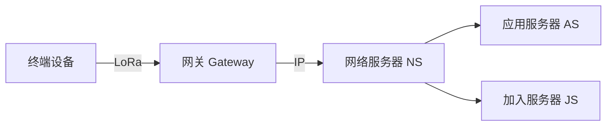

## 1. MQTT

### 1.1 协议概述

MQTT（Message Queuing Telemetry Transport）是 IoT 最广泛使用的**发布/订阅**消息协议，轻量、可靠、支持弱网络。

| 特性         | 描述                                        |
| :----------- | :------------------------------------------ |
| **协议层级** | 应用层（基于 TCP）                          |
| **消息模型** | 发布/订阅（Pub/Sub）                        |
| **最小报文** | 2 字节                                      |
| **QoS 等级** | 0（最多一次）/ 1（至少一次）/ 2（恰好一次） |
| **适用场景** | 设备上报、命令下发、状态同步                |

### 1.2 核心概念


| 概念       | 描述                       |
| :--------- | :------------------------- |
| **Broker** | 消息代理服务器             |
| **Topic**  | 消息主题（层级结构）       |
| **Client** | 发布者或订阅者             |
| **QoS**    | 服务质量等级               |
| **Retain** | 保留最后一条消息           |
| **Will**   | 遗嘱消息（异常断开时发送） |

### 1.3 Topic 设计

```
# 推荐的 Topic 层级结构
iot/{product_id}/{device_id}/event/{event_type}    # 设备事件上报
iot/{product_id}/{device_id}/property/{prop_name}  # 属性上报
iot/{product_id}/{device_id}/command/{cmd_type}    # 命令下发
iot/{product_id}/{device_id}/status                # 设备状态

# 示例
iot/sensor-hub/device-001/event/temperature        # 温度事件
iot/sensor-hub/device-001/property/humidity         # 湿度属性
iot/sensor-hub/device-001/command/reboot            # 重启命令
iot/sensor-hub/device-001/status                    # 在线状态

# 通配符
iot/sensor-hub/+/event/temperature    # + 匹配单层
iot/sensor-hub/device-001/#           # # 匹配多层
```

### 1.4 Python MQTT 客户端

```python
import paho.mqtt.client as mqtt
import json
import time

class IoTSensor:
    def __init__(self, device_id, broker="broker.emqx.io", port=1883):
        self.device_id = device_id
        self.client = mqtt.Client(client_id=device_id)
        self.client.on_connect = self._on_connect
        self.client.on_message = self._on_message

        # 遗嘱消息
        self.client.will_set(
            f"iot/sensor/{device_id}/status",
            payload=json.dumps({"status": "offline"}),
            qos=1,
            retain=True
        )

        self.client.connect(broker, port, 60)
        self.client.loop_start()

    def _on_connect(self, client, userdata, flags, rc):
        print(f"Connected with code {rc}")
        # 上报在线状态
        client.publish(
            f"iot/sensor/{self.device_id}/status",
            json.dumps({"status": "online"}),
            qos=1, retain=True
        )
        # 订阅命令 Topic
        client.subscribe(f"iot/sensor/{self.device_id}/command/#", qos=1)

    def _on_message(self, client, userdata, msg):
        topic = msg.topic
        payload = json.loads(msg.payload.decode())
        print(f"Command: {topic} -> {payload}")

        if "reboot" in topic:
            self._handle_reboot(payload)
        elif "config" in topic:
            self._handle_config(payload)

    def publish_data(self, data: dict, qos=1):
        """上报传感器数据"""
        topic = f"iot/sensor/{self.device_id}/event/data"
        self.client.publish(topic, json.dumps(data), qos=qos)

    def _handle_reboot(self, payload):
        print(f"Rebooting... {payload}")

    def _handle_config(self, payload):
        print(f"Updating config: {payload}")

# 使用
sensor = IoTSensor("sensor-001")
while True:
    data = {
        "temperature": 25.5,
        "humidity": 60.2,
        "timestamp": int(time.time())
    }
    sensor.publish_data(data)
    time.sleep(5)
```

### 1.5 MQTT 5.0 新特性

| 特性                       | 描述                    |
| :------------------------- | :---------------------- |
| **Reason Code**            | 更详细的错误码          |
| **Session/Message Expiry** | 会话和消息过期          |
| **Shared Subscription**    | 负载均衡订阅            |
| **Topic Alias**            | 减少 Topic 名称传输     |
| **User Property**          | 自定义键值对            |
| **Flow Control**           | 流控（Receive Maximum） |

## 2. CoAP

### 2.1 协议概述

CoAP（Constrained Application Protocol）是专为**资源受限设备**设计的 Web 协议，基于 UDP。

| 特性         | MQTT     | CoAP             |
| :----------- | :------- | :--------------- |
| **传输层**   | TCP      | UDP              |
| **模型**     | Pub/Sub  | Request/Response |
| **最小报文** | 2B       | 4B               |
| **发现**     | 无       | 支持             |
| **适用**     | 事件驱动 | 资源访问         |

### 2.2 CoAP 请求

```python
# aiocoap 客户端
import asyncio
from aiocoap import *

async def coap_get():
    protocol = await Context.create_client_context()
    request = Message(code=GET, uri='coap://[::1]/sensors/temperature')
    response = await protocol.request(request).response
    print(f"Temperature: {response.payload.decode()}")

async def coap_observe():
    """观察模式（类似订阅）"""
    protocol = await Context.create_client_context()
    request = Message(code=GET, uri='coap://[::1]/sensors/temperature', observe=0)
    observation = await protocol.request(request).observation
    async for response in observation:
        print(f"Update: {response.payload.decode()}")

asyncio.run(coap_get())
```

## 3. LoRa / LoRaWAN

### 3.1 LoRa 物理层

| 参数     | 描述                                           |
| :------- | :--------------------------------------------- |
| **频段** | 470MHz（中国）/ 868MHz（欧洲）/ 915MHz（美国） |
| **速率** | 0.3-50 kbps                                    |
| **距离** | 城区 2-5km，郊区 15km                          |
| **功耗** | 发射 ~45mA，睡眠 ~1μA                          |

### 3.2 LoRaWAN 架构



### 3.3 LoRaWAN 设备类别

| 类别        | 接收窗口   | 功耗 | 适用场景       |
| :---------- | :--------- | :--- | :------------- |
| **Class A** | 上行后开启 | 最低 | 电池供电传感器 |
| **Class B** | 定时开启   | 中   | 需要定时下发   |
| **Class C** | 持续开启   | 最高 | 常电设备       |

### 3.4 LoRaWAN 数据上报

```cpp
// LMIC LoRaWAN 上报示例（Arduino）
#include <lmic.h>
#include <hal/hal.h>

void onEvent(ev_t ev) {
    switch (ev) {
        case EV_TXCOMPLETE:
            Serial.println("TX complete");
            // 进入低功耗
            break;
        case EV_JOINING:
            Serial.println("Joining...");
            break;
        case EV_JOINED:
            Serial.println("Joined!");
            break;
    }
}

void do_send(osjob_t* j) {
    uint8_t payload[4];
    int16_t temp = (int16_t)(read_temperature() * 100);
    payload[0] = temp >> 8;
    payload[1] = temp & 0xFF;
    // ... 其他数据

    LMIC_setTxData2(1, payload, sizeof(payload), 0);
}

void setup() {
    os_init();
    LMIC_reset();
    LMIC_startJoining();
    do_send(&sendjob);
}

void loop() {
    os_runloop_once();
}
```

## 4. NB-IoT

### 4.1 特性

| 特性       | 描述                       |
| :--------- | :------------------------- |
| **技术**   | 蜂窝网络（LTE 简化版）     |
| **速率**   | 上行 ~60kbps，下行 ~30kbps |
| **覆盖**   | 比 GSM 增强 20dB           |
| **连接数** | 单小区 10 万+              |
| **功耗**   | PSM 模式 ~5μA              |
| **运营商** | 中国电信/移动/联通         |

### 4.2 NB-IoT AT 命令

```c
// NB-IoT 模组 AT 命令操作
// 1. 检查模块
AT                           // → OK
AT+CGMI                      // → 厂商信息
AT+CSQ                       // → 信号质量

// 2. 网络注册
AT+CGATT=1                   // 附着网络
AT+CGDCONT=1,"IP","CTNB"     // 设置 APN
AT+CEREG?                    // 查询注册状态

// 3. 创建连接
AT+NSOCR="STREAM",6,8883,1   // 创建 TCP socket

// 4. 发送数据
AT+NSOSD=1,12,"48656C6C6F"   // 发送十六进制数据

// 5. PSM 低功耗
AT+CPSMS=1,"","00000100","00000001"  // 进入 PSM
```

## 5. Zigbee

### 5.1 特性

| 特性       | 描述                 |
| :--------- | :------------------- |
| **频段**   | 2.4GHz               |
| **速率**   | 250kbps              |
| **距离**   | 10-100m              |
| **节点数** | 理论 65535           |
| **拓扑**   | 星型/树型/网状       |
| **功耗**   | 极低（纽扣电池数年） |

### 5.2 Zigbee 设备类型

| 类型            | 描述               | 供电 |
| :-------------- | :----------------- | :--- |
| **Coordinator** | 网络协调者         | 常电 |
| **Router**      | 路由节点，转发数据 | 常电 |
| **End Device**  | 终端设备           | 电池 |

### 5.3 Zigbee2MQTT

```yaml
# Zigbee2MQTT 配置
mqtt:
  base_topic: zigbee2mqtt
  server: mqtt://localhost:1883

serial:
  port: /dev/ttyUSB0

devices:
  '0x00158d0004567890':
    friendly_name: living_room_temp
  '0x00158d0004567891':
    friendly_name: bedroom_light

advanced:
  network_key: GENERATE
  channel: 25
```

## 6. BLE（低功耗蓝牙）

### 6.1 BLE 版本

| 版本    | 速率  | 特点               |
| :------ | :---- | :----------------- |
| BLE 4.0 | 1Mbps | 基础版             |
| BLE 4.2 | 1Mbps | 数据长度扩展       |
| BLE 5.0 | 2Mbps | 2倍速率、4倍距离   |
| BLE 5.3 | 2Mbps | 周期广播、信道分类 |

### 6.2 BLE GATT 服务

```cpp
// ESP32 BLE 传感器服务
#include <BLEDevice.h>
#include <BLEServer.h>
#include <BLEUtils.h>

#define SERVICE_UUID        "181A"  // Environmental Sensing
#define TEMP_CHAR_UUID      "2A6E"  // Temperature
#define HUMI_CHAR_UUID      "2A6F"  // Humidity

BLEServer* pServer = NULL;
BLECharacteristic* pTempChar = NULL;
BLECharacteristic* pHumiChar = NULL;

void setup() {
    BLEDevice::init("ESP32-Sensor");
    pServer = BLEDevice::createServer();

    BLEService* pService = pServer->createService(SERVICE_UUID);

    pTempChar = pService->createCharacteristic(
        TEMP_CHAR_UUID,
        BLECharacteristic::PROPERTY_READ | BLECharacteristic::PROPERTY_NOTIFY
    );

    pHumiChar = pService->createCharacteristic(
        HUMI_CHAR_UUID,
        BLECharacteristic::PROPERTY_READ | BLECharacteristic::PROPERTY_NOTIFY
    );

    pService->start();
    BLEAdvertising* pAdvertising = BLEDevice::getAdvertising();
    pAdvertising->addServiceUUID(SERVICE_UUID);
    BLEDevice::startAdvertising();
}

void loop() {
    float temp = read_temperature();
    float humi = read_humidity();

    pTempChar->setValue((uint8_t*)&temp, sizeof(temp));
    pTempChar->notify();

    pHumiChar->setValue((uint8_t*)&humi, sizeof(humi));
    pHumiChar->notify();

    delay(1000);
}
```

## 7. 协议选型对比

| 维度     | MQTT | CoAP     | LoRaWAN | NB-IoT | Zigbee   | BLE    |
| :------- | :--- | :------- | :------ | :----- | :------- | :----- |
| **层级** | 应用 | 应用     | 网络    | 网络   | 网络     | 网络   |
| **传输** | TCP  | UDP      | LoRa    | 蜂窝   | 802.15.4 | 2.4GHz |
| **距离** | 不限 | 不限     | 15km    | 全国   | 100m     | 100m   |
| **功耗** | 中   | 低       | 极低    | 低     | 极低     | 低     |
| **速率** | 高   | 中       | 极低    | 低     | 低       | 中     |
| **成本** | 低   | 低       | 中      | 中     | 低       | 低     |
| **场景** | 通用 | 受限设备 | 远距离  | 广覆盖 | 智能家居 | 可穿戴 |

## 8. 小结

通信协议是 IoT 的神经网络：

1. **MQTT** 是 IoT 通信的事实标准，适合设备-云通信
2. **CoAP** 适合资源极度受限的设备，基于 UDP
3. **LoRaWAN** 适合远距离低功耗场景，但速率极低
4. **NB-IoT** 利用运营商网络，覆盖好但需资费
5. **Zigbee** 适合智能家居网状网络，通过 Zigbee2MQTT 桥接
6. **BLE** 适合近距离可穿戴和手机交互场景
7. 实际项目通常**组合使用**多种协议，如 LoRa + MQTT、BLE + Wi-Fi

## 参考文献

MQTT 规范：https://mqtt.org/
CoAP（RFC 7252）：https://www.rfc-editor.org/rfc/rfc7252
EMQX 文档：https://www.emqx.io/docs/zh/latest/
AWS IoT Core：https://aws.amazon.com/iot-core/
InfluxDB 文档：https://docs.influxdata.com/

## 延伸阅读

MQTT 与设备接入，见 035-iot 模块文档。
嵌入式 C 与硬件，见 025-c 模块。
时序数据与数据平台，见 052-big-data 模块。
黑马程序员 Bilibili 空间（https://space.bilibili.com/37974444 ）提供物联网课程。

## 深度专题扩展

以下专题从不同角度深入本文主题，供有进阶需求的读者研读。每个专题独立成节，内容相互补充。

### 13.1 MQTT 协议深入

报文类型：CONNECT/CONNACK/PUBLISH/PUBACK/SUBSCRIBE/SUBACK/PINGREQ/DISCONNECT。
会话状态：clean session、持久会话、消息保留（retain）与遗嘱（LWT）。
QoS 语义：0 至多一次，1 至少一次，2 恰好一次；QoS2 四步握手。
共享订阅（shared subscription）实现负载均衡；主题层级与通配符（+/#）。

### 13.2 边缘计算架构

边缘节点形态：网关、边缘服务器、设备端推理；部署容器或原生应用。
断网续传：本地消息队列 + 持久化 + 重连补传。
云端协同：模型下发（边缘推理）、规则下沉、影子同步。
KubeEdge/OpenYurt 把 K8s 延伸到边缘。

## 模块文档速查表

| 文档 | 主题 | 与本文的关联 |
| --- | --- | --- |
| 概述与架构 | 001-OverviewArchitecture | 本文的前置基础 |
| 传感器与嵌入式 | 002-SensorEmbedded | 本文的并列主题 |
| 通信协议 | 003-CommunicationProtocol | 本文自身 |
| 边缘计算 | 004-EdgeComputing | 本文的并列主题 |
| IoT 平台 | 005-IoT | 本文的并列主题 |
| 数据处理与分析 | 006-DataProcessingAnalysis | 本文的并列主题 |
| 安全与隐私 | 007-SecurityAndPrivacy | 本文的安全延伸 |
| 实战项目 | 008-PracticeProject | 本文的综合应用 |
| MQTT协议 | 009-MQTT | 本文的并列主题 |
| CoAP协议 | 010-CoAP | 本文的并列主题 |
| Arduino开发 | 011-ArduinoDevelopment | 本文的并列主题 |
| ESP32开发 | 012-ESP32Development | 本文的并列主题 |
| RT-Thread实时系统 | 013-RTThread | 本文的并列主题 |
| 边缘AI | 014-AI | 本文的并列主题 |
| LwM2M设备管理 | 015-LwM2MManagement | 本文的并列主题 |
| 时序数据库 | 016-TimeSeriesDatabase | 本文的并列主题 |
| 物联网安全 | 017-IoTSecurity | 本文的安全延伸 |
| 主流IoT平台 | 018-IoT | 本文的并列主题 |
| 数字孪生 | 019-DigitalTwin | 本文的并列主题 |
| 物联网 Mosquitto Broker 管理 | 020-MosquittoBrokerManage | 本文的并列主题 |
| 物联网 mosquitto_pub 发布命令 | 021-MosquittoPub | 本文的并列主题 |
| 物联网 mosquitto_sub 订阅命令 | 022-MosquittoSub | 本文的并列主题 |
| 物联网 ESP32 开发环境 | 023-ESP32Setup | 本文的前置基础 |
| 物联网 ESP32 GPIO 与引脚 | 024-ESP32GPIOPinout | 本文的并列主题 |
| 物联网 ESP32 I2C 通信 | 025-ESP32I2C | 本文的并列主题 |
| 物联网 ESP32 SPI 与 UART | 026-ESP32SPIUART | 本文的并列主题 |
| 物联网 ESP32 WiFi 配置 | 027-ESP32WiFiConfig | 本文的并列主题 |
| 物联网 ESP32 OTA 更新 | 028-ESP32OTA | 本文的并列主题 |
