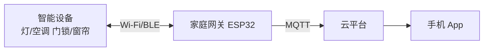
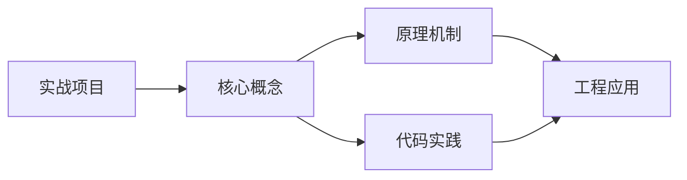
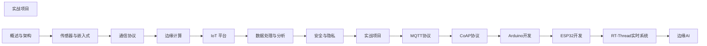

## 1. 学习目标（Bloom 分类）

本节按照布鲁姆教育目标分类学组织学习路径。本文主题为《实战项目》，属于 物联网 模块，读者可以根据自身阶段选择阅读深度。

记忆层面：能够准确复述本文的核心概念、术语与基本语法或操作步骤，并能够在提问或检索时快速定位对应知识点。能够说出 物联网 的核心概念、组件与标准流程。

理解层面：能够用自己的语言解释核心原理与工作机制，说明概念之间的因果关系，而不是机械记忆结论。能够解释 物联网 的工作原理与关键机制。

应用层面：能够在真实项目或练习场景中运用本文知识解决具体问题，写出正确且可维护的实现。能够执行 物联网 相关的标准操作与配置。

分析层面：能够拆解复杂问题，比较本文主题与相邻概念的异同，识别边界条件与例外情况。能够分析 物联网 方案在可靠性、成本与性能上的权衡。

评价层面：能够根据约束条件（性能、可读性、安全、成本）评价不同方案的优劣，做出有依据的技术决策。能够评价 物联网 中的技术选型。

创造层面：能够把本文知识与其他模块知识组合，设计出新的解决方案或可复用的工程模式。能够设计基于 物联网 的完整解决方案。

通过本节学习，读者应当能够把《实战项目》纳入自己的知识网络，并与 物联网 模块的其他主题（传感器、协议、边缘计算、设备管理）建立关联。

## 2. 历史动机与发展脉络

《实战项目》是 物联网 领域的重要主题。要真正理解它，需要先了解它解决的问题与演进过程。

物联网（IoT）指设备互联的物理网络，起源可追溯到 1980 年代传感器网络；Kevin Ashton 1999 年提出 IoT 术语，RFID 是其早期载体。
架构分层：感知层（传感器/执行器）、网络层（连接）、平台层（设备管理/数据）、应用层（业务）；边缘计算将处理下沉到设备侧。
协议版图：MQTT（轻量发布订阅）、CoAP（受限设备）、HTTP/HTTPS、LoRa/NB-IoT（低功耗广域）、Zigbee/BLE（短距）。

回到本文主题：实战项目 的提出与成熟，正是上述技术背景下的必然产物。早期实现往往以简单可用为目标，随着工程规模扩大，社区逐渐沉淀出标准做法与最佳实践；理解这一脉络，可以帮助读者判断“为什么文档中的推荐写法是现在这个样子”，也能在遇到历史遗留代码时准确识别其设计年代与取舍。


## 3. 形式化定义与核心概念精讲

本节把《实战项目》涉及的核心概念以“定义 + 讲解”的形式展开。读者应把定义当作工具，把讲解当作理解路径；两者结合才能形成可迁移的知识。

MQTT：基于 TCP 的发布/订阅，QoS 0/1/2 分级投递，遗嘱消息；适合低带宽高延迟网络。
设备接入：设备注册、鉴权（X.509/Token）、上下行消息、影子设备（desired/reported 状态）。
边缘计算：边缘网关聚合数据、本地推理与断网续传；云端统一管理。

### 3.1 原文章节逐一精讲

原文档把主题拆分为 7 个小节，下面按顺序给出每一节的导读讲解，随后保留原文细节供精读。

#### 原文精读（完整保留）


#### 1. 智能家居系统

##### 1.1 系统架构



##### 1.2 设备端实现

```cpp
// ESP32 智能灯控制器
#include <WiFi.h>
#include <PubSubClient.h>
#include <ArduinoJson.h>

const char* ssid = "HomeWiFi";
const char* password = "password";
const char* mqtt_server = "broker.emqx.io";

// 设备信息
const char* device_id = "light-living-001";
const char* device_type = "smart_light";

// 引脚
#define LED_R 25
#define LED_G 26
#define LED_B 27

WiFiClient espClient;
PubSubClient client(espClient);

// 当前状态
struct LightState {
    bool power = false;
    int brightness = 100;
    int color_r = 255, color_g = 255, color_b = 255;
} state;

void apply_state() {
    if (!state.power) {
        ledcWrite(0, 0); ledcWrite(1, 0); ledcWrite(2, 0);
        return;
    }
    float factor = state.brightness / 100.0;
    ledcWrite(0, (int)(state.color_r * factor));
    ledcWrite(1, (int)(state.color_g * factor));
    ledcWrite(2, (int)(state.color_b * factor));
}

void handle_command(char* topic, byte* payload, unsigned int length) {
    StaticJsonDocument<256> doc;
    deserializeJson(doc, payload, length);

    String cmd = doc["command"];
    if (cmd == "set_power") {
        state.power = doc["value"];
    } else if (cmd == "set_brightness") {
        state.brightness = doc["value"];
    } else if (cmd == "set_color") {
        state.color_r = doc["r"];
        state.color_g = doc["g"];
        state.color_b = doc["b"];
    }

    apply_state();
    report_state();
}

void report_state() {
    StaticJsonDocument<256> doc;
    doc["device_id"] = device_id;
    doc["power"] = state.power;
    doc["brightness"] = state.brightness;
    doc["color"]["r"] = state.color_r;
    doc["color"]["g"] = state.color_g;
    doc["color"]["b"] = state.color_b;

    char buffer[256];
    serializeJson(doc, buffer);
    client.publish("home/light/state", buffer);
}

void setup() {
    ledcSetup(0, 5000, 8); ledcAttachPin(LED_R, 0);
    ledcSetup(1, 5000, 8); ledcAttachPin(LED_G, 1);
    ledcSetup(2, 5000, 8); ledcAttachPin(LED_B, 2);

    WiFi.begin(ssid, password);
    while (WiFi.status() != WL_CONNECTED) delay(500);

    client.setServer(mqtt_server, 1883);
    client.setCallback(handle_command);
    client.connect(device_id);
    client.subscribe("home/light/command");
}

void loop() {
    client.loop();
}
```

##### 1.3 规则引擎

```python
# 智能家居规则引擎
class SmartHomeRules:
    def __init__(self, mqtt_client):
        self.client = mqtt_client
        self.rules = []

    def add_rule(self, trigger, action):
        self.rules.append({"trigger": trigger, "action": action})

    def evaluate(self, event: dict):
        for rule in self.rules:
            if rule["trigger"](event):
                rule["action"](event)

# 定义规则
rules = SmartHomeRules(mqtt_client)

# 规则1：温度超过 28°C 自动开空调
rules.add_rule(
    trigger=lambda e: e.get("type") == "temperature" and e["value"] > 28,
    action=lambda e: mqtt_client.publish("home/ac/command",
        json.dumps({"command": "set_power", "value": True}))
)

# 规则2：人离开自动关灯
rules.add_rule(
    trigger=lambda e: e.get("type") == "presence" and e["value"] == "left",
    action=lambda e: mqtt_client.publish("home/light/command",
        json.dumps({"command": "set_power", "value": False}))
)

# 规则3：日落自动开灯
rules.add_rule(
    trigger=lambda e: e.get("type") == "sun_event" and e["value"] == "sunset",
    action=lambda e: mqtt_client.publish("home/light/command",
        json.dumps({"command": "set_power", "value": True, "brightness": 60}))
)
```

#### 2. 环境监测站

##### 2.1 系统架构

```
传感器集群 → LoRa 网关 → MQTT Broker → 时序数据库 → Grafana
  (野外)     (太阳能)    (EMQX)       (TDengine)    (可视化)
```

##### 2.2 传感器节点

```cpp
// LoRa 环境监测节点
#include <LoRa.h>
#include <DHT.h>
#include <BH1750.h>
#include <Wire.h>

#define DHT_PIN 4
#define LORA_CS 18
#define LORA_RST 14
#define LORA_IRQ 26

DHT dht(DHT_PIN, DHT22);
BH1750 lightMeter;

struct SensorData {
    float temperature;
    float humidity;
    float light;
    float battery_voltage;
    uint32_t timestamp;
};

void setup() {
    dht.begin();
    Wire.begin();
    lightMeter.begin();

    LoRa.setPins(LORA_CS, LORA_RST, LORA_IRQ);
    LoRa.begin(470E6);  // 中国 LoRa 频段
    LoRa.setSpreadingFactor(10);
    LoRa.setCodingRate4(5);
    LoRa.setTxPower(17);
}

void loop() {
    SensorData data;
    data.temperature = dht.readTemperature();
    data.humidity = dht.readHumidity();
    data.light = lightMeter.readLightLevel();
    data.battery_voltage = readBattery();
    data.timestamp = millis();

    // 发送数据
    LoRa.beginPacket();
    LoRa.write((uint8_t*)&data, sizeof(data));
    LoRa.endPacket();

    // Deep Sleep 5分钟
    esp_sleep_enable_timer_wakeup(300 * 1000000);
    esp_deep_sleep_start();
}
```

##### 2.3 数据后端

```python
# 环境监测数据后端
from influxdb_client import InfluxDBClient, Point
import paho.mqtt.client as mqtt
import json

# InfluxDB 写入
influx_client = InfluxDBClient(url="http://localhost:8086", token="token", org="org")
write_api = influx_client.write_api()

# MQTT 消费
def on_message(client, userdata, msg):
    data = json.loads(msg.payload.decode())

    point = Point("environment") \
        .tag("station_id", data["station_id"]) \
        .tag("location", data["location"]) \
        .field("temperature", data["temperature"]) \
        .field("humidity", data["humidity"]) \
        .field("pm25", data.get("pm25", 0)) \
        .field("light", data.get("light", 0)) \
        .field("battery", data.get("battery", 0))

    write_api.write(bucket="environment", record=point)

mqtt_client = mqtt.Client()
mqtt_client.on_message = on_message
mqtt_client.connect("emqx", 1883)
mqtt_client.subscribe("env/+/data")
mqtt_client.loop_forever()
```

#### 3. 工业预测维护

##### 3.1 系统架构

```
振动/温度传感器 → 边缘网关 → 特征提取 → 异常检测 → 告警
                                    ↓
                              云端模型训练 → 模型下发
```

##### 3.2 振动数据采集

```python
import numpy as np
from scipy import signal, fft

class VibrationAnalyzer:
    """振动数据分析"""
    def __init__(self, sample_rate=10000):
        self.sample_rate = sample_rate

    def extract_features(self, vibration_data: np.ndarray) -> dict:
        """提取振动特征"""
        # 时域特征
        rms = np.sqrt(np.mean(vibration_data ** 2))
        peak = np.max(np.abs(vibration_data))
        crest_factor = peak / rms if rms > 0 else 0
        kurtosis = self._kurtosis(vibration_data)

        # 频域特征
        freqs, psd = signal.welch(vibration_data, fs=self.sample_rate, nperseg=1024)
        dominant_freq = freqs[np.argmax(psd)]
        spectral_centroid = np.sum(freqs * psd) / np.sum(psd)

        return {
            "rms": float(rms),
            "peak": float(peak),
            "crest_factor": float(crest_factor),
            "kurtosis": float(kurtosis),
            "dominant_freq": float(dominant_freq),
            "spectral_centroid": float(spectral_centroid)
        }

    def _kurtosis(self, data: np.ndarray) -> float:
        n = len(data)
        mean = np.mean(data)
        std = np.std(data)
        if std == 0:
            return 0
        return float(np.sum(((data - mean) / std) ** 4) / n - 3)

    def detect_anomaly(self, features: dict, thresholds: dict) -> dict:
        """异常检测"""
        alerts = []
        for key, threshold in thresholds.items():
            if key in features and features[key] > threshold:
                alerts.append(f"{key} 超阈值: {features[key]:.2f} > {threshold}")
        return {"is_anomaly": len(alerts) > 0, "alerts": alerts}
```

##### 3.3 预测模型

```python
# 剩余使用寿命（RUL）预测
from sklearn.ensemble import GradientBoostingRegressor
import numpy as np

class RULPredictor:
    """剩余使用寿命预测"""
    def __init__(self):
        self.model = GradientBoostingRegressor(
            n_estimators=200,
            max_depth=5,
            learning_rate=0.1
        )

    def train(self, features: np.ndarray, rul_labels: np.ndarray):
        self.model.fit(features, rul_labels)

    def predict(self, features: np.ndarray) -> dict:
        predicted_rul = self.model.predict(features.reshape(1, -1))[0]
        confidence = self._estimate_confidence(features)

        return {
            "predicted_rul_hours": float(predicted_rul),
            "confidence": float(confidence),
            "maintenance_needed": predicted_rul < 72  # 72小时阈值
        }

    def _estimate_confidence(self, features):
        # 简化的置信度估计
        predictions = []
        for estimator in self.model.estimators_:
            pred = estimator[0].predict(features.reshape(1, -1))
            predictions.append(pred[0])
        return 1.0 - np.std(predictions) / (np.mean(predictions) + 1e-6)
```

#### 4. 智慧农业

##### 4.1 系统架构

```
土壤/气象传感器 → NB-IoT → 云平台 → 农业决策引擎 → 自动灌溉
                                              ↓
                                         手机 App 通知
```

##### 4.2 农业决策引擎

```python
class AgricultureDecisionEngine:
    """农业决策引擎"""
    def __init__(self, mqtt_client):
        self.client = mqtt_client
        self.crop_config = {
            "tomato": {
                "optimal_temp": (20, 30),
                "optimal_humidity": (60, 80),
                "optimal_soil_moisture": (40, 60),
                "water_per_irrigation_ml": 500
            }
        }

    def evaluate(self, sensor_data: dict, crop: str = "tomato"):
        config = self.crop_config.get(crop, {})
        decisions = []

        # 温度决策
        temp = sensor_data.get("temperature", 0)
        opt_temp = config.get("optimal_temp", (0, 100))
        if temp < opt_temp[0]:
            decisions.append({"action": "close_ventilation", "reason": f"温度过低: {temp}°C"})
        elif temp > opt_temp[1]:
            decisions.append({"action": "open_ventilation", "reason": f"温度过高: {temp}°C"})

        # 灌溉决策
        soil_moisture = sensor_data.get("soil_moisture", 50)
        opt_moisture = config.get("optimal_soil_moisture", (30, 70))
        if soil_moisture < opt_moisture[0]:
            water = config.get("water_per_irrigation_ml", 500)
            decisions.append({
                "action": "irrigate",
                "amount_ml": water,
                "reason": f"土壤湿度低: {soil_moisture}%"
            })

        # 执行决策
        for decision in decisions:
            self._execute(decision)

        return decisions

    def _execute(self, decision: dict):
        self.client.publish(
            "farm/actuator/command",
            json.dumps(decision)
        )
```

#### 5. MQTT 数据采集完整链路

##### 5.1 完整系统

```python
# 完整 IoT 数据采集系统
import json
import time
import threading
from datetime import datetime
import paho.mqtt.client as mqtt
from influxdb_client import InfluxDBClient, Point, WritePrecision

class IoTDataPipeline:
    """IoT 数据采集完整链路"""

    def __init__(self, config: dict):
        self.config = config
        self.mqtt_client = None
        self.influx_client = None
        self.running = False

    def start(self):
        self._init_mqtt()
        self._init_influxdb()
        self.running = True
        print("IoT 数据管道已启动")

    def _init_mqtt(self):
        self.mqtt_client = mqtt.Client(client_id="data-pipeline")
        self.mqtt_client.on_connect = self._on_connect
        self.mqtt_client.on_message = self._on_message
        self.mqtt_client.connect(
            self.config["mqtt"]["host"],
            self.config["mqtt"]["port"]
        )
        self.mqtt_client.loop_start()

    def _init_influxdb(self):
        self.influx_client = InfluxDBClient(
            url=self.config["influxdb"]["url"],
            token=self.config["influxdb"]["token"],
            org=self.config["influxdb"]["org"]
        )
        self.write_api = self.influx_client.write_api()

    def _on_connect(self, client, userdata, flags, rc):
        topics = self.config["mqtt"]["subscribe_topics"]
        for topic in topics:
            client.subscribe(topic, qos=1)
        print(f"已订阅: {topics}")

    def _on_message(self, client, userdata, msg):
        try:
            data = json.loads(msg.payload.decode())
            self._process_message(msg.topic, data)
        except Exception as e:
            print(f"处理消息失败: {e}")

    def _process_message(self, topic: str, data: dict):
        # 1. 数据验证
        if not self._validate(data):
            return

        # 2. 数据清洗
        cleaned = self._clean(data)

        # 3. 写入时序数据库
        self._write_to_influx(cleaned)

        # 4. 规则检查
        alerts = self._check_rules(cleaned)
        for alert in alerts:
            self._send_alert(alert)

    def _validate(self, data: dict) -> bool:
        required = ["device_id", "timestamp"]
        return all(k in data for k in required)

    def _clean(self, data: dict) -> dict:
        # 范围过滤
        if "temperature" in data:
            if not (-40 <= data["temperature"] <= 80):
                data["temperature"] = None
        return data

    def _write_to_influx(self, data: dict):
        point = Point("sensor_data") \
            .tag("device_id", data.get("device_id", "unknown"))

        for key, value in data.items():
            if key not in ["device_id", "timestamp"] and value is not None:
                if isinstance(value, (int, float)):
                    point = point.field(key, value)

        self.write_api.write(
            bucket=self.config["influxdb"]["bucket"],
            record=point
        )

    def _check_rules(self, data: dict) -> list:
        alerts = []
        if data.get("temperature", 0) > 35:
            alerts.append({"type": "high_temp", "device": data["device_id"], "value": data["temperature"]})
        return alerts

    def _send_alert(self, alert: dict):
        self.mqtt_client.publish("iot/alerts", json.dumps(alert))

# 配置与启动
config = {
    "mqtt": {
        "host": "broker.emqx.io",
        "port": 1883,
        "subscribe_topics": ["iot/+/data", "iot/+/event"]
    },
    "influxdb": {
        "url": "http://localhost:8086",
        "token": "my-token",
        "org": "my-org",
        "bucket": "iot-data"
    }
}

pipeline = IoTDataPipeline(config)
pipeline.start()

try:
    while True:
        time.sleep(1)
except KeyboardInterrupt:
    print("停止中...")
```

#### 6. 从传感器到云端完整链路

##### 6.1 部署架构

```yaml
# docker-compose.yml - 完整 IoT 平台
version: '3.8'
services:
  # MQTT Broker
  emqx:
    image: emqx/emqx:5.7
    ports:
      - '1883:1883'
      - '18083:18083'

  # 时序数据库
  tdengine:
    image: tdengine/tdengine:3.3
    ports:
      - '6041:6041'
    volumes:
      - td-data:/var/lib/taos

  # 数据管道
  data-pipeline:
    build: ./pipeline
    depends_on:
      - emqx
      - tdengine
    environment:
      MQTT_HOST: emqx
      TDENGINE_HOST: tdengine

  # 规则引擎
  rule-engine:
    build: ./rules
    depends_on:
      - emqx
    environment:
      MQTT_HOST: emqx

  # Grafana 可视化
  grafana:
    image: grafana/grafana:11.0
    ports:
      - '3000:3000'
    depends_on:
      - tdengine

  # ThingsBoard
  thingsboard:
    image: thingsboard/tb-postgres:latest
    ports:
      - '9090:9090'
      - '1883:1883'

volumes:
  td-data:
```

##### 6.2 关键配置

| 组件            | 配置要点                     |
| :-------------- | :--------------------------- |
| **EMQX**        | 认证方式、ACL 规则、集群     |
| **TDengine**    | 保留天数、缓存大小、副本数   |
| **数据管道**    | 批量大小、写入间隔、错误重试 |
| **Grafana**     | Dashboard 模板、告警通道     |
| **ThingsBoard** | 设备配置、规则链、OTA        |

#### 7. 小结

实战项目是掌握 IoT 开发的最佳方式：

1. **智能家居**是最常见的消费 IoT 场景，核心是设备控制和规则引擎
2. **环境监测**适合学习 LoRa + 低功耗 + 时序数据库
3. **预测维护**是工业 IoT 的核心价值，需掌握振动分析和 ML 模型
4. **智慧农业**结合传感器和自动控制，体现 IoT 的闭环价值
5. **完整链路**从传感器到云端，涵盖采集、传输、存储、分析和可视化
6. Docker Compose 可快速搭建完整 IoT 平台，适合开发和测试


### 3.2 概念关系图

下面用 Mermaid 图表达本文核心概念之间的关系，帮助读者建立整体图景：



图中展示的是本文知识的结构化关系：核心概念是入口，原理机制解释“为什么”，代码实践演示“怎么做”，工程应用回答“何时用”。读者学习时可以把每个小节的内容挂接到对应节点上。

## 4. 理论推导与原理解析

本节深入《实战项目》背后的原理。理论部分不求面面俱到，而是聚焦“能解释现象、能指导实践”的关键推导。

MQTT：基于 TCP 的发布/订阅，QoS 0/1/2 分级投递，遗嘱消息；适合低带宽高延迟网络。
设备接入：设备注册、鉴权（X.509/Token）、上下行消息、影子设备（desired/reported 状态）。
边缘计算：边缘网关聚合数据、本地推理与断网续传；云端统一管理。
数据链路：采集 -> 清洗 -> 时序存储（InfluxDB/TDengine）-> 规则引擎 -> 应用。

需要强调的是，理论推导与工程实践之间存在翻译层：理论给出的是理想化模型与边界条件，工程代码则必须处理真实环境中的例外。读者在学习时应先掌握理论的“标准情形”，再通过陷阱章节了解“非标准情形”。

## 5. 代码示例与逐行讲解

本节把原文中的代码示例系统整理，并为每个示例补充用途说明与讲解。读者不应只浏览代码，而应逐段对照讲解理解设计意图。

### 5.1 示例：1.1 系统架构

该示例来自原文《1.1 系统架构》小节，用于演示实战项目相关操作。阅读时请先看代码结构，再看其后的讲解。


讲解：这段代码演示了本节核心知识点。代码中的关键操作可以归纳为三步：准备（定义或初始化）、执行（核心逻辑）、收尾（释放资源或返回结果）。实际项目中，这三步往往被封装为函数或类，以提升复用性与可测试性。

关键点分析：

该示例共 3 行有效代码，结构以数据或配置为主。阅读时应关注：数据字段的含义、配置项的作用，以及它们与运行行为的对应关系。

进阶思考路径：先尝试修改参数观察行为变化，再把示例中的模式迁移到自己的项目中；每次修改都记录预期与实测差异，这是把示例转化为能力的最快方式。

### 5.2 示例：1.2 设备端实现

该示例来自原文《1.2 设备端实现》小节，用于演示实战项目相关操作。阅读时请先看代码结构，再看其后的讲解。

```cpp
// ESP32 智能灯控制器
#include <WiFi.h>
#include <PubSubClient.h>
#include <ArduinoJson.h>

const char* ssid = "HomeWiFi";
const char* password = "password";
const char* mqtt_server = "broker.emqx.io";

// 设备信息
const char* device_id = "light-living-001";
const char* device_type = "smart_light";

// 引脚
#define LED_R 25
#define LED_G 26
#define LED_B 27

WiFiClient espClient;
PubSubClient client(espClient);

// 当前状态
struct LightState {
    bool power = false;
    int brightness = 100;
    int color_r = 255, color_g = 255, color_b = 255;
} state;

void apply_state() {
    if (!state.power) {
        ledcWrite(0, 0); ledcWrite(1, 0); ledcWrite(2, 0);
        return;
    }
    float factor = state.brightness / 100.0;
    ledcWrite(0, (int)(state.color_r * factor));
    ledcWrite(1, (int)(state.color_g * factor));
    ledcWrite(2, (int)(state.color_b * factor));
}

void handle_command(char* topic, byte* payload, unsigned int length) {
    StaticJsonDocument<256> doc;
    deserializeJson(doc, payload, length);

    String cmd = doc["command"];
    if (cmd == "set_power") {
        state.power = doc["value"];
    } else if (cmd == "set_brightness") {
        state.brightness = doc["value"];
    } else if (cmd == "set_color") {
        state.color_r = doc["r"];
        state.color_g = doc["g"];
        state.color_b = doc["b"];
    }

    apply_state();
    report_state();
}

void report_state() {
    StaticJsonDocument<256> doc;
    doc["device_id"] = device_id;
    doc["power"] = state.power;
    doc["brightness"] = state.brightness;
    doc["color"]["r"] = state.color_r;
    doc["color"]["g"] = state.color_g;
    doc["color"]["b"] = state.color_b;

    char buffer[256];
    serializeJson(doc, buffer);
    client.publish("home/light/state", buffer);
}

void setup() {
    ledcSetup(0, 5000, 8); ledcAttachPin(LED_R, 0);
    ledcSetup(1, 5000, 8); ledcAttachPin(LED_G, 1);
    ledcSetup(2, 5000, 8); ledcAttachPin(LED_B, 2);

    WiFi.begin(ssid, password);
    while (WiFi.status() != WL_CONNECTED) delay(500);

    client.setServer(mqtt_server, 1883);
    client.setCallback(handle_command);
    client.connect(device_id);
    client.subscribe("home/light/command");
}

void loop() {
    client.loop();
}
```

讲解：这段代码演示了本节核心知识点。代码中的关键操作可以归纳为三步：准备（定义或初始化）、执行（核心逻辑）、收尾（释放资源或返回结果）。实际项目中，这三步往往被封装为函数或类，以提升复用性与可测试性。

关键点分析：

该示例共 74 行有效代码，包含 3 类关键结构（if、while、return）。其中：

- 入口与初始化部分负责建立上下文，对应实际项目中的启动或装配逻辑；
- 核心逻辑部分体现本文主题的主要操作，是阅读时最需要对照讲解理解的部分；
- 输出或返回部分把结果交给调用方，注意其类型与边界条件。

进阶思考路径：先尝试修改参数观察行为变化，再把示例中的模式迁移到自己的项目中；每次修改都记录预期与实测差异，这是把示例转化为能力的最快方式。

### 5.3 示例：1.3 规则引擎

该示例来自原文《1.3 规则引擎》小节，用于演示实战项目相关操作。阅读时请先看代码结构，再看其后的讲解。

```python
# 智能家居规则引擎
class SmartHomeRules:
    def __init__(self, mqtt_client):
        self.client = mqtt_client
        self.rules = []

    def add_rule(self, trigger, action):
        self.rules.append({"trigger": trigger, "action": action})

    def evaluate(self, event: dict):
        for rule in self.rules:
            if rule["trigger"](event):
                rule["action"](event)

# 定义规则
rules = SmartHomeRules(mqtt_client)

# 规则1：温度超过 28°C 自动开空调
rules.add_rule(
    trigger=lambda e: e.get("type") == "temperature" and e["value"] > 28,
    action=lambda e: mqtt_client.publish("home/ac/command",
        json.dumps({"command": "set_power", "value": True}))
)

# 规则2：人离开自动关灯
rules.add_rule(
    trigger=lambda e: e.get("type") == "presence" and e["value"] == "left",
    action=lambda e: mqtt_client.publish("home/light/command",
        json.dumps({"command": "set_power", "value": False}))
)

# 规则3：日落自动开灯
rules.add_rule(
    trigger=lambda e: e.get("type") == "sun_event" and e["value"] == "sunset",
    action=lambda e: mqtt_client.publish("home/light/command",
        json.dumps({"command": "set_power", "value": True, "brightness": 60}))
)
```

讲解：这段代码演示了本节核心知识点。代码中的关键操作可以归纳为三步：准备（定义或初始化）、执行（核心逻辑）、收尾（释放资源或返回结果）。实际项目中，这三步往往被封装为函数或类，以提升复用性与可测试性。

关键点分析：

该示例共 31 行有效代码，包含 4 类关键结构（class、def、if、for）。其中：

- 入口与初始化部分负责建立上下文，对应实际项目中的启动或装配逻辑；
- 核心逻辑部分体现本文主题的主要操作，是阅读时最需要对照讲解理解的部分；
- 输出或返回部分把结果交给调用方，注意其类型与边界条件。

进阶思考路径：先尝试修改参数观察行为变化，再把示例中的模式迁移到自己的项目中；每次修改都记录预期与实测差异，这是把示例转化为能力的最快方式。

### 5.4 示例：2.1 系统架构

该示例来自原文《2.1 系统架构》小节，用于演示实战项目相关操作。阅读时请先看代码结构，再看其后的讲解。

```text
传感器集群 → LoRa 网关 → MQTT Broker → 时序数据库 → Grafana
  (野外)     (太阳能)    (EMQX)       (TDengine)    (可视化)
```

讲解：这段代码演示了本节核心知识点。代码中的关键操作可以归纳为三步：准备（定义或初始化）、执行（核心逻辑）、收尾（释放资源或返回结果）。实际项目中，这三步往往被封装为函数或类，以提升复用性与可测试性。

关键点分析：

该示例共 2 行有效代码，结构以数据或配置为主。阅读时应关注：数据字段的含义、配置项的作用，以及它们与运行行为的对应关系。

进阶思考路径：先尝试修改参数观察行为变化，再把示例中的模式迁移到自己的项目中；每次修改都记录预期与实测差异，这是把示例转化为能力的最快方式。

### 5.5 示例：2.2 传感器节点

该示例来自原文《2.2 传感器节点》小节，用于演示实战项目相关操作。阅读时请先看代码结构，再看其后的讲解。

```cpp
// LoRa 环境监测节点
#include <LoRa.h>
#include <DHT.h>
#include <BH1750.h>
#include <Wire.h>

#define DHT_PIN 4
#define LORA_CS 18
#define LORA_RST 14
#define LORA_IRQ 26

DHT dht(DHT_PIN, DHT22);
BH1750 lightMeter;

struct SensorData {
    float temperature;
    float humidity;
    float light;
    float battery_voltage;
    uint32_t timestamp;
};

void setup() {
    dht.begin();
    Wire.begin();
    lightMeter.begin();

    LoRa.setPins(LORA_CS, LORA_RST, LORA_IRQ);
    LoRa.begin(470E6);  // 中国 LoRa 频段
    LoRa.setSpreadingFactor(10);
    LoRa.setCodingRate4(5);
    LoRa.setTxPower(17);
}

void loop() {
    SensorData data;
    data.temperature = dht.readTemperature();
    data.humidity = dht.readHumidity();
    data.light = lightMeter.readLightLevel();
    data.battery_voltage = readBattery();
    data.timestamp = millis();

    // 发送数据
    LoRa.beginPacket();
    LoRa.write((uint8_t*)&data, sizeof(data));
    LoRa.endPacket();

    // Deep Sleep 5分钟
    esp_sleep_enable_timer_wakeup(300 * 1000000);
    esp_deep_sleep_start();
}
```

讲解：这段代码演示了本节核心知识点。代码中的关键操作可以归纳为三步：准备（定义或初始化）、执行（核心逻辑）、收尾（释放资源或返回结果）。实际项目中，这三步往往被封装为函数或类，以提升复用性与可测试性。

关键点分析：

该示例共 43 行有效代码，结构以数据或配置为主。阅读时应关注：数据字段的含义、配置项的作用，以及它们与运行行为的对应关系。

进阶思考路径：先尝试修改参数观察行为变化，再把示例中的模式迁移到自己的项目中；每次修改都记录预期与实测差异，这是把示例转化为能力的最快方式。

### 5.6 示例：2.3 数据后端

该示例来自原文《2.3 数据后端》小节，用于演示实战项目相关操作。阅读时请先看代码结构，再看其后的讲解。

```python
# 环境监测数据后端
from influxdb_client import InfluxDBClient, Point
import paho.mqtt.client as mqtt
import json

# InfluxDB 写入
influx_client = InfluxDBClient(url="http://localhost:8086", token="token", org="org")
write_api = influx_client.write_api()

# MQTT 消费
def on_message(client, userdata, msg):
    data = json.loads(msg.payload.decode())

    point = Point("environment") \
        .tag("station_id", data["station_id"]) \
        .tag("location", data["location"]) \
        .field("temperature", data["temperature"]) \
        .field("humidity", data["humidity"]) \
        .field("pm25", data.get("pm25", 0)) \
        .field("light", data.get("light", 0)) \
        .field("battery", data.get("battery", 0))

    write_api.write(bucket="environment", record=point)

mqtt_client = mqtt.Client()
mqtt_client.on_message = on_message
mqtt_client.connect("emqx", 1883)
mqtt_client.subscribe("env/+/data")
mqtt_client.loop_forever()
```

讲解：这段代码演示了本节核心知识点。代码中的关键操作可以归纳为三步：准备（定义或初始化）、执行（核心逻辑）、收尾（释放资源或返回结果）。实际项目中，这三步往往被封装为函数或类，以提升复用性与可测试性。

关键点分析：

该示例共 24 行有效代码，包含 3 类关键结构（def、import、from）。其中：

- 入口与初始化部分负责建立上下文，对应实际项目中的启动或装配逻辑；
- 核心逻辑部分体现本文主题的主要操作，是阅读时最需要对照讲解理解的部分；
- 输出或返回部分把结果交给调用方，注意其类型与边界条件。

进阶思考路径：先尝试修改参数观察行为变化，再把示例中的模式迁移到自己的项目中；每次修改都记录预期与实测差异，这是把示例转化为能力的最快方式。

### 5.7 示例：3.1 系统架构

该示例来自原文《3.1 系统架构》小节，用于演示实战项目相关操作。阅读时请先看代码结构，再看其后的讲解。

```text
振动/温度传感器 → 边缘网关 → 特征提取 → 异常检测 → 告警
                                    ↓
                              云端模型训练 → 模型下发
```

讲解：这段代码演示了本节核心知识点。代码中的关键操作可以归纳为三步：准备（定义或初始化）、执行（核心逻辑）、收尾（释放资源或返回结果）。实际项目中，这三步往往被封装为函数或类，以提升复用性与可测试性。

关键点分析：

该示例共 3 行有效代码，结构以数据或配置为主。阅读时应关注：数据字段的含义、配置项的作用，以及它们与运行行为的对应关系。

进阶思考路径：先尝试修改参数观察行为变化，再把示例中的模式迁移到自己的项目中；每次修改都记录预期与实测差异，这是把示例转化为能力的最快方式。

### 5.8 示例：3.2 振动数据采集

该示例来自原文《3.2 振动数据采集》小节，用于演示实战项目相关操作。阅读时请先看代码结构，再看其后的讲解。

```python
import numpy as np
from scipy import signal, fft

class VibrationAnalyzer:
    """振动数据分析"""
    def __init__(self, sample_rate=10000):
        self.sample_rate = sample_rate

    def extract_features(self, vibration_data: np.ndarray) -> dict:
        """提取振动特征"""
        # 时域特征
        rms = np.sqrt(np.mean(vibration_data ** 2))
        peak = np.max(np.abs(vibration_data))
        crest_factor = peak / rms if rms > 0 else 0
        kurtosis = self._kurtosis(vibration_data)

        # 频域特征
        freqs, psd = signal.welch(vibration_data, fs=self.sample_rate, nperseg=1024)
        dominant_freq = freqs[np.argmax(psd)]
        spectral_centroid = np.sum(freqs * psd) / np.sum(psd)

        return {
            "rms": float(rms),
            "peak": float(peak),
            "crest_factor": float(crest_factor),
            "kurtosis": float(kurtosis),
            "dominant_freq": float(dominant_freq),
            "spectral_centroid": float(spectral_centroid)
        }

    def _kurtosis(self, data: np.ndarray) -> float:
        n = len(data)
        mean = np.mean(data)
        std = np.std(data)
        if std == 0:
            return 0
        return float(np.sum(((data - mean) / std) ** 4) / n - 3)

    def detect_anomaly(self, features: dict, thresholds: dict) -> dict:
        """异常检测"""
        alerts = []
        for key, threshold in thresholds.items():
            if key in features and features[key] > threshold:
                alerts.append(f"{key} 超阈值: {features[key]:.2f} > {threshold}")
        return {"is_anomaly": len(alerts) > 0, "alerts": alerts}
```

讲解：这段代码演示了本节核心知识点。代码中的关键操作可以归纳为三步：准备（定义或初始化）、执行（核心逻辑）、收尾（释放资源或返回结果）。实际项目中，这三步往往被封装为函数或类，以提升复用性与可测试性。

关键点分析：

该示例共 39 行有效代码，包含 7 类关键结构（class、def、import、from、if、for）。其中：

- 入口与初始化部分负责建立上下文，对应实际项目中的启动或装配逻辑；
- 核心逻辑部分体现本文主题的主要操作，是阅读时最需要对照讲解理解的部分；
- 输出或返回部分把结果交给调用方，注意其类型与边界条件。

进阶思考路径：先尝试修改参数观察行为变化，再把示例中的模式迁移到自己的项目中；每次修改都记录预期与实测差异，这是把示例转化为能力的最快方式。

### 5.9 示例：3.3 预测模型

该示例来自原文《3.3 预测模型》小节，用于演示实战项目相关操作。阅读时请先看代码结构，再看其后的讲解。

```python
# 剩余使用寿命（RUL）预测
from sklearn.ensemble import GradientBoostingRegressor
import numpy as np

class RULPredictor:
    """剩余使用寿命预测"""
    def __init__(self):
        self.model = GradientBoostingRegressor(
            n_estimators=200,
            max_depth=5,
            learning_rate=0.1
        )

    def train(self, features: np.ndarray, rul_labels: np.ndarray):
        self.model.fit(features, rul_labels)

    def predict(self, features: np.ndarray) -> dict:
        predicted_rul = self.model.predict(features.reshape(1, -1))[0]
        confidence = self._estimate_confidence(features)

        return {
            "predicted_rul_hours": float(predicted_rul),
            "confidence": float(confidence),
            "maintenance_needed": predicted_rul < 72  # 72小时阈值
        }

    def _estimate_confidence(self, features):
        # 简化的置信度估计
        predictions = []
        for estimator in self.model.estimators_:
            pred = estimator[0].predict(features.reshape(1, -1))
            predictions.append(pred[0])
        return 1.0 - np.std(predictions) / (np.mean(predictions) + 1e-6)
```

讲解：这段代码演示了本节核心知识点。代码中的关键操作可以归纳为三步：准备（定义或初始化）、执行（核心逻辑）、收尾（释放资源或返回结果）。实际项目中，这三步往往被封装为函数或类，以提升复用性与可测试性。

关键点分析：

该示例共 28 行有效代码，包含 6 类关键结构（class、def、import、from、for、return）。其中：

- 入口与初始化部分负责建立上下文，对应实际项目中的启动或装配逻辑；
- 核心逻辑部分体现本文主题的主要操作，是阅读时最需要对照讲解理解的部分；
- 输出或返回部分把结果交给调用方，注意其类型与边界条件。

进阶思考路径：先尝试修改参数观察行为变化，再把示例中的模式迁移到自己的项目中；每次修改都记录预期与实测差异，这是把示例转化为能力的最快方式。

### 5.10 示例：4.1 系统架构

该示例来自原文《4.1 系统架构》小节，用于演示实战项目相关操作。阅读时请先看代码结构，再看其后的讲解。

```text
土壤/气象传感器 → NB-IoT → 云平台 → 农业决策引擎 → 自动灌溉
                                              ↓
                                         手机 App 通知
```

讲解：这段代码演示了本节核心知识点。代码中的关键操作可以归纳为三步：准备（定义或初始化）、执行（核心逻辑）、收尾（释放资源或返回结果）。实际项目中，这三步往往被封装为函数或类，以提升复用性与可测试性。

关键点分析：

该示例共 3 行有效代码，结构以数据或配置为主。阅读时应关注：数据字段的含义、配置项的作用，以及它们与运行行为的对应关系。

进阶思考路径：先尝试修改参数观察行为变化，再把示例中的模式迁移到自己的项目中；每次修改都记录预期与实测差异，这是把示例转化为能力的最快方式。

### 5.11 示例：4.2 农业决策引擎

该示例来自原文《4.2 农业决策引擎》小节，用于演示实战项目相关操作。阅读时请先看代码结构，再看其后的讲解。

```python
class AgricultureDecisionEngine:
    """农业决策引擎"""
    def __init__(self, mqtt_client):
        self.client = mqtt_client
        self.crop_config = {
            "tomato": {
                "optimal_temp": (20, 30),
                "optimal_humidity": (60, 80),
                "optimal_soil_moisture": (40, 60),
                "water_per_irrigation_ml": 500
            }
        }

    def evaluate(self, sensor_data: dict, crop: str = "tomato"):
        config = self.crop_config.get(crop, {})
        decisions = []

        # 温度决策
        temp = sensor_data.get("temperature", 0)
        opt_temp = config.get("optimal_temp", (0, 100))
        if temp < opt_temp[0]:
            decisions.append({"action": "close_ventilation", "reason": f"温度过低: {temp}°C"})
        elif temp > opt_temp[1]:
            decisions.append({"action": "open_ventilation", "reason": f"温度过高: {temp}°C"})

        # 灌溉决策
        soil_moisture = sensor_data.get("soil_moisture", 50)
        opt_moisture = config.get("optimal_soil_moisture", (30, 70))
        if soil_moisture < opt_moisture[0]:
            water = config.get("water_per_irrigation_ml", 500)
            decisions.append({
                "action": "irrigate",
                "amount_ml": water,
                "reason": f"土壤湿度低: {soil_moisture}%"
            })

        # 执行决策
        for decision in decisions:
            self._execute(decision)

        return decisions

    def _execute(self, decision: dict):
        self.client.publish(
            "farm/actuator/command",
            json.dumps(decision)
        )
```

讲解：这段代码演示了本节核心知识点。代码中的关键操作可以归纳为三步：准备（定义或初始化）、执行（核心逻辑）、收尾（释放资源或返回结果）。实际项目中，这三步往往被封装为函数或类，以提升复用性与可测试性。

关键点分析：

该示例共 41 行有效代码，包含 5 类关键结构（class、def、if、for、return）。其中：

- 入口与初始化部分负责建立上下文，对应实际项目中的启动或装配逻辑；
- 核心逻辑部分体现本文主题的主要操作，是阅读时最需要对照讲解理解的部分；
- 输出或返回部分把结果交给调用方，注意其类型与边界条件。

进阶思考路径：先尝试修改参数观察行为变化，再把示例中的模式迁移到自己的项目中；每次修改都记录预期与实测差异，这是把示例转化为能力的最快方式。

### 5.12 示例：5.1 完整系统

该示例来自原文《5.1 完整系统》小节，用于演示实战项目相关操作。阅读时请先看代码结构，再看其后的讲解。

```python
# 完整 IoT 数据采集系统
import json
import time
import threading
from datetime import datetime
import paho.mqtt.client as mqtt
from influxdb_client import InfluxDBClient, Point, WritePrecision

class IoTDataPipeline:
    """IoT 数据采集完整链路"""

    def __init__(self, config: dict):
        self.config = config
        self.mqtt_client = None
        self.influx_client = None
        self.running = False

    def start(self):
        self._init_mqtt()
        self._init_influxdb()
        self.running = True
        print("IoT 数据管道已启动")

    def _init_mqtt(self):
        self.mqtt_client = mqtt.Client(client_id="data-pipeline")
        self.mqtt_client.on_connect = self._on_connect
        self.mqtt_client.on_message = self._on_message
        self.mqtt_client.connect(
            self.config["mqtt"]["host"],
            self.config["mqtt"]["port"]
        )
        self.mqtt_client.loop_start()

    def _init_influxdb(self):
        self.influx_client = InfluxDBClient(
            url=self.config["influxdb"]["url"],
            token=self.config["influxdb"]["token"],
            org=self.config["influxdb"]["org"]
        )
        self.write_api = self.influx_client.write_api()

    def _on_connect(self, client, userdata, flags, rc):
        topics = self.config["mqtt"]["subscribe_topics"]
        for topic in topics:
            client.subscribe(topic, qos=1)
        print(f"已订阅: {topics}")

    def _on_message(self, client, userdata, msg):
        try:
            data = json.loads(msg.payload.decode())
            self._process_message(msg.topic, data)
        except Exception as e:
            print(f"处理消息失败: {e}")

    def _process_message(self, topic: str, data: dict):
        # 1. 数据验证
        if not self._validate(data):
            return

        # 2. 数据清洗
        cleaned = self._clean(data)

        # 3. 写入时序数据库
        self._write_to_influx(cleaned)

        # 4. 规则检查
        alerts = self._check_rules(cleaned)
        for alert in alerts:
            self._send_alert(alert)

    def _validate(self, data: dict) -> bool:
        required = ["device_id", "timestamp"]
        return all(k in data for k in required)

    def _clean(self, data: dict) -> dict:
        # 范围过滤
        if "temperature" in data:
            if not (-40 <= data["temperature"] <= 80):
                data["temperature"] = None
        return data

    def _write_to_influx(self, data: dict):
        point = Point("sensor_data") \
            .tag("device_id", data.get("device_id", "unknown"))

        for key, value in data.items():
            if key not in ["device_id", "timestamp"] and value is not None:
                if isinstance(value, (int, float)):
                    point = point.field(key, value)

        self.write_api.write(
            bucket=self.config["influxdb"]["bucket"],
            record=point
        )

    def _check_rules(self, data: dict) -> list:
        alerts = []
        if data.get("temperature", 0) > 35:
            alerts.append({"type": "high_temp", "device": data["device_id"], "value": data["temperature"]})
        return alerts

    def _send_alert(self, alert: dict):
        self.mqtt_client.publish("iot/alerts", json.dumps(alert))

# 配置与启动
config = {
    "mqtt": {
        "host": "broker.emqx.io",
        "port": 1883,
        "subscribe_topics": ["iot/+/data", "iot/+/event"]
    },
    "influxdb": {
        "url": "http://localhost:8086",
        "token": "my-token",
        "org": "my-org",
        "bucket": "iot-data"
    }
}

pipeline = IoTDataPipeline(config)
pipeline.start()

try:
    while True:
        time.sleep(1)
except KeyboardInterrupt:
    print("停止中...")
```

讲解：这段代码演示了本节核心知识点。代码中的关键操作可以归纳为三步：准备（定义或初始化）、执行（核心逻辑）、收尾（释放资源或返回结果）。实际项目中，这三步往往被封装为函数或类，以提升复用性与可测试性。

关键点分析：

该示例共 106 行有效代码，包含 8 类关键结构（class、def、import、from、if、for）。其中：

- 入口与初始化部分负责建立上下文，对应实际项目中的启动或装配逻辑；
- 核心逻辑部分体现本文主题的主要操作，是阅读时最需要对照讲解理解的部分；
- 输出或返回部分把结果交给调用方，注意其类型与边界条件。

进阶思考路径：先尝试修改参数观察行为变化，再把示例中的模式迁移到自己的项目中；每次修改都记录预期与实测差异，这是把示例转化为能力的最快方式。

### 5.13 示例：6.1 部署架构

该示例来自原文《6.1 部署架构》小节，用于演示实战项目相关操作。阅读时请先看代码结构，再看其后的讲解。

```yaml
# docker-compose.yml - 完整 IoT 平台
version: '3.8'
services:
  # MQTT Broker
  emqx:
    image: emqx/emqx:5.7
    ports:
      - '1883:1883'
      - '18083:18083'

  # 时序数据库
  tdengine:
    image: tdengine/tdengine:3.3
    ports:
      - '6041:6041'
    volumes:
      - td-data:/var/lib/taos

  # 数据管道
  data-pipeline:
    build: ./pipeline
    depends_on:
      - emqx
      - tdengine
    environment:
      MQTT_HOST: emqx
      TDENGINE_HOST: tdengine

  # 规则引擎
  rule-engine:
    build: ./rules
    depends_on:
      - emqx
    environment:
      MQTT_HOST: emqx

  # Grafana 可视化
  grafana:
    image: grafana/grafana:11.0
    ports:
      - '3000:3000'
    depends_on:
      - tdengine

  # ThingsBoard
  thingsboard:
    image: thingsboard/tb-postgres:latest
    ports:
      - '9090:9090'
      - '1883:1883'

volumes:
  td-data:
```

讲解：这段代码演示了本节核心知识点。代码中的关键操作可以归纳为三步：准备（定义或初始化）、执行（核心逻辑）、收尾（释放资源或返回结果）。实际项目中，这三步往往被封装为函数或类，以提升复用性与可测试性。

关键点分析：

该示例共 47 行有效代码，结构以数据或配置为主。阅读时应关注：数据字段的含义、配置项的作用，以及它们与运行行为的对应关系。

进阶思考路径：先尝试修改参数观察行为变化，再把示例中的模式迁移到自己的项目中；每次修改都记录预期与实测差异，这是把示例转化为能力的最快方式。


综合以上示例，可以总结出本主题的代码实践要点：第一，先定义清晰的输入输出契约；第二，核心逻辑保持单一职责；第三，错误处理与边界条件不可省略；第四，命名与注释表达意图而非复述代码。

## 6. 对比分析

对比是理解《实战项目》定位的最快路径。下面从多个维度与相邻方案进行对比。

MQTT 与 CoAP：MQTT 可靠投递与复杂订阅；CoAP 类 HTTP 请求响应，UDP 更轻。
边缘与云端计算：边缘低延迟省带宽，云端算力与全局视图。
短距与广域：BLE/Zigbee 室内短距；LoRa/NB-IoT 广域低功耗。

对比的目的不是分出绝对优劣，而是建立选择依据：不同约束条件下，最优解不同。读者应把每个对比维度转化为决策检查清单。

## 7. 常见陷阱与最佳实践

本节整理该主题的高频错误与推荐做法。每个陷阱先描述现象，再解释原因，最后给出最佳实践。

### 7.1 协议选择错误

高功耗设备用 HTTP 轮询浪费电。低功耗场景用 MQTT/CoAP。

深入讲解：该问题之所以被归类为“常见陷阱”，是因为它在初学者的代码中反复出现，而且往往不在第一时间暴露——错误通常隐藏在特定数据或特定时序下。

从成因上看，协议选择错误 一般源于对 物联网 某个机制的理解偏差：要么误用了默认行为，要么忽略了边界条件，要么把其他语言的思维惯性带了过来。

从影响上看，协议选择错误 轻则产生错误结果，重则导致资源泄漏、数据损坏或安全事故；这也是为什么工程评审中会把它列为检查项。

从修复策略上看，处理协议选择错误的正确顺序是：先复现（构造最小用例），再定位（确认机制层面的根因），最后修复并补充回归测试。跳过复现直接改代码，往往治标不治本。

### 7.2 安全裸奔

设备弱口令与明文传输。证书鉴权 + TLS。

深入讲解：该问题之所以被归类为“常见陷阱”，是因为它在初学者的代码中反复出现，而且往往不在第一时间暴露——错误通常隐藏在特定数据或特定时序下。

从成因上看，安全裸奔 一般源于对 物联网 某个机制的理解偏差：要么误用了默认行为，要么忽略了边界条件，要么把其他语言的思维惯性带了过来。

从影响上看，安全裸奔 轻则产生错误结果，重则导致资源泄漏、数据损坏或安全事故；这也是为什么工程评审中会把它列为检查项。

从修复策略上看，处理安全裸奔的正确顺序是：先复现（构造最小用例），再定位（确认机制层面的根因），最后修复并补充回归测试。跳过复现直接改代码，往往治标不治本。

### 7.3 消息乱序

QoS 与重连导致乱序。设计幂等与序号。

深入讲解：该问题之所以被归类为“常见陷阱”，是因为它在初学者的代码中反复出现，而且往往不在第一时间暴露——错误通常隐藏在特定数据或特定时序下。

从成因上看，消息乱序 一般源于对 物联网 某个机制的理解偏差：要么误用了默认行为，要么忽略了边界条件，要么把其他语言的思维惯性带了过来。

从影响上看，消息乱序 轻则产生错误结果，重则导致资源泄漏、数据损坏或安全事故；这也是为什么工程评审中会把它列为检查项。

从修复策略上看，处理消息乱序的正确顺序是：先复现（构造最小用例），再定位（确认机制层面的根因），最后修复并补充回归测试。跳过复现直接改代码，往往治标不治本。

### 7.4 断网数据丢失

边缘缓冲未实现。本地存储 + 续传。

深入讲解：该问题之所以被归类为“常见陷阱”，是因为它在初学者的代码中反复出现，而且往往不在第一时间暴露——错误通常隐藏在特定数据或特定时序下。

从成因上看，断网数据丢失 一般源于对 物联网 某个机制的理解偏差：要么误用了默认行为，要么忽略了边界条件，要么把其他语言的思维惯性带了过来。

从影响上看，断网数据丢失 轻则产生错误结果，重则导致资源泄漏、数据损坏或安全事故；这也是为什么工程评审中会把它列为检查项。

从修复策略上看，处理断网数据丢失的正确顺序是：先复现（构造最小用例），再定位（确认机制层面的根因），最后修复并补充回归测试。跳过复现直接改代码，往往治标不治本。

### 7.5 时间不同步

设备时钟漂移影响时序。NTP 同步。

深入讲解：该问题之所以被归类为“常见陷阱”，是因为它在初学者的代码中反复出现，而且往往不在第一时间暴露——错误通常隐藏在特定数据或特定时序下。

从成因上看，时间不同步 一般源于对 物联网 某个机制的理解偏差：要么误用了默认行为，要么忽略了边界条件，要么把其他语言的思维惯性带了过来。

从影响上看，时间不同步 轻则产生错误结果，重则导致资源泄漏、数据损坏或安全事故；这也是为什么工程评审中会把它列为检查项。

从修复策略上看，处理时间不同步的正确顺序是：先复现（构造最小用例），再定位（确认机制层面的根因），最后修复并补充回归测试。跳过复现直接改代码，往往治标不治本。

### 7.6 设备风暴

大量设备同时上报。抖动、限流与批处理。

深入讲解：该问题之所以被归类为“常见陷阱”，是因为它在初学者的代码中反复出现，而且往往不在第一时间暴露——错误通常隐藏在特定数据或特定时序下。

从成因上看，设备风暴 一般源于对 物联网 某个机制的理解偏差：要么误用了默认行为，要么忽略了边界条件，要么把其他语言的思维惯性带了过来。

从影响上看，设备风暴 轻则产生错误结果，重则导致资源泄漏、数据损坏或安全事故；这也是为什么工程评审中会把它列为检查项。

从修复策略上看，处理设备风暴的正确顺序是：先复现（构造最小用例），再定位（确认机制层面的根因），最后修复并补充回归测试。跳过复现直接改代码，往往治标不治本。

### 7.7 固件升级事故

升级中断变砖。OTA 分批 + 回滚。

深入讲解：该问题之所以被归类为“常见陷阱”，是因为它在初学者的代码中反复出现，而且往往不在第一时间暴露——错误通常隐藏在特定数据或特定时序下。

从成因上看，固件升级事故 一般源于对 物联网 某个机制的理解偏差：要么误用了默认行为，要么忽略了边界条件，要么把其他语言的思维惯性带了过来。

从影响上看，固件升级事故 轻则产生错误结果，重则导致资源泄漏、数据损坏或安全事故；这也是为什么工程评审中会把它列为检查项。

从修复策略上看，处理固件升级事故的正确顺序是：先复现（构造最小用例），再定位（确认机制层面的根因），最后修复并补充回归测试。跳过复现直接改代码，往往治标不治本。

### 7.8 数据量失控

全量高频上报成本高。边缘过滤与降采样。

深入讲解：该问题之所以被归类为“常见陷阱”，是因为它在初学者的代码中反复出现，而且往往不在第一时间暴露——错误通常隐藏在特定数据或特定时序下。

从成因上看，数据量失控 一般源于对 物联网 某个机制的理解偏差：要么误用了默认行为，要么忽略了边界条件，要么把其他语言的思维惯性带了过来。

从影响上看，数据量失控 轻则产生错误结果，重则导致资源泄漏、数据损坏或安全事故；这也是为什么工程评审中会把它列为检查项。

从修复策略上看，处理数据量失控的正确顺序是：先复现（构造最小用例），再定位（确认机制层面的根因），最后修复并补充回归测试。跳过复现直接改代码，往往治标不治本。

### 7.0 最佳实践总览

1. 设备全生命周期：注册、激活、监控、OTA、注销。
2. 消息幂等与 QoS 匹配业务可靠性需求。
3. 安全：唯一凭证、TLS、设备证书轮换、最小权限。
4. 数据治理：时序库 + 冷热分层 + 保留策略。

把这些最佳实践固化为团队规范与代码评审检查项，是避免同类问题反复出现的关键。

## 8. 工程实践

本节把《实战项目》放入真实工程场景，给出可复用的模式与组织方法。

平台选型：EMQX/Mosquitto 自建或云厂商 IoT 平台（阿里云 IoT、AWS IoT Core）。
规则引擎：设备数据触发告警与自动化（云函数）。
可视化：时序仪表盘（Grafana）+ 设备地图。

### 8.1 工程实践的原则拆解

以上工程实践可以归纳为四条原则。第一，配置与代码分离：物联网 项目中环境差异应通过配置注入，而不是散落在代码分支中；这保证同一份代码可以在开发、测试、生产环境一致运行。

第二，接口稳定优先：对外接口（函数签名、协议、数据格式）一旦被消费方依赖，变更成本极高；设计时应预留扩展点并保持向后兼容。

第三，可观测性内置：日志、指标与追踪应该在功能开发时同步设计，而不是故障发生后补救；没有观测手段的模块等于黑盒。

第四，变更可回滚：任何发布都应有对应的回滚方案；数据库迁移、配置变更与代码发布一样需要版本管理与逆向路径。

### 8.2 实践落地的检查清单

- [ ] 平台选型：对照本节描述，检查当前项目是否已经落实；未落实的项列入技术债并排期处理。
- [ ] 规则引擎：对照本节描述，检查当前项目是否已经落实；未落实的项列入技术债并排期处理。
- [ ] 可视化：对照本节描述，检查当前项目是否已经落实；未落实的项列入技术债并排期处理。

工程实践的共性原则：配置与代码分离、接口稳定优先、可观测性内置、变更可回滚。这些原则适用于本主题的所有实现。

## 9. 案例研究

本节通过一个完整案例把《实战项目》的知识串起来。案例按“需求分析、方案设计、实现、验证”四步展开。

需求：实现温湿度监控系统（传感器 -> 网关 -> 平台 -> 告警）。
方案：ESP32 采集经 MQTT 上报，EMQX 接入，规则引擎告警，Grafana 展示。
要点：QoS 1、断线重连、数据时间戳、阈值告警。
验证：丢包与延迟测试、断电恢复、告警准确性。

### 9.1 案例的扩展讨论

把案例中的方案放大到真实规模，需要额外考虑三个问题：

第一，规模：当数据量或并发量上升一个数量级时，原方案中的数据结构、缓存策略与任务调度是否仍然成立？通常需要引入分层与异步。

第二，团队：多人协作时，模块边界、接口契约与代码所有权必须明确；案例中的实现应拆分为可独立测试的单元，并配合文档说明设计意图。

第三，演进：上线后的需求变化不可避免；方案设计时应预留扩展点（配置化、插件化、事件化），并定期用真实指标验证假设。


案例研究的学习方法：先独立阅读需求，尝试在脑中形成方案，再对照实现与讲解，最后思考“如果约束变化（数据量、并发、团队规模），方案应如何调整”。

## 10. 知识要点总结与深入讲解

本节以讲解形式汇总全文要点，替代传统的习题与自测，读者不需要答题，只需跟随解释建立完整的认知框架。

关于《实战项目》的核心结论：

IoT 的关键是端-管-云协同：协议、边缘、平台缺一不可。
安全与可靠性是设备规模化的前提。
从最小闭环（采集-传输-展示-告警）开始迭代。

原文档各小节的要点回顾：

- 1. 智能家居系统：该小节围绕实战项目展开具体细节，阅读时应关注其与核心结论的对应关系；每个小节都是核心结论在某一个侧面的展开。
- 2. 环境监测站：该小节围绕实战项目展开具体细节，阅读时应关注其与核心结论的对应关系；每个小节都是核心结论在某一个侧面的展开。
- 3. 工业预测维护：该小节围绕实战项目展开具体细节，阅读时应关注其与核心结论的对应关系；每个小节都是核心结论在某一个侧面的展开。
- 4. 智慧农业：该小节围绕实战项目展开具体细节，阅读时应关注其与核心结论的对应关系；每个小节都是核心结论在某一个侧面的展开。
- 5. MQTT 数据采集完整链路：该小节围绕实战项目展开具体细节，阅读时应关注其与核心结论的对应关系；每个小节都是核心结论在某一个侧面的展开。
- 6. 从传感器到云端完整链路：该小节围绕实战项目展开具体细节，阅读时应关注其与核心结论的对应关系；每个小节都是核心结论在某一个侧面的展开。
- 7. 小结：该小节围绕实战项目展开具体细节，阅读时应关注其与核心结论的对应关系；每个小节都是核心结论在某一个侧面的展开。

把以上要点与第 3-9 节的内容对照复习，即可完成对本文主题的闭环学习。

## 11. 参考文献


MQTT 规范：https://mqtt.org/
CoAP（RFC 7252）：https://www.rfc-editor.org/rfc/rfc7252
EMQX 文档：https://www.emqx.io/docs/zh/latest/
AWS IoT Core：https://aws.amazon.com/iot-core/
InfluxDB 文档：https://docs.influxdata.com/

## 12. 延伸阅读


MQTT 与设备接入，见 035-iot 模块文档。
嵌入式 C 与硬件，见 025-c 模块。
时序数据与数据平台，见 052-big-data 模块。
黑马程序员 Bilibili 空间（https://space.bilibili.com/37974444 ）提供物联网课程。

## 14. 模块知识图谱与学习路径

本文属于 物联网 模块。为了把《实战项目》放入完整的知识网络，下面列出本模块的全部主题并给出相互关联的导读。学习时建议按模块内顺序推进，并在每个文档中留意交叉引用。



上图为模块主题的推荐学习顺序示意图（仅展示前若干主题）。各主题之间存在三类关联：

第一，前置依赖关系：早期主题是后期主题的基础，例如环境与语法先行、进阶主题随后；

第二，横向并列关系：同一层级主题从不同角度覆盖模块能力，学习顺序可以按兴趣调整；

第三，工程组合关系：多个主题在真实项目中组合使用，例如配置、性能与安全主题往往出现在同一系统的不同层面。

### 14.1 模块主题速查表

| 文档 | 主题 | 与本文的关联 |
| --- | --- | --- |
| 概述与架构 | 001-OverviewArchitecture | 本文的前置基础 |
| 传感器与嵌入式 | 002-SensorEmbedded | 本文的并列主题 |
| 通信协议 | 003-CommunicationProtocol | 本文的并列主题 |
| 边缘计算 | 004-EdgeComputing | 本文的并列主题 |
| IoT 平台 | 005-IoT | 本文的并列主题 |
| 数据处理与分析 | 006-DataProcessingAnalysis | 本文的并列主题 |
| 安全与隐私 | 007-SecurityAndPrivacy | 本文的安全延伸 |
| 实战项目 | 008-PracticeProject | 本文自身 |
| MQTT协议 | 009-MQTT | 本文的并列主题 |
| CoAP协议 | 010-CoAP | 本文的并列主题 |
| Arduino开发 | 011-ArduinoDevelopment | 本文的并列主题 |
| ESP32开发 | 012-ESP32Development | 本文的并列主题 |
| RT-Thread实时系统 | 013-RTThread | 本文的并列主题 |
| 边缘AI | 014-AI | 本文的并列主题 |
| LwM2M设备管理 | 015-LwM2MManagement | 本文的并列主题 |
| 时序数据库 | 016-TimeSeriesDatabase | 本文的并列主题 |
| 物联网安全 | 017-IoTSecurity | 本文的安全延伸 |
| 主流IoT平台 | 018-IoT | 本文的并列主题 |
| 数字孪生 | 019-DigitalTwin | 本文的并列主题 |
| 物联网 Mosquitto Broker 管理 | 020-MosquittoBrokerManage | 本文的并列主题 |
| 物联网 mosquitto_pub 发布命令 | 021-MosquittoPub | 本文的并列主题 |
| 物联网 mosquitto_sub 订阅命令 | 022-MosquittoSub | 本文的并列主题 |
| 物联网 ESP32 开发环境 | 023-ESP32Setup | 本文的前置基础 |
| 物联网 ESP32 GPIO 与引脚 | 024-ESP32GPIOPinout | 本文的并列主题 |
| 物联网 ESP32 I2C 通信 | 025-ESP32I2C | 本文的并列主题 |
| 物联网 ESP32 SPI 与 UART | 026-ESP32SPIUART | 本文的并列主题 |
| 物联网 ESP32 WiFi 配置 | 027-ESP32WiFiConfig | 本文的并列主题 |
| 物联网 ESP32 OTA 更新 | 028-ESP32OTA | 本文的并列主题 |

速查表的作用是让读者快速判断：哪些文档应在阅读本文前掌握（前置基础），哪些文档应在阅读本文后继续（延伸主题）。本模块的交叉引用体系即以此表为基础。

## 15. 术语表

下表整理《实战项目》及 物联网 模块中出现的高频术语，给出简明释义。术语按字母序或逻辑序排列，供查阅。

| 术语 | 释义 |
| --- | --- |
| MQTT | 基于 TCP 的发布/订阅，QoS 0/1/2 分级投递，遗嘱消息；适合低带宽高延迟网络。 |
| 设备接入 | 设备注册、鉴权（X.509/Token）、上下行消息、影子设备（desired/reported 状态）。 |
| 边缘计算 | 边缘网关聚合数据、本地推理与断网续传；云端统一管理。 |
| 数据链路 | 采集 -> 清洗 -> 时序存储（InfluxDB/TDengine）-> 规则引擎 -> 应用。 |
| 协议选择错误（易错点） | 参见常见陷阱章节的详细讲解 |
| 安全裸奔（易错点） | 参见常见陷阱章节的详细讲解 |
| 消息乱序（易错点） | 参见常见陷阱章节的详细讲解 |
| 断网数据丢失（易错点） | 参见常见陷阱章节的详细讲解 |
| 时间不同步（易错点） | 参见常见陷阱章节的详细讲解 |
| 设备风暴（易错点） | 参见常见陷阱章节的详细讲解 |

术语表与正文配合使用：先通读正文，遇到模糊术语回查本表；长期使用后术语会自然进入工作记忆。
