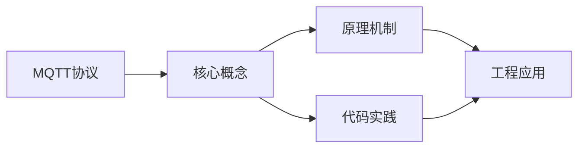
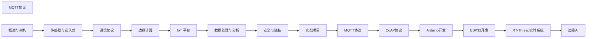

## 1. 学习目标（Bloom 分类）

本节按照布鲁姆教育目标分类学组织学习路径。本文主题为《MQTT协议》，属于 物联网 模块，读者可以根据自身阶段选择阅读深度。

记忆层面：能够准确复述本文的核心概念、术语与基本语法或操作步骤，并能够在提问或检索时快速定位对应知识点。能够说出 物联网 的核心概念、组件与标准流程。

理解层面：能够用自己的语言解释核心原理与工作机制，说明概念之间的因果关系，而不是机械记忆结论。能够解释 物联网 的工作原理与关键机制。

应用层面：能够在真实项目或练习场景中运用本文知识解决具体问题，写出正确且可维护的实现。能够执行 物联网 相关的标准操作与配置。

分析层面：能够拆解复杂问题，比较本文主题与相邻概念的异同，识别边界条件与例外情况。能够分析 物联网 方案在可靠性、成本与性能上的权衡。

评价层面：能够根据约束条件（性能、可读性、安全、成本）评价不同方案的优劣，做出有依据的技术决策。能够评价 物联网 中的技术选型。

创造层面：能够把本文知识与其他模块知识组合，设计出新的解决方案或可复用的工程模式。能够设计基于 物联网 的完整解决方案。

通过本节学习，读者应当能够把《MQTT协议》纳入自己的知识网络，并与 物联网 模块的其他主题（传感器、协议、边缘计算、设备管理）建立关联。

## 2. 历史动机与发展脉络

《MQTT协议》是 物联网 领域的重要主题。要真正理解它，需要先了解它解决的问题与演进过程。

物联网（IoT）指设备互联的物理网络，起源可追溯到 1980 年代传感器网络；Kevin Ashton 1999 年提出 IoT 术语，RFID 是其早期载体。
架构分层：感知层（传感器/执行器）、网络层（连接）、平台层（设备管理/数据）、应用层（业务）；边缘计算将处理下沉到设备侧。
协议版图：MQTT（轻量发布订阅）、CoAP（受限设备）、HTTP/HTTPS、LoRa/NB-IoT（低功耗广域）、Zigbee/BLE（短距）。

回到本文主题：MQTT协议 的提出与成熟，正是上述技术背景下的必然产物。早期实现往往以简单可用为目标，随着工程规模扩大，社区逐渐沉淀出标准做法与最佳实践；理解这一脉络，可以帮助读者判断“为什么文档中的推荐写法是现在这个样子”，也能在遇到历史遗留代码时准确识别其设计年代与取舍。


## 3. 形式化定义与核心概念精讲

本节把《MQTT协议》涉及的核心概念以“定义 + 讲解”的形式展开。读者应把定义当作工具，把讲解当作理解路径；两者结合才能形成可迁移的知识。

MQTT：基于 TCP 的发布/订阅，QoS 0/1/2 分级投递，遗嘱消息；适合低带宽高延迟网络。
设备接入：设备注册、鉴权（X.509/Token）、上下行消息、影子设备（desired/reported 状态）。
边缘计算：边缘网关聚合数据、本地推理与断网续传；云端统一管理。

### 3.1 原文章节逐一精讲

原文档把主题拆分为 15 个小节，下面按顺序给出每一节的导读讲解，随后保留原文细节供精读。

#### 原文精读（完整保留）

# 物联网 MQTT 主题与通配符

> **符号约定**：`< >` 必填参数 | `[ ]` 可选参数

---

#### 1. MQTT 概述

##### 1.1 什么是 MQTT

MQTT（Message Queuing Telemetry Transport）是轻量级的发布/订阅消息协议，专为物联网场景设计。

##### 1.2 核心特点

| 特点      | 描述            |
| --------- | --------------- |
| 轻量      | 最小报文 2 字节 |
| 发布/订阅 | 解耦通信双方    |
| 多种 QoS  | 灵活可靠性      |
| 持久会话  | 离线消息保留    |
| 安全      | TLS + 认证      |

##### 1.3 架构

```
Publisher → Broker → Subscriber
  (设备)    (服务器)   (应用)
```

#### 2. 发布/订阅模型

##### 2.1 主题（Topic）

```
home/livingroom/temperature
home/+/temperature          # + 单层通配符
home/#                      # # 多层通配符
```

| 通配符 | 描述     | 示例                                     |
| ------ | -------- | ---------------------------------------- |
| `+`    | 单层匹配 | `sensor/+/temp` 匹配 `sensor/1/temp`     |
| `#`    | 多层匹配 | `sensor/#` 匹配 `sensor/1/temp/humidity` |

##### 2.2 主题设计最佳实践

```
# 推荐格式
{version}/{domain}/{device_type}/{device_id}/{property}

# 示例
v1/factory/sensor/temp/device001/value
v1/smart-home/light/switch/livingroom/state
```

#### 3. QoS 等级

| QoS | 描述     | 传输次数 | 适用场景              |
| --- | -------- | -------- | --------------------- |
| 0   | 最多一次 | 1 次     | 传感器数据（可丢失）  |
| 1   | 至少一次 | 2+ 次    | 控制命令（需确认）    |
| 2   | 恰好一次 | 4 次     | 支付/计费（不可重复） |

##### 3.1 QoS 0 流程

```
Publisher → PUBLISH → Broker → PUBLISH → Subscriber
```

##### 3.2 QoS 1 流程

```
Publisher → PUBLISH → Broker → PUBACK → Publisher
Broker → PUBLISH → Subscriber → PUBACK → Broker
```

##### 3.3 QoS 2 流程

```
Publisher → PUBLISH → Broker → PUBREC → Publisher → PUBREL → Broker → PUBCOMP → Publisher
Broker → PUBLISH → Subscriber → PUBREC → Broker → PUBREL → Subscriber → PUBCOMP → Broker
```

#### 4. 保留消息与遗嘱消息

##### 4.1 保留消息（Retained Message）

Broker 保留最新一条消息，新订阅者立即收到。

```python
# 发布保留消息
client.publish("device/status", payload="online", retain=True)
```

##### 4.2 遗嘱消息（LWT）

客户端异常断开时，Broker 自动发布遗嘱消息。

```python
client.will_set("device/status", payload="offline", qos=1, retain=True)
```

#### 5. MQTT 5.0 新特性

| 特性          | 描述                |
| ------------- | ------------------- |
| 原因码        | 明确的连接/断开原因 |
| 用户属性      | 自定义键值对        |
| 共享订阅      | 负载均衡            |
| 主题别名      | 减少带宽            |
| 流控          | 限制消息速率        |
| 会话/消息过期 | 自动清理            |

#### 6. Broker 选型

| Broker    | 特点         | 适用场景    |
| --------- | ------------ | ----------- |
| Mosquitto | 轻量开源     | 小规模/开发 |
| EMQX      | 高性能分布式 | 大规模生产  |
| HiveMQ    | 企业级       | 企业 IoT    |
| VerneMQ   | 分布式       | 高可用      |

##### 6.1 EMQX 示例

```bash
# Docker 部署
docker run -d --name emqx \
  -p 1883:1883 \
  -p 8083:8083 \
  -p 8084:8084 \
  -p 8883:8883 \
  -p 18083:18083 \
  emqx/emqx:latest
```

#### 7. 代码示例

##### 7.1 Python (paho-mqtt)

```python
import paho.mqtt.client as mqtt

def on_connect(client, userdata, flags, rc):
    print(f"Connected with code {rc}")
    client.subscribe("home/+/temperature")

def on_message(client, userdata, msg):
    print(f"{msg.topic}: {msg.payload.decode()}")

client = mqtt.Client(client_id="sensor-app")
client.on_connect = on_connect
client.on_message = on_message
client.will_set("device/status", "offline", qos=1, retain=True)

client.connect("broker.emqx.io", 1883, 60)
client.loop_forever()
```

##### 7.2 ESP32 (Arduino)

```cpp
#include <WiFi.h>
#include <PubSubClient.h>

WiFiClient espClient;
PubSubClient client(espClient);

void setup() {
  WiFi.begin("SSID", "password");
  client.setServer("broker.emqx.io", 1883);
}

void loop() {
  if (!client.connected()) {
    client.connect("esp32-client");
  }
  client.publish("home/temperature", String(readTemperature()).c_str());
  client.loop();
  delay(5000);
}
```
#### 主题层级

**基本写法：单层主题**
`<名称>`
```bash
# 单层主题用于简单场景
home
```

---

**基本写法：多层级主题**
`<层级1>/<层级2>/<层级3>`
```bash
# 使用斜杠分隔多个层级
home/livingroom/temperature
```

---

**基本写法：以斜杠开头**
`/<层级>`
```bash
# 开头斜杠会创建一个空层级
/home/livingroom
```

---

**基本写法：以斜杠结尾**
`<层级>/`
```bash
# 结尾斜杠会创建一个空层级
home/livingroom/
```

---

#### 主题设计规范

**基本写法：层级命名规范**
`<building>/<floor>/<room>/<sensor>/<metric>`
```bash
# 按物理位置组织主题
buildingA/floor1/room101/dht22/temperature
```

---

**基本写法：使用小写与短横线**
`<service>-<instance>/<action>`
```bash
# 主题命名避免空格与特殊字符
device-001/status/online
```

---

**基本写法：避免空层级**
`home//temperature`
```bash
# 不推荐使用空层级
home//temperature
```

---

#### 单层通配符 +

**基本写法：单层匹配**
`<前缀>/+/<后缀>`
```bash
# 匹配 home 任意房间下的 temperature
home/+/temperature
```

---

**基本写法：仅匹配单层**
`<前缀>/+`
```bash
# 仅匹配 home 下一层不递归
home/+
```

---

**基本写法：组合单层通配符**
`<前缀>/+/sensor/<后缀>`
```bash
# 中间层任意但前后固定
building/+/sensor/temp
```

---

**基本写法：多位置使用 +**
`<前缀>/+/+/+`
```bash
# 多个单层通配符组合
home/+/+/+/
```

---

#### 多层通配符 #

**基本写法：递归匹配所有子层**
`<前缀>/#`
```bash
# 订阅 home 下所有层级所有主题
home/#
```

---

**基本写法：根通配符**
`#`
```bash
# 订阅 broker 上所有消息慎用
#
```

---

**基本写法：通配符必须在末尾**
`<前缀>/#/<后缀>`
```bash
# 错误写法 # 必须是主题最后一个字符
home/#/temp
```

---

**基本写法：前缀加 #**
`home/livingroom/#`
```bash
# 订阅 livingroom 下所有子主题
home/livingroom/#
```

---

#### 系统主题

**基本写法：Broker 系统主题**
`$SYS/<子系统>`
```bash
# 订阅 broker 内置系统信息
$SYS/broker/version
```

---

**基本写法：查看连接数**
`$SYS/broker/clients/connected`
```bash
# 订阅当前在线客户端数
$SYS/broker/clients/connected
```

---

**基本写法：查看 broker 负载**
`$SYS/broker/load/messages/+`
```bash
# 订阅消息发送速率所有统计周期
$SYS/broker/load/messages/+
```

---

**基本写法：查看运行时间**
`$SYS/broker/uptime`
```bash
# 订阅 broker 启动至今时长
$SYS/broker/uptime
```

---

#### 主题最佳实践

**基本写法：状态主题**
`<device>/status/<attribute>`
```bash
# 设备状态上报主题
sensor-001/status/online
```

---

**基本写法：命令主题**
`<device>/cmd/<action>`
```bash
# 下行控制命令主题
light-001/cmd/toggle
```

---

**基本写法：事件主题**
`<device>/event/<type>`
```bash
# 设备事件通知主题
door-001/event/open
```

---

**基本写法：数据主题**
`<device>/data/<metric>`
```bash
# 周期性数据上报主题
meter-001/data/power
```

---

**基本写法：响应主题**
`<device>/resp/<requestId>`
```bash
# RPC 响应主题带请求 ID
device-001/resp/abc123
```

---

#### 通配符订阅示例

**基本写法：监听所有传感器数据**
`+/data/#`
```bash
# 监听所有设备的 data 主题
+/data/#
```

---

**基本写法：监听特定房间所有设备**
`home/livingroom/#`
```bash
# 监听客厅所有设备消息
home/livingroom/#
```

---

**基本写法：监听所有设备上下线**
`+/status/online`
```bash
# 监听所有设备上线状态
+/status/online
```

---

**基本写法：监听所有告警事件**
`+/event/alert/#`
```bash
# 监听所有设备的告警事件
+/event/alert/#
```

---

#### 共享订阅

**基本写法：MQTT 5 共享订阅**
`$share/<组名>/<主题>`
```bash
# 多个订阅者负载均衡消费
$share/workers/queue/tasks
```

---

**基本写法：共享订阅通配符**
`$share/<组名>/<前缀>/#`
```bash
# 共享订阅匹配多层级
$share/group1/sensors/#
```


### 3.2 概念关系图

下面用 Mermaid 图表达本文核心概念之间的关系，帮助读者建立整体图景：



图中展示的是本文知识的结构化关系：核心概念是入口，原理机制解释“为什么”，代码实践演示“怎么做”，工程应用回答“何时用”。读者学习时可以把每个小节的内容挂接到对应节点上。

## 4. 理论推导与原理解析

本节深入《MQTT协议》背后的原理。理论部分不求面面俱到，而是聚焦“能解释现象、能指导实践”的关键推导。

MQTT：基于 TCP 的发布/订阅，QoS 0/1/2 分级投递，遗嘱消息；适合低带宽高延迟网络。
设备接入：设备注册、鉴权（X.509/Token）、上下行消息、影子设备（desired/reported 状态）。
边缘计算：边缘网关聚合数据、本地推理与断网续传；云端统一管理。
数据链路：采集 -> 清洗 -> 时序存储（InfluxDB/TDengine）-> 规则引擎 -> 应用。

需要强调的是，理论推导与工程实践之间存在翻译层：理论给出的是理想化模型与边界条件，工程代码则必须处理真实环境中的例外。读者在学习时应先掌握理论的“标准情形”，再通过陷阱章节了解“非标准情形”。

## 5. 代码示例与逐行讲解

本节把原文中的代码示例系统整理，并为每个示例补充用途说明与讲解。读者不应只浏览代码，而应逐段对照讲解理解设计意图。

### 5.1 示例：1.3 架构

该示例来自原文《1.3 架构》小节，用于演示MQTT协议相关操作。阅读时请先看代码结构，再看其后的讲解。

```text
Publisher → Broker → Subscriber
  (设备)    (服务器)   (应用)
```

讲解：这段代码演示了本节核心知识点。代码中的关键操作可以归纳为三步：准备（定义或初始化）、执行（核心逻辑）、收尾（释放资源或返回结果）。实际项目中，这三步往往被封装为函数或类，以提升复用性与可测试性。

关键点分析：

该示例共 2 行有效代码，结构以数据或配置为主。阅读时应关注：数据字段的含义、配置项的作用，以及它们与运行行为的对应关系。

进阶思考路径：先尝试修改参数观察行为变化，再把示例中的模式迁移到自己的项目中；每次修改都记录预期与实测差异，这是把示例转化为能力的最快方式。

### 5.2 示例：2.1 主题（Topic）

该示例来自原文《2.1 主题（Topic）》小节，用于演示MQTT协议相关操作。阅读时请先看代码结构，再看其后的讲解。

```text
home/livingroom/temperature
home/+/temperature          # + 单层通配符
home/#                      # # 多层通配符
```

讲解：这段代码演示了本节核心知识点。代码中的关键操作可以归纳为三步：准备（定义或初始化）、执行（核心逻辑）、收尾（释放资源或返回结果）。实际项目中，这三步往往被封装为函数或类，以提升复用性与可测试性。

关键点分析：

该示例共 3 行有效代码，结构以数据或配置为主。阅读时应关注：数据字段的含义、配置项的作用，以及它们与运行行为的对应关系。

进阶思考路径：先尝试修改参数观察行为变化，再把示例中的模式迁移到自己的项目中；每次修改都记录预期与实测差异，这是把示例转化为能力的最快方式。

### 5.3 示例：2.2 主题设计最佳实践

该示例来自原文《2.2 主题设计最佳实践》小节，用于演示MQTT协议相关操作。阅读时请先看代码结构，再看其后的讲解。

```text
# 推荐格式
{version}/{domain}/{device_type}/{device_id}/{property}

# 示例
v1/factory/sensor/temp/device001/value
v1/smart-home/light/switch/livingroom/state
```

讲解：这段代码演示了本节核心知识点。代码中的关键操作可以归纳为三步：准备（定义或初始化）、执行（核心逻辑）、收尾（释放资源或返回结果）。实际项目中，这三步往往被封装为函数或类，以提升复用性与可测试性。

关键点分析：

该示例共 5 行有效代码，结构以数据或配置为主。阅读时应关注：数据字段的含义、配置项的作用，以及它们与运行行为的对应关系。

进阶思考路径：先尝试修改参数观察行为变化，再把示例中的模式迁移到自己的项目中；每次修改都记录预期与实测差异，这是把示例转化为能力的最快方式。

### 5.4 示例：3.1 QoS 0 流程

该示例来自原文《3.1 QoS 0 流程》小节，用于演示MQTT协议相关操作。阅读时请先看代码结构，再看其后的讲解。

```text
Publisher → PUBLISH → Broker → PUBLISH → Subscriber
```

讲解：这段代码演示了本节核心知识点。代码中的关键操作可以归纳为三步：准备（定义或初始化）、执行（核心逻辑）、收尾（释放资源或返回结果）。实际项目中，这三步往往被封装为函数或类，以提升复用性与可测试性。

关键点分析：

该示例共 1 行有效代码，结构以数据或配置为主。阅读时应关注：数据字段的含义、配置项的作用，以及它们与运行行为的对应关系。

进阶思考路径：先尝试修改参数观察行为变化，再把示例中的模式迁移到自己的项目中；每次修改都记录预期与实测差异，这是把示例转化为能力的最快方式。

### 5.5 示例：3.2 QoS 1 流程

该示例来自原文《3.2 QoS 1 流程》小节，用于演示MQTT协议相关操作。阅读时请先看代码结构，再看其后的讲解。

```text
Publisher → PUBLISH → Broker → PUBACK → Publisher
Broker → PUBLISH → Subscriber → PUBACK → Broker
```

讲解：这段代码演示了本节核心知识点。代码中的关键操作可以归纳为三步：准备（定义或初始化）、执行（核心逻辑）、收尾（释放资源或返回结果）。实际项目中，这三步往往被封装为函数或类，以提升复用性与可测试性。

关键点分析：

该示例共 2 行有效代码，结构以数据或配置为主。阅读时应关注：数据字段的含义、配置项的作用，以及它们与运行行为的对应关系。

进阶思考路径：先尝试修改参数观察行为变化，再把示例中的模式迁移到自己的项目中；每次修改都记录预期与实测差异，这是把示例转化为能力的最快方式。

### 5.6 示例：3.3 QoS 2 流程

该示例来自原文《3.3 QoS 2 流程》小节，用于演示MQTT协议相关操作。阅读时请先看代码结构，再看其后的讲解。

```text
Publisher → PUBLISH → Broker → PUBREC → Publisher → PUBREL → Broker → PUBCOMP → Publisher
Broker → PUBLISH → Subscriber → PUBREC → Broker → PUBREL → Subscriber → PUBCOMP → Broker
```

讲解：这段代码演示了本节核心知识点。代码中的关键操作可以归纳为三步：准备（定义或初始化）、执行（核心逻辑）、收尾（释放资源或返回结果）。实际项目中，这三步往往被封装为函数或类，以提升复用性与可测试性。

关键点分析：

该示例共 2 行有效代码，结构以数据或配置为主。阅读时应关注：数据字段的含义、配置项的作用，以及它们与运行行为的对应关系。

进阶思考路径：先尝试修改参数观察行为变化，再把示例中的模式迁移到自己的项目中；每次修改都记录预期与实测差异，这是把示例转化为能力的最快方式。

### 5.7 示例：4.1 保留消息（Retained Message）

该示例来自原文《4.1 保留消息（Retained Message）》小节，用于演示MQTT协议相关操作。阅读时请先看代码结构，再看其后的讲解。

```python
# 发布保留消息
client.publish("device/status", payload="online", retain=True)
```

讲解：这段代码演示了本节核心知识点。代码中的关键操作可以归纳为三步：准备（定义或初始化）、执行（核心逻辑）、收尾（释放资源或返回结果）。实际项目中，这三步往往被封装为函数或类，以提升复用性与可测试性。

关键点分析：

该示例共 2 行有效代码，结构以数据或配置为主。阅读时应关注：数据字段的含义、配置项的作用，以及它们与运行行为的对应关系。

进阶思考路径：先尝试修改参数观察行为变化，再把示例中的模式迁移到自己的项目中；每次修改都记录预期与实测差异，这是把示例转化为能力的最快方式。

### 5.8 示例：4.2 遗嘱消息（LWT）

该示例来自原文《4.2 遗嘱消息（LWT）》小节，用于演示MQTT协议相关操作。阅读时请先看代码结构，再看其后的讲解。

```python
client.will_set("device/status", payload="offline", qos=1, retain=True)
```

讲解：这段代码演示了本节核心知识点。代码中的关键操作可以归纳为三步：准备（定义或初始化）、执行（核心逻辑）、收尾（释放资源或返回结果）。实际项目中，这三步往往被封装为函数或类，以提升复用性与可测试性。

关键点分析：

该示例共 1 行有效代码，结构以数据或配置为主。阅读时应关注：数据字段的含义、配置项的作用，以及它们与运行行为的对应关系。

进阶思考路径：先尝试修改参数观察行为变化，再把示例中的模式迁移到自己的项目中；每次修改都记录预期与实测差异，这是把示例转化为能力的最快方式。

### 5.9 示例：6.1 EMQX 示例

该示例来自原文《6.1 EMQX 示例》小节，用于演示MQTT协议相关操作。阅读时请先看代码结构，再看其后的讲解。

```bash
# Docker 部署
docker run -d --name emqx \
  -p 1883:1883 \
  -p 8083:8083 \
  -p 8084:8084 \
  -p 8883:8883 \
  -p 18083:18083 \
  emqx/emqx:latest
```

讲解：这段代码演示了本节核心知识点。代码中的关键操作可以归纳为三步：准备（定义或初始化）、执行（核心逻辑）、收尾（释放资源或返回结果）。实际项目中，这三步往往被封装为函数或类，以提升复用性与可测试性。

关键点分析：

该示例共 8 行有效代码，结构以数据或配置为主。阅读时应关注：数据字段的含义、配置项的作用，以及它们与运行行为的对应关系。

进阶思考路径：先尝试修改参数观察行为变化，再把示例中的模式迁移到自己的项目中；每次修改都记录预期与实测差异，这是把示例转化为能力的最快方式。

### 5.10 示例：7.1 Python (paho-mqtt)

该示例来自原文《7.1 Python (paho-mqtt)》小节，用于演示MQTT协议相关操作。阅读时请先看代码结构，再看其后的讲解。

```python
import paho.mqtt.client as mqtt

def on_connect(client, userdata, flags, rc):
    print(f"Connected with code {rc}")
    client.subscribe("home/+/temperature")

def on_message(client, userdata, msg):
    print(f"{msg.topic}: {msg.payload.decode()}")

client = mqtt.Client(client_id="sensor-app")
client.on_connect = on_connect
client.on_message = on_message
client.will_set("device/status", "offline", qos=1, retain=True)

client.connect("broker.emqx.io", 1883, 60)
client.loop_forever()
```

讲解：这段代码演示了本节核心知识点。代码中的关键操作可以归纳为三步：准备（定义或初始化）、执行（核心逻辑）、收尾（释放资源或返回结果）。实际项目中，这三步往往被封装为函数或类，以提升复用性与可测试性。

关键点分析：

该示例共 12 行有效代码，包含 2 类关键结构（def、import）。其中：

- 入口与初始化部分负责建立上下文，对应实际项目中的启动或装配逻辑；
- 核心逻辑部分体现本文主题的主要操作，是阅读时最需要对照讲解理解的部分；
- 输出或返回部分把结果交给调用方，注意其类型与边界条件。

进阶思考路径：先尝试修改参数观察行为变化，再把示例中的模式迁移到自己的项目中；每次修改都记录预期与实测差异，这是把示例转化为能力的最快方式。

### 5.11 示例：7.2 ESP32 (Arduino)

该示例来自原文《7.2 ESP32 (Arduino)》小节，用于演示MQTT协议相关操作。阅读时请先看代码结构，再看其后的讲解。

```cpp
#include <WiFi.h>
#include <PubSubClient.h>

WiFiClient espClient;
PubSubClient client(espClient);

void setup() {
  WiFi.begin("SSID", "password");
  client.setServer("broker.emqx.io", 1883);
}

void loop() {
  if (!client.connected()) {
    client.connect("esp32-client");
  }
  client.publish("home/temperature", String(readTemperature()).c_str());
  client.loop();
  delay(5000);
}
```

讲解：这段代码演示了本节核心知识点。代码中的关键操作可以归纳为三步：准备（定义或初始化）、执行（核心逻辑）、收尾（释放资源或返回结果）。实际项目中，这三步往往被封装为函数或类，以提升复用性与可测试性。

关键点分析：

该示例共 16 行有效代码，包含 1 类关键结构（if）。其中：

- 入口与初始化部分负责建立上下文，对应实际项目中的启动或装配逻辑；
- 核心逻辑部分体现本文主题的主要操作，是阅读时最需要对照讲解理解的部分；
- 输出或返回部分把结果交给调用方，注意其类型与边界条件。

进阶思考路径：先尝试修改参数观察行为变化，再把示例中的模式迁移到自己的项目中；每次修改都记录预期与实测差异，这是把示例转化为能力的最快方式。

### 5.12 示例：主题层级

该示例来自原文《主题层级》小节，用于演示MQTT协议相关操作。阅读时请先看代码结构，再看其后的讲解。

```bash
# 单层主题用于简单场景
home
```

讲解：这段代码演示了本节核心知识点。代码中的关键操作可以归纳为三步：准备（定义或初始化）、执行（核心逻辑）、收尾（释放资源或返回结果）。实际项目中，这三步往往被封装为函数或类，以提升复用性与可测试性。

关键点分析：

该示例共 2 行有效代码，结构以数据或配置为主。阅读时应关注：数据字段的含义、配置项的作用，以及它们与运行行为的对应关系。

进阶思考路径：先尝试修改参数观察行为变化，再把示例中的模式迁移到自己的项目中；每次修改都记录预期与实测差异，这是把示例转化为能力的最快方式。

### 5.13 示例：主题层级

该示例来自原文《主题层级》小节，用于演示MQTT协议相关操作。阅读时请先看代码结构，再看其后的讲解。

```bash
# 使用斜杠分隔多个层级
home/livingroom/temperature
```

讲解：这段代码演示了本节核心知识点。代码中的关键操作可以归纳为三步：准备（定义或初始化）、执行（核心逻辑）、收尾（释放资源或返回结果）。实际项目中，这三步往往被封装为函数或类，以提升复用性与可测试性。

关键点分析：

该示例共 2 行有效代码，结构以数据或配置为主。阅读时应关注：数据字段的含义、配置项的作用，以及它们与运行行为的对应关系。

进阶思考路径：先尝试修改参数观察行为变化，再把示例中的模式迁移到自己的项目中；每次修改都记录预期与实测差异，这是把示例转化为能力的最快方式。

### 5.14 示例：主题层级

该示例来自原文《主题层级》小节，用于演示MQTT协议相关操作。阅读时请先看代码结构，再看其后的讲解。

```bash
# 开头斜杠会创建一个空层级
/home/livingroom
```

讲解：这段代码演示了本节核心知识点。代码中的关键操作可以归纳为三步：准备（定义或初始化）、执行（核心逻辑）、收尾（释放资源或返回结果）。实际项目中，这三步往往被封装为函数或类，以提升复用性与可测试性。

关键点分析：

该示例共 2 行有效代码，结构以数据或配置为主。阅读时应关注：数据字段的含义、配置项的作用，以及它们与运行行为的对应关系。

进阶思考路径：先尝试修改参数观察行为变化，再把示例中的模式迁移到自己的项目中；每次修改都记录预期与实测差异，这是把示例转化为能力的最快方式。

### 5.15 示例：主题层级

该示例来自原文《主题层级》小节，用于演示MQTT协议相关操作。阅读时请先看代码结构，再看其后的讲解。

```bash
# 结尾斜杠会创建一个空层级
home/livingroom/
```

讲解：这段代码演示了本节核心知识点。代码中的关键操作可以归纳为三步：准备（定义或初始化）、执行（核心逻辑）、收尾（释放资源或返回结果）。实际项目中，这三步往往被封装为函数或类，以提升复用性与可测试性。

关键点分析：

该示例共 2 行有效代码，结构以数据或配置为主。阅读时应关注：数据字段的含义、配置项的作用，以及它们与运行行为的对应关系。

进阶思考路径：先尝试修改参数观察行为变化，再把示例中的模式迁移到自己的项目中；每次修改都记录预期与实测差异，这是把示例转化为能力的最快方式。

### 5.16 示例：主题设计规范

该示例来自原文《主题设计规范》小节，用于演示MQTT协议相关操作。阅读时请先看代码结构，再看其后的讲解。

```bash
# 按物理位置组织主题
buildingA/floor1/room101/dht22/temperature
```

讲解：这段代码演示了本节核心知识点。代码中的关键操作可以归纳为三步：准备（定义或初始化）、执行（核心逻辑）、收尾（释放资源或返回结果）。实际项目中，这三步往往被封装为函数或类，以提升复用性与可测试性。

关键点分析：

该示例共 2 行有效代码，结构以数据或配置为主。阅读时应关注：数据字段的含义、配置项的作用，以及它们与运行行为的对应关系。

进阶思考路径：先尝试修改参数观察行为变化，再把示例中的模式迁移到自己的项目中；每次修改都记录预期与实测差异，这是把示例转化为能力的最快方式。

### 5.17 示例：主题设计规范

该示例来自原文《主题设计规范》小节，用于演示MQTT协议相关操作。阅读时请先看代码结构，再看其后的讲解。

```bash
# 主题命名避免空格与特殊字符
device-001/status/online
```

讲解：这段代码演示了本节核心知识点。代码中的关键操作可以归纳为三步：准备（定义或初始化）、执行（核心逻辑）、收尾（释放资源或返回结果）。实际项目中，这三步往往被封装为函数或类，以提升复用性与可测试性。

关键点分析：

该示例共 2 行有效代码，结构以数据或配置为主。阅读时应关注：数据字段的含义、配置项的作用，以及它们与运行行为的对应关系。

进阶思考路径：先尝试修改参数观察行为变化，再把示例中的模式迁移到自己的项目中；每次修改都记录预期与实测差异，这是把示例转化为能力的最快方式。

### 5.18 示例：主题设计规范

该示例来自原文《主题设计规范》小节，用于演示MQTT协议相关操作。阅读时请先看代码结构，再看其后的讲解。

```bash
# 不推荐使用空层级
home//temperature
```

讲解：这段代码演示了本节核心知识点。代码中的关键操作可以归纳为三步：准备（定义或初始化）、执行（核心逻辑）、收尾（释放资源或返回结果）。实际项目中，这三步往往被封装为函数或类，以提升复用性与可测试性。

关键点分析：

该示例共 2 行有效代码，结构以数据或配置为主。阅读时应关注：数据字段的含义、配置项的作用，以及它们与运行行为的对应关系。

进阶思考路径：先尝试修改参数观察行为变化，再把示例中的模式迁移到自己的项目中；每次修改都记录预期与实测差异，这是把示例转化为能力的最快方式。

### 5.19 示例：单层通配符 +

该示例来自原文《单层通配符 +》小节，用于演示MQTT协议相关操作。阅读时请先看代码结构，再看其后的讲解。

```bash
# 匹配 home 任意房间下的 temperature
home/+/temperature
```

讲解：这段代码演示了本节核心知识点。代码中的关键操作可以归纳为三步：准备（定义或初始化）、执行（核心逻辑）、收尾（释放资源或返回结果）。实际项目中，这三步往往被封装为函数或类，以提升复用性与可测试性。

关键点分析：

该示例共 2 行有效代码，结构以数据或配置为主。阅读时应关注：数据字段的含义、配置项的作用，以及它们与运行行为的对应关系。

进阶思考路径：先尝试修改参数观察行为变化，再把示例中的模式迁移到自己的项目中；每次修改都记录预期与实测差异，这是把示例转化为能力的最快方式。

### 5.20 示例：单层通配符 +

该示例来自原文《单层通配符 +》小节，用于演示MQTT协议相关操作。阅读时请先看代码结构，再看其后的讲解。

```bash
# 仅匹配 home 下一层不递归
home/+
```

讲解：这段代码演示了本节核心知识点。代码中的关键操作可以归纳为三步：准备（定义或初始化）、执行（核心逻辑）、收尾（释放资源或返回结果）。实际项目中，这三步往往被封装为函数或类，以提升复用性与可测试性。

关键点分析：

该示例共 2 行有效代码，结构以数据或配置为主。阅读时应关注：数据字段的含义、配置项的作用，以及它们与运行行为的对应关系。

进阶思考路径：先尝试修改参数观察行为变化，再把示例中的模式迁移到自己的项目中；每次修改都记录预期与实测差异，这是把示例转化为能力的最快方式。

### 5.21 示例：单层通配符 +

该示例来自原文《单层通配符 +》小节，用于演示MQTT协议相关操作。阅读时请先看代码结构，再看其后的讲解。

```bash
# 中间层任意但前后固定
building/+/sensor/temp
```

讲解：这段代码演示了本节核心知识点。代码中的关键操作可以归纳为三步：准备（定义或初始化）、执行（核心逻辑）、收尾（释放资源或返回结果）。实际项目中，这三步往往被封装为函数或类，以提升复用性与可测试性。

关键点分析：

该示例共 2 行有效代码，结构以数据或配置为主。阅读时应关注：数据字段的含义、配置项的作用，以及它们与运行行为的对应关系。

进阶思考路径：先尝试修改参数观察行为变化，再把示例中的模式迁移到自己的项目中；每次修改都记录预期与实测差异，这是把示例转化为能力的最快方式。

### 5.22 示例：单层通配符 +

该示例来自原文《单层通配符 +》小节，用于演示MQTT协议相关操作。阅读时请先看代码结构，再看其后的讲解。

```bash
# 多个单层通配符组合
home/+/+/+/
```

讲解：这段代码演示了本节核心知识点。代码中的关键操作可以归纳为三步：准备（定义或初始化）、执行（核心逻辑）、收尾（释放资源或返回结果）。实际项目中，这三步往往被封装为函数或类，以提升复用性与可测试性。

关键点分析：

该示例共 2 行有效代码，结构以数据或配置为主。阅读时应关注：数据字段的含义、配置项的作用，以及它们与运行行为的对应关系。

进阶思考路径：先尝试修改参数观察行为变化，再把示例中的模式迁移到自己的项目中；每次修改都记录预期与实测差异，这是把示例转化为能力的最快方式。

### 5.23 示例：多层通配符 #

该示例来自原文《多层通配符 #》小节，用于演示MQTT协议相关操作。阅读时请先看代码结构，再看其后的讲解。

```bash
# 订阅 home 下所有层级所有主题
home/#
```

讲解：这段代码演示了本节核心知识点。代码中的关键操作可以归纳为三步：准备（定义或初始化）、执行（核心逻辑）、收尾（释放资源或返回结果）。实际项目中，这三步往往被封装为函数或类，以提升复用性与可测试性。

关键点分析：

该示例共 2 行有效代码，结构以数据或配置为主。阅读时应关注：数据字段的含义、配置项的作用，以及它们与运行行为的对应关系。

进阶思考路径：先尝试修改参数观察行为变化，再把示例中的模式迁移到自己的项目中；每次修改都记录预期与实测差异，这是把示例转化为能力的最快方式。

### 5.24 示例：多层通配符 #

该示例来自原文《多层通配符 #》小节，用于演示MQTT协议相关操作。阅读时请先看代码结构，再看其后的讲解。

```bash
# 订阅 broker 上所有消息慎用
#
```

讲解：这段代码演示了本节核心知识点。代码中的关键操作可以归纳为三步：准备（定义或初始化）、执行（核心逻辑）、收尾（释放资源或返回结果）。实际项目中，这三步往往被封装为函数或类，以提升复用性与可测试性。

关键点分析：

该示例共 2 行有效代码，结构以数据或配置为主。阅读时应关注：数据字段的含义、配置项的作用，以及它们与运行行为的对应关系。

进阶思考路径：先尝试修改参数观察行为变化，再把示例中的模式迁移到自己的项目中；每次修改都记录预期与实测差异，这是把示例转化为能力的最快方式。

### 5.25 示例：多层通配符 #

该示例来自原文《多层通配符 #》小节，用于演示MQTT协议相关操作。阅读时请先看代码结构，再看其后的讲解。

```bash
# 错误写法 # 必须是主题最后一个字符
home/#/temp
```

讲解：这段代码演示了本节核心知识点。代码中的关键操作可以归纳为三步：准备（定义或初始化）、执行（核心逻辑）、收尾（释放资源或返回结果）。实际项目中，这三步往往被封装为函数或类，以提升复用性与可测试性。

关键点分析：

该示例共 2 行有效代码，结构以数据或配置为主。阅读时应关注：数据字段的含义、配置项的作用，以及它们与运行行为的对应关系。

进阶思考路径：先尝试修改参数观察行为变化，再把示例中的模式迁移到自己的项目中；每次修改都记录预期与实测差异，这是把示例转化为能力的最快方式。

### 5.26 示例：多层通配符 #

该示例来自原文《多层通配符 #》小节，用于演示MQTT协议相关操作。阅读时请先看代码结构，再看其后的讲解。

```bash
# 订阅 livingroom 下所有子主题
home/livingroom/#
```

讲解：这段代码演示了本节核心知识点。代码中的关键操作可以归纳为三步：准备（定义或初始化）、执行（核心逻辑）、收尾（释放资源或返回结果）。实际项目中，这三步往往被封装为函数或类，以提升复用性与可测试性。

关键点分析：

该示例共 2 行有效代码，结构以数据或配置为主。阅读时应关注：数据字段的含义、配置项的作用，以及它们与运行行为的对应关系。

进阶思考路径：先尝试修改参数观察行为变化，再把示例中的模式迁移到自己的项目中；每次修改都记录预期与实测差异，这是把示例转化为能力的最快方式。

### 5.27 示例：系统主题

该示例来自原文《系统主题》小节，用于演示MQTT协议相关操作。阅读时请先看代码结构，再看其后的讲解。

```bash
# 订阅 broker 内置系统信息
$SYS/broker/version
```

讲解：这段代码演示了本节核心知识点。代码中的关键操作可以归纳为三步：准备（定义或初始化）、执行（核心逻辑）、收尾（释放资源或返回结果）。实际项目中，这三步往往被封装为函数或类，以提升复用性与可测试性。

关键点分析：

该示例共 2 行有效代码，结构以数据或配置为主。阅读时应关注：数据字段的含义、配置项的作用，以及它们与运行行为的对应关系。

进阶思考路径：先尝试修改参数观察行为变化，再把示例中的模式迁移到自己的项目中；每次修改都记录预期与实测差异，这是把示例转化为能力的最快方式。

### 5.28 示例：系统主题

该示例来自原文《系统主题》小节，用于演示MQTT协议相关操作。阅读时请先看代码结构，再看其后的讲解。

```bash
# 订阅当前在线客户端数
$SYS/broker/clients/connected
```

讲解：这段代码演示了本节核心知识点。代码中的关键操作可以归纳为三步：准备（定义或初始化）、执行（核心逻辑）、收尾（释放资源或返回结果）。实际项目中，这三步往往被封装为函数或类，以提升复用性与可测试性。

关键点分析：

该示例共 2 行有效代码，结构以数据或配置为主。阅读时应关注：数据字段的含义、配置项的作用，以及它们与运行行为的对应关系。

进阶思考路径：先尝试修改参数观察行为变化，再把示例中的模式迁移到自己的项目中；每次修改都记录预期与实测差异，这是把示例转化为能力的最快方式。

### 5.29 示例：系统主题

该示例来自原文《系统主题》小节，用于演示MQTT协议相关操作。阅读时请先看代码结构，再看其后的讲解。

```bash
# 订阅消息发送速率所有统计周期
$SYS/broker/load/messages/+
```

讲解：这段代码演示了本节核心知识点。代码中的关键操作可以归纳为三步：准备（定义或初始化）、执行（核心逻辑）、收尾（释放资源或返回结果）。实际项目中，这三步往往被封装为函数或类，以提升复用性与可测试性。

关键点分析：

该示例共 2 行有效代码，结构以数据或配置为主。阅读时应关注：数据字段的含义、配置项的作用，以及它们与运行行为的对应关系。

进阶思考路径：先尝试修改参数观察行为变化，再把示例中的模式迁移到自己的项目中；每次修改都记录预期与实测差异，这是把示例转化为能力的最快方式。

### 5.30 示例：系统主题

该示例来自原文《系统主题》小节，用于演示MQTT协议相关操作。阅读时请先看代码结构，再看其后的讲解。

```bash
# 订阅 broker 启动至今时长
$SYS/broker/uptime
```

讲解：这段代码演示了本节核心知识点。代码中的关键操作可以归纳为三步：准备（定义或初始化）、执行（核心逻辑）、收尾（释放资源或返回结果）。实际项目中，这三步往往被封装为函数或类，以提升复用性与可测试性。

关键点分析：

该示例共 2 行有效代码，结构以数据或配置为主。阅读时应关注：数据字段的含义、配置项的作用，以及它们与运行行为的对应关系。

进阶思考路径：先尝试修改参数观察行为变化，再把示例中的模式迁移到自己的项目中；每次修改都记录预期与实测差异，这是把示例转化为能力的最快方式。

### 5.31 示例：主题最佳实践

该示例来自原文《主题最佳实践》小节，用于演示MQTT协议相关操作。阅读时请先看代码结构，再看其后的讲解。

```bash
# 设备状态上报主题
sensor-001/status/online
```

讲解：这段代码演示了本节核心知识点。代码中的关键操作可以归纳为三步：准备（定义或初始化）、执行（核心逻辑）、收尾（释放资源或返回结果）。实际项目中，这三步往往被封装为函数或类，以提升复用性与可测试性。

关键点分析：

该示例共 2 行有效代码，结构以数据或配置为主。阅读时应关注：数据字段的含义、配置项的作用，以及它们与运行行为的对应关系。

进阶思考路径：先尝试修改参数观察行为变化，再把示例中的模式迁移到自己的项目中；每次修改都记录预期与实测差异，这是把示例转化为能力的最快方式。

### 5.32 示例：主题最佳实践

该示例来自原文《主题最佳实践》小节，用于演示MQTT协议相关操作。阅读时请先看代码结构，再看其后的讲解。

```bash
# 下行控制命令主题
light-001/cmd/toggle
```

讲解：这段代码演示了本节核心知识点。代码中的关键操作可以归纳为三步：准备（定义或初始化）、执行（核心逻辑）、收尾（释放资源或返回结果）。实际项目中，这三步往往被封装为函数或类，以提升复用性与可测试性。

关键点分析：

该示例共 2 行有效代码，结构以数据或配置为主。阅读时应关注：数据字段的含义、配置项的作用，以及它们与运行行为的对应关系。

进阶思考路径：先尝试修改参数观察行为变化，再把示例中的模式迁移到自己的项目中；每次修改都记录预期与实测差异，这是把示例转化为能力的最快方式。

### 5.33 示例：主题最佳实践

该示例来自原文《主题最佳实践》小节，用于演示MQTT协议相关操作。阅读时请先看代码结构，再看其后的讲解。

```bash
# 设备事件通知主题
door-001/event/open
```

讲解：这段代码演示了本节核心知识点。代码中的关键操作可以归纳为三步：准备（定义或初始化）、执行（核心逻辑）、收尾（释放资源或返回结果）。实际项目中，这三步往往被封装为函数或类，以提升复用性与可测试性。

关键点分析：

该示例共 2 行有效代码，结构以数据或配置为主。阅读时应关注：数据字段的含义、配置项的作用，以及它们与运行行为的对应关系。

进阶思考路径：先尝试修改参数观察行为变化，再把示例中的模式迁移到自己的项目中；每次修改都记录预期与实测差异，这是把示例转化为能力的最快方式。

### 5.34 示例：主题最佳实践

该示例来自原文《主题最佳实践》小节，用于演示MQTT协议相关操作。阅读时请先看代码结构，再看其后的讲解。

```bash
# 周期性数据上报主题
meter-001/data/power
```

讲解：这段代码演示了本节核心知识点。代码中的关键操作可以归纳为三步：准备（定义或初始化）、执行（核心逻辑）、收尾（释放资源或返回结果）。实际项目中，这三步往往被封装为函数或类，以提升复用性与可测试性。

关键点分析：

该示例共 2 行有效代码，结构以数据或配置为主。阅读时应关注：数据字段的含义、配置项的作用，以及它们与运行行为的对应关系。

进阶思考路径：先尝试修改参数观察行为变化，再把示例中的模式迁移到自己的项目中；每次修改都记录预期与实测差异，这是把示例转化为能力的最快方式。

### 5.35 示例：主题最佳实践

该示例来自原文《主题最佳实践》小节，用于演示MQTT协议相关操作。阅读时请先看代码结构，再看其后的讲解。

```bash
# RPC 响应主题带请求 ID
device-001/resp/abc123
```

讲解：这段代码演示了本节核心知识点。代码中的关键操作可以归纳为三步：准备（定义或初始化）、执行（核心逻辑）、收尾（释放资源或返回结果）。实际项目中，这三步往往被封装为函数或类，以提升复用性与可测试性。

关键点分析：

该示例共 2 行有效代码，结构以数据或配置为主。阅读时应关注：数据字段的含义、配置项的作用，以及它们与运行行为的对应关系。

进阶思考路径：先尝试修改参数观察行为变化，再把示例中的模式迁移到自己的项目中；每次修改都记录预期与实测差异，这是把示例转化为能力的最快方式。

### 5.36 示例：通配符订阅示例

该示例来自原文《通配符订阅示例》小节，用于演示MQTT协议相关操作。阅读时请先看代码结构，再看其后的讲解。

```bash
# 监听所有设备的 data 主题
+/data/#
```

讲解：这段代码演示了本节核心知识点。代码中的关键操作可以归纳为三步：准备（定义或初始化）、执行（核心逻辑）、收尾（释放资源或返回结果）。实际项目中，这三步往往被封装为函数或类，以提升复用性与可测试性。

关键点分析：

该示例共 2 行有效代码，结构以数据或配置为主。阅读时应关注：数据字段的含义、配置项的作用，以及它们与运行行为的对应关系。

进阶思考路径：先尝试修改参数观察行为变化，再把示例中的模式迁移到自己的项目中；每次修改都记录预期与实测差异，这是把示例转化为能力的最快方式。

### 5.37 示例：通配符订阅示例

该示例来自原文《通配符订阅示例》小节，用于演示MQTT协议相关操作。阅读时请先看代码结构，再看其后的讲解。

```bash
# 监听客厅所有设备消息
home/livingroom/#
```

讲解：这段代码演示了本节核心知识点。代码中的关键操作可以归纳为三步：准备（定义或初始化）、执行（核心逻辑）、收尾（释放资源或返回结果）。实际项目中，这三步往往被封装为函数或类，以提升复用性与可测试性。

关键点分析：

该示例共 2 行有效代码，结构以数据或配置为主。阅读时应关注：数据字段的含义、配置项的作用，以及它们与运行行为的对应关系。

进阶思考路径：先尝试修改参数观察行为变化，再把示例中的模式迁移到自己的项目中；每次修改都记录预期与实测差异，这是把示例转化为能力的最快方式。

### 5.38 示例：通配符订阅示例

该示例来自原文《通配符订阅示例》小节，用于演示MQTT协议相关操作。阅读时请先看代码结构，再看其后的讲解。

```bash
# 监听所有设备上线状态
+/status/online
```

讲解：这段代码演示了本节核心知识点。代码中的关键操作可以归纳为三步：准备（定义或初始化）、执行（核心逻辑）、收尾（释放资源或返回结果）。实际项目中，这三步往往被封装为函数或类，以提升复用性与可测试性。

关键点分析：

该示例共 2 行有效代码，结构以数据或配置为主。阅读时应关注：数据字段的含义、配置项的作用，以及它们与运行行为的对应关系。

进阶思考路径：先尝试修改参数观察行为变化，再把示例中的模式迁移到自己的项目中；每次修改都记录预期与实测差异，这是把示例转化为能力的最快方式。

### 5.39 示例：通配符订阅示例

该示例来自原文《通配符订阅示例》小节，用于演示MQTT协议相关操作。阅读时请先看代码结构，再看其后的讲解。

```bash
# 监听所有设备的告警事件
+/event/alert/#
```

讲解：这段代码演示了本节核心知识点。代码中的关键操作可以归纳为三步：准备（定义或初始化）、执行（核心逻辑）、收尾（释放资源或返回结果）。实际项目中，这三步往往被封装为函数或类，以提升复用性与可测试性。

关键点分析：

该示例共 2 行有效代码，结构以数据或配置为主。阅读时应关注：数据字段的含义、配置项的作用，以及它们与运行行为的对应关系。

进阶思考路径：先尝试修改参数观察行为变化，再把示例中的模式迁移到自己的项目中；每次修改都记录预期与实测差异，这是把示例转化为能力的最快方式。

### 5.40 示例：共享订阅

该示例来自原文《共享订阅》小节，用于演示MQTT协议相关操作。阅读时请先看代码结构，再看其后的讲解。

```bash
# 多个订阅者负载均衡消费
$share/workers/queue/tasks
```

讲解：这段代码演示了本节核心知识点。代码中的关键操作可以归纳为三步：准备（定义或初始化）、执行（核心逻辑）、收尾（释放资源或返回结果）。实际项目中，这三步往往被封装为函数或类，以提升复用性与可测试性。

关键点分析：

该示例共 2 行有效代码，结构以数据或配置为主。阅读时应关注：数据字段的含义、配置项的作用，以及它们与运行行为的对应关系。

进阶思考路径：先尝试修改参数观察行为变化，再把示例中的模式迁移到自己的项目中；每次修改都记录预期与实测差异，这是把示例转化为能力的最快方式。

### 5.41 示例：共享订阅

该示例来自原文《共享订阅》小节，用于演示MQTT协议相关操作。阅读时请先看代码结构，再看其后的讲解。

```bash
# 共享订阅匹配多层级
$share/group1/sensors/#
```

讲解：这段代码演示了本节核心知识点。代码中的关键操作可以归纳为三步：准备（定义或初始化）、执行（核心逻辑）、收尾（释放资源或返回结果）。实际项目中，这三步往往被封装为函数或类，以提升复用性与可测试性。

关键点分析：

该示例共 2 行有效代码，结构以数据或配置为主。阅读时应关注：数据字段的含义、配置项的作用，以及它们与运行行为的对应关系。

进阶思考路径：先尝试修改参数观察行为变化，再把示例中的模式迁移到自己的项目中；每次修改都记录预期与实测差异，这是把示例转化为能力的最快方式。


综合以上示例，可以总结出本主题的代码实践要点：第一，先定义清晰的输入输出契约；第二，核心逻辑保持单一职责；第三，错误处理与边界条件不可省略；第四，命名与注释表达意图而非复述代码。

## 6. 对比分析

对比是理解《MQTT协议》定位的最快路径。下面从多个维度与相邻方案进行对比。

MQTT 与 CoAP：MQTT 可靠投递与复杂订阅；CoAP 类 HTTP 请求响应，UDP 更轻。
边缘与云端计算：边缘低延迟省带宽，云端算力与全局视图。
短距与广域：BLE/Zigbee 室内短距；LoRa/NB-IoT 广域低功耗。

对比的目的不是分出绝对优劣，而是建立选择依据：不同约束条件下，最优解不同。读者应把每个对比维度转化为决策检查清单。

## 7. 常见陷阱与最佳实践

本节整理该主题的高频错误与推荐做法。每个陷阱先描述现象，再解释原因，最后给出最佳实践。

### 7.1 协议选择错误

高功耗设备用 HTTP 轮询浪费电。低功耗场景用 MQTT/CoAP。

深入讲解：该问题之所以被归类为“常见陷阱”，是因为它在初学者的代码中反复出现，而且往往不在第一时间暴露——错误通常隐藏在特定数据或特定时序下。

从成因上看，协议选择错误 一般源于对 物联网 某个机制的理解偏差：要么误用了默认行为，要么忽略了边界条件，要么把其他语言的思维惯性带了过来。

从影响上看，协议选择错误 轻则产生错误结果，重则导致资源泄漏、数据损坏或安全事故；这也是为什么工程评审中会把它列为检查项。

从修复策略上看，处理协议选择错误的正确顺序是：先复现（构造最小用例），再定位（确认机制层面的根因），最后修复并补充回归测试。跳过复现直接改代码，往往治标不治本。

### 7.2 安全裸奔

设备弱口令与明文传输。证书鉴权 + TLS。

深入讲解：该问题之所以被归类为“常见陷阱”，是因为它在初学者的代码中反复出现，而且往往不在第一时间暴露——错误通常隐藏在特定数据或特定时序下。

从成因上看，安全裸奔 一般源于对 物联网 某个机制的理解偏差：要么误用了默认行为，要么忽略了边界条件，要么把其他语言的思维惯性带了过来。

从影响上看，安全裸奔 轻则产生错误结果，重则导致资源泄漏、数据损坏或安全事故；这也是为什么工程评审中会把它列为检查项。

从修复策略上看，处理安全裸奔的正确顺序是：先复现（构造最小用例），再定位（确认机制层面的根因），最后修复并补充回归测试。跳过复现直接改代码，往往治标不治本。

### 7.3 消息乱序

QoS 与重连导致乱序。设计幂等与序号。

深入讲解：该问题之所以被归类为“常见陷阱”，是因为它在初学者的代码中反复出现，而且往往不在第一时间暴露——错误通常隐藏在特定数据或特定时序下。

从成因上看，消息乱序 一般源于对 物联网 某个机制的理解偏差：要么误用了默认行为，要么忽略了边界条件，要么把其他语言的思维惯性带了过来。

从影响上看，消息乱序 轻则产生错误结果，重则导致资源泄漏、数据损坏或安全事故；这也是为什么工程评审中会把它列为检查项。

从修复策略上看，处理消息乱序的正确顺序是：先复现（构造最小用例），再定位（确认机制层面的根因），最后修复并补充回归测试。跳过复现直接改代码，往往治标不治本。

### 7.4 断网数据丢失

边缘缓冲未实现。本地存储 + 续传。

深入讲解：该问题之所以被归类为“常见陷阱”，是因为它在初学者的代码中反复出现，而且往往不在第一时间暴露——错误通常隐藏在特定数据或特定时序下。

从成因上看，断网数据丢失 一般源于对 物联网 某个机制的理解偏差：要么误用了默认行为，要么忽略了边界条件，要么把其他语言的思维惯性带了过来。

从影响上看，断网数据丢失 轻则产生错误结果，重则导致资源泄漏、数据损坏或安全事故；这也是为什么工程评审中会把它列为检查项。

从修复策略上看，处理断网数据丢失的正确顺序是：先复现（构造最小用例），再定位（确认机制层面的根因），最后修复并补充回归测试。跳过复现直接改代码，往往治标不治本。

### 7.5 时间不同步

设备时钟漂移影响时序。NTP 同步。

深入讲解：该问题之所以被归类为“常见陷阱”，是因为它在初学者的代码中反复出现，而且往往不在第一时间暴露——错误通常隐藏在特定数据或特定时序下。

从成因上看，时间不同步 一般源于对 物联网 某个机制的理解偏差：要么误用了默认行为，要么忽略了边界条件，要么把其他语言的思维惯性带了过来。

从影响上看，时间不同步 轻则产生错误结果，重则导致资源泄漏、数据损坏或安全事故；这也是为什么工程评审中会把它列为检查项。

从修复策略上看，处理时间不同步的正确顺序是：先复现（构造最小用例），再定位（确认机制层面的根因），最后修复并补充回归测试。跳过复现直接改代码，往往治标不治本。

### 7.6 设备风暴

大量设备同时上报。抖动、限流与批处理。

深入讲解：该问题之所以被归类为“常见陷阱”，是因为它在初学者的代码中反复出现，而且往往不在第一时间暴露——错误通常隐藏在特定数据或特定时序下。

从成因上看，设备风暴 一般源于对 物联网 某个机制的理解偏差：要么误用了默认行为，要么忽略了边界条件，要么把其他语言的思维惯性带了过来。

从影响上看，设备风暴 轻则产生错误结果，重则导致资源泄漏、数据损坏或安全事故；这也是为什么工程评审中会把它列为检查项。

从修复策略上看，处理设备风暴的正确顺序是：先复现（构造最小用例），再定位（确认机制层面的根因），最后修复并补充回归测试。跳过复现直接改代码，往往治标不治本。

### 7.7 固件升级事故

升级中断变砖。OTA 分批 + 回滚。

深入讲解：该问题之所以被归类为“常见陷阱”，是因为它在初学者的代码中反复出现，而且往往不在第一时间暴露——错误通常隐藏在特定数据或特定时序下。

从成因上看，固件升级事故 一般源于对 物联网 某个机制的理解偏差：要么误用了默认行为，要么忽略了边界条件，要么把其他语言的思维惯性带了过来。

从影响上看，固件升级事故 轻则产生错误结果，重则导致资源泄漏、数据损坏或安全事故；这也是为什么工程评审中会把它列为检查项。

从修复策略上看，处理固件升级事故的正确顺序是：先复现（构造最小用例），再定位（确认机制层面的根因），最后修复并补充回归测试。跳过复现直接改代码，往往治标不治本。

### 7.8 数据量失控

全量高频上报成本高。边缘过滤与降采样。

深入讲解：该问题之所以被归类为“常见陷阱”，是因为它在初学者的代码中反复出现，而且往往不在第一时间暴露——错误通常隐藏在特定数据或特定时序下。

从成因上看，数据量失控 一般源于对 物联网 某个机制的理解偏差：要么误用了默认行为，要么忽略了边界条件，要么把其他语言的思维惯性带了过来。

从影响上看，数据量失控 轻则产生错误结果，重则导致资源泄漏、数据损坏或安全事故；这也是为什么工程评审中会把它列为检查项。

从修复策略上看，处理数据量失控的正确顺序是：先复现（构造最小用例），再定位（确认机制层面的根因），最后修复并补充回归测试。跳过复现直接改代码，往往治标不治本。

### 7.0 最佳实践总览

1. 设备全生命周期：注册、激活、监控、OTA、注销。
2. 消息幂等与 QoS 匹配业务可靠性需求。
3. 安全：唯一凭证、TLS、设备证书轮换、最小权限。
4. 数据治理：时序库 + 冷热分层 + 保留策略。

把这些最佳实践固化为团队规范与代码评审检查项，是避免同类问题反复出现的关键。

## 8. 工程实践

本节把《MQTT协议》放入真实工程场景，给出可复用的模式与组织方法。

平台选型：EMQX/Mosquitto 自建或云厂商 IoT 平台（阿里云 IoT、AWS IoT Core）。
规则引擎：设备数据触发告警与自动化（云函数）。
可视化：时序仪表盘（Grafana）+ 设备地图。

### 8.1 工程实践的原则拆解

以上工程实践可以归纳为四条原则。第一，配置与代码分离：物联网 项目中环境差异应通过配置注入，而不是散落在代码分支中；这保证同一份代码可以在开发、测试、生产环境一致运行。

第二，接口稳定优先：对外接口（函数签名、协议、数据格式）一旦被消费方依赖，变更成本极高；设计时应预留扩展点并保持向后兼容。

第三，可观测性内置：日志、指标与追踪应该在功能开发时同步设计，而不是故障发生后补救；没有观测手段的模块等于黑盒。

第四，变更可回滚：任何发布都应有对应的回滚方案；数据库迁移、配置变更与代码发布一样需要版本管理与逆向路径。

### 8.2 实践落地的检查清单

- [ ] 平台选型：对照本节描述，检查当前项目是否已经落实；未落实的项列入技术债并排期处理。
- [ ] 规则引擎：对照本节描述，检查当前项目是否已经落实；未落实的项列入技术债并排期处理。
- [ ] 可视化：对照本节描述，检查当前项目是否已经落实；未落实的项列入技术债并排期处理。

工程实践的共性原则：配置与代码分离、接口稳定优先、可观测性内置、变更可回滚。这些原则适用于本主题的所有实现。

## 9. 案例研究

本节通过一个完整案例把《MQTT协议》的知识串起来。案例按“需求分析、方案设计、实现、验证”四步展开。

需求：实现温湿度监控系统（传感器 -> 网关 -> 平台 -> 告警）。
方案：ESP32 采集经 MQTT 上报，EMQX 接入，规则引擎告警，Grafana 展示。
要点：QoS 1、断线重连、数据时间戳、阈值告警。
验证：丢包与延迟测试、断电恢复、告警准确性。

### 9.1 案例的扩展讨论

把案例中的方案放大到真实规模，需要额外考虑三个问题：

第一，规模：当数据量或并发量上升一个数量级时，原方案中的数据结构、缓存策略与任务调度是否仍然成立？通常需要引入分层与异步。

第二，团队：多人协作时，模块边界、接口契约与代码所有权必须明确；案例中的实现应拆分为可独立测试的单元，并配合文档说明设计意图。

第三，演进：上线后的需求变化不可避免；方案设计时应预留扩展点（配置化、插件化、事件化），并定期用真实指标验证假设。


案例研究的学习方法：先独立阅读需求，尝试在脑中形成方案，再对照实现与讲解，最后思考“如果约束变化（数据量、并发、团队规模），方案应如何调整”。

## 10. 知识要点总结与深入讲解

本节以讲解形式汇总全文要点，替代传统的习题与自测，读者不需要答题，只需跟随解释建立完整的认知框架。

关于《MQTT协议》的核心结论：

IoT 的关键是端-管-云协同：协议、边缘、平台缺一不可。
安全与可靠性是设备规模化的前提。
从最小闭环（采集-传输-展示-告警）开始迭代。

原文档各小节的要点回顾：

- 1. MQTT 概述：该小节围绕MQTT协议展开具体细节，阅读时应关注其与核心结论的对应关系；每个小节都是核心结论在某一个侧面的展开。
- 2. 发布/订阅模型：该小节围绕MQTT协议展开具体细节，阅读时应关注其与核心结论的对应关系；每个小节都是核心结论在某一个侧面的展开。
- 3. QoS 等级：该小节围绕MQTT协议展开具体细节，阅读时应关注其与核心结论的对应关系；每个小节都是核心结论在某一个侧面的展开。
- 4. 保留消息与遗嘱消息：该小节围绕MQTT协议展开具体细节，阅读时应关注其与核心结论的对应关系；每个小节都是核心结论在某一个侧面的展开。
- 5. MQTT 5.0 新特性：该小节围绕MQTT协议展开具体细节，阅读时应关注其与核心结论的对应关系；每个小节都是核心结论在某一个侧面的展开。
- 6. Broker 选型：该小节围绕MQTT协议展开具体细节，阅读时应关注其与核心结论的对应关系；每个小节都是核心结论在某一个侧面的展开。
- 7. 代码示例：该小节围绕MQTT协议展开具体细节，阅读时应关注其与核心结论的对应关系；每个小节都是核心结论在某一个侧面的展开。
- 主题层级：该小节围绕MQTT协议展开具体细节，阅读时应关注其与核心结论的对应关系；每个小节都是核心结论在某一个侧面的展开。
- 主题设计规范：该小节围绕MQTT协议展开具体细节，阅读时应关注其与核心结论的对应关系；每个小节都是核心结论在某一个侧面的展开。
- 单层通配符 +：该小节围绕MQTT协议展开具体细节，阅读时应关注其与核心结论的对应关系；每个小节都是核心结论在某一个侧面的展开。
- 多层通配符 #：该小节围绕MQTT协议展开具体细节，阅读时应关注其与核心结论的对应关系；每个小节都是核心结论在某一个侧面的展开。
- 系统主题：该小节围绕MQTT协议展开具体细节，阅读时应关注其与核心结论的对应关系；每个小节都是核心结论在某一个侧面的展开。
- 主题最佳实践：该小节围绕MQTT协议展开具体细节，阅读时应关注其与核心结论的对应关系；每个小节都是核心结论在某一个侧面的展开。
- 通配符订阅示例：该小节围绕MQTT协议展开具体细节，阅读时应关注其与核心结论的对应关系；每个小节都是核心结论在某一个侧面的展开。
- 共享订阅：该小节围绕MQTT协议展开具体细节，阅读时应关注其与核心结论的对应关系；每个小节都是核心结论在某一个侧面的展开。

把以上要点与第 3-9 节的内容对照复习，即可完成对本文主题的闭环学习。

## 11. 参考文献


MQTT 规范：https://mqtt.org/
CoAP（RFC 7252）：https://www.rfc-editor.org/rfc/rfc7252
EMQX 文档：https://www.emqx.io/docs/zh/latest/
AWS IoT Core：https://aws.amazon.com/iot-core/
InfluxDB 文档：https://docs.influxdata.com/

## 12. 延伸阅读


MQTT 与设备接入，见 035-iot 模块文档。
嵌入式 C 与硬件，见 025-c 模块。
时序数据与数据平台，见 052-big-data 模块。
黑马程序员 Bilibili 空间（https://space.bilibili.com/37974444 ）提供物联网课程。

## 14. 模块知识图谱与学习路径

本文属于 物联网 模块。为了把《MQTT协议》放入完整的知识网络，下面列出本模块的全部主题并给出相互关联的导读。学习时建议按模块内顺序推进，并在每个文档中留意交叉引用。



上图为模块主题的推荐学习顺序示意图（仅展示前若干主题）。各主题之间存在三类关联：

第一，前置依赖关系：早期主题是后期主题的基础，例如环境与语法先行、进阶主题随后；

第二，横向并列关系：同一层级主题从不同角度覆盖模块能力，学习顺序可以按兴趣调整；

第三，工程组合关系：多个主题在真实项目中组合使用，例如配置、性能与安全主题往往出现在同一系统的不同层面。

### 14.1 模块主题速查表

| 文档 | 主题 | 与本文的关联 |
| --- | --- | --- |
| 概述与架构 | 001-OverviewArchitecture | 本文的前置基础 |
| 传感器与嵌入式 | 002-SensorEmbedded | 本文的并列主题 |
| 通信协议 | 003-CommunicationProtocol | 本文的并列主题 |
| 边缘计算 | 004-EdgeComputing | 本文的并列主题 |
| IoT 平台 | 005-IoT | 本文的并列主题 |
| 数据处理与分析 | 006-DataProcessingAnalysis | 本文的并列主题 |
| 安全与隐私 | 007-SecurityAndPrivacy | 本文的安全延伸 |
| 实战项目 | 008-PracticeProject | 本文的综合应用 |
| MQTT协议 | 009-MQTT | 本文自身 |
| CoAP协议 | 010-CoAP | 本文的并列主题 |
| Arduino开发 | 011-ArduinoDevelopment | 本文的并列主题 |
| ESP32开发 | 012-ESP32Development | 本文的并列主题 |
| RT-Thread实时系统 | 013-RTThread | 本文的并列主题 |
| 边缘AI | 014-AI | 本文的并列主题 |
| LwM2M设备管理 | 015-LwM2MManagement | 本文的并列主题 |
| 时序数据库 | 016-TimeSeriesDatabase | 本文的并列主题 |
| 物联网安全 | 017-IoTSecurity | 本文的安全延伸 |
| 主流IoT平台 | 018-IoT | 本文的并列主题 |
| 数字孪生 | 019-DigitalTwin | 本文的并列主题 |
| 物联网 Mosquitto Broker 管理 | 020-MosquittoBrokerManage | 本文的并列主题 |
| 物联网 mosquitto_pub 发布命令 | 021-MosquittoPub | 本文的并列主题 |
| 物联网 mosquitto_sub 订阅命令 | 022-MosquittoSub | 本文的并列主题 |
| 物联网 ESP32 开发环境 | 023-ESP32Setup | 本文的前置基础 |
| 物联网 ESP32 GPIO 与引脚 | 024-ESP32GPIOPinout | 本文的并列主题 |
| 物联网 ESP32 I2C 通信 | 025-ESP32I2C | 本文的并列主题 |
| 物联网 ESP32 SPI 与 UART | 026-ESP32SPIUART | 本文的并列主题 |
| 物联网 ESP32 WiFi 配置 | 027-ESP32WiFiConfig | 本文的并列主题 |
| 物联网 ESP32 OTA 更新 | 028-ESP32OTA | 本文的并列主题 |

速查表的作用是让读者快速判断：哪些文档应在阅读本文前掌握（前置基础），哪些文档应在阅读本文后继续（延伸主题）。本模块的交叉引用体系即以此表为基础。

## 15. 术语表

下表整理《MQTT协议》及 物联网 模块中出现的高频术语，给出简明释义。术语按字母序或逻辑序排列，供查阅。

| 术语 | 释义 |
| --- | --- |
| MQTT | 基于 TCP 的发布/订阅，QoS 0/1/2 分级投递，遗嘱消息；适合低带宽高延迟网络。 |
| 设备接入 | 设备注册、鉴权（X.509/Token）、上下行消息、影子设备（desired/reported 状态）。 |
| 边缘计算 | 边缘网关聚合数据、本地推理与断网续传；云端统一管理。 |
| 数据链路 | 采集 -> 清洗 -> 时序存储（InfluxDB/TDengine）-> 规则引擎 -> 应用。 |
| 协议选择错误（易错点） | 参见常见陷阱章节的详细讲解 |
| 安全裸奔（易错点） | 参见常见陷阱章节的详细讲解 |
| 消息乱序（易错点） | 参见常见陷阱章节的详细讲解 |
| 断网数据丢失（易错点） | 参见常见陷阱章节的详细讲解 |
| 时间不同步（易错点） | 参见常见陷阱章节的详细讲解 |
| 设备风暴（易错点） | 参见常见陷阱章节的详细讲解 |

术语表与正文配合使用：先通读正文，遇到模糊术语回查本表；长期使用后术语会自然进入工作记忆。
