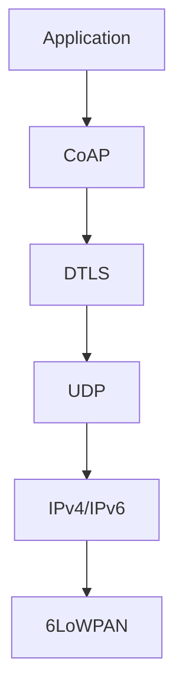
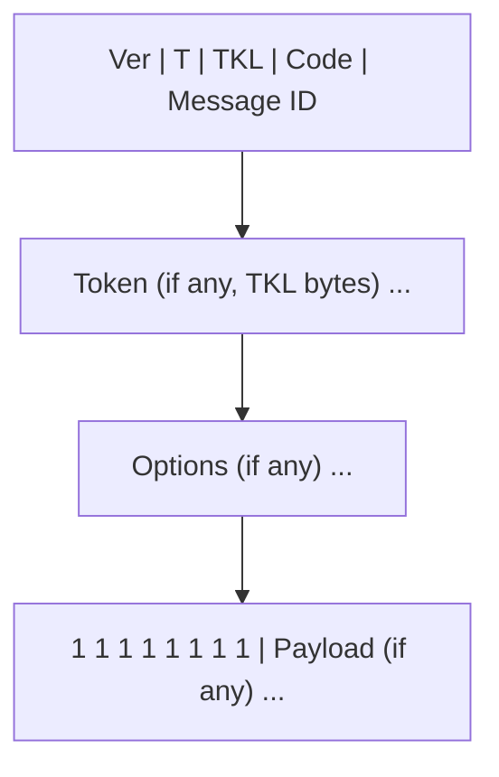

## 1. CoAP 概述

### 1.1 什么是 CoAP

CoAP（Constrained Application Protocol）是专为受限设备设计的 RESTful 协议，运行在 UDP 之上。

### 1.2 与 HTTP 对比

| 对比项   | CoAP                | HTTP      |
| -------- | ------------------- | --------- |
| 传输层   | UDP                 | TCP       |
| 头部大小 | 4 字节              | 数百字节  |
| 方法     | GET/POST/PUT/DELETE | 相同      |
| 数据格式 | CBOR/JSON           | JSON/HTML |
| 发现     | 内置                | 需外部    |
| 组播     | 支持                | 不支持    |
| 功耗     | 低                  | 高        |

### 1.3 协议栈



## 2. 消息模型

### 2.1 消息类型

| 类型            | 缩写 | 描述      |
| --------------- | ---- | --------- |
| Confirmable     | CON  | 需要确认  |
| Non-confirmable | NON  | 不需确认  |
| Acknowledgement | ACK  | 确认响应  |
| Reset           | RST  | 拒绝/错误 |

### 2.2 消息格式



### 2.3 请求/响应模式

**CON 请求**：

```
Client → CON GET /temperature → Server
Client ← ACK 2.05 Content "25.5" ← Server
```

**NON 请求**：

```
Client → NON GET /temperature → Server
Client ← NON 2.05 Content "25.5" ← Server
```

**分离响应**（处理时间较长时）：

```
Client → CON GET /temperature → Server
Client ← ACK (空确认) ← Server
Client ← CON 2.05 Content "25.5" ← Server
Client → ACK → Server
```

## 3. RESTful 接口

### 3.1 方法

| 方法   | 描述      |
| ------ | --------- |
| GET    | 获取资源  |
| POST   | 创建/处理 |
| PUT    | 更新资源  |
| DELETE | 删除资源  |

### 3.2 响应码

| 码   | 含义                  |
| ---- | --------------------- |
| 2.01 | Created               |
| 2.02 | Deleted               |
| 2.03 | Valid                 |
| 2.04 | Changed               |
| 2.05 | Content               |
| 4.01 | Unauthorized          |
| 4.04 | Not Found             |
| 4.06 | Not Acceptable        |
| 5.00 | Internal Server Error |

### 3.3 资源发现

```
GET /.well-known/core

→ </sensors/temp>;rt="temperature";if="sensor",
   </sensors/humidity>;rt="humidity";if="sensor",
   </actuators/led>;rt="led";if="actuator"
```

## 4. 观察模式（Observe）

### 4.1 原理

客户端注册观察，服务器在资源变化时主动推送。

```
Client → GET /temperature (Observe=0) → Server
Client ← 2.05 Content "25.5" (Observe=10) ← Server
Client ← 2.05 Content "26.0" (Observe=11) ← Server
Client ← 2.05 Content "25.8" (Observe=12) ← Server
```

### 4.2 注册与取消

| Observe 值 | 描述     |
| ---------- | -------- |
| 0          | 注册观察 |
| 1          | 取消观察 |

## 5. 组播

### 5.1 组播地址

| 地址        | 描述                  |
| ----------- | --------------------- |
| FF02::FD    | CoAP 组播（链路本地） |
| FF03::FD    | CoAP 组播（站点本地） |
| 224.0.1.187 | IPv4 组播             |

### 5.2 组播场景

```
Client → MULTICAST GET /temperature → All Devices
Client ← 2.05 Content "25.5" ← Device 1
Client ← 2.05 Content "24.0" ← Device 2
Client ← 2.05 Content "26.2" ← Device 3
```

## 6. 安全机制

### 6.1 DTLS

CoAP 使用 DTLS（Datagram TLS）提供安全传输。

| 模式         | 描述           |
| ------------ | -------------- |
| NoSec        | 无安全（默认） |
| PreSharedKey | 预共享密钥     |
| RawPublicKey | 原始公钥       |
| Certificate  | X.509 证书     |

### 6.2 OSCORE

OSCORE（Object Security for Constrained RESTful Environments）提供端到端安全，是 CoAP 的推荐安全方案。

## 7. 代码示例

### 7.1 Python (aiocoap)

```python
import asyncio
from aiocoap import *

async def main():
    context = await Context.create_client_context()
    request = Message(code=GET, uri='coap://localhost/temperature')
    response = await context.request(request).response
    print(f"Temperature: {response.payload.decode()}")

asyncio.run(main())
```

### 7.2 CoAP Server

```python
import asyncio
from aiocoap import *

class TemperatureResource(resource.Resource):
    async def render_get(self, request):
        temp = read_sensor()
        return Message(payload=str(temp).encode())

async def main():
    root = resource.Site()
    root.add_resource(['temperature'], TemperatureResource())
    await Context.create_server_context(root)
    await asyncio.get_event_loop().create_future()

asyncio.run(main())
```

## 参考文献


MQTT 规范：https://mqtt.org/
CoAP（RFC 7252）：https://www.rfc-editor.org/rfc/rfc7252
EMQX 文档：https://www.emqx.io/docs/zh/latest/
AWS IoT Core：https://aws.amazon.com/iot-core/
InfluxDB 文档：https://docs.influxdata.com/

## 延伸阅读


MQTT 与设备接入，见 035-iot 模块文档。
嵌入式 C 与硬件，见 025-c 模块。
时序数据与数据平台，见 052-big-data 模块。
黑马程序员 Bilibili 空间（https://space.bilibili.com/37974444 ）提供物联网课程。

## 深度专题扩展


以下专题从不同角度深入本文主题，供有进阶需求的读者研读。每个专题独立成节，内容相互补充。

### 13.1 MQTT 协议深入

报文类型：CONNECT/CONNACK/PUBLISH/PUBACK/SUBSCRIBE/SUBACK/PINGREQ/DISCONNECT。
会话状态：clean session、持久会话、消息保留（retain）与遗嘱（LWT）。
QoS 语义：0 至多一次，1 至少一次，2 恰好一次；QoS2 四步握手。
共享订阅（shared subscription）实现负载均衡；主题层级与通配符（+/#）。

### 13.2 边缘计算架构

边缘节点形态：网关、边缘服务器、设备端推理；部署容器或原生应用。
断网续传：本地消息队列 + 持久化 + 重连补传。
云端协同：模型下发（边缘推理）、规则下沉、影子同步。
KubeEdge/OpenYurt 把 K8s 延伸到边缘。

## 模块文档速查表

| 文档 | 主题 | 与本文的关联 |
| --- | --- | --- |
| 概述与架构 | 001-OverviewArchitecture | 本文的前置基础 |
| 传感器与嵌入式 | 002-SensorEmbedded | 本文的并列主题 |
| 通信协议 | 003-CommunicationProtocol | 本文的并列主题 |
| 边缘计算 | 004-EdgeComputing | 本文的并列主题 |
| IoT 平台 | 005-IoT | 本文的并列主题 |
| 数据处理与分析 | 006-DataProcessingAnalysis | 本文的并列主题 |
| 安全与隐私 | 007-SecurityAndPrivacy | 本文的安全延伸 |
| 实战项目 | 008-PracticeProject | 本文的综合应用 |
| MQTT协议 | 009-MQTT | 本文的并列主题 |
| CoAP协议 | 010-CoAP | 本文自身 |
| Arduino开发 | 011-ArduinoDevelopment | 本文的并列主题 |
| ESP32开发 | 012-ESP32Development | 本文的并列主题 |
| RT-Thread实时系统 | 013-RTThread | 本文的并列主题 |
| 边缘AI | 014-AI | 本文的并列主题 |
| LwM2M设备管理 | 015-LwM2MManagement | 本文的并列主题 |
| 时序数据库 | 016-TimeSeriesDatabase | 本文的并列主题 |
| 物联网安全 | 017-IoTSecurity | 本文的安全延伸 |
| 主流IoT平台 | 018-IoT | 本文的并列主题 |
| 数字孪生 | 019-DigitalTwin | 本文的并列主题 |
| 物联网 Mosquitto Broker 管理 | 020-MosquittoBrokerManage | 本文的并列主题 |
| 物联网 mosquitto_pub 发布命令 | 021-MosquittoPub | 本文的并列主题 |
| 物联网 mosquitto_sub 订阅命令 | 022-MosquittoSub | 本文的并列主题 |
| 物联网 ESP32 开发环境 | 023-ESP32Setup | 本文的前置基础 |
| 物联网 ESP32 GPIO 与引脚 | 024-ESP32GPIOPinout | 本文的并列主题 |
| 物联网 ESP32 I2C 通信 | 025-ESP32I2C | 本文的并列主题 |
| 物联网 ESP32 SPI 与 UART | 026-ESP32SPIUART | 本文的并列主题 |
| 物联网 ESP32 WiFi 配置 | 027-ESP32WiFiConfig | 本文的并列主题 |
| 物联网 ESP32 OTA 更新 | 028-ESP32OTA | 本文的并列主题 |
