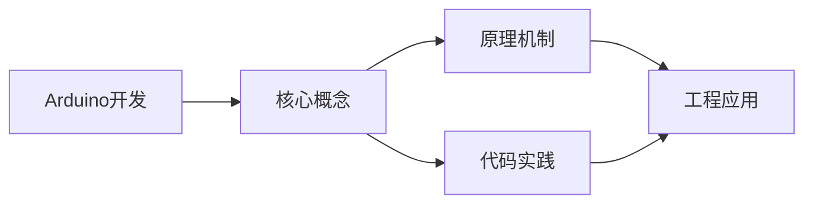
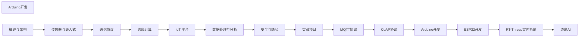

## 1. 学习目标（Bloom 分类）

本节按照布鲁姆教育目标分类学组织学习路径。本文主题为《Arduino开发》，属于 物联网 模块，读者可以根据自身阶段选择阅读深度。

记忆层面：能够准确复述本文的核心概念、术语与基本语法或操作步骤，并能够在提问或检索时快速定位对应知识点。能够说出 物联网 的核心概念、组件与标准流程。

理解层面：能够用自己的语言解释核心原理与工作机制，说明概念之间的因果关系，而不是机械记忆结论。能够解释 物联网 的工作原理与关键机制。

应用层面：能够在真实项目或练习场景中运用本文知识解决具体问题，写出正确且可维护的实现。能够执行 物联网 相关的标准操作与配置。

分析层面：能够拆解复杂问题，比较本文主题与相邻概念的异同，识别边界条件与例外情况。能够分析 物联网 方案在可靠性、成本与性能上的权衡。

评价层面：能够根据约束条件（性能、可读性、安全、成本）评价不同方案的优劣，做出有依据的技术决策。能够评价 物联网 中的技术选型。

创造层面：能够把本文知识与其他模块知识组合，设计出新的解决方案或可复用的工程模式。能够设计基于 物联网 的完整解决方案。

通过本节学习，读者应当能够把《Arduino开发》纳入自己的知识网络，并与 物联网 模块的其他主题（传感器、协议、边缘计算、设备管理）建立关联。

## 2. 历史动机与发展脉络

《Arduino开发》是 物联网 领域的重要主题。要真正理解它，需要先了解它解决的问题与演进过程。

物联网（IoT）指设备互联的物理网络，起源可追溯到 1980 年代传感器网络；Kevin Ashton 1999 年提出 IoT 术语，RFID 是其早期载体。
架构分层：感知层（传感器/执行器）、网络层（连接）、平台层（设备管理/数据）、应用层（业务）；边缘计算将处理下沉到设备侧。
协议版图：MQTT（轻量发布订阅）、CoAP（受限设备）、HTTP/HTTPS、LoRa/NB-IoT（低功耗广域）、Zigbee/BLE（短距）。

回到本文主题：Arduino开发 的提出与成熟，正是上述技术背景下的必然产物。早期实现往往以简单可用为目标，随着工程规模扩大，社区逐渐沉淀出标准做法与最佳实践；理解这一脉络，可以帮助读者判断“为什么文档中的推荐写法是现在这个样子”，也能在遇到历史遗留代码时准确识别其设计年代与取舍。


## 3. 形式化定义与核心概念精讲

本节把《Arduino开发》涉及的核心概念以“定义 + 讲解”的形式展开。读者应把定义当作工具，把讲解当作理解路径；两者结合才能形成可迁移的知识。

MQTT：基于 TCP 的发布/订阅，QoS 0/1/2 分级投递，遗嘱消息；适合低带宽高延迟网络。
设备接入：设备注册、鉴权（X.509/Token）、上下行消息、影子设备（desired/reported 状态）。
边缘计算：边缘网关聚合数据、本地推理与断网续传；云端统一管理。

### 3.1 原文章节逐一精讲

原文档把主题拆分为 16 个小节，下面按顺序给出每一节的导读讲解，随后保留原文细节供精读。

#### 原文精读（完整保留）

# 物联网 Arduino 核心语法

> **符号约定**：`< >` 必填参数 | `[ ]` 可选参数

---

#### 1. Arduino 概述

##### 1.1 什么是 Arduino

Arduino 是开源电子原型平台，包含硬件（微控制器板）和软件（IDE），适合快速开发交互式电子项目。

##### 1.2 常见开发板

| 开发板    | MCU        | 电压 | Flash | 特点     |
| --------- | ---------- | ---- | ----- | -------- |
| Uno R3    | ATmega328P | 5V   | 32KB  | 入门首选 |
| Nano      | ATmega328P | 5V   | 32KB  | 小型     |
| Mega 2560 | ATmega2560 | 5V   | 256KB | 引脚多   |
| Leonardo  | ATmega32U4 | 5V   | 32KB  | USB HID  |
| Due       | SAM3X8E    | 3.3V | 512KB | ARM      |

##### 1.3 开发环境

- Arduino IDE 2.x
- PlatformIO (VS Code)
- Arduino Web Editor

#### 2. 编程基础

##### 2.1 程序结构

```cpp
void setup() {
  // 初始化代码，只执行一次
  pinMode(LED_BUILTIN, OUTPUT);
  Serial.begin(9600);
}

void loop() {
  // 主循环，重复执行
  digitalWrite(LED_BUILTIN, HIGH);
  delay(1000);
  digitalWrite(LED_BUILTIN, LOW);
  delay(1000);
}
```

##### 2.2 数字 I/O

```cpp
// 设置引脚模式
pinMode(7, OUTPUT);   // 输出
pinMode(8, INPUT);    // 输入
pinMode(9, INPUT_PULLUP); // 内部上拉

// 数字输出
digitalWrite(7, HIGH);
digitalWrite(7, LOW);

// 数字输入
int value = digitalRead(8);
```

##### 2.3 模拟 I/O

```cpp
// 模拟读取（0-1023）
int sensorValue = analogRead(A0);

// 模拟输出（PWM，0-255）
analogWrite(9, 128);  // 50% 占空比

// 模拟参考电压
analogReference(INTERNAL);  // 1.1V
```

##### 2.4 串口通信

```cpp
void setup() {
  Serial.begin(9600);
}

void loop() {
  if (Serial.available() > 0) {
    char data = Serial.read();
    Serial.print("Received: ");
    Serial.println(data);
  }
  Serial.println("Hello");
  delay(1000);
}
```

#### 3. 传感器交互

##### 3.1 温湿度传感器（DHT11/DHT22）

```cpp
#include <DHT.h>

#define DHTPIN 2
#define DHTTYPE DHT11

DHT dht(DHTPIN, DHTTYPE);

void setup() {
  Serial.begin(9600);
  dht.begin();
}

void loop() {
  float humidity = dht.readHumidity();
  float temperature = dht.readTemperature();

  if (isnan(humidity) || isnan(temperature)) {
    Serial.println("Sensor read failed!");
    return;
  }

  Serial.print("Temp: "); Serial.print(temperature);
  Serial.print("°C  Humidity: "); Serial.print(humidity);
  Serial.println("%");
  delay(2000);
}
```

##### 3.2 超声波测距（HC-SR04）

```cpp
#define TRIG_PIN 9
#define ECHO_PIN 10

void setup() {
  Serial.begin(9600);
  pinMode(TRIG_PIN, OUTPUT);
  pinMode(ECHO_PIN, INPUT);
}

float getDistance() {
  digitalWrite(TRIG_PIN, LOW);
  delayMicroseconds(2);
  digitalWrite(TRIG_PIN, HIGH);
  delayMicroseconds(10);
  digitalWrite(TRIG_PIN, LOW);

  long duration = pulseIn(ECHO_PIN, HIGH);
  return duration * 0.034 / 2;  // cm
}

void loop() {
  float dist = getDistance();
  Serial.print("Distance: "); Serial.print(dist); Serial.println(" cm");
  delay(500);
}
```

##### 3.3 光敏电阻

```cpp
#define LIGHT_PIN A0

void setup() {
  Serial.begin(9600);
}

void loop() {
  int lightValue = analogRead(LIGHT_PIN);
  Serial.print("Light: "); Serial.println(lightValue);
  delay(500);
}
```

#### 4. 执行器控制

##### 4.1 LED 控制

```cpp
// 呼吸灯
#define LED_PIN 9

void setup() {
  pinMode(LED_PIN, OUTPUT);
}

void loop() {
  for (int brightness = 0; brightness <= 255; brightness++) {
    analogWrite(LED_PIN, brightness);
    delay(5);
  }
  for (int brightness = 255; brightness >= 0; brightness--) {
    analogWrite(LED_PIN, brightness);
    delay(5);
  }
}
```

##### 4.2 舵机控制

```cpp
#include <Servo.h>

Servo myServo;

void setup() {
  myServo.attach(9);
}

void loop() {
  myServo.write(0);     // 0度
  delay(1000);
  myServo.write(90);    // 90度
  delay(1000);
  myServo.write(180);   // 180度
  delay(1000);
}
```

##### 4.3 电机控制（L298N）

```cpp
#define ENA 5
#define IN1 6
#define IN2 7

void setup() {
  pinMode(ENA, OUTPUT);
  pinMode(IN1, OUTPUT);
  pinMode(IN2, OUTPUT);
}

void motorForward(int speed) {
  digitalWrite(IN1, HIGH);
  digitalWrite(IN2, LOW);
  analogWrite(ENA, speed);
}

void motorStop() {
  digitalWrite(IN1, LOW);
  digitalWrite(IN2, LOW);
  analogWrite(ENA, 0);
}
```

#### 5. 通信模块

##### 5.1 WiFi（ESP8266）

```cpp
#include <ESP8266WiFi.h>

const char* ssid = "YourWiFi";
const char* password = "YourPassword";

void setup() {
  Serial.begin(9600);
  WiFi.begin(ssid, password);
  while (WiFi.status() != WL_CONNECTED) {
    delay(500);
    Serial.print(".");
  }
  Serial.println("WiFi connected");
  Serial.println(WiFi.localIP());
}
```

##### 5.2 I2C 通信

```cpp
#include <Wire.h>

void setup() {
  Wire.begin();  // 加入 I2C 总线
  Serial.begin(9600);
}

void loop() {
  Wire.requestFrom(0x68, 6);  // 从地址 0x68 读取 6 字节
  while (Wire.available()) {
    char c = Wire.read();
    Serial.print(c);
  }
  delay(500);
}
```

#### 6. 项目实战：智能温控器

```cpp
#include <DHT.h>
#include <LiquidCrystal_I2C.h>

#define DHTPIN 2
#define RELAY_PIN 3
#define BUTTON_PIN 4

DHT dht(DHTPIN, DHT11);
LiquidCrystal_I2C lcd(0x27, 16, 2);

float targetTemp = 25.0;

void setup() {
  dht.begin();
  lcd.init();
  lcd.backlight();
  pinMode(RELAY_PIN, OUTPUT);
  pinMode(BUTTON_PIN, INPUT_PULLUP);
}

void loop() {
  float temp = dht.readTemperature();

  lcd.setCursor(0, 0);
  lcd.print("Temp: "); lcd.print(temp); lcd.print("C");
  lcd.setCursor(0, 1);
  lcd.print("Target: "); lcd.print(targetTemp); lcd.print("C");

  // 温度控制
  if (temp < targetTemp) {
    digitalWrite(RELAY_PIN, HIGH);  // 开启加热
  } else {
    digitalWrite(RELAY_PIN, LOW);   // 关闭加热
  }

  // 按钮调节目标温度
  if (digitalRead(BUTTON_PIN) == LOW) {
    targetTemp += 0.5;
    if (targetTemp > 30) targetTemp = 20;
    delay(200);
  }

  delay(1000);
}
```
#### 程序结构

**基本写法：setup 函数**
`void setup() { }`
```cpp
// 上电或复位时执行一次
void setup() {
  pinMode(13, OUTPUT);
}
```

---

**基本写法：loop 函数**
`void loop() { }`
```cpp
// setup 后不断循环执行
void loop() {
  digitalWrite(13, HIGH);
  delay(1000);
}
```

---

**基本写法：包含头文件**
`#include <库>`
```cpp
// 引入标准库
#include <Wire.h>
```

---

**基本写法：包含本地文件**
`#include "文件.h"`
```cpp
// 引入项目内自定义头文件
#include "mylib.h"
```

---

#### 变量与类型

**基本写法：定义整型变量**
`int <变量名> = <值>;`
```cpp
// 定义 16 位有符号整数
int ledPin = 13;
```

---

**基本写法：定义无符号长整型**
`unsigned long <变量名> = <值>;`
```cpp
// 用于 millis 微秒计数
unsigned long startTime = 0;
```

---

**基本写法：定义浮点型**
`float <变量名> = <值>;`
```cpp
// 定义单精度浮点数
float temperature = 23.5;
```

---

**基本写法：定义常量**
`const <类型> <变量名> = <值>;`
```cpp
// 编译期常量不占内存
const int LED_PIN = 13;
```

---

**基本写法：宏定义**
`#define <名称> <值>`
```cpp
// 预处理宏替换
#define LED_PIN 13
```

---

#### 引脚模式

**基本写法：设置为输出**
`pinMode(<引脚>, OUTPUT);`
```cpp
// 配置为输出模式驱动 LED
pinMode(13, OUTPUT);
```

---

**基本写法：设置为输入**
`pinMode(<引脚>, INPUT);`
```cpp
// 配置为高阻态输入
pinMode(2, INPUT);
```

---

**基本写法：启用内部上拉**
`pinMode(<引脚>, INPUT_PULLUP);`
```cpp
// 启用内部上拉电阻免外接
pinMode(2, INPUT_PULLUP);
```

---

#### 数字 IO

**基本写法：输出高电平**
`digitalWrite(<引脚>, HIGH);`
```cpp
// 点亮 LED
digitalWrite(13, HIGH);
```

---

**基本写法：输出低电平**
`digitalWrite(<引脚>, LOW);`
```cpp
// 熄灭 LED
digitalWrite(13, LOW);
```

---

**基本写法：读取数字输入**
`digitalRead(<引脚>)`
```cpp
// 读取按钮状态
int state = digitalRead(2);
```

---

#### 模拟 IO

**基本写法：读取模拟值**
`analogRead(<引脚>)`
```cpp
// 读取 0-1023 的 ADC 值
int sensorValue = analogRead(A0);
```

---

**基本写法：PWM 输出**
`analogWrite(<引脚>, <值>);`
```cpp
// 输出 0-255 PWM 控制亮度
analogWrite(9, 128);
```

---

**基本写法：参考电压设置**
`analogReference(<类型>);`
```cpp
// 设置 ADC 参考电压为内部 1.1V
analogReference(INTERNAL);
```

---

#### 时间函数

**基本写法：毫秒延时**
`delay(<毫秒>);`
```cpp
// 阻塞延时 1000 毫秒
delay(1000);
```

---

**基本写法：微秒延时**
`delayMicroseconds(<微秒>);`
```cpp
// 短时延时适合时序控制
delayMicroseconds(100);
```

---

**基本写法：获取运行毫秒数**
`millis()`
```cpp
// 获取上电至今毫秒数约 50 天溢出
unsigned long t = millis();
```

---

**基本写法：获取运行微秒数**
`micros()`
```cpp
// 获取上电至今微秒数约 70 分钟溢出
unsigned long t = micros();
```

---

**基本写法：非阻塞定时**
```cpp
// 通过 millis 实现非阻塞定时
if (millis() - previousMillis >= interval) {
  previousMillis = millis();
}
```

---

#### 数学运算

**基本写法：映射范围**
`map(<值>, <源低>, <源高>, <目标低>, <目标高>)`
```cpp
// 将 0-1023 映射到 0-255
int pwm = map(sensor, 0, 1023, 0, 255);
```

---

**基本写法：取最小值**
`min(<a>, <b>)`
```cpp
// 返回较小值
int v = min(10, 20);
```

---

**基本写法：取最大值**
`max(<a>, <b>)`
```cpp
// 返回较大值
int v = max(10, 20);
```

---

**基本写法：约束范围**
`constrain(<值>, <最小>, <最大>)`
```cpp
// 限制值在 0-255 之间
int v = constrain(sensor, 0, 255);
```

---

#### 随机数

**基本写法：设置随机种子**
`randomSeed(<种子>);`
```cpp
// 用模拟噪声作为种子
randomSeed(analogRead(0));
```

---

**基本写法：生成随机数**
`random(<最小>, <最大>)`
```cpp
// 生成 0-99 之间随机数
int r = random(0, 100);
```

---

#### 中断

**基本写法：附加中断**
`attachInterrupt(<数字引脚>, <回调>, <触发模式>);`
```cpp
// 在引脚 2 下降沿触发 ISR
attachInterrupt(digitalPinToInterrupt(2), myISR, FALLING);
```

---

**基本写法：分离中断**
`detachInterrupt(<数字引脚>);`
```cpp
// 移除引脚中断
detachInterrupt(digitalPinToInterrupt(2));
```

---

**基本写法：volatile 变量**
`volatile <类型> <变量名>;`
```cpp
// 中断中修改的变量需声明为 volatile
volatile int counter = 0;
```

---

#### 字节操作

**基本写法：读取低位字节**
`lowByte(<值>)`
```cpp
// 取 16 位值的低字节
uint8_t lo = lowByte(0x1234);
```

---

**基本写法：读取高位字节**
`highByte(<值>)`
```cpp
// 取 16 位值的高字节
uint8_t hi = highByte(0x1234);
```

---

**基本写法：读取指定字节**
`bitRead(<值>, <位>)`
```cpp
// 读取值的某一位
bool b = bitRead(0x0F, 3);
```


### 3.2 概念关系图

下面用 Mermaid 图表达本文核心概念之间的关系，帮助读者建立整体图景：



图中展示的是本文知识的结构化关系：核心概念是入口，原理机制解释“为什么”，代码实践演示“怎么做”，工程应用回答“何时用”。读者学习时可以把每个小节的内容挂接到对应节点上。

## 4. 理论推导与原理解析

本节深入《Arduino开发》背后的原理。理论部分不求面面俱到，而是聚焦“能解释现象、能指导实践”的关键推导。

MQTT：基于 TCP 的发布/订阅，QoS 0/1/2 分级投递，遗嘱消息；适合低带宽高延迟网络。
设备接入：设备注册、鉴权（X.509/Token）、上下行消息、影子设备（desired/reported 状态）。
边缘计算：边缘网关聚合数据、本地推理与断网续传；云端统一管理。
数据链路：采集 -> 清洗 -> 时序存储（InfluxDB/TDengine）-> 规则引擎 -> 应用。

需要强调的是，理论推导与工程实践之间存在翻译层：理论给出的是理想化模型与边界条件，工程代码则必须处理真实环境中的例外。读者在学习时应先掌握理论的“标准情形”，再通过陷阱章节了解“非标准情形”。

## 5. 代码示例与逐行讲解

本节把原文中的代码示例系统整理，并为每个示例补充用途说明与讲解。读者不应只浏览代码，而应逐段对照讲解理解设计意图。

### 5.1 示例：2.1 程序结构

该示例来自原文《2.1 程序结构》小节，用于演示Arduino开发相关操作。阅读时请先看代码结构，再看其后的讲解。

```cpp
void setup() {
  // 初始化代码，只执行一次
  pinMode(LED_BUILTIN, OUTPUT);
  Serial.begin(9600);
}

void loop() {
  // 主循环，重复执行
  digitalWrite(LED_BUILTIN, HIGH);
  delay(1000);
  digitalWrite(LED_BUILTIN, LOW);
  delay(1000);
}
```

讲解：这段代码演示了本节核心知识点。代码中的关键操作可以归纳为三步：准备（定义或初始化）、执行（核心逻辑）、收尾（释放资源或返回结果）。实际项目中，这三步往往被封装为函数或类，以提升复用性与可测试性。

关键点分析：

该示例共 12 行有效代码，结构以数据或配置为主。阅读时应关注：数据字段的含义、配置项的作用，以及它们与运行行为的对应关系。

进阶思考路径：先尝试修改参数观察行为变化，再把示例中的模式迁移到自己的项目中；每次修改都记录预期与实测差异，这是把示例转化为能力的最快方式。

### 5.2 示例：2.2 数字 I/O

该示例来自原文《2.2 数字 I/O》小节，用于演示Arduino开发相关操作。阅读时请先看代码结构，再看其后的讲解。

```cpp
// 设置引脚模式
pinMode(7, OUTPUT);   // 输出
pinMode(8, INPUT);    // 输入
pinMode(9, INPUT_PULLUP); // 内部上拉

// 数字输出
digitalWrite(7, HIGH);
digitalWrite(7, LOW);

// 数字输入
int value = digitalRead(8);
```

讲解：这段代码演示了本节核心知识点。代码中的关键操作可以归纳为三步：准备（定义或初始化）、执行（核心逻辑）、收尾（释放资源或返回结果）。实际项目中，这三步往往被封装为函数或类，以提升复用性与可测试性。

关键点分析：

该示例共 9 行有效代码，结构以数据或配置为主。阅读时应关注：数据字段的含义、配置项的作用，以及它们与运行行为的对应关系。

进阶思考路径：先尝试修改参数观察行为变化，再把示例中的模式迁移到自己的项目中；每次修改都记录预期与实测差异，这是把示例转化为能力的最快方式。

### 5.3 示例：2.3 模拟 I/O

该示例来自原文《2.3 模拟 I/O》小节，用于演示Arduino开发相关操作。阅读时请先看代码结构，再看其后的讲解。

```cpp
// 模拟读取（0-1023）
int sensorValue = analogRead(A0);

// 模拟输出（PWM，0-255）
analogWrite(9, 128);  // 50% 占空比

// 模拟参考电压
analogReference(INTERNAL);  // 1.1V
```

讲解：这段代码演示了本节核心知识点。代码中的关键操作可以归纳为三步：准备（定义或初始化）、执行（核心逻辑）、收尾（释放资源或返回结果）。实际项目中，这三步往往被封装为函数或类，以提升复用性与可测试性。

关键点分析：

该示例共 6 行有效代码，结构以数据或配置为主。阅读时应关注：数据字段的含义、配置项的作用，以及它们与运行行为的对应关系。

进阶思考路径：先尝试修改参数观察行为变化，再把示例中的模式迁移到自己的项目中；每次修改都记录预期与实测差异，这是把示例转化为能力的最快方式。

### 5.4 示例：2.4 串口通信

该示例来自原文《2.4 串口通信》小节，用于演示Arduino开发相关操作。阅读时请先看代码结构，再看其后的讲解。

```cpp
void setup() {
  Serial.begin(9600);
}

void loop() {
  if (Serial.available() > 0) {
    char data = Serial.read();
    Serial.print("Received: ");
    Serial.println(data);
  }
  Serial.println("Hello");
  delay(1000);
}
```

讲解：这段代码演示了本节核心知识点。代码中的关键操作可以归纳为三步：准备（定义或初始化）、执行（核心逻辑）、收尾（释放资源或返回结果）。实际项目中，这三步往往被封装为函数或类，以提升复用性与可测试性。

关键点分析：

该示例共 12 行有效代码，包含 1 类关键结构（if）。其中：

- 入口与初始化部分负责建立上下文，对应实际项目中的启动或装配逻辑；
- 核心逻辑部分体现本文主题的主要操作，是阅读时最需要对照讲解理解的部分；
- 输出或返回部分把结果交给调用方，注意其类型与边界条件。

进阶思考路径：先尝试修改参数观察行为变化，再把示例中的模式迁移到自己的项目中；每次修改都记录预期与实测差异，这是把示例转化为能力的最快方式。

### 5.5 示例：3.1 温湿度传感器（DHT11/DHT22）

该示例来自原文《3.1 温湿度传感器（DHT11/DHT22）》小节，用于演示Arduino开发相关操作。阅读时请先看代码结构，再看其后的讲解。

```cpp
#include <DHT.h>

#define DHTPIN 2
#define DHTTYPE DHT11

DHT dht(DHTPIN, DHTTYPE);

void setup() {
  Serial.begin(9600);
  dht.begin();
}

void loop() {
  float humidity = dht.readHumidity();
  float temperature = dht.readTemperature();

  if (isnan(humidity) || isnan(temperature)) {
    Serial.println("Sensor read failed!");
    return;
  }

  Serial.print("Temp: "); Serial.print(temperature);
  Serial.print("°C  Humidity: "); Serial.print(humidity);
  Serial.println("%");
  delay(2000);
}
```

讲解：这段代码演示了本节核心知识点。代码中的关键操作可以归纳为三步：准备（定义或初始化）、执行（核心逻辑）、收尾（释放资源或返回结果）。实际项目中，这三步往往被封装为函数或类，以提升复用性与可测试性。

关键点分析：

该示例共 20 行有效代码，包含 2 类关键结构（if、return）。其中：

- 入口与初始化部分负责建立上下文，对应实际项目中的启动或装配逻辑；
- 核心逻辑部分体现本文主题的主要操作，是阅读时最需要对照讲解理解的部分；
- 输出或返回部分把结果交给调用方，注意其类型与边界条件。

进阶思考路径：先尝试修改参数观察行为变化，再把示例中的模式迁移到自己的项目中；每次修改都记录预期与实测差异，这是把示例转化为能力的最快方式。

### 5.6 示例：3.2 超声波测距（HC-SR04）

该示例来自原文《3.2 超声波测距（HC-SR04）》小节，用于演示Arduino开发相关操作。阅读时请先看代码结构，再看其后的讲解。

```cpp
#define TRIG_PIN 9
#define ECHO_PIN 10

void setup() {
  Serial.begin(9600);
  pinMode(TRIG_PIN, OUTPUT);
  pinMode(ECHO_PIN, INPUT);
}

float getDistance() {
  digitalWrite(TRIG_PIN, LOW);
  delayMicroseconds(2);
  digitalWrite(TRIG_PIN, HIGH);
  delayMicroseconds(10);
  digitalWrite(TRIG_PIN, LOW);

  long duration = pulseIn(ECHO_PIN, HIGH);
  return duration * 0.034 / 2;  // cm
}

void loop() {
  float dist = getDistance();
  Serial.print("Distance: "); Serial.print(dist); Serial.println(" cm");
  delay(500);
}
```

讲解：这段代码演示了本节核心知识点。代码中的关键操作可以归纳为三步：准备（定义或初始化）、执行（核心逻辑）、收尾（释放资源或返回结果）。实际项目中，这三步往往被封装为函数或类，以提升复用性与可测试性。

关键点分析：

该示例共 21 行有效代码，包含 1 类关键结构（return）。其中：

- 入口与初始化部分负责建立上下文，对应实际项目中的启动或装配逻辑；
- 核心逻辑部分体现本文主题的主要操作，是阅读时最需要对照讲解理解的部分；
- 输出或返回部分把结果交给调用方，注意其类型与边界条件。

进阶思考路径：先尝试修改参数观察行为变化，再把示例中的模式迁移到自己的项目中；每次修改都记录预期与实测差异，这是把示例转化为能力的最快方式。

### 5.7 示例：3.3 光敏电阻

该示例来自原文《3.3 光敏电阻》小节，用于演示Arduino开发相关操作。阅读时请先看代码结构，再看其后的讲解。

```cpp
#define LIGHT_PIN A0

void setup() {
  Serial.begin(9600);
}

void loop() {
  int lightValue = analogRead(LIGHT_PIN);
  Serial.print("Light: "); Serial.println(lightValue);
  delay(500);
}
```

讲解：这段代码演示了本节核心知识点。代码中的关键操作可以归纳为三步：准备（定义或初始化）、执行（核心逻辑）、收尾（释放资源或返回结果）。实际项目中，这三步往往被封装为函数或类，以提升复用性与可测试性。

关键点分析：

该示例共 9 行有效代码，结构以数据或配置为主。阅读时应关注：数据字段的含义、配置项的作用，以及它们与运行行为的对应关系。

进阶思考路径：先尝试修改参数观察行为变化，再把示例中的模式迁移到自己的项目中；每次修改都记录预期与实测差异，这是把示例转化为能力的最快方式。

### 5.8 示例：4.1 LED 控制

该示例来自原文《4.1 LED 控制》小节，用于演示Arduino开发相关操作。阅读时请先看代码结构，再看其后的讲解。

```cpp
// 呼吸灯
#define LED_PIN 9

void setup() {
  pinMode(LED_PIN, OUTPUT);
}

void loop() {
  for (int brightness = 0; brightness <= 255; brightness++) {
    analogWrite(LED_PIN, brightness);
    delay(5);
  }
  for (int brightness = 255; brightness >= 0; brightness--) {
    analogWrite(LED_PIN, brightness);
    delay(5);
  }
}
```

讲解：这段代码演示了本节核心知识点。代码中的关键操作可以归纳为三步：准备（定义或初始化）、执行（核心逻辑）、收尾（释放资源或返回结果）。实际项目中，这三步往往被封装为函数或类，以提升复用性与可测试性。

关键点分析：

该示例共 15 行有效代码，包含 1 类关键结构（for）。其中：

- 入口与初始化部分负责建立上下文，对应实际项目中的启动或装配逻辑；
- 核心逻辑部分体现本文主题的主要操作，是阅读时最需要对照讲解理解的部分；
- 输出或返回部分把结果交给调用方，注意其类型与边界条件。

进阶思考路径：先尝试修改参数观察行为变化，再把示例中的模式迁移到自己的项目中；每次修改都记录预期与实测差异，这是把示例转化为能力的最快方式。

### 5.9 示例：4.2 舵机控制

该示例来自原文《4.2 舵机控制》小节，用于演示Arduino开发相关操作。阅读时请先看代码结构，再看其后的讲解。

```cpp
#include <Servo.h>

Servo myServo;

void setup() {
  myServo.attach(9);
}

void loop() {
  myServo.write(0);     // 0度
  delay(1000);
  myServo.write(90);    // 90度
  delay(1000);
  myServo.write(180);   // 180度
  delay(1000);
}
```

讲解：这段代码演示了本节核心知识点。代码中的关键操作可以归纳为三步：准备（定义或初始化）、执行（核心逻辑）、收尾（释放资源或返回结果）。实际项目中，这三步往往被封装为函数或类，以提升复用性与可测试性。

关键点分析：

该示例共 13 行有效代码，结构以数据或配置为主。阅读时应关注：数据字段的含义、配置项的作用，以及它们与运行行为的对应关系。

进阶思考路径：先尝试修改参数观察行为变化，再把示例中的模式迁移到自己的项目中；每次修改都记录预期与实测差异，这是把示例转化为能力的最快方式。

### 5.10 示例：4.3 电机控制（L298N）

该示例来自原文《4.3 电机控制（L298N）》小节，用于演示Arduino开发相关操作。阅读时请先看代码结构，再看其后的讲解。

```cpp
#define ENA 5
#define IN1 6
#define IN2 7

void setup() {
  pinMode(ENA, OUTPUT);
  pinMode(IN1, OUTPUT);
  pinMode(IN2, OUTPUT);
}

void motorForward(int speed) {
  digitalWrite(IN1, HIGH);
  digitalWrite(IN2, LOW);
  analogWrite(ENA, speed);
}

void motorStop() {
  digitalWrite(IN1, LOW);
  digitalWrite(IN2, LOW);
  analogWrite(ENA, 0);
}
```

讲解：这段代码演示了本节核心知识点。代码中的关键操作可以归纳为三步：准备（定义或初始化）、执行（核心逻辑）、收尾（释放资源或返回结果）。实际项目中，这三步往往被封装为函数或类，以提升复用性与可测试性。

关键点分析：

该示例共 18 行有效代码，结构以数据或配置为主。阅读时应关注：数据字段的含义、配置项的作用，以及它们与运行行为的对应关系。

进阶思考路径：先尝试修改参数观察行为变化，再把示例中的模式迁移到自己的项目中；每次修改都记录预期与实测差异，这是把示例转化为能力的最快方式。

### 5.11 示例：5.1 WiFi（ESP8266）

该示例来自原文《5.1 WiFi（ESP8266）》小节，用于演示Arduino开发相关操作。阅读时请先看代码结构，再看其后的讲解。

```cpp
#include <ESP8266WiFi.h>

const char* ssid = "YourWiFi";
const char* password = "YourPassword";

void setup() {
  Serial.begin(9600);
  WiFi.begin(ssid, password);
  while (WiFi.status() != WL_CONNECTED) {
    delay(500);
    Serial.print(".");
  }
  Serial.println("WiFi connected");
  Serial.println(WiFi.localIP());
}
```

讲解：这段代码演示了本节核心知识点。代码中的关键操作可以归纳为三步：准备（定义或初始化）、执行（核心逻辑）、收尾（释放资源或返回结果）。实际项目中，这三步往往被封装为函数或类，以提升复用性与可测试性。

关键点分析：

该示例共 13 行有效代码，包含 1 类关键结构（while）。其中：

- 入口与初始化部分负责建立上下文，对应实际项目中的启动或装配逻辑；
- 核心逻辑部分体现本文主题的主要操作，是阅读时最需要对照讲解理解的部分；
- 输出或返回部分把结果交给调用方，注意其类型与边界条件。

进阶思考路径：先尝试修改参数观察行为变化，再把示例中的模式迁移到自己的项目中；每次修改都记录预期与实测差异，这是把示例转化为能力的最快方式。

### 5.12 示例：5.2 I2C 通信

该示例来自原文《5.2 I2C 通信》小节，用于演示Arduino开发相关操作。阅读时请先看代码结构，再看其后的讲解。

```cpp
#include <Wire.h>

void setup() {
  Wire.begin();  // 加入 I2C 总线
  Serial.begin(9600);
}

void loop() {
  Wire.requestFrom(0x68, 6);  // 从地址 0x68 读取 6 字节
  while (Wire.available()) {
    char c = Wire.read();
    Serial.print(c);
  }
  delay(500);
}
```

讲解：这段代码演示了本节核心知识点。代码中的关键操作可以归纳为三步：准备（定义或初始化）、执行（核心逻辑）、收尾（释放资源或返回结果）。实际项目中，这三步往往被封装为函数或类，以提升复用性与可测试性。

关键点分析：

该示例共 13 行有效代码，包含 1 类关键结构（while）。其中：

- 入口与初始化部分负责建立上下文，对应实际项目中的启动或装配逻辑；
- 核心逻辑部分体现本文主题的主要操作，是阅读时最需要对照讲解理解的部分；
- 输出或返回部分把结果交给调用方，注意其类型与边界条件。

进阶思考路径：先尝试修改参数观察行为变化，再把示例中的模式迁移到自己的项目中；每次修改都记录预期与实测差异，这是把示例转化为能力的最快方式。

### 5.13 示例：6. 项目实战：智能温控器

该示例来自原文《6. 项目实战：智能温控器》小节，用于演示Arduino开发相关操作。阅读时请先看代码结构，再看其后的讲解。

```cpp
#include <DHT.h>
#include <LiquidCrystal_I2C.h>

#define DHTPIN 2
#define RELAY_PIN 3
#define BUTTON_PIN 4

DHT dht(DHTPIN, DHT11);
LiquidCrystal_I2C lcd(0x27, 16, 2);

float targetTemp = 25.0;

void setup() {
  dht.begin();
  lcd.init();
  lcd.backlight();
  pinMode(RELAY_PIN, OUTPUT);
  pinMode(BUTTON_PIN, INPUT_PULLUP);
}

void loop() {
  float temp = dht.readTemperature();

  lcd.setCursor(0, 0);
  lcd.print("Temp: "); lcd.print(temp); lcd.print("C");
  lcd.setCursor(0, 1);
  lcd.print("Target: "); lcd.print(targetTemp); lcd.print("C");

  // 温度控制
  if (temp < targetTemp) {
    digitalWrite(RELAY_PIN, HIGH);  // 开启加热
  } else {
    digitalWrite(RELAY_PIN, LOW);   // 关闭加热
  }

  // 按钮调节目标温度
  if (digitalRead(BUTTON_PIN) == LOW) {
    targetTemp += 0.5;
    if (targetTemp > 30) targetTemp = 20;
    delay(200);
  }

  delay(1000);
}
```

讲解：这段代码演示了本节核心知识点。代码中的关键操作可以归纳为三步：准备（定义或初始化）、执行（核心逻辑）、收尾（释放资源或返回结果）。实际项目中，这三步往往被封装为函数或类，以提升复用性与可测试性。

关键点分析：

该示例共 35 行有效代码，包含 1 类关键结构（if）。其中：

- 入口与初始化部分负责建立上下文，对应实际项目中的启动或装配逻辑；
- 核心逻辑部分体现本文主题的主要操作，是阅读时最需要对照讲解理解的部分；
- 输出或返回部分把结果交给调用方，注意其类型与边界条件。

进阶思考路径：先尝试修改参数观察行为变化，再把示例中的模式迁移到自己的项目中；每次修改都记录预期与实测差异，这是把示例转化为能力的最快方式。

### 5.14 示例：程序结构

该示例来自原文《程序结构》小节，用于演示Arduino开发相关操作。阅读时请先看代码结构，再看其后的讲解。

```cpp
// 上电或复位时执行一次
void setup() {
  pinMode(13, OUTPUT);
}
```

讲解：这段代码演示了本节核心知识点。代码中的关键操作可以归纳为三步：准备（定义或初始化）、执行（核心逻辑）、收尾（释放资源或返回结果）。实际项目中，这三步往往被封装为函数或类，以提升复用性与可测试性。

关键点分析：

该示例共 4 行有效代码，结构以数据或配置为主。阅读时应关注：数据字段的含义、配置项的作用，以及它们与运行行为的对应关系。

进阶思考路径：先尝试修改参数观察行为变化，再把示例中的模式迁移到自己的项目中；每次修改都记录预期与实测差异，这是把示例转化为能力的最快方式。

### 5.15 示例：程序结构

该示例来自原文《程序结构》小节，用于演示Arduino开发相关操作。阅读时请先看代码结构，再看其后的讲解。

```cpp
// setup 后不断循环执行
void loop() {
  digitalWrite(13, HIGH);
  delay(1000);
}
```

讲解：这段代码演示了本节核心知识点。代码中的关键操作可以归纳为三步：准备（定义或初始化）、执行（核心逻辑）、收尾（释放资源或返回结果）。实际项目中，这三步往往被封装为函数或类，以提升复用性与可测试性。

关键点分析：

该示例共 5 行有效代码，结构以数据或配置为主。阅读时应关注：数据字段的含义、配置项的作用，以及它们与运行行为的对应关系。

进阶思考路径：先尝试修改参数观察行为变化，再把示例中的模式迁移到自己的项目中；每次修改都记录预期与实测差异，这是把示例转化为能力的最快方式。

### 5.16 示例：程序结构

该示例来自原文《程序结构》小节，用于演示Arduino开发相关操作。阅读时请先看代码结构，再看其后的讲解。

```cpp
// 引入标准库
#include <Wire.h>
```

讲解：这段代码演示了本节核心知识点。代码中的关键操作可以归纳为三步：准备（定义或初始化）、执行（核心逻辑）、收尾（释放资源或返回结果）。实际项目中，这三步往往被封装为函数或类，以提升复用性与可测试性。

关键点分析：

该示例共 2 行有效代码，结构以数据或配置为主。阅读时应关注：数据字段的含义、配置项的作用，以及它们与运行行为的对应关系。

进阶思考路径：先尝试修改参数观察行为变化，再把示例中的模式迁移到自己的项目中；每次修改都记录预期与实测差异，这是把示例转化为能力的最快方式。

### 5.17 示例：程序结构

该示例来自原文《程序结构》小节，用于演示Arduino开发相关操作。阅读时请先看代码结构，再看其后的讲解。

```cpp
// 引入项目内自定义头文件
#include "mylib.h"
```

讲解：这段代码演示了本节核心知识点。代码中的关键操作可以归纳为三步：准备（定义或初始化）、执行（核心逻辑）、收尾（释放资源或返回结果）。实际项目中，这三步往往被封装为函数或类，以提升复用性与可测试性。

关键点分析：

该示例共 2 行有效代码，结构以数据或配置为主。阅读时应关注：数据字段的含义、配置项的作用，以及它们与运行行为的对应关系。

进阶思考路径：先尝试修改参数观察行为变化，再把示例中的模式迁移到自己的项目中；每次修改都记录预期与实测差异，这是把示例转化为能力的最快方式。

### 5.18 示例：变量与类型

该示例来自原文《变量与类型》小节，用于演示Arduino开发相关操作。阅读时请先看代码结构，再看其后的讲解。

```cpp
// 定义 16 位有符号整数
int ledPin = 13;
```

讲解：这段代码演示了本节核心知识点。代码中的关键操作可以归纳为三步：准备（定义或初始化）、执行（核心逻辑）、收尾（释放资源或返回结果）。实际项目中，这三步往往被封装为函数或类，以提升复用性与可测试性。

关键点分析：

该示例共 2 行有效代码，结构以数据或配置为主。阅读时应关注：数据字段的含义、配置项的作用，以及它们与运行行为的对应关系。

进阶思考路径：先尝试修改参数观察行为变化，再把示例中的模式迁移到自己的项目中；每次修改都记录预期与实测差异，这是把示例转化为能力的最快方式。

### 5.19 示例：变量与类型

该示例来自原文《变量与类型》小节，用于演示Arduino开发相关操作。阅读时请先看代码结构，再看其后的讲解。

```cpp
// 用于 millis 微秒计数
unsigned long startTime = 0;
```

讲解：这段代码演示了本节核心知识点。代码中的关键操作可以归纳为三步：准备（定义或初始化）、执行（核心逻辑）、收尾（释放资源或返回结果）。实际项目中，这三步往往被封装为函数或类，以提升复用性与可测试性。

关键点分析：

该示例共 2 行有效代码，结构以数据或配置为主。阅读时应关注：数据字段的含义、配置项的作用，以及它们与运行行为的对应关系。

进阶思考路径：先尝试修改参数观察行为变化，再把示例中的模式迁移到自己的项目中；每次修改都记录预期与实测差异，这是把示例转化为能力的最快方式。

### 5.20 示例：变量与类型

该示例来自原文《变量与类型》小节，用于演示Arduino开发相关操作。阅读时请先看代码结构，再看其后的讲解。

```cpp
// 定义单精度浮点数
float temperature = 23.5;
```

讲解：这段代码演示了本节核心知识点。代码中的关键操作可以归纳为三步：准备（定义或初始化）、执行（核心逻辑）、收尾（释放资源或返回结果）。实际项目中，这三步往往被封装为函数或类，以提升复用性与可测试性。

关键点分析：

该示例共 2 行有效代码，结构以数据或配置为主。阅读时应关注：数据字段的含义、配置项的作用，以及它们与运行行为的对应关系。

进阶思考路径：先尝试修改参数观察行为变化，再把示例中的模式迁移到自己的项目中；每次修改都记录预期与实测差异，这是把示例转化为能力的最快方式。

### 5.21 示例：变量与类型

该示例来自原文《变量与类型》小节，用于演示Arduino开发相关操作。阅读时请先看代码结构，再看其后的讲解。

```cpp
// 编译期常量不占内存
const int LED_PIN = 13;
```

讲解：这段代码演示了本节核心知识点。代码中的关键操作可以归纳为三步：准备（定义或初始化）、执行（核心逻辑）、收尾（释放资源或返回结果）。实际项目中，这三步往往被封装为函数或类，以提升复用性与可测试性。

关键点分析：

该示例共 2 行有效代码，结构以数据或配置为主。阅读时应关注：数据字段的含义、配置项的作用，以及它们与运行行为的对应关系。

进阶思考路径：先尝试修改参数观察行为变化，再把示例中的模式迁移到自己的项目中；每次修改都记录预期与实测差异，这是把示例转化为能力的最快方式。

### 5.22 示例：变量与类型

该示例来自原文《变量与类型》小节，用于演示Arduino开发相关操作。阅读时请先看代码结构，再看其后的讲解。

```cpp
// 预处理宏替换
#define LED_PIN 13
```

讲解：这段代码演示了本节核心知识点。代码中的关键操作可以归纳为三步：准备（定义或初始化）、执行（核心逻辑）、收尾（释放资源或返回结果）。实际项目中，这三步往往被封装为函数或类，以提升复用性与可测试性。

关键点分析：

该示例共 2 行有效代码，结构以数据或配置为主。阅读时应关注：数据字段的含义、配置项的作用，以及它们与运行行为的对应关系。

进阶思考路径：先尝试修改参数观察行为变化，再把示例中的模式迁移到自己的项目中；每次修改都记录预期与实测差异，这是把示例转化为能力的最快方式。

### 5.23 示例：引脚模式

该示例来自原文《引脚模式》小节，用于演示Arduino开发相关操作。阅读时请先看代码结构，再看其后的讲解。

```cpp
// 配置为输出模式驱动 LED
pinMode(13, OUTPUT);
```

讲解：这段代码演示了本节核心知识点。代码中的关键操作可以归纳为三步：准备（定义或初始化）、执行（核心逻辑）、收尾（释放资源或返回结果）。实际项目中，这三步往往被封装为函数或类，以提升复用性与可测试性。

关键点分析：

该示例共 2 行有效代码，结构以数据或配置为主。阅读时应关注：数据字段的含义、配置项的作用，以及它们与运行行为的对应关系。

进阶思考路径：先尝试修改参数观察行为变化，再把示例中的模式迁移到自己的项目中；每次修改都记录预期与实测差异，这是把示例转化为能力的最快方式。

### 5.24 示例：引脚模式

该示例来自原文《引脚模式》小节，用于演示Arduino开发相关操作。阅读时请先看代码结构，再看其后的讲解。

```cpp
// 配置为高阻态输入
pinMode(2, INPUT);
```

讲解：这段代码演示了本节核心知识点。代码中的关键操作可以归纳为三步：准备（定义或初始化）、执行（核心逻辑）、收尾（释放资源或返回结果）。实际项目中，这三步往往被封装为函数或类，以提升复用性与可测试性。

关键点分析：

该示例共 2 行有效代码，结构以数据或配置为主。阅读时应关注：数据字段的含义、配置项的作用，以及它们与运行行为的对应关系。

进阶思考路径：先尝试修改参数观察行为变化，再把示例中的模式迁移到自己的项目中；每次修改都记录预期与实测差异，这是把示例转化为能力的最快方式。

### 5.25 示例：引脚模式

该示例来自原文《引脚模式》小节，用于演示Arduino开发相关操作。阅读时请先看代码结构，再看其后的讲解。

```cpp
// 启用内部上拉电阻免外接
pinMode(2, INPUT_PULLUP);
```

讲解：这段代码演示了本节核心知识点。代码中的关键操作可以归纳为三步：准备（定义或初始化）、执行（核心逻辑）、收尾（释放资源或返回结果）。实际项目中，这三步往往被封装为函数或类，以提升复用性与可测试性。

关键点分析：

该示例共 2 行有效代码，结构以数据或配置为主。阅读时应关注：数据字段的含义、配置项的作用，以及它们与运行行为的对应关系。

进阶思考路径：先尝试修改参数观察行为变化，再把示例中的模式迁移到自己的项目中；每次修改都记录预期与实测差异，这是把示例转化为能力的最快方式。

### 5.26 示例：数字 IO

该示例来自原文《数字 IO》小节，用于演示Arduino开发相关操作。阅读时请先看代码结构，再看其后的讲解。

```cpp
// 点亮 LED
digitalWrite(13, HIGH);
```

讲解：这段代码演示了本节核心知识点。代码中的关键操作可以归纳为三步：准备（定义或初始化）、执行（核心逻辑）、收尾（释放资源或返回结果）。实际项目中，这三步往往被封装为函数或类，以提升复用性与可测试性。

关键点分析：

该示例共 2 行有效代码，结构以数据或配置为主。阅读时应关注：数据字段的含义、配置项的作用，以及它们与运行行为的对应关系。

进阶思考路径：先尝试修改参数观察行为变化，再把示例中的模式迁移到自己的项目中；每次修改都记录预期与实测差异，这是把示例转化为能力的最快方式。

### 5.27 示例：数字 IO

该示例来自原文《数字 IO》小节，用于演示Arduino开发相关操作。阅读时请先看代码结构，再看其后的讲解。

```cpp
// 熄灭 LED
digitalWrite(13, LOW);
```

讲解：这段代码演示了本节核心知识点。代码中的关键操作可以归纳为三步：准备（定义或初始化）、执行（核心逻辑）、收尾（释放资源或返回结果）。实际项目中，这三步往往被封装为函数或类，以提升复用性与可测试性。

关键点分析：

该示例共 2 行有效代码，结构以数据或配置为主。阅读时应关注：数据字段的含义、配置项的作用，以及它们与运行行为的对应关系。

进阶思考路径：先尝试修改参数观察行为变化，再把示例中的模式迁移到自己的项目中；每次修改都记录预期与实测差异，这是把示例转化为能力的最快方式。

### 5.28 示例：数字 IO

该示例来自原文《数字 IO》小节，用于演示Arduino开发相关操作。阅读时请先看代码结构，再看其后的讲解。

```cpp
// 读取按钮状态
int state = digitalRead(2);
```

讲解：这段代码演示了本节核心知识点。代码中的关键操作可以归纳为三步：准备（定义或初始化）、执行（核心逻辑）、收尾（释放资源或返回结果）。实际项目中，这三步往往被封装为函数或类，以提升复用性与可测试性。

关键点分析：

该示例共 2 行有效代码，结构以数据或配置为主。阅读时应关注：数据字段的含义、配置项的作用，以及它们与运行行为的对应关系。

进阶思考路径：先尝试修改参数观察行为变化，再把示例中的模式迁移到自己的项目中；每次修改都记录预期与实测差异，这是把示例转化为能力的最快方式。

### 5.29 示例：模拟 IO

该示例来自原文《模拟 IO》小节，用于演示Arduino开发相关操作。阅读时请先看代码结构，再看其后的讲解。

```cpp
// 读取 0-1023 的 ADC 值
int sensorValue = analogRead(A0);
```

讲解：这段代码演示了本节核心知识点。代码中的关键操作可以归纳为三步：准备（定义或初始化）、执行（核心逻辑）、收尾（释放资源或返回结果）。实际项目中，这三步往往被封装为函数或类，以提升复用性与可测试性。

关键点分析：

该示例共 2 行有效代码，结构以数据或配置为主。阅读时应关注：数据字段的含义、配置项的作用，以及它们与运行行为的对应关系。

进阶思考路径：先尝试修改参数观察行为变化，再把示例中的模式迁移到自己的项目中；每次修改都记录预期与实测差异，这是把示例转化为能力的最快方式。

### 5.30 示例：模拟 IO

该示例来自原文《模拟 IO》小节，用于演示Arduino开发相关操作。阅读时请先看代码结构，再看其后的讲解。

```cpp
// 输出 0-255 PWM 控制亮度
analogWrite(9, 128);
```

讲解：这段代码演示了本节核心知识点。代码中的关键操作可以归纳为三步：准备（定义或初始化）、执行（核心逻辑）、收尾（释放资源或返回结果）。实际项目中，这三步往往被封装为函数或类，以提升复用性与可测试性。

关键点分析：

该示例共 2 行有效代码，结构以数据或配置为主。阅读时应关注：数据字段的含义、配置项的作用，以及它们与运行行为的对应关系。

进阶思考路径：先尝试修改参数观察行为变化，再把示例中的模式迁移到自己的项目中；每次修改都记录预期与实测差异，这是把示例转化为能力的最快方式。

### 5.31 示例：模拟 IO

该示例来自原文《模拟 IO》小节，用于演示Arduino开发相关操作。阅读时请先看代码结构，再看其后的讲解。

```cpp
// 设置 ADC 参考电压为内部 1.1V
analogReference(INTERNAL);
```

讲解：这段代码演示了本节核心知识点。代码中的关键操作可以归纳为三步：准备（定义或初始化）、执行（核心逻辑）、收尾（释放资源或返回结果）。实际项目中，这三步往往被封装为函数或类，以提升复用性与可测试性。

关键点分析：

该示例共 2 行有效代码，结构以数据或配置为主。阅读时应关注：数据字段的含义、配置项的作用，以及它们与运行行为的对应关系。

进阶思考路径：先尝试修改参数观察行为变化，再把示例中的模式迁移到自己的项目中；每次修改都记录预期与实测差异，这是把示例转化为能力的最快方式。

### 5.32 示例：时间函数

该示例来自原文《时间函数》小节，用于演示Arduino开发相关操作。阅读时请先看代码结构，再看其后的讲解。

```cpp
// 阻塞延时 1000 毫秒
delay(1000);
```

讲解：这段代码演示了本节核心知识点。代码中的关键操作可以归纳为三步：准备（定义或初始化）、执行（核心逻辑）、收尾（释放资源或返回结果）。实际项目中，这三步往往被封装为函数或类，以提升复用性与可测试性。

关键点分析：

该示例共 2 行有效代码，结构以数据或配置为主。阅读时应关注：数据字段的含义、配置项的作用，以及它们与运行行为的对应关系。

进阶思考路径：先尝试修改参数观察行为变化，再把示例中的模式迁移到自己的项目中；每次修改都记录预期与实测差异，这是把示例转化为能力的最快方式。

### 5.33 示例：时间函数

该示例来自原文《时间函数》小节，用于演示Arduino开发相关操作。阅读时请先看代码结构，再看其后的讲解。

```cpp
// 短时延时适合时序控制
delayMicroseconds(100);
```

讲解：这段代码演示了本节核心知识点。代码中的关键操作可以归纳为三步：准备（定义或初始化）、执行（核心逻辑）、收尾（释放资源或返回结果）。实际项目中，这三步往往被封装为函数或类，以提升复用性与可测试性。

关键点分析：

该示例共 2 行有效代码，结构以数据或配置为主。阅读时应关注：数据字段的含义、配置项的作用，以及它们与运行行为的对应关系。

进阶思考路径：先尝试修改参数观察行为变化，再把示例中的模式迁移到自己的项目中；每次修改都记录预期与实测差异，这是把示例转化为能力的最快方式。

### 5.34 示例：时间函数

该示例来自原文《时间函数》小节，用于演示Arduino开发相关操作。阅读时请先看代码结构，再看其后的讲解。

```cpp
// 获取上电至今毫秒数约 50 天溢出
unsigned long t = millis();
```

讲解：这段代码演示了本节核心知识点。代码中的关键操作可以归纳为三步：准备（定义或初始化）、执行（核心逻辑）、收尾（释放资源或返回结果）。实际项目中，这三步往往被封装为函数或类，以提升复用性与可测试性。

关键点分析：

该示例共 2 行有效代码，结构以数据或配置为主。阅读时应关注：数据字段的含义、配置项的作用，以及它们与运行行为的对应关系。

进阶思考路径：先尝试修改参数观察行为变化，再把示例中的模式迁移到自己的项目中；每次修改都记录预期与实测差异，这是把示例转化为能力的最快方式。

### 5.35 示例：时间函数

该示例来自原文《时间函数》小节，用于演示Arduino开发相关操作。阅读时请先看代码结构，再看其后的讲解。

```cpp
// 获取上电至今微秒数约 70 分钟溢出
unsigned long t = micros();
```

讲解：这段代码演示了本节核心知识点。代码中的关键操作可以归纳为三步：准备（定义或初始化）、执行（核心逻辑）、收尾（释放资源或返回结果）。实际项目中，这三步往往被封装为函数或类，以提升复用性与可测试性。

关键点分析：

该示例共 2 行有效代码，结构以数据或配置为主。阅读时应关注：数据字段的含义、配置项的作用，以及它们与运行行为的对应关系。

进阶思考路径：先尝试修改参数观察行为变化，再把示例中的模式迁移到自己的项目中；每次修改都记录预期与实测差异，这是把示例转化为能力的最快方式。

### 5.36 示例：时间函数

该示例来自原文《时间函数》小节，用于演示Arduino开发相关操作。阅读时请先看代码结构，再看其后的讲解。

```cpp
// 通过 millis 实现非阻塞定时
if (millis() - previousMillis >= interval) {
  previousMillis = millis();
}
```

讲解：这段代码演示了本节核心知识点。代码中的关键操作可以归纳为三步：准备（定义或初始化）、执行（核心逻辑）、收尾（释放资源或返回结果）。实际项目中，这三步往往被封装为函数或类，以提升复用性与可测试性。

关键点分析：

该示例共 4 行有效代码，包含 1 类关键结构（if）。其中：

- 入口与初始化部分负责建立上下文，对应实际项目中的启动或装配逻辑；
- 核心逻辑部分体现本文主题的主要操作，是阅读时最需要对照讲解理解的部分；
- 输出或返回部分把结果交给调用方，注意其类型与边界条件。

进阶思考路径：先尝试修改参数观察行为变化，再把示例中的模式迁移到自己的项目中；每次修改都记录预期与实测差异，这是把示例转化为能力的最快方式。

### 5.37 示例：数学运算

该示例来自原文《数学运算》小节，用于演示Arduino开发相关操作。阅读时请先看代码结构，再看其后的讲解。

```cpp
// 将 0-1023 映射到 0-255
int pwm = map(sensor, 0, 1023, 0, 255);
```

讲解：这段代码演示了本节核心知识点。代码中的关键操作可以归纳为三步：准备（定义或初始化）、执行（核心逻辑）、收尾（释放资源或返回结果）。实际项目中，这三步往往被封装为函数或类，以提升复用性与可测试性。

关键点分析：

该示例共 2 行有效代码，结构以数据或配置为主。阅读时应关注：数据字段的含义、配置项的作用，以及它们与运行行为的对应关系。

进阶思考路径：先尝试修改参数观察行为变化，再把示例中的模式迁移到自己的项目中；每次修改都记录预期与实测差异，这是把示例转化为能力的最快方式。

### 5.38 示例：数学运算

该示例来自原文《数学运算》小节，用于演示Arduino开发相关操作。阅读时请先看代码结构，再看其后的讲解。

```cpp
// 返回较小值
int v = min(10, 20);
```

讲解：这段代码演示了本节核心知识点。代码中的关键操作可以归纳为三步：准备（定义或初始化）、执行（核心逻辑）、收尾（释放资源或返回结果）。实际项目中，这三步往往被封装为函数或类，以提升复用性与可测试性。

关键点分析：

该示例共 2 行有效代码，结构以数据或配置为主。阅读时应关注：数据字段的含义、配置项的作用，以及它们与运行行为的对应关系。

进阶思考路径：先尝试修改参数观察行为变化，再把示例中的模式迁移到自己的项目中；每次修改都记录预期与实测差异，这是把示例转化为能力的最快方式。

### 5.39 示例：数学运算

该示例来自原文《数学运算》小节，用于演示Arduino开发相关操作。阅读时请先看代码结构，再看其后的讲解。

```cpp
// 返回较大值
int v = max(10, 20);
```

讲解：这段代码演示了本节核心知识点。代码中的关键操作可以归纳为三步：准备（定义或初始化）、执行（核心逻辑）、收尾（释放资源或返回结果）。实际项目中，这三步往往被封装为函数或类，以提升复用性与可测试性。

关键点分析：

该示例共 2 行有效代码，结构以数据或配置为主。阅读时应关注：数据字段的含义、配置项的作用，以及它们与运行行为的对应关系。

进阶思考路径：先尝试修改参数观察行为变化，再把示例中的模式迁移到自己的项目中；每次修改都记录预期与实测差异，这是把示例转化为能力的最快方式。

### 5.40 示例：数学运算

该示例来自原文《数学运算》小节，用于演示Arduino开发相关操作。阅读时请先看代码结构，再看其后的讲解。

```cpp
// 限制值在 0-255 之间
int v = constrain(sensor, 0, 255);
```

讲解：这段代码演示了本节核心知识点。代码中的关键操作可以归纳为三步：准备（定义或初始化）、执行（核心逻辑）、收尾（释放资源或返回结果）。实际项目中，这三步往往被封装为函数或类，以提升复用性与可测试性。

关键点分析：

该示例共 2 行有效代码，结构以数据或配置为主。阅读时应关注：数据字段的含义、配置项的作用，以及它们与运行行为的对应关系。

进阶思考路径：先尝试修改参数观察行为变化，再把示例中的模式迁移到自己的项目中；每次修改都记录预期与实测差异，这是把示例转化为能力的最快方式。

### 5.41 示例：随机数

该示例来自原文《随机数》小节，用于演示Arduino开发相关操作。阅读时请先看代码结构，再看其后的讲解。

```cpp
// 用模拟噪声作为种子
randomSeed(analogRead(0));
```

讲解：这段代码演示了本节核心知识点。代码中的关键操作可以归纳为三步：准备（定义或初始化）、执行（核心逻辑）、收尾（释放资源或返回结果）。实际项目中，这三步往往被封装为函数或类，以提升复用性与可测试性。

关键点分析：

该示例共 2 行有效代码，结构以数据或配置为主。阅读时应关注：数据字段的含义、配置项的作用，以及它们与运行行为的对应关系。

进阶思考路径：先尝试修改参数观察行为变化，再把示例中的模式迁移到自己的项目中；每次修改都记录预期与实测差异，这是把示例转化为能力的最快方式。

### 5.42 示例：随机数

该示例来自原文《随机数》小节，用于演示Arduino开发相关操作。阅读时请先看代码结构，再看其后的讲解。

```cpp
// 生成 0-99 之间随机数
int r = random(0, 100);
```

讲解：这段代码演示了本节核心知识点。代码中的关键操作可以归纳为三步：准备（定义或初始化）、执行（核心逻辑）、收尾（释放资源或返回结果）。实际项目中，这三步往往被封装为函数或类，以提升复用性与可测试性。

关键点分析：

该示例共 2 行有效代码，结构以数据或配置为主。阅读时应关注：数据字段的含义、配置项的作用，以及它们与运行行为的对应关系。

进阶思考路径：先尝试修改参数观察行为变化，再把示例中的模式迁移到自己的项目中；每次修改都记录预期与实测差异，这是把示例转化为能力的最快方式。

### 5.43 示例：中断

该示例来自原文《中断》小节，用于演示Arduino开发相关操作。阅读时请先看代码结构，再看其后的讲解。

```cpp
// 在引脚 2 下降沿触发 ISR
attachInterrupt(digitalPinToInterrupt(2), myISR, FALLING);
```

讲解：这段代码演示了本节核心知识点。代码中的关键操作可以归纳为三步：准备（定义或初始化）、执行（核心逻辑）、收尾（释放资源或返回结果）。实际项目中，这三步往往被封装为函数或类，以提升复用性与可测试性。

关键点分析：

该示例共 2 行有效代码，结构以数据或配置为主。阅读时应关注：数据字段的含义、配置项的作用，以及它们与运行行为的对应关系。

进阶思考路径：先尝试修改参数观察行为变化，再把示例中的模式迁移到自己的项目中；每次修改都记录预期与实测差异，这是把示例转化为能力的最快方式。

### 5.44 示例：中断

该示例来自原文《中断》小节，用于演示Arduino开发相关操作。阅读时请先看代码结构，再看其后的讲解。

```cpp
// 移除引脚中断
detachInterrupt(digitalPinToInterrupt(2));
```

讲解：这段代码演示了本节核心知识点。代码中的关键操作可以归纳为三步：准备（定义或初始化）、执行（核心逻辑）、收尾（释放资源或返回结果）。实际项目中，这三步往往被封装为函数或类，以提升复用性与可测试性。

关键点分析：

该示例共 2 行有效代码，结构以数据或配置为主。阅读时应关注：数据字段的含义、配置项的作用，以及它们与运行行为的对应关系。

进阶思考路径：先尝试修改参数观察行为变化，再把示例中的模式迁移到自己的项目中；每次修改都记录预期与实测差异，这是把示例转化为能力的最快方式。

### 5.45 示例：中断

该示例来自原文《中断》小节，用于演示Arduino开发相关操作。阅读时请先看代码结构，再看其后的讲解。

```cpp
// 中断中修改的变量需声明为 volatile
volatile int counter = 0;
```

讲解：这段代码演示了本节核心知识点。代码中的关键操作可以归纳为三步：准备（定义或初始化）、执行（核心逻辑）、收尾（释放资源或返回结果）。实际项目中，这三步往往被封装为函数或类，以提升复用性与可测试性。

关键点分析：

该示例共 2 行有效代码，结构以数据或配置为主。阅读时应关注：数据字段的含义、配置项的作用，以及它们与运行行为的对应关系。

进阶思考路径：先尝试修改参数观察行为变化，再把示例中的模式迁移到自己的项目中；每次修改都记录预期与实测差异，这是把示例转化为能力的最快方式。

### 5.46 示例：字节操作

该示例来自原文《字节操作》小节，用于演示Arduino开发相关操作。阅读时请先看代码结构，再看其后的讲解。

```cpp
// 取 16 位值的低字节
uint8_t lo = lowByte(0x1234);
```

讲解：这段代码演示了本节核心知识点。代码中的关键操作可以归纳为三步：准备（定义或初始化）、执行（核心逻辑）、收尾（释放资源或返回结果）。实际项目中，这三步往往被封装为函数或类，以提升复用性与可测试性。

关键点分析：

该示例共 2 行有效代码，结构以数据或配置为主。阅读时应关注：数据字段的含义、配置项的作用，以及它们与运行行为的对应关系。

进阶思考路径：先尝试修改参数观察行为变化，再把示例中的模式迁移到自己的项目中；每次修改都记录预期与实测差异，这是把示例转化为能力的最快方式。

### 5.47 示例：字节操作

该示例来自原文《字节操作》小节，用于演示Arduino开发相关操作。阅读时请先看代码结构，再看其后的讲解。

```cpp
// 取 16 位值的高字节
uint8_t hi = highByte(0x1234);
```

讲解：这段代码演示了本节核心知识点。代码中的关键操作可以归纳为三步：准备（定义或初始化）、执行（核心逻辑）、收尾（释放资源或返回结果）。实际项目中，这三步往往被封装为函数或类，以提升复用性与可测试性。

关键点分析：

该示例共 2 行有效代码，结构以数据或配置为主。阅读时应关注：数据字段的含义、配置项的作用，以及它们与运行行为的对应关系。

进阶思考路径：先尝试修改参数观察行为变化，再把示例中的模式迁移到自己的项目中；每次修改都记录预期与实测差异，这是把示例转化为能力的最快方式。

### 5.48 示例：字节操作

该示例来自原文《字节操作》小节，用于演示Arduino开发相关操作。阅读时请先看代码结构，再看其后的讲解。

```cpp
// 读取值的某一位
bool b = bitRead(0x0F, 3);
```

讲解：这段代码演示了本节核心知识点。代码中的关键操作可以归纳为三步：准备（定义或初始化）、执行（核心逻辑）、收尾（释放资源或返回结果）。实际项目中，这三步往往被封装为函数或类，以提升复用性与可测试性。

关键点分析：

该示例共 2 行有效代码，结构以数据或配置为主。阅读时应关注：数据字段的含义、配置项的作用，以及它们与运行行为的对应关系。

进阶思考路径：先尝试修改参数观察行为变化，再把示例中的模式迁移到自己的项目中；每次修改都记录预期与实测差异，这是把示例转化为能力的最快方式。


综合以上示例，可以总结出本主题的代码实践要点：第一，先定义清晰的输入输出契约；第二，核心逻辑保持单一职责；第三，错误处理与边界条件不可省略；第四，命名与注释表达意图而非复述代码。

## 6. 对比分析

对比是理解《Arduino开发》定位的最快路径。下面从多个维度与相邻方案进行对比。

MQTT 与 CoAP：MQTT 可靠投递与复杂订阅；CoAP 类 HTTP 请求响应，UDP 更轻。
边缘与云端计算：边缘低延迟省带宽，云端算力与全局视图。
短距与广域：BLE/Zigbee 室内短距；LoRa/NB-IoT 广域低功耗。

对比的目的不是分出绝对优劣，而是建立选择依据：不同约束条件下，最优解不同。读者应把每个对比维度转化为决策检查清单。

## 7. 常见陷阱与最佳实践

本节整理该主题的高频错误与推荐做法。每个陷阱先描述现象，再解释原因，最后给出最佳实践。

### 7.1 协议选择错误

高功耗设备用 HTTP 轮询浪费电。低功耗场景用 MQTT/CoAP。

深入讲解：该问题之所以被归类为“常见陷阱”，是因为它在初学者的代码中反复出现，而且往往不在第一时间暴露——错误通常隐藏在特定数据或特定时序下。

从成因上看，协议选择错误 一般源于对 物联网 某个机制的理解偏差：要么误用了默认行为，要么忽略了边界条件，要么把其他语言的思维惯性带了过来。

从影响上看，协议选择错误 轻则产生错误结果，重则导致资源泄漏、数据损坏或安全事故；这也是为什么工程评审中会把它列为检查项。

从修复策略上看，处理协议选择错误的正确顺序是：先复现（构造最小用例），再定位（确认机制层面的根因），最后修复并补充回归测试。跳过复现直接改代码，往往治标不治本。

### 7.2 安全裸奔

设备弱口令与明文传输。证书鉴权 + TLS。

深入讲解：该问题之所以被归类为“常见陷阱”，是因为它在初学者的代码中反复出现，而且往往不在第一时间暴露——错误通常隐藏在特定数据或特定时序下。

从成因上看，安全裸奔 一般源于对 物联网 某个机制的理解偏差：要么误用了默认行为，要么忽略了边界条件，要么把其他语言的思维惯性带了过来。

从影响上看，安全裸奔 轻则产生错误结果，重则导致资源泄漏、数据损坏或安全事故；这也是为什么工程评审中会把它列为检查项。

从修复策略上看，处理安全裸奔的正确顺序是：先复现（构造最小用例），再定位（确认机制层面的根因），最后修复并补充回归测试。跳过复现直接改代码，往往治标不治本。

### 7.3 消息乱序

QoS 与重连导致乱序。设计幂等与序号。

深入讲解：该问题之所以被归类为“常见陷阱”，是因为它在初学者的代码中反复出现，而且往往不在第一时间暴露——错误通常隐藏在特定数据或特定时序下。

从成因上看，消息乱序 一般源于对 物联网 某个机制的理解偏差：要么误用了默认行为，要么忽略了边界条件，要么把其他语言的思维惯性带了过来。

从影响上看，消息乱序 轻则产生错误结果，重则导致资源泄漏、数据损坏或安全事故；这也是为什么工程评审中会把它列为检查项。

从修复策略上看，处理消息乱序的正确顺序是：先复现（构造最小用例），再定位（确认机制层面的根因），最后修复并补充回归测试。跳过复现直接改代码，往往治标不治本。

### 7.4 断网数据丢失

边缘缓冲未实现。本地存储 + 续传。

深入讲解：该问题之所以被归类为“常见陷阱”，是因为它在初学者的代码中反复出现，而且往往不在第一时间暴露——错误通常隐藏在特定数据或特定时序下。

从成因上看，断网数据丢失 一般源于对 物联网 某个机制的理解偏差：要么误用了默认行为，要么忽略了边界条件，要么把其他语言的思维惯性带了过来。

从影响上看，断网数据丢失 轻则产生错误结果，重则导致资源泄漏、数据损坏或安全事故；这也是为什么工程评审中会把它列为检查项。

从修复策略上看，处理断网数据丢失的正确顺序是：先复现（构造最小用例），再定位（确认机制层面的根因），最后修复并补充回归测试。跳过复现直接改代码，往往治标不治本。

### 7.5 时间不同步

设备时钟漂移影响时序。NTP 同步。

深入讲解：该问题之所以被归类为“常见陷阱”，是因为它在初学者的代码中反复出现，而且往往不在第一时间暴露——错误通常隐藏在特定数据或特定时序下。

从成因上看，时间不同步 一般源于对 物联网 某个机制的理解偏差：要么误用了默认行为，要么忽略了边界条件，要么把其他语言的思维惯性带了过来。

从影响上看，时间不同步 轻则产生错误结果，重则导致资源泄漏、数据损坏或安全事故；这也是为什么工程评审中会把它列为检查项。

从修复策略上看，处理时间不同步的正确顺序是：先复现（构造最小用例），再定位（确认机制层面的根因），最后修复并补充回归测试。跳过复现直接改代码，往往治标不治本。

### 7.6 设备风暴

大量设备同时上报。抖动、限流与批处理。

深入讲解：该问题之所以被归类为“常见陷阱”，是因为它在初学者的代码中反复出现，而且往往不在第一时间暴露——错误通常隐藏在特定数据或特定时序下。

从成因上看，设备风暴 一般源于对 物联网 某个机制的理解偏差：要么误用了默认行为，要么忽略了边界条件，要么把其他语言的思维惯性带了过来。

从影响上看，设备风暴 轻则产生错误结果，重则导致资源泄漏、数据损坏或安全事故；这也是为什么工程评审中会把它列为检查项。

从修复策略上看，处理设备风暴的正确顺序是：先复现（构造最小用例），再定位（确认机制层面的根因），最后修复并补充回归测试。跳过复现直接改代码，往往治标不治本。

### 7.7 固件升级事故

升级中断变砖。OTA 分批 + 回滚。

深入讲解：该问题之所以被归类为“常见陷阱”，是因为它在初学者的代码中反复出现，而且往往不在第一时间暴露——错误通常隐藏在特定数据或特定时序下。

从成因上看，固件升级事故 一般源于对 物联网 某个机制的理解偏差：要么误用了默认行为，要么忽略了边界条件，要么把其他语言的思维惯性带了过来。

从影响上看，固件升级事故 轻则产生错误结果，重则导致资源泄漏、数据损坏或安全事故；这也是为什么工程评审中会把它列为检查项。

从修复策略上看，处理固件升级事故的正确顺序是：先复现（构造最小用例），再定位（确认机制层面的根因），最后修复并补充回归测试。跳过复现直接改代码，往往治标不治本。

### 7.8 数据量失控

全量高频上报成本高。边缘过滤与降采样。

深入讲解：该问题之所以被归类为“常见陷阱”，是因为它在初学者的代码中反复出现，而且往往不在第一时间暴露——错误通常隐藏在特定数据或特定时序下。

从成因上看，数据量失控 一般源于对 物联网 某个机制的理解偏差：要么误用了默认行为，要么忽略了边界条件，要么把其他语言的思维惯性带了过来。

从影响上看，数据量失控 轻则产生错误结果，重则导致资源泄漏、数据损坏或安全事故；这也是为什么工程评审中会把它列为检查项。

从修复策略上看，处理数据量失控的正确顺序是：先复现（构造最小用例），再定位（确认机制层面的根因），最后修复并补充回归测试。跳过复现直接改代码，往往治标不治本。

### 7.0 最佳实践总览

1. 设备全生命周期：注册、激活、监控、OTA、注销。
2. 消息幂等与 QoS 匹配业务可靠性需求。
3. 安全：唯一凭证、TLS、设备证书轮换、最小权限。
4. 数据治理：时序库 + 冷热分层 + 保留策略。

把这些最佳实践固化为团队规范与代码评审检查项，是避免同类问题反复出现的关键。

## 8. 工程实践

本节把《Arduino开发》放入真实工程场景，给出可复用的模式与组织方法。

平台选型：EMQX/Mosquitto 自建或云厂商 IoT 平台（阿里云 IoT、AWS IoT Core）。
规则引擎：设备数据触发告警与自动化（云函数）。
可视化：时序仪表盘（Grafana）+ 设备地图。

### 8.1 工程实践的原则拆解

以上工程实践可以归纳为四条原则。第一，配置与代码分离：物联网 项目中环境差异应通过配置注入，而不是散落在代码分支中；这保证同一份代码可以在开发、测试、生产环境一致运行。

第二，接口稳定优先：对外接口（函数签名、协议、数据格式）一旦被消费方依赖，变更成本极高；设计时应预留扩展点并保持向后兼容。

第三，可观测性内置：日志、指标与追踪应该在功能开发时同步设计，而不是故障发生后补救；没有观测手段的模块等于黑盒。

第四，变更可回滚：任何发布都应有对应的回滚方案；数据库迁移、配置变更与代码发布一样需要版本管理与逆向路径。

### 8.2 实践落地的检查清单

- [ ] 平台选型：对照本节描述，检查当前项目是否已经落实；未落实的项列入技术债并排期处理。
- [ ] 规则引擎：对照本节描述，检查当前项目是否已经落实；未落实的项列入技术债并排期处理。
- [ ] 可视化：对照本节描述，检查当前项目是否已经落实；未落实的项列入技术债并排期处理。

工程实践的共性原则：配置与代码分离、接口稳定优先、可观测性内置、变更可回滚。这些原则适用于本主题的所有实现。

## 9. 案例研究

本节通过一个完整案例把《Arduino开发》的知识串起来。案例按“需求分析、方案设计、实现、验证”四步展开。

需求：实现温湿度监控系统（传感器 -> 网关 -> 平台 -> 告警）。
方案：ESP32 采集经 MQTT 上报，EMQX 接入，规则引擎告警，Grafana 展示。
要点：QoS 1、断线重连、数据时间戳、阈值告警。
验证：丢包与延迟测试、断电恢复、告警准确性。

### 9.1 案例的扩展讨论

把案例中的方案放大到真实规模，需要额外考虑三个问题：

第一，规模：当数据量或并发量上升一个数量级时，原方案中的数据结构、缓存策略与任务调度是否仍然成立？通常需要引入分层与异步。

第二，团队：多人协作时，模块边界、接口契约与代码所有权必须明确；案例中的实现应拆分为可独立测试的单元，并配合文档说明设计意图。

第三，演进：上线后的需求变化不可避免；方案设计时应预留扩展点（配置化、插件化、事件化），并定期用真实指标验证假设。


案例研究的学习方法：先独立阅读需求，尝试在脑中形成方案，再对照实现与讲解，最后思考“如果约束变化（数据量、并发、团队规模），方案应如何调整”。

## 10. 知识要点总结与深入讲解

本节以讲解形式汇总全文要点，替代传统的习题与自测，读者不需要答题，只需跟随解释建立完整的认知框架。

关于《Arduino开发》的核心结论：

IoT 的关键是端-管-云协同：协议、边缘、平台缺一不可。
安全与可靠性是设备规模化的前提。
从最小闭环（采集-传输-展示-告警）开始迭代。

原文档各小节的要点回顾：

- 1. Arduino 概述：该小节围绕Arduino开发展开具体细节，阅读时应关注其与核心结论的对应关系；每个小节都是核心结论在某一个侧面的展开。
- 2. 编程基础：该小节围绕Arduino开发展开具体细节，阅读时应关注其与核心结论的对应关系；每个小节都是核心结论在某一个侧面的展开。
- 3. 传感器交互：该小节围绕Arduino开发展开具体细节，阅读时应关注其与核心结论的对应关系；每个小节都是核心结论在某一个侧面的展开。
- 4. 执行器控制：该小节围绕Arduino开发展开具体细节，阅读时应关注其与核心结论的对应关系；每个小节都是核心结论在某一个侧面的展开。
- 5. 通信模块：该小节围绕Arduino开发展开具体细节，阅读时应关注其与核心结论的对应关系；每个小节都是核心结论在某一个侧面的展开。
- 6. 项目实战：智能温控器：该小节围绕Arduino开发展开具体细节，阅读时应关注其与核心结论的对应关系；每个小节都是核心结论在某一个侧面的展开。
- 程序结构：该小节围绕Arduino开发展开具体细节，阅读时应关注其与核心结论的对应关系；每个小节都是核心结论在某一个侧面的展开。
- 变量与类型：该小节围绕Arduino开发展开具体细节，阅读时应关注其与核心结论的对应关系；每个小节都是核心结论在某一个侧面的展开。
- 引脚模式：该小节围绕Arduino开发展开具体细节，阅读时应关注其与核心结论的对应关系；每个小节都是核心结论在某一个侧面的展开。
- 数字 IO：该小节围绕Arduino开发展开具体细节，阅读时应关注其与核心结论的对应关系；每个小节都是核心结论在某一个侧面的展开。
- 模拟 IO：该小节围绕Arduino开发展开具体细节，阅读时应关注其与核心结论的对应关系；每个小节都是核心结论在某一个侧面的展开。
- 时间函数：该小节围绕Arduino开发展开具体细节，阅读时应关注其与核心结论的对应关系；每个小节都是核心结论在某一个侧面的展开。
- 数学运算：该小节围绕Arduino开发展开具体细节，阅读时应关注其与核心结论的对应关系；每个小节都是核心结论在某一个侧面的展开。
- 随机数：该小节围绕Arduino开发展开具体细节，阅读时应关注其与核心结论的对应关系；每个小节都是核心结论在某一个侧面的展开。
- 中断：该小节围绕Arduino开发展开具体细节，阅读时应关注其与核心结论的对应关系；每个小节都是核心结论在某一个侧面的展开。
- 字节操作：该小节围绕Arduino开发展开具体细节，阅读时应关注其与核心结论的对应关系；每个小节都是核心结论在某一个侧面的展开。

把以上要点与第 3-9 节的内容对照复习，即可完成对本文主题的闭环学习。

## 11. 参考文献


MQTT 规范：https://mqtt.org/
CoAP（RFC 7252）：https://www.rfc-editor.org/rfc/rfc7252
EMQX 文档：https://www.emqx.io/docs/zh/latest/
AWS IoT Core：https://aws.amazon.com/iot-core/
InfluxDB 文档：https://docs.influxdata.com/

## 12. 延伸阅读


MQTT 与设备接入，见 035-iot 模块文档。
嵌入式 C 与硬件，见 025-c 模块。
时序数据与数据平台，见 052-big-data 模块。
黑马程序员 Bilibili 空间（https://space.bilibili.com/37974444 ）提供物联网课程。

## 14. 模块知识图谱与学习路径

本文属于 物联网 模块。为了把《Arduino开发》放入完整的知识网络，下面列出本模块的全部主题并给出相互关联的导读。学习时建议按模块内顺序推进，并在每个文档中留意交叉引用。



上图为模块主题的推荐学习顺序示意图（仅展示前若干主题）。各主题之间存在三类关联：

第一，前置依赖关系：早期主题是后期主题的基础，例如环境与语法先行、进阶主题随后；

第二，横向并列关系：同一层级主题从不同角度覆盖模块能力，学习顺序可以按兴趣调整；

第三，工程组合关系：多个主题在真实项目中组合使用，例如配置、性能与安全主题往往出现在同一系统的不同层面。

### 14.1 模块主题速查表

| 文档 | 主题 | 与本文的关联 |
| --- | --- | --- |
| 概述与架构 | 001-OverviewArchitecture | 本文的前置基础 |
| 传感器与嵌入式 | 002-SensorEmbedded | 本文的并列主题 |
| 通信协议 | 003-CommunicationProtocol | 本文的并列主题 |
| 边缘计算 | 004-EdgeComputing | 本文的并列主题 |
| IoT 平台 | 005-IoT | 本文的并列主题 |
| 数据处理与分析 | 006-DataProcessingAnalysis | 本文的并列主题 |
| 安全与隐私 | 007-SecurityAndPrivacy | 本文的安全延伸 |
| 实战项目 | 008-PracticeProject | 本文的综合应用 |
| MQTT协议 | 009-MQTT | 本文的并列主题 |
| CoAP协议 | 010-CoAP | 本文的并列主题 |
| Arduino开发 | 011-ArduinoDevelopment | 本文自身 |
| ESP32开发 | 012-ESP32Development | 本文的并列主题 |
| RT-Thread实时系统 | 013-RTThread | 本文的并列主题 |
| 边缘AI | 014-AI | 本文的并列主题 |
| LwM2M设备管理 | 015-LwM2MManagement | 本文的并列主题 |
| 时序数据库 | 016-TimeSeriesDatabase | 本文的并列主题 |
| 物联网安全 | 017-IoTSecurity | 本文的安全延伸 |
| 主流IoT平台 | 018-IoT | 本文的并列主题 |
| 数字孪生 | 019-DigitalTwin | 本文的并列主题 |
| 物联网 Mosquitto Broker 管理 | 020-MosquittoBrokerManage | 本文的并列主题 |
| 物联网 mosquitto_pub 发布命令 | 021-MosquittoPub | 本文的并列主题 |
| 物联网 mosquitto_sub 订阅命令 | 022-MosquittoSub | 本文的并列主题 |
| 物联网 ESP32 开发环境 | 023-ESP32Setup | 本文的前置基础 |
| 物联网 ESP32 GPIO 与引脚 | 024-ESP32GPIOPinout | 本文的并列主题 |
| 物联网 ESP32 I2C 通信 | 025-ESP32I2C | 本文的并列主题 |
| 物联网 ESP32 SPI 与 UART | 026-ESP32SPIUART | 本文的并列主题 |
| 物联网 ESP32 WiFi 配置 | 027-ESP32WiFiConfig | 本文的并列主题 |
| 物联网 ESP32 OTA 更新 | 028-ESP32OTA | 本文的并列主题 |

速查表的作用是让读者快速判断：哪些文档应在阅读本文前掌握（前置基础），哪些文档应在阅读本文后继续（延伸主题）。本模块的交叉引用体系即以此表为基础。

## 15. 术语表

下表整理《Arduino开发》及 物联网 模块中出现的高频术语，给出简明释义。术语按字母序或逻辑序排列，供查阅。

| 术语 | 释义 |
| --- | --- |
| MQTT | 基于 TCP 的发布/订阅，QoS 0/1/2 分级投递，遗嘱消息；适合低带宽高延迟网络。 |
| 设备接入 | 设备注册、鉴权（X.509/Token）、上下行消息、影子设备（desired/reported 状态）。 |
| 边缘计算 | 边缘网关聚合数据、本地推理与断网续传；云端统一管理。 |
| 数据链路 | 采集 -> 清洗 -> 时序存储（InfluxDB/TDengine）-> 规则引擎 -> 应用。 |
| 协议选择错误（易错点） | 参见常见陷阱章节的详细讲解 |
| 安全裸奔（易错点） | 参见常见陷阱章节的详细讲解 |
| 消息乱序（易错点） | 参见常见陷阱章节的详细讲解 |
| 断网数据丢失（易错点） | 参见常见陷阱章节的详细讲解 |
| 时间不同步（易错点） | 参见常见陷阱章节的详细讲解 |
| 设备风暴（易错点） | 参见常见陷阱章节的详细讲解 |

术语表与正文配合使用：先通读正文，遇到模糊术语回查本表；长期使用后术语会自然进入工作记忆。
