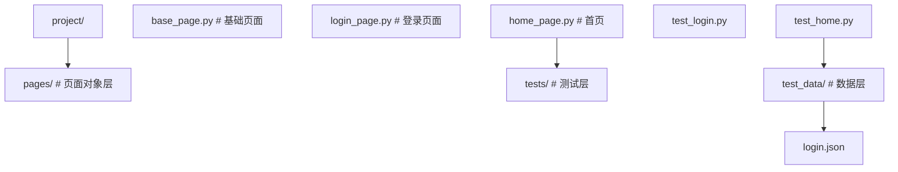
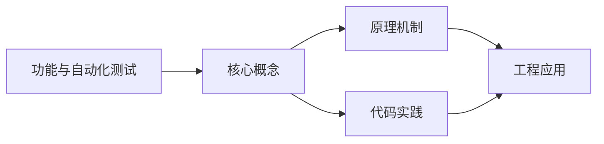
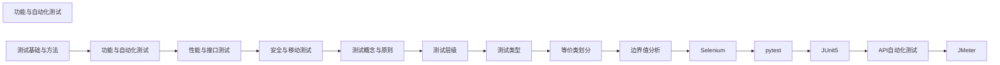

## 1. 学习目标（Bloom 分类）

本节按照布鲁姆教育目标分类学组织学习路径。本文主题为《功能与自动化测试》，属于 软件测试 模块，读者可以根据自身阶段选择阅读深度。

记忆层面：能够准确复述本文的核心概念、术语与基本语法或操作步骤，并能够在提问或检索时快速定位对应知识点。能够说出 软件测试 的核心概念、常用命令与流程。

理解层面：能够用自己的语言解释核心原理与工作机制，说明概念之间的因果关系，而不是机械记忆结论。能够解释 软件测试 的工作原理与设计动机。

应用层面：能够在真实项目或练习场景中运用本文知识解决具体问题，写出正确且可维护的实现。能够独立完成 软件测试 的标准操作。

分析层面：能够拆解复杂问题，比较本文主题与相邻概念的异同，识别边界条件与例外情况。能够分析 软件测试 使用中的异常与边界。

评价层面：能够根据约束条件（性能、可读性、安全、成本）评价不同方案的优劣，做出有依据的技术决策。能够评价 软件测试 相关工具与方案。

创造层面：能够把本文知识与其他模块知识组合，设计出新的解决方案或可复用的工程模式。能够把 软件测试 融入团队工作流。

通过本节学习，读者应当能够把《功能与自动化测试》纳入自己的知识网络，并与 软件测试 模块的其他主题（测试分层、用例设计、自动化、质量度量）建立关联。

## 2. 历史动机与发展脉络

《功能与自动化测试》是 软件测试 领域的重要主题。要真正理解它，需要先了解它解决的问题与演进过程。

软件测试伴随软件工程诞生：1979 年 Myers 定义“测试是为了发现错误而执行程序”；现代测试是质量内建活动，而非发布前关卡。
测试金字塔：单元测试（多、快、稳）-> 集成测试 -> E2E（少、慢、脆）；比例指导投入。
现代实践：TDD（测试驱动开发）、BDD（行为驱动）、测试左移（开发期）、可测试性设计。

回到本文主题：功能与自动化测试 的提出与成熟，正是上述技术背景下的必然产物。早期实现往往以简单可用为目标，随着工程规模扩大，社区逐渐沉淀出标准做法与最佳实践；理解这一脉络，可以帮助读者判断“为什么文档中的推荐写法是现在这个样子”，也能在遇到历史遗留代码时准确识别其设计年代与取舍。


## 3. 形式化定义与核心概念精讲

本节把《功能与自动化测试》涉及的核心概念以“定义 + 讲解”的形式展开。读者应把定义当作工具，把讲解当作理解路径；两者结合才能形成可迁移的知识。

用例设计：等价类划分、边界值、判定表、场景法、错误推测；覆盖（语句/分支/路径）。
测试分层：单元（函数/类）、集成（模块间）、系统（端到端）、验收（需求）；回归防退化。
自动化：测试框架（JUnit/pytest/Jest/Playwright）、fixture、断言、mock；CI 集成。

### 3.1 原文章节逐一精讲

原文档把主题拆分为 6 个小节，下面按顺序给出每一节的导读讲解，随后保留原文细节供精读。

#### 原文精读（完整保留）


#### 1. 功能测试执行

##### 1.1 功能测试流程

```
需求分析 → 用例设计 → 用例评审 → 测试执行 → 缺陷提交 → 回归验证 → 测试报告
```

##### 1.2 功能测试要点

| 要点         | 说明                           |
| :----------- | :----------------------------- |
| **正向验证** | 验证功能正常流程是否正确       |
| **逆向验证** | 验证异常输入是否正确处理       |
| **边界验证** | 验证边界值和临界条件           |
| **交互验证** | 验证功能间的联动和影响         |
| **数据验证** | 验证数据的增删改查和一致性     |
| **兼容验证** | 验证不同浏览器/设备/系统的表现 |

##### 1.3 缺陷报告

```yaml
缺陷编号: BUG-2026-001
标题: 用户登录后页面跳转失败
严重程度: 严重
优先级: 高
复现步骤: 1. 打开登录页面
  2. 输入正确用户名和密码
  3. 点击登录按钮
预期结果: 跳转到首页
实际结果: 停留在登录页面，控制台报 500 错误
环境: Chrome 120 / Windows 11 / 测试环境
附件: screenshot.png
```

#### 2. Selenium 测试框架

##### 2.1 Selenium 体系

| 组件                   | 说明               |
| :--------------------- | :----------------- |
| **Selenium WebDriver** | 浏览器自动化驱动   |
| **Selenium IDE**       | 浏览器录制回放插件 |
| **Selenium Grid**      | 分布式并行测试     |

##### 2.2 环境搭建

```bash
# 安装 Selenium
pip install selenium

# 下载浏览器驱动（或使用 webdriver-manager 自动管理）
pip install webdriver-manager
```

##### 2.3 WebDriver 基础操作

```python
from selenium import webdriver
from selenium.webdriver.common.by import By
from selenium.webdriver.chrome.service import Service
from webdriver_manager.chrome import ChromeDriverManager

# 初始化浏览器
driver = webdriver.Chrome(service=Service(ChromeDriverManager().install()))

# 打开页面
driver.get("https://www.example.com/login")

# 获取页面信息
print(driver.title)
print(driver.current_url)

# 退出浏览器
driver.quit()
```

##### 2.4 元素定位策略

```python
from selenium.webdriver.common.by import By

# ID 定位（推荐，最快）
element = driver.find_element(By.ID, "username")

# Name 定位
element = driver.find_element(By.NAME, "password")

# Class 定位
element = driver.find_element(By.CLASS_NAME, "btn-primary")

# CSS 选择器（推荐，灵活）
element = driver.find_element(By.CSS_SELECTOR, "#login-form input[type='text']")
element = driver.find_element(By.CSS_SELECTOR, "div.card > h2.title")

# XPath 定位（最强大）
element = driver.find_element(By.XPATH, "//input[@id='username']")
element = driver.find_element(By.XPATH, "//button[contains(text(), '登录')]")
element = driver.find_element(By.XPATH, "//form[@id='login']//input[1]")

# Link Text 定位
element = driver.find_element(By.LINK_TEXT, "忘记密码")
element = driver.find_element(By.PARTIAL_LINK_TEXT, "忘记")

# Tag Name 定位
elements = driver.find_elements(By.TAG_NAME, "input")
```

##### 2.5 定位策略对比

| 策略      | 速度 | 可读性 | 稳定性 | 推荐场景       |
| :-------- | :--- | :----- | :----- | :------------- |
| **ID**    | 最快 | 高     | 高     | 有唯一 ID 时   |
| **CSS**   | 快   | 中     | 高     | 通用首选       |
| **XPath** | 较慢 | 低     | 中     | 复杂定位       |
| **Name**  | 快   | 高     | 中     | 表单元素       |
| **Class** | 快   | 中     | 低     | 不推荐单独使用 |

##### 2.6 显式等待

```python
from selenium.webdriver.support.ui import WebDriverWait
from selenium.webdriver.support import expected_conditions as EC
from selenium.webdriver.common.by import By

# 显式等待（推荐）
wait = WebDriverWait(driver, timeout=10, poll_frequency=0.5)

# 等待元素可见
element = wait.until(EC.visibility_of_element_located((By.ID, "username")))

# 等待元素可点击
element = wait.until(EC.element_to_be_clickable((By.CSS_SELECTOR, ".btn-login")))

# 等待文本出现
wait.until(EC.text_to_be_present_in_element((By.ID, "message"), "登录成功"))

# 等待页面标题
wait.until(EC.title_contains("首页"))

# 自定义等待条件
wait.until(lambda d: d.find_element(By.ID, "status").get_attribute("data-loaded") == "true")
```

##### 2.7 完整登录测试示例

```python
from selenium import webdriver
from selenium.webdriver.common.by import By
from selenium.webdriver.support.ui import WebDriverWait
from selenium.webdriver.support import expected_conditions as EC
from selenium.webdriver.chrome.service import Service
from webdriver_manager.chrome import ChromeDriverManager
import pytest


class TestLogin:
    """登录功能测试"""

    def setup_method(self):
        self.driver = webdriver.Chrome(service=Service(ChromeDriverManager().install()))
        self.wait = WebDriverWait(self.driver, 10)
        self.driver.get("https://www.example.com/login")
        self.driver.maximize_window()

    def teardown_method(self):
        self.driver.quit()

    def test_login_success(self):
        """正常登录"""
        # 输入用户名
        username = self.wait.until(EC.visibility_of_element_located((By.ID, "username")))
        username.send_keys("admin")

        # 输入密码
        password = self.driver.find_element(By.ID, "password")
        password.send_keys("123456")

        # 点击登录
        login_btn = self.driver.find_element(By.CSS_SELECTOR, ".btn-login")
        login_btn.click()

        # 验证跳转
        self.wait.until(EC.title_contains("首页"))
        assert "首页" in self.driver.title

    def test_login_wrong_password(self):
        """错误密码登录"""
        username = self.wait.until(EC.visibility_of_element_located((By.ID, "username")))
        username.send_keys("admin")

        password = self.driver.find_element(By.ID, "password")
        password.send_keys("wrong_password")

        login_btn = self.driver.find_element(By.CSS_SELECTOR, ".btn-login")
        login_btn.click()

        # 验证错误提示
        error_msg = self.wait.until(
            EC.visibility_of_element_located((By.CSS_SELECTOR, ".error-message"))
        )
        assert "用户名或密码错误" in error_msg.text

    def test_login_empty_fields(self):
        """空字段登录"""
        login_btn = self.wait.until(
            EC.element_to_be_clickable((By.CSS_SELECTOR, ".btn-login"))
        )
        login_btn.click()

        # 验证必填提示
        username_error = self.driver.find_element(By.CSS_SELECTOR, "#username-error")
        assert "请输入用户名" in username_error.text
```

#### 3. Unittest 测试框架

##### 3.1 基础结构

```python
import unittest


class Calculator:
    """被测类"""
    def add(self, a, b):
        return a + b

    def divide(self, a, b):
        if b == 0:
            raise ValueError("除数不能为零")
        return a / b


class TestCalculator(unittest.TestCase):
    """计算器测试"""

    def setUp(self):
        """每个测试方法前执行"""
        self.calc = Calculator()

    def tearDown(self):
        """每个测试方法后执行"""
        pass

    @classmethod
    def setUpClass(cls):
        """所有测试前执行一次"""
        print("测试开始")

    @classmethod
    def tearDownClass(cls):
        """所有测试后执行一次"""
        print("测试结束")

    def test_add(self):
        self.assertEqual(self.calc.add(2, 3), 5)
        self.assertEqual(self.calc.add(-1, 1), 0)
        self.assertEqual(self.calc.add(0, 0), 0)

    def test_divide(self):
        self.assertEqual(self.calc.divide(6, 3), 2.0)
        self.assertAlmostEqual(self.calc.divide(1, 3), 0.333, places=2)

    def test_divide_by_zero(self):
        with self.assertRaises(ValueError):
            self.calc.divide(1, 0)


if __name__ == '__main__':
    unittest.main()
```

##### 3.2 常用断言

| 断言方法                          | 说明       |
| :-------------------------------- | :--------- |
| `assertEqual(a, b)`               | 相等       |
| `assertNotEqual(a, b)`            | 不相等     |
| `assertTrue(x)`                   | 为真       |
| `assertFalse(x)`                  | 为假       |
| `assertIs(a, b)`                  | 是同一对象 |
| `assertIsNone(x)`                 | 为 None    |
| `assertIn(a, b)`                  | a 在 b 中  |
| `assertRaises(Exception)`         | 抛出异常   |
| `assertAlmostEqual(a, b, places)` | 近似相等   |

#### 4. pytest 测试框架

##### 4.1 基础用法

```python
import pytest

# 简单测试函数
def test_addition():
    assert 1 + 1 == 2

def test_string_upper():
    assert "hello".upper() == "HELLO"

# 参数化测试
@pytest.mark.parametrize("input_val, expected", [
    (1, 2),
    (2, 4),
    (3, 6),
    (0, 0),
    (-1, -2),
])
def test_double(input_val, expected):
    assert input_val * 2 == expected
```

##### 4.2 Fixture 机制

```python
import pytest

@pytest.fixture
def sample_data():
    """提供测试数据"""
    return {"name": "张三", "age": 25, "email": "zhangsan@example.com"}

@pytest.fixture
def db_connection():
    """模拟数据库连接"""
    conn = {"connected": True, "data": []}
    yield conn  # yield 之前的代码是 setup
    conn["connected"] = False  # yield 之后的代码是 teardown

def test_user_name(sample_data):
    assert sample_data["name"] == "张三"

def test_db_connection(db_connection):
    assert db_connection["connected"] is True
    db_connection["data"].append("record1")
    assert len(db_connection["data"]) == 1
```

##### 4.3 Fixture 作用域

| 作用域       | 说明                         |
| :----------- | :--------------------------- |
| **function** | 每个测试函数执行一次（默认） |
| **class**    | 每个测试类执行一次           |
| **module**   | 每个模块执行一次             |
| **session**  | 整个测试会话执行一次         |

```python
@pytest.fixture(scope="session")
def app_client():
    """整个测试会话只初始化一次"""
    client = create_test_client()
    yield client
    client.close()

@pytest.fixture(scope="module")
def test_db():
    """每个模块初始化一次"""
    db = init_test_db()
    yield db
    db.cleanup()
```

##### 4.4 标记（Mark）

```python
import pytest

@pytest.mark.slow
def test_large_dataset():
    """慢速测试"""
    pass

@pytest.mark.smoke
def test_basic_function():
    """冒烟测试"""
    pass

@pytest.mark.skip(reason="功能未实现")
def test_future_feature():
    pass

@pytest.mark.xfail(reason="已知缺陷 BUG-001")
def test_known_bug():
    assert 1 == 2

# 运行指定标记
# pytest -m smoke        只运行冒烟测试
# pytest -m "not slow"   排除慢速测试
```

##### 4.5 pytest 配置文件

```ini
# pytest.ini
[pytest]
testpaths = tests
python_files = test_*.py
python_classes = Test*
python_functions = test_*
addopts = -v --tb=short
markers =
    smoke: 冒烟测试
    slow: 慢速测试
    regression: 回归测试
```

#### 5. 测试数据管理

##### 5.1 数据驱动测试

```python
import pytest
import csv
import json

# CSV 数据驱动
def load_test_data_csv(filepath):
    with open(filepath, 'r', encoding='utf-8') as f:
        reader = csv.DictReader(f)
        return list(reader)

# JSON 数据驱动
def load_test_data_json(filepath):
    with open(filepath, 'r', encoding='utf-8') as f:
        return json.load(f)

# 使用数据驱动
@pytest.mark.parametrize("data", load_test_data_json("test_data/login.json"))
def test_login_data_driven(data):
    assert login(data["username"], data["password"]) == data["expected"]
```

##### 5.2 测试数据文件

```json
// test_data/login.json
[
  { "username": "admin", "password": "123456", "expected": "success" },
  { "username": "admin", "password": "wrong", "expected": "wrong_password" },
  { "username": "", "password": "123456", "expected": "empty_username" },
  { "username": "admin", "password": "", "expected": "empty_password" },
  { "username": "hack' OR 1=1--", "password": "any", "expected": "invalid_input" }
]
```

#### 6. 页面对象模式（POM）

##### 6.1 POM 架构



##### 6.2 基础页面封装

```python
# pages/base_page.py
from selenium.webdriver.support.ui import WebDriverWait
from selenium.webdriver.support import expected_conditions as EC


class BasePage:
    """页面基类，封装通用操作"""

    def __init__(self, driver):
        self.driver = driver
        self.wait = WebDriverWait(driver, 10)

    def find_element(self, locator):
        """查找元素（显式等待）"""
        return self.wait.until(EC.visibility_of_element_located(locator))

    def click(self, locator):
        """点击元素"""
        element = self.wait.until(EC.element_to_be_clickable(locator))
        element.click()

    def type_text(self, locator, text):
        """输入文本"""
        element = self.find_element(locator)
        element.clear()
        element.send_keys(text)

    def get_text(self, locator):
        """获取文本"""
        return self.find_element(locator).text

    def is_visible(self, locator):
        """元素是否可见"""
        try:
            self.find_element(locator)
            return True
        except Exception:
            return False

    def wait_for_url_contains(self, text):
        """等待 URL 包含指定文本"""
        self.wait.until(EC.url_contains(text))
```

##### 6.3 登录页面对象

```python
# pages/login_page.py
from selenium.webdriver.common.by import By
from pages.base_page import BasePage


class LoginPage(BasePage):
    """登录页面对象"""

    # 元素定位器
    USERNAME_INPUT = (By.ID, "username")
    PASSWORD_INPUT = (By.ID, "password")
    LOGIN_BUTTON = (By.CSS_SELECTOR, ".btn-login")
    ERROR_MESSAGE = (By.CSS_SELECTOR, ".error-message")
    REMEMBER_CHECKBOX = (By.ID, "remember")

    # 页面 URL
    URL = "/login"

    def open(self):
        self.driver.get(f"{self.base_url}{self.URL}")
        return self

    def login(self, username: str, password: str):
        """执行登录操作"""
        self.type_text(self.USERNAME_INPUT, username)
        self.type_text(self.PASSWORD_INPUT, password)
        self.click(self.LOGIN_BUTTON)
        return self

    def get_error_message(self) -> str:
        """获取错误提示"""
        return self.get_text(self.ERROR_MESSAGE)

    def is_login_button_enabled(self) -> bool:
        """登录按钮是否可用"""
        return self.find_element(self.LOGIN_BUTTON).is_enabled()
```

##### 6.4 使用 POM 的测试

```python
# tests/test_login.py
import pytest
from pages.login_page import LoginPage


class TestLogin:
    """登录测试 - 使用 POM 模式"""

    def test_login_success(self, driver):
        login_page = LoginPage(driver)
        login_page.open()
        login_page.login("admin", "123456")

        # 验证跳转到首页
        assert "首页" in driver.title

    def test_login_wrong_password(self, driver):
        login_page = LoginPage(driver)
        login_page.open()
        login_page.login("admin", "wrong")

        # 验证错误提示
        assert "用户名或密码错误" in login_page.get_error_message()

    @pytest.mark.parametrize("username,password,expected_msg", [
        ("", "123456", "请输入用户名"),
        ("admin", "", "请输入密码"),
        ("admin", "wrong", "用户名或密码错误"),
    ])
    def test_login_invalid(self, driver, username, password, expected_msg):
        login_page = LoginPage(driver)
        login_page.open()
        login_page.login(username, password)
        assert expected_msg in login_page.get_error_message()
```

##### 6.5 POM 优势

| 优势         | 说明                                    |
| :----------- | :-------------------------------------- |
| **可维护性** | UI 变更只需修改页面对象，不影响测试用例 |
| **可复用性** | 页面操作方法可在多个测试中复用          |
| **可读性**   | 测试代码更接近业务语言                  |
| **团队协作** | 页面对象与测试用例可并行开发            |


### 3.2 概念关系图

下面用 Mermaid 图表达本文核心概念之间的关系，帮助读者建立整体图景：



图中展示的是本文知识的结构化关系：核心概念是入口，原理机制解释“为什么”，代码实践演示“怎么做”，工程应用回答“何时用”。读者学习时可以把每个小节的内容挂接到对应节点上。

## 4. 理论推导与原理解析

本节深入《功能与自动化测试》背后的原理。理论部分不求面面俱到，而是聚焦“能解释现象、能指导实践”的关键推导。

用例设计：等价类划分、边界值、判定表、场景法、错误推测；覆盖（语句/分支/路径）。
测试分层：单元（函数/类）、集成（模块间）、系统（端到端）、验收（需求）；回归防退化。
自动化：测试框架（JUnit/pytest/Jest/Playwright）、fixture、断言、mock；CI 集成。
质量度量：缺陷密度、测试覆盖率、MTTF；覆盖率是手段不是目标。

需要强调的是，理论推导与工程实践之间存在翻译层：理论给出的是理想化模型与边界条件，工程代码则必须处理真实环境中的例外。读者在学习时应先掌握理论的“标准情形”，再通过陷阱章节了解“非标准情形”。

## 5. 代码示例与逐行讲解

本节把原文中的代码示例系统整理，并为每个示例补充用途说明与讲解。读者不应只浏览代码，而应逐段对照讲解理解设计意图。

### 5.1 示例：1.1 功能测试流程

该示例来自原文《1.1 功能测试流程》小节，用于演示功能与自动化测试相关操作。阅读时请先看代码结构，再看其后的讲解。

```text
需求分析 → 用例设计 → 用例评审 → 测试执行 → 缺陷提交 → 回归验证 → 测试报告
```

讲解：这段代码演示了本节核心知识点。代码中的关键操作可以归纳为三步：准备（定义或初始化）、执行（核心逻辑）、收尾（释放资源或返回结果）。实际项目中，这三步往往被封装为函数或类，以提升复用性与可测试性。

关键点分析：

该示例共 1 行有效代码，结构以数据或配置为主。阅读时应关注：数据字段的含义、配置项的作用，以及它们与运行行为的对应关系。

进阶思考路径：先尝试修改参数观察行为变化，再把示例中的模式迁移到自己的项目中；每次修改都记录预期与实测差异，这是把示例转化为能力的最快方式。

### 5.2 示例：1.3 缺陷报告

该示例来自原文《1.3 缺陷报告》小节，用于演示功能与自动化测试相关操作。阅读时请先看代码结构，再看其后的讲解。

```yaml
缺陷编号: BUG-2026-001
标题: 用户登录后页面跳转失败
严重程度: 严重
优先级: 高
复现步骤: 1. 打开登录页面
  2. 输入正确用户名和密码
  3. 点击登录按钮
预期结果: 跳转到首页
实际结果: 停留在登录页面，控制台报 500 错误
环境: Chrome 120 / Windows 11 / 测试环境
附件: screenshot.png
```

讲解：这段代码演示了本节核心知识点。代码中的关键操作可以归纳为三步：准备（定义或初始化）、执行（核心逻辑）、收尾（释放资源或返回结果）。实际项目中，这三步往往被封装为函数或类，以提升复用性与可测试性。

关键点分析：

该示例共 11 行有效代码，结构以数据或配置为主。阅读时应关注：数据字段的含义、配置项的作用，以及它们与运行行为的对应关系。

进阶思考路径：先尝试修改参数观察行为变化，再把示例中的模式迁移到自己的项目中；每次修改都记录预期与实测差异，这是把示例转化为能力的最快方式。

### 5.3 示例：2.2 环境搭建

该示例来自原文《2.2 环境搭建》小节，用于演示功能与自动化测试相关操作。阅读时请先看代码结构，再看其后的讲解。

```bash
# 安装 Selenium
pip install selenium

# 下载浏览器驱动（或使用 webdriver-manager 自动管理）
pip install webdriver-manager
```

讲解：这段代码演示了本节核心知识点。代码中的关键操作可以归纳为三步：准备（定义或初始化）、执行（核心逻辑）、收尾（释放资源或返回结果）。实际项目中，这三步往往被封装为函数或类，以提升复用性与可测试性。

关键点分析：

该示例共 4 行有效代码，结构以数据或配置为主。阅读时应关注：数据字段的含义、配置项的作用，以及它们与运行行为的对应关系。

进阶思考路径：先尝试修改参数观察行为变化，再把示例中的模式迁移到自己的项目中；每次修改都记录预期与实测差异，这是把示例转化为能力的最快方式。

### 5.4 示例：2.3 WebDriver 基础操作

该示例来自原文《2.3 WebDriver 基础操作》小节，用于演示功能与自动化测试相关操作。阅读时请先看代码结构，再看其后的讲解。

```python
from selenium import webdriver
from selenium.webdriver.common.by import By
from selenium.webdriver.chrome.service import Service
from webdriver_manager.chrome import ChromeDriverManager

# 初始化浏览器
driver = webdriver.Chrome(service=Service(ChromeDriverManager().install()))

# 打开页面
driver.get("https://www.example.com/login")

# 获取页面信息
print(driver.title)
print(driver.current_url)

# 退出浏览器
driver.quit()
```

讲解：这段代码演示了本节核心知识点。代码中的关键操作可以归纳为三步：准备（定义或初始化）、执行（核心逻辑）、收尾（释放资源或返回结果）。实际项目中，这三步往往被封装为函数或类，以提升复用性与可测试性。

关键点分析：

该示例共 13 行有效代码，包含 2 类关键结构（import、from）。其中：

- 入口与初始化部分负责建立上下文，对应实际项目中的启动或装配逻辑；
- 核心逻辑部分体现本文主题的主要操作，是阅读时最需要对照讲解理解的部分；
- 输出或返回部分把结果交给调用方，注意其类型与边界条件。

进阶思考路径：先尝试修改参数观察行为变化，再把示例中的模式迁移到自己的项目中；每次修改都记录预期与实测差异，这是把示例转化为能力的最快方式。

### 5.5 示例：2.4 元素定位策略

该示例来自原文《2.4 元素定位策略》小节，用于演示功能与自动化测试相关操作。阅读时请先看代码结构，再看其后的讲解。

```python
from selenium.webdriver.common.by import By

# ID 定位（推荐，最快）
element = driver.find_element(By.ID, "username")

# Name 定位
element = driver.find_element(By.NAME, "password")

# Class 定位
element = driver.find_element(By.CLASS_NAME, "btn-primary")

# CSS 选择器（推荐，灵活）
element = driver.find_element(By.CSS_SELECTOR, "#login-form input[type='text']")
element = driver.find_element(By.CSS_SELECTOR, "div.card > h2.title")

# XPath 定位（最强大）
element = driver.find_element(By.XPATH, "//input[@id='username']")
element = driver.find_element(By.XPATH, "//button[contains(text(), '登录')]")
element = driver.find_element(By.XPATH, "//form[@id='login']//input[1]")

# Link Text 定位
element = driver.find_element(By.LINK_TEXT, "忘记密码")
element = driver.find_element(By.PARTIAL_LINK_TEXT, "忘记")

# Tag Name 定位
elements = driver.find_elements(By.TAG_NAME, "input")
```

讲解：这段代码演示了本节核心知识点。代码中的关键操作可以归纳为三步：准备（定义或初始化）、执行（核心逻辑）、收尾（释放资源或返回结果）。实际项目中，这三步往往被封装为函数或类，以提升复用性与可测试性。

关键点分析：

该示例共 19 行有效代码，包含 3 类关键结构（import、from、SELECT）。其中：

- 入口与初始化部分负责建立上下文，对应实际项目中的启动或装配逻辑；
- 核心逻辑部分体现本文主题的主要操作，是阅读时最需要对照讲解理解的部分；
- 输出或返回部分把结果交给调用方，注意其类型与边界条件。

进阶思考路径：先尝试修改参数观察行为变化，再把示例中的模式迁移到自己的项目中；每次修改都记录预期与实测差异，这是把示例转化为能力的最快方式。

### 5.6 示例：2.6 显式等待

该示例来自原文《2.6 显式等待》小节，用于演示功能与自动化测试相关操作。阅读时请先看代码结构，再看其后的讲解。

```python
from selenium.webdriver.support.ui import WebDriverWait
from selenium.webdriver.support import expected_conditions as EC
from selenium.webdriver.common.by import By

# 显式等待（推荐）
wait = WebDriverWait(driver, timeout=10, poll_frequency=0.5)

# 等待元素可见
element = wait.until(EC.visibility_of_element_located((By.ID, "username")))

# 等待元素可点击
element = wait.until(EC.element_to_be_clickable((By.CSS_SELECTOR, ".btn-login")))

# 等待文本出现
wait.until(EC.text_to_be_present_in_element((By.ID, "message"), "登录成功"))

# 等待页面标题
wait.until(EC.title_contains("首页"))

# 自定义等待条件
wait.until(lambda d: d.find_element(By.ID, "status").get_attribute("data-loaded") == "true")
```

讲解：这段代码演示了本节核心知识点。代码中的关键操作可以归纳为三步：准备（定义或初始化）、执行（核心逻辑）、收尾（释放资源或返回结果）。实际项目中，这三步往往被封装为函数或类，以提升复用性与可测试性。

关键点分析：

该示例共 15 行有效代码，包含 3 类关键结构（import、from、SELECT）。其中：

- 入口与初始化部分负责建立上下文，对应实际项目中的启动或装配逻辑；
- 核心逻辑部分体现本文主题的主要操作，是阅读时最需要对照讲解理解的部分；
- 输出或返回部分把结果交给调用方，注意其类型与边界条件。

进阶思考路径：先尝试修改参数观察行为变化，再把示例中的模式迁移到自己的项目中；每次修改都记录预期与实测差异，这是把示例转化为能力的最快方式。

### 5.7 示例：2.7 完整登录测试示例

该示例来自原文《2.7 完整登录测试示例》小节，用于演示功能与自动化测试相关操作。阅读时请先看代码结构，再看其后的讲解。

```python
from selenium import webdriver
from selenium.webdriver.common.by import By
from selenium.webdriver.support.ui import WebDriverWait
from selenium.webdriver.support import expected_conditions as EC
from selenium.webdriver.chrome.service import Service
from webdriver_manager.chrome import ChromeDriverManager
import pytest


class TestLogin:
    """登录功能测试"""

    def setup_method(self):
        self.driver = webdriver.Chrome(service=Service(ChromeDriverManager().install()))
        self.wait = WebDriverWait(self.driver, 10)
        self.driver.get("https://www.example.com/login")
        self.driver.maximize_window()

    def teardown_method(self):
        self.driver.quit()

    def test_login_success(self):
        """正常登录"""
        # 输入用户名
        username = self.wait.until(EC.visibility_of_element_located((By.ID, "username")))
        username.send_keys("admin")

        # 输入密码
        password = self.driver.find_element(By.ID, "password")
        password.send_keys("123456")

        # 点击登录
        login_btn = self.driver.find_element(By.CSS_SELECTOR, ".btn-login")
        login_btn.click()

        # 验证跳转
        self.wait.until(EC.title_contains("首页"))
        assert "首页" in self.driver.title

    def test_login_wrong_password(self):
        """错误密码登录"""
        username = self.wait.until(EC.visibility_of_element_located((By.ID, "username")))
        username.send_keys("admin")

        password = self.driver.find_element(By.ID, "password")
        password.send_keys("wrong_password")

        login_btn = self.driver.find_element(By.CSS_SELECTOR, ".btn-login")
        login_btn.click()

        # 验证错误提示
        error_msg = self.wait.until(
            EC.visibility_of_element_located((By.CSS_SELECTOR, ".error-message"))
        )
        assert "用户名或密码错误" in error_msg.text

    def test_login_empty_fields(self):
        """空字段登录"""
        login_btn = self.wait.until(
            EC.element_to_be_clickable((By.CSS_SELECTOR, ".btn-login"))
        )
        login_btn.click()

        # 验证必填提示
        username_error = self.driver.find_element(By.CSS_SELECTOR, "#username-error")
        assert "请输入用户名" in username_error.text
```

讲解：这段代码演示了本节核心知识点。代码中的关键操作可以归纳为三步：准备（定义或初始化）、执行（核心逻辑）、收尾（释放资源或返回结果）。实际项目中，这三步往往被封装为函数或类，以提升复用性与可测试性。

关键点分析：

该示例共 52 行有效代码，包含 5 类关键结构（class、def、import、from、SELECT）。其中：

- 入口与初始化部分负责建立上下文，对应实际项目中的启动或装配逻辑；
- 核心逻辑部分体现本文主题的主要操作，是阅读时最需要对照讲解理解的部分；
- 输出或返回部分把结果交给调用方，注意其类型与边界条件。

进阶思考路径：先尝试修改参数观察行为变化，再把示例中的模式迁移到自己的项目中；每次修改都记录预期与实测差异，这是把示例转化为能力的最快方式。

### 5.8 示例：3.1 基础结构

该示例来自原文《3.1 基础结构》小节，用于演示功能与自动化测试相关操作。阅读时请先看代码结构，再看其后的讲解。

```python
import unittest


class Calculator:
    """被测类"""
    def add(self, a, b):
        return a + b

    def divide(self, a, b):
        if b == 0:
            raise ValueError("除数不能为零")
        return a / b


class TestCalculator(unittest.TestCase):
    """计算器测试"""

    def setUp(self):
        """每个测试方法前执行"""
        self.calc = Calculator()

    def tearDown(self):
        """每个测试方法后执行"""
        pass

    @classmethod
    def setUpClass(cls):
        """所有测试前执行一次"""
        print("测试开始")

    @classmethod
    def tearDownClass(cls):
        """所有测试后执行一次"""
        print("测试结束")

    def test_add(self):
        self.assertEqual(self.calc.add(2, 3), 5)
        self.assertEqual(self.calc.add(-1, 1), 0)
        self.assertEqual(self.calc.add(0, 0), 0)

    def test_divide(self):
        self.assertEqual(self.calc.divide(6, 3), 2.0)
        self.assertAlmostEqual(self.calc.divide(1, 3), 0.333, places=2)

    def test_divide_by_zero(self):
        with self.assertRaises(ValueError):
            self.calc.divide(1, 0)


if __name__ == '__main__':
    unittest.main()
```

讲解：这段代码演示了本节核心知识点。代码中的关键操作可以归纳为三步：准备（定义或初始化）、执行（核心逻辑）、收尾（释放资源或返回结果）。实际项目中，这三步往往被封装为函数或类，以提升复用性与可测试性。

关键点分析：

该示例共 37 行有效代码，包含 5 类关键结构（class、def、import、if、return）。其中：

- 入口与初始化部分负责建立上下文，对应实际项目中的启动或装配逻辑；
- 核心逻辑部分体现本文主题的主要操作，是阅读时最需要对照讲解理解的部分；
- 输出或返回部分把结果交给调用方，注意其类型与边界条件。

进阶思考路径：先尝试修改参数观察行为变化，再把示例中的模式迁移到自己的项目中；每次修改都记录预期与实测差异，这是把示例转化为能力的最快方式。

### 5.9 示例：4.1 基础用法

该示例来自原文《4.1 基础用法》小节，用于演示功能与自动化测试相关操作。阅读时请先看代码结构，再看其后的讲解。

```python
import pytest

# 简单测试函数
def test_addition():
    assert 1 + 1 == 2

def test_string_upper():
    assert "hello".upper() == "HELLO"

# 参数化测试
@pytest.mark.parametrize("input_val, expected", [
    (1, 2),
    (2, 4),
    (3, 6),
    (0, 0),
    (-1, -2),
])
def test_double(input_val, expected):
    assert input_val * 2 == expected
```

讲解：这段代码演示了本节核心知识点。代码中的关键操作可以归纳为三步：准备（定义或初始化）、执行（核心逻辑）、收尾（释放资源或返回结果）。实际项目中，这三步往往被封装为函数或类，以提升复用性与可测试性。

关键点分析：

该示例共 16 行有效代码，包含 2 类关键结构（def、import）。其中：

- 入口与初始化部分负责建立上下文，对应实际项目中的启动或装配逻辑；
- 核心逻辑部分体现本文主题的主要操作，是阅读时最需要对照讲解理解的部分；
- 输出或返回部分把结果交给调用方，注意其类型与边界条件。

进阶思考路径：先尝试修改参数观察行为变化，再把示例中的模式迁移到自己的项目中；每次修改都记录预期与实测差异，这是把示例转化为能力的最快方式。

### 5.10 示例：4.2 Fixture 机制

该示例来自原文《4.2 Fixture 机制》小节，用于演示功能与自动化测试相关操作。阅读时请先看代码结构，再看其后的讲解。

```python
import pytest

@pytest.fixture
def sample_data():
    """提供测试数据"""
    return {"name": "张三", "age": 25, "email": "zhangsan@example.com"}

@pytest.fixture
def db_connection():
    """模拟数据库连接"""
    conn = {"connected": True, "data": []}
    yield conn  # yield 之前的代码是 setup
    conn["connected"] = False  # yield 之后的代码是 teardown

def test_user_name(sample_data):
    assert sample_data["name"] == "张三"

def test_db_connection(db_connection):
    assert db_connection["connected"] is True
    db_connection["data"].append("record1")
    assert len(db_connection["data"]) == 1
```

讲解：这段代码演示了本节核心知识点。代码中的关键操作可以归纳为三步：准备（定义或初始化）、执行（核心逻辑）、收尾（释放资源或返回结果）。实际项目中，这三步往往被封装为函数或类，以提升复用性与可测试性。

关键点分析：

该示例共 17 行有效代码，包含 3 类关键结构（def、import、return）。其中：

- 入口与初始化部分负责建立上下文，对应实际项目中的启动或装配逻辑；
- 核心逻辑部分体现本文主题的主要操作，是阅读时最需要对照讲解理解的部分；
- 输出或返回部分把结果交给调用方，注意其类型与边界条件。

进阶思考路径：先尝试修改参数观察行为变化，再把示例中的模式迁移到自己的项目中；每次修改都记录预期与实测差异，这是把示例转化为能力的最快方式。

### 5.11 示例：4.3 Fixture 作用域

该示例来自原文《4.3 Fixture 作用域》小节，用于演示功能与自动化测试相关操作。阅读时请先看代码结构，再看其后的讲解。

```python
@pytest.fixture(scope="session")
def app_client():
    """整个测试会话只初始化一次"""
    client = create_test_client()
    yield client
    client.close()

@pytest.fixture(scope="module")
def test_db():
    """每个模块初始化一次"""
    db = init_test_db()
    yield db
    db.cleanup()
```

讲解：这段代码演示了本节核心知识点。代码中的关键操作可以归纳为三步：准备（定义或初始化）、执行（核心逻辑）、收尾（释放资源或返回结果）。实际项目中，这三步往往被封装为函数或类，以提升复用性与可测试性。

关键点分析：

该示例共 12 行有效代码，包含 1 类关键结构（def）。其中：

- 入口与初始化部分负责建立上下文，对应实际项目中的启动或装配逻辑；
- 核心逻辑部分体现本文主题的主要操作，是阅读时最需要对照讲解理解的部分；
- 输出或返回部分把结果交给调用方，注意其类型与边界条件。

进阶思考路径：先尝试修改参数观察行为变化，再把示例中的模式迁移到自己的项目中；每次修改都记录预期与实测差异，这是把示例转化为能力的最快方式。

### 5.12 示例：4.4 标记（Mark）

该示例来自原文《4.4 标记（Mark）》小节，用于演示功能与自动化测试相关操作。阅读时请先看代码结构，再看其后的讲解。

```python
import pytest

@pytest.mark.slow
def test_large_dataset():
    """慢速测试"""
    pass

@pytest.mark.smoke
def test_basic_function():
    """冒烟测试"""
    pass

@pytest.mark.skip(reason="功能未实现")
def test_future_feature():
    pass

@pytest.mark.xfail(reason="已知缺陷 BUG-001")
def test_known_bug():
    assert 1 == 2

# 运行指定标记
# pytest -m smoke        只运行冒烟测试
# pytest -m "not slow"   排除慢速测试
```

讲解：这段代码演示了本节核心知识点。代码中的关键操作可以归纳为三步：准备（定义或初始化）、执行（核心逻辑）、收尾（释放资源或返回结果）。实际项目中，这三步往往被封装为函数或类，以提升复用性与可测试性。

关键点分析：

该示例共 18 行有效代码，包含 3 类关键结构（def、function、import）。其中：

- 入口与初始化部分负责建立上下文，对应实际项目中的启动或装配逻辑；
- 核心逻辑部分体现本文主题的主要操作，是阅读时最需要对照讲解理解的部分；
- 输出或返回部分把结果交给调用方，注意其类型与边界条件。

进阶思考路径：先尝试修改参数观察行为变化，再把示例中的模式迁移到自己的项目中；每次修改都记录预期与实测差异，这是把示例转化为能力的最快方式。

### 5.13 示例：4.5 pytest 配置文件

该示例来自原文《4.5 pytest 配置文件》小节，用于演示功能与自动化测试相关操作。阅读时请先看代码结构，再看其后的讲解。

```ini
# pytest.ini
[pytest]
testpaths = tests
python_files = test_*.py
python_classes = Test*
python_functions = test_*
addopts = -v --tb=short
markers =
    smoke: 冒烟测试
    slow: 慢速测试
    regression: 回归测试
```

讲解：这段代码演示了本节核心知识点。代码中的关键操作可以归纳为三步：准备（定义或初始化）、执行（核心逻辑）、收尾（释放资源或返回结果）。实际项目中，这三步往往被封装为函数或类，以提升复用性与可测试性。

关键点分析：

该示例共 11 行有效代码，包含 2 类关键结构（class、function）。其中：

- 入口与初始化部分负责建立上下文，对应实际项目中的启动或装配逻辑；
- 核心逻辑部分体现本文主题的主要操作，是阅读时最需要对照讲解理解的部分；
- 输出或返回部分把结果交给调用方，注意其类型与边界条件。

进阶思考路径：先尝试修改参数观察行为变化，再把示例中的模式迁移到自己的项目中；每次修改都记录预期与实测差异，这是把示例转化为能力的最快方式。

### 5.14 示例：5.1 数据驱动测试

该示例来自原文《5.1 数据驱动测试》小节，用于演示功能与自动化测试相关操作。阅读时请先看代码结构，再看其后的讲解。

```python
import pytest
import csv
import json

# CSV 数据驱动
def load_test_data_csv(filepath):
    with open(filepath, 'r', encoding='utf-8') as f:
        reader = csv.DictReader(f)
        return list(reader)

# JSON 数据驱动
def load_test_data_json(filepath):
    with open(filepath, 'r', encoding='utf-8') as f:
        return json.load(f)

# 使用数据驱动
@pytest.mark.parametrize("data", load_test_data_json("test_data/login.json"))
def test_login_data_driven(data):
    assert login(data["username"], data["password"]) == data["expected"]
```

讲解：这段代码演示了本节核心知识点。代码中的关键操作可以归纳为三步：准备（定义或初始化）、执行（核心逻辑）、收尾（释放资源或返回结果）。实际项目中，这三步往往被封装为函数或类，以提升复用性与可测试性。

关键点分析：

该示例共 16 行有效代码，包含 3 类关键结构（def、import、return）。其中：

- 入口与初始化部分负责建立上下文，对应实际项目中的启动或装配逻辑；
- 核心逻辑部分体现本文主题的主要操作，是阅读时最需要对照讲解理解的部分；
- 输出或返回部分把结果交给调用方，注意其类型与边界条件。

进阶思考路径：先尝试修改参数观察行为变化，再把示例中的模式迁移到自己的项目中；每次修改都记录预期与实测差异，这是把示例转化为能力的最快方式。

### 5.15 示例：5.2 测试数据文件

该示例来自原文《5.2 测试数据文件》小节，用于演示功能与自动化测试相关操作。阅读时请先看代码结构，再看其后的讲解。

```json
// test_data/login.json
[
  { "username": "admin", "password": "123456", "expected": "success" },
  { "username": "admin", "password": "wrong", "expected": "wrong_password" },
  { "username": "", "password": "123456", "expected": "empty_username" },
  { "username": "admin", "password": "", "expected": "empty_password" },
  { "username": "hack' OR 1=1--", "password": "any", "expected": "invalid_input" }
]
```

讲解：这段代码演示了本节核心知识点。代码中的关键操作可以归纳为三步：准备（定义或初始化）、执行（核心逻辑）、收尾（释放资源或返回结果）。实际项目中，这三步往往被封装为函数或类，以提升复用性与可测试性。

关键点分析：

该示例共 8 行有效代码，结构以数据或配置为主。阅读时应关注：数据字段的含义、配置项的作用，以及它们与运行行为的对应关系。

进阶思考路径：先尝试修改参数观察行为变化，再把示例中的模式迁移到自己的项目中；每次修改都记录预期与实测差异，这是把示例转化为能力的最快方式。

### 5.16 示例：6.1 POM 架构

该示例来自原文《6.1 POM 架构》小节，用于演示功能与自动化测试相关操作。阅读时请先看代码结构，再看其后的讲解。


讲解：这段代码演示了本节核心知识点。代码中的关键操作可以归纳为三步：准备（定义或初始化）、执行（核心逻辑）、收尾（释放资源或返回结果）。实际项目中，这三步往往被封装为函数或类，以提升复用性与可测试性。

关键点分析：

该示例共 15 行有效代码，结构以数据或配置为主。阅读时应关注：数据字段的含义、配置项的作用，以及它们与运行行为的对应关系。

进阶思考路径：先尝试修改参数观察行为变化，再把示例中的模式迁移到自己的项目中；每次修改都记录预期与实测差异，这是把示例转化为能力的最快方式。

### 5.17 示例：6.2 基础页面封装

该示例来自原文《6.2 基础页面封装》小节，用于演示功能与自动化测试相关操作。阅读时请先看代码结构，再看其后的讲解。

```python
# pages/base_page.py
from selenium.webdriver.support.ui import WebDriverWait
from selenium.webdriver.support import expected_conditions as EC


class BasePage:
    """页面基类，封装通用操作"""

    def __init__(self, driver):
        self.driver = driver
        self.wait = WebDriverWait(driver, 10)

    def find_element(self, locator):
        """查找元素（显式等待）"""
        return self.wait.until(EC.visibility_of_element_located(locator))

    def click(self, locator):
        """点击元素"""
        element = self.wait.until(EC.element_to_be_clickable(locator))
        element.click()

    def type_text(self, locator, text):
        """输入文本"""
        element = self.find_element(locator)
        element.clear()
        element.send_keys(text)

    def get_text(self, locator):
        """获取文本"""
        return self.find_element(locator).text

    def is_visible(self, locator):
        """元素是否可见"""
        try:
            self.find_element(locator)
            return True
        except Exception:
            return False

    def wait_for_url_contains(self, text):
        """等待 URL 包含指定文本"""
        self.wait.until(EC.url_contains(text))
```

讲解：这段代码演示了本节核心知识点。代码中的关键操作可以归纳为三步：准备（定义或初始化）、执行（核心逻辑）、收尾（释放资源或返回结果）。实际项目中，这三步往往被封装为函数或类，以提升复用性与可测试性。

关键点分析：

该示例共 33 行有效代码，包含 5 类关键结构（class、def、import、from、return）。其中：

- 入口与初始化部分负责建立上下文，对应实际项目中的启动或装配逻辑；
- 核心逻辑部分体现本文主题的主要操作，是阅读时最需要对照讲解理解的部分；
- 输出或返回部分把结果交给调用方，注意其类型与边界条件。

进阶思考路径：先尝试修改参数观察行为变化，再把示例中的模式迁移到自己的项目中；每次修改都记录预期与实测差异，这是把示例转化为能力的最快方式。

### 5.18 示例：6.3 登录页面对象

该示例来自原文《6.3 登录页面对象》小节，用于演示功能与自动化测试相关操作。阅读时请先看代码结构，再看其后的讲解。

```python
# pages/login_page.py
from selenium.webdriver.common.by import By
from pages.base_page import BasePage


class LoginPage(BasePage):
    """登录页面对象"""

    # 元素定位器
    USERNAME_INPUT = (By.ID, "username")
    PASSWORD_INPUT = (By.ID, "password")
    LOGIN_BUTTON = (By.CSS_SELECTOR, ".btn-login")
    ERROR_MESSAGE = (By.CSS_SELECTOR, ".error-message")
    REMEMBER_CHECKBOX = (By.ID, "remember")

    # 页面 URL
    URL = "/login"

    def open(self):
        self.driver.get(f"{self.base_url}{self.URL}")
        return self

    def login(self, username: str, password: str):
        """执行登录操作"""
        self.type_text(self.USERNAME_INPUT, username)
        self.type_text(self.PASSWORD_INPUT, password)
        self.click(self.LOGIN_BUTTON)
        return self

    def get_error_message(self) -> str:
        """获取错误提示"""
        return self.get_text(self.ERROR_MESSAGE)

    def is_login_button_enabled(self) -> bool:
        """登录按钮是否可用"""
        return self.find_element(self.LOGIN_BUTTON).is_enabled()
```

讲解：这段代码演示了本节核心知识点。代码中的关键操作可以归纳为三步：准备（定义或初始化）、执行（核心逻辑）、收尾（释放资源或返回结果）。实际项目中，这三步往往被封装为函数或类，以提升复用性与可测试性。

关键点分析：

该示例共 28 行有效代码，包含 6 类关键结构（class、def、import、from、return、SELECT）。其中：

- 入口与初始化部分负责建立上下文，对应实际项目中的启动或装配逻辑；
- 核心逻辑部分体现本文主题的主要操作，是阅读时最需要对照讲解理解的部分；
- 输出或返回部分把结果交给调用方，注意其类型与边界条件。

进阶思考路径：先尝试修改参数观察行为变化，再把示例中的模式迁移到自己的项目中；每次修改都记录预期与实测差异，这是把示例转化为能力的最快方式。

### 5.19 示例：6.4 使用 POM 的测试

该示例来自原文《6.4 使用 POM 的测试》小节，用于演示功能与自动化测试相关操作。阅读时请先看代码结构，再看其后的讲解。

```python
# tests/test_login.py
import pytest
from pages.login_page import LoginPage


class TestLogin:
    """登录测试 - 使用 POM 模式"""

    def test_login_success(self, driver):
        login_page = LoginPage(driver)
        login_page.open()
        login_page.login("admin", "123456")

        # 验证跳转到首页
        assert "首页" in driver.title

    def test_login_wrong_password(self, driver):
        login_page = LoginPage(driver)
        login_page.open()
        login_page.login("admin", "wrong")

        # 验证错误提示
        assert "用户名或密码错误" in login_page.get_error_message()

    @pytest.mark.parametrize("username,password,expected_msg", [
        ("", "123456", "请输入用户名"),
        ("admin", "", "请输入密码"),
        ("admin", "wrong", "用户名或密码错误"),
    ])
    def test_login_invalid(self, driver, username, password, expected_msg):
        login_page = LoginPage(driver)
        login_page.open()
        login_page.login(username, password)
        assert expected_msg in login_page.get_error_message()
```

讲解：这段代码演示了本节核心知识点。代码中的关键操作可以归纳为三步：准备（定义或初始化）、执行（核心逻辑）、收尾（释放资源或返回结果）。实际项目中，这三步往往被封装为函数或类，以提升复用性与可测试性。

关键点分析：

该示例共 27 行有效代码，包含 4 类关键结构（class、def、import、from）。其中：

- 入口与初始化部分负责建立上下文，对应实际项目中的启动或装配逻辑；
- 核心逻辑部分体现本文主题的主要操作，是阅读时最需要对照讲解理解的部分；
- 输出或返回部分把结果交给调用方，注意其类型与边界条件。

进阶思考路径：先尝试修改参数观察行为变化，再把示例中的模式迁移到自己的项目中；每次修改都记录预期与实测差异，这是把示例转化为能力的最快方式。


综合以上示例，可以总结出本主题的代码实践要点：第一，先定义清晰的输入输出契约；第二，核心逻辑保持单一职责；第三，错误处理与边界条件不可省略；第四，命名与注释表达意图而非复述代码。

## 6. 对比分析

对比是理解《功能与自动化测试》定位的最快路径。下面从多个维度与相邻方案进行对比。

单元与 E2E：单元快稳定位准，E2E 验用户旅程；互补。
TDD 与先写实现：TDD 红绿重构约束设计；按团队成熟度选择。
手工与自动化：探索性测试仍需人工，重复回归交给自动化。

对比的目的不是分出绝对优劣，而是建立选择依据：不同约束条件下，最优解不同。读者应把每个对比维度转化为决策检查清单。

## 7. 常见陷阱与最佳实践

本节整理该主题的高频错误与推荐做法。每个陷阱先描述现象，再解释原因，最后给出最佳实践。

### 7.1 只测 happy path

边界与异常漏测。等价类 + 边界 + 异常路径。

深入讲解：该问题之所以被归类为“常见陷阱”，是因为它在初学者的代码中反复出现，而且往往不在第一时间暴露——错误通常隐藏在特定数据或特定时序下。

从成因上看，只测 happy path 一般源于对 软件测试 某个机制的理解偏差：要么误用了默认行为，要么忽略了边界条件，要么把其他语言的思维惯性带了过来。

从影响上看，只测 happy path 轻则产生错误结果，重则导致资源泄漏、数据损坏或安全事故；这也是为什么工程评审中会把它列为检查项。

从修复策略上看，处理只测 happy path的正确顺序是：先复现（构造最小用例），再定位（确认机制层面的根因），最后修复并补充回归测试。跳过复现直接改代码，往往治标不治本。

### 7.2 过度 mock

测的是假实现。mock 边界 API，集成测真实组件。

深入讲解：该问题之所以被归类为“常见陷阱”，是因为它在初学者的代码中反复出现，而且往往不在第一时间暴露——错误通常隐藏在特定数据或特定时序下。

从成因上看，过度 mock 一般源于对 软件测试 某个机制的理解偏差：要么误用了默认行为，要么忽略了边界条件，要么把其他语言的思维惯性带了过来。

从影响上看，过度 mock 轻则产生错误结果，重则导致资源泄漏、数据损坏或安全事故；这也是为什么工程评审中会把它列为检查项。

从修复策略上看，处理过度 mock的正确顺序是：先复现（构造最小用例），再定位（确认机制层面的根因），最后修复并补充回归测试。跳过复现直接改代码，往往治标不治本。

### 7.3 测试不稳定

偶发失败失去信任。隔离外部依赖与随机性。

深入讲解：该问题之所以被归类为“常见陷阱”，是因为它在初学者的代码中反复出现，而且往往不在第一时间暴露——错误通常隐藏在特定数据或特定时序下。

从成因上看，测试不稳定 一般源于对 软件测试 某个机制的理解偏差：要么误用了默认行为，要么忽略了边界条件，要么把其他语言的思维惯性带了过来。

从影响上看，测试不稳定 轻则产生错误结果，重则导致资源泄漏、数据损坏或安全事故；这也是为什么工程评审中会把它列为检查项。

从修复策略上看，处理测试不稳定的正确顺序是：先复现（构造最小用例），再定位（确认机制层面的根因），最后修复并补充回归测试。跳过复现直接改代码，往往治标不治本。

### 7.4 断言缺失

只跑不验。每个测试至少一个有效断言。

深入讲解：该问题之所以被归类为“常见陷阱”，是因为它在初学者的代码中反复出现，而且往往不在第一时间暴露——错误通常隐藏在特定数据或特定时序下。

从成因上看，断言缺失 一般源于对 软件测试 某个机制的理解偏差：要么误用了默认行为，要么忽略了边界条件，要么把其他语言的思维惯性带了过来。

从影响上看，断言缺失 轻则产生错误结果，重则导致资源泄漏、数据损坏或安全事故；这也是为什么工程评审中会把它列为检查项。

从修复策略上看，处理断言缺失的正确顺序是：先复现（构造最小用例），再定位（确认机制层面的根因），最后修复并补充回归测试。跳过复现直接改代码，往往治标不治本。

### 7.5 测试耦合实现

重构就碎。测行为而非内部。

深入讲解：该问题之所以被归类为“常见陷阱”，是因为它在初学者的代码中反复出现，而且往往不在第一时间暴露——错误通常隐藏在特定数据或特定时序下。

从成因上看，测试耦合实现 一般源于对 软件测试 某个机制的理解偏差：要么误用了默认行为，要么忽略了边界条件，要么把其他语言的思维惯性带了过来。

从影响上看，测试耦合实现 轻则产生错误结果，重则导致资源泄漏、数据损坏或安全事故；这也是为什么工程评审中会把它列为检查项。

从修复策略上看，处理测试耦合实现的正确顺序是：先复现（构造最小用例），再定位（确认机制层面的根因），最后修复并补充回归测试。跳过复现直接改代码，往往治标不治本。

### 7.6 覆盖率虚荣

盲目追 100%。关注关键路径覆盖。

深入讲解：该问题之所以被归类为“常见陷阱”，是因为它在初学者的代码中反复出现，而且往往不在第一时间暴露——错误通常隐藏在特定数据或特定时序下。

从成因上看，覆盖率虚荣 一般源于对 软件测试 某个机制的理解偏差：要么误用了默认行为，要么忽略了边界条件，要么把其他语言的思维惯性带了过来。

从影响上看，覆盖率虚荣 轻则产生错误结果，重则导致资源泄漏、数据损坏或安全事故；这也是为什么工程评审中会把它列为检查项。

从修复策略上看，处理覆盖率虚荣的正确顺序是：先复现（构造最小用例），再定位（确认机制层面的根因），最后修复并补充回归测试。跳过复现直接改代码，往往治标不治本。

### 7.7 E2E 过多

慢且脆。金字塔平衡。

深入讲解：该问题之所以被归类为“常见陷阱”，是因为它在初学者的代码中反复出现，而且往往不在第一时间暴露——错误通常隐藏在特定数据或特定时序下。

从成因上看，E2E 过多 一般源于对 软件测试 某个机制的理解偏差：要么误用了默认行为，要么忽略了边界条件，要么把其他语言的思维惯性带了过来。

从影响上看，E2E 过多 轻则产生错误结果，重则导致资源泄漏、数据损坏或安全事故；这也是为什么工程评审中会把它列为检查项。

从修复策略上看，处理E2E 过多的正确顺序是：先复现（构造最小用例），再定位（确认机制层面的根因），最后修复并补充回归测试。跳过复现直接改代码，往往治标不治本。

### 7.8 无回归策略

发布前不回归。CI 全量 + 定向回归。

深入讲解：该问题之所以被归类为“常见陷阱”，是因为它在初学者的代码中反复出现，而且往往不在第一时间暴露——错误通常隐藏在特定数据或特定时序下。

从成因上看，无回归策略 一般源于对 软件测试 某个机制的理解偏差：要么误用了默认行为，要么忽略了边界条件，要么把其他语言的思维惯性带了过来。

从影响上看，无回归策略 轻则产生错误结果，重则导致资源泄漏、数据损坏或安全事故；这也是为什么工程评审中会把它列为检查项。

从修复策略上看，处理无回归策略的正确顺序是：先复现（构造最小用例），再定位（确认机制层面的根因），最后修复并补充回归测试。跳过复现直接改代码，往往治标不治本。

### 7.0 最佳实践总览

1. 测试命名：should_xxx_when_yyy 表达行为。
2. AAA 结构：Arrange（准备）、Act（执行）、Assert（断言）。
3. 每层测试语言与数据独立，避免共享状态。
4. CI 门禁：单元 + 集成必过，E2E 抽样。

把这些最佳实践固化为团队规范与代码评审检查项，是避免同类问题反复出现的关键。

## 8. 工程实践

本节把《功能与自动化测试》放入真实工程场景，给出可复用的模式与组织方法。

测试金字塔落地：Jest/Vitest 单元、Testcontainers 集成、Playwright E2E。
覆盖率报告（lcov）+ 变异测试（Stryker）提升有效性。
质量门禁：PR 必跑、主干保护、失败阻断发布。

### 8.1 工程实践的原则拆解

以上工程实践可以归纳为四条原则。第一，配置与代码分离：软件测试 项目中环境差异应通过配置注入，而不是散落在代码分支中；这保证同一份代码可以在开发、测试、生产环境一致运行。

第二，接口稳定优先：对外接口（函数签名、协议、数据格式）一旦被消费方依赖，变更成本极高；设计时应预留扩展点并保持向后兼容。

第三，可观测性内置：日志、指标与追踪应该在功能开发时同步设计，而不是故障发生后补救；没有观测手段的模块等于黑盒。

第四，变更可回滚：任何发布都应有对应的回滚方案；数据库迁移、配置变更与代码发布一样需要版本管理与逆向路径。

### 8.2 实践落地的检查清单

- [ ] 测试金字塔落地：对照本节描述，检查当前项目是否已经落实；未落实的项列入技术债并排期处理。
- [ ] 实践 2：对照本节描述，检查当前项目是否已经落实；未落实的项列入技术债并排期处理。
- [ ] 质量门禁：对照本节描述，检查当前项目是否已经落实；未落实的项列入技术债并排期处理。

工程实践的共性原则：配置与代码分离、接口稳定优先、可观测性内置、变更可回滚。这些原则适用于本主题的所有实现。

## 9. 案例研究

本节通过一个完整案例把《功能与自动化测试》的知识串起来。案例按“需求分析、方案设计、实现、验证”四步展开。

需求：为订单模块建立测试体系。
方案：服务层单测 + API 集成 + 下单 E2E。
要点：金额精度断言、并发场景、失败重试。
验证：覆盖率与缺陷逃逸趋势、CI 稳定性。

### 9.1 案例的扩展讨论

把案例中的方案放大到真实规模，需要额外考虑三个问题：

第一，规模：当数据量或并发量上升一个数量级时，原方案中的数据结构、缓存策略与任务调度是否仍然成立？通常需要引入分层与异步。

第二，团队：多人协作时，模块边界、接口契约与代码所有权必须明确；案例中的实现应拆分为可独立测试的单元，并配合文档说明设计意图。

第三，演进：上线后的需求变化不可避免；方案设计时应预留扩展点（配置化、插件化、事件化），并定期用真实指标验证假设。


案例研究的学习方法：先独立阅读需求，尝试在脑中形成方案，再对照实现与讲解，最后思考“如果约束变化（数据量、并发、团队规模），方案应如何调整”。

## 10. 知识要点总结与深入讲解

本节以讲解形式汇总全文要点，替代传统的习题与自测，读者不需要答题，只需跟随解释建立完整的认知框架。

关于《功能与自动化测试》的核心结论：

测试是质量内建：越早发现，修复成本越低。
金字塔与用例设计方法是基本功。
自动化测试是团队效率与信心的基础。

原文档各小节的要点回顾：

- 1. 功能测试执行：该小节围绕功能与自动化测试展开具体细节，阅读时应关注其与核心结论的对应关系；每个小节都是核心结论在某一个侧面的展开。
- 2. Selenium 测试框架：该小节围绕功能与自动化测试展开具体细节，阅读时应关注其与核心结论的对应关系；每个小节都是核心结论在某一个侧面的展开。
- 3. Unittest 测试框架：该小节围绕功能与自动化测试展开具体细节，阅读时应关注其与核心结论的对应关系；每个小节都是核心结论在某一个侧面的展开。
- 4. pytest 测试框架：该小节围绕功能与自动化测试展开具体细节，阅读时应关注其与核心结论的对应关系；每个小节都是核心结论在某一个侧面的展开。
- 5. 测试数据管理：该小节围绕功能与自动化测试展开具体细节，阅读时应关注其与核心结论的对应关系；每个小节都是核心结论在某一个侧面的展开。
- 6. 页面对象模式（POM）：该小节围绕功能与自动化测试展开具体细节，阅读时应关注其与核心结论的对应关系；每个小节都是核心结论在某一个侧面的展开。

把以上要点与第 3-9 节的内容对照复习，即可完成对本文主题的闭环学习。

## 11. 参考文献


ISTQB 官方资源：https://www.istqb.org/
Testing Library：https://testing-library.com/
Playwright：https://playwright.dev/
Martin Fowler 测试专题：https://martinfowler.com/testing/

## 12. 延伸阅读


测试分层与用例设计，见 036-software-testing 模块文档。
CI 集成测试，见 031-devops 模块。
代码质量与评审，见 037-software-engineering 模块。
尚硅谷 Bilibili 空间（https://space.bilibili.com/302417610 ）提供测试课程。

## 14. 模块知识图谱与学习路径

本文属于 软件测试 模块。为了把《功能与自动化测试》放入完整的知识网络，下面列出本模块的全部主题并给出相互关联的导读。学习时建议按模块内顺序推进，并在每个文档中留意交叉引用。



上图为模块主题的推荐学习顺序示意图（仅展示前若干主题）。各主题之间存在三类关联：

第一，前置依赖关系：早期主题是后期主题的基础，例如环境与语法先行、进阶主题随后；

第二，横向并列关系：同一层级主题从不同角度覆盖模块能力，学习顺序可以按兴趣调整；

第三，工程组合关系：多个主题在真实项目中组合使用，例如配置、性能与安全主题往往出现在同一系统的不同层面。

### 14.1 模块主题速查表

| 文档 | 主题 | 与本文的关联 |
| --- | --- | --- |
| 测试基础与方法 | 001-TestBasicsMethod | 本文的前置基础 |
| 功能与自动化测试 | 002-FunctionalAndAutomatedTest | 本文自身 |
| 性能与接口测试 | 003-PerformanceInterfaceTest | 本文的性能延伸 |
| 安全与移动测试 | 004-SecurityAndMobileTest | 本文的安全延伸 |
| 测试概念与原则 | 005-TestConceptPrinciple | 本文的并列主题 |
| 测试层级 | 006-TestLevels | 本文的并列主题 |
| 测试类型 | 007-TestType | 本文的并列主题 |
| 等价类划分 | 008-EquivalenceClassPartition | 本文的并列主题 |
| 边界值分析 | 009-BoundaryValueAnalysis | 本文的并列主题 |
| Selenium | 010-Selenium | 本文的并列主题 |
| pytest | 011-Pytest | 本文的并列主题 |
| JUnit5 | 012-JUnit5 | 本文的并列主题 |
| API自动化测试 | 013-APIAutomationTest | 本文的并列主题 |
| JMeter | 014-JMeter | 本文的并列主题 |
| 白盒测试覆盖度 | 015-WhiteBoxTestCoverage | 本文的并列主题 |
| 自动化测试框架对比 | 016-AutomationTestFrameworkComparison | 本文的并列主题 |
| API自动化测试详解 | 017-APIAutomationTestDetailed | 本文的并列主题 |
| 压力测试与稳定性测试 | 018-StressAndStabilityTest | 本文的并列主题 |
| 安全测试 | 019-SecurityTesting | 本文的安全延伸 |
| 测试双 | 020-TestDouble | 本文的并列主题 |
| TDD与BDD | 021-TDDBDD | 本文的并列主题 |
| CI-CD测试门禁 | 022-CICDTest | 本文的并列主题 |
| Jest 基础 API | 023-JestBasics | 本文的前置基础 |
| Jest Mock 模拟 | 024-JestMock | 本文的并列主题 |
| Jest 异步测试 | 025-JestAsync | 本文的并列主题 |
| Jest 配置与快照 | 026-JestConfig | 本文的并列主题 |
| Mockito 模拟 | 027-Mockito | 本文的并列主题 |
| E2E 端到端测试 | 028-E2ETest | 本文的并列主题 |
| 断言库 | 029-AssertionLibrary | 本文的并列主题 |

速查表的作用是让读者快速判断：哪些文档应在阅读本文前掌握（前置基础），哪些文档应在阅读本文后继续（延伸主题）。本模块的交叉引用体系即以此表为基础。

## 15. 术语表

下表整理《功能与自动化测试》及 软件测试 模块中出现的高频术语，给出简明释义。术语按字母序或逻辑序排列，供查阅。

| 术语 | 释义 |
| --- | --- |
| 用例设计 | 等价类划分、边界值、判定表、场景法、错误推测；覆盖（语句/分支/路径）。 |
| 测试分层 | 单元（函数/类）、集成（模块间）、系统（端到端）、验收（需求）；回归防退化。 |
| 自动化 | 测试框架（JUnit/pytest/Jest/Playwright）、fixture、断言、mock；CI 集成。 |
| 质量度量 | 缺陷密度、测试覆盖率、MTTF；覆盖率是手段不是目标。 |
| 只测 happy path（易错点） | 参见常见陷阱章节的详细讲解 |
| 过度 mock（易错点） | 参见常见陷阱章节的详细讲解 |
| 测试不稳定（易错点） | 参见常见陷阱章节的详细讲解 |
| 断言缺失（易错点） | 参见常见陷阱章节的详细讲解 |
| 测试耦合实现（易错点） | 参见常见陷阱章节的详细讲解 |
| 覆盖率虚荣（易错点） | 参见常见陷阱章节的详细讲解 |

术语表与正文配合使用：先通读正文，遇到模糊术语回查本表；长期使用后术语会自然进入工作记忆。
